# Part 74 — Behavioral, Consulting Case, Leadership, and Closing Preparation

> **Section goal:** Turn your verified Microsoft 365 support, escalation, technical-advisory, customer, leadership, documentation, automation, and learning evidence into honest interview answers for the Deloitte Microsoft 365 Security Senior Consultant role. By the end, you should be able to choose a relevant story, structure it without sounding scripted, answer predictable behavioral and closing questions, work through consulting mini-cases, discuss production gaps directly, ask senior questions, and evaluate readiness through spoken practice rather than reading alone.

This Part maps to the supplied public job description's expectations for client engagement, Microsoft 365 security consulting, assessment, architecture, deployment, troubleshooting, incident and service-disruption response, third-party coordination, documentation, mentoring, executive communication, 24x7 rotational support, and continuous learning. It uses no Deloitte-internal knowledge. The role interpretation comes from the supplied job-description material summarized in [Part 1](Part-01-role-map-deloitte-cyber-engagement-story.md) and the [Master Study Guide](../Deloitte%20Microsoft%20365%20Security%20Senior%20Consultant%20-%20Study%20Guide.md).

> **Candidate honesty note:** The source CV supports direct production evidence in Microsoft 365 support, especially SharePoint Online, OneDrive, synchronization, business-critical escalation, customer and stakeholder coordination, root-cause investigation, product-defect escalation, fix validation, documentation, technical leadership, mentoring, business reviews, and the specifically listed Power Platform and AI activities. It does **not** establish production ownership of Entra Conditional Access, Intune, Purview, Defender XDR, Microsoft Sentinel, a SOC, formal cyber consulting assessments, or Deloitte client delivery. Labs and the fictional capstone are useful evidence of method and learning; they are never production experience.

> **Mandatory STAR disclaimer:** Every generated story below is a **skeleton**, not a finished autobiographical claim. Before using it, you must verify the event against your own records and memory, personalize the language, remove any unsupported connection, protect confidential information, and complete every `[Fill in: ...]` field. If a detail cannot be verified, omit it or state the boundary. Never invent a client name, metric, incident, technology, certification, responsibility, decision, quotation, or result.

> **Method and confidentiality boundary:** This chapter uses public behavioral-interview, consulting, service-management, and Microsoft security concepts. It does not describe Deloitte proprietary methods, interview scoring, client information, templates, delivery practices, compensation policy, staffing practices, or internal culture. Any fictional case is clearly marked as fictional. Real interview answers must follow confidentiality, privacy, legal, employer, and customer obligations.

> **Currency boundary:** Public product and role context is bounded to **August 24, 2026**. Recheck the active job posting, official Deloitte pages, and current Microsoft documentation before the interview. Do not present a dated study-guide statement as a current contractual or product guarantee.

---

## 1. Goal and job-description map

Behavioral interviewing is not a personality contest. It is an evidence conversation about how a candidate thinks, acts, collaborates, learns, and exercises judgment. A **competency** is an observable ability such as prioritizing risk, communicating with an executive, or leading without formal authority. A behavioral prompt asks for past evidence of that competency. A consulting case asks the candidate to apply a repeatable method to a new situation.

**Analogy:** A technical answer is often like explaining how a braking system works. A behavioral answer is the driving record showing how you used judgment in rain, traffic, and an emergency. A consulting case is a new route where the interviewer watches how you plan before moving.

| Major role/JD competency | What the interviewer needs to learn | Best truthful evidence source | Key cross-reference |
|---|---|---|---|
| Client engagement and discovery | Can you turn ambiguity into scope, evidence, decisions, and next steps? | Direct M365 escalation/advisory experience; consulting method is transferable | [Part 53](Part-53-consulting-discovery-current-state-scope.md), Part 73 Q131-Q140 |
| Microsoft 365 workload depth | Does you understand real collaboration, permissions, sync, support, and customer impact? | Direct SharePoint Online, OneDrive, file synchronization evidence | [Part 24](Part-24-sharepoint-onedrive-security-sharing-sync-governance.md), Part 73 Q024/Q090/Q123 |
| Security assessment and architecture | Can you reason from risk to controls without claiming unearned delivery? | Lab and capstone method; direct advisory/RCA skills are transferable | [Parts 54-56](Part-54-security-assessments-health-checks-gap-analysis.md), Part 73 Q096-Q110 |
| Entra and Conditional Access | Can you explain design, dependencies, testing, and rollback honestly? | Lab/conceptual only unless separately verified | [Part 9](Part-09-conditional-access-design-deployment-troubleshooting.md), [Lab 1](Part-65-lab-entra-zero-trust-baseline.md) |
| Intune and endpoint security | Can you structure device-management decisions and troubleshoot safely? | Lab/conceptual only unless separately verified | [Parts 15-20](Part-15-intune-architecture-enrollment-mdm-mam.md), [Lab 2](Part-66-lab-intune-endpoint-security.md) |
| Purview and data security | Can you connect content knowledge to governed classification, DLP, privacy, and evidence? | Direct content/workload experience plus lab/conceptual Purview evidence | [Parts 26-33](Part-26-purview-architecture-classification-solution-map.md), [Lab 4](Part-68-lab-purview-data-security-compliance.md) |
| Defender XDR and incident response | Can you distinguish an operational escalation from a cyber incident and use a safe method? | Direct high-pressure escalation/RCA; Defender is lab/conceptual | [Parts 34-41](Part-34-defender-xdr-architecture-attack-story.md), [Lab 5](Part-69-lab-defender-xdr-incident-investigation.md) |
| Sentinel, KQL, SIEM, and SOAR | Can you explain telemetry, detection, investigation, automation, and operations? | Lab/conceptual only; Power Platform is a transferable automation base | [Parts 43-52](Part-43-siem-soar-soc-sentinel-architecture.md), [Lab 6](Part-70-lab-sentinel-siem-soar.md) |
| Multivendor troubleshooting and migration | Can you coordinate boundaries, preserve one timeline, and validate outcomes? | Direct customer/partner/engineering/product/vendor coordination; migration method may be transferable | [Parts 57 and 60](Part-57-third-party-microsoft-security-migration.md), Part 73 Q095/Q117/Q194 |
| Operational readiness and on-call | Can you prioritize, hand over, escalate, protect access, and work sustainably? | Direct escalation/shift evidence only where personally verified; role expectations from JD | [Parts 59-62](Part-59-operational-readiness-raci-soc-runbooks.md), Part 73 Q126/Q164/Q189 |
| Documentation and knowledge transfer | Can you make expertise reusable and operational? | Direct KBs, troubleshooting documents, trainings, roadblock calls, case bashes, mentoring | [Part 63](Part-63-documentation-reporting-automation-quality.md), Part 73 Q186/Q190 |
| Leadership and talent development | Can you raise team capability without relying on title? | Direct SME leadership, mentoring, onboarding, interviews, technical-advisor programme, leadership activities | Part 73 Q183/Q194 and this Part's story inventory |
| Executive communication | Can you turn technical detail into impact, options, decisions, and asks? | Direct business reviews, CSAT context, leadership events; exact audience must be verified | [Part 63](Part-63-documentation-reporting-automation-quality.md), Part 73 Q139/Q179 |
| Automation and innovation | Can you improve workflows while governing risk? | Direct internal low-code innovation recognition and documented AI/Copilot Studio activities | [Part 25](Part-25-m365-apps-power-platform-copilot-security.md), [Part 42](Part-42-security-copilot-agents-governance.md) |
| Ethics, privacy, and professional judgment | Will you protect people, data, evidence, and client trust under pressure? | Direct confidentiality discipline plus principled scenario method; no invented ethics incident | [Parts 31-32](Part-31-purview-insider-risk-communication-compliance.md), Part 73 Q155/Q171 |

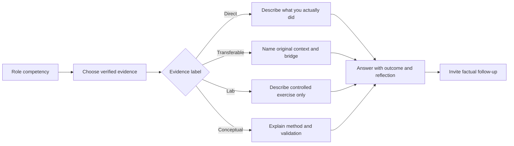

### Evidence labels used throughout

| Label | Plain meaning | Interview-safe sentence | Unsafe leap to avoid |
|---|---|---|---|
| **Direct** | You personally performed the work in a real relevant environment and can defend the details | “In my Microsoft 365 support work, I personally...” | Turning team capability into personal ownership |
| **Transferable** | A real skill was demonstrated in a different context and is relevant to the new task | “The direct context was a SharePoint/OneDrive escalation; the transferable consulting skill was...” | Calling support work a formal cyber assessment or SOC response |
| **Lab** | You practiced a capability in a controlled environment with synthetic data | “I tested that workflow in a lab using...” | Calling it a production tenant rollout |
| **Capstone** | You reasoned through a fictional end-to-end engagement | “In my fictional capstone, I designed...” | Calling the fictional organization a client |
| **Conceptual** | You can explain the architecture and a safe validation method | “Conceptually, I would begin by...” | Claiming hands-on ownership because the answer is detailed |
| **Unknown/unverified** | The source material does not prove the detail | “I would need to verify that detail; what I can say is...” | Guessing a number, date, title, causal result, or responsibility |

---

## 2. STAR, CAR, PARADE, and choosing the right structure

### Core terms from zero

| Term | Plain meaning | Why it matters | Memory hook |
|---|---|---|---|
| **STAR** | Situation, Task, Action, Result | Gives enough context, makes personal responsibility clear, and closes with evidence | “Scene, assignment, moves, outcome.” |
| **CAR** | Challenge, Action, Result | A shorter structure for fast follow-ups or simple examples | “Problem, response, proof.” |
| **PARADE** | Problem, Anticipated consequence, Role, Action, Decision rationale, End result | Useful when judgment, risk, and tradeoffs matter | “Problem, stakes, ownership, moves, why, outcome.” |
| **Reflection** | What you learned and changed after the event | Shows growth rather than a frozen success story | “Result says what happened; reflection says what changed in me.” |
| **Probe** | A follow-up question testing detail or ownership | Reveals whether the story is real and understood | “Expect the interviewer to zoom in.” |
| **Evidence boundary** | The line between verified fact and inference | Protects credibility and confidentiality | “Label the proof before telling the story.” |

### Framework comparison

| Framework | Best use | Suggested balance | Strength | Common failure |
|---|---|---:|---|---|
| STAR | Most behavioral prompts | S 15%, T 10%, A 55%, R 20% | Familiar and complete | Spending 70% on background |
| CAR | A 30-60 second follow-up | C 20%, A 55%, R 25% | Fast and direct | Hiding the candidate's exact task |
| PARADE | Risk, ethics, incident, conflict, or consulting judgment | P+A 20%, R 10%, A+D 50%, E 20% | Makes stakes and rationale visible | Sounding like a six-item checklist |
| Three-part executive answer | “Why,” strength, gap, or closing | Point, proof, relevance | Memorable and concise | Giving claims without proof |
| Consulting case method | New hypothetical client problem | Clarify, structure, analyze, recommend, validate | Shows thinking under ambiguity | Jumping to a product before scope |

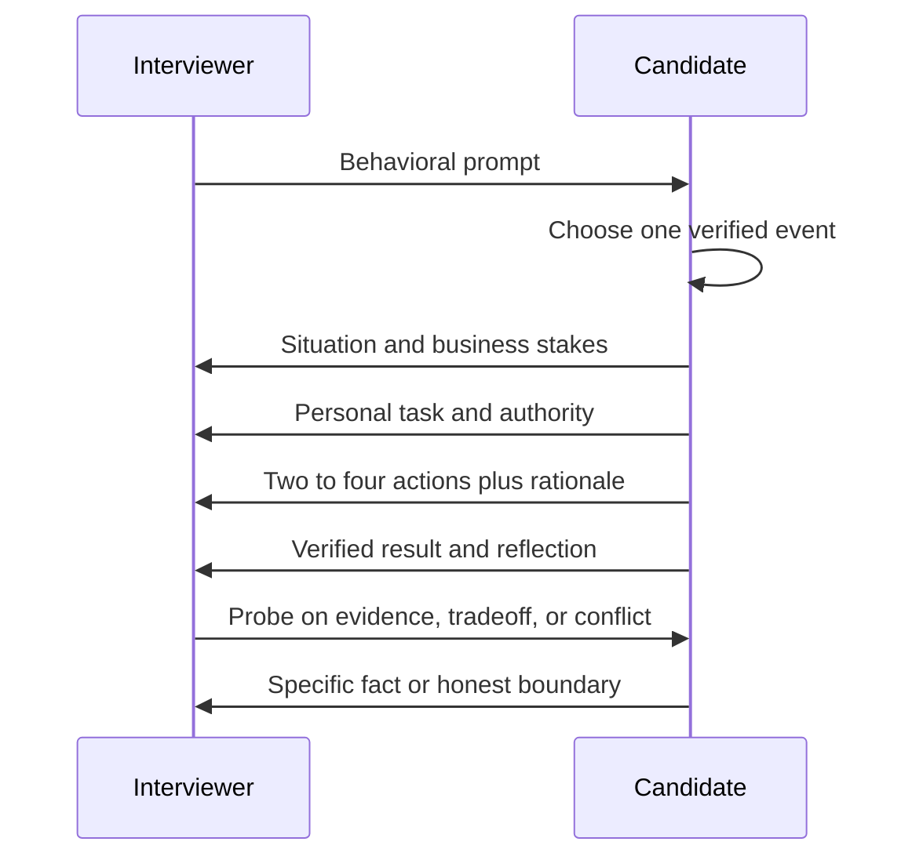

### 🔍 Plain-English deep-dive: STAR is a lens, not a script

STAR is sometimes taught as four boxes to recite. That creates artificial answers because normal speech does not announce “Situation ... Task ... Action ... Result.” The real purpose is simpler: help the listener understand **what was happening, what you owned, what you did, and what changed**.

Think of a camera. Situation is the wide shot, Task focuses on your responsibility, Action follows your decisions, and Result shows the final frame. If the wide shot lasts too long, the interviewer never sees you work. If the result is missing, the story ends before the evidence appears. If the actions use only “we,” personal contribution stays out of frame.

A natural version might sound like this:

> “A business-critical Microsoft 365 issue had `[Fill in: verified impact and scope]`. I was responsible for `[Fill in: exact responsibility]`. I first `[Fill in: action and reason]`, then coordinated `[Fill in: verified parties]` around `[Fill in: evidence or decision]`. When `[Fill in: new signal]` changed the hypothesis, I `[Fill in: adjustment]`. The verified outcome was `[Fill in: result]`. The lesson I carried forward was `[Fill in: reflection]`.”

The labels disappear in delivery, but the logic remains. That is the difference between preparing a story and memorizing a paragraph.

### Choosing a story

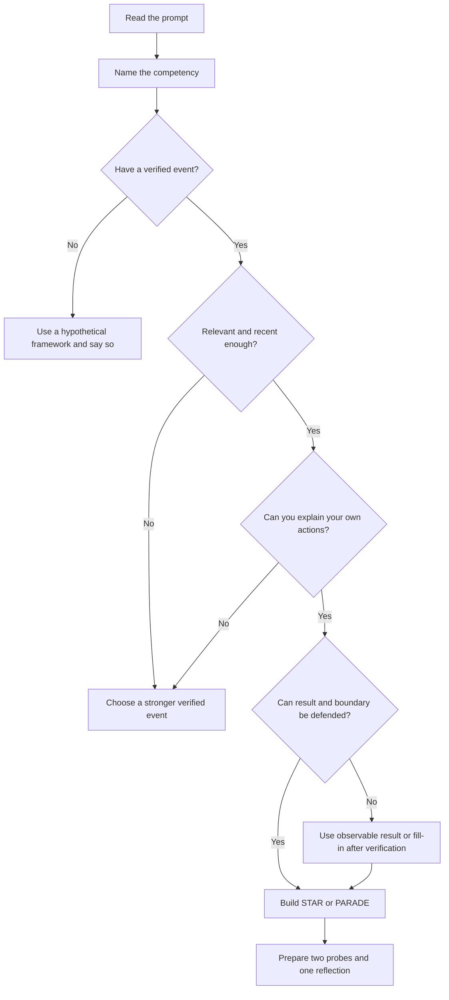

| Selection test | Strong story | Weak story | Repair |
|---|---|---|---|
| Relevance | Demonstrates the competency directly | Interesting event with no connection | State the competency first, then choose again |
| Ownership | You can name your task, actions, and limits | The team did everything | Isolate one decision, analysis, communication, or artifact you owned |
| Evidence | Result is documented or honestly observable | Dramatic but unverifiable | Use a bounded observation or leave a fill-in slot |
| Complexity | Contains a decision, constraint, or adjustment | Routine task with no judgment | Choose a moment involving tradeoffs or learning |
| Safety | Can be discussed without confidential details | Requires customer identity or sensitive data | Generalize identity and redact operational specifics |
| Follow-up resilience | You can answer “why,” “what evidence,” and “what changed?” | Only polished headline is remembered | Rebuild from actual notes and chronology |

### Answer length and compression

| Interview moment | Target length | Content | Stop rule |
|---|---:|---|---|
| Opening “tell me about yourself” | 75-90 seconds | Present, verified evidence, role bridge, motivation | Stop after why this role now |
| Standard behavioral story | 90-120 seconds | STAR with two to four actions and reflection | Stop after relevance sentence |
| Complex incident/leadership story | Up to 2 minutes | PARADE, timeline, decision rationale, result | Offer deeper detail rather than preloading it |
| Rapid follow-up | 30-45 seconds | CAR or direct evidence | Answer exactly the probe |
| Consulting case opening | 45-60 seconds | Clarifying questions and structure | Ask permission to proceed |
| Closing answer | 45-60 seconds | Fit, evidence, gap honesty, interest | Do not restart the biography |

A useful compression method is **headline, proof, relevance**:

1. **Headline:** “My strongest evidence for leadership without authority is technical SME work during complex M365 escalations.”
2. **Proof:** Give one verified event using STAR.
3. **Relevance:** “That is the same coordination discipline I would bring to a cross-domain security workstream, while using review for products where my experience is lab-based.”

### Result evidence without invention

| Result type | Acceptable when verified | Example skeleton | Caution |
|---|---|---|---|
| Quantitative | Source record supports number and context | “The documented CSAT results are recorded per segment.” | Do not claim sole causation or combine periods unless the CV proves it |
| Recognition | Award/recognition is documented | “The CV records repeated peer and customer recognition.” | Do not convert recognition count into a business metric |
| Operational | Restoration, validated fix, accepted handoff, reduced recurrence | “The fix was validated through `[Fill in: actual validation]`.” | Do not invent time saved or recurrence rate |
| Adoption | People used a KB, training, workflow, or practice | “The artifact was used by `[Fill in: verified audience]`.” | Creation alone does not prove adoption |
| Decision | Stakeholders approved a recommendation or selected an option | “The accountable owner chose `[Fill in]` after reviewing `[Fill in]`.” | Facilitation is not approval authority |
| Learning | A durable behavior, checklist, or escalation threshold changed | “Afterward I changed `[Fill in: personal/team practice]`.” | Reflection must be real, not a generic slogan |

### Reflection and follow-up preparation

| Probe | What a credible answer contains | Preparation prompt |
|---|---|---|
| “What did you personally do?” | First-person actions and explicit team boundaries | `[Fill in: three actions only you performed]` |
| “Why did you choose that approach?” | Alternatives, evidence, risk, authority | `[Fill in: option rejected and reason]` |
| “What was the hardest part?” | Real constraint, not theatrical difficulty | `[Fill in: technical, people, time, or authority constraint]` |
| “What went wrong?” | Honest change in hypothesis or execution | `[Fill in: signal that forced adjustment]` |
| “How did you measure success?” | Verified metric, acceptance test, or observable result | `[Fill in: source and definition]` |
| “What would you do differently?” | Specific improvement without disowning the result | `[Fill in: earlier action/check/communication]` |
| “How is that relevant to security consulting?” | Transferable competency plus explicit gap boundary | `[Fill in: bridge, then label Direct/Lab/Conceptual]` |

### Avoiding memorized or artificial delivery

| Artificial pattern | Why it fails | Natural alternative |
|---|---|---|
| Reciting identical wording every time | Breaks when interrupted and sounds borrowed | Memorize five anchors: stakes, task, action 1, action 2, result/reflection |
| Announcing STAR labels | Focuses on format rather than conversation | Use transitions such as “My responsibility was...” |
| Packing in every achievement | Makes evidence shallow and self-promotional | One prompt, one event, one main competency |
| Using “we” for every action | Hides contribution | Alternate accurately: “The team owned X; I owned Y.” |
| Perfect success with no friction | Sounds unrealistic and reveals little judgment | Include one real constraint or changed hypothesis |
| Dramatic invented stakes | Creates credibility and confidentiality risk | State verified business effect at the right level |
| Speaking for four minutes uninterrupted | Prevents dialogue and loses prioritization signal | Give 90 seconds, then invite a probe |
| Ending at resolution | Misses learning and consulting relevance | Add one sentence on reflection and role transfer |

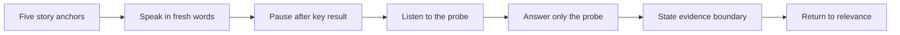

---

## 3. Background-to-competency translation

The interview task is not to disguise support as consulting. It is to translate proven capabilities accurately and show how the missing security-platform depth is being built.

| Verified background evidence | Competency demonstrated | Consulting translation | Security-role relevance | Boundary sentence |
|---|---|---|---|---|
| Business-critical M365 escalations | Accountability under pressure | Scope impact, establish workstreams, maintain decisions and cadence | Useful for service disruption and incident coordination | “The events were M365 support escalations, not automatically cyber incidents.” |
| Customer, partner, engineering, product-group, and vendor coordination | Leadership across boundaries | Map dependencies, owners, evidence requests, and escalation paths | Cross-domain M365 security delivery requires the same alignment | “I coordinated the parties; I did not own every team's decision.” |
| Recurring issue investigation | Pattern recognition and problem management | Move from symptom handling to systemic finding and prioritized remediation | Helps distinguish control gap, configuration, service, and product defect | “I will use one verified issue rather than imply every recurrence became a defect.” |
| Product-defect escalation | Evidence quality and engineering partnership | Present reproducible evidence, business impact, and decision ask | Relevant to Microsoft/vendor escalation during security delivery | “I will not name the defect or customer unless disclosure is permitted.” |
| Fix validation | Test discipline | Define expected behavior, regression scope, and acceptance evidence | Directly transfers to pilot, rollback, and control validation | “Validation scope and exact tests need personal verification.” |
| a strong customer-satisfaction record | Customer outcome signal | Demonstrates sustained customer orientation in the documented context | Relevant to trusted client communication | “The score is documented; I will not claim sole causation.” |
| a strong customer-satisfaction record | Customer outcome signal | Shows customer orientation in a different documented segment | Relevant to adapting communication by audience | “I will verify period, scale, and ownership before using it.” |
| repeated peer and customer recognition | Peer/customer recognition signal | Supports a pattern of contribution recognized by others | Relevant to collaboration and service quality | “Recognition is not a substitute for a specific behavioral event.” |
| sync subject-matter expert evidence | Technical depth and diagnostic leadership | Provide expert review, coach investigations, and clarify product boundaries | Strong workload anchor for OneDrive/SharePoint security and operations | “core-product depth does not equal production ownership of Entra, Intune, Defender, Purview, or Sentinel.” |
| Technical leadership | Influence and quality control | Set investigation direction, review evidence, and enable others | Relevant to Senior Consultant workstream leadership | “The exact authority and team scope must be filled from memory/records.” |
| Mentoring | Capability building | Adapt guidance, observe progress, give feedback | Relevant to client enablement and team development | “Use one real mentee context without identifying the person.” |
| Onboarding | Structured knowledge transfer | Turn tacit knowledge into a repeatable ramp | Relevant to handover and operational readiness | “Do not combine onboarding with mentoring unless they were the same verified event.” |
| Interviews | Evaluation and judgment | Use consistent criteria and evidence while protecting fairness | Relevant to team contribution and leadership | “Do not claim hiring authority unless the CV proves it.” |
| technical-advisor programme | Advisory growth and broader contribution | Translate technical complexity into decisions and coaching | Relevant to trusted-advisor behavior | “Program participation and exact role/outcome need verified detail.” |
| KBs and troubleshooting documents | Reusable knowledge | Create governed artifacts for repeatable operations | Relevant to runbooks, findings, and handover | “Authorship, adoption, and measured benefit are separate facts.” |
| Trainings | Communication and enablement | Teach concepts to a defined audience and check understanding | Relevant to client workshops and adoption | “Use one specific session after verifying topic and audience.” |
| Roadblock calls | Collaborative unblock and escalation | Focus experts on evidence, options, owners, and next steps | Relevant to delivery governance | “Do not merge with case bashes unless they were one event.” |
| Case bashes | Team learning and case-quality improvement | Compare patterns, share diagnostics, and improve consistency | Relevant to knowledge management and problem management | “Verify personal contribution and observed result.” |
| Power Automate/Power Apps a top internal innovation award | Innovation and applied learning | Frame a problem, build/test an approach, communicate value | Transferable to governed security automation | “Do not infer production security automation or invent the winning solution details.” |
| AI/Copilot Studio agents | Learning and low-code agent experience | Think about knowledge, instructions, actions, permissions, and validation | Transferable to governed AI/security-agent discussions | “Exact agent, environment, users, and results require fill-in verification.” |
| AI training | Learning agility and knowledge sharing | Learn, synthesize, teach, and collect feedback | Relevant to fast-changing Microsoft security work | “Training delivered and training attended are different claims; verify which applies.” |
| a leadership-development council | Leadership exposure/contribution | Participate in structured leadership activity | Supports development narrative | “Do not infer executive sponsorship or outcomes.” |
| Global events | Cross-boundary participation | Communicate across geographies and perspectives | Relevant to global client/team environments | “Each event remains separate unless the CV proves a connected program.” |
| an executive roundtable | Executive-level exposure | Listen, prepare concise points, and engage appropriately | Supports executive communication growth | “Attendance does not prove decision authority or a particular exchange.” |
| Awards and recognition | External signal of contribution | Corroborates, but does not replace, behavioral evidence | Useful as a closing proof point | “Name only awards exactly as documented and never invent criteria.” |

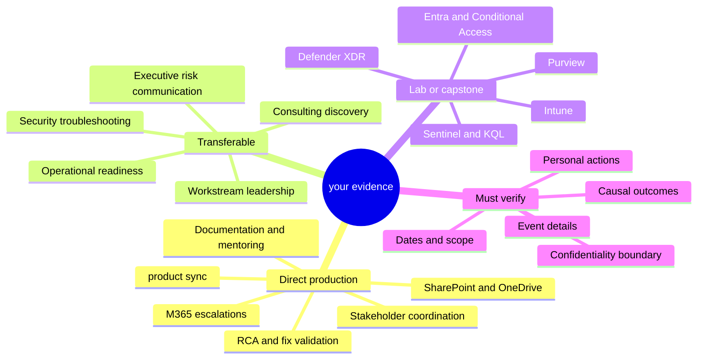

---

## 4. Factual story inventory: keep events separate

This inventory is deliberately granular. A CV bullet may establish that an activity occurred without proving that it occurred in the same incident as another bullet. Combining unrelated facts creates a false story even when every individual fact is true.

| Inventory ID | Verified source-level fact available for preparation | Do not assume | Useful competencies | Required fill-in before use |
|---|---|---|---|---|
| F01 | You handled business-critical Microsoft 365 escalations | Specific customer, outage, security cause, severity, duration, or result | Pressure, ownership, prioritization, communication | One actual event, impact, task, actions, result |
| F02 | You coordinated across customer/partner/engineering/product/vendor boundaries | All parties joined one case or you directed each party | Influence, collaboration, dependency management | Parties in the chosen event and exact ownership |
| F03 | You investigated recurring issues | The issue was a product defect or was eliminated permanently | RCA, pattern recognition, prevention | Pattern, evidence, comparison, conclusion |
| F04 | You escalated product defects | Every defect was found by you or fixed | Engineering rigor, escalation quality | Reproduction, evidence package, your role |
| F05 | You validated fixes | Validation was automated, global, or regression-complete | Testing, quality, risk management | Test cases, environment, acceptance, limitations |
| F06 | The CV records a strong customer-satisfaction record for the enterprise segment | Period, sample, scoring scale, sole ownership, or causation | Customer focus, consistency | Metric definition, period, team/personal attribution |
| F07 | The CV records a strong customer-satisfaction record for the SMB segment | Same work/event as Enterprise score | Audience adaptation, customer focus | Metric definition, period, team/personal attribution |
| F08 | The CV records repeated peer and customer recognition | Every recognition was customer-issued or tied to one role | Credibility, collaboration, sustained contribution | Recognition types and safe wording if known |
| F09 | You have sync subject-matter expert evidence | Formal product ownership beyond documented scope | Technical depth, coaching, troubleshooting | Exact SME duties and one event |
| F10 | You have technical-leadership evidence | Direct line management or approval authority | Leadership without authority, quality | Scope, stakeholders, decision influence |
| F11 | You mentored people | Same event as onboarding or interviewing | Coaching, feedback, inclusion | One person/context, need, actions, result |
| F12 | You supported onboarding | Formal ownership of an onboarding program | Enablement, process design | Audience, content, checkpoints, outcome |
| F13 | You participated in interviews | Final hiring authority or a specific hiring outcome | Judgment, fairness, talent contribution | Role, rubric/process, confidentiality-safe outcome |
| F14 | You participated in a technical-advisor programme | Exact responsibilities, selection criteria, or program result | Advisory mindset, growth | Program context, contribution, learning |
| F15 | You created KB/troubleshooting documentation | Each artifact had measured adoption | Documentation, reuse, operational quality | One artifact, audience, review, use, result |
| F16 | You contributed to trainings | Topic, audience, delivery role, attendance, or measured learning | Communication, enablement | One training and feedback/evidence |
| F17 | You contributed to roadblock calls | Same as case bashes or ownership of every action | Facilitation, unblocking | One call, roadblock, intervention, result |
| F18 | You contributed to case bashes | A single case bash produced a specific product outcome | Pattern sharing, team learning | One session, contribution, observed change |
| F19 | Power Automate/Power Apps Evolve work received top honors | Project details, judging criteria, production deployment, or security use | Innovation, teamwork, learning | Problem, role, build/test, recognition wording |
| F20 | You have AI/Copilot Studio agent activity | Production security-agent deployment or autonomous action | Learning agility, AI governance bridge | Agent purpose, environment, role, tests, limitations |
| F21 | You have AI training activity | Whether attended, created, delivered, or led without verification | Learning and enablement | Exact activity and outcome |
| F22 | You participated in a leadership-development council activity | A promotion, management role, or specific decision | Leadership development | Event, role, contribution, learning |
| F23 | You participated in global events | Same event as council or roundtable | Cross-cultural communication | Event and exact contribution |
| F24 | You participated in a an executive roundtable | Personal sponsorship, commitment, or executive decision | Executive presence, concise communication | Format, preparation, contribution, lesson |
| F25 | The CV records awards/recognition | Names, dates, criteria, or causal outcomes not supplied here | External validation | Exact official name and relevance |

### 🔍 Plain-English deep-dive: true facts can still create a false story

Suppose a CV says a candidate mentored engineers, wrote troubleshooting documents, and earned a recognition. It would be tempting to say, “I wrote a guide, used it to mentor a new engineer, and received an award for the outcome.” That sentence may be false even though all three clauses resemble true CV bullets. The source does not prove they happened together or that one caused another.

The safe method is **event integrity**:

1. Pick one actual event from memory or records.
2. Add only facts that belong to that event.
3. State personal action separately from team action.
4. Treat metrics and recognition as supporting evidence only when their scope and causal relationship are known.
5. If the connection cannot be verified, keep the items as separate examples.

This discipline is especially important in consulting. A client must be able to trust that observations, evidence, inferences, and recommendations have not been blended. Interview honesty is the first demonstration of that professional habit.

---

## 5. Ready-to-adapt STAR story skeletons

The following eleven skeletons satisfy different competencies. They contain only source-level facts and fill-in prompts. Do not use the same skeleton for every question, and do not complete a slot from imagination during the interview.

### Story 1: Business-critical Microsoft 365 escalation

| Field | Ready-to-adapt content |
|---|---|
| Evidence label | **Direct**, once one actual event is verified |
| Verified fact | You handled business-critical Microsoft 365 escalations |
| Competencies | Pressure, ownership, ambiguity, customer communication, prioritization |
| Likely prompts | Difficult customer; high-pressure incident; ambiguity; prioritization; on-call; executive update |
| Situation | `[Fill in: anonymized organization/user group, observable symptom, verified business impact, date/period if safe]` |
| Task | `[Fill in: Your exact responsibility, authority, success condition, and constraints]` |
| Actions | `[Fill in: scope/timeline action]`; `[Fill in: discriminating evidence or hypothesis test]`; `[Fill in: stakeholder/cadence action]`; `[Fill in: escalation or recovery decision]` |
| Result | `[Fill in: verified restoration, workaround, decision, acceptance, or learning; include a metric only if documented]` |
| Reflection | `[Fill in: what you now do earlier or differently]` |
| Evidence boundary | Call it an M365 service/support escalation unless there is verified evidence it was a cybersecurity incident |

**60-second structure:** 10 seconds on impact; 5 on responsibility; 30 on two decisive actions; 10 on result; 5 on reflection.

**Two-minute structure:** Add the first hypothesis, the evidence that changed or confirmed it, the communication cadence, one tradeoff, validation, and the durable follow-up.

**Risks to avoid:** Inventing severity labels, outage duration, customer identity, financial impact, 24x7 ownership, or security cause. Do not say “I restored the service” if another team implemented the fix; say what you did and how the shared outcome was reached.

**Probing questions:** What evidence narrowed scope? What did you do personally? Which action required approval? How was recovery verified? What would you do differently? What information was intentionally withheld or redacted?

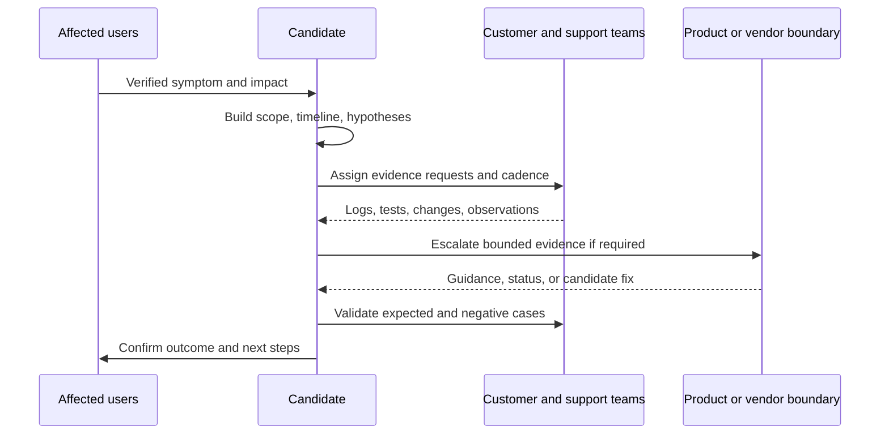

### Story 2: Cross-team coordination without formal authority

| Field | Ready-to-adapt content |
|---|---|
| Evidence label | **Direct** for the chosen coordination event; **Transferable** to consulting |
| Verified fact | You coordinated with customer IT, partners, engineering, product groups, and vendors across your work; the chosen event must identify only parties actually involved |
| Competencies | Leadership without authority, conflict prevention, dependency management, clear ownership |
| Likely prompts | Stakeholder conflict; multivendor issue; leadership; difficult delivery; influencing a decision |
| Situation | `[Fill in: one real event and the parties actually involved]` |
| Task | `[Fill in: coordination responsibility and what decision/outcome was needed]` |
| Actions | `[Fill in: common timeline or evidence baseline]`; `[Fill in: ownership/dependency map]`; `[Fill in: how disagreement was surfaced]`; `[Fill in: decision/escalation path]` |
| Result | `[Fill in: verified decision, resolution, reduced ambiguity, handoff, or accepted action plan]` |
| Reflection | `[Fill in: lesson about influence, listening, or written decisions]` |
| Evidence boundary | Coordination is not authority over each team; do not imply all listed stakeholder types were present in one event |

**60-second structure:** Name the boundary conflict, your coordination objective, two alignment moves, and the verified outcome.

**Two-minute structure:** Add each party's legitimate concern, how facts were separated from assumptions, the options, accountable decision owner, and relationship-preserving follow-up.

**Risks to avoid:** Casting another team as incompetent; claiming sole resolution; saying “vendor issue” before proof; presenting facilitation as final approval.

**Probing questions:** Who disagreed and why? What did you write down? How did you prevent blame? What would happen if a party missed its action? Who owned the final decision?

### Story 3: Recurring issue, product-defect escalation, or fix validation

| Field | Ready-to-adapt content |
|---|---|
| Evidence label | **Direct**, but choose one verified chain and do not assume all three facts belong together |
| Verified facts | You investigated recurring issues, escalated product defects, and validated fixes |
| Competencies | RCA, pattern recognition, engineering rigor, persistence, quality |
| Likely prompts | Difficult root cause; risk others missed; quality improvement; challenging engineering partnership |
| Situation | `[Fill in: one repeated symptom or one defect case; do not combine separate events]` |
| Task | `[Fill in: Your ownership of reproduction, evidence, escalation, or validation]` |
| Actions | `[Fill in: pattern comparison]`; `[Fill in: competing hypotheses]`; `[Fill in: cheap discriminating test]`; `[Fill in: evidence package or test matrix]` |
| Result | `[Fill in: verified defect acknowledgement, fix, workaround, validation, documentation, or limitation]` |
| Reflection | `[Fill in: change to detection, escalation quality, regression scope, or knowledge reuse]` |
| Evidence boundary | A recurring issue is not automatically a product defect; a candidate fix is not validated until expected, negative, and relevant regression behavior is checked |

**60-second structure:** Repetition signal, hypothesis discipline, one decisive test, verified result.

**Two-minute structure:** Add reproduction conditions, evidence quality, boundary coordination, fix-validation matrix, residual risk, and recurrence-prevention step.

**Risks to avoid:** Naming confidential defect IDs, inventing affected-user counts, claiming engineering authored your fix, or saying recurrence was eliminated without records.

**Probing questions:** What evidence proved recurrence? Which hypothesis was falsified? What made the escalation actionable? What did validation not cover? How was the result communicated?

### Story 4: Customer trust, CSAT, and recognition

| Field | Ready-to-adapt content |
|---|---|
| Evidence label | **Direct metric/recognition evidence**, causal story still requires verification |
| Verified facts | The CV records a strong customer-satisfaction record for each supported segment and repeated peer and customer recognition |
| Competencies | Customer focus, communication, consistency, credibility |
| Likely prompts | Greatest achievement; difficult customer; communication style; evidence of service quality |
| Situation | `[Fill in: one customer interaction or a verified period/process behind one metric]` |
| Task | `[Fill in: responsibility for customer outcome or communication]` |
| Actions | `[Fill in: expectation setting]`; `[Fill in: technical-to-business translation]`; `[Fill in: feedback loop]` |
| Result | Use one accurately scoped metric or recognition: `[Fill in: scale, period, segment, and attribution]` |
| Reflection | `[Fill in: what feedback taught you about adapting communication]` |
| Evidence boundary | Do not say the three figures arose from one event or that you alone caused team/segment CSAT |

**60-second structure:** One service principle, one concrete event/action pattern, one accurately defined signal, one lesson.

**Two-minute structure:** Explain how technical quality, expectation management, empathy, and follow-through worked together, then define the metric's scope and limits.

**Risks to avoid:** Treating recognitions as identical, guessing the survey scale, merging Enterprise and SMB periods, or presenting popularity as consulting judgment.

**Probing questions:** What exactly did the score measure? Was it personal or team-level? What behavior did feedback change? Describe one dissatisfied customer without using the aggregate score.

### Story 5: sync subject-matter expert and technical leadership

| Field | Ready-to-adapt content |
|---|---|
| Evidence label | **Direct** for verified product sync work; **Transferable** to workstream leadership |
| Verified facts | You have sync subject-matter expert and technical-leadership evidence |
| Competencies | Expertise, influence, diagnostic coaching, decision quality |
| Likely prompts | Leadership without authority; hardest technical problem; mentoring; quality under pressure |
| Situation | `[Fill in: one event where SME depth was needed]` |
| Task | `[Fill in: exact SME responsibility and authority boundary]` |
| Actions | `[Fill in: questions/evidence requested]`; `[Fill in: technical model explained]`; `[Fill in: coaching or review]`; `[Fill in: decision or escalation]` |
| Result | `[Fill in: verified resolution, improved investigation, knowledge transfer, or decision]` |
| Reflection | `[Fill in: how you balance expertise with curiosity and peer input]` |
| Evidence boundary | Workload SME depth is a strong anchor, not proof of production Entra, Intune, Purview, Defender, or Sentinel ownership |

**60-second structure:** Why expertise was needed, how you made others more effective, result, security-consulting bridge.

**Two-minute structure:** Add technical ambiguity, how you avoided becoming a bottleneck, review/teaching approach, and what the team could do independently afterward.

**Risks to avoid:** Equating SME with product engineering ownership; taking credit for another engineer's execution; burying the leadership signal in sync internals.

**Probing questions:** How did you know your hypothesis was right? How did you communicate to a non-SME? What did you delegate? When did you seek product-group help?

### Story 6: Mentoring, onboarding, or interviewing

| Field | Ready-to-adapt content |
|---|---|
| Evidence label | **Direct**, after choosing exactly one activity/event |
| Verified facts | You have mentoring, onboarding, and interview participation evidence |
| Competencies | Coaching, inclusion, feedback, judgment, team building |
| Likely prompts | Develop someone; give difficult feedback; improve a team; leadership without authority |
| Situation | Choose one: `[Fill in: mentoring event]` **or** `[Fill in: onboarding event]` **or** `[Fill in: interview activity]` |
| Task | `[Fill in: Your exact responsibility and success indicator]` |
| Actions | `[Fill in: baseline/need assessment]`; `[Fill in: tailored guidance or criteria]`; `[Fill in: practice/feedback/checkpoint]` |
| Result | `[Fill in: observed capability, completion, quality, confidence, or process improvement]` |
| Reflection | `[Fill in: lesson about different learning styles, fairness, or feedback]` |
| Evidence boundary | Do not merge the three activities or claim direct management/final hiring authority unless verified |

**60-second structure:** Person/process need, tailored action, evidence of progress, lesson.

**Two-minute structure:** Add how the starting level was assessed, how psychological safety and standards were balanced, and how progress was checked without taking over.

**Risks to avoid:** Revealing personal data; presenting another person's weakness as the story; claiming their later success as your result; discussing protected interview information.

**Probing questions:** What feedback was hard to give? How was understanding checked? What did you change when the first approach did not work? How did you ensure fairness?

### Story 7: technical-advisor programme

| Field | Ready-to-adapt content |
|---|---|
| Evidence label | **Direct participation**, details unverified in this guide |
| Verified fact | The CV includes technical-advisor programme evidence |
| Competencies | Trusted advice, growth, communication, broader impact |
| Likely prompts | Career development; influencing; learning fast; why consulting |
| Situation | `[Fill in: program purpose and your verified participation context]` |
| Task | `[Fill in: selected/assigned responsibility, without guessing criteria]` |
| Actions | `[Fill in: advisory activity]`; `[Fill in: preparation or collaboration]`; `[Fill in: feedback applied]` |
| Result | `[Fill in: verified contribution, learning, artifact, or observed impact]` |
| Reflection | `[Fill in: how the experience shaped consulting interest or communication]` |
| Evidence boundary | Program title alone does not prove scope, seniority, selection reason, client authority, or measurable outcome |

**60-second structure:** Program context, one contribution, one result/lesson, role relevance.

**Two-minute structure:** Add the advisory challenge, stakeholders, how recommendations were grounded, feedback, and change in your practice.

**Risks to avoid:** Inflating participation into program leadership; implying confidential access; inventing executive sponsorship.

**Probing questions:** What did “advisor” mean in that program? What changed because of your input? What feedback did you receive? How is it relevant to client consulting?

### Story 8: KB, troubleshooting document, training, roadblock call, or case bash

| Field | Ready-to-adapt content |
|---|---|
| Evidence label | **Direct**, after selecting one artifact or event |
| Verified facts | You contributed to KBs, troubleshooting documents, trainings, roadblock calls, and case bashes |
| Competencies | Knowledge reuse, facilitation, operational quality, communication |
| Likely prompts | Process improvement; documentation adopted; team enablement; recurring problem |
| Situation | Select one only: `[Fill in: artifact/event and user problem]` |
| Task | `[Fill in: authorship, facilitation, review, or delivery responsibility]` |
| Actions | `[Fill in: audience/evidence discovery]`; `[Fill in: structure or facilitation choice]`; `[Fill in: review/test]`; `[Fill in: adoption or follow-up]` |
| Result | `[Fill in: verified use, decision, quality improvement, reduced confusion, or learning]` |
| Reflection | `[Fill in: maintenance, accessibility, feedback, or retirement lesson]` |
| Evidence boundary | Creating content does not prove adoption; attending an event does not prove facilitation; keep each event separate |

**60-second structure:** Operational pain, reusable intervention, verified use/result, maintenance lesson.

**Two-minute structure:** Add audience analysis, technical review, versioning, feedback, limitations, and how the practice transfers to client runbooks/handover.

**Risks to avoid:** Invented time savings, usage counts, or ownership; exposing internal troubleshooting details; listing five artifacts instead of telling one story.

**Probing questions:** Who was the user? How was accuracy reviewed? How did you know it helped? Who maintained it? What did you remove to keep it usable?

### Story 9: Power Automate/Power Apps a top internal innovation award

| Field | Ready-to-adapt content |
|---|---|
| Evidence label | **Direct project/recognition evidence**, exact project details require verification |
| Verified fact | The CV records Power Automate/Power Apps a top internal innovation award |
| Competencies | Innovation, learning, teamwork, solution framing, communication |
| Likely prompts | Achievement; learning quickly; innovation; ambiguous problem; teamwork |
| Situation | `[Fill in: Evolve challenge, problem, users, constraints, and whether team/individual]` |
| Task | `[Fill in: Your exact role and deliverable]` |
| Actions | `[Fill in: discovery/design]`; `[Fill in: Power Automate or Power Apps work actually performed]`; `[Fill in: test/feedback]`; `[Fill in: presentation]` |
| Result | “Received top honors” only with `[Fill in: exact documented wording/category]`; add no operational metric unless verified |
| Reflection | `[Fill in: lesson about rapid prototyping, governance, or explaining value]` |
| Evidence boundary | Do not call the solution production security automation or invent judges, users, metrics, connectors, data, or award criteria |

**60-second structure:** Challenge, personal contribution, test/iteration, exact recognition, learning.

**Two-minute structure:** Add design alternatives, team roles, validation limits, governance considerations, and how the learning transfers to approval-based security automation.

**Risks to avoid:** Describing a prototype as deployed service; claiming both technologies if only one was used in the chosen project; inventing business savings.

**Probing questions:** What did you build? What failed first? How was it tested? What made the solution useful? What security/privacy controls would production require?

### Story 10: AI/Copilot Studio agent or AI training

| Field | Ready-to-adapt content |
|---|---|
| Evidence label | **Direct activity** where documented; security-agent relevance is **Transferable/Conceptual** |
| Verified facts | The CV records AI/Copilot Studio agent activity and AI training activity; they may be separate events |
| Competencies | Learning agility, responsible innovation, communication, validation |
| Likely prompts | Learn quickly; emerging technology; innovation risk; teaching others; responsible AI |
| Situation | Choose one verified event: `[Fill in: agent activity]` **or** `[Fill in: AI training activity]` |
| Task | `[Fill in: build, learn, deliver, facilitate, or participate responsibility]` |
| Actions | `[Fill in: authoritative learning]`; `[Fill in: prompt/knowledge/action design or training design]`; `[Fill in: validation and human review]`; `[Fill in: feedback]` |
| Result | `[Fill in: verified artifact, completion, learning, adoption, recognition, or limitation]` |
| Reflection | `[Fill in: lesson about hallucination, permissions, privacy, or human accountability]` |
| Evidence boundary | Do not claim Security Copilot, autonomous production action, client data, or production security integration unless separately evidenced |

**60-second structure:** Learning objective, disciplined action, validated result, responsible-AI lesson.

**Two-minute structure:** Add data/permission boundary, failure tests, user feedback, limitation, and security-governance bridge.

**Risks to avoid:** Merging agent work with training; claiming model accuracy without measurement; exposing prompt/data details; treating generated output as evidence.

**Probing questions:** What was the agent allowed to access or do? How was output verified? What did you teach or learn? What would prevent production use?

### Story 11: Leadership council, global event, an executive roundtable, or award

| Field | Ready-to-adapt content |
|---|---|
| Evidence label | **Direct participation/recognition**, exact event details require verification |
| Verified facts | The CV includes a leadership-development council, global-event, CVP-roundtable, and award/recognition evidence; these are not assumed to be one story |
| Competencies | Executive presence, cross-cultural communication, leadership growth, listening |
| Likely prompts | Executive communication; leadership potential; proud achievement; diverse stakeholders |
| Situation | Choose exactly one: `[Fill in: council event]`, `[Fill in: global event]`, `[Fill in: roundtable]`, or `[Fill in: award]` |
| Task | `[Fill in: preparation, contribution, participation, or response expected]` |
| Actions | `[Fill in: listening/research]`; `[Fill in: concise contribution]`; `[Fill in: follow-up or applied learning]` |
| Result | `[Fill in: verified learning, connection, action, or exact recognition]` |
| Reflection | `[Fill in: lesson about executive brevity, perspective, or inclusive participation]` |
| Evidence boundary | Attendance is not leadership authority; an award is not a story until the underlying behavior is verified; keep events separate |

**60-second structure:** Event context, one purposeful contribution, outcome/learning, role relevance.

**Two-minute structure:** Add preparation, audience, how you adjusted detail, one challenging question, follow-up, and changed practice.

**Risks to avoid:** Inventing what a CVP said; implying personal sponsorship; joining separate events into a leadership campaign; using prestige instead of action.

**Probing questions:** What did you contribute? How did you prepare? What feedback or perspective changed your thinking? How did you apply it later?

### Story-bank preparation tracker

| Story | Event verified | Personal actions verified | Result source verified | Confidentiality checked | 60-sec spoken | 2-min spoken | Two probes practiced |
|---|---:|---:|---:|---:|---:|---:|---:|
| 1. Critical escalation | ☐ | ☐ | ☐ | ☐ | ☐ | ☐ | ☐ |
| 2. Cross-team coordination | ☐ | ☐ | ☐ | ☐ | ☐ | ☐ | ☐ |
| 3. Recurrence/defect/validation | ☐ | ☐ | ☐ | ☐ | ☐ | ☐ | ☐ |
| 4. Customer trust/CSAT | ☐ | ☐ | ☐ | ☐ | ☐ | ☐ | ☐ |
| 5. sync subject-matter expert | ☐ | ☐ | ☐ | ☐ | ☐ | ☐ | ☐ |
| 6. Mentoring/onboarding/interview | ☐ | ☐ | ☐ | ☐ | ☐ | ☐ | ☐ |
| 7. technical advisor | ☐ | ☐ | ☐ | ☐ | ☐ | ☐ | ☐ |
| 8. Knowledge enablement | ☐ | ☐ | ☐ | ☐ | ☐ | ☐ | ☐ |
| 9. a top internal innovation award | ☐ | ☐ | ☐ | ☐ | ☐ | ☐ | ☐ |
| 10. AI/agent/training | ☐ | ☐ | ☐ | ☐ | ☐ | ☐ | ☐ |
| 11. Leadership event/recognition | ☐ | ☐ | ☐ | ☐ | ☐ | ☐ | ☐ |

---

## 6. Behavioral and closing prompts with model frameworks

These prompts complement [Part 73 Q181-Q205](Part-73-interview-question-bank.md). Model answers use only verified high-level facts. Bracketed text must be personalized before use. A model answer is a shape, not a speech to memorize.

### Q1. Tell me about yourself.

**Model answer:**

> “I am a Microsoft 365 support and escalation professional with several years of enterprise-support experience, with my deepest production strength in SharePoint Online, OneDrive, and synchronization. My work has involved business-critical escalations, root-cause investigation, coordination across customers, partners, engineering, product groups, and vendors, fix validation, technical guidance, documentation, mentoring, and business-review communication. I have also built experience through Power Automate, Power Apps, Copilot Studio and AI-related learning or activities documented in my CV. I am now deliberately moving toward Microsoft 365 security consulting because the work combines the parts I enjoy most: turning ambiguous risk or service problems into evidence, aligning stakeholders, designing a safe path, validating outcomes, and leaving reusable knowledge. My production security-platform depth in Entra, Intune, Purview, Defender, and Sentinel is still developing, so I present that work as lab or conceptual rather than production. This role is attractive because it joins my real M365 operating depth with the broader identity, endpoint, data, detection, and consulting capability I am building.”

Personalize: `[Fill in: exact current title/employer wording permitted]`; `[Fill in: one signature verified example]`; `[Fill in: one sentence on why now]`.

### Q2. Why cybersecurity?

**Model answer:**

> “Cybersecurity appeals to me because it adds an explicit risk and trust lens to work I already value. In Microsoft 365 support, permissions, identity context, data exposure, service resilience, change safety, and evidence quality are not abstract; they affect whether people can collaborate safely and whether an organization can understand what happened. My direct background is not a production SOC or full security-platform role, and I would not describe it that way. The move is a deliberate expansion from solving complex M365 operational problems into designing and validating preventive, detective, responsive, and recovery controls across identity, endpoints, collaboration, data, and SecOps. I am motivated by the combination of technical depth, customer judgment, and continuous learning.”

Add one verified bridge: `[Fill in: permissions, escalation, compliance-aligned guidance, or fix-validation event]`.

### Q3. Why consulting?

**Model answer:**

> “The strongest parts of my background are already consultative: clarifying an unclear problem, identifying the right evidence, coordinating teams with different responsibilities, explaining technical findings to customers, recommending next steps, validating a fix, and making the learning reusable. Consulting broadens that motion from restoring or improving a service into discovery, assessment, architecture, roadmap, deployment, operational readiness, and measurable improvement. I like that the answer cannot simply be a product list; it must fit the client's risks, constraints, users, skills, licenses, and operating model. I am moving into consulting with a strong M365 production foundation and with honest lab-based development in the named security platforms.”

Avoid saying support and consulting are identical. Name the added disciplines and the learning plan.

### Q4. Why Deloitte?

**Model answer:**

> “My answer is based on the supplied public role description and Deloitte's public purpose and values, not on assumptions about internal methods. The role brings together enterprise security, secure-by-design thinking, cloud transformation, orchestration and automation, and Cyber Operate outcomes across the full client lifecycle. That combination fits how I work: evidence-led troubleshooting, customer communication, cross-team coordination, knowledge transfer, and deliberate technical growth. Deloitte's public emphasis on making an impact that matters also resonates when translated into practical work: controls should reduce meaningful risk, remain usable, and become operable by the client. I would bring deep SharePoint/OneDrive and M365 escalation experience while learning from formal cyber consulting delivery and contributing honestly within my current evidence boundary.”

Before use: `[Fill in: exact current job-posting wording]`; `[Fill in: one current official Deloitte public theme discussed by interviewer]`. Do not claim culture, projects, clients, training, promotion, travel, or team practices that have not been verified.

### Q5. Why are you leaving, or why make this move now?

**Model framework:**

1. Appreciate the genuine foundation: “My current path has given me `[Fill in: verified M365 depth and growth]`.”
2. Name the forward pull, not a complaint: “I now want broader ownership across `[Fill in: security consulting lifecycle]`.”
3. Show preparation: “I am building that breadth through `[Fill in: completed, verifiable labs/study only]`.”
4. Connect to the role: “This role offers the scope described in the supplied JD.”
5. Stay neutral about the current employer, manager, compensation, or promotion.

**Model answer:**

> “I am grateful for the Microsoft 365 depth I have built through complex support, technical leadership, customer work, and continuous improvement. The move is driven by what I want to grow toward: using that operating experience earlier in the lifecycle, from security discovery and assessment through architecture, safe deployment, and handover. I have been building the missing identity, endpoint, data-security, XDR, and SIEM foundations through structured learning and labs, while keeping production and lab claims separate. I am looking for a role where that combination is relevant and where I can continue to develop under strong technical and delivery review.”

### Q6. Why this Microsoft 365 Security Senior Consultant role?

**Model answer:**

> “It connects three things that fit my experience and direction. First, it requires real Microsoft 365 workload understanding, where SharePoint, OneDrive, sync, permissions, service behavior, and customer impact are direct strengths. Second, it requires consulting behaviors I have demonstrated in support: ambiguity reduction, RCA, stakeholder coordination, risk communication, documentation, mentoring, and fix validation. Third, it expands into the integrated security stack I am deliberately building: Entra, Intune, Purview, Defender XDR, Sentinel, and governed automation. I would enter with a useful production anchor, not as someone claiming every product already, and I would apply a disciplined evidence, pilot, test, rollback, and handover method.”

### Q7. Why should we hire you despite gaps?

**Model answer:**

> “The gap is real: my CV does not establish production ownership of Entra Conditional Access, Intune, Purview, Defender XDR, or Sentinel. I would rather make that visible than let a detailed lab answer imply experience I do not have. What I bring immediately is several years of Microsoft 365 enterprise support and escalation experience, deep SharePoint/OneDrive and sync knowledge, business-critical issue ownership, disciplined RCA, multi-party coordination, customer communication, fix validation, documentation, mentoring, automation learning, and a record that includes strong CSAT and recognition signals. Those are difficult-to-teach foundations for client delivery. I am pairing them with structured product study, labs, a fictional capstone, and an explicit habit of asking for review and validating in controlled stages. The value proposition is credible M365 operating depth, consulting-ready behaviors, and transparent, fast development in the security stack.”

### Q8. What is your production gap across Entra, Intune, Purview, Defender, and Sentinel?

**Model answer:**

> “My production evidence is strongest in Microsoft 365 support, SharePoint Online, OneDrive, synchronization, permissions, critical escalation, RCA, and cross-team delivery. The CV does not establish production implementation or long-term operational ownership of Entra Conditional Access, Intune, Purview, Defender, or Sentinel. For those products I separate three levels: I can explain the architecture and risks; I can show lab or fictional-capstone methods where actually completed; and I would use current official guidance, tenant evidence, peer review, pilots, positive and negative tests, monitoring, and rollback before production change. The adjacent strengths are highly relevant, but I do not convert adjacency into tenure. I would also ask where the team expects immediate independence versus supervised growth so we can align the ramp plan honestly.”

Follow-up matrix:

| Product/domain | Honest current label from supplied evidence | Strong bridge | What not to claim |
|---|---|---|---|
| Entra/Conditional Access | Lab/conceptual | Identity context, access/permissions troubleshooting, safe testing | Production policy ownership |
| Intune | Lab/conceptual | Endpoint/user-journey troubleshooting method | Fleet administration or rollout |
| Purview | Lab/conceptual | SharePoint/OneDrive content, permissions, compliance-aligned guidance | Production DLP/records/eDiscovery ownership |
| Defender XDR | Lab/conceptual | Incident timeline, RCA, customer/product coordination | SOC or XDR incident-command tenure |
| Sentinel/KQL/SOAR | Lab/conceptual | Evidence analysis plus Power Platform automation foundation | Production SIEM engineering or on-call SOC ownership |

### Q9. Tell me about a failure or mistake.

**Model framework:** Use a genuine, bounded event. Do not invent one for this guide.

> “In `[Fill in: verified context]`, I made/failed to make `[Fill in: specific decision or action]`. The impact was `[Fill in: factual impact without exaggeration]`. I recognized it through `[Fill in: signal]` and disclosed/escalated it to `[Fill in: appropriate party]`. I corrected the immediate issue by `[Fill in]`, then examined contributing factors such as `[Fill in]`. The durable change was `[Fill in: checklist, review, test, documentation, escalation threshold, or communication practice]`. Since then, `[Fill in: evidence the behavior changed]`. My lesson was `[Fill in: precise reflection]`.”

Choose a mistake that shows accountability but does not reveal confidential data or create an unmitigated integrity, safety, or legal concern. Avoid fake weaknesses such as “I cared too much.” Cross-reference Part 73 Q185 and Q195.

### Q10. Tell me about a conflict.

**Model framework:**

> “During `[Fill in: one verified event]`, `[Fill in: stakeholder A]` and `[Fill in: stakeholder B]` differed on `[Fill in: requirement, hypothesis, priority, or ownership]`. My role was `[Fill in]`. I first listened separately/jointly to identify the underlying needs, then wrote down the shared facts, open assumptions, and decision required. I used `[Fill in: evidence/test]` to reduce technical disagreement and presented `[Fill in: options/tradeoffs]` to the accountable owner. The decision was `[Fill in]`, and the relationship/outcome was `[Fill in]`. I learned `[Fill in]`.”

The goal is not to “win.” Show respect, evidence, traceability, and appropriate decision authority. If the event was only technical disagreement, call it that rather than dramatizing interpersonal conflict.

### Q11. Tell me about ambiguity.

**Model framework:** Use Story 1, 2, or 3 after verification.

> “The initial request was `[Fill in: vague symptom/request]`, but key facts such as `[Fill in: scope, timeline, ownership, expected behavior]` were unknown. I defined the decision we needed, separated observations from assumptions, and asked `[Fill in: two high-value questions]`. I built `[Fill in: timeline/reproduction/comparison]`, prioritized hypotheses by `[Fill in: impact/evidence/test cost]`, and assigned clear owners. The evidence showed `[Fill in]`, leading to `[Fill in: action]`. The result was `[Fill in]`, and I now begin ambiguous work by `[Fill in: durable method]`.”

### Q12. Tell me about a difficult customer.

**Model framework:**

> “A customer was understandably concerned because `[Fill in: verified impact and unmet expectation]`. I avoided labeling the person as difficult and focused on the situation. I acknowledged `[Fill in: concern]`, clarified what was known and unknown, agreed the next update time, and translated the investigation into `[Fill in: business-relevant choices/actions]`. When `[Fill in: constraint or bad news]` emerged, I communicated it directly with options rather than overpromising. The outcome was `[Fill in: verified resolution/decision/trust signal]`. The experience reinforced `[Fill in: lesson about empathy plus precision]`.”

Do not use CSAT as a shortcut. One difficult-customer answer needs one actual event and defensible behavior.

### Q13. Tell me about leadership without authority.

**Model framework:** Use Story 2 or 5.

> “In `[Fill in: verified event]`, I did not manage `[Fill in: teams/people]`, but the work needed a common technical direction. I created influence by `[Fill in: evidence, expertise, facilitation, or clear artifact]`, invited challenge from `[Fill in]`, and made ownership visible through `[Fill in: action/decision tracker]`. Where I lacked authority, I escalated the decision to `[Fill in: accountable role]` with options and consequences. The result was `[Fill in]`. I learned that leadership without authority is not louder persuasion; it is making the right next action easier to understand and own.”

### Q14. How do you prioritize competing work?

**Model answer plus personal proof slot:**

> “I prioritize using business impact, security or service risk, urgency, affected scope, dependency, reversibility, evidence quality, and time to the next safe decision. I separate immediate stabilization from root-cause work and prevent every request from becoming priority one. I make deferrals visible, assign owners, set update points, and revisit priority when evidence changes. In `[Fill in: verified escalation/backlog event]`, that meant `[Fill in: what came first and why]`, while `[Fill in: what was deferred and how risk was communicated]`. The result was `[Fill in]`.”

Cross-reference [Part 56](Part-56-target-controls-licensing-roadmaps-business-case.md), [Part 62](Part-62-resilience-oncall-shift-handover.md), and Part 73 Q184.

### Q15. Are you comfortable with 24x7 rotation, shifts, and on-call?

**Model framework with preference placeholders:**

> “I understand from the supplied role description that the work may include rotational nights, weekends, holidays, and on-call assignments. My availability and constraints are `[Fill in: truthful preferences/commitments; do not use a prepared answer that is not true]`. Operationally, I take on-call seriously: readiness requires access, monitoring, severity definitions, runbooks, escalation paths, communication cadence, safe emergency change, rollback, and a complete handover, not only willingness to answer a phone. In my direct M365 escalation experience, `[Fill in: verified relevant pressure/handover example]`. I would confirm the actual rotation, notice, location, travel, labor terms, recovery time, and expectations before committing.”

Never promise unlimited availability. A professional answer is honest about constraints and shows operational discipline.

### Q16. How would you handle an ethics or privacy concern?

**Model answer:**

> “I would first avoid making a legal or ethical ruling outside my authority. I would pause or constrain the questionable action when safe and authorized, preserve necessary evidence, clarify purpose and scope, minimize access and data, and involve the appropriate security, privacy, legal, HR, data-owner, or engagement leadership roles. I would document the decision and prevent retaliation or unnecessary disclosure. For example, a DLP or insider-risk request should not become unrestricted employee surveillance: it needs a legitimate purpose, proportionality, role separation, retention, audit, and human review. If instructed to conceal a material issue, bypass an approved control, or use data outside authorization, I would state the concern, refuse unsafe action, and use the formal escalation route. `[Fill in: only add a personal example if a genuine, disclosable event exists]`.”

### Q17. Tell me about learning a new technology quickly.

**Model framework:** Use Story 9 or 10 after verification.

> “I needed to learn `[Fill in: actual technology/topic]` for `[Fill in: verified objective]`. I bounded the goal, used `[Fill in: authoritative source/training]`, built or practiced `[Fill in: safe exercise]`, and tested my understanding through `[Fill in: output, review, demo, or failure case]`. I asked `[Fill in: expert/peer]` to challenge the result and documented `[Fill in: reusable learning]`. The verified outcome was `[Fill in]`. The method I now reuse is: define the outcome, learn from authoritative material, apply it safely, test both success and failure, seek review, and explain limitations.”

Mention a top internal innovation award or AI/Copilot Studio activity only when the chosen event and exact contribution are verified.

### Q18. How do you communicate with executives?

**Model answer plus proof slot:**

> “I begin with the decision, business impact, current risk, confidence, and required action; I keep technical evidence available beneath that summary. A useful executive update answers: what happened, who or what is affected, what is being done, what decision or support is needed, when the next update will arrive, and what remains uncertain. I avoid false precision and translate product detail into resilience, exposure, user impact, cost, compliance, or delivery risk. My background includes business reviews and leadership-facing activities documented in the CV. A specific example is `[Fill in: verified business review, global event, leadership council, or roundtable event]`, where I `[Fill in: personal action]` and the result was `[Fill in]`.”

Do not imply that attendance at a an executive roundtable proves executive decision authority.

### Q19. Describe a major achievement.

**Model framework:** Choose one, not a collage.

> “One achievement I am proud of is `[Fill in: a top internal innovation award, a specific verified recognition, an SME contribution, or another source-backed event]`. The challenge was `[Fill in]`, and my role was `[Fill in]`. I contributed by `[Fill in: two or three concrete actions]`. The verified result was `[Fill in: exact recognition/outcome]`. I value it because `[Fill in: competency and impact]`, and it changed how I approach `[Fill in]`.”

Do not answer by listing CSAT, repeated peer and customer recognition, innovation awards, leadership events, and recognitions together. Depth is more credible than accumulation.

### Q20. What is your greatest strength?

**Model answer:**

> “My strongest relevant capability is turning complex Microsoft 365 problems into structured evidence and coordinated action. The technical anchor is SharePoint Online, OneDrive, and synchronization, but the broader pattern is scoping impact, building a timeline, testing hypotheses, aligning customer and product boundaries, communicating clearly, validating the outcome, and documenting what should be reused. `[Fill in: one verified 20-second example]`. That strength transfers well to security consulting, where ambiguity and cross-team dependencies are constant. I combine it with an important boundary: for products where my experience is lab-based, I seek review and validate rather than relying on confidence alone.”

### Q21. What is a development area?

**Model answer:**

> “My clearest development area for this role is breadth of production delivery across Entra Conditional Access, Intune, Purview, Defender XDR, and Sentinel. I understand the concepts and am building hands-on lab and capstone evidence, but I do not present that as production tenure. My plan is product-by-product: current official study, controlled implementation, positive and negative tests, troubleshooting evidence, design explanation, peer feedback, and supervised contribution in real delivery. I would align that plan to the team's highest-priority needs and agree milestones. The gap is visible, bounded, and actively being addressed.”

### Q22. How do you handle an unknown technical question?

**Model answer:**

> “I do not guess. I state what I know, label the uncertain point, and explain how I would resolve it. I would clarify the exact tenant, cloud, license, object, user journey, error, timeline, and change context; form competing hypotheses; identify the cheapest safe discriminating evidence; consult current official documentation and authorized telemetry; reproduce in a controlled environment where possible; and seek the right product or security review. I would communicate the interim risk and avoid an irreversible production change. In an interview, I may say, ‘I have not operated that feature in production. My current understanding is X; I would verify Y and Z before recommending a change.’ That shows method and integrity rather than pretending recall.”

### Q23. What would your first 30, 60, and 90 days look like?

**Model answer:**

> “I would treat it as a hypothesis to validate with the manager, not a promise made without context. In the first 30 days, I would learn the team's delivery expectations, quality and security processes, role boundaries, current engagement needs, technical review paths, and success measures; complete required access and training; and agree a prioritized gap plan. By 60 days, I would contribute to bounded discovery, evidence analysis, documentation, testing, and M365 workload work, shadowing or pairing on security-platform decisions and asking for explicit review. By 90 days, I would aim to own an appropriately scoped workstream or deliverable, communicate status and risk reliably, contribute reusable knowledge, and agree the next capability milestones. I would not promise a client outcome, independent platform ownership, or authority before understanding the engagement.”

### Q24. Is there anything else you would like us to know?

**Model answer:**

> “The main point I would leave is that my candidacy is a combination of proven Microsoft 365 operating depth and a deliberate security-consulting transition. I can bring immediate value in SharePoint/OneDrive, synchronization, escalation, RCA, customer and stakeholder coordination, fix validation, documentation, mentoring, and structured problem solving. I am also explicit that Entra, Intune, Purview, Defender, and Sentinel production depth is still developing, and I am building it through controlled practice rather than overstating it. The role's blend of enterprise security, client delivery, safe implementation, and operations is the work I want to grow into, and I would bring curiosity, evidence discipline, and accountability to that growth.”

---

## 7. Consulting case response method

A consulting mini-case is not a trivia test. The interviewer is watching whether you can clarify an ambiguous problem, create a complete but usable structure, prioritize risks, make assumptions visible, compare options, recommend a path, and define evidence for success.

Use **C-SHARP-V**:

| Step | Meaning | Questions/output | Failure to avoid |
|---|---|---|---|
| **C — Clarify** | Confirm objective, trigger, decision, scope, stakeholders, constraints | “What decision is needed, by when, for which users/data/regions?” | Solving a different problem |
| **S — Secure/stabilize** | Handle immediate harm or unsafe state first | Containment, continuity, evidence preservation, authorization | Running a workshop while impact grows |
| **H — Hypothesize current state** | Build flows, inventory, timeline, dependencies, and evidence plan | Identities, devices, apps, data, telemetry, operations, vendors | Treating assumptions as facts |
| **A — Analyze options** | Compare controls and paths against weighted criteria | Risk reduction, user impact, coverage, cost, privacy, resilience, skills | Product-feature checklist |
| **R — Recommend and roadmap** | Give a conditional recommendation and sequence | Pilot, waves, dependencies, owners, decisions, residual risk | Vague “enable everything” answer |
| **P — Prove** | Define positive, negative, failure, rollback, and operational tests | Acceptance criteria, telemetry, user journeys, recovery | Calling configuration success |
| **V — Verify operations/value** | Confirm ownership, monitoring, runbooks, metrics, review | RACI, support, alerts, training, exceptions, improvement | Abandoning the control after rollout |

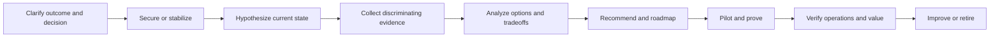

### 🔍 Plain-English deep-dive: recommendation before certainty

Consultants are often asked for a recommendation before every fact is available. The wrong responses are either false certainty or refusing to think until discovery is complete. A senior answer makes a **conditional recommendation**:

> “Based on the stated objective and assumptions A and B, I would start with option 2 because it reduces the highest risk while preserving rollback. Before approval, I need evidence X and Y. If X shows the legacy dependency cannot support the design, I would use coexistence option 3 and accept/document residual risk Z.”

That answer is decisive and honest. It separates what is known, assumed, recommended, and still gated. The interviewer can now challenge the assumptions instead of guessing what they are.

### Case-opening script

> “Before proposing controls, I would like to confirm the decision and constraints. I will ask a few questions about outcome, scope, users and data, current architecture, incidents, compliance, timing, licenses, skills, and operations. Then I will structure the problem across identity, device, workload, data, telemetry/response, and delivery. I will prioritize the material risks, compare options, recommend a staged path, and finish with testing, rollback, handover, and metrics. Is that a useful structure?”

### Universal clarifying-question bank

| Dimension | High-value questions |
|---|---|
| Outcome | What business/security outcome must improve? What decision is needed today? |
| Trigger | Incident, audit, renewal, migration, merger, executive concern, or planned transformation? |
| Scope | Tenants, clouds, regions, users, guests, admins, devices, workloads, data, subsidiaries? |
| Current state | Existing tools, identity model, endpoint management, M365 licenses, SOC, integrations, exceptions? |
| Risk | Threat scenarios, critical journeys, sensitive data, known gaps, incidents, tolerance, residual risk owner? |
| Constraints | Deadline, contracts, budget, skills, network, legacy protocols, privacy, labor, residency, accessibility? |
| Operations | Who monitors, responds, approves, supports, tunes, and owns after go-live? What coverage exists? |
| Evidence | Which logs, configurations, inventories, tests, tickets, and stakeholder statements are trustworthy? |
| Success | Which control behavior, user journey, operational metric, and risk decision define acceptance? |

---

## 8. Six fictional consulting mini-cases

All organizations, numbers, users, incidents, and technical states in this section are **fictional interview exercises**. They are not your experience and not Deloitte client examples.

### Mini-case 1: Microsoft 365 security assessment

**Prompt:** A fictional manufacturing company asks, “Can you assess and secure our Microsoft 365 tenant in eight weeks?”

| Case element | Response |
|---|---|
| Clarify | What decision follows the assessment? Which tenant/cloud/regions and business units? Is this a health check, maturity assessment, formal audit, or implementation? Which identities, endpoints, workloads, data, SecOps tools, regulations, and third parties are in scope? |
| Structure | Governance and objectives; identity/privilege; endpoint/device trust; Exchange/Teams/SharePoint/OneDrive; classification/DLP/retention; Defender/Sentinel; network dependencies; resilience; operations; licenses and skills |
| Evidence | Read-only exports/screenshots where approved, configuration records, sign-in/audit/security logs, device/app inventory, data map, incident trends, support model, exceptions, prior findings, stakeholder interviews |
| Tradeoffs | Breadth versus depth; rapid risk visibility versus assurance; automated evidence versus sampling; user impact; privacy; license limits; current tools; eight-week capacity |
| Recommendation | Agree purpose and criteria; prioritize crown-jewel journeys and privileged access; establish evidence confidence; report observations separately from risks; produce immediate safeguards, staged roadmap, owners, dependencies, cost assumptions, and residual-risk decisions |
| Testing/operations | Validate a sample of high-risk controls through positive/negative cases; verify telemetry and response; assign owners; define remediation acceptance, exceptions, review dates, and handover |

**Model case response:**

> “I would first clarify whether the client needs decision support, implementation planning, or formal assurance, because those are different scopes. Eight weeks is enough for a risk-prioritized assessment if access and stakeholders are available, but not a promise to inspect and remediate every configuration. I would define the tenant, identities, devices, workloads, data, regions, third parties, and evidence period; identify critical journeys and threat scenarios; then assess identity/privilege, endpoint trust, workload controls, data protection, detection/response, resilience, and operations. I would score confidence separately from risk so a missing artifact is not treated as proof of failure. Early high-risk observations would be escalated through an agreed route rather than waiting for the final report. Recommendations would include quick safeguards, target controls, dependencies, license assumptions, owners, phased roadmap, and residual risk. I would prove selected control behavior and confirm who will monitor, respond, tune, and accept closure.”

**Challenge probes:** What if the client refuses log access? How do you avoid a checklist dump? What if a Microsoft recommendation conflicts with business workflow? When do you stop testing and escalate a critical finding?

### Mini-case 2: Conditional Access rollout

**Prompt:** A fictional global professional-services organization wants to require stronger access controls quickly after suspicious sign-ins, but leaders fear lockout.

| Case element | Response |
|---|---|
| Clarify | Is compromise active? Which users/apps/clients/locations/devices? Current MFA/authentication methods? Legacy auth? Emergency access? Service/workload identities? Device signals? Licenses? Regions and support coverage? |
| Stabilize | If active risk is confirmed, use authorized incident containment separately from broad policy rollout; preserve sign-in evidence; protect privileged paths |
| Structure | Personas and user journeys; authentication strengths; apps/resources; device/compliance; locations/risk; exclusions; legacy/service dependencies; emergency access; policy interactions; logs and operations |
| Tradeoffs | Rapid risk reduction versus lockout; broad policy versus composable policy set; report-only insight versus urgent containment; device requirement versus BYOD/accessibility; session frequency versus user friction |
| Recommendation | Protect admins first with tested phishing-resistant methods; inventory dependencies; create named policies with owners; use report-only and simulation where appropriate; pilot rings; narrow time-bound exceptions; monitor sign-in outcomes; stage expansion |
| Testing/operations | Positive, negative, emergency-access, unsupported-client, guest, workload, travel, device, failure, rollback, help-desk, and monitoring tests; change record and handover |

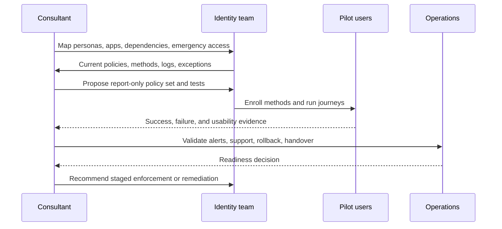

**Model case response:**

> “I would separate active-incident containment from long-term Conditional Access design. For the rollout, I would map personas and journeys, including administrators, ordinary users, guests, BYOD, service and workload identities, legacy clients, and emergency access. I would inventory current policies and authentication methods, examine sign-in evidence, and identify dependencies such as device registration and compliance. The first target would usually be privileged access with tested phishing-resistant authentication, but the recommendation is conditional on readiness and recovery. Policies would be named, scoped, report-only where appropriate, piloted through rings, and validated with allowed and deliberately denied journeys. Exceptions would be narrow, owned, monitored, and expiring. Enforcement would require help-desk readiness, sign-in monitoring, emergency-access tests, rollback, and an accountable risk decision.”

### Mini-case 3: Third-party tool migration

**Prompt:** A fictional retailer says, “We already license Microsoft E5. Replace our third-party email security and SIEM to save money.”

| Case element | Response |
|---|---|
| Clarify | Is cost the only objective? Contract dates? Required capabilities/use cases? Current detection and response evidence? Data sources/retention? Integrations? Regions? Team skills? Performance? Exit requirements? |
| Structure | Outcomes and weighted criteria; current capability baseline; Microsoft target capability; gaps/overlap; coexistence; data/history; detections/content; automation; operations/skills; resilience; commercial/TCO; cutover/decommission |
| Tradeoffs | Native integration versus specialist capability; license ownership versus implementation/ingestion/operations cost; consolidation versus concentration risk; migration speed versus detection continuity; coexistence cost versus rollback safety |
| Recommendation | Do not decide from license ownership alone; map high-priority use cases, test representative threats and mail flows, model total cost and staffing, pilot coexistence, migrate in waves, preserve evidence/export, decommission only after acceptance |
| Testing/operations | Detection parity and quality, false positive/negative behavior, mail delivery, latency, source completeness, playbook safety, retention/search, analyst workflow, outage/degraded mode, rollback, training, runbooks |

**Model case response:**

> “I would reframe the request from ‘replace because we own E5’ to ‘choose the operating model that best meets risk, service, and cost outcomes.’ I would baseline actual use cases, telemetry, detections, investigations, automations, mail flow, data retention, integrations, performance, resilience, skills, and contract obligations. Microsoft-native integration may reduce selected complexity, while the existing tools may retain strengths or required coverage; both need evidence. I would compare consolidate, coexist, and retain options using weighted criteria and total cost, including implementation, ingestion, migration, training, operations, and exit. A pilot would replay or simulate representative scenarios and validate analyst/user workflows. Cutover would be staged with dual visibility where feasible, explicit acceptance gates, rollback, and no decommission until detection, response, evidence retention, runbooks, and ownership are proven.”

### Mini-case 4: Security incident

**Prompt:** A fictional organization reports a phishing email, an endpoint alert, and risky sign-ins for one employee. The executive asks whether the tenant is compromised.

| Case element | Response |
|---|---|
| Clarify | What is the timeline, confidence, affected identity/device/mailbox/apps/data, privilege, user report, and current containment? Which logs are authoritative? Who is incident lead? Legal/privacy/communications triggers? |
| Stabilize | Protect people and evidence; use authorized, proportionate containment; preserve timestamps and identifiers; avoid destructive action; maintain business continuity |
| Structure | Validate alert; identity and token activity; email delivery/clicks; endpoint process/network; cloud app/data activity; scope peers/entities; contain; eradicate; recover; notify through authorized routes; learn |
| Tradeoffs | Disable/isolate speed versus business impact; evidence preservation versus urgent containment; broad reset versus targeted action; automation versus human approval; disclosure versus confidentiality |
| Recommendation | Establish incident command and one timeline; corroborate signals; contain based on confidence and impact; scope across identity/email/endpoint/cloud/data; recover trusted access/device; monitor; conduct PIR and control improvements |
| Testing/operations | Confirm malicious persistence removed, credentials/tokens addressed as appropriate, device trusted, mail artifacts remediated where authorized, detections functioning, user journeys restored, monitoring heightened and then exited |

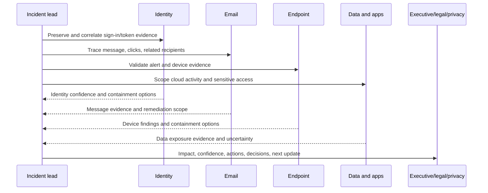

**Model case response:**

> “I would not answer ‘tenant compromised’ from three labels alone. I would establish the incident lead, preserve one timeline, and validate entity IDs, timestamps, alert evidence, user report, privilege, device, and current actions. Based on confidence and business impact, authorized containment might include restricting the identity or sessions, isolating the endpoint, and remediating malicious mail, but I would state who approves each action and the continuity effect. In parallel, I would scope related identities, recipients, devices, apps, OAuth activity, mailbox behavior, and sensitive data access. Executive updates would distinguish confirmed facts, working hypotheses, actions, decisions needed, and next cadence. Recovery requires a trusted identity and device state, verified user journeys, monitoring, and documented residual uncertainty. The PIR would improve controls and response, not simply blame the user.”

### Mini-case 5: Microsoft 365 service outage

**Prompt:** A fictional client's OneDrive sync and SharePoint access fail across several regions after a change. Security leadership worries that emergency bypasses will create exposure.

| Case element | Response |
|---|---|
| Clarify | Exact symptoms, regions, users, clients, timestamps, network paths, tenant health, recent changes, identity/device policy results, vendor status, business-critical journeys, continuity options? |
| Stabilize | Freeze unrelated change; establish severity/lead; preserve logs; use approved workaround only after risk/authority review; communicate cadence |
| Structure | Client/user/device/network/identity/service layers; compare affected/unaffected; timeline changes; service health/support cases; access and sync evidence; workaround; recovery and validation |
| Tradeoffs | Fast bypass versus increased exposure; fail-open versus fail-closed; broad rollback versus targeted correction; diagnostic logging versus privacy; vendor waiting versus client-side tests |
| Recommendation | Maintain one client-owned timeline; isolate the layer with discriminating comparisons; coordinate Microsoft/vendor evidence without outsourcing ownership; use narrow, monitored, expiring workaround; validate recovery and remove temporary access |
| Testing/operations | Representative users/regions/clients, sync integrity, access authorization, negative permission tests, queued changes/conflicts, monitoring, help-desk scripts, handover, PIR, temporary-control cleanup |

**Model case response:**

> “I would treat availability and security as linked. First I would establish severity, impact, command, timeline, communication cadence, and change freeze. I would compare affected and unaffected users, regions, clients, networks, identities, and resources; correlate recent changes with service health and authorized support evidence; and avoid assuming either Microsoft or the client is at fault. Any workaround that relaxes access would need explicit authority, narrow scope, monitoring, expiry, and a tested removal path. Recovery validation would include successful access and sync, data integrity, expected permissions, negative tests, and representative regions. After stabilization, we would remove bypasses, reconcile queued changes, document root and contributing causes at the supported confidence level, and track prevention actions.”

### Mini-case 6: DLP and privacy concern

**Prompt:** A fictional HR leader wants a DLP policy that blocks all employee uploads containing sensitive information and gives HR access to every matched file for investigation.

| Case element | Response |
|---|---|
| Clarify | What risk, data classes, channels, users, jurisdictions, lawful/approved purpose, false-positive tolerance, investigation authority, retention, employee notice, and urgent scenarios? |
| Structure | Data discovery/classification; control objective; locations/channels; detection methods; policy actions; user coaching/override; alert/case roles; privacy/legal; evidence; exceptions; operations |
| Tradeoffs | Prevention versus business workflow; detection depth versus employee privacy; central visibility versus least privilege; broad block versus staged controls; content access versus metadata/minimization |
| Recommendation | Reject unrestricted HR file access as the default; involve privacy/legal/security/data owners; define proportional purpose and role separation; start with discovery/simulation; tune classifiers; pilot warn/override/block by risk; grant minimal case access with audit and retention |
| Testing/operations | Synthetic approved data; true/false positives; allowed business exceptions; unsupported channels; alert routing; access audit; case closure; user experience/accessibility; rollback; policy health and review |

**Model case response:**

> “I would not implement ‘block everything and let HR read every match’ as stated. The business concern may be valid, but the proposed control creates operational and privacy risk. I would clarify the sensitive data, threat, channels, jurisdictions, legal basis, investigation roles, and required outcomes with HR, security, privacy, legal, and data owners. We would minimize content access, separate policy administration from investigation, and use audited least-privilege case roles. Technically, I would begin with discovery and simulation using approved synthetic test data, measure true and false positives, tune conditions, and pilot user coaching, justification, or blocking based on risk. Exceptions need owners and expiry. Acceptance includes risk reduction, usable workflows, alert response, access audit, retention, rollback, and documented residual risk.”

### Case performance rubric

| Dimension | 0 | 1 | 2 | 3 | 4 |
|---|---|---|---|---|---|
| Clarification | No questions | Generic questions | Scope partly clear | Decision and constraints clear | Reframes objective and confirms assumptions |
| Structure | Product dump | One-dimensional | Major domains | Prioritized end-to-end structure | Structure adapts as evidence changes |
| Risk and privacy | Missing | Mentions risk | Names key harm | Balances security/business/privacy | Authority, proportionality, residual risk explicit |
| Tradeoffs | One answer only | Generic pros/cons | Two options | Weighted criteria | Conditional recommendation and rejected option |
| Evidence | “Check logs” | Unfocused | Useful sources | Discriminating evidence | Confidence, source quality, preservation, gaps |
| Delivery | Big-bang | Basic phases | Pilot mentioned | Gates, waves, rollback | Owners, decisions, dependencies, stop criteria |
| Operations | Ends at setup | Monitoring only | Support named | Runbooks/RACI/metrics | Failure drills, tuning, review, retirement |
| Honesty | Invented certainty | Hidden assumptions | Some caveats | Labels facts/assumptions | Proactive boundaries and safe escalation |

---

## 9. Whiteboard and executive communication

### Whiteboard method: FRAME

| Step | Action | Spoken cue |
|---|---|---|
| **F — Frame** | Write objective, scope, assumptions, and decision | “I am solving for X, within Y, assuming Z.” |
| **R — Relationships** | Draw users, identities, devices, apps, data, telemetry, and external parties | “These are the trust and data flows.” |
| **A — Authorities** | Mark policy decisions, owners, roles, approvals, and boundaries | “This is where access is decided and who owns it.” |
| **M — Modes and mishaps** | Add normal, failure, attack, degraded, and recovery paths | “Now I will show what happens when this dependency fails.” |
| **E — Evidence and evolution** | Add logs, tests, pilot, operations, metrics, and roadmap | “This is how we prove and improve the design.” |

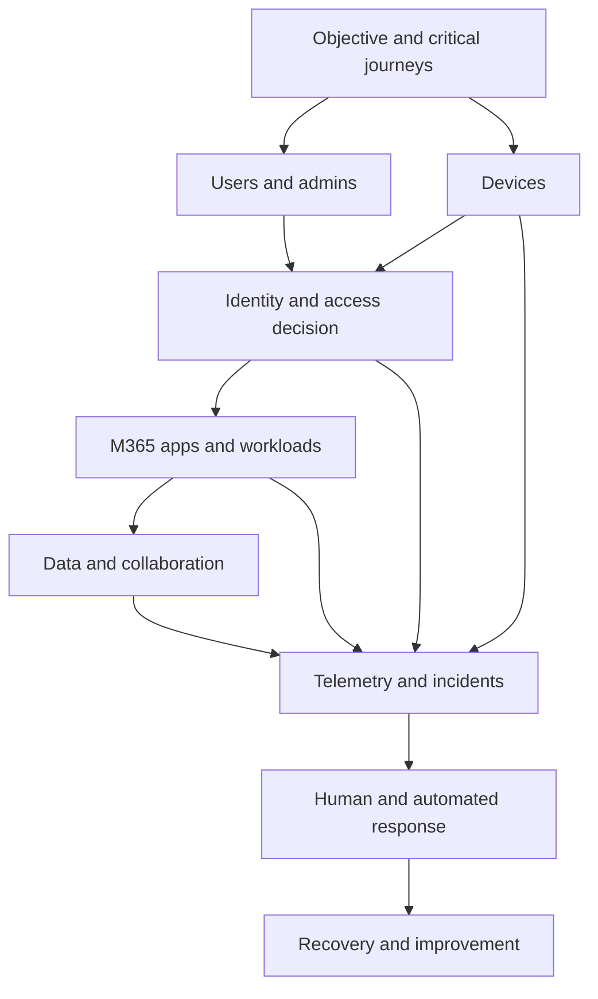

### Talking while drawing

1. State the business journey before naming products.
2. Draw left to right: actor, access decision, resource/data, telemetry, response.
3. Label assumptions in a corner rather than hiding them.
4. Use solid lines for known flow and dashed lines for a proposed or uncertain dependency.
5. Circle the highest-risk trust boundary.
6. Add at least one external user, unmanaged device, workload identity, and failure path when relevant.
7. End with pilot, rollback, operations, and residual risk.

| Audience | Lead with | Keep in reserve | Avoid |
|---|---|---|---|
| Executive sponsor | Outcome, exposure, decision, options, recommendation, ask | Architecture and evidence appendix | Acronym sequence and portal tour |
| Security leader | Threat, control coverage, detection/response, residual risk | Configuration and test evidence | Score-only assurance |
| Architect/engineer | Flows, dependencies, authority, failure modes, tests | Business-case detail | Unsupported exact settings |
| Operations lead | Signals, queue, severity, runbook, access, recovery, owner | Design alternatives | “The project team will handle it” |
| User/business owner | Journey, change, benefit, impact, exception/support | Threat detail | Treating user friction as resistance |

---

## 10. Questions to ask interviewers

Choose three to five questions based on who is speaking and what has already been answered. Do not perform a questionnaire. A strong question helps both sides test fit and invites concrete examples without requesting confidential client information.

### Recruiter questions

| # | Question | Why it is useful |
|---:|---|---|
| 1 | How is this role positioned within the hiring team and geography described in the active posting? | Confirms organizational context without assuming it |
| 2 | What are the remaining interview stages, and what capability does each stage assess? | Supports preparation and process clarity |
| 3 | What location, travel, shift, on-call, and work-authorization expectations should candidates understand? | Surfaces practical requirements early |
| 4 | How is level alignment determined for candidates moving from deep M365 support into cyber consulting? | Opens an honest leveling discussion |
| 5 | Which parts of the published role are must-have on day one versus expected development areas? | Clarifies gap tolerance |

### Hiring-manager questions

| # | Question | Why it is useful |
|---:|---|---|
| 6 | What outcomes would make you say this Senior Consultant is succeeding after six months? | Reveals real success measures |
| 7 | How does the role balance discovery, assessment, architecture, implementation, troubleshooting, and operate work? | Clarifies delivery mix |
| 8 | Which Microsoft 365 security domains most need immediate depth on the team? | Helps map contribution and ramp |
| 9 | What workstream ownership is typical at this level, and where is technical review required? | Clarifies autonomy and quality controls |
| 10 | What distinguishes someone who is technically strong from someone who becomes a trusted client advisor here? | Reveals behavioral expectations |

### Technical-interviewer questions

| # | Question | Why it is useful |
|---:|---|---|
| 11 | Which architecture or troubleshooting problems recur most often in this role? | Identifies practical challenge profile |
| 12 | How are designs reviewed across Entra, Intune, Purview, Defender, Sentinel, and workload specialists? | Tests interdisciplinary review |
| 13 | How does the team validate product behavior and licensing when Microsoft capabilities change? | Reveals evidence discipline |
| 14 | What does a strong lab, technical defense, or first deliverable look like for a new joiner? | Makes ramp expectations concrete |
| 15 | How do teams decide between Microsoft-native, third-party, and coexistence approaches? | Invites tradeoff method rather than vendor preference |

### Partner or senior-leader questions

| # | Question | Why it is useful |
|---:|---|---|
| 16 | Which client outcomes are driving the greatest demand for this role now? | Connects role to market/client value |
| 17 | Where do Microsoft 365 security transformations most often fail despite good technology? | Surfaces change, governance, and operating-model lessons |
| 18 | How do you expect Senior Consultants to contribute beyond their immediate technical workstream? | Clarifies broader leadership |
| 19 | What does high-quality executive communication look like in a difficult engagement? | Reveals decision standard |
| 20 | How does the practice balance speed, client value, technical rigor, privacy, and sustainable operations? | Tests values through delivery tradeoffs |

### Team or peer questions

| # | Question | Why it is useful |
|---:|---|---|
| 21 | What does a typical week look like when an engagement is healthy, and what changes during a critical issue? | Provides concrete work rhythm |
| 22 | How do team members ask for help or challenge a design when they are outside their deepest domain? | Tests psychological and technical safety |
| 23 | What knowledge-sharing practices are genuinely useful to the team? | Connects to your documentation/mentoring strengths |
| 24 | What surprised you most after joining this team? | Invites candid context |
| 25 | How are contributions divided across local, global, client, partner, and product teams? | Clarifies collaboration boundaries |

### Operations and on-call questions

| # | Question | Why it is useful |
|---:|---|---|
| 26 | What does rotational support mean in practice: frequency, hours, notice, role, and escalation authority? | Replaces assumptions with facts |
| 27 | What readiness criteria must be met before someone joins an on-call rotation? | Tests access, runbook, and training maturity |
| 28 | How are handover quality, fatigue, recovery time, and post-incident learning protected? | Raises sustainable-operation concerns professionally |
| 29 | During a client service disruption, how are consulting, operations, Microsoft, and third-party responsibilities separated? | Clarifies ownership |
| 30 | Which operational metrics matter beyond ticket closure or alert volume? | Tests outcome orientation |

### Culture and development questions

| # | Question | Why it is useful |
|---:|---|---|
| 31 | How is feedback given during an engagement, not only after it ends? | Reveals learning cadence |
| 32 | How do managers support people who are deep in one M365 workload while broadening across the security stack? | Directly tests fit for your transition |
| 33 | What behaviors are recognized when someone leads without formal authority? | Clarifies leadership culture |
| 34 | How does the team protect inclusive participation across locations, seniority, and technical specialisms? | Tests collaboration quality |
| 35 | Can you share a public, non-confidential example of how the team's work connects to Deloitte's stated purpose? | Grounds purpose without requesting client secrets |

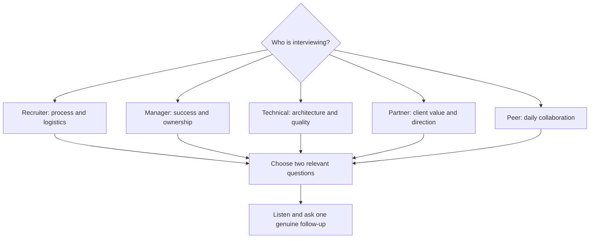

### Questions to avoid or reframe

| Avoid | Why | Better reframe |
|---|---|---|
| “What does Deloitte do?” | Publicly researchable and too broad | “The role spans assessment through Cyber Operate; where does this team spend most of its time?” |
| “How fast will I be promoted?” | Centers entitlement before performance | “What capability and evidence distinguish strong performance at this level and readiness for broader scope?” |
| “Will I have work-life balance?” | Important but too vague | “What do travel and rotational support look like, and how are notice, handover, and recovery time managed?” |
| “Which clients will I work for?” | May request confidential pipeline information | “Which industries and problem types are publicly appropriate to discuss?” |
| “Do you use your own secret methodology?” | Invites proprietary disclosure | “How are quality, peer review, and evidence consistency maintained across engagements?” |
| “Is Microsoft always the preferred tool?” | Signals product bias | “How do teams evaluate Microsoft-native, third-party, and coexistence options against client outcomes?” |
| “How much training do I get?” | Passive framing | “Which learning resources, labs, reviews, and supervised work best accelerate readiness?” |
| “Did I pass?” | Pressures the interviewer | “Is there any concern about my fit or evidence that I can clarify while we have time?” |

---

## 11. Compensation, location, shift, on-call, and start-date scripts

These scripts intentionally contain placeholders because your preferences, obligations, current compensation, notice period, location flexibility, and authorization are not supplied. You must answer truthfully and comply with applicable law and recruiting policy.

| Topic | Script with placeholders | Preparation needed |
|---|---|---|
| Compensation expectation | “I am most interested in scope and level fit. Based on `[Fill in: lawful market research and total-reward context]`, I would expect `[Fill in: range/currency]`, while considering base, variable pay, benefits, location, travel, shifts, and role expectations. Could you share the approved range?” | Define minimum, target, total-comp view, and whether disclosure is legally/strategically appropriate |
| Current compensation | “My current compensation is `[Fill in: answer only if you choo/is required and permitted]`. I would prefer to align on the value and approved range of this role rather than use prior pay as the sole anchor.” | Know local rules and personal boundary; never fabricate |
| Location | “My current location is `[Fill in]`. I can work from `[Fill in: truthful locations/modes]` and have constraints around `[Fill in]`. What is the actual office/client-site expectation?” | Commute, relocation, remote/hybrid, work authorization |
| Travel | “I can support `[Fill in: truthful travel frequency/range]`, subject to `[Fill in: genuine constraints]`. How predictable is travel, and how much is client-site versus team-site?” | Personal/family/health constraints, passport/authorization, notice |
| Shift/night/weekend | “I understand the posting includes `[Fill in: exact wording]`. I can commit to `[Fill in: truthful availability]`; I cannot commit to `[Fill in: truthful constraint]`. How are rotations scheduled and recovered?” | Non-negotiables, notice, transportation, health/safety |
| On-call | “I am open to `[Fill in: truthful position]` when readiness, authority, access, escalation, handover, and recovery expectations are clear. What is the frequency and response model?” | Actual willingness, response distance/time, compensation/policy questions |
| Start date | “My earliest realistic start date is `[Fill in]`, based on `[Fill in: notice/commitments/background process]`. I will confirm rather than promise a date I cannot meet.” | Contractual notice, leave, relocation, screening |
| Work authorization | “My current authorization status for this location is `[Fill in exact truthful status]`, and I would/would not require `[Fill in]`.” | Documents and legal accuracy |
| Competing process | “I am in `[Fill in: truthful stage if choosing to disclose]`; my decision timeline is `[Fill in]`. I remain interested because `[Fill in: role-specific reason]`.” | Never invent leverage or deadlines |

### Negotiation principles

1. Do not invent another offer, current pay, notice date, or flexibility.
2. Ask for the approved range and total-reward components.
3. Separate compensation from level and role scope, while recognizing they interact.
4. Consider shifts, on-call, travel, location, benefits, leave, learning, and variable pay.
5. Pause before accepting; obtain written terms and clarify contingencies.
6. Keep the tone factual and collaborative, not apologetic or adversarial.

---

## 12. A 30/60/90-day answer tailored to the role

This is an interview hypothesis, not a claim of employment or a promise about unknown Deloitte processes.

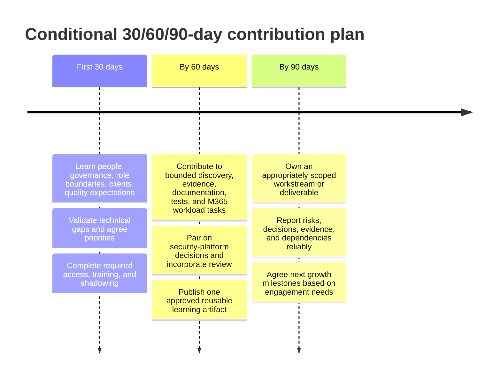

| Period | Learn | Contribute | Evidence of progress | Boundary |
|---|---|---|---|---|
| Days 1-30 | Team/role expectations, approved methods, security/privacy, quality gates, active role needs, review paths, client context, platform priorities | Bring M365 workload and escalation perspective in supervised discussions; complete required setup and learning | Agreed capability map, stakeholder map, learning plan, feedback cadence | Do not assume access, client assignment, or internal process |
| Days 31-60 | Engagement artifacts, architecture standards, assessment evidence, platform labs, communication expectations | Support discovery, inventory, evidence analysis, documentation, test design, troubleshooting, and bounded SharePoint/OneDrive work | Reviewed deliverables, resolved feedback, demonstrated lab/test evidence where permitted | Do not claim independent security design approval |
| Days 61-90 | Deeper priority platform and client-operating context | Own an appropriate workstream/deliverable, maintain status/risks, coordinate dependencies, support handover, mentor/share where useful | Accepted output, reliable updates, quality review, next capability goals | Do not promise promotion, revenue, client outcome, or production ownership before context |

**Spoken model:**

> “I would confirm this plan with the manager because priorities and approved processes come first. In 30 days I would aim to understand the team, clients, role boundaries, quality and security expectations, review paths, and the highest-value technical gaps, while completing access and required learning. By 60 days I would contribute to bounded discovery, evidence analysis, documentation, testing, and M365 workload tasks, pairing on security-platform decisions and incorporating feedback. By 90 days I would aim to own an appropriately scoped workstream or deliverable, communicate risks and dependencies reliably, contribute reusable knowledge, and agree the next growth milestones. I would measure progress through reviewed output and trusted execution, not through a claim that I will master every product in three months.”

---

## 13. Interview opening, closing, unknowns, and follow-up

### Opening routine

| Moment | Action | Example |
|---|---|---|
| First 20 seconds | Greet, confirm names/pronunciation, thank interviewer | “Thank you for the time. I am looking forward to learning more about the role and discussing how my M365 escalation background translates.” |
| Logistics | Confirm time and interview shape if not stated | “We have 45 minutes; is there a structure you would like to follow?” |
| First answer | Use present-past-future with evidence boundary | Use Q1 model, personalized |
| Rapport | Listen for role vocabulary and priorities | Note, do not mimic or overclaim |
| Throughout | Answer, pause, invite probe | “I can go deeper on the evidence or tradeoff if useful.” |

### Handling unknowns

| Unknown type | Safe response |
|---|---|
| Cannot recall exact setting | “I do not want to guess the exact option. The design principle is `[Fill in]`; I would verify the current setting and support boundary in official documentation and a controlled test.” |
| No production experience | “I have not owned that in production. My lab/conceptual understanding is `[Fill in]`, and I would validate it through `[Fill in]`.” |
| Ambiguous question | “Do you mean `[interpretation A]` or `[interpretation B]`? The risk and answer differ.” |
| Missing client facts | “Under assumption X I would recommend Y; if evidence Z differs, I would choose W.” |
| Interviewer corrects answer | “Thank you. I was assuming `[Fill in]`; with that correction, I would revise the flow to `[Fill in]`.” |
| Proprietary/confidential request | “I cannot share customer-identifying or confidential detail, but I can explain the generalized method and my role.” |

### Closing routine

1. Ask two or three relevant questions from Section 10.
2. Ask whether any concern or evidence gap can be clarified.
3. Deliver a 30-45 second close.
4. Confirm next steps through the recruiter/interviewer.
5. Thank them without overselling.

**Model close:**

> “Thank you. The conversation reinforced my interest in the role's combination of Microsoft 365 depth, security transformation, client problem solving, and operational outcomes. My strongest immediate evidence is SharePoint/OneDrive and sync expertise, complex escalation and RCA, stakeholder coordination, documentation, mentoring, and customer communication. I am also clear about where the security-platform experience is lab-based and where I would need review while ramping. I would bring that honesty, evidence discipline, and learning pace to the team. Is there any concern about my background or fit that I can address before we close?”

### Follow-up thank-you template

> **Subject:** Thank you — Microsoft 365 Security Senior Consultant conversation
>
> Hello `[Interviewer name]`,
>
> Thank you for discussing the Microsoft 365 Security Senior Consultant role today. I appreciated learning about `[Fill in: one specific non-confidential point from the conversation]`.
>
> The conversation strengthened my interest in `[Fill in: actual role outcome or challenge]`. My experience in `[Fill in: one or two verified strengths]` is directly relevant to `[Fill in: point discussed]`, and I remain deliberate about building `[Fill in: named development area]` through structured practice and review.
>
> One point I wanted to clarify/add is `[Fill in only if useful; otherwise remove paragraph]`.
>
> Thank you again for your time. I look forward to the next steps.
>
> Best regards,  
> you

Do not include confidential case details, compensation negotiation, attachments, or a new essay unless requested.

---

## 14. Virtual interview setup and communication

| Area | Night-before check | Backup |
|---|---|---|
| Device | Restart, updates complete, power connected, notifications off | Charged second device if permitted |
| Platform | Correct app/link, display name, permissions, test call | Browser/phone dial-in details |
| Audio | Microphone and speakers/headset tested | Spare headset |
| Video | Camera at eye level, stable framing, neutral professional background | Know camera-off recovery wording |
| Network | Stable connection and close bandwidth-heavy apps | Hotspot only if available/allowed |
| Materials | CV, JD, story anchors, questions, blank paper, pen, water | Local/offline copies |
| Privacy | Quiet space, confidential materials removed, screen sharing clean | Blur/background if appropriate |
| Accessibility | Needed accommodations confirmed | Recruiter contact available |
| Time | Time zone, start time, calendar, 10-minute early readiness | Interviewer/recruiter contact route |

### Virtual presence principles

- Look at the camera for opening and key points, but use natural eye movement.
- Pause briefly after the question; silence for thinking is professional.
- Keep notes to short anchors. Reading full paragraphs is visible and brittle.
- Tell the interviewer before drawing or sharing a screen.
- Verify no unrelated notifications, tabs, customer information, or credentials are visible.
- If audio drops, state the last phrase heard and ask for repetition rather than guessing.
- If disconnected, reconnect through the approved backup and send one concise message.

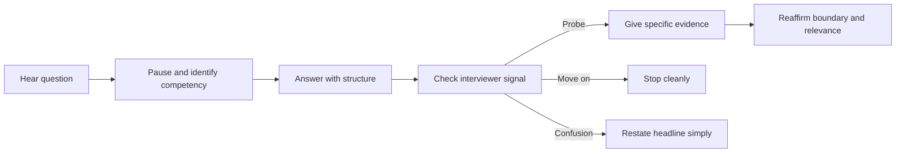

---

## 15. One-page night-before cheat sheet

### Role in one sentence

A Microsoft 365 Security Senior Consultant helps clients discover and prioritize cyber risk, design and safely deliver controls across identity, endpoint, collaboration, data, and SecOps, prove the controls work, and leave them operable.

### Personal value proposition

| Direct strength | Honest bridge |
|---|---|
| 5+ years of enterprise support/escalation | Experienced in ambiguity, customer impact, evidence, and accountable follow-through |
| SharePoint Online, OneDrive, sync depth | Strong collaboration-workload anchor for permissions, data, migration, resilience, and operations |
| Critical escalation, RCA, product/vendor coordination, fix validation | Transfers to security troubleshooting, incident support, migration, and delivery governance |
| a strong customer-satisfaction record, repeated peer and customer recognition as documented | Supporting customer/recognition signals; define scope and do not claim sole causation |
| Documentation, training, roadblock calls, case bashes, mentoring/onboarding/interviews | Knowledge transfer, workstream enablement, and operational readiness |
| Power Automate/Power Apps a top internal innovation award; AI/Copilot Studio activities | Automation/AI learning base; not production security automation |
| Technical advisor, a leadership-development council, global events, an executive roundtable, awards | Leadership-development evidence; keep events separate and verify contribution |

### Evidence boundary sentence

> “My direct production depth is M365 support, SharePoint, OneDrive, sync, escalation, RCA, and stakeholder delivery. Entra, Intune, Purview, Defender, and Sentinel are currently lab or conceptual evidence, and I would not present them as production tenure.”

### Five answer anchors

1. Client outcome before product.
2. Fact, assumption, recommendation, and residual risk are different.
3. Say what **I** did and what **we** did.
4. Pilot, positive/negative tests, rollback, monitoring, and handover.
5. Close with verified result, reflection, and relevance.

### Eleven story labels

Critical escalation; cross-team coordination; recurrence/defect/validation; customer trust/CSAT; sync subject-matter expert; mentoring/onboarding/interview; technical advisor; knowledge enablement; a top internal innovation award; AI/agent/training; leadership event/recognition.

### Consulting case spine

Clarify → stabilize → map current state/evidence → prioritize risk → compare options → recommend conditionally → pilot/test/rollback → operate/measure/improve.

### Questions to ask

1. What outcomes define success in six months?
2. Which domains need immediate depth, and which support supervised growth?
3. How are designs reviewed across Microsoft security domains?
4. What does rotational support mean in practice?
5. What distinguishes a trusted client advisor on this team?

### Stop phrases

- “I do not want to guess the exact setting.”
- “That was a support escalation, not a cyber incident.”
- “That example is lab-based, not production.”
- “Under this assumption, my recommendation is...”
- “The accountable owner would approve that risk decision.”
- “I can go deeper if useful.”

---

## 16. Morning-of checklist

| Time | Check | Done |
|---|---|---:|
| Before the day | Sleep/rest plan followed; no last-minute all-night study | ☐ |
| 60-90 minutes before | Eat/hydrate appropriately; review role sentence and evidence boundary | ☐ |
| 45 minutes before | Verify platform, device, audio, camera, network, power, time zone | ☐ |
| 30 minutes before | Speak Q1, Q4, Q7, Q8, one STAR, and one case opening aloud | ☐ |
| 20 minutes before | Review interviewer names/roles from lawful public information | ☐ |
| 15 minutes before | Close unrelated apps/tabs; remove confidential content; silence notifications | ☐ |
| 10 minutes before | Join readiness state; breathing/pacing reset; water and notes placed | ☐ |
| During | Listen, pause, structure, label evidence, answer, stop | ☐ |
| End | Ask relevant questions, clarify concerns, close, confirm next step | ☐ |
| After | Record facts while fresh and send concise thank-you | ☐ |

Do not learn a new product on interview morning. The goal is recall, clarity, and steadiness.

---

## 17. Interview scorecard and post-interview debrief

### Interview answer scorecard

Score 0-4 per dimension. Any invented fact makes **honesty/evidence = 0** and the answer cannot be ready.

| Dimension | 0 | 1 | 2 | 3 | 4 |
|---|---|---|---|---|---|
| Relevance | Did not answer | Tangential | Competency implied | Direct answer | Direct and role-specific |
| Structure | Rambling | Partial | Understandable | Clear STAR/case | Natural, adaptive, concise |
| Personal ownership | Hidden | Mostly “we” | Some “I” | Actions clear | Team and personal boundaries precise |
| Evidence | Invented/none | Vague | Observable | Verified result | Source/scope/limits clear |
| Judgment | No rationale | Generic | One reason | Options/tradeoff | Authority, risk, and rejected option |
| Communication | Inaccessible | Too detailed/vague | Understandable | Audience-fit | Decision-ready and conversational |
| Reflection | Missing | Cliché | General learning | Specific change | Change demonstrated later |
| Honesty | Misrepresented | Boundary only after challenge | Labels some gaps | Proactive labels | Handles probes without inflation |

Target: at least **25/32** for practiced behavioral answers, with honesty at 4 and no dimension below 2.

### Post-interview debrief

| Field | Notes |
|---|---|
| Interview date/time and stage | `[Fill in]` |
| Interviewers and roles | `[Fill in from invitation/public context]` |
| Questions asked | `[Fill in exact wording while fresh]` |
| Stories used | `[Fill in story IDs]` |
| Strongest answer and evidence | `[Fill in]` |
| Weakest answer and why | `[Fill in: knowledge, structure, evidence, length, nerves]` |
| Follow-ups that exposed gaps | `[Fill in]` |
| Any accidental overstatement | `[Fill in and correct promptly if material]` |
| Role facts learned | `[Fill in; separate interviewer statement from assumption]` |
| Logistics learned | `[Fill in]` |
| Thank-you sent | `[Fill in time]` |
| Next preparation action | `[Fill in one concrete action]` |

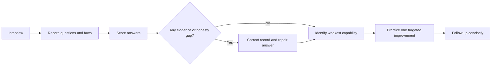

---

## 18. Readiness criteria

Reading this chapter does not make your interview-ready. Readiness requires verifying personal stories, speaking without a script, solving unfamiliar cases, drawing architectures, receiving feedback, and preserving honesty under pressure.

| Readiness area | Green criterion | Evidence |
|---|---|---|
| Personal introduction | 75-90 seconds, natural, role-specific, no unsupported claims | Two recordings scored ≥25/32 |
| Story bank | At least eight distinct verified events; all fill-in slots complete; no merged events | Source/record check and confidentiality review |
| Behavioral delivery | 60-second and 2-minute versions; two probes per story | Randomized mock prompts |
| Gap answer | Entra/Intune/Purview/Defender/Sentinel boundary stated calmly and specifically | Q7/Q8 delivered without apology or inflation |
| Consulting cases | Six cases solved using C-SHARP-V, with tradeoff, recommendation, tests, operations | Timed 12-minute drills |
| Technical integration | Can draw identity-device-app-data-telemetry-response flow and failure path | Whiteboard recording and critique |
| Deloitte motivation | Uses only active JD and current official public material; no insider claims | Sources rechecked before interview |
| Logistics | Compensation/location/travel/shift/on-call/start-date placeholders replaced truthfully | Personal decision sheet |
| Questions | Five questions selected by interviewer type; none already answered | Final question card |
| Virtual setup | Full backup test completed | Test call and clean screen share |
| Recovery under pressure | Can say “I do not know,” form a safe method, and continue | Mock challenge round |
| Part 73 coverage | Behavioral Q181-Q195 and closing Q196-Q205 answered aloud | [Part 73 tracker](Part-73-interview-question-bank.md) |

### Readiness decision

| Status | Meaning | Action |
|---|---|---|
| Red | Stories contain empty facts, overclaims, or collapse under probes | Stop polishing; verify evidence and rebuild |
| Amber | Answers are accurate but long, generic, or dependent on notes | Timed random practice and feedback |
| Green | Accurate, concise, adaptive, role-relevant, and probe-resistant | Maintain with spaced rehearsal; avoid overmemorizing |

### 🔍 Plain-English deep-dive: confidence is not readiness

Confidence is a feeling; readiness is observable performance. Someone can feel confident after reading a polished model answer and still freeze when asked, “What did you personally do?” Someone can feel nervous and still give an excellent answer because the event is real, the structure is simple, and the evidence boundary is clear.

Use three tests:

1. **Randomness:** Can your answer when prompts arrive out of order?
2. **Interruption:** Can you stop, answer a probe, and resume without restarting?
3. **Contradiction:** Can you revise an assumption when the interviewer supplies new evidence?

That is why practice must include spoken mocks, whiteboarding, and challenge questions. The goal is not perfect wording. It is accurate thinking that remains usable under pressure.

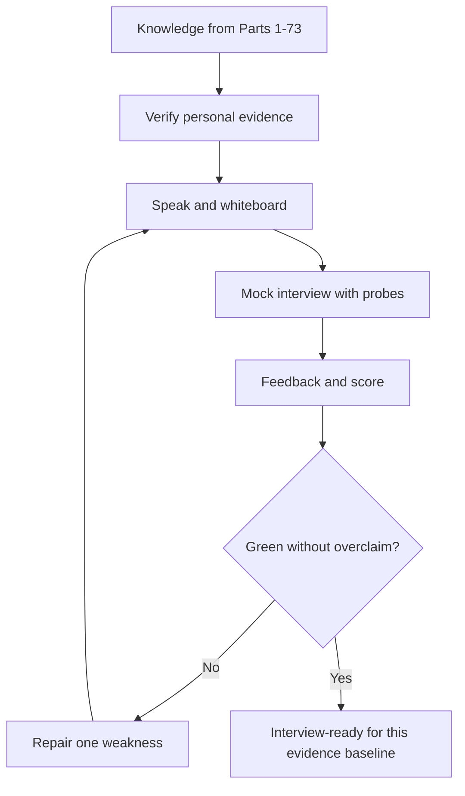

---

## 19. Official Source Anchors

These anchors distinguish source evidence, public role context, public behavioral guidance, and current Microsoft product context. They do not validate any unfilled personal story detail.

1. Your own CV — primary source for personal experience. Verify exact wording, context, dates, metrics, and achievements here before use.
2. [Master Study Guide](../Deloitte%20Microsoft%20365%20Security%20Senior%20Consultant%20-%20Study%20Guide.md) — supplied target-role curriculum and approved Part 74 title; its role map is derived from the supplied public job description.
3. [Part 1 — Role Map, Deloitte Cyber Context, and the Complete Engagement Story](Part-01-role-map-deloitte-cyber-engagement-story.md) — approved JD mapping, evidence boundary, and direct/transferable/lab/conceptual model.
4. [Part 73 — Interview Question Bank](Part-73-interview-question-bank.md) — Q181-Q195 behavioral prompts, Q196-Q205 closing prompts, answer rubric, and technical cross-references.
5. [Deloitte — Purpose and values](https://www.deloitte.com/global/en/about/story/purpose-values.html) — official public context for purpose and values. Recheck the current page before tailoring “Why Deloitte.”
6. [UK National Careers Service — The STAR method](https://nationalcareers.service.gov.uk/careers-advice/interview-advice/the-star-method) — public government career guidance on structuring behavioral examples.
7. [Microsoft Zero Trust deployment with Microsoft 365](https://learn.microsoft.com/security/zero-trust/microsoft-365-zero-trust) — official architecture context for integrated identity, endpoint, application, and data protection.
8. [Microsoft Defender XDR overview](https://learn.microsoft.com/defender-xdr/microsoft-365-defender) — official public context for XDR capabilities; verify current portal and product naming.
9. [Microsoft Sentinel overview](https://learn.microsoft.com/azure/sentinel/overview) — official public SIEM/SOAR context.
10. [Microsoft Purview data compliance](https://learn.microsoft.com/purview/purview-compliance) — official public data-security/compliance solution context.
11. [Microsoft Intune endpoint security](https://learn.microsoft.com/intune/intune-service/protect/endpoint-security) — official public endpoint-security context.
12. [Microsoft Security Copilot overview](https://learn.microsoft.com/copilot/security/microsoft-security-copilot) — official public AI-assisted security context and product boundary.

Source-use rules:

| Source type | What it can support | What it cannot support |
|---|---|---|
| CV | Personal role, activity, metric, award, and chronology exactly documented | Missing event details, causal claims, confidential narrative |
| Supplied JD/master/Part 1 | Target responsibilities and study-guide interpretation | Deloitte internal practices or guaranteed daily work |
| Deloitte public pages | Current public purpose/value/career statements | Team culture, project pipeline, compensation, promotion, client facts |
| Microsoft Learn | Current public product architecture and documented behavior | Tenant-specific behavior, license entitlement without verification, personal production experience |
| Public interview guidance | General answer structure | Employer-specific scoring or preferred answer |

---

## 🧠 30-Second Memory Hooks

- **STAR:** scene, responsibility, personal moves, verified outcome.
- **CAR:** challenge, action, result when time is short.
- **PARADE:** stakes and decision rationale for complex judgment.
- **One prompt, one event:** never build a fictional chain from separate true bullets.
- **Direct is not transferable:** label production, lab, capstone, conceptual, and unknown.
- **Result is not always a number:** validated recovery, accepted decision, adoption, or changed practice can be evidence.
- **No naked metric:** define CSAT scope and never claim sole causation.
- **Support is not a SOC:** use the real escalation context and make the security bridge explicit.
- **Consulting starts with the decision:** clarify before naming a product.
- **Conditional recommendation:** state assumptions, option, reason, gate, and fallback.
- **Configured is not controlled:** prove positive, negative, failure, rollback, and operations.
- **Leadership without authority:** make evidence, ownership, and the next decision clear.
- **Executive update:** impact, risk, action, decision, uncertainty, next time.
- **Unknown is manageable:** say what is known, what needs verification, and the safe next check.
- **Why Deloitte:** active JD plus official public purpose, never insider claims.
- **Gap answer:** visible, bounded, actively developed, never disguised.
- **On-call:** readiness, authority, handover, fatigue controls, and recovery, not heroics.
- **Privacy:** purpose, minimization, proportionality, roles, audit, retention, human judgment.
- **Natural delivery:** memorize anchors, not paragraphs.
- **Readiness:** accurate answers spoken under random probes, not pages read silently.

---

## 20. Completion Checklist

### Evidence and honesty

- [ ] Open the source CV and verify every personal fact used in an answer.
- [ ] Replace every `[Fill in: ...]` slot used for the interview; remove unused skeletons from personal notes.
- [ ] Keep business-critical escalation, cross-team coordination, recurring issue, defect, and fix-validation events separate unless one real chronology proves the connection.
- [ ] Verify the scope, period, scale, and attribution of every customer-satisfaction figure you cite.
- [ ] Verify exactly what any recognition record covers before describing it.
- [ ] Verify exact sync subject-matter expert and technical-leadership responsibilities.
- [ ] Keep mentoring, onboarding, and interviewing as separate events unless the source proves otherwise.
- [ ] Verify the technical-advisor programme role and result.
- [ ] Select one specific KB, troubleshooting document, training, roadblock call, or case bash and verify personal contribution/adoption.
- [ ] Verify the exact Power Automate/Power Apps Evolve project and “top honors” wording.
- [ ] Keep AI/Copilot Studio agent activity separate from AI training unless the source proves a single event.
- [ ] Keep a leadership-development council, global events, an executive roundtable, awards, and recognitions separate.
- [ ] Remove client names, sensitive data, internal identifiers, confidential product details, and unsupported metrics.
- [ ] Label Entra, Intune, Purview, Defender, and Sentinel evidence as lab/conceptual unless separate production proof exists.
- [ ] Explicitly state that generated STAR skeletons were verified and personalized before use.

### Practice

- [ ] Prepare at least eight verified STAR stories with 60-second and two-minute versions.
- [ ] Practice two probing questions for every selected story.
- [ ] Answer Q1-Q24 aloud in random order without reading full scripts.
- [ ] Practice Part 73 Q181-Q195 and Q196-Q205 aloud.
- [ ] Complete all six fictional mini-cases under time and state assumptions.
- [ ] Draw one integrated M365 security whiteboard while narrating.
- [ ] Record and score at least two mock interviews.
- [ ] Achieve at least 25/32 with honesty at 4 for core answers.
- [ ] Practice being interrupted and revising an assumption.

### Role and logistics

- [ ] Recheck the active job description and official Deloitte public page before the interview.
- [ ] Choose truthful compensation, location, travel, shift, on-call, and start-date responses.
- [ ] Prepare five interviewer questions and map them to likely interviewer types.
- [ ] Confirm time zone, platform, accessibility, device, audio, video, network, and backup route.
- [ ] Print or open the one-page night-before sheet without confidential data.
- [ ] Prepare the thank-you template but personalize it after the conversation.

### Final readiness gate

- [ ] No personal story depends on an unverified detail.
- [ ] No lab/capstone claim is phrased as production work.
- [ ] No support escalation is relabeled as a cyber incident without evidence.
- [ ] No answer implies Deloitte proprietary knowledge.
- [ ] No product behavior or job-posting fact relies on information later than August 24, 2026.
- [ ] you can say “I do not know” and provide a safe verification path.
- [ ] you can explain why this role, why cybersecurity, why consulting, and why Deloitte naturally in under 90 seconds each.
- [ ] you can close with strengths, gap honesty, relevance, and genuine interest in under 60 seconds.

[Return to the Master Study Guide](../Deloitte%20Microsoft%20365%20Security%20Senior%20Consultant%20-%20Study%20Guide.md)