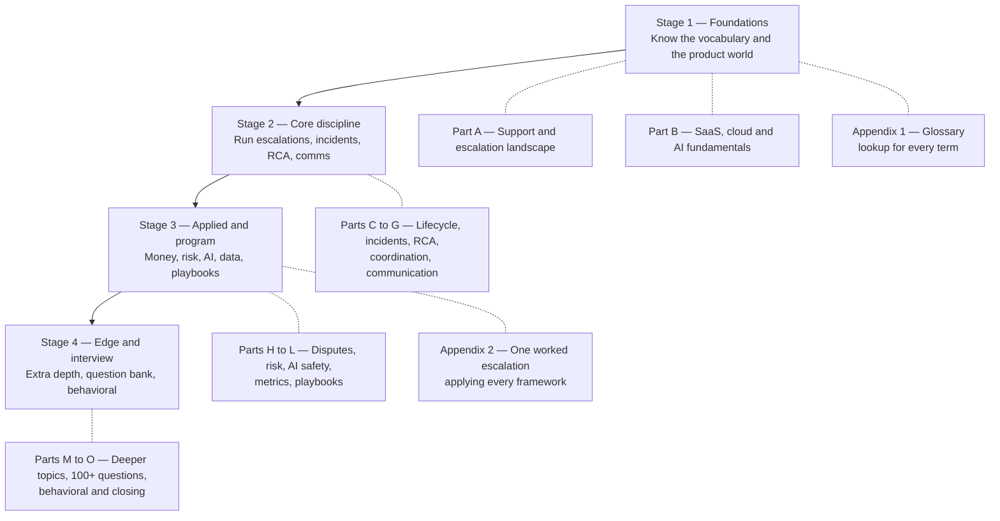

# Escalations Manager — Study Guide (Beginner → Advanced)

> **Goal of this guide:** take someone from *zero knowledge* to *confident, senior-level answers* on everything an Escalations Manager at an AI/SaaS company is expected to know — so you never go blank, and you always understand the concept behind the answer.

---

## About this guide

- **Written for anyone.** No prior support, engineering, or industry experience is assumed. Every term, acronym, and framework is explained in plain English before it is used, with an everyday analogy.
- **Beginner → advanced within each Part.** Each section starts at "what even is this?" and ends at trade-offs a senior practitioner would debate.
- **No personal data.** This guide contains no résumé, contact, employer, or biographical information. It is purely subject-matter learning material, so it can be reused or shared by anyone.
- **Role-shaped, not person-shaped.** Topics are derived from the target job description (Escalations Manager, AI-native SaaS), not from any individual's history.

---

## The role in one paragraph

An **Escalations Manager** is the person a company puts in charge when a customer problem has outgrown normal support. They take ownership of the highest-risk, highest-visibility issues — outages, angry enterprise accounts, executive complaints, billing disputes, and concerns about how the product behaved — and they drive them to resolution by coordinating engineering, product, support, security, finance, legal, and leadership. Beyond fixing the individual case, they find the *pattern* behind repeat problems, run structured **Root Cause Analysis (RCA)**, and turn what they learn into permanent product and process fixes. Think of them as the **incident conductor plus the customer's advocate plus the company's risk shield**, all in one seat.

---

## Learning path

**Suggested order:** work straight through A → O. Each Part assumes only the Parts before it.

---

## Grouped index

### Stage 1 — Foundations

**Part A — The Support & Escalation Landscape**
1. What customer support, customer success, and customer operations actually do
2. What an escalation is — and is not: escalation vs complaint vs incident vs bug
3. Escalation channels: support tickets, enterprise accounts, executive contacts, social media
4. Support tiers (L1/L2/L3), swarming models, and the escalation path
5. The Escalations Manager mandate: ownership, authority, and boundaries
6. Core acronyms decoded (SLA, SLO, CSAT, NPS, MTTR, RCA, CAPA, T&S, VoC)

**Part B — SaaS, Cloud & AI Product Fundamentals**
7. What "SaaS" means; multi-tenancy, environments, and release trains
8. Anatomy of a modern cloud application (client, API, database, queue, deploy pipeline)
9. Production vocabulary: outage, degradation, regression, rollback, hotfix
10. LLMs and AI agents in plain English; what an *autonomous coding agent* does
11. Failure modes unique to AI systems: hallucination, non-determinism, prompt injection, unsafe output
12. Why correctness, reliability, security, and scale are the genuinely hard parts

### Stage 2 — Core discipline

**Part C — The Escalation Lifecycle & Frameworks**
13. Intake, qualification, and triage
14. Severity vs priority: how each is set, and why they are not the same thing
15. Ownership models: single-threaded owner, DRI, escalation manager on point
16. Escalation states, transitions, and explicit exit criteria
17. De-escalation techniques and expectation setting
18. Executive and sponsor escalations: what changes when a VP is watching

**Part D — Incident Management & Severity Operations**
19. Incident lifecycle: detect → declare → mitigate → resolve → learn
20. Incident Command System roles: incident commander, comms lead, ops lead, scribe
21. War rooms, bridge calls, and update cadence
22. Severity levels, paging, on-call rotations, and engineering escalation
23. Status pages and customer-facing incident communication
24. Handoffs, follow-the-sun coverage, and long-running incidents

**Part E — Root Cause Analysis (RCA)**
25. Symptom vs root cause vs contributing factor
26. The 5 Whys — and its common failure modes
27. Fishbone (Ishikawa) diagrams and causal factor charts
28. Fault tree analysis and Kepner-Tregoe problem analysis
29. Blameless postmortems and "just culture"
30. Corrective vs preventive action (CAPA); proving the fix actually worked
31. Problem management vs incident management; one-off vs systemic

**Part F — Cross-Functional Coordination**
32. Who owns what: Engineering, Product, CS, Security, Finance, Legal, Leadership
33. Influence without authority; RACI and decision rights
34. Running escalation syncs that end in decisions, not status theatre
35. Working with Engineering: reproductions, logs, bug quality, prioritization
36. Working with Product: impact framing and roadmap trade-offs
37. Conflict, competing priorities, and escalation fatigue

**Part G — Communication Under Pressure**
38. The four principles: clarity, cadence, commitment, empathy
39. Customer updates: holding statements, progress updates, closure notes
40. Executive-ready writing: BLUF, one-pagers, incident summaries
41. Post-mortem reports and how to frame recommendations
42. Apology, accountability, and phrases to never use
43. Verbal skills: hostile calls, difficult truths, executive briefings

### Stage 3 — Applied & program

**Part H — Commercial Disputes: Billing, Refunds & Compensation**
44. Billing models: subscription, usage/consumption, seats, credits, overage
45. How billing disputes actually arise (and which are self-inflicted)
46. Refunds, credits, goodwill gestures, and SLA service credits
47. Building a fair, consistent compensation framework
48. Balancing customer satisfaction against revenue and precedent
49. Fraud, abuse, and chargeback basics

**Part I — Risk: Financial, Legal & Reputational**
50. Risk categories and how a single escalation creates all three
51. Contracts, SLAs, liability, indemnity, and DPAs in plain English
52. Privacy and data-protection principles
53. When to involve Legal; privilege and written-record discipline
54. Social media, review sites, and public escalations
55. Crisis communication and PR coordination
56. Regulatory and compliance touchpoints

**Part J — AI Behavior Escalations & Trust and Safety**
57. What "AI behavior concern" means in practice
58. Categories: incorrect output, unsafe output, IP/licensing, bias, data leakage
59. Investigating non-deterministic issues and capturing evidence
60. Guardrails, evaluations, model updates, and rollback
61. Trust & Safety fundamentals: abuse, policy enforcement, appeals
62. Accountability when the product acts autonomously

**Part K — Metrics, Data & Trend Analysis**
63. Speed metrics: MTTA, MTTR, time-to-first-response, SLA attainment, backlog age
64. Experience metrics: CSAT, DSAT, NPS, CES
65. Escalation-specific metrics: repeat-escalation rate, escalation ratio, reopen rate
66. Trend analysis, Pareto, cohorting, and tagging taxonomies
67. Dashboards and business-review-style reporting
68. Metric gaming, vanity metrics, and how to avoid both

**Part L — Playbooks, SLAs & Scaling the Program**
69. Anatomy of an escalation playbook
70. Investigation frameworks and decision trees
71. Designing SLAs/SLOs and response/resolution targets
72. A communication template library
73. Voice of the Customer loops into product and operations
74. Scaling: tooling, automation, staffing, continuous improvement
75. A 30/60/90 plan for standing up an escalation program

### Stage 4 — Edge & interview

**Part M — Miscellaneous & Deeper Topics**
76. Frameworks and standards: ITIL, SRE, ISO, COPC
77. Tooling landscape: ticketing, incident, observability, CRM
78. Industry landscape for AI coding agents and developer platforms
79. Current trends: AI in support, agentic operations, shift-left, proactive support
80. Adjacent concepts: change management, release risk, chaos engineering

**Part N — Interview Question Bank (100+)**
81. Basic (~20%), Intermediate (~20%), Advanced (~60%), each with a concise answer and cross-reference
82. Behavioral (STAR) question sets
83. Closing and "why" questions
84. Self-quiz tracker

**Part O — Behavioral & Closing**
85. The STAR method, done properly
86. Competency translation table (any background → role competencies)
87. Ready-to-adapt STAR story templates
88. "Why this move / why this company / why you"
89. Questions to ask the interviewer
90. One-page night-before cheat sheet

---

## Parts status

| Part | File | Focus | Status |
|------|------|-------|--------|
| A | [prep/Part-A-support-escalation-landscape.md](prep/Part-A-support-escalation-landscape.md) | Support & escalation landscape | ✅ Complete |
| B | [prep/Part-B-saas-cloud-ai-fundamentals.md](prep/Part-B-saas-cloud-ai-fundamentals.md) | SaaS, cloud & AI fundamentals | ✅ Complete |
| C | [prep/Part-C-escalation-lifecycle.md](prep/Part-C-escalation-lifecycle.md) | Escalation lifecycle & frameworks | ✅ Complete |
| D | [prep/Part-D-incident-management.md](prep/Part-D-incident-management.md) | Incident management & severity ops | ✅ Complete |
| E | [prep/Part-E-root-cause-analysis.md](prep/Part-E-root-cause-analysis.md) | Root cause analysis | ✅ Complete |
| F | [prep/Part-F-cross-functional-coordination.md](prep/Part-F-cross-functional-coordination.md) | Cross-functional coordination | ✅ Complete |
| G | [prep/Part-G-communication-under-pressure.md](prep/Part-G-communication-under-pressure.md) | Communication under pressure | ✅ Complete |
| H | [prep/Part-H-billing-refunds-compensation.md](prep/Part-H-billing-refunds-compensation.md) | Billing, refunds & compensation | ✅ Complete |
| I | [prep/Part-I-financial-legal-reputational-risk.md](prep/Part-I-financial-legal-reputational-risk.md) | Financial, legal & reputational risk | ✅ Complete |
| J | [prep/Part-J-ai-behavior-trust-and-safety.md](prep/Part-J-ai-behavior-trust-and-safety.md) | AI behavior & Trust and Safety | ✅ Complete |
| K | [prep/Part-K-metrics-and-trend-analysis.md](prep/Part-K-metrics-and-trend-analysis.md) | Metrics & trend analysis | ✅ Complete |
| L | [prep/Part-L-playbooks-slas-scaling.md](prep/Part-L-playbooks-slas-scaling.md) | Playbooks, SLAs & scaling | ✅ Complete |
| M | [prep/Part-M-miscellaneous-deeper-topics.md](prep/Part-M-miscellaneous-deeper-topics.md) | Miscellaneous & deeper topics | ✅ Complete |
| N | [prep/Part-N-interview-question-bank.md](prep/Part-N-interview-question-bank.md) | Interview question bank (116 Qs) | ✅ Complete |
| O | [prep/Part-O-behavioral-and-closing.md](prep/Part-O-behavioral-and-closing.md) | Behavioral & closing | ✅ Complete |
| **App. 1** | [prep/Appendix-1-glossary.md](prep/Appendix-1-glossary.md) | **Complete A–Z glossary** — every term in one lookup | ✅ Complete |
| **App. 2** | [prep/Appendix-2-worked-example.md](prep/Appendix-2-worked-example.md) | **Worked escalation end to end** — how all the Parts connect | ✅ Complete |

> **The appendices are not optional extras.** Appendix 1 is your lookup whenever a term escapes you, so you never have to search fifteen files. Appendix 2 runs one escalation from first alert to permanent fix, showing which framework applies at each moment — it is what turns fifteen separate toolkits into one working process.

---

## Job-description coverage map

Every requirement in the target role maps to at least one Part, so nothing in the interview can be unprepared territory.

| Job requirement | Covered in |
|-----------------|-----------|
| Own high-priority customer and executive escalations across tickets, enterprise accounts, and social media | Parts A, C, I |
| Lead cross-functional resolution with Engineering, Product, CS, Security, Finance, Legal | Part F |
| Handle disputes involving billing, refunds, reliability, AI outputs, and compensation | Parts H, J |
| Conduct deep Root Cause Analysis and drive permanent fixes | Part E |
| Build escalation playbooks, investigation frameworks, SLAs, communication templates | Part L |
| Monitor escalation trends; convert feedback into product and operational improvements | Parts K, L |
| Mitigate financial, legal, and reputational risk | Part I |
| Prepare executive-ready incident summaries and post-mortem reports | Part G |
| Incident management expertise | Part D |
| Communication with customers and senior leadership under pressure | Parts G, O |
| Turn recurring issues into scalable process improvements | Parts E, K, L |
| SaaS / AI / enterprise software context | Parts B, J, M |
| Interview performance: technical, behavioral, closing | Parts N, O |
| Vocabulary lookup for any term in the guide | [Appendix 1](prep/Appendix-1-glossary.md) |
| Seeing every framework applied to one continuous case | [Appendix 2](prep/Appendix-2-worked-example.md) |

---

## How to use this guide

1. **Read a Part end to end**, including the diagrams — they encode the mental model, not just decoration.
2. **Answer the ⭐ interview questions aloud** at the end of each Part before moving on. Reading is not the same as retrieval.
3. **Keep the 🧠 memory hooks** — they are the 30-second recall cues for when you blank under pressure.
4. **Do the 🔁 Rapid Recall Drill** at the end of each Part. If you hesitate on a question, it tells you exactly which section to reread.
5. **Use [Appendix 1](prep/Appendix-1-glossary.md) as a lookup** whenever a term escapes you.
6. **Read [Appendix 2](prep/Appendix-2-worked-example.md) after Part L** — it consolidates everything into one continuous case.
7. **Finish with Parts N and O**, which convert knowledge into interview performance.

Each Part ends with **⭐ Likely Interview Questions** (with model answers), **🧠 30-Second Memory Hooks**, a **🔁 Rapid Recall Drill**, and a pointer to the next Part.

---

## Study plans

Pick the one that matches your time. All three assume zero prior knowledge.

### Two weeks

| Days | Do this |
|---|---|
| 1–2 | Parts A and B. Don't skip B even if you're non-technical — everything later depends on it |
| 3–5 | Parts C, D, E — the core discipline. E (RCA) is the most heavily tested |
| 6–7 | Parts F and G. Practice the written artifacts by actually writing one |
| 8–9 | Parts H, I, J — the risk and AI material that differentiates you |
| 10 | Parts K and L |
| 11 | Appendix 2, then Part M |
| 12 | Part N — first full pass of the question bank |
| 13 | Part O — write your six STAR stories out properly |
| 14 | Part N second pass aloud, plus the Part O cheat sheet |

### One week

| Day | Do this |
|---|---|
| 1 | Parts A, B |
| 2 | Parts C, D |
| 3 | Parts E, F |
| 4 | Parts G, H, I |
| 5 | Parts J, K, L |
| 6 | Appendix 2, then Part N aloud |
| 7 | Part O, then re-drill weak topics |

### Two days

| Priority | Do this |
|---|---|
| First | [Appendix 2](prep/Appendix-2-worked-example.md) — the whole job in one narrative |
| Then | Parts C, E, G — lifecycle, RCA, communication: the three most-tested |
| Then | Part J — the AI material that sets you apart |
| Then | [Appendix 1](prep/Appendix-1-glossary.md) — at minimum the "12 most confused terms" table |
| Finally | Part N Basic and Intermediate aloud, plus the Part O cheat sheet |

> **Whatever your timeframe, protect the final session for speaking answers aloud.** Silent reading builds recognition; interviews demand recall. The two feel identical right up until the moment they don't.

---

*Status: all 15 Parts complete. Start with [Part A](prep/Part-A-support-escalation-landscape.md), or jump straight to the [question bank](prep/Part-N-interview-question-bank.md) to test yourself.*
