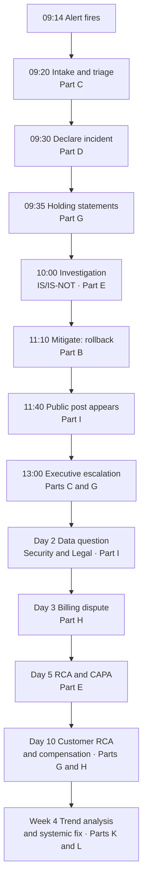
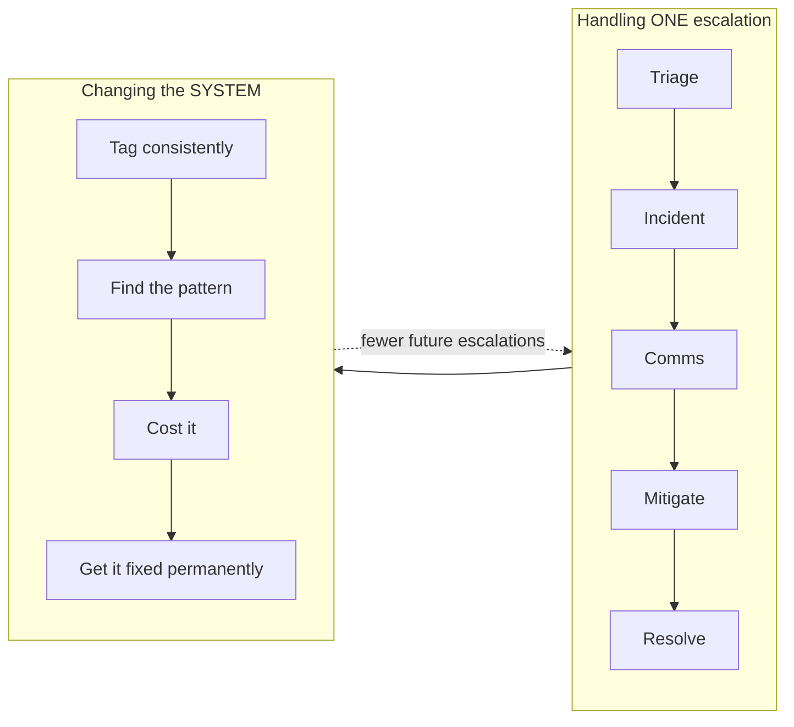

# Appendix 2 — A Worked Escalation, End to End

> **Why this exists:** the fifteen Parts teach fifteen toolkits separately. Real escalations don't arrive labelled by discipline — they arrive as a mess, and the skill is knowing which tool to reach for and when. This appendix runs **one continuous escalation** from first alert to permanent fix, calling out which framework applies at each moment and linking back to it.
>
> **Read this after Part L.** It is the consolidation exercise — the thing that turns fifteen separate mental models into one working process.

The scenario is fictional but composite, built so that every major discipline in the guide fires at least once.

---

## The scenario

An AI company sells an autonomous coding agent. Customers describe an application in plain language; the agent builds, tests, and deploys it. Pricing is usage-based, billed per agent run.

**Tuesday, 09:14.** A monitoring alert fires: elevated error rates on agent deployments. Within minutes, three support tickets arrive. One is from a large enterprise customer whose production application — built with the agent — has started failing for its own end users.

Here is how the next month unfolds.

---

## 09:14–09:30 — Intake, qualification, triage

The alert alone isn't an escalation. Three tickets alone aren't either. The **qualification** question is whether this meets escalation criteria — and it does, on three of the five triggers from [Part A](Part-A-support-escalation-landscape.md): **impact** (multiple customers), **urgency** (a production application is down for a customer's own users), and **risk** (a large account with contractual exposure).

Run the **intake question set** from [Part C](Part-C-escalation-lifecycle.md):

| Question | Answer here |
|---|---|
| What is happening? | Agent deployments failing; one customer's live app returning errors to *their* users |
| Who is affected? | Three known tenants; scope unconfirmed — **assume unknown, not small** |
| Since when? | First alert 09:14; customer says "since about 08:50" |
| Business impact | Enterprise customer's revenue-generating app is down |
| Workaround? | Unknown |
| Already tried? | Customer redeployed twice — which may have made it worse |
| What does the customer expect? | Their app working *today*; they have a board update Thursday |
| Deadline? | Yes — Thursday |
| Legal/privacy/safety? | Not apparent yet. **Note "yet."** |

**Severity:** Sev 1. Multiple tenants, production impact, no known workaround.

> **What a beginner should notice:** two things were recorded that seem minor and turn out to matter enormously. First, *"assume unknown, not small"* — resisting the temptation to scope optimistically. Second, the Thursday board deadline, which is the customer's *real* success criterion and will shape every decision. The stated problem is "the app is broken"; the actual requirement is "I must have something credible to say on Thursday."

---

## 09:30–09:35 — Declaring, and the roles

Declare the incident. Per [Part D](Part-D-incident-management.md), **under-declaring costs more than over-declaring** — a late declaration means a late response and a late customer message.

Roles are assigned immediately:

| Role | Who | Owns |
|---|---|---|
| Incident Commander | On-call engineering lead | Decisions, coordination — **and does not debug** |
| Ops lead | Platform engineer | The technical investigation |
| Comms lead | Support lead | Status page and broad messaging |
| Scribe | Second support engineer | Timestamped record |
| **Escalation manager** | **You** | Named-customer impact, relationships, commercial risk |

> **The boundary that matters:** the IC owns the *service*; you own the *customers*. You are not running the incident. You are making sure the three affected accounts — especially the enterprise one — are informed, understood, and represented while the IC restores service.

---

## 09:35 — The first message

You do not yet know the cause. Send a **holding statement** ([Part G](Part-G-communication-under-pressure.md)) — acknowledgement, scope, ownership, next update time. **No cause. No ETA.**

> *"We're aware that agent deployments are failing and that this is affecting your production application. We're actively investigating and I'm personally owning this until it's resolved. I'll update you by 10:15 whether or not we have a full answer."*

Simultaneously the comms lead posts to the status page, stating what's affected **and what isn't** — the element most often omitted, and the one that stops unaffected customers from flooding the queue.

> **Note what has *not* happened:** nobody has speculated about a cause, and nobody has promised a fix time. Both would create a retraction later, and per [Part G](Part-G-communication-under-pressure.md), **retractions cost more credibility than silence**.

---

## 10:00–11:10 — Investigation

The IC runs the technical work. You contribute the thing you're uniquely placed to supply: **the boundary of the problem**, using **IS / IS-NOT** from [Part E](Part-E-root-cause-analysis.md).

| Dimension | IS | IS NOT | Inference |
|---|---|---|---|
| **What** | Deployments of new/updated apps | Already-running apps untouched today | Failure is in the *deploy* path |
| **Who** | 3 tenants so far | Majority of tenants | Not universal — a subset |
| **When** | From ~08:45 | Fine before | Correlates with something at 08:45 |
| **Where** | All regions | — | Not regional infrastructure |
| **Extent** | Apps using one particular integration type | Simple apps deploy fine | **The boundary is the integration type** |

That last row is the breakthrough, and it came from comparing the affected against the unaffected rather than staring harder at the affected.

Engineering confirms: an **agent model update** was rolled out at 08:40. On apps using that integration, the agent now generates a subtly malformed configuration file. Tests pass — the config is syntactically valid — but deployment fails at runtime.

> **Two concepts from earlier Parts just collided.** This is a **regression** ([Part B](Part-B-saas-cloud-ai-fundamentals.md)) *and* it is an **AI behavior concern** ([Part J](Part-J-ai-behavior-trust-and-safety.md)) — the system did what it was designed to do and produced a wrong result. Note also that the customer's instinct, *"nothing changed on our side,"* was **literally true**. The model changed underneath them.

---

## 11:10 — Mitigation, not resolution

The IC rolls back the model update. Deployments recover within minutes.

Per [Part B](Part-B-saas-cloud-ai-fundamentals.md), this is **mitigation, not resolution** — customer pain has stopped, but the underlying defect in the newer model is untouched. Your message must reflect exactly that:

> *"Deployments are working again as of 11:10 — please retry and confirm. To be clear about where we are: we've restored service by reverting a change, and we've stopped the immediate impact. We have not yet fixed the underlying cause, and I'll come back to you separately on that with a full analysis. Next update at 14:00."*

> **Why the phrasing is careful:** saying "it's fixed" would be false and would guarantee a second, angrier escalation when the fix is later re-attempted. **Two clocks, two commitments.**

---

## 11:40 — It goes public

A developer at another affected customer posts publicly: *"Third hour of our app being down. Deploys silently broken. No status update until we chased."*

Two claims: one true (the outage), one contestable (the status page went up at 09:38). Per [Part I](Part-I-financial-legal-reputational-risk.md), the **reputational clock runs in hours** and you must never argue publicly even when you're right.

**The response:** fast, brief, human, from a named person, no admissions, move to private.

> *"You're right that deploys were failing — that was a change on our side and it's now reverted. Genuinely sorry for the disruption. I'm the escalation manager on this; DM me and I'll get you the full picture and the analysis when it's done."*

**What you do not do:** argue about the status page timing, ask for the post to be deleted (the **Streisand effect**), or reply with a corporate template — which, to a developer audience capable of checking the technical substance, reads as evasion.

---

## 13:00 — The executive escalation

The enterprise customer's VP emails your VP: *"This is the second incident this quarter. We need to understand whether this platform is safe for production."*

Note that the technical problem is already mitigated. This escalation is about **confidence**, not function — and per [Part C](Part-C-escalation-lifecycle.md), the fourth emotional driver is in play: the customer's VP chose your platform, and their own credibility is now exposed internally.

You send your VP a **one-pager** ([Part G](Part-G-communication-under-pressure.md)), BLUF, before they reply to anything:

> **Bottom line.** Agent deployments failed for ~2h25m due to a model update we have since reverted. Three tenants affected, including [Account]. Service restored 11:10. No data loss identified. Root cause understood; permanent fix in progress.
>
> **Impact.** [Account]'s production app unavailable 08:50–11:10. Two other tenants affected. One public complaint, responded to.
>
> **Status.** Contained. Not recurring. Reverted change is stable.
>
> **Actions.** Permanent fix + eval coverage (Eng, by Friday). Customer RCA report (me, Thursday AM). Post-incident review (Friday).
>
> **Risk.** [Account] renewal in 5 months; this is their second incident this quarter. Reputational exposure limited so far.
>
> **What I need.** Approval to offer a service credit under policy, and 20 minutes of your time for a joint call with their VP on Thursday.

> **Three things this does.** It ensures your VP never learns a fact from the customer first. It separates confirmed facts from open work. And it **brings a recommendation, not a menu** — the Thursday call is proposed, not requested as an option.

Note the date: **Thursday**, deliberately timed against the board deadline captured at intake. That's the intake question set paying off five hours later.

---

## Day 2 — The dimension that changes everything

While reviewing logs, an engineer notices the failed deployments wrote **customer configuration values, including an API key, into an error log** accessible to a broader internal group than intended.

Everything changes. Per [Part I](Part-I-financial-legal-reputational-risk.md), the first-hour discipline for suspected data exposure is:

1. **Preserve** the evidence — do not tidy the logs.
2. **Escalate immediately** to Security, Legal, and Privacy.
3. **Security leads** containment.
4. **Assess scope** — what data, whose, how many, who could access it.
5. **Legal decides** notification.
6. **Only Legal-approved language** goes out.

**What you must not do** — and the temptation is real, because you have a relationship with this customer and a call scheduled — is reassure them that no data was affected. A **premature all-clear that later reverses** converts an incident into a credibility crisis.

You also revisit intake. The question *"any legal, privacy, or safety dimension?"* was answered "not apparent **yet**." That qualifier is now doing real work: nothing has to be un-said.

> **The routing insight:** this stopped being a support matter the moment credentials appeared in a log. You are no longer the decision-maker — you're the coordinator and the factual record. Per [Part F](Part-F-cross-functional-coordination.md), Legal gets **facts, not conclusions**, and critically, you tell them **exactly what has already been communicated externally**, because that constrains every option they have.

---

## Day 3 — The money

The enterprise customer's invoice arrives showing a spike. During the failure window, their automated pipeline retried deployments repeatedly. Each retry was a billable agent run. The failed hours cost them roughly four times a normal day.

Run the **billing dispute decision tree** from [Part H](Part-H-billing-refunds-compensation.md):

| Question | Answer |
|---|---|
| Is the charge factually correct? | Yes — the runs genuinely executed |
| Did **our product** cause the consumption? | **Yes** — our regression caused the failures that triggered the retries |

That's the end of the tree. **Product-caused → refund the excess, and fix the defect.** No negotiation, no goodwill framing, no waiting to be pushed.

> **The senior move is doing this unprompted.** Waiting for the customer to notice and complain converts a recoverable situation into a second grievance. Proactively crediting it demonstrates that your accounting works in their favour too.

You also spot the **systemic** finding: the product will happily bill for retries of an operation *we* broke, and there is no anomaly alert on sudden usage spikes. That belongs in the RCA, not just this invoice — because per [Part H](Part-H-billing-refunds-compensation.md), repeatedly crediting the same failure mode is **quietly funding a defect forever**.

---

## Day 5 — The RCA

Per [Part E](Part-E-root-cause-analysis.md), start with **5 Whys**, then check it with a broader lens.

> 1. **Why did deployments fail?** The agent generated a malformed configuration for one integration type.
> 2. **Why?** A model update changed how it formats that configuration.
> 3. **Why wasn't it caught?** No evaluation case covered that integration type.
> 4. **Why not?** Eval coverage was built around the most common integrations; this one was added later and never backfilled.
> 5. **Why?** There's no process requiring eval coverage when a new integration ships.

**Actionable cause:** no process links shipping a new integration to adding eval coverage. Fixing *that* prevents a whole class of future regressions — not just this one.

Now apply the **Swiss cheese** check — *which defence layers had holes?*

| Layer | Hole |
|---|---|
| Evals | No case for this integration |
| Staged rollout | Model update went to 100% at once |
| Monitoring | Alerted on error rate, not on deployment success rate — 25 minutes of delay |
| Billing safeguards | Retries billed with no anomaly detection |
| Logging | Configuration values written to logs |

> **Notice what didn't happen:** nobody concluded "an engineer forgot to add an eval." Five independent defences had holes. That's five actions, and it's why *"why did our system let this reach customers?"* is a far more productive question than *"who erred?"*

**CAPA + Detective:**

| Type | Action | Owner | Date | Verification |
|---|---|---|---|---|
| **Corrective** | Fix config generation; re-release | Eng | Day 8 | Deployed and confirmed across two release cycles |
| **Detective** | Alert on deployment success rate | Platform | Day 10 | Tested by simulating failure; fired in 90s |
| **Detective** | Anomaly alert on usage spikes | Billing | Day 20 | Triggered on a replayed spike |
| **Preventive** | Eval case for every integration type | AI team | Day 15 | Suite runs in CI; blocks release on regression |
| **Preventive** | **Process:** new integration requires eval coverage | Eng mgmt | Day 25 | Checklist enforced in release process |
| **Preventive** | Staged rollout mandatory for model updates | AI team | Day 30 | Verified on next update |
| **Preventive** | Redact secrets from logs | Security | Day 12 | Confirmed by scan |

> **"Done" is not a status here — verification is.** Per [Part E](Part-E-root-cause-analysis.md), an action list without verification is the **RCA action graveyard**, and it's why the same incident returns in a quarter.

The "where we got lucky" entry: this happened at 08:45 on a Tuesday. At peak, the blast radius would have been roughly six times larger. That's a finding, not a comfort — and it strengthens the case for staged rollout.

---

## Day 10 — Report and compensation

**The customer-facing RCA** ([Part G](Part-G-communication-under-pressure.md)) differs from the internal one: confirmed findings only, roles rather than individuals, no "where we got lucky," and **dated preventive actions as the centrepiece** — because the customer isn't reading it to learn what broke, they're reading it to decide whether to keep trusting you.

**The compensation decision** runs the five inputs from [Part H](Part-H-billing-refunds-compensation.md):

| Input | Assessment |
|---|---|
| **Fault** | Clearly ours. No ambiguity — don't haggle |
| **Impact** | 2h25m production outage; retry charges quantified precisely |
| **Contract** | SLA breached → service credit due. **The floor, not the ceiling** |
| **Relationship** | Strategic account, second incident this quarter |
| **Precedent** | Would we do this for a smaller customer in the same position? |

**Outcome:** full refund of retry charges (product-caused, non-negotiable), the contractual service credit applied **proactively without requiring a claim**, and — because the service credit is sized to the fee rather than to their business loss — **non-financial levers** where they matter more: a named contact, early access to the staged-rollout capability, and a standing quarterly review with engineering.

> **Why the non-financial part matters most here.** Their VP's actual fear is *"will this happen again and will anyone care?"* Money doesn't answer that. Visible structural change does. Per [Part H](Part-H-billing-refunds-compensation.md), these levers often cost less than the credit being demanded and repair trust far more durably.

And per [Part J](Part-J-ai-behavior-trust-and-safety.md), you do **not** promise it can't recur:

> *"I want to be straight with you rather than give you a guarantee I can't honour. We've added an evaluation case for your integration so this specific regression would now be caught before release, made staged rollout mandatory for model updates, and added alerting that would surface this in about 90 seconds instead of 25 minutes. These systems are probabilistic, so I won't tell you failure is impossible. What I will commit to is that we'll detect it far faster, and that you have a direct line to me."*

---

## Week 4 — Systemic

One escalation, handled well, is competence. The role's actual mandate is the next step.

Per [Part K](Part-K-metrics-and-trend-analysis.md), you tag this escalation across all five dimensions — symptom (deployment failure), component (agent config generation), root cause category (missing eval coverage), source (monitoring + tickets), preventability (yes) — and then look at the quarter.

**Pareto finds it:** three of the last eleven escalations share the root-cause category *"model update regression not covered by evals."* Together they account for 31% of escalation volume, the largest single block of credits issued, and two accounts now flagged at renewal risk.

That is no longer an incident report. Per [Part M](Part-M-miscellaneous-deeper-topics.md), it is a **business case**:

> *Three escalations this quarter share one cause: model updates reaching production without eval coverage for newer integrations. Combined cost: £X in credits, Y engineering hours, Z support hours, and two accounts at renewal risk. Individually each looked like a minor bug. Together they are the single largest driver of escalations this quarter, and they will keep recurring until eval coverage is enforced at release.*

Per [Part L](Part-L-playbooks-slas-scaling.md), you also convert the experience into reusable assets:

- A **playbook** for "model update regression" — trigger, first 30 minutes, IS/IS-NOT prompts, rollback decision criteria, comms templates. Tested against the **3am rule**: could someone uninvolved follow it?
- A **template** for the mitigation-versus-resolution message, because that distinction was the highest-risk communication in the whole incident.
- A **VoC loop closure** — telling the customer *and the internal teams* what changed as a result. Engineers who never learn the outcome of their effort stop investing in the next one.

---

## What this example demonstrates

| The escalation touched | Which is [Part] |
|---|---|
| Qualification, intake questions, severity | [C](Part-C-escalation-lifecycle.md) |
| Incident roles, declaration, status page | [D](Part-D-incident-management.md) |
| Holding statement, two clocks, exec one-pager, customer RCA | [G](Part-G-communication-under-pressure.md) |
| Regression, rollback, mitigation vs resolution | [B](Part-B-saas-cloud-ai-fundamentals.md) |
| IS/IS-NOT, 5 Whys, Swiss cheese, CAPA, verification | [E](Part-E-root-cause-analysis.md) |
| Public response, data exposure, Legal routing | [I](Part-I-financial-legal-reputational-risk.md) |
| Dispute tree, five compensation inputs, non-financial levers | [H](Part-H-billing-refunds-compensation.md) |
| AI regression, evals, honest probabilistic promise | [J](Part-J-ai-behavior-trust-and-safety.md) |
| Facts-not-conclusions to Legal, business case to Product | [F](Part-F-cross-functional-coordination.md) |
| Tagging, Pareto, cost of the pattern | [K](Part-K-metrics-and-trend-analysis.md) |
| Playbook, template, VoC closure | [L](Part-L-playbooks-slas-scaling.md) |

> **The single most important thing in this appendix:** the first 90% of the timeline is what most people mean by "handling an escalation." The last section — tagging, Pareto, business case, playbook — is what the job description means by *"identify recurring patterns and drive long-term improvements."* Everything before Week 4 stops the bleeding. **Only Week 4 reduces next quarter's escalations.**

---

## Use this as an interview answer

This scenario answers a large share of the question bank. If you're asked *"walk me through a complex escalation,"* you now have a complete narrative arc to structure your own real example against:

**Qualify → triage → declare → communicate → bound the problem → mitigate → separate the clocks → handle the public and executive dimensions → route the risk → resolve the money fairly → RCA with verification → find the pattern → change the system.**

Practice narrating it in **two minutes**, then in **thirty seconds**. Both versions are useful — the long one for "walk me through," the short one for "give me an example of..."

---

*Back to the [master index](../Escalations%20Manager%20-%20Study%20Guide.md) · Test yourself: [Part N — Question Bank](Part-N-interview-question-bank.md)*
