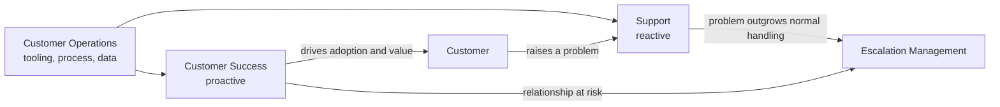
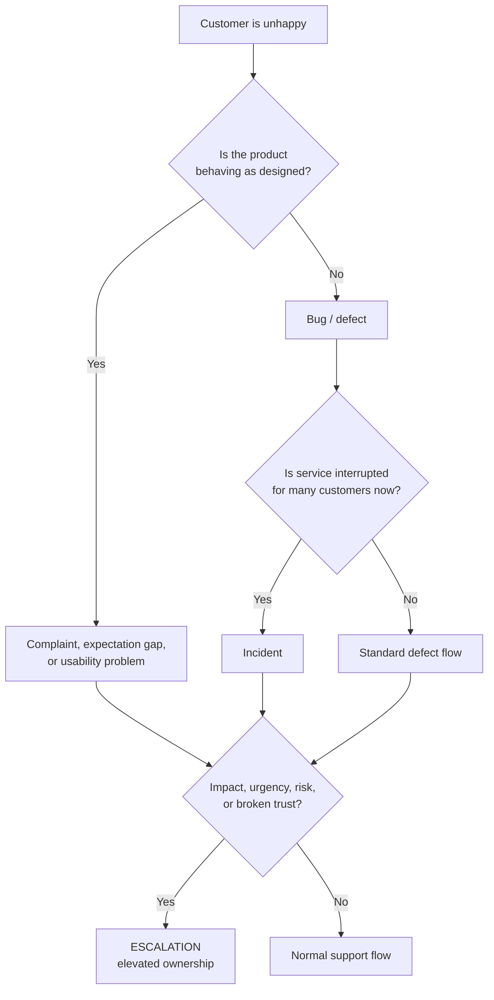
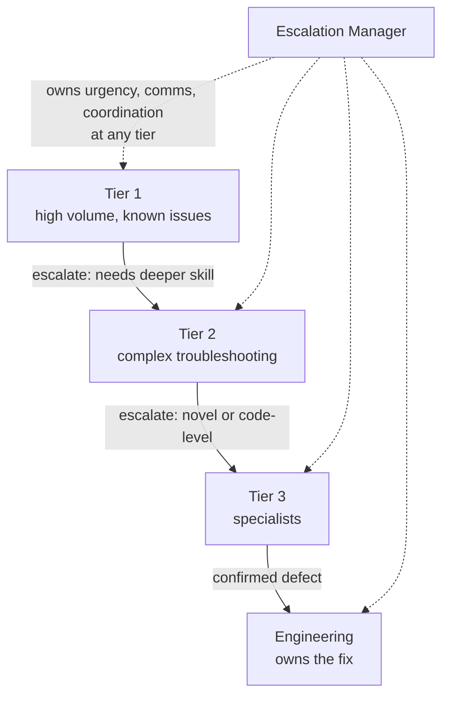
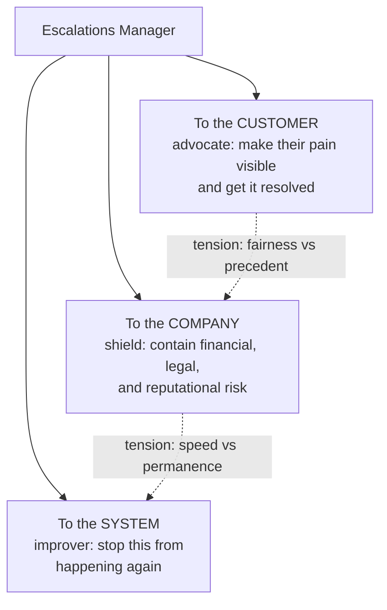
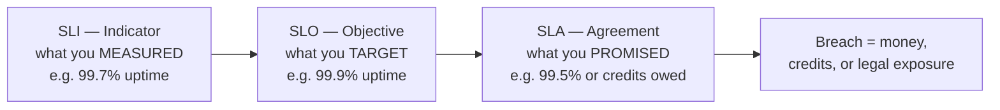

# Part A — The Support & Escalation Landscape

> **Section goal:** give you the complete vocabulary and mental map of the customer-support world, so that when an interviewer says "tier-two swarm on a Sev-1 with an SLA breach," you hear a plain sentence instead of noise. This Part is the foundation every later Part stands on.

Covers index items **1–6**. Maps to job responsibilities: *own high-priority customer and executive escalations across tickets, enterprise accounts, and social media.*

---

## 1. What support, success, and operations actually do

Companies that sell software to other people need someone to answer the question *"it's not working / I don't understand it / I'm unhappy."* Over time this split into three different jobs that are constantly confused with each other.

- **Customer Support** — **reactive**. The customer has a problem *right now* and raises a request. Support answers it. Success is measured in *resolution*.
- **Customer Success (CS)** — **proactive**. Nobody has a problem yet. CS makes sure the customer is actually getting value, adopting the product, and will renew. Success is measured in *retention and growth*.
- **Customer Operations** — **the machine behind both**. Tooling, process, routing rules, staffing models, reporting. Success is measured in *efficiency and consistency*.

### 🔍 Plain-English deep-dive: why the distinction matters

- **Reactive** — *waiting for the customer to come to you.* **Analogy:** a hospital emergency room. **Why it matters:** it is demand-driven, so you can't schedule it; you staff for probability.
- **Proactive** — *going to the customer before they hurt.* **Analogy:** an annual health check-up. **Why it matters:** it prevents escalations, which is cheaper than resolving them.
- **Churn** — *a customer cancelling.* **Analogy:** a gym member who quietly stops renewing. **Why it matters:** almost every escalation is ultimately judged by whether it caused churn.

| | Support | Customer Success | Customer Operations |
|---|---|---|---|
| Trigger | Customer reports issue | Calendar / health score | Continuous |
| Time horizon | Hours to days | Months to years | Quarters |
| Primary metric | Resolution time, CSAT | Retention, expansion | Cost per contact, SLA attainment |
| Typical failure | Slow or wrong answer | Silent churn | Bad routing, blind spots |

> 💡 **On the job:** escalations arrive from *both* Support and Success, and they arrive for different reasons. A Support escalation is usually "this is broken and I'm losing money." A Success escalation is usually "I've lost confidence in you." The second is harder to fix, because there is often nothing technically wrong.

---

## 2. What an escalation is — and is not

An **escalation** is what happens when a problem *outgrows the normal process that was handling it*. That is the whole definition. It is not a category of problem; it is a change in how the problem is being handled.

Something becomes an escalation when at least one of these is true:

1. **Impact** is larger than normal (many users, revenue at risk, a critical workflow blocked).
2. **Urgency** is higher than normal (a deadline, a launch, a regulator, a board meeting).
3. **Normal process has failed** (too slow, bounced between teams, repeatedly reopened).
4. **Emotion / relationship** has broken down (loss of trust, threat to cancel, executive anger).
5. **Risk** has appeared (legal, financial, reputational, safety).

### 🔍 Plain-English deep-dive: four words people mix up

- **Complaint** — *an expression of dissatisfaction.* **Analogy:** "this meal is cold." **Why it matters:** a complaint may have no technical defect at all; the fix is often communication, not code.
- **Bug (defect)** — *the product does not behave as designed.* **Analogy:** the oven's thermostat is miscalibrated. **Why it matters:** bugs need engineering; they have a lifecycle measured in releases, not minutes.
- **Incident** — *an unplanned interruption or degradation of service.* **Analogy:** the restaurant's power is out. **Why it matters:** incidents are time-bound events with a start and an end, and they usually affect many customers at once.
- **Escalation** — *a case that needs elevated ownership, urgency, or authority.* **Analogy:** the manager is called to the table. **Why it matters:** an escalation can be caused by any of the above — or by none of them.

> **The single most important idea in this Part:** *incident* describes the **event**, *escalation* describes the **handling**. A Sev-1 outage handled smoothly may never become an escalation. A tiny cosmetic bug can absolutely become one if it blocks a CEO's demo.

---

## 3. Escalation channels

Escalations do not politely arrive in one queue. A senior escalation role is expected to cover all of these, each with different rules.

| Channel | What arrives | What's different about it |
|---|---|---|
| **Support ticket queue** | Standard cases flagged urgent | Structured, has history and logs; easiest to work |
| **Enterprise / named accounts** | Account team raises on behalf of a big customer | Commercial context matters; contract and renewal date in play |
| **Executive escalation** | Customer exec → your exec | Extremely short patience; requires written summaries; visibility is the risk |
| **Social media / public** | Public post, review site, forum, developer community | Reputational clock is faster than technical clock; needs comms/PR partnership |
| **Legal / regulatory** | Formal letter, privacy request, compliance body | Never freelance; Legal leads, you supply facts |
| **Internal** | Engineer, CS manager, or on-call flags a pattern | Often the earliest and cheapest signal |

### 🔍 Plain-English deep-dive: the "executive escalation"

- **Executive escalation** — *a complaint routed through senior leadership rather than the normal queue.* **Analogy:** skipping the customer service desk and writing to the airline's CEO. **Why it matters:** the *content* is usually an ordinary problem, but the *handling bar* is far higher — leadership needs a crisp written position within hours, not a technical log dump.
- **Sponsor** — *the senior person on the customer side who authorized buying the product.* **Analogy:** the person who signed the lease, not the person living in the flat. **Why it matters:** when the sponsor escalates, renewal is implicitly on the table.

---

## 4. Support tiers, swarming, and the escalation path

Traditional support is layered like a pyramid.

- **Tier 1 (L1)** — first contact. Handles common, documented issues. Optimizes for volume.
- **Tier 2 (L2)** — deeper product troubleshooting. Handles configuration, complex reproductions.
- **Tier 3 (L3)** — deepest specialists, often closest to engineering. Handles rare, novel, code-level issues.
- **Engineering** — owns the code. Fixes defects; is *not* a support queue.

### 🔍 Plain-English deep-dive: tiers vs swarming

- **Tiered model** — *cases move up a ladder of expertise.* **Analogy:** a hospital triage nurse → doctor → specialist. **Strength:** cheap and scalable. **Weakness:** repeated handoffs, context lost each time, customer repeats themselves.
- **Swarming** — *instead of escalating up, you pull the right people to the case and keep one owner.* **Analogy:** a pit crew descending on one car at once. **Strength:** fewer handoffs, faster for complex issues. **Weakness:** expensive; needs a strong culture.
- **Intelligent swarming** — *swarming where a case owner recruits helpers but never hands over ownership.* **Why it matters:** this is the model most modern SaaS companies aspire to, and it is a strong thing to reference in an interview.

| | Tiered | Swarming |
|---|---|---|
| Ownership | Transfers upward | Stays with one owner |
| Customer experience | Repeats context | Continuous |
| Best for | High volume, repeatable | Complex, novel, high-value |
| Risk | Handoff black holes | Senior-time drain |

> **Critical distinction:** the escalation manager sits *across* the tiers, not above them. Their authority comes from ownership of the outcome, not from being the most technical person in the room.

---

## 5. The Escalations Manager mandate

The job has three simultaneous, sometimes conflicting, loyalties.

**What the role owns**
- End-to-end outcome of the escalation, including communication.
- The *pace* — driving decisions rather than waiting for them.
- The written record: summaries, timelines, post-mortems.
- The pattern: turning repeat escalations into permanent fixes.

**What the role does not own**
- The code fix (Engineering owns that).
- The roadmap decision (Product owns that).
- The legal position (Legal owns that).
- The commercial concession, beyond an agreed framework (Finance/Sales own that).

### 🔍 Plain-English deep-dive: "influence without authority"

- **Influence without authority** — *getting people who don't report to you to prioritize your problem.* **Analogy:** a wedding planner. They employ nobody — not the florist, not the caterer, not the venue — yet the day runs on time because they own the *outcome* and control the *information*. **Why it matters:** this is the single most-tested competency in escalation-manager interviews. Your levers are: quantified impact, clear deadlines, named owners, written follow-ups, and escalation to a decision-maker when a lever fails.

> **Boundary discipline is a senior signal.** Junior escalation handling says "I'll get engineering to fix it today." Senior handling says "I've quantified impact, engineering has committed to a mitigation by 6pm and a permanent fix in the next release, and I've told the customer exactly that." The second one is a promise you can keep.

---

## 6. Core acronyms decoded

This is the vocabulary layer. Learn these six cold and most support conversations become readable.

| Term | Full form | Plain meaning | Analogy |
|---|---|---|---|
| **SLA** | Service Level *Agreement* | A **promise to the customer**, usually contractual, often with a penalty | The pizza place's "30 minutes or it's free" |
| **SLO** | Service Level *Objective* | An **internal target** you aim for, stricter than the SLA | Aiming to deliver in 20 minutes so you never breach 30 |
| **SLI** | Service Level *Indicator* | The **actual measurement** | The stopwatch reading |
| **CSAT** | Customer *Satisfaction* | "How satisfied were you with this interaction?" usually 1–5 | The smiley-face buttons at the airport |
| **NPS** | Net Promoter Score | "How likely are you to recommend us?" 0–10, relationship-level | Would you tell a friend about this restaurant |
| **MTTR** | Mean Time To Restore/Resolve | Average time from start of an incident to service restored | Average minutes to get the power back on |
| **RCA** | Root Cause Analysis | Structured investigation into *why* it happened | Fire investigator, not firefighter |
| **CAPA** | Corrective And Preventive Action | Fix this instance; prevent the class | Patch the roof; also re-check every roof |
| **T&S** | Trust & Safety | Team handling abuse, harmful content, policy enforcement | Building security and house rules |
| **VoC** | Voice of the Customer | The formal loop feeding customer insight into product | Suggestion box that someone actually reads |

### 🔍 Plain-English deep-dive: SLA vs SLO vs SLI

These three are asked constantly, and candidates routinely fumble them.

**The memory rule:** **I**ndicator = **I** measured it. **O**bjective = **O**ur internal goal. **A**greement = **A**greed with the customer, and it costs money if broken. The SLO is always **stricter** than the SLA, so that missing your internal target is an early warning rather than a breach.

---

## ⭐ Likely Interview Questions for This Section

**Q1. "What's the difference between an incident and an escalation?"**
> *Model answer:* An incident describes the **event** — an unplanned interruption or degradation of service, with a start and an end. An escalation describes the **handling** — a case that needs elevated ownership, urgency, or authority. They're independent. A major outage handled well, with proactive communication and fast mitigation, may never become an escalation. Conversely, a minor cosmetic bug becomes an escalation if it blocks a customer's product launch or if trust has already broken down. I treat "is this an incident?" as a technical question and "is this an escalation?" as a risk-and-relationship question.

**Q2. "What actually triggers an escalation?"**
> *Model answer:* Five triggers, and it only takes one: **impact** beyond the normal blast radius; **urgency** driven by an external deadline; **process failure**, where normal handling has stalled or the case keeps reopening; **relationship breakdown**, where trust or confidence is lost; and **risk**, meaning legal, financial, reputational, or safety exposure. The fifth is the one people miss — an escalation can be technically minor but existentially risky.

**Q3. "Explain SLA, SLO, and SLI."**
> *Model answer:* The SLI is the measurement — the actual number, like 99.7% availability. The SLO is the internal target we manage to, say 99.9%. The SLA is the contractual promise to the customer, say 99.5%, usually with service credits if breached. You deliberately set the SLO stricter than the SLA so that missing the internal target is an early warning signal, not a contractual event. In escalations this matters because "we're trending toward an SLO miss" is an internal conversation, while "we've breached the SLA" is a commercial and legal one.

**Q4. "What's the difference between tiered support and swarming?"**
> *Model answer:* In a tiered model, cases move up a ladder — L1 to L2 to L3 — and ownership transfers at each step. It's efficient at high volume but creates handoffs, and every handoff loses context and forces the customer to repeat themselves. Swarming keeps a single owner who pulls in the specialists they need without handing the case over. It's faster and better for complex or high-value work, but it consumes senior time. Most escalations should be swarmed, because by definition they've already failed the tiered path.

**Q5. "You have no authority over Engineering. How do you get your issue prioritized?"**
> *Model answer:* Authority comes from owning the outcome and controlling the information, not from reporting lines. Practically: I quantify impact in terms the other team already cares about — users affected, revenue at risk, contractual exposure, reproducibility. I bring a clean, reproducible case with evidence, so I'm not asking them to do my investigation. I ask for a specific decision by a specific time with a named owner, not for vague "attention." I follow up in writing so commitments are visible. And if a lever fails, I escalate to the level where a trade-off decision can legitimately be made — framed as a prioritization question, not a complaint about a team.

**Q6. "Where does the escalation manager's ownership stop?"**
> *Model answer:* I own the outcome, the pace, the communication, and the written record — and I own converting the pattern into a permanent fix. I don't own the code fix, the roadmap decision, the legal position, or commercial concessions beyond an agreed framework. Being clear about that boundary is what makes my commitments credible: I never promise a fix time that isn't mine to promise. I promise a decision time, an update cadence, and a named owner.

**Q7. "A customer complains but the product is working exactly as designed. Is that still an escalation?"**
> *Model answer:* Often yes. An escalation is about elevated handling, not about defect existence. If the customer bought on a different expectation, or a workflow they depend on is technically "correct" but practically unusable, the pain is real and the churn risk is real. The resolution path is just different: instead of a code fix, it's expectation reset, documentation, configuration, a workaround, or a genuine product-gap conversation with Product. What I'd avoid is the classic trap of replying "working as intended" and closing it — that phrase resolves the ticket and loses the customer.

---

## 🧠 30-Second Memory Hooks

- **Escalation = handling, incident = event.** The event is what happened; the escalation is how urgently we're treating it.
- **Five escalation triggers:** **I**mpact, **U**rgency, **P**rocess failure, **R**elationship, **R**isk → *"I Urgently Push Real Risk."* **Risk is the sneaky fifth** that candidates forget.
- **SLI → SLO → SLA:** **I** measured, **O**ur goal, **A**greed with customer. Tightest to loosest.
- **Support = reactive ER. Success = proactive check-up. Ops = the hospital's plumbing.**
- **Tiers hand off; swarms hold on.** Escalations should be swarmed — they already failed the ladder.
- **Wedding planner** = influence without authority. Own the outcome, control the information.
- **"Working as intended"** closes tickets and loses customers.

---

## 🔁 Rapid Recall Drill

Cover the answers and say these aloud. If you hesitate, reread the numbered section.

1. Define escalation in one sentence, without using the word "urgent." *(§2)*
2. Name the five escalation triggers. *(§2)*
3. Which is stricter, SLO or SLA — and why is it deliberately so? *(§6)*
4. Give one strength and one weakness of swarming. *(§4)*
5. Name three things the escalation manager does **not** own. *(§5)*
6. Which channel has a reputational clock faster than its technical clock? *(§3)*
7. CSAT vs NPS — which is transactional and which is relationship-level? *(§6)*

---

*Next suggested section:* **[Part B — SaaS, Cloud & AI Product Fundamentals](Part-B-saas-cloud-ai-fundamentals.md)** — now that you know the support vocabulary, you need the product vocabulary, because you cannot credibly run an escalation about a system you can't describe.
