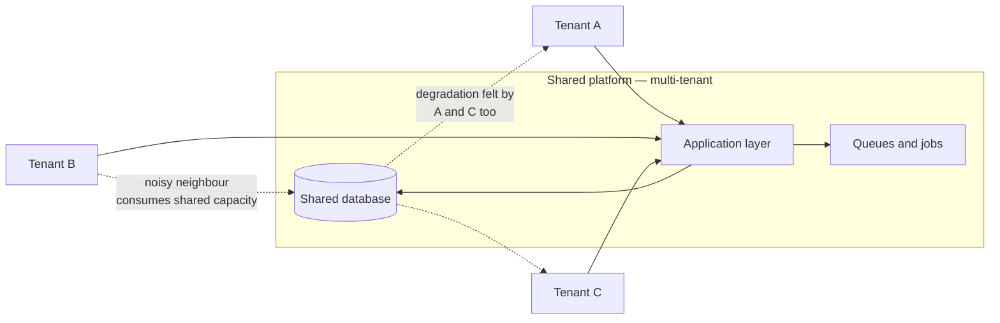
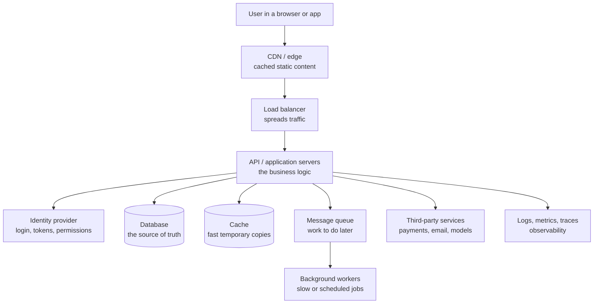
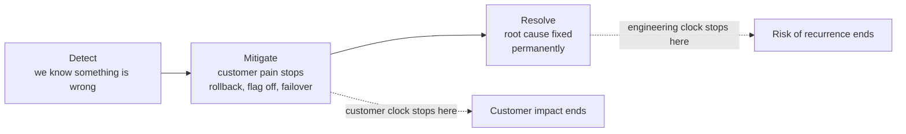
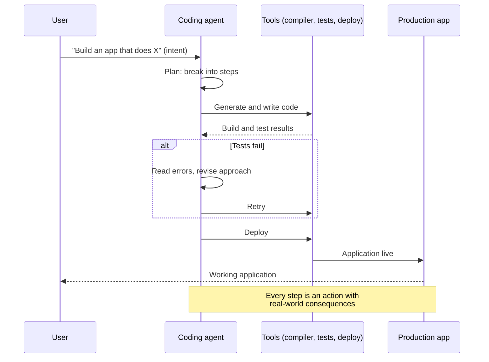
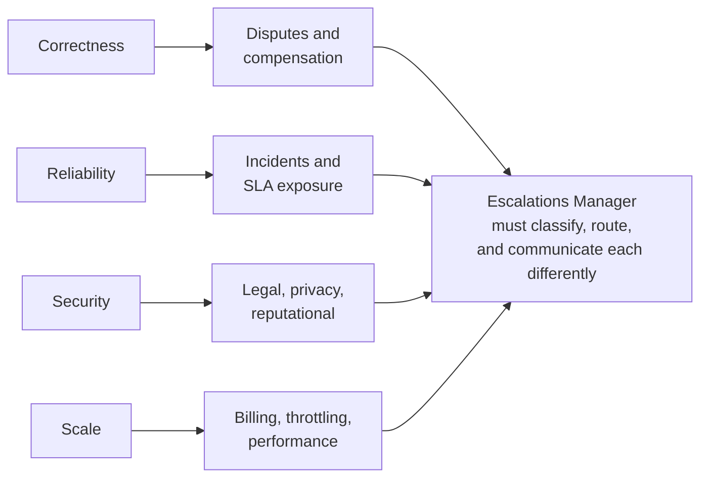

# Part B — SaaS, Cloud & AI Product Fundamentals

> **Section goal:** give you enough genuine technical literacy to run an escalation about a modern AI product — to read an engineer's explanation, ask the right follow-up, and translate it for a customer or an executive. You are not becoming an engineer. You are becoming someone engineers don't have to simplify for.

Covers index items **7–12**. Maps to job requirements: *experience in SaaS, AI, and enterprise software environments; handling disputes involving platform reliability and AI-generated outputs.*

---

## 7. What "SaaS" actually means

**SaaS** = **Software as a Service**. Instead of buying software on a disc and installing it on your own computer, you rent access to software that runs on the vendor's computers, over the internet, usually paid monthly or by usage.

**Analogy:** owning a car (traditional software — you buy it, you maintain it, it's yours, it's outdated in three years) versus a subscription car service (SaaS — you always get the current model, someone else services it, and you stop paying and it's gone).

### 🔍 Plain-English deep-dive: the concepts that create escalations

- **Multi-tenancy** — *many different customers share the same underlying system, separated by software rules rather than separate machines.* **Analogy:** an apartment block. Everyone has their own locked flat, but they share the plumbing and the lift. **Why it matters:** this is the single biggest driver of large escalations. When the shared lift breaks, *everyone* is stuck at once. It's also why "can you just fix it for my account only?" is often technically hard.
- **Tenant / instance** — *one customer's isolated slice of the system.* **Analogy:** your specific flat. **Why it matters:** "is this tenant-specific or platform-wide?" is the very first question in triage, because it decides whether you have a case or an incident.
- **Noisy neighbour** — *one tenant consuming so many shared resources that others slow down.* **Analogy:** the neighbour running a laundromat out of their flat, so nobody else has hot water. **Why it matters:** explains the frustrating class of escalation where a customer is degraded and has done nothing wrong.
- **Environment** — *a separate copy of the system for a purpose.* Typically **development** (engineers build), **staging** (a rehearsal copy that mimics production), and **production** (the real thing, real customers, real data). **Analogy:** rehearsal room, dress rehearsal, opening night. **Why it matters:** "it works in staging" is the most common and least useful sentence in an escalation.

---

## 8. Anatomy of a modern cloud application

You need a mental picture of where things break. Almost every technical escalation lives somewhere on this diagram.

### 🔍 Plain-English deep-dive: each box, and how it fails

| Component | Plain meaning | Analogy | Typical escalation it causes |
|---|---|---|---|
| **CDN / edge** | Copies of content stored near the user | Local corner shops stocking popular items | "Users in one region see an old version" |
| **Load balancer** | Distributes incoming requests across servers | Restaurant host seating guests across waiters | "Some requests fail, some work" — the classic *intermittent* case |
| **API** | The program that does the actual work | The kitchen | Errors, timeouts, wrong results |
| **Identity / auth** | Proves who you are and what you may do | The building's badge system | "Can't log in", "lost access", permission errors |
| **Database** | Permanent store of truth | The filing cabinet | Slow queries, data missing, data wrong |
| **Cache** | Fast temporary copy | Sticky note on your desk | **Stale data** — "I changed it but it still shows the old value" |
| **Queue / workers** | Jobs done in the background | Out-tray processed later | Delays, backlogs, "it never finished" |
| **Third party** | Someone else's service you depend on | A supplier | Your outage caused by *their* outage |
| **Observability** | Logs, metrics, traces | CCTV and the flight recorder | If it's missing, you cannot investigate |

- **Latency** — *how long something takes.* **Analogy:** how long the food takes to arrive. **Why it matters:** most "it's broken" reports are actually "it's unbearably slow."
- **Timeout** — *giving up waiting after a set period.* **Analogy:** hanging up after ringing for a minute. **Why it matters:** timeouts turn slowness into visible errors, so a latency problem often *presents* as a failure.
- **Idempotency** — *doing the same operation twice has the same effect as doing it once.* **Analogy:** pressing a lift button twice doesn't summon two lifts. **Why it matters:** this is exactly why customers get **double-charged** or get duplicate records when a request is retried. It shows up constantly in billing disputes.
- **Race condition** — *two things happen at once and the result depends on which wins.* **Analogy:** two people editing the same document and saving over each other. **Why it matters:** the classic "can't reproduce it" bug.

---

## 9. Production vocabulary

These words appear in every incident bridge. Using them precisely marks you as senior.

| Term | Plain meaning | Analogy |
|---|---|---|
| **Production ("prod")** | The live system real customers use | Opening night, paying audience |
| **Outage** | Service is down; the function does not work | The power is out |
| **Degradation** | Service works but badly — slow or partly failing | The power is on but the lights flicker |
| **Partial / regional outage** | Down for some customers or regions only | One floor of the building has no power |
| **Regression** | Something that used to work is now broken | A repaired roof that starts leaking again after the next job |
| **Deployment / release** | Pushing new code to production | Opening a new version of the show |
| **Rollback** | Reverting to the previous known-good version | Putting last week's script back |
| **Hotfix / patch** | Small urgent fix pushed outside normal schedule | Emergency repair between shows |
| **Feature flag** | A switch that turns a feature on/off without redeploying | A light switch instead of rewiring |
| **Canary / staged rollout** | Releasing to a small % of users first | Letting ten people taste the new dish before the menu changes |
| **Blast radius** | How much and who is affected | How many streets lost power |
| **Workaround / mitigation** | Restores service without fixing the cause | A generator |
| **Permanent fix / remediation** | Actually fixes the cause | Repairing the grid |

### 🔍 Plain-English deep-dive: mitigation vs resolution

This distinction is the backbone of incident and escalation communication.

> **The senior insight:** the customer cares about **mitigation** — when does my pain stop. Engineering often reports **resolution** — when is the cause fixed. Confusing the two is how escalation managers accidentally lie to customers. Always communicate them as two separate timelines.

- **Rollback vs roll-forward** — *going back to the old version vs fixing forward with a new one.* **Why it matters:** rollback is usually faster and safer, but it's impossible if the release changed data structures irreversibly. Asking "can we roll back, and if not, why not?" is a genuinely strong question on a bridge call.

---

## 10. LLMs and AI agents in plain English

This is the domain layer for an AI-native company. Get these right and you can hold a credible conversation about AI failures.

- **Model** — *a program that has learned patterns from a very large amount of data, and uses them to predict.* **Analogy:** someone who has read an enormous library and can continue any sentence plausibly. **Why it matters:** it *predicts*, it does not *look up*. That single fact explains most AI failures.
- **LLM (Large Language Model)** — *a model trained on text that predicts the next chunk of text.* **Analogy:** extremely sophisticated autocomplete. **Why it matters:** fluency is not accuracy. It will produce a confident, well-formed wrong answer as readily as a right one.
- **Token** — *a small chunk of text, roughly a word-piece; models read and write in tokens and are usually billed per token.* **Analogy:** syllables. **Why it matters:** tokens are the unit of both **cost** and **limits**, so they appear directly in billing disputes.
- **Context window** — *how much text the model can consider at once.* **Analogy:** how much of the desk you can see at a glance. **Why it matters:** exceed it and earlier information silently drops out — a common cause of "it forgot what I told it."
- **Prompt** — *the instruction given to the model.* **Analogy:** the brief you hand a contractor. **Why it matters:** most quality complaints are prompt/context problems, not model problems.
- **Inference** — *the act of running the model to get an answer.* **Analogy:** actually asking the question. **Why it matters:** inference costs money and time — it's where latency and cost escalations originate.
- **Fine-tuning** — *further training a model on specific data to specialize it.* **Analogy:** sending a generalist on a specialist course.
- **RAG (Retrieval-Augmented Generation)** — *fetching real documents first, then asking the model to answer using them.* **Analogy:** open-book exam instead of memory. **Why it matters:** it's the standard mitigation for hallucination, and its failures ("it cited the wrong doc") are their own escalation category.
- **Agent** — *an AI system that doesn't just answer, but takes actions in a loop: plan → act → observe → repeat.* **Analogy:** the difference between an advisor who tells you what to do and a contractor who goes and does it. **Why it matters:** this is where risk multiplies, because mistakes become *actions*, not just *words*.

### 🔍 Plain-English deep-dive: what an autonomous coding agent does

An **autonomous coding agent** takes a plain-language request — "build me an app that does X" — and writes, tests, and deploys working software with limited human intervention.

**Why this matters for escalations:** each stage produces a distinct failure category, and your triage question changes accordingly.

| Stage | Failure looks like | Customer says |
|---|---|---|
| Understanding intent | Built the wrong thing | "This isn't what I asked for" |
| Planning | Reasonable steps, wrong architecture | "It works but it's unusable at scale" |
| Code generation | Bugs, insecure code, wrong library | "It's broken / it's a security risk" |
| Testing | Passed tests but wrong behavior | "You said it worked. It doesn't." |
| Deployment | Broke a live application | "You took down my production app" |
| Cost | Loops, retries, token burn | "Why is my bill this high?" |

---

## 11. Failure modes unique to AI systems

Traditional software fails **deterministically** — same input, same wrong output, every time. AI systems don't, and this breaks the entire classical support playbook.

- **Non-determinism** — *the same input can produce different outputs on different runs.* **Analogy:** asking a skilled chef to make the dish again; it's never molecule-identical. **Why it matters:** "steps to reproduce" — the foundation of all traditional bug reports — may simply not reproduce. You must capture evidence *at the time*, because you may never see it again.
- **Hallucination / confabulation** — *the model generates confident, plausible, false content.* **Analogy:** a student who didn't read the book writing a fluent essay full of invented citations. **Why it matters:** the danger is the *confidence*. Users trust fluent output. In coding agents, it means invented functions or libraries that don't exist.
- **Prompt injection** — *malicious instructions hidden in content the model reads, hijacking its behavior.* **Analogy:** slipping a forged note into a manager's inbox saying "give the bearer the safe key." **Why it matters:** this is a genuine **security** class, not a quality class — especially for agents that read external data and can take actions.
- **Data leakage** — *sensitive information appearing where it shouldn't.* **Analogy:** the photocopier that keeps images of everything copied. **Why it matters:** instantly a legal and privacy escalation, not a support one.
- **Bias / harmful output** — *systematically unfair or unsafe content.* **Why it matters:** a Trust & Safety and reputational matter.
- **Model drift / silent change** — *behavior changes because the model or its configuration was updated.* **Analogy:** your regular coffee shop quietly changed beans; you can't point at anything broken but it tastes different. **Why it matters:** produces the maddening escalation "nothing changed on our side and it got worse" — and on your side, *the model* changed.
- **Capability overhang** — *the system can do far more than the guardrails anticipated.* **Why it matters:** drives novel abuse cases nobody wrote a policy for.

```mermaid
flowchart TD
    R["AI output problem reported"] --> Q1{"Is the output<br/>factually wrong?"}
    Q1 -->|"Yes, invented"| H["Hallucination<br/>quality and trust issue"]
    Q1 -->|"No"| Q2{"Is it harmful,<br/>unsafe, or biased?"}
    Q2 -->|"Yes"| TS["Trust and Safety<br/>policy issue"]
    Q2 -->|"No"| Q3{"Did external content<br/>change its behavior?"}
    Q3 -->|"Yes"| PI["Prompt injection<br/>SECURITY issue"]
    Q3 -->|"No"| Q4{"Did sensitive data<br/>appear improperly?"}
    Q4 -->|"Yes"| DL["Data leakage<br/>LEGAL and privacy issue"]
    Q4 -->|"No"| Q5{"Was it fine before<br/>with the same input?"}
    Q5 -->|"Yes"| MD["Model drift or regression<br/>engineering issue"]
    Q5 -->|"No"| EX["Expectation gap<br/>or prompt and context problem"]
```

> **This diagram is a genuinely powerful interview asset.** Being able to say "AI escalations aren't one bucket — they route to quality, safety, security, legal, or engineering, and my first job is to classify correctly" demonstrates exactly the judgment the role needs.

---

## 12. Why correctness, reliability, security, and scale are the hard parts

Building a demo is easy. Running it for millions of people is the hard problem. These four pillars are the standard framing.

| Pillar | The question it answers | Why AI makes it harder |
|---|---|---|
| **Correctness** | Does it produce the right result? | Output is probabilistic; "right" is often subjective; fluent ≠ correct |
| **Reliability** | Does it work consistently over time? | Non-determinism plus dependency on external model providers |
| **Security** | Can it be misused or exploited? | New attack surface: prompt injection, generated insecure code, agent actions |
| **Scale** | Does it hold up under real load and cost? | Inference is expensive; cost grows with usage, not just headcount |

### 🔍 Plain-English deep-dive: the escalation implications

- **Correctness** creates **dispute** escalations — "your output was wrong and it cost me." The hard part is that there's often no crisp pass/fail line, so you need evidence and a fairness framework rather than a simple bug verdict.
- **Reliability** creates **incident** escalations — outages, degradation, SLA exposure. This is the most classical and best-understood category.
- **Security** creates **legal and trust** escalations — the fastest-moving ones, where Legal and Security lead and you supply facts and coordinate communication.
- **Scale** creates **billing and performance** escalations — bill shock, throttling, rate limits, and the "it worked in the trial and fell over in production" pattern.

> 💡 **On the job:** you don't need to fix any of these. You need to know which one you're looking at within the first fifteen minutes, because each has a different owner, a different clock, and a different communication style.

---

## ⭐ Likely Interview Questions for This Section

**Q1. "Why does multi-tenancy matter to an escalation manager?"**
> *Model answer:* Because it determines blast radius, and blast radius determines everything else. In a multi-tenant system customers share infrastructure, so a single failure can hit everyone simultaneously — that's the difference between a case and a major incident. My first triage question is always "is this tenant-specific or platform-wide?" It changes the severity, who I page, whether it needs proactive comms to unaffected customers, and whether we're in SLA territory. Multi-tenancy also explains why "just fix it for my account" is sometimes genuinely hard, and it creates the noisy-neighbour pattern where a customer is degraded through no fault of their own.

**Q2. "A customer says 'nothing changed on our side, but it suddenly got worse.' How do you approach that with an AI product?"**
> *Model answer:* I take it seriously rather than dismissing it, because with AI systems it's frequently true. In traditional software, that statement usually means an undisclosed change on the customer side. With AI, the behavior can change underneath them — a model version update, a prompt or system-instruction change, a configuration or guardrail adjustment, a RAG index refresh, or drift in retrieved content. So I'd establish a precise "last known good" time, capture concrete before-and-after examples with timestamps, and ask engineering specifically what changed in the model, prompt, or retrieval layer in that window. That's a different investigation from a classical regression hunt.

**Q3. "What's the difference between mitigation and resolution, and why do you care?"**
> *Model answer:* Mitigation is when customer pain stops — a rollback, a feature flag turned off, a failover. Resolution is when the underlying cause is permanently fixed. They're two different clocks. The customer's clock stops at mitigation; engineering's stops at resolution. Conflating them is how escalation managers accidentally mislead customers — you promise "fixed by 6pm" meaning mitigation, they hear "will never happen again," and you've manufactured a second escalation. I always communicate them as two separate commitments with two separate timelines.

**Q4. "What is prompt injection, and why is it a security issue rather than a quality issue?"**
> *Model answer:* Prompt injection is when malicious instructions are hidden inside content the model reads — a document, a webpage, a code comment, a support ticket — and the model treats them as commands. It's like slipping a forged note into someone's inbox that says "give the bearer the keys." It's a security issue rather than a quality one because it crosses a trust boundary: it's an attacker deliberately changing system behavior, not the model being imperfect. That distinction matters operationally, because it routes to Security and possibly Legal, follows a vulnerability-disclosure process rather than a bug process, and its communication is tightly controlled. With autonomous agents the stakes rise sharply, because the hijacked output isn't just text — it's actions taken in real systems.

**Q5. "Why is 'steps to reproduce' less useful for AI escalations?"**
> *Model answer:* Because these systems are non-deterministic — the same input can legitimately yield different output across runs. Classical support depends on reproduction as the gateway to engineering, and that gateway partly closes here. So the discipline shifts to evidence capture at the moment of occurrence: exact inputs and full context, timestamps, session or request IDs, model and version, configuration, and the actual output preserved verbatim. Then you look for statistical patterns across many instances rather than a single deterministic repro, and you're honest with engineering about frequency — "we see this in roughly one in twenty runs" is a legitimate and actionable bug report in an AI product.

**Q6. "A customer receives an unexpectedly large bill on a usage-based AI product. Walk me through your thinking."**
> *Model answer:* First I separate the three possible worlds, because the fair outcome differs in each. One: legitimate usage the customer didn't anticipate — that's an expectation and transparency problem, and the fix is education, alerting, and budget controls. Two: a product defect — retry loops, runaway agent iterations, a failed idempotency guarantee causing duplicate charges — and if we caused it, we refund without argument. Three: abuse or compromised credentials, which routes to Security. Practically I'd pull the usage data by time and operation to see the shape of the curve, because a sudden spike looks very different from steady growth. Then I'd resolve the immediate bill against a consistent framework, and treat "our product can silently burn budget" as the systemic issue worth fixing permanently.

**Q7. "Explain what an autonomous coding agent does to someone non-technical."**
> *Model answer:* You describe what you want in ordinary language, and instead of just advising you, the system actually does it — it plans the work, writes the code, runs tests, reads the errors, revises, and deploys a working application. The key shift is from advisor to contractor: a chatbot that gives wrong advice produces bad text, but an agent that gets it wrong takes real actions with real consequences, potentially in production. That's why correctness, reliability, and security aren't academic concerns for these products — they're the entire product.

---

## 🧠 30-Second Memory Hooks

- **Multi-tenancy = apartment block.** Shared plumbing means one break floods everyone. First question always: *tenant-specific or platform-wide?*
- **Cache = sticky note.** Explains "I changed it but still see the old value."
- **Idempotency = lift button.** Pressing twice shouldn't summon two lifts — its absence causes **double charges**.
- **Mitigation stops the pain; resolution stops the recurrence.** Two clocks, two promises.
- **LLM = confident autocomplete.** Fluency ≠ accuracy.
- **Agent = contractor, not advisor.** Mistakes become *actions*, not just words.
- **Prompt injection = forged note in the inbox.** Security, not quality.
- **Drift = the coffee shop changed beans.** Nothing "broke", yet it's worse.
- **Four pillars → four escalation types:** Correctness→disputes, Reliability→incidents, Security→legal, Scale→billing.

---

## 🔁 Rapid Recall Drill

1. What is the first triage question in a multi-tenant system, and why? *(§7)*
2. Which component causes "I updated it but see the old value"? *(§8)*
3. Define idempotency and name the billing symptom of its absence. *(§8)*
4. Give the two clocks in an incident and who cares about each. *(§9)*
5. Name five AI-specific failure modes and route each to its owning function. *(§11)*
6. Why can't you rely on "steps to reproduce" for AI issues? What replaces it? *(§11)*
7. Map the four pillars to the four escalation categories they generate. *(§12)*

---

*Next suggested section:* **[Part C — The Escalation Lifecycle & Frameworks](Part-C-escalation-lifecycle.md)** — with the support vocabulary and the product vocabulary in place, you can now learn the actual operating process of running an escalation end to end.
