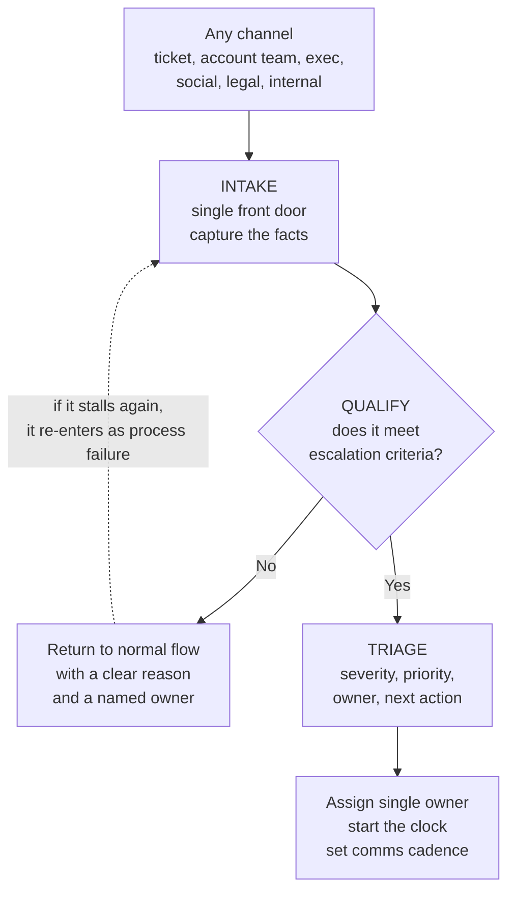
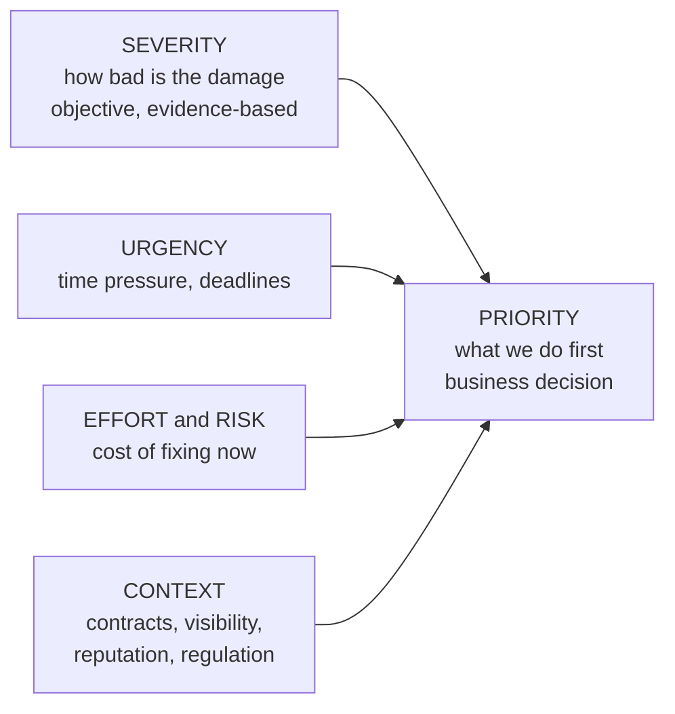
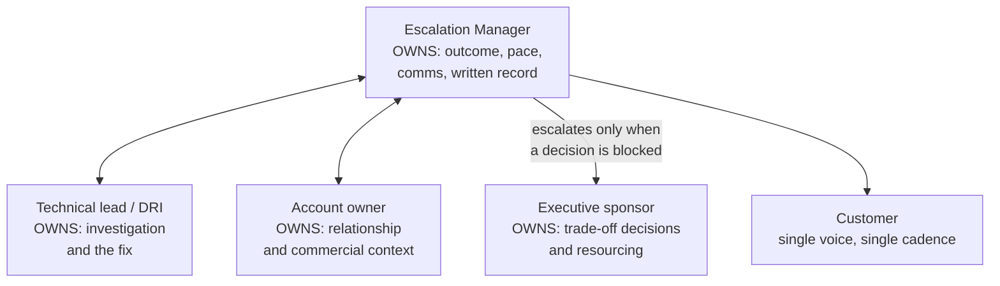
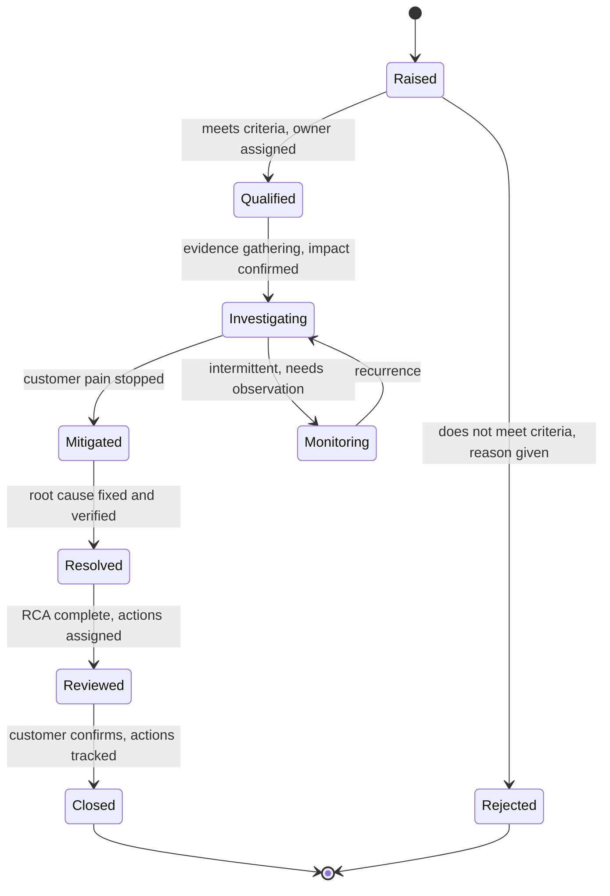
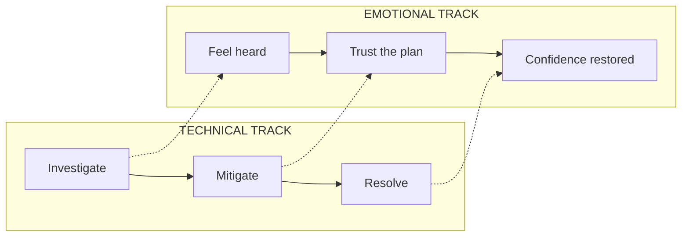
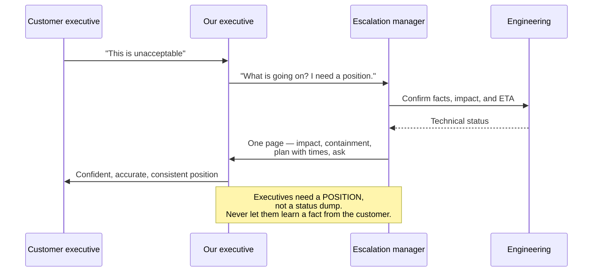

# Part C — The Escalation Lifecycle & Frameworks

> **Section goal:** turn "handling an escalation" from an instinct into a repeatable process with named stages, explicit entry and exit criteria, and defensible decisions. This is the operating core of the role — the part you will be asked to describe end to end.

Covers index items **13–18**. Maps to job responsibilities: *own and manage high-priority customer and executive escalations across multiple channels; build standardized escalation frameworks.*

---

## 13. Intake, qualification, and triage

Three different jobs that beginners collapse into one. Keeping them separate is what stops an escalation program from drowning.

- **Intake** — *capturing the escalation and its facts, from any channel, into one place.* **Analogy:** the hospital reception desk taking your details. **Why it matters:** if escalations live in five inboxes, you have no program — you have five people improvising.
- **Qualification** — *deciding whether this genuinely is an escalation.* **Analogy:** the triage nurse deciding you need emergency care rather than a GP appointment. **Why it matters:** if everything is an escalation, nothing is. Qualification protects the severity signal.
- **Triage** — *deciding severity, priority, owner, and next action.* **Analogy:** deciding who goes into surgery first. **Why it matters:** this is where most time is either saved or lost.

### The intake question set

Get these on the record before doing anything else. This is a genuinely useful thing to be able to recite in an interview.

| Question | Why you ask it |
|---|---|
| **What exactly is happening?** Observable symptom, not diagnosis | Customers report causes; you need effects |
| **Who is affected?** One user, one tenant, one region, everyone | Sets blast radius and severity |
| **Since when?** First occurrence, last known good | Correlates with releases and changes |
| **What is the business impact?** Money, users blocked, deadline, contractual | Converts a technical problem into a prioritization argument |
| **Is there a workaround?** | Determines whether urgency is about pain or permanence |
| **What has already been tried?** | Prevents you repeating failed steps and insulting the customer |
| **What does the customer expect?** | Reveals the real success criterion, which is often not the fix |
| **Is there a deadline or event?** | Launches, audits, board meetings change the clock |
| **Any legal, privacy, or safety dimension?** | Routes immediately and irreversibly changes handling |

> **The most under-asked question is the seventh.** A customer whose *stated* problem is a bug may have an *actual* requirement of "I need to tell my board something credible by Friday." Those need completely different responses, and only one of them requires an engineer.

---

## 14. Severity vs priority

These are constantly used interchangeably. They are not the same, and knowing the difference cleanly is a reliable senior signal.

- **Severity** — *how bad the impact is.* An objective, evidence-based measure of damage. **Analogy:** the medical seriousness of an injury.
- **Priority** — *what we work on first.* A business decision combining severity with urgency, effort, risk, and context. **Analogy:** who the surgeon actually operates on next, which also accounts for who is stable and who is already in theatre.

**A low-severity issue can be high-priority** (a cosmetic typo on the pricing page during a launch). **A high-severity issue can be lower-priority** (a total failure of a feature nobody uses, with a working alternative).

### A standard severity scale

| Sev | Meaning | Typical trigger | Response shape |
|---|---|---|---|
| **Sev 1 / P1** | Critical — service unusable, or severe data/security/safety impact, broad blast radius | Platform outage; data loss; security breach | Immediate, 24/7, incident command, exec visibility |
| **Sev 2 / P2** | Major — significant function broken or badly degraded; no acceptable workaround | Key feature down for a major account | Urgent, business hours plus, senior engineering |
| **Sev 3 / P3** | Moderate — impaired but usable; workaround exists | Slow performance, partial defect | Normal queue, scheduled fix |
| **Sev 4 / P4** | Minor — cosmetic or low impact | Typo, small UI glitch | Backlog |

### 🔍 Plain-English deep-dive: severity inflation

- **Severity inflation** — *the steady drift where everything becomes a Sev 1.* **Analogy:** a hospital where every patient is labelled critical; the label stops carrying information and the truly critical patient waits. **Why it happens:** severity is the only lever a frustrated person has to get attention, so people pull it. **How you counter it:** publish written, evidence-based severity definitions; require impact evidence rather than assertion; review severity at a fixed cadence and downgrade openly; and — most importantly — give people a *legitimate alternative lever*, such as a fast-track priority path, so they don't have to lie about severity to be heard.

> **Interview-grade nuance:** severity should be **re-assessable in both directions**. A program where severity only ever goes up is a program that has lost the ability to prioritize.

---

## 15. Ownership models

The single greatest cause of escalation failure is diffuse ownership — everybody involved, nobody accountable.

- **Single-threaded owner (STO)** — *one named person accountable for the outcome end to end.* **Analogy:** the surgeon in charge; consultants advise, but one person owns the patient.
- **DRI (Directly Responsible Individual)** — *the same idea, phrased as "whose name is next to this?"* **Why it matters:** "the team is on it" is not an owner. Teams don't get paged; people do.
- **Escalation manager on point** — *the escalation manager owns the escalation; engineering owns the technical fix.* **Why it matters:** two distinct ownerships that must not be merged. You own the outcome and the customer; they own the code.

> **The "single voice" rule:** the customer should hear from **one** consistent source with **one** consistent message. Multiple people freelancing updates to a stressed customer is how contradictions happen, and a contradiction during an escalation destroys trust faster than the original fault did.

### RACI in one table

**RACI** = who is **R**esponsible (does the work), **A**ccountable (owns the outcome, exactly one person), **C**onsulted (input sought), **I**nformed (kept updated).

| Activity | R | A | C | I |
|---|---|---|---|---|
| Technical investigation | Engineering | Eng lead | Escalation manager | Leadership |
| Customer communication | Escalation manager | Escalation manager | Account owner | Leadership |
| Severity decision | Escalation manager | Escalation manager | Eng lead, account owner | All |
| Compensation offer | Escalation manager | Finance / Sales | Legal | Leadership |
| Public statement | Comms / PR | Comms lead | Legal, escalation manager | All |

---

## 16. Escalation states and exit criteria

An escalation without defined states becomes an open-ended obligation nobody can close. Define states, and define **exit criteria** for each.

| State | Exit criterion — do not advance until this is true |
|---|---|
| **Raised** | Facts captured, channel logged, initial contact made |
| **Qualified** | Meets written criteria; severity set; single owner named; cadence agreed |
| **Investigating** | Impact quantified; evidence collected; hypothesis or clear next step exists |
| **Mitigated** | Customer impact has demonstrably stopped; customer has confirmed |
| **Resolved** | Root cause fixed, deployed, and **verified in production** |
| **Reviewed** | RCA complete; corrective and preventive actions assigned with owners and dates |
| **Closed** | Customer explicitly agrees to closure; follow-up actions tracked elsewhere |

> **The most common process failure is closing at "Mitigated."** Pain stopped, everyone exhaled, the case closed — and the same escalation returns in six weeks. Closing at mitigation is how you build a program with a permanently high repeat-escalation rate.

> **The second most common is closing without customer confirmation.** You do not get to declare someone else's problem over.

---

## 17. De-escalation and expectation setting

An escalation has two tracks running in parallel: the **technical** track and the **emotional** track. Solving one does not solve the other. A technically perfect resolution delivered with poor communication still ends in a lost customer.

> **Both tracks must complete. Only one of them is about the product.**

### 🔍 Plain-English deep-dive: why people escalate emotionally

Anger in escalations is almost never really about the defect. It is usually about one of four things:

1. **Not being believed** — they reported it and were told it was fine.
2. **Not being informed** — silence, which people fill with the worst assumption.
3. **Not being respected** — repeating their story to a fifth person.
4. **Not being safe** — their own credibility is now exposed internally, because they chose you.

The fourth is the one that produces executive escalations. The person escalating often has their own reputation at stake in front of their own management. Recognizing that changes your entire approach: part of your job is **giving them something credible to say to their own boss**.

### De-escalation techniques

| Technique | What it is | Why it works |
|---|---|---|
| **Acknowledge first** | Name the impact before any explanation | People cannot absorb information while feeling unheard |
| **Own the process** | "I own this until it's resolved" | Converts a diffuse fear into a single accountable person |
| **Commit to cadence, not cure** | "I'll update you at 2pm daily, even with no news" | You can always keep this promise; you cannot always promise a fix |
| **Separate the clocks** | Distinguish mitigation from permanent fix | Prevents accidental over-promising |
| **Give them ammunition** | Provide a written summary they can forward | Solves their internal-credibility problem |
| **Never argue about blame during the fire** | Blame is a post-incident conversation | Blame arguments consume the time the fix needs |
| **Be honest about uncertainty** | "We don't know yet; here's how we'll find out and when I'll tell you" | Credibility survives bad news; it does not survive being wrong |

> **The single most valuable habit:** update on schedule **even when there is no news**. "No update yet, still investigating, next update at 4pm" costs thirty seconds and prevents the silence that manufactures escalations. Most escalations that get worse, get worse during silence.

---

## 18. Executive and sponsor escalations

When an escalation arrives through leadership, the technical problem is usually unchanged — but everything about the handling changes.

| Dimension | Standard escalation | Executive escalation |
|---|---|---|
| Patience | Days | Hours |
| Audience | Practitioners | Senior leaders on both sides |
| Format | Technical detail | One page, conclusion first |
| Real question | "What's wrong?" | "Are we safe, and do you have this under control?" |
| Failure mode | Slow fix | Appearing disorganized or evasive |
| Risk | Customer dissatisfaction | Relationship, renewal, reputation |

### 🔍 Plain-English deep-dive: what executives actually want

An executive is not asking for a technical briefing. They are asking four questions, and you should answer them **in this order, unprompted**:

1. **What is the impact?** — in business terms, quantified.
2. **Is it contained?** — is it still getting worse, yes or no.
3. **What are we doing, and by when?** — with names and times.
4. **What do you need from me?** — the decision or resource you require.

> **The cardinal rule of executive escalations:** your executive must never hear a material fact from the customer before hearing it from you. Being outpaced by the customer's own escalation chain is the fastest way to lose internal credibility.

> **Second rule: bring a recommendation, not a menu.** "Here are three options" pushes the work back up. "I recommend option B for these reasons; A and C are viable if you prefer" is what senior handling looks like.

---

## ⭐ Likely Interview Questions for This Section

**Q1. "Walk me through how you'd run an escalation end to end."**
> *Model answer:* Intake first — capture the facts from whatever channel it arrived through into one front door: symptom, who's affected, since when, business impact, workaround, what's been tried, what the customer actually expects, any deadline, and any legal or safety dimension. Then qualify: does this genuinely meet escalation criteria, or does it need a clear return to normal flow with a named owner? Then triage: set severity on evidence, assign a single named owner, and agree a communication cadence. From there I drive parallel tracks — investigation with engineering, and communication with the customer on a fixed cadence whether or not there's news. I separate mitigation from resolution as two distinct commitments. I don't close at mitigation; I close after root cause is verified in production, the RCA is complete with owners and dates on preventive actions, and the customer has explicitly agreed to closure.

**Q2. "What's the difference between severity and priority?"**
> *Model answer:* Severity measures how bad the impact is — it's objective and evidence-based. Priority is what we work on first, which is a business decision combining severity with urgency, effort, risk, and context like contracts or visibility. They diverge in both directions: a cosmetic typo on the pricing page during a launch is low severity and high priority, while a total failure of an unused feature with a clean workaround can be high severity and lower priority. Keeping them separate is what lets you have an honest conversation about trade-offs, because you can concede priority without forcing anyone to pretend the impact isn't real.

**Q3. "Everything is being raised as Sev 1. What do you do?"**
> *Model answer:* Severity inflation is a symptom, not a discipline problem — people inflate severity because it's the only lever that reliably gets attention. So I do two things. First, restore the signal: publish written, evidence-based severity definitions, require impact evidence rather than assertion, and review severity at a fixed cadence with open downgrades so severity can move in both directions. Second, and more importantly, remove the incentive to lie — give people a legitimate fast-track path for "this is genuinely urgent but not catastrophic," so they don't have to misuse Sev 1 to be heard. If you only do the first, you get compliance and resentment; the queue-jumping just moves somewhere else.

**Q4. "A customer is furious and won't discuss the technical detail. How do you handle it?"**
> *Model answer:* I stop trying to solve the technical track and work the emotional track first, because people can't absorb information while they feel unheard. I acknowledge the impact specifically and without qualifiers — no "sorry you feel that way." I take explicit ownership: I own this until it's resolved. Then I commit to something I can absolutely deliver — a fixed update cadence, not a cure. And I try to identify what's really driving it, because anger in escalations is usually about not being believed, not being informed, not being respected, or not being safe internally. That last one is common: the person escalating often has their own credibility exposed in front of their own management. If so, a big part of my job is giving them a clear written summary they can forward, so they have something credible to say to their own boss.

**Q5. "Your executive asks for an update in five minutes. What do you send?"**
> *Model answer:* One page, conclusion first, answering four questions in order. What's the impact, quantified in business terms. Is it contained — is it still getting worse, yes or no. What we're doing and by when, with named owners and times. And what I need from them, which is usually a specific decision or resource. I'd separate confirmed facts from working hypotheses explicitly, because an executive repeating a hypothesis as fact to a customer is a serious failure. And I'd send it even if the picture is incomplete — the cardinal rule is that my executive never learns a material fact from the customer before hearing it from me.

**Q6. "When is an escalation actually closed?"**
> *Model answer:* Not when the pain stops — that's mitigation, and closing there is the most common process failure I see, because the issue returns weeks later and the repeat-escalation rate quietly climbs. I close when four things are true: the root cause is fixed and verified in production, not just deployed; the RCA is complete with corrective and preventive actions assigned to named owners with dates; those actions are tracked somewhere that survives the case closing; and the customer has explicitly agreed to closure. You don't get to declare someone else's problem over.

**Q7. "How do you avoid becoming a bottleneck as the single point of contact?"**
> *Model answer:* The single-voice rule is about consistency of message, not about routing every sentence through me. I own the outcome, the cadence, and the written record — but I delegate technical dialogue to engineers with clear framing, publish the position internally so anyone speaking to the customer says the same thing, and use templates and status updates so routine communication doesn't require me personally. The real protection against bottlenecking is documentation: if my written summary is good enough that others can act on it, I'm the author of the position rather than the only channel to it.

---

## 🧠 30-Second Memory Hooks

- **Intake → Qualify → Triage.** Reception desk → triage nurse → surgery order. Collapsing them drowns the program.
- **Severity = how bad. Priority = what's first.** Severity is measured; priority is decided.
- **Severity must move both ways,** or you've lost prioritization.
- **Teams don't get paged; people do.** Always a named DRI.
- **Two clocks:** mitigation stops pain, resolution stops recurrence.
- **Two tracks:** technical and emotional. Only one is about the product.
- **Cadence over cure.** Promise the update, not the fix — you can always keep it.
- **Silence is where escalations get worse.** Update even with no news.
- **Never close at mitigation.** Close at verified + reviewed + customer-confirmed.
- **Execs want a POSITION, not a status dump:** impact → contained? → plan by when → what I need from you.
- **Bring a recommendation, not a menu.**

---

## 🔁 Rapid Recall Drill

1. Name the three intake stages and the failure of collapsing them. *(§13)*
2. Give an example of low severity / high priority, and the reverse. *(§14)*
3. What are the two root fixes for severity inflation? *(§14)*
4. What is the "single voice" rule protecting against? *(§15)*
5. Recite the seven escalation states and the exit criterion for "Resolved." *(§16)*
6. Name the four emotional drivers behind escalation anger. *(§17)*
7. Recite the four executive questions in order. *(§18)*

---

*Next suggested section:* **[Part D — Incident Management & Severity Operations](Part-D-incident-management.md)** — escalations and incidents overlap heavily, and incident command is the discipline that keeps a Sev 1 from becoming chaos.
