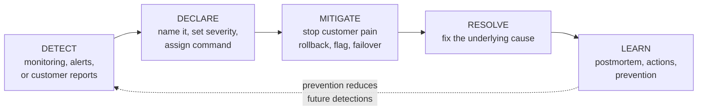
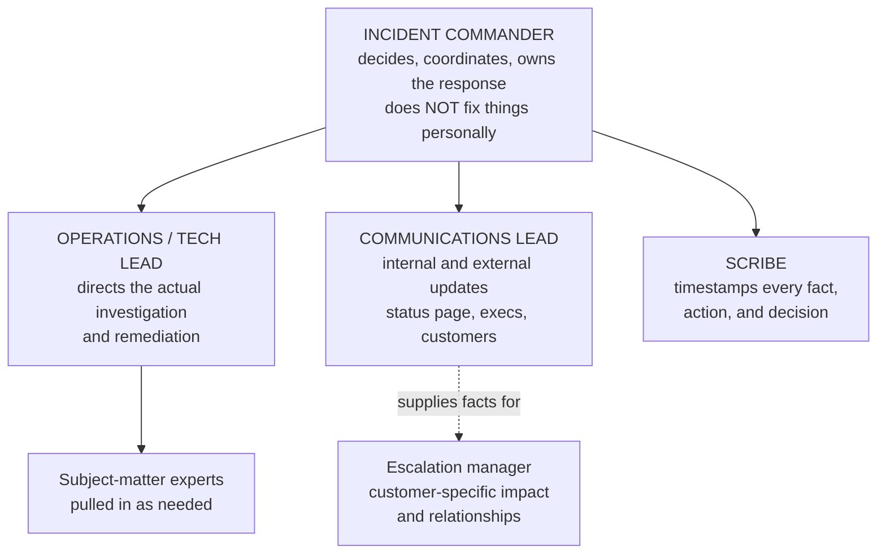
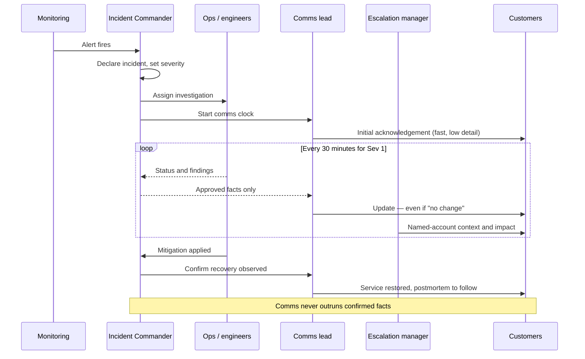
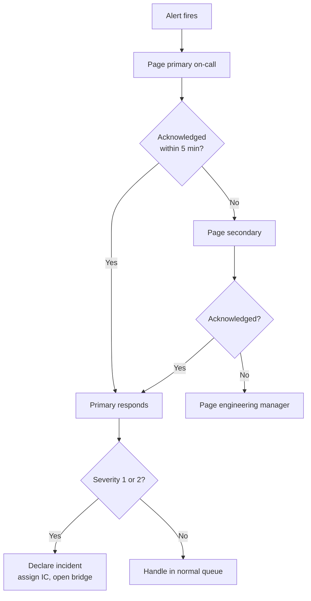
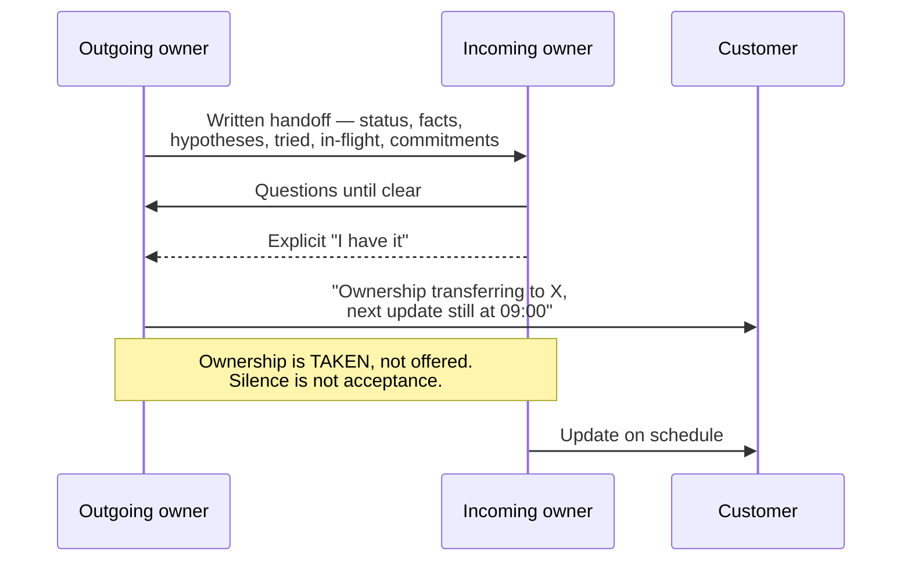

# Part D — Incident Management & Severity Operations

> **Section goal:** teach you how a company responds when something is broken *right now* for many customers at once — the roles, the rituals, the communication cadence, and the failure modes. Escalation management and incident management are different disciplines that constantly collide, and knowing where one ends and the other begins is a senior-level distinction.

Covers index items **19–24**. Maps to job requirements: *strong expertise in incident management; faster resolution times for high-severity customer issues.*

---

## 19. The incident lifecycle

An **incident** is an unplanned interruption or degradation of a service. Incident management is the discipline of getting from "something is wrong" back to "service is normal" as fast as possible — and *then* learning from it.

### 🔍 Plain-English deep-dive: each phase and its trap

- **Detect** — *becoming aware.* **Analogy:** the smoke alarm. **The trap:** learning about outages from customers instead of monitoring. The metric that exposes this is the ratio of customer-detected to monitoring-detected incidents; a high ratio is an observability problem, and it's a superb thing to raise in an interview.
- **Declare** — *formally naming it an incident and starting the machinery.* **Analogy:** pulling the fire alarm rather than quietly fetching an extinguisher. **The trap:** hesitating. Under-declaring is far more expensive than over-declaring, because a late declaration means a late response and a late customer message. Good cultures make declaring cheap and blameless.
- **Mitigate** — *stopping the bleeding.* **Analogy:** getting people out of the building; you don't investigate the wiring first. **The trap:** engineers naturally want to understand before acting. During a Sev 1, understanding is secondary to restoring service. "Can we roll back now and diagnose after?" is often the highest-value sentence on the call.
- **Resolve** — *fixing the actual cause.* **The trap:** stopping here and never doing the learn phase.
- **Learn** — *the postmortem and the preventive actions.* **The trap:** writing the document and never completing the actions. An action list with no owners and no dates is theatre.

> **The mitigation-first principle:** during an active incident, restoring service beats understanding the cause. Diagnosis can happen on a healthy system; customers cannot wait for curiosity.

---

## 20. Incident Command System roles

Borrowed from emergency services, the **Incident Command System (ICS)** exists because in a crisis the biggest risk isn't lack of skill — it's twelve capable people improvising simultaneously.

| Role | Owns | Explicitly does not |
|---|---|---|
| **Incident Commander (IC)** | Decisions, severity, coordination, when to escalate | Debug personally — the moment the IC starts fixing, nobody is commanding |
| **Operations / tech lead** | The technical investigation and remediation | Talk to customers |
| **Communications lead** | Status page, internal updates, customer messaging | Make technical decisions |
| **Scribe** | The timestamped timeline of facts, actions, decisions | Participate in debugging |
| **Escalation manager** | Named-customer impact, relationships, commercial risk | Command the incident |

### 🔍 Plain-English deep-dive: why the IC must not debug

- **Incident Commander** — *the person who runs the response, not the person who fixes the problem.* **Analogy:** the fire chief stands outside with the radio and the building plan. The moment the chief picks up a hose, nobody is directing the crews, nobody is tracking who is inside, and nobody is talking to the ambulances. **Why it matters:** this is counterintuitive and frequently violated, because the best engineer is often made IC — and then they dive into the logs and coordination collapses. In an interview, "the IC's value is coordination, and an IC who starts debugging has silently abandoned the role" is a sharp, senior observation.

- **Scribe** — *the person writing down what happened, with timestamps, as it happens.* **Analogy:** the flight recorder. **Why it matters:** reconstructing a timeline afterwards from memory and chat scrollback is slow, incomplete, and disputed. The scribe is what makes a *good* postmortem possible, and it's the first role dropped when teams are stretched — which is precisely when you most need it.

---

## 21. War rooms, bridges, and update cadence

- **War room / bridge** — *a single synchronous channel (call or chat) where the response happens.* **Analogy:** air-traffic control during an emergency: one frequency, everyone hears the same thing.
- **Cadence** — *a fixed rhythm of updates.* **Analogy:** the hourly news bulletin. **Why it matters:** without a fixed cadence, responders get interrupted constantly by "any update?" — and interruption is the main tax on incident resolution.

### Cadence guidance

| Severity | Internal update | Customer update | Who is awake |
|---|---|---|---|
| Sev 1 | Every 15–30 min | Every 30–60 min | Everyone, 24/7, execs informed |
| Sev 2 | Every 30–60 min | Every 2–4 hours | Core team, extended hours |
| Sev 3 | Daily | Daily or on change | Normal hours |

> **The two comms rules that matter most.** First: **communicate on the clock even when there is nothing new** — "no change, still investigating, next update at 15:00" preserves trust at almost zero cost. Second: **never let communication outrun confirmed facts.** Publishing a cause that turns out to be wrong forces a retraction, and retractions cost more credibility than the original silence would have.

---

## 22. Severity, paging, and on-call

- **On-call** — *a rota where a named person is responsible for responding to alerts outside normal hours.* **Analogy:** the doctor with the pager who must answer at 3am.
- **Paging** — *an alert that actively wakes someone,* as opposed to a ticket that waits. **Why it matters:** paging is expensive in human terms, so what pages must be tightly controlled.
- **Alert fatigue** — *so many alerts that people stop reacting.* **Analogy:** the car alarm nobody looks at any more. **Why it matters:** it's the leading cause of missed real incidents. A page that isn't actionable shouldn't be a page.
- **Escalation policy** — *if the primary doesn't acknowledge within N minutes, it automatically goes to the secondary, then to the manager.* **Analogy:** a phone tree that keeps ringing until a human answers. **Why it matters:** this is the "escalation" word used in a completely different, purely technical sense — and interviewers sometimes probe whether you know both meanings.

> **Two meanings of "escalation" — know both.** In support, escalation means elevated ownership of a customer problem. In on-call engineering, an *escalation policy* means automatic re-paging up a rota when nobody acknowledges. Same word, different worlds. Using the right one in the right room is a small but real credibility signal.

---

## 23. Status pages and public incident communication

A **status page** is a public page showing whether services are operating normally. It is the highest-leverage communication tool in an incident, because it scales to every customer at once.

### 🔍 Plain-English deep-dive: the status page dilemma

Posting publicly feels risky — it admits a problem to everyone, including people who hadn't noticed. But **not** posting is worse, and the reasoning is worth being able to articulate:

- Customers who are affected already know. Silence doesn't hide the outage; it only hides your *awareness* of it.
- Silence forces every affected customer to open a ticket, which floods support exactly when it's least able to cope.
- Discovering later that you knew and said nothing is a trust failure far more damaging than the outage.

| Post | Don't post |
|---|---|
| Confirmed impact in customer terms | Speculative root cause |
| What's affected and what isn't | Internal system names or blame |
| What customers should do meanwhile | Precise fix ETAs you can't guarantee |
| When the next update comes | Anything unverified |

**A good structure for every public update:**
1. **What's happening** — in customer-visible terms, not internal jargon.
2. **Who/what is affected** — and importantly, what is *not* affected.
3. **What we're doing** — without over-promising.
4. **What you can do** — workaround, if any.
5. **Next update at** — a specific time.

> **Say what is *not* affected.** It's the most commonly omitted element and it dramatically reduces inbound volume, because it lets unaffected customers stop worrying and stop writing to you.

---

## 24. Handoffs, follow-the-sun, and long-running incidents

Incidents that outlast a single shift introduce a distinct failure mode: **context loss at handoff**.

- **Follow-the-sun** — *passing ownership between regions so work continues around the clock.* **Analogy:** a relay race. **Why it matters:** the baton drop is the risk, not the running.
- **Handoff** — *the structured transfer of ownership.* Must be explicit, verbal or written, and acknowledged. "I assumed they picked it up" is how incidents silently stall for eight hours.

### The handoff checklist

| Must transfer | Why |
|---|---|
| Current status and severity | Baseline |
| Confirmed facts vs open hypotheses | Prevents re-litigating settled questions *and* prevents guesses hardening into facts |
| What has been tried and ruled out | Prevents repeating dead ends |
| Current actions in flight and their owners | Prevents duplicate or conflicting changes |
| Customer commitments and next update time | The clock does not pause for your shift |
| Explicit acceptance by the incoming owner | Ownership must be *taken*, not merely offered |

### 🔍 Plain-English deep-dive: fatigue in long incidents

- **Responder fatigue** — *degraded decision quality from hours of high-stress work.* **Analogy:** a surgeon in hour fourteen. **Why it matters:** late-incident mistakes are common and often worse than the original fault — a tired engineer running an unreviewed command in production. Mature incident management **forces rotation**, even when the tired person objects that they have the most context. Context can be written down; judgment cannot be restored by willpower.
- **Fix-induced incidents** — *the remedy causes a new outage.* **Why it matters:** it's why high-severity changes should still get a second pair of eyes, however urgent things feel.

---

## ⭐ Likely Interview Questions for This Section

**Q1. "What's the difference between incident management and escalation management?"**
> *Model answer:* Incident management is about the **service** — restoring it for everyone as fast as possible, coordinated by an incident commander with a defined lifecycle from detect to learn. Escalation management is about the **customer** — ownership, relationship, commercial risk, and communication for specific accounts. They overlap constantly: a major incident generates escalations, and a single customer's escalation can reveal an incident. But the roles are distinct. During a Sev 1 the IC owns the response; I own named-customer impact, executive-facing communication, and the commercial consequences. Trying to do both simultaneously is a classic failure, because commanding requires detachment and advocacy requires immersion.

**Q2. "Why shouldn't the incident commander also debug?"**
> *Model answer:* Because the moment they do, nobody is commanding. The IC's value is coordination — tracking who's doing what, deciding severity, controlling communication, preventing conflicting changes, and knowing when to escalate. That's a full-time job during a Sev 1. It's counterintuitive and often violated, because the best engineer gets made IC and instinctively dives into logs, at which point the response loses its air-traffic controller. The fire chief stands outside with the radio and the building plan; the moment they pick up a hose, nobody knows who's inside.

**Q3. "You're 40 minutes into a Sev 1 and you don't know the cause. What do you tell the customer?"**
> *Model answer:* The truth, on schedule, in a specific structure: what we're observing in customer terms, what's affected and what isn't, that we haven't yet confirmed a cause, what we're actively doing, any workaround, and exactly when the next update lands. What I don't do is speculate about the cause. An unverified cause that turns out to be wrong forces a retraction, and retractions cost far more credibility than admitting uncertainty. "We don't know yet, here's how we're finding out, next update at 15:00" is a completely acceptable message. Silence is not.

**Q4. "Should you post to the public status page for an incident affecting only some customers?"**
> *Model answer:* Almost always yes, scoped accurately. The affected customers already know something is wrong — silence doesn't conceal the outage, it only conceals that we're aware of it. Not posting also forces every affected customer to raise a ticket, flooding support precisely when it's least able to absorb it. And if it later emerges that we knew and said nothing, that's a far worse trust problem than the incident. The key is scoping: state clearly what *is* affected and, crucially, what is *not*. Naming the unaffected surface is the most commonly skipped element, and it's what stops unaffected customers from worrying and writing in.

**Q5. "How do you handle an incident that runs across multiple shifts?"**
> *Model answer:* With structured handoffs and enforced rotation. The handoff must transfer status and severity, confirmed facts separated from open hypotheses, what's been tried and ruled out, actions currently in flight with their owners, and outstanding customer commitments with the next update time. Critically, the incoming owner must explicitly accept — silence is not acceptance, and "I assumed they had it" is how incidents stall for hours. I'd also rotate people out on fatigue even when they resist, because late-incident errors from exhausted responders are common and sometimes worse than the original fault. Context can be written down; judgment can't be restored by willpower.

**Q6. "What is alert fatigue and why should an escalation manager care?"**
> *Model answer:* Alert fatigue is when so many alerts fire — most of them noise — that responders stop reacting, like a car alarm nobody looks at. I care because it's a leading cause of *late detection*, and late detection is the single biggest multiplier on customer impact and escalation volume. When I see a pattern of incidents that were customer-detected rather than monitoring-detected, or that were alerting for a long time before anyone acted, that's a systemic finding I'd raise through the RCA process. The fix isn't more alerts, it's fewer and better: if a page isn't actionable, it shouldn't page.

**Q7. "In an incident, do you prioritize understanding the cause or restoring service?"**
> *Model answer:* Restoring service, almost always. Mitigation beats diagnosis during an active incident — roll back, disable the feature flag, fail over, whatever stops customer pain fastest. Diagnosis can happen afterwards on a healthy system with full evidence; customers can't wait for our curiosity. The tension is real because engineers legitimately worry that rolling back destroys evidence, so the discipline is to capture evidence — logs, traces, a sample of the failing state — *and then* mitigate. The one genuine exception is where you don't yet understand the blast radius well enough to know that your mitigation is safe, such as a suspected data-corruption or security event, where acting blindly can make it worse.

---

## 🧠 30-Second Memory Hooks

- **Lifecycle:** Detect → Declare → Mitigate → Resolve → Learn. **"D-D-M-R-L."**
- **Mitigation beats diagnosis.** Get people out of the building before inspecting the wiring.
- **The IC holds the radio, not the hose.** An IC who debugs has abandoned the role.
- **The scribe is the flight recorder** — first role cut, most needed.
- **Under-declaring costs more than over-declaring.** Make declaring cheap.
- **Comms never outruns confirmed facts.** Retractions cost more than silence.
- **Update on the clock even with no news.**
- **Always say what is NOT affected** — it cuts inbound volume.
- **Ownership is taken, not offered.** Silence is not acceptance.
- **Two meanings of escalation:** elevated customer ownership vs on-call re-paging.

---

## 🔁 Rapid Recall Drill

1. Name the five incident phases and the trap in each. *(§19)*
2. Why must the IC not debug? Give the analogy. *(§20)*
3. What are the two comms rules during an incident? *(§21)*
4. What is alert fatigue and which metric exposes late detection? *(§19, §22)*
5. List five things a shift handoff must transfer. *(§24)*
6. Name the five elements of a good status-page update. *(§23)*
7. When is "mitigate first" *not* the right call? *(⭐Q7)*

---

*Next suggested section:* **[Part E — Root Cause Analysis](Part-E-root-cause-analysis.md)** — the "Learn" phase deserves its own Part, because RCA is named explicitly in the role and is where most candidates are weakest.
