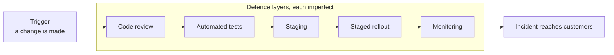
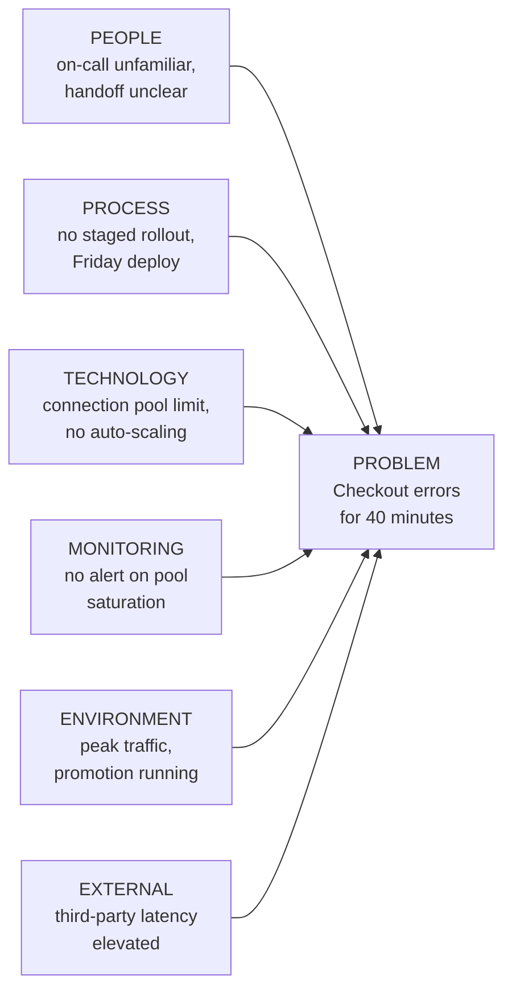
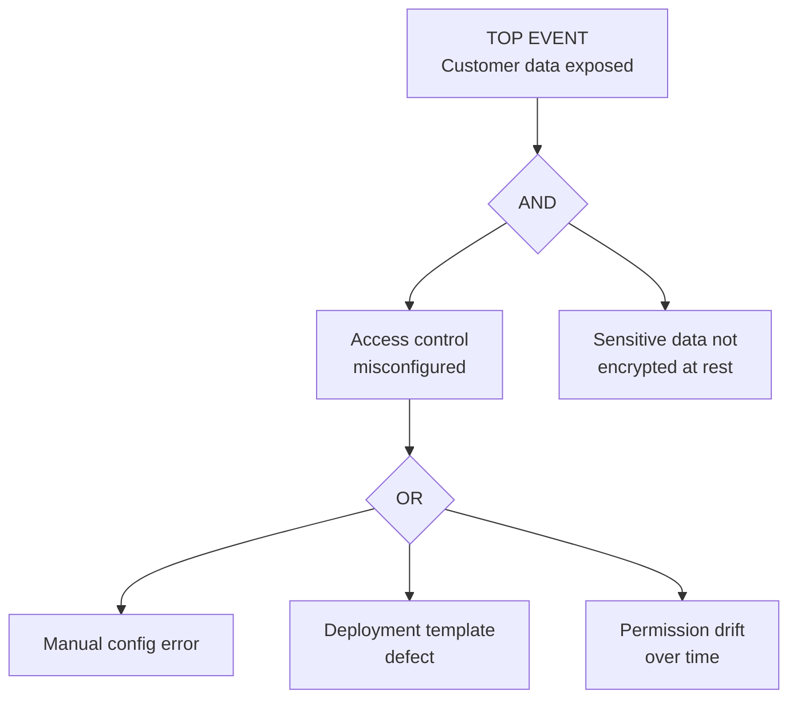
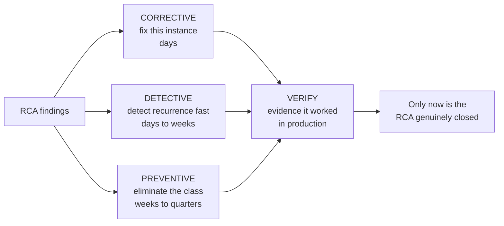
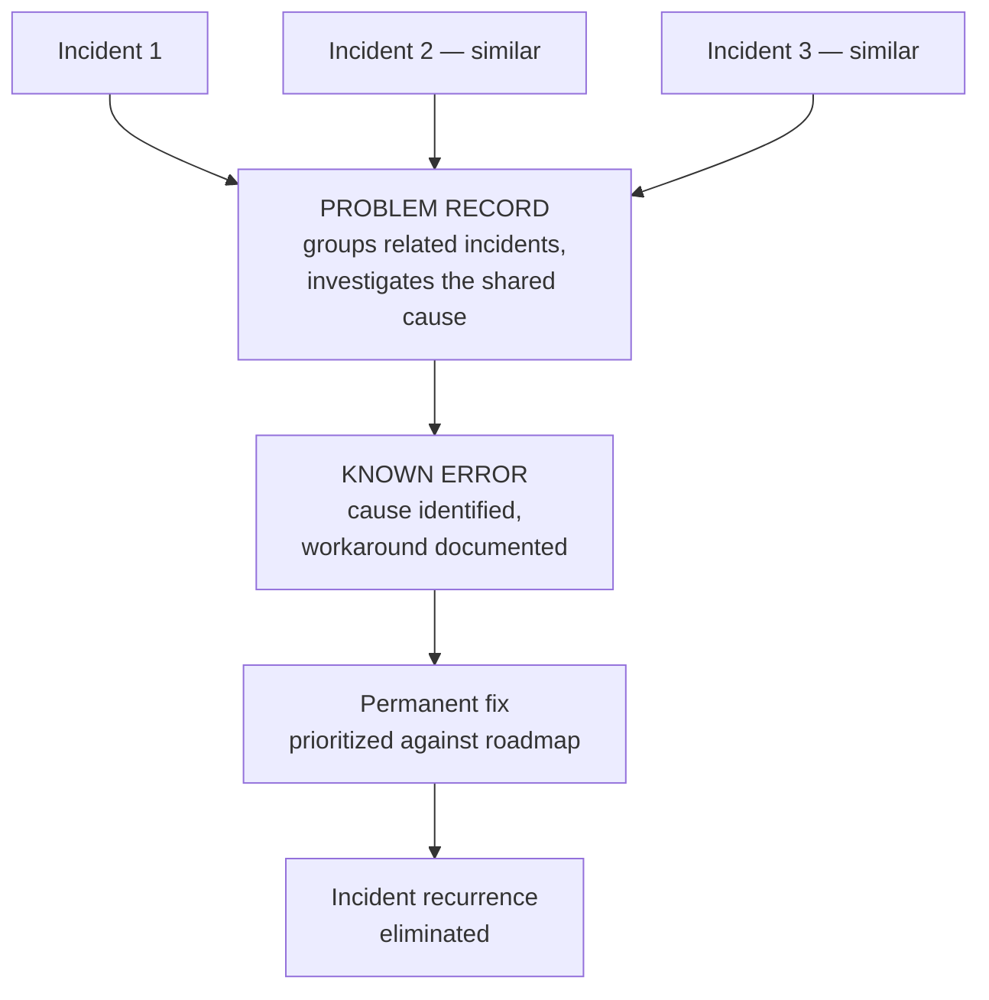

# Part E — Root Cause Analysis (RCA)

> **Section goal:** make you genuinely rigorous at answering "why did this happen?" — with named methods, a working knowledge of their weaknesses, and the discipline to distinguish a cause you can fix from a story that merely sounds satisfying. RCA is called out explicitly in the role, and it is where most candidates are shallowest.

Covers index items **25–31**. Maps to job responsibilities: *conduct deep Root Cause Analyses to uncover systemic issues and partner with internal teams to implement permanent fixes.*

---

## 25. Symptom, cause, and contributing factor

Three words that must never be blurred.

- **Symptom** — *what was observed.* **Analogy:** the fever. "Customers saw errors at checkout."
- **Root cause** — *the thing which, if removed, would have prevented the symptom.* **Analogy:** the infection. "A configuration change reduced the connection pool below peak demand."
- **Contributing factor** — *something that made it worse, more likely, or longer-lasting, but wasn't sufficient on its own.* **Analogy:** being run-down and underslept. "The change was deployed on a Friday evening with reduced staffing."

### 🔍 Plain-English deep-dive: the "root cause" is a slight fiction

- **Root cause (singular)** — *the convenient idea that every failure has exactly one origin.* **Reality:** complex systems almost never fail for a single reason. They fail when several conditions line up. The honest framing is a **causal chain** or a **set of contributing conditions**, and the practical question is not "what is *the* cause?" but **"which causes can we actually remove, and which removal prevents the largest class of future failures?"**
- **Swiss cheese model** — *every defence layer has holes; an incident occurs when the holes momentarily align.* **Analogy:** stacked slices of Swiss cheese — light passes only when the holes line up. **Why it matters:** it explains why "the engineer made a mistake" is never a satisfactory root cause. Humans always make mistakes; the real question is why no layer caught it — no review, no test, no staged rollout, no alert.

Each layer has holes. The useful question is *which layers had holes*, not *who made the mistake*.

> **The single best RCA question:** *not* "who made the mistake?" but **"why did our system allow that mistake to reach customers?"** Everything valuable in RCA follows from that reframing.

---

## 26. The 5 Whys — and its failure modes

The best-known technique: ask "why?" repeatedly until you reach something worth fixing.

**Worked example:**

> **Symptom:** Customers couldn't log in for 40 minutes.
> 1. **Why?** The authentication service rejected valid tokens.
> 2. **Why?** Its signing certificate had expired.
> 3. **Why?** The renewal job failed silently three weeks earlier.
> 4. **Why?** The job's failure alert routed to a disbanded team's channel.
> 5. **Why?** Alert ownership isn't reviewed when teams reorganize.
>
> **Actionable cause:** no process links team reorganization to alert-ownership review. Fixing *that* prevents an entire class of silent-failure incidents — not just this certificate.

### 🔍 Plain-English deep-dive: where 5 Whys breaks

| Failure mode | What it looks like | Guard against it |
|---|---|---|
| **Single-track thinking** | One linear chain; real incidents have branches | Ask "what else contributed?" at every level |
| **Stopping too early** | Ends at "the certificate expired" — a symptom with a technical shape | Keep going until you reach process, design, or systemic ground |
| **Going too far** | Ends at "the company under-invests in infrastructure" — true, unactionable | Stop at the deepest level you can actually change |
| **Blame terminus** | Ends at "an engineer forgot" | Human error is a *starting* point; ask why the system permitted it |
| **Hindsight bias** | "They should obviously have noticed" | Judge decisions on the information available *at the time* |
| **Confirmation** | Whys steered toward a preferred conclusion | Have someone not involved challenge the chain |

> **The "stop" rule:** stop at the deepest cause you have the **authority and ability to change**. Above it is philosophy; below it is a symptom.

---

## 27. Fishbone diagrams and causal factor charts

When a failure has several plausible sources, the linear 5 Whys is the wrong shape. A **fishbone** (Ishikawa) diagram organizes possible causes into categories, so the investigation is broad before it goes deep.

**Standard categories** (adapt freely): People, Process, Technology, Monitoring, Environment, External. For a support-facing RCA, "Monitoring" and "Process" are usually where the real findings hide.

- **Causal factor chart** — *a timeline of events with contributing conditions attached to each.* **Analogy:** an accident investigation board with the sequence pinned up and notes beside each step. **Why it matters:** it forces you to be precise about *ordering*, which regularly disproves the intuitive story. "The alert fired before the deploy" reshapes the entire conclusion.

| Use this | When |
|---|---|
| **5 Whys** | Cause is likely a single chain; fast, informal |
| **Fishbone** | Multiple plausible categories; team brainstorming |
| **Causal factor chart** | Sequence and timing matter; disputed narratives |
| **Fault tree** | High-stakes; need to test combinations of conditions |
| **Kepner-Tregoe** | You must first *find* the cause among many candidates |

---

## 28. Fault tree analysis and Kepner-Tregoe

**Fault Tree Analysis (FTA)** works **backwards** from the failure, decomposing it with logic gates.

- **AND gate** — *all children required for the parent to occur.* Good news: break **any one** and the failure is prevented.
- **OR gate** — *any child alone causes the parent.* Bad news: you must address **all** of them.

> **Why the gate type is strategically useful:** under an AND gate you can prevent the whole failure by fixing the single cheapest branch. Being able to say "encryption at rest alone would have prevented this outcome even with the misconfiguration" is exactly the kind of prioritized, cost-aware recommendation senior stakeholders want.

### 🔍 Plain-English deep-dive: Kepner-Tregoe problem analysis

**Kepner-Tregoe (KT)** is a structured method for *locating* a cause by comparing what **is** affected with what **is not** — the boundary is the evidence.

| Dimension | IS | IS NOT | What the contrast tells you |
|---|---|---|---|
| **What** | Checkout API | Browsing, search | Isolated to write paths |
| **Where** | EU region | US, APAC | Regional infrastructure or config |
| **When** | From 14:00, peak only | Off-peak fine | Load-dependent, not a pure code defect |
| **Extent** | ~8% of requests | Not all | Partial — one node, or a subset of traffic |

**Analogy:** a doctor diagnosing by asking what *doesn't* hurt. The boundary between affected and unaffected is where the cause lives. This IS/IS-NOT table is one of the most practically useful things in this entire guide — it turns a vague "it's broken" into a testable hypothesis in minutes, and it works even when you have no technical depth in the system.

---

## 29. Blameless postmortems and just culture

A **postmortem** (or **post-incident review**) is the written analysis after an incident. **Blameless** means it focuses on systems and conditions rather than punishing individuals.

### 🔍 Plain-English deep-dive: blameless is not consequence-free

- **Blameless postmortem** — *analysis conducted on the premise that people acted reasonably given the information and pressures they had.* **Analogy:** aviation accident investigation, where crews report their own errors because doing so is protected — which is precisely why aviation became so safe. **Why it matters:** if people fear blame, they hide facts, and an RCA built on hidden facts is worthless. Psychological safety isn't a nicety here; it's a **data-quality control**.
- **Just culture** — *the more precise version: blameless for honest error, but still accountable for recklessness or malice.* **Why it matters:** it answers the common interview challenge "so nobody is ever accountable?" No — the distinction is between *error* (a person doing their best in a system that permitted a mistake) and *recklessness* (knowingly bypassing controls). The first is a system finding; the second is a management matter.

**A standard postmortem structure:**

| Section | Contents |
|---|---|
| **Summary** | What happened, in two or three plain sentences |
| **Impact** | Who, how many, how long, quantified in business terms |
| **Timeline** | Timestamped facts: detection, declaration, actions, recovery |
| **Contributing factors** | The causal chain and conditions, not a single villain |
| **What went well** | Genuinely important — it identifies defences worth protecting |
| **What went poorly** | Honest, system-focused |
| **Where we got lucky** | Often the most valuable section — near-misses reveal untested defences |
| **Action items** | Corrective and preventive, each with a named owner and a date |

> **"Where we got lucky" is the section that separates a mature review from a box-ticking one.** "The failure occurred at 3am; at peak it would have hit ten times the users" is a finding, not a comfort — and it should generate an action.

---

## 30. Corrective vs preventive action (CAPA)

- **Corrective action** — *fixes this instance.* **Analogy:** patching the leaking pipe.
- **Preventive action** — *stops the class of problem recurring.* **Analogy:** replacing the whole run of pipe of that age, and adding a moisture sensor.
- **Detective action** — *the often-forgotten third: if it happens again, we'll know quickly.* **Analogy:** the water alarm in the basement. **Why it matters:** you cannot prevent everything. Reducing *time-to-detect* is frequently the highest-value and cheapest action available.

### Verification: the step everyone skips

An action item marked "done" is not evidence. Verification asks: **how do we know it worked?**

| Weak | Strong |
|---|---|
| "Added monitoring" | "Alert added; tested by simulating the failure; fired in 90 seconds" |
| "Fixed the bug" | "Fix deployed; error rate at zero across two peak cycles" |
| "Updated the runbook" | "Runbook updated; used successfully in a drill by someone who wasn't involved" |
| "Trained the team" | "Trained; two subsequent cases handled correctly without escalation" |

> **The RCA action graveyard** is the most common failure of escalation programs: excellent analysis, action items assigned, nobody tracks them, the same incident recurs in a quarter. The single most valuable process you can own is a **tracked, reviewed, and verified action list** — because it converts analysis into a falling repeat-escalation rate, which is the metric the role is ultimately judged on.

---

## 31. Problem management vs incident management

- **Incident management** — *restore service now.* Optimizes for **speed**. Time horizon: minutes to hours.
- **Problem management** — *eliminate the underlying cause so incidents stop recurring.* Optimizes for **permanence**. Time horizon: weeks to quarters.

- **Known error** — *a problem whose cause is understood and which has a documented workaround, but no permanent fix yet.* **Analogy:** knowing the boiler fails when it rains and keeping the reset instructions on the wall. **Why it matters:** it's a legitimate, mature state — it lets support resolve recurrences in minutes while the real fix is scheduled properly instead of rushed.

### 🔍 Plain-English deep-dive: systemic vs one-off

The question the role exists to answer is **"is this one customer's bad day, or the visible edge of a pattern?"**

| Signals of a one-off | Signals of systemic |
|---|---|
| Unique configuration or usage | Multiple customers, independent reports |
| No similar history | Recurring tag or theme in the data |
| Clear, specific trigger | Different triggers, same failure shape |
| Nothing else correlates | Correlates with releases, load, or a component |

**How you find systemic issues in practice:** consistent tagging of escalations at intake; periodic trend review rather than case-by-case reading; Pareto analysis to find the small number of causes producing most escalations; and cross-referencing escalations against release dates and architectural components.

> **This is the heart of the job.** Resolving one escalation well is competence. Noticing that eleven escalations across four months share one cause — and getting that cause permanently removed — is the actual value of the role, and it is what "reduce repeat escalations through systemic improvements" means in the job description.

---

## ⭐ Likely Interview Questions for This Section

**Q1. "Walk me through how you conduct an RCA."**
> *Model answer:* First I establish the facts and a timestamped timeline, separating confirmed facts from hypotheses — most bad RCAs are bad because someone's assumption entered the record as fact. Then I quantify impact precisely: who, how many, how long. Then I investigate with a method matched to the shape of the problem — 5 Whys for a likely single chain, a fishbone when several categories are plausible, an IS/IS-NOT comparison when I need to locate the cause, and a causal factor chart when sequence is disputed. I push past the technical trigger into process and systemic ground, stopping at the deepest level we can actually change. Then I produce corrective, detective, and preventive actions, each with a named owner and a date. And I don't consider it closed until the actions are *verified* with evidence, not just marked done.

**Q2. "What's wrong with the 5 Whys?"**
> *Model answer:* It's genuinely useful and it's fast, but it has four real weaknesses. It's linear, so it misses parallel contributing factors in complex failures. It's easy to stop too early, landing on a technical symptom like "the certificate expired" rather than "nothing reviews alert ownership after reorganizations." It's equally easy to go too far, into true but unactionable statements about company investment. And it frequently terminates in blame — "the engineer forgot" — which is where the analysis should *begin*, not end. I use it as a first pass, and I pair it with a fishbone or an IS/IS-NOT comparison when the failure has multiple plausible sources.

**Q3. "What does 'blameless' actually mean? Does nobody get held accountable?"**
> *Model answer:* Blameless means we analyze on the premise that people acted reasonably given the information and pressure they had at the time, because the alternative is that people hide facts — and an RCA built on hidden facts is worthless. It's a data-quality control, not a kindness. The more precise concept is just culture, which distinguishes honest error from recklessness. If someone made a mistake the system permitted, that's a system finding and we fix the system. If someone knowingly bypassed controls, that's a management matter handled separately — but it's still kept out of the postmortem, so the postmortem stays a place where people tell the truth.

**Q4. "How do you tell a one-off from a systemic issue?"**
> *Model answer:* One-offs tend to have unique configuration or usage, no similar history, a clear specific trigger, and nothing else correlating. Systemic issues show up as multiple independent reports, a recurring tag or theme, different triggers producing the same failure shape, and correlation with releases, load, or a specific component. Finding them isn't luck — it requires consistent tagging at intake, periodic trend review rather than reading cases individually, Pareto analysis to find the few causes driving most volume, and cross-referencing escalations against release dates and components. That's the difference between an escalation function that resolves cases and one that reduces them.

**Q5. "You've written an excellent RCA. Six weeks later the same incident happens. What went wrong?"**
> *Model answer:* Almost certainly the action items weren't tracked and verified — the RCA action graveyard, and it's the most common failure of escalation programs. Analysis is the easy half. The specific breakdowns are: actions assigned to a team rather than a named person; no dates; no mechanism that survives the case being closed; actions marked "done" without evidence they actually work; or the preventive action was deprioritized against roadmap work with nobody re-raising it. The fix is owning a tracked action list reviewed on a fixed cadence, with verification defined up front — "added monitoring" is not done; "alert added, tested by simulating the failure, fired in 90 seconds" is done.

**Q6. "What's the difference between corrective and preventive action — and what's the third one people forget?"**
> *Model answer:* Corrective fixes this instance — patching the leaking pipe. Preventive eliminates the class — replacing that whole run of pipe. The forgotten third is **detective**: making sure that if it does recur, we know within minutes rather than from a customer. That one matters disproportionately because you cannot prevent every failure, and cutting time-to-detect is usually much cheaper and faster than eliminating a cause. A good action set has all three, and I'd rather ship a fast detective control this week than wait a quarter for a perfect preventive one.

**Q7. "An engineer says the root cause was human error. How do you respond?"**
> *Model answer:* I'd treat that as the start of the investigation, not the conclusion. Humans always make mistakes — that's a constant, not an explanation. The real question is why our system allowed that mistake to reach customers: was there no review, no test coverage, no staging validation, no staged rollout, no alert? That's the Swiss cheese model — every defence layer has holes, and an incident means the holes lined up. Asking which layers had holes produces actions you can actually take. Stopping at "human error" produces an action item that reads "be more careful," which prevents nothing and quietly teaches people not to report their mistakes.

---

## 🧠 30-Second Memory Hooks

- **Symptom = fever. Root cause = infection. Contributing factor = being run-down.**
- **Swiss cheese:** incidents happen when holes align. Ask *which layers had holes*, not *who erred*.
- **The best RCA question:** "Why did our system let that mistake reach customers?"
- **5 Whys stop rule:** deepest cause you can actually change. Above = philosophy, below = symptom.
- **IS / IS NOT** — diagnose by asking what *doesn't* hurt. The boundary is the evidence.
- **AND gate = good news** (break one branch). **OR gate = bad news** (fix them all).
- **Blameless is a data-quality control, not kindness.** Just culture = error vs recklessness.
- **"Where we got lucky"** is the most valuable postmortem section.
- **CAPA + D:** Corrective (this one), Detective (know fast), Preventive (the class).
- **"Done" ≠ verified.** Evidence in production, or it isn't closed.
- **Incident = restore now. Problem = stop recurrence.** Known error = cause known, workaround documented, fix scheduled.

---

## 🔁 Rapid Recall Drill

1. Distinguish symptom, root cause, and contributing factor with one example each. *(§25)*
2. Name four failure modes of the 5 Whys. *(§26)*
3. Build an IS/IS-NOT table for "checkout fails in EU at peak only." *(§28)*
4. Why does an AND gate make prevention cheaper than an OR gate? *(§28)*
5. What is just culture, and what does it permit consequences for? *(§29)*
6. Name the three action types and which one is usually cheapest. *(§30)*
7. Give four signals that an issue is systemic rather than a one-off. *(§31)*

---

*Next suggested section:* **[Part F — Cross-Functional Coordination](Part-F-cross-functional-coordination.md)** — RCA findings are worthless unless other teams act on them, which requires driving people who don't report to you.
