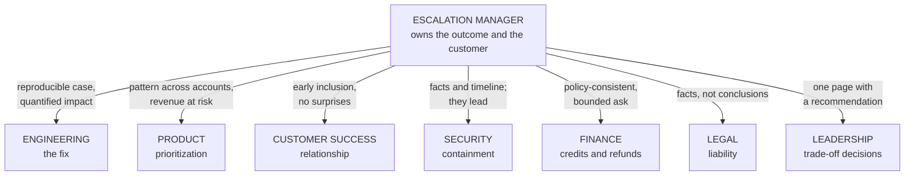
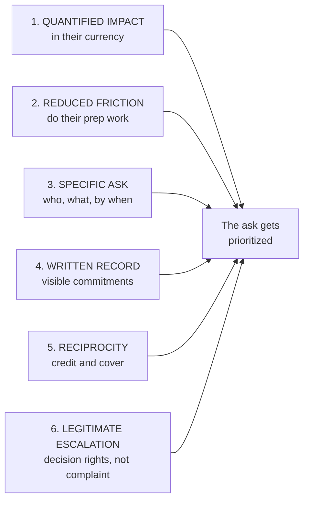
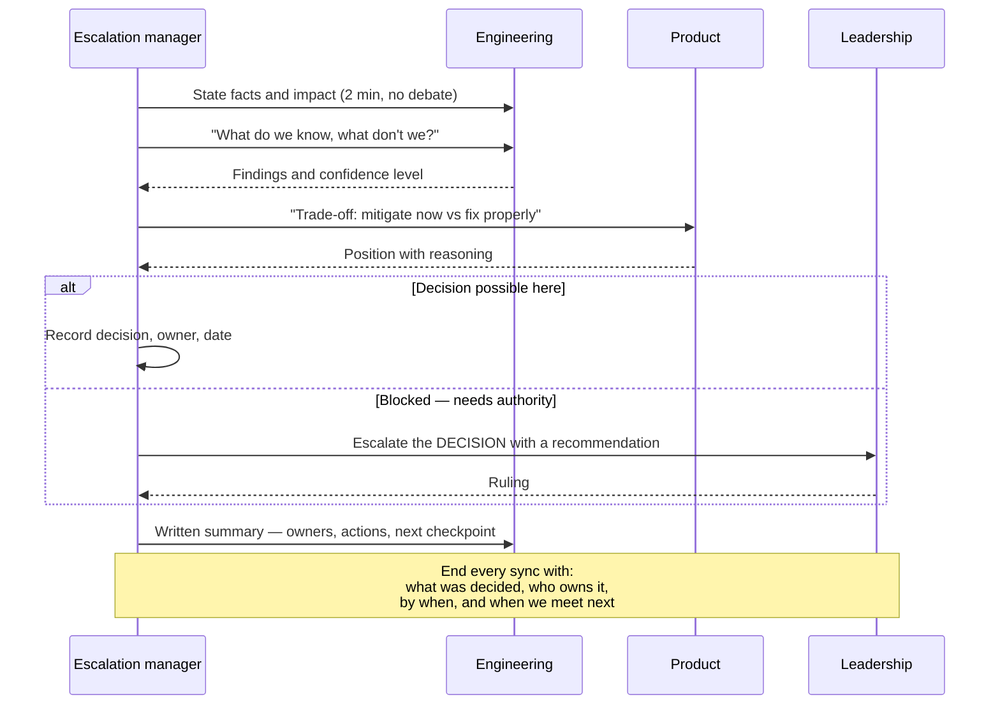
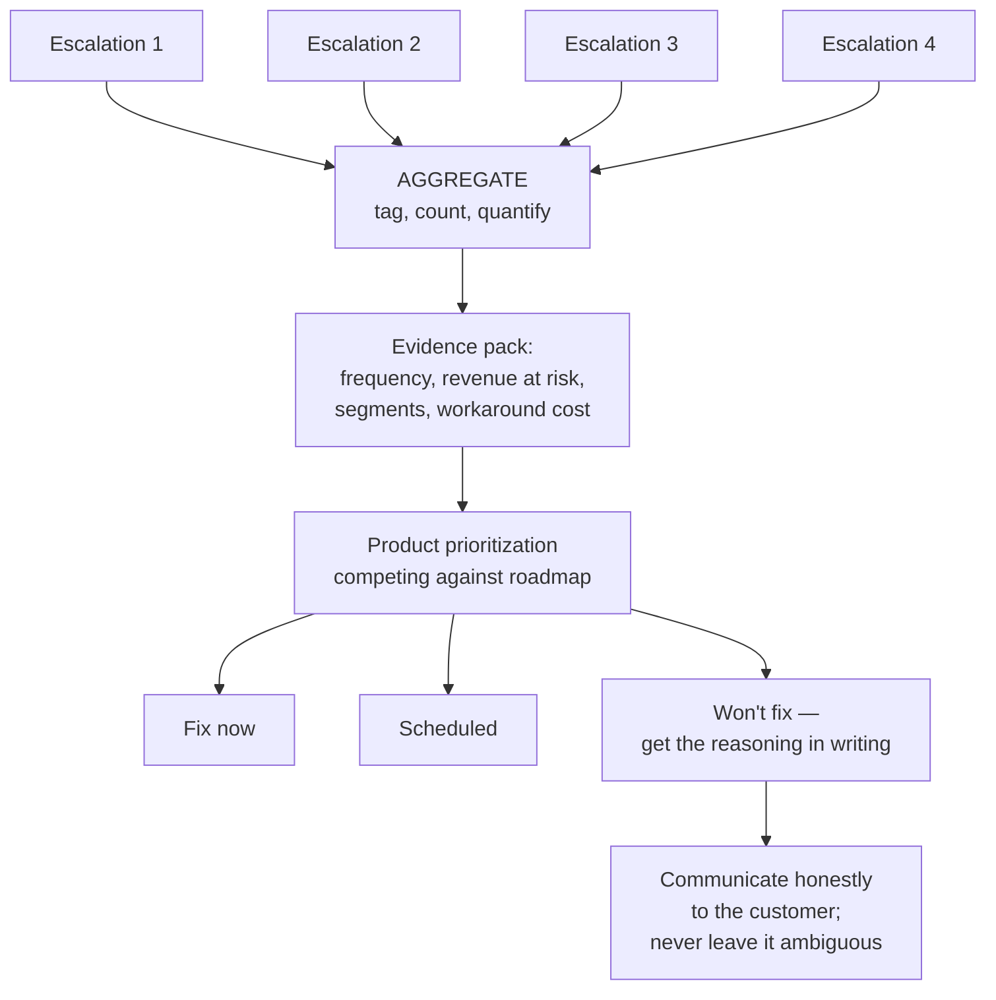
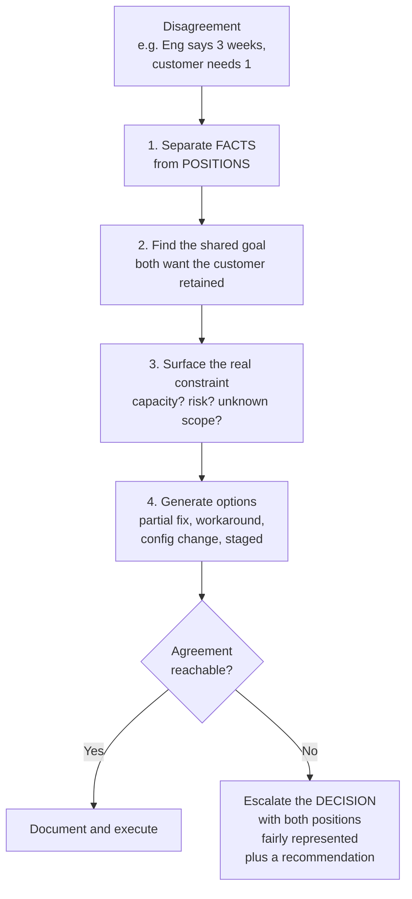

# Part F — Cross-Functional Coordination

> **Section goal:** teach you how to get results from people who don't report to you, across teams with genuinely conflicting incentives. This is the competency the role is built on — the job description names six functions you must coordinate — and it is the hardest thing to fake in an interview.

Covers index items **32–37**. Maps to job responsibilities: *lead cross-functional resolution efforts involving Engineering, Product, Customer Success, Security, Finance, and Legal teams; strong partnership across Product, Engineering, CS, and Leadership.*

---

## 32. Who owns what

You cannot route effectively until you know what each function is measured on. **People behave according to what they are measured on**, not according to what you need. Understanding that isn't cynicism — it's the basis of every successful cross-functional ask.

| Function | Owns | Measured on | Says no when | The framing that works |
|---|---|---|---|---|
| **Engineering** | Code, infrastructure, the fix | Delivery, reliability, velocity | Effort is high and impact is unclear | Reproducible evidence + quantified impact |
| **Product** | What gets built, priority, roadmap | Adoption, retention, strategic goals | It serves one customer, not the market | Pattern across customers + revenue at risk |
| **Customer Success** | The relationship, renewal | Retention, expansion, health | You bypass them with their customer | Include them early; never surprise them |
| **Security** | Threats, vulnerabilities, response | Risk reduction, compliance | Speed threatens containment | Facts and timeline; let them lead |
| **Finance** | Revenue, credits, refunds, margin | Predictability, leakage control | Precedent creates uncontrolled exposure | Policy-consistent, bounded, documented |
| **Legal** | Contracts, liability, regulation | Risk exposure, defensibility | You've written something reckless | Facts, not conclusions; ask, don't tell |
| **Leadership** | Trade-offs, resourcing, reputation | Business outcomes | You bring problems without options | One page, recommendation included |

### 🔍 Plain-English deep-dive: the two functions people mishandle

- **Legal** — *the team that manages contractual and regulatory risk.* **The classic mistake:** telling Legal what the situation means ("we're clearly liable here") instead of giving them facts and asking. **Why it matters:** your characterization can itself become a discoverable document. **The correct posture:** supply a precise factual timeline, flag the risk you perceive as a question, and let Legal own the legal conclusion.
- **Security** — *the team that owns threats and incident containment.* **The classic mistake:** treating a suspected breach like an ordinary escalation — investigating in a public channel, telling the customer what happened before it's confirmed. **Why it matters:** premature disclosure can compromise containment, mislead customers, and create regulatory exposure. **The correct posture:** the moment a security dimension appears, Security leads and you support with facts and coordinated communication.

---

## 33. Influence without authority

You are accountable for outcomes delivered by people who don't report to you. This is not a flaw in the role — it *is* the role.

### The six levers

| Lever | In practice | Why it works |
|---|---|---|
| **Quantified impact** | "Four enterprise accounts, 12% of annual recurring revenue (ARR), renewal in 60 days" not "customer is unhappy" | Translates your problem into their metric |
| **Reduced friction** | Clean repro, logs attached, timeline, scoped question | You're asking for a decision, not donating work |
| **Specific ask** | "Can you confirm by 4pm whether a rollback is viable?" not "please look into it" | Vague asks get vague priority |
| **Written record** | Summarize commitments after every call | Makes ownership visible without nagging |
| **Reciprocity** | Credit publicly; absorb customer heat so engineers can work | You'll need them again next week |
| **Legitimate escalation** | Escalate the *decision*, not the *person* | Preserves the relationship you depend on |

### 🔍 Plain-English deep-dive: escalating without burning bridges

- **Escalating the decision, not the person** — *framing an internal escalation as "this needs a prioritization decision above my level" rather than "team X won't help me."* **Analogy:** asking a judge to rule on a dispute rather than reporting your opponent to their employer. **Why it matters:** you will need that team again next week and for years. An escalation framed as a complaint wins the case and loses the relationship — and in a role built entirely on repeat cooperation, that is a terrible trade.

**The correct construction:** *"Engineering has assessed this at three weeks of work. The customer needs it in one, with £X and a renewal at risk. Both positions are reasonable — this is a prioritization call that needs a decision at your level."* Nobody is accused. A decision is genuinely required. Everyone's competence is respected.

> **Before escalating internally, ask yourself: have I actually pulled all six levers?** Escalating because you skipped the work of quantifying impact is how escalation managers acquire a reputation as an alarm that cries wolf.

---

## 34. Running syncs that end in decisions

The default state of a cross-functional call is **status theatre** — everyone reports what they did, nobody decides anything, and it repeats tomorrow.

| Status theatre | Decision-driving |
|---|---|
| "Let's get an update from each team" | "We need to decide X by the end of this call" |
| Everyone attends | Only decision-makers and required experts |
| Open-ended | Timeboxed with a stated purpose |
| Ends with "let's reconvene" | Ends with owners, actions, dates |
| No notes | Written summary within the hour |

### 🔍 Plain-English deep-dive: the anatomy of a working escalation sync

**The five questions that structure any escalation sync:**
1. What do we **know** for certain? (facts only)
2. What do we **not** know, and how will we find out?
3. What is the **customer impact right now**, and is it growing?
4. What is the **fastest safe mitigation**, and what does it cost us?
5. **Who owns what, by when** — and when do we next check in?

> **Close every meeting by reading back the decisions and owners aloud.** It feels bureaucratic and it takes ninety seconds. It is the single highest-return habit in cross-functional work, because it surfaces the disagreement that would otherwise emerge two days later as "I never agreed to that."

---

## 35. Working with Engineering

Engineers are not obstructive; they are optimizing for different things — correctness, sustainable pace, and not making it worse. Meet them on that ground.

### What makes a bug report engineers will act on

| Element | Why it matters |
|---|---|
| **Precise symptom** | Observed behavior, not the customer's diagnosis |
| **Expected vs actual** | Defines "broken" unambiguously |
| **Reproduction steps or frequency** | Deterministic if possible; honest statistics if not |
| **Environment and identifiers** | Tenant, region, version, request/trace IDs, timestamps |
| **Evidence** | Logs, screenshots, exact error text, HAR file (a recording of the browser's network activity) |
| **Blast radius** | One user, one tenant, or many |
| **Business impact** | Converts a defect into a priority |
| **First occurrence / last known good** | Lets them correlate with releases |

- **Reproduction ("repro")** — *a reliable sequence that triggers the bug.* **Analogy:** being able to make the strange noise happen while the mechanic is standing there. **Why it matters:** it is the single biggest accelerator of engineering response. Time spent producing a clean repro is almost always repaid several times over.
- **Trace / correlation ID** — *a unique identifier attached to a request as it flows through the system.* **Analogy:** a parcel tracking number. **Why it matters:** it lets an engineer find the exact failure in billions of log lines. Capturing these at intake is one of the highest-leverage habits available to a support organization.

> **When you can't reproduce** — increasingly common with AI systems — shift from "here are the steps" to "here is the statistical shape": frequency, affected cohort, timing correlation, and preserved evidence from real occurrences. Be explicit that it's non-deterministic. Engineers respect an honest "one in twenty runs, here are eight captured examples" far more than a confident repro that doesn't work.

---

## 36. Working with Product

Product's job is to serve the *market*, not any individual customer. Your escalation is, to them, one data point competing with a roadmap.

### Translating an escalation into a product argument

| Weak framing | Strong framing |
|---|---|
| "This customer is very upset" | "Fourth account this quarter hitting the same limitation" |
| "They're threatening to leave" | "£X ARR at renewal in 60 days; two references at risk" |
| "We need this fixed" | "Options: workaround now, configuration change this month, or roadmap item — here's the trade-off" |
| "It's a bug" | "It's a gap between documented and expected behavior — a docs fix or a product fix, your call" |

> **"Won't fix" is a legitimate outcome, and handling it well is a senior skill.** Your obligations are: get the reasoning in writing, make sure the decision-maker understands the true cost, and tell the customer honestly rather than letting them wait indefinitely for something that will never arrive. Manufacturing false hope is worse than delivering a clear no — the customer can plan around a no, but they cannot plan around silence.

---

## 37. Conflict, competing priorities, and escalation fatigue

### When two teams disagree

> **When you escalate a disagreement, represent the other team's position as well as they would.** If Engineering reads your summary and thinks "that's fair," you keep them as an ally through the decision, whichever way it goes. If they read it and feel misrepresented, you've won a battle and lost a partner.

### 🔍 Plain-English deep-dive: escalation fatigue

- **Escalation fatigue** — *when constant urgency causes teams to stop responding to urgency.* **Analogy:** the boy who cried wolf, except the whole village is exhausted rather than sceptical. **Symptoms:** slower engineering response to genuine Sev 1s; "another escalation" eye-rolls; senior people avoiding the escalation channel; your own team burning out.

**Causes and cures:**

| Cause | Cure |
|---|---|
| Everything marked urgent | Enforce evidence-based severity; downgrade openly |
| Same issues recurring | Fix systemically — this is the real cure |
| Escalations used to jump the queue | Provide a legitimate fast-track path |
| No closure ritual | Communicate outcomes and thank contributors |
| One person is always the requester | Rotate; build self-service and documentation |

> **The deepest cure for escalation fatigue is the same as the deepest measure of the role: fewer escalations.** If your program's volume never falls, you are running a very efficient complaint-processing service rather than an improvement function. That framing — *the goal is to reduce my own inbound* — is a genuinely strong thing to say in an interview.

**Protecting the responders** is part of the job too: absorbing customer emotion so engineers can think, saying "I'll handle the customer, you handle the system," and shielding a focused engineer from status pings. It buys enormous goodwill and it measurably speeds up resolution.

---

## ⭐ Likely Interview Questions for This Section

**Q1. "How do you get Engineering to prioritize your escalation when they have their own roadmap?"**
> *Model answer:* I make it easy to say yes and expensive to ignore, without ever making it personal. Concretely: I quantify impact in their currency — accounts affected, revenue at risk, contractual exposure, frequency — rather than saying the customer is upset. I reduce friction by bringing a clean reproduction, logs, trace IDs, and a timeline, so I'm asking for a decision rather than donating investigation work. I make a specific ask with a name and a deadline: "can you confirm by 4pm whether rollback is viable?" I summarize commitments in writing so ownership is visible without nagging. And if it's still blocked, I escalate the decision, not the team — framed as a legitimate prioritization call between two reasonable positions, because I'll need those engineers again next week.

**Q2. "Tell me how you'd handle Engineering saying three weeks when the customer needs one."**
> *Model answer:* First I separate facts from positions and check I understand the real constraint — is it capacity, risk, or unknown scope? Those have different answers. Then I look for the shared goal, which is almost always that both of us want the customer retained. Then I generate options rather than arguing about the single number: is there a partial fix, a configuration change, a workaround we can support, a staged delivery where something lands in week one? Very often that conversation dissolves the conflict entirely. If it doesn't, I escalate the decision with both positions represented fairly and a recommendation attached. The test I hold myself to is that if Engineering read my escalation summary, they'd think it was a fair account of their view.

**Q3. "How do you work with Legal on an escalation?"**
> *Model answer:* Carefully, and with a specific posture: I give facts, not conclusions. I supply a precise factual timeline and flag the risk I perceive as a question rather than asserting what it means. The mistake I avoid is writing something like "we're clearly liable here" — that's a legal conclusion I'm not qualified to make, and my characterization can itself become a discoverable document that damages the company's position. I also don't communicate anything externally that has legal dimensions without Legal's review, and I'm disciplined about the written record generally, because in escalations with legal exposure, everything I write may be read later by people I didn't anticipate.

**Q4. "What makes a bug report that engineers actually act on?"**
> *Model answer:* Precise observed symptom rather than the customer's diagnosis; expected versus actual behavior; reproduction steps if it's deterministic, or honest frequency statistics if it isn't; environment details — tenant, region, version, trace or correlation IDs, timestamps; attached evidence like logs and exact error text; blast radius; quantified business impact; and first occurrence versus last known good so they can correlate with releases. The trace ID is disproportionately valuable — it's a parcel-tracking number that lets an engineer find the exact failure among billions of log lines. Capturing those at intake is one of the highest-leverage habits a support organization can build.

**Q5. "Product decides 'won't fix.' The customer is furious. What do you do?"**
> *Model answer:* First I make sure the decision was made with full information — that Product genuinely saw the frequency across accounts, the revenue at risk, and the cost of the workaround, not just a single angry customer. If they did and the answer is still no, that's a legitimate business decision and my job changes from advocating to communicating. I get the reasoning in writing, then I tell the customer honestly and clearly, with whatever alternatives exist — workaround, configuration, roadmap context, or an integration path. What I won't do is leave it ambiguous. Manufacturing false hope is worse than a clear no, because a customer can plan around a no but can't plan around indefinite silence. And I'd log it as a product gap so that if the pattern grows, the decision gets revisited with better evidence.

**Q6. "What is escalation fatigue and how do you prevent it?"**
> *Model answer:* It's when constant urgency causes teams to stop responding to urgency — slower response to genuine Sev 1s, eye-rolls at "another escalation," senior people quietly avoiding the channel. The causes are usually that everything is marked urgent, the same issues keep recurring, escalation is being used as a queue-jumping mechanism, and there's no closure ritual so contributors never see the outcome. The cures map to each: evidence-based severity with open downgrades, a legitimate fast-track path so people don't have to abuse severity, closing the loop and crediting contributors, and above all fixing things systemically. The deepest cure is fewer escalations — if my volume never falls, I'm running an efficient complaint-processing service rather than an improvement function.

**Q7. "How do you keep good relationships with teams you're constantly pressuring?"**
> *Model answer:* By being useful to them rather than only demanding from them. I absorb the customer's emotion so engineers can think — "I'll handle the customer, you handle the system" buys enormous goodwill and genuinely speeds up resolution. I shield a focused engineer from status pings by owning the update cadence myself. I credit people publicly and specifically when things go well. I never surprise a team in front of their leadership. And I'm rigorous about not crying wolf, because my ability to say "this one is genuinely critical" and be believed instantly is the most valuable asset I have, and it's built entirely from the times I didn't say it.

---

## 🧠 30-Second Memory Hooks

- **People act on what they're measured on.** Translate your ask into their metric.
- **Six levers:** quantified impact, reduced friction, specific ask, written record, reciprocity, legitimate escalation.
- **Escalate the DECISION, not the PERSON.** Win the case, keep the partner.
- **Represent the other team's position as well as they would.**
- **Legal gets facts, not conclusions.** Your characterization can become evidence.
- **Security leads security incidents.** You supply facts and coordinate comms.
- **Status theatre vs decisions:** end every sync with what/who/when/next.
- **Trace ID = parcel tracking number.** Capture at intake.
- **"Won't fix" is legitimate** — but never leave the customer in ambiguity.
- **The goal is fewer escalations.** Flat volume means you're processing, not improving.

---

## 🔁 Rapid Recall Drill

1. Name what Finance, Legal, and Security are each measured on. *(§32)*
2. Recite the six levers of influence without authority. *(§33)*
3. Phrase an internal escalation that accuses nobody. *(§33)*
4. Give the five questions that structure an escalation sync. *(§34)*
5. List six elements of an actionable bug report. *(§35)*
6. Convert "this customer is upset" into a product argument. *(§36)*
7. Name three causes of escalation fatigue and their cures. *(§37)*

---

*Next suggested section:* **[Part G — Communication Under Pressure](Part-G-communication-under-pressure.md)** — coordination produces decisions; communication is how those decisions reach customers and executives without destroying trust.
