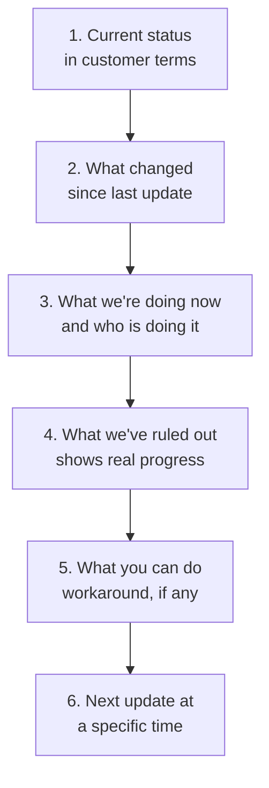
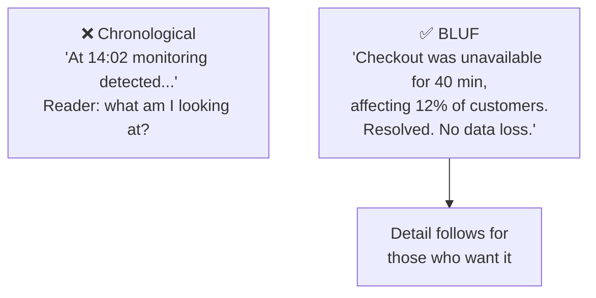
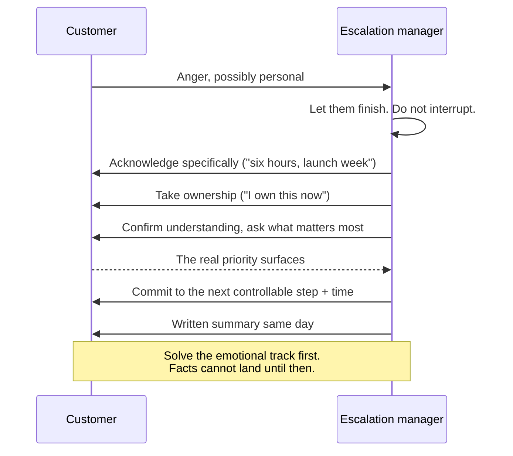

# Part G — Communication Under Pressure

> **Section goal:** make you excellent at the thing this role is actually judged on day to day — writing and speaking clearly when the situation is bad, the facts are incomplete, and the audience is angry or senior. Most escalations that go wrong, go wrong here rather than in the engineering.

Covers index items **38–43**. Maps to job responsibilities: *excellent written and verbal communication with the ability to engage customers and senior leadership during high-pressure situations; prepare executive-ready incident summaries and post-mortem reports.*

---

## 38. The four principles

Every good escalation communication satisfies four things. Remember them as **the four C's**.

| Principle | Means | Failure looks like |
|---|---|---|
| **Clarity** | Plain language, no jargon, one interpretation only | "We're investigating anomalous latency in the ingestion pipeline" |
| **Cadence** | Predictable rhythm, promised and kept | Silence, then a sudden wall of text |
| **Commitment** | Only promise what you control | "Fixed by 5pm" when that's engineering's guess |
| **Empathy** | Acknowledge impact before explaining | Leading with a technical explanation |

### 🔍 Plain-English deep-dive: why cadence beats content

- **Cadence** — *a promised, predictable rhythm of updates, honored whether or not there is news.* **Analogy:** a delayed flight. Passengers tolerate a two-hour delay with updates every twenty minutes far better than a forty-minute delay with total silence, because silence removes their ability to plan and makes them assume the worst. **Why it matters:** you frequently cannot control *when* something is fixed. You can always control *when you speak next*. So make your promise about the thing you control. This is the single most transferable habit in the entire role.

> **The asymmetry to internalize:** customers forgive slow fixes. They rarely forgive being left in the dark, being surprised, or being told something that turns out to be untrue.

---

## 39. Customer updates

Three distinct artifacts, each with a job.

### The holding statement — sent fast, low on detail

Its purpose is to stop the silence, not to explain. Send within minutes.

> *"We're aware that [specific symptom] is affecting [scope] and we're actively investigating. I own this and will update you by [specific time], even if we don't yet have a full answer."*

Four elements: acknowledgement, scope, ownership, next update time. It contains **no cause and no ETA**, because you don't have either yet, and inventing them creates a retraction later.

### The progress update — on cadence

> **Element 4 is the one people omit and it matters enormously.** When there's no fix yet, "we've ruled out X, Y, and Z" is the difference between visible progress and apparent paralysis. It converts "nothing is happening" into "the search is narrowing."

### The closure note — the durable record

| Include | Why |
|---|---|
| What happened, plainly | The customer will forward this internally |
| Impact, honestly scoped | Understating damages trust more than the fault did |
| Root cause, at the right depth | Enough to be credible, not an internals dump |
| What we did | Mitigation and permanent fix as two distinct things |
| What we're changing | The preventive actions — this is what rebuilds confidence |
| What they should do | Any action on their side |
| A route back | Named contact if it recurs |

> **Write the closure note so the customer can forward it to *their* boss without editing.** That single test improves the quality more than any style guide, because it forces business language, honest impact, and a forward-looking commitment.

---

## 40. Executive-ready writing

Executives read differently: they read the first two lines, decide whether they're worried, and skim the rest.

- **BLUF — Bottom Line Up Front** — *state the conclusion first, evidence after.* **Analogy:** a newspaper headline, then the article. **Why it matters:** technical writing builds to a conclusion; executive writing opens with it. If your first sentence is background, you've already lost them.

### The one-page executive summary

| Section | Length | Content |
|---|---|---|
| **Bottom line** | 2–3 sentences | What happened, impact, current state |
| **Impact** | 3–4 bullets | Quantified: customers, duration, revenue, contractual |
| **Status** | 1–2 sentences | Contained? Ongoing? Resolved? |
| **What we're doing** | 3–5 bullets | Actions with named owners and dates |
| **Risk** | 2–3 bullets | Financial, legal, reputational exposure |
| **What I need from you** | 1–2 bullets | The specific decision or resource |

### 🔍 Plain-English deep-dive: facts vs hypotheses

- **The single most dangerous executive-communication error** is letting a hypothesis travel as a fact. An executive who repeats your guess to a customer as certainty — and is then contradicted — will not extend you trust again.
- **The fix is a labelling discipline.** Write "**Confirmed:** the outage began at 14:02" and "**Working hypothesis, unconfirmed:** a configuration change is the likely trigger." It takes three extra words and it protects everyone.

> **Never let your executive learn a material fact from the customer.** If bad news is coming, they hear it from you first. This is the cardinal rule, and it is worth stating explicitly in an interview because it demonstrates you understand your role in protecting leadership's credibility, not just the customer's experience.

---

## 41. Post-mortem reports for customers

An internal postmortem and a customer-facing **RCA report** are different documents with different audiences. Sending the internal one is a serious mistake — it contains internal system names, individual attributions, and speculation.

| Internal postmortem | Customer-facing RCA |
|---|---|
| Full technical detail | Appropriate depth, no internals dump |
| Individual actions named | Roles and systems, never individuals |
| Speculation permitted, labelled | Confirmed findings only |
| Blameless, candid | Accountable, professional |
| Includes "where we got lucky" | Omits it — reads as carelessness externally |

**Customer RCA structure:** Summary → Impact (honest, quantified) → Timeline (customer-relevant, timestamped) → Root cause (plain language) → Resolution (mitigation and permanent fix, separately) → **Preventive actions with dates** → Contact route.

> **The preventive-actions section is the entire point of the document.** Customers do not read an RCA to learn what broke; they read it to decide whether to keep trusting you. Vague commitments — "we will improve our monitoring" — actively damage that. Specific ones with dates — "alerting on connection-pool saturation, deployed 14 March; staged rollout now mandatory for this service" — rebuild it.

---

## 42. Apology, accountability, and phrases to avoid

- **Non-apology** — *"I'm sorry you feel that way" / "sorry for any inconvenience caused."* **Why it fails:** it apologizes for the customer's reaction rather than your fault. People detect it instantly and it escalates the emotional track.
- **Real acknowledgement** — names the impact, accepts ownership, no conditionals. *"This blocked your team for six hours during your launch week. That shouldn't have happened, and I'm sorry."*

| Never say | Say instead | Why |
|---|---|---|
| "Sorry for any inconvenience" | "This blocked your launch for six hours. I'm sorry." | Generic vs specific and real |
| "That's working as intended" | "That's current behavior — and I understand why it doesn't meet your need. Here are the options." | The first is technically true and relationally fatal |
| "No one else has reported this" | "You're the first to report this, which is useful — let's investigate." | The first implies they're wrong |
| "It should be fine now" | "We've applied X; we're monitoring and I'll confirm at 3pm." | Vague reassurance invites a re-escalation |
| "The engineer made a mistake" | "Our release process didn't catch this. We're changing that." | Never expose individuals externally |
| "I'll try to get an update" | "I'll update you at 2pm regardless." | Trying isn't a commitment |
| "That's a known issue" (alone) | "That's a known issue; here's the workaround, status, and timeline." | Alone, it sounds like an excuse |
| "Per our SLA, we're within terms" | Address the impact first; contract second | Legally safe, relationally catastrophic |

### 🔍 Plain-English deep-dive: apologizing without admitting liability

There is real tension between empathy and legal exposure, especially where money or regulation is involved.

- **You can always acknowledge impact** — "your team was blocked for six hours" is a fact.
- **You can always express regret** — "I'm sorry this happened" is human.
- **You should not assign legal fault** — "we were negligent," "we breached our obligations" are legal conclusions belonging to Legal.

**Analogy:** a doctor can say "I'm so sorry this happened to you" with full sincerity without saying "we committed malpractice." Empathy and liability are separate registers, and conflating them is what makes people sound either robotic or reckless.

---

## 43. Verbal communication

Writing gives you time to think. Calls don't — so you need structures you can run under pressure.

### The difficult call

**Handling the hostile opening:** let them finish completely — interrupting an angry person resets their anger to the start. Take the criticism of the company impersonally; it isn't about you even when it's addressed to you. Then acknowledge *specifically*, because generic sympathy reads as scripted.

### Saying "I don't know" well

This is a genuine skill. The bad version is evasion or invention; the good version is a three-part structure:

1. **Honest:** "I don't know yet."
2. **Method:** "Here's how we're finding out — engineering is reviewing X."
3. **Commitment:** "I'll have an answer by 4pm, or I'll tell you what's blocking it."

> **Credibility survives ignorance. It does not survive being wrong.** Guessing to appear competent is the highest-cost mistake in the role, because your value depends entirely on people believing what you tell them.

### The executive briefing

Assume 60 seconds. Lead with the conclusion. Have the detail ready but don't lead with it. End with a clear ask.

> *"Checkout was down 40 minutes, 12% of customers, now resolved, no data loss. Root cause identified, permanent fix Thursday. One enterprise account is asking for credits — I'd like approval for a two-day service credit in line with policy."*

Impact → containment → plan → ask. Under a minute, and the executive can act.

---

## ⭐ Likely Interview Questions for This Section

**Q1. "You need to tell a customer there's still no fix after two days. What do you write?"**
> *Model answer:* I acknowledge the duration specifically rather than generically, because two days of a blocked workflow has a real business cost and pretending otherwise reads as tone-deaf. Then I show progress even without resolution — what we've ruled out is genuinely valuable here, because it converts "nothing is happening" into "the search is narrowing." Then what's happening right now and who's doing it, any workaround, and a specific next update time. What I avoid is a speculative ETA to fill the discomfort. If I don't know when it'll be fixed, I say so and commit to the next update instead. I can always keep a promise about when I'll speak; I can't always keep one about when engineering will finish.

**Q2. "What's wrong with 'we apologize for any inconvenience caused'?"**
> *Model answer:* It's generic, conditional, and passive — it apologizes for a hypothetical inconvenience rather than the actual damage, and people detect that instantly. It signals that we haven't understood or don't want to name what we did. The alternative is specific: "this blocked your team for six hours during your launch week; that shouldn't have happened and I'm sorry." Same length, completely different effect, because it proves I know what actually happened to them. And it's worth noting you can do that without accepting legal fault — acknowledging impact and expressing regret are separate registers from assigning liability, which belongs to Legal.

**Q3. "How do you write for an executive versus a technical audience?"**
> *Model answer:* Executives get bottom line up front — conclusion first, evidence after — because they read the first two lines, decide whether to be worried, and skim the rest. So I open with impact and current state, then quantified impact, containment status, actions with owners and dates, risk exposure, and what I need from them. Technical audiences get the reverse: detail, evidence, and reasoning, building to a conclusion. The critical discipline in both, but especially for executives, is explicitly labelling confirmed facts versus working hypotheses. An executive who repeats my guess to a customer as certainty and gets contradicted won't trust me again.

**Q4. "A customer asks a question and you genuinely don't know. What do you say?"**
> *Model answer:* "I don't know yet" — then method and commitment. Here's how we're finding out, here's who's doing it, and I'll have an answer by four o'clock or I'll tell you what's blocking it. The instinct under pressure is to fill the silence with something plausible, and that's the single most expensive mistake available, because my entire value depends on people believing what I say. Credibility survives ignorance; it does not survive being wrong. A customer who's told "I don't know, here's how I'll find out" almost always accepts it — what they can't accept is discovering later that I guessed.

**Q5. "What goes in a customer-facing RCA that doesn't go in the internal one — and vice versa?"**
> *Model answer:* The internal postmortem is candid and blameless: full technical detail, individual actions, labelled speculation, and a "where we got lucky" section on near-misses. The customer-facing version keeps confirmed findings only, describes roles and systems rather than individuals, uses appropriate depth without dumping internals, and drops "where we got lucky" — internally that's a mature finding, externally it reads as carelessness. The section that actually matters to the customer is preventive actions with specific dates, because they're not reading it to learn what broke, they're reading it to decide whether to keep trusting us. Vague commitments like "we will improve monitoring" damage that; specific dated ones rebuild it.

**Q6. "A customer opens a call by shouting at you personally. How do you handle it?"**
> *Model answer:* I let them finish completely without interrupting, because interrupting an angry person resets their anger to the beginning. I take it impersonally — it's directed at the company through me, even when the words are aimed at me. Then I acknowledge specifically, naming the actual impact rather than offering generic sympathy, which reads as scripted and makes things worse. Then I take ownership explicitly and ask what matters most to them right now, because the stated problem often isn't the real priority. Only after that does anything factual land. And I follow with a written summary the same day, both because it demonstrates I listened and because it gives them something credible to show their own management.

**Q7. "What's the one communication habit that prevents the most escalations?"**
> *Model answer:* Updating on a promised schedule even when there's no news. "No change, still investigating, next update at four" takes thirty seconds and prevents the silence in which customers assume the worst, invent their own narrative, and escalate to someone senior. Most escalations that deteriorate, deteriorate during silence, not during bad news. It works because it makes my promise about the thing I actually control — when I speak next — rather than the thing I don't, which is when engineering finishes. It's the flight-delay principle: people tolerate a long delay with regular updates far better than a short one with none.

---

## 🧠 30-Second Memory Hooks

- **Four C's:** Clarity, Cadence, Commitment, Empathy.
- **Promise the update, not the fix.** You control when you speak; you don't control when it's fixed.
- **Flight-delay principle:** silence is worse than bad news.
- **Holding statement = acknowledge + scope + ownership + next update time.** No cause, no ETA.
- **"What we've ruled out"** turns apparent paralysis into visible progress.
- **BLUF for executives.** Headline first, article after.
- **Label Confirmed vs Working hypothesis.** Three words that prevent disasters.
- **Your exec never learns a fact from the customer first.**
- **Write the closure note so they can forward it to their boss unedited.**
- **"Sorry you feel that way" is not an apology.** Name the actual impact.
- **"Working as intended"** is technically true and relationally fatal.
- **Credibility survives ignorance, not being wrong.** Never guess to look competent.
- **Impact → contained? → plan → ask.** The 60-second exec briefing.

---

## 🔁 Rapid Recall Drill

1. Name the four C's and the failure mode of each. *(§38)*
2. Give the four elements of a holding statement — and the two things it must not contain. *(§39)*
3. Which progress-update element shows progress without a fix? *(§39)*
4. Recite the six sections of a one-page executive summary. *(§40)*
5. Name three things in an internal postmortem that must not go to a customer. *(§41)*
6. Rewrite "sorry for any inconvenience" and "that's working as intended." *(§42)*
7. Give the three-part structure for saying "I don't know." *(§43)*

---

*Next suggested section:* **[Part H — Commercial Disputes: Billing, Refunds & Compensation](Part-H-billing-refunds-compensation.md)** — where escalations stop being about technology and start being about money.
