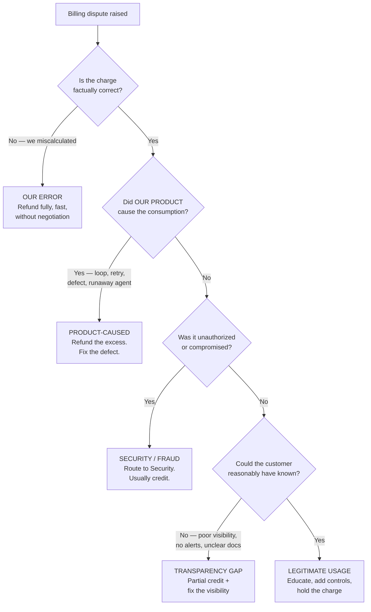
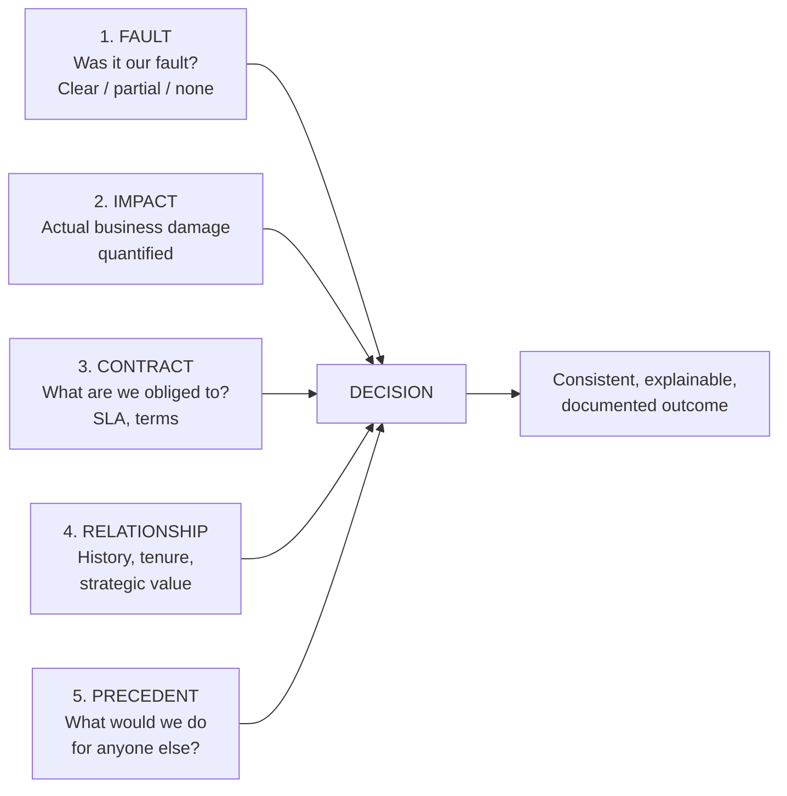
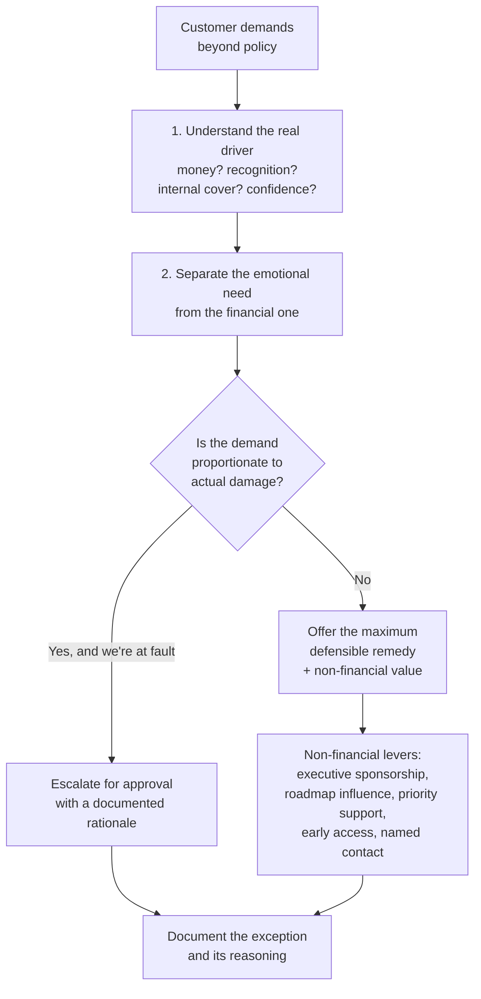
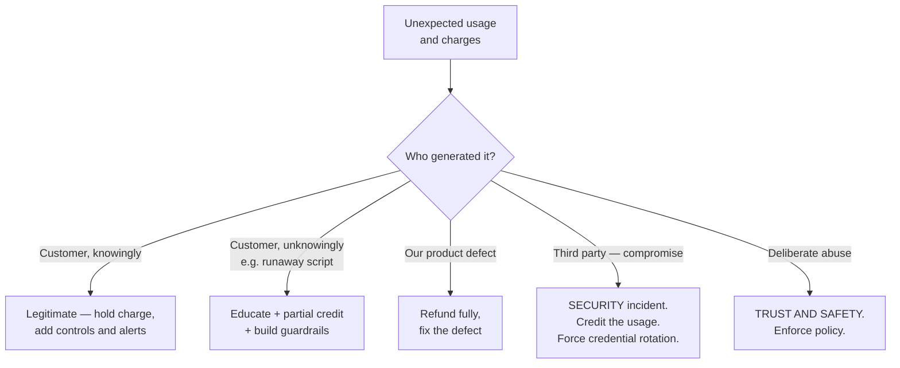

# Part H — Commercial Disputes: Billing, Refunds & Compensation

> **Section goal:** give you a defensible way to decide who pays when something goes wrong. Money escalations feel different from technical ones because there is no "correct" answer produced by investigation — there is only a *fair, consistent, defensible* decision. This Part gives you the framework that produces one.

Covers index items **44–49**. Maps to job responsibilities: *handle complex disputes involving billing, refunds, platform reliability, AI-generated outputs, and customer compensation with fairness and empathy; mitigate financial risk.*

---

## 44. Billing models

You cannot resolve a billing dispute you don't understand. These are the models you'll meet.

| Model | How it charges | Analogy | Dispute it generates |
|---|---|---|---|
| **Subscription (flat)** | Fixed fee per period | Gym membership | "We didn't use it" / auto-renewal surprise |
| **Per seat** | Fee × number of users | Cinema tickets | "We removed users, why still charged?" |
| **Usage / consumption** | Pay per unit consumed | Electricity meter | **Bill shock** — the big one |
| **Tiered** | Price per unit falls with volume | Bulk discount | Threshold and boundary disputes |
| **Credits / prepaid** | Buy credits, spend down | Prepaid phone | Expiry, unused balance, refunds |
| **Overage** | Base allowance, then per-unit | Mobile data plan | Unexpected overage charges |
| **Hybrid** | Platform fee + usage | Base rate + metered | Complexity itself causes disputes |

### 🔍 Plain-English deep-dive: why usage billing dominates AI disputes

- **Usage-based / consumption billing** — *you pay for what you consume, measured in units like tokens, requests, compute-minutes, or agent runs.* **Analogy:** an electricity meter rather than a flat rent. **Why it dominates AI disputes:** with traditional software, cost is predictable and decoupled from behavior. With AI, cost is driven by consumption that the *system itself* partly controls — an agent that retries, loops, or takes a longer reasoning path spends more money without the customer doing anything differently. That is a genuinely new category of dispute, and it's why "the product spent my money" is a legitimate complaint rather than a misunderstanding.

- **Bill shock** — *an invoice dramatically higher than the customer expected.* **Analogy:** a mobile roaming bill after a holiday. **Why it matters:** it's the single most common commercial escalation in usage-priced products, and the customer's anger is usually proportional to how *surprised* they were rather than how much they were charged. That distinction is your lever: transparency and alerting prevent more disputes than price changes do.

| Term | Plain meaning | Why it appears in disputes |
|---|---|---|
| **ARR / MRR** | Annual / monthly recurring revenue | The number leadership weighs your concession against |
| **Proration** | Partial-period charge when changing mid-cycle | "Why is this a strange amount?" |
| **True-up** | Reconciling actual vs contracted usage | Surprise annual bills |
| **Rate limit / throttle** | Capping consumption speed | Protects against runaway spend, but frustrates |
| **Commit** | Contracted minimum spend | Disputes when the customer under-consumes |
| **Churn** | Cancellation | The outcome your decision is really weighed against |

---

## 45. How billing disputes actually arise

Diagnose the *category* before deciding the outcome. Each one has a different fair answer.

> **This decision tree is one of the most useful artifacts in the whole guide.** It converts an emotive argument into a factual classification, and once you've classified honestly, the fair answer is usually obvious and — crucially — *explainable*. The ability to explain *why* is what makes a decision defensible to the customer, to Finance, and to the next customer who asks for the same thing.

### 🔍 Plain-English deep-dive: the transparency gap

- **Transparency gap** — *the charge is technically correct and the customer genuinely could not have anticipated it.* **Analogy:** a car park with legitimate charges displayed only in small print behind a pillar. The fee is real; the signage is the problem. **Why it matters:** this is the most common and most contested category, and it's where the *systemic* finding lives. If several customers hit the same gap, the answer isn't a series of individual credits — it's spend alerts, budget caps, a usage dashboard, and clearer documentation. Paying out repeatedly without fixing the visibility is how a company quietly funds the same defect forever.

---

## 46. Refunds, credits, goodwill, and service credits

Four different instruments. Using the right one matters commercially and legally.

| Instrument | What it is | When | Cash impact |
|---|---|---|---|
| **Refund** | Money returned | We charged in error; product-caused | Real revenue reduction |
| **Credit** | Balance against future invoices | Goodwill; keeps the relationship going | Deferred; retains the customer |
| **Goodwill gesture** | Discretionary, no fault admitted | Relationship repair | Controlled |
| **Service credit** | Contractual remedy for SLA breach | SLA missed | Pre-agreed, predictable |
| **Waiver** | Cancelling a charge before payment | Disputed invoice not yet paid | Cleanest operationally |

### 🔍 Plain-English deep-dive: service credits

- **Service credit** — *a pre-agreed remedy written into the contract: if availability falls below the promised level, the customer receives a percentage of their fee back.* **Analogy:** the "30 minutes or free" pizza guarantee — the compensation is defined before anything goes wrong. **Why it matters:** it's usually the customer's **sole contractual remedy**, which means it caps your exposure. Two practical consequences: (1) service credits are typically a small fraction of the customer's actual business loss, so a customer who suffered real damage often finds them insulting and escalates *further*; (2) they're usually **claim-based**, meaning the customer must request them within a window — and proactively offering them when you've clearly breached is a strong trust move that costs little.

> **Credit versus refund is a genuinely strategic choice.** A credit keeps the customer in the relationship and preserves recognized revenue; a refund is a clean exit that may signal you've stopped fighting for them. Where the relationship is salvageable, credit is usually the better instrument — but forcing a credit on a customer who has decided to leave reads as a trap, and converts a commercial dispute into a reputational one.

---

## 47. A compensation framework

The fatal pattern in compensation is **case-by-case improvisation**, where the outcome depends on who complained loudest and who happened to handle it. That is unfair to quiet customers, impossible to defend, and creates uncontrolled precedent.

### The five inputs

| Input | Question | Weight |
|---|---|---|
| **Fault** | Was it our defect, our error, or neither? | Highest — clear fault means compensate without haggling |
| **Impact** | What actually happened to their business? | High — but require evidence, not assertion |
| **Contract** | What are we contractually obliged to provide? | The floor, not the ceiling |
| **Relationship** | Tenure, strategic value, history | Legitimate, but must not override fault |
| **Precedent** | Would we do this for a smaller customer? | The fairness check |

### 🔍 Plain-English deep-dive: the precedent test

- **Precedent** — *the expectation created by what you did last time.* **Analogy:** giving one child a bigger slice; the next request is no longer about cake, it's about fairness. **Why it matters:** every concession sets policy for future cases, whether or not you intend it. **The test to apply, every time:** *"Would I be comfortable if every customer in this exact situation received this outcome — and if this decision were read aloud to all of them?"* If yes, proceed. If no, either don't do it, or do it explicitly as a documented exception with a stated reason.

> **Consistency is the actual product of a compensation framework.** Customers rarely audit each other's settlements, but your own team and Finance absolutely do — and the moment outcomes look arbitrary, every future negotiation becomes harder because the ask itself becomes negotiable.

**Escalating authority** works well as a tiered structure — small credits at practitioner discretion, larger ones needing management approval, and significant sums requiring Finance and Legal. Know your band and don't exceed it; a promise you can't fund is worse than a slow answer.

---

## 48. Balancing satisfaction against business objectives

The job description names this explicitly. It's asking whether you can hold two legitimate interests at once without collapsing into either.

| Collapse into the customer | Collapse into the company |
|---|---|
| Refund everything to end the conflict | Hide behind the contract |
| Promise fixes you don't control | "Per our SLA we're within terms" |
| Create unfundable precedent | Deny obvious fault |
| Loses margin and credibility internally | Loses the customer and the reference |

**The senior position is neither.** It sounds like this:

> *"You're right that this shouldn't have happened, and I'm not going to argue about that. Here's what I can do: [specific remedy, within policy]. Here's what I can't do, and why. And here's what we're changing so it doesn't recur."*

Three moves: **concede what's true**, **be precise about limits**, **commit to prevention**. This is what "fairness and empathy" means operationally — not generosity, but honesty applied consistently.

### 🔍 Plain-English deep-dive: when the customer demands more than policy allows

> **The non-financial levers are the most underused tool in the role.** Frequently what a customer actually wants is not money but *assurance that they matter* — an executive relationship, visible influence over the roadmap, a named contact, priority handling. These often cost less than the credit being demanded and repair the relationship far more durably, because they address the real driver: the fear that this will happen again and nobody will care.

---

## 49. Fraud, abuse, and chargebacks

- **Chargeback** — *a customer disputes a charge with their bank/card provider, which forcibly reverses it.* **Analogy:** going over the shop's head to your bank. **Why it matters:** you lose the money *and* pay a fee, excessive rates can jeopardize your payment processing, and the resolution moves to the card network's rules rather than yours. A chargeback is usually a **communication failure** — the customer gave up on getting a fair hearing from you.
- **Friendly fraud** — *a legitimate customer disputing a legitimate charge,* often through confusion rather than dishonesty. **Why it matters:** it's more common than actual fraud, and it's prevented by clear invoices, recognizable billing descriptors, and easy access to a human.
- **Account takeover** — *unauthorized access resulting in usage the customer didn't authorize.* **Why it matters:** this is a **security incident** first and a billing dispute second. Route to Security; almost always credit the fraudulent usage, because charging a victim for someone else's abuse is indefensible.
- **Abuse / ToS violation** — *deliberate misuse: circumventing limits, prohibited use, reselling.* **Why it matters:** this routes to Trust & Safety, not to a refund conversation.

> **The prevention frame is what makes you sound senior here.** Individual disputes are symptoms; the durable fixes are **spend alerts** at configurable thresholds, **hard budget caps**, a **real-time usage dashboard**, **anomaly detection** on unusual consumption, sensible **default rate limits**, and **clear invoices**. Each of these removes a whole class of future dispute — which is exactly the "convert recurring issues into scalable improvements" outcome the role is measured on.

---

## ⭐ Likely Interview Questions for This Section

**Q1. "A customer disputes a large usage bill. Walk me through it."**
> *Model answer:* I classify before I decide, because the fair answer differs completely by category. First: is the charge factually correct? If we miscalculated, that's our error — full refund, fast, no negotiation. If it's correct, did our product cause the consumption — a retry loop, a runaway agent, a defect? Then we refund the excess and fix the defect. If not, was it unauthorized, which makes it a security matter where we'd normally credit. If none of those, could the customer reasonably have known? If visibility was poor — no alerts, no dashboard, unclear docs — that's a transparency gap, and I'd give partial credit and fix the visibility. Only if they genuinely could have known and it's legitimate usage do I hold the charge, and even then I'd help them put controls in place. Then, separately, I'd ask whether this is the third time this month — because if so, the real answer isn't a credit, it's spend alerts and budget caps.

**Q2. "How do you decide how much compensation to offer?"**
> *Model answer:* Against five consistent inputs rather than by improvisation. Fault — was it clearly our defect, partly ours, or neither? That carries the most weight; where fault is clear I don't haggle. Impact — what actually happened to their business, evidenced rather than asserted. Contract — what we're obliged to provide, which is the floor, not the ceiling. Relationship — tenure and strategic value, which is legitimate but must never override fault. And precedent — would we do this for a smaller customer? Then I apply the precedent test: would I be comfortable if every customer in this exact situation got this outcome, and if the decision were read aloud to all of them? If not, either I don't do it, or I do it as a documented exception with a stated reason.

**Q3. "The customer's actual loss is far bigger than the service credit they're entitled to. What now?"**
> *Model answer:* I'd acknowledge the gap honestly rather than hiding behind the contract, because "per our SLA we're within terms" is legally safe and relationally catastrophic. Service credits are a pre-agreed remedy sized to the fee, not to the customer's business loss, so a customer with real damage often finds them insulting — that's a predictable dynamic, not an unreasonable customer. Practically, I'd separate the emotional driver from the financial one, because frequently what they want is assurance this won't recur and that someone senior cares. I'd offer the maximum defensible financial remedy, then use non-financial levers — executive sponsorship, roadmap influence, priority handling, a named contact — which often cost less than the credit demanded and repair trust more durably. If the damage genuinely warrants exceeding policy, I'd escalate for approval with a documented rationale rather than quietly promising it, and I'd involve Legal, because claims beyond contractual remedy have liability implications.

**Q4. "Why does precedent matter so much in compensation decisions?"**
> *Model answer:* Because every concession silently sets policy, whether or not you intended it. Once you've refunded one customer for a given situation, that becomes the expected outcome, and inconsistency is what makes future negotiations harder — the ask itself becomes negotiable, and customers who negotiate hardest get the best outcomes regardless of merit. That's unfair to the quiet customers and impossible to defend internally. Customers rarely compare settlements with each other, but Finance and my own team absolutely notice arbitrariness. So the discipline is a consistent framework, and where I genuinely need to deviate, I do it as an explicit, documented exception with a reason — not as a quiet one-off that becomes invisible precedent.

**Q5. "What's a chargeback and what does it tell you?"**
> *Model answer:* It's when a customer disputes a charge directly with their bank or card provider, which forcibly reverses it. Commercially it's bad — we lose the money, pay a fee, and excessive rates can threaten our payment processing, with the resolution moving to card-network rules instead of ours. But diagnostically it's more important than that: a chargeback usually means the customer gave up on getting a fair hearing from us. Someone who trusts your process disputes with you, not with their bank. So I'd treat a rising chargeback rate as a signal about accessibility and responsiveness in the billing-dispute path, and I'd check the basics — are invoices clear, is the billing descriptor recognizable, is it easy to reach a human? A lot of what looks like fraud is actually confusion.

**Q6. "How do you balance keeping the customer happy with protecting revenue?"**
> *Model answer:* By refusing to collapse into either side. Collapsing toward the customer means refunding everything to end the conflict, promising fixes I don't control, and creating unfundable precedent — that loses margin and my internal credibility. Collapsing toward the company means hiding behind the contract and denying obvious fault — that loses the customer and the reference. The position in between has three moves: concede what's genuinely true without arguing, be precise about what I can and can't do and why, and commit to what we're changing so it doesn't recur. Fairness and empathy in this context don't mean generosity — they mean honesty applied consistently, so the same customer would get the same answer from anyone on my team.

**Q7. "You keep seeing bill-shock escalations. What do you actually do about it?"**
> *Model answer:* Stop treating them as individual disputes. Repeatedly crediting the same failure mode is quietly funding a defect forever. The systemic fixes are largely product features: configurable spend alerts at percentage thresholds, hard budget caps that stop consumption rather than just warning, a real-time usage dashboard so cost isn't a monthly surprise, anomaly detection on unusual consumption patterns, sensible default rate limits, and clearer invoices that map charges to activity. I'd build the case for these with data — how many escalations, how much credited, how much support time, how many at renewal risk — and take it to Product as a revenue-protection argument rather than a support complaint. And the customer-anger insight matters here: bill shock anger is proportional to *surprise*, not to amount, so transparency prevents more disputes than pricing changes do.

---

## 🧠 30-Second Memory Hooks

- **Usage billing = electricity meter.** The AI twist: *the product itself* can spend your money.
- **Bill shock anger tracks surprise, not amount.** Transparency beats price changes.
- **Five-question dispute tree:** correct? → product-caused? → unauthorized? → could they have known? → legitimate.
- **Transparency gap = small print behind a pillar.** Fix the signage, not just the fee.
- **Refund = money back. Credit = future balance. Goodwill = no fault admitted. Service credit = contractual remedy.**
- **Service credits are sized to the fee, not the damage** — expect them to feel insulting.
- **Five compensation inputs:** Fault, Impact, Contract, Relationship, Precedent.
- **Precedent test:** would I be happy if *everyone* in this situation got this, read aloud?
- **Contract is the floor, not the ceiling.**
- **Non-financial levers are underused** — often they want assurance, not money.
- **A chargeback means they gave up on you.**
- **Three moves:** concede what's true → be precise about limits → commit to prevention.

---

## 🔁 Rapid Recall Drill

1. Why does usage-based billing create a new dispute category with AI? *(§44)*
2. Recite the five branches of the billing-dispute decision tree. *(§45)*
3. Distinguish refund, credit, goodwill gesture, and service credit. *(§46)*
4. Name the five compensation inputs and which carries the most weight. *(§47)*
5. State the precedent test in one sentence. *(§47)*
6. Give four non-financial levers. *(§48)*
7. Name five product features that prevent bill-shock escalations. *(§49)*

---

*Next suggested section:* **[Part I — Risk: Financial, Legal & Reputational](Part-I-financial-legal-reputational-risk.md)** — money is only one exposure; the next Part covers the ones that can outlive the customer relationship entirely.
