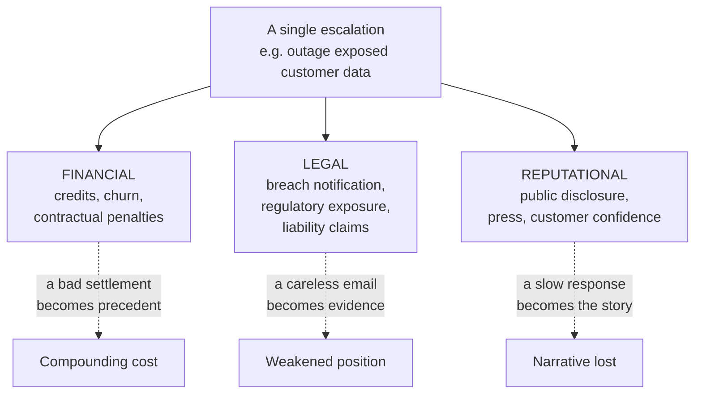
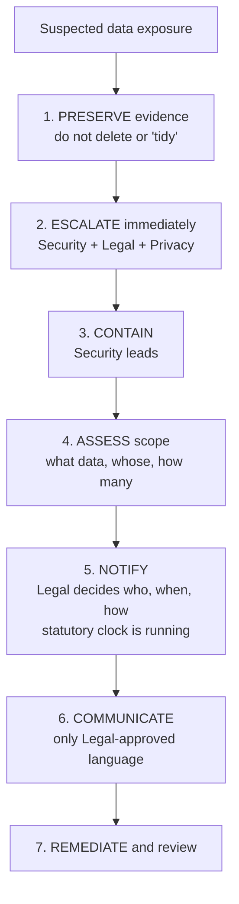
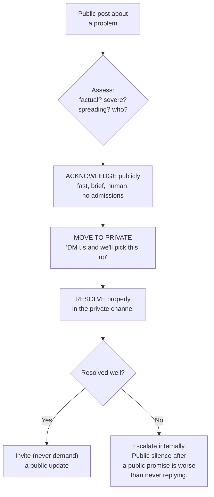

# Part I — Risk: Financial, Legal & Reputational

> **Section goal:** teach you to recognize when an escalation has stopped being a support problem and become a company risk — and to act correctly in the first hour, because risk escalations are the ones where early mistakes are irreversible.

Covers index items **50–56**. Maps to job responsibilities: *mitigate financial, legal, and reputational risks by ensuring escalations are resolved consistently and in line with company policies; manage escalations arriving via social media.*

---

## 50. The three risk categories

One escalation routinely creates all three at once. Recognizing which you're in changes who leads and how fast you must move.

| Risk | What's exposed | Clock | Who leads |
|---|---|---|---|
| **Financial** | Refunds, credits, lost revenue, churn, penalties | Weeks | Finance + you |
| **Legal / regulatory** | Contract breach, liability, privacy law, regulator | Months–years | Legal |
| **Reputational** | Trust, public perception, references, recruitment | **Hours** | Comms/PR + Legal |

### 🔍 Plain-English deep-dive: why the clocks differ so much

- **The reputational clock is the fastest and the least forgiving.** A public post can define the narrative within hours, long before your investigation has produced facts. **Analogy:** a fire spreading while the inspectors are still deciding whether to open an investigation. **Why it matters:** the instinct — "let's wait until we have full facts" — is correct for legal risk and *wrong* for reputational risk. You can acknowledge quickly without concluding anything, and that early acknowledgement is usually what determines whether you're a participant in the story or its subject.

- **The legal clock is the slowest but the most permanent.** Everything you write today may be read in two years by opposing counsel. **Why it matters:** speed of communication and care of communication pull in opposite directions here, which is exactly why Legal — not you — sets the position on anything with legal exposure.

> **The rule that resolves the tension:** move fast on *acknowledgement*, slowly on *conclusions*. "We're aware and investigating, we'll update by X" is both fast and legally safe. "We believe this was caused by Y" is neither.

---

## 51. Contracts, SLAs, and liability in plain English

You aren't expected to be a lawyer. You are expected to know when to stop and call one.

| Term | Plain meaning | Why it matters to you |
|---|---|---|
| **MSA** (Master Service Agreement) | The overarching contract | Contains the terms that actually govern the dispute |
| **SLA** | The promised service level and its remedy | Defines what you owe and what you don't |
| **Service credit** | The pre-agreed remedy for missing the SLA | Usually the customer's **sole remedy** — this caps exposure |
| **Sole remedy clause** | "This is the only compensation available" | The reason customers with large losses escalate past you |
| **Limitation of liability** | A cap on total damages, often fees paid | Why "we'll cover your losses" is never yours to say |
| **Indemnity** | One party covers the other's third-party claims | Frequently relevant for AI-generated output and IP |
| **DPA** (Data Processing Agreement) | Rules for handling personal data | Triggers breach-notification obligations |
| **Force majeure** | Excuses performance for extraordinary events | Occasionally relevant in outages |
| **Notice period / cure period** | Time to fix a breach before termination | Turns an escalation into a countdown |

### 🔍 Plain-English deep-dive: the three sentences that create liability

These are the ones to physically never write:

1. **"We were negligent" / "this was our fault"** — a legal conclusion, not a factual observation. Say *"our service did not perform as intended"* instead.
2. **"We'll compensate you for your losses"** — likely exceeds the liability cap and creates an obligation you cannot authorize.
3. **"This has happened to other customers"** — may be true, but characterizing a pattern in writing can convert a single dispute into evidence of systemic failure across a customer base.

**Analogy:** at a traffic accident you exchange details and describe what happened; you don't announce fault at the roadside. Facts are yours to give. Conclusions belong to the people who carry the consequences.

> **The written-record discipline:** assume every message, chat, and internal note could be read aloud in a dispute. Write facts, timestamps, and observations. Avoid speculation about fault, sarcasm about customers, and casual exaggeration like "this thing has always been broken." Being disciplined about this — and being able to say so in an interview — signals real commercial maturity.

- **Legal privilege** — *communications with lawyers for legal advice can be protected from disclosure.* **Why it matters:** privilege can be lost by forwarding widely or mixing legal advice into general business chatter. Practically: when Legal is engaged, follow their instructions on who's included and how things are labelled.

---

## 52. Privacy and data protection

Escalations involving personal data change character immediately, because obligations become statutory rather than commercial.

- **Personal data** — *information relating to an identifiable person.* Broader than most people assume: names, emails, IP addresses, device identifiers, and often user-generated content.
- **Data controller vs processor** — *the controller decides why and how data is processed; the processor acts on the controller's instructions.* **Analogy:** the controller is the person storing belongings; the processor is the storage company. **Why it matters:** in most B2B SaaS, your customer is the controller and you are the processor — which means **they** usually own notifying regulators and end users, while **you** owe them prompt, accurate information.
- **Data breach** — *unauthorized access, disclosure, alteration, or loss of personal data.* **Why it matters:** many regimes impose tight notification deadlines (commonly 72 hours to a regulator from awareness). That clock is legally defined and starts without waiting for your convenience.
- **Data subject rights** — *individuals' rights to access, correct, delete, or port their data.* **Why it matters:** these arrive as escalations with statutory deadlines, and missing them is a regulatory failure regardless of goodwill.
- **Data residency** — *requirements about which country data is stored in.* **Why it matters:** a common enterprise escalation trigger, especially around AI processing and sub-processors.

> **The first hour discipline in a suspected data incident:** preserve evidence, escalate to Security/Legal/Privacy, and say nothing definitive externally. The most damaging thing you can do is reassure a customer that "no data was affected" before scope is confirmed — a premature all-clear that later reverses is far worse than saying "we're investigating and will confirm scope."

---

## 53. When to involve Legal

**Involve Legal immediately when any of these appear:**

| Trigger | Example |
|---|---|
| Personal data exposed or suspected | Any potential breach |
| A lawyer is mentioned or appears | "Our counsel will be in touch" |
| Contract termination or breach claimed | "You're in material breach" |
| Compensation beyond standard policy | Claims for consequential losses |
| Regulatory or government contact | Regulator query, subpoena |
| IP or licensing questions | AI-generated code and ownership |
| Public statement required | Anything press-facing |
| Safety or serious harm alleged | Physical, financial, or discriminatory harm |

### 🔍 Plain-English deep-dive: how to hand over well

Legal's usefulness depends entirely on the quality of what you give them. A good handover contains:

- A **factual timeline** with timestamps and sources.
- **What is confirmed** versus **what is suspected**, explicitly labelled.
- **Exactly what the customer has said and been told**, verbatim where it matters.
- **What has already been communicated externally** — the most critical item, because it constrains every subsequent option.
- **The specific question** you need answered.

> **The item people forget is "what have we already said."** Legal cannot advise safely without knowing what commitments are already in the customer's inbox. Discovering an unauthorized promise late is how a manageable dispute becomes an expensive one.

---

## 54. Social media and public escalations

Public escalations invert the normal rules: the audience is not the complainant.

| Private escalation | Public escalation |
|---|---|
| Audience: the customer | Audience: everyone watching |
| Clock: hours to days | Clock: **hours** |
| Goal: resolve the issue | Goal: resolve the issue **and** the narrative |
| Detail: as much as useful | Detail: minimal in public |
| Owner: you | Owner: you + Comms, often Legal |

### The rules of public response

1. **Respond fast, resolve privately.** The public reply exists to show responsiveness, not to litigate details.
2. **Never argue publicly**, even when you're right. Onlookers see a company arguing with a customer, and nobody reads a thread deciding you were technically correct.
3. **Never disclose account details publicly** — a privacy failure on top of the original issue.
4. **Be human, not corporate.** Templated replies to public complaints reliably make things worse.
5. **Don't demand the post be deleted.** It reads as suppression and frequently creates a second, larger story.
6. **Loop in Comms early** for anything with reach or press potential.

- **The Streisand effect** — *attempts to suppress information amplify it.* **Analogy:** trying to hush someone in a quiet room makes everyone turn around. **Why it matters:** it's the single most common self-inflicted wound in public escalations, and it's why legal-flavoured responses to small public complaints are almost always a mistake.

> **Technical communities escalate differently and this matters for developer-facing products.** Developers post reproducible evidence, and their communities evaluate the *technical substance* of your reply. A vague corporate response to a detailed technical complaint is read as evasion by an audience fully capable of checking. Substance, specificity, and a named human are what work.

---

## 55. Crisis communication

A **crisis** is when the issue threatens the organization's reputation broadly, not just one relationship.

**The first hour matters more than the next week.**

| Do immediately | Never |
|---|---|
| Acknowledge awareness | Speculate on cause |
| State what you're doing | Blame a third party |
| Commit to a next update time | Minimize ("just a small number") |
| Route everything to one channel | Let multiple people freelance statements |
| Brief internal staff first | Let employees learn it from press |

- **Holding statement** — *a short, factual, early public statement.* Its job is to occupy the space so someone else's account doesn't become the record.
- **Single source of truth** — *one channel where the authoritative status lives.* Prevents contradictions, which do more damage than the incident.
- **Internal comms first** — employees who learn from the press become uncontrolled commentators; briefed employees become an asset.

> **Minimizing is the most common and most expensive crisis error.** "Only a small number of customers were affected" invites someone to prove otherwise, and if they do, the story shifts from *what happened* to *the company misled people* — a far worse story that lasts far longer.

---

## 56. Regulatory and compliance touchpoints

You don't need deep expertise; you need to recognize the words and route correctly.

| Area | What it governs | Escalation trigger |
|---|---|---|
| **Data protection** (GDPR-style) | Personal data handling | Breach, access request, transfer concern |
| **Sector rules** (financial, health, public) | Industry-specific obligations | Customers in regulated sectors |
| **Accessibility** | Usable by people with disabilities | Complaint or procurement requirement |
| **Consumer protection** | Fair terms, clear pricing, cancellation | Billing and auto-renewal disputes |
| **AI-specific regulation** | Transparency, risk classification, human oversight | Growing rapidly; expect it in enterprise reviews |
| **Export / sanctions** | Who may use the product | Onboarding and access escalations |

- **Audit trail** — *a durable record of what happened and who did what.* **Why it matters:** in regulated escalations, being unable to *demonstrate* a proper process is treated as not having one. This is a strong argument for disciplined case documentation that goes beyond personal preference — it's a compliance control.

> 💡 **On the job:** the reflex to build is recognition, not expertise. The moment you hear *regulator, breach, discrimination, safety, subpoena, counsel, data subject,* or *material breach*, your next action is to route — not to reply.

---

## ⭐ Likely Interview Questions for This Section

**Q1. "When do you involve Legal?"**
> *Model answer:* Immediately on a defined trigger list rather than by judgement in the moment, because the cost of involving them unnecessarily is small and the cost of involving them late is often irreversible. The triggers: any suspected personal-data exposure; the customer mentions counsel; a breach or termination claim; demands for compensation beyond standard policy, especially consequential losses; any regulator or government contact; IP or licensing questions, which matter a lot with AI-generated output; anything requiring a public statement; and any allegation of serious harm. When I hand over, I give a factual timeline, explicitly separate confirmed from suspected, quote what the customer has actually said, and — most importantly — state exactly what we've already communicated externally, because that constrains every option they have.

**Q2. "A customer posts publicly that your product lost their data. What do you do in the first hour?"**
> *Model answer:* Two things in parallel. Externally: acknowledge fast, briefly, and humanly — that we're aware, taking it seriously, and following up directly — with no admissions and no details, then move it to a private channel. Internally: this is a suspected data incident, so it goes immediately to Security, Legal, and Privacy; evidence gets preserved rather than tidied; and Security leads containment. The critical discipline is that I don't say anything definitive about scope, including reassurance. Telling them "no data was affected" before scope is confirmed is the worst available move, because a premature all-clear that later reverses turns a data incident into a credibility crisis. And I don't ask them to delete the post — that's the Streisand effect and it reliably creates a bigger story.

**Q3. "What would you never put in writing during an escalation?"**
> *Model answer:* Three things specifically. Legal conclusions like "we were negligent" or "this was our fault" — I'd write "our service did not perform as intended," which is factual and equally honest. Commitments to cover losses, because that likely exceeds the contractual liability cap and isn't mine to authorize. And characterizations of a pattern like "this happens to lots of customers," which may be true but can convert a single dispute into evidence of systemic failure across a customer base. More generally I write assuming everything could be read aloud in a dispute two years later — facts, timestamps, observations; no speculation about fault, no sarcasm about customers, no casual exaggeration.

**Q4. "Why is the reputational clock different from the legal one, and how do you handle the conflict?"**
> *Model answer:* They pull in opposite directions. Reputational risk moves in hours — a public account becomes the accepted narrative long before an investigation produces facts, so waiting for certainty means losing the story. Legal risk is the opposite: it's slow but permanent, and anything said early and wrongly is durable evidence. The resolution is to separate acknowledgement from conclusion. Move fast on acknowledgement — "we're aware, we're investigating, we'll update by this time" — which is both immediate and legally safe. Move slowly on conclusions, and let Legal own anything that assigns cause or fault. That single distinction lets you be fast and careful at once.

**Q5. "What's the difference between a data controller and a processor, and why does it matter in an escalation?"**
> *Model answer:* The controller decides why and how personal data is processed; the processor acts on the controller's instructions — like the difference between the person storing belongings and the storage company. In most B2B SaaS, the customer is the controller and we're the processor. It matters enormously in an escalation because it determines who owes what to whom: the controller usually owns notifying regulators and end users, while our obligation is to inform them promptly and accurately so they can meet their statutory deadlines. So "we'll handle the notifications" is usually the wrong offer — the right one is fast, accurate, complete information to the customer, because their clock is legally defined and it starts when they become aware.

**Q6. "How do you handle an angry public post from a developer with a detailed technical complaint?"**
> *Model answer:* With substance, because that audience can check. Technical communities post reproducible evidence and evaluate the technical quality of the reply, so a templated corporate response reads as evasion to people fully capable of verifying. I'd respond quickly from a named human, acknowledge the specific technical point rather than the generic frustration, say honestly what we know and don't, and offer a concrete next step. I'd move detail to a private channel but I wouldn't hide behind that — if the substance is correct, saying so publicly builds more credibility than any resolution. What I'd never do is argue publicly even if we're right, because onlookers just see a company arguing with a user, and nobody finishes the thread concluding we were technically correct.

**Q7. "What's the most common mistake companies make in a crisis?"**
> *Model answer:* Minimizing. "Only a small number of customers were affected" is the classic, and it's expensive because it invites someone to prove otherwise — and if they do, the story stops being about the incident and becomes about the company misleading people, which is a much worse story with a much longer life. The second most common is inconsistency from multiple people freelancing statements, which is why a single source of truth matters more than eloquence. And the third is briefing externally before internally — employees who learn about a crisis from the press become uncontrolled commentators, whereas briefed employees are an asset.

---

## 🧠 30-Second Memory Hooks

- **Three clocks:** reputational = hours, financial = weeks, legal = years.
- **Fast on acknowledgement, slow on conclusions.** That resolves the speed/care conflict.
- **Facts are yours; conclusions belong to Legal.** Traffic-accident rule: exchange details, don't declare fault.
- **Three sentences never to write:** "we were negligent," "we'll cover your losses," "this happens to lots of customers."
- **Sole remedy + liability cap** = why big-loss customers escalate past you.
- **Controller decides, processor acts.** Usually: customer = controller, you = processor.
- **Never give a premature all-clear.** Reversing "no data was affected" is worse than the breach.
- **Tell Legal what you've already said.** It constrains everything.
- **Streisand effect:** never demand a post be deleted.
- **Never argue publicly, even when right.**
- **Minimizing makes the story about the lie, not the incident.**
- **Brief internally first.**
- **Route on keywords:** regulator, breach, subpoena, counsel, discrimination, material breach.

---

## 🔁 Rapid Recall Drill

1. Name the three risk categories, their clocks, and who leads each. *(§50)*
2. Explain "sole remedy" and why it drives further escalation. *(§51)*
3. State the three sentences you must never write, with safe alternatives. *(§51)*
4. Give the seven steps of the suspected-data-exposure response. *(§52)*
5. Name the item most often missing from a Legal handover. *(§53)*
6. List the six rules of public response. *(§54)*
7. What is the most common crisis-communication error and why is it costly? *(§55)*

---

*Next suggested section:* **[Part J — AI Behavior Escalations & Trust and Safety](Part-J-ai-behavior-trust-and-safety.md)** — the risk categories above take a distinctive shape when the product generates its own output and takes its own actions.
