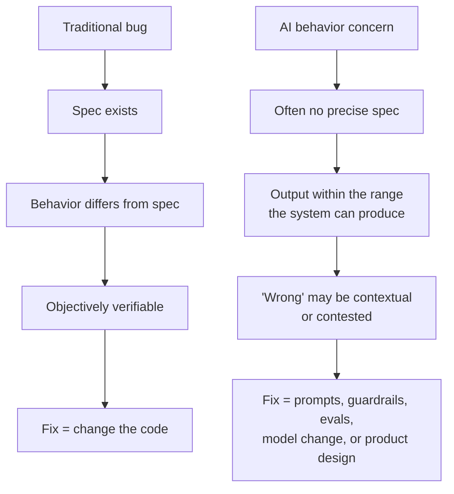
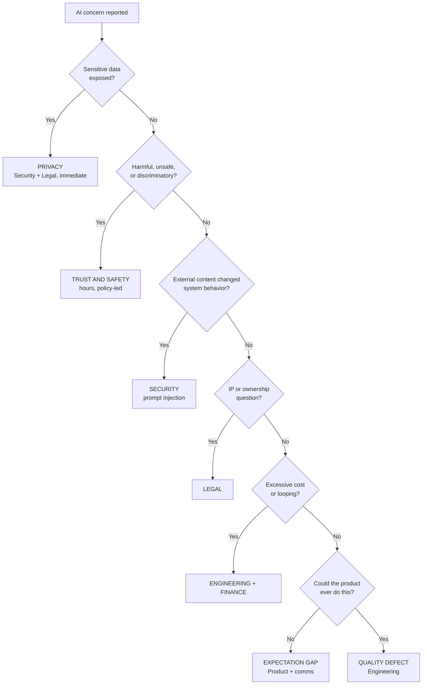
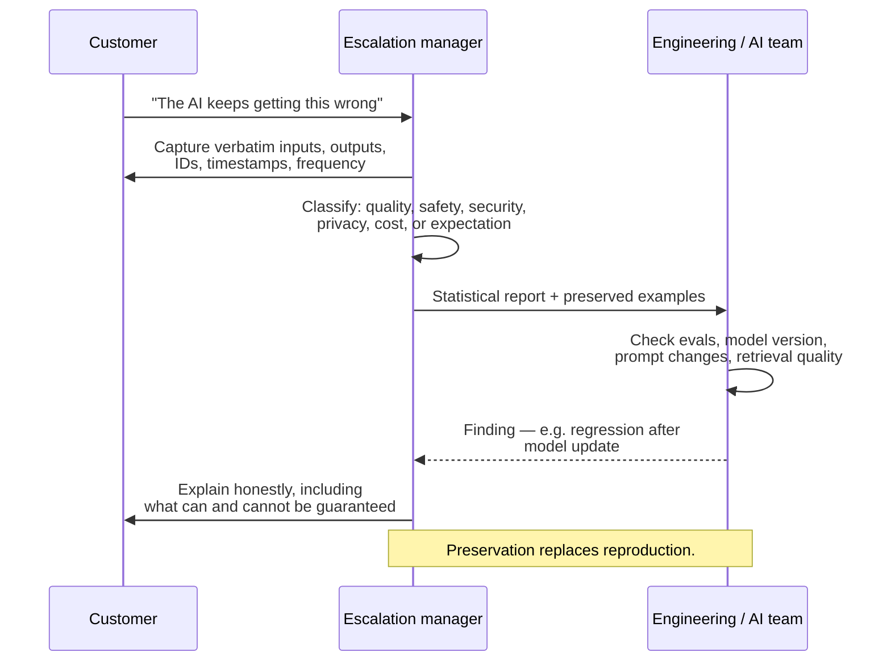
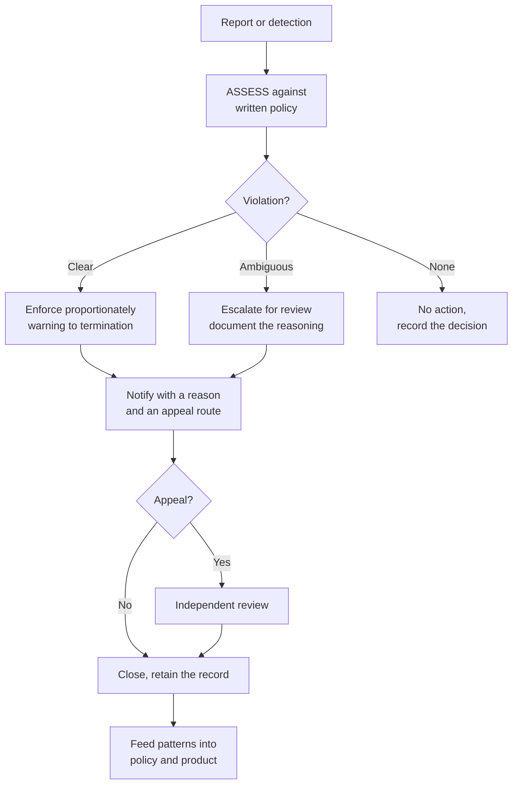

# Part J — AI Behavior Escalations & Trust and Safety

> **Section goal:** prepare you for the escalation category that barely existed a few years ago and now defines the role at an AI company — complaints about what the AI *did*. This is where you can differentiate yourself most, because few candidates have a structured way to think about it.

Covers index items **57–62**. Maps to job responsibilities: *own AI behavior concerns; handle disputes involving AI-generated outputs; Trust & Safety background preferred.*

---

## 57. What "AI behavior concern" means

A traditional bug report says *"the software did something other than what it was built to do."* An AI behavior concern says *"the software did what it was built to do, and the result was wrong, harmful, or unacceptable."*

That distinction breaks the classical support model, because there is often **no defect to point at**. The system worked as designed and still produced a bad outcome.

### 🔍 Plain-English deep-dive: the accountability question

- **The core tension:** when an autonomous system produces a harmful or costly output, who is responsible — the vendor who built it, the user who prompted it, or the model provider? **Analogy:** a self-driving car in an accident. The manufacturer, the owner who engaged the mode, and the sensor supplier all have arguable roles, and the answer depends on facts: was it used as intended, were warnings given, was the failure foreseeable?
- **Why it matters to you:** you are frequently the first person to receive this question, in an angry form, before anyone has decided the company's position. **The correct posture in the first hour is not to answer it.** Gather facts, preserve evidence, classify the concern, and route it. Improvising a liability position on an AI harm is one of the few genuinely unrecoverable mistakes available in the role.

---

## 58. The categories of AI concern

Correct classification determines the owner, the clock, and the communication style. Getting this right in the first fifteen minutes is the highest-value thing you do.

| Category | What happened | Owner | Clock |
|---|---|---|---|
| **Incorrect output** | Factually wrong, invented, or broken result | Engineering / Product | Days |
| **Unsafe or harmful output** | Dangerous, abusive, or policy-violating content | Trust & Safety | Hours |
| **Biased or discriminatory output** | Systematically unfair treatment | T&S + Legal | Hours |
| **IP / licensing** | Generated content resembling protected work; unclear ownership | Legal | Days–weeks |
| **Privacy / data leakage** | Sensitive data surfaced improperly | Security + Legal + Privacy | **Immediate** |
| **Security** | Prompt injection, generated vulnerable code, unsafe action | Security | **Immediate** |
| **Cost / runaway behavior** | Loops, retries, excessive consumption | Engineering + Finance | Days |
| **Capability / expectation gap** | It genuinely can't do what they expected | Product + you | Days |

> **Being able to draw this triage in an interview is a strong differentiator.** It demonstrates that you see AI escalations as a routing problem with distinct owners and clocks — not as one undifferentiated bucket labelled "the AI was wrong."

---

## 59. Investigating non-deterministic issues

The classical support pipeline depends on reproduction. AI systems weaken that dependency, so the discipline shifts from *reproducing* to *preserving*.

### What to capture — immediately, because it may be unrepeatable

| Evidence | Why |
|---|---|
| **Exact input / prompt** | Verbatim, including whitespace and formatting |
| **Full context** | Attached files, prior turns, retrieved documents, system settings |
| **Complete output** | Verbatim, not paraphrased or screenshotted-in-part |
| **Timestamp** | Correlates with model or config changes |
| **Session / request / trace ID** | Lets engineering find the exact inference |
| **Model and version** | Behavior differs across versions |
| **Configuration** | Temperature, tools enabled, guardrail settings |
| **Frequency** | "Once" versus "one in twenty" changes everything |
| **Environment** | Region, tenant, integration path |

### 🔍 Plain-English deep-dive: statistical bug reports

- **Deterministic report:** "Do A, B, C — it fails every time." **Analogy:** a light switch that always fails.
- **Statistical report:** "Across 200 runs of this workflow, 9 produced an invalid result; here are 9 captured examples with IDs and timestamps; it clusters on longer inputs." **Analogy:** an intermittent electrical fault — you document the pattern, not a single flick.

**Why this matters:** a statistical report is a *legitimate and actionable* bug report in an AI product, and engineers will take it seriously. What they cannot act on is "sometimes it's wrong" with no examples preserved. Your value here is enormous and very concrete — you are the person who turns diffuse customer frustration into a quantified pattern.

> **Establish "last known good" precisely.** With AI systems, "it used to be better" is often literally true because the model, prompt, or retrieval layer changed. A precise date and preserved before/after examples turn a vague complaint into a regression investigation.

---

## 60. Guardrails, evaluations, and rollback

The tools available for fixing AI behavior — worth knowing so you can ask the right question and set honest expectations.

| Mechanism | Plain meaning | Analogy | Speed |
|---|---|---|---|
| **System prompt / instructions** | Standing instructions given to the model | The employee handbook | Fast |
| **Guardrails** | Filters and rules on inputs and outputs | Safety rails on a staircase | Fast |
| **Evals (evaluations)** | Test suites measuring quality on known cases | Exam papers with a mark scheme | Ongoing |
| **Fine-tuning** | Additional training for a specific domain | A specialist course | Slow |
| **RAG tuning** | Improving what documents get retrieved | Better filing so the right file is found | Medium |
| **Model version pinning** | Locking to a known version | Refusing the automatic update | Fast |
| **Rollback** | Reverting a model, prompt, or config change | Restoring last week's script | Fast |
| **Human in the loop** | A person approves before action | A second signature on a payment | Design change |

### 🔍 Plain-English deep-dive: evals are the AI equivalent of regression tests

- **Eval** — *a standard set of test cases with expected outcomes, run whenever something changes, producing a score rather than pass/fail.* **Analogy:** a mark scheme rather than a tick-box. **Why it matters to you:** two enormously practical consequences. First, "did this regress on evals?" is the sharpest question you can ask an AI team, and it usually gets a fast, factual answer. Second, a recurring customer failure that isn't represented in the eval suite will keep recurring — so *"can we add this case to the eval set?"* is one of the most valuable preventive actions you can request in an RCA. It's cheap, permanent, and it prevents the exact regression the customer experienced.

> **Human-in-the-loop is the standard mitigation for high-stakes autonomous actions.** When an agent's mistakes are expensive or irreversible — deploying to production, deleting data, spending money — the durable fix is often not a better model but a **checkpoint requiring approval**. Being able to propose that as a product recommendation is exactly the "convert incidents into product improvements" outcome the role wants.

---

## 61. Trust & Safety fundamentals

**Trust & Safety (T&S)** is the function protecting users and the platform from harm, abuse, and misuse. It differs from support in a fundamental way: **the person contacting you is not always the person you're protecting.**

| Support mindset | Trust & Safety mindset |
|---|---|
| The customer is the person to satisfy | The customer may be the source of harm |
| Goal: resolve their issue | Goal: enforce policy fairly |
| Success: satisfaction | Success: harm reduced, decisions defensible |
| Bias toward accommodation | Bias toward consistency |

### Core concepts

- **Acceptable Use Policy (AUP)** — *the rules for what the product may be used for.* **Analogy:** house rules. **Why it matters:** it's the basis of every enforcement decision, and enforcement without a written policy is arbitrary.
- **Enforcement ladder** — *graduated responses: warning → restriction → suspension → termination.* **Analogy:** yellow card before red. **Why it matters:** proportionality is what makes enforcement defensible.
- **Appeals** — *a route to contest a decision.* **Why it matters:** any enforcement system makes mistakes; an appeals path is what makes it legitimate rather than merely powerful.
- **False positive vs false negative** — *wrongly punishing the innocent vs wrongly allowing harm.* **Analogy:** convicting the innocent vs acquitting the guilty. **Why it matters:** you cannot minimize both simultaneously, so the platform must decide which error it prefers in each context — and that decision should be explicit rather than accidental.
- **Dual use** — *capability usable for good or harm.* **Why it matters:** with coding agents especially, the same capability that builds a legitimate tool can build a harmful one, so intent and context matter more than capability alone.

> **T&S decisions must be defensible, not merely correct.** "We removed it because it felt wrong" is indefensible. "We removed it under section 4.2 of the AUP, here is the evidence, here is the appeal route" is defensible even if later overturned. Documentation of *reasoning* — not just outcome — is the whole discipline.

---

## 62. Accountability when the product acts autonomously

The hardest conversations in an AI company. What you can and cannot honestly say.

| You can say | You cannot say |
|---|---|
| "Here's exactly what the system did, and when" | "This will never happen again" |
| "Here's why it happened, as far as we can determine" | "The AI is always accurate" |
| "Here are the guardrails we're adding" | "It's your fault for trusting it" |
| "Here's how to reduce this risk in your workflow" | Any legal conclusion about liability |
| "Here's what the product cannot reliably do" | Promises of deterministic behavior |

### 🔍 Plain-English deep-dive: honesty about probabilistic systems

The single most important communication skill in AI escalations is being **honest about uncertainty without destroying confidence**.

- **The dishonest reassurance:** "We've fixed it, it won't happen again." With a probabilistic system this is frequently untrue, and when it recurs you've lost the customer permanently — not for the fault, but for the false promise.
- **The honest, confidence-preserving version:** *"We've identified why this happened and made three changes: added this case to our evaluation suite so we'd catch it before release, tightened the guardrail on this class of output, and added a checkpoint before this action executes. This substantially reduces the likelihood. I want to be straight with you: these systems are probabilistic, so I can't promise it's impossible — what I can promise is that we'll detect it quickly and that you have a direct route to me."*

**Why the second works:** it demonstrates specific action, sets a survivable expectation, and offers detection and access as compensation for the certainty you genuinely cannot provide. Customers who work with AI generally understand probabilism; what they cannot forgive is being promised certainty and then getting a recurrence.

> **The strongest thing you can offer instead of a guarantee is a shorter feedback loop:** faster detection, a named contact, and a visible eval case. That's a promise you can actually keep.

---

## ⭐ Likely Interview Questions for This Section

**Q1. "A customer says your AI produced wrong output that cost them money. How do you handle it?"**
> *Model answer:* First, evidence, because it may be unrepeatable — exact prompt and context verbatim, complete output, timestamp, session and request IDs, model version, configuration, and frequency. Then I classify, because that decides owner and clock: is it a quality problem, a safety problem, a security problem like injection, a privacy leak, a cost issue, or an expectation gap where the product genuinely can't do what they assumed? Each routes differently. In parallel I handle the commercial question on the compensation framework — was it our defect, what's the actual quantified damage, what does the contract say, and what's consistent with precedent. What I don't do is improvise a position on liability for an AI-caused loss; that goes to Legal. And I'd separate the immediate resolution from the systemic one — if the failure mode isn't in the eval suite, it will recur.

**Q2. "How is investigating an AI issue different from a traditional bug?"**
> *Model answer:* The biggest difference is that reproduction can't be the gateway. These systems are non-deterministic, so the same input may not fail again, and the classical "steps to reproduce or we can't act" model breaks down. The discipline shifts from reproducing to preserving — capture verbatim inputs, full context, complete outputs, IDs, versions, and configuration at the moment it happens. Then you build a statistical case rather than a single repro: "9 of 200 runs failed, here are the captured examples, it clusters on longer inputs." That's a legitimate, actionable bug report in an AI product. The other difference is that "nothing changed on our side" is often true — the model, system prompt, or retrieval layer may have changed underneath the customer, so establishing a precise last-known-good is critical.

**Q3. "What are evals and why should an escalation manager care?"**
> *Model answer:* Evals are the AI equivalent of a regression test suite — a standard set of cases with expected outcomes, run whenever the model, prompt, or configuration changes, producing a quality score rather than a binary pass. I care for two very practical reasons. First, "did this regress on evals?" is the sharpest question I can ask an AI team during an investigation, and it usually produces a fast factual answer. Second, and more importantly, if a customer's failure case isn't represented in the eval suite, it will happen again — so "add this case to the evals" is one of the highest-value preventive actions I can request in an RCA. It's cheap, permanent, and it directly prevents the recurrence the customer experienced.

**Q4. "Who's responsible when an autonomous agent does something harmful?"**
> *Model answer:* That's a genuine and unsettled question, and the honest answer is that it depends on facts — whether it was used as intended, what warnings and controls existed, whether the failure was foreseeable, and what the contract says. The analogy is a self-driving car accident, where the manufacturer, the operator, and the component supplier all have arguable roles. What matters for me operationally is that I'm often the first person asked this, in an angry form, before the company has a position — and the correct first-hour behavior is not to answer it. I gather facts, preserve evidence, classify, and route to Legal. Improvising a liability position on AI-caused harm is one of the few genuinely unrecoverable mistakes in the role.

**Q5. "How is Trust & Safety different from customer support?"**
> *Model answer:* The fundamental difference is that in support, the person contacting you is the person you're trying to satisfy. In T&S, the person contacting you may be the source of the harm, and the person you're protecting may never contact you at all. So the bias flips — support leans toward accommodation, T&S leans toward consistency, because enforcement that varies by who complained loudest is indefensible. The other big difference is that T&S decisions must be defensible rather than merely correct: "we removed it because it felt wrong" fails, while "we removed it under this section of the AUP, here's the evidence, here's the appeal route" holds up even if it's later overturned. And you have to accept an explicit trade-off between false positives and false negatives, because you can't minimize both.

**Q6. "A customer demands a guarantee that the AI error won't recur. What do you say?"**
> *Model answer:* I don't give it, because with a probabilistic system it would be a lie, and a false guarantee is far more damaging than an honest limitation — if it recurs, I've lost them for the promise rather than the fault. What I say instead is specific and honest: here's why it happened, and here are the three changes we've made — added this case to the eval suite so we catch it before release, tightened the guardrail on this output class, and added an approval checkpoint before this action executes. Then I'm straight about the limit: these systems are probabilistic, so I can't promise impossibility. What I can promise is faster detection, a visible eval case, and a direct route to me. A shorter feedback loop is the strongest thing I can offer in place of certainty, and it's a promise I can actually keep.

**Q7. "What's prompt injection and how would you handle a report of it?"**
> *Model answer:* It's when malicious instructions are hidden in content the model reads — a document, a webpage, a code comment, even a support ticket — and the model treats them as commands rather than data. I'd treat it as a security incident, not a quality issue, because it's an attacker deliberately crossing a trust boundary. So it routes to Security immediately, follows vulnerability handling rather than bug handling, and communication is tightly controlled — I wouldn't discuss specifics publicly or with other customers while it's live. I'd preserve the exact injected content and the resulting behavior as evidence. The stakes are much higher with autonomous agents, because the hijacked output isn't just text — it's actions taken in real systems, potentially with the customer's credentials and permissions.

---

## 🧠 30-Second Memory Hooks

- **Traditional bug = didn't match spec. AI concern = matched spec, bad outcome.**
- **Eight AI categories:** incorrect, unsafe, biased, IP, privacy, security, cost, expectation gap — each a different owner and clock.
- **Preserve, don't reproduce.** Capture verbatim in/out, IDs, version, config, frequency.
- **Statistical bug reports are legitimate:** "9 of 200, here are the examples."
- **"Nothing changed on our side" is often true** — the model changed. Pin last-known-good.
- **Evals = regression tests with a mark scheme.** Best question: *"did it regress on evals?"* Best action: *"add this to the eval set."*
- **Human-in-the-loop** is the fix for expensive or irreversible agent actions.
- **T&S:** the person contacting you may be the source of harm.
- **Defensible beats correct.** Document reasoning, not just outcome.
- **Never promise it can't recur.** Offer a shorter feedback loop instead.
- **Prompt injection = security, not quality.**
- **Don't improvise liability positions on AI harm.** Route to Legal.

---

## 🔁 Rapid Recall Drill

1. Why does the classical bug model break for AI concerns? *(§57)*
2. Name all eight AI concern categories and their owners. *(§58)*
3. List seven things to capture when a bad AI output is reported. *(§59)*
4. What is a statistical bug report, and why is it acceptable? *(§59)*
5. Define evals and give the two ways you use them in escalations. *(§60)*
6. Give three differences between support and T&S mindsets. *(§61)*
7. Rewrite "we've fixed it, it won't happen again" honestly. *(§62)*

---

*Next suggested section:* **[Part K — Metrics, Data & Trend Analysis](Part-K-metrics-and-trend-analysis.md)** — individual escalations become a program only when you can measure them, and measurement is how you prove the improvements are real.
