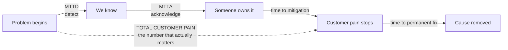
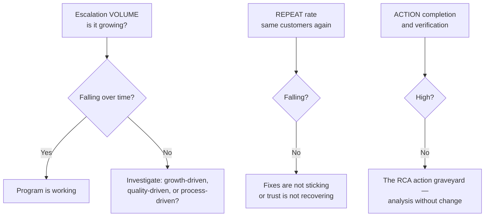
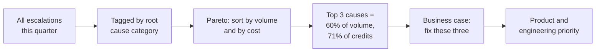

# Part K — Metrics, Data & Trend Analysis

> **Section goal:** turn escalation handling into an evidence-based program. Metrics are how you prove improvement, argue for resources, decide priorities, and demonstrate that the pattern you spotted is real rather than anecdotal. The job description asks for a "scalable, data-driven escalation program" — this Part is that phrase, unpacked.

Covers index items **63–68**. Maps to job responsibilities: *monitor escalation trends and convert customer feedback into actionable product and operational improvements; build a data-driven escalation program.*

---

## 63. Speed metrics

How fast you respond and resolve. Simple to define, easy to game — so know both sides.

| Metric | Definition | Analogy |
|---|---|---|
| **TTFR** (Time to First Response) | Raise → first human reply | How long before someone comes to your table |
| **MTTA** (Mean Time to Acknowledge) | Alert → someone owns it | How long until the alarm is answered |
| **MTTD** (Mean Time to Detect) | Problem starts → we notice | How long the fire burned before the alarm |
| **MTTR** (Mean Time to Restore/Resolve) | Start → service restored, or → cause fixed | Time to get the power back on |
| **Time to mitigation** | Start → customer pain stops | When the generator kicked in |
| **SLA attainment** | % of cases meeting the promised target | % of pizzas delivered inside 30 minutes |
| **Backlog age** | How long open cases have been open | How long people have been in the waiting room |

### 🔍 Plain-English deep-dive: the MTTR ambiguity

- **MTTR is dangerously ambiguous** — the "R" can mean **Restore**, **Resolve**, **Repair**, or **Respond**, and organizations measure different ones while calling them the same thing. **Why it matters:** *Restore* (pain stopped) and *Resolve* (cause fixed) can differ by weeks. If leadership tracks restore-time while customers experience resolve-time, your dashboards will look healthy while your customers are unhappy. **What to do:** always ask which one is being measured, and prefer reporting **time-to-mitigation** and **time-to-permanent-fix** as two separate numbers. In an interview, spotting this ambiguity unprompted is a strong signal.

- **Means hide pain — use percentiles.** An average is dragged down by many fast cases while a few customers suffer enormously. **Analogy:** average water depth in a river is useless information if you're crossing at its deepest point. **Why it matters:** report **p50 (median)**, **p90**, and **p95**. The p95 is where your escalations actually come from, and "we improved the average" while p95 worsened is a real and common failure.

> **The number customers experience is detect + acknowledge + mitigate — not just the part that starts when you noticed.** Teams that measure from *detection* systematically flatter themselves and miss that their real problem is detection latency.

---

## 64. Experience metrics

How customers feel, which is not the same as how fast you were.

| Metric | Question asked | Scale | Measures |
|---|---|---|---|
| **CSAT** | "How satisfied were you with this interaction?" | 1–5, reported as % positive | A single transaction |
| **DSAT** | The dissatisfied subset | Same | Failure cases worth reading |
| **NPS** | "How likely are you to recommend us?" | 0–10 → Promoters − Detractors | The whole relationship |
| **CES** | "How easy was it to get your issue resolved?" | 1–7 | Effort, a strong loyalty predictor |

### 🔍 Plain-English deep-dive: what each one is blind to

- **CSAT** — transactional and immediate. **Blind spot:** measures the *interaction*, not the *outcome*. A customer can rate 5/5 for a courteous, communicative escalation manager and still churn because the product didn't get fixed. **Never treat CSAT alone as proof the escalation program is working.**
- **NPS** — relationship-level. **Blind spot:** slow-moving and influenced by price, roadmap, and account management, so it's a poor attribution tool for a specific escalation.
- **CES** — effort. **Blind spot:** narrow. But research consistently finds effort predicts loyalty better than delight does — customers rarely reward you for going above and beyond, but they punish you reliably for making things hard. **This makes CES an underrated metric to cite in an interview.**
- **DSAT** — the complaints. **This is the highest-information data you have.** Five-star ratings teach you almost nothing; the detractor comments contain your systemic findings. Reading every DSAT verbatim is one of the highest-value habits available.

> **The survey trap: response bias.** People respond when delighted or furious, so surveys over-represent extremes and under-represent the quietly dissatisfied — who are the ones most likely to churn silently. Treat satisfaction scores as a *directional signal*, not a census.

---

## 65. Escalation-specific metrics

These are the ones that describe *your* program rather than support generally, and they map directly to what the role is judged on.

| Metric | Definition | What it tells you |
|---|---|---|
| **Escalation rate** | Escalations ÷ total cases | Health of normal support |
| **Repeat escalation rate** | % from customers who escalated before | **The headline metric for this role** |
| **Recurrence rate** | % where the same root cause returns | Whether RCA actions actually work |
| **Reopen rate** | % of closed cases reopened | Premature closure |
| **Escalation ageing** | Distribution of open durations | Where things stall |
| **Source mix** | Which channels escalations arrive from | Where normal process is failing |
| **Preventability rate** | % that were avoidable | The honest self-assessment |
| **Action completion rate** | % of RCA actions done *and verified* on time | Whether learning converts to change |
| **Cost per escalation** | Fully loaded effort + credits | Makes the prevention argument financially |

### 🔍 Plain-English deep-dive: normalize before you panic

- **Raw volume is nearly meaningless on its own.** If the customer base grew 60% and escalations grew 30%, the *rate* halved — that's a success being reported as a failure. **Always normalize** per 1,000 customers, per 1,000 cases, or per unit of revenue. **Analogy:** a hospital treating more patients isn't failing; it may simply be bigger.
- **Repeat escalation rate is the metric this role lives or dies by,** because it's the direct measure of whether systemic fixes are landing. The job description literally asks you to "reduce repeat escalations through systemic process and product improvements." Volume can rise with growth; the repeat rate should still fall.

---

## 66. Trend analysis in practice

Metrics tell you *how much*. Trend analysis tells you *why* — and it's the part that produces product change.

### Tagging: the foundation

Everything downstream depends on consistent categorization at intake. A **taxonomy** is the controlled list of tags.

| Bad taxonomy | Good taxonomy |
|---|---|
| Free-text tags | Controlled, defined list |
| One dimension | Multiple: symptom, component, cause, severity, source |
| Tagged at close, from memory | Tagged at intake, refined at close |
| Nobody audits it | Periodically reviewed for consistency |
| 200 tags, 90% unused | Small, maintained, mutually exclusive set |

> **Tag on multiple independent dimensions.** *Symptom* (what the customer saw), *component* (which part of the system), *root cause category* (why), *source* (which channel), and *preventability*. Single-dimension tagging is why so many support organizations have data they cannot actually analyze.

### Pareto analysis

- **Pareto principle** — *roughly 80% of effects come from 20% of causes.* **Analogy:** most of the noise in a building comes from a handful of rooms. **Why it matters:** it's how you argue for focus. "Three root causes account for 60% of escalations and 71% of credits issued" is a resource-allocation argument that leadership can act on immediately.

### Cohorting and correlation

- **Cohort analysis** — *grouping by a shared characteristic and comparing.* **Analogy:** comparing classes rather than individual pupils. Useful cohorts: new customers versus mature, by plan tier, by region, by integration type, by onboarding month. **Why it matters:** "escalations concentrate in customers under 90 days old" points straight at onboarding, not at the product.
- **Correlation vs causation** — *things moving together vs one causing the other.* **Analogy:** ice-cream sales and drowning both rise in summer; neither causes the other. **Why it matters:** the single most common analytical error in operational reporting, and interviewers do probe it. Correlation generates a hypothesis; it does not close an RCA.
- **Seasonality and lag** — escalations often follow releases, quarter-end, or customer launch cycles with a **delay**. Comparing raw week-on-week numbers without accounting for the lag produces confident wrong conclusions.

---

## 67. Dashboards and reporting

Different audiences need genuinely different views. One dashboard for everyone serves nobody.

| Audience | Wants | Cadence |
|---|---|---|
| **Your team** | Open items, ageing, who owns what, breaches approaching | Daily |
| **Support/CS leadership** | Volume, rates, SLA attainment, backlog health | Weekly |
| **Engineering & Product** | Top causes, affected components, defect trends | Monthly |
| **Executives** | Trend direction, top risks, cost, what you need | Monthly/quarterly |
| **Customers (QBR)** | Their cases, their outcomes, improvements made | Quarterly |

### 🔍 Plain-English deep-dive: reporting that changes something

A report is worthless unless someone acts on it. The structure that produces action:

1. **Headline** — the one thing to know. *"Escalations fell 18% but repeat rate rose to 22%."*
2. **So what** — the interpretation. *"We're preventing new issues but not fixing recurring ones for existing customers."*
3. **Evidence** — two or three charts, no more.
4. **Ask** — the specific decision or resource needed.

> **Lead with the uncomfortable number.** Reports that bury bad news get skimmed and then contradicted by reality later, which destroys the credibility of every future report. Reports that open with the problem get read and acted on. It also demonstrates that you're analyzing rather than advocating.

---

## 68. Metric gaming and vanity metrics

Every metric creates an incentive, and people optimize what's measured — sometimes at the cost of what's intended.

- **Goodhart's Law** — *"when a measure becomes a target, it ceases to be a good measure."* **Analogy:** paying builders per brick laid produces a lot of badly laid bricks. **Why it matters:** this is the central risk in operational metrics, and naming it in an interview shows genuine sophistication.

| Metric | How it gets gamed | Guard |
|---|---|---|
| **TTFR** | Auto-replies or empty "we're looking into it" | Measure first *meaningful* response |
| **MTTR** | Closing early, splitting one issue into several | Track reopen rate alongside |
| **CSAT** | Surveying only happy customers; asking at the good moment | Fixed survey rules; monitor response rate |
| **Backlog size** | Mass-closing stale cases | Track ageing and reopens |
| **Escalation count** | Discouraging people from raising escalations | Watch for suppression — a *falling* count with *rising* churn |
| **SLA attainment** | Prioritizing near-breach cases over worse ones | Also report worst-case outcomes |

- **Vanity metric** — *a number that looks good and drives no decision.* **Analogy:** counting how many people walked past the shop. **Examples:** total cases handled, total messages sent, number of RCAs written. **The test:** *if this number doubled, would I do anything differently?* If not, it's decoration.

> **The counter-suppression insight is worth having ready.** If escalation volume falls while churn, DSAT, or public complaints rise, you're not improving — you're suppressing the signal. Pairing every metric with a **counter-metric** (speed against reopen rate, volume against churn, backlog against ageing) is the standard defence, and it's a genuinely senior thing to build into a program deliberately.

---

## ⭐ Likely Interview Questions for This Section

**Q1. "Which metrics would you use to run an escalation program?"**
> *Model answer:* I'd group them into four. Speed — time to detect, acknowledge, mitigate, and permanently fix, reported at median and p95 rather than as averages. Experience — CSAT on the interaction, and CES on effort, which predicts loyalty better than delight. Program health — escalation rate, repeat escalation rate, recurrence of the same root cause, reopen rate, and RCA action completion *and verification*. And cost — fully loaded effort plus credits issued, which is what turns prevention into a business case. If I had to pick one headline metric, it's repeat escalation rate, because it directly measures whether systemic fixes are landing rather than whether we're processing efficiently.

**Q2. "What's wrong with reporting average resolution time?"**
> *Model answer:* Two things. First, averages hide the pain — a mean is pulled down by lots of fast cases while a few customers suffer enormously, and those few are precisely where escalations come from. It's like saying the average depth of a river is fine while someone drowns at the deepest point. So I report p50, p90, and p95, and I watch p95 hardest. Second, MTTR is dangerously ambiguous — the "R" can mean restore, resolve, repair, or respond, and those differ by weeks. If leadership tracks restore-time while customers experience resolve-time, the dashboard looks healthy while customers are furious. I report time-to-mitigation and time-to-permanent-fix as two separate numbers.

**Q3. "Escalations went up 30% this quarter. Is that bad?"**
> *Model answer:* I can't tell yet, and that's the honest answer. First I'd normalize — if the customer base grew 60%, the rate actually halved and that's a success being misreported as a failure. Then I'd decompose: is it growth-driven, quality-driven from a specific release or component, or process-driven because normal support is failing and pushing cases into escalation? Source mix and tagging tell me which. I'd also check whether it's genuinely new issues or repeats, because rising volume with a falling repeat rate is a healthy program under growth, while flat volume with a rising repeat rate is a program that isn't fixing anything. And I'd check the counter-metrics — a *falling* escalation count alongside rising churn would worry me far more than this.

**Q4. "How do you find systemic issues in escalation data?"**
> *Model answer:* It starts with tagging discipline, because everything downstream depends on it — a controlled taxonomy applied at intake across multiple independent dimensions: symptom, component, root cause category, source channel, and preventability. Single-dimension free-text tagging is why so many support teams have data they can't analyze. Then Pareto: sort causes by volume *and* by cost, because the most frequent issue isn't always the most expensive. Then cohorting — by tenure, plan, region, integration type — which often reveals things like escalations concentrating in customers under 90 days old, which points at onboarding rather than the product. And correlation against releases and load, while being careful that correlation generates a hypothesis rather than closing an RCA.

**Q5. "What is Goodhart's Law and how does it apply here?"**
> *Model answer:* "When a measure becomes a target, it ceases to be a good measure" — people optimize the number rather than the intent, like paying builders per brick and getting badly laid bricks. In support it's everywhere: first-response time gets gamed with empty auto-replies, MTTR by closing early or splitting one issue into several, CSAT by surveying selectively, backlog by mass-closing stale cases. The most dangerous one for my role is escalation count, because if it becomes a target, the incentive becomes discouraging people from raising escalations — and suppression looks identical to improvement on a dashboard. The defence is pairing every metric with a counter-metric: speed against reopen rate, volume against churn and DSAT, backlog against ageing.

**Q6. "How would you present escalation data to executives?"**
> *Model answer:* Headline, so-what, evidence, ask — in that order, on one page. Headline is the single thing to know, and I lead with the uncomfortable number: "escalations fell 18% but the repeat rate rose to 22%." So-what is the interpretation: we're preventing new issues but not fixing recurring ones for existing customers. Evidence is two or three charts, no more. Ask is the specific decision or resource I need. Leading with bad news matters — reports that bury it get skimmed and then contradicted by reality, which kills the credibility of every future report. It also signals that I'm analyzing rather than advocating for my own function.

**Q7. "Your CSAT is excellent but customers are churning. What's happening?"**
> *Model answer:* CSAT measures the interaction, not the outcome. A customer can genuinely rate 5/5 because I was responsive, empathetic, and communicative — and still leave because the underlying product problem was never fixed. That's the classic blind spot, and it's why CSAT alone should never be treated as proof an escalation program is working. I'd look at effort via CES, at the repeat and recurrence rates to see whether fixes are actually landing, at RCA action completion, and at DSAT verbatims, which carry far more information than the positive scores. I'd also check for response bias — surveys over-represent the delighted and the furious, and the quietly dissatisfied who churn silently are exactly the population that doesn't respond.

---

## 🧠 30-Second Memory Hooks

- **MTTR's "R" is ambiguous.** Report time-to-mitigation and time-to-permanent-fix separately.
- **Averages drown people.** Use p50/p90/p95; escalations live at p95.
- **Customer pain = detect + acknowledge + mitigate.** Measuring from detection flatters you.
- **CSAT = the interaction. NPS = the relationship. CES = effort — the best loyalty predictor.**
- **DSAT verbatims are your richest data.** Five stars teach nothing.
- **Repeat escalation rate is THE metric for this role.**
- **Normalize before panicking.** Rate, not raw count.
- **Tag on five dimensions:** symptom, component, cause, source, preventability.
- **Pareto = argue for focus.** "3 causes, 60% of volume, 71% of credits."
- **Correlation makes a hypothesis, not a conclusion.**
- **Lead reports with the uncomfortable number.**
- **Goodhart:** a measure that becomes a target stops measuring.
- **Falling escalations + rising churn = suppression, not success.** Always pair a counter-metric.
- **Vanity test:** if this number doubled, would I act differently?

---

## 🔁 Rapid Recall Drill

1. Why is MTTR ambiguous, and what do you report instead? *(§63)*
2. Why are percentiles better than averages here? *(§63)*
3. What is each of CSAT, NPS, and CES blind to? *(§64)*
4. Name the headline metric for an escalation program and justify it. *(§65)*
5. Name the five tagging dimensions. *(§66)*
6. Give the four-part structure of a report that drives action. *(§67)*
7. State Goodhart's Law and give two counter-metric pairs. *(§68)*

---

*Next suggested section:* **[Part L — Playbooks, SLAs & Scaling the Program](Part-L-playbooks-slas-scaling.md)** — data identifies what to fix; playbooks and program design are how the fix becomes permanent and survives you.
