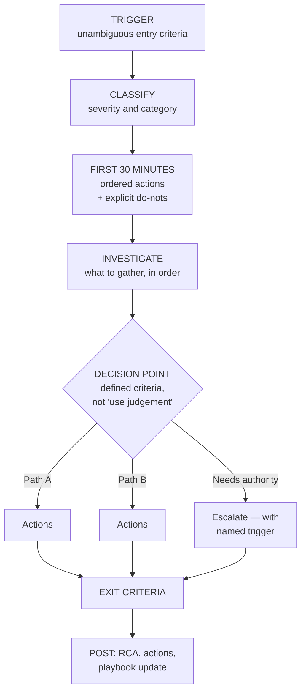
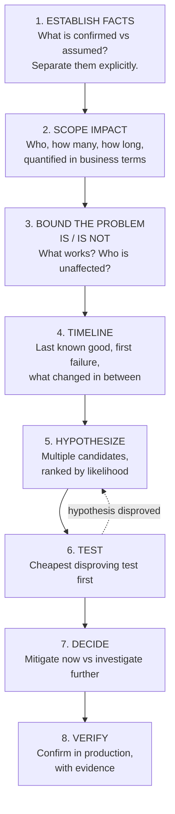
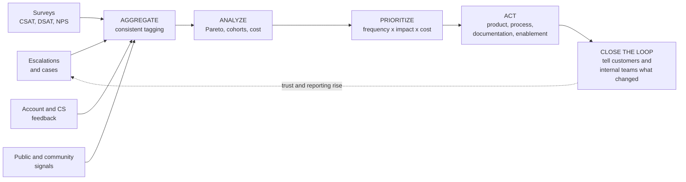
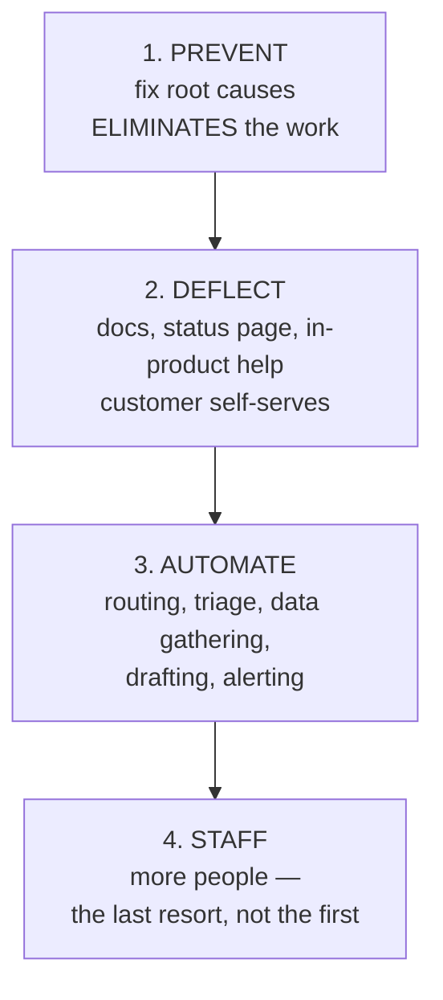

# Part L — Playbooks, SLAs & Scaling the Program

> **Section goal:** move you from *handling escalations well personally* to *building a system that handles them well without you*. This is the difference between a senior individual contributor and someone who can own a program — and the job description asks for exactly this, naming playbooks, investigation frameworks, SLAs, and communication templates explicitly.

Covers index items **69–75**. Maps to job responsibilities: *build and standardize escalation playbooks, investigation frameworks, SLAs, and communication templates; build a scalable, data-driven escalation program.*

---

## 69. Anatomy of an escalation playbook

A **playbook** is a written, repeatable procedure for a recurring situation. Not a script to read aloud — a decision aid that removes the need to improvise under pressure.

- **Analogy:** an aircraft checklist. Pilots are highly skilled and still use checklists, because stress degrades memory precisely when the stakes are highest. Checklists don't replace expertise; they protect it from panic.

### What a good playbook contains

| Section | Contents |
|---|---|
| **Trigger** | Exactly when this playbook applies — unambiguous entry criteria |
| **Severity guidance** | How to classify this situation specifically |
| **Roles** | Who does what; who decides; who communicates |
| **First 30 minutes** | The specific ordered actions, including what *not* to do |
| **Investigation steps** | What to gather, in what order, from where |
| **Decision points** | Explicit branches with criteria, not "use judgement" |
| **Escalation triggers** | When to pull in Legal, Security, Comms, executives |
| **Communication** | Which templates, to whom, at what cadence |
| **Exit criteria** | How you know it's over |
| **Post-resolution** | RCA required? Actions? Review? |

### 🔍 Plain-English deep-dive: why most playbooks fail

| Failure | Why it happens | Fix |
|---|---|---|
| **Too long** | Written to be comprehensive | Optimize for use *under stress*; one page for the first 30 minutes |
| **Too vague** | "Assess the situation and act appropriately" | Specific actions with named owners and criteria |
| **Never updated** | Written once, after an incident | Every use updates it; ownership assigned |
| **Nobody knows it exists** | Buried in a wiki | Linked from the alert, the tool, and the process |
| **Never rehearsed** | First use is during a real crisis | Drill it; test with someone who wasn't involved |
| **Assumes expertise it can't rely on** | Author knows the system deeply | Test with a newcomer — if they can't follow it, it fails |

> **The test of a good playbook: can someone who wasn't involved in writing it follow it correctly at 3am?** If not, it's documentation, not a playbook. That single test is a genuinely strong line to use in an interview.

**A minimal starting set of playbooks:** major incident, security or privacy escalation, executive escalation, billing dispute, AI behavior concern, public/social escalation, legal threat, and customer-at-risk-of-churn. Start with the two or three highest-frequency or highest-risk, not all eight.

---

## 70. Investigation frameworks and decision trees

A **framework** is the reusable thinking structure; a **decision tree** is the specific branching path. Both exist to make good judgement reproducible.

### The generic escalation investigation framework

> **Step 6 is the one people get backwards: run the cheapest *disproving* test first.** The instinct is to try to confirm your favourite theory, which is confirmation bias with extra steps. Asking "what would prove me wrong, and what's the fastest way to check it?" eliminates candidates far faster. It's also, incidentally, what separates investigation from guessing.

### Making a decision tree usable

| Weak branch | Strong branch |
|---|---|
| "Is it serious?" | "Are more than 50 users affected, OR is a paid workflow blocked, OR is there any data/security dimension?" |
| "Escalate if needed" | "Escalate to Security immediately if personal data may be exposed" |
| "Communicate appropriately" | "Send holding statement within 15 minutes using template H1" |

**Criteria must be checkable by someone with no context.** If a branch requires expertise to evaluate, it isn't a decision tree — it's an instruction to be senior.

---

## 71. Designing SLAs and response targets

### Internal targets vs contractual promises

Set **internal targets (SLOs) stricter than contractual SLAs**, so a miss is an early warning rather than a breach. Never promise externally what you only sometimes achieve internally.

| Severity | Response target | Update cadence | Mitigation target |
|---|---|---|---|
| Sev 1 | 15 minutes | 30–60 minutes | ASAP, 24/7 |
| Sev 2 | 1 hour | 4 hours | Same business day |
| Sev 3 | 4 hours | Daily | Next release cycle |
| Sev 4 | 1 business day | On change | Backlog |

### 🔍 Plain-English deep-dive: what you can and cannot commit to

- **Commit to response and communication.** These are entirely within your control. "First response in 15 minutes, updates every hour" is a promise you can keep with staffing and process.
- **Be extremely careful committing to resolution.** Resolution depends on the nature of the fault, which is unknown when you write the SLA. **Analogy:** a garage can promise to look at your car within an hour; it cannot promise to fix it within a day without knowing what's wrong. **Why it matters:** resolution-time SLAs create structural breach risk and push teams toward closing prematurely to hit the number — the Goodhart problem in contractual form.

> **The design principle: commit to responsiveness, not to outcomes you don't control.** Where a customer insists on resolution commitments, scope them narrowly to well-understood failure classes with known remedies.

**Practical design rules:** define the clock precisely (does it pause awaiting customer response?); define business hours and holidays; define severity *with evidence criteria* so classification isn't a negotiation; and specify the remedy for a miss. Ambiguity in any of these becomes a dispute later.

---

## 72. A communication template library

Templates exist to guarantee a floor of quality under pressure, not to make communication robotic.

| Template | Used when | Must contain |
|---|---|---|
| **Initial acknowledgement** | First contact on any escalation | Ownership, understanding, next update time |
| **Holding statement** | Cause unknown | Acknowledgement, scope, ownership, next update — no cause, no ETA |
| **Progress update** | On cadence | Status, what changed, ruled out, current action, workaround, next update |
| **Mitigation notice** | Pain has stopped | What was done, what's still outstanding, that permanent fix is separate |
| **Resolution notice** | Fixed and verified | What happened, what was done, prevention, contact route |
| **Customer RCA** | Post-major incident | Summary, impact, timeline, cause, resolution, **dated preventive actions** |
| **Executive summary** | Any exec-visible escalation | Bottom line, impact, status, actions, risk, ask |
| **Compensation offer** | Commercial resolution | What, why, scope, what it doesn't cover |
| **"Won't fix" notice** | Product declines | Honest reasoning, alternatives, no false hope |
| **Public acknowledgement** | Social/public escalation | Brief, human, no admissions, route to private |

### 🔍 Plain-English deep-dive: templates that don't sound like templates

- **The failure mode:** a customer in a serious escalation receives something obviously generic and concludes nobody is actually paying attention — which escalates the emotional track precisely when you're trying to calm it.
- **The design that avoids it:** build templates as **structure with mandatory specifics**. The template supplies the skeleton and the required elements; the writer must supply named, situation-specific facts.

| Robotic | Structured but specific |
|---|---|
| "We apologize for any inconvenience." | "This blocked your team for six hours during your launch week." |
| "Our team is investigating the issue." | "Two engineers are working on it; we've ruled out the network layer." |
| "We will update you shortly." | "I'll update you at 14:00 whether or not we have an answer." |

> **Make specificity mandatory by leaving explicit required fields in the template** — a template that can be sent without editing will be sent without editing.

---

## 73. Voice of the Customer loops

**Voice of the Customer (VoC)** is the formal process for turning customer experience into organizational change. Without it, escalation insight dies in individual cases.

> **The closing-the-loop step is the one almost everyone skips, and it's what makes the whole system self-sustaining.** Telling customers "you raised this, here's what changed" converts a complainant into an advocate and measurably increases future reporting quality. Telling *internal teams* the same thing is what keeps engineers willing to take your next escalation seriously — people who never learn the outcome of their effort stop investing in it.

**A working VoC needs an owner, a cadence, a decision forum, and a feedback path.** Without a named forum where prioritization actually happens, VoC becomes a report nobody acts on.

---

## 74. Scaling: tooling, automation, staffing

Scaling means handling growth **without proportional headcount growth**. That happens in four ways, and they should be attempted in this order.

| Lever | Examples | Ceiling |
|---|---|---|
| **Prevent** | RCA actions, product fixes, guardrails, budget caps | Highest leverage; slowest |
| **Deflect** | Status page, known-error docs, in-product guidance, better error messages | Only works for known, documented issues |
| **Automate** | Auto-routing, evidence collection, template population, trend alerting, summarization | Automating triage of *novel* issues is hard |
| **Staff** | More people, follow-the-sun | Linear cost; adds coordination overhead |

### 🔍 Plain-English deep-dive: what to automate first

Automate the **repetitive and mechanical**, not the **judgement**.

| Good candidates | Poor candidates |
|---|---|
| Gathering logs, IDs, environment data | Deciding severity on ambiguous cases |
| Routing on unambiguous criteria | Deciding compensation |
| Populating template scaffolding | Writing the specifics of a sensitive message |
| Alerting on trend thresholds | Judging whether a pattern is systemic |
| Summarizing long case histories | Owning the customer relationship |

> **The highest-return automation in escalation work is evidence collection at intake.** Automatically attaching trace IDs, environment details, version, and recent changes eliminates the single most common source of delay — the round trip where you go back to the customer asking for information you could have captured automatically.

**Knowledge management is the multiplier:** a known-error database means the second occurrence is resolved in minutes rather than repeating the first investigation. Undocumented knowledge doesn't scale, and it leaves when people do.

---

## 75. A 30/60/90 plan for an escalation program

A classic interview question — and a genuinely useful structure. The shape that works is **listen → stabilize → systematize**.

### Days 1–30: Understand and stabilize

| Focus | Actions |
|---|---|
| **Learn** | Read the last quarter's escalations; find the recurring themes yourself rather than being told them |
| **Meet** | Engineering, Product, CS, Security, Finance, Legal, Comms — understand what each is measured on |
| **Baseline** | Establish current volume, repeat rate, resolution times, top causes; you cannot claim improvement without a starting number |
| **Take live work** | Own real escalations immediately — credibility comes from delivery, not from analysis |
| **Find the worst gap** | One visible, fixable weakness to address quickly |

### Days 31–60: Standardize

| Focus | Actions |
|---|---|
| **Define** | Written severity criteria, entry and exit criteria, ownership model |
| **Playbooks** | Build the two or three highest-value ones first, not all of them |
| **Templates** | Core communication set, with mandatory specifics |
| **Tagging** | Introduce a small, consistent taxonomy — this unlocks all later analysis |
| **Cadence** | Establish the review forum where trends actually get decided on |

### Days 61–90: Systematize and prove

| Focus | Actions |
|---|---|
| **Trends** | First full trend analysis with Pareto and cohorts |
| **RCA discipline** | Tracked action list with verification, not just written reports |
| **Report** | First executive report — baseline versus now, top causes, asks |
| **Product loop** | Get the top recurring cause formally prioritized |
| **Iterate** | Update playbooks from real use; kill anything unused |

> **The two mistakes to avoid, and worth naming aloud in an interview.** First, **building process before earning credibility** — rolling out frameworks in week two, before you've handled real escalations, gets you ignored, because nobody accepts process from someone who hasn't demonstrated they can do the work. Second, **failing to baseline** — if you don't measure the starting point in month one, you can never prove the improvement, and by month six your successes will be invisible and contested.

---

## ⭐ Likely Interview Questions for This Section

**Q1. "What's your 30/60/90 plan for this role?"**
> *Model answer:* Listen, stabilize, systematize. In the first 30 days I'd read the last quarter of escalations and find the recurring themes myself rather than being told them, meet every function I'll depend on to learn what each is measured on, establish a baseline of volume, repeat rate, resolution times and top causes — because I can't prove improvement without a starting number — and critically, take live escalations from day one, because credibility in this role comes from delivery, not analysis. Days 31–60 I'd standardize: written severity criteria, ownership model, the two or three highest-value playbooks rather than all of them, a core template set, and a small consistent tagging taxonomy, which unlocks everything analytical later. Days 61–90 I'd systematize and prove: first full trend analysis, a tracked and verified RCA action list, the first executive report against baseline, and getting the top recurring cause formally prioritized with Product.

**Q2. "What makes a good playbook?"**
> *Model answer:* The test I use is whether someone who wasn't involved in writing it can follow it correctly at 3am. That forces several things: it has to be short enough to use under stress, with the first 30 minutes on one page; it needs specific actions rather than "assess and act appropriately"; decision points need checkable criteria rather than "use judgement," because a branch requiring expertise isn't a decision tree, it's an instruction to be senior; and it needs explicit "do not do this" items, which are often more valuable than the do items. Then the operational part: it has to be discoverable — linked from the alert and the tool, not buried in a wiki — updated every time it's used, and rehearsed before the real crisis. The analogy I'd use is an aircraft checklist: pilots are experts and still use them, because stress degrades memory exactly when stakes are highest.

**Q3. "How would you design SLAs for an escalation process?"**
> *Model answer:* The core principle is to commit to responsiveness, not to outcomes I don't control. Response time and update cadence are entirely within my control given staffing and process, so those get firm commitments — 15 minutes for Sev 1, hourly updates, and so on. Resolution time is much more dangerous to commit to, because it depends on the nature of the fault, which is unknown when the SLA is written. Resolution SLAs create structural breach risk and push teams toward closing prematurely to hit the number — Goodhart's Law in contractual form. I'd also set internal targets stricter than contractual ones, so a miss is an early warning rather than a breach. And I'd be precise about the mechanics: does the clock pause awaiting customer response, what are business hours, and what evidence defines each severity — because ambiguity in any of those becomes a dispute later.

**Q4. "How do you scale an escalation function without just hiring more people?"**
> *Model answer:* Four levers, in priority order. Prevent — fix root causes, which eliminates the work entirely and has the highest leverage even though it's slowest. Deflect — status pages, known-error documentation, in-product guidance, better error messages, so customers self-serve on known issues. Automate — routing, evidence collection, template scaffolding, trend alerting. And only then staff, because headcount is linear cost and adds coordination overhead. On automation specifically, I'd automate the mechanical, never the judgement: gathering logs and trace IDs yes, deciding severity on ambiguous cases no. The single highest-return automation is evidence collection at intake, because it removes the most common source of delay — the round trip back to the customer asking for information we could have captured automatically.

**Q5. "What's the Voice of the Customer loop and why does the last step matter?"**
> *Model answer:* It's the formal process for turning customer experience into organizational change — aggregate signals from escalations, surveys, account teams, and public channels; analyze with Pareto and cohorts; prioritize by frequency, impact and cost; act through product, process, documentation, or enablement; and then close the loop. The last step is the one almost everyone skips and it's what makes the system self-sustaining. Telling customers "you raised this and here's what changed" converts a complainant into an advocate and measurably improves the quality of future reports. Telling internal teams the same thing is what keeps engineers willing to take my next escalation seriously — people who never learn the outcome of their effort stop investing in it. Without a named forum where prioritization actually happens, VoC just becomes a report nobody reads.

**Q6. "How do you make templates that don't sound like templates?"**
> *Model answer:* Build them as structure with mandatory specifics. The template supplies the skeleton and the required elements — ownership, scope, next update time — but the writer must supply named, situation-specific facts. So instead of "we apologize for any inconvenience," the required field forces "this blocked your team for six hours during your launch week." Instead of "our team is investigating," it's "two engineers are on it and we've ruled out the network layer." The practical trick is leaving explicit required fields, because a template that *can* be sent without editing *will* be sent without editing. The failure mode matters a lot: a customer in a serious escalation who receives something obviously generic concludes nobody is paying attention, which inflames the emotional track exactly when you're trying to calm it.

**Q7. "You join and there's no process at all. Where do you start?"**
> *Model answer:* Not with process. I'd start by taking live escalations, because credibility precedes change — rolling out frameworks in week two, before demonstrating I can do the work, gets them ignored. While handling real cases I'd establish the baseline, since without a starting number I can never prove improvement, and by month six my successes would be invisible. Then I'd introduce the smallest things with the largest return: a single front door for intake, written severity criteria, and consistent tagging — tagging especially, because it costs little and unlocks every later analysis. Then one playbook for the highest-frequency or highest-risk scenario, and a core template set. I'd deliberately resist building the complete framework up front; playbooks nobody has stress-tested tend to be wrong, and an unused process is worse than no process because it teaches people to ignore process generally.

---

## 🧠 30-Second Memory Hooks

- **Playbook = aircraft checklist.** Experts still use them because stress degrades memory.
- **The 3am test:** can someone uninvolved follow it correctly at 3am?
- **Decision branches need checkable criteria** — otherwise it's "be senior," not a tree.
- **Run the cheapest DISPROVING test first.** Confirming your favourite theory is bias with extra steps.
- **Commit to responsiveness, not outcomes you don't control.**
- **Resolution SLAs = Goodhart in contractual form.** They cause premature closure.
- **Templates = structure + mandatory specifics.** If it can be sent unedited, it will be.
- **VoC dies without closing the loop** — for customers *and* internal teams.
- **Scale order: Prevent → Deflect → Automate → Staff.** Headcount is last.
- **Automate the mechanical, never the judgement.**
- **Best automation = evidence capture at intake.** Kills the round trip.
- **30/60/90 = listen → stabilize → systematize.**
- **Two classic mistakes: process before credibility, and no baseline.**

---

## 🔁 Rapid Recall Drill

1. Name six reasons playbooks fail, with the fix for each. *(§69)*
2. Recite the eight steps of the investigation framework. *(§70)*
3. Why is step 6 counterintuitive? *(§70)*
4. What can you safely commit to in an SLA, and what should you avoid? *(§71)*
5. Convert three robotic template lines into specific ones. *(§72)*
6. Name the four scaling levers in priority order. *(§74)*
7. Give the two classic mistakes in a first 90 days. *(§75)*

---

*Next suggested section:* **[Appendix 2 — A Worked Escalation, End to End](Appendix-2-worked-example.md)** — you now have every framework in the curriculum. Read the worked example next to see them all applied to one continuous case, then continue to **[Part M — Miscellaneous & Deeper Topics](Part-M-miscellaneous-deeper-topics.md)** for the extra-edge material.
