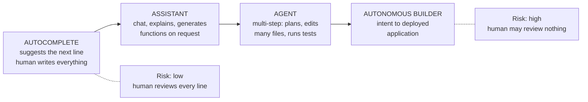

# Part M — Miscellaneous & Deeper Topics

> **Section goal:** give you the extra edge — the frameworks, tools, industry context, and trends that let you speak beyond the core curriculum. These are the topics that turn a competent interview into a memorable one, because they show you think about the discipline, not just the tasks.

Covers index items **76–80**. Maps to job requirements: *experience in SaaS, AI, enterprise software, or other fast-paced technology environments; building a scalable escalation program.*

---

## 76. Frameworks and standards

You are not expected to be certified in these. You are expected to know what they are, take the useful parts, and not treat any of them as scripture.

| Framework | What it is | The useful bit | The trap |
|---|---|---|---|
| **ITIL** | IT Service Management best-practice framework | Clean separation of incident, problem, and change management | Heavy process; can become bureaucratic in fast-moving companies |
| **SRE** (Site Reliability Engineering) | Google-originated engineering approach to reliability | Error budgets, blameless postmortems, toil reduction, SLI/SLO discipline | Assumes strong engineering ownership |
| **ISO/IEC 20000** | International standard for service management | Auditable, credible with enterprise buyers | Certification effort |
| **ISO/IEC 27001** | Information security management standard | Frequently required in enterprise deals | Compliance ≠ security |
| **COPC** | Customer operations performance standard | Rigorous on measurement and quality | Contact-centre flavoured |
| **Six Sigma / DMAIC** | Data-driven process improvement | Define-Measure-Analyze-Improve-Control is a clean improvement loop | Manufacturing origins; can over-formalize |
| **Kepner-Tregoe** | Structured problem analysis | The IS/IS-NOT technique (see [Part E](Part-E-root-cause-analysis.md)) | Training-dependent |

### 🔍 Plain-English deep-dive: the three ITIL concepts worth borrowing

- **Incident management vs problem management** — *restore service now* versus *eliminate the recurring cause*. **Why it matters:** it's the cleanest available language for the distinction at the heart of this role, and it lets you argue for investment in prevention as a *named discipline* rather than a personal preference.
- **Known error** — *a problem with an identified cause and a documented workaround, but no permanent fix yet.* **Why it matters:** a legitimate, mature state that lets support resolve recurrences in minutes while the real fix is scheduled properly.
- **Change management** — *controlling how changes reach production.* **Why it matters:** an enormous proportion of incidents are change-induced, so "what changed?" is the highest-yield first question in any investigation.

### 🔍 Plain-English deep-dive: error budgets

- **Error budget** — *if your reliability target is 99.9%, the remaining 0.1% is a budget you are allowed to spend.* **Analogy:** a monthly allowance for unreliability. Spend it slowly and you can keep shipping features; burn it early and the policy says you stop shipping and fix reliability instead.
- **Why it's such a good concept to know:** it converts an emotional argument ("engineering doesn't care about quality") into an agreed, quantitative rule negotiated in advance. It also acknowledges that 100% reliability is the wrong target — perfect reliability means you're shipping too slowly. Referencing error budgets signals you understand engineering's incentives rather than just complaining about them.

---

## 77. The tooling landscape

You'll be asked what you've used. What matters more is understanding the *categories* and what each is for — tools change, categories don't.

| Category | Purpose | Representative tools |
|---|---|---|
| **Ticketing / CRM** | Case management, history, customer record | Zendesk, Salesforce Service Cloud, Freshdesk, Intercom, HubSpot |
| **Incident management** | Paging, on-call rotas, incident coordination | PagerDuty, Opsgenie, incident.io, FireHydrant, Rootly |
| **Status pages** | Public communication at scale | Statuspage, Better Stack, Instatus |
| **Observability** | Logs, metrics, traces — the evidence layer | Datadog, Grafana, New Relic, Splunk, Honeycomb |
| **Issue tracking** | Engineering work and defects | Jira, Linear, GitHub Issues, Azure DevOps |
| **Knowledge** | Documentation, runbooks, known errors | Confluence, Notion, internal wikis |
| **Analytics / BI** | Trends, dashboards, reporting | Power BI, Tableau, Looker, Metabase |
| **Communication** | Coordination and war rooms | Slack, Teams, Zoom |
| **Customer success** | Health scores, renewal risk | Gainsight, Vitally, ChurnZero |
| **AI observability** | Prompt/response logging, evals, drift | LangSmith, Arize, Weights & Biases, Braintrust |

> **The last category is the newest and most differentiating.** Knowing that **AI observability** exists as a distinct discipline — tracing prompts and responses, versioning models and prompts, running eval suites, monitoring drift — signals that you understand what investigating an AI escalation actually requires. Most candidates won't mention it.

- **The integration question matters more than any individual tool.** The realistic failure is not "we don't have a tool," it's "our ticketing, incident, and engineering systems don't talk, so nobody can answer 'how many escalations relate to this defect?'" Being able to identify that as the real gap is a stronger answer than listing products.

---

## 78. The industry landscape for AI coding agents

Enough context to hold a credible conversation about the market a role like this sits in.

### The category

**AI coding tools** sit on a spectrum of autonomy:

**As autonomy rises, so does the escalation surface.** Autocomplete produces a bad suggestion you can ignore. An autonomous builder produces a deployed application that might be insecure, expensive, or wrong — and the customer may not have the expertise to evaluate it. That relationship — *autonomy multiplies both value and escalation risk* — is the single most useful sentence you can offer about this market.

### The competitive shape

| Segment | Value proposition | Typical buyer |
|---|---|---|
| **IDE assistants** | Speed for professional developers | Individual developers, engineering orgs |
| **Agentic coding tools** | Complete multi-file tasks autonomously | Engineering teams |
| **App builders / "vibe coding"** | Non-developers build real applications | Founders, business users, small teams |
| **Enterprise platforms** | Governance, security, compliance at scale | CIOs, platform teams |

### 🔍 Plain-English deep-dive: why non-developer users change support entirely

When your product lets **non-developers** build production software, your support burden transforms:

- They cannot evaluate whether generated code is correct or secure.
- They cannot debug when it breaks, so *every* problem escalates.
- They may not understand hosting, domains, databases, or scaling — so "the app is down" may be a billing lapse, a DNS issue, or a genuine defect.
- They have production applications with real users and no operational expertise behind them.
- Their expectations are shaped by consumer software, where things simply work.

> **The strategic consequence:** in this segment, "correctness, reliability, security and scale" aren't engineering slogans — they are the entire support model, because the customer cannot compensate for weaknesses in any of them. That reframes the escalation function from a cost centre into the thing that makes the product viable for its own market.

### Market vocabulary

| Term | Plain meaning |
|---|---|
| **ARR** | Annual recurring revenue — the standard scale measure |
| **PLG** (product-led growth) | Users self-serve and adopt before sales gets involved |
| **Land and expand** | Start small in an organization, grow usage over time |
| **Logo churn vs revenue churn** | Losing customers vs losing revenue — small customers leaving may barely dent revenue |
| **Net revenue retention** | Whether existing customers grow enough to offset churn |
| **Time to value** | How fast a new customer gets a real result |

> **PLG has a specific escalation consequence worth naming:** users adopt without onboarding, training, or an account team. That means far more expectation-gap escalations and far less relationship buffer when things go wrong — the first human contact many users have with the company is *you*, during a problem.

---

## 79. Current trends

Being able to discuss where the discipline is heading is the difference between "can do the job" and "will shape the function."

### AI inside support itself

| Application | What it does | The catch |
|---|---|---|
| **Deflection** | AI answers common questions | Bad answers erode trust faster than no answer |
| **Draft assistance** | Suggests replies for humans to review | Quality depends on the human review actually happening |
| **Summarization** | Condenses long case histories | Genuinely excellent; low risk; high time saving |
| **Triage and routing** | Classifies and assigns | Good on known categories, weak on novel ones |
| **Trend detection** | Clusters issues automatically | Needs consistent data underneath |
| **Agentic resolution** | AI resolves end to end | The frontier; requires guardrails and escalation paths |

> **The nuance worth voicing:** summarization and trend clustering are the safest and highest-value applications today, because a mistake is cheap and a human is still in the loop. Customer-facing deflection is the riskiest, because a confidently wrong automated answer to an already-frustrated customer is worse than a slower human one. That's a measured, credible position rather than either AI boosterism or scepticism.

### Other trends

- **Shift-left support** — *moving resolution earlier: better error messages, in-product guidance, self-service.* **Why it matters:** the cheapest escalation is the one that never happens because the product explained itself.
- **Proactive support** — *detecting and contacting customers before they report a problem.* **Analogy:** the garage calling you about a recall rather than waiting for a breakdown. **Why it matters:** it converts a would-be escalation into a trust-building moment, and it's one of the strongest program-level ideas you can propose.
- **Support as a product input** — treating support data as primary product research rather than as a cost to minimize.
- **Agentic operations** — internal AI agents that gather evidence, draft summaries, and correlate incidents for human decision-makers.
- **Transparency as a differentiator** — public status pages, public postmortems, and published reliability data as competitive assets rather than liabilities.
- **AI governance and assurance** — enterprise buyers increasingly ask how AI outputs are evaluated, monitored, and governed, which pulls escalation and T&S data directly into the sales process.

---

## 80. Adjacent concepts

Terms you'll hear from engineering. Knowing them prevents you nodding through something important.

| Concept | Plain meaning | Analogy | Escalation relevance |
|---|---|---|---|
| **Change management** | Controlling how changes reach production | Building permits before renovation | Most incidents are change-induced |
| **Blast radius** | How far a failure spreads | How many streets lose power | Drives severity |
| **Graceful degradation** | Losing features rather than failing entirely | Lights dim rather than go out | Turns an outage into an inconvenience |
| **Circuit breaker** | Automatically stops calling a failing dependency | A fuse | Prevents one failure cascading |
| **Rate limiting** | Capping request volume | Metered motorway entry | Protects the platform; frustrates customers |
| **Chaos engineering** | Deliberately injecting failure to test resilience | Fire drills | Finds weaknesses before customers do |
| **Feature flag** | Toggling functionality without deploying | A light switch | The fastest mitigation available |
| **Canary release** | Small percentage first | Tasting before serving | Limits blast radius of bad releases |
| **Blue-green deployment** | Two environments, switch traffic between them | Two stages, swap between shows | Enables instant rollback |
| **Technical debt** | Shortcuts that cost more later | Deferred building maintenance | The honest answer to "why does this keep happening?" |
| **Toil** | Manual, repetitive operational work | Washing up by hand forever | What automation should target |
| **Runbook** | Step-by-step operational procedure | The recipe | Reduces MTTR |
| **Observability** | Ability to understand internal state from outputs | Dashboard vs opening the bonnet | You cannot investigate what isn't instrumented |
| **Postmortem** | Post-incident analysis | Accident investigation | Where learning happens |

### 🔍 Plain-English deep-dive: technical debt as an escalation explanation

- **Technical debt** — *accumulated shortcuts that make future change slower and riskier.* **Analogy:** a house where every previous repair was done cheaply; each new job takes longer because you first have to undo the last one. **Why it matters to you:** it's frequently the *honest* answer to "why does this keep recurring?" and to "why does a simple fix take three weeks?"

> **Handled well, technical debt is a powerful argument rather than an excuse.** "These four escalations all stem from the same architectural limitation; individually each looks minor, together they've cost X in credits and Y in engineering time, and they'll keep recurring until it's addressed" is exactly how support data justifies engineering investment. That is one of the most valuable things an escalation function can do, and very few candidates articulate it.

---

## ⭐ Likely Interview Questions for This Section

**Q1. "Are you familiar with ITIL or SRE? How would you use them?"**
> *Model answer:* I know both and I'd borrow selectively rather than adopt wholesale. From ITIL, the most valuable idea is the clean separation of incident management from problem management — restore service now versus eliminate the recurring cause. That gives me established language to argue for investment in prevention as a named discipline rather than a personal preference. I'd also use "known error" as a legitimate state: cause identified, workaround documented, permanent fix scheduled. From SRE, I'd take blameless postmortems, SLI/SLO discipline, and error budgets. The trap with ITIL is that full implementation is heavy and can suffocate a fast-moving company, so I'd take the concepts and skip the ceremony.

**Q2. "What's an error budget and why would you mention it?"**
> *Model answer:* If your reliability target is 99.9%, the remaining 0.1% is a budget you're permitted to spend — a monthly allowance for unreliability. If you burn it early, the agreed policy is that you stop shipping features and invest in reliability instead. I find it valuable because it converts an emotional argument — "engineering doesn't care about quality" — into a quantitative rule negotiated in advance, so nobody has to relitigate it during a crisis. It also acknowledges something important: 100% reliability is the wrong target, because perfect reliability means you're shipping too slowly. Referencing it signals that I understand engineering's incentives rather than just pushing against them.

**Q3. "What tools have you used, and what would you look for?"**
> *Model answer:* I'd think in categories rather than products, because tools change and categories don't: ticketing and CRM, incident management and paging, status pages, observability, issue tracking, knowledge management, and analytics. For an AI product I'd add AI observability specifically — prompt and response tracing, model and prompt versioning, eval suites, drift monitoring — because you can't investigate an AI escalation without that layer. But the question I'd actually ask on joining isn't which tools exist, it's whether they're integrated. The realistic failure isn't a missing tool, it's that ticketing, incident, and engineering systems don't talk, so nobody can answer "how many escalations relate to this defect?" — and that question is the whole basis of systemic improvement.

**Q4. "How does supporting non-developers building software differ from supporting developers?"**
> *Model answer:* It changes the support model fundamentally. Non-developers can't evaluate whether generated code is correct or secure, can't debug when it breaks, and may not understand hosting, domains, or databases — so "my app is down" might be a billing lapse, a DNS problem, or a genuine defect, and they can't tell you which. Every problem escalates because there's no self-diagnosis layer. They also have production applications with real users and no operational expertise behind them, and their expectations are shaped by consumer software where things just work. The strategic consequence is that correctness, reliability, security and scale aren't engineering slogans in that segment — they're the entire support model, because the customer can't compensate for weakness in any of them.

**Q5. "Where do you think AI should and shouldn't be used in support itself?"**
> *Model answer:* Summarization and trend clustering are where I'd start — condensing long case histories and grouping issues automatically. A mistake is cheap, a human stays in the loop, and the time saving is large. Draft assistance works if the review actually happens rather than becoming rubber-stamping. Triage and routing works well on known categories and poorly on novel ones, which is exactly where escalations live. I'd be most cautious about customer-facing deflection, because a confidently wrong automated answer to an already-frustrated customer is worse than a slower human one — it compounds the original failure with a feeling of being fobbed off. The frontier is agentic resolution end to end, which needs strong guardrails and a fast, obvious escalation path to a human.

**Q6. "How do you use escalation data to justify engineering investment?"**
> *Model answer:* By aggregating individually-minor issues into a single quantified argument. The pattern is: these four escalations all stem from the same architectural limitation; individually each looks like a small bug, but together they've cost this much in credits, this much support time, and put these accounts at renewal risk — and they'll keep recurring until the underlying limitation is addressed. That turns technical debt from an excuse into evidence. It's genuinely one of the most valuable things an escalation function can do, because engineering teams often know where the debt is but lack the business case to prioritize paying it down — and support data is exactly that business case, expressed in money and risk rather than in engineering discomfort.

**Q7. "What is proactive support and why does it matter?"**
> *Model answer:* Detecting a problem and contacting affected customers before they report it — like a garage calling you about a recall rather than waiting for the breakdown. It matters because it inverts the emotional dynamic entirely: instead of the customer discovering a failure and losing confidence, they experience us catching it and taking responsibility, which builds trust rather than spending it. It's also cheaper, because one proactive message can prevent dozens of inbound tickets. It's closely tied to shift-left thinking more broadly — better error messages and in-product guidance so the product explains itself, because the cheapest escalation is the one that never happens. If I were proposing one program-level initiative, proactive notification on detected impact would be near the top.

---

## 🧠 30-Second Memory Hooks

- **ITIL's gift:** incident (restore now) vs problem (stop recurrence) vs known error.
- **"What changed?"** — most incidents are change-induced; highest-yield first question.
- **Error budget = allowance for unreliability.** Converts emotion into an agreed rule. 100% is the wrong target.
- **Think tool CATEGORIES, not products.** Integration is the real gap.
- **AI observability** — the differentiating category most candidates miss.
- **Autonomy multiplies value AND escalation risk.**
- **Non-developer users = every problem escalates.** They can't self-diagnose.
- **PLG means the first human they meet is you, during a problem.**
- **Safest AI-in-support: summarization and clustering. Riskiest: customer-facing deflection.**
- **Proactive support = the recall call.** Builds trust instead of spending it.
- **Feature flag = fastest mitigation. Canary = limited blast radius.**
- **Tech debt is an argument, not an excuse** — aggregate minor escalations into one costed case.

---

## 🔁 Rapid Recall Drill

1. Name three ITIL concepts worth borrowing and why. *(§76)*
2. Explain error budgets and why 100% reliability is wrong. *(§76)*
3. Name the tooling categories, including the AI-specific one. *(§77)*
4. Describe the autonomy spectrum and its relationship to escalation risk. *(§78)*
5. Give four reasons non-developer users escalate more. *(§78)*
6. Which AI-in-support applications are safest and riskiest, and why? *(§79)*
7. Turn "technical debt" into a business case in one sentence. *(§80)*

---

*Next suggested section:* **[Part N — Interview Question Bank](Part-N-interview-question-bank.md)** — with the full curriculum covered, the remaining work is converting knowledge into interview performance.
