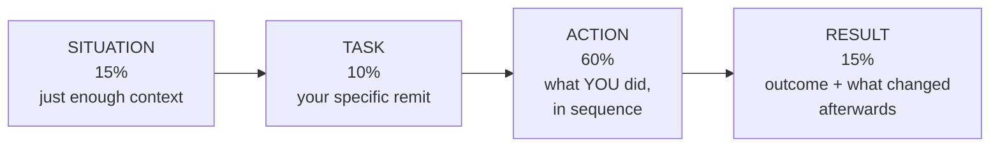

# Part O — Behavioral & Closing

> **Section goal:** convert everything you've learned into interview performance. Knowledge answers the technical questions; this Part answers the human ones — how you tell stories about your work, how you explain your motivation, what you ask them, and what you review the night before.

Covers index items **85–90**.

> **A note on how to use this Part:** the story templates below are deliberately generic scaffolds. Fill them with your own genuine experience, whatever field it comes from. Escalation competencies — ownership, coordination, communication under pressure, investigating causes, improving processes — appear in almost every job, including ones with completely different titles. The skill is recognizing yours and framing them in this vocabulary.

---

## 85. The STAR method, done properly

**STAR** = **S**ituation, **T**ask, **A**ction, **R**esult. It exists because unstructured answers wander, bury the point, and leave the interviewer unsure what *you* actually did.

| Element | What it is | Time | Common mistake |
|---|---|---|---|
| **Situation** | Minimum context to understand the stakes | 15% | Spending half the answer on background |
| **Task** | Your specific responsibility | 10% | Vague — "we needed to fix it" |
| **Action** | What **you** did, step by step | **60%** | Saying "we" throughout, hiding your contribution |
| **Result** | The outcome, quantified where possible | 15% | No outcome, or no learning |

### 🔍 Plain-English deep-dive: the three habits that ruin STAR answers

1. **The "we" trap.** Interviewers cannot assess a team. If everything is "we decided" and "we fixed," they learn nothing about you. Say *"I proposed," "I decided," "I wrote," "I escalated."* Credit the team in the Result, not throughout the Action.
2. **The endless Situation.** Nerves make people over-explain context. Two or three sentences is enough: what the system was, who the customer was, why it mattered.
3. **The missing Result.** Every story needs an outcome *and* ideally a consequence — what changed permanently afterwards. "And we added that case to our standard checks, so it hasn't recurred" is what turns an anecdote into evidence of systemic thinking.

> **Add a fifth letter: L for Learning.** For any question about failure, difficulty, or mistakes, close with what you'd do differently. STAR-L reads as self-aware; plain STAR on a failure story can read as defensive.

### Answer length

Aim for **90 seconds to 2 minutes**. Under 45 seconds sounds thin; over 3 minutes loses the room. Practice by timing yourself aloud — most people badly misjudge their own length.

---

## 86. Competency translation

The role names specific competencies. Almost everyone has relevant evidence; most people just don't recognize it because their job used different words.

| Role competency | It also looks like this elsewhere |
|---|---|
| **Escalation ownership** | Taking charge of any urgent, high-stakes problem end to end; being the person others route hard cases to |
| **Incident management** | Coordinating a time-critical response with several people involved; any "all hands, fix it now" situation |
| **Root cause analysis** | Investigating why something repeatedly went wrong; auditing, troubleshooting, quality investigation, debugging a process |
| **Cross-functional coordination** | Getting other departments to act without managing them; project or programme work; supplier and vendor coordination |
| **Executive communication** | Briefing senior people; writing summaries for decision-makers; presenting to a board, committee, or client leadership |
| **Customer advocacy** | Representing a user or client's interest internally when it was inconvenient to do so |
| **Risk mitigation** | Spotting exposure early and routing it; compliance, safety, audit, or financial control work |
| **Process improvement** | Turning a recurring problem into a permanent change; writing procedures others adopted |
| **Data-driven decisions** | Using measurement to prioritize, or to change someone's mind |
| **Dispute handling** | Any negotiation where you balanced fairness to a person against organizational limits |

> **The translation technique:** describe what you did in *this role's* vocabulary while keeping the facts entirely honest. "I noticed the same complaint kept coming back, dug into why, and changed the process" *is* root cause analysis and systemic improvement. Say it that way — don't invent experience, but don't hide it behind modest phrasing either.

---

## 87. Ready-to-adapt STAR story templates

Prepare **six to eight** stories that can be recombined to answer most behavioral questions. A single strong story often answers three different prompts with a shift of emphasis.

### Story 1 — The high-stakes ownership story
*Answers: most difficult escalation; working under pressure; taking ownership.*

| Element | Scaffold |
|---|---|
| **S** | A serious problem affecting an important customer or group, with real consequences and a deadline. |
| **T** | I took ownership of resolution and communication end to end. |
| **A** | Established the facts and separated confirmed from assumed; quantified the impact; brought the right people together; set a fixed update cadence; drove to a mitigation first; kept the customer informed on schedule; then pursued the permanent fix. |
| **R** | Impact stopped within [time]; relationship retained; and [the permanent change that followed]. |

### Story 2 — The influence-without-authority story
*Answers: influencing others; conflict; competing priorities.*

| Element | Scaffold |
|---|---|
| **S** | I needed action from a team with their own priorities and no obligation to me. |
| **T** | Get the work prioritized without damaging a relationship I'd depend on repeatedly. |
| **A** | Quantified impact in terms they cared about; did the preparation so I was asking for a decision rather than donating work; made a specific ask with a deadline; confirmed commitments in writing; when still blocked, escalated the *decision* — presenting both positions fairly — rather than complaining about the team. |
| **R** | Prioritized and delivered; and the working relationship stayed strong enough that later requests moved faster. |

### Story 3 — The systemic-fix story
*Answers: pattern recognition; process improvement; proudest achievement. **The most important story for this role.***

| Element | Scaffold |
|---|---|
| **S** | The same category of problem kept recurring and was being handled case by case. |
| **T** | Find out whether it was one underlying cause and get it removed permanently. |
| **A** | Gathered the individual cases and categorized them consistently; looked for the shared cause rather than treating each in isolation; quantified the total cost in time, money, and risk; built the case and took it to the people who could change it; got the fix owned with a date; verified it actually worked afterwards. |
| **R** | Recurrence fell / stopped; and the effort previously spent on repeats went elsewhere. |

### Story 4 — The bad-news story
*Answers: difficult conversation; delivering bad news; saying no.*

| Element | Scaffold |
|---|---|
| **S** | I had to tell someone something they very much didn't want to hear. |
| **T** | Be honest without destroying the relationship. |
| **A** | Told them directly rather than softening it into ambiguity; explained the reasoning honestly; acknowledged the impact on them specifically; offered what I *could* do and was precise about what I couldn't and why; gave them something concrete to take back to their own stakeholders. |
| **R** | Accepted, difficult but not damaged; and honesty made the next conversation easier. |

### Story 5 — The mistake story
*Answers: a time you were wrong; a failure; what you'd do differently. **Use STAR-L.***

| Element | Scaffold |
|---|---|
| **S** | A situation where I got something wrong — a misjudged cause, priority, or communication. |
| **T** | My responsibility for the call. |
| **A** | Recognized it, said so promptly rather than hoping it wouldn't surface, corrected course, and communicated the correction clearly. |
| **R** | Contained; trust survived because I raised it first. |
| **L** | The specific habit I changed as a result — and evidence that I've applied it since. |

### Story 6 — The coordination-across-functions story
*Answers: working with Legal/Finance/Security; complex stakeholder situations.*

| Element | Scaffold |
|---|---|
| **S** | A problem that crossed departmental boundaries with different priorities and risk appetites. |
| **T** | Get to a single coherent decision and one consistent message. |
| **A** | Identified who genuinely owned each dimension; gave each function what *they* needed (facts for the risk owners, impact for the delivery owners); kept one version of the truth; convened only the people needed for the decision; documented what was agreed and circulated it. |
| **R** | Decision reached, message consistent, no contradictions reaching the customer. |

> **Build these on genuine experiences, then practice them aloud until the structure feels natural but the words don't sound memorized.** Over-rehearsed answers sound recited and lose the credibility that spontaneity carries. Rehearse the *shape*, not the script.

---

## 88. The "why" answers

### Why this role?

Connect to the **specific mandate**, not to generic enthusiasm. The role has an unusual dual character — own the worst individual problems *and* eliminate their causes. Name that.

> *Direction:* "The part that appeals to me is that it's not purely firefighting. Owning critical escalations is the visible half, but the mandate explicitly includes finding the systemic causes and getting them permanently fixed. I like that combination — the immediacy of high-stakes ownership plus the longer-term satisfaction of making a category of problem disappear."

### Why this company?

Show you understand what makes the product hard. For an AI company building autonomous systems, the substantive answer is about **correctness, reliability, security, and scale** — and why escalation management matters *more* in autonomous products, not less.

> *Direction:* "When software takes actions autonomously rather than just giving advice, mistakes become consequences rather than suggestions. That makes the escalation function genuinely load-bearing — it's how the company learns what its system does in the real world, and how customers keep trusting a product that's probabilistic by nature. That's a more interesting problem than conventional support."

### Why are you leaving / making this move?

**Forward-looking, never disparaging.** Criticizing a current or previous employer reads as a preview of how you'll speak about this one.

> *Direction:* frame it as scope. What you want more of: ownership, breadth, the ability to change the underlying causes rather than only handle the symptoms.

### Biggest weakness

Give a **real** one with a **concrete mechanism**, not a disguised strength. "I'm a perfectionist" is transparent and wastes the question.

> *Direction:* something genuinely relevant and manageable — for example, a tendency to hold onto complex cases personally rather than delegating, and the specific practice used to counter it (documenting the position early enough that someone else can carry it). Real weakness, real mechanism, evidence of self-correction.

---

## 89. Questions to ask the interviewer

Always have at least five prepared; ask three or four. Good questions demonstrate seniority as effectively as good answers.

### About the role

- What does a typical escalation look like here — where do they come from, and what makes the hard ones hard?
- Is the biggest gap right now the handling of individual escalations, or the systemic follow-through?
- What does success look like at six months, and how is it measured?

### About the system

- How are escalations currently tracked and categorized? Is there a shared taxonomy?
- What happens today to RCA action items — who tracks them through to verification?
- How do escalation findings reach the product roadmap? Is there a forum, or is it ad hoc?

### About the relationships

- How does the relationship between escalations and Engineering work today? Where does it strain?
- When something needs a decision above my level, how does that usually happen?

### About the AI-specific dimension

- How are AI behavior concerns currently triaged — are they treated separately from conventional defects?
- Is there an eval suite, and can escalation findings feed cases into it?
- Where does the boundary sit between an escalation, a Trust & Safety matter, and a security issue?

### About the team and trajectory

- Is this role expected to build a function, or to strengthen an existing one?
- What's the biggest thing you'd want fixed in the first quarter?

> **The single best question you can ask is some version of: *"What would make you say, in six months, that this hire was clearly the right one?"*** It's direct, it surfaces the real expectations behind the job description, and the answer tells you exactly what to emphasize in your closing.

---

## 90. One-page night-before cheat sheet

Everything reduced to what actually needs to be at your fingertips.

### The definitions to have instantly

| | |
|---|---|
| **Escalation** | Elevated ownership, urgency, or authority — the *handling*, not the event |
| **Incident** | Unplanned interruption or degradation — the *event* |
| **Severity vs priority** | How bad (measured) vs what's first (decided) |
| **SLI / SLO / SLA** | Measured / internal target / contractual promise — tightest to loosest |
| **Mitigation vs resolution** | Pain stops vs cause removed — two clocks |
| **Corrective / detective / preventive** | Fix this / detect fast / eliminate the class |
| **Controller vs processor** | Decides why & how / acts on instruction |
| **Evals** | Regression tests for AI, scored not binary |

### The frameworks to be able to draw

1. **Escalation lifecycle** — Intake → Qualify → Triage → Own → Mitigate → Resolve → RCA → Verified close.
2. **Incident lifecycle** — Detect → Declare → Mitigate → Resolve → Learn.
3. **Investigation** — Facts → Scope → IS/IS-NOT → Timeline → Hypotheses → Cheapest disproving test → Decide → Verify.
4. **Billing dispute tree** — Correct? → Product-caused? → Unauthorized? → Could they have known? → Legitimate.
5. **AI concern triage** — Privacy → Safety → Security → IP → Cost → Expectation gap → Quality.
6. **Compensation inputs** — Fault, Impact, Contract, Relationship, Precedent.
7. **Scaling order** — Prevent → Deflect → Automate → Staff.

### The lines worth having ready

- "Incident is the event; escalation is the handling."
- "I promise the update, not the fix — I control when I speak, not when it's fixed."
- "The question isn't who made the mistake, it's why our system let it reach customers."
- "Mitigation stops the pain; resolution stops the recurrence. Two clocks, two commitments."
- "I escalate the decision, not the person."
- "Credibility survives ignorance; it doesn't survive being wrong."
- "Contract is the floor, not the ceiling."
- "Would I be comfortable if every customer in this situation got this outcome?"
- "I can't promise it's impossible — these systems are probabilistic. I can promise we'll detect it fast and you'll have a direct line to me."
- "Repeat escalation rate is the metric that tells you whether the fixes are landing."
- "If my escalation volume never falls, I'm processing complaints, not improving anything."
- "Can someone who wasn't involved follow this playbook correctly at 3am?"

### Behavioral quick-check

- Six stories prepared: **ownership, influence, systemic fix, bad news, mistake (with Learning), cross-functional.**
- Say **"I"** in the Action. Credit the team in the Result.
- 60% of the answer is Action.
- 90 seconds to 2 minutes.
- Every story ends with what changed permanently.

### The final five minutes before you start

1. **Three sentences on why this role** — the dual mandate: own the worst problems, remove their causes.
2. **Your strongest systemic-fix story** — this is the one that matches the mandate most directly.
3. **Your four questions**, including "what would make this hire clearly right at six months?"
4. **Breathe.** If you blank, you are allowed to say *"let me think about that for a second"* — a short, composed pause reads as considered, while filling silence with noise does not.

---

## ⭐ Likely Interview Questions for This Section

**Q1. "Tell me about yourself."**
> *Model approach:* Ninety seconds, three beats. Where you're coming from and the thread connecting your experience to this work. What you're strongest at, stated concretely — ownership of high-stakes problems, structured investigation, cross-functional delivery, communication under pressure. And why this role specifically, landing on the dual mandate of owning critical escalations and eliminating their causes. Avoid a chronological career recital; they have the CV. This answer sets the frame for everything after it, so end it pointing at the role rather than at the past.

**Q2. "What's your biggest weakness?"**
> *Model approach:* Pick something real, relevant, and manageable, then spend most of the answer on the mechanism rather than the flaw. For example: a tendency to hold onto complex cases personally rather than handing them over, because ownership feels safer — countered by deliberately writing the position up early enough that someone else could carry it, which also happens to make handoffs and documentation better. Real weakness, concrete counter-practice, evidence you've applied it. Avoid disguised strengths; interviewers have heard "I'm a perfectionist" thousands of times and it reads as evasion.

**Q3. "Why are you leaving your current situation?"**
> *Model approach:* Forward-looking and never disparaging, because how you talk about a previous employer is taken as a preview of how you'll talk about this one. Frame it as scope: what you want more of — broader ownership, the authority to fix underlying causes rather than only handle symptoms, exposure to a harder technical domain. Even if the real reason is negative, the version you give should be about what you're moving toward.

**Q4. "How do you handle stress?"**
> *Model approach:* With process, not stoicism — claiming you don't feel pressure is neither believable nor reassuring. The credible answer is structural: fixed communication cadences so I'm not making the same decision repeatedly under pressure; explicit prioritization so I'm not trying to hold everything at once; written records so nothing depends on my memory at hour nine; and separating what I control from what I don't. I'd also mention rotating people out of long incidents — including myself — because tired judgement causes late-incident mistakes that are often worse than the original fault.

**Q5. "Do you have any questions for us?"**
> *Model approach:* Always yes, three or four, ideally spanning the role, the system, and the relationships. Strong ones: what makes the hard escalations hard here; whether the bigger gap is individual handling or systemic follow-through; what happens to RCA action items today and who verifies them; how AI behavior concerns are triaged versus conventional defects. And the closer: "what would make you say in six months that this hire was clearly the right one?" — because it surfaces the real expectations behind the job description and tells you exactly what to emphasize when you close.

---

## 🧠 30-Second Memory Hooks

- **STAR: 15 / 10 / 60 / 15.** Action is most of it.
- **Say "I" in the Action, "we" in the Result.**
- **Add L for Learning** on any failure question.
- **Six stories:** ownership, influence, systemic fix, bad news, mistake, cross-functional.
- **90 seconds to 2 minutes.** Time yourself out loud.
- **Every story ends with what changed permanently.**
- **Why the role = the dual mandate.** Own the worst problems *and* remove their causes.
- **Why the company = autonomy raises the stakes**, so escalation work is load-bearing.
- **Never disparage a previous employer.**
- **Best question to ask:** "What would make this hire clearly right at six months?"
- **"Let me think about that for a second" is a legitimate move.**

---

## 🔁 Rapid Recall Drill

1. Give the STAR proportions and the most common mistake in each element. *(§85)*
2. Translate three non-support experiences into role competencies. *(§86)*
3. Name your six prepared stories from memory. *(§87)*
4. Say your "why this role" answer aloud in under 30 seconds. *(§88)*
5. List four questions to ask, including the six-month closer. *(§89)*
6. Recite the seven frameworks you can draw. *(§90)*
7. Recall five of the ready-made lines. *(§90)*

---

## Are you ready?

An honest answer, because a study guide that flatters you isn't useful.

**Reading this guide builds knowledge. It does not, on its own, build readiness.** The gap between "I understand this" and "I can say this well while nervous, to a senior person, without notes" is real and it's crossed only by practice.

**What still needs doing:**

| Step | Why it can't be skipped |
|---|---|
| **Answer aloud** | Silent reading creates recognition; interviews demand recall. These feel identical until the moment they don't. |
| **Write your STAR stories out** | Vague memories collapse under follow-up questions. Written stories have specifics. |
| **Time yourself** | Nearly everyone misjudges their answer length badly. |
| **Do a mock interview** | The first time you say an answer out loud should not be to the person deciding. |
| **Prepare your own examples** | The frameworks here are general; your evidence must be specific and genuinely yours. |

> **You're ready when you can take any question from [Part N](Part-N-interview-question-bank.md) at random, speak a structured answer without notes, and stay within two minutes — three times in a row on different questions.**

---

*You've reached the end of the guide.* Return to the **[master index](../Escalations%20Manager%20-%20Study%20Guide.md)** to review any Part, drill with **[Part N](Part-N-interview-question-bank.md)**, look anything up in the **[glossary](Appendix-1-glossary.md)**, or re-read the **[worked example](Appendix-2-worked-example.md)** to rehearse the full narrative arc.
