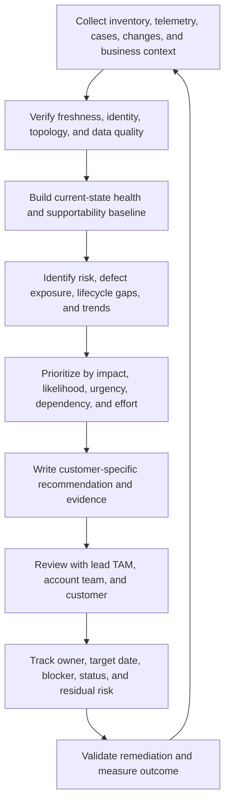
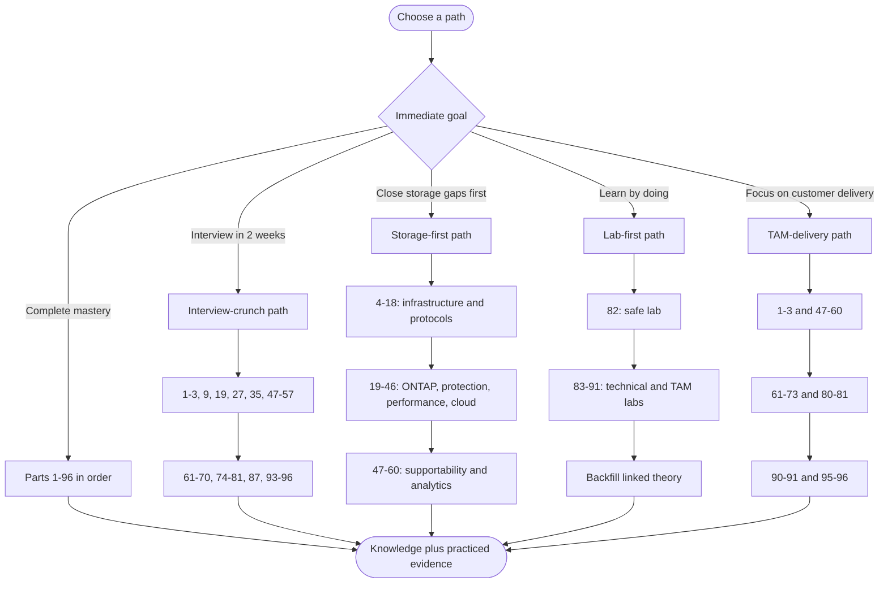
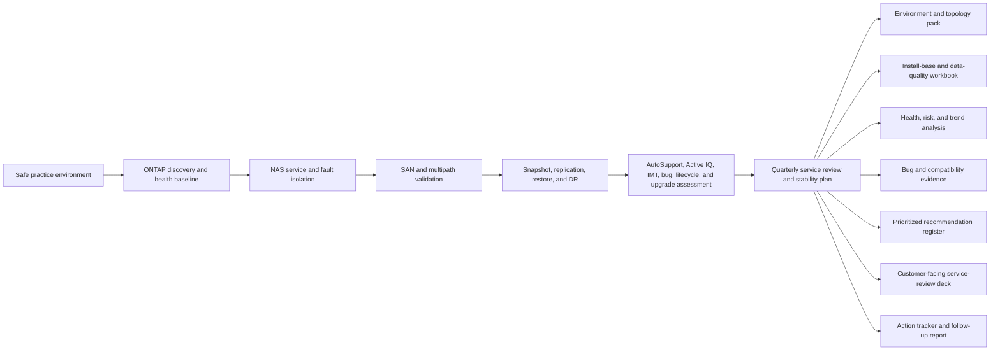

# NetApp TAM Technical Analyst - Complete Study Guide

> **Target role:** NetApp Technical Account Manager (TAM) Technical Analyst  
> **Built for:** Candidates moving from enterprise Support Escalation Engineering into storage-focused technical account management  
> **Mode:** Complete learning path plus interview preparation  
> **Goal:** Never go blank: understand the fundamentals, explain the concept behind each answer, analyze a customer environment, and communicate a defensible recommendation  
> **Depth promise:** No page limit. Every Part will be beginner-first, technically deep, diagram-rich, scenario-driven, mapped to the job description, and grounded in factual experience  
> **Index status:** Curriculum proposed for confirmation; lesson files have not yet been generated

> **How to use this guide:** It is written for **any** candidate preparing for this role. The starting-strength table below describes a *typical* profile, not one person's CV, and every model answer is a template. Replace the bracketed details, metrics, employers, products, and examples with evidence from your own CV before you use them, and never claim experience you cannot defend.

---

## Starting strengths this guide assumes

| Demonstrated starting strength | How the guide uses it | Main bridge to build |
|---|---|---|
| 5+ years in enterprise support and escalation engineering | Incident ownership, technical advisory, stakeholder updates, defect escalation, and customer-risk examples begin with familiar support motions | Translate SaaS support strengths into infrastructure, storage, lifecycle, and technical-account outcomes |
| Business-critical incident and critical-situation ownership | Provides a strong base for severity assessment, restoration focus, evidence gathering, escalation, and executive communication | Add storage data paths, HA behavior, multipathing, protocol traces, performance counters, and hardware evidence |
| SharePoint Online, OneDrive, synchronization, and Microsoft 365 administration | Gives intuition for data availability, permissions, sync, migration, customer impact, and cloud dependencies | Build block, file, object, SAN, NAS, ONTAP, virtualization, Kubernetes, and hybrid-cloud depth |
| CSAT, backlog health, case-quality, and escalation-trend analysis | Maps naturally to TAM reporting, risk prioritization, action tracking, and operational reviews | Learn AutoSupport-derived analysis, Active IQ wellness signals, capacity/performance trends, install-base hygiene, and upgrade planning |
| Business reviews and leadership communication | Supports customer-facing service reviews and executive summaries | Build NetApp-specific review decks, technical narratives, risk registers, recommendation logic, and objection handling |
| Product-group and engineering collaboration | Useful for bug scrubs, defect validation, escalation packages, and cross-functional account work | Learn BURT/bug analysis, supportability boundaries, IMT validation, release notes, advisories, and ownership models |
| Mentoring, onboarding, technical interviews, and partner enablement | Directly supports the role's buddy, coaching, training, and SME expectations | Build repeatable onboarding plans, knowledge checks, quality reviews, and specialization roadmaps |
| A postgraduate business-analytics qualification plus Excel, Power BI, SQL, Python, and statistics | Strong foundation for customer-data analysis and decision support | Apply analytics to fleet health, capacity, risk, performance, remediation aging, and service-review storytelling |
| Azure, virtual machines, Windows networking, Active Directory, and storage fundamentals | Provides an entry point into infrastructure and hybrid-cloud concepts | Deepen storage architecture, Ethernet/FC fabrics, NFS/SMB/iSCSI/NVMe, VMware, Kubernetes, and NetApp cloud services |

### Honest gap map

This guide assumes no production experience with NetApp ONTAP, AFF/FAS systems, StorageGRID, E-Series, AutoSupport, Active IQ Digital Advisor, BlueXP, the Interoperability Matrix Tool (IMT), Hardware Universe, NCDA, SAN administration, NAS administration, VMware storage, MetroCluster, SnapMirror, or NetApp bug scrubs. The guide treats these as **learning and lab areas**, never as past experience.

Interview answers will distinguish among:

- **I have done this in production.** Use only for facts supported by your experience.
- **I have done this in a lab or structured case exercise.** Use after completing the relevant guide lab.
- **I understand the architecture and would validate it this way.** Use for learned concepts not yet practiced.
- **I have not used that tool directly yet; here is the transferable method and my ramp plan.** Use when access is unavailable.

---

## What mastery looks like

By the end of the guide, you should be able to:

1. Draw and explain a NetApp customer environment from application to storage media.
2. Explain ONTAP architecture, major platforms, storage protocols, data protection, security, performance, capacity, and lifecycle management from first principles.
3. Read a customer inventory and convert telemetry, compatibility data, advisories, and support history into prioritized risks.
4. Validate interoperability and supportability without guessing.
5. Perform a structured bug scrub and explain applicability, exposure, mitigation, remediation, and residual risk.
6. Build upgrade advice that accounts for target release, hardware, firmware, protocols, hosts, switches, multipathing, applications, rollback, and business constraints.
7. Turn technical findings into customer-tailored risk mitigation recommendations, action owners, dates, dependencies, and measurable outcomes.
8. Run an operational service review for technical and executive audiences.
9. Handle a high-pressure service disruption with clear priorities, evidence, communications, and escalation boundaries.
10. Answer technical, scenario, behavioral, analytical, and closing interview questions honestly and confidently.

---

## The role in one picture

```mermaid
flowchart LR
    subgraph CUSTOMER[Customer business and technical environment]
        APPS[Business applications]
        HOSTS[Windows, Linux, VMware, Kubernetes]
        NETWORK[Ethernet and Fibre Channel fabrics]
        DATA[File, block, and object data]
    end

    subgraph NETAPP[NetApp solution estate]
        ONTAP[ONTAP systems and clusters]
        CLOUD[Cloud and hybrid data services]
        PROTECT[Replication, backup, DR, ransomware resilience]
        TELEMETRY[AutoSupport and support telemetry]
    end

    subgraph ANALYSIS[TAM Technical Analyst work]
        INVENTORY[Install-base and environment accuracy]
        HEALTH[Health, risk, capacity, and performance analysis]
        COMPAT[IMT, lifecycle, firmware, and supportability checks]
        BUGS[Bug and advisory scrubs]
        RECOMMEND[Prioritized preventative recommendations]
    end

    subgraph OUTCOMES[Customer outcomes]
        REVIEW[Operational service review]
        ACTIONS[Tracked remediation actions]
        STABILITY[Stability and reduced disruption]
        TRUST[Technical credibility and customer trust]
        VALUE[Maximum value from the NetApp solution]
    end

    APPS --> HOSTS --> NETWORK --> DATA --> ONTAP
    ONTAP --> CLOUD
    ONTAP --> PROTECT
    ONTAP --> TELEMETRY
    TELEMETRY --> HEALTH
    CUSTOMER --> INVENTORY
    INVENTORY --> COMPAT
    HEALTH --> BUGS
    COMPAT --> RECOMMEND
    BUGS --> RECOMMEND
    RECOMMEND --> REVIEW --> ACTIONS --> STABILITY --> TRUST --> VALUE
```

## The recurring TAM analysis loop

## The evidence-to-recommendation chain

```mermaid
flowchart LR
    SIGNAL[Raw signal] --> CONTEXT[Customer context]
    CONTEXT --> FINDING[Verified finding]
    FINDING --> RISK[Business and technical risk]
    RISK --> OPTIONS[Options and tradeoffs]
    OPTIONS --> ACTION[Recommended action]
    ACTION --> OWNER[Owner and due date]
    OWNER --> PROOF[Completion evidence]
    PROOF --> OUTCOME[Measured outcome]
```

> A TAM recommendation is not a generic best practice. It is a traceable argument: **evidence + context -> risk -> action -> owner -> validation**.

---

## Learning paths

| Path | Best for | Suggested order |
|---|---|---|
| **Linear mastery** | No deadline; complete role preparation | Parts 1-96, then Appendices A-J |
| **Interview crunch** | Interview within 7-14 days | 1-3, 9, 19, 27, 35, 47-57, 61-70, 74-81, 87, 93-96 |
| **Storage-first** | Fastest closure of the largest CV gap | 4-46, 47-60, 71-81, 82-91, then interview Parts |
| **TAM-delivery** | Strong technical base but limited account-management practice | 1-3, 47-70, 80-81, 90-91, 95-96 |
| **Lab-first** | Learns best through evidence and scenarios | 82-91, following each lab's theory backlinks |
| **Certification-aligned** | Role prep plus NetApp credential planning | 4-35, 47-57, 83-89, then Part 94's current certification map |

---

## Job-description coverage matrix

| Job responsibility or requirement | Primary Parts | Proof produced by the guide |
|---|---:|---|
| Generate, analyze, and report customer data from enterprise sources | 47-49, 56-60, 89-91 | Data-quality checklist, fleet-health workbook, trend analysis, dashboard, and executive summary |
| Strategic planning, storage best practices, and upgrade advice | 19-46, 50-55, 59-60, 90-91 | Current-state baseline, target-state plan, compatibility evidence, upgrade runbook, and phased roadmap |
| Understand the customer environment and improve support experience | 2-3, 47-49, 61-64, 68-70 | Discovery pack, topology, persona map, support history, communication cadence, and experience-improvement plan |
| Maintain accurate install-base information | 47-49, 83, 89 | Reconciled inventory, ownership model, data-quality rules, exception report, and update procedure |
| Conduct operational service reviews | 61-67, 80, 90 | Customer-facing deck, technical appendix, action register, meeting script, and follow-up summary |
| Mitigate risk and ensure solution stability using expertise, analytics, and tools | 28-60, 71-81, 85-91 | Risk register, health assessment, fault trees, evidence packs, remediation priorities, and validation criteria |
| Track preventative remediation and influence adoption | 57-70, 80-81, 90-91 | Recommendation register, RACI, objection responses, aging dashboard, escalation path, and value measurement |
| Improve technical analysis and representation of recommendations | 56-60, 65-67, 69-70, 91 | Analysis-quality rubric, data visualizations, technical narrative, decision record, and presentation review |
| Manage special projects | 68, 81, 91 | Charter, scope, RAID log, milestones, dependencies, status report, closure, and lessons learned |
| Strong written/verbal communication and Microsoft Office | 56-58, 61-67, 80, Appendix I | Excel models, PowerPoint storyboards, executive writing, meeting facilitation, and concise technical updates |
| Manage complex, high-pressure situations and priorities | 61, 68, 71-81, 91, 96 | Severity model, first-15-minute plan, workstream board, stakeholder cadence, handoff, and STAR answers |
| Storage and/or virtualization depth | 4-46, 74-79, 83-88 | Architecture whiteboards, protocol labs, ONTAP exercises, VMware/Kubernetes cases, and troubleshooting decisions |
| Learn and apply new technology in a customer-facing environment | 3, 46, 67, 69, 81-94, 96 | Learning plan, teach-back artifacts, lab portfolio, customer explanation, and 30/60/90-day ramp plan |
| Understand technical risks and supportability parameters | 47-55, 57-60, 71-81 | IMT checks, lifecycle analysis, bug scrub, advisory assessment, risk scoring, and supportability decision tree |
| Influence, negotiate, and deliver reviews under lead-TAM guidance | 61-70, 80, 90-91, 96 | Stakeholder map, review simulation, objection handling, decision log, escalation strategy, and STAR stories |
| Buddy new hires and coach standard tasks | 69, 92, 96 | Onboarding plan, competency matrix, shadow/reverse-shadow model, quality checklist, and coaching scenario |
| Contribute to cross-functional and SME teams | 63, 68-70, 81, 92, 96 | RACI, account-team operating model, SME contribution plan, knowledge article, and conflict-resolution story |
| Build an area of specialization | 45-46, 69, 92-94 | Specialization decision matrix, learning backlog, certification map, teach-back plan, and measurable milestones |
| Customer time-zone alignment | 61, 68, 70, 81, 96 | Follow-the-sun handoff, meeting plan, response boundaries, fatigue-aware scheduling, and communication templates |
| 5-8 years, technical degree, support/customer-success background | 1, 3, 62-70, 96 | Factual positioning narrative connecting your degree and 5+ years of support, advisory, analytics, and leadership experience |

---

## Part index and progress tracker

## Group A - Role orientation, customer outcomes, and learning foundations

| # | Part | What mastery provides | Status |
|---:|---|---|---|
| 1 | [Role Map, NetApp Context, and the Complete TAM Story](prep/Part-01-role-map-netapp-tam-story.md) | Translate every JD line into customer outcomes, stakeholders, data, tools, deliverables, competencies, and interview evidence; distinguish TAM, lead TAM, Technical Analyst, Support, Sales, Customer Success, Professional Services, and Engineering | Done |
| 2 | [Customer Environment Thinking from Application to Data](prep/Part-02-customer-environment-application-to-data.md) | Map business service, application, compute, hypervisor, operating system, network, protocol, storage, protection, site, cloud, owner, SLA, dependency, and failure domain without assuming the storage array is the whole solution | Done |
| 3 | [Technical Account Management, Customer Success, and Trusted-Advisor Fundamentals](prep/Part-03-technical-account-management-customer-success.md) | Reactive support versus proactive TAM work, value realization, customer health, trust, stakeholder personas, success plans, risk ownership, governance cadence, expectation setting, and ethical influence | Done |

## Group B - Storage, systems, and data fundamentals from zero

| # | Part | What mastery provides | Status |
|---:|---|---|---|
| 4 | [How Computers Store Data: Bits, Blocks, Files, Objects, and Metadata](prep/Part-04-data-storage-bits-blocks-files-objects.md) | Binary units, sectors, blocks, pages, files, directories, objects, metadata, alignment, random versus sequential I/O, working sets, hot/cold data, and why access model changes design | Done |
| 5 | [Storage Media: HDD, SSD, NVMe, Flash, Endurance, and Failure](prep/Part-05-storage-media-hdd-ssd-nvme-flash.md) | Magnetic and flash behavior, seek time, queues, NAND, wear, endurance, garbage collection, overprovisioning, latency, throughput, failure modes, and workload-media fit | Done |
| 6 | [RAID, Erasure Protection, Spare Capacity, and Rebuild Risk](prep/Part-06-raid-erasure-protection-rebuild-risk.md) | Striping, mirroring, parity, RAID 0/1/5/6/10, RAID-DP, RAID-TEC, disk groups, spares, degraded mode, rebuild windows, correlated failure, and usable-capacity math | Done |
| 7 | [File Systems, Volume Managers, Caches, Journals, and Consistency](prep/Part-07-filesystems-volume-managers-caches-consistency.md) | Logical versus physical layout, allocation, inodes, journals, copy-on-write, checksums, caching, write ordering, consistency points, snapshots, and crash recovery | Done |
| 8 | [Availability, Durability, Resilience, Backup, and Disaster Recovery](prep/Part-08-availability-durability-resilience-backup-dr.md) | RPO, RTO, SLA, SLO, fault domains, redundancy, quorum, HA, backup, replication, DR, archive, cyber recovery, and why these are not interchangeable | Done |
| 9 | [Performance Fundamentals and Queueing Intuition](prep/Part-09-performance-iops-throughput-latency-queues.md) | IOPS, throughput, latency, concurrency, queue depth, service time, utilization, Little's Law intuition, read/write patterns, cache effects, percentiles, bottlenecks, and workload baselines | Done |
| 10 | [Capacity Planning, Growth, Efficiency, and Headroom](prep/Part-10-capacity-growth-efficiency-headroom.md) | Raw versus usable versus effective capacity, snapshots, thin provisioning, deduplication, compression, compaction, reserves, growth rate, forecast, confidence, seasonality, and safe headroom | Done |

## Group C - Networking and storage protocols

| # | Part | What mastery provides | Status |
|---:|---|---|---|
| 11 | [OSI and TCP/IP for Storage Professionals](prep/Part-11-osi-tcpip-storage-professionals.md) | Encapsulation, frames, packets, segments, addressing, ARP/ND, MTU, fragmentation, TCP handshakes, windows, retransmissions, loss, latency, and layer-by-layer isolation | Done |
| 12 | [Ethernet Design: VLANs, Bonds, LACP, MTU, QoS, and Redundancy](prep/Part-12-ethernet-vlan-lacp-mtu-qos.md) | Access/trunk ports, VLANs, interface groups, LACP, hashing, broadcast domains, jumbo frames, flow control, QoS, physical diversity, and switch-side failure modes | Done |
| 13 | [IP Services: Subnets, Routing, DNS, DHCP, NTP, Firewalls, and Proxies](prep/Part-13-ip-routing-dns-dhcp-ntp-firewalls.md) | Addressing, gateways, routes, name resolution, time synchronization, stateful filtering, asymmetric paths, reachability tests, service dependencies, and operational symptoms | Done |
| 14 | [NAS and SAN: File versus Block Architecture](prep/Part-14-nas-san-file-block-architecture.md) | Clients versus initiators, servers versus targets, shares/exports versus LUNs, file locking, host file systems, zoning, multipathing, use cases, tradeoffs, and ownership boundaries | Done |
| 15 | [NFS from Zero: Versions, Mounts, Identity, Locks, and Troubleshooting](prep/Part-15-nfs-versions-identity-locks-troubleshooting.md) | NFSv3/v4.x, RPC, exports, export policies, UID/GID, name services, Kerberos concepts, statefulness, locking, referrals, mount flow, packet flow, and common failures | Done |
| 16 | [SMB from Zero: Shares, Active Directory, Authentication, and Continuity](prep/Part-16-smb-active-directory-authentication-continuity.md) | SMB dialects, sessions, tree connects, shares, NTFS-style ACL concepts, Kerberos/NTLM, DNS, time, domain controllers, signing, encryption, continuously available shares, and troubleshooting | Done |
| 17 | [iSCSI from Zero: Sessions, LUNs, CHAP, MPIO, and Boot Paths](prep/Part-17-iscsi-luns-chap-mpio.md) | Initiators, targets, portals, discovery, IQNs, sessions, LUN masking, igroups, CHAP, multipath I/O, path policies, MTU, boot-from-SAN, and failure isolation | Done |
| 18 | [Fibre Channel, FCoE, and NVMe Storage Fabrics](prep/Part-18-fibre-channel-fcoe-nvme-fabrics.md) | WWPN/WWNN, fabrics, zoning, FC switches, FLOGI/PLOGI concepts, target/initiator ports, multipathing, NPIV, FCoE, NVMe/FC, NVMe/TCP, lossless assumptions, and fabric evidence | Done |

## Group D - NetApp portfolio and ONTAP architecture

| # | Part | What mastery provides | Status |
|---:|---|---|---|
| 19 | [NetApp Portfolio and Solution Map](prep/Part-19-netapp-portfolio-solution-map.md) | Version-aware map of ONTAP-based platforms, AFF, ASA, FAS, StorageGRID, E-Series, BlueXP, Cloud Volumes ONTAP, major first-party cloud offerings, data services, and when each family fits | Done |
| 20 | [ONTAP and WAFL Architecture from First Principles](prep/Part-20-ontap-wafl-architecture.md) | Data ONTAP concepts, WAFL layout, consistency points, NVRAM/NVMEM intent, caching, write-anywhere behavior, checksums, aggregates/local tiers, volumes, snapshots, and data-path reasoning | Done |
| 21 | [Clustered ONTAP: Nodes, HA Pairs, Clusters, Quorum, and Failover](prep/Part-21-clustered-ontap-nodes-ha-quorum.md) | Node, HA pair, cluster network, RDB concepts, epsilon/quorum intuition, takeover/giveback, storage failover, nondisruptive operations, scale-out behavior, and failure domains | Done |
| 22 | [SVMs, LIFs, Namespaces, Junctions, and Multi-Tenancy](prep/Part-22-svms-lifs-namespaces-junctions.md) | Storage virtual machines, data/management/intercluster LIFs, broadcast domains, failover groups, namespaces, junction paths, protocol separation, delegation, and tenant boundaries | Done |
| 23 | [ONTAP Storage Layout: Disks, Partitions, RAID Groups, Aggregates, and Volumes](prep/Part-23-ontap-disks-raid-aggregates-volumes.md) | Ownership, root-data partitioning concepts, RAID groups, plexes, local tiers, root/data volumes, FlexVol, space guarantees, reserves, autosize, and physical-to-logical mapping | Done |
| 24 | [ONTAP Administration Interfaces: System Manager, CLI, REST API, and Automation](prep/Part-24-ontap-system-manager-cli-rest.md) | Management planes, privilege levels, command discovery, filters/fields, REST resources, authentication, RBAC, idempotent automation, auditability, PowerShell/Python patterns, and safe change practices | Done |
| 25 | [ONTAP Eventing, Logs, EMS, Audit, Service Processor, and Evidence Sources](prep/Part-25-ontap-ems-logs-audit-evidence.md) | Event Management System, severity, event catalogs, command history, audit logs, SP/BMC concepts, core files, packet traces, performance archives, timestamps, correlation, and evidence preservation | Done |
| 26 | [Hardware Anatomy, Shelves, Cabling, Ports, FRUs, and Environmentals](prep/Part-26-netapp-hardware-shelves-cabling-frus.md) | Controllers, chassis, disk shelves, adapters, ports, SAS/NVMe paths, multipath cabling, FRUs, power/cooling, sensors, serial numbers, slot maps, and reading hardware topology safely | Done |

## Group E - ONTAP data services and workload configuration

| # | Part | What mastery provides | Status |
|---:|---|---|---|
| 27 | [ONTAP NAS Architecture and Unified Namespace](prep/Part-27-ontap-nas-architecture.md) | SVM setup, NAS data LIFs, name services, volume language, junctions, exports/shares, permissions, client paths, referrals, load distribution, and end-to-end request flow | Done |
| 28 | [ONTAP NFS Configuration, Security, and Operations](prep/Part-28-ontap-nfs-configuration-security.md) | NFS server settings, export policy evaluation, rules, client matching, superuser mapping, name mapping, Kerberos options, NFSv4 domains, pNFS concepts, locks, and operational checks | Done |
| 29 | [ONTAP SMB Configuration, Active Directory, and Operations](prep/Part-29-ontap-smb-active-directory.md) | CIFS/SMB server creation, AD dependencies, DNS/time, shares, share versus file permissions, name mapping, home directories, continuously available properties, sessions, open files, and operational checks | Done |
| 30 | [ONTAP SAN Architecture, LUNs, igroups, and Multipathing](prep/Part-30-ontap-san-luns-igroups-multipathing.md) | SAN SVMs, target LIFs, LUNs, maps, igroups, initiator identity, ALUA concepts, host utilities, MPIO, path verification, alignment, space, snapshots, and host/storage ownership | Done |
| 31 | [ONTAP iSCSI, Fibre Channel, and NVMe Configuration](prep/Part-31-ontap-iscsi-fc-nvme-configuration.md) | Service enablement, target discovery, port roles, zoning inputs, namespaces/subsystems, host NQN concepts, path validation, protocol-specific security, and deployment checklists | Done |
| 32 | [FlexGroup, FlexCache, Qtrees, Quotas, and Large-Scale File Workloads](prep/Part-32-flexgroup-flexcache-qtrees-quotas.md) | Scale-out NAS, constituents, placement, rebalance concepts, distributed caching, origin/cache relationships, qtrees, user/group/tree quotas, reporting, limits, use cases, and tradeoffs | Done |
| 33 | [ONTAP S3 and Object Storage Concepts](prep/Part-33-ontap-s3-object-storage.md) | Buckets, objects, endpoints, access/secret keys, policies, users/groups, TLS, object versus file semantics, ONTAP S3 positioning, multiprotocol considerations, and troubleshooting boundaries | Done |
| 34 | [Storage Efficiency: Thin Provisioning, Deduplication, Compression, Compaction, and FabricPool](prep/Part-34-storage-efficiency-fabricpool.md) | Inline/background efficiency, savings interpretation, workload effects, logical/physical reporting, guarantees/reserves, tiering policy, object-store tiers, recalls, cloud cost, and performance/capacity tradeoffs | Done |

## Group F - Data protection, continuity, security, and cyber resilience

| # | Part | What mastery provides | Status |
|---:|---|---|---|
| 35 | [Snapshot Copies, Consistency, Restore, and Clone Concepts](prep/Part-35-snapshots-restores-clones.md) | ONTAP snapshot mechanics, schedules, policies, reserves, application consistency, file/volume restore, FlexClone concepts, dependency risk, retention, space behavior, and operational validation | Done |
| 36 | [SnapMirror Replication Architecture and Policies](prep/Part-36-snapmirror-replication-policies.md) | Peering, relationships, baselines, incremental updates, asynchronous and synchronous concepts, policies, labels, schedules, lag, transfers, throttling, initialization, resync, break, reverse resync, and troubleshooting | Done |
| 37 | [Backup, Archive, BlueXP Data Protection, and Ecosystem Integration](prep/Part-37-backup-archive-bluexp-integration.md) | Backup versus replication, catalog/control planes, application-aware coordination, object targets, retention/immutability, restore testing, common ecosystem patterns, ownership, and evidence-based recoverability | Done |
| 38 | [MetroCluster, Site Resilience, and Disaster-Recovery Operations](prep/Part-38-metrocluster-site-resilience-dr.md) | MetroCluster architecture variants, sync replication, failure domains, mediator/witness concepts, switchover/switchback, negotiated versus forced actions, healing, quorum risks, testing, and runbook discipline | Done |
| 39 | [SnapLock, Immutability, Retention, and Compliance Controls](prep/Part-39-snaplock-immutability-retention.md) | Compliance versus enterprise modes, WORM, retention clocks, legal holds, privileged delete concepts, audit evidence, design constraints, governance, and why configuration mistakes can be irreversible | Done |
| 40 | [ONTAP Security Baseline: Identity, RBAC, Encryption, Certificates, and Audit](prep/Part-40-ontap-security-rbac-encryption-audit.md) | Least privilege, local/domain authentication, MFA concepts where supported, roles, SSH/API security, TLS, certificates, key management, data-at-rest encryption, cluster peering security, auditing, and hardening evidence | Done |
| 41 | [Ransomware Resilience and Autonomous Ransomware Protection](prep/Part-41-ransomware-resilience-arp.md) | Threat model, prevention/detection/recovery layers, ARP concepts and version awareness, snapshots, immutability, least privilege, anomaly signals, false positives, response, recovery validation, and residual risk | Done |
| 42 | [Security Advisories, Vulnerability Response, and Compliance Mapping](prep/Part-42-security-advisories-vulnerability-response.md) | CVE/CVSS interpretation, affected products/releases, exposure conditions, mitigations, fixes, compensating controls, change urgency, evidence, customer communication, exception tracking, and compliance context | Done |

## Group G - Performance, capacity, quality of service, and workload analysis

| # | Part | What mastery provides | Status |
|---:|---|---|---|
| 43 | [ONTAP Performance Architecture and Counter Interpretation](prep/Part-43-ontap-performance-counters.md) | Client-to-media latency path, protocol operations, CPU, disk, cache, network, volumes, LUNs, queues, utilization, service centers, averages versus percentiles, counter scope, and correlation without false causality | Done |
| 44 | [Workload Characterization, Baselines, Bottlenecks, and QoS](prep/Part-44-workload-baselines-bottlenecks-qos.md) | Read/write mix, I/O size, concurrency, locality, burstiness, SLOs, normal baselines, competing workloads, QoS policy groups, floors/ceilings, adaptive QoS concepts, and controlled tests | Done |
| 45 | [Capacity Analytics, Forecasting, Efficiency, and Risk Thresholds](prep/Part-45-capacity-analytics-forecasting.md) | Fleet-level capacity, usable/effective interpretation, snapshot/tiering effects, growth models, time-to-full, uncertainty, seasonal peaks, workload onboarding, reserve policies, threshold design, and actionable forecasts | Done |
| 46 | [Performance and Capacity Recommendation Case Studies](prep/Part-46-performance-capacity-case-studies.md) | Diagnose realistic mixed symptoms, separate saturation from latency and dependency issues, challenge misleading dashboards, quantify alternatives, propose safe changes, define tests, and communicate tradeoffs | Done |

## Group H - Telemetry, supportability, lifecycle, and proactive risk analysis

| # | Part | What mastery provides | Status |
|---:|---|---|---|
| 47 | [AutoSupport Architecture, Delivery, Privacy, and Troubleshooting](prep/Part-47-autosupport-architecture-delivery.md) | What AutoSupport collects, trigger/scheduled/on-demand messages, transport paths, destinations, support entitlement context, privacy/security considerations, delivery failures, test workflow, and why missing telemetry creates risk | Done |
| 48 | [Active IQ Digital Advisor and Proactive Wellness Analysis](prep/Part-48-active-iq-digital-advisor-wellness.md) | Fleet dashboards, wellness categories, risk signals, upgrade recommendations, efficiency/capacity views, support cases, planning views, data freshness, entitlement/access caveats, false confidence, and action extraction | Done |
| 49 | [Install-Base Management, Asset Identity, Ownership, and Data Quality](prep/Part-49-install-base-management-data-quality.md) | Serial/system/cluster identity, site/account mapping, hardware/software inventory, contacts, contracts, telemetry freshness, duplicates, retired systems, moves/adds/changes, reconciliation, source of truth, and audit controls | Done |
| 50 | [Interoperability Matrix Tool: Supportability Validation from End to End](prep/Part-50-imt-supportability-validation.md) | Solution selection, components, versions, protocols, host OS, hypervisor, adapter, driver, firmware, switch, multipathing, supported combinations, notes/policies, saved searches, evidence capture, and handling an unlisted configuration | Done |
| 51 | [Hardware Universe, Platform Limits, Components, and Configuration Rules](prep/Part-51-hardware-universe-platform-limits.md) | Platform specifications, adapters, ports, shelves, drives, cabling, limits, supported configurations, version dependencies, cross-checking IMT, evidence dates, and avoiding stale-memory recommendations | Done |
| 52 | [Bugs, BURTs, Defects, Release Notes, and Bug-Scrub Methodology](prep/Part-52-burts-defects-release-notes-bug-scrub.md) | Public/private information boundaries, symptom, trigger, affected version/platform/protocol, fixed release, workaround, severity, probability, exposure evidence, applicability decisions, deduplication, and customer-safe wording | Done |
| 53 | [Software, Hardware, Firmware, and Support Lifecycle Management](prep/Part-53-lifecycle-management.md) | Release families, support status, end-of-version/support/availability concepts, platform lifecycle, disk/shelf/adapter firmware, host and switch dependencies, technical debt, risk horizon, and lifecycle roadmaps | Done |
| 54 | [ONTAP Upgrade Planning, Upgrade Advisor, and Nondisruptive Operations](prep/Part-54-ontap-upgrade-planning.md) | Business drivers, target selection, supported paths, prechecks, cluster health, compatibility, application/protocol considerations, HA sequencing, maintenance communications, validation, rollback limitations, and post-upgrade monitoring | Done |
| 55 | [Firmware, Host, Hypervisor, Switch, and Multipath Upgrade Coordination](prep/Part-55-firmware-host-switch-upgrade-coordination.md) | Dependency sequencing, adapter/driver/firmware bundles, switch matrices, host utilities, MPIO, vSphere/Windows/Linux coordination, change collisions, path-resilience tests, rollback, and multi-team RACI | Done |

## Group I - Analytics, reporting, and recommendation engineering

| # | Part | What mastery provides | Status |
|---:|---|---|---|
| 56 | [Customer Data Pipeline: Sources, Extraction, Cleaning, Joining, and Validation](prep/Part-56-customer-data-pipeline.md) | Enterprise-source inventory, identifiers, schemas, timestamps, access controls, Excel/CSV/API patterns, missing/stale/duplicate data, joins, reconciliation, reproducibility, provenance, and analyst quality gates | Done |
| 57 | [Risk Scoring, Prioritization, and Preventative Recommendation Logic](prep/Part-57-risk-scoring-prioritization.md) | Asset criticality, impact, likelihood, exposure, detectability, time horizon, supportability, effort, dependency, confidence, residual risk, scoring pitfalls, expert override, and defensible prioritization | Done |
| 58 | [Recommendation Writing: Evidence, Context, Action, Value, and Validation](prep/Part-58-recommendation-writing.md) | Finding versus risk versus recommendation, customer-specific context, precise action, rationale, prerequisites, options, tradeoffs, owner, date, success criteria, rollback, residual risk, and concise executive wording | Done |
| 59 | [Excel for TAM Analysis: Power Query, Pivots, Lookups, Charts, and QA](prep/Part-59-excel-tam-analysis.md) | Structured tables, XLOOKUP, INDEX/MATCH concepts, conditional logic, date aging, Power Query, pivots, slicers, charts, data validation, error checks, reproducible refresh, and an install-base/risk workbook | Done |
| 60 | [Power BI, Dashboards, KPIs, Trends, and Responsible Visualization](prep/Part-60-power-bi-dashboards-kpis.md) | Data model, relationships, measures, filters, trend and cohort views, capacity/risk/action KPIs, drill-through, audience design, accessibility, uncertainty, misleading-chart avoidance, and narrative dashboards | Done |

## Group J - Customer reviews, influence, and account-team execution

| # | Part | What mastery provides | Status |
|---:|---|---|---|
| 61 | [Operational Service Review Architecture and Meeting Lifecycle](prep/Part-61-operational-service-review-lifecycle.md) | Objectives, cadence, audience, prework, agenda, data cutoff, review with lead TAM, narrative order, decisions, actions, meeting control, minutes, follow-up, and continual improvement | Done |
| 62 | [Customer Discovery, Environment Profiling, and Technical Questioning](prep/Part-62-customer-discovery-environment-profiling.md) | Business services, critical data, SLAs, topology, workloads, change calendar, constraints, pain points, support model, stakeholders, evidence requests, open questions, assumptions, and respectful discovery | Done |
| 63 | [Stakeholder Mapping, Account Team Roles, RACI, and Governance](prep/Part-63-stakeholders-account-team-raci.md) | Executive sponsor, storage team, platform owners, application owners, security, network, operations, procurement, lead TAM, Sales, Support, Engineering, partners, decision rights, escalation paths, and governance forums | Done |
| 64 | [Customer Health, Success Plans, Value Realization, and Loyalty](prep/Part-64-customer-health-success-value.md) | Health dimensions, technical/business outcomes, adoption, stability, risk, support experience, relationship signals, leading/lagging indicators, success milestones, value hypotheses, renewal sensitivity, and trust-building | Done |
| 65 | [PowerPoint and Data Storytelling for Technical and Executive Audiences](prep/Part-65-powerpoint-data-storytelling.md) | Message-first slides, executive summary, architecture diagrams, trend charts, risk heatmaps, recommendation slides, technical appendix, visual hierarchy, evidence labels, speaker notes, accessibility, and presentation QA | Done |
| 66 | [Executive Communication, Technical Writing, and Difficult Messages](prep/Part-66-executive-communication-technical-writing.md) | BLUF, audience calibration, status versus insight, uncertainty, bad-news delivery, concise updates, incident communication, decision requests, meeting summaries, culturally aware language, and avoiding unsupported certainty | Done |
| 67 | [Influence, Negotiation, Objection Handling, and Remediation Adoption](prep/Part-67-influence-negotiation-objections.md) | Position versus interest, technical credibility, empathy, stakeholder incentives, cost/downtime objections, competing priorities, option framing, reciprocity, escalation, decision logs, accepted risk, and action momentum | Done |
| 68 | [Prioritization, Time Zones, High-Pressure Work, and Special Projects](prep/Part-68-prioritization-time-zones-special-projects.md) | Urgency/impact, critical path, WIP limits, calendar and focus management, follow-the-sun handoff, customer time-zone alignment, project charter, scope, RAID, milestones, status, dependencies, and recovery from slippage | Done |
| 69 | [Coaching, Buddying New Hires, Training, and Knowledge Quality](prep/Part-69-coaching-new-hires-knowledge-quality.md) | Adult learning, task decomposition, shadow/reverse-shadow, competency matrix, feedback, calibration, psychological safety, quality rubrics, teach-back, documentation, training evaluation, and coaching without overstepping | Done |
| 70 | [Cross-Functional Collaboration, SME Teams, and Conflict Resolution](prep/Part-70-cross-functional-sme-conflict.md) | Shared outcomes, ownership boundaries, handoffs, influence without authority, technical disagreement, escalation, vendor coordination, meeting hygiene, decision records, SME contribution, and durable working relationships | Done |

## Group K - Troubleshooting, incident management, and scenario reasoning

| # | Part | What mastery provides | Status |
|---:|---|---|---|
| 71 | [Structured Troubleshooting, Hypothesis Testing, and Root Cause Analysis](prep/Part-71-structured-troubleshooting-rca.md) | Symptom, scope, timeline, changes, dependencies, baselines, competing hypotheses, discriminating tests, evidence quality, mitigation versus root cause, fault trees, five whys limits, corrective actions, and blame-free RCA | Done |
| 72 | [Major Incident Management and High-Pressure Customer Communication](prep/Part-72-major-incident-high-pressure-communication.md) | Severity, incident command, technical workstreams, restoration priority, communications cadence, executive updates, action log, escalation, vendor bridges, shift handoff, recovery, PIR, and prevention tracking | Done |
| 73 | [Escalation Packages, Support Boundaries, and Engineering Engagement](prep/Part-73-escalation-packages-engineering-engagement.md) | Minimum reproducible evidence, topology, timeline, logs, traces, business impact, version/configuration, actions tried, hypothesis, exact ask, secure transfer, ownership, severity, duplicate defects, and escalation quality | Done |
| 74 | [NAS Troubleshooting Scenarios: NFS, SMB, Identity, DNS, and Permissions](prep/Part-74-nas-troubleshooting-scenarios.md) | Diagnose mount/share failures, access denied, stale handles, locks, slow directory operations, domain trust, name mapping, Kerberos, DNS/time, LIF/network paths, policy evaluation, and client-versus-storage boundaries | Done |
| 75 | [SAN Troubleshooting Scenarios: iSCSI, FC, LUNs, Paths, and Hosts](prep/Part-75-san-troubleshooting-scenarios.md) | Diagnose discovery, login, zoning, mapping, path loss, ALUA/MPIO, timeout, reservation, queue, host utility, driver/firmware, switch, target-port, and storage-side issues without unsafe changes | Done |
| 76 | [Performance Troubleshooting Scenarios: Latency, Throughput, CPU, Disk, and Network](prep/Part-76-performance-troubleshooting-scenarios.md) | Build a baseline, scope affected workloads, correlate counters, identify bottlenecks, separate cause from symptom, test QoS/cache/network/host hypotheses, account for seasonality, and prove improvement | Done |
| 77 | [HA, Takeover/Giveback, Cluster Health, and Hardware-Failure Scenarios](prep/Part-77-ha-cluster-hardware-scenarios.md) | Reason through node, path, shelf, port, disk, quorum, failover, takeover/giveback, degraded component, environmental, and replacement scenarios while protecting data and maintaining escalation discipline | Done |
| 78 | [Replication, Backup, Restore, MetroCluster, and DR Scenarios](prep/Part-78-replication-backup-dr-scenarios.md) | Diagnose lag, failed transfer, broken relationship, space, network, peering, restore, switchover, split-brain risk, recovery order, stale runbook, and untested-backup scenarios with RPO/RTO impact | Done |
| 79 | [Upgrade, Compatibility, Firmware, and Change-Failure Scenarios](prep/Part-79-upgrade-compatibility-change-scenarios.md) | Handle failed prechecks, unsupported combinations, path issues, firmware mismatch, application constraint, partial change, rollback limitation, post-upgrade regression, change collisions, and evidence-based go/no-go decisions | Done |
| 80 | [Service Review and Customer-Risk Scenarios](prep/Part-80-service-review-customer-risk-scenarios.md) | Respond to ignored recommendations, aging actions, disputed severity, incomplete telemetry, inaccurate inventory, lifecycle debt, budget constraints, conflicting stakeholders, recurring incidents, and executive challenge questions | Done |
| 81 | [Integrated TAM Casebook: Twenty End-to-End Customer Cases](prep/Part-81-integrated-tam-casebook.md) | Work complete cases from discovery and telemetry through technical analysis, compatibility, bug exposure, risk, recommendation, customer review, objection handling, action tracking, incident response, and measured outcome | Done |

## Group L - Virtualization, containers, cloud, and ecosystem integrations

| # | Part | What mastery provides | Status |
|---:|---|---|---|
| 82 | [Safe NetApp Practice Environment and Evidence Portfolio](prep/Part-82-safe-netapp-practice-environment.md) | Legal and cost-aware lab options, simulators where legitimately available, documentation-only fallback, test personas/workloads, naming, change journal, evidence capture, cleanup, version recording, and honest portfolio claims | Done |
| 83 | [LAB 1 - ONTAP Discovery, Topology, Inventory, and Health Baseline](prep/Part-83-lab-ontap-discovery-health-baseline.md) | Discover cluster/node/SVM/LIF/network/storage/volume/protocol layout, collect health and version evidence, reconcile an install base, draw topology, flag unknowns, and produce a baseline report | Done |
| 84 | [LAB 2 - NAS Data Service and Troubleshooting](prep/Part-84-lab-nas-data-service-troubleshooting.md) | Design or configure an NFS/SMB service, trace client-to-volume flow, validate identity and policy, test positive/negative cases, inject realistic faults, restore service, and document preventative actions | Done |
| 85 | [LAB 3 - SAN Data Service, Multipathing, and Troubleshooting](prep/Part-85-lab-san-multipathing-troubleshooting.md) | Design or configure LUN access, initiator groups, iSCSI/FC paths, host multipathing, positive/negative tests, path failure/recovery, evidence collection, and supportability checks | Done |
| 86 | [LAB 4 - Snapshots, SnapMirror, Restore, and DR Validation](prep/Part-86-lab-snapshot-snapmirror-dr.md) | Create a protection design, execute or simulate baseline/update/break/resync/restore operations, measure RPO/RTO, test failure cases, document rollback, and prove recoverability rather than assuming it | Done |
| 87 | [VMware vSphere and Virtualized Workloads on NetApp](prep/Part-87-vmware-vsphere-netapp.md) | ESXi storage paths, NFS datastores, VMFS/LUNs, VAAI concepts, vCenter, snapshots, multipathing, VMs, VVols concepts, ONTAP tools and plugin awareness, compatibility, performance, backup, and troubleshooting boundaries | Done |
| 88 | [Kubernetes, Containers, Trident, and Application-Aware Data Management](prep/Part-88-kubernetes-trident-data-management.md) | Pods, nodes, CSI, storage classes, PVC/PV, dynamic provisioning, backends, snapshots/clones, access modes, Trident architecture, Kubernetes failure domains, application consistency, and supportability evidence | Done |
| 89 | [Cloud and Hybrid Data Services: ONTAP and Major Cloud Integrations](prep/Part-89-cloud-hybrid-data-services.md) | Cloud Volumes ONTAP, NetApp Console management concepts (formerly BlueXP), first-party cloud file services involving NetApp technology, networking/IAM/capacity/performance/cost/resilience considerations, data mobility, shared responsibility, and version-aware positioning | Done |
| 90 | [LAB 5 - AutoSupport, Active IQ, IMT, Bug Scrub, and Upgrade Assessment](prep/Part-90-lab-proactive-risk-upgrade-assessment.md) | Use sanitized/synthetic evidence when tools are inaccessible; assess telemetry freshness, validate a solution in IMT, review lifecycle/advisories/bugs, select upgrade action, document assumptions, and produce an auditable recommendation pack | Done |
| 91 | [CAPSTONE - NetApp TAM Quarterly Service Review and Stability Plan](prep/Part-91-capstone-netapp-tam-service-review.md) | Complete a fictional account cycle: discovery, install-base reconciliation, health/capacity/performance trends, compatibility, bug scrub, lifecycle, incidents, prioritized recommendations, Excel workbook, PowerPoint review, objections, action register, and follow-up | Done |

## Group M - Extra edge, specialization, and interview preparation

| # | Part | What mastery provides | Status |
|---:|---|---|---|
| 92 | [ITIL, SRE, Support Operations, Quality, and Continual Improvement](prep/Part-92-itil-sre-support-operations.md) | Incident/problem/change/request concepts, severity, SLA/OLA, error budgets, toil, reliability, known errors, PIR, knowledge-centered support, queue health, quality sampling, automation opportunities, and improvement experiments | Done |
| 93 | [Competitive Landscape, Workload Choices, and Customer Tradeoffs](prep/Part-93-competitive-landscape-workload-tradeoffs.md) | Neutral, current comparison framework for NetApp, Dell, Pure, HPE, IBM, Hitachi Vantara, cloud-native storage, software-defined options, backup vendors, and hyperconverged approaches without unsupported product claims | Done |
| 94 | [NCDA and Specialization Roadmap, Standards, and Current Trends](prep/Part-94-ncda-specialization-standards-trends.md) | Verify-current NetApp certification path, exam-domain mapping, lab plan, specialization choices, SNIA concepts, NIST cyber-resilience context, sustainability, AIOps, NVMe, containers, hybrid cloud, ransomware, AI workloads, and a 30/60/90-day learning plan | Done |
| 95 | [Interview Question Bank - 200+ Questions with Answers and Self-Quiz Tracker](prep/Part-95-interview-question-bank.md) | At least 40 basic, 40 intermediate, and 120 advanced questions spanning storage, ONTAP, networking, protocols, protection, security, performance, lifecycle, AutoSupport, IMT, bug scrubs, analytics, service reviews, scenarios, behavioral, and closing topics | Done |
| 96 | [Behavioral, Leadership, Customer Scenarios, and Closing Preparation](prep/Part-96-behavioral-leadership-closing.md) | STAR method, your factual story bank, background-to-competency translation, handling product gaps honestly, why NetApp/TAM/this move, difficult-customer and high-pressure cases, coaching, cross-functional leadership, 30/60/90-day answer, interviewer questions, and night-before cheat sheet | Done |

---

## Appendices

| ID | Appendix | What it will contain | Status |
|---|---|---|---|
| A | [Master Glossary and Acronym Decoder](prep/Appendix-A-master-glossary-acronyms.md) | Storage, ONTAP, hardware, network, protocol, virtualization, cloud, protection, analytics, support, project, and TAM terms explained in plain English with analogies | Done |
| B | [Architecture and Flowchart Atlas](prep/Appendix-B-architecture-flowchart-atlas.md) | Interview-ready Mermaid diagrams for client-to-storage I/O, ONTAP cluster, HA, SVM/LIF, NAS, SAN, snapshots, replication, DR, AutoSupport, risk analysis, incident handling, and service reviews | Done |
| C | [ONTAP CLI, System Manager, REST, PowerShell, and Python Quick Reference](prep/Appendix-C-ontap-admin-automation-reference.md) | Safe discovery and reporting patterns, command families, field filters, API concepts, authentication, pagination, error handling, logging, read-only-first practices, and change safeguards | Done |
| D | [Host, Network, Fabric, and Protocol Troubleshooting Command Reference](prep/Appendix-D-host-network-protocol-commands.md) | Windows, Linux, VMware, Ethernet, DNS, NFS, SMB, iSCSI, FC, MPIO, packet-capture, switch-evidence, and time-correlation commands with interpretation guidance | Done |
| E | [Official NetApp Source Map and Currency Tracker](prep/Appendix-E-official-netapp-source-map.md) | NetApp documentation, Knowledge Base, Product Library, IMT, Hardware Universe, advisories, release notes, lifecycle pages, certification resources, access caveats, date checked, and update procedure | Done |
| F | [TAM Templates and Customer Deliverable Pack](prep/Appendix-F-tam-templates-deliverables.md) | Discovery questionnaire, environment profile, install-base schema, data-quality checklist, health assessment, bug scrub, compatibility record, risk register, recommendation, action tracker, service-review agenda, minutes, and follow-up | Done |
| G | [Troubleshooting and Major-Incident Field Manual](prep/Appendix-G-troubleshooting-incident-field-manual.md) | First 15/30/60-minute actions, severity matrix, fault trees, evidence map, escalation checklist, bridge roles, update templates, handoff, recovery validation, PIR, and recurring failure signatures | Done |
| H | [Storage Math, Capacity, Performance, and Forecasting Workbook Guide](prep/Appendix-H-storage-math-capacity-performance.md) | Unit conversions, RAID usable capacity, effective capacity, growth, time-to-full, IOPS/throughput/latency, queueing intuition, RPO/RTO, replication bandwidth, confidence ranges, and solved examples | Done |
| I | [Excel, Power BI, and PowerPoint TAM Toolkit](prep/Appendix-I-office-tam-toolkit.md) | Workbook schemas, formulas, Power Query patterns, pivot layouts, chart selection, dashboard wireframes, slide templates, visual QA, accessibility, and executive narrative patterns | Done |
| J | [Study Planner, Lab Portfolio, and Readiness Scorecard](prep/Appendix-J-study-planner-readiness-scorecard.md) | 2/4/8/12/16-week plans, daily blocks, spaced repetition, answer-aloud tracker, lab evidence log, weak-area heatmap, mock scorecard, certification milestones, and candid readiness gates | Done |

---

## Diagram and teaching contract for every future Part

Every Part will follow the Study Guide Builder section template and include:

- Zero-assumption explanations: every acronym and term defined before use.
- A plain-English analogy for each dense concept.
- At least one **Plain-English deep-dive** callout.
- At least **three meaningful Mermaid diagrams** in technical Parts, selected from architecture, flowchart, sequence, state, dependency, decision, and troubleshooting diagrams.
- At least **two meaningful Mermaid diagrams** in communication, leadership, or process Parts.
- Comparison and quick-reference tables where they improve decisions.
- A direct tie to your prior support, escalation, analytics, customer-review, mentoring, networking, Azure, or AI background.
- Explicit mapping to the relevant job responsibilities.
- Worked examples, calculations, decision criteria, failure modes, and common misconceptions.
- At least one realistic customer scenario and one troubleshooting or judgment exercise.
- **5-8 likely interview questions with model answers**.
- **30-second memory hooks** and a pointer to the next Part.
- Official-source links and a **date checked** for version-sensitive NetApp product, support, compatibility, lifecycle, or certification claims.
- Clear labels separating production experience, lab evidence, conceptual understanding, and items that require customer/tool access.

## Lab portfolio produced by the guide

Each lab will provide:

- Learning objectives, prerequisites, safety boundaries, and estimated effort.
- A hands-on path where legitimate access exists and a complete synthetic/design path where it does not.
- Architecture and data-flow diagrams before procedural steps.
- Read-only discovery before any state-changing command.
- Positive, negative, failure-injection, recovery, and rollback tests.
- Expected observations, not just steps.
- Evidence to capture for an interview portfolio.
- Common failures and a hypothesis-driven troubleshooting tree.
- Cleanup, cost, privacy, and customer-data handling guidance.
- Honest language for describing the completed exercise in an interview.

---

## Curriculum quality gates

A Part is marked **Done** only when it passes all applicable checks:

- [ ] Every promised index concept is present.
- [ ] Every acronym is expanded and explained before repeated use.
- [ ] Diagrams render and communicate distinct ideas rather than decorating the page.
- [ ] Technical claims are internally consistent and version-sensitive claims cite current official sources.
- [ ] Recommendations state evidence, customer context, risk, action, owner, validation, and residual risk.
- [ ] Examples do not invent experience, customer data, certifications, or tool access.
- [ ] The Part includes realistic failure modes and competing hypotheses.
- [ ] Interview answers are concise enough to say aloud and deep enough to survive follow-up questions.
- [ ] Memory hooks, section questions, and the next-Part link are complete.
- [ ] This master tracker is updated immediately after the Part is created.

---

## Recommended starting checkpoint

After this curriculum is confirmed, generate **Part 1 - Role Map, NetApp Context, and the Complete TAM Story** first. It will turn the job description into a precise operating model and establish the vocabulary, stakeholders, deliverables, success measures, and factual interview narrative used by every later Part.
