# Appendix B - Architecture and Flowchart Atlas

> **Purpose:** Provide 50 fast, interview-ready diagrams for explaining customer environments, storage and protocol flows, ONTAP architecture, protection, security, performance, supportability, service delivery, incidents, cloud, virtualization, and labs.
>
> **How to use:** Choose the smallest diagram that answers the question. Name the scope and assumptions, walk left to right or top to bottom, then state what evidence would validate the drawing in a real environment.
>
> **Reference date:** 2026-08-24

## Scope, safety, and evidence boundaries

- These are conceptual maps, not physical cabling plans, implementation runbooks, supportability rulings, performance guarantees, or product limits.
- Exact ONTAP behavior, product names, interfaces, topology rules, MetroCluster variants, cloud services, and tool workflows change. Verify current official documentation and the exact release/platform.
- Customer topology, logs, names, addresses, serials, credentials, account data, and gated tool output require authorization and secure handling. Labels here are synthetic.
- A diagram proves only that a reasoning model is coherent. It does not prove the customer's state until validated with dated, scoped evidence.
- Mermaid diagrams deliberately use simple syntax, unique node identifiers, and ASCII labels for portable rendering.

## Group 1 - Role, TAM, and account lifecycle

### Diagram B01 - TAM evidence-to-outcome chain

Links: [Part 3](Part-03-technical-account-management-customer-success.md), [Part 58](Part-58-recommendation-writing.md)

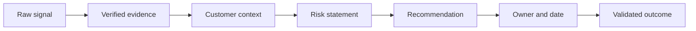

- **Proves:** A recommendation should be traceable from signal through validation.
- **Does not prove:** That a signal is accurate, a risk is accepted, or an action is authorized.

### Diagram B02 - Account lifecycle

Links: [Part 61](Part-61-operational-service-review-lifecycle.md), [Part 64](Part-64-customer-health-success-value.md)

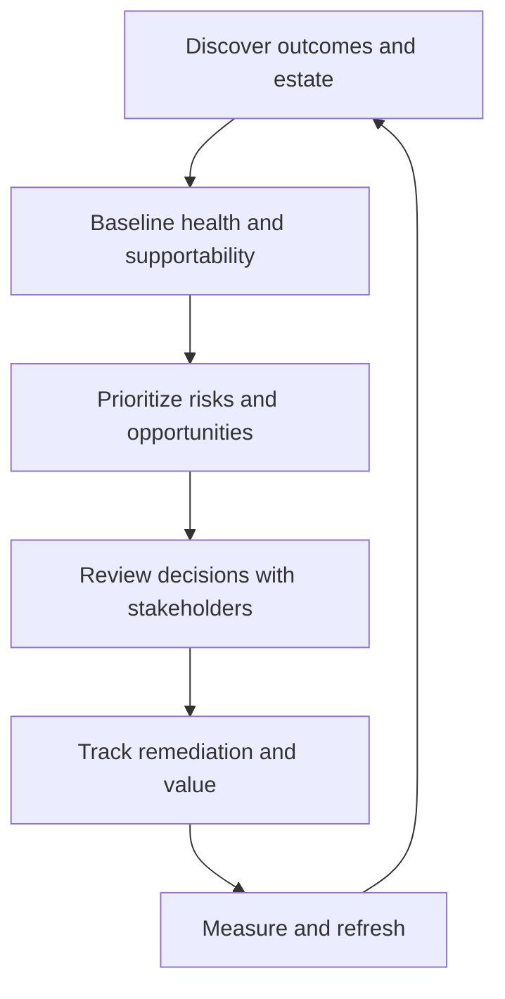

- **Proves:** Technical account work is a recurring governance loop.
- **Does not prove:** A fixed review cadence or that every account uses identical artifacts.

### Diagram B03 - Role boundary map

Links: [Part 1](Part-01-role-map-netapp-tam-story.md), [Part 63](Part-63-stakeholders-account-team-raci.md)

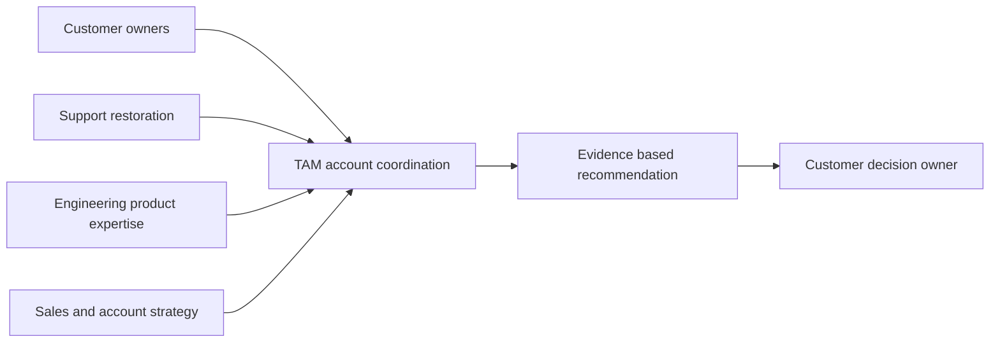

- **Proves:** TAM influence connects specialists and customer ownership.
- **Does not prove:** Authority to command Support, Engineering, Sales, or the customer.

### Diagram B04 - Discovery funnel

Links: [Part 2](Part-02-customer-environment-application-to-data.md), [Part 62](Part-62-customer-discovery-environment-profiling.md)

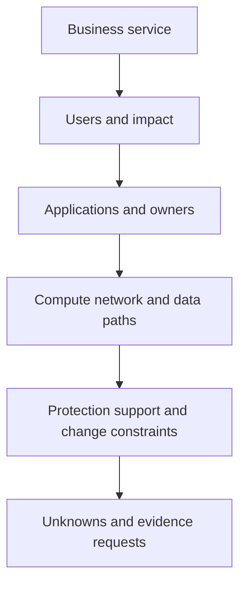

- **Proves:** Good discovery narrows from outcomes to technical evidence.
- **Does not prove:** That the first interview captured every dependency.

### Diagram B05 - Recommendation adoption loop

Links: [Part 57](Part-57-risk-scoring-prioritization.md), [Part 67](Part-67-influence-negotiation-objections.md)

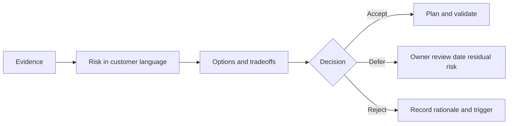

- **Proves:** Adoption includes legitimate defer/reject outcomes and residual risk.
- **Does not prove:** That a high score overrides customer decision rights.

## Group 2 - Application-to-data and storage foundations

### Diagram B06 - Application-to-media stack

Links: [Part 2](Part-02-customer-environment-application-to-data.md), [Part 4](Part-04-data-storage-bits-blocks-files-objects.md)

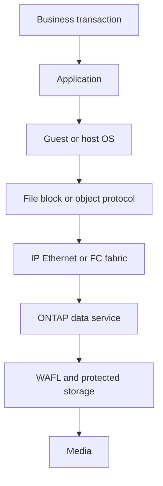

- **Proves:** A customer symptom crosses multiple ownership layers.
- **Does not prove:** Which layer is slow or failed.

### Diagram B07 - File versus block versus object

Links: [Part 14](Part-14-nas-san-file-block-architecture.md), [Part 33](Part-33-ontap-s3-object-storage.md)

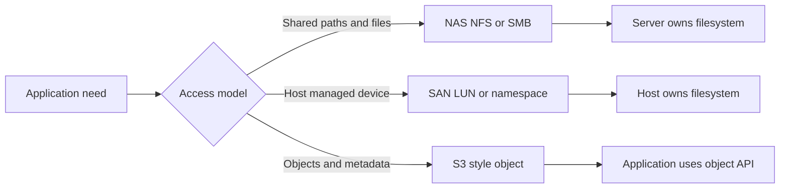

- **Proves:** Ownership and access semantics differ among storage models.
- **Does not prove:** That one model is universally faster or better.

### Diagram B08 - Media hierarchy

Links: [Part 5](Part-05-storage-media-hdd-ssd-nvme-flash.md)

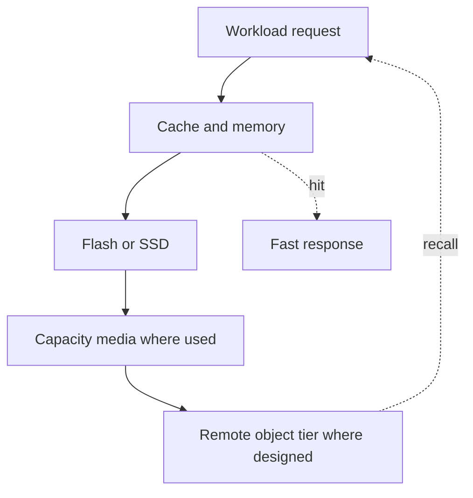

- **Proves:** Placement and cache hits can change service time.
- **Does not prove:** Exact latency, endurance, or tiering behavior for a platform.

### Diagram B09 - Generic RAID protection

Links: [Part 6](Part-06-raid-erasure-protection-rebuild-risk.md)

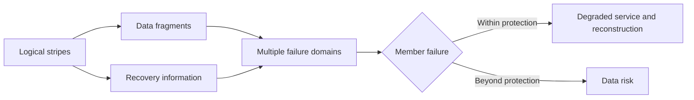

- **Proves:** Protection consumes capacity and has a bounded failure tolerance.
- **Does not prove:** A specific RAID layout, usable-capacity formula, or rebuild time.

### Diagram B10 - Filesystem write and recovery idea

Links: [Part 7](Part-07-filesystems-volume-managers-caches-consistency.md), [Part 20](Part-20-ontap-wafl-architecture.md)

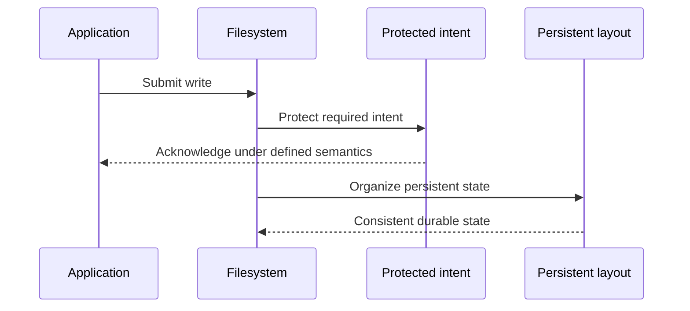

- **Proves:** Acknowledgment, intent protection, and final layout are distinct concepts.
- **Does not prove:** Exact ONTAP implementation timing or application consistency.

## Group 3 - TCP, Ethernet, IP, NAS, NFS, and SMB

### Diagram B11 - Encapsulation path

Links: [Part 11](Part-11-osi-tcpip-storage-professionals.md)

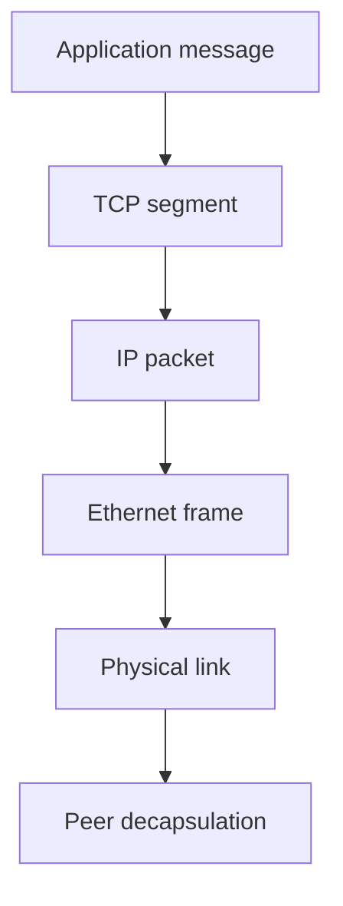

- **Proves:** Each layer adds addressing/control information.
- **Does not prove:** That every storage protocol uses TCP or Ethernet.

### Diagram B12 - TCP connection and data

Links: [Part 11](Part-11-osi-tcpip-storage-professionals.md)

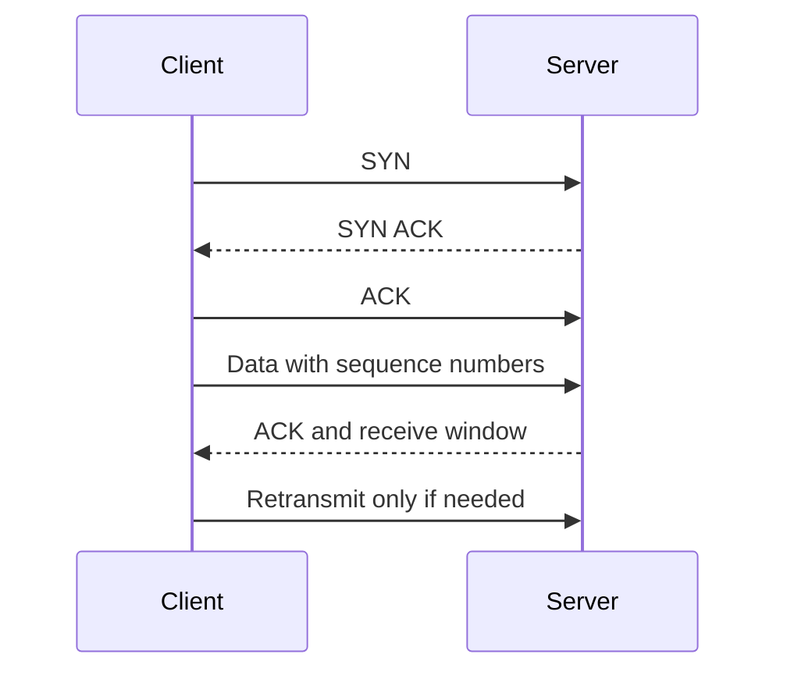

- **Proves:** TCP establishes state and tracks ordered delivery.
- **Does not prove:** Application authentication, server health, or absence of loss.

### Diagram B13 - Ethernet redundancy and LACP

Links: [Part 12](Part-12-ethernet-vlan-lacp-mtu-qos.md)

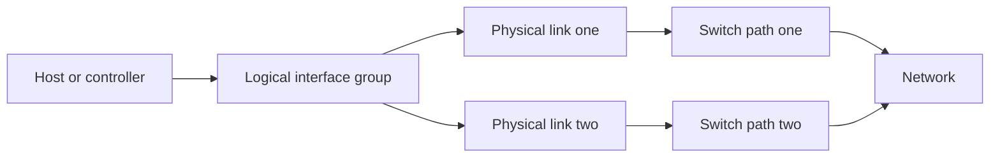

- **Proves:** A logical group can use multiple links and paths.
- **Does not prove:** Independent switches, balanced single-flow traffic, or correct LACP state.

### Diagram B14 - DNS and routed service lookup

Links: [Part 13](Part-13-ip-routing-dns-dhcp-ntp-firewalls.md)

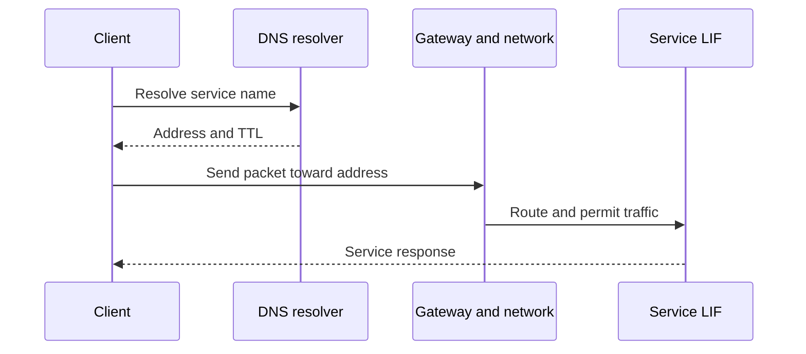

- **Proves:** Name resolution and packet reachability are separate dependencies.
- **Does not prove:** Correct application permissions or symmetric routing.

### Diagram B15 - NAS request comparison

Links: [Part 15](Part-15-nfs-versions-identity-locks-troubleshooting.md), [Part 16](Part-16-smb-active-directory-authentication-continuity.md)

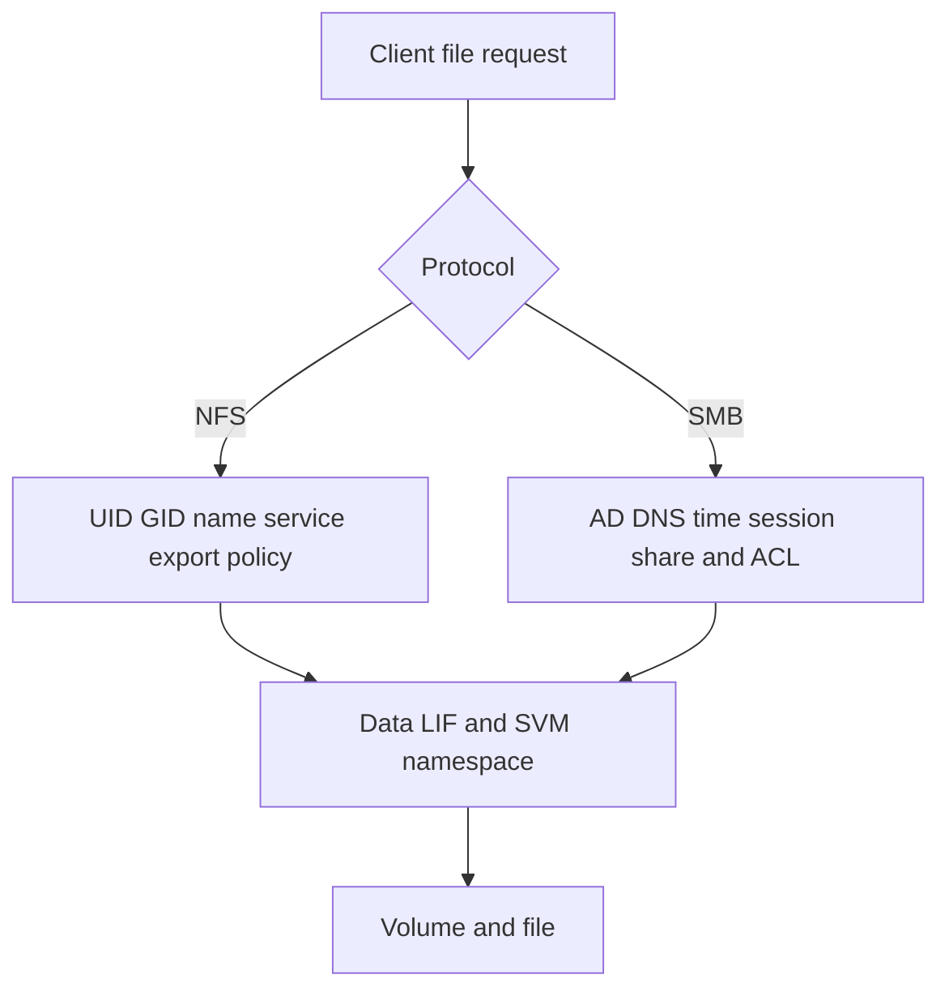

- **Proves:** NFS and SMB use different identity and authorization chains over a common storage namespace concept.
- **Does not prove:** Exact protocol version, policy order, or cause of access denial.

## Group 4 - SAN, iSCSI, FC, and NVMe

### Diagram B16 - SAN ownership boundary

Links: [Part 14](Part-14-nas-san-file-block-architecture.md), [Part 30](Part-30-ontap-san-luns-igroups-multipathing.md)


- **Proves:** The host owns filesystem interpretation above the presented block device.
- **Does not prove:** That a LUN is mounted safely or visible to only one host.

### Diagram B17 - iSCSI discovery to I/O

Links: [Part 17](Part-17-iscsi-luns-chap-mpio.md), [Part 31](Part-31-ontap-iscsi-fc-nvme-configuration.md)

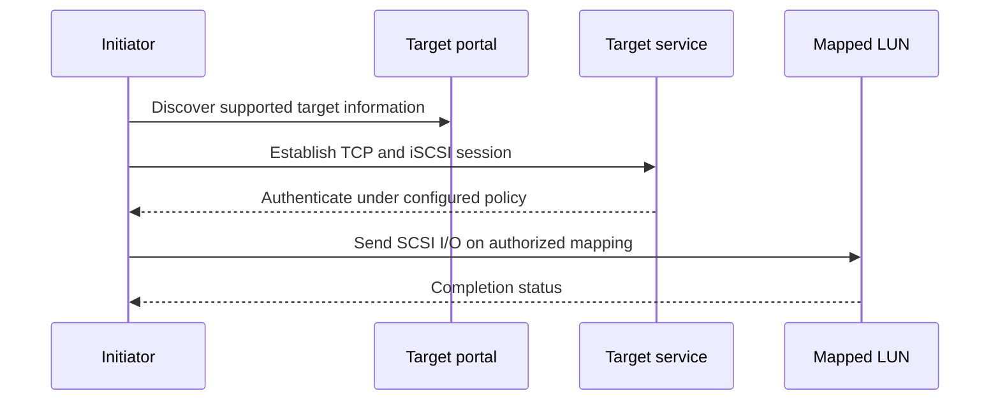

- **Proves:** Discovery, login, authorization, and I/O are separable stages.
- **Does not prove:** Exact ports, CHAP settings, or current supportability.

### Diagram B18 - Fibre Channel login and access

Links: [Part 18](Part-18-fibre-channel-fcoe-nvme-fabrics.md), [Part 31](Part-31-ontap-iscsi-fc-nvme-configuration.md)

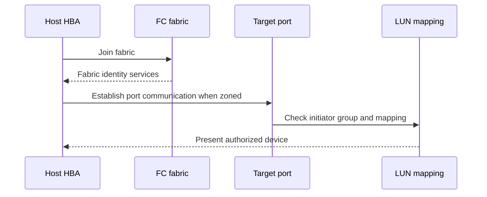

- **Proves:** Fabric visibility and storage mapping are independent gates.
- **Does not prove:** Vendor-specific switch commands or exact login sequence details.

### Diagram B19 - Multipath fault isolation

Links: [Part 30](Part-30-ontap-san-luns-igroups-multipathing.md), [Part 75](Part-75-san-troubleshooting-scenarios.md)

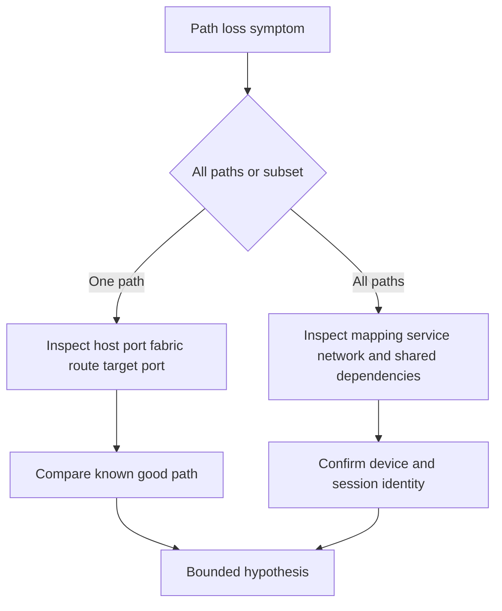

- **Proves:** Scope across paths is a discriminating first question.
- **Does not prove:** It is safe to reset, fail, or remove any path.

### Diagram B20 - NVMe transport choices

Links: [Part 18](Part-18-fibre-channel-fcoe-nvme-fabrics.md), [Part 31](Part-31-ontap-iscsi-fc-nvme-configuration.md)

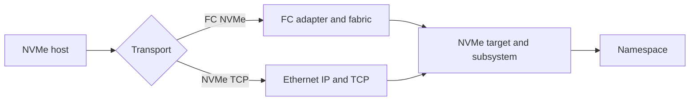

- **Proves:** NVMe command semantics can use different network transports.
- **Does not prove:** Feature parity, performance, or supported combinations.

## Group 5 - ONTAP core architecture

### Diagram B21 - Cluster and HA pairs

Links: [Part 21](Part-21-clustered-ontap-nodes-ha-quorum.md)

```mermaid
flowchart TB
    B21C[ONTAP cluster] --> B21H1[HA pair one]
    B21C --> B21H2[HA pair two]
    B21H1 --> B21N1[Node one]
    B21H1 --> B21N2[Node two]
    B21H2 --> B21N3[Node three]
    B21H2 --> B21N4[Node four]
    B21C --> B21M[Cluster management and coordination]
```

- **Proves:** Cluster membership and HA-pair partnership are different relationships.
- **Does not prove:** A required node count, platform limit, or health state.

### Diagram B22 - Takeover and giveback states

Links: [Part 21](Part-21-clustered-ontap-nodes-ha-quorum.md), [Part 77](Part-77-ha-cluster-hardware-scenarios.md)

```mermaid
stateDiagram-v2
    [*] --> B22Normal
    B22Normal --> B22Takeover: partner unavailable or approved action
    B22Takeover --> B22ServedByPartner: takeover completes
    B22ServedByPartner --> B22Ready: partner health restored and validated
    B22Ready --> B22Giveback: approved giveback
    B22Giveback --> B22Normal: service validated
```

- **Proves:** HA transitions require readiness and post-transition validation.
- **Does not prove:** That takeover/giveback is safe in a specific incident.

### Diagram B23 - SVM, LIF, and namespace

Links: [Part 22](Part-22-svms-lifs-namespaces-junctions.md), [Part 27](Part-27-ontap-nas-architecture.md)

```mermaid
flowchart TD
    B23S[SVM administrative and protocol boundary] --> B23L1[Data LIF one]
    B23S --> B23L2[Data LIF two]
    B23S --> B23N[Namespace root]
    B23N --> B23J1[Junction to volume one]
    B23N --> B23J2[Junction to volume two]
    B23L1 --> B23N
    B23L2 --> B23N
```

- **Proves:** Network endpoints and namespace objects belong to a logical data-serving context.
- **Does not prove:** LIF reachability, failover policy, or client authorization.

### Diagram B24 - WAFL write concept

Links: [Part 20](Part-20-ontap-wafl-architecture.md)

```mermaid
sequenceDiagram
    participant B24C as Client
    participant B24P as Protocol service
    participant B24M as Protected write intent
    participant B24W as WAFL layout
    participant B24D as Protected media
    B24C->>B24P: Write request
    B24P->>B24M: Protect acknowledgment state
    B24M-->>B24C: Acknowledge under system semantics
    B24P->>B24W: Integrate changed data and metadata
    B24W->>B24D: Persist consistent layout
```

- **Proves:** Client acknowledgment and later filesystem organization can be distinct stages.
- **Does not prove:** Internal timing, exact hardware path, or application-level durability.

### Diagram B25 - Physical-to-logical storage layout

Links: [Part 23](Part-23-ontap-disks-raid-aggregates-volumes.md)

```mermaid
flowchart TD
    B25D[Owned media or partitions] --> B25R[RAID groups and protection]
    B25R --> B25A[Aggregate or local tier]
    B25A --> B25V[FlexVol volumes]
    B25V --> B25Q[Qtrees directories or LUNs]
    B25Q --> B25C[Client or host data]
```

- **Proves:** Logical containers build on protected physical capacity.
- **Does not prove:** Exact overhead, layout, ownership, or recommended sizing.

## Group 6 - ONTAP administration, evidence, hardware, and data services

### Diagram B26 - Management interfaces

Links: [Part 24](Part-24-ontap-system-manager-cli-rest.md)

```mermaid
flowchart LR
    B26U[Authorized identity] --> B26G[System Manager]
    B26U --> B26C[CLI]
    B26U --> B26R[REST API]
    B26A[Automation client] --> B26R
    B26G --> B26M[ONTAP management plane]
    B26C --> B26M
    B26R --> B26M
    B26M --> B26B[RBAC audit and jobs]
```

- **Proves:** Interfaces converge on managed objects and authorization.
- **Does not prove:** Identical coverage or workflow across releases.

### Diagram B27 - Evidence correlation clock

Links: [Part 25](Part-25-ontap-ems-logs-audit-evidence.md)

```mermaid
flowchart TD
    B27A[Client observation] --> B27T[Normalize UTC and offsets]
    B27E[EMS and system events] --> B27T
    B27L[Audit and command history] --> B27T
    B27N[Network or protocol trace] --> B27T
    B27P[Performance archive] --> B27T
    B27T --> B27C[Correlated timeline]
    B27C --> B27H[Hypothesis and gaps]
```

- **Proves:** Shared time and object identity enable cross-source correlation.
- **Does not prove:** Causation from temporal proximity alone.

### Diagram B28 - Hardware path

Links: [Part 26](Part-26-netapp-hardware-shelves-cabling-frus.md)

```mermaid
flowchart LR
    B28N[Controller node] --> B28A[Adapter and port]
    B28A --> B28C[Cable path]
    B28C --> B28S[Shelf or enclosure]
    B28S --> B28M[Media devices]
    B28P[Power and cooling] --> B28N
    B28P --> B28S
    B28E[Environmental sensors] --> B28P
```

- **Proves:** Data paths and environmental dependencies both matter.
- **Does not prove:** Cabling correctness or field-replacement authorization.

### Diagram B29 - Scale-out NAS and cache concepts

Links: [Part 32](Part-32-flexgroup-flexcache-qtrees-quotas.md)

```mermaid
flowchart TD
    B29C[Client namespace] --> B29F{Data service design}
    B29F -->|Scale out volume| B29G[FlexGroup constituents]
    B29F -->|Distributed read locality| B29K[FlexCache]
    B29G --> B29O[Origin data placement]
    B29K --> B29O
    B29O --> B29P[Policy capacity and operations]
```

- **Proves:** Scale-out placement and caching solve different problems.
- **Does not prove:** Workload fit, limits, or automatic performance gain.

### Diagram B30 - Efficiency and tiering

Links: [Part 34](Part-34-storage-efficiency-fabricpool.md)

```mermaid
flowchart LR
    B30L[Logical data] --> B30D[Deduplication]
    B30D --> B30C[Compression and compaction]
    B30C --> B30P[Physical blocks]
    B30P --> B30H[Performance tier]
    B30H --> B30T[Policy selected cold blocks]
    B30T --> B30O[Supported object tier]
    B30O -.recall.-> B30H
```

- **Proves:** Data reduction and tiering affect physical use through different mechanisms.
- **Does not prove:** A savings ratio, tiering eligibility, or recall performance.

## Group 7 - Protection, continuity, and security

### Diagram B31 - Snapshot and restore

Links: [Part 35](Part-35-snapshots-restores-clones.md)

```mermaid
flowchart TD
    B31A[Active volume state] --> B31S[Point in time snapshot]
    B31A --> B31N[New changed blocks]
    B31S --> B31R{Recovery need}
    B31R -->|File| B31F[Restore selected data]
    B31R -->|Volume or clone workflow| B31V[Controlled recovery path]
    B31F --> B31X[Application validation]
    B31V --> B31X
```

- **Proves:** Point-in-time references can support several recovery scopes.
- **Does not prove:** Application consistency, retention sufficiency, or restore success.

### Diagram B32 - SnapMirror relationship lifecycle

Links: [Part 36](Part-36-snapmirror-replication-policies.md), [Part 78](Part-78-replication-backup-dr-scenarios.md)

```mermaid
stateDiagram-v2
    [*] --> B32Defined
    B32Defined --> B32Baseline: initialize under approved procedure
    B32Baseline --> B32Protected: baseline completes
    B32Protected --> B32Updating: policy or manual update
    B32Updating --> B32Protected: transfer completes
    B32Protected --> B32Interrupted: network space or state fault
    B32Interrupted --> B32Protected: cause corrected and validated
```

- **Proves:** Replication has state, transfer, and recovery phases.
- **Does not prove:** Policy names, supported commands, or a safe resync procedure.

### Diagram B33 - Backup versus replication versus archive

Links: [Part 37](Part-37-backup-archive-bluexp-integration.md)

```mermaid
flowchart LR
    B33D[Production data] --> B33R[Replication copy]
    B33D --> B33B[Versioned backup]
    B33D --> B33A[Long retention archive]
    B33R --> B33O1[Rapid continuity objective]
    B33B --> B33O2[Recovery and retention objective]
    B33A --> B33O3[Preservation objective]
    B33O1 --> B33T[Test recoverability]
    B33O2 --> B33T
    B33O3 --> B33T
```

- **Proves:** Different copy strategies serve different objectives.
- **Does not prove:** Independence, immutability, compliance, or tested recovery.

### Diagram B34 - MetroCluster decision boundary

Links: [Part 38](Part-38-metrocluster-site-resilience-dr.md)

```mermaid
flowchart TD
    B34I[Site disruption signal] --> B34S[Scope and surviving site state]
    B34S --> B34Q[Quorum mediator and connectivity evidence]
    B34Q --> B34D{Documented safe operation}
    B34D -->|Known and authorized| B34O[Execute current runbook]
    B34D -->|Ambiguous| B34E[Escalate and avoid split state]
    B34O --> B34V[Validate data and applications]
```

- **Proves:** Site action requires state evidence and current procedure.
- **Does not prove:** Which switchover action is safe for a real topology.

### Diagram B35 - Ransomware resilience layers

Links: [Part 39](Part-39-snaplock-immutability-retention.md), [Part 41](Part-41-ransomware-resilience-arp.md)

```mermaid
flowchart TD
    B35A[Identity and least privilege] --> B35B[Harden and reduce exposure]
    B35B --> B35C[Monitor anomaly and security signals]
    B35C --> B35D[Protected point in time copies]
    B35D --> B35E[Immutable or isolated copies where designed]
    B35E --> B35F[Practiced clean recovery]
    B35F --> B35G[Lessons and control improvement]
```

- **Proves:** Cyber resilience requires prevention, detection, protection, and recovery layers.
- **Does not prove:** That one feature prevents ransomware or guarantees clean recovery.

## Group 8 - Performance, capacity, tools, lifecycle, and upgrades

### Diagram B36 - Latency service centers

Links: [Part 43](Part-43-ontap-performance-counters.md), [Part 76](Part-76-performance-troubleshooting-scenarios.md)

```mermaid
flowchart LR
    B36A[Application time] --> B36H[Host and hypervisor]
    B36H --> B36N[Network or fabric]
    B36N --> B36P[Protocol service]
    B36P --> B36C[Controller CPU cache and queues]
    B36C --> B36M[Media or remote tier]
    B36M --> B36R[Response path]
```

- **Proves:** End-to-end latency is composed across service centers.
- **Does not prove:** That component times add cleanly from unsynchronized counters.

### Diagram B37 - Capacity forecast

Links: [Part 45](Part-45-capacity-analytics-forecasting.md)

```mermaid
flowchart TD
    B37A[Validated historical used capacity] --> B37B[Normalize scope units and dates]
    B37B --> B37C[Model trend seasonality and known changes]
    B37C --> B37D[Low base and high scenarios]
    B37D --> B37E[Time to operating threshold]
    B37E --> B37F[Latest safe action start]
    B37F --> B37G[Monitor forecast error]
```

- **Proves:** Forecasting is a scenario and lead-time process, not one trend line.
- **Does not prove:** Future demand or a universal safe threshold.

### Diagram B38 - Proactive tool chain

Links: [Part 47](Part-47-autosupport-architecture-delivery.md), [Part 48](Part-48-active-iq-digital-advisor-wellness.md), [Part 50](Part-50-imt-supportability-validation.md), [Part 51](Part-51-hardware-universe-platform-limits.md)

```mermaid
flowchart LR
    B38A[AutoSupport telemetry] --> B38D[Digital Advisor views]
    B38I[Customer inventory] --> B38M[IMT solution validation]
    B38I --> B38H[HWU platform validation]
    B38D --> B38R[Risk candidate]
    B38M --> B38R
    B38H --> B38R
    B38R --> B38E[Evidence dated recommendation]
```

- **Proves:** Telemetry, inventory, interoperability, and hardware evidence complement one another.
- **Does not prove:** Access, freshness, supportability, or customer applicability without exact queries.

### Diagram B39 - Defect and lifecycle applicability

Links: [Part 52](Part-52-burts-defects-release-notes-bug-scrub.md), [Part 53](Part-53-lifecycle-management.md)

```mermaid
flowchart TD
    B39S[Public or authorized source] --> B39V[Version platform feature and trigger]
    B39V --> B39E[Customer exposure evidence]
    B39E --> B39A{Applicable}
    B39A -->|Yes| B39R[Mitigation remediation and residual risk]
    B39A -->|No| B39N[Record rationale and date]
    B39A -->|Unknown| B39U[Request evidence or escalate]
```

- **Proves:** Titles and versions alone do not establish defect or lifecycle risk.
- **Does not prove:** Gated defect facts or a universal remediation.

### Diagram B40 - Upgrade assurance gates

Links: [Part 54](Part-54-ontap-upgrade-planning.md), [Part 55](Part-55-firmware-host-switch-upgrade-coordination.md)

```mermaid
flowchart LR
    B40A[Business driver and target] --> B40B[Current health and telemetry]
    B40B --> B40C[Supported path and release notes]
    B40C --> B40D[IMT HWU host switch firmware checks]
    B40D --> B40E[Change plan stop criteria and communications]
    B40E --> B40F[Execute by authorized runbook]
    B40F --> B40G[Technical and application validation]
    B40G --> B40H[Monitor and close]
```

- **Proves:** Upgrade readiness crosses business, health, compatibility, execution, and validation gates.
- **Does not prove:** A target release, exact path, nondisruption, or rollback capability.

## Group 9 - Analytics, service reviews, influence, and incidents

### Diagram B41 - Customer data pipeline

Links: [Part 56](Part-56-customer-data-pipeline.md), [Part 59](Part-59-excel-tam-analysis.md)

```mermaid
flowchart LR
    B41S[Authorized sources] --> B41X[Extract with cutoff and provenance]
    B41X --> B41C[Clean types keys and missing values]
    B41C --> B41J[Join and reconcile]
    B41J --> B41Q[QA totals duplicates freshness]
    B41Q --> B41M[Metrics and findings]
    B41M --> B41P[Published artifact]
```

- **Proves:** Quality gates belong between source and presentation.
- **Does not prove:** Source truth, permission, or causal interpretation.

### Diagram B42 - Risk prioritization

Links: [Part 57](Part-57-risk-scoring-prioritization.md)

```mermaid
flowchart TD
    B42F[Verified finding] --> B42I[Impact and criticality]
    B42F --> B42L[Likelihood and exposure]
    B42F --> B42T[Time horizon and supportability]
    B42I --> B42P[Priority with confidence]
    B42L --> B42P
    B42T --> B42P
    B42P --> B42O[Owner action validation residual risk]
```

- **Proves:** Priority should expose factors and confidence.
- **Does not prove:** That arithmetic replaces expert/customer judgment.

### Diagram B43 - Service review narrative

Links: [Part 61](Part-61-operational-service-review-lifecycle.md), [Part 65](Part-65-powerpoint-data-storytelling.md)

```mermaid
flowchart LR
    B43A[Outcomes and changes since last review] --> B43B[Estate and data quality]
    B43B --> B43C[Health incidents capacity and lifecycle]
    B43C --> B43D[Top decisions and recommendations]
    B43D --> B43E[Actions owners dates]
    B43E --> B43F[Value and next cadence]
```

- **Proves:** A review should move from context to decisions and ownership.
- **Does not prove:** That every audience needs the same detail or deck order.

### Diagram B44 - Influence without authority

Links: [Part 67](Part-67-influence-negotiation-objections.md), [Part 70](Part-70-cross-functional-sme-conflict.md)

```mermaid
flowchart TD
    B44A[Stakeholder position] --> B44B[Discover interest constraint and evidence]
    B44B --> B44C[Restate shared outcome]
    B44C --> B44D[Offer bounded options and tradeoffs]
    B44D --> B44E{Agreement}
    B44E -->|Yes| B44F[Commit owner date and proof]
    B44E -->|No| B44G[Record decision risk and escalation trigger]
```

- **Proves:** Influence uses interests, options, and explicit decisions.
- **Does not prove:** Permission to bypass governance or coerce adoption.

### Diagram B45 - Major incident command loop

Links: [Part 72](Part-72-major-incident-high-pressure-communication.md), [Part 73](Part-73-escalation-packages-engineering-engagement.md)

```mermaid
flowchart TD
    B45A[Declare and assign incident roles] --> B45B[Confirm impact scope and timeline]
    B45B --> B45C[Protect safety and freeze uncontrolled change]
    B45C --> B45D[Parallel restoration and evidence workstreams]
    B45D --> B45E[Decision log and timed updates]
    B45E --> B45F[Restore and validate]
    B45F --> B45G[Monitor handoff PIR and corrective actions]
```

- **Proves:** Incident control balances restoration, evidence, decisions, and communication.
- **Does not prove:** Severity, cause, or authority in a particular organization.

## Group 10 - VMware, Kubernetes, cloud, and labs

### Diagram B46 - VMware NFS and block paths

Links: [Part 87](Part-87-vmware-vsphere-netapp.md)

```mermaid
flowchart TD
    B46V[Virtual machine] --> B46E[ESXi host]
    B46E --> B46P{Datastore path}
    B46P -->|NFS| B46N[IP network to NAS datastore]
    B46P -->|VMFS on LUN| B46M[MPIO over iSCSI or FC]
    B46N --> B46O[ONTAP SVM and volume]
    B46M --> B46L[ONTAP SAN SVM and LUN]
```

- **Proves:** VMware can reach storage through file or block ownership models.
- **Does not prove:** Supported versions, preferred design, or workload performance.

### Diagram B47 - Kubernetes persistent storage

Links: [Part 88](Part-88-kubernetes-trident-data-management.md)

```mermaid
sequenceDiagram
    participant B47A as Application manifest
    participant B47K as Kubernetes control plane
    participant B47C as CSI and Trident
    participant B47S as Supported storage backend
    B47A->>B47K: Request PVC and StorageClass
    B47K->>B47C: Provision request
    B47C->>B47S: Create or select storage under policy
    B47S-->>B47C: Resource identity
    B47C-->>B47K: Bind persistent volume
    B47K-->>B47A: Mount or attach for pod use
```

- **Proves:** Kubernetes request, orchestration, backend, and attachment are distinct stages.
- **Does not prove:** Access mode, application consistency, security, or current matrix support.

### Diagram B48 - Hybrid cloud responsibility

Links: [Part 89](Part-89-cloud-hybrid-data-services.md)

```mermaid
flowchart LR
    B48A[Application owner] --> B48I[Identity network and data design]
    B48C[Cloud provider] --> B48F[Cloud infrastructure services]
    B48N[NetApp service or software] --> B48D[Data management capability]
    B48I --> B48W[Running workload]
    B48F --> B48W
    B48D --> B48W
    B48W --> B48R[Shared responsibility evidence]
```

- **Proves:** Hybrid services have multiple responsibility boundaries.
- **Does not prove:** Contract terms, regional availability, or who owns a specific fault.

### Diagram B49 - Safe lab evidence cycle

Links: [Part 82](Part-82-safe-netapp-practice-environment.md), [Part 83](Part-83-lab-ontap-discovery-health-baseline.md)

```mermaid
flowchart TD
    B49A[Authorized lab or documentation simulation] --> B49B[Define objective and safety limits]
    B49B --> B49C[Record versions topology and synthetic inputs]
    B49C --> B49D[Perform bounded read or approved exercise]
    B49D --> B49E[Capture sanitized evidence]
    B49E --> B49F[Interpret and peer check]
    B49F --> B49G[Portfolio artifact with honest label]
```

- **Proves:** A lab portfolio needs provenance, safety, evidence, and honest claims.
- **Does not prove:** Production authority or experience.

### Diagram B50 - Capstone integration

Links: [Part 90](Part-90-lab-proactive-risk-upgrade-assessment.md), [Part 91](Part-91-capstone-netapp-tam-service-review.md)

```mermaid
flowchart TD
    B50D[Discovery and synthetic estate] --> B50Q[Inventory and data quality]
    B50Q --> B50H[Health capacity performance and incidents]
    B50H --> B50S[Supportability bugs lifecycle and upgrade]
    B50S --> B50R[Prioritized recommendations]
    B50R --> B50V[Service review narrative]
    B50V --> B50A[Actions owners dates and validation]
    B50A --> B50P[Portfolio reflection and interview practice]
```

- **Proves:** The capstone joins technical analysis to customer decisions and learning evidence.
- **Does not prove:** Real customer delivery, gated-tool access, or NetApp employment experience.

## Atlas use pattern

1. State the question and choose one diagram, not a wall of diagrams.
2. Define every acronym before walking the flow.
3. Point to ownership and failure boundaries.
4. Name one observation that would support each important arrow.
5. Name what the diagram cannot prove.
6. For current product behavior, open the linked Part and verify official documentation for the exact release.

## Completion and use checklist

- [x] Exactly 50 numbered Mermaid diagrams are present.
- [x] Role/TAM, application-to-data, storage/media/RAID/filesystems, TCP/Ethernet/IP, NAS/NFS/SMB, SAN/iSCSI/FC/NVMe, ONTAP/WAFL/HA/SVM/LIF/layout/admin/evidence/hardware, data services, efficiency, protection, security, performance, capacity, tools, lifecycle, analytics, incidents, VMware, Kubernetes, cloud, and labs are represented.
- [x] Every diagram states what it proves and what it does not prove.
- [x] Every diagram links to one or more relevant Parts.
- [x] Diagrams use unique node identifiers, simple labels, and balanced fences.
- [x] Version, access, privacy, synthetic-evidence, and supportability boundaries are explicit.
- [ ] Before external use, validate product-specific labels and the target Mermaid renderer.

---

*Navigation:* Previous: [Appendix A - Master Glossary and Acronym Decoder](Appendix-A-master-glossary-acronyms.md) | Next: [Appendix C - ONTAP CLI, System Manager, REST, PowerShell, and Python Quick Reference](Appendix-C-ontap-admin-automation-reference.md) | [Master guide](../NetApp%20TAM%20Technical%20Analyst%20-%20Complete%20Study%20Guide.md)