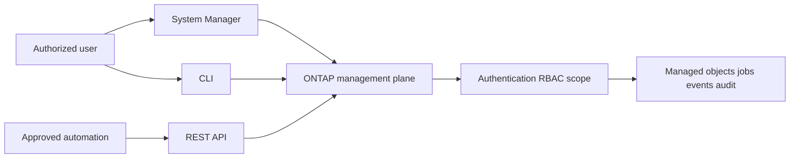
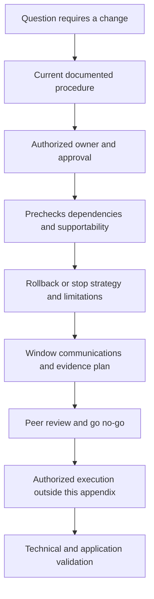
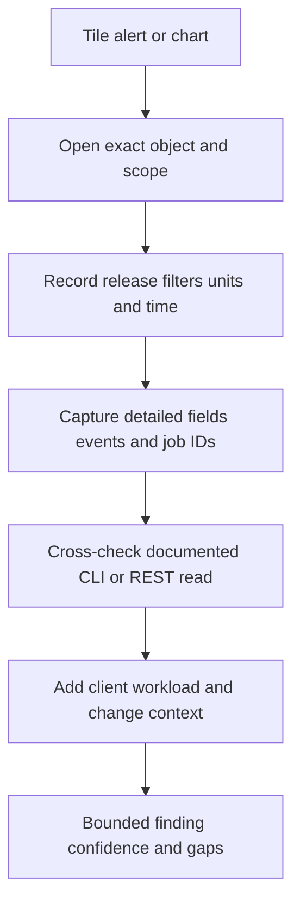
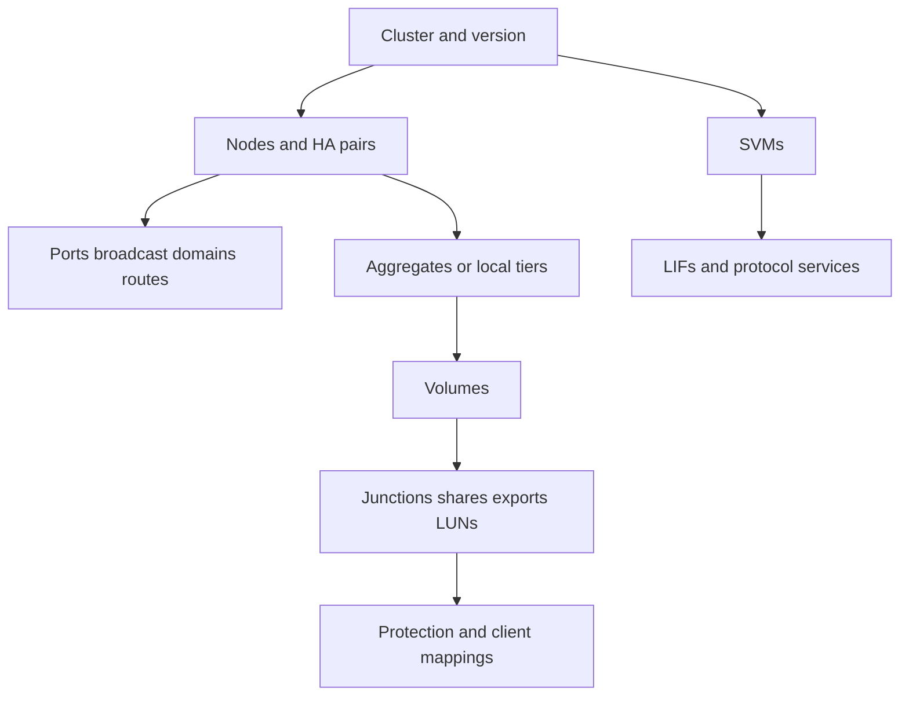
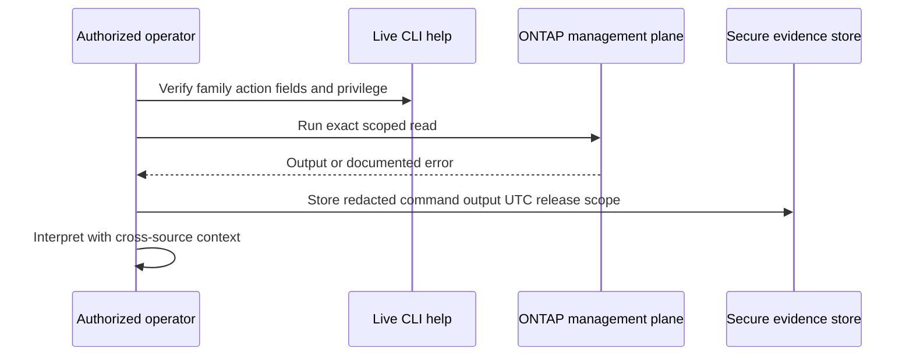
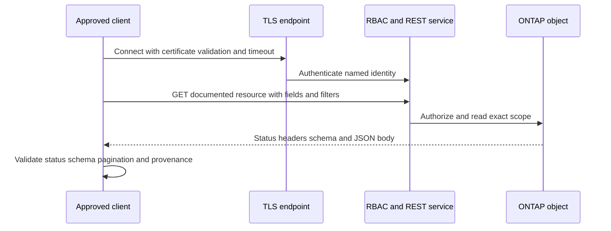
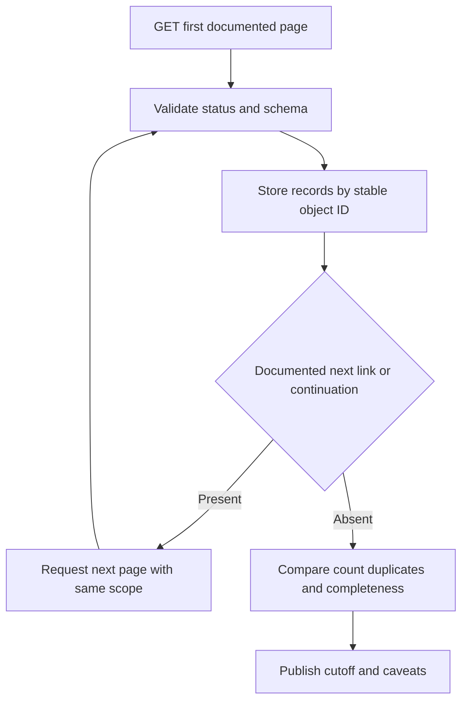
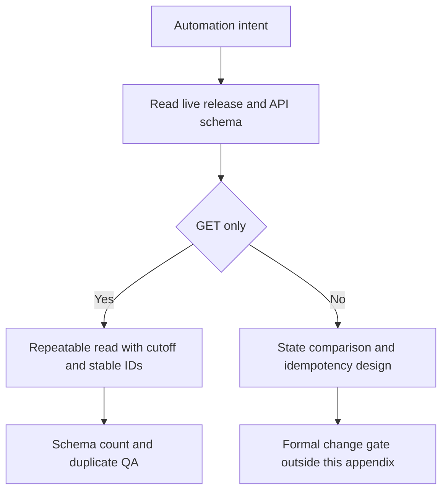
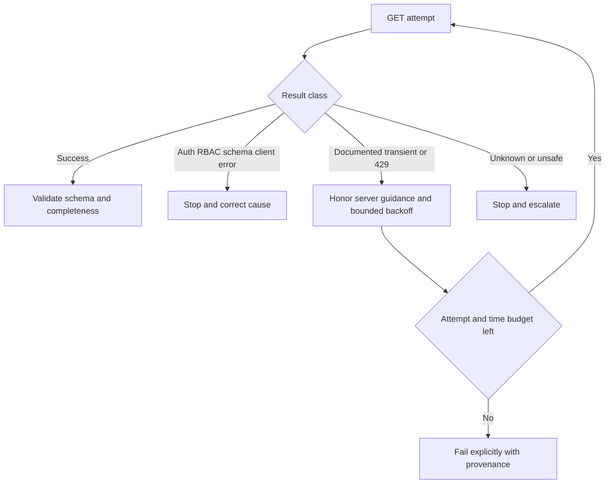
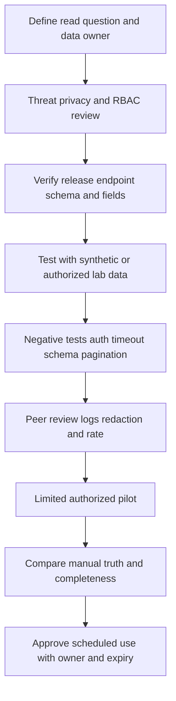

# Appendix C - ONTAP CLI, System Manager, REST, PowerShell, and Python Quick Reference

> **Purpose:** Support safe ONTAP discovery, evidence capture, reporting, and automation design without turning remembered syntax into an unsafe production recipe.
>
> **How to use:** Identify the exact ONTAP release, interface, identity, RBAC scope, and question. Start read-only, use live help/schema discovery, record provenance, and stop before any change unless the formal gate is complete.
>
> **Reference date:** 2026-08-24

## Scope, safety, access, and current-version boundaries

- All systems, names, addresses, identities, outputs, identifiers, filters, and payloads are placeholders or synthetic.
- Commands and endpoints can change by ONTAP release, platform, license, role, and SVM/cluster scope. Verify the live CLI help or REST schema and current official ONTAP documentation before use.
- Public read-only command families below are common reference anchors, not guarantees for every release. Never paste a command solely because it appears here.
- No create, modify, delete, start, stop, takeover, giveback, break, resync, restore, reboot, reset, packet-capture activation, privilege escalation, or other change command is provided.
- Customer access requires authorization, least privilege, approved connection paths, privacy review, secure storage/transfer, and retention controls. Do not collect secrets or unnecessary personal/content data.
- Code is pseudocode for an authorized lab. It is deliberately incomplete: placeholders, certificate policy, authentication choice, rate limits, endpoint paths, fields, and error handling must be adapted and tested.
- This appendix does not establish production ONTAP administration experience. See [Part 24](Part-24-ontap-system-manager-cli-rest.md), [Part 25](Part-25-ontap-ems-logs-audit-evidence.md), and [Part 82](Part-82-safe-netapp-practice-environment.md).

## 1. Interface and safety selection

### Reference C01 - Interface selection table

| Need | Start here | Strength | Boundary | Current check |
|---|---|---|---|---|
| Guided single-cluster overview | System Manager | Visual relationships and supported workflows | UI summary can hide fields | Exact release UI documentation |
| Precise interactive discovery | ONTAP CLI | Help, filters, fields, compact evidence | Display text is brittle for automation | Live `?` help and command reference |
| Structured repeatable inventory | REST API | JSON, identifiers, pagination, schema | Endpoint and RBAC coverage vary | Live API documentation/schema |
| Fleet/reporting workflow | REST plus approved automation | Reproducible extraction and QA | Secrets, rate, retries, logs, privacy | Security and API engineering review |
| Deep diagnosis | Current documented evidence sources | Exact object/event context | Some methods are Support-only | Authorized Support guidance |

### Reference C02 - One management plane diagram



**Interpretation:** Interface choice changes interaction style, not authorization or object truth. A GUI tile and an API record may summarize the same object differently.

### Reference C03 - Safety classification table

| Class | Meaning | Examples | Required behavior |
|---|---|---|---|
| RO-1 Passive read | Reads existing state without initiating an active test | Version, object inventory, status, field/schema help | Confirm scope; capture time and filters |
| RO-2 Sensitive read | Read-only but may expose topology, identity, security, events, or customer metadata | Audit records, sessions, mappings, event detail | Need-to-know, redact, encrypt, retain minimally |
| AP-1 Safe active probe | Sends a bounded request that can create load or logs but not intended configuration change | A single authenticated GET or approved connectivity check | Authorization, low rate, timeout, stop criteria |
| CHG | Changes state or configuration | Any create/modify/delete/start/stop/action endpoint | Not provided here; formal change process required |
| SUP | Support-directed or diagnostic activity | Elevated privilege, internal tools, special collections | Use only with authorized Support direction |

### Reference C04 - Change-control gate diagram



**Stop rule:** If any gate is unknown, remain read-only and escalate the exact gap.

## 2. System Manager quick reference

### Reference C05 - System Manager evidence table

| View or action | Capture | Expected observation | Interpretation boundary |
|---|---|---|---|
| Cluster/dashboard overview | Cluster identity, release, UTC, visible scope and filters | Summary health/capacity/performance indicators | Green summary does not prove application health |
| Object drill-down | UUID/name, owning SVM/node, state, relevant fields | Object-specific state and relationships | UI labels can differ from CLI/API nouns |
| Alert/event view | Severity, message identity, first/last occurrence, affected object | A recorded condition | Event timing does not prove causation |
| Capacity view | Logical/physical definitions, units, time, snapshot/tiering scope | Current summarized capacity | Effective capacity is assumption-dependent |
| Performance view | Counter, object, aggregation, interval, timezone | Trend or current metric | Average can hide peaks and tails |
| Job/result view | Job ID, submitter, start/end, state, error | Accepted/running/completed/failed operation | Submission is not completion |
| Export/download | File name, schema, cutoff, checksum/reference | Reusable structured evidence | Validate completeness and encoding |
| Screenshot | Context header, timestamp, filters, redactions | Human-readable snapshot | Weak evidence without raw fields/provenance |

### Reference C06 - System Manager drill-down flow



**Current verification:** Use the System Manager documentation for the exact ONTAP release. Navigation paths and labels are volatile.

## 3. CLI grammar, help, and discovery

### Reference C07 - CLI grammar table

| Element | Conceptual shape | Purpose | Safety note |
|---|---|---|---|
| Command family | `<object-family>` | Select managed object domain | Confirm family in live help |
| Read action | `show` | Display state | Read-only does not mean non-sensitive |
| Scope key | `-<documented-key> <exact-value>` | Limit object set | Wrong scope can expose too much data |
| Fields | `-fields <documented-field-list>` | Request explicit attributes | Definitions and availability vary |
| Instance view | `-instance` where documented | Show detailed object record | Can be large or sensitive |
| Help | `?` at the current command position | Discover supported syntax | Prefer live help over memory |
| Manual page | Documented command manual mechanism | Read semantics and parameters | Verify exact release and privilege |

### Reference C08 - Conceptual command-family map

| Question | Common public family anchor | Scope concept | Primary Part |
|---|---|---|---|
| What release and cluster? | `version`, `cluster` | Cluster | [Part 21](Part-21-clustered-ontap-nodes-ha-quorum.md) |
| Which nodes and HA state? | `system node`, `storage failover` | Node/HA pair | [Part 21](Part-21-clustered-ontap-nodes-ha-quorum.md) |
| Which SVMs and services? | `vserver` | Cluster/SVM | [Part 22](Part-22-svms-lifs-namespaces-junctions.md) |
| Which ports, LIFs, routes? | `network port`, `network interface`, `network route` | Node/SVM | [Part 22](Part-22-svms-lifs-namespaces-junctions.md) |
| Which protected storage pools? | `storage aggregate` | Node/local tier | [Part 23](Part-23-ontap-disks-raid-aggregates-volumes.md) |
| Which volumes and junctions? | `volume` | SVM/volume | [Part 23](Part-23-ontap-disks-raid-aggregates-volumes.md) |
| Which NAS service objects? | `vserver nfs`, `vserver cifs`, export/share families | SVM | [Parts 28-29](Part-28-ontap-nfs-configuration-security.md) |
| Which SAN objects? | `lun`, `lun igroup`, iSCSI/FC/NVMe families | SVM | [Parts 30-31](Part-30-ontap-san-luns-igroups-multipathing.md) |
| Which protection relationships? | `snapmirror` | Cluster/SVM/relationship | [Part 36](Part-36-snapmirror-replication-policies.md) |
| Which events/jobs/audit records? | `event log`, `job`, `security audit` | Cluster and identity dependent | [Part 25](Part-25-ontap-ems-logs-audit-evidence.md) |

### Reference C09 - Mandatory command card fields

| Field | Required value |
|---|---|
| Platform | `ONTAP CLI on <cluster-fqdn>` |
| Release | `<exact-ontap-release>` verified before use |
| Access | `<approved-connection-path>` |
| Privilege | Lowest documented role/privilege that permits the read |
| Safety | `RO-1`, `RO-2`, `AP-1`, `CHG`, or `SUP` |
| Scope | Cluster, node, SVM, volume, LUN, relationship, or exact object ID |
| Placeholders | Every value inside angle brackets must be replaced deliberately |
| Expected observation | What a successful read should return, not invented sample output |
| Interpretation | What the result supports and cannot support |
| Current verification | Live help plus official command reference for exact release |
| Provenance | Operator, UTC, command with secrets removed, output location/checksum |

### Reference C10 - Public read-only CLI examples

Every row is **platform: ONTAP CLI**, **safety: read-only**, **placeholders: angle brackets**, and **verification: live `?` help plus current ONTAP command reference**. Privilege names and field availability must be confirmed on the target release.

| Example | Likely minimum context | Expected observation | Interpretation and limits |
|---|---|---|---|
| `version` | Authorized CLI login; administrative read | ONTAP version information | Establishes reported software version, not support status |
| `cluster show` | Cluster-scoped read | Cluster members and high-level state fields | Does not prove every service is healthy |
| `system node show` | Cluster-scoped read | Node identity and documented state fields | Cross-check HA, hardware, and events |
| `storage failover show` | Cluster-scoped read | HA partner/failover state fields | Does not authorize takeover/giveback |
| `vserver show` | Cluster or delegated SVM read | SVM identities/types/states under scope | Does not prove protocols are reachable |
| `network port show` | Cluster-scoped network read | Port identity, role/state fields where documented | Link up does not prove end-to-end path |
| `network interface show` | Cluster or SVM network read | LIF identities, homes/current ports, state fields | State up does not prove client DNS/routing |
| `network route show -vserver <svm-name>` | SVM network read | Documented routes for exact SVM | Does not prove return-path symmetry |
| `storage aggregate show` | Cluster storage read | Aggregate/local-tier identity and capacity/state fields | Verify terminology and unit definitions |
| `volume show -vserver <svm-name>` | SVM storage read | Volumes under exact SVM and default fields | Use explicit fields for capacity conclusions |
| `lun show -vserver <svm-name>` | SVM SAN read; may be sensitive | LUN identities and documented fields | Visibility does not prove host mapping/path health |
| `snapmirror show` | Authorized protection read | Relationship identity and documented state/lag fields | A healthy-looking row does not prove recoverability |
| `event log show` | Event read; potentially sensitive | EMS event records under documented defaults/filters | Preserve time and avoid assuming event equals cause |
| `job show` | Job read | Asynchronous job records and states | Accepted/running differs from completed |
| `security audit log show` | Security/audit read; commonly sensitive and role-limited | Authorized audit records where command exists | Verify exact syntax, scope, privacy, and retention |

### Reference C11 - Filters and fields table

| Pattern | Use | Expected observation | Trap |
|---|---|---|---|
| `<family> show` | Initial object discovery | Default columns for objects in scope | Defaults can omit decision fields |
| `<family> show -fields <field-a>,<field-b>` | Explicit field selection | Stable chosen attributes if supported | Field names and semantics vary by release |
| `<family> show -<key> <exact-value>` | Narrow query to an exact object/value | Reduced result set | Wildcards or ambiguous names can overmatch |
| `<family> show -instance` | Detailed records where documented | One or more expanded objects | Large/sensitive output; scope first |
| Multiple filters | Answer a bounded question | Intersection defined by CLI semantics | Confirm whether filters are AND, pattern, or exact |

### Reference C12 - Discovery object dependency diagram



**Interpretation:** Discover parent identity and scope before child detail; do not infer topology from one flat export.

### Reference C13 - CLI evidence sequence



### Reference C14 - Privilege and RBAC table

| Concept | Question | Safe response |
|---|---|---|
| Authentication | Who is the identity? | Use named approved human/service identity |
| Authorization | What may it read? | Request only required command/API resource scope |
| Cluster scope | Does it cross SVMs/nodes? | Avoid broad collection when SVM/object scope answers |
| SVM scope | Is delegated read sufficient? | Prefer delegated least privilege where appropriate |
| Advanced/diagnostic | Is elevation truly required? | Stop; use documented need and authorized guidance |
| Permission denied | Is syntax, object scope, or RBAC missing? | Capture exact error; do not grant full admin reflexively |
| Review | Is access still needed? | Expire/revoke and audit service credentials |

### Reference C15 - Jobs, EMS, and audit table

| Source | Use | Capture | Boundary |
|---|---|---|---|
| Job records | Follow asynchronous operation state | Job/resource ID, state, start/end, error, affected object | Job success may not prove application outcome |
| EMS events | Identify reported conditions and transitions | Message/event identity, severity, node, object, UTC, first/last | Severity and timing do not prove root cause |
| Audit records | Attribute management access/actions | Identity, interface, scope, action, result, UTC | Highly sensitive; collect minimally |
| Command history where authorized | Reconstruct administrative timeline | Redacted command, identity, context, timestamp | Absence may reflect retention/scope gaps |
| System Manager result | Correlate guided workflow with job/audit | UI workflow, job ID, result, object | Screenshot alone is insufficient provenance |

## 4. REST API quick reference

### Reference C16 - HTTP method safety table

| Method | Typical intent | This appendix | Safety boundary |
|---|---|---|---|
| GET | Read a resource or collection | Allowed as pseudocode | Can expose sensitive data or create load/logs |
| HEAD/OPTIONS | Metadata/capability behavior where supported | Concept only | Verify endpoint support and authorization |
| POST | Create or invoke an action | Not provided | Treat as change even if name sounds harmless |
| PATCH | Partially update a resource | Not provided | Change-control gate required |
| DELETE | Remove a resource | Not provided | Destructive; absent by design |

### Reference C17 - REST GET sequence



### Reference C18 - Pagination flow



### Reference C19 - Filtering, fields, schema, and consistency table

| Concern | Safe pattern | Validation |
|---|---|---|
| Endpoint | Use current documented resource path | Record ONTAP release and docs/schema version |
| Object identity | Prefer stable documented UUID/ID plus human name | Detect renamed/duplicate names |
| Fields | Request only required documented fields | Reject missing required fields explicitly |
| Filters | Encode documented query parameters | Log redacted canonical filter and returned scope |
| Pagination | Follow server-provided documented continuation | Detect duplicate/missing IDs across pages |
| Schema | Validate expected types and nullable fields | Quarantine unknown fields/types rather than coercing silently |
| Snapshot consistency | Record collection start/end and object changes | Avoid claiming one atomic estate snapshot unless guaranteed |
| Sorting | Request documented sort only when needed | Do not depend on unspecified response order |

### Reference C20 - Status and error-handling table

| Class | Meaning | Safe handling | Do not do |
|---|---|---|---|
| 2xx | Request accepted/succeeded under method semantics | Validate body, schema, counts, and job state where applicable | Assume outcome from status alone |
| 400 | Request invalid | Stop; inspect documented error, endpoint, filter, and schema | Retry unchanged repeatedly |
| 401 | Authentication failed/required | Stop; check approved credential flow and clock | Log secret or bypass TLS |
| 403 | Authenticated but not authorized | Stop; capture scope and exact permission need | Grant broad admin automatically |
| 404 | Resource/path not found or not visible | Verify release, endpoint, ID, scope, and RBAC semantics | Conclude object never existed |
| 409 | State/conflict condition | Stop and re-read current state | Force overwrite |
| 429 | Rate limit where implemented | Honor documented retry guidance and reduce rate | Tight retry loop |
| 5xx | Server/service error | Bound retries for transient classes; preserve request ID | Convert to empty successful dataset |
| Timeout/TLS | No trustworthy application result | Preserve error class; verify network/cert/time | Disable certificate validation casually |

### Reference C21 - Versioning and idempotency diagram



**Interpretation:** GET is usually safe to repeat semantically, but repeated reads can still create load, logs, rate-limit pressure, or inconsistent snapshots. Change idempotency requires explicit desired-state design.

## 5. Secrets, clients, retries, and logging

### Reference C22 - Secret and transport table

| Control | Required pattern | Anti-pattern |
|---|---|---|
| Host | Approved FQDN in configuration | Unreviewed IP copied into scripts |
| TLS trust | Enterprise/approved CA validation and hostname check | `verify=false`, `-k`, or blanket trust |
| Secret source | Approved vault, protected environment injection, or supported identity mechanism | Source code, workbook cells, command history, chat, logs |
| Account | Named least-privileged service identity | Shared full-admin credential |
| Rotation | Document owner, expiry, rotation, revocation | Permanent forgotten token |
| Log redaction | Remove auth headers, cookies, tokens, credentials, sensitive payload | Raw debug dumps in shared folders |
| Network | Approved management path and proxy policy | Exposing management endpoint publicly |

### Reference C23 - curl-shaped pseudocode card

**Platform:** POSIX-like shell with an approved current curl build. **Privilege:** ordinary user plus authorized ONTAP read account. **Safety:** AP-1 GET. **Not executable as written:** angle-bracket placeholders and protected credential configuration are mandatory.

```text
#PSEUDOCODE ONLY - verify current REST path, curl options, and enterprise policy.
ONTAP_HOST=<cluster-fqdn-from-approved-config>
CA_BUNDLE=<approved-ca-bundle-path>
PROTECTED_CURL_CONFIG=<protected-file-supplied-by-secret-process>

curl \
  --config "${PROTECTED_CURL_CONFIG}" \
  --cacert "${CA_BUNDLE}" \
  --connect-timeout <connect-seconds> \
  --max-time <total-seconds> \
  --fail-with-body \
  --silent --show-error \
  "https://${ONTAP_HOST}/api/<documented-read-resource>?fields=<encoded-field-list>"
```

| Expected observation | Interpretation | Current verification |
|---|---|---|
| HTTP status, headers, and JSON resource/collection | Valid only for exact identity, RBAC, endpoint, filter, and cutoff | ONTAP REST docs/schema; curl docs; security standard |

### Reference C24 - PowerShell pseudocode card

**Platform:** supported PowerShell runtime on Windows or approved host. **Privilege:** ordinary process plus authorized ONTAP read identity. **Safety:** AP-1 GET. **Not executable as written.**

```powershell
#PSEUDOCODE ONLY - no production endpoint, secret provider, or schema is supplied.
$hostName = Get-ApprovedConfigValue -Name "ONTAP_HOST"
$credential = Get-ApprovedSecretReference -Name "ONTAP_READ_IDENTITY"
$uri = "https://$hostName/api/<documented-read-resource>?fields=<encoded-fields>"

$response = Invoke-RestMethod `
    -Method Get `
    -Uri $uri `
    -Authentication <supported-method> `
    -Credential $credential `
    -ConnectionTimeoutSeconds <connect-seconds> `
    -OperationTimeoutSeconds <total-seconds> `
    -CertificateThumbprint <approved-validation-mechanism> `
    -ErrorAction Stop

Assert-ExpectedSchema -InputObject $response -Schema <versioned-schema>
Write-RedactedAuditRecord -RequestId <request-id> -RecordCount <count>
```

| Expected observation | Interpretation | Current verification |
|---|---|---|
| Parsed object only after status/schema success | Cmdlet parameters differ by PowerShell version; pseudocode functions are intentionally undefined | PowerShell docs, security policy, ONTAP REST docs |

### Reference C25 - Python pseudocode card

**Platform:** approved supported Python runtime and reviewed HTTP library. **Privilege:** ordinary process plus authorized ONTAP read identity. **Safety:** AP-1 GET. **Not executable as written.**

```python
#PSEUDOCODE ONLY - adapters, secret provider, schema, and endpoint require review.
host = approved_config("ONTAP_HOST")
credential = approved_secret_reference("ONTAP_READ_IDENTITY")
session = reviewed_http_session(
    tls_ca=approved_ca_bundle(),
    credential=credential,
    connect_timeout=<connect-seconds>,
    read_timeout=<read-seconds>,
    retry_policy=bounded_get_retry_policy(),
)

next_url = f"https://{host}/api/<documented-read-resource>"
while next_url:
    response = session.get(next_url, params={<documented-filter-fields>})
    require_expected_status(response)
    page = validate_versioned_schema(response.json())
    write_redacted_records(page.records, provenance=<source-date-scope>)
    next_url = validated_server_continuation(page)

assert_complete_unique_ids()
```

| Expected observation | Interpretation | Current verification |
|---|---|---|
| Validated pages with unique IDs and provenance | Helper functions and placeholders prevent copy-paste production use | Python/library docs, ONTAP REST docs/schema, engineering review |

### Reference C26 - Bounded retry flow



### Reference C27 - Minimum redacted log schema

| Field | Example | Rule |
|---|---|---|
| `run_id` | `SYN-RUN-001` | Synthetic or approved correlation ID |
| `started_utc` / `ended_utc` | `<ISO-8601-UTC>` | Never use ambiguous local time alone |
| `tool_version` | `<client-name-and-version>` | Needed for reproducibility |
| `ontap_release` | `<reported-release>` | Current-source anchor, not support ruling |
| `identity_ref` | `<nonsecret-account-id>` | Never credential/token |
| `rbac_scope` | `<cluster-or-svm-scope>` | Document least privilege |
| `method` | `GET` | No payload or authorization header |
| `resource_template` | `/api/<resource>` | Redact sensitive identifiers as required |
| `filters_hash_or_redacted` | `<approved-summary>` | Preserve reproducibility without leakage |
| `status_class` | `2xx`, `4xx`, `5xx`, timeout | Do not collapse failures into zero rows |
| `request_id` | `<server-request-id-if-provided>` | Useful for support correlation |
| `record_count` | `<integer>` | Compare pagination and prior baseline |
| `schema_result` | `pass/fail` | Fail closed on required-field mismatch |
| `output_ref` | `<encrypted-artifact-reference>` | Controlled access and retention |

### Reference C28 - Automation validation and release gate



## 6. Quick diagnostic interpretations

| Observation | Supports | Does not establish | Next safe read |
|---|---|---|---|
| CLI command not found | Syntax/privilege/release mismatch is possible | Feature absent from all releases | Live `?`, privilege context, exact release docs |
| Permission denied | RBAC or scope blocked the request | Need for full admin | Exact identity, role, command/API resource, desired job |
| Empty result | Filter/scope/no records is possible | Healthy estate or nonexistent object | Remove one filter carefully; compare expected IDs |
| REST 200 with fewer rows | Successful page/request | Complete collection | Continuation, count, filter, RBAC, collection window |
| Job completed | Management operation reports completion | Client/application outcome | Object state, event/audit, application validation |
| LIF operational state up | Interface reports operational | DNS, route, firewall, protocol, client success | Route/port/object context and host-side evidence |
| SnapMirror row healthy-looking | Relationship reports selected healthy state | Recoverable application or current copy | Lag, policy, snapshot, destination, recovery test evidence |
| No EMS event | No matching retained/visible event | No fault occurred | Time range, node/object scope, retention, other sources |

## Completion and use checklist

- [x] System Manager, CLI, REST, curl-shaped, PowerShell, and Python patterns are covered.
- [x] 28 numbered diagrams/tables exceed the required 20 reference artifacts.
- [x] CLI examples label platform, privilege context, read-only class, placeholders, expected observation, interpretation, and current verification.
- [x] Help, fields, filters, jobs, EMS, audit, discovery objects, REST GET, statuses, pagination, schema, errors, versioning, idempotency, secrets, timeouts, retries, and logging are included.
- [x] No destructive or state-changing command/action recipe is provided.
- [x] Change-control gates and stop rules are explicit.
- [x] Privacy, access, synthetic-evidence, and production-experience boundaries are explicit.
- [ ] Before use, replace no placeholder until live help/schema, authorization, and current documentation have been checked.
- [ ] After collection, validate completeness, redact, encrypt, set retention, and record owner/source/date/confidence/validation/residual risk in the consuming artifact.

---

*Navigation:* Previous: [Appendix B - Architecture and Flowchart Atlas](Appendix-B-architecture-flowchart-atlas.md) | Next: [Appendix D - Host, Network, Fabric, and Protocol Troubleshooting Command Reference](Appendix-D-host-network-protocol-commands.md) | [Master guide](../NetApp%20TAM%20Technical%20Analyst%20-%20Complete%20Study%20Guide.md)