# Appendix D - Host, Network, Fabric, and Protocol Troubleshooting Command Reference

> **Purpose:** Collect safe, time-correlated evidence from Windows, Linux, VMware ESXi, IP networks, storage fabrics, and protocol clients without turning troubleshooting into uncontrolled change.
>
> **How to use:** Define the symptom and time window, choose the lowest-risk evidence class, replace every placeholder deliberately, run only on an authorized system, and interpret each output against a known-good path or baseline.
>
> **Reference date:** 2026-08-24

## Scope, safety, privacy, and currency boundaries

- Commands are public operating-system/tool examples, but names, fields, privileges, packaging, and behavior change. Verify current Microsoft, Linux distribution, VMware/Broadcom, switch-vendor, protocol, and NetApp documentation before use.
- Every hostname, IP, interface, port, drive, device, path, datastore, WWPN, IQN, NQN, output, and timestamp is a `<placeholder>` or synthetic example.
- No reset, restart, reboot, failover, path disable, adapter bounce, route/MTU change, session logout/kill, disk write, filesystem repair, zone change, packet injection, or destructive command is provided.
- Read-only can still expose usernames, share names, mount paths, device IDs, topology, certificates, packet payloads, and customer data. Collect minimally, redact, encrypt, transfer through approved channels, and apply retention.
- Active probes and captures can create traffic, logs, CPU/I/O load, or sensitive artifacts. Require explicit authorization, bounded duration/count, approved filters/path, stop criteria, and cleanup.
- These are evidence aids, not proof of root cause or supportability. See [Parts 11-18](Part-11-osi-tcpip-storage-professionals.md), [Parts 74-76](Part-74-nas-troubleshooting-scenarios.md), and [Part 87](Part-87-vmware-vsphere-netapp.md).

## 1. Safety lanes and command-card contract

| Class | Meaning | Privilege | Examples | Rule |
|---|---|---|---|---|
| RO | Passive read of local/current state | User or documented read privilege | Interface, route, session, device, filesystem, time | Preferred first |
| AP | Bounded active probe | User or documented privilege | DNS query, TCP connect, limited ping, TLS handshake | Authorize destination/rate/count |
| PC | Privileged capture | Administrator/root/support privilege | Bounded packet capture to approved path | Privacy and storage controls required |
| CHG | Configuration/service state change | Elevated | Reset/restart/disable/modify/logout/repair | Not provided; formal change process |

### Diagram D01 - Safety-lane selection

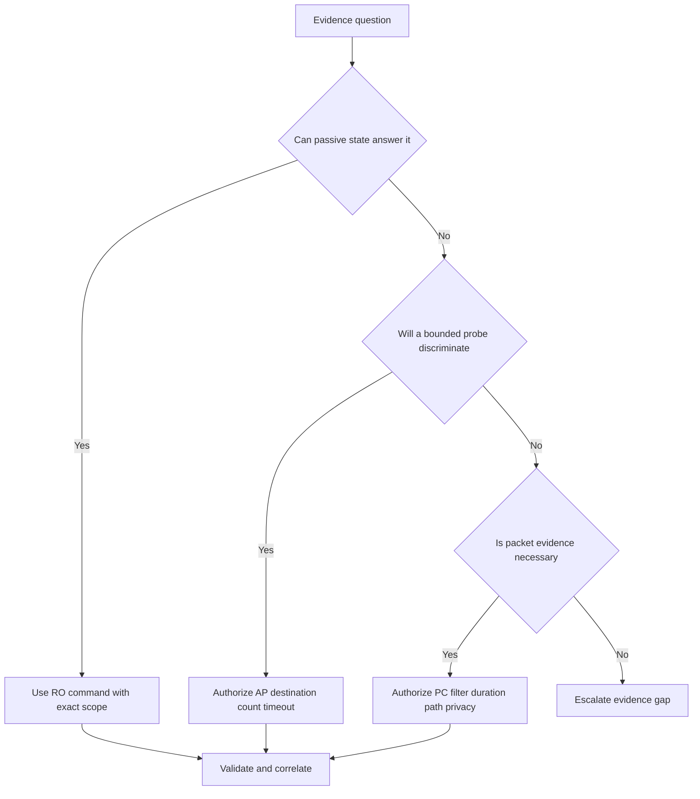

### Command-card fields required for every use

| Field | Example |
|---|---|
| Platform/tool | `Windows PowerShell <version>` |
| Command version | `<OS-build-or-package-version>` |
| Safety | `RO`, `AP`, `PC`, or `CHG` |
| Privilege | Standard user, Administrator, root, ESXi shell role, switch read-only role |
| Target/scope | `<host>`, `<interface>`, `<fqdn>`, `<port>`, `<device>` |
| Expected observation | The state/handshake/counter/timeline the command should expose |
| Interpretation | What result supports and what it cannot establish |
| Current verification | Official tool/OS/vendor documentation checked before use |
| Provenance | Operator, source, UTC, timezone, owner, confidence, validation, residual risk |

### Diagram D02 - Evidence timeline

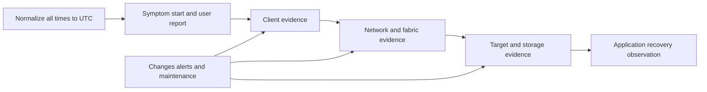

## 2. Windows evidence cards

**Platform:** supported Windows/Windows Server with current PowerShell and inbox tools. **Current verification:** Microsoft Learn and local `Get-Help -Full` or command help for the exact build.

| Command | Class / privilege | Placeholders | Expected observation | Interpretation and risk |
|---|---|---|---|---|
| `Get-Date -Format o` | RO / user | None | Local timestamp with offset | Correlation anchor; does not prove clock accuracy |
| `w32tm /query /status` | RO / user or policy-dependent | None | Time source, offset/status fields | Field meanings/build behavior need current docs |
| `Get-NetAdapter` | RO / user | Optional `-Name <adapter>` | Adapter admin/oper state, speed, MAC | Up does not prove path; identifiers are sensitive |
| `Get-NetAdapterStatistics -Name <adapter>` | RO / user | `<adapter>` | Interface counters | Compare deltas; cumulative errors need baseline |
| `Get-NetIPConfiguration` | RO / user | Optional interface alias | Addresses, gateway, DNS context | Does not prove reachability |
| `Get-NetIPAddress -InterfaceAlias <adapter>` | RO / user | `<adapter>` | Assigned addresses and state fields | Check duplicate/stale/source selection separately |
| `Get-NetRoute -AddressFamily <IPv4-or-IPv6>` | RO / user | Address family | Route table and metrics | Presence does not prove return path or firewall |
| `Resolve-DnsName <fqdn> -Type <record-type>` | AP / user | `<fqdn>`, `<A-or-AAAA-or-PTR>` | DNS response, server, TTL, error | Query can be logged; answer may differ by client/server |
| `Test-NetConnection <fqdn> -Port <tcp-port> -InformationLevel Detailed` | AP / user | `<fqdn>`, `<tcp-port>` | DNS/address, route/interface, TCP connect result | TCP success does not prove protocol login or I/O |
| `Get-SmbConnection` | RO / user; sensitive | Optional server/share filter | Client SMB connections, dialect, encryption/signing fields where exposed | A connection does not prove file authorization/performance |
| `Get-IscsiSession` | RO / user/admin depending build | None | iSCSI session identities/states | Does not prove every path or LUN health |
| `Get-IscsiConnection` | RO / user/admin depending build | None | Connection endpoints for sessions | Sensitive topology; correlate with MPIO |
| `Get-MPIOSetting` | RO / administrator commonly required | None | Host MPIO configuration fields | Does not prove device-specific policy correctness |
| `mpclaim -s -d` | RO / elevated command shell commonly required | None | Claimed multipath devices and paths | Verify syntax/build; do not use claim/change options |
| `Get-Disk` | RO / user/admin depending policy | Optional number | Disk identity, bus, health/oper state, size | OS health label is one evidence source |
| `Get-Partition -DiskNumber <number>` | RO / user/admin depending policy | `<number>` | Partition layout | Do not alter; device identity must be exact |
| `Get-Volume -DriveLetter <letter>` | RO / user | `<letter>` | Filesystem, size, health/status fields | Does not prove application consistency |

### Diagram D03 - Windows layered fault tree

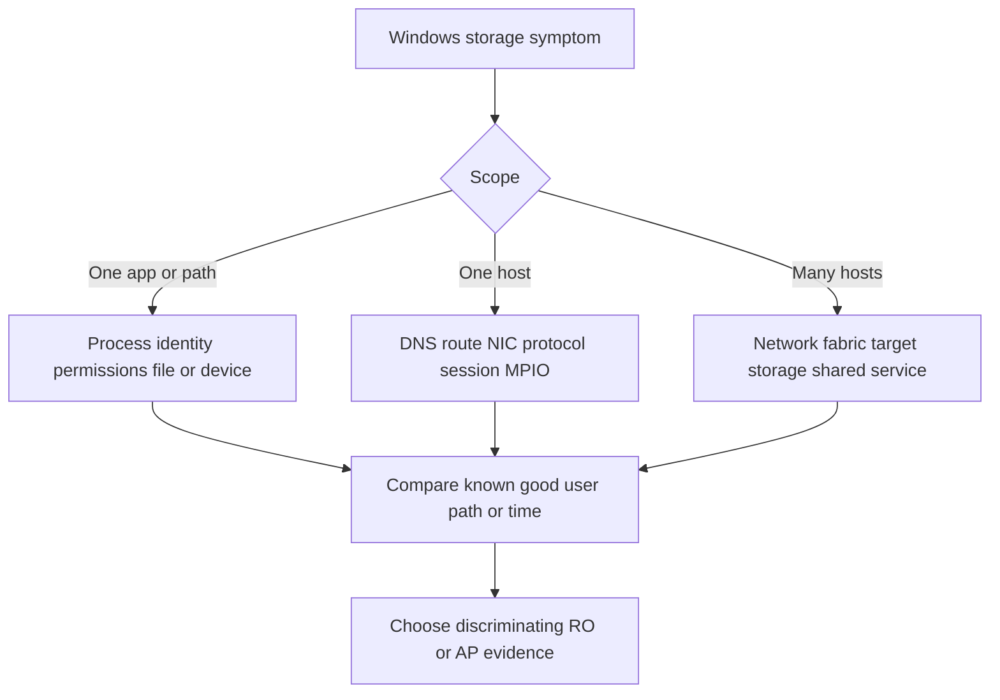

## 3. Linux evidence cards

**Platform:** approved Linux distribution. Commands may require packages such as `iproute2`, `bind-utils`/`dnsutils`, `nfs-utils`, `cifs-utils`, `open-iscsi`, `multipath-tools`, `lsscsi`, or `nvme-cli`. **Current verification:** distribution manual pages and package documentation.

| Command | Class / privilege | Placeholders | Expected observation | Interpretation and risk |
|---|---|---|---|---|
| `date --iso-8601=seconds` | RO / user | None | Timestamp and offset | Does not prove synchronization |
| `timedatectl status` | RO / user | None | Clock, timezone, sync service state | Tool/systemd dependent |
| `ip -details link show dev <interface>` | RO / user | `<interface>` | Link state, MTU, MAC, flags, counters where exposed | Link up does not prove VLAN or end path |
| `ip address show dev <interface>` | RO / user | `<interface>` | Addresses, prefixes, lifetimes | Sensitive; verify source address selection |
| `ip route show table all` | RO / user | None | IPv4 routes and policy tables | Large output; routing rules may also matter |
| `ip -6 route show table all` | RO / user | None | IPv6 routes | Does not include every policy decision alone |
| `resolvectl status` | RO / user where systemd-resolved exists | None | Per-link DNS configuration/cache context | Distribution/resolver-specific |
| `getent ahosts <fqdn>` | AP / user | `<fqdn>` | Name-service-stack address results | May query DNS and local sources; does not show all resolver detail |
| `ss -tan` | RO / user | Optional safe filter | TCP state and endpoint list | Endpoint data is sensitive; process mapping may require root |
| `ss -s` | RO / user | None | Socket summary | Aggregate only; no root cause |
| `ping -c <small-count> <approved-target>` | AP / user | Count, target | ICMP reachability/RTT/loss if permitted | ICMP may be blocked or deprioritized |
| `tracepath <approved-target>` | AP / user | Target | Path/PMTU hints where supported | Probes are visible and paths may vary |
| `findmnt --output TARGET,SOURCE,FSTYPE,OPTIONS` | RO / user | Optional target | Current mount source/type/options | Mount presence does not prove healthy I/O |
| `nfsstat -m` | RO / user | None | NFS mount versions/options/statistics where supported | Field availability/tool version varies |
| `mount -t nfs,nfs4` | RO / user | None | Current NFS mounts | Human display; prefer structured tools for parsing |
| `mount -t cifs` | RO / user | None | Current SMB/CIFS mounts | Options may expose sensitive names; redact |
| `iscsiadm -m session` | RO / root commonly required | None | iSCSI sessions/targets | Do not use logout/update modes |
| `multipath -ll` | RO / root commonly required | None | Multipath maps, path groups, states | Can be large; no flush/reconfigure operations |
| `lsblk -o NAME,KNAME,TYPE,SIZE,FSTYPE,MOUNTPOINTS,MODEL,SERIAL` | RO / user; sensitive IDs | None | Block-device hierarchy and filesystems | Redact serials; output columns depend on util-linux |
| `lsscsi -t` | RO / user/root depending system | None | SCSI transport mapping | Package-specific; not all devices exposed |
| `nvme list` | RO / root commonly required | None | NVMe devices and identifiers | Local NVMe and fabric namespaces need context |
| `nvme list-subsys` | RO / root commonly required | None | NVMe subsystems/controllers/paths | Verify nvme-cli version and transport fields |
| `df -hT <mountpoint>` | RO / user | `<mountpoint>` | Filesystem usage/type | Human rounding; not storage-array capacity truth |

### Diagram D04 - Linux path-to-device map

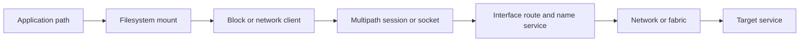

## 4. VMware ESXi evidence cards

**Platform:** VMware ESXi version authorized for shell/CLI access. **Privilege:** documented read-only role where possible; local shell access is highly controlled. **Current verification:** current Broadcom/VMware command reference and support guidance for the exact ESXi build.

| Command | Class / privilege | Placeholders | Expected observation | Interpretation and risk |
|---|---|---|---|---|
| `esxcli system version get` | RO / authorized ESXi CLI | None | ESXi version/build | Use IMT/current matrices for supportability |
| `esxcli system time get` | RO / authorized ESXi CLI | None | Host time | Does not prove NTP correctness |
| `esxcli network nic list` | RO / authorized ESXi CLI | None | Physical NIC state, speed, driver fields | Up does not prove vSwitch/VLAN path |
| `esxcli network ip interface list` | RO / authorized ESXi CLI | None | VMkernel interface state/config | Sensitive addresses; correlate with port groups |
| `esxcli network ip route ipv4 list` | RO / authorized ESXi CLI | None | IPv4 routes | Verify IPv6 separately where relevant |
| `esxcli storage core device list -d <naa-or-device-id>` | RO / authorized ESXi CLI | Device ID | Device identity/state/detail | Device IDs are sensitive; exact syntax varies |
| `esxcli storage core path list -d <naa-or-device-id>` | RO / authorized ESXi CLI | Device ID | Paths, adapters, targets, state | Does not prove failover behavior |
| `esxcli storage nmp device list -d <naa-or-device-id>` | RO / authorized ESXi CLI | Device ID | NMP policy/plugin detail where applicable | Protocol/plugin dependent |
| `esxcli iscsi session list` | RO / authorized ESXi CLI | None | iSCSI session endpoints | Does not prove LUN mapping or VM I/O |
| `esxcli storage san fc list` | RO / authorized ESXi CLI | None | FC HBA/link/WWPN fields | Redact WWPNs; fabric evidence still required |
| `esxcli nvme device list` | RO / authorized ESXi CLI | None | NVMe devices where supported | Command namespace/build support varies |
| `esxcli storage filesystem list` | RO / authorized ESXi CLI | None | Datastore/filesystem mounts and capacity | Datastore state is not application health |

### Diagram D05 - VMware storage isolation

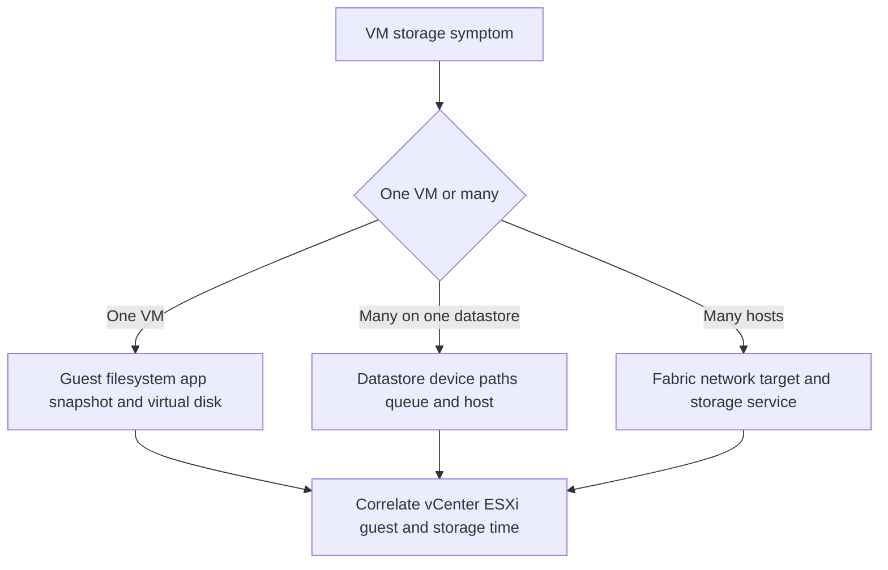

## 5. DNS, IP, routes, TCP, TLS, and MTU

### Diagram D06 - DNS fault flow

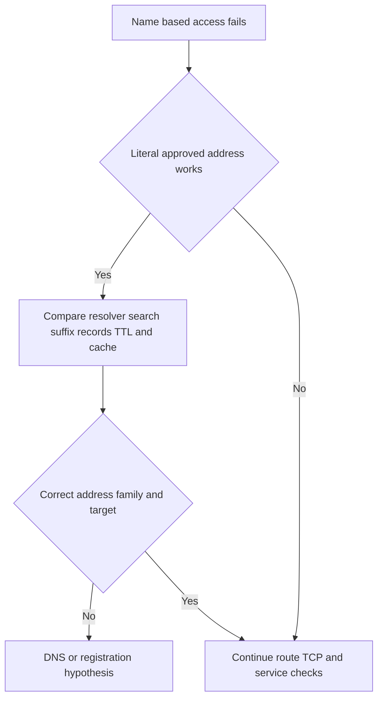

**Expected evidence:** Query name, type, resolver, returned records, TTL, error, client search context, UTC. **Boundary:** A correct record does not prove the endpoint is listening.

### Diagram D07 - Route selection flow

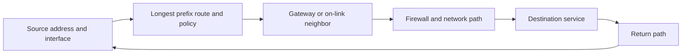

**Expected evidence:** Source/destination, selected route/interface, gateway, policy table, return-path owner. **Boundary:** A local route entry does not prove remote return routing.

### Diagram D08 - TCP fault sequence

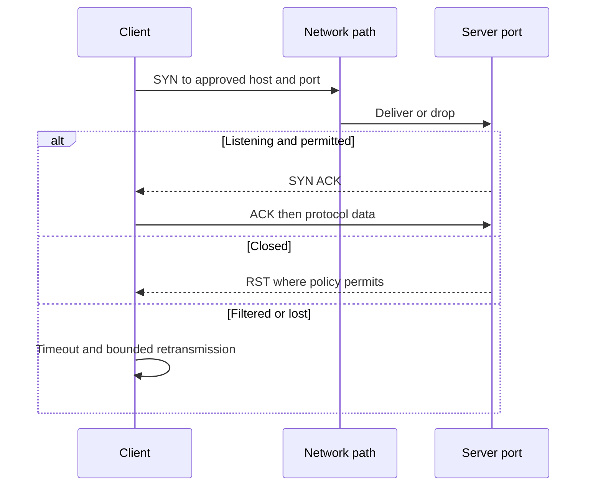

**Interpretation:** RST, timeout, and successful handshake discriminate different branches; none alone proves application authentication or storage I/O.

### Diagram D09 - TLS handshake evidence

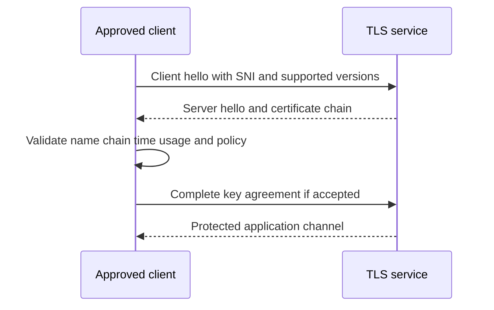

| Platform | Bounded AP example | Privilege | Expected observation | Current check |
|---|---|---|---|---|
| Linux/OpenSSL | `openssl s_client -connect <fqdn>:<port> -servername <fqdn> -brief` | User | Negotiated protocol/cipher and certificate summary where supported | OpenSSL version docs; do not send secrets |
| Cross-platform curl | `curl --head --connect-timeout <seconds> --max-time <seconds> --cacert <approved-ca> https://<fqdn>:<port>/` | User | TLS validation and HTTP response headers | curl docs and authorization; HEAD support varies |
| Windows | `Test-NetConnection <fqdn> -Port <port>` | User | TCP only | Does not validate TLS; use approved TLS tooling separately |

### Diagram D10 - MTU and PMTU fault tree

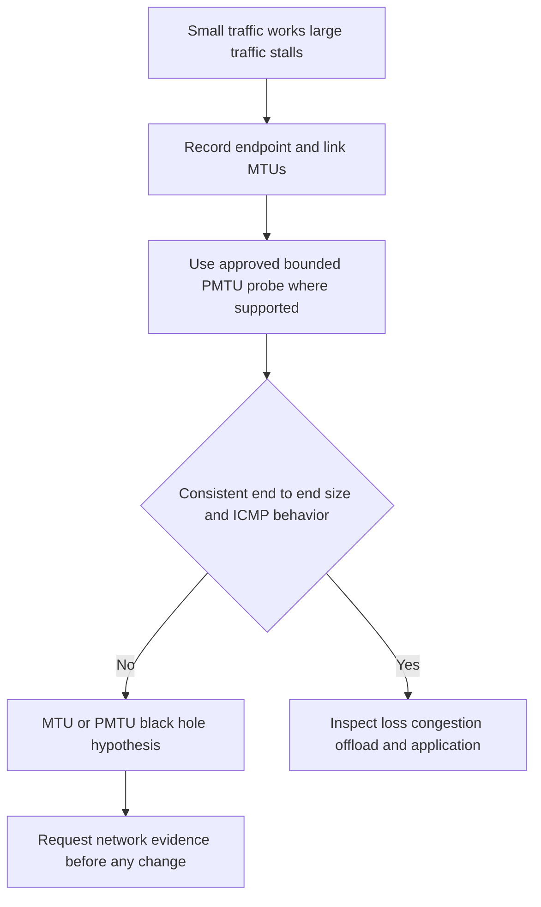

**Safe probes:** `tracepath <approved-target>` on Linux where available; platform-approved ping size tests only with small count and current syntax. **Do not** change MTU during diagnosis without change control.

## 6. Packet capture and timeline

### Diagram D11 - Packet timeline

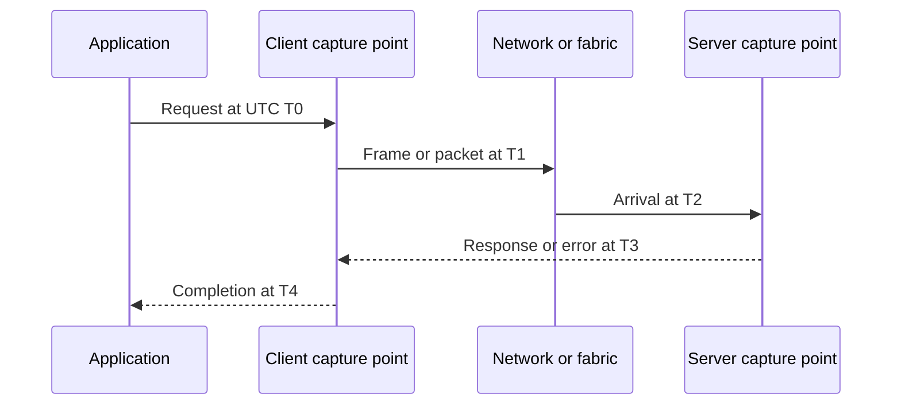

**Measure carefully:** $T2-T1$ is not one-way network delay unless clocks are synchronized. A single-sided capture can reliably show local inter-packet timing but not every remote processing interval.

### Diagram D12 - Capture authorization flow

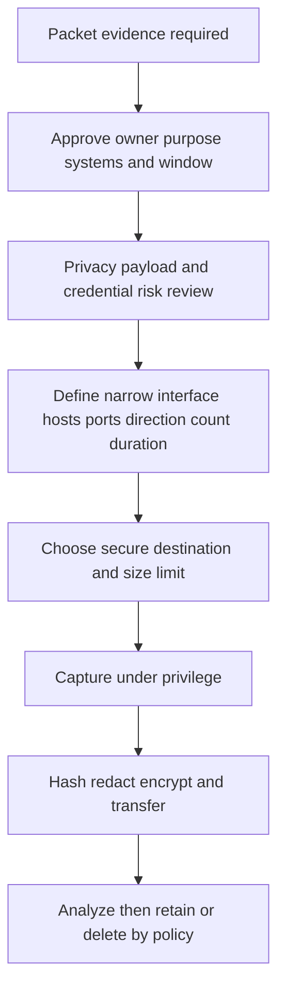

| Platform | PC example | Privilege | Boundary/current verification |
|---|---|---|---|
| Linux | `tcpdump -i <interface> -s <approved-snaplen> -c <packet-count> -w <approved-path> '<narrow-approved-filter>'` | root/capture capability | Verify tcpdump/libpcap syntax; bounded count/filter; payload may be sensitive |
| Windows | `pktmon` bounded capture workflow using current Microsoft documentation | Administrator | Exact start/filter/stop/convert syntax intentionally omitted; capture state is controlled activity |
| ESXi | `pktcap-uw` bounded capture workflow under current support guidance | Highly privileged | Exact syntax intentionally omitted; production ESXi capture needs VMware guidance |
| Switch | Vendor-supported SPAN/mirror capture | Network administrator | A change to switching state; formal approval and capacity review required |

**Display filters are analysis aids, not capture authorization:** examples include `dns`, `tcp.port == <port>`, `nfs`, `smb2`, `iscsi`, and `tls`; verify analyzer syntax/version and avoid asserting payload visibility when encrypted.

## 7. NFS and SMB

### Diagram D13 - NFS fault tree

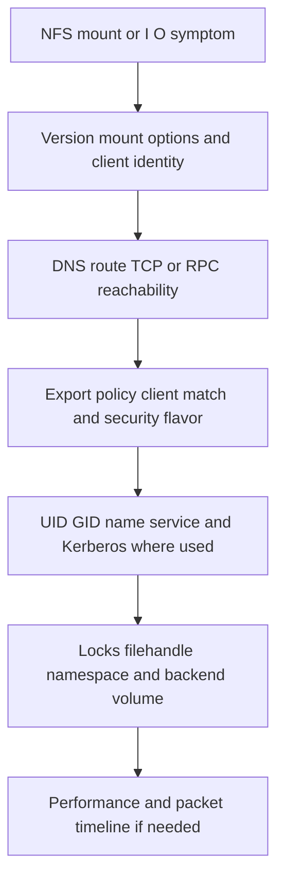

| Platform | Command | Class / privilege | Expected observation | Limit |
|---|---|---|---|---|
| Linux | `findmnt -t nfs,nfs4` | RO / user | NFS sources, targets, options | Mounted does not mean healthy |
| Linux | `nfsstat -m` | RO / user | Negotiated/mount details where supported | Tool/version dependent |
| Linux | `rpcinfo -p <approved-server>` | AP / user | RPC program registration for relevant versions | Generates queries; NFSv4 analysis differs |
| Linux | `stat <approved-test-path>` | AP / user | Metadata lookup under current permissions | Can block and creates access logs; no writes |

### Diagram D14 - SMB fault tree

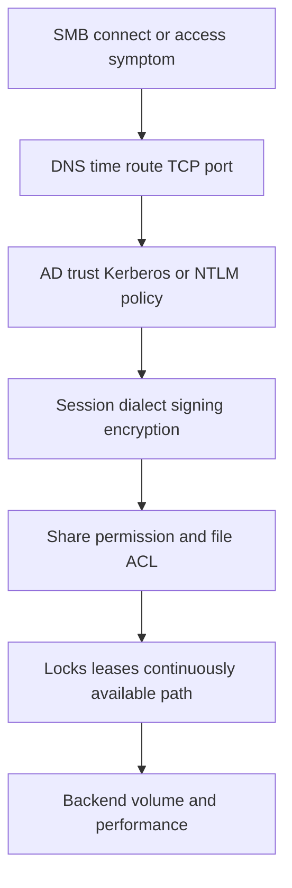

| Platform | Command | Class / privilege | Expected observation | Limit |
|---|---|---|---|---|
| Windows | `Get-SmbConnection` | RO / user | Existing client connections and documented security/dialect fields | No connection does not identify why |
| Windows server | `Get-SmbSession` | RO / administrator/server role; sensitive | Server-side sessions where applicable | Do not collect unrelated users |
| Linux | `mount -t cifs` | RO / user | Current CIFS mount sources/options | Redact identities and paths |
| Linux Samba server | `smbstatus` | RO / root or service privilege | Sessions/locks on a Samba server | Not an ONTAP command; server-specific |

## 8. iSCSI, FC, NVMe, and MPIO

### Diagram D15 - iSCSI layered fault tree

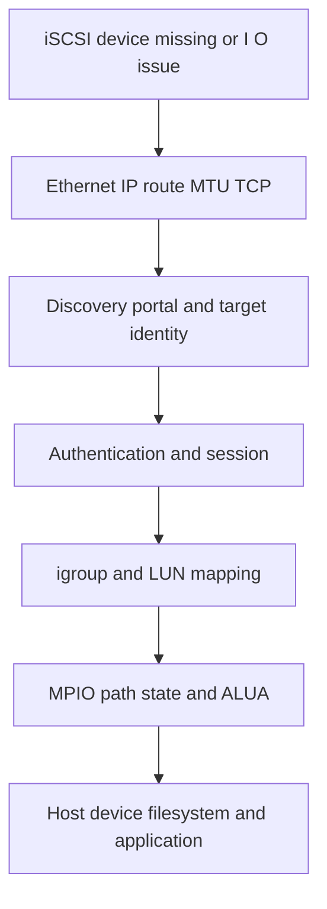

**Evidence:** target IQN, initiator IQN, source/target IP, session/connection states, exact LUN/device IDs, path policy/state, UTC, changes. **Privacy:** treat all identifiers and topology as sensitive.

### Diagram D16 - Fibre Channel layered fault tree

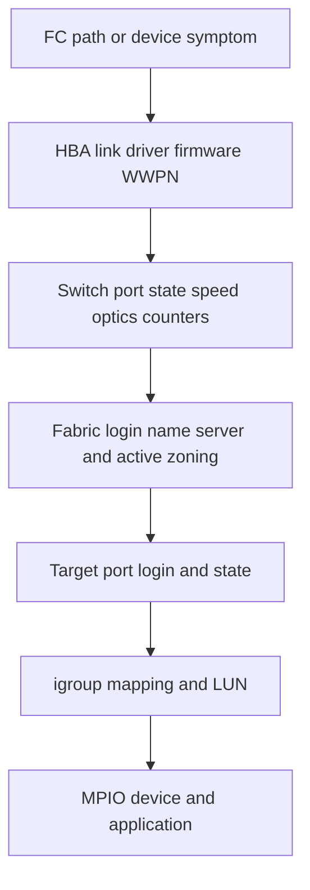

**Boundary:** Host link up is not proof of fabric login, zoning, target visibility, mapping, or usable I/O.

### Diagram D17 - NVMe fault tree

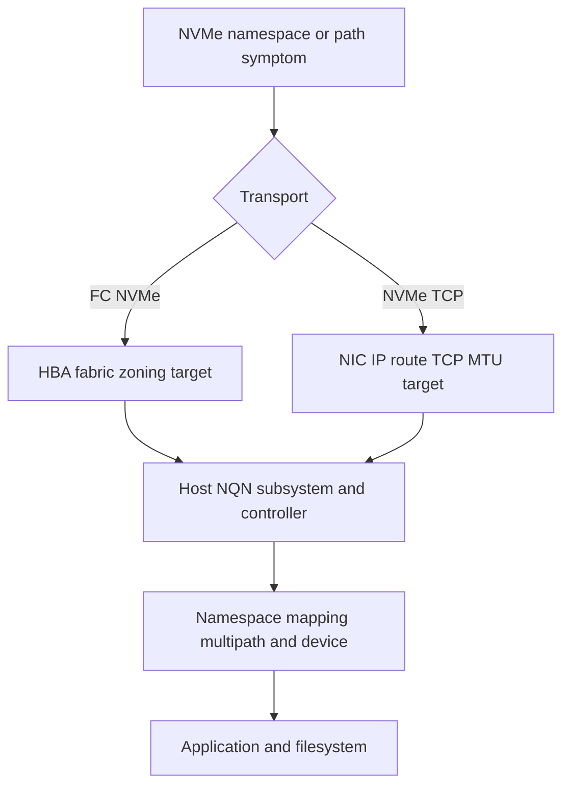

**Current verification:** NVMe host tools and ONTAP/IMT support are fast-moving; record exact OS, initiator, adapter, driver, firmware, transport, ONTAP, and topology.

### Diagram D18 - MPIO path comparison

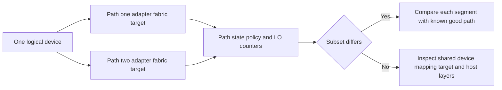

| Platform | Read command | Expected observation | Prohibited companion actions |
|---|---|---|---|
| Windows | `mpclaim -s -d`, `Get-IscsiSession`, `Get-IscsiConnection` | Claimed devices/sessions/connections | Do not claim/unclaim, disconnect, or restart services here |
| Linux | `multipath -ll`, `iscsiadm -m session`, `lsscsi -t` | Maps, path groups, sessions, transports | Do not flush/reload/logout here |
| ESXi | `esxcli storage core path list -d <device>`, `esxcli storage nmp device list -d <device>` | Path states and policy/plugin detail | Do not disable paths or alter policy here |

## 9. Device, filesystem, and time correlation

### Diagram D19 - Device identity chain

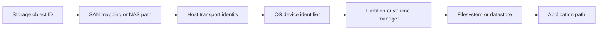

**Rule:** Never act on `/dev/<name>`, disk number, drive letter, or datastore label alone. Reconcile stable IDs across layers.

### Diagram D20 - Filesystem scope fault tree

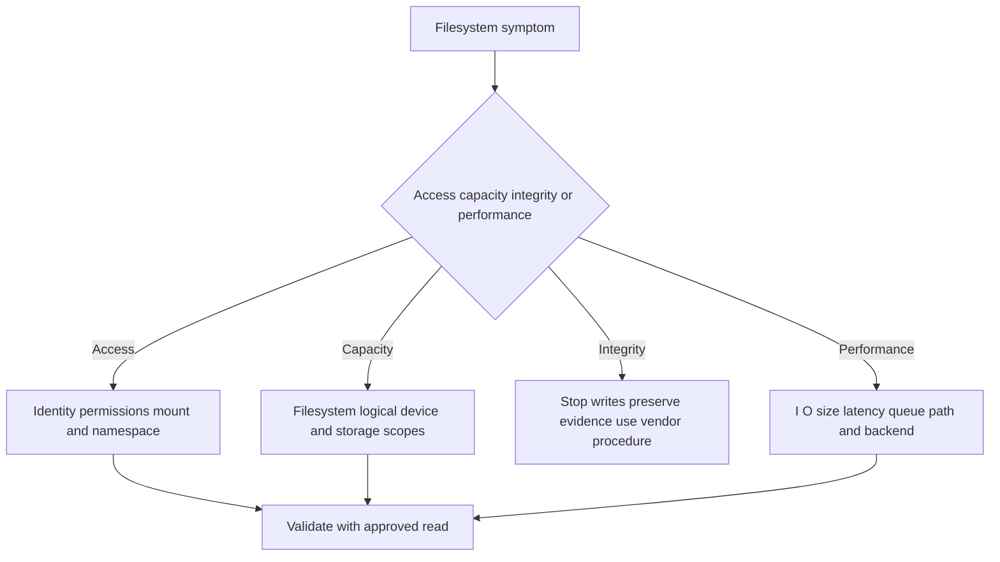

**No repair commands are included.** Suspected corruption is an escalation and data-protection event, not an invitation to run a generic repair.

### Diagram D21 - Clock correlation fault tree

```mermaid
flowchart TD
    D21E[Events appear out of order] --> D21T[Capture UTC local time offset and time source]
    D21T --> D21D[Estimate drift between sources]
    D21D --> D21C[Correlate stable request session job or object IDs]
    D21C --> D21R{Ordering now coherent}
    D21R -->|Yes| D21H[Build bounded timeline]
    D21R -->|No| D21U[Mark uncertainty and obtain stronger evidence]
```

| Platform | RO command | Expected observation |
|---|---|---|
| Windows | `Get-Date -Format o`; `w32tm /query /status` | Local timestamp/offset and time-service status |
| Linux | `date --iso-8601=seconds`; `timedatectl status` | Timestamp/offset and synchronization context |
| ESXi | `esxcli system time get` | Host time; pair with current NTP evidence through approved tools |
| Network/fabric | Vendor read-only clock/NTP/status evidence request | Device time, timezone, source, offset/status where available |

## 10. Switch-neutral evidence requests

### Diagram D22 - Ethernet switch evidence map

```mermaid
flowchart TD
    D22P[Exact switch and port] --> D22S[Admin oper speed duplex optics]
    D22P --> D22V[VLAN trunk native tag and MAC learning]
    D22P --> D22L[LACP member and partner state]
    D22P --> D22M[MTU and interface counters before after]
    D22P --> D22Q[QoS pause congestion drops buffers]
    D22P --> D22T[Time config changes and logs]
    D22S --> D22E[Read-only evidence bundle]
    D22V --> D22E
    D22L --> D22E
    D22M --> D22E
    D22Q --> D22E
    D22T --> D22E
```

### Ethernet request template

- Owner/source/date: `<network-owner> / <switch-source> / <UTC>`
- Exact switch/stack and ports: `<switch-id>`, `<port-list>`
- Admin/oper state, negotiated speed/duplex, transceiver type/DOM alarms where supported.
- VLAN/access/trunk/native configuration, allowed VLANs, MAC learning, ARP/ND evidence for exact endpoints.
- LACP group/member/partner state and hashing policy description.
- MTU at relevant interfaces and routed boundaries.
- Counters at two timestamps: frames/bytes, CRC/FCS, discards, drops, pause, errors, flaps, congestion/buffer indicators where available.
- Relevant route/VRF/firewall/ACL path evidence without unrelated configuration.
- Device clock/NTP, logs, and changes for the incident window.
- Confidence/validation/residual risk: `<values>`.

### Diagram D23 - Fibre Channel switch evidence map

```mermaid
flowchart TD
    D23P[Exact fabric switch and port] --> D23L[Link state speed SFP and errors]
    D23P --> D23F[Fabric membership domain and principal context]
    D23P --> D23N[Name server logins for exact WWPNs]
    D23P --> D23Z[Defined and active zone membership]
    D23P --> D23C[Credit congestion discard and timeout evidence]
    D23P --> D23T[Clock logs and changes]
    D23L --> D23E[Read-only fabric bundle]
    D23F --> D23E
    D23N --> D23E
    D23Z --> D23E
    D23C --> D23E
    D23T --> D23E
```

### FC request template

- Exact fabrics, switches, ports, host/target WWPNs, aliases, and collection UTC.
- Port admin/oper state, negotiated speed, SFP/optic health, loss-of-signal/sync, encoding/CRC/discard counters and deltas.
- Fabric login/name-server records for the exact host and target identities.
- Defined zoning and active effective zoning for only the relevant members.
- Credit, congestion, timeout, slow-drain, and buffer evidence where the platform exposes it.
- ISL/path state and redundancy for the affected route.
- Clock/NTP, relevant logs, and changes.
- No zone activation, port bounce, speed change, or counter clear as part of initial evidence.

## 11. Escalation bundle and stop criteria

### Diagram D24 - Escalation package flow

```mermaid
flowchart TD
    D24S[Symptom impact and exact scope] --> D24T[UTC timeline and changes]
    D24T --> D24M[Topology identities versions and support context]
    D24M --> D24E[RO AP and PC evidence with provenance]
    D24E --> D24H[Hypotheses tests results and known good comparison]
    D24H --> D24R[Mitigation current state and residual risk]
    D24R --> D24A[Exact escalation ask and secure artifact references]
```

### Minimum escalation bundle

| Section | Required content |
|---|---|
| Impact | Affected service/users/sites, start UTC, business effect, severity basis |
| Scope | One user, host, path, VLAN, fabric, SVM, volume, LUN, site, or broad set |
| Environment | OS/build, hypervisor, protocol/version, adapters/drivers/firmware, ONTAP release, topology |
| Identity map | Client/host, source/target IP, FQDN, interface, IQN/WWPN/NQN, LUN/device/path IDs, sanitized |
| Timeline | Symptoms, alerts, changes, commands/probes/captures, mitigation, recovery, all normalized |
| Evidence | Raw redacted outputs, capture hashes, filters, tool versions, source, collector, cutoff |
| Hypotheses | Competing explanations, supporting/conflicting evidence, discriminating next test |
| Safety | Actions not attempted and why; authorization/change boundaries |
| Ask | Exact expertise/decision/evidence needed and urgency |
| Quality | Owner, source, date, confidence, validation, residual risk |

### Stop and escalate immediately when

- Device identity is ambiguous or a command could target the wrong disk, path, host, SVM, or customer.
- Data corruption, unexpected write behavior, security compromise, credential exposure, or privacy breach is suspected.
- Evidence requires service restart, reset, disconnect, path disable, zone/route/MTU change, repair, or production packet mirroring.
- A capture may contain credentials, regulated content, or unrelated tenant/customer traffic.
- The platform/tool/version is unsupported, command semantics are uncertain, or current documentation conflicts with memory.
- The system is degraded and remaining redundancy is unclear.

## Completion and use checklist

- [x] Windows, Linux, VMware ESXi, IP network, Ethernet switch, and FC fabric evidence are covered.
- [x] DNS, IP, routes, TCP, TLS, MTU, packet capture, NFS, SMB, iSCSI, FC, NVMe, MPIO, device, filesystem, and time are covered.
- [x] 24 numbered Mermaid flow/sequence/fault diagrams exceed the required 20.
- [x] RO, AP, PC, and CHG classes are visibly separated.
- [x] Commands identify platform, privilege, placeholders, expected observation, interpretation/risk, and current verification context.
- [x] Switch evidence is vendor-neutral and requests deltas, time, identity, and configuration context.
- [x] No destructive reset, restart, session-kill/logout, path disable, repair, or configuration-change command is provided.
- [x] Privacy, capture, access, synthetic-evidence, and secure-escalation boundaries are explicit.
- [ ] Before use, confirm current command syntax and package/tool availability on the exact platform.
- [ ] After use, attach owner/source/date/confidence/validation/residual risk and apply approved retention.

---

*Navigation:* Previous: [Appendix C - ONTAP CLI, System Manager, REST, PowerShell, and Python Quick Reference](Appendix-C-ontap-admin-automation-reference.md) | Next: [Appendix E - Official NetApp Source Map and Currency Tracker](Appendix-E-official-netapp-source-map.md) | [Master guide](../NetApp%20TAM%20Technical%20Analyst%20-%20Complete%20Study%20Guide.md)