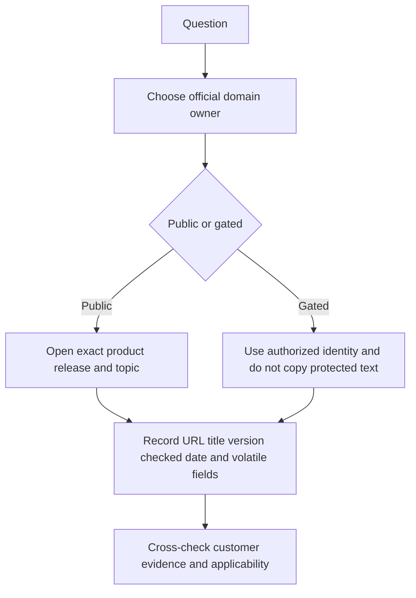
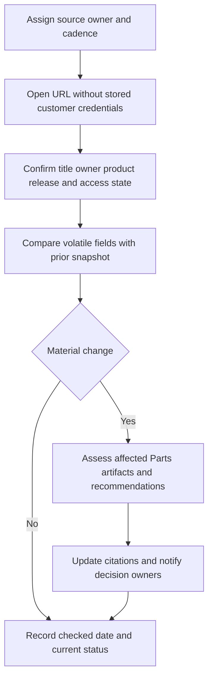
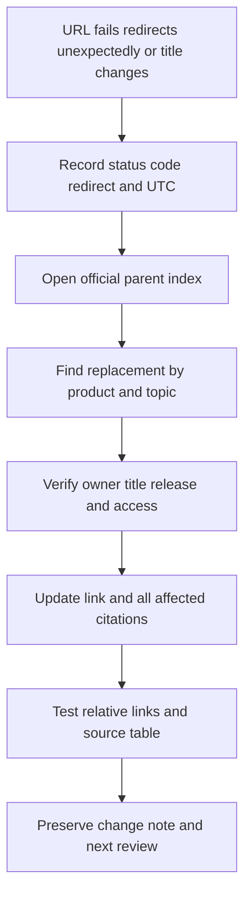

# Appendix E - Official NetApp Source Map and Currency Tracker

> **Purpose:** Find the right authoritative entry point, understand its access and volatility, and preserve a dated source trail for TAM analysis, troubleshooting, supportability, lifecycle, cloud, standards, and interview preparation.
>
> **How to use:** Start with the domain table, open the exact source, confirm product/release/scope, record the evidence date and access state, and recheck volatile facts immediately before a customer decision.
>
> **Guide reference date:** 2026-08-24  
> **Live reachability recheck performed:** 2026-08-25

## Scope, copyright, access, and evidence boundaries

- This appendix links to official public entry points. It does not reproduce gated text, licensed standards, exam content, internal NetApp methods, customer data, credentials, or support-tool output.
- `Verified public` means the page content was retrieved during the live recheck. It does not guarantee future reachability, completeness, entitlement, regional availability, or applicability.
- `Verified gated` means the entry URL redirected to sign-in or exposed only a public shell. No claim is made about protected content.
- `Checked 403` means the selected official page rejected automated retrieval; it may still be available through a normal browser or membership path.
- Product versions, lifecycle dates, recommended releases, compatibility results, limits, feature availability, certification paths, URLs, and branding are volatile. Recheck them at decision time.
- Use a named owner, secure evidence store, approved retention, and customer authorization. Store a citation or redacted reference, not copied protected content.
- Primary guide context: [Parts 47-55](Part-47-autosupport-architecture-delivery.md), [Part 89](Part-89-cloud-hybrid-data-services.md), [Part 92](Part-92-itil-sre-support-operations.md), and [Part 94](Part-94-ncda-specialization-standards-trends.md).

## Status legend

| Status | Meaning | Safe claim |
|---|---|---|
| Verified public | Content was fetched from the listed destination | `Public entry retrieved on 2026-08-25` |
| Verified redirect | Entry redirected and the destination was separately fetched | `Redirect and destination retrieved` |
| Verified gated | Redirected to sign-in or protected content was not available | `Official entry exists; content requires authorization` |
| Public shell only | Landing chrome appeared without protected domain content | `Entry checked; no gated facts copied or inferred` |
| Checked broken | Page explicitly reported missing/broken | `Do not use; find current entry from an official index` |
| Checked 403 | Automated retrieval returned HTTP 403 | `Reachability not established by this check` |

## 1. NetApp public documentation and support entry points

**Owner codes:** `<NetApp-doc-owner>`, `<supportability-owner>`, `<security-owner>`, `<cloud-owner>`, and `<learning-owner>` are roles to assign, not people.

| ID | Official URL | Purpose | Access / live status | Volatile fields | Parts | Checked / cadence | Owner / tracker status |
|---|---|---|---|---|---|---|---|
| N01 | [NetApp product documentation](https://docs.netapp.com/) | Product-family directory and current documentation entry | Verified public | Families, names, featured products, destination paths | 19-55, 87-90 | 2026-08-25 / monthly | `<NetApp-doc-owner>` / Current |
| N02 | [NetApp documentation legacy entry](https://www.netapp.com/support-and-training/documentation/) | Legacy/documentation marketing entry that resolves to docs | Verified redirect to N01 | Redirect and branding | 19, 53 | 2026-08-25 / quarterly | `<NetApp-doc-owner>` / Redirect tracked |
| N03 | [NetApp Knowledge Base](https://kb.netapp.com/) | Search public/support articles by product and topic | Verified public; some articles/bulletins require sign-in | Article revision, scope, access, workaround | 47, 52, 71-79 | 2026-08-25 / per case | `<supportability-owner>` / Current |
| N04 | [NetApp Support Site](https://mysupport.netapp.com/) | Support dashboard, cases, downloads, entitlement-based tools | Verified gated; redirects to NetApp sign-in | Entitlement, cases, downloads, account scope | 47-55, 73 | 2026-08-25 / per use | `<supportability-owner>` / Gated |
| N05 | [AutoSupport in Digital Advisor](https://docs.netapp.com/us-en/active-iq/concept_autosupport.html) | Public AutoSupport concept and related product links | Verified public | Freshness rule, product links, delivery/privacy statements | 47-48 | 2026-08-25 / quarterly | `<NetApp-doc-owner>` / Current |
| N06 | [Digital Advisor documentation](https://docs.netapp.com/us-en/active-iq/) | Public concepts, workflows, and release notes | Verified public; portal data still authorized | Features, names, access, freshness, release notes | 48, 54 | 2026-08-25 / monthly | `<supportability-owner>` / Current |
| N07 | [Interoperability Matrix Tool](https://imt.netapp.com/) | Validate supported solution component combinations | Verified gated; redirected to sign-in | Every selected component/version/note/result | 50, 54-55, 87-90 | 2026-08-25 / every decision | `<supportability-owner>` / Gated |
| N08 | [Hardware Universe](https://hwu.netapp.com/) | Platform specifications, supported components, limits, configuration rules | Verified gated; redirected to sign-in | Platform, ONTAP release, adapters, drives, limits | 26, 51, 53-55 | 2026-08-25 / every decision | `<supportability-owner>` / Gated |
| N09 | [Bugs Online](https://mysupport.netapp.com/site/bugs-online) | Authorized defect search entry | Public shell only; protected facts not retrieved | Defect state, affected/fixed releases, access | 52, 79, 90 | 2026-08-25 / every scrub | `<supportability-owner>` / Gated content |
| N10 | [ONTAP release highlights](https://docs.netapp.com/us-en/ontap/release-notes/index.html) | Public highlights and links by recent ONTAP release | Verified public | Current release list, features, defaults/limits links | 19-55, 94 | 2026-08-25 / monthly | `<NetApp-doc-owner>` / Current |
| N11 | [Complete ONTAP release-notes entry](https://library.netapp.com/ecm/ecm_download_file/ECMLP2492508) | Complete known issues, limitations, and cautions entry referenced by public docs | Verified gated; redirected to sign-in | Known issues, cautions, versions, revisions | 52, 54, 79, 90 | 2026-08-25 / every upgrade | `<supportability-owner>` / Gated |
| N12 | [Software Version Support](https://mysupport.netapp.com/site/info/version-support) | Public policy definitions and version lifecycle tables | Verified public | Support state, dates, policy, product/version rows | 53-55, 89-90 | 2026-08-25 / monthly and pre-review | `<supportability-owner>` / Current |
| N13 | [ONTAP upgrade documentation](https://docs.netapp.com/us-en/ontap/upgrade/index.html) | Current upgrade planning, prechecks, methods, and validation entry | Verified public | Paths, tools, prerequisites, procedures, warnings | 54-55, 79, 90 | 2026-08-25 / every upgrade | `<supportability-owner>` / Current |
| N14 | [ONTAP CLI reference](https://docs.netapp.com/us-en/ontap-cli/) | Versioned public command manual pages | Verified public; fetched page identified ONTAP 9.19.1 | Reference version, commands, parameters, privilege | 24-31, Appendix C | 2026-08-25 / every command | `<NetApp-doc-owner>` / Version-bound |
| N15 | [ONTAP REST API reference](https://docs.netapp.com/us-en/ontap-restapi/) | Versioned endpoints, parameters, responses, and schema | Verified public; fetched page identified ONTAP 9.19.1 | API version, endpoints, fields, examples | 24, 56, Appendix C | 2026-08-25 / every automation change | `<NetApp-doc-owner>` / Version-bound |
| N16 | [ONTAP NAS management](https://docs.netapp.com/us-en/ontap/nas-management/index.html) | NFS, SMB, namespace, identity, and NAS workflow directory | Verified public | Protocol support, workflows, version behavior | 15-16, 27-29, 74 | 2026-08-25 / per design | `<NetApp-doc-owner>` / Current |
| N17 | [ONTAP SAN management](https://docs.netapp.com/us-en/ontap/san-management/index.html) | LUN, namespace, iSCSI, FC, NVMe, host and SAN workflows | Verified public | Protocol support, host guidance, topology, limits | 17-18, 30-31, 75 | 2026-08-25 / per design | `<NetApp-doc-owner>` / Current |
| N18 | [ONTAP data protection and DR](https://docs.netapp.com/us-en/ontap/data-protection-disaster-recovery/index.html) | Snapshot, SnapMirror, peering, MetroCluster, SnapLock, backup directory | Verified public | Capabilities, procedures, policies, version support | 35-39, 78, 86 | 2026-08-25 / per design/change | `<NetApp-doc-owner>` / Current |
| N19 | [ONTAP security and encryption](https://docs.netapp.com/us-en/ontap/security-encryption/index.html) | ARP, auditing, encryption, antivirus, access-security directory | Verified public | Feature support, prerequisites, procedures, advisories | 39-42 | 2026-08-25 / monthly and pre-change | `<security-owner>` / Current |
| N20 | [ONTAP event, performance, and health](https://docs.netapp.com/us-en/ontap/event-performance-monitoring/index.html) | Performance, QoS, EMS, audit, AutoSupport, health directory | Verified public | Counters, features, workflows, tool links | 25, 43-48, 76 | 2026-08-25 / per analysis | `<NetApp-doc-owner>` / Current |
| N21 | [NetApp Product Security](https://security.netapp.com/) | Security advisories, bulletins, policy, and resources | Verified public | Advisories, affected products, remediation, revisions | 40-42, 90 | 2026-08-25 / weekly and on alert | `<security-owner>` / Current |
| N22 | [StorageGRID documentation](https://docs.netapp.com/us-en/storagegrid/) | StorageGRID concepts, administration, upgrade, monitoring, recovery | Verified public; fetched page identified version 12.1 | Version, appliance, upgrade, limitations, API behavior | 19, 33, 37, 53, 89 | 2026-08-25 / monthly | `<NetApp-doc-owner>` / Version-bound |
| N23 | [E-Series systems documentation](https://docs.netapp.com/us-en/e-series/) | E-Series/SANtricity systems, software, CLI, maintenance, releases | Verified public | Models, SANtricity version, procedures, lifecycle | 19, 26, 53, 75 | 2026-08-25 / monthly | `<NetApp-doc-owner>` / Current |
| N24 | [NetApp Console documentation](https://docs.netapp.com/us-en/bluexp-family/) | Current Console, data services, storage management, health, API directory | Verified public; legacy path displayed current NetApp Console naming | Branding, services, access, features, regions | 37, 48, 54, 89 | 2026-08-25 / monthly | `<cloud-owner>` / Redirect-compatible |
| N25 | [Cloud Volumes ONTAP documentation](https://docs.netapp.com/us-en/storage-management-cloud-volumes-ontap/) | Current CVO concepts, provider configuration, versions, upgrades, operations | Verified public | Provider, region, version, licensing, limits, defaults | 19, 53-55, 89 | 2026-08-25 / monthly and pre-design | `<cloud-owner>` / Current |
| N26 | [ONTAP tools for VMware vSphere](https://docs.netapp.com/us-en/ontap-tools-vmware-vsphere/) | Integration, deployment, datastore management, protection, release notes | Verified public; fetched page displayed version 9.13 | Tool/vSphere/ONTAP versions, support, procedures | 55, 87 | 2026-08-25 / pre-design/upgrade | `<supportability-owner>` / Version-bound |
| N27 | [Trident documentation](https://docs.netapp.com/us-en/trident/) | Kubernetes CSI provisioning/orchestration, requirements, operations, support | Verified public; fetched page displayed version 26.06 | Trident/Kubernetes/backend versions and requirements | 55, 88 | 2026-08-25 / monthly and pre-upgrade | `<cloud-owner>` / Version-bound |
| N28 | [NetApp certification paths](https://www.netapp.com/support-and-training/netapp-learning-services/certifications/) | Current public certification path and policy entry | Verified public | Names, exams, prerequisites, provider/login, policies | 94, 96 | 2026-08-25 / monthly during planning | `<learning-owner>` / Current |
| N29 | [NetApp Console software updates](https://docs.netapp.com/us-en/console-software-updates/) | Public software-update assessment/planning workflow documentation | Verified public | Prerequisites, supported targets, blockers, workflows | 54, 79, 90 | 2026-08-25 / every upgrade | `<supportability-owner>` / Current |
| N30 | [NetApp Console lifecycle planning](https://docs.netapp.com/us-en/console-lifecycle-planning/) | Public capacity/lifecycle planning feature documentation | Verified public | Scope, recommendations, prerequisites, release behavior | 45, 53, 90 | 2026-08-25 / monthly | `<supportability-owner>` / Current |

## 2. Standards, operating systems, virtualization, Kubernetes, and cloud providers

| ID | Official URL | Purpose | Access / live status | Volatile fields | Parts | Checked / cadence | Owner / tracker status |
|---|---|---|---|---|---|---|---|
| X01 | [IETF standards process](https://www.ietf.org/standards/) | RFC/Internet standards process and protocol-document entry | Verified public | RFC status, updates, errata, working-group output | 11, 13, 15, 17 | 2026-08-25 / per protocol claim | `<standards-owner>` / Current |
| X02 | [IEEE Standards Association](https://standards.ieee.org/) | IEEE standards catalog/process, including networking families | Verified public landing; many full standards may require purchase/access | Edition, amendment, active/superseded state, access | 11-12, 18 | 2026-08-25 / per standard claim | `<standards-owner>` / Public landing |
| X03 | [SNIA What Is Storage](https://www.snia.org/education/what-is-storage) | SNIA storage-education entry selected for terminology | Checked 403; content reachability not established | Page/access, definitions, publication revision | 4-10, 14, 94 | 2026-08-25 / quarterly | `<standards-owner>` / Recheck manually |
| X04 | [NVM Express specifications](https://nvmexpress.org/specifications/) | NVMe base, command-set, transport, boot, and management specification entry | Verified public | Revision, ECNs, archived/current status, transport docs | 5, 18, 31 | 2026-08-25 / per NVMe claim | `<standards-owner>` / Current |
| X05 | [Windows Server Storage](https://learn.microsoft.com/en-us/windows-server/storage/) | Microsoft storage, SMB, NFS, iSCSI, filesystems, Windows server entry | Verified public | Windows version/build, feature docs, older-page state | 7, 16-17, 55, 75, Appendix D | 2026-08-25 / per platform decision | `<host-owner>` / Current |
| X06 | [Broadcom VMware technical documentation](https://techdocs.broadcom.com/us/en/vmware-cis.html) | VMware/vSphere/VCF product documentation directory | Verified public landing; login exists for some resources | Product version/build, last-updated date, support state | 55, 87 | 2026-08-25 / pre-design/upgrade | `<virtualization-owner>` / Current |
| X07 | [Kubernetes documentation](https://kubernetes.io/docs/home/) | Kubernetes concepts, setup, tasks, API, kubectl, supported documentation versions | Verified public | Kubernetes version, API, feature gates, supported docs window | 88, 94 | 2026-08-25 / monthly and pre-design | `<container-owner>` / Current |
| X08 | [AWS FSx for NetApp ONTAP](https://docs.aws.amazon.com/fsx/latest/ONTAPGuide/what-is-fsx-ontap.html) | Provider-owned managed-service architecture and operation entry | Verified public | Regions, features, limits, protocols, pricing, responsibility | 19, 89 | 2026-08-25 / pre-design and monthly | `<cloud-owner>` / Current |
| X09 | [AWS documentation](https://docs.aws.amazon.com/) | Provider-wide networking, IAM, storage, monitoring, API directory | Verified public | Service regions, APIs, pricing, limits, guidance | 13, 33, 37, 89 | 2026-08-25 / per cloud decision | `<cloud-owner>` / Current |
| X10 | [Azure NetApp Files documentation](https://learn.microsoft.com/en-us/azure/azure-netapp-files/) | Provider-owned ANF concepts, operations, networking, protection, API | Verified public | Regions, features, quotas, pricing, API, service levels | 19, 89 | 2026-08-25 / pre-design and monthly | `<cloud-owner>` / Current |
| X11 | [Azure Storage documentation](https://learn.microsoft.com/en-us/azure/storage/) | Azure object/file/block/data-management and migration directory | Verified public | Service features, API, regions, limits, pricing | 13, 33, 37, 89 | 2026-08-25 / per cloud decision | `<cloud-owner>` / Current |
| X12 | [Google Cloud NetApp Volumes](https://docs.cloud.google.com/netapp/volumes/docs/discover/overview) | Provider-owned managed storage overview, tools, architecture, regions | Verified public after redirect | Service levels, regions, protocols, limits, performance, API | 19, 89 | 2026-08-25 / pre-design and monthly | `<cloud-owner>` / Current |
| X13 | [Google Cloud documentation](https://docs.cloud.google.com/docs) | Provider-wide compute, networking, IAM, storage, monitoring directory | Verified public after redirect | Services, regions, APIs, limits, pricing | 13, 33, 37, 89 | 2026-08-25 / per cloud decision | `<cloud-owner>` / Current |

## 3. Security, service management, project, agile, and learning frameworks

| ID | Official URL | Purpose | Access / live status | Volatile fields | Parts | Checked / cadence | Owner / tracker status |
|---|---|---|---|---|---|---|---|
| F01 | [NIST Cybersecurity Framework](https://www.nist.gov/cyberframework) | CSF 2.0 and official quick-start/profile/mapping entry | Verified public | Framework revision, profiles, mappings, drafts | 41-42, 92, 94 | 2026-08-25 / quarterly | `<security-owner>` / Current |
| F02 | [CISA StopRansomware](https://www.cisa.gov/stopransomware) | US government ransomware preparation, response, reporting, and resources | Verified public | Alerts, guidance, reporting contacts, campaigns | 41-42, 72, 78 | 2026-08-25 / monthly and on alert | `<security-owner>` / Current |
| F03 | [PeopleCert ITIL](https://www.peoplecert.org/browse-certifications/it-governance-and-service-management/ITIL-1) | Official ITIL framework/certification entry | Verified public; paid training/exams and sign-in exist | Framework/certification version, products, prices | 92, 94 | 2026-08-25 / quarterly | `<learning-owner>` / Current |
| F04 | [PMI standards and publications](https://www.pmi.org/pmbok-guide-standards) | Official project/program/portfolio/risk/agile standards directory | Verified public landing; publications may require purchase/member access | Editions, publication access, certification alignment | 63, 68, 81, 92 | 2026-08-25 / quarterly | `<program-owner>` / Current |
| F05 | [Scaled Agile Framework](https://framework.scaledagile.com/) | Official SAFe framework and knowledge-base entry | Verified public after legacy-domain redirect; usage permissions apply | Framework version, early-access content, articles, trademarks | 68, 70, 92, 94 | 2026-08-25 / quarterly | `<program-owner>` / Current |
| F06 | [Kirkpatrick Model](https://www.kirkpatrickpartners.com/the-kirkpatrick-model/) | Official model entry for reaction, learning, behavior, results, and current evolution | Verified public; some resources/training require registration/payment | Model wording/evolution, resources, certification | 69, 94, Appendix J | 2026-08-25 / quarterly | `<learning-owner>` / Current |

## 4. Access and source-selection rules

| Question | Primary source | Required cross-check |
|---|---|---|
| How does a feature work? | Exact product/release documentation | Release notes, limitations, supportability source |
| Is a component combination supported? | IMT result for exact components | HWU, release notes, host/switch/vendor docs |
| Is hardware/component/limit valid? | HWU for exact platform/release | IMT and product docs |
| Is a defect applicable? | Authorized defect/KB/release/advisory source | Customer trigger/version/platform evidence |
| Is a release supported? | Software Version Support policy/table | Exact product/version and current date |
| What upgrade path/action applies? | Current upgrade docs and gated complete release notes | IMT/HWU, health, application/vendor dependencies |
| What does telemetry indicate? | Authorized AutoSupport/Digital Advisor evidence | Freshness, install base, object identity, raw system evidence |
| What is a protocol rule? | Current official standard/owner documentation | Product and OS implementation/support docs |
| What does a managed cloud service provide? | Cloud-provider-owned product docs | NetApp docs where applicable and shared-responsibility terms |
| What certification exists? | Current NetApp certification page/policies | Exam provider/current blueprint; never memory |

## 5. Source freshness process

### Currency record

| Field | Required value |
|---|---|
| Source ID and URL | `<N-or-X-or-F-id>` and exact URL |
| Page title/owner | Exact visible title and owning organization |
| Access state | Public, redirect, gated, shell, 403, broken |
| Product/release/scope | `<exact-values-or-not-applicable>` |
| Checked UTC | `<ISO-8601-UTC>` |
| Volatile fields checked | `<versions-dates-features-limits-status>` |
| Prior value/change | `<prior>` -> `<current>` |
| Affected Parts/artifacts | `<relative-links-or-artifact-ids>` |
| Owner | `<role-or-approved-person>` |
| Confidence | High/medium/low with reason |
| Validation | Second source/reviewer/customer evidence |
| Residual risk | What remains unknown or may change |
| Next review | Date or event trigger |

### Cadence guide

| Source class | Minimum cadence | Event-triggered review |
|---|---|---|
| IMT/HWU/release notes/upgrade | Every recommendation/change | Component or target release changes |
| Lifecycle/certification | Monthly while active | New release/exam/policy announcement |
| Security advisories/CISA | Weekly or subscribed alert process | New advisory or incident |
| Product docs/KB | Monthly for maintained guide | Case, feature, version, or workflow change |
| Cloud provider docs | Monthly for active design | Region/service/API/pricing change |
| Standards/frameworks | Quarterly | Revision, erratum, new edition |

## 6. Broken-link and update workflow

### Known check outcomes from this build

| URL checked | Outcome | Action |
|---|---|---|
| `https://mysupport.netapp.com/site/info/autosupport` | Checked broken; page reported link removed/broken | Do not use; use N05 and exact ONTAP AutoSupport docs linked there |
| `https://library.netapp.com/` | Redirected to NetApp documentation, then docs.netapp.com | Track as legacy entry; use N01 |
| `https://www.netapp.com/support-and-training/documentation/` | Redirected to docs.netapp.com | Track as redirect; use N01 |
| `https://docs.netapp.com/us-en/bluexp-family/` | Public page now titled NetApp Console documentation | Preserve old-link recognition; use current product naming |
| `https://cloud.google.com/netapp/volumes/docs/discover/overview` | Redirected to docs.cloud.google.com destination | Store resolved X12 destination |
| `https://scaledagileframework.com/` | Redirected to framework.scaledagile.com | Store resolved F05 destination |

### Broken-link checklist

- [ ] Capture failing URL, UTC, status/redirect, page title, and screenshot only if permitted.
- [ ] Search the official parent index, not a general web snippet, for the replacement.
- [ ] Confirm the destination owner, product, version, topic, language, and access state.
- [ ] Do not replace an official source with a blog, reseller page, cached copy, or AI summary when an authoritative source exists.
- [ ] Update every relative guide link and artifact citation affected by the move.
- [ ] Reassess conclusions when the source content, not only the URL, changed.
- [ ] Record owner, source, date, confidence, validation, residual risk, and next review.
- [ ] For gated sources, store only an authorized citation/evidence reference; do not paste protected content into the guide.

## Completion and use checklist

- [x] 49 source rows cover required NetApp, standards, host, VMware, Kubernetes, cloud, security, ITIL, project, agile, and learning domains.
- [x] Every source row includes purpose, access/live status, volatile fields, Parts, checked date/cadence, and owner/status.
- [x] Public, redirect, gated, shell-only, broken, and 403 outcomes are distinguished.
- [x] No gated source content, customer data, credentials, internal methods, or paid standard text is copied.
- [x] Source freshness, cadence, change impact, and broken-link workflows are defined.
- [x] All internal references are relative links.
- [ ] Before any customer-facing decision, re-open every volatile source and record a new UTC timestamp.
- [ ] Assign real approved owners to all angle-bracket owner roles in the working tracker.

---

*Navigation:* Previous: [Appendix D - Host, Network, Fabric, and Protocol Troubleshooting Command Reference](Appendix-D-host-network-protocol-commands.md) | Next: [Appendix F - TAM Templates and Customer Deliverable Pack](Appendix-F-tam-templates-deliverables.md) | [Master guide](../NetApp%20TAM%20Technical%20Analyst%20-%20Complete%20Study%20Guide.md)