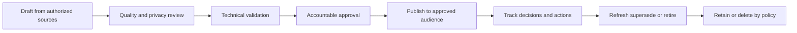
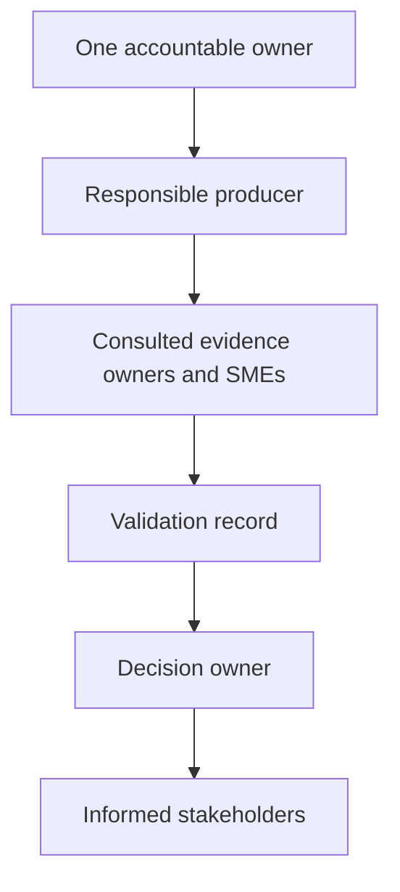

# Appendix F - TAM Templates and Customer Deliverable Pack

> **Purpose:** Provide copy-ready Markdown structures for discovery, evidence, fleet analysis, health, supportability, lifecycle, recommendations, service reviews, projects, escalations, incidents, coaching, and value reporting.
>
> **How to use:** Copy only the needed template into an authorized working artifact, preserve the metadata fields, replace every angle-bracket placeholder, delete irrelevant fields deliberately, review with the named owner, and publish through the approved customer/account process.
>
> **Reference date:** 2026-08-24

## Scope, privacy, access, and evidence boundaries

- Every example is synthetic. Use identifiers beginning `SYN-` in labs and interview practice.
- Never put credentials, secrets, tokens, full packet payloads, private keys, unrestricted support bundles, personal data, customer content, internal NetApp methods, gated text, or exam content in these templates.
- Customer artifacts require authorization, least privilege, approved storage/transfer, classification, audience control, retention, and deletion.
- Product behavior, supportability, lifecycle, limits, certification, and tool fields are version-sensitive. Cite and recheck current official sources using [Appendix E](Appendix-E-official-netapp-source-map.md).
- A template improves consistency; it does not create evidence, approval, technical authority, customer acceptance, or production experience.
- Primary methods: [Parts 49-58](Part-49-install-base-management-data-quality.md), [Parts 61-73](Part-61-operational-service-review-lifecycle.md), and [Part 91](Part-91-capstone-netapp-tam-service-review.md).

## Mandatory metadata for every artifact

```markdown
Artifact ID: <SYN-or-approved-id>
Title: <artifact-title>
Customer/account label: <approved-sanitized-label>
Classification: <public-internal-confidential-restricted>
Owner: <accountable-owner>
Contributors: <roles>
Audience/access list: <approved-audience>
Source: <source-ids-and-secure-references>
Source cutoff/date: <ISO-8601-UTC>
Document date/version: <YYYY-MM-DD> / <version>
Confidence: <high-medium-low> - <reason>
Validation: <reviewer-method-date-result>
Residual risk: <remaining-uncertainty-or-none-with-rationale>
Next review/expiry: <date-or-trigger>
```

## Artifact lifecycle



| Lifecycle stage | Entry criterion | Exit evidence |
|---|---|---|
| Draft | Purpose, owner, audience, source scope defined | Complete placeholders and source trail |
| Quality/privacy | Schema/logic checks and classification applied | QA result, redactions, access list |
| Technical validation | Relevant SME and current sources available | Reviewer/date/test result and open gaps |
| Approval | Decision owner understands confidence/residual risk | Approval record or explicit rejection |
| Publish | Correct version and audience | Secure publication reference |
| Track | Decisions/actions have owners/dates | Action/decision IDs and status |
| Refresh/retire | Trigger/date reached or source changed | Replacement/retirement and retention record |

## Artifact RACI

| Artifact activity | Technical analyst | Lead TAM/account owner | Customer technical owner | SME/Support | Security/privacy | Decision owner |
|---|---|---|---|---|---|---|
| Define purpose/scope | R | A | C | C | C | I |
| Collect authorized evidence | R | A | C | C | C | I |
| Analyze and state confidence | R | A | C | C | I | I |
| Validate technical conclusion | R | A | C | C/R | I | I |
| Approve customer message | C | A/R | C | C | C | I |
| Accept/defer risk | I | C | R/C | C | C | A |
| Publish and control access | R | A | I | I | C | I |
| Track/close actions | R | A | R | C | I | C |



## Discovery and environment templates

### Template F01 - Discovery questionnaire

```markdown
Template: Discovery questionnaire
Metadata: <paste mandatory metadata block>

Business outcomes: <services-users-critical-periods-value>
Impact tolerance: <availability-performance-RPO-RTO-recovery-priorities>
Applications: <SYN-APP-001-owner-data-dependencies>
Compute: <Windows-Linux-VMware-Kubernetes-cloud>
Network/fabrics: <sites-VLANs-routes-DNS-firewalls-FC-fabrics>
Storage/data services: <platform-release-SVM-NFS-SMB-iSCSI-FC-NVMe-S3>
Protection/security: <snapshots-replication-backup-DR-immutability-identity-encryption>
Operations: <monitoring-AutoSupport-cases-maintenance-change-freezes>
Lifecycle/supportability: <versions-firmware-IMT-HWU-contracts>
Stakeholders/decisions: <owners-approvers-escalation-path>
Known pain points: <symptom-scope-frequency-impact>
Unknowns/evidence requests: <item-owner-due-date>

Owner: <owner> | Source: <interview-and-approved-records> | Date: <UTC>
Confidence: <level-reason> | Validation: <customer-confirmation>
Residual risk: <missing-stakeholders-or-evidence>
```

### Template F02 - Evidence request

```markdown
Template: Evidence request
Metadata: <paste mandatory metadata block>

Decision/problem: <what-this-evidence-will-answer>
Requested item: <exact-field-report-log-time-range-object-scope>
Source owner/system: <owner-and-authoritative-system>
Time window/timezone: <start-end-UTC-offset>
Format/schema: <CSV-JSON-PDF-screenshot-secure-bundle>
Minimum fields: <identity-version-state-units-timestamps>
Privacy minimization/redaction: <rules>
Secure transfer/retention: <approved-location-and-expiry>
Due date/priority: <date-and-reason>
Acceptance check: <completeness-freshness-identity-readable>

Owner: <request-owner> | Source: <source-owner> | Date: <UTC>
Confidence: <expected-evidence-strength> | Validation: <receiver-check>
Residual risk: <what-remains-if-unavailable>
```

### Template F03 - Environment profile

```markdown
Template: Environment profile
Metadata: <paste mandatory metadata block>

Environment ID: SYN-ENV-001
Business services: <service-owner-criticality-SLO>
Sites/cloud regions: <location-role-failure-domain>
Applications and data: <app-dataset-access-model-owner>
Hosts/hypervisors/clusters: <type-version-owner>
Networks/fabrics: <segment-route-VLAN-MTU-FC-fabric-owner>
NetApp estate: <platform-cluster-node-SVM-release>
Protocols: <NFS-SMB-iSCSI-FC-NVMe-S3>
Protection: <snapshot-replication-backup-DR-test-date>
Security: <identity-RBAC-encryption-audit-immutability>
Telemetry/support: <AutoSupport-freshness-entitlement-case-route>
Constraints/change calendar: <business-technical-regulatory>
Open assumptions: <assumption-owner-validation-date>

Owner: <profile-owner> | Source: <approved-sources> | Date: <cutoff>
Confidence: <level> | Validation: <owner-walkthrough>
Residual risk: <unmapped-dependencies>
```

### Template F04 - Topology legend and diagram contract

```markdown
Template: Topology legend
Metadata: <paste mandatory metadata block>

Node shape meanings: <application-host-switch-storage-site-cloud>
Line meanings: <data-management-replication-dependency-dashed-unknown>
Colors: <accessible-label-plus-color-rule>
Identifiers: <SYN-APP-SYN-HOST-SYN-SVM-SYN-LIF-SYN-LUN>
Boundary labels: <site-owner-security-zone-failure-domain>
Protocol labels: <NFSv4-SMB3-iSCSI-FC-NVMeTCP-S3>
Redaction rule: <no-real-IP-WWPN-IQN-serial-customer-name>
As-of date: <UTC>
Known unknowns: <dotted-links-and-owner>
Validation method: <walkthrough-with-each-domain-owner>

Owner: <topology-owner> | Source: <inventory-and-interviews> | Date: <UTC>
Confidence: <per-link-or-overall> | Validation: <review-record>
Residual risk: <stale-or-unverified-links>
```

## Inventory, data quality, and baseline templates

### Template F05 - Install-base schema

```markdown
Template: Install-base schema
Metadata: <paste mandatory metadata block>

Required columns:
- asset_key: <approved-stable-key>
- account_site: <sanitized-site>
- serial_or_system_id_ref: <restricted-reference>
- product_family_model: <exact-source-values>
- cluster_node_svm: <normalized-identities>
- ontap_or_software_release: <exact-string>
- hardware_firmware: <component-version-source>
- protocols_workloads: <declared-observed>
- support_contract_lifecycle: <status-dates-source>
- autosupport_last_seen: <UTC-or-unknown>
- owner_service_criticality: <approved-values>
- source_checked_utc: <UTC>
- confidence_validation_residual_risk: <values>

Owner: <data-owner> | Source: <systems-of-record> | Date: <cutoff>
Confidence: <field-level-rule> | Validation: <schema-and-owner-review>
Residual risk: <identity-or-coverage-gaps>
```

### Template F06 - Install-base reconciliation

```markdown
Template: Install-base reconciliation
Metadata: <paste mandatory metadata block>

Record key: SYN-ASSET-001
Source A/value/date: <source-value-UTC>
Source B/value/date: <source-value-UTC>
Conflict type: <missing-duplicate-stale-mismatch-retired>
Authoritative owner: <role>
Proposed resolution: <merge-correct-retire-investigate>
Evidence reference: <secure-reference>
Decision/approver: <owner-date>
Before/after: <bounded-values>
Validation: <source-refresh-or-owner-confirmation>
Residual risk/next review: <uncertainty-date>

Owner: <reconciliation-owner> | Source: <source-list> | Date: <UTC>
Confidence: <level> | Validation: <method>
Residual risk: <remaining-conflict>
```

### Template F07 - Data-quality report

```markdown
Template: Data-quality report
Metadata: <paste mandatory metadata block>

Dataset/cutoff: <name-UTC>
Expected/received rows: <counts>
Completeness by required field: <field-percent-missing-count>
Uniqueness: <key-duplicate-count>
Validity: <rule-failed-count>
Consistency: <cross-field-or-cross-source-conflicts>
Freshness: <age-buckets-and-policy>
Coverage: <included-excluded-sites-assets>
Exceptions: <SYN-DQ-001-owner-due-date>
Impact on analysis: <metrics-findings-blocked-or-biased>
Remediation/validation: <action-owner-date-retest>

Owner: <data-quality-owner> | Source: <dataset-sources> | Date: <UTC>
Confidence: <level> | Validation: <QA-suite-and-reviewer>
Residual risk: <unmeasured-or-stale-fields>
```

### Template F08 - Health baseline

```markdown
Template: Health baseline
Metadata: <paste mandatory metadata block>

Scope/cutoff: <systems-services-UTC>
Business health: <SLO-impact-open-risk>
Cluster/HA: <state-events-redundancy-unknowns>
Hardware/environment: <components-sensors-paths>
Network/protocol: <LIF-port-route-session-path-evidence>
Capacity: <logical-physical-threshold-growth>
Performance: <workload-baseline-latency-IOPS-throughput-queues>
Protection: <snapshot-replication-backup-DR-test>
Security: <identity-RBAC-encryption-advisories-alerts>
Telemetry/supportability/lifecycle: <freshness-IMT-HWU-version-dates>
Top findings/actions: <SYN-FIND-001-risk-owner-date-validation>

Owner: <baseline-owner> | Source: <dated-evidence> | Date: <UTC>
Confidence: <per-domain> | Validation: <SME-and-customer-check>
Residual risk: <blind-spots>
```

### Template F09 - Capacity and performance analysis

```markdown
Template: Capacity and performance analysis
Metadata: <paste mandatory metadata block>

Question/workload: <decision-and-SLO>
Scope/units/time grain: <objects-units-interval-timezone>
Baseline period: <start-end-and-exclusions>
Capacity: <raw-usable-used-logical-snapshot-tiering-efficiency-headroom>
Growth: <absolute-rate-seasonality-known-events>
Performance: <IOPS-throughput-IO-size-latency-percentiles-queue-utilization>
Correlations: <changes-workloads-events-without-causation-claim>
Low/base/high scenarios: <assumptions-results>
Finding: <evidence-supported-statement>
Recommendation/tradeoffs: <action-options>
Validation/monitoring: <success-metric-date-owner>

Owner: <analysis-owner> | Source: <counter-and-capacity-sources> | Date: <cutoff>
Confidence: <level-reason> | Validation: <unit-QA-SME-review>
Residual risk: <forecast-or-counter-limitations>
```

### Template F10 - AutoSupport freshness assessment

```markdown
Template: AutoSupport freshness assessment
Metadata: <paste mandatory metadata block>

System ID: SYN-SYSTEM-001
Expected telemetry policy/source: <current-authorized-source>
Last observed message UTC: <UTC-or-unknown>
Expected cadence: <source-verified-expectation>
Age/status rule: <current-stale-unknown-with-policy>
Transport/destination context: <sanitized>
Coverage gaps: <systems-time-window-message-types>
Privacy/access review: <approved-account-and-artifact-handling>
Impact: <which-health-analysis-is-limited>
Action/owner/due date: <bounded-next-step>
Validation: <next-observed-message-or-owner-confirmation>

Owner: <telemetry-owner> | Source: <AutoSupport-or-Digital-Advisor-reference> | Date: <UTC>
Confidence: <level> | Validation: <method>
Residual risk: <missing-telemetry-blind-spot>
```

### Template F11 - Digital Advisor extraction request

```markdown
Template: Digital Advisor extraction request
Metadata: <paste mandatory metadata block>

Authorized account/watchlist: <approved-scope>
Business question: <decision>
Requested views/fields: <risk-capacity-performance-lifecycle-cases>
Asset identifiers: <sanitized-list-reference>
Cutoff/time range: <UTC>
Filters/exclusions: <documented-values>
Export format/schema: <CSV-XLSX-PDF-and-version>
Freshness/coverage fields required: <last-seen-source-count>
Secure delivery/retention: <location-expiry>
Validation: <row-count-asset-reconciliation-field-definitions>

Owner: <request-owner> | Source: <Digital-Advisor-authorized-view> | Date: <UTC>
Confidence: <expected-strength> | Validation: <receiver-QA>
Residual risk: <portal-access-or-freshness-gap>
```

## Supportability, defect, lifecycle, and upgrade templates

### Template F12 - IMT evidence record

```markdown
Template: IMT evidence record
Metadata: <paste mandatory metadata block>

Solution/use case: <exact-IMT-solution>
Customer configuration ID: SYN-CONFIG-001
Components: <ONTAP-platform-protocol-host-OS-hypervisor-adapter-driver-firmware-switch-MPIO>
Exact versions/editions: <values>
IMT query/filters: <authorized-search-reference>
Result: <listed-unlisted-conditional-unknown>
Notes/policies reviewed: <authorized-reference-not-copied-text>
Evidence capture: <secure-screenshot-or-export-reference>
Applicability conclusion: <bounded-statement>
Action/escalation: <owner-date-exact-question>

Owner: <supportability-owner> | Source: <IMT-query-reference> | Date: <UTC>
Confidence: <level> | Validation: <second-review-and-config-owner>
Residual risk: <unverified-component-or-note>
```

### Template F13 - HWU evidence record

```markdown
Template: HWU evidence record
Metadata: <paste mandatory metadata block>

Platform/system: <exact-model-and-release>
Question: <adapter-drive-shelf-port-limit-cabling-component>
HWU query context: <platform-release-filters>
Observed field/value/unit: <value>
Dependencies/notes: <authorized-reference>
Customer evidence match: <yes-no-unknown-and-reference>
Cross-check: <IMT-product-doc-release-note>
Conclusion: <bounded-version-specific-statement>
Action/owner/date: <next-step>

Owner: <hardware-owner> | Source: <HWU-record-reference> | Date: <UTC>
Confidence: <level> | Validation: <peer-and-second-source>
Residual risk: <staleness-or-config-gap>
```

### Template F14 - Bug scrub record

```markdown
Template: Bug scrub record
Metadata: <paste mandatory metadata block>

Record ID: SYN-BUG-001
Authorized/public source reference: <URL-or-gated-reference>
Symptom/trigger: <source-bounded-summary>
Affected products/platforms/releases: <exact-source-fields>
Customer evidence: <version-feature-trigger-observation>
Applicability: <yes-no-unknown>
Rationale/conflicting evidence: <statement>
Mitigation/workaround: <current-source-and-change-gate>
Fixed/recommended release: <verify-current-source-not-memory>
Business/technical risk: <impact-likelihood-time>
Action/owner/due date/validation: <values>

Owner: <bug-scrub-owner> | Source: <source-list> | Date: <UTC>
Confidence: <level> | Validation: <SME-review>
Residual risk: <remaining-exposure-or-uncertainty>
```

### Template F15 - Lifecycle roadmap

```markdown
Template: Lifecycle roadmap
Metadata: <paste mandatory metadata block>

Asset/product/version: <SYN-ASSET-001-values>
Current lifecycle state: <source-defined-state>
Milestones/dates: <EOA-EOES-EOVS-or-source-terms>
Business criticality/dependencies: <apps-sites-contracts>
Technical debt/risk horizon: <evidence>
Target state: <version-platform-service>
Prerequisites: <budget-IMT-HWU-app-network-skills>
Phases/milestones: <quarter-owner-outcome>
Decision points: <approve-defer-retire>
Validation/retirement evidence: <criteria>

Owner: <roadmap-owner> | Source: <lifecycle-and-inventory-sources> | Date: <UTC>
Confidence: <level> | Validation: <asset-and-program-owner>
Residual risk: <funding-path-or-source-uncertainty>
```

### Template F16 - Upgrade assessment

```markdown
Template: Upgrade assessment
Metadata: <paste mandatory metadata block>

Driver/current/target: <reason-release-release>
Current health/telemetry: <precheck-status-and-gaps>
Supported path/current docs: <source-references>
IMT/HWU/host/switch/firmware: <results-and-unknowns>
Protocol/application constraints: <owners-and-tests>
Known issues/advisories/defects: <applicability-records>
Capacity/performance/headroom: <evidence>
Method/window/RACI: <approved-plan-reference>
Rollback/stop limitations: <explicit>
Pre/post validation: <technical-and-application-criteria>
Recommendation: <go-conditional-go-no-go-with-reasons>

Owner: <upgrade-owner> | Source: <current-source-pack> | Date: <UTC>
Confidence: <level> | Validation: <peer-change-board-app-owner>
Residual risk: <remaining-failure-or-rollback-risk>
```

## Risk, recommendation, action, and decision templates

### Template F17 - Risk register

```markdown
Template: Risk register row
Metadata: <paste mandatory metadata block>

Risk ID: SYN-RISK-001
Condition/evidence: <verified-current-state>
Cause/trigger: <known-or-hypothesis-labeled>
Affected service/assets: <scope>
Impact/likelihood/time horizon: <defined-scales-and-rationale>
Supportability/detectability: <values>
Confidence: <level-reason>
Existing controls: <validated-controls>
Recommended response: <avoid-reduce-transfer-accept>
Owner/due date/status: <values>
Validation/success criteria: <proof>
Residual risk/acceptor/review date: <values>
```

### Template F18 - Recommendation

```markdown
Template: Recommendation
Metadata: <paste mandatory metadata block>

Recommendation ID: SYN-REC-001
Finding: <evidence-and-context>
Risk/value: <business-and-technical-effect>
Recommended action: <specific-bounded-action>
Why now: <trigger-time-horizon>
Options/tradeoffs: <option-cost-risk-downtime-benefit>
Prerequisites/dependencies: <items>
Owner/target date: <role-date>
Change/safety boundary: <approval-runbook-stop-rollback>
Success criteria: <measurable-outcome>
Validation/monitoring: <method-period-owner>
Residual risk/decision required: <statement-and-approver>
```

### Template F19 - Action tracker

```markdown
Template: Action tracker row
Metadata: <paste mandatory metadata block>

Action ID: SYN-ACT-001
Linked risk/recommendation/decision: <IDs>
Action: <verb-object-outcome>
Accountable owner: <one-role>
Responsible contributors: <roles>
Target date/status: <date-not-started-in-progress-blocked-done>
Dependencies/blocker: <item-owner>
Next checkpoint: <date-and-evidence>
Completion evidence: <secure-reference>
Validation: <reviewer-method-result>
Residual risk after closure: <statement>
Source/date/confidence: <values>
```

### Template F20 - Decision log

```markdown
Template: Decision log row
Metadata: <paste mandatory metadata block>

Decision ID: SYN-DEC-001
Question/date/decision owner: <values>
Context and constraints: <statement>
Evidence/source cutoff: <references-UTC>
Options considered: <option-benefit-cost-risk>
Decision: <approved-deferred-rejected>
Rationale: <bounded-argument>
Conditions/triggers: <revisit-events>
Actions/owners/dates: <linked-actions>
Validation: <how-outcome-will-be-checked>
Confidence/residual risk: <values>
```

## Service-review and stakeholder templates

### Template F21 - Service-review agenda

```markdown
Template: Service-review agenda
Metadata: <paste mandatory metadata block>

Objective/decisions needed: <outcomes>
Attendees/roles: <decision-technical-informed>
Data cutoff and pre-read: <UTC-secure-link>
1. Outcomes and changes since last review - <minutes>
2. Install base and data quality - <minutes>
3. Health incidents capacity performance - <minutes>
4. Supportability lifecycle bugs security - <minutes>
5. Top recommendations and decisions - <minutes>
6. Actions owners dates and value - <minutes>
Parking lot: <owner-follow-up>
Meeting owner/timekeeper/notes: <roles>

Owner: <review-owner> | Source: <review-pack> | Date: <UTC>
Confidence: <level> | Validation: <pre-read-review>
Residual risk: <missing-attendees-or-data>
```

### Template F22 - Service-review deck storyboard

```markdown
Template: Service-review deck storyboard
Metadata: <paste mandatory metadata block>

Slide 1: <decision-oriented-title-and-period>
Slide 2: <executive-summary-three-messages>
Slide 3: <customer-outcomes-and-change-context>
Slide 4: <estate-and-data-quality>
Slide 5: <health-and-incident-pattern>
Slide 6: <capacity-performance-and-forecast>
Slide 7: <supportability-lifecycle-security>
Slide 8: <top-risks-and-recommendations>
Slide 9: <roadmap-actions-owners-dates>
Slide 10: <value-next-quarter-decisions>
Appendix: <sources-definitions-detail>
Each slide source label: <source-cutoff-owner-confidence>

Owner: <deck-owner> | Source: <validated-artifacts> | Date: <UTC>
Confidence: <per-slide> | Validation: <technical-executive-QA>
Residual risk: <omitted-or-stale-evidence>
```

### Template F23 - Meeting minutes

```markdown
Template: Meeting minutes
Metadata: <paste mandatory metadata block>

Meeting/objective: <name-purpose>
Date/time/timezone: <start-end-offset>
Attendees/roles: <list>
Pre-read/source cutoff: <reference-UTC>
Key facts discussed: <bounded-summary>
Decisions: <SYN-DEC-IDs-owner>
Actions: <SYN-ACT-ID-owner-due-date>
Risks accepted/deferred: <SYN-RISK-ID-acceptor-review-date>
Questions/parking lot: <owner-date>
Disagreements/uncertainty: <neutral-record>
Next meeting/checkpoint: <date>

Owner: <notes-owner> | Source: <meeting-and-pre-read> | Date: <UTC>
Confidence: <level> | Validation: <attendee-review-deadline>
Residual risk: <unconfirmed-decision-or-action>
```

### Template F24 - Post-review follow-up

```markdown
Template: Post-review follow-up
Metadata: <paste mandatory metadata block>

Subject: <review-name> - decisions and actions - <date>
Thank you/context: <one-line>
Decisions confirmed: <ID-decision-owner>
Actions: <ID-action-owner-date-status>
Accepted/deferred risks: <ID-acceptor-review-trigger>
Requested evidence: <item-owner-date-secure-route>
Corrections to pre-read: <item-source-impact>
Next checkpoint: <date-objective>
Attachments/links: <approved-current-versions>
Please correct by: <date>

Owner: <follow-up-owner> | Source: <approved-minutes> | Date: <UTC>
Confidence: <level> | Validation: <lead-TAM-review>
Residual risk: <unacknowledged-action-or-decision>
```

### Template F25 - Stakeholder map

```markdown
Template: Stakeholder map row
Metadata: <paste mandatory metadata block>

Stakeholder ID/role: SYN-STK-001 / <role>
Outcome/interest: <what-success-means>
Decision rights: <approve-recommend-execute-accept-risk>
Technical domain: <app-network-storage-security-finance>
Influence/impact: <high-medium-low-with-reason>
Preferred evidence/detail: <executive-technical-operational>
Cadence/channel/timezone: <values>
Current concern/objection: <statement>
Engagement action/owner/date: <values>
Privacy boundary: <what-not-to-share>
Source/date/confidence/validation/residual risk: <values>
```

### Template F26 - RACI matrix

```markdown
Template: RACI matrix
Metadata: <paste mandatory metadata block>

Workstream: <upgrade-incident-service-review-remediation>
Decision owner: <one-accountable-role>

| Activity | Accountable | Responsible | Consulted | Informed | Evidence/exit |
| <activity-1> | <one-role> | <role-list> | <role-list> | <role-list> | <criterion> |
| <activity-2> | <one-role> | <role-list> | <role-list> | <role-list> | <criterion> |

Conflict/gap: <missing-or-multiple-accountability>
Resolution owner/date: <values>
Source/date/confidence: <values>
Validation: <all-role-confirmation>
Residual risk: <unaccepted-boundary>
```

## Project and status templates

### Template F27 - Project charter

```markdown
Template: Project charter
Metadata: <paste mandatory metadata block>

Project ID/title: SYN-PRJ-001 / <title>
Problem/opportunity: <evidence-and-outcome>
Objectives/success measures: <specific-measurable>
In scope/out of scope: <boundaries>
Sponsor/accountable owner: <role>
Team/RACI: <roles-and-reference>
Milestones/target dates: <date-outcome>
Dependencies/constraints: <items>
Budget/resource assumptions: <validated-or-unknown>
Risks/issues: <linked-RAID-IDs>
Governance/cadence: <forums-reports-escalation>
Closure criteria: <accepted-evidence>

Owner: <project-owner> | Source: <approved-case> | Date: <UTC>
Confidence: <level> | Validation: <sponsor-approval>
Residual risk: <scope-resource-dependency>
```

### Template F28 - RAID log

```markdown
Template: RAID log row
Metadata: <paste mandatory metadata block>

RAID ID: SYN-RAID-001
Type: <risk-assumption-issue-dependency>
Statement: <clear-condition-or-event>
Impact/urgency: <defined-scale-rationale>
Owner: <one-role>
Response/action: <verb-object>
Due/review date: <date>
Status: <open-monitoring-blocked-closed>
Trigger/dependency: <event-or-linked-ID>
Evidence/source/date: <reference-UTC>
Confidence/validation/residual risk: <values>
```

### Template F29 - Project/status report

```markdown
Template: Status report
Metadata: <paste mandatory metadata block>

Period/overall status: <dates-green-amber-red-with-rule>
Outcome summary: <one-paragraph-BLUF>
Completed: <milestone-evidence>
Next: <milestone-owner-date>
Schedule/budget/scope/quality: <status-variance>
Top risks/issues/dependencies: <IDs-impact-action>
Decisions needed: <question-owner-by-date>
Change requests: <ID-impact-status>
Metrics: <definition-source-current-target>
Help/escalation: <exact-ask>

Owner: <status-owner> | Source: <project-records> | Date: <UTC>
Confidence: <level> | Validation: <workstream-owner-review>
Residual risk: <forecast-or-dependency-uncertainty>
```

## Escalation and incident templates

### Template F30 - Escalation pack

```markdown
Template: Escalation pack
Metadata: <paste mandatory metadata block>

Escalation ID/severity: SYN-ESC-001 / <policy-based-level>
Business impact/scope/start UTC: <values>
Environment/topology/versions: <sanitized-summary>
Symptom and exact reproduction: <steps-if-safe>
Timeline/changes: <UTC-events>
Evidence: <secure-links-hashes-tools-filters>
Hypotheses: <supporting-conflicting-tests>
Actions tried/results: <read-probe-change-ID>
Current mitigation/service state: <status>
Safety/privacy boundaries: <not-attempted-redactions>
Exact ask/urgency: <decision-expertise-next-evidence>

Owner: <escalation-owner> | Source: <evidence-pack> | Date: <UTC>
Confidence: <level> | Validation: <peer-and-source-owner>
Residual risk: <service-data-security-risk>
```

### Template F31 - Incident update

```markdown
Template: Incident update
Metadata: <paste mandatory metadata block>

Incident ID/status/severity: SYN-INC-001 / <state> / <policy-level>
Update time/next update: <UTC> / <UTC>
Impact/scope: <who-what-where-since>
What changed since last update: <verified-facts>
Current service state: <unavailable-degraded-restored-monitoring>
Restoration workstreams: <owner-action-status>
Evidence/hypotheses: <bounded-no-speculation>
Decisions/risks: <ID-owner>
Customer actions: <only-approved-safe-actions>
Exact help needed: <ask>

Owner: <incident-comms-owner> | Source: <incident-log> | Date: <UTC>
Confidence: <level> | Validation: <incident-commander-review>
Residual risk: <remaining-impact-or-recurrence>
```

### Template F32 - Post-incident review

```markdown
Template: Post-incident review
Metadata: <paste mandatory metadata block>

Incident/impact/duration: <SYN-INC-001-bounded-values>
Detection and declaration: <signals-times>
Timeline: <UTC-event-owner-evidence>
Restoration: <actions-and-validation>
Technical causal factors: <evidence-not-blame>
Process/organizational factors: <conditions>
What worked/what hindered: <facts>
Root cause status: <confirmed-contributing-unknown>
Corrective/preventative actions: <ID-owner-date-proof>
Monitoring and recurrence criteria: <signals-window>
Lessons and knowledge updates: <owners>

Owner: <PIR-owner> | Source: <incident-evidence> | Date: <UTC>
Confidence: <per-conclusion> | Validation: <multi-team-review>
Residual risk: <open-causal-or-corrective-gaps>
```

## Coaching and value templates

### Template F33 - Coaching plan

```markdown
Template: Coaching plan
Metadata: <paste mandatory metadata block>

Learner/role label: <approved-non-sensitive-label>
Target task/competency: <observable-outcome>
Baseline evidence: <quiz-observation-artifact>
Gap/root barrier: <knowledge-skill-process-access-confidence>
Plan: <explain-demonstrate-shadow-practice-teach-back>
Safe practice environment: <authorized-lab-or-synthetic-case>
Resources/current-source date: <links-UTC>
Checkpoints: <date-behavior-evidence>
Quality rubric: <accuracy-safety-evidence-communication>
Support/accountability: <coach-manager-peer>
Success/transfer measure: <behavior-and-result>

Owner: <learner-or-manager> | Source: <baseline-evidence> | Date: <UTC>
Confidence: <level> | Validation: <teach-back-and-observation>
Residual risk: <access-practice-or-transfer-gap>
```

### Template F34 - Customer value summary

```markdown
Template: Customer value summary
Metadata: <paste mandatory metadata block>

Outcome period: <start-end>
Customer goal: <approved-outcome>
Starting condition/baseline: <source-metric>
Actions completed: <ID-owner-date>
Measured result: <metric-definition-current-vs-baseline>
Contribution statement: <bounded-no-sole-causation>
Risk reduced/capability improved: <evidence>
Customer confirmation: <decision-owner-reference>
Remaining work/residual risk: <items>
Next-value hypothesis: <action-measure-date>

Owner: <value-owner> | Source: <validated-metrics-and-decisions> | Date: <UTC>
Confidence: <level> | Validation: <customer-and-data-owner>
Residual risk: <attribution-or-measurement-limit>
```

### Template F35 - Artifact publication checklist

```markdown
Template: Artifact publication checklist
Metadata: <paste mandatory metadata block>

- [ ] Purpose, audience, decision, owner, and expiry are clear.
- [ ] Every source is authorized, dated, cited, and within retention policy.
- [ ] Customer identifiers, personal data, credentials, payloads, and gated text are minimized/redacted.
- [ ] Product/release/supportability/lifecycle facts were rechecked in current official sources.
- [ ] Units, timezones, cutoffs, definitions, filters, counts, joins, and exclusions pass QA.
- [ ] Findings are separated from hypotheses, risks, recommendations, and decisions.
- [ ] Confidence, validation, unknowns, and residual risk are visible.
- [ ] Actions have one accountable owner, due date, status, and completion proof.
- [ ] Accessibility, chart labels, links, spelling, and version history pass review.
- [ ] Approver and audience access are recorded; superseded copies are controlled.

Owner: <publication-owner> | Source: <artifact-source-list> | Date: <UTC>
Confidence: <level> | Validation: <technical-privacy-account-review>
Residual risk: <remaining-known-limitation>
```

## Completion and use checklist

- [x] 35 numbered copy-ready Markdown templates exceed the required 30.
- [x] Discovery, evidence, environment, topology, install base, reconciliation, data quality, health, capacity/performance, telemetry, Digital Advisor, IMT, HWU, bugs, lifecycle, upgrades, risks, recommendations, actions, reviews, stakeholders, RACI, projects, escalation, incidents, coaching, and value are covered.
- [x] Artifact lifecycle and RACI are defined.
- [x] Every template includes or references owner, source, date, confidence, validation, and residual risk.
- [x] All examples use angle-bracket placeholders or `SYN-` identifiers.
- [x] Privacy, access, current-source, gated-content, retention, and nonclaim boundaries are explicit.
- [ ] Before use, assign approved owners/classification/access and remove irrelevant fields deliberately.
- [ ] Before publication, complete Template F35 and record approver evidence.

---

*Navigation:* Previous: [Appendix E - Official NetApp Source Map and Currency Tracker](Appendix-E-official-netapp-source-map.md) | Next: [Appendix G - Troubleshooting and Major-Incident Field Manual](Appendix-G-troubleshooting-incident-field-manual.md) | [Master guide](../NetApp%20TAM%20Technical%20Analyst%20-%20Complete%20Study%20Guide.md)