# Appendix G - Troubleshooting and Major-Incident Field Manual

> **Purpose:** Give a calm, evidence-led operating model for the first 15, 30, 60, and 120 minutes of a service disruption, then carry the work through restoration, validation, handoff, root-cause analysis, and prevention.
>
> **How to use:** Follow organizational incident policy first. Assign roles, protect people/data, bound impact and time, preserve evidence, prioritize restoration, test discriminating hypotheses, communicate on a clock, and escalate with an exact ask.
>
> **Reference date:** 2026-08-24

## Scope, authority, privacy, and safety boundaries

- This manual is conceptual and synthetic. It does not grant incident-command authority, NetApp Support authority, customer access, production-change approval, or permission to collect data.
- Never expose customer names, credentials, personal data, file content, unrestricted logs, packet payloads, serials, IPs, contracts, vulnerabilities, or gated Support information. Use `SYN-` identifiers in practice.
- Do not reset, restart, reboot, disconnect, fail over, break/resync, restore, repair, disable a path, change zones/routes/MTU, or clear counters without current procedure, approval, safety checks, and a validation/stop plan.
- Product commands, evidence sources, severity rules, roles, escalation paths, and support contracts vary. Verify current policy and [Appendices C-E](Appendix-C-ontap-admin-automation-reference.md).
- Restoration is not root cause; event proximity is not causation; a green component is not an end-to-end validation.
- Primary methods: [Part 71](Part-71-structured-troubleshooting-rca.md), [Part 72](Part-72-major-incident-high-pressure-communication.md), [Part 73](Part-73-escalation-packages-engineering-engagement.md), and [Parts 74-79](Part-74-nas-troubleshooting-scenarios.md).

## 1. Activation and the first 120 minutes

### Diagram G01 - Incident activation

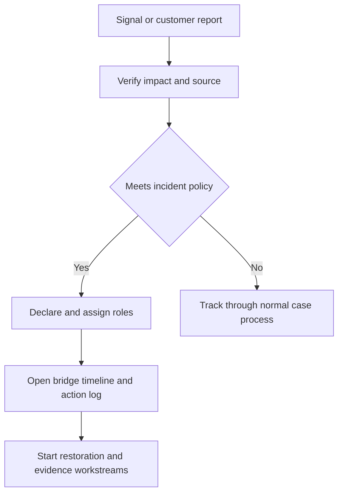

### Diagram G02 - First 15 minutes

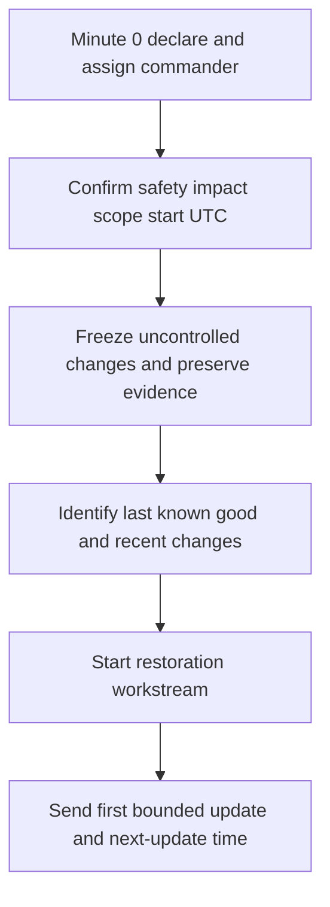

| By minute 15 | Minimum outcome |
|---|---|
| Roles | Incident commander, technical lead, communications, scribe, customer/account owner |
| Impact | Who/what/where/since; unknowns explicit |
| Control | One bridge, one action log, one timeline, one decision owner |
| Safety | Change freeze or controlled exception; data/security risk surfaced |
| Restoration | Safest known recovery options identified, not improvised |
| Communication | Verified facts, current state, next action, next update UTC |

### Diagram G03 - Minutes 15 to 60

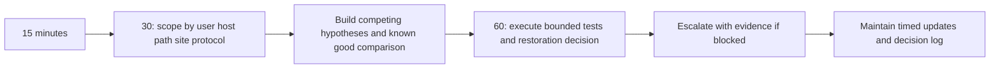

| Checkpoint | Required focus |
|---|---|
| Minute 30 | Topology, affected/unaffected sets, recent changes, baseline, evidence owners |
| Minute 45 | Ranked hypotheses, one discriminating test each, restoration options and risk |
| Minute 60 | Go/no-go decision, escalation package, next technical and communication cadence |

### Diagram G04 - Minutes 60 to 120

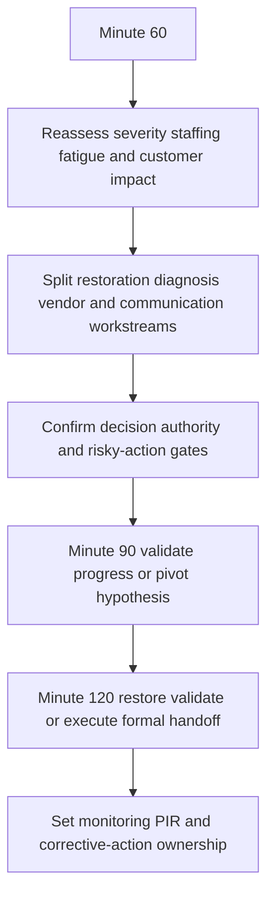

## 2. Severity, priority, roles, and bridge rules

### Severity and priority matrix

| Dimension | Questions | Evidence |
|---|---|---|
| Impact | How many users/services/sites? Data/security/safety/regulatory effect? | Customer/service owner confirmation, monitoring, transactions |
| Urgency | How quickly does impact grow? Deadline or business peak? | Time-to-breach, queue/backlog, recovery window |
| Scope | One object/path or shared dependency? | Affected/unaffected matrix |
| Workaround | Safe, scalable, validated, sustainable? | Test and customer confirmation |
| Priority | What should be worked first under policy? | Impact + urgency + obligations + dependencies |
| Severity | Which declared level matches policy? | Policy criteria and incident commander decision |

### Diagram G05 - Severity decision

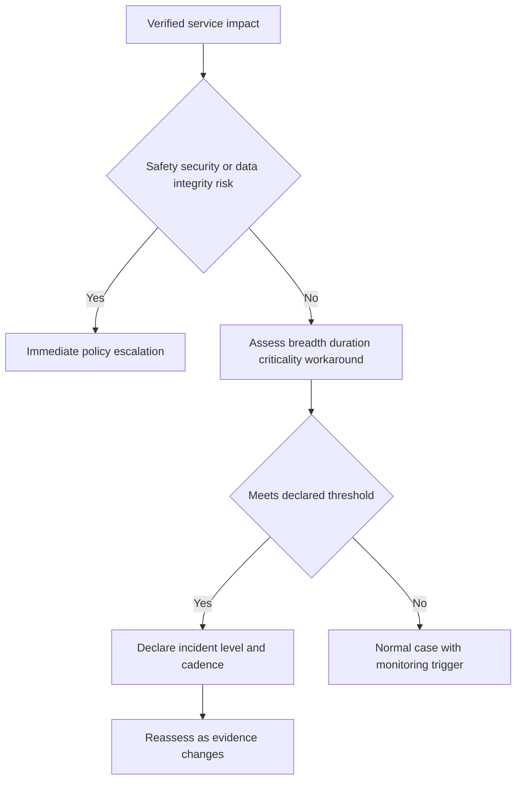

### Diagram G06 - Incident role topology

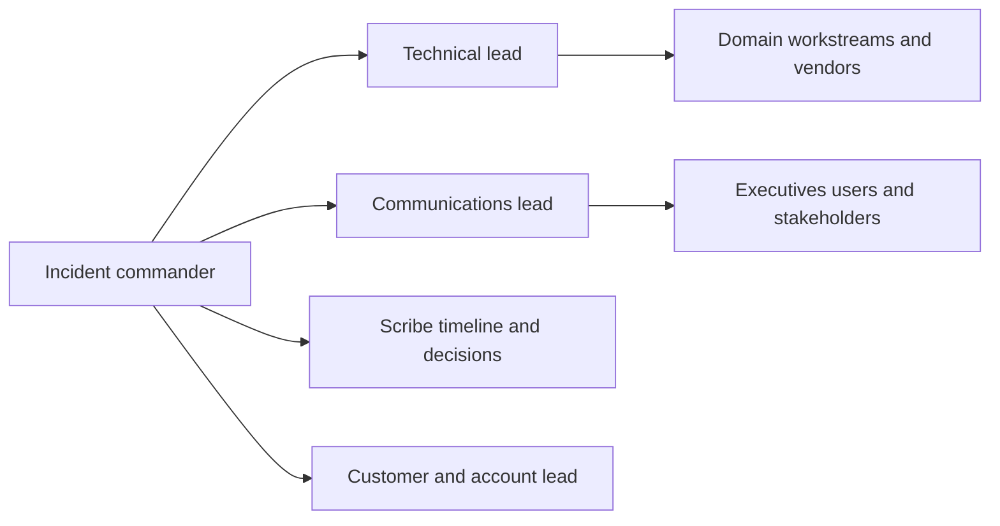

| Role | Owns | Must not become |
|---|---|---|
| Incident commander | Priorities, roles, decisions, cadence, safety | Deep debugger for every thread |
| Technical lead | Hypotheses, evidence, tests, restoration options | Uncontrolled solo changer |
| Communications lead | Audience-specific verified updates | Speculation channel |
| Scribe | UTC timeline, actions, decisions, evidence references | Meeting transcript without structure |
| Customer/account lead | Impact, stakeholder alignment, expectations | Technical authority outside expertise |
| Domain SME/vendor | Exact scoped investigation and advice | Overall commander unless assigned |

### Diagram G07 - Bridge speaking loop

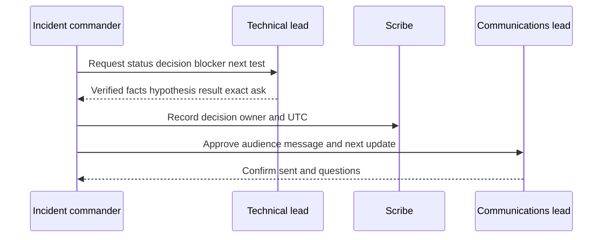

### Diagram G08 - Bridge noise control

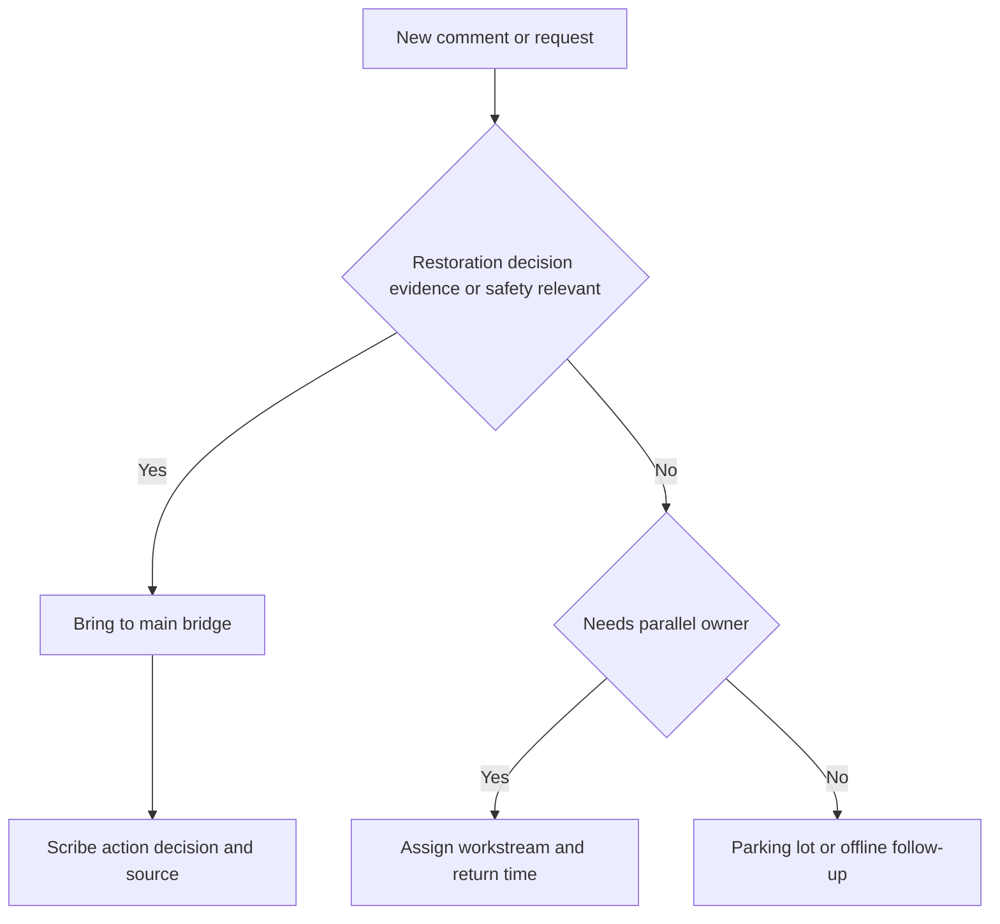

**Bridge rules:** one speaker at a time; facts before theories; no unapproved changes; no unrelated screen sharing; no credentials or sensitive payloads; each action has owner/time; state `unknown`; repeat decisions; honor update clocks; rotate fatigued responders.

## 3. Scope, timeline, change, evidence, and hypotheses

### Diagram G09 - Scope matrix

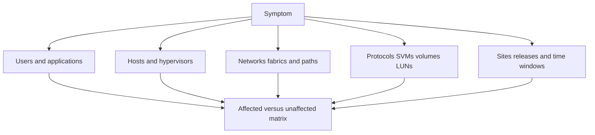

### Diagram G10 - Timeline normalization

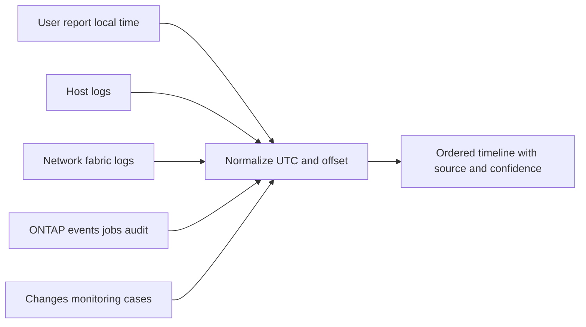

### Diagram G11 - Change correlation

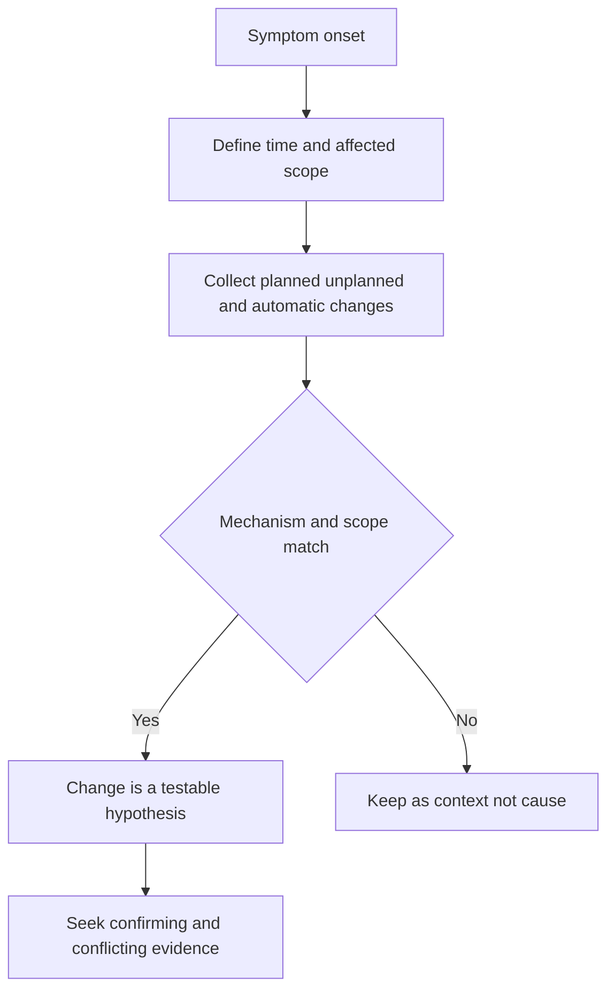

### Diagram G12 - Hypothesis lifecycle

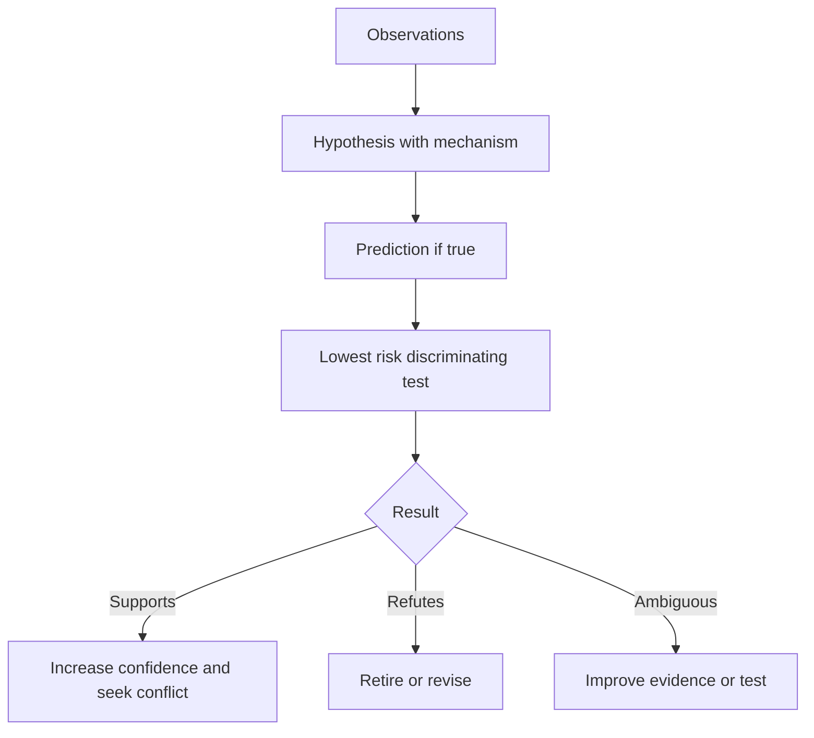

### Hypothesis table

| ID | Hypothesis/mechanism | Supports | Conflicts | Test/risk | Owner/ETA | Result | Confidence/next |
|---|---|---|---|---|---|---|---|
| SYN-HYP-001 | `<bounded-explanation>` | `<evidence>` | `<evidence>` | `<test-and-safety>` | `<role-UTC>` | `<result>` | `<level-action>` |

## 4. Layered domain fault trees

### Diagram G13 - NAS common path

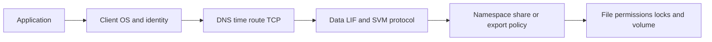

### Diagram G14 - NFS fault tree

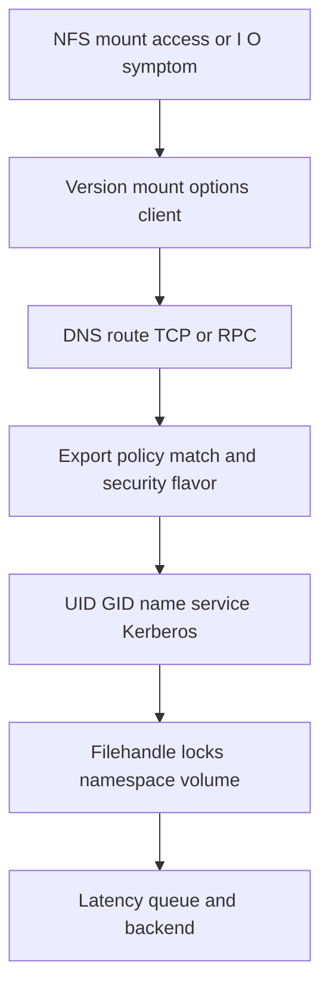

### Diagram G15 - SMB fault tree

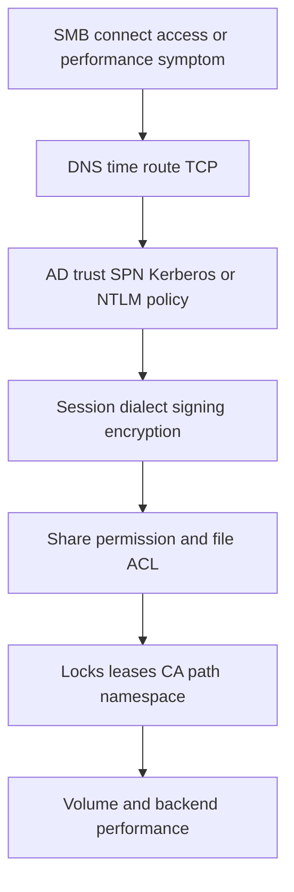

### Diagram G16 - SAN fault tree

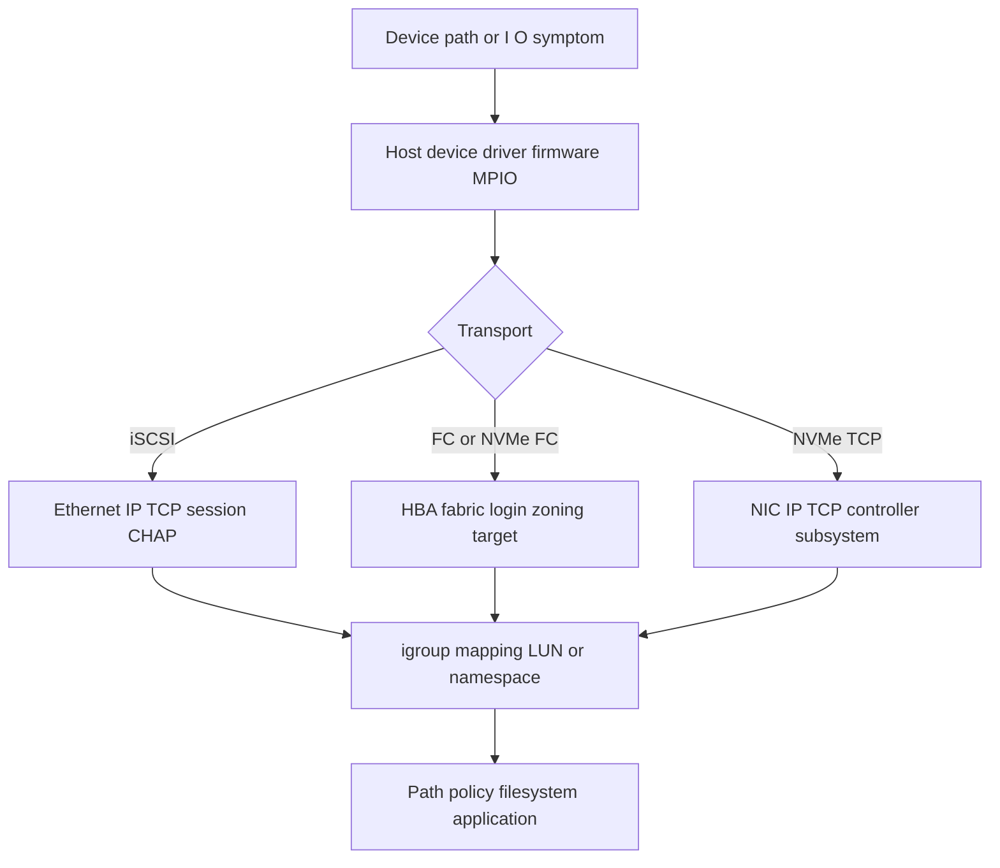

### Diagram G17 - Performance fault tree

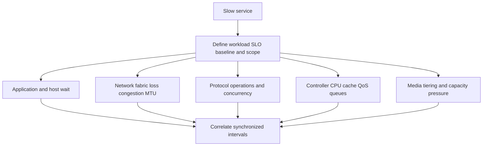

### Diagram G18 - HA and hardware fault tree

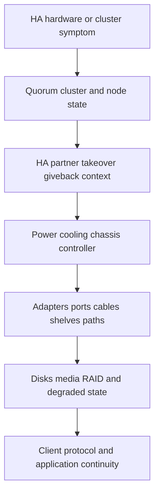

### Diagram G19 - Protection and DR fault tree

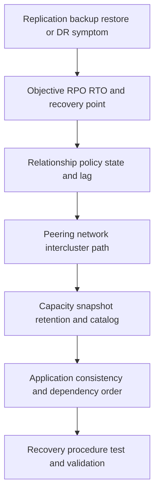

### Diagram G20 - Upgrade and telemetry fault tree

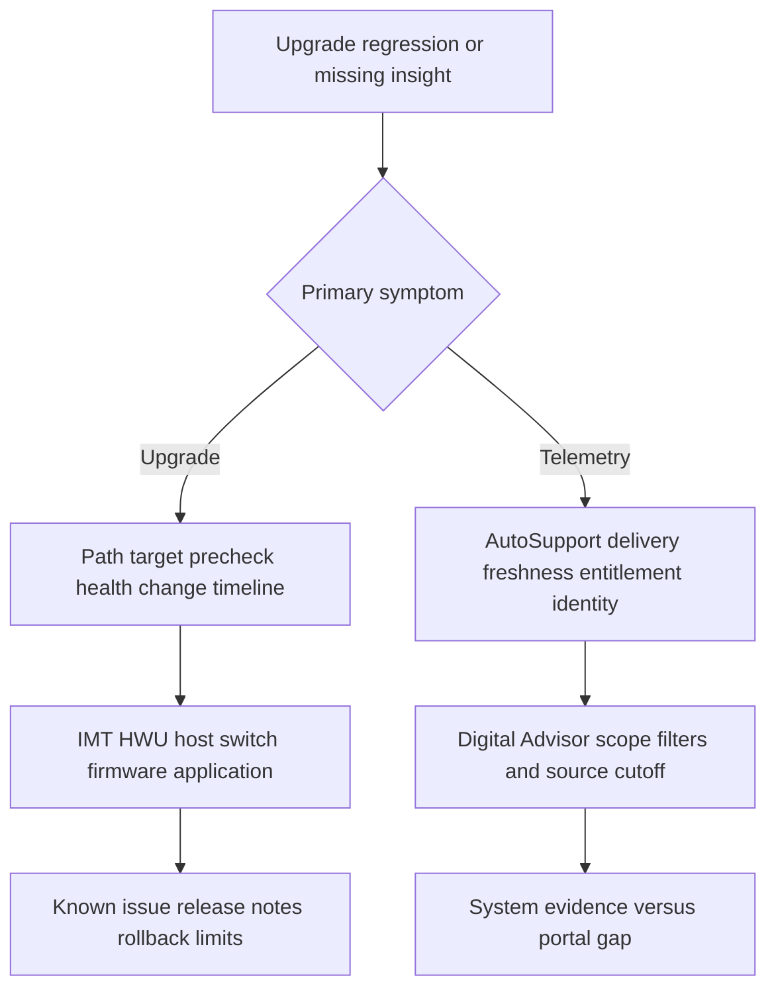

## 5. Evidence source map and escalation

### Diagram G21 - Evidence source map

```mermaid
flowchart TD
    G21I[Incident question] --> G21C[Client app OS hypervisor]
    G21I --> G21N[DNS network firewall Ethernet FC]
    G21I --> G21O[ONTAP System Manager CLI REST EMS audit]
    G21I --> G21T[AutoSupport Digital Advisor cases]
    G21I --> G21B[IMT HWU bugs release lifecycle security]
    G21C --> G21P[Secure evidence pack]
    G21N --> G21P
    G21O --> G21P
    G21T --> G21P
    G21B --> G21P
```

| Source | Minimum capture | Privacy/safety |
|---|---|---|
| User/application | Exact transaction, error, impact, UTC, affected/unaffected | Remove content and personal identifiers |
| Host/hypervisor | Build, device/path/session, network, mount/filesystem, logs | Stable IDs; no repair/reset |
| Network/fabric | Port/path state, config context, counter deltas, logs, clock | Read-only first; no counter clear or bounce |
| ONTAP | Release, object identities/states, jobs, EMS, audit, health/performance | Least privilege; exact scope; no internal commands |
| Support/proactive | Freshness, authorized findings, source references | Gated access; do not copy protected text |
| Packet capture | Points, filter, count/duration, hash, UTC | Explicit approval, minimize payload, encrypt/retain |

### Diagram G22 - Evidence quality gate

```mermaid
flowchart TD
    G22E[Evidence item] --> G22S[Source and collector]
    G22S --> G22T[UTC timezone and clock quality]
    G22T --> G22I[Exact object identity scope and version]
    G22I --> G22M[Method filter units and completeness]
    G22M --> G22P[Privacy integrity secure reference]
    G22P --> G22C[Confidence and validation]
```

### Diagram G23 - Escalation criteria

```mermaid
flowchart TD
    G23B[Blocked investigation or risky condition] --> G23A{Authority expertise access or time gap}
    G23A -->|Yes| G23E[Escalate now]
    G23A -->|No| G23D{Data security safety or redundancy risk}
    G23D -->|Yes| G23E
    G23D -->|No| G23T[Continue bounded test with checkpoint]
    G23E --> G23P[Provide exact package and ask]
```

Escalate when remaining redundancy is unclear; data integrity/security/privacy is at risk; a gated source or Support-only method is needed; progress misses policy checkpoints; multiple vendors dispute ownership; evidence conflicts; a risky change is proposed; or executive/customer impact needs higher authority.

### Diagram G24 - Escalation package

```mermaid
flowchart LR
    G24A[Impact scope start UTC] --> G24B[Environment topology versions]
    G24B --> G24C[Timeline changes and evidence]
    G24C --> G24D[Hypotheses tests and results]
    G24D --> G24E[Mitigation current state risks]
    G24E --> G24F[Exact ask owner and urgency]
```

| Package field | Required content |
|---|---|
| Business | Impact, critical period, severity basis, workaround |
| Technical | Sanitized topology, versions, object/path identities, supportability |
| Timeline | UTC event/change/test/decision entries with sources |
| Evidence | Secure references, hashes, tool versions, filters, cutoffs |
| Reasoning | Ranked hypotheses, support/conflict, discriminating tests |
| State | Service condition, mitigation, remaining redundancy/data/security risk |
| Ask | Exact decision, expertise, evidence, owner, and needed-by time |

## 6. Communication and handoff

### Diagram G25 - Audience communication split

```mermaid
flowchart TD
    G25F[Verified incident facts] --> G25E[Executive: impact decision risk next update]
    G25F --> G25C[Customer technical: state workstreams evidence safe actions]
    G25F --> G25U[Users: service impact workaround next update]
    G25F --> G25V[Vendor SME: topology versions evidence exact ask]
    G25F --> G25S[Scribe: full UTC timeline actions decisions]
```

### Diagram G26 - Update approval sequence

```mermaid
sequenceDiagram
    participant G26T as Technical lead
    participant G26I as Incident commander
    participant G26C as Communications lead
    participant G26A as Audience
    G26T->>G26I: Verified delta and uncertainty
    G26I->>G26I: Decide state actions risks and next clock
    G26I->>G26C: Approve bounded message
    G26C->>G26A: Send update
    G26A-->>G26C: Questions or acknowledgement
    G26C-->>G26I: Record delivery and response
```

### Incident update template

```markdown
Incident: SYN-INC-001 | Status: <state> | Severity: <policy-level>
Update UTC: <time> | Next update UTC: <time>
Impact: <who-what-where-since>
Current service state: <unavailable-degraded-restored-monitoring>
Verified change since prior update: <facts-or-no-material-change>
Workstreams: <owner-action-status-ETA-if-defensible>
Decisions/risks: <decision-owner-residual-risk>
Customer action: <only-approved-safe-action-or-none>
Confidence/unknowns: <bounded-statement>
```

### Diagram G27 - Shift handoff

```mermaid
sequenceDiagram
    participant G27O as Outgoing lead
    participant G27I as Incident commander
    participant G27N as Incoming lead
    participant G27S as Scribe
    G27O->>G27N: Impact topology timeline current state
    G27O->>G27N: Hypotheses evidence actions and safety limits
    G27N-->>G27O: Read back priorities decisions and next clocks
    G27I->>G27N: Transfer role and authority explicitly
    G27S->>G27S: Record handoff UTC and owners
```

### Shift-handoff checklist

- Incident ID, severity, commander, bridge, stakeholder/update cadence.
- Impact, current service state, workaround, critical deadlines.
- Sanitized topology, versions, affected/unaffected matrix.
- Timeline and recent changes; source clock offsets.
- Hypotheses with supports/conflicts/tests; do not restart exhausted paths.
- Actions in progress, owners, ETA/checkpoint, exact stop criteria.
- Changes made, approvals, results, rollback/limitations.
- Remaining redundancy, data/security/privacy concerns.
- Vendor/escalation status and exact asks.
- Incoming lead read-back and explicit role transfer.

## 7. Restoration, validation, monitoring, and PIR

### Diagram G28 - Restoration decision gate

```mermaid
flowchart TD
    G28O[Restoration option] --> G28S[Current documented procedure and authority]
    G28S --> G28R[Risk dependencies remaining redundancy]
    G28R --> G28P[Prechecks stop criteria rollback limits]
    G28P --> G28A[Approval and communications]
    G28A --> G28E[Execute with scribe]
    G28E --> G28V[Technical and application validation]
```

### Diagram G29 - Recovery validation

```mermaid
flowchart LR
    G29C[Component healthy] --> G29P[Protocol and path healthy]
    G29P --> G29A[Application transaction succeeds]
    G29A --> G29U[User/customer confirms scope]
    G29U --> G29S[SLO capacity protection and security acceptable]
    G29S --> G29M[Monitoring window passes]
```

Validation fields: test owner; UTC; exact transaction; expected/actual; affected and control groups; error/performance baseline; data/application consistency; paths/redundancy; protection/telemetry; customer confirmation; residual risk.

### Diagram G30 - Monitoring and closure

```mermaid
flowchart TD
    G30R[Service restored] --> G30W[Define monitoring window and recurrence signals]
    G30W --> G30B[Compare workload error latency capacity paths]
    G30B --> G30C{Stable and customer validated}
    G30C -->|No| G30I[Keep incident active or reopen workstream]
    G30C -->|Yes| G30H[Handoff normal operations]
    G30H --> G30P[Schedule PIR and corrective actions]
```

### Diagram G31 - PIR and RCA chain

```mermaid
flowchart TD
    G31E[Preserved evidence and timeline] --> G31I[Impact detection response restoration]
    G31I --> G31C[Causal and contributing factors]
    G31C --> G31R[Root cause confirmed partial or unknown]
    G31R --> G31A[Corrective preventive and detection actions]
    G31A --> G31O[Owners dates success proof]
    G31O --> G31V[Validate effectiveness and share learning]
```

### PIR record

| Field | Required statement |
|---|---|
| Impact | Measured service/user/business effect and duration |
| Detection | Signal, delay, observability gap |
| Timeline | Sourced UTC events, decisions, changes, restoration |
| Cause status | Confirmed/contributing/unknown with confidence |
| Response | What helped/hindered without blame |
| Actions | Prevention, detection, response, recovery; owner/date/proof |
| Residual risk | Open unknowns, accepted risks, review trigger |
| Knowledge | Runbook, monitoring, training, architecture, source updates |

### Diagram G32 - Recurring-failure signature loop

```mermaid
flowchart LR
    G32A[Repeated incidents] --> G32S[Normalize signature fields]
    G32S --> G32C[Cluster by symptom scope trigger and cause]
    G32C --> G32P[Problem record and trend]
    G32P --> G32F[Prevent detect or recover improvement]
    G32F --> G32M[Measure recurrence and time to restore]
    G32M --> G32A
```

### Recurring signature fields

| Field | Example |
|---|---|
| Signature ID | `SYN-SIG-001` |
| Symptom fingerprint | `<error-state-protocol-object-pattern>` |
| Scope | `<hosts-sites-paths-SVMs-releases>` |
| Trigger/change | `<verified-or-unknown>` |
| Time pattern | `<peak-backup-maintenance-random>` |
| Detection signals | `<events-counters-user-report>` |
| Cause confidence | `<confirmed-likely-unknown>` |
| Workaround/restoration | `<approved-action-and-limit>` |
| Permanent actions | `<owner-date-validation>` |
| Recurrence metric | `<count-period-severity-duration>` |

## Completion and use checklist

- [x] First 15/30/60/120-minute actions, severity/priority, roles, bridge rules, scope, timeline, changes, and evidence are included.
- [x] NAS, NFS, SMB, SAN, performance, HA/hardware, protection/DR, upgrade, and telemetry fault trees are included.
- [x] 32 numbered Mermaid diagrams exceed the required 30.
- [x] Evidence sources, hypothesis table, escalation criteria/package, audience updates, handoff, restoration, validation, monitoring, PIR/RCA, corrective actions, and recurring signatures are included.
- [x] Safety, current-procedure, privacy, access, secure-transfer, synthetic-evidence, and authority boundaries are explicit.
- [ ] Before use, replace policy-neutral severity/roles with the customer's approved incident process.
- [ ] At closure, assign owner/source/date/confidence/validation/residual risk to every material conclusion/action.

---

*Navigation:* Previous: [Appendix F - TAM Templates and Customer Deliverable Pack](Appendix-F-tam-templates-deliverables.md) | Next: [Appendix H - Storage Math, Capacity, Performance, and Forecasting Workbook Guide](Appendix-H-storage-math-capacity-performance.md) | [Master guide](../NetApp%20TAM%20Technical%20Analyst%20-%20Complete%20Study%20Guide.md)