# Appendix I - Excel, Power BI, and PowerPoint TAM Toolkit

> **Purpose:** Turn authorized customer data into reproducible workbooks, governed Power BI models, and decision-ready PowerPoint reviews without losing source lineage, uncertainty, accessibility, or privacy.
>
> **How to use:** Define the business decision and data contract first. Build normalized tables and QA, then measures and visuals, then the customer narrative. Publish only after refresh, security, accessibility, and source-label checks pass.
>
> **Reference date:** 2026-08-24

## Scope, privacy, version, and test boundaries

- Every row, identifier, formula result, chart, and story below is synthetic. Use `SYN-` identifiers for practice.
- Do not place credentials, tokens, customer content, unrestricted logs, personal data, gated Support text, or internal methods in workbooks, PBIX files, decks, query code, or screenshots.
- Microsoft 365, Excel, Power Query M, Power BI Desktop/Service, DAX, gateways, tenant controls, and PowerPoint features change. Verify current Microsoft documentation and organizational policy.
- Formula separators, date systems, locale, privacy levels, connector behavior, DAX semantics, and service features vary. Test in the exact target version and locale.
- The 24 patterns were adapted for this synthetic TAM schema and hand-checked against the stated expected results. They were not executed in Excel or Power BI in this workspace; target-runtime tests remain mandatory.
- Published artifacts must define owner, source, cutoff date, confidence, validation, residual risk, access list, refresh owner, retention, and expiry.
- See [Parts 56-60](Part-56-customer-data-pipeline.md), [Part 65](Part-65-powerpoint-data-storytelling.md), [Appendix F](Appendix-F-tam-templates-deliverables.md), and [Appendix H](Appendix-H-storage-math-capacity-performance.md).

## 1. Integrated artifact architecture

### Diagram I01 - Source-to-decision architecture

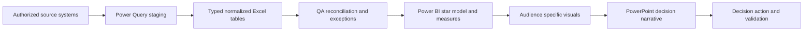

### Diagram I02 - Governance lanes

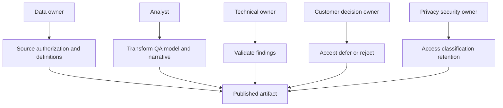

## 2. Workbook architecture and table design

### Diagram I03 - Workbook layers

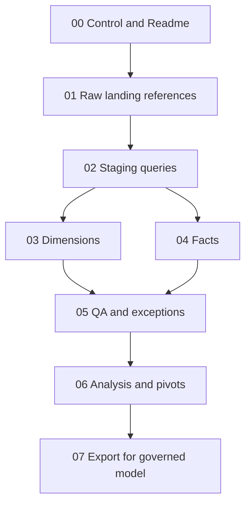

### Recommended workbook sheets

| Sheet | Purpose | User action | Protection |
|---|---|---|---|
| `00_ReadMe` | Owner, purpose, classification, source cutoff, refresh, caveats | Read/update metadata | Visible and controlled |
| `01_Config` | Approved paths, parameters, thresholds, mappings | Edit validated cells only | Data validation; no secrets |
| `02_DataDictionary` | Field meaning/type/unit/source/owner | Maintain with schema | Review-controlled |
| `10_Stg_*` | Query landing and diagnostics | No manual edits | Hidden or protected |
| `20_DimAsset` | One row per stable asset key | Query output | Protected table |
| `21_DimDate` | Date attributes and reporting periods | Query/formula output | Protected table |
| `30_FactHealth` | Asset/date metric or finding rows | Query output | Protected table |
| `31_FactAction` | Action lifecycle rows | Controlled input/query | Validation and ownership |
| `40_QA` | Counts, duplicates, missing, freshness, joins, totals | Resolve exceptions | Visible |
| `50_Pivots` | Exploration and reconciliation | Refresh/filter | No direct source claims |
| `60_Output` | Approved audience views | Read/export | Source labels and caveats |

### Diagram I04 - Star-schema grain

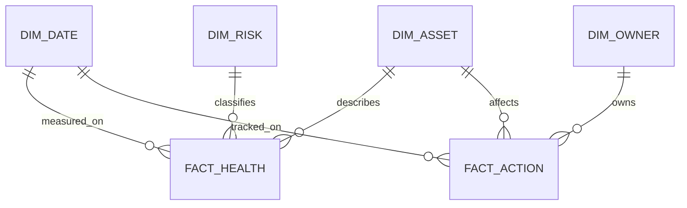

### Core table schemas

| Table | Grain | Key fields | Measures/attributes |
|---|---|---|---|
| `DimAsset` | One current row per stable asset key | `AssetKey` | account, site, family, model, cluster, release, criticality, owner |
| `DimDate` | One row per calendar date | `DateKey` | year, quarter, month, month start, fiscal labels |
| `DimOwner` | One approved owner identity/role | `OwnerKey` | role, team, active flag; minimize personal data |
| `DimRisk` | One governed risk category/scale row | `RiskKey` | domain, severity label, score definition, display order |
| `FactHealth` | One asset + observation UTC + metric/finding | `HealthKey` | metric name, value, unit, finding status, source, confidence |
| `FactAction` | One action status snapshot or one action current row, declared | `ActionKey` | status, due date, completion date, risk/recommendation link |
| `FactCapacity` | One asset/object + observation UTC | `CapacityKey` | usable, used, logical, physical, snapshot, tiered, unit |

### Data dictionary fields

| Field | Meaning |
|---|---|
| `ColumnName` | Exact machine-readable name |
| `BusinessMeaning` | Plain definition and why it matters |
| `DataType` | Text, whole, decimal, date, datetimezone, boolean |
| `Unit` | TiB, TB, IOPS, ms, percent, count, status |
| `Grain` | What one row represents |
| `SourceSystem` / `SourceField` | Provenance |
| `Owner` | Definition/data-quality owner |
| `AllowedValues` | Controlled domain or validation rule |
| `NullMeaning` | Unknown, not applicable, not collected, or error |
| `Sensitivity` | Classification/access treatment |
| `EffectiveDate` | Definition validity start |
| `Validation` | Reconciliation or test |

### Naming convention

| Object | Pattern | Example |
|---|---|---|
| Table | `DimNoun`, `FactNoun`, `StgSource` | `DimAsset`, `FactAction`, `StgInventory` |
| Key | `<Entity>Key` | `AssetKey` |
| UTC datetime | `<Event>UTC` | `ObservedUTC` |
| Measure | Business phrase, no implicit unit | `[Used Capacity TiB]` |
| Column | Singular noun + explicit unit/status | `LatencyP95Ms` |
| Query step | Verb + object | `Typed Columns`, `Joined Asset Map` |
| Parameter | `p<Name>` | `pSourceFolder` |
| Synthetic record | `SYN-<domain>-<number>` | `SYN-ASSET-001` |

### Diagram I05 - Stable-key reconciliation

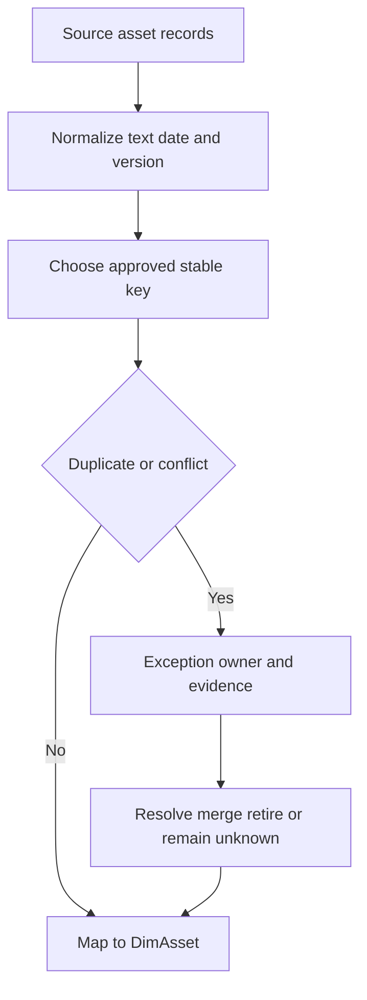

## 3. Excel formula patterns

**Pattern test contract:** formulas assume Excel Tables named in each example. `Expected` is a hand-checked synthetic result, not a runtime execution claim.

### Pattern I-P01 - Stable-key lookup with explicit missing state

```excel
=XLOOKUP([@AssetKey],DimAsset[AssetKey],DimAsset[Owner],"UNKNOWN",0)
```

**Adaptation/test:** `SYN-ASSET-001` maps to `Storage Ops`; an absent key returns `UNKNOWN`. **Use:** controlled owner enrichment. **Trap:** duplicate keys return one match and must fail QA. **Target validation:** test exact Excel version/locale and duplicate-key check.

### Pattern I-P02 - Multi-key lookup

```excel
=XLOOKUP([@AssetKey]&"|"&TEXT([@ObservedUTC],"yyyymmdd"),FactHealth[AssetKey]&"|"&TEXT(FactHealth[ObservedUTC],"yyyymmdd"),FactHealth[FindingStatus],"UNKNOWN",0)
```

**Adaptation/test:** synthetic asset/date key returns `Open`; missing returns `UNKNOWN`. **Use:** small controlled sheets. **Trap:** dynamic-array performance and duplicate matches. **Target validation:** prefer Power Query/model relationships at scale.

### Pattern I-P03 - Aging days with blank handling

```excel
=IF([@OpenedDate]="","",MAX(0,TODAY()-[@OpenedDate]))
```

**Adaptation/test:** opened 10 days ago returns `10`; blank stays blank. **Use:** action aging. **Trap:** `TODAY()` is local and volatile; freeze a report-as-of date for audit.

### Pattern I-P04 - Controlled age bucket

```excel
=IFS([@AgeDays]="","Unknown",[@AgeDays]<=30,"0-30",[@AgeDays]<=60,"31-60",[@AgeDays]<=90,"61-90",TRUE,"90+")
```

**Adaptation/test:** 45 returns `31-60`; blank returns `Unknown`. **Use:** action/remediation cohorts. **Trap:** thresholds are policy, not universal truth.

### Pattern I-P05 - Data-quality completeness flag

```excel
=IF(OR([@AssetKey]="",[@SourceUTC]="",[@Release]=""),"FAIL","PASS")
```

**Adaptation/test:** missing release returns `FAIL`; all required fields return `PASS`. **Use:** row-level QA. **Trap:** presence does not prove validity.

### Pattern I-P06 - Duplicate-key count

```excel
=COUNTIF(DimAsset[AssetKey],[@AssetKey])
```

**Adaptation/test:** two `SYN-ASSET-001` rows return `2`. **Use:** uniqueness gate. **Trap:** whitespace/case normalization should happen before counting.

### Pattern I-P07 - Freshness status against controlled threshold

```excel
=IF([@LastSeenUTC]="","Unknown",IF(ReportAsOfUTC-[@LastSeenUTC]<=FreshnessDays,"Current","Stale"))
```

**Adaptation/test:** 5-day age with `FreshnessDays=7` returns `Current`; 10 returns `Stale`. **Use:** telemetry/inventory. **Trap:** named cells need UTC-compatible values and source-specific policy.

### Pattern I-P08 - Time-to-threshold with no-growth guard

```excel
=IF([@MonthlyGrowthTiB]<=0,NA(),MAX(0,([@ThresholdTiB]-[@UsedTiB])/[@MonthlyGrowthTiB]))
```

**Adaptation/test:** threshold 80, used 60, growth 2 returns `10`; zero growth returns `#N/A`. **Use:** linear runway. **Trap:** seasonality and step changes require scenarios.

### Pattern I-P09 - Risk score with confidence modifier

```excel
=ROUND([@Impact]*[@Likelihood]*[@Exposure]*[@ConfidenceFactor],1)
```

**Adaptation/test:** $5*4*1.0*0.8=16.0$. **Use:** transparent prioritization aid. **Trap:** arithmetic cannot replace expert/customer judgment; define scales.

### Pattern I-P10 - Safe percent change

```excel
=IFERROR(([@CurrentValue]-[@PriorValue])/ABS([@PriorValue]),NA())
```

**Adaptation/test:** 120 versus 100 returns 20%; prior zero returns `#N/A`. **Use:** trend labels. **Trap:** low-base effects and sign changes need absolute values beside percentages.

### Pattern I-P11 - Conditional count for overdue open actions

```excel
=COUNTIFS(FactAction[Status],"<>Done",FactAction[DueDate],"<"&ReportAsOfDate)
```

**Adaptation/test:** three non-Done past-due rows return `3`. **Use:** action KPI. **Trap:** cancelled/accepted-risk statuses need governed inclusion rules.

### Pattern I-P12 - Weighted average latency

```excel
=SUMPRODUCT(FactHealth[LatencyMs],FactHealth[OperationCount])/SUM(FactHealth[OperationCount])
```

**Adaptation/test:** 100 ops at 2 ms plus 300 at 4 ms returns 3.5 ms. **Use:** operation-weighted mean. **Trap:** filter to one compatible scope/time and do not substitute for percentiles.

## 4. Power Query M patterns

### Diagram I06 - Power Query pipeline


### Pattern I-P13 - Explicit column typing

```powerquery
Table.TransformColumnTypes(
    Source,
    {{"AssetKey", type text}, {"ObservedUTC", type datetimezone}, {"UsedTiB", type number}},
    "en-US"
)
```

**Adaptation/test:** synthetic text/date/number rows retain intended types. **Use:** prevent implicit conversion. **Trap:** locale and malformed rows need an exception path. **Target validation:** execute with target connector and locale.

### Pattern I-P14 - Trim and uppercase stable keys

```powerquery
Table.TransformColumns(
    Typed,
    {{"AssetKey", each if _ = null then null else Text.Upper(Text.Trim(_)), type text}}
)
```

**Adaptation/test:** ` syn-asset-001 ` becomes `SYN-ASSET-001`; null remains null. **Trap:** normalization can merge genuinely distinct case-sensitive IDs; confirm source semantics.

### Pattern I-P15 - Required-column assertion

```powerquery
let
    Required = {"AssetKey", "ObservedUTC", "SourceSystem"},
    Missing = List.Difference(Required, Table.ColumnNames(Source))
in
    if List.IsEmpty(Missing) then Source else error "Missing required columns: " & Text.Combine(Missing, ", ")
```

**Adaptation/test:** a table missing `SourceSystem` raises a clear error. **Use:** fail closed on schema drift. **Trap:** error messages must not expose sensitive paths.

### Pattern I-P16 - Left join with match status

```powerquery
let
    Joined = Table.NestedJoin(Fact, {"AssetKey"}, DimAsset, {"AssetKey"}, "Asset", JoinKind.LeftOuter),
    WithStatus = Table.AddColumn(Joined, "AssetMatch", each if Table.RowCount([Asset]) = 1 then "Matched" else if Table.RowCount([Asset]) = 0 then "Missing" else "Duplicate", type text)
in
    WithStatus
```

**Adaptation/test:** one match -> `Matched`; none -> `Missing`; duplicate dimension key -> `Duplicate`. **Trap:** do not expand until cardinality passes.

### Pattern I-P17 - Source-file provenance from folder ingestion

```powerquery
Table.AddColumn(Files, "SourceRef", each [Folder Path] & [Name], type text)
```

**Adaptation/test:** synthetic folder/name concatenate to one source reference. **Use:** lineage. **Trap:** paths can expose customer/user details; hash or redact before publication.

### Pattern I-P18 - Age in days from UTC cutoff

```powerquery
Table.AddColumn(
    Typed,
    "AgeDays",
    each if [LastSeenUTC] = null then null else Duration.Days(pReportAsOfUTC - [LastSeenUTC]),
    Int64.Type
)
```

**Adaptation/test:** cutoff minus a timestamp seven days earlier returns `7`. **Trap:** parameter and field must be compatible datetimezone values.

### Pattern I-P19 - Unpivot repeated metric columns

```powerquery
Table.Unpivot(
    Source,
    {"UsedTiB", "UsableTiB", "SnapshotTiB"},
    "MetricName",
    "MetricValue"
)
```

**Adaptation/test:** one synthetic asset row becomes three metric rows. **Use:** tidy metric fact. **Trap:** preserve explicit unit/definition mapping for each metric.

## 5. Power BI model, measures, security, and refresh

### Diagram I07 - Power BI semantic model

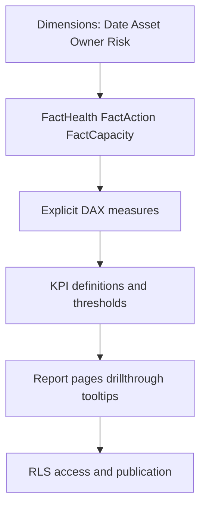

### Diagram I08 - Relationship gate

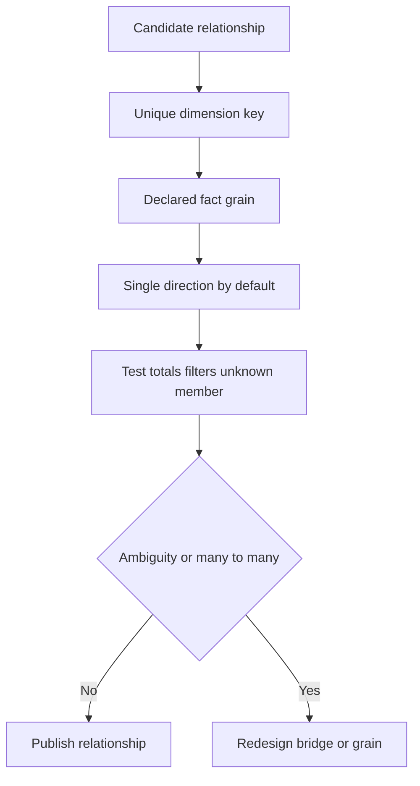

### Pattern I-P20 - Asset count

```dax
Asset Count := DISTINCTCOUNT ( DimAsset[AssetKey] )
```

**Adaptation/test:** three unique synthetic keys across repeated facts return `3`. **Trap:** define active/current asset filtering separately.

### Pattern I-P21 - Used capacity TiB

```dax
Used Capacity TiB := SUM ( FactCapacity[UsedTiB] )
```

**Adaptation/test:** 10 + 15 synthetic TiB returns 25. **Trap:** summing snapshots across dates double-counts; filter one observation grain.

### Pattern I-P22 - Capacity utilization

```dax
Capacity Utilization % := DIVIDE ( [Used Capacity TiB], SUM ( FactCapacity[UsableTiB] ) )
```

**Adaptation/test:** 60/80 returns 75%. **Trap:** denominator may repeat by fact grain; model one snapshot row per object/date.

### Pattern I-P23 - Open high risks

```dax
Open High Risks :=
CALCULATE (
    DISTINCTCOUNT ( FactHealth[FindingKey] ),
    FactHealth[FindingStatus] = "Open",
    DimRisk[Severity] = "High"
)
```

**Adaptation/test:** two distinct open-high findings return `2`. **Trap:** severity/status definitions and slowly changing state need governance.

### Pattern I-P24 - Overdue action count

```dax
Overdue Actions :=
VAR AsOfDate = MAX ( DimDate[Date] )
RETURN
CALCULATE (
    DISTINCTCOUNT ( FactAction[ActionKey] ),
    FactAction[Status] <> "Done",
    FactAction[DueDate] < AsOfDate
)
```

**Adaptation/test:** three distinct non-Done actions before selected date return `3`. **Trap:** cancelled/accepted statuses and snapshot/current-row grain must be defined.

### KPI definition table

| KPI | Definition | Grain/window | Owner/source | Target/status rule | Caveat |
|---|---|---|---|---|---|
| Inventory coverage | Assets reconciled / expected assets | Account at cutoff | Install-base owner | Policy-defined | Expected denominator may be uncertain |
| Telemetry freshness | Assets meeting source-specific freshness / eligible assets | Asset at cutoff | Telemetry owner | Current source rule | Ineligible/unknown separated |
| Open high risks | Distinct open findings classified high | Finding current state | Risk owner | Context-specific | Score is decision aid |
| Overdue actions | Distinct active actions beyond due date | Action current state | Action owner | Zero or agreed limit | Exclude governed terminal states |
| Capacity runway | Months to operating threshold by scenario | Object at cutoff | Capacity owner | Lead-time based | Linear model caveat |
| Repeat incidents | Incidents matching governed signature | Service/period | Problem owner | Trend target | Classification quality matters |

### Diagram I09 - Row-level security design

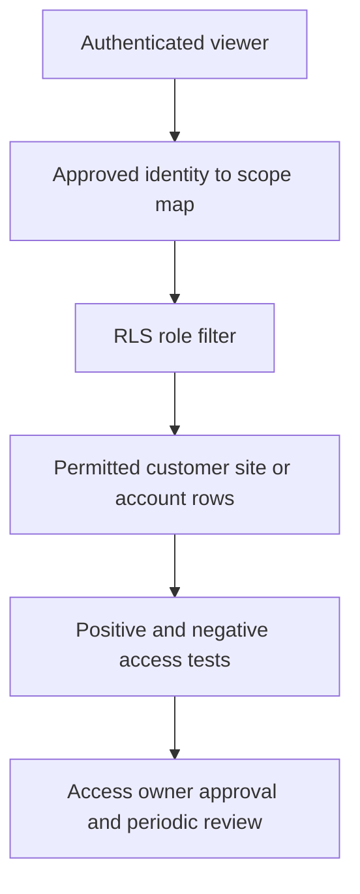

**RLS rules:** least privilege; one governed mapping table; no sensitive values in URLs/tooltips; test as each role; test denied cross-customer access; distinguish report RLS from workspace/app permissions/export/build access; document service principals and gateway access.

### Diagram I10 - Refresh assurance

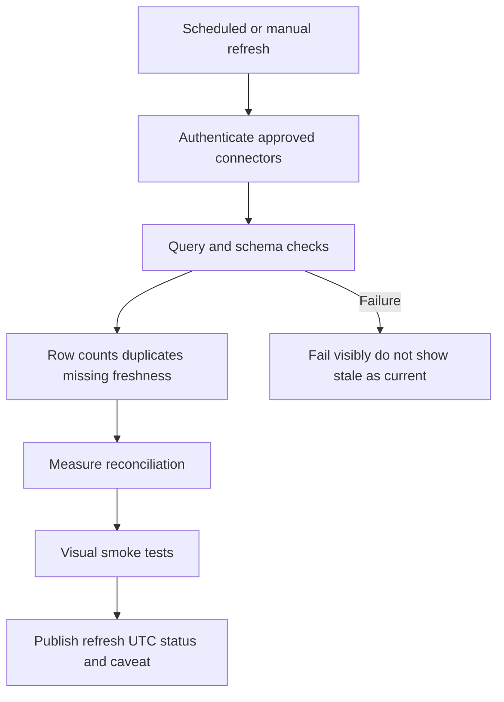

### Power BI page architecture

| Page | Audience/question | Required elements |
|---|---|---|
| Executive overview | What changed and what decisions are needed? | Three KPIs, trend, top risks, decision/action panel, cutoff |
| Estate quality | Can we trust inventory and telemetry? | Coverage, freshness, exceptions, source QA |
| Health/risk | Which conditions matter most? | Risk by domain/criticality, drillthrough, evidence/confidence |
| Capacity/performance | Where is runway or workload risk? | Scenario runway, baseline/percentiles, units and caveats |
| Lifecycle/supportability | What needs coordinated remediation? | Version/lifecycle matrix, unknowns, owners/dates |
| Actions/value | Are decisions moving and creating outcomes? | aging, blockers, completion evidence, value statement |
| Technical detail | What supports the conclusion? | exact objects, sources, fields, definitions, secure access |

### Diagram I11 - Accessibility path

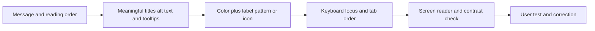

## 6. Pivot, slicer, and chart matrix

### Diagram I12 - Visual selection decision

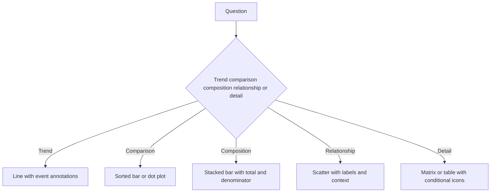

| Question | Pivot rows | Columns | Values | Slicers | Visual |
|---|---|---|---|---|---|
| Risk by domain | Risk domain | Severity | Distinct finding count | account/site/criticality | Sorted stacked bar |
| Actions aging | Owner | Age bucket | Distinct action count | status/risk domain | Matrix + bar |
| Capacity runway | Asset/site | Scenario | Months to threshold | criticality/platform | Dot plot/table |
| Telemetry freshness | Site | Freshness state | Distinct asset count | family/owner | 100% stacked bar |
| Incident trend | Month | Severity | Incident count/duration | service/signature | Line + columns |
| Lifecycle exposure | Product/release | Lifecycle state | Asset count | site/criticality | Heatmap matrix |

## 7. Twenty visual and story templates

### Visual I-V01 - Executive three-message page

**Layout:** top sentence title; three KPI blocks; one trend; right-side decisions. **Story:** `Current state -> material change -> decision`. **Source label:** `<source/cutoff/confidence>`. **Avoid:** decorative gauges and unexplained red.

### Visual I-V02 - Evidence-to-recommendation slide

**Layout:** five columns: evidence, context, risk, action, proof. **Story:** traceability. **Use:** one recommendation only. **Avoid:** mixing facts and hypotheses.

### Visual I-V03 - Application-to-data topology

**Layout:** horizontal app, host, network/fabric, protocol, ONTAP, protection. **Story:** ownership and failure domains. **Avoid:** real IPs/serials in broad-audience decks.

### Visual I-V04 - Install-base coverage

**Layout:** expected versus reconciled bar, freshness states, exception table. **Story:** `Can we trust the denominator?` **Avoid:** calling unknown assets healthy.

### Visual I-V05 - Risk heatmap with evidence table

**Layout:** impact/likelihood matrix plus adjacent top-five rows. **Story:** priority and confidence. **Avoid:** heatmap without definitions or owner.

### Visual I-V06 - Capacity runway scenarios

**Layout:** used-capacity line; low/base/high; threshold band; latest-safe-start marker. **Story:** lead time, not panic. **Avoid:** hard-limit claims.

### Visual I-V07 - Performance baseline and tail

**Layout:** p50/p95/p99 trend plus workload/event annotation. **Story:** normal versus changed user experience. **Avoid:** dual axes and average-only latency.

### Visual I-V08 - Lifecycle roadmap

**Layout:** quarter timeline by asset family; support milestones; decision gates. **Story:** coordinated reduction of technical debt. **Avoid:** stale dates or invented milestones.

### Visual I-V09 - Upgrade dependency map

**Layout:** target release centered; spokes for health, IMT, HWU, hosts, switches, apps, change. **Story:** upgrade is an ecosystem decision. **Avoid:** presenting advisor output as approval.

### Visual I-V10 - Bug applicability card

**Layout:** symptom/trigger, affected configuration, customer evidence, applicability, action. **Story:** why this defect does or does not matter. **Avoid:** copied gated text.

### Visual I-V11 - Incident timeline

**Layout:** UTC line with impact, changes, alerts, decisions, restoration, validation. **Story:** sequence and evidence. **Avoid:** implying cause from proximity.

### Visual I-V12 - Repeat-incident Pareto

**Layout:** sorted signature counts plus cumulative line and action owners. **Story:** focus prevention effort. **Avoid:** categorization without quality review.

### Visual I-V13 - Action aging board

**Layout:** owner by age bucket, blockers, next checkpoint, evidence. **Story:** turn recommendations into movement. **Avoid:** shaming individuals or ambiguous due dates.

### Visual I-V14 - RACI decision slide

**Layout:** one decision, accountable owner, responsible/consulted/informed, due date. **Story:** resolve ownership. **Avoid:** multiple accountable parties.

### Visual I-V15 - Customer value chain

**Layout:** baseline, action, behavior/change, technical outcome, business contribution. **Story:** bounded value attribution. **Avoid:** claiming sole causation.

### Visual I-V16 - Data-quality scorecard

**Layout:** completeness, uniqueness, validity, consistency, freshness, coverage with exception counts. **Story:** confidence before conclusion. **Avoid:** one blended score hiding critical failures.

### Visual I-V17 - Protection and recoverability matrix

**Layout:** workload rows; snapshot/replication/backup/immutability/test columns; RPO/RTO. **Story:** copies versus proven recovery. **Avoid:** green based only on configured policy.

### Visual I-V18 - Security/advisory exposure funnel

**Layout:** advisory universe -> product/version match -> trigger/exposure -> remediation. **Story:** evidence-based applicability. **Avoid:** CVE title equals exposure.

### Visual I-V19 - Coaching progression

**Layout:** explain, demonstrate, shadow, supervised practice, teach-back, independent QA. **Story:** behavior transfer. **Avoid:** training completion as competence proof.

### Visual I-V20 - Closing decision and next-quarter slide

**Layout:** decisions taken, top three actions, owners/dates, expected proof, next review. **Story:** end with commitments. **Avoid:** ending on a dense appendix or generic thank-you.

### Diagram I13 - Story arc

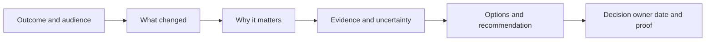

## 8. PowerPoint production toolkit

### Diagram I14 - Slide construction

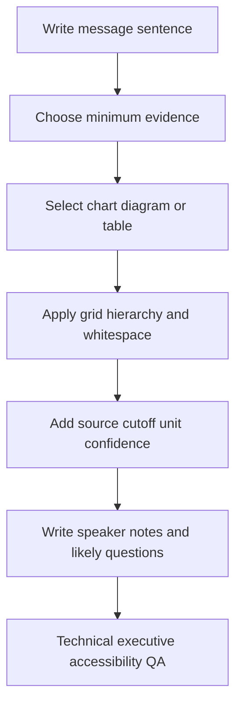

### Slide master/layout rules

| Element | Rule |
|---|---|
| Title | One decision-oriented sentence; no generic topic label |
| Grid | Stable margins and alignment; one dominant visual region |
| Text | Short labels; detail belongs in notes/appendix |
| Chart | Direct labels, units, cutoff, denominator, accessible colors |
| Table | Highlight only decision rows; repeat headers; avoid tiny type |
| Source | `Source: <system/report>, cutoff <UTC>, scope <objects>, confidence <level>` |
| Caveat | One visible material limitation, not buried in notes |
| Notes | intent, evidence, transition, likely objection, bounded answer |
| Version | artifact ID, version/date, owner, classification |

### Speaker-notes template

```markdown
Slide intent: <decision-or-understanding>
Opening sentence: <message-title-in-spoken-form>
Evidence: <source-cutoff-scope-definition>
What this proves: <bounded-statement>
What it does not prove: <limitation>
Transition: <why-next-slide-follows>
Likely question: <question>
Answer: <concise-evidence-based-answer>
Decision/action: <owner-date-validation>
```

### Diagram I15 - Source-label lineage


### Diagram I16 - Executive versus technical detail

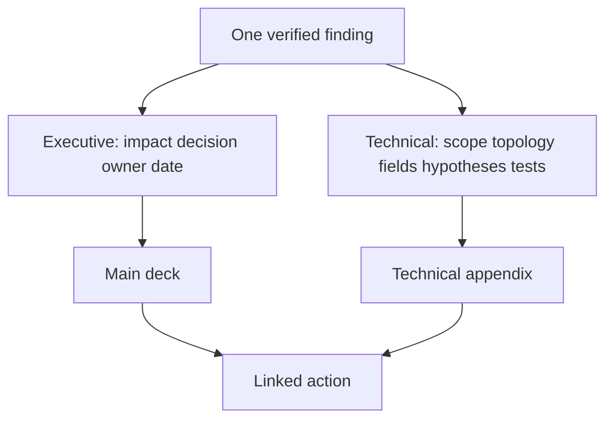

## 9. QA suites

### Excel and Power Query QA

| Test | Expected |
|---|---|
| Required schema | All required columns/types present; fail visibly otherwise |
| Row counts | Source, staging, output differences explained |
| Key uniqueness | Dimension keys exactly one; fact keys/grain governed |
| Join quality | Matched/missing/duplicate counts published |
| Null semantics | Unknown, N/A, not collected, and error remain distinct |
| Units/time | Consistent unit conversion and UTC/cutoff |
| Totals | Independent hand-check and source reconciliation |
| Formula edge cases | zero, blank, negative, duplicate, stale, boundary dates |
| Privacy | no secrets, unnecessary personal data, or gated text |
| Reproducibility | new authorized refresh produces explainable result |

### Diagram I17 - Workbook QA gate

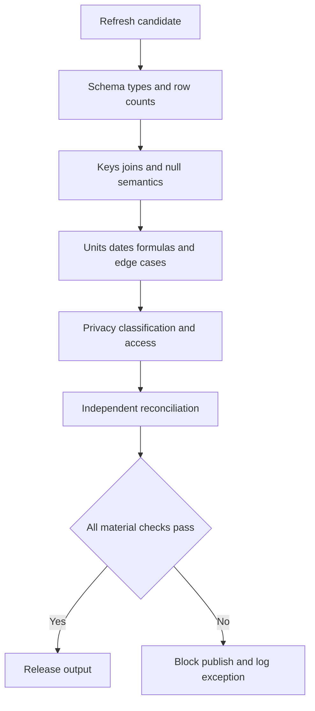

### Power BI QA

| Test | Expected |
|---|---|
| Model | Star shape, declared grain, no accidental bidirectional ambiguity |
| Measures | Explicit, formatted, denominator/blank behavior tested |
| Filters | Page/visual/report filters documented and reset behavior clear |
| RLS | Positive and negative role tests; workspace/export/build reviewed |
| Refresh | gateway/credential/schema/status/UTC and stale-data banner tested |
| Visual | totals match measures; drillthrough/tooltips do not leak data |
| Performance | query/visual performance within approved expectation |
| Accessibility | titles, alt text, contrast, labels, keyboard/tab order |
| Publication | workspace/app/audience/endorsement/version/owner approved |

### Diagram I18 - Power BI release gate

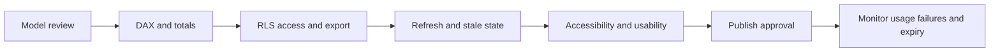

### PowerPoint QA

| Test | Expected |
|---|---|
| Narrative | One audience, outcome, message arc, explicit decisions |
| Accuracy | Every number/claim traces to validated model/source |
| Currency | Cutoff, version, refresh status, volatile sources rechecked |
| Consistency | Units, terms, dates, colors, statuses, owners align |
| Readability | Message titles, minimum text, legible labels, stable layout |
| Accessibility | contrast, reading order, alt text, no color-only meaning |
| Privacy | audience classification, redaction, notes/hidden slides reviewed |
| Delivery | speaker notes, timing, objections, backup technical detail |
| Follow-up | decisions/actions/minutes workflow ready |

### Diagram I19 - Deck QA gate

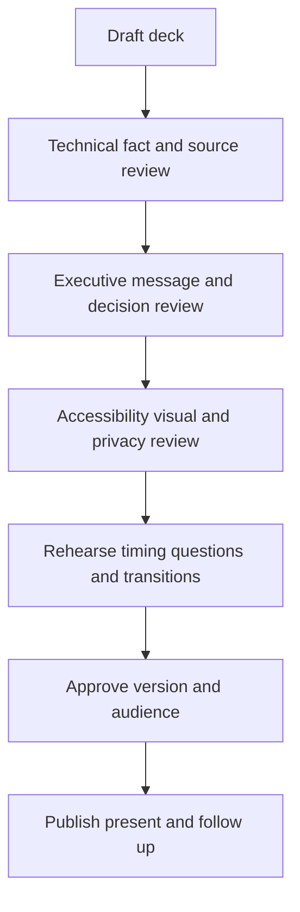

## 10. Integrated service-review workflow

### Diagram I20 - Service-review production cycle

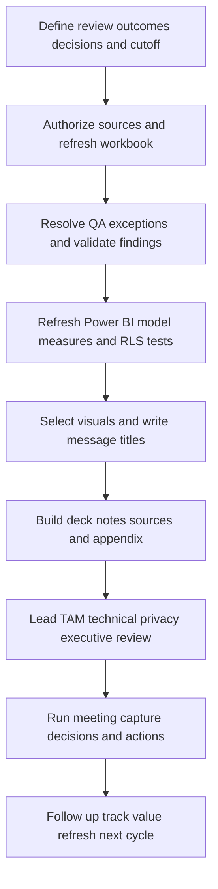

### End-to-end operating checklist

- [ ] Confirm review purpose, audience, decisions, owner, date, and data cutoff.
- [ ] Authorize each source and record privacy/classification/retention.
- [ ] Refresh staging queries; save refresh IDs and status without credentials.
- [ ] Pass schema, counts, keys, joins, nulls, units, freshness, and reconciliation QA.
- [ ] Validate high-impact findings with source owners/SMEs and record confidence.
- [ ] Refresh semantic model; reconcile measures to workbook/source totals.
- [ ] Test RLS, workspace/app access, export/build, tooltips, and drillthrough.
- [ ] Select visuals based on decisions; include denominators, units, cutoff, caveat.
- [ ] Build slides with message titles, source labels, notes, and technical appendix.
- [ ] Pass technical, account, executive, privacy, and accessibility review.
- [ ] Present; capture decision/action/risk owner/date/validation evidence.
- [ ] Publish approved minutes/follow-up; retire superseded files; schedule next refresh.

## Completion and use checklist

- [x] Workbook architecture, schemas, data dictionary, naming, Power Query, pivots/slicers/charts, and QA are covered.
- [x] Power BI star schema, relationships, measures, KPI definitions, pages, RLS, accessibility, refresh, and publication QA are covered.
- [x] PowerPoint storyboards, slide rules, chart/source labels, speaker notes, audience split, and presentation QA are covered.
- [x] 24 numbered Excel/M/DAX patterns exceed the required 20 and state synthetic expected checks and target-runtime validation.
- [x] 20 numbered visual/story templates meet the required 20.
- [x] 20 numbered Mermaid diagrams meet the required 20.
- [x] Integrated service-review production and follow-up workflow is included.
- [x] Privacy, access, version, synthetic-evidence, test-honesty, owner/source/date/confidence/validation/residual-risk boundaries are explicit.
- [ ] Execute formulas, M, and DAX in the exact target Microsoft versions before operational use.
- [ ] Test RLS and publication with approved representative accounts, including negative access tests.

---

*Navigation:* Previous: [Appendix H - Storage Math, Capacity, Performance, and Forecasting Workbook Guide](Appendix-H-storage-math-capacity-performance.md) | Next: [Appendix J - Study Planner, Lab Portfolio, and Readiness Scorecard](Appendix-J-study-planner-readiness-scorecard.md) | [Master guide](../NetApp%20TAM%20Technical%20Analyst%20-%20Complete%20Study%20Guide.md)