# Appendix J - Study Planner, Lab Portfolio, and Readiness Scorecard

> **Purpose:** Convert the completed 96-Part curriculum, ten appendices, 240-question bank, labs, and behavioral story work into a realistic practice plan and evidence-based interview-readiness decision.
>
> **How to use:** Take the diagnostic closed-book, choose the plan matching available weeks and sustainable hours, track recall and performance separately, build sanitized lab evidence, run timed mocks, and advance only when readiness gates are demonstrated repeatedly.
>
> **Reference date:** 2026-08-24

## Scope, honesty, privacy, and wellbeing boundaries

- Reading builds familiarity and knowledge; it does **not** by itself create interview performance, production ONTAP experience, customer authority, certification, or reliable behavior under pressure.
- Readiness requires closed-book recall, diagrams from memory, calculations with units, scenario judgment, factual STAR stories, mock interviews, feedback, and correction.
- All practice environments, account cases, outputs, scores, and portfolio examples are synthetic unless backed by authorized evidence. Use `SYN-` identifiers and never expose customer data, credentials, gated content, private employer information, or internal methods.
- Product behavior, supportability, lifecycle, commands, tools, certifications, and exam paths change. Recheck [Appendix E](Appendix-E-official-netapp-source-map.md) and current official sources before claims or milestones.
- Study plans are adjustable templates, not medical advice or a demand to sacrifice sleep, family, work, health, or safety. Stop or reduce load when fatigue degrades judgment.
- The diagnostic is for prioritization, not self-worth. A red cell means `practice next`, not `incapable`.

## 1. Candid readiness model

### Diagram J01 - Reading to performance

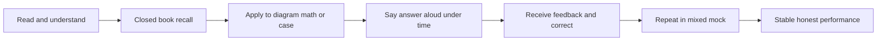

| Level | Evidence | Not enough |
|---|---|---|
| Familiarity | Recognize term while reading | `I remember seeing this` |
| Recall | Define and distinguish without notes | Reciting unexplained jargon |
| Application | Draw, calculate, troubleshoot, or recommend | One memorized scenario |
| Communication | Structure for technical/executive audience | Long unbounded answer |
| Judgment | State assumptions, safety, current-check, tradeoffs | Bluffing certainty |
| Performance | Repeat across mixed timed mocks | One good practice session |

## 2. Diagnostic baseline

### Diagnostic session: 180 minutes

| Block | Time | Task | Evidence |
|---|---:|---|---|
| Bank sample | 75 min | 30 random closed-book questions: 6 Basic, 6 Intermediate, 18 Advanced across at least eight domains | Question tracker and recording |
| Whiteboard | 15 min | Application-to-data or ONTAP/SVM/LIF path from memory | Photo/PDF with corrections |
| Numerical | 15 min | Two calculations with assumptions and units | Working and unit check |
| Troubleshooting case | 25 min | Scope, timeline, hypotheses, evidence, safe next test, escalation | Case scorecard |
| TAM/customer case | 20 min | Evidence -> risk -> recommendation -> adoption -> validation | Recommendation card |
| Behavioral | 20 min | Two factual STAR-L answers | Recording and fact check |
| Closing | 10 min | Why move, why role, honest gap/ramp, two questions | Recording |

### Diagram J02 - Diagnostic routing

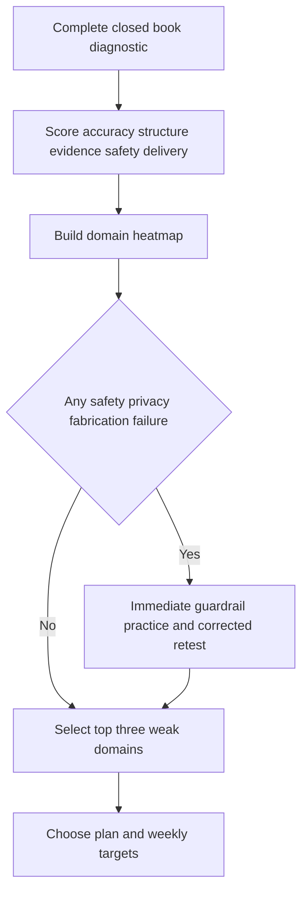

### Question score scale

| Score | Meaning | Observable standard |
|---:|---|---|
| 0 | Blank/unsafe/incorrect | Cannot state fundamentals, fabricates, or proposes unsafe action |
| 1 | Partial | Has core fragments but misses mechanism, boundary, or structure |
| 2 | Interview-usable | Correct fundamentals, clear flow, evidence/safety/current-check boundary |
| 3 | Strong | Concise, technically defensible, customer-aware, handles follow-up/tradeoff |

### Copy-ready diagnostic record

```markdown
Diagnostic ID: SYN-DIAG-001
Date/timezone: <UTC-and-local-offset>
Plan deadline: <interview-or-target-date>
Available sustainable hours/week: <number>
Bank sample IDs: <30-IDs>
Bank score 0/1/2/3 counts: <counts>
Whiteboard score: <0-3>
Numerical score: <0-3>
Troubleshooting case score: <0-3>
TAM case score: <0-3>
Behavioral score: <0-3>
Closing score: <0-3>
Safety/privacy/fabrication failures: <count-and-corrections>
Top three strengths: <domains>
Top three weak areas: <domains>
Selected plan: <2-4-8-12-16-week-or-crunch>
Owner: <learner> | Source: <recordings-and-trackers> | Date: <UTC>
Confidence: <level> | Validation: <self-peer-coach>
Residual risk: <untested-domains-or-performance-conditions>
```

## 3. Study operating system

### Diagram J03 - Four learning modes

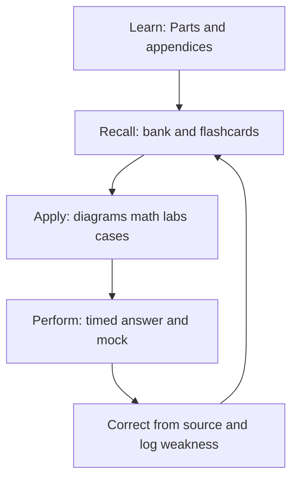

### Daily block options

| Available time | Sustainable block | Minimum output |
|---:|---|---|
| 30 min | 5 recall + 15 weak concept + 10 aloud | 3 bank questions scored and corrected |
| 60 min | 10 recall + 20 concept + 15 applied + 15 aloud | 5 questions + one diagram/math/case |
| 90 min | 15 recall + 25 concept + 25 applied + 20 aloud + 5 log | 8 questions + artifact/recording |
| 120 min | Two 50-minute focus blocks + breaks + 20 review | 10 questions + lab/case + one corrected answer |

### Weekly rhythm

| Day | Primary mode | Example |
|---|---|---|
| Monday | Learn/repair | Weak Parts and current-source check |
| Tuesday | Recall | Mixed bank plus spaced repetition |
| Wednesday | Apply | Whiteboard and numerical practice |
| Thursday | Apply | Troubleshooting or TAM case |
| Friday | Communicate | Answer aloud, behavioral, closing |
| Saturday | Perform | Lab portfolio or timed mock |
| Sunday | Recover/review | Light flashcards, tracker, next-week plan, or full rest |

### Spaced-repetition schedule

| Stage | Due | Action | Promotion rule |
|---|---|---|---|
| New | Day 0 | Closed-book attempt, then correct | Record score and linked Part |
| Relearn | Day 1 | Explain in simpler words | Correct mechanism and boundary |
| Short | Day 3 | Randomized answer aloud | Score 2+ |
| Weekly | Day 7 | Answer with follow-up | Score 2+ without prompt |
| Fortnight | Day 14 | Apply to new case/diagram | Transfer succeeds |
| Monthly | Day 30 | Mixed mock | Score 2+ under time |
| Maintenance | Day 60+ | Random retrieval | Return sooner after any miss |

### Diagram J04 - Spaced-repetition state

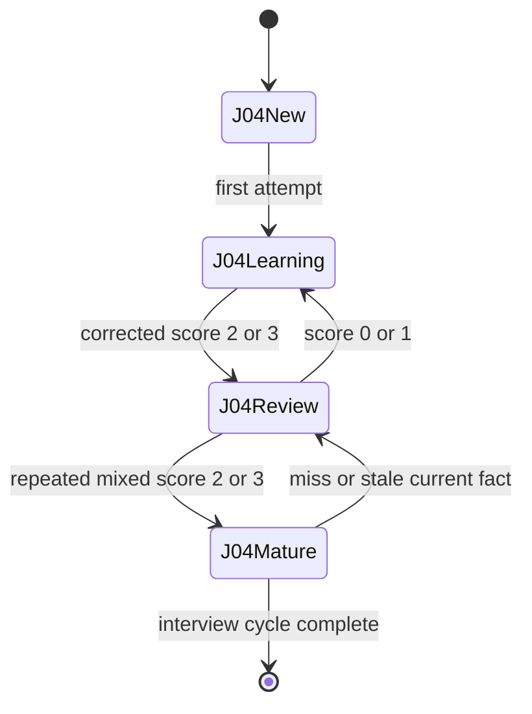

## 4. Curriculum paths and Part sequence

| Stage | Parts | Outcome | Practice proof |
|---|---:|---|---|
| Role and foundations | 1-18 | Customer context, storage, network, protocols | Application-to-data whiteboard + basic bank |
| ONTAP and data services | 19-46 | Architecture, admin, NAS/SAN/object, protection/security/performance | ONTAP whiteboards + calculations + cases |
| Proactive analytics | 47-60 | Telemetry, IMT/HWU, bugs/lifecycle/upgrades, data/BI | Synthetic risk/upgrade workbook |
| Customer execution | 61-70 | Reviews, discovery, influence, communication, projects, coaching | Service-review excerpt + objection role-play |
| Troubleshooting/cases | 71-81 | Incidents, escalation, domain diagnosis, integrated judgment | Timed fault tree and escalation package |
| Labs/ecosystem/capstone | 82-91 | Safe evidence, labs, VMware/Kubernetes/cloud, full review | Sanitized portfolio |
| Extra edge/interview | 92-96 | ITIL/SRE, competition, specialization, 240 bank, behavioral/closing | Mixed mocks and factual story bank |
| Field appendices | A-J | Lookup, diagrams, commands, sources, templates, incidents, math, Office, plan | Timed reference use without rote memorization |

### Diagram J05 - Path chooser

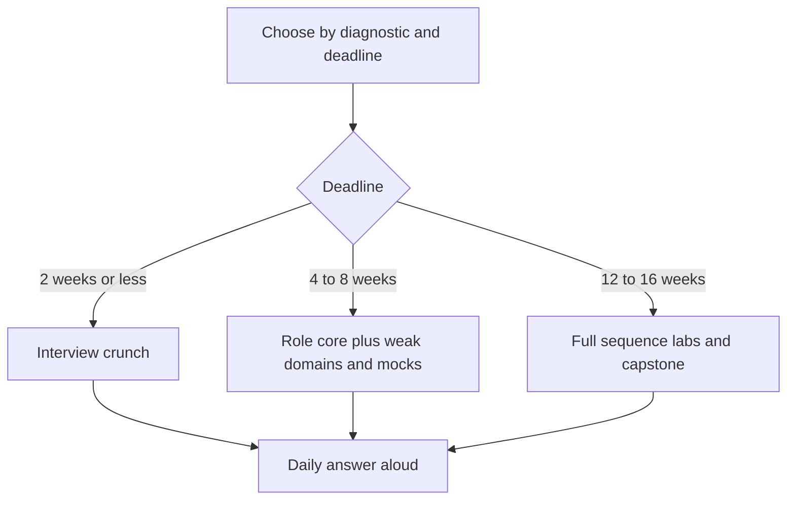

### Strength-aware routes

| Route | Order | Why |
|---|---|---|
| Storage-gap closure | 4-46 -> 47-55 -> 71-79 -> 82-91 | Builds new infrastructure depth first |
| TAM delivery | 1-3 -> 47-70 -> 80-81 -> 90-96 | Uses support/analytics/customer-review strengths |
| Lab first | 82-91 with linked theory backfill | Converts abstract concepts into honest evidence |
| Interview performance | 95 diagnostic -> weak Parts -> 96 -> mixed mocks | Targets demonstrated gaps, not page completion |

## 5. Two-week plan

**Assumption:** 2-3 sustainable hours weekdays, 3-4 hours on one weekend day; reduce scope rather than sleep.

| Day | Parts/focus | Practice output |
|---:|---|---|
| 1 | Diagnostic; 1-3 | Role story and gap statement |
| 2 | 4-10 | Storage/math whiteboard and 12 bank questions |
| 3 | 11-18 | TCP/NAS/SAN flows and 12 bank questions |
| 4 | 19-26 | ONTAP/WAFL/HA/SVM/LIF diagram |
| 5 | 27-34 | NFS/SMB/SAN/object/efficiency case |
| 6 | 35-46 | Protection/security/performance calculations |
| 7 | Recovery + Mock 1 | Score, corrections, heatmap update |
| 8 | 47-55 | AutoSupport/IMT/HWU/bug/lifecycle/upgrade case |
| 9 | 56-60 | Synthetic data-to-recommendation visual |
| 10 | 61-70 | Service-review and objection role-play |
| 11 | 71-81 | Incident fault tree and escalation package |
| 12 | 82-94 | Lab claims, cloud/VMware/Kubernetes, current certification check |
| 13 | 95-96 | Mixed bank, six story cards, closing answers |
| 14 | Mock 2 + light review | Final gate, rest, logistics, no new deep topic |

## 6. Four-week plan

| Week | Knowledge focus | Application/performance | Exit evidence |
|---:|---|---|---|
| 1 | Parts 1-18 | Foundations whiteboards, 48 Basic bank | All Basic attempted; core terms score 2+ |
| 2 | Parts 19-46 | ONTAP/data service/protection/performance cases | Four diagrams, four calculations, one mock |
| 3 | Parts 47-81 | Proactive assessment, review, incident, influence | Risk/upgrade pack + role-play |
| 4 | Parts 82-96 + appendices | Portfolio, 240-bank gaps, behavioral, two mocks | Readiness gate or documented extension plan |

## 7. Eight-week plan

| Week | Parts | Main output |
|---:|---|---|
| 1 | 1-10 | Role map + storage/math workbook |
| 2 | 11-18 | Network/protocol atlas |
| 3 | 19-34 | ONTAP architecture/data-service diagrams |
| 4 | 35-46 | Protection/security/performance case pack |
| 5 | 47-60 | Proactive risk and analytics pack |
| 6 | 61-81 | Service review, influence, incidents, scenarios |
| 7 | 82-94 | Two labs/capstone slices + ecosystem/current-source review |
| 8 | 95-96/A-J | 240-bank closure, STAR/closing, three mixed mocks |

## 8. Twelve-week plan

| Phase | Weeks | Parts | Evidence |
|---|---:|---:|---|
| Foundation | 1-2 | 1-18 | Two whiteboards, basic bank, unit math |
| ONTAP core | 3-5 | 19-46 | Architecture atlas, NAS/SAN/protection/performance cases |
| Proactive analysis | 6-7 | 47-60 | Inventory/IMT/HWU/bug/lifecycle/upgrade workbook |
| Customer execution | 8 | 61-70 | Service-review storyboard and influence role-play |
| Troubleshooting | 9 | 71-81 | Incident simulation and escalation pack |
| Labs/ecosystem | 10 | 82-91 | Two or more portfolio artifacts plus capstone slice |
| Extra/interview | 11 | 92-96 | Specialization/current source check, bank, stories |
| Performance | 12 | A-J | Three mocks, heatmap closure, readiness decision |

## 9. Sixteen-week plan

| Phase | Weeks | Work | Gate |
|---|---:|---|---|
| Learn foundations | 1-3 | Parts 1-18; bank B001-B048 | Basic gate |
| Learn ONTAP | 4-7 | Parts 19-46; diagrams/math/cases | Technical-core gate |
| Proactive TAM | 8-10 | Parts 47-70; analytics/service review | Recommendation gate |
| Troubleshoot | 11-12 | Parts 71-81; incident simulations | Safety/judgment gate |
| Build evidence | 13-14 | Parts 82-94; labs/capstone/current sources | Portfolio gate |
| Perform | 15 | Part 95; mixed 240-bank closure | Bank gate |
| Close | 16 | Part 96; mocks, company/current role research, rest | Final readiness gate |

### Diagram J06 - Plan control loop

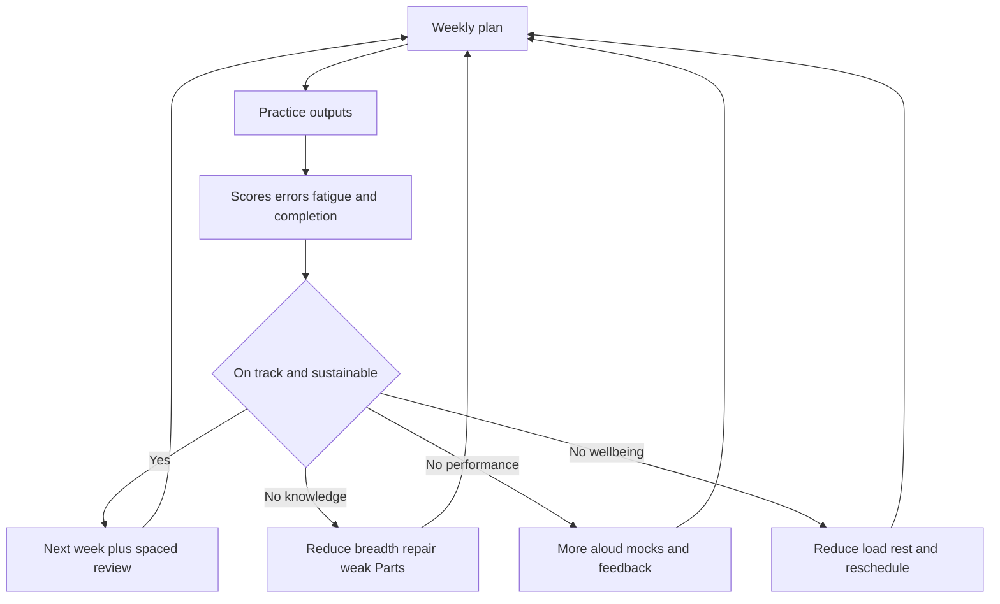

## 10. Interview-crunch plan

### Seven-day crunch

| Day | Priority | Do not do |
|---:|---|---|
| 1 | Diagnostic, role/JD map, honest gap and strengths | Read all 96 Parts linearly |
| 2 | Storage/ONTAP architecture whiteboards | Memorize unsupported limits |
| 3 | Networking, NFS/SMB, SAN path and fault trees | Practice commands as production claims |
| 4 | Protection/security/performance/capacity math | Promise efficiency or recovery |
| 5 | AutoSupport/IMT/HWU/bugs/lifecycle/upgrade/TAM review | Invent gated-tool access |
| 6 | Full technical/TAM mock; six factual STAR-L stories | Rewrite personal history |
| 7 | Light mixed recall, company/role current check, logistics, sleep | Cram new advanced topics |

### 48-hour emergency version

1. Record role story, why move, honest NetApp gap/ramp, and six factual story headlines.
2. Draw application-to-data, ONTAP cluster/SVM/LIF, NAS, SAN, protection, and evidence-to-recommendation flows.
3. Practice 20 questions: 4 Basic, 4 Intermediate, 12 Advanced across technical/TAM/behavioral.
4. Solve capacity runway, IOPS-throughput, Little's Law, replication bandwidth, RPO/RTO, and availability examples.
5. Run one 90-minute mock; repair only the highest-risk misses.
6. Recheck current public company/product/certification facts; do not memorize volatile limits.
7. Protect sleep, food, hydration, travel/technology setup, and a quiet buffer before the interview.

## 11. Practice modality trackers

### Answer-aloud tracker

```markdown
Date/UTC: <time>
Question ID/topic: <B-I-A-ID-or-custom>
First answer duration: <seconds>
Score 0-3: <score>
Accuracy gap: <gap>
Structure gap: <gap>
Evidence/safety/current-check gap: <gap>
Delivery gap: <gap>
Linked Part/Appendix: <relative-reference>
Corrected 30/90/180-second answer: <artifact-reference>
Next due: <date>
Owner/source/date/confidence/validation/residual risk: <values>
```

### Whiteboard tracker

| ID | Prompt | Time | Required labels | Score | Missing/correction | Next due |
|---|---|---:|---|---:|---|---|
| SYN-WB-001 | `<application-to-data-or-domain-flow>` | `<minutes>` | scope, layers, owners, failure domains, evidence, non-proof | `<0-3>` | `<items>` | `<date>` |

### Numerical tracker

| ID | Problem | Assumptions | Formula/units | Result | Sanity check | Interpretation/trap | Score/next |
|---|---|---|---|---|---|---|---|
| SYN-NUM-001 | `<capacity-performance-protection>` | `<values>` | `<working>` | `<value-unit>` | `<check>` | `<meaning-limit>` | `<0-3/date>` |

### Case tracker

| ID | Case type | Scope/timeline | Hypotheses | Evidence/test safety | Recommendation/escalation | Validation | Score/next |
|---|---|---|---|---|---|---|---|
| SYN-CASE-001 | `<NAS-SAN-perf-upgrade-TAM>` | `<summary>` | `<ranked>` | `<sources-and-risk>` | `<action-owner-date>` | `<success-proof>` | `<0-3/date>` |

### Behavioral tracker

| Story ID | Factual anchors | Competencies | Personal action | Supported result | Learning/transfer | Guardrails | Score/next |
|---|---|---|---|---|---|---|---|
| SYN-STAR-001 | `<CV-confirmed-facts>` | `<skills>` | `<I-actions>` | `<bounded-outcome>` | `<lesson-TAM-transfer>` | `<no-invention/private-detail>` | `<0-3/date>` |

### Diagram J07 - Practice-mix wheel

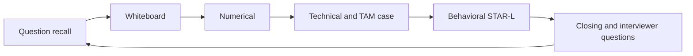

## 12. Part 95 240-question bank integration

Part 95 contains **240 unique prompts**: 48 Basic (`B001-B048`), 48 Intermediate (`I001-I048`), and 144 Advanced (`A001-A144`). Do not duplicate questions here; track the stable IDs and correct from the linked Part in [Part 95](Part-95-interview-question-bank.md).

### Master bank-range tracker

| Bank section | IDs | Count | Attempted | Score 2+ | Score 3 | Last mixed test | Next due |
|---|---|---:|---:|---:|---:|---|---|
| Basic role | B001-B008 | 8 |  |  |  |  |  |
| Basic storage/math | B009-B020 | 12 |  |  |  |  |  |
| Basic networking | B021-B028 | 8 |  |  |  |  |  |
| Basic protocols | B029-B040 | 12 |  |  |  |  |  |
| Basic ONTAP/evidence | B041-B048 | 8 |  |  |  |  |  |
| Intermediate ONTAP | I001-I008 | 8 |  |  |  |  |  |
| Intermediate data services | I009-I016 | 8 |  |  |  |  |  |
| Intermediate protection/security | I017-I024 | 8 |  |  |  |  |  |
| Intermediate performance/capacity | I025-I032 | 8 |  |  |  |  |  |
| Intermediate proactive support | I033-I040 | 8 |  |  |  |  |  |
| Intermediate TAM/ecosystem | I041-I048 | 8 |  |  |  |  |  |
| Advanced ONTAP/hardware | A001-A012 | 12 |  |  |  |  |  |
| Advanced data services | A013-A024 | 12 |  |  |  |  |  |
| Advanced protection/security | A025-A036 | 12 |  |  |  |  |  |
| Advanced performance/math | A037-A048 | 12 |  |  |  |  |  |
| Advanced proactive support | A049-A060 | 12 |  |  |  |  |  |
| Advanced analytics/customer | A061-A072 | 12 |  |  |  |  |  |
| Advanced incidents | A073-A084 | 12 |  |  |  |  |  |
| Advanced ecosystem | A085-A096 | 12 |  |  |  |  |  |
| Advanced extra edge | A097-A108 | 12 |  |  |  |  |  |
| Advanced behavioral | A109-A132 | 24 |  |  |  |  |  |
| Advanced closing | A133-A144 | 12 |  |  |  |  |  |
| **Total** | **B001-B048, I001-I048, A001-A144** | **240** |  |  |  |  |  |

### Question-level tracker schema

| Field | Value |
|---|---|
| `QuestionID` | `<B001-I001-A001>` |
| `Domain/linked Part` | `<domain-and-Part>` |
| `AttemptCount` | `<integer>` |
| `FirstScore` / `LatestScore` | `<0-3>` |
| `LastAttemptUTC` / `NextDueDate` | `<values>` |
| `AnswerDurationSeconds` | `<integer>` |
| `FailureTag` | accuracy/structure/evidence/safety/current/delivery |
| `Correction` | `<one-sentence-or-artifact-reference>` |
| `TransferPrompt` | `<new-case-or-follow-up>` |
| `Confidence/validation` | `<values>` |

### Random mixed-set recipe

- Ten-question set: 2 Basic, 2 Intermediate, 6 Advanced.
- Include at least one architecture, numerical, troubleshooting, customer-judgment, and behavioral/closing prompt.
- Draw IDs randomly; hide model answers; avoid practicing a section in fixed order after first baseline.
- Score the first answer before correction. Log safety/privacy/fabrication as gate failures regardless of total score.

### Diagram J08 - Bank feedback loop

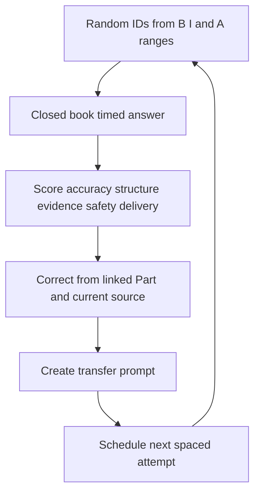

## 13. Lab evidence portfolio

| Part | Portfolio artifact | Honest claim after completion |
|---:|---|---|
| 82 | Safety/access/cost/privacy plan and evidence journal | `I designed an authorized/synthetic practice method` |
| 83 | Discovery topology, inventory, health baseline | `I completed a lab/documentation-based discovery exercise` |
| 84 | NAS flow, positive/negative test, fault isolation | `I practiced NFS/SMB reasoning in <exact environment>` |
| 85 | SAN mapping/path diagram and multipath test evidence | `I practiced SAN/multipath reasoning in <exact environment>` |
| 86 | Protection design, recovery test, RPO/RTO evidence | `I tested/simulated recoverability under stated conditions` |
| 87 | VMware datastore/path architecture case | `I analyzed a synthetic VMware-on-NetApp design` |
| 88 | Kubernetes/Trident PVC-to-backend architecture case | `I analyzed or lab-tested the stated integration` |
| 89 | Hybrid-cloud responsibility/cost/resilience comparison | `I completed a source-grounded design case` |
| 90 | Telemetry/IMT/HWU/bug/lifecycle/upgrade assessment | `I used authorized or synthetic evidence as labeled` |
| 91 | Full service-review workbook/deck/actions | `I delivered a fictional capstone, not a customer review` |

### Lab evidence log

```markdown
Artifact ID: SYN-LAB-001
Linked Part/objective: <Part-and-goal>
Environment/access basis: <authorized-lab-or-documentation-simulation>
Versions/source check UTC: <values>
Safety/change/privacy boundaries: <controls>
Topology/inputs: <sanitized-reference>
Procedure/test cases: <positive-negative-failure-recovery>
Raw evidence: <secure-reference-hash>
Observation versus interpretation: <separated-statements>
Validation: <expected-actual-peer-review>
What this proves: <bounded-skill>
What this does not prove: <production-authority-experience-limit>
Owner/source/date/confidence/residual risk: <values>
```

### Diagram J09 - Portfolio evidence chain

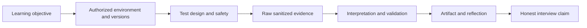

### Portfolio quality rubric

| Dimension | 0 | 1 | 2 | 3 |
|---|---|---|---|---|
| Safety/access | Missing/unsafe | Vague | Authorized and bounded | Threat/privacy/change controls explicit |
| Reproducibility | No versions/steps | Partial | Inputs/steps/versions present | Positive/negative/recovery cases and journal |
| Evidence | No proof | Screenshots only | Source/time/scope evidence | Raw references, hashes, cross-validation |
| Reasoning | Claims only | One explanation | Observations vs hypotheses | Competing hypotheses and discriminating tests |
| Communication | Unclear | Technical dump | Structured finding/action | Audience-tailored story and residual risk |
| Honesty | Overclaims | Ambiguous | Lab/synthetic clearly labeled | Proves/does-not-prove and transfer stated |

## 14. Weak-area heatmap

### Copy-ready heatmap

| Domain | Recall 0-3 | Diagram 0-3 | Applied case 0-3 | Aloud 0-3 | Current-source check 0-3 | Safety/honesty 0-3 | Priority | Next Part/task/date |
|---|---:|---:|---:|---:|---:|---:|---|---|
| Role/TAM |  |  |  |  |  |  |  |  |
| Storage/math |  |  |  |  |  |  |  |  |
| Networking |  |  |  |  |  |  |  |  |
| NFS/SMB |  |  |  |  |  |  |  |  |
| SAN/NVMe |  |  |  |  |  |  |  |  |
| ONTAP/WAFL/HA/SVM/LIF |  |  |  |  |  |  |  |  |
| Protection/DR |  |  |  |  |  |  |  |  |
| Security/ransomware |  |  |  |  |  |  |  |  |
| Performance/capacity |  |  |  |  |  |  |  |  |
| Telemetry/IMT/HWU/bugs/lifecycle |  |  |  |  |  |  |  |  |
| Analytics/Office |  |  |  |  |  |  |  |  |
| Reviews/influence/projects |  |  |  |  |  |  |  |  |
| Troubleshooting/incidents |  |  |  |  |  |  |  |  |
| VMware/Kubernetes/cloud |  |  |  |  |  |  |  |  |
| Behavioral/closing |  |  |  |  |  |  |  |  |

### Priority rule

1. Any safety/privacy/fabrication score below 3 is immediate priority.
2. Any foundational recall below 2 blocks advanced practice in that dependency.
3. Any high-probability role domain below 2 receives the next two focus blocks.
4. A domain scoring 2+ in reading but below 2 aloud gets performance practice, not more passive reading.
5. Recompute weekly from recent mixed evidence, not mood.

### Diagram J10 - Weak-area routing

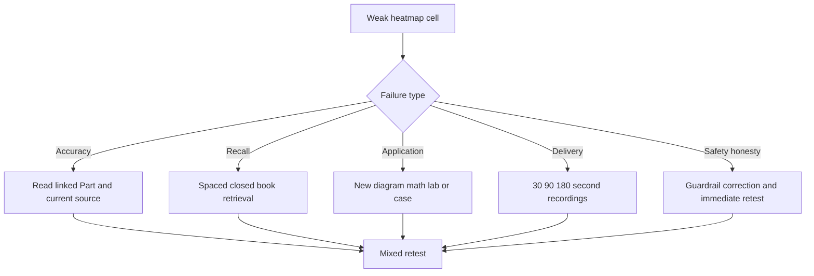

## 15. Mock-interview scorecards

### Recommended mock formats

| Mock | Duration | Rounds |
|---|---:|---|
| Recruiter/fit | 30 min | role story, move, strengths/gaps, logistics, questions |
| Technical fundamentals | 60 min | storage, network, protocols, ONTAP whiteboards, math |
| Scenario | 75 min | NAS/SAN/performance/upgrade/incident and escalation |
| TAM/customer | 60 min | discovery, risk, recommendation, objection, service review |
| Behavioral/leadership | 60 min | six STAR-L competencies, reflection, closing |
| Full panel simulation | 150 min | mixed technical, case, TAM, behavioral, closing |

### Weighted mock scorecard

| Dimension | Weight | Score 0-3 | Weighted note |
|---|---:|---:|---|
| Technical accuracy/fundamentals | 20% |  |  |
| Architecture and layer reasoning | 10% |  |  |
| Troubleshooting/evidence | 15% |  |  |
| Safety/privacy/current-source boundaries | 15% |  |  |
| Customer/TAM judgment and recommendation | 15% |  |  |
| Structure/clarity/audience calibration | 10% |  |  |
| Behavioral specificity/integrity/reflection | 10% |  |  |
| Closing/motivation/questions | 5% |  |  |
| **Total** | **100%** |  |  |

### Mock record

```markdown
Mock ID/date/interviewer: SYN-MOCK-001 / <UTC> / <role>
Format/duration/questions: <values>
Weighted score: <0-3-or-percent>
Safety/privacy/fabrication failures: <count>
Best three responses: <IDs-and-why>
Highest-risk three gaps: <IDs-and-linked-Parts>
Answer-duration pattern: <too-short-fit-too-long>
Follow-up performance: <result>
Corrections completed: <artifacts>
Next mock/date: <value>
Owner/source/date/confidence/validation/residual risk: <values>
```

### Diagram J11 - Mock improvement loop

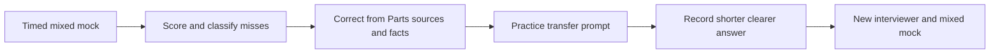

## 16. Readiness gates

### Knowledge gate

- All 240 bank questions attempted closed-book at least once.
- At least 204/240 (85%) score 2 or 3; all Basic questions score at least 2.
- At least 80% of Advanced questions score 2 or 3.
- Volatile facts are answered with current-source verification, not remembered numbers.

### Performance gate

- Three recent mixed mocks pass the agreed score threshold with no material regression.
- Six core whiteboards can be drawn and explained within five minutes each.
- Numerical answers state assumptions, formula, units, interpretation, and trap.
- Technical/TAM cases reach a safe next decision under time, not only a diagnosis list.

### Safety and integrity gate

- Zero fabricated experience, customer detail, credential, gated-text, unsafe-change, hard-limit, certification, or guaranteed-outcome claims across three mocks.
- Production, lab, conceptual, synthetic, and unknown/current-check evidence labels are used consistently.
- `I do not know; here is how I would verify` is comfortable and specific.

### Portfolio gate

- At least three strong sanitized artifacts spanning architecture, troubleshooting/protection, and proactive TAM analysis.
- Every artifact records environment/version, source/date, safety, evidence, validation, and proves/does-not-prove.
- At least one artifact is presented aloud in ten minutes and defended through follow-ups.

### Behavioral and closing gate

- Six factual STAR-L stories flex across at least twelve competencies without invented detail.
- Why move, why NetApp/role, why candidate, honest storage gap/ramp, first 90 days, and failure/learning answers are ready.
- At least five current, role-relevant interviewer questions are prepared and not answerable from the public job page alone.

### Diagram J12 - Final readiness decision

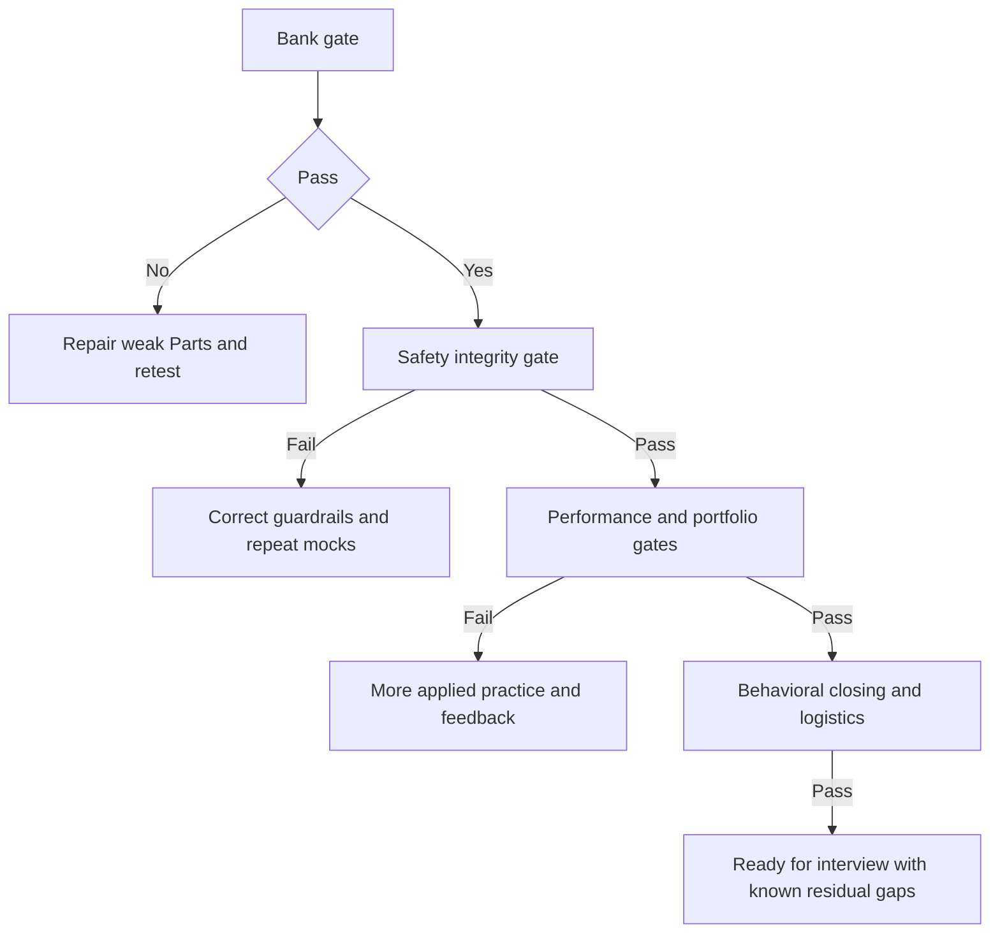

### No-go or reschedule signals

- Repeatedly inventing facts, commands, limits, outcomes, or experience under pressure.
- Proposing destructive or state-changing actions without evidence, approval, current procedure, and validation.
- Being unable to explain storage/NAS/SAN/ONTAP fundamentals without notes.
- No factual behavioral stories or inability to bound personal versus team contribution.
- Severe sleep loss, illness, panic, or scheduling conditions that make safe performance unlikely.
- Technology/travel/access constraints untested for a remote/on-site interview.

## 17. Certification and specialization milestones

Certification can structure learning, but it is not a substitute for role performance or production experience. Certification names, versions, prerequisites, exam providers, policies, blueprints, prices, and retirement dates must be verified from the current official NetApp certification source immediately before planning or claiming.

| Milestone | Evidence | Verify-current gate |
|---|---|---|
| Explore | Current certification path and role relevance documented | Official page checked UTC; no stale name |
| Map | Current blueprint domains mapped to completed Parts/labs | Blueprint/version/source recorded |
| Gap | Diagnostic by domain and lab requirement | No exam-dump or protected content |
| Prepare | Sustainable plan, official training/resources, budget approval | Provider/account/policy current |
| Practice | Authorized labs and original questions | No production/customer overclaim |
| Register | Exact exam/code/language/delivery/policy | Official provider verified that day |
| Earn | Verifiable credential record | Claim exact current credential only after award |
| Maintain | Renewal/continuing requirement tracker | Recheck policy and dates |

### Certification tracker

| Path/credential | Official URL checked UTC | Current name/version | Relevance | Prerequisites/gaps | Target | Status | Residual uncertainty |
|---|---|---|---|---|---|---|---|
| `<verify-current>` | `<URL-UTC>` | `<exact-current-name>` | `<role-link>` | `<items>` | `<date>` | Explore | `<unknowns>` |

## 18. Burnout, fatigue, and scheduling controls

| Signal | Response |
|---|---|
| Accuracy falls across two blocks | Stop new material; take a real break or end session |
| Re-reading without recall | Switch to three closed-book prompts, then stop if still flat |
| Irritability/rushed unsafe answers | Move to rest, light review, or logistics; do not practice speed |
| Sleep sacrificed for plan | Reduce scope; protect sleep and interview-day cognition |
| Pain/eye strain/headache | Pause, adjust ergonomics, seek appropriate care if needed |
| Work/family peak | Use 30-minute minimum viable blocks or extend plan |
| Time-zone interview | Rehearse at interview time only occasionally; shift sleep gradually |
| Guilt from red heatmap | Choose one next action and one completed strength; avoid marathon compensation |

### Sustainable scheduling rules

1. Set a weekly hour ceiling and at least one low-load or rest block.
2. Use 45-50 minute focus periods with movement/water breaks.
3. End hard technical work well before sleep when possible.
4. Keep one buffer day before the interview for light recall, logistics, and rest.
5. Track energy (1-5) beside score; do not misclassify fatigue as permanent inability.
6. Reschedule a mock rather than rehearsing unsafe habits while exhausted.
7. Seek qualified health support for persistent physical or mental-health concerns.

## 19. Final completion dashboard

**Dashboard meaning:** Content completion is not interview readiness. The master tracker is authoritative for file status; after this appendix passes validation and its row is updated, the guide contains 96/96 completed Parts and 10/10 completed appendices.

### Parts dashboard

| Group | Parts | Count | Content status | Performance proof still required |
|---|---:|---:|---|---|
| A Role/foundations | 1-3 | 3 | Done | Role story and customer map |
| B Storage foundations | 4-10 | 7 | Done | Math and storage whiteboards |
| C Networking/protocols | 11-18 | 8 | Done | Packet/path and protocol explanations |
| D ONTAP architecture | 19-26 | 8 | Done | ONTAP/WAFL/HA/SVM/LIF diagram |
| E Data services | 27-34 | 8 | Done | NAS/SAN/object cases |
| F Protection/security | 35-42 | 8 | Done | Recovery/security scenario |
| G Performance/capacity | 43-46 | 4 | Done | Counter/capacity calculations and case |
| H Proactive supportability | 47-55 | 9 | Done | IMT/HWU/bug/lifecycle/upgrade assessment |
| I Analytics/reporting | 56-60 | 5 | Done | QA workbook/dashboard narrative |
| J Customer execution | 61-70 | 10 | Done | Service review and influence role-play |
| K Troubleshooting/cases | 71-81 | 11 | Done | Incident simulation and escalation pack |
| L Labs/ecosystem | 82-91 | 10 | Done | Sanitized portfolio and capstone |
| M Extra/interview | 92-96 | 5 | Done | 240 bank, mocks, STAR/closing |
| **Parts total** | **1-96** | **96** | **96/96 Done** | **Readiness gates above** |

### Appendices dashboard

| ID | Appendix | Content status | Primary field use |
|---|---|---|---|
| A | [Master Glossary and Acronym Decoder](Appendix-A-master-glossary-acronyms.md) | Done | Fast term/acronym lookup |
| B | [Architecture and Flowchart Atlas](Appendix-B-architecture-flowchart-atlas.md) | Done | Whiteboard and architecture rehearsal |
| C | [ONTAP Administration Quick Reference](Appendix-C-ontap-admin-automation-reference.md) | Done | Safe interface/automation evidence patterns |
| D | [Host/Network/Protocol Command Reference](Appendix-D-host-network-protocol-commands.md) | Done | Read-only troubleshooting evidence |
| E | [Official Source Map](Appendix-E-official-netapp-source-map.md) | Done | Currency and authoritative-source checks |
| F | [TAM Templates](Appendix-F-tam-templates-deliverables.md) | Done | Copy-ready deliverables |
| G | [Incident Field Manual](Appendix-G-troubleshooting-incident-field-manual.md) | Done | Timed incident/troubleshooting operation |
| H | [Storage Math Workbook Guide](Appendix-H-storage-math-capacity-performance.md) | Done | Calculations and forecasting |
| I | [Office TAM Toolkit](Appendix-I-office-tam-toolkit.md) | Done | Excel/Power BI/PowerPoint workflow |
| J | Study Planner, Lab Portfolio, and Readiness Scorecard | Done | Practice and readiness control |
| **Appendices total** | **A-J** | **10/10 Done** | **Field and interview reference** |

### Overall dashboard

| Scope | Completed | Total | Status |
|---|---:|---:|---|
| Parts | 96 | 96 | Complete |
| Appendices | 10 | 10 | Complete after master J row update |
| **Study-guide files tracked** | **106** | **106** | **Complete** |
| Interview readiness | `<demonstrated-gates>` | All required gates | Not inferred from file completion |

## Completion and use checklist

- [x] Diagnostic baseline, scoring, heatmap routing, daily/weekly blocks, and spaced repetition are included.
- [x] 2-, 4-, 8-, 12-, and 16-week plans plus seven-day/48-hour interview crunch are included.
- [x] Parts sequence, strength-aware paths, answer-aloud, whiteboard, numerical, case, behavioral, and closing practice are included.
- [x] The exact 240-question ranges from Part 95 are integrated with range- and question-level trackers.
- [x] Lab portfolio, evidence log, quality rubric, mock formats/scorecards, readiness gates, and no-go signals are included.
- [x] Certification milestones are verify-current only; no exam facts are invented.
- [x] Burnout, fatigue, time zones, scheduling, sleep, and health-aware scope reduction are included.
- [x] The candid reading-versus-performance statement and final 96-Part + 10-appendix dashboard are included.
- [x] Privacy, access, synthetic-evidence, production-experience, current-source, owner/source/date/confidence/validation/residual-risk boundaries are explicit.
- [ ] Complete the diagnostic and choose a sustainable plan.
- [ ] Do not call yourself interview-ready until the performance, safety, portfolio, behavioral, and closing gates pass.

---

*Navigation:* Previous: [Appendix I - Excel, Power BI, and PowerPoint TAM Toolkit](Appendix-I-office-tam-toolkit.md) | Next: [NetApp TAM Technical Analyst - Complete Study Guide](../NetApp%20TAM%20Technical%20Analyst%20-%20Complete%20Study%20Guide.md)