# Part 1 - Role Map, NetApp Context, and the Complete TAM Story

> **Section goal:** Translate the complete NetApp Technical Account Manager Technical Analyst job description into an operating model: customer outcomes, stakeholders, evidence, analysis, deliverables, ownership, cadence, competencies, and honest interview proof. By the end, Arti should be able to explain the role from first principles, walk through a complete account cycle, and connect her Microsoft support background to the role without claiming NetApp production experience she does not have.

Covers index item **1** and orients every job-description responsibility and requirement. Product implementation details are intentionally deferred to later Parts.

---

## 1. The role in one sentence

A NetApp Technical Account Manager Technical Analyst turns verified information about a customer's technology estate into prioritized, customer-specific actions that reduce risk, improve supportability and stability, and show measurable value over time.

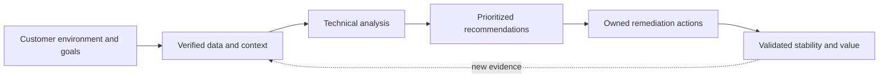

The role is not merely "produce reports." A report becomes useful only when it supports a decision, an owner accepts an action, completion is verified, and the remaining risk is understood.

### Title decoder

### Plain-English deep-dive: TAM and Technical Analyst

- **TAM - Technical Account Manager** - *a named technical advisor who helps a customer obtain reliable, supportable, long-term value from technology it owns or uses.* **Analogy:** A family doctor knows the patient's history and coordinates prevention, specialists, and follow-up; an emergency department handles the immediate crisis. **Why it matters:** A TAM maintains account context across incidents, changes, reviews, and planning cycles.
- **Technical Analyst** - *a professional who collects, validates, connects, and explains technical and operational evidence so that people can make defensible decisions.* **Analogy:** A financial analyst does not create the bank transactions; they reconcile the records, find patterns, explain exposure, and recommend action. **Why it matters:** The analyst makes a complex customer estate understandable and actionable.
- **NetApp context** - *the customer's use of NetApp products and their surrounding hosts, networks, hypervisors, applications, processes, and support relationships.* **Analogy:** A railway engine cannot be judged without its tracks, signals, timetable, maintenance history, and cargo. **Why it matters:** Storage does not operate in isolation.
- **Lead TAM** - *the TAM who owns the overall technical account plan, customer governance, and integrated service narrative.* **Analogy:** The lead TAM is the conductor; the Technical Analyst prepares reliable sections of the score and helps the orchestra stay in time. **Why it matters:** The analyst can own substantial analysis and follow-up while working under the lead TAM's account direction.

### What the title does and does not imply

| It does imply | It does not automatically imply |
|---|---|
| Technical analysis tied to customer outcomes | Authority to make changes in the customer's production environment |
| Ongoing account context | Ownership of every support case or engineering defect |
| Customer-facing communication | Commercial ownership of the account |
| Preventative and proactive recommendations | A guarantee that incidents will never occur |
| Follow-up and action tracking | Authority to accept customer risk on the customer's behalf |
| Cross-functional coordination | Replacement of Support, Professional Services, Sales, or Engineering |

> **Interview anchor:** "I see the Technical Analyst as the evidence and follow-through engine within the TAM service: understand the estate, verify the facts, identify material exposure, communicate a tailored recommendation, and track it to a validated outcome."

---

## 2. Essential vocabulary before the operating model

These terms are defined here before they are used repeatedly in the rest of this Part.

### Plain-English deep-dive: the evidence and tool vocabulary

- **Install base** - *the authoritative list of technology assets associated with a customer, such as systems, identifiers, locations, ownership, versions, support status, and lifecycle state.* **Analogy:** It is the title register for a property portfolio. If a building is missing or assigned to the wrong owner, insurance and maintenance decisions will be wrong. **Why it matters:** Analysis is unreliable when the asset population is incomplete, duplicated, stale, or mapped to the wrong site.
- **Install-base hygiene** - *the repeated work of reconciling, correcting, and aging out install-base records.* **Analogy:** Keeping a contact list clean by merging duplicates, removing old numbers, and confirming current owners. **Why it matters:** Clean inventory supports relevant recommendations and prevents blind spots.
- **AutoSupport** - *a NetApp capability that generates and sends system information to support destinations according to product configuration and support arrangements.* **Analogy:** A vehicle can send diagnostic information that helps a service organization understand health and faults. **Why it matters:** It can provide useful evidence, but the analyst must still check scope, freshness, identity, permissions, and customer context. Detailed collection, transport, privacy, and troubleshooting behavior belongs in Part 47.
- **Active IQ Digital Advisor** - *a NetApp digital service that uses support and system information to present insights for eligible customer environments.* **Analogy:** It is like a personalized maintenance dashboard built from the vehicles known to a service network. **Why it matters:** Its signals can help focus analysis, but access, entitlement, data freshness, applicability, and customer priorities still require validation. Detailed use belongs in Part 48.
- **IMT - Interoperability Matrix Tool** - *NetApp's source for checking whether specified combinations of products and component versions are supported together.* **Analogy:** Before fitting a replacement part, a mechanic checks the approved compatibility catalogue for the exact model and year. **Why it matters:** "Each component works" does not prove that the complete combination is supported. Exact validation is version-sensitive and belongs in Part 50.
- **Hardware Universe** - *a NetApp reference for hardware specifications, supported components, limits, and configuration information.* **Analogy:** It is the engineering catalogue for a family of machines. **Why it matters:** Hardware facts and limits should be checked against a current source rather than recalled from memory. Detailed use belongs in Part 51.
- **Bug** - *a product defect: behavior that differs from intended behavior under particular conditions.* **Analogy:** A specific vehicle model may have a documented fault that appears only with a certain component and operating condition. **Why it matters:** A defect matters to a customer only when the affected product, version, feature, and trigger are relevant.
- **BURT** - *a term commonly used in NetApp contexts for a bug or bug record.* **Analogy:** It is the case file for a known product defect, not proof that every customer owns the affected condition. **Why it matters:** The analyst must establish applicability rather than copy a bug list.
- **Bug or BURT scrub** - *a structured review of known defects against a customer's actual platforms, versions, protocols, features, and exposure conditions.* **Analogy:** It is a vehicle recall check using the exact identification number and fitted options. **Why it matters:** A good scrub separates applicable exposure from noise and records evidence, mitigation, fixed release information, and uncertainty. Detailed methodology belongs in Part 52.

### Plain-English deep-dive: the recommendation and risk vocabulary

- **Operational service review** - *a recurring customer meeting and evidence pack that reviews environment health, support experience, risks, trends, recommendations, actions, and decisions.* **Analogy:** It is a building-management review covering inspections, open repairs, incidents, upcoming work, and budget decisions. **Why it matters:** The meeting converts analysis into shared understanding and owned action; it is not a slide-reading ceremony.
- **Best practice** - *a generally recommended approach that often produces good results under stated conditions.* **Analogy:** "Service a car regularly" is broadly wise, but the interval and work depend on the model, use, climate, and warranty. **Why it matters:** A best practice is an input to judgment, not a context-free command.
- **Supportability** - *whether a specific configuration and operating condition fall within documented vendor support parameters at a given time.* **Analogy:** A warranty may cover an approved appliance installation but not an unlisted combination of voltage, part, and modification. **Why it matters:** An unlisted or out-of-lifecycle combination may increase diagnosis time, change options, and business exposure. It does not automatically mean an outage is occurring.
- **Recommendation** - *a reasoned proposal that connects evidence and customer context to a specific action and expected result.* **Analogy:** "Take medicine" is vague; a proper prescription names the medicine, reason, dose, owner, timing, checks, and remaining concern. **Why it matters:** Recommendations must be precise enough to decide, schedule, execute, and validate.
- **Remediation** - *the action taken to remove or reduce a verified issue or risk.* **Analogy:** Finding a roof leak is analysis; repairing the damaged flashing is remediation. **Why it matters:** Reporting a finding does not reduce risk by itself.
- **Preventative support** - *work intended to stop a known or foreseeable problem before it happens.* **Analogy:** Replacing a worn belt before it breaks. **Why it matters:** It acts on identified exposure.
- **Proactive support** - *work initiated from evidence, trends, changes, or planning needs before the customer raises an incident.* **Analogy:** Reviewing fuel use and routes before cost or reliability becomes a complaint. **Why it matters:** Proactive work may prevent failure, improve planning, or increase value even when no immediate defect is present.
- **Risk** - *the possibility that uncertainty will affect an objective, usually described through the condition, likelihood, impact, time horizon, and confidence in the evidence.* **Analogy:** Dark clouds are a signal; the risk statement is that rain may damage an outdoor event because no shelter is available. **Why it matters:** A red label without cause, consequence, and context does not support a decision.
- **Residual risk** - *the risk that remains after a control or remediation is applied, or after a decision is made not to act fully.* **Analogy:** Winter tires reduce skidding risk but do not remove ice or careless driving. **Why it matters:** No recommendation should imply perfect safety.
- **Action tracking** - *recording each agreed action's owner, target date, status, dependency, blocker, evidence, and closure decision.* **Analogy:** A parcel-tracking number shows custody and progress instead of relying on "someone sent it." **Why it matters:** Actions without owners and dates become recurring slides.
- **Value realization** - *proving that purchased technology and services contributed to outcomes the customer cares about.* **Analogy:** Owning gym equipment is not value; improved health through sustained use is value. **Why it matters:** Activity counts are weaker than evidence of reduced exposure, better stability, faster decisions, improved adoption, or avoided urgency.

### A recommendation has seven minimum parts

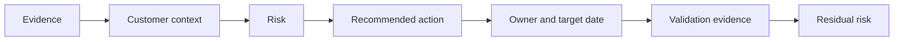

Example structure:

> **Evidence:** Three synthetic inventory records show a target software release and one surrounding component combination requiring current compatibility validation. **Context:** The system supports a fictional tier-one workload with a planned change window. **Risk:** Proceeding without complete supportability evidence may create avoidable change and diagnosis exposure. **Recommendation:** The customer platform owner and TAM team should complete and date an exact IMT validation before the change approval gate. **Owner/date:** Customer platform owner, 2026-03-06. **Validation:** Saved or referenced approved result, notes reviewed, and change record updated. **Residual risk:** Compatibility evidence reduces supportability uncertainty but does not guarantee a fault-free upgrade.

---

## 3. Why customers pay for TAM services

Customers can already open support cases. TAM services address a different problem: large estates generate fragmented data, technical debt, recurring decisions, cross-team dependencies, and risks that no single incident case owns from end to end.

Customers pay for the sustained context and coordination needed to:

1. Maintain an accurate picture of what they own and how it supports business services.
2. Find material risk before it becomes an urgent disruption.
3. Make evidence-based lifecycle, supportability, capacity, performance, and upgrade decisions.
4. Turn generic product guidance into customer-specific recommendations.
5. Coordinate customer teams, partners, account roles, Support, and technical specialists.
6. Track preventative actions that compete with daily operations for time and funding.
7. Learn from incidents and repeated patterns rather than treating each case as isolated.
8. Show whether technology and support investments produced meaningful outcomes.

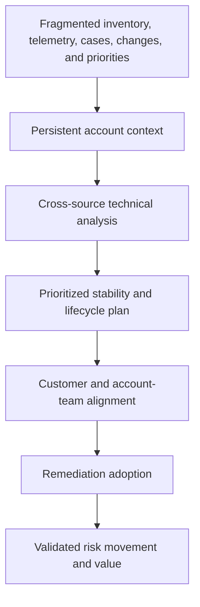

### Reactive Support versus proactive and preventative TAM work

| Dimension | Reactive Support | Proactive or preventative TAM work |
|---|---|---|
| Typical trigger | A fault, question, or service request is raised | Evidence, trend, lifecycle event, upcoming change, repeated case pattern, or account objective |
| Primary objective | Restore service, answer the request, isolate cause, or progress a product issue | Reduce future exposure, improve supportability, plan change, improve adoption, and coordinate long-term outcomes |
| Time horizon | Current event or case | Weeks, quarters, and lifecycle horizons |
| Unit of work | Case or incident | Account, environment, service, risk, recommendation, action plan, or project |
| Context | Detailed around the reported issue | Broad across estate, business criticality, history, dependencies, and roadmap |
| Typical outputs | Troubleshooting plan, workaround, fix, RCA input, case notes | Baseline, risk report, bug scrub, supportability record, upgrade plan, service review, action tracker, value summary |
| Closure | Case question answered or incident resolved | Action validated, risk accepted, superseded, or deliberately carried with recorded residual risk |
| Ownership boundary | Support owns case progression within support scope | TAM owns visibility, coordination, recommendation narrative, and follow-through; customer owns business decisions and most changes |

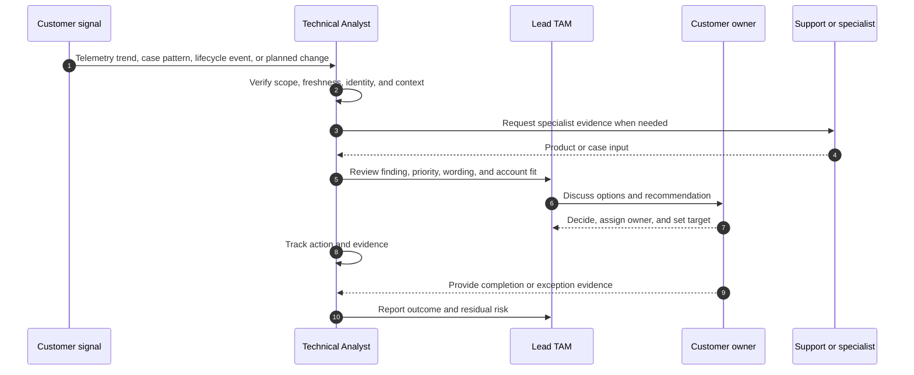

### What TAM cannot promise

- No incident ever occurs.
- Every generic recommendation fits every customer.
- A supported combination is guaranteed to be defect-free.
- Telemetry is complete simply because a dashboard is available.
- A recommendation is implemented simply because it was presented.
- The vendor can accept business risk for the customer.

The defensible promise is a disciplined method: accurate context, trustworthy evidence, clear prioritization, coordinated expertise, visible ownership, and validated follow-through.

---

## 4. Role boundaries and escalation ownership

Strong account work depends on knowing who decides, who diagnoses, who sells, who implements, and who follows through.

### Role-by-role distinction

| Role | Primary purpose | Typical inputs | Typical outputs | Owns | Does not replace |
|---|---|---|---|---|---|
| **Lead TAM** | Own the integrated technical account strategy and governance | Customer goals, estate health, support history, roadmap, account-team input | Account plan, governance narrative, priorities, escalations, value story | Overall TAM service alignment and executive technical relationship | Customer decision makers, Sales, Support, or Engineering |
| **TAM Technical Analyst** | Produce and improve evidence-based analysis, reporting, recommendations, and action follow-through | Inventory, telemetry, support data, tool outputs, customer context, changes, plans | Health/risk analysis, reconciliations, scrubs, reports, decks, trackers, project updates | Analysis quality, traceability, assigned deliverables, and action visibility | Lead TAM accountability or production administrators |
| **Support** | Diagnose and progress incidents, defects, and technical requests within support scope | Case details, logs, reproduction, versions, impact, troubleshooting results | Troubleshooting actions, restoration guidance, workaround, defect escalation, case status | Case progression and support process | Long-term account governance or customer change ownership |
| **Sales or Account team** | Own commercial relationship, opportunity, scope, and account coordination | Business priorities, contracts, solution needs, commercial signals | Commercial plan, proposal, renewal coordination, account actions | Commercial motion | Technical validation or customer operational ownership |
| **Customer Success** | Drive adoption and realized business outcomes for subscribed capabilities | Success criteria, adoption data, health signals, stakeholder goals | Success plan, adoption actions, outcome reviews | Success and adoption motion as defined by the organization | Product Support or deep implementation services |
| **Professional Services** | Design, implement, migrate, or transform under an agreed project scope | Requirements, statement of work, architecture, access, change constraints | Designs, implementation, migration, testing, handover | Project deliverables within scope | Ongoing support or account governance after handover |
| **Engineering or Product** | Build, maintain, and improve the product; investigate qualifying defects | Reproduction, diagnostics, defect evidence, product priorities | Product diagnosis, fixes, release decisions, technical guidance | Product code and product decisions | Customer environment administration or account action tracking |
| **Partner** | Supply, integrate, manage, or advise within a contracted role | Shared design, customer requirements, vendor evidence, scope | Implementation, managed service, integration, local coordination | Its contracted tasks and evidence | NetApp or customer accountability outside partner scope |
| **Customer roles** | Decide business priority, approve risk, operate the environment, and execute changes | Business objectives, budgets, architecture, policies, evidence, recommendations | Decisions, approvals, implementation, validation, accepted risk | Business risk and customer-controlled environment | Vendor Support, account services, or product engineering |

### The escalation principle

**Escalation is not abandonment.** It is a deliberate transfer or expansion of technical authority while the originating owner maintains coordination and communication appropriate to the role.

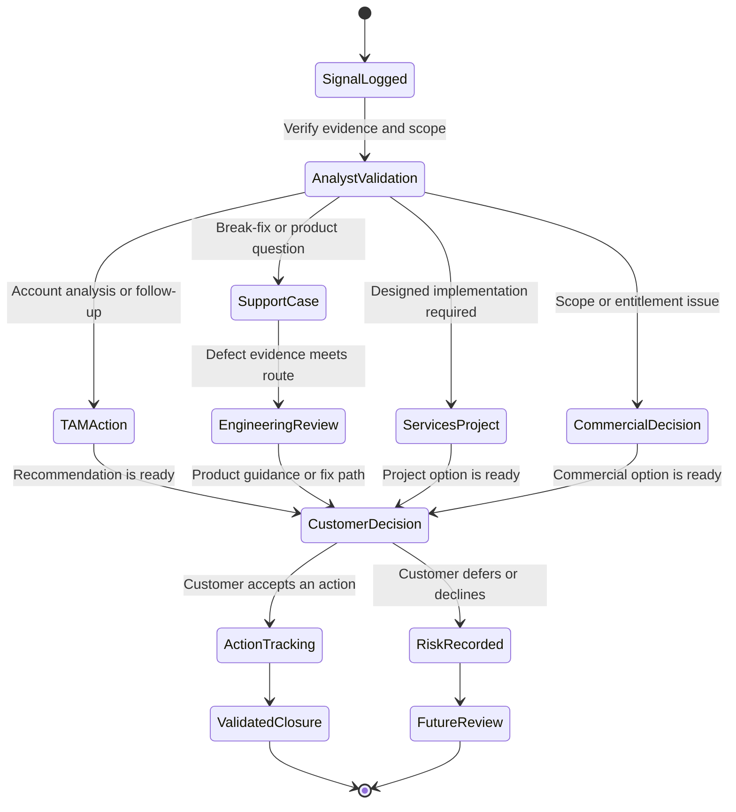

### Ownership during a live incident

| Question | Likely owner | Technical Analyst contribution |
|---|---|---|
| What is the business impact and severity? | Customer incident lead with Support process input | Ensure impact statement and account context are clear and current |
| What technical hypothesis should be tested next? | Support or designated technical lead | Supply topology, history, known changes, inventory, and organized evidence |
| Who approves a production change? | Customer change authority | Record dependency, decision, owner, and time; do not authorize for the customer |
| Is Engineering needed? | Support according to defect/escalation evidence | Help make the evidence pack complete and the ask specific |
| What does leadership need to know? | Incident communications owner and lead TAM | Convert technical progress into concise impact, actions, risks, and next checkpoint |
| What happens after restoration? | Customer problem owner plus relevant vendor roles | Connect incident learning to recommendations and preventative action tracking |

---

## 5. Stakeholder map and decision rights

### Detailed stakeholder map

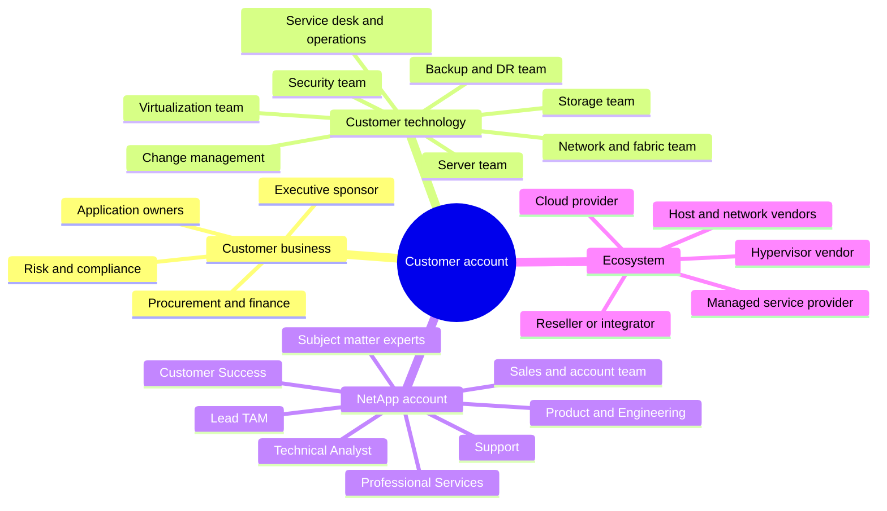

| Stakeholder | What they care about | What the analyst needs from them | What they need from the analyst |
|---|---|---|---|
| Executive sponsor | Business continuity, risk, cost, accountability, value | Critical services, decision thresholds, sponsorship | Concise outcomes, unresolved exposure, choices, and decision asks |
| Storage platform owner | Health, capacity, lifecycle, changes, supportability | Accurate topology, versions, change plan, action feasibility | Detailed evidence, recommendation rationale, dependency and validation criteria |
| Application owner | Availability, performance, maintenance impact | Criticality, service-level needs, peak periods, test results | Business-relevant impact and planned change implications |
| Virtualization or server owner | Host compatibility, paths, drivers, firmware, workload behavior | Host and hypervisor inventory, maintenance constraints | Cross-layer supportability questions and coordinated actions |
| Network or fabric owner | Connectivity, redundancy, ports, switches, change windows | Topology, versions, events, planned work | Specific evidence requests and shared validation plan |
| Backup and DR owner | Recoverability, RPO, RTO, tests, retention | Protection design, test evidence, exceptions | Risk visibility and follow-up on untested or failed controls |
| Security, risk, or compliance | Exposure, controls, advisories, audit evidence | Policy and risk criteria, exception owner | Evidence-bound statement, mitigation options, residual risk |
| Operations and service desk | Monitorability, symptoms, runbooks, escalation | Incident history, recurring pain, ownership paths | Actionable operating guidance and accurate contact paths |
| Change management | Scope, risk, approvals, rollback, timing | Change calendar, gates, conflict information | Evidence pack, dependencies, validation and rollback inputs |
| Procurement or finance | Contract, lifecycle funding, value | Budget timing and decision process | Clear risk horizon and value narrative without technical overload |
| Lead TAM | Account strategy, trust, coherence, priority | Direction, customer context, review and escalation decisions | High-quality analysis, concise options, dependable follow-through |
| Support | Fast, accurate diagnosis | Case records, logs, reproducible symptoms, exact ask | Organized account context, topology, history, and customer impact |
| Sales or Account team | Relationship, renewal, opportunity, commercial alignment | Contract and account context; avoid mixing advice with unsupported sales claims | Accurate technical narrative and customer priorities |
| Professional Services | Executable project scope and prerequisites | Designs, access, constraints, acceptance criteria | Qualified problem statement, dependencies, and account context |
| Engineering or Product | Defensible defect or product evidence | Exact versions, conditions, diagnostics, reproduction where possible | Focused evidence and a specific technical question |
| Partner | Clear boundary and integrated plan | Contracted scope, implementation evidence, dependencies | Shared actions, dates, evidence expectations, and escalation route |

### RACI in plain English

- **Responsible** - performs the work.
- **Accountable** - owns the result or final decision. There should normally be one clearly accountable party.
- **Consulted** - provides input before the decision or action.
- **Informed** - receives relevant status or outcome information.

### Illustrative RACI

This is an educational model, not an internal NetApp process. Actual assignments depend on the service contract, account model, customer organization, and change authority.

| Activity | Lead TAM | Technical Analyst | Support | Sales / Account | Customer technical owner | Customer business owner | Partner / Services | Engineering / Product |
|---|---|---|---|---|---|---|---|---|
| Confirm account outcomes and review cadence | A/R | C | I | C | C | C | I | I |
| Reconcile install base | A | R | C | I | R | I | C | I |
| Build health and risk analysis | A | R | C | I | C | I | C | C |
| Progress a break-fix case | I | C | A/R | I | R | I | C | C |
| Approve a production change | I | I | C | I | R | A | R if contracted | C |
| Accept or defer business risk | C | I | I | I | C | A/R | C | I |
| Prepare an operational service review | A | R | C | C | C | I | C | I |
| Track agreed preventative actions | A | R | C | I | R | I | R if assigned | I |
| Escalate a qualifying defect | I | C | A/R | I | C | I | C | R/C |
| Define and execute a scoped implementation project | C | C | C | I | A/R | C | R | C |
| Build renewal and value narrative | C | C | I | A/R | C | C | I | I |

> **RACI warning:** A table does not create ownership. Confirm named people, decision authority, due dates, communication paths, and what happens when an owner cannot act.

---

## 6. From data to customer outcome

The Technical Analyst's core craft is converting disconnected inputs into a traceable decision chain.

```mermaid
flowchart LR
    subgraph IN[Inputs]
        I1[Customer inventory and topology]
        I2[Telemetry and health signals]
        I3[Cases, incidents, and defects]
        I4[Compatibility and lifecycle references]
        I5[Plans, changes, and business criticality]
    end
    subgraph WORK[Analysis]
        W1[Reconcile and validate]
        W2[Establish applicability]
        W3[Find trends and exposure]
        W4[Prioritize with context]
    end
    subgraph OUT[Deliverables]
        O1[Baseline and risk report]
        O2[Recommendation register]
        O3[Service review and action tracker]
        O4[Escalation or project evidence]
    end
    subgraph RESULT[Customer outcomes]
        R1[Better decisions]
        R2[Reduced avoidable risk]
        R3[Improved stability and supportability]
        R4[Visible value and accountability]
    end
    IN --> WORK --> OUT --> RESULT
```

### Data, analysis, deliverable, and outcome map

| Data or input | Validation question | Analysis performed | Deliverable | Customer outcome |
|---|---|---|---|---|
| Asset records, system identifiers, sites, owners | Is the population complete, current, unique, and correctly associated? | Reconcile duplicates, gaps, retired assets, ownership, and telemetry presence | Install-base reconciliation and exception list | Fewer blind spots and more relevant analysis |
| Customer topology and application map | Which business service depends on which host, network, protocol, and storage path? | Map dependencies and failure domains | Environment profile and topology | Better change, incident, and risk decisions |
| AutoSupport-derived or eligible digital-service signals | Is the signal current, entitled, correctly mapped, and applicable? | Correlate health indication with configuration and customer context | Health/risk report and recommendation | Earlier attention to material exposure |
| Support cases and incidents | Is the pattern recurring, related, and correctly scoped? | Trend themes, severity, age, repeat drivers, evidence gaps | Support experience section and improvement actions | Faster escalation and fewer repeated operational failures |
| Product defect information | Do product, version, protocol, feature, and trigger match? | Perform applicability assessment and deduplicate related records | Bug scrub | Focus on relevant defects rather than a large generic list |
| IMT evidence and surrounding component inventory | Does the exact end-to-end combination appear supported, including notes? | Validate combination and record date, scope, assumptions, and gaps | IMT/supportability record | Better change planning and clearer support exposure |
| Hardware specifications and lifecycle references | Are facts current for exact platform and configuration? | Compare estate to limits and lifecycle horizon | Lifecycle and upgrade plan | Reduced urgency and better budget timing |
| Capacity and performance observations | Are units, time windows, baselines, workload changes, and outliers understood? | Trend growth, headroom, latency, load, and confidence | Capacity/performance trend | Earlier planning and fewer misleading conclusions |
| Planned business or technical changes | What dependencies, conflicts, prerequisites, and validation gates exist? | Sequence actions and assess readiness | Recommendation register or project status | Safer, coordinated execution |
| Prior review actions | Who owns each item and what proves closure? | Age actions, identify blockers, validate results | Action tracker and value summary | Accountability and visible outcome movement |

### Analysis quality gates

Before publishing a finding, ask:

1. **Identity:** Do I know exactly which customer, system, cluster, site, service, and time period this describes?
2. **Freshness:** When was each source last updated?
3. **Completeness:** Which assets, time windows, tools, or teams are absent?
4. **Provenance:** Can another reviewer find the source and reproduce the reasoning?
5. **Applicability:** Does the cited guidance match the exact product, version, feature, and context?
6. **Correlation:** Am I joining sources with a reliable identifier, or merely matching similar names?
7. **Causality:** Am I claiming only correlation where cause has not been proven?
8. **Materiality:** Why does this matter to this customer's objective?
9. **Actionability:** Is the action specific, feasible, owned, dated, and testable?
10. **Uncertainty:** Have assumptions, confidence, and residual risk been made visible?

---

## 7. Concrete deliverables and their quality criteria

| Deliverable | Minimum contents | Quality criteria | Common defect |
|---|---|---|---|
| **Environment profile** | Business services, criticality, owners, sites, platforms, workloads, protocols, support model, constraints, planned changes | Dated, scoped, validated by customer owners, facts separated from assumptions | A product inventory with no business or dependency context |
| **Topology** | Application-to-host-to-network/fabric-to-storage relationships, protection paths, sites, owners, failure domains | Legible, versioned, directional where needed, unknowns marked | A decorative diagram with no operational use |
| **Install-base reconciliation** | Source records, unique identifiers, account/site mapping, ownership, duplicates, missing or retired assets, correction status | Repeatable join logic, exception count, source/date, named correction owner | Treating one export as automatically authoritative |
| **Health/risk report** | Evidence, affected scope, condition, impact, likelihood/time horizon, confidence, priority, options | Customer-specific, deduplicated, traceable, avoids unsupported certainty | Copying every alert into a red table |
| **Bug scrub** | Product/version/feature/trigger applicability, evidence, symptom, workaround or mitigation, fixed path if verified, owner | Exact scope and date, access limits stated, non-applicable items excluded with reason | Assuming version match alone proves exposure |
| **IMT/supportability record** | Exact solution components and versions, result, notes reviewed, evidence reference, date, gaps, decision | End-to-end rather than one component, current, independently reviewable | "Supported" with no recorded combination or date |
| **Lifecycle/upgrade plan** | Drivers, current state, target options, dependencies, supportability, sequencing, windows, validation, rollback limits | Feasible, version-sensitive facts rechecked, customer change process honored | Recommending "latest" without compatibility or business context |
| **Capacity/performance trend** | Units, time range, baseline, percentiles or peaks where relevant, growth, workload events, headroom, uncertainty | Comparable windows, data quality explained, correlation not overstated | Forecasting from two points or mixing incompatible metrics |
| **Recommendation register** | Evidence, context, risk, action, priority, prerequisites, owner, date, validation, residual risk | Each row is a decision-ready argument | Vague verbs such as "review" or "consider" with no finish line |
| **Action tracker** | Action, owner, target, status, blocker, dependency, last update, closure evidence, residual risk | One source of current truth, stale items challenged, closed items evidenced | Marking "done" because a meeting occurred |
| **Service-review deck** | Executive summary, environment changes, health, support trends, risks, recommendations, decisions, actions, next period | Message-first, audience-calibrated, data cutoff shown, technical appendix available | Dense screenshots and no decision asks |
| **Meeting minutes** | Decisions, actions, owners, dates, accepted risks, disputed points, next checkpoint | Sent promptly, concise, reviewed for accuracy | Transcript without decisions or ownership |
| **Escalation pack** | Impact, scope, topology, timeline, versions, evidence, changes, actions tried, hypotheses, exact ask, secure evidence location | Complete enough for the next team to act without restarting discovery | A vague "please escalate" message |
| **Project status** | Objective, scope, milestones, progress, risks, assumptions, issues, dependencies, decisions, forecast | Honest health, trend, owner and recovery action for each blocker | Reporting activity while hiding schedule or dependency risk |
| **Value summary** | Starting condition, service activities, customer actions, verified outcomes, open exposure, next priorities | Attributes outcomes carefully and separates contribution from causation | Counting meetings, slides, or alerts as business value |

### A quality deliverable answers five reader questions

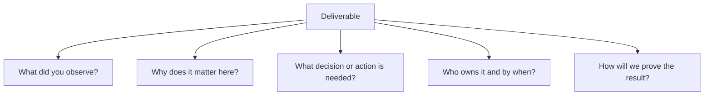

---

## 8. Daily through annual operating cadence

Cadence is a planning model, not a claim about a fixed NetApp internal schedule. Customer contract, estate size, risk, time zones, and lead-TAM direction determine actual frequency.

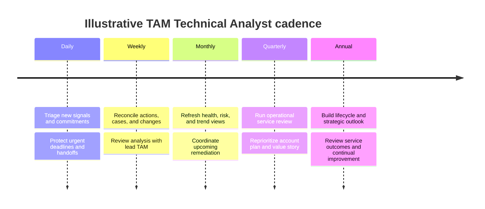

| Cadence | Typical questions | Typical activities | Outputs |
|---|---|---|---|
| **Daily** | What changed? What is urgent? Which commitment or customer time zone needs protection? | Check new evidence, deadlines, escalations, meetings, dependencies, and handoffs; block focus time | Updated priority list, concise status, evidence request, clean handoff |
| **Weekly** | Which actions moved? What is blocked? Which analysis needs review? | Lead-TAM sync, case pattern review, action aging, upcoming change check, data-quality corrections, project follow-up | Updated tracker, reviewed finding, risk/blocker escalation, next-week plan |
| **Monthly** | Is estate health, capacity, lifecycle, or support experience trending? | Refresh defined reports, reconcile inventory changes, review recommendations, prepare customer touchpoint | Monthly health summary, trend update, recommendation changes, meeting notes |
| **Quarterly** | What changed in risk, supportability, stability, adoption, and value? | Complete operational service review preparation, dry run, customer review, decisions, minutes, follow-up | Service-review deck, decision log, action register, value summary |
| **Annual or strategic** | What should the customer plan and fund across the next lifecycle horizon? | Review business roadmap, estate strategy, refresh/upgrade horizons, skills, service outcomes, and account priorities | Strategic plan, lifecycle roadmap, annual outcome narrative, improvement backlog |

### Time-zone discipline

- Agree working windows, urgent contact routes, and response expectations rather than promising permanent availability.
- Put dates, times, and time-zone abbreviations in meeting and action records.
- Use handoffs that include impact, current state, evidence, actions completed, next discriminating step, owner, and checkpoint.
- Reserve customer-facing overlap for decisions and collaboration; protect analysis time outside meetings.
- Escalate unsustainable coverage patterns. Fatigue is an operational risk, not a badge of commitment.

---

## 9. Complete account lifecycle

An account cycle is continuous. New assets, incidents, changes, risks, and business goals can move the work back to discovery or baseline validation.

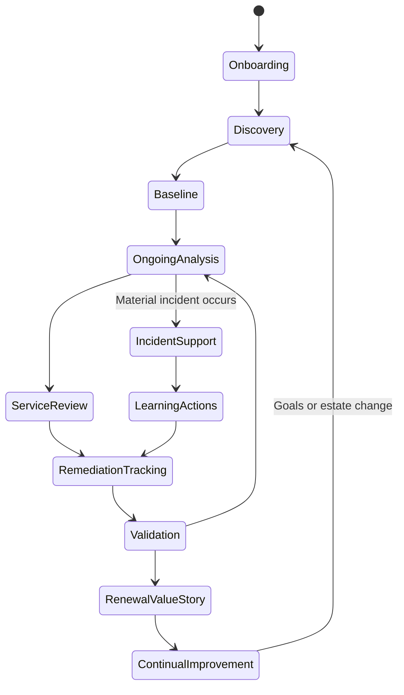

### Phase-by-phase operating model

| Phase | Core question | Inputs | Analyst work | Main outputs | Exit evidence |
|---|---|---|---|---|---|
| **1. Onboarding** | What service was agreed and how will the team work? | Contract/service scope, account contacts, known estate, prior materials | Confirm boundaries, access prerequisites, cadence, data handling, escalation and review routes | Onboarding checklist, stakeholder map, evidence request, cadence | Named contacts, scope understood, initial sources and meetings scheduled |
| **2. Discovery** | What matters to the customer and what exists? | Interviews, architecture, business services, incidents, plans, constraints | Ask outcome-led questions, map dependencies, record facts and unknowns | Environment profile, topology, stakeholder concerns | Customer owners validate current-state picture and open questions |
| **3. Baseline** | What is the verified starting condition? | Inventory, telemetry, support history, compatibility/lifecycle references | Reconcile install base, assess data quality, establish initial health and exposure | Baseline report, install-base exceptions, initial risk and recommendation registers | Scope, date, confidence, and material gaps reviewed |
| **4. Ongoing analysis** | What changed and what now deserves attention? | New signals, cases, changes, defects, trends, roadmap | Refresh, compare, correlate, test applicability, prioritize | Updated health/risk report, scrubs, trends, recommendations | Peer/lead review complete; customer-specific rationale is traceable |
| **5. Service review** | What should stakeholders know, decide, and do? | Reviewed analysis, action status, support themes, upcoming plans | Build audience-specific narrative, rehearse, facilitate sections, record decisions | Deck, minutes, decision log, updated actions | Decisions, owners, dates, disagreements, and next checkpoint recorded |
| **6. Remediation tracking** | Are agreed actions progressing and what blocks adoption? | Action register, customer updates, dependencies, project status | Follow up, clarify evidence, manage aging, surface blockers, support influence | Current action tracker, blocker escalation, revised plan | Completion evidence accepted or deferral/accepted risk recorded |
| **7. Incident support** | How can account context improve safe restoration and escalation? | Impact, timeline, topology, cases, recent changes, prior patterns | Organize evidence, connect owners, support communications, preserve role boundaries | Escalation pack, account update, post-incident action input | Support/incident owner has complete context; follow-up owner named |
| **8. Renewal/value story** | What outcomes did the service help the customer achieve? | Starting baseline, service work, customer actions, outcomes, open exposure | Compare before/after carefully, identify contribution, remaining needs, next priorities | Value summary, future technical priorities | Customer and account team can explain outcomes without inflated attribution |
| **9. Continual improvement** | How can analysis and service become more useful? | Feedback, missed risks, stale actions, review quality, recurring manual work | Improve data rules, templates, automation, review method, skills, and governance | Improvement backlog, experiment, updated quality rubric | Change has an owner, measure, review date, and learning result |

### Operational service review lifecycle

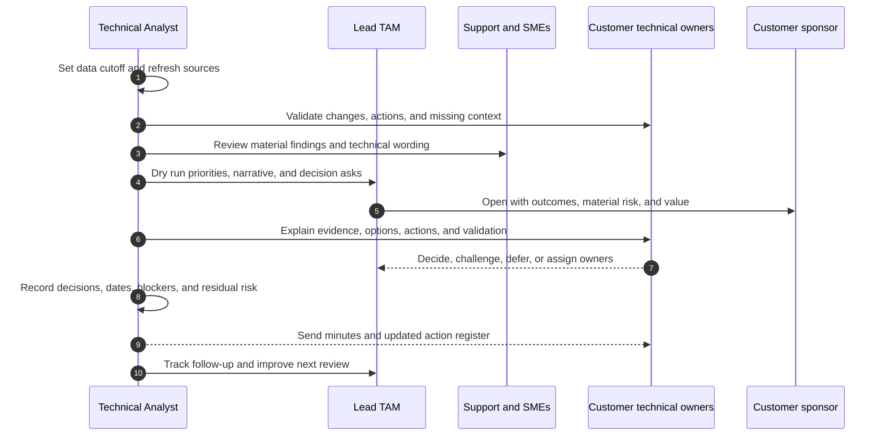

---

## 10. JD Mapping

The supplied job description is the authority for role claims in this Part. This table converts each responsibility or requirement into observable work and factual interview evidence.

| JD responsibility or requirement | Customer outcome | Stakeholders | Inputs and tools | Outputs | Competency demonstrated | Arti's factual evidence or honest gap |
|---|---|---|---|---|---|---|
| Generate customer data from enterprise sources | A usable, governed evidence base | Lead TAM, customer owners, data owners | Approved exports, reports, identifiers, Office tools | Reconciled dataset and data-quality log | Data handling, validation, provenance | **Strength:** analytics, Excel, Power BI, support data. **Gap:** no claimed NetApp data-source access. |
| Analyze and report customer data | Decisions based on trends and material exposure | Technical and executive audiences | Cleaned data, pivots, charts, reviewed sources | Health/risk report and executive summary | Analytical judgment and communication | **Strength:** business reviews, backlog/quality/CSAT analysis, MBA Business Analytics. |
| Strategic planning | Fewer urgent lifecycle decisions and clearer investment horizon | Sponsor, platform owners, account team | Business roadmap, estate baseline, lifecycle and change constraints | Phased technical plan | Systems thinking and planning | **Transferable:** advisory and business reviews. **Gap:** NetApp estate strategy not yet production evidence. |
| Storage best-practice guidance | Safer and more effective use of the solution | Storage, infrastructure, application owners | Customer context plus current official guidance | Contextual recommendation with tradeoffs | Technical judgment | **Foundation only:** Azure, VM, networking, and storage fundamentals; storage depth is a ramp area. |
| Upgrade advice | Supported, coordinated, lower-risk change | Platform, host, network, app, change teams | Current versions, IMT, lifecycle, release/advisory sources, business windows | Lifecycle/upgrade plan | Dependency analysis and change readiness | **Transferable:** fix validation and change-oriented support. **Gap:** no NetApp upgrade ownership claim. |
| Understand the customer environment | Advice reflects real business and technical dependencies | Customer technical and business owners | Discovery, topology, service criticality, support history | Environment profile and topology | Discovery and architecture thinking | **Strength:** complex enterprise/partner customer troubleshooting and technical advisory. |
| Maintain install-base accuracy and hygiene | Correct asset coverage and fewer blind spots | Customer asset owner, account team, Support | Approved inventory and identity sources | Reconciliation and exception tracker | Data quality and ownership follow-through | **Transferable:** case/backlog data discipline. **Gap:** no NetApp install-base production experience. |
| Conduct operational service reviews | Shared understanding, decisions, and owned actions | Lead TAM, customer owners and sponsors, account team | Reviewed analysis, trends, cases, actions | Service-review deck, minutes, action register | Facilitation and audience calibration | **Strength:** customer business reviews and analytics-led reporting. |
| Use AutoSupport-related evidence for tailored recommendations | Relevant preventative attention based on customer signals | Lead TAM, customer owner, Support/SMEs | Eligible AutoSupport-derived information, context, official references | Tailored finding and recommendation | Signal validation and applicability | **Gap:** no direct AutoSupport tool usage claimed; conceptual until access or lab evidence exists. |
| Mitigate technical risk and improve solution stability | Reduced avoidable disruption and clearer residual exposure | Customer owners, lead TAM, Support, SMEs | Health, cases, topology, lifecycle, compatibility, plans | Prioritized risk and remediation plan | Risk reasoning and technical coordination | **Strength:** CRITSIT ownership, risk mitigation, RCA/fix validation. **Gap:** NetApp-specific risk depth is in later Parts. |
| Track preventative remediation and influence adoption | Recommendations become completed, verified actions | Action owners, sponsor, lead TAM | Recommendation register, dependencies, objections | Action tracker and closure evidence | Follow-through and influence without authority | **Strength:** escalation strategy, customer advisory, cross-team coordination. |
| Improve technical analysis and representation of recommendations | Clearer, more trusted, repeatable decisions | Lead TAM, peers, customers | Feedback, QA rubric, Office/analytics tools | Improved report, visualization, or method | Continual improvement and data storytelling | **Strength:** analytics, documentation, knowledge creation, Power BI/Excel. |
| Manage special projects | Scoped outcome delivered despite dependencies | Sponsor, lead TAM, customer/partner owners | Charter, scope, milestones, risks, dependencies | Project status, decision log, closure summary | Planning, prioritization, risk management | **Transferable:** programs, Technical Advisor work, enablement; avoid claiming formal NetApp projects. |
| Strong written and verbal communication | Technical facts become clear decisions | Engineers through executives | Evidence, audience needs, meeting purpose | Concise updates, reports, presentations, minutes | Communication and listening | **Strength:** enterprise and partner customers, technical advisory, business reviews, 100+ recognitions. |
| Microsoft Office, Excel, and PowerPoint | Efficient, credible analysis and reporting | Account and customer teams | Structured workbooks and slide narratives | Reproducible workbook and decision-ready deck | Office fluency and quality assurance | **Strength:** Excel, Power BI, analytics and presentations; PowerPoint should be evidenced with prepared artifacts. |
| Work across customer time zones | Reliable collaboration and handoff | Global customer and account teams | Working agreements, calendars, handoff template | Clear coverage, checkpoint, and ownership | Boundary setting and global communication | **Transferable:** enterprise/partner support context; state actual availability honestly. |
| Perform under pressure and manage time | Critical work progresses without losing quality | Incident leads, customers, account teams | Severity, impact, deadlines, work-in-progress limits | Prioritized plan, updates, handoff | Triage, composure, execution | **Strength:** business-critical incidents and CRITSITs. |
| Storage and/or virtualization knowledge | Credible environment analysis | Storage, host, virtualization, app teams | Architecture, metrics, compatibility, lab evidence | Topology, risk reasoning, validated questions | Infrastructure depth | **Partial:** Azure/networking/VM/storage fundamentals. **Gap:** no claimed production ONTAP, SAN, NAS, or VMware storage ownership. |
| Learn and apply new technology customer-facing | Faster ramp without misleading customers | Lead TAM, SMEs, customers | Official learning, labs, shadowing, feedback | Teach-back, lab evidence, safe customer explanation | Learning agility and humility | **Strength:** Microsoft product breadth, Copilot, Technical Advisor program, mentoring. |
| Understand risks and supportability parameters | Unsupported or uncertain combinations are surfaced before change | Platform and change owners, Support | IMT, Hardware Universe, lifecycle and advisory sources | Dated supportability record | Evidence-based boundary reasoning | **Gap:** tools are access/version sensitive; no direct production use claimed. |
| Influence, negotiate, and deliver reviews under lead-TAM guidance | Customer chooses feasible actions despite competing priorities | Lead TAM, action owners, sponsor | Evidence, options, interests, constraints | Decision, phased plan, accepted risk | Influence without authority | **Strength:** advisory/escalation/customer communication. **Gap:** formal TAM review delivery under lead TAM is unproven. |
| Buddy new hires and coach standard tasks | Faster, consistent team readiness | New hires, manager, peers | Task standards, examples, quality checks | Onboarding plan, feedback, competency progress | Coaching and quality calibration | **Strength:** mentoring, onboarding, technical interviews, Technical Advisor program. |
| Contribute to cross-functional and SME teams | Better decisions across ownership boundaries | Support, Engineering/Product, account, partner, customer teams | Shared evidence and exact asks | Decision record, contribution, knowledge artifact | Collaboration and technical curiosity | **Strength:** product/engineering collaboration, partner and enterprise coordination. |
| Build an area of specialization | Deeper team capability and reusable expertise | Manager, lead TAM, peers, customers | Learning backlog, cases/labs, feedback | Teach-back, knowledge asset, measurable skill plan | Deliberate development | **Strength:** SharePoint/OneDrive/Copilot depth. **Gap:** NetApp specialization must be earned. |
| Experience, degree, and support/customer-success fit | Credible readiness for a customer-facing technical role | Hiring team | CV, examples, metrics, education | Factual candidate narrative | Experience relevance and self-awareness | **Evidence:** 5+ years Microsoft support/escalations, MBA Business Analytics, enterprise/partner customers. Do not convert support into unclaimed Customer Success tenure. |

---

## 11. Complete fictional customer/account story

> **Fictional scenario and evidence boundary:** Everything in this section is invented for learning. The customer, systems, identifiers, findings, dates, numbers, objections, and outcomes are synthetic. The scenario does not represent NetApp internal process, customer data, confidential methods, or Arti's production experience. It does not claim access to AutoSupport, Active IQ Digital Advisor, IMT, Hardware Universe, Bugs Online, or any other gated tool. Where a real tool would normally be consulted, the exercise uses a clearly labeled placeholder evidence record that would require authorized, current verification.

### Customer: CedarPeak Health Services

CedarPeak is a fictional regional healthcare organization. Its business goal is to keep clinical and business applications stable while preparing a controlled infrastructure modernization.

The fictional environment contains:

- Two data centers: North and South.
- Four storage systems grouped into two logical production environments for this exercise.
- VMware-hosted applications, Windows file services, and a backup platform.
- Ethernet and Fibre Channel dependencies.
- A tier-one clinical records service with a strict maintenance calendar.
- A customer storage team, virtualization team, network/fabric team, backup team, application owners, change management, risk management, and an infrastructure director.
- A NetApp account model represented only by the generic roles defined earlier.

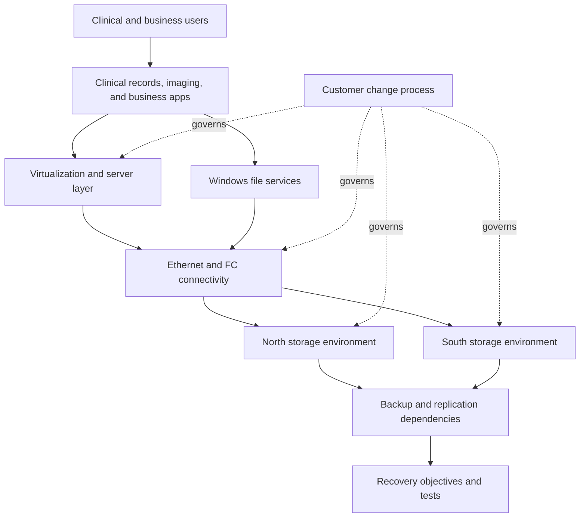

### Day 1 through Day 30

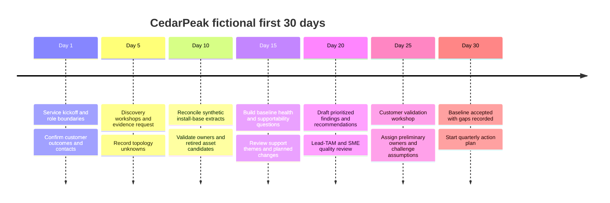

#### First-30-day outcomes and evidence

| Date | Activity | Fictional evidence | Finding or decision | Owner | Completion test |
|---|---|---|---|---|---|
| 2026-01-05 | Kickoff | Approved service-scope summary and contact list | Quarterly review cadence, escalation route, and evidence owners agreed | Lead TAM and customer infrastructure director | Minutes confirm scope, contacts, and next dates |
| 2026-01-08 | Discovery | Customer-provided topology draft and application criticality sheet | Clinical records path is tier one; ownership of one fabric segment unclear | Customer infrastructure architect | Named owner confirms topology and criticality |
| 2026-01-13 | Inventory reconciliation | Synthetic customer inventory A and account extract B | 12 records reviewed: 1 duplicate candidate, 1 retired candidate, 2 missing site owners | Technical Analyst and customer asset owner | Exceptions resolved or assigned with evidence |
| 2026-01-16 | Support history review | Synthetic 12-month case summary | Three cases share a handoff-quality theme; no claim of common technical root cause | Support lead and customer operations manager | Improvement action defined without false causality |
| 2026-01-20 | Supportability preparation | Placeholder component matrix; no real IMT result | Exact host, adapter, driver, firmware, switch, multipath, and storage combination needs authorized current validation before upgrade approval | Customer virtualization owner | Dated official result or exception decision attached to change |
| 2026-01-23 | Capacity trend | Synthetic monthly used-capacity series with an imaging-workload increase | One environment shows rising use; forecast confidence is medium because only six comparable months exist | Customer storage owner | Add 6 months and confirm workload onboarding dates |
| 2026-01-27 | Finding-validation workshop | Draft risk and recommendation register | Four findings accepted; one priority reduced after customer context; one item remains an assumption | Lead TAM and customer owners | Decision log records rationale and missing evidence |
| 2026-02-03 | Baseline approval | Environment profile, topology, exception list, initial action tracker | Starting state accepted for the fictional quarter | Customer infrastructure director | Approval plus owners/dates for material actions |

### Synthetic evidence register

| Evidence ID | Synthetic source | Scope/date | Quality note | Permitted conclusion | Not permitted conclusion |
|---|---|---|---|---|---|
| EV-01 | Customer inventory spreadsheet | 12 records, 2026-01-10 | Two sources disagree on asset status | Reconciliation is required | Either source is automatically correct |
| EV-02 | Customer topology drawing | Draft dated 2025-11-15 | One network owner and two paths unconfirmed | Discovery gaps exist | A specific path caused an incident |
| EV-03 | Six-month capacity series | Jul-Dec 2025 | Comparable monthly samples; short history | Direction and a cautious planning signal | Precise date-to-full or guaranteed growth rate |
| EV-04 | Twelve-month case summary | Calendar year 2025 | Sanitized categories; variable case detail | Handoff-quality theme appears three times | One common product defect caused all cases |
| EV-05 | Planned modernization brief | Change target Q2 2026 | Component versions incomplete | A dependency and supportability workstream is needed | The target combination is supported |
| EV-06 | Placeholder wellness summary | Exercise-only, 2026-01-19 | Not exported from a NetApp tool | Demonstrate triage method only | Claim a real Active IQ or AutoSupport finding |
| EV-07 | Customer maintenance calendar | Q1-Q2 2026 | Application freeze dates confirmed | Dates constrain remediation sequencing | Technical readiness is complete |

### Findings and prioritization

For this exercise, priority combines impact, likelihood, time horizon, evidence confidence, and dependency. The labels are illustrative and are not represented as a NetApp scoring method.

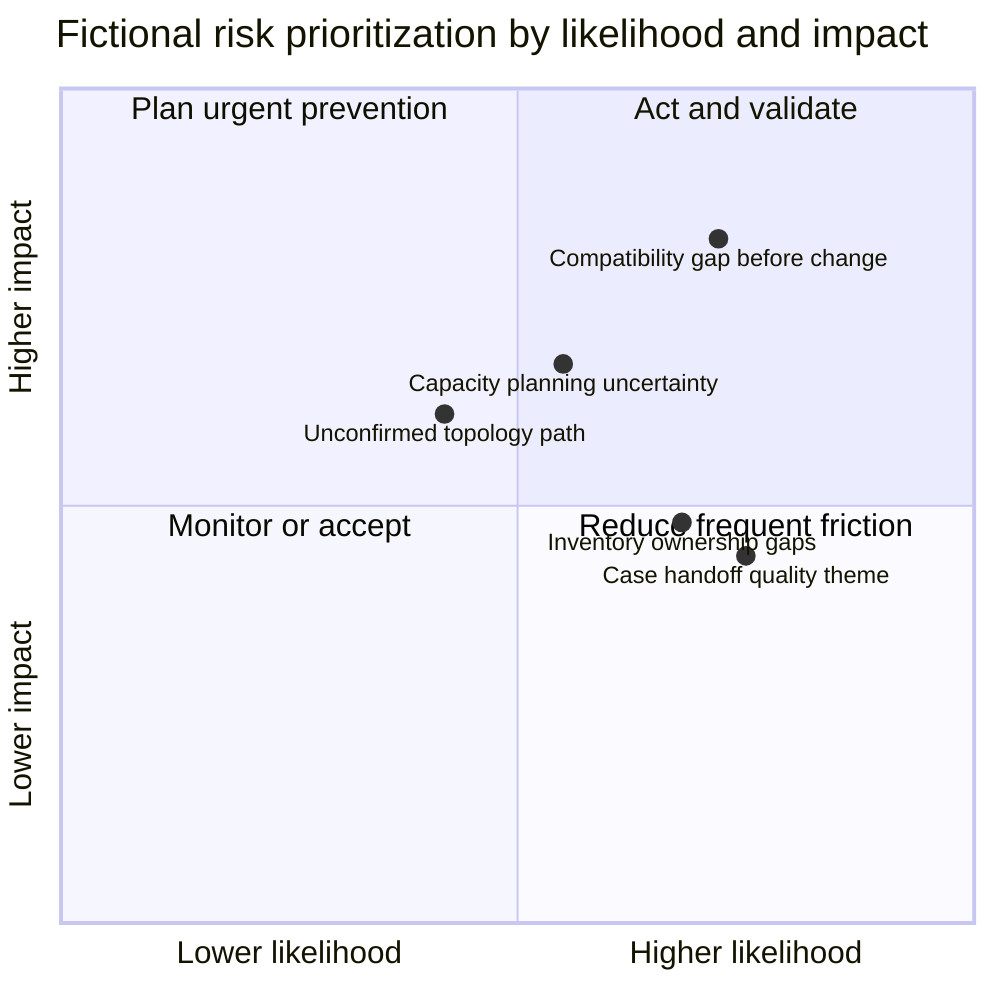

| ID | Verified finding | Priority and rationale | Recommendation | Initial residual risk |
|---|---|---|---|---|
| F-01 | The planned Q2 upgrade record lacks complete surrounding component versions and an authorized current compatibility result | **High:** tier-one service, fixed change horizon, incomplete prerequisite evidence | Inventory exact end-to-end components; complete dated official compatibility validation; review notes and exceptions before go/no-go | Even a supported combination can encounter defects or change failure; testing, rollback limits, and monitoring remain necessary |
| F-02 | Synthetic asset sources contain one duplicate candidate, one retired candidate, and two missing site owners | **Medium:** analysis coverage and routing may be inaccurate; evidence is direct | Reconcile each exception with customer asset owner and record authoritative identifiers, status, site, and owner | Inventory begins aging immediately; recurring ownership and refresh controls remain necessary |
| F-03 | Six comparable months show increased used capacity after imaging workload onboarding | **Medium-high:** business impact is material, but forecast confidence is limited | Confirm workload dates and data definitions, extend history, establish headroom decision threshold, and align capacity action with budget/change lead time | Demand, efficiency, snapshots, retention, and new projects can change the forecast |
| F-04 | Three synthetic cases include repeated evidence and handoff gaps | **Medium:** likely operational delay, but common technical cause is not established | Create a minimum escalation evidence checklist and review the next three relevant cases for completeness and cycle-time effect | Case complexity and external dependencies can still delay resolution |
| F-05 | One topology segment lacks a confirmed owner and path validation | **Medium:** incomplete dependency map could slow incident or change coordination | Name owner, validate path, update topology version, and include it in change and incident evidence packs | Diagrams can drift after environment changes |

### Recommendation register with objections and ownership

| Rec ID | Recommendation | Customer objection | Response and negotiated path | Owner | Target date | Validation | Residual risk after planned action |
|---|---|---|---|---|---|---|---|
| R-01 | Complete exact supportability validation before upgrade approval | "We upgraded a similar system last year, so another check is unnecessary." | Similarity is not evidence for this exact combination. Make the check a go/no-go prerequisite and limit initial work to read-only inventory and official validation. | Customer virtualization lead | 2026-03-06 | Dated result, notes reviewed, gaps entered in change record | Supported does not mean defect-free; upgrade testing and operational readiness remain |
| R-02 | Resolve four install-base exceptions | "The duplicate does not affect production." | Agree that it is not a production fault; frame it as analysis and contact-routing quality. Batch all four corrections into one 30-minute owner review. | Customer asset manager | 2026-02-20 | Corrected records and exception log | Future moves/adds/changes can reintroduce drift |
| R-03 | Extend capacity baseline and set a decision threshold | "We can buy capacity when an alert turns red." | Show procurement and change lead time. Agree a staged trigger: gather six more months now and define when architecture or purchase review begins. | Customer storage lead | 2026-03-13 | Twelve-month series, definitions, threshold, owner | Workload change may invalidate the trend |
| R-04 | Introduce minimum escalation evidence checklist | "A checklist will slow engineers during incidents." | Keep it short, severity-aware, and reusable. Pilot on three cases; stop or revise if it adds effort without improving handoff quality. | Customer operations manager | 2026-03-20 | Three-case sample and retrospective | Urgent incidents may still begin with incomplete evidence |
| R-05 | Validate and assign the unowned topology path | "The network team is already overloaded." | Split the work: infrastructure architect confirms logical ownership; network team validates only the disputed path during an existing maintenance review. | Customer infrastructure architect | 2026-02-27 | Named owner, updated dated diagram, validation note | Subsequent network changes can make the record stale |

### Action adoption states

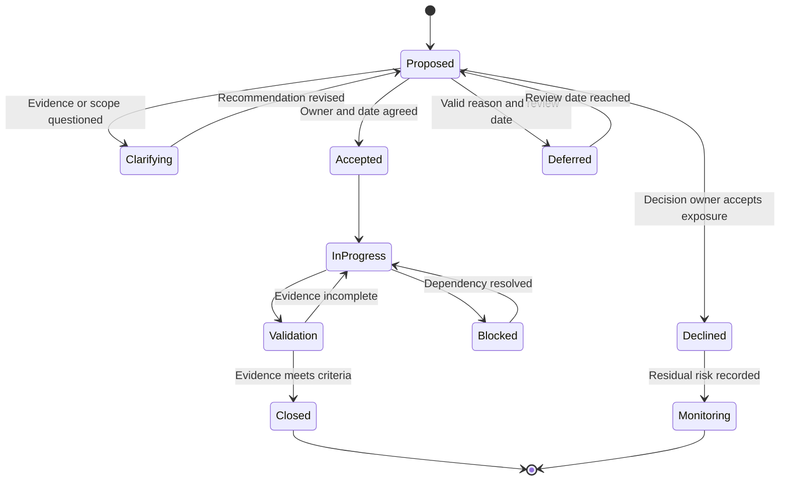

### Quarterly operational service review - 2026-04-07

The analyst prepares the fictional review using a 2026-03-31 data cutoff. The lead TAM reviews the narrative and owns the integrated customer conversation.

#### Executive opening

> "This quarter established a validated account baseline and moved four of five preventative actions forward. The upgrade-supportability prerequisite is complete in the exercise record, install-base exceptions are closed, and the topology owner is confirmed. Capacity planning remains open because additional history changed the growth estimate, and the escalation-checklist pilot showed better evidence completeness but no defensible cycle-time conclusion yet. The decision requested today is whether to fund the capacity workstream before the next budgeting gate."

#### Review evidence and decisions

| Topic | Evidence presented | Customer decision | Owner/date | Validation and outcome |
|---|---|---|---|---|
| Baseline and topology | Approved environment profile; topology v2; path owner record | Accept v2 as current baseline | Infrastructure architect, complete 2026-02-26 | Unknown-owner count reduced from 1 to 0 in the synthetic record |
| Install base | Four-item exception log | Close all four and establish monthly move/add/change review | Asset manager, complete 2026-02-19 | Duplicate and retired candidates resolved; two owners assigned |
| Upgrade readiness | Exercise-only supportability record placeholder | Permit change planning to continue, subject to normal change and test gates | Virtualization lead, complete 2026-03-05 | This proves the exercise workflow, not a real supported configuration |
| Capacity | Twelve-month revised trend and imaging growth event | Start options analysis before budget gate | Storage lead, due 2026-04-24 | Threshold defined; technical option still open |
| Support experience | Three-case checklist pilot | Continue for three more cases before standardizing | Operations manager, due 2026-05-15 | Evidence completeness improved from exercise baseline; time effect remains uncertain |
| Value | Baseline and action movement | Continue quarterly governance | Infrastructure director | Value stated as better decision readiness and closed data gaps, not avoided outages |

### Follow-up after the review

| Follow-up date | Action | Evidence | Result | Remaining or residual risk |
|---|---|---|---|---|
| 2026-04-08 | Send minutes and action register | Customer-reviewed notes | No disputed decisions; all actions have owners and dates | Owners can still miss dates; weekly aging review continues |
| 2026-04-17 | Capacity options workshop | Revised growth model, workload assumptions, budget lead time | Customer chooses a two-stage technical assessment rather than emergency purchase | Future imaging growth and retention change remain uncertain |
| 2026-04-24 | Capacity action checkpoint | Approved analysis scope and threshold | Action moves to planned project; no claim of capacity expansion yet | Actual remediation depends on project approval and execution |
| 2026-05-15 | Escalation-checklist retrospective | Six synthetic cases | Checklist adopted with one field removed; evidence quality improved | Sample is too small to claim faster resolution causally |
| 2026-06-30 | Next-quarter data cutoff | Refreshed fictional baseline | No reopened inventory exceptions; one new asset enters reconciliation | Ongoing hygiene is required; closure was not permanent |

### What the fictional story proves

It demonstrates the method Arti should be able to explain:

1. Begin with service scope and customer outcomes.
2. Build a validated environment picture.
3. Reconcile data before analyzing it.
4. Separate evidence from assumptions and tool-access gaps.
5. Prioritize by customer impact, time horizon, likelihood, and confidence.
6. Write actions with owners, dates, validation, and residual risk.
7. Handle objections by reframing around interests and evidence.
8. Use the service review to obtain decisions, not merely present slides.
9. Follow through after the meeting and measure only what the evidence supports.

It does **not** prove production NetApp tool use, ONTAP administration, upgrade execution, or work for a real healthcare customer.

---

## 12. Arti's support-to-TAM bridge

### Factual strength map

| Factual CV evidence | TAM-relevant strength | Interview use |
|---|---|---|
| 5+ years in Microsoft support and escalations | Sustained technical ownership, customer context, and structured escalation | Use a real example of organizing evidence, coordinating owners, and maintaining communication |
| SharePoint, OneDrive, and Copilot experience | Enterprise data-service and cloud dependency awareness | Connect to application-to-data thinking while acknowledging different storage architecture |
| Enterprise and partner customers | Multi-party communication and boundary management | Explain how customer, partner, Support, Product, and Engineering roles were aligned |
| CRITSIT and business-critical incidents | High-pressure prioritization and executive-ready updates | Show impact-first triage, restoration focus, cadence, and post-incident learning |
| Technical advisory work | Ability to turn technical evidence into customer action | Use a recommendation or risk-mitigation example grounded in actual scope |
| Product and Engineering collaboration | Strong escalation packages and defect/fix follow-through | Explain evidence quality, exact asks, feedback loops, and validation |
| CSAT above 4.75 Enterprise and above 4.85 SMB | Consistently strong customer experience indicators | Present as measured support outcomes, not proof of TAM storage expertise |
| 100+ recognitions | Repeated peer/customer acknowledgement | Use selectively as corroboration; lead with specific behavior and result |
| Business reviews and analytics | Operational reporting and trend storytelling | Bridge to service-review preparation and data-backed decisions |
| Excel and Power BI | Analysis, reconciliation, visualization, and QA | Build portfolio examples using synthetic data and reproducible logic |
| Mentoring and onboarding | Coaching and quality calibration | Map directly to buddying, standard-task coaching, and teach-back |
| Technical Advisor program | Advisory mindset and broader team contribution | Explain factual responsibilities and outcomes without inflating title equivalence |
| MBA in Business Analytics | Business framing, data reasoning, and stakeholder decisions | Connect technical work to prioritization, value, and uncertainty |
| Azure, networking, VM, and storage fundamentals | Entry point to hybrid infrastructure thinking | State as foundation; build NetApp, protocol, SAN/NAS, and virtualization depth in later Parts |

### Support-to-TAM translation table

| Support language | TAM language | What remains the same | What must expand |
|---|---|---|---|
| Own a critical escalation | Coordinate a material account risk or incident context | Impact, evidence, owners, cadence, escalation | Longer time horizon and cross-estate implications |
| Troubleshoot a symptom | Analyze a fleet or environment signal | Hypotheses, data quality, discriminating evidence | Proactive signals, trend context, and prioritization |
| Restore service | Reduce future exposure and improve stability | Safe action and validation | Prevention, lifecycle, supportability, and adoption |
| Escalate to Product/Engineering | Build a focused specialist or defect evidence pack | Reproduction, versions, logs, exact ask | Account relevance, affected population, and follow-through |
| Write case notes | Maintain recommendation, decision, and action traceability | Chronology and evidence | Owner, due date, business risk, residual risk, value |
| Present case trends | Run an operational service review section | Data storytelling and audience calibration | Environment health, roadmap, decisions, and preventative actions |
| Maintain backlog health | Maintain recommendation and remediation health | Aging, priorities, blockers | Customer dependency, accepted risk, and validation evidence |
| Advise a customer on next steps | Influence action without direct authority | Trust, options, rationale | Objection handling, negotiation, and governance cadence |
| Validate a fix | Validate remediation outcome | Before/after evidence and customer confirmation | Residual risk and ongoing monitoring |
| Mentor an engineer | Buddy and coach standard TAM-analysis tasks | Task decomposition, feedback, quality | Account-service standards and NetApp-specific expertise |

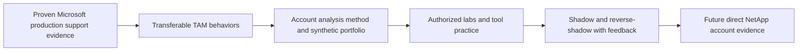

### Demonstrated strengths versus unproven gaps

| Demonstrated now | Unproven and must not be implied |
|---|---|
| Microsoft enterprise support and escalation ownership | Production administration of NetApp ONTAP, AFF/FAS, StorageGRID, E-Series, or cloud data services |
| SharePoint/OneDrive/Copilot and M365 customer context | Direct use of AutoSupport, Active IQ Digital Advisor, IMT, Hardware Universe, or NetApp Bugs Online |
| CRITSIT coordination and high-pressure communication | NetApp bug/BURT scrub ownership in a customer account |
| Product/Engineering collaboration and fix validation | NetApp upgrade, firmware, SAN, NAS, VMware-storage, or lifecycle delivery |
| Business reviews, analytics, Excel, Power BI | Leading a formal NetApp operational service review |
| Mentoring, onboarding, and Technical Advisor experience | Acting as a NetApp lead TAM or owning NetApp commercial strategy |
| Azure, networking, VM, and storage fundamentals | Deep production storage architecture or virtualization specialization |

### Honest 60-90 second answer: Tell me about yourself and why this role?

> "I have more than five years of Microsoft support and escalation experience, primarily around SharePoint, OneDrive, Microsoft 365, and more recently Copilot-related work. I have supported enterprise and partner customers, owned business-critical and CRITSIT situations, coordinated with Product and Engineering, and translated technical findings into customer guidance and business reviews. My measured customer outcomes include CSAT above 4.75 in Enterprise and above 4.85 in SMB, along with more than 100 recognitions. I also bring an MBA in Business Analytics, hands-on use of Excel and Power BI, mentoring and onboarding experience, and foundations in Azure, networking, virtual machines, and storage. The reason this Technical Analyst role interests me is that it extends the strongest parts of my support background from individual escalations into ongoing account analysis: understanding an environment, identifying risk before it becomes urgent, improving the quality of recommendations, tracking action, and showing value over time. I want to be direct about the gap: my production experience is Microsoft-focused, not NetApp administration or NetApp's gated tools. I am building the storage and NetApp-specific depth systematically, and I would bring a proven evidence, customer, and escalation discipline while I ramp under the lead TAM and subject-matter experts."

### Candidate honesty note

Use these labels consistently:

| Evidence level | Safe language | Do not say |
|---|---|---|
| **Production** | "In my Microsoft support role, I owned..." followed by a factual example and result | "I have done this in NetApp" when the work was on Microsoft technology |
| **Lab or synthetic exercise** | "In a controlled lab" or "Using synthetic account data, I built..." and explain method and evidence | "For my customer" or "in production" |
| **Conceptual** | "I understand the purpose and would validate it by..." | "I know the tool" when knowledge comes only from reading |
| **Access-gated or not yet practiced** | "I have not used that tool directly. My current understanding is conceptual, and I would verify current behavior through authorized access, official documentation, and review." | Invented screenshots, workflows, results, or entitlement |
| **Transferable** | "The analogous skill I have demonstrated is...; the NetApp-specific part I still need to learn is..." | Treating an analogy as identical domain experience |

Credibility comes from precision. A gap plus a sound learning and validation method is stronger than an inflated claim that fails under follow-up.

---

## 13. Operating behaviors behind the JD

### Communication under pressure

Use a stable update structure:

1. **Impact:** Who or what is affected, and how severely?
2. **Current state:** What is known now, with timestamp and evidence?
3. **Action:** What is happening next and why?
4. **Ownership:** Who owns each workstream?
5. **Risk or blocker:** What could prevent progress?
6. **Checkpoint:** When will the next update occur?

Do not fill uncertainty with confident-sounding speculation. Say what is known, unknown, assumed, and being tested.

### Prioritization model

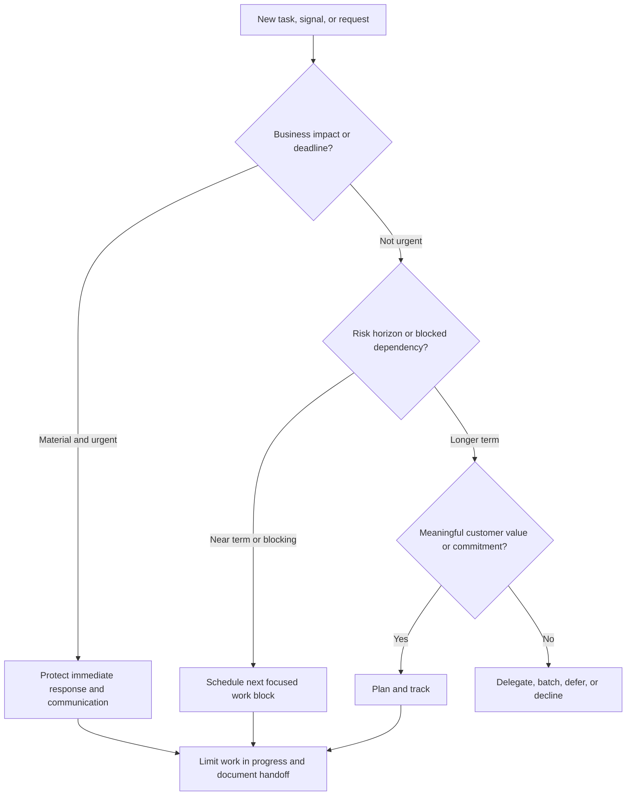

Priority is not merely who sent the loudest message. Consider business impact, urgency, risk horizon, customer commitment, dependency criticality, effort, and opportunity cost.

### Influence and negotiation

When a customer resists a recommendation:

- Ask which constraint is dominant: outage risk, cost, people, timing, uncertainty, competing change, or disagreement with evidence.
- Restate the shared objective before debating the solution.
- Separate mandatory supportability or safety conditions from optional optimization.
- Offer phased options with explicit tradeoffs.
- Make the cost of delay visible without using fear.
- Record deferral, decision owner, review date, and residual risk.
- Escalate when the impact exceeds agreed authority; do not manufacture consent.

### Special projects

A special project needs more than an action row:

| Project element | Minimum question |
|---|---|
| Objective | What measurable outcome is required? |
| Scope | What is included and excluded? |
| Stakeholders | Who decides, performs, reviews, and receives updates? |
| Milestones | Which evidence marks progress? |
| Risks | What uncertain events threaten the outcome? |
| Assumptions | What is currently believed but unverified? |
| Issues | What problem already exists? |
| Dependencies | What must another team, vendor, tool, or change provide? |
| Status | Is the forecast healthy, at risk, or off plan, and why? |
| Closure | What proves completion and captures learning? |

### Coaching and cross-functional contribution

A credible coach:

1. Demonstrates a standard task and explains the reasoning.
2. Lets the learner shadow, then reverse-shadow by performing it.
3. Uses a quality rubric rather than personal preference.
4. Gives specific feedback tied to evidence and customer effect.
5. Records recurring confusion as a documentation or training improvement.
6. Knows when the learner needs an SME rather than unsupported coaching.

An SME contribution should be reusable: a reviewed analysis method, decision tree, template, teach-back, case pattern, or knowledge article. Specialization is earned through repeated evidence and peer review, not chosen as a label.

---

## 14. Common failure modes and misconceptions

### Failure modes

| Failure mode | Why it fails | Better behavior |
|---|---|---|
| Treating a dashboard as ground truth | Identity, freshness, scope, or mapping may be wrong | Validate source, date, population, and customer context |
| Sending every alert to the customer | Noise hides material exposure | Deduplicate, test applicability, prioritize, and explain action |
| Calling all advice a best practice | Generic guidance may conflict with workload or support constraints | State conditions, customer fit, alternatives, and tradeoffs |
| Confusing supportability with reliability | A supported combination can still fail; an unlisted combination is not proof of current failure | Describe support boundary and operational risk separately |
| Recommending "upgrade to latest" | Target, path, ecosystem, lifecycle, defects, and change constraints are version-specific | Perform complete current validation and plan the change |
| Closing an action when a ticket is opened | Initiation is not remediation | Define outcome evidence and residual risk |
| Owning the customer's risk decision | Vendor roles advise; the customer owns business risk | Name the customer decision owner and record acceptance or deferral |
| Acting as Support during an incident | Account coordination can blur technical process and accountability | Preserve Support ownership while adding account context and communication |
| Treating a service review as a status recital | Stakeholders leave without decisions or owners | Lead with outcomes, material changes, choices, and asks |
| Hiding uncertainty | False precision damages trust and can drive unsafe action | State unknowns, assumptions, confidence, and validation plan |
| Overloading Excel or PowerPoint with detail | Analysis becomes hard to review and act on | Keep reproducible detail in the workbook/appendix and decision messages in the deck |
| Accepting unlimited time-zone work | Fatigue reduces quality and continuity | Agree coverage, use handoffs, and escalate unsustainable demand |
| Overclaiming NetApp experience | Follow-up questions expose the claim | Separate production, lab, conceptual, and transferable evidence |

### Misconceptions corrected

| Misconception | Correct mental model |
|---|---|
| "A TAM is premium Support." | TAM and Support collaborate, but TAM adds persistent account context, prevention, planning, governance, and value follow-through. |
| "The Technical Analyst is a report builder." | Reporting is one output; the core work is validated analysis, recommendation quality, prioritization, and action visibility. |
| "AutoSupport or Active IQ removes the need to understand the customer." | Tool signals require identity, freshness, applicability, business context, and human judgment. |
| "IMT proves the upgrade will succeed." | Current compatibility evidence supports a supportability decision; it does not replace health checks, testing, change control, rollback planning, or monitoring. |
| "A bug scrub is a list of all bugs in a release." | It is an applicability assessment for the customer's exact estate and use. |
| "A red risk must be fixed immediately." | Priority depends on impact, likelihood, time horizon, evidence confidence, dependencies, and customer decision. |
| "Value equals number of recommendations." | Value is validated movement in outcomes, not output volume. |
| "Influence means persuading the customer to agree." | Ethical influence makes evidence, options, tradeoffs, and consequences clear while preserving customer authority. |
| "Storage is only the array." | The outcome depends on applications, hosts, hypervisors, networks/fabrics, protocols, storage, protection, operations, and change. |

---

## 15. Self-test exercises

### Exercise 1 - One-sentence role explanation

Without notes, explain the role in one sentence. Check for all four elements:

- Verified customer evidence.
- Technical analysis and prioritization.
- Customer-specific action and ownership.
- Stability, supportability, risk, or value outcome.

### Exercise 2 - Boundary sorting

Assign the likely primary owner and Technical Analyst contribution:

1. A production volume becomes unavailable.
2. A customer wants a six-month upgrade roadmap.
3. A defect appears applicable but requires Engineering review.
4. A customer needs implementation resources for a migration.
5. The renewal team needs a factual technical value summary.
6. A customer declines a preventative action because of a freeze.

**Self-check:** Your answers should distinguish Support, customer change authority, lead TAM, Technical Analyst, Engineering, Professional Services, and Sales/Account ownership.

### Exercise 3 - Turn a weak finding into a recommendation

Weak statement:

> "System ABC is old. Upgrade as soon as possible."

Rewrite it with evidence, customer context, risk, action, owner/date, validation, and residual risk. Do not invent a target release; state which current sources and customer facts must be verified.

### Exercise 4 - Build an install-base reconciliation

Using a synthetic spreadsheet, create two source tables with:

- A stable asset identifier.
- Customer/site mapping.
- Platform and current software version.
- Owner.
- Active/retired status.
- Last evidence date.

Add one duplicate, one missing owner, one stale record, and one identifier mismatch. Produce an exception table and explain which source is authoritative for each field and why.

### Exercise 5 - Service-review opening

Prepare a 60-second opening with:

- The period and data cutoff.
- Two validated outcomes.
- One material open risk.
- One decision required today.
- No claim that cannot be traced to evidence.

### Exercise 6 - Objection handling

Respond to: "We have no outages, so the preventative action has no value." Use shared objective, evidence, time horizon, options, cost of delay, and customer decision ownership. Avoid fear-based language.

### Exercise 7 - Arti evidence labeling

Choose one real Microsoft CRITSIT, one business review, and one mentoring example. For each, write:

- What Arti directly did in production.
- Which TAM competency transfers.
- Which NetApp-specific knowledge is still missing.
- Which lab or learning artifact would narrow the gap.

### Exercise 8 - Fictional account audit

Review the CedarPeak story and identify:

- One correlation that was deliberately not called causation.
- One action whose closure evidence is explicit.
- One residual risk after remediation.
- One access-gated tool result that was not invented.
- One value claim that is intentionally modest.

---

## 16. Official Source Anchors

**Date checked: 2026-08-24.** The supplied NetApp TAM Technical Analyst job description, represented in the master coverage matrix, is the source for role responsibilities and requirements. The public sources below anchor product and tool terminology only. This Part does not claim an internal NetApp workflow, entitlement, customer access, or current product result.

| Topic | Official public source | Access and currency note |
|---|---|---|
| NetApp product documentation | [NetApp Documentation](https://docs.netapp.com/) | Public documentation portal. Select the exact product and release; product behavior is version-sensitive. |
| AutoSupport concept | [What AutoSupport is](https://docs.netapp.com/us-en/ontap/system-admin/manage-autosupport-concept.html) | Public ONTAP documentation page. Configuration, content, delivery, privacy, entitlement, and release behavior must be checked for the exact environment; detailed use is deferred to Part 47. |
| Active IQ Digital Advisor documentation | [Digital Advisor documentation](https://docs.netapp.com/us-en/active-iq/) | Documentation is public; customer-specific service use requires appropriate identity, entitlement, and data availability. Features and presentation can change; detailed use is deferred to Part 48. |
| Interoperability Matrix Tool | [NetApp Interoperability Matrix Tool](https://imt.netapp.com/) | Official tool. Customer or detailed results may require authentication/entitlement. Results and notes are version-sensitive and must be captured with a check date; detailed method is deferred to Part 50. |
| Hardware Universe | [NetApp Hardware Universe](https://hwu.netapp.com/) | Official tool and potentially access-gated. Specifications, components, limits, and rules must be checked for the exact platform and date; detailed method is deferred to Part 51. |
| NetApp support resources and Bugs Online entry point | [NetApp Support Site](https://mysupport.netapp.com/) | Official support portal. Bugs Online, cases, customer assets, and some technical content can require an authorized support account and entitlement. Never invent inaccessible defect details; methodology is deferred to Part 52. |

### Source-use rules for interviews and customer work

- Recheck version-sensitive facts immediately before making a technical claim or recommendation.
- Record product, release, component combination, page/tool, result, notes, access boundary, and date checked.
- Prefer an exact official result over memory, screenshots without provenance, or a third-party summary.
- Treat gated information according to authorization and data-handling requirements.
- When access is unavailable, say so and describe the validation plan; do not fabricate a result.
- Keep Part 1 conceptual. Implementation details belong to the mapped technical Parts and authorized environments.

---

## Likely Interview Questions

### Q1. What does a NetApp TAM Technical Analyst do?

> **Model answer:** "The Technical Analyst turns verified account and environment data into customer-specific technical analysis, prioritized recommendations, service-review content, and tracked actions. The role helps the lead TAM and customer understand supportability, lifecycle, health, risk, and trends, then follows recommendations through ownership, validation, and residual-risk reporting. It complements Support and other account roles rather than replacing them."

**Likely follow-up depth:** Be ready to draw the chain from data to finding, risk, recommendation, owner, validation, and customer outcome, and to name the concrete deliverables that support it.

### Q2. How is proactive TAM work different from reactive Support?

> **Model answer:** "Reactive Support usually starts with a reported incident or question and focuses on diagnosis, restoration, and case progression. Proactive TAM work starts from account context, telemetry, trends, lifecycle events, repeated support themes, or planned changes and aims to reduce future exposure and improve long-term value. During an incident, Support retains the technical case process while the TAM team can add topology, history, stakeholder coordination, and follow-through into prevention."

**Likely follow-up depth:** Give an example where an incident is restored by Support, then converted into a separate preventative recommendation with a customer owner and due date.

### Q3. How would you turn customer data into a recommendation?

> **Model answer:** "I would first validate identity, scope, freshness, completeness, and source provenance. I would combine the signal with business criticality, topology, support history, planned changes, and current official supportability or lifecycle evidence. I would distinguish fact from assumption, then state the condition, risk, priority, options, exact action, owner, target date, validation evidence, and residual risk. I would have the lead TAM or relevant SME review material conclusions before customer presentation."

**Likely follow-up depth:** Expect questions about conflicting sources, missing identifiers, correlation versus causation, confidence, and how you would handle an inaccessible gated tool.

### Q4. Who owns an escalation and how do the account roles differ?

> **Model answer:** "Ownership depends on the work. Support owns case progression and routes qualifying product defects; Engineering owns product investigation and fixes; the customer owns production changes and business-risk decisions; Professional Services owns contracted implementation deliverables; Sales owns the commercial motion; and the lead TAM owns integrated technical account governance. The Technical Analyst owns the quality and traceability of assigned analysis, reporting, evidence packs, and action visibility. Escalating expands expertise without removing the need for coordination and clear communication."

**Likely follow-up depth:** Be ready to handle a live-incident scenario where the customer pressures the TAM to prescribe an unvalidated production change.

### Q5. How would you run an operational service review?

> **Model answer:** "I would agree the audience, objectives, data cutoff, and decision asks first. I would refresh and validate the environment, health, support, risk, lifecycle, and action evidence; review material findings with the lead TAM and SMEs; and build a message-first deck with a technical appendix. In the meeting, I would focus on changes, outcomes, material exposure, recommendations, owners, and decisions. Afterward, I would send concise minutes, update the action register, and track validation and residual risk."

**Likely follow-up depth:** Explain how the technical section differs for engineers and executives, how you challenge stale actions, and what makes a review valuable rather than ceremonial.

### Q6. Why are you a fit when your background is Microsoft rather than NetApp storage?

> **Model answer:** "My direct evidence is more than five years of Microsoft enterprise support and escalation work, including SharePoint, OneDrive and Copilot, business-critical incidents, partner and customer coordination, Product and Engineering collaboration, technical advisory, business reviews, analytics, and mentoring. Those experiences demonstrate evidence discipline, customer communication, high-pressure ownership, cross-functional influence, and follow-through. I also bring an MBA in Business Analytics and Azure, networking, VM, and storage fundamentals. I would not claim production ONTAP or NetApp tool experience; that is the domain gap I am closing through official learning, synthetic analysis, labs where authorized, and review by experienced SMEs."

**Likely follow-up depth:** Prepare one factual CRITSIT story, one analytics/business-review story, one engineering-collaboration story, and a concrete 30/60/90-day storage ramp plan.

### Q7. What would you do if a customer rejected a high-priority recommendation?

> **Model answer:** "I would first understand whether the objection is evidence, cost, timing, outage risk, people, or a competing priority. I would restate the shared outcome, show the evidence and time horizon, and offer feasible options such as phased remediation or an additional validation step. I would not use fear or imply that the vendor owns the decision. If the customer defers or declines, I would record the decision owner, rationale, review date, monitoring plan, and residual risk, and escalate through agreed governance when impact warrants it."

**Likely follow-up depth:** Expect to negotiate a maintenance freeze, an incomplete compatibility record, or a capacity risk whose forecast confidence is only medium.

### Q8. How do you prove TAM value?

> **Model answer:** "I would establish a starting condition and connect service activity to verified customer action and outcome. Useful evidence might include reconciled asset coverage, closed high-priority actions, improved supportability evidence, earlier lifecycle decisions, reduced recommendation aging, better escalation completeness, or validated stability and capacity milestones. I would separate contribution from causation and keep open risk visible. The number of meetings, reports, or alerts is activity, not value by itself."

**Likely follow-up depth:** Be ready to define leading and lagging indicators, explain attribution limits, and show how a value narrative supports renewal without becoming a sales claim.

---

## 30-Second Memory Hooks

- **Role:** Evidence -> context -> risk -> action -> owner -> validation -> value.
- **TAM:** The account's technical continuity and prevention layer, not a replacement for Support.
- **Technical Analyst:** Reconcile, analyze, explain, improve, and follow through.
- **Install base:** The asset title register; dirty records create blind spots.
- **AutoSupport:** System information for support context; validate scope and freshness.
- **Digital Advisor:** Personalized insight surface; a signal still needs customer context.
- **IMT:** Check the exact combination, not each component in isolation.
- **Hardware Universe:** Verify current hardware facts and limits instead of trusting memory.
- **Bug scrub:** Match product, version, feature, and trigger before calling a defect applicable.
- **Supportability:** Inside documented support parameters is not the same as guaranteed reliability.
- **Best practice:** Good default plus customer conditions, not a universal command.
- **Recommendation:** A decision-ready prescription, not a generic observation.
- **Residual risk:** What remains after the action or decision.
- **Action tracking:** Owner, date, blocker, evidence, and remaining risk.
- **Service review:** A decision meeting backed by evidence, not a slide recital.
- **Value:** Proved outcome movement, not activity volume.
- **Honesty:** Production, lab, conceptual, gated, and transferable are different evidence levels.
- **Arti's bridge:** Microsoft escalation discipline plus analytics and customer trust; NetApp depth must be earned and demonstrated.

---

## Completion Checklist

You are ready for Part 2 when you can do all of the following without reading:

- [ ] State the role in one sentence and deliver the 60-90 second candidate answer naturally.
- [ ] Define TAM, Technical Analyst, install base, AutoSupport, Active IQ Digital Advisor, IMT, Hardware Universe, bug/BURT scrub, operational service review, best practice, supportability, recommendation, remediation, preventative support, proactive support, risk, residual risk, action tracking, and value realization.
- [ ] Explain why a customer pays for TAM services when Support already exists.
- [ ] Distinguish lead TAM, Technical Analyst, Support, Sales/Account, Customer Success, Professional Services, Engineering/Product, partners, and customer roles.
- [ ] Explain who owns a case, product defect, production change, business-risk decision, technical account plan, and analysis deliverable.
- [ ] Draw the data -> analysis -> deliverable -> customer-outcome chain.
- [ ] Name every major input and identify its data-quality or applicability check.
- [ ] Describe all 15 deliverables and at least one quality criterion for each.
- [ ] Explain daily, weekly, monthly, quarterly, and annual cadence without presenting it as a fixed internal NetApp schedule.
- [ ] Walk through onboarding, discovery, baseline, ongoing analysis, service review, remediation tracking, incident support, renewal/value story, and continual improvement.
- [ ] Explain every JD Mapping row and connect it to factual evidence or an honest gap.
- [ ] Recreate the CedarPeak fictional story from first 30 days through quarterly review and follow-up.
- [ ] Identify evidence, priority rationale, recommendation, objection, owner, date, validation, residual risk, and outcome in the fictional story.
- [ ] Translate five Microsoft support examples into TAM competencies without claiming NetApp production experience.
- [ ] Label statements accurately as production, lab/synthetic, conceptual, access-gated, or transferable.
- [ ] Explain at least five common TAM failure modes and correct the related misconceptions.
- [ ] Complete the eight self-test exercises and answer all eight interview questions aloud.
- [ ] Recheck official, version-sensitive sources before making any product or tool claim.

---

*Next suggested section:* [Part 2 - Customer Environment Thinking from Application to Data](Part-02-customer-environment-application-to-data.md). It builds the end-to-end dependency map needed before any storage health, risk, supportability, performance, or upgrade conclusion can be trusted.