# Part 2 - Customer Environment Thinking from Application to Data

> **Section goal:** Learn to represent a customer environment as a connected system from business purpose to stored data, then reason backward from a technical component to the people and outcomes it can affect. By the end, you should be able to discover, draw, question, and explain an environment without treating the storage system as an isolated box.

Covers index item **2** and maps directly to job-description responsibilities for understanding the customer environment, producing customer-specific recommendations, improving the support experience, reducing risk and improving stability, maintaining install-base context, supporting strategic planning, coordinating cross-functional work, and contributing to operational service reviews.

This chapter is intentionally product-light. It establishes the reasoning model needed before later Parts introduce detailed storage, network, ONTAP, protection, supportability, and performance behavior. Product behavior that depends on a release, platform, license, protocol version, or configuration must be verified against current official documentation and the actual customer environment.

---

## 1. Vocabulary: the language of an environment map

An environment map is useful only when everyone means the same thing by its labels. This section defines the chapter's terms before using them in the operating models that follow.

### Plain-English deep-dive: business purpose and dependency language

| Term | Plain meaning | Analogy | Why it matters and memory hook |
|---|---|---|---|
| **Business service** | A capability delivered to customers, employees, or partners that creates a business outcome. | A hospital's appointment service includes people, process, and technology; it is more than one program. | Technology matters because it enables a service. **Hook:** Start with the outcome, not the box. |
| **Application** | Software that performs a defined set of tasks for users or another system. | A restaurant's ordering application is the digital order pad. | One business service can depend on several applications. **Hook:** Application = the software worker. |
| **Workload** | The pattern and amount of work an application asks technology to perform over time. | A kitchen has breakfast rushes, quiet periods, and large banquet orders. | Design depends on read/write mix, volume, peaks, timing, and sensitivity, not merely the application name. **Hook:** Workload = what the application actually does. |
| **Transaction** | One meaningful unit of work that begins with a request and reaches success, failure, or rollback. | Booking one appointment may check identity, find a slot, reserve it, and send confirmation. | A transaction can cross many components; its delay is not automatically a storage delay. **Hook:** Transaction = one end-to-end job. |
| **Owner** | The named person or role accountable for a decision, component, service, or action. | A building has an owner for electrical safety even when a contractor performs repairs. | Unowned components and actions stall during incidents and reviews. **Hook:** Ownership names who decides. |
| **Dependency** | Something that another thing needs in order to operate correctly. | A train journey depends on track, signals, power, staff, and stations. | Dependency knowledge predicts impact and directs evidence requests. **Hook:** No dependency, no service. |
| **Upstream dependency** | A dependency that supplies an input or prerequisite to the item being examined. | A water treatment plant is upstream of a household tap. | A visible failure may originate before the affected component. **Hook:** Upstream feeds me. |
| **Downstream dependency** | A consumer or later step that relies on the item being examined. | Homes and businesses are downstream of the water plant. | Component failure can affect many later services. **Hook:** Downstream needs me. |
| **Criticality** | The importance of a service or component based on the consequence and timing of its loss. | A hospital operating room's power is more critical than decorative lighting. | Criticality guides priority, protection, maintenance, and communication. **Hook:** Critical means consequence plus time. |

### Plain-English deep-dive: compute and software layers

| Term | Plain meaning | Analogy | Why it matters and memory hook |
|---|---|---|---|
| **Compute** | Processing and memory resources that execute instructions. | The cooks and worktops that turn ingredients into meals. | An application needs enough processing and memory as well as data access. **Hook:** Compute does the work. |
| **Host** | A physical or virtual computer that runs an operating system and provides resources to software. | A building that houses workers and equipment. | Host health, identity, drivers, and connectivity affect the complete path. **Hook:** Host = where software lives. |
| **Operating system (OS)** | Core software that manages a host's processing, memory, devices, files, security, and application access. | A building manager assigns rooms, controls access, and coordinates utilities. | The OS translates application requests into network and storage operations. **Hook:** OS manages the host. |
| **Hypervisor** | A software layer that divides a physical host into isolated software-defined computers. | An office tower manager divides one building into separately controlled suites. | It adds scheduling, virtual networking, virtual storage, and another ownership boundary. **Hook:** Hypervisor divides the host. |
| **Virtual machine (VM)** | A software-defined computer with virtual processing, memory, network interfaces, and disks. | One independently operated suite inside the office tower. | A VM can move between physical hosts while retaining logical identity, which separates logical and physical maps. **Hook:** VM = computer made from software. |
| **Container** | A packaged application process and its dependencies that shares the host OS kernel rather than carrying a complete guest OS. | Separate food stalls share one market building and utilities but package their own tools and ingredients. | Containers are lighter than VMs, but still depend on hosts, networks, identities, and persistent data. **Hook:** Container packages the process, not a whole computer. |
| **Kubernetes** | A system that schedules, connects, restarts, and scales groups of containers across a set of hosts. | A dispatcher assigns food stalls to available market spaces and replaces one when it closes. | The running container can be temporary while its data must persist, creating orchestration and storage dependencies. **Hook:** Kubernetes coordinates containers. |

### Plain-English deep-dive: communication and I/O language

**Input/output (I/O)** means reading data from or writing data to another component. The abbreviation is defined here before it appears in diagrams.

| Term | Plain meaning | Analogy | Why it matters and memory hook |
|---|---|---|---|
| **Network** | Connected devices and links that exchange information. | A road system connecting buildings. | Delay, loss, addressing, routing, policy, and link failure can affect a data request. **Hook:** Network = connected roads. |
| **Fabric** | A deliberately interconnected set of network devices and paths, often used for Ethernet or storage connectivity. | A city street grid with several possible routes rather than one road. | A fabric can provide alternate paths, but only if those paths do not share hidden dependencies. **Hook:** Fabric = the path system. |
| **Protocol** | Agreed rules and message formats used by communicating systems. | Postal rules define addresses, envelopes, tracking, and delivery responses. | Both endpoints must use compatible rules and versions. **Hook:** Protocol = shared conversation rules. |
| **Client** | A component that requests a service. | A diner places an order. | In file access, the client requests named files and directories. **Hook:** Client asks. |
| **Initiator** | The requesting endpoint in a block-storage relationship. | A warehouse worker requests a numbered pallet location. | It identifies and sends block requests toward a target. **Hook:** Initiator starts block I/O. |
| **Server** | A component that responds to client requests and provides a service. | The kitchen receives and fulfills an order. | In file access, it presents a share or export and enforces access. **Hook:** Server serves. |
| **Target** | The responding endpoint in a block-storage relationship. | The warehouse system exposes numbered pallet locations to authorized workers. | It presents block devices to approved initiators. **Hook:** Target receives block I/O. |
| **Data path** | The complete route and processing chain followed by a request and its data. | The route from diner to waiter to kitchen to pantry and back. | Any stage can add delay, reject access, or fail. **Hook:** Data path = where the work travels. |
| **Data plane** | The components and operations that carry normal application or user data. | Delivery trucks carrying parcels on the road. | Data-plane health determines whether active requests move. **Hook:** Data plane carries payload. |
| **Control plane** | The components and operations that define, coordinate, discover, secure, or manage how the data plane behaves. | Dispatchers define routes, permissions, and schedules for the trucks. | Control-plane failure may block new sessions or changes even when existing data movement continues. **Hook:** Control plane tells the path what to do. |

### Plain-English deep-dive: data and storage layers

| Term | Plain meaning | Analogy | Why it matters and memory hook |
|---|---|---|---|
| **File** | Named data organized in directories, with metadata such as owner and permissions. | A labeled document in a filing cabinet. | A file service manages names, directories, locks, and permissions. **Hook:** File = named document. |
| **Block** | A fixed-size range of bytes addressed by number; the host usually builds a file system on top. | Numbered, unlabeled shelves that a tenant organizes. | The storage side presents addressable space while the host owns the file system structure. **Hook:** Block = numbered space. |
| **Object** | Data stored with an identifier and descriptive metadata, normally accessed through an application interface rather than mounted as a traditional disk. | A parcel stored by tracking number with a detailed label. | Object semantics, access methods, scale, and ownership differ from file and block. **Hook:** Object = data plus identity plus metadata. |
| **Storage system** | Hardware and software that persistently stores, protects, and serves data. | A managed warehouse, not merely a pile of shelves. | It includes processing, connectivity, media, software, policy, and management. **Hook:** Storage system = managed data warehouse. |
| **Controller or node** | A processing member of a storage system that runs storage software and handles management and data operations. | A warehouse control office coordinating access to inventory. | Node ownership, paths, health, and failover design shape availability and performance. **Hook:** Node controls storage work. |
| **Aggregate or local tier** | At orientation level, a managed pool of physical storage capacity from which higher-level storage containers can be provided. In current ONTAP terminology, **local tier** is commonly used; **aggregate** remains familiar historical language. | A managed area of warehouse floor divided into usable sections. | It connects physical capacity to logical data containers. Exact layout and behavior are deferred to ONTAP Parts and current documentation. **Hook:** Local tier = capacity pool below volumes. |
| **Volume** | A logical storage container with defined capacity and policy characteristics. | A managed room within the warehouse. | It is a common unit for data placement, policy, capacity, and protection, but exact meaning depends on platform and context. **Hook:** Volume = managed logical container. |
| **Logical unit number (LUN)** | A block-storage device presented by a target to authorized initiators. | A numbered private storage area presented to one tenant. | The host normally formats and manages the file system placed on it. **Hook:** LUN = presented block device. |
| **Share or export** | A file-service access point made available to clients. **Share** is common in Server Message Block (SMB) environments; **export** is common in Network File System (NFS) environments. | A named service counter through which approved users access files. | The path includes naming, identity, permission, network, and file-service dependencies. **Hook:** Share/export = doorway to files. |
| **Snapshot** | A point-in-time representation of data that can support fast local recovery, subject to platform behavior and policy. | A dated index of how the warehouse looked at one moment. | It is useful for recovery but is not automatically an independent backup. **Hook:** Snapshot = local point-in-time view. |
| **Backup** | A separately managed recoverable copy made according to retention and recovery policy. | A protected copy of important records stored under a recovery plan. | Recoverability depends on independence, retention, integrity, access, and testing. **Hook:** Backup = retained copy with a restore purpose. |
| **Replication** | Copying data or changes from one location or system to another. | Sending updated records to a second warehouse. | It can reduce recovery loss or time, but may also copy corruption or deletion unless policy provides safeguards. **Hook:** Replication = maintained second copy. |
| **Site, region, and cloud** | A **site** is a physical location; a **region** is a provider-defined geographic service area; a **cloud** is a provider-operated pool of on-demand technology services. | Site is one building, region is a metro area of facilities, and cloud is rented infrastructure operated by another organization. | Location changes latency, governance, failure exposure, cost, and responsibility. **Hook:** Location defines distance and responsibility. |

### Plain-English deep-dive: commitments, resilience, and risk

| Term | Plain meaning | Analogy | Why it matters and memory hook |
|---|---|---|---|
| **Service-level agreement (SLA)** | A formal commitment describing service expectations and consequences or governance around them. | A courier contract promises a delivery class and defines what happens if it is missed. | It is a business agreement, not proof that architecture can meet it. **Hook:** SLA = formal promise. |
| **Service-level objective (SLO)** | A measurable internal or agreed target used to manage service performance or reliability. | The courier aims for 99.9 percent on-time delivery to support its contract. | It converts broad expectations into measurable engineering targets. **Hook:** SLO = measurable target. |
| **Recovery point objective (RPO)** | The maximum acceptable amount of data loss measured backward in time after disruption. | If the RPO is 15 minutes, losing the last 15 minutes of orders may be tolerated. | It drives copy frequency and consistency requirements. **Hook:** RPO asks, "How much data can we lose?" |
| **Recovery time objective (RTO)** | The target time for restoring an acceptable service level after disruption. | If the RTO is two hours, the service should be usable within that target. | It drives recovery design, staffing, automation, and testing. **Hook:** RTO asks, "How long can recovery take?" |
| **Failure domain** | A set of components that can fail together because they share a cause or boundary. | Devices on one power circuit share a failure domain. | True resilience requires alternatives across relevant domains. **Hook:** Failure domain = what can fall together. |
| **Blast radius** | The full scope of services, users, data, and operations affected when something fails or changes badly. | One closed bridge may affect a street, a district, or the whole city depending on alternatives. | It turns a component fault into impact context. **Hook:** Blast radius = how far failure spreads. |
| **Redundancy** | Additional components or paths intended to preserve a function after loss of one. | A second exit from a building. | Duplication helps only when alternatives are usable and independent. **Hook:** Redundancy = another usable way. |
| **High availability (HA)** | A design and operating approach intended to keep a service available through specified component failures with limited interruption. | Two trained teams can continue a critical operation if one team becomes unavailable. | HA requires detection, alternate capacity, state handling, and tested transition, not just duplicate hardware. **Hook:** HA = continue through expected failure. |
| **Single point of failure** | One component or dependency whose loss removes the required service because no usable alternative exists. | One key opens every emergency supply cabinet. | It identifies concentrated risk. **Hook:** One loss, whole function gone. |
| **Bottleneck** | The stage whose limited capacity or processing rate constrains the end-to-end result. | The narrowest checkout lane limits the store's flow. | The busiest-looking component is not always the limiting one. **Hook:** Bottleneck = narrowest effective stage. |
| **Support boundary** | The documented line between what one team or vendor owns, supports, observes, or can change and what another owns. | A landlord handles building wiring; a tenant handles its appliances. | Boundaries determine evidence, escalation, authorization, and handoffs. **Hook:** Boundary says who can act on what. |

### Plain-English deep-dive: representations and evidence

| Term | Plain meaning | Analogy | Why it matters and memory hook |
|---|---|---|---|
| **Topology** | A representation of how components are arranged and connected. | A transit map shows stations and links. | Different questions need physical, logical, service, or dependency views. **Hook:** Topology = arrangement and connection. |
| **Inventory** | A structured list of things, identities, attributes, locations, versions, states, and owners. | A warehouse stock list. | Analysis fails when the list is incomplete, duplicated, stale, or incorrectly related. **Hook:** Inventory = what exists and who owns it. |
| **Configuration item (CI)** | A managed component or record whose identity, state, relationship, and change history matter to service management. | A registered vehicle has an identity, owner, configuration, and service history. | A CI is more than a name in a spreadsheet; it participates in controlled relationships and change. **Hook:** CI = managed thing with history. |
| **Evidence source** | Any place from which a fact or observation is obtained, such as a diagram, interview, command output, ticket, log, metric, contract, or tool. | A witness, camera, receipt, and system record are different sources in an investigation. | Each source has scope and limitations. **Hook:** Source tells where the claim came from. |
| **Source of truth** | The designated authoritative source for a particular field or decision, under defined governance. | The land registry is authoritative for ownership; a utility bill may be authoritative for current service address. | One source need not be authoritative for every attribute. **Hook:** Truth is field-specific and governed. |
| **Freshness** | How current the evidence is relative to the decision being made. | Last year's timetable may be accurate history but unsafe for today's train. | Correct but stale evidence can produce a wrong current conclusion. **Hook:** Fresh enough for this decision? |
| **Confidence** | The stated strength of belief in a conclusion based on evidence quality, coverage, consistency, and uncertainty. | A forecast backed by several current measurements deserves more confidence than one old estimate. | Confidence prevents guesses from looking like facts. **Hook:** Confidence = strength of evidence-backed belief. |
| **Assumption** | A proposition temporarily treated as true so work can continue, with an owner and validation plan. | Planning an outdoor event under the assumption that power will be available. | Hidden assumptions create hidden risk. **Hook:** Assumption = testable placeholder. |
| **Unknown** | A fact that is missing, unresolved, or not yet observable. | The event planner does not know the generator's fuel level. | Naming unknowns directs discovery and prevents invented certainty. **Hook:** Unknown = visible gap, not a guess. |

---

## 2. The application-to-data mental model

The central idea is simple: begin with what the customer is trying to accomplish, follow one transaction through every required layer to persistent data, and then trace the same chain backward to understand impact.

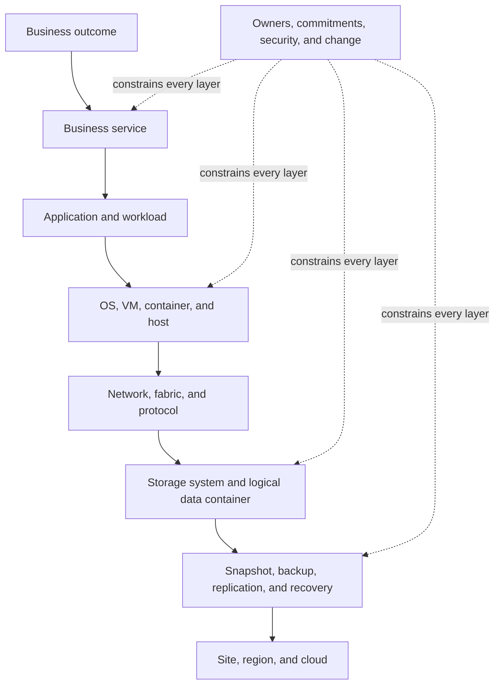

### Forward map: application to data

A forward map asks, "What must work for this user action to succeed?" Use a specific transaction rather than saying, "The application uses storage."

Example: a user uploads a document.

1. The user reaches the business service through a name and network route.
2. The application authenticates the user and accepts the request.
3. Compute executes application logic.
4. The OS and platform issue file, block, or object operations.
5. Network and fabric paths carry protocol messages.
6. The storage service authorizes, processes, and persists the data.
7. Protection policy later creates or updates recovery copies.
8. Monitoring, identity, time, management, and change processes support the complete chain.

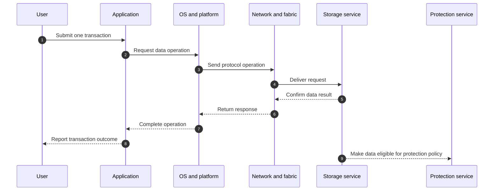

### Reverse map: data to business

A reverse map starts with a storage object or technical component and asks, "Who and what depends on this?" This is essential during incident scope, change planning, risk reviews, lifecycle planning, and install-base reconciliation.

For one volume or LUN, trace:

- Which clients or initiators access it?
- Which hosts, clusters, or container platforms present it upward?
- Which application components use it?
- Which transactions depend on those components?
- Which business service and user population depend on those transactions?
- Which owner, SLA, SLO, RPO, RTO, security rule, and change window govern it?
- Which local and remote protection copies exist, and has recovery been tested?

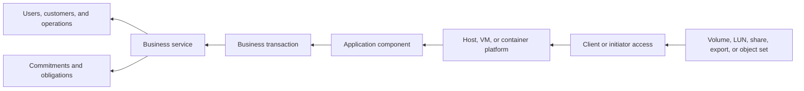

### Why a storage array cannot be analyzed in isolation

A storage system can be healthy while the service is failing. It can also appear to be the visible failure point when an upstream dependency is the cause.

| Observation | Possible non-storage explanations | Possible storage-related questions | What prevents guessing |
|---|---|---|---|
| Application is slow | Compute saturation, application locks, database plan, packet loss, name resolution, authentication delay | Storage latency, queueing, workload contention, path state | End-to-end timestamps and correlated layer evidence |
| File access is denied | Identity, group membership, client credentials, name service, share permission | Export/share policy, file permission, protocol service state | Request identity plus policy-evaluation evidence |
| Host loses a disk | Initiator, driver, multipathing, switch, zoning, route, cabling | Target port, mapping, controller, storage service | Path-by-path topology and events from both endpoints |
| Recovery misses its target | Application restart order, unavailable people, DNS, network, credentials, runbook gaps | Copy freshness, consistency, restore rate, destination readiness | Timed recovery exercise and dependency log |
| Capacity alert appears | Reporting definition, snapshot use, workload growth, retention change, thin allocation | Physical headroom, efficiency, reserves, local-tier and volume use | Metric definitions, trend window, scope, and current configuration |

The storage system is one participant in a service. Customer-specific advice requires the complete path, criticality, constraints, support boundaries, and evidence quality.

---

## 3. JD mapping: why this model matters to the role

| JD responsibility | How environment thinking supports it | Practical output from this Part |
|---|---|---|
| Understand the customer environment | Connects business purpose, workloads, technology, ownership, and constraints | Validated layered map, dependency graph, and unknown register |
| Produce customer-specific recommendations | Prevents generic advice by adding transaction, criticality, change, recovery, and owner context | Evidence-to-impact-to-action statement |
| Improve the support experience | Gives Support a current topology, exact scope, owners, and dependency sequence | Minimum escalation context and support-boundary map |
| Mitigate risk and improve stability | Finds single points of failure, shared dependencies, false redundancy, and untested recovery | Failure-domain map and candidate-risk register |
| Maintain install-base context | Relates each asset to location, service, owner, lifecycle, and dependency | Inventory schema and reconciliation questions |
| Support strategic planning | Connects business growth and commitments to capacity, lifecycle, resilience, and change horizons | Current-state baseline and decision roadmap inputs |
| Work cross-functionally | Makes ownership and handoffs visible across application, platform, network, storage, security, vendors, and Support | Responsibility map and named evidence owners |
| Contribute to service reviews | Converts technical state into impact, decisions, actions, and residual risk | Architecture summary, SLA map, risk narrative, and action register |

> **Experience bridge:** SharePoint and OneDrive escalations already required thinking beyond one product symptom: identity, tenant configuration, endpoint state, network path, client version, service health, sync behavior, user impact, and Product or Engineering ownership. The transfer is the method of mapping dependencies and evidence. The new learning is the infrastructure and storage implementation, not a claim that Microsoft cloud support equals production storage administration.

---

## 4. Five application-to-data patterns

These patterns are orientation maps. They show the questions and ownership boundaries to discover; they do not prescribe a customer design.

### 4.1 Network-attached storage (NAS) path

**Network-attached storage (NAS)** is file access over a network. The application or user works with named files and directories through a file protocol. SMB and NFS were expanded and defined in Section 1.

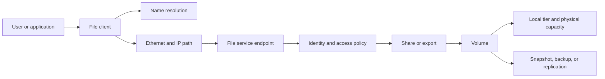

**Forward example:** A finance user opens a spreadsheet from a share. The path needs a reachable name, client protocol support, network reachability, user identity, authorization, file-service availability, volume availability, and responsive storage.

**Reverse example:** A volume is planned for maintenance. Trace its shares or exports, connected clients, application use, user groups, open-file sensitivity, critical periods, protection, owner, and approved outage behavior before recommending a window.

**Discovery questions:**

- Which protocol and version is in use?
- What name do clients use, and which naming service answers it?
- How are users and groups identified?
- Which share or export maps to which volume and business service?
- Are locks, continuously available behavior, or application consistency important?
- What changes are permitted during business peaks?

### 4.2 Storage area network (SAN) path

**Storage area network (SAN)** is a dedicated or logically separated environment that presents block devices from targets to initiators. The host normally owns the file system or database layout on the LUN.

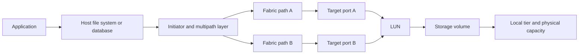

**Forward example:** A database writes a log record. The database asks the OS to write, the host file system and device stack issue block I/O, the multipath layer selects a path, the fabric carries it, and the target serves the mapped LUN.

**Reverse example:** A target port reports a fault. Identify affected paths, initiators, hosts, LUNs, databases, failover state, path policy, business transactions, and whether the remaining paths cross an independent failure domain.

**Important boundary:** A storage view may show a healthy LUN while the host cannot see it because of initiator identity, mapping, fabric, driver, or multipath conditions. Conversely, the host may report a device delay caused by the storage side. Evidence from both ends and the middle is required.

### 4.3 Virtualization path

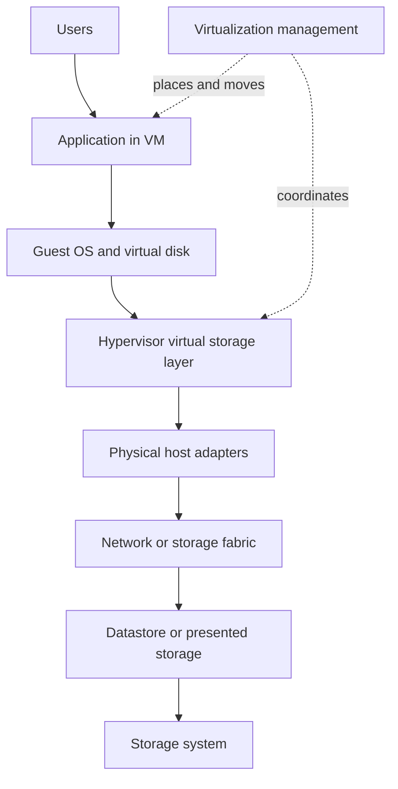

**Forward example:** An application in a VM writes to its virtual disk. The guest OS sees a virtual device; the hypervisor maps that operation to a datastore or block device; physical host paths carry it to storage.

**Reverse example:** A datastore warning can affect many VMs and applications. The blast radius depends on VM placement, alternate hosts, datastore design, management availability, and whether application clustering exists above the VM.

**Management dependency:** Existing VMs may continue running when a management server is unavailable, but placement, migration, restart automation, visibility, or change execution may be limited. The exact effect depends on the platform and design; verify it rather than assuming management is either irrelevant or always in the data path.

### 4.4 Container and Kubernetes path

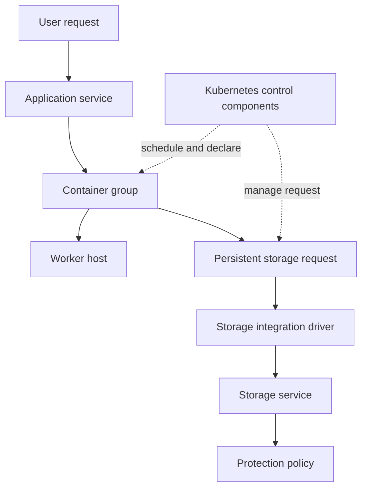

**Forward example:** A containerized application writes durable state. The temporary container uses a persistent storage request; a storage integration layer connects that request to a backend volume or other data service.

**Reverse example:** A backend data service may support several container workloads. Map the storage request, application namespace or ownership grouping, running hosts, control components, protection, access mode, and recovery sequence.

**Key distinction:** Restarting a container can restore a stateless process, but it does not recover missing or inconsistent persistent data. Container orchestration availability and data recoverability are separate questions.

### 4.5 Cloud and hybrid path

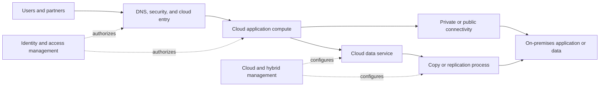

**Forward example:** A cloud-hosted portal retrieves a record held on-premises. The transaction can depend on cloud name resolution, identity, security policy, compute, regional service health, hybrid connectivity, on-premises network, application endpoints, and data service.

**Reverse example:** A connectivity change may affect replication only, live application traffic only, management only, or all three. Label each flow separately before estimating impact.

**Shared-responsibility question:** Which provider, vendor, customer team, or partner configures, monitors, changes, and supports each layer? "It is in the cloud" does not answer ownership.

### Pattern comparison

| Pattern | What the consumer sees | Major middle layers | Frequent hidden dependency | Reverse-map starting point |
|---|---|---|---|---|
| NAS | Named files and directories | File client, name service, identity, network, file service | Identity and name resolution | Share/export or volume |
| SAN | A block device | Host file system, initiator, multipathing, fabric, target | Driver, path policy, or shared fabric | LUN or target path |
| Virtualization | Virtual compute and disks | Guest OS, hypervisor, datastore, host paths | Management and placement control | Datastore, host, or VM |
| Containers | Temporary processes plus requested persistent data | Orchestration, worker host, storage integration | Control components and identity | Persistent request or backend volume |
| Cloud/hybrid | Provider and customer services across locations | Identity, regional service, connectivity, shared responsibility | Management identity or cross-location link | Data service, region, or connection |

---

## 5. Control plane, data plane, and management dependency

The data plane carries customer work. The control plane decides or coordinates how that work is delivered. A management interface is part of the control plane, but the complete control plane can also include discovery, identity, policy, scheduling, cluster membership, route selection, and automation.

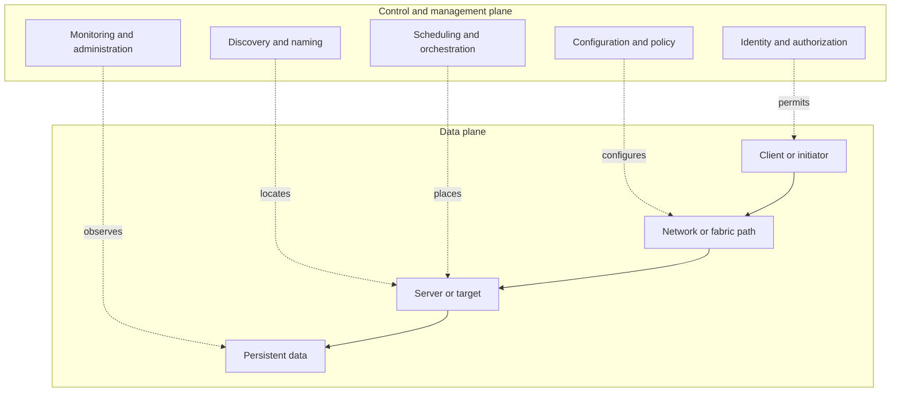

### Failure behavior is a question, not a universal rule

| Control-plane event | Possible data-plane result | Required validation |
|---|---|---|
| Management user interface unavailable | Existing I/O may continue, but visibility and changes may be impaired | Is the interface merely a view, or does it host required control functions? |
| Name service unavailable | Existing sessions may continue while new connections fail | Cache duration, session state, alternate servers, and retry behavior |
| Identity provider unavailable | Existing authorized sessions may continue or expire; new authentication may fail | Token/session lifetime, local fallback, and policy |
| Cluster control communication disrupted | Data service may continue, degrade, stop transitions, or protect itself | Exact architecture, quorum rules, and current product documentation |
| Orchestrator control unavailable | Running processes may continue while scheduling, replacement, or scaling stops | Workload design, local agent behavior, and control recovery |

### Three management-dependency questions

1. Is the management component required continuously for current data movement, only for new setup, or only for observation and change?
2. What happens to existing sessions, new sessions, failover, and recovery when it is unavailable?
3. Can operators safely diagnose and restore the service without it, and is that procedure tested?

Never state "management is not in the data path" as if that makes it unimportant. It may be outside each I/O operation yet essential to discovery, failover, recovery, security, or safe administration.

---

## 6. Customer discovery: from outcomes to verified unknowns

Discovery is a structured process for learning what matters, what exists, how it connects, who owns it, what evidence supports the picture, and what remains unknown. It is not a one-time questionnaire sent without discussion.

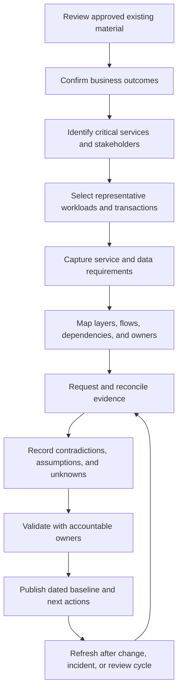

### Discovery domains and questions

| Domain | Beginner-first questions | What the answer changes |
|---|---|---|
| Business outcomes | What must the organization deliver? What would failure prevent? | Priority and impact language |
| Critical services | Which services have the highest consequence or shortest tolerance? Are there peak periods? | Scope and sequencing |
| Personas and stakeholders | Who uses, owns, operates, secures, funds, changes, supports, and accepts risk? | Responsibility and communication plan |
| Workloads and transactions | What are the major read, write, batch, interactive, analytic, or recovery patterns? | Architecture and performance questions |
| Data classification | Is data public, internal, confidential, regulated, personal, clinical, financial, or subject to retention? | Access, encryption, location, retention, and evidence handling |
| Availability | How much interruption is acceptable, for which functions, and at what times? | Redundancy, HA, maintenance, and monitoring |
| Performance | Which response times, throughput, concurrency, or batch deadlines matter to users? | Baselines and bottleneck analysis |
| Capacity | How much is used, allocated, protected, growing, and reserved? Which projects change demand? | Forecast and headroom plan |
| Protection | What RPO and RTO apply? What copies exist? When was restore or failover tested? | Recovery risk and test plan |
| Security | Who may access data and management? Where are trust boundaries? Which controls and audits apply? | Identity, network, encryption, and governance design |
| Topology | What are the physical, logical, service, data, management, and protection paths? | Failure and support analysis |
| Protocols and versions | Which communication rules, OS versions, drivers, firmware, platforms, and features are active? | Compatibility and supportability validation |
| Lifecycle | What is approaching replacement, upgrade, support transition, contract decision, or technical debt threshold? | Strategic roadmap |
| Change calendar | What freezes, releases, maintenance windows, migrations, audits, and business events constrain work? | Feasible dates and collision risk |
| Incidents | Which symptoms, affected services, durations, changes, causes, and repeated handoff issues exist? | Support-experience and prevention plan |
| Support model | Which teams and vendors monitor, diagnose, change, approve, communicate, and escalate? | Boundary and escalation design |
| Vendors and partners | Which products and contracts intersect? What evidence and authorization does each require? | Cross-functional plan |
| Constraints | Which cost, skills, access, policy, location, latency, staffing, contract, or risk constraints are real? | Recommendation options |
| Unknowns | What is missing, disputed, stale, inaccessible, or inferred? Who can resolve it and by when? | Confidence and next discovery action |

### Discovery questionnaire

Use this as a conversation guide. Ask for examples and evidence; do not interrogate every stakeholder with every question.

#### Business and service

1. What are the top five technology-enabled business services?
2. Which user journeys or transactions best represent success for each service?
3. Who is affected by partial failure, slowness, data loss, or complete outage?
4. Which services have contractual, regulatory, patient-safety, financial, or public-reputation consequences?
5. What are the busiest periods, blackout dates, and seasonal events?
6. Who owns each service, and who can accept residual risk?

#### Application and platform

7. Which application components make up each service?
8. Where does each component run: physical host, VM, container platform, cloud service, or managed provider?
9. Which components maintain state, and which can be recreated?
10. Which OS, hypervisor, container platform, database, and integration versions are present?
11. What management services are required for placement, failover, identity, discovery, or recovery?
12. What is the startup and shutdown order?

#### Network, fabric, and protocol

13. Which names, addresses, routes, virtual networks, security controls, and fabrics carry each flow?
14. Which file, block, object, database, or application protocols are used?
15. Where are alternate paths, and which physical devices, power, or locations do they share?
16. Who owns client, initiator, switch, target, firewall, and name-service configuration?
17. What network or fabric evidence is retained, and for how long?

#### Storage and protection

18. Which volumes, LUNs, shares, exports, or object collections support each workload?
19. Which storage system, node, local tier, and location hold them?
20. What are the current capacity, growth, performance, and headroom expectations?
21. Which snapshot, backup, replication, retention, immutability, or archive policies apply?
22. When was a restore or failover last tested end to end, and what did it prove?
23. What RPO and RTO are documented, and can the current design and operating process meet them?

#### Operations, support, and change

24. Which team monitors each layer, and what alerts cause action?
25. How are incidents declared, escalated, handed off, and communicated?
26. Which support contracts, entitlements, vendors, and partners apply?
27. Which source is authoritative for asset identity, version, owner, service mapping, and SLA?
28. What changed recently, and what changes are planned?
29. Which actions or recommendations are aging, blocked, deferred, or accepted as risk?
30. What would make the next service review useful to technical owners and executives?

### Evidence request list

Request only authorized information needed for the stated purpose, using approved handling and transfer methods.

| Evidence category | Examples | Quality checks |
|---|---|---|
| Business and service | Service catalogue, criticality, SLA/SLO, RPO/RTO, business calendar | Owner, approval date, scope, measurable language |
| Architecture | Layered diagram, physical and logical topology, data flows, trust boundaries | Version, date, author, completeness, unknown labels |
| Inventory | Asset export, configuration records, serial/system IDs, sites, owners, lifecycle | Stable identifier, duplicates, retired items, freshness |
| Runtime state | Read-only command output, system status, paths, sessions, events, metrics | Timestamp, timezone, exact system, collection method |
| Application | Component map, dependency list, transaction traces, release calendar | Production versus test, owner validation, representative transaction |
| Network/fabric | Device and link map, routes, name records, zones, path state, events | Both ends, physical diversity, time alignment |
| Storage | Systems, nodes, local tiers, volumes, LUNs, shares/exports, capacity and performance | Logical-to-physical relation, units, sampling window |
| Protection | Policy, schedule, copy status, retention, recovery runbook, test result | Copy independence, application consistency, measured recovery |
| Security | Identity flow, role model, trust zones, firewall policy, audit requirements | Least privilege, data handling, current approval |
| Incidents/support | Case list, timelines, symptoms, root-cause records, handoff feedback | Avoid customer secrets; distinguish cause, correlation, and opinion |
| Change/lifecycle | Change calendar, versions, upgrade plans, maintenance, dependencies | Exact scope, approval gate, rollback limits, current source checks |
| Ownership | Contacts, RACI, escalation routes, vendor boundaries | Named role, authority, backup contact, last validation |

### Discovery output

A good first baseline includes:

- Scope and data cutoff.
- One representative transaction per critical service.
- Layered map and dependency graph.
- Inventory with stable identities and owners.
- Commitments, criticality, RPO, RTO, and change constraints.
- Failure domains, protection relationships, and support boundaries.
- Evidence-source register with freshness and confidence.
- Assumption, unknown, contradiction, risk, and action registers.
- Named owners and dates for missing evidence.

---

## 7. Ways to represent an environment

No single diagram proves everything. Select a representation based on the decision, state its scope and date, and record what it cannot show.

### Representation quick reference

| Representation | What it shows | What it can help prove | What it cannot prove by itself |
|---|---|---|---|
| Layered architecture map | Business, application, platform, connectivity, storage, protection, and governance layers | Expected end-to-end components and relationships | Current runtime health or exact physical diversity |
| Dependency graph | Directed reliance between components or services | Candidate upstream causes and downstream impact | Timing, capacity, or whether a dependency is active now |
| Physical topology | Hardware, ports, cables, devices, racks, rooms, sites, and power paths | Physical connection and shared-location exposure | Logical policy, application purpose, or current traffic |
| Logical topology | Virtual networks, names, interfaces, zones, paths, clusters, and data containers | Configured logical relationships | Physical independence or live flow |
| Service topology | Business services, applications, owners, users, and technical components | Technical-to-business impact path | Exact configuration or physical layout |
| Inventory schema | Identities, attributes, versions, states, sites, owners, and timestamps | Population and data-quality exceptions | Connectivity or runtime behavior |
| Responsibility/RACI map | Who performs, decides, advises, and receives updates | Expected ownership and decision route | Actual skill, availability, or contract interpretation |
| SLA map | Service commitments and the components or teams intended to support them | Alignment gaps between promises and ownership | That the technical design can meet the promise |
| Data-flow diagram | Direction, endpoints, type of data, protocol, and trust crossing | Expected request and information movement | That packets currently take the drawn route |
| Trust-boundary map | Where identity, privilege, network zone, tenant, or organization changes | Security review points and control ownership | Effective security without configuration and runtime evidence |
| Protection map | Primary data, snapshots, backups, replicas, retention, and recovery direction | Intended copy relationships and recovery options | Successful, consistent, timely restoration without tests |
| Failure-domain map | Shared power, node, chassis, switch, room, site, region, control, and people dependencies | Candidate common-cause exposure and blast radius | Exact product failover behavior without current evidence |
| Change map | Planned changes, dates, dependencies, freezes, gates, validation, and rollback | Collision, sequence, and ownership risk | Actual implementation readiness without detailed checks |
| Support-boundary map | Customer, vendor, partner, and internal team ownership | Handoff and escalation route | Entitlement, response, or technical causality by itself |

### Inventory schema

A useful inventory is relational: stable identities connect assets to services, locations, owners, versions, support state, and evidence.

| Field group | Example fields | Data-quality rule |
|---|---|---|
| Identity | Stable asset ID, system ID, serial number, CI ID, cloud resource ID | Do not join only on friendly name |
| Customer context | Account, business unit, environment, service, criticality | One defined classification per scoped record |
| Location | Site, room, cloud, region, availability zone | Use controlled values and distinguish logical from physical |
| Technology | Vendor, platform, model, role, OS/software, firmware | Capture exact version and evidence date |
| Relationships | Cluster, node, host, application, volume, LUN, share/export, protection peer | Validate both ends and relationship direction |
| Ownership | Business owner, technical owner, operations owner, vendor/partner | Named role and current contact route |
| Support/lifecycle | Contract or entitlement reference, support state, lifecycle milestone | Recheck current official source and scope |
| Evidence | Source, collection time, collector, method, confidence | Preserve provenance and timezone |
| State | Active, planned, retired, unknown, exception | Define who authorizes state changes |

### Dependency graph

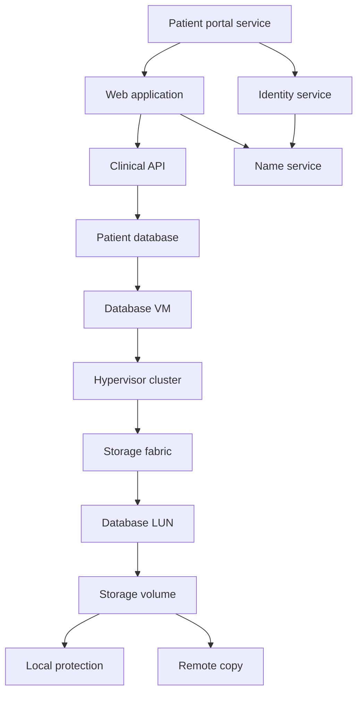

This graph helps generate hypotheses and impact questions. It does not prove that the database LUN caused a portal symptom or that the remote copy is recoverable.

### Support-boundary map

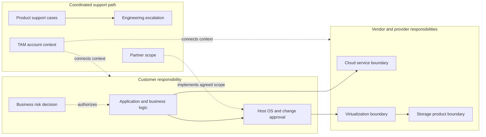

The boxes are educational categories, not contract language. Actual responsibility depends on the customer's contracts, service descriptions, architecture, and authorization.

### A minimal RACI map for environment discovery

| Activity | Business owner | Application owner | Platform owner | Network/fabric owner | Storage owner | Security/risk | TAM Technical Analyst | Support/vendor |
|---|---|---|---|---|---|---|---|---|
| Confirm criticality and impact | A/R | C | I | I | I | C | C | I |
| Validate transaction map | C | A/R | C | C | C | C | R for documentation | C |
| Validate physical/logical paths | I | C | R | R | R | C | R for reconciliation | C |
| Define RPO/RTO | A | R | C | C | C | C | C | I |
| Approve production change | A | R | R | R | R | C | I | C |
| Accept residual business risk | A/R | C | C | C | C | C | I | I |
| Publish dated baseline | C | C | C | C | C | C | A/R for assigned output | C |

Actual assignments must be agreed. A generic RACI cannot override customer authority, contracts, or incident procedures.

---

## 8. Criticality and impact analysis

Criticality is not a label inherited automatically from a server name. It is an evidence-based statement about the consequence, scale, timing, and recoverability of service degradation or loss.

### Impact chain

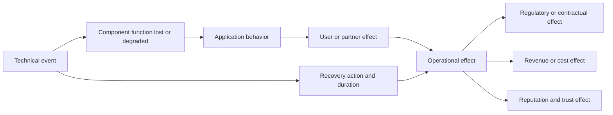

### Translate a component event into business language

| Technical event | Application effect to validate | User effect to validate | Wider effect to validate |
|---|---|---|---|
| One path fails | Application may continue on another path, degrade, or time out | No visible effect, slowness, or interruption | Increased exposure during maintenance or second failure |
| One volume is unavailable | One or several application components may lose data access | Failed login, read-only behavior, transaction failure | Operational backlog, SLA breach, revenue or regulatory effect |
| Replication is delayed | Production may remain available while recovery point worsens | Usually no immediate user symptom | RPO exposure and disaster-recovery risk |
| Management service fails | Existing work may continue while changes, visibility, or failover are impaired | No immediate effect or delayed recovery | Longer incident duration and operational risk |
| Capacity reaches a limit | Writes, snapshots, protection, or provisioning may be affected | Failed transactions or degraded service | Emergency change, data-protection gap, or project delay |

### Illustrative scoring model

This example is not universal and is not a NetApp method. Every organization should define and govern its own model. Scores support discussion; they do not replace judgment.

Use a 1-to-5 scale for five dimensions:

| Dimension | 1 | 3 | 5 |
|---|---|---|---|
| User reach | Few internal users | One department or customer segment | Enterprise-wide or public service |
| Time sensitivity | Can wait several days | Material within one business day | Material within minutes |
| Data consequence | Easily recreated | Limited loss needs reconciliation | Safety, regulated, or irreversible loss |
| Financial/operational effect | Minor inconvenience | Material rework or missed target | Major revenue, care, legal, or operational interruption |
| Recovery difficulty | Simple, tested restart | Multi-team recovery | Complex, untested, or external dependency |

**Worked synthetic example:**

| Dimension | Score | Reason |
|---|---:|---|
| User reach | 4 | Regional patient population and contact-center staff |
| Time sensitivity | 4 | Appointment and result access becomes material within hours |
| Data consequence | 5 | Clinical confidentiality and record integrity matter |
| Financial/operational effect | 4 | Staff fallback and delayed care coordination |
| Recovery difficulty | 3 | Documented recovery exists but the complete service test is old |
| **Illustrative total** | **20 of 25** | High criticality for planning, subject to owner validation |

**Caveats:** A total can hide a single extreme dimension. Likelihood is separate from criticality. The same component can support services of different importance. Regulatory interpretation belongs to qualified customer stakeholders. The score should record owner, date, evidence, rationale, and exception path.

### Impact statement template

> If **[component or dependency]** loses **[specific function]** for **[duration or condition]**, then **[application behavior]** may affect **[users or transactions]**, creating **[operational, financial, regulatory, or reputation consequence]**. Current confidence is **[high/medium/low]** because **[evidence]**; the unresolved questions are **[unknowns]**.

---

## 9. Failure domains, blast radius, and false redundancy

Redundancy must be evaluated against a named failure. Two paths are not meaningfully redundant if both cross the same switch, power source, room, control service, credential, or operator procedure.

### Failure-domain decision flow

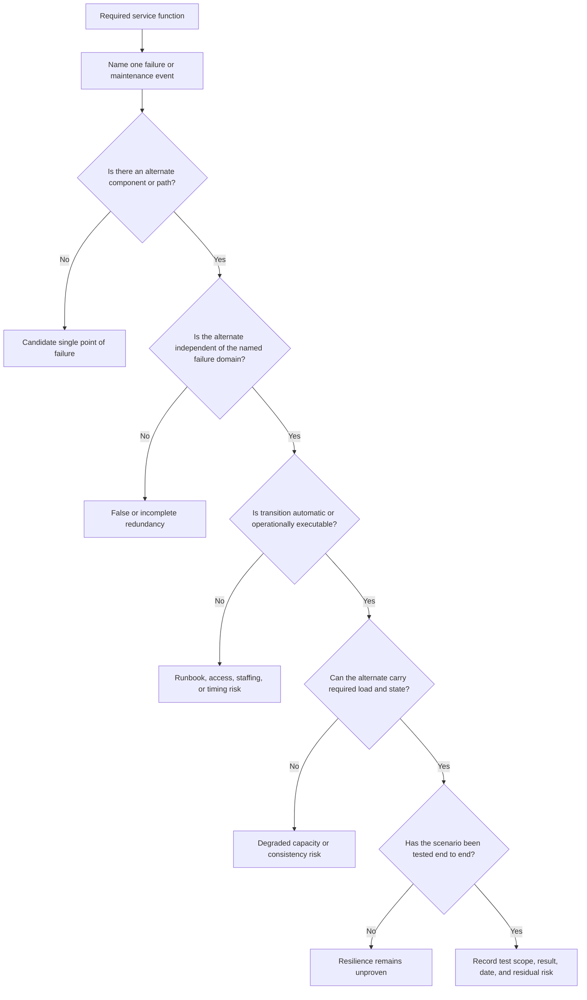

### Active/active and active/passive at conceptual level

| Model | Plain meaning | Strength | Question that prevents overclaiming |
|---|---|---|---|
| Active/active | More than one component actively serves work under normal conditions | Uses multiple resources and may reduce transition time | Are both components active for this exact workload and failure, with enough remaining capacity? |
| Active/passive | One component serves normally while another is prepared to take over | Clear standby role and potentially simpler state model | How is failure detected, state transferred, and takeover tested? |
| Load-balanced pool | Requests are distributed across several service instances | Can isolate instance failure | Do all instances share one database, identity service, region, or network entry point? |
| Multipath access | More than one route connects an initiator and target | Can survive a path failure | Are paths physically diverse and correctly configured at every layer? |

Exact implementation differs by product and version. These labels do not prove zero interruption, independent capacity, application consistency, or site resilience.

### Local HA versus site disaster recovery

| Capability | Local HA | Site disaster recovery (DR) |
|---|---|---|
| Primary purpose | Continue or restore service through selected local component failures | Restore service after loss or unavailability of a site or broad location boundary |
| Typical scope | Node, controller, host, link, or local component group | Facility, campus, region, or major shared service |
| Data requirement | Shared or synchronized state appropriate to local transition | Recoverable copy at another failure domain, with acceptable RPO |
| Operational requirement | Detection, transition, alternate capacity | Declaration, recovery order, identity/network change, application start, validation, communications |
| Key warning | Local redundancy can share site power, cooling, network, or control | A remote copy without tested application recovery is not a complete DR capability |

### False redundancy examples

1. Two cables terminate on the same switch.
2. Two switches share one power distribution unit.
3. Two controllers are in one room when the threat is room loss.
4. Two application instances use one database.
5. Two DNS servers run on the same hypervisor host.
6. Primary and backup credentials depend on one identity provider.
7. A replicated copy is reachable only through the failed site's network.
8. An active/passive pair has no tested operator access to initiate recovery.
9. A cloud deployment spans logical zones but relies on one regional control dependency for the required transaction.
10. A backup exists, but the encryption key or catalogue needed for restore shares the failed boundary.

### Blast-radius worksheet

For each candidate failure, record:

| Field | Question |
|---|---|
| Failure | What exactly stops, degrades, becomes unsafe, or is changed incorrectly? |
| Domain | Which components can fail together from this cause? |
| Direct effect | Which technical functions are immediately lost? |
| Downstream scope | Which applications, transactions, users, locations, and obligations depend on them? |
| Alternate | What path, component, process, or copy remains? |
| Common dependency | What does the alternate still share? |
| Transition | Who or what detects and moves service? |
| Capacity/state | Can the alternate handle demand with correct data? |
| Evidence | Which test or observation supports the conclusion? |
| Residual risk | What remains after the designed response? |

---

## 10. Evidence quality, contradiction, and uncertainty

A diagram can be beautifully wrong. Environment analysis must show how each claim is known, how current it is, whether it represents configuration or behavior, and what remains uncertain.

### Evidence dimensions

| Dimension | Stronger evidence | Weaker or differently scoped evidence | Key question |
|---|---|---|---|
| Current versus stale | Collected near the decision after relevant changes | Old but potentially useful historical record | Was it fresh enough when the conclusion was made? |
| Observed versus reported | Direct output, trace, event, metric, or witnessed test | Interview statement or second-hand report | Is this observation, testimony, or interpretation? |
| Complete versus sampled | Defined population and full time window | Limited hosts, paths, records, or intervals | What was excluded, and can the sample represent the whole? |
| Configuration versus runtime | Runtime session, path, packet, event, or behavior | Intended or saved configuration | Is the configured state active and effective now? |
| Correlation versus causation | Controlled test, mechanism, timeline, and competing causes addressed | Two events occur together | What evidence shows one event produced the other? |
| Authoritative versus convenient | Governed source for the exact field | Easy export or familiar spreadsheet | Who designated the source, and for which attribute? |

### Confidence flow

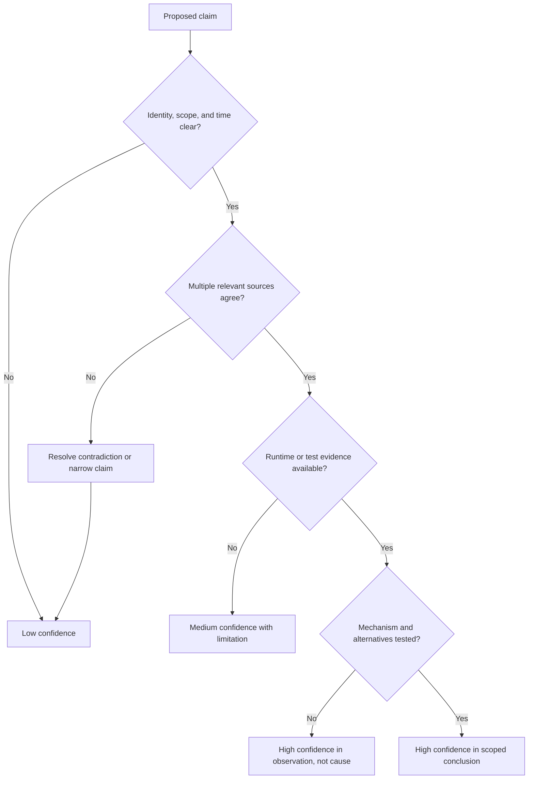

### Practical confidence labels

| Label | Suggested use | Example wording |
|---|---|---|
| High | Current, well-scoped, consistent evidence directly supports the claim | "High confidence that both documented paths were active during the test; current outputs from host, fabric, and target agree." |
| Medium | Evidence supports the direction, but one material limit remains | "Medium confidence that this dependency is current; the application owner validated it, but runtime flow has not been captured." |
| Low | Evidence is stale, incomplete, contradictory, indirect, or heavily assumed | "Low confidence in physical diversity; the diagram is old and switch-power mapping is unknown." |
| Unknown | No defensible conclusion yet | "Whether the remote copy meets application RPO is unknown until timestamps and consistency are validated." |

Confidence applies to a specific claim, not to a person or entire document. Avoid converting labels into unsupported numerical probabilities.

### Assumption and unknown registers

| ID | Type | Statement | Why needed | Risk if wrong | Owner | Validation evidence | Due date | Status |
|---|---|---|---|---|---|---|---|---|
| A-01 | Assumption | Example: both SAN paths cross different switches | Needed for maintenance planning | Host may lose all LUN access | Fabric owner | Port and physical path evidence | 2026-09-02 | Open |
| U-01 | Unknown | Example: last complete portal recovery-test duration | Needed to assess RTO confidence | Recovery may exceed target | DR owner | Timestamped test report | 2026-09-05 | Open |

An assumption is an explicit temporary proposition. An unknown is a missing fact. Do not write an assumption as though it were observed configuration.

### Contradiction-resolution method

1. State the conflict without choosing a favorite source: "Inventory A says active; owner register B says retired."
2. Confirm identity, field definition, scope, timezone, and collection date.
3. Ask whether the sources describe intended state, runtime state, historical state, or different objects.
4. Identify the governed source of truth for that exact field.
5. Seek a current independent observation when safe and authorized.
6. Record the resolution, resolver, date, evidence, and correction owner.
7. If unresolved, narrow the conclusion and keep the contradiction visible.

### Correlation versus causation worked example

**Observation:** Application latency and storage latency both rose at 10:05.

**Unsafe conclusion:** "Storage caused the application slowdown."

**Better analysis:**

- Confirm clocks and sampling windows.
- Determine which application transactions and storage workload objects align.
- Check compute, network, database, queue, and workload changes.
- Ask whether application demand increased first, causing both metrics to rise.
- Identify a mechanism and a discriminating test.
- Report the strongest scoped conclusion: perhaps "correlated latency requiring further isolation," not root cause.

---

## 11. Complete synthetic case: Northstar Health patient portal

> **Synthetic evidence boundary:** Northstar Health, all people, systems, addresses, dates, scores, incidents, architecture, service levels, risks, and decisions below are fictional. The case is a paper exercise. It does not describe a real customer, NetApp internal process, or your production storage experience. Product-specific behavior is intentionally generalized and would require authorized evidence and current official validation in a real environment.

### 11.1 Business context

Northstar Health operates a fictional patient portal used to view test results, schedule appointments, and exchange messages with care teams.

| Item | Synthetic definition |
|---|---|
| Business service | Digital Patient Access |
| Representative transaction | Authenticated patient opens a newly published test result |
| Business owner | Director of Digital Care |
| Application owner | Patient Platform Manager |
| Primary users | Patients, contact-center staff, and selected clinical staff |
| Formal service commitment | 99.9 percent monthly portal availability, excluding defined maintenance, for this exercise only |
| Internal response objective | 95th-percentile result-page response below 2.5 seconds during defined normal load, fictional |
| RPO | 15 minutes for portal state and published-result metadata, fictional |
| RTO | 2 hours for minimum viable portal service after a declared site disaster, fictional |
| Data classification | Synthetic health-related personal data classified as restricted by the fictional customer |
| Change constraint | No planned production change during weekday 07:00-11:00 local clinic peak |

The SLA and SLO above are exercise inputs, not claims about healthcare regulation or a recommended universal target.

### 11.2 Layered architecture and owners

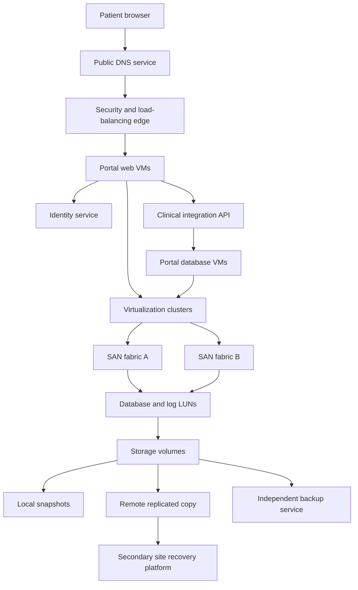

| Layer | Synthetic component | Primary owner | Consulted party | Support boundary |
|---|---|---|---|---|
| Business | Digital Patient Access | Director of Digital Care | Risk and compliance | Customer owns impact and risk decisions |
| Client/entry | Browser, DNS, edge security, load balancer | Digital network team | Security provider | Provider and customer scopes meet at configured service boundary |
| Application | Portal web and clinical API | Patient Platform team | Clinical integration team | Customer application code; software vendor consulted if needed |
| Identity | Patient identity service | Identity team | Security | Separate service with its own support route |
| Compute | Web and database VMs | Virtualization team | Application owners | Customer manages guest/platform under fictional model |
| Network/fabric | Ethernet and two SAN fabrics | Network and Fabric team | Virtualization and storage | Switch vendor supports product; customer owns design/change |
| Storage | Controllers, local tiers, volumes, LUNs | Storage team | NetApp Support and TAM roles | Customer owns environment/change; product Support owns qualifying cases |
| Protection | Snapshots, replication, backup, recovery runbook | Data Protection team | Application, storage, DR teams | Several tools and teams; no one product proves recovery |
| Site DR | Secondary site platform and dependencies | DR Program Manager | All technical owners | Customer declares disaster and owns recovery coordination |

### 11.3 One request from patient to data and back

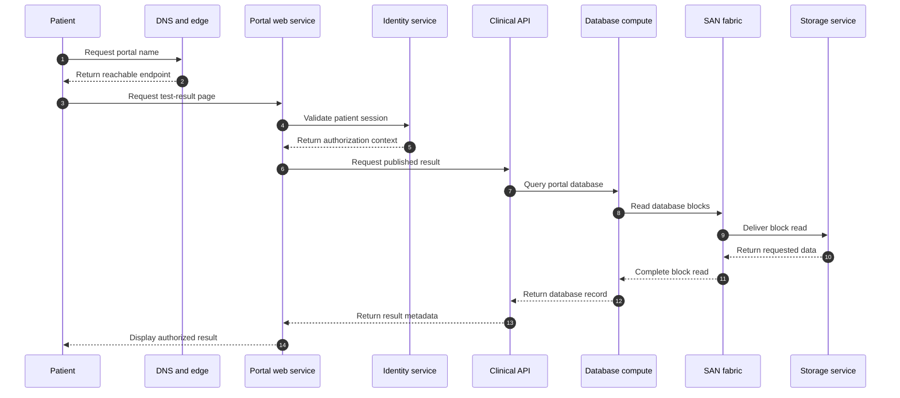

This sequence identifies evidence points. It does not prove every implementation detail or that storage is involved in every page asset.

### 11.4 Reverse data-to-business map

Start with the fictional database log LUN:

1. It belongs to a volume on the primary storage service.
2. It is presented through two target-side paths across two fabrics.
3. Database VM initiators access it through a multipath layer.
4. The database uses it to preserve transaction log records.
5. The clinical API depends on committed database transactions.
6. The portal web service depends on the API.
7. Patients and care operations depend on portal transactions.
8. The business owner cares about availability, data integrity, response time, privacy, and recovery.

If the log LUN is unavailable, the effect depends on database behavior, alternate paths, clustering, current workload, and recovery design. The map identifies questions; it does not justify predicting behavior without platform evidence.

### 11.5 Protection, locations, and failure domains

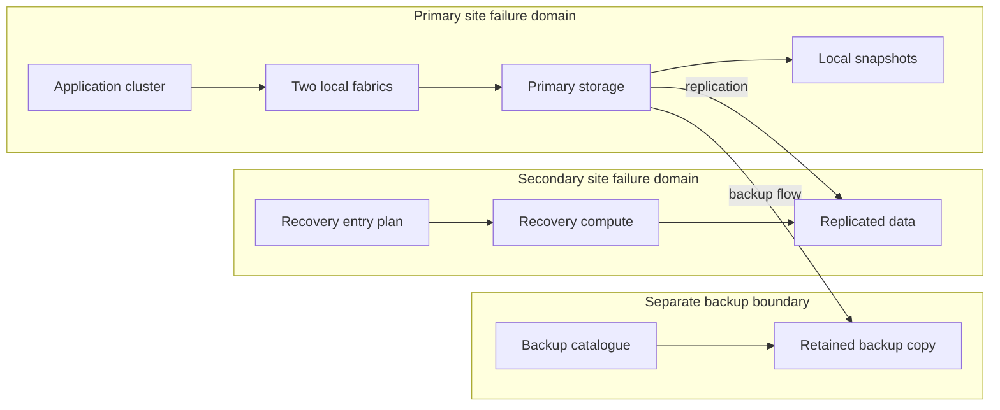

| Failure domain | Intended response | Evidence available in exercise | Unknown or limitation |
|---|---|---|---|
| One SAN link | Multipath uses remaining link | Synthetic path-test record from six months ago | Current path independence and load capacity need validation |
| One fabric switch | Work continues through other fabric | Logical diagram and old port list | Power diversity is unconfirmed |
| One storage node | Local HA response under platform design | Generic architecture note only | Exact platform health, transition behavior, and workload impact require current product evidence |
| Primary site | Recover minimum portal at secondary site | Runbook and replicated-copy status | Last full transaction test is 14 months old; RTO confidence is low |
| Identity service | Existing sessions may differ from new logins | No recent failure test | Session behavior and recovery dependency are unknown |
| Backup catalogue | Restore coordination may fail | Catalogue is protected in exercise design | Independence of credentials and key management needs validation |

### 11.6 SLA, RPO, RTO, and recovery chain

| Commitment or objective | Technical contributors | Operational contributors | Current synthetic confidence |
|---|---|---|---|
| 99.9 percent monthly availability | Edge, app, identity, compute, network, fabric, storage, database | Monitoring, incident response, change quality, vendor handoff | Medium; component availability is mapped but end-to-end measurement definition needs review |
| 2.5-second page-response SLO | Application code, database, compute, network, storage | Baseline, capacity, release validation, workload monitoring | Medium; percentile metric exists but layer correlation is incomplete |
| 15-minute RPO | Application consistency, replication/copy schedule, monitoring | Incident declaration, copy selection, validation | Medium-low; copy timestamps exist but application consistency test is old |
| 2-hour RTO | Recovery data, compute, network, identity, DNS, application order | Trained staff, declaration, access, runbook, communication, testing | Low; last complete exercise exceeded target and is stale |

### 11.7 Candidate risks and recommendations

All findings are synthetic.

| ID | Evidence and context | Candidate risk | Recommendation | Owner and validation | Residual risk |
|---|---|---|---|---|---|
| N-01 | Two logical fabric paths are drawn, but physical power mapping is missing | A shared power dependency could make redundant paths fail together | Fabric owner should validate cable, switch, power, and site diversity and update the dated topology | Fabric owner; approved physical map and controlled path test | Unmodeled shared dependencies or later cabling changes |
| N-02 | Last full portal DR exercise was 14 months ago and exceeded the fictional 2-hour RTO | Recovery sequence, access, or application dependencies may not meet current target | DR manager should run a scoped rehearsal, remediate blockers, then schedule an authorized end-to-end exercise | DR manager; timed transaction success and decision record | A test covers named scenarios, not every disaster |
| N-03 | Storage inventory has asset IDs and versions but no business-service mapping for two volumes | Support and change teams may misjudge blast radius | Storage and application owners should reconcile volume-to-service relationships | Storage owner; owner-approved inventory fields | Mapping begins aging after change |
| N-04 | Identity service is required for login but absent from the storage-focused recovery checklist | Data may be recoverable while users still cannot access the portal | Add identity, DNS, edge, and credential dependencies to the recovery plan | Identity and DR owners; paper walk-through plus test evidence | External provider or certificate conditions can still interfere |
| N-05 | Page and storage latency rose together during one synthetic event | Premature root-cause assignment could delay correct diagnosis | Build a common timeline, correlate transaction, compute, network, database, and storage evidence, then test competing hypotheses | Incident problem owner; reviewed timeline and scoped conclusion | Historical data may be insufficient for definitive cause |
| N-06 | Replication status is monitored, but application-consistency validation is old | A recent copy may not provide the intended transaction recovery point | Application, database, protection, and storage owners should define and test consistency evidence | Data Protection owner; recovery-point test with timestamps | New releases or workload changes can invalidate assumptions |

### 11.8 Service-review narrative

**Technical summary:** The fictional portal depends on DNS, edge security, identity, web/API compute, database VMs, two SAN fabrics, block storage, local and remote protection, and a multi-team recovery process. Storage health alone cannot establish portal availability or recoverability.

**Customer-specific priorities:**

1. Validate physical independence of the two SAN paths before planned switch maintenance.
2. Refresh the full recovery exercise because current RTO confidence is low.
3. Complete volume-to-business-service mapping in the install base.
4. Add identity and entry-path dependencies to the DR runbook.
5. Treat the latency event as correlated evidence, not proven storage causation.

**Decision asks:** Confirm owners and dates, approve the recovery-test scope, and agree which inventory source is authoritative for service mapping.

**Support-experience benefit:** A current topology and owner map lets an incident team state scope, request the right evidence from each layer, engage the correct vendor, and avoid restarting discovery at every handoff.

**Strategic-planning benefit:** The same map supports lifecycle sequencing, budget timing, DR investment, capacity planning, and maintenance-window decisions.

---

## 12. Your cloud-service transfer bridge

Your strength is not claimed production ownership of SAN, NAS, ONTAP, or data-center storage. It is proven practice in enterprise cloud support where a user-visible issue can cross clients, synchronization logic, identity, tenant configuration, network conditions, service components, permissions, and Product or Engineering boundaries.

### Transfer map

| Familiar enterprise support reasoning | Infrastructure-mapping transfer | New knowledge that must be earned |
|---|---|---|
| Start with user impact and exact sync symptom | Start with business transaction and exact failed function | Storage workload and protocol behavior |
| Separate OneDrive client, SharePoint service, identity, permissions, and network | Separate application, OS, hypervisor, network/fabric, protocol, and storage | Physical/logical data paths and failure domains |
| Check affected scope, time, version, tenant, change, and reproducibility | Check affected services, sites, hosts, paths, versions, changes, and repeatability | Host, fabric, target, volume, LUN, share/export evidence |
| Use logs and traces from several components | Correlate application, host, network, fabric, and storage evidence | Platform-specific counters, events, and commands |
| Escalate with business impact, timeline, evidence, and exact ask | Build a cross-vendor escalation package with current topology | NetApp support processes and authorized tools when available |
| Avoid treating service health as proof of one user's root cause | Avoid treating array health as proof of end-to-end service health | Storage supportability and lifecycle validation |
| Translate technical status for customers and leadership | Present service review impact, risk, decision, action, and residual risk | Storage-specific recommendations under lead-TAM/SME review |

### Transfer exercise: M365 dependency reasoning to infrastructure mapping

Use a real but sanitized SharePoint or OneDrive synchronization case that you are authorized to discuss. Do not include customer identity or confidential data.

1. Write the user transaction in one sentence, such as "an authorized user edits a document and expects the change to synchronize."
2. Draw the known layers: user, endpoint, client, OS, identity, network, Microsoft service, content, permission, and sync state.
3. Mark observed evidence, reported statements, assumptions, and unknowns.
4. Identify upstream and downstream dependencies for the failing step.
5. State the support boundaries and Product/Engineering escalation route used.
6. Translate the shape into a fictional infrastructure case: replace endpoint/client/service/content with application/host/protocol/storage container while preserving the evidence method.
7. List which translated questions you can answer now and which require storage learning or an SME.

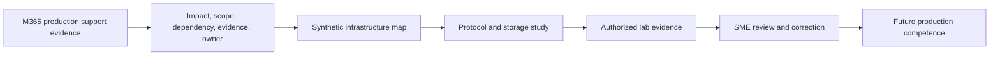

### Honesty note

Safe interview language:

> "In SharePoint and OneDrive support, I learned not to isolate the visible service from identity, client state, permissions, network conditions, tenant configuration, and engineering dependencies. I transfer that systems-thinking method to application-to-data mapping. I have not administered a production NetApp storage estate, so I would not claim the storage implementation details from analogy. I am building those through official study, synthetic mapping, authorized labs, and review. My proven strength is disciplined discovery, evidence correlation, escalation, and customer communication; my deliberate ramp area is storage architecture and tooling."

An analogy transfers reasoning, not credentials.

---

## 13. Common mistakes and better diagnostic questions

### Common mistakes

| Mistake | Why it fails | Better behavior |
|---|---|---|
| Starting with the storage model and capacity | Misses the business service, transaction, and impact | Start with one critical user journey and trace downward |
| Drawing only a product diagram | Hides application, network, management, protection, owner, and support dependencies | Use several scoped representations |
| Treating two paths as redundant | Shared switch, power, site, control, or credentials may defeat both | Name the failure domain and prove independence |
| Calling a snapshot a backup | A local point-in-time view may share system and administrative failure exposure | Map independent copies, retention, access, and restore tests |
| Confusing replication with recoverability | A second copy may be inconsistent, inaccessible, or copy unwanted changes | Test application recovery to RPO and RTO |
| Assuming configured equals active | Saved policy may not reflect current sessions or runtime state | Collect current runtime evidence |
| Using one source as truth for every field | Asset, owner, version, service, and contract facts may have different authorities | Define source of truth by field |
| Hiding stale evidence | Readers may treat old state as current | Show collection time and freshness limitation |
| Claiming cause from synchronized charts | Shared demand or a third cause may move both metrics | Test mechanism and competing hypotheses |
| Mapping technical components without owners | Findings cannot become decisions or actions | Name decision, operations, change, and evidence owners |
| Mapping owners without authority | A contact may not be allowed to approve change or risk | Record decision rights and backup route |
| Assuming HA equals DR | Local component resilience does not cover site loss | Map local and remote failure domains separately |
| Treating SLA as architecture proof | A contract does not demonstrate technical or operational capability | Test the service chain against the target |
| Ignoring the control plane | Data may move now but fail to recover, scale, authenticate, or change | Map existing-session, new-session, failover, and recovery dependencies |
| Giving a generic "upgrade" recommendation | It lacks exact environment, supportability, timing, owner, and validation | Connect current evidence to customer-specific risk and decision gates |

### Diagnostic questions by symptom

#### "The application is slow"

- Which transaction, users, locations, and time window are affected?
- Is the symptom latency, throughput, timeout, queueing, or perceived delay?
- What changed in workload, code, compute, network, protocol, storage, protection, or security?
- Which layer timestamps can be aligned?
- Is the storage workload object actually used by the affected transaction?
- Did demand increase first, or did service time increase at one layer?
- What test would distinguish application, compute, network, database, and storage hypotheses?

#### "Storage is down"

- What exact function is unavailable: one path, endpoint, LUN, share, volume, node, management interface, or whole service?
- From which client or initiator and location was it observed?
- Are existing sessions and new sessions affected equally?
- What do alternate paths show?
- Which upstream name, identity, route, switch, or host dependency is required?
- Which downstream applications and transactions use this object?
- What changed immediately before the event?

#### "We are protected"

- Protected against which failure and threat?
- Which data, application state, and dependencies are included?
- Where is each copy, under whose identity and administrative boundary?
- What are copy age, retention, consistency, and monitoring status?
- When was restore or failover tested to a usable transaction?
- What RPO and RTO did the test demonstrate?
- Which shared dependencies could block recovery?

#### "The environment is redundant"

- Which component or service function has an alternate?
- Which failure domain is the design intended to survive?
- What physical, logical, control, power, site, identity, and people dependencies are shared?
- Can the remaining component carry peak load?
- How is state made correct and transition initiated?
- What was the last test, and what scenario did it not cover?

---

## 14. Whiteboard drills and paper lab

These exercises require no production access. Label every invented fact as synthetic and every missing fact as unknown.

### Whiteboard drill 1: one transaction in five minutes

Draw one user request from business outcome to data and back. Include:

- User and business service.
- Application component.
- Host, VM, or container layer.
- Network or fabric.
- Protocol and endpoint roles.
- Storage container.
- Protection path.
- Management dependency.
- Owners and one SLA/SLO or RPO/RTO.

**Pass condition:** Every arrow has a reason, and every unlabeled dependency becomes a question.

### Whiteboard drill 2: reverse impact in three minutes

Start with one volume, LUN, or share/export. Trace upward to the business service. State:

- Direct consumers.
- Downstream applications.
- Affected transaction.
- User and operational impact.
- Decision owner.
- Confidence and unknowns.

### Whiteboard drill 3: prove two paths

Draw two paths from initiator to target. Add host adapter, cable, switch, power, target port, controller/node, and site. Circle every shared dependency.

**Pass condition:** You can name the failure each design survives and at least one it does not.

### Whiteboard drill 4: control plane removed

Cross out one management, identity, discovery, or orchestration component. Explain separately what happens to:

- Existing sessions.
- New sessions.
- Monitoring.
- Failover.
- Recovery.
- Authorized changes.

Use "unknown until verified" where behavior is platform-specific.

### Paper lab: build an environment evidence pack

#### Scenario

A fictional manufacturer runs an order service in four VMs. The database uses two block paths to a storage system. File attachments use a NAS share. A remote site receives replication. Management and identity services run as VMs on the same virtualization cluster. The customer claims the environment has no single point of failure.

#### Step 1 - Build the layered map

Include order entry, database transaction, attachment upload, compute, hypervisor, OS, network, fabric, block and file protocols, LUN, share, volumes, protection, sites, control components, and owners.

#### Step 2 - Build three topologies

1. Physical: hosts, adapters, switches, storage nodes, power, and sites.
2. Logical: VMs, networks, names, paths, LUNs, shares, volumes, and replication.
3. Service: order transaction, applications, users, owners, SLA, RPO, and RTO.

#### Step 3 - Create an inventory table

Use at least 20 synthetic CIs and include stable ID, role, version, site, owner, service, evidence source, timestamp, and status. Introduce:

- One duplicate friendly name.
- One stale version.
- One missing owner.
- One retired system still marked active.
- One relationship that differs between diagram and runtime sample.

#### Step 4 - Test the redundancy claim on paper

Evaluate loss of:

- One path.
- One switch.
- One power source.
- One hypervisor host.
- Identity service.
- Management service.
- Primary storage service.
- Primary site.
- Backup catalogue credentials.

#### Step 5 - Produce registers

Create:

- Evidence-source and freshness register.
- Assumption and unknown register.
- Contradiction register.
- Failure-domain and blast-radius worksheet.
- Candidate-risk and recommendation register.
- RACI and support-boundary map.

#### Step 6 - Write one customer-specific recommendation

Use this structure:

> **Evidence:** [dated, scoped evidence]. **Context:** [business transaction and constraint]. **Risk:** [condition and consequence]. **Recommendation:** [specific action and prerequisites]. **Owner/date:** [named role and target]. **Validation:** [proof]. **Residual risk:** [what remains].

#### Step 7 - Present a five-minute service-review segment

Use one architecture slide, one risk, one decision ask, one action owner, and one evidence limitation. Do not call an untested design highly available or disaster-ready.

### Lab scoring rubric

| Area | 0 | 1 | 2 |
|---|---|---|---|
| Business mapping | Components only | Service named | Transaction, impact, owner, and commitment connected |
| Technical path | Major layers missing | Expected layers shown | Data and control paths with protocols and direction |
| Evidence quality | No sources/dates | Some provenance | Scope, source, freshness, confidence, contradiction handled |
| Failure reasoning | Counts duplicate items | Names alternate paths | Tests independence, capacity, transition, and proof |
| Ownership | Generic teams | Named roles | Decision rights, support boundaries, and handoffs clear |
| Recommendation | Generic advice | Action present | Evidence, context, risk, owner, validation, residual risk |
| Honesty | Synthetic claims look real | Scenario labeled once | Every evidence boundary and unknown stays explicit |

**Interpretation:** 12-14 indicates a strong paper exercise, 8-11 indicates useful structure with gaps, and below 8 means rebuild the weakest maps. This rubric is educational, not a hiring or NetApp standard.

---

## 15. Self-test

Answer without notes, then check the chapter.

1. Define business service, application, workload, and transaction, and give one connected example.
2. Explain data plane and control plane without saying that one is always more important.
3. Draw a NAS path and identify three non-storage causes of failed file access.
4. Draw a SAN path and explain why a healthy LUN does not prove host access.
5. Explain the extra layers introduced by virtualization and containers.
6. Trace a cloud-to-on-premises transaction and name shared-responsibility questions.
7. Explain why a storage system cannot be evaluated in isolation.
8. Give the forward and reverse uses of an application-to-data map.
9. Name all discovery domains and five evidence-quality checks.
10. Explain what a physical topology proves that a logical topology does not, and vice versa.
11. Distinguish inventory from topology and a generic asset from a managed CI.
12. Translate one path failure into application, user, operational, and business effects.
13. Explain why criticality and likelihood are different.
14. Name five false-redundancy examples.
15. Distinguish local HA from site DR.
16. Explain why replication, snapshot, and backup are not interchangeable.
17. Resolve a conflict between a stale diagram and current runtime output.
18. State the difference between observed and reported, configuration and runtime, and correlation and causation.
19. Give a high-, medium-, low-, and unknown-confidence statement.
20. Explain Northstar's portal path, support boundaries, top risks, and evidence limitations.
21. Translate a factual SharePoint/OneDrive escalation method into infrastructure questions without claiming storage production work.
22. Deliver one customer-specific recommendation with evidence, owner, validation, and residual risk.

---

## 16. Official Source Anchors

**Date checked: 2026-08-24.** Only official public NetApp documentation is used below, and only to anchor broad architecture terminology. Exact behavior can vary by product family, ONTAP release, hardware platform, protocol version, configuration, entitlement, and surrounding ecosystem. Recheck the exact current documentation and authorized customer evidence before making a version-sensitive claim or recommendation. This chapter does not claim access to customer systems, gated tools, or internal NetApp processes.

| Broad topic | Official public NetApp source | Use and limitation in this chapter |
|---|---|---|
| ONTAP documentation entry point | [NetApp ONTAP documentation](https://docs.netapp.com/us-en/ontap/) | Broad product documentation navigation. Select the exact release and topic for real work. |
| Platform and hardware orientation | [NetApp ONTAP hardware systems documentation](https://docs.netapp.com/us-en/ontap-systems/) | Anchors the existence of system, controller, platform, and hardware documentation. Exact component and HA behavior is deferred. |
| Local tiers and physical capacity | [NetApp disks and local tiers documentation](https://docs.netapp.com/us-en/ontap/disks-aggregates/) | Anchors current local-tier documentation and aggregate terminology context. Layout, RAID, ownership, limits, and operations are deferred to Parts 20, 21, and 23. |
| Logical storage management | [NetApp volume administration documentation](https://docs.netapp.com/us-en/ontap/volumes/) | Anchors volumes as a managed ONTAP topic. Exact volume types, capacity behavior, and policy are release-sensitive and deferred. |
| NAS management | [NetApp NAS management documentation](https://docs.netapp.com/us-en/ontap/nas-management/) | Anchors broad file-service and NAS terminology. NFS, SMB, identity, namespace, and policy behavior are deferred to protocol and ONTAP Parts. |
| SAN management | [NetApp SAN management documentation](https://docs.netapp.com/us-en/ontap/san-management/) | Anchors broad initiator, target, LUN, and SAN management context. Exact mapping, multipathing, host support, and protocol behavior require current validation. |
| Data protection | [NetApp data protection and disaster recovery documentation](https://docs.netapp.com/us-en/ontap/data-protection-disaster-recovery/) | Anchors broad snapshot, copy, replication, and recovery documentation areas. Exact consistency, retention, recovery, and release behavior are deferred to Parts 35-39. |
| High availability | [NetApp high-availability pair management documentation](https://docs.netapp.com/us-en/ontap/high-availability/) | Anchors HA as a documented architecture and operations area. Never infer exact takeover, interruption, or failure behavior from this orientation chapter. |

### Source-use discipline

- Record exact product, release, platform, feature, configuration, page, and date checked.
- Distinguish documentation of intended behavior from observed customer runtime state.
- Validate the complete host, network/fabric, protocol, storage, and application context.
- Treat supportability, reliability, HA, and recoverability as different claims.
- Use authorized evidence and current official sources; state access limits instead of inventing results.

---

## Likely Interview Questions

### Q1. How do you learn a customer's environment before making a recommendation?

> **Model answer:** "I start with business services, representative user transactions, criticality, owners, and service or recovery objectives. I then trace each important transaction through application, compute, virtualization or containers, network or fabric, protocol, storage, protection, and location. I reconcile diagrams, inventory, runtime evidence, incidents, changes, support boundaries, and lifecycle context. I label stale evidence, assumptions, contradictions, unknowns, and confidence. Only then do I connect a verified condition to customer impact, an action, an owner, validation, and residual risk."

**Follow-up depth:** Be ready to name the discovery questionnaire domains, evidence request list, and why physical, logical, service, protection, and failure-domain maps answer different questions.

### Q2. Why can you not analyze a storage array in isolation?

> **Model answer:** "A business transaction crosses applications, operating systems, hosts, hypervisors or containers, networks or fabrics, protocols, storage, identity, management, and protection processes. A healthy array does not prove that the client can resolve a name, authenticate, reach a path, discover a target, use multipathing, or recover the application. Likewise, an array symptom may be driven by upstream demand or another dependency. I need end-to-end scope and correlated evidence before assigning cause or making customer-specific advice."

**Follow-up depth:** Draw either a NAS or SAN path and give at least three plausible causes outside storage plus the evidence that would discriminate them.

### Q3. What is the difference between the control plane and the data plane?

> **Model answer:** "The data plane carries normal application or user data. The control plane defines, discovers, authorizes, schedules, coordinates, monitors, or changes how that data plane operates. A management interface may be outside each active I/O but still be essential for new sessions, failover, visibility, security, or recovery. I would verify existing-session, new-session, failover, and recovery behavior for the exact platform rather than assume control-plane loss either stops everything or has no impact."

**Follow-up depth:** Explain examples involving DNS, identity, virtualization management, Kubernetes control components, and storage management, while keeping product-specific behavior explicitly version-sensitive.

### Q4. How do you assess criticality and blast radius?

> **Model answer:** "I begin with the service and transaction, not a server label. I identify the exact technical function that could fail, then trace downstream application, user, operational, financial, regulatory, and reputation effects. I include duration, affected population, peak periods, data consequence, recovery difficulty, and the customer's approved commitments. For blast radius, I map shared failure domains and usable alternatives. A score can structure discussion, but the rationale, owner, evidence, and exceptional dimensions matter more than the total."

**Follow-up depth:** Use the fictional patient portal to distinguish criticality from likelihood and to explain how one path failure differs from site loss.

### Q5. How do you determine whether redundancy is real?

> **Model answer:** "I name the required function and one specific failure first. Then I check whether an alternate exists, whether it is independent of that failure domain, whether transition can occur, whether remaining capacity and state are sufficient, and whether the scenario was tested end to end. Two cables or nodes are not enough if they share a switch, power source, site, identity service, management dependency, or untested operator process. I document what the design survives and the residual failures it does not."

**Follow-up depth:** Compare active/active and active/passive conceptually, distinguish local HA from site DR, and give five false-redundancy examples.

### Q6. How do you handle stale, conflicting, or incomplete environment data?

> **Model answer:** "I do not silently choose the most convenient source. I state the conflict, align object identity, field definitions, scope, timestamps, and intended versus runtime state, then identify the governed source of truth for that exact field. I seek a current independent observation where authorized. If the conflict remains, I narrow the conclusion, lower confidence, record the assumption or unknown, and assign an owner and date to resolve it. The decision record keeps both the evidence and its limitation visible."

**Follow-up depth:** Explain current versus stale, observed versus reported, complete versus sampled, configuration versus runtime, and correlation versus causation with examples.

### Q7. How would your prior SharePoint and OneDrive background help in this role?

> **Model answer:** "My prior support work taught me to start with user impact and scope, then separate client state, identity, permissions, network, tenant configuration, service behavior, changes, and Product or Engineering dependencies. It also taught me to correlate evidence across ownership boundaries and communicate clearly during escalations. That systems-thinking method transfers well to application-to-data mapping. I would be explicit that it does not equal production SAN, NAS, ONTAP, or storage administration; those are the domain areas I am building through official learning, synthetic exercises, authorized labs, and SME review."

**Follow-up depth:** Give one factual, sanitized enterprise escalation example, label what is production evidence, and name the exact infrastructure questions that remain conceptual.

### Q8. How would an environment map improve a service review and support experience?

> **Model answer:** "For Support, a current map supplies business impact, affected transaction, exact topology, versions, paths, owners, recent changes, evidence locations, and vendor boundaries, so teams do not restart discovery at every handoff. For a service review, it connects technical findings to critical services, failure domains, SLAs, RPO/RTO, lifecycle plans, and decisions. That lets the TAM team present customer-specific risks and actions with owners, dates, validation, and residual risk rather than a generic product report."

**Follow-up depth:** Be ready to turn one map finding into a concise executive statement, a technical appendix item, an evidence request, and a tracked preventative action.

---

## 30-Second Memory Hooks

- **Start at the outcome:** Business service -> transaction -> application -> data.
- **Reverse for impact:** Data container -> consumers -> application -> users -> obligations.
- **Workload:** The application name tells you what it is; the workload tells you what it does over time.
- **Data path:** Follow one real request there and back.
- **Control plane:** It tells, discovers, authorizes, or coordinates; the data plane carries the payload.
- **NAS:** Client asks for named files through a share or export.
- **SAN:** Initiator asks a target for numbered block space presented as a LUN.
- **Virtualization:** Logical placement can move while physical dependencies remain.
- **Containers:** Processes may be temporary; persistent data and control dependencies are not.
- **Inventory versus topology:** Inventory lists the things; topology connects them.
- **CI:** A managed thing with identity, state, relationships, and change history.
- **Criticality:** Consequence plus timing, not a label on a server.
- **Failure domain:** What can fall together.
- **Blast radius:** How far that loss travels into users and outcomes.
- **Redundancy:** An alternate is useful only if independent, ready, capable, and tested.
- **HA versus DR:** Local continuity does not prove site recovery.
- **Snapshot, backup, replication:** Point-in-time view, retained recovery copy, and maintained second copy are different jobs.
- **Evidence:** Current, scoped, observed, complete enough, and traceable.
- **Confidence:** Strength of a specific evidence-backed claim.
- **Assumption:** Testable placeholder; **unknown:** visible missing fact.
- **Causation:** Matching timestamps start a question; they do not finish root cause.
- **Support boundary:** Who can observe, decide, change, and escalate each layer.
- **Your bridge:** Transfer systems thinking and escalation discipline, not unearned storage credentials.

---

## Completion Checklist

- [ ] Define every business, platform, network, storage, resilience, representation, and evidence term in Section 1 without notes.
- [ ] Draw the layered application-to-data model and trace one transaction in both directions.
- [ ] Explain why array health cannot prove service health or root cause.
- [ ] Draw and explain NAS, SAN, virtualization, container, and cloud/hybrid paths.
- [ ] Distinguish data plane, control plane, and management dependency with existing-session and recovery questions.
- [ ] Run the complete discovery workflow from outcomes through a dated validated baseline.
- [ ] Use the discovery questionnaire and request only authorized, relevant evidence.
- [ ] Explain what each environment representation proves and cannot prove.
- [ ] Build an inventory schema using stable IDs, relationships, owners, versions, states, and evidence dates.
- [ ] Translate one technical failure into application, user, operational, regulatory, revenue, and recovery effects.
- [ ] Use the sample criticality score while explaining why it is not universal.
- [ ] Test redundancy against named failure domains, shared dependencies, transition, capacity, state, and evidence.
- [ ] Distinguish active/active, active/passive, local HA, site DR, snapshot, backup, and replication at conceptual level.
- [ ] Label evidence as current/stale, observed/reported, complete/sampled, configuration/runtime, and correlation/causation.
- [ ] Maintain confidence, assumption, unknown, contradiction, risk, and action registers.
- [ ] Recreate the complete synthetic Northstar portal map, owners, objectives, boundaries, failure domains, risks, and limitations.
- [ ] Complete the M365 transfer exercise and deliver the honesty statement naturally.
- [ ] Complete all four whiteboard drills and the paper lab without presenting synthetic evidence as production work.
- [ ] Answer the 22 self-test prompts and all eight interview questions aloud.
- [ ] Recheck exact official product and version behavior before using this orientation model in a real recommendation.

---

*Next suggested section:* [Part 3 - Technical Account Management, Customer Success, and Trusted-Advisor Fundamentals](Part-03-technical-account-management-customer-success.md). It builds on the environment model by teaching how a TAM turns technical context into trust, governance, value, and sustained customer action.