# Part 3 - Technical Account Management, Customer Success, and Trusted-Advisor Fundamentals

> **Section goal:** Learn how a Technical Account Manager (TAM) Technical Analyst turns technical context into an ethical, durable customer relationship: clear outcomes, a shared success plan, evidence-based health, useful governance, adopted recommendations, and measurable value. By the end, you should be able to distinguish every account role, manage trust and expectations under pressure, influence without authority, and describe a complete customer-success cycle without inventing NetApp experience or internal methods.

Covers index item **3** and maps to all customer-facing job-description areas: understanding the customer environment and support experience; strategic planning, best-practice and upgrade advice; risk mitigation and solution stability; operational service reviews; preventative-remediation adoption; technical analysis and recommendation quality; special projects; written, verbal, executive, technical, global, and high-pressure communication; influence under lead-TAM guidance; customer-facing learning; coaching; cross-functional and subject-matter-expert contribution; specialization; and honest positioning of support/customer-success experience.

This Part teaches general account-management and customer-success reasoning. The supplied job description is the authority for role claims. Public NetApp pages are used only for broad company and services context. Nothing below claims a fixed NetApp internal process, customer entitlement, production tool access, contractual promise, or guaranteed product outcome.

---

## 1. Vocabulary: the language of customer success and trusted advice

The simplest mental model is: **understand what success means, build enough trust to discuss reality, agree what must happen, help the right owners act, and verify whether the outcome moved.** The terms below make that sentence precise.

### Plain-English deep-dive: roles and relationship foundations

| Term | Plain meaning | Analogy | Why it matters and memory hook |
|---|---|---|---|
| **Technical Account Manager (TAM)** | A named technical advisor who carries customer context across incidents, risks, changes, plans, and reviews so technology contributes to long-term outcomes. | A family doctor knows history, coordinates prevention, and brings in specialists; an emergency department handles the immediate crisis. | A TAM adds continuity, prevention, planning, and follow-through. **Hook:** TAM = technical continuity across time. |
| **Customer success** | A discipline for helping a customer achieve intended outcomes by adopting and using a product or service effectively. | Selling gym equipment is a transaction; helping someone use it safely toward a health goal is success work. | Purchase and activity do not prove realized value. **Hook:** Success = customer outcome, not vendor motion. |
| **Support** | A function that diagnoses and progresses incidents, defects, and technical requests within an agreed support scope. | Emergency repair restores a broken lift. | Support is essential, but a case usually has a narrower trigger and time horizon than an account plan. **Hook:** Support = resolve the reported need. |
| **Account management** | Coordination of the overall customer relationship, priorities, opportunities, contracts, and account team. The commercial owner is often a Sales or Account role; technical account governance belongs to the relevant technical role. | A property manager coordinates tenants, contracts, services, and long-term plans while engineers handle technical systems. | Technical advice and commercial ownership must not be blurred. **Hook:** Account management = whole-relationship coordination. |
| **Relationship** | The continuing pattern of interactions, expectations, obligations, and perceptions between people or organizations. | A bridge is not one successful crossing; it stays useful through repeated load and maintenance. | One good meeting does not create a durable relationship. **Hook:** Relationship = repeated experience over time. |
| **Trust** | A stakeholder's willingness to rely on another party under uncertainty or risk. | You trust a pilot not because turbulence is impossible, but because competence, honesty, and disciplined decisions are visible. | Customers rely on advice before every outcome can be known. **Hook:** Trust = willingness to rely under uncertainty. |
| **Credibility** | Belief that a person is accurate, competent, and truthful about what they know and do not know. | A map earns credibility when its scale, date, sources, and gaps are clear. | Confident language without evidence weakens technical advice. **Hook:** Credibility = believable knowledge plus honesty. |
| **Reliability** | Consistently doing what was agreed, or communicating early when a dependency changes it. | A train is reliable when its timetable is dependable and delays are communicated before passengers are stranded. | Small commitments compound into account-level trust. **Hook:** Reliability = promises managed repeatedly. |
| **Empathy** | Understanding another person's impact, constraints, and perspective without pretending every conclusion is correct. | A doctor can acknowledge pain while still correcting a mistaken self-diagnosis. | Empathy lowers defensiveness without sacrificing evidence. **Hook:** Empathy validates experience, not every claim. |
| **Advocacy** | Representing a customer's legitimate context, impact, and needs accurately to the teams that can act. | A translator carries meaning between two rooms without inventing either side's message. | Advocacy improves prioritization and handoffs but does not bypass process or guarantee a decision. **Hook:** Advocate the context, not an outcome you cannot promise. |
| **Ethical trusted advisor** | A person who combines competence, candor, customer understanding, boundaries, and independent judgment to help a customer choose responsibly. | A structural engineer explains risk and options even when the least expensive answer is uncomfortable. | Advice must serve a sound customer decision, not merely agreement, renewal, or product expansion. **Hook:** Trusted advice = truth plus care plus boundaries. |

### Plain-English deep-dive: success, value, and measurement

| Term | Plain meaning | Analogy | Why it matters and memory hook |
|---|---|---|---|
| **Value realization** | Evidence that technology, service, and customer action contributed to outcomes the customer cares about. | A smoke alarm creates value through useful protection readiness, not through the number of status lights checked. | Activity must connect to a changed condition or decision. **Hook:** Value = verified outcome movement. |
| **Adoption** | The degree to which intended users or operators use a capability, recommendation, process, or practice correctly and sustainably. | Owning a seat belt is deployment; wearing it properly is adoption. | A recommendation has no protective effect until an owner acts and the result is validated. **Hook:** Adoption = put it into real use. |
| **Customer health** | A structured, evidence-based view of whether the relationship, solution, support experience, adoption, risks, and action plan are likely to support desired outcomes. | A medical checkup combines vital signs, symptoms, behavior, history, and follow-up; one number is not the patient. | Health directs attention, but it must not hide uncertainty or competing signals. **Hook:** Health = many signals, one reasoned view. |
| **Success plan** | A shared record of desired outcomes, starting condition, measures, milestones, actions, owners, dependencies, governance, risks, and review dates. | A travel plan names destination, starting point, route, travelers, checkpoints, delays, and proof of arrival. | It converts goodwill into coordinated work. **Hook:** Success plan = destination plus owned route. |
| **Outcome** | A changed condition experienced by the customer, not merely an artifact produced by the vendor. | A training session is an output; operators completing the task correctly is an outcome. | Outcomes are closer to customer value than meetings, reports, or alerts. **Hook:** Outcome = what became different. |
| **Key performance indicator (KPI)** | A deliberately selected measure used to judge progress toward an important objective. | A dashboard fuel gauge matters because it supports the objective of completing the journey. | A metric becomes a KPI only when tied to a decision or objective. **Hook:** KPI = key measure for a key decision. |
| **Leading indicator** | A measure that can signal future movement early enough to influence it. | Dark clouds may indicate rain before it occurs. | Action aging, telemetry freshness, training completion, or test coverage can reveal developing exposure. **Hook:** Leading = early signal. |
| **Lagging indicator** | A measure that records an outcome after it has occurred. | Rainfall measured after the storm. | Incident frequency, achieved availability, or realized recovery time confirms history but may arrive too late to prevent it. **Hook:** Lagging = result already seen. |
| **Renewal** | A customer's decision to continue a contract, subscription, support arrangement, or service relationship. | A tenant renews a lease after weighing fit, value, alternatives, and future needs. | Technical value can inform renewal context, but technical staff must not manipulate findings to force a commercial outcome. **Hook:** Renewal = continue the agreement. |
| **Loyalty** | A customer's durable preference and willingness to continue, recommend, or deepen a relationship based on repeated value and trust. | A traveler returns to an airline because many journeys were dependable, not because of one advertisement. | Loyalty is earned through experience; it is not the same as contractual lock-in. **Hook:** Loyalty = chosen continuity. |

### Plain-English deep-dive: governance, stakeholders, and decisions

| Term | Plain meaning | Analogy | Why it matters and memory hook |
|---|---|---|---|
| **Governance** | The agreed system for decisions, priorities, accountability, oversight, escalation, and review. | Road rules define who may drive, how junctions work, and what happens after a collision. | Meetings without decision rules create motion without control. **Hook:** Governance = how decisions and accountability work. |
| **Cadence** | A recurring rhythm for communication, analysis, decisions, and follow-up. | A heartbeat is useful because it is regular enough to reveal change. | Cadence keeps risk and action visible without creating constant interruption. **Hook:** Cadence = agreed operating rhythm. |
| **Stakeholder** | A person or group that affects, is affected by, decides, funds, performs, supports, or carries risk for an outcome. | Everyone involved in a building renovation has a stake: owner, tenants, engineer, contractor, insurer, and regulator. | Missing stakeholders create hidden blockers and late objections. **Hook:** Stakeholder = affects or is affected. |
| **Sponsor** | A senior stakeholder who authorizes, protects, funds, or removes barriers for an initiative. | A museum patron makes an exhibition possible and resolves institutional obstacles. | A sponsor can unlock decisions that working teams cannot. **Hook:** Sponsor = authority and air cover. |
| **Executive sponsor** | A sponsor with senior organizational authority who connects technical work to business priority and can resolve cross-team barriers. | A city mayor does not repair a road but can align departments and funding. | Executive attention should be used for decisions and material risk, not routine detail. **Hook:** Executive sponsor = business authority for the outcome. |
| **Champion** | A stakeholder who actively supports an initiative and helps it move within the customer organization, whether or not they hold final authority. | A local guide helps a project navigate unfamiliar streets. | Champions provide context and momentum but cannot substitute for accountable decision owners. **Hook:** Champion = internal momentum. |
| **Detractor** | A stakeholder who is skeptical, dissatisfied, resistant, or likely to oppose the current plan. | A building inspector who challenges a design may reveal a real weakness. | Treat a detractor as a source of constraints and evidence, not an enemy to defeat. **Hook:** Detractor = important resistance to understand. |
| **Decision right** | The explicit authority to make a defined decision. | Only the account holder can authorize a bank transfer even when an advisor recommends it. | Expertise, responsibility, and authority are different. **Hook:** Decision right = who may decide this. |
| **Escalation** | A deliberate increase in attention, authority, expertise, or urgency because current handling cannot manage the impact, risk, blocker, or disagreement. | A local fire alarm brings a larger response when the first team cannot contain the fire. | Escalation is a control, not punishment or abandonment. **Hook:** Escalate for capacity, authority, expertise, or risk. |
| **Risk acceptance** | A documented decision by an authorized customer owner to carry a known risk, usually with rationale, duration, monitoring, and review. | A homeowner accepts a higher insurance deductible after understanding the exposure. | Vendor roles can explain risk; they cannot accept customer business risk. **Hook:** Acceptance needs authority, evidence, and a review date. |

### Plain-English deep-dive: influence, commitments, and work modes

| Term | Plain meaning | Analogy | Why it matters and memory hook |
|---|---|---|---|
| **Influence** | Helping another person understand and choose an action without relying on direct authority. | A navigator cannot turn the steering wheel but can show the route, traffic, and consequences. | TAM work often depends on customer and cross-functional owners. **Hook:** Influence = improve the decision without owning it. |
| **Negotiation** | A structured conversation to reconcile interests, constraints, options, tradeoffs, and commitments. | Two teams share one meeting room by agreeing which needs are fixed and which times can move. | Good negotiation solves for workable interests, not victory over positions. **Hook:** Negotiate interests and tradeoffs. |
| **Objection** | A stated reason for resisting, delaying, questioning, or rejecting a proposal. | "The bridge repair closes our only road" is information about impact, not mere stubbornness. | Objections reveal cost, evidence, authority, timing, risk, or ownership constraints. **Hook:** Objection = diagnostic data. |
| **Commitment** | A specific promise by a named owner to deliver an action, decision, or update under stated conditions. | A courier accepts a parcel, destination, and delivery class. | Vague intent is not a commitment. **Hook:** Commitment = owner plus what plus when plus conditions. |
| **Expectation** | A belief about what will happen, who will act, how well, and by when. | A passenger expects a train at a stated platform and time. | Unspoken expectations become perceived broken promises. **Hook:** Expectation = believed future. |
| **Scope** | The defined boundary of what work, systems, time, outcomes, and responsibilities are included or excluded. | A renovation contract may include the kitchen but not the roof. | Scope protects quality, ownership, and honest promises. **Hook:** Scope = in, out, and assumptions. |
| **Technical debt** | Future cost and risk created by postponing maintenance, modernization, cleanup, documentation, or sound design. | Repeatedly patching a leaking roof delays replacement but increases later damage and cost. | Debt can be rational temporarily, but it needs visibility, ownership, and a horizon. **Hook:** Technical debt = borrowed time with future cost. |
| **Lifecycle** | The stages through which a product, service, configuration, or capability moves from planning and adoption through operation, maintenance, change, and retirement. | A vehicle is selected, purchased, maintained, upgraded, and eventually replaced. | Decisions must account for current state and future support or change horizons. **Hook:** Lifecycle = plan to retire, not only operate today. |
| **Reactive work** | Work triggered by a reported event, failure, or request. | Repairing a burst pipe. | Necessary for restoration and response. **Hook:** Reactive = respond after the signal. |
| **Proactive work** | Work initiated before a customer reports a problem, based on context, trends, plans, or opportunity. | Inspecting a building before a complaint. | It supports planning and early action, even when no known fault exists. **Hook:** Proactive = act before the request. |
| **Preventative work** | Work intended to reduce the likelihood or impact of a known or foreseeable problem. | Replacing a worn pipe before it bursts. | It connects a recognized exposure to a control. **Hook:** Preventative = reduce known future exposure. |
| **Predictive work** | Work using patterns or models to estimate a future condition so action can be considered earlier. | Forecasting when a machine may need service from vibration trends. | Predictions require data quality, uncertainty, and validation; they are not guarantees. **Hook:** Predictive = forecast with uncertainty. |
| **Quarterly business review (QBR)** | A periodic review, often quarterly, focused on business outcomes, value, priorities, roadmap, and the broader relationship. | A board reviews whether a program is delivering its purpose. | The exact name and scope vary by organization. **Hook:** QBR = business outcome and direction. |
| **Operational service review (OSR)** | A recurring review of service health, support experience, risks, technical recommendations, actions, decisions, and upcoming work. | A facilities review covers incidents, inspections, repairs, owners, and next maintenance. | It turns technical evidence into coordinated action. **Hook:** OSR = evidence, decisions, and follow-through. |

### Work modes are related, not a maturity ladder

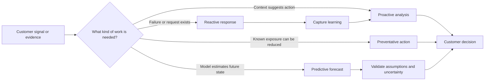

A reactive response can be excellent. A predictive model can be poor. Judge work by evidence quality, customer relevance, safe action, and outcome, not by whether its label sounds advanced.

---

## 2. Why technical expertise alone is insufficient

Technical expertise answers questions such as "What mechanism could produce this symptom?" and "Which evidence would discriminate the hypotheses?" Customer-facing technical work adds different questions:

- Which outcome and stakeholder are affected?
- What does the customer believe was promised?
- Who has authority to decide or change?
- Which constraints make the technically preferred action impractical?
- How certain is the evidence, and how should uncertainty be communicated?
- What will preserve safety and trust while bad news is delivered?
- How will the action be adopted and validated after the recommendation?

A technically correct recommendation can fail when it arrives too late, ignores a freeze, lacks an owner, assumes budget, uses unexplained language, bypasses a stakeholder, or sounds like a guarantee. Conversely, excellent empathy cannot compensate for weak evidence or unsafe advice. The role needs both.

### The TRACE trusted-advisor model

TRACE is an original teaching model for this guide, not a NetApp method and not a scientifically calibrated equation.

| Element | Question | Failure signal |
|---|---|---|
| **T - Transparency** | Are facts, assumptions, limits, dependencies, and conflicts visible? | Surprise, hidden uncertainty, selective reporting |
| **R - Reliability** | Are commitments realistic, tracked, and updated before they fail? | Missed dates, silence, repeated chasing |
| **A - Accuracy and ability** | Is advice evidence-based, technically sound, and reviewed when needed? | Confident error, weak source, no specialist review |
| **C - Customer empathy** | Does the advisor understand impact, incentives, language, and constraints? | Correct but unusable advice, dismissive tone |
| **E - Ethics** | Is the advice candid, bounded, privacy-aware, and independent of pressure to win agreement? | Fear, manipulation, hidden commercial bias, overclaiming |

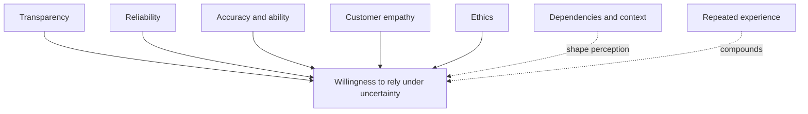

**Caveats:** TRACE is a conversation checklist, not arithmetic. Trust is stakeholder-specific, context-specific, and asymmetric: many reliable interactions may build it slowly, while one concealed material fact may damage it quickly. A high score cannot excuse one ethical failure. Cultural expectations, previous vendor history, organizational politics, and incident severity also shape perception.

### How trust is earned, lost, and rebuilt

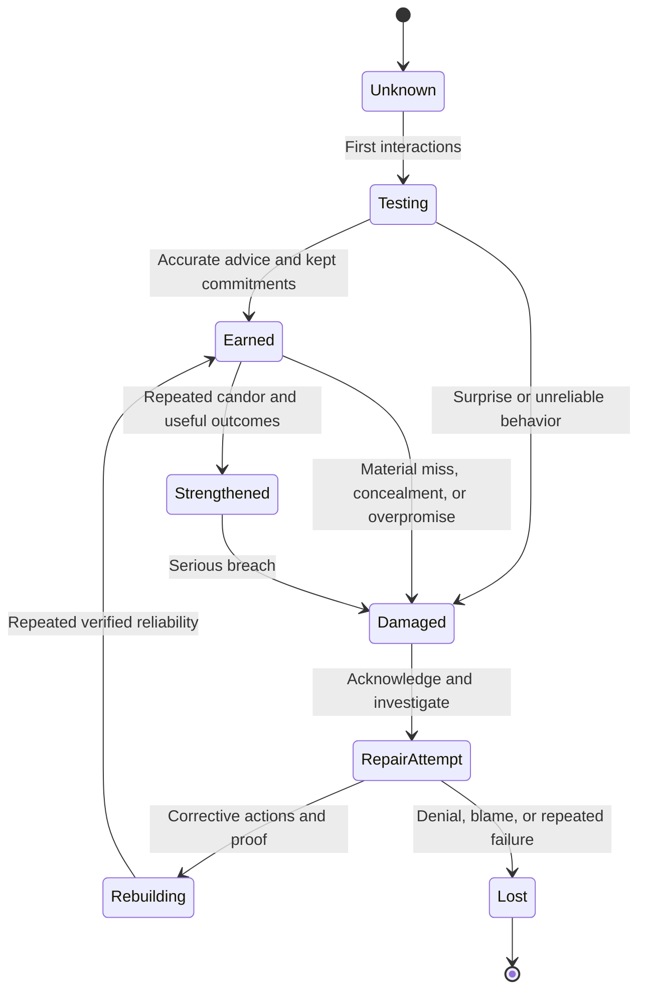

Trust is earned through small observable behaviors:

1. Prepare and understand the customer's context.
2. State what is known, unknown, assumed, and being validated.
3. Make fewer, clearer commitments.
4. Track dependencies and warn early when they threaten a date.
5. Bring bad news with evidence, impact, options, and a next checkpoint.
6. Correct errors directly and record the corrected source.
7. Follow through after the meeting, not only during it.
8. Credit customer and cross-functional contributors accurately.

Trust is commonly lost through unsupported certainty, hidden scope limits, selective metrics, missed commitments without warning, defensive blame, commercial pressure disguised as technical urgency, or making the customer repeat context at every handoff.

Rebuilding requires more than an apology: name the miss, acknowledge the effect, correct the record, explain the control being changed, assign an owner and date, prove the change through repeated behavior, and avoid asking the customer to declare trust restored prematurely.

### Transparency and uncertainty

Use four labels in difficult technical discussions:

| Label | Meaning | Example language |
|---|---|---|
| **Known** | Supported directly by current, scoped evidence | "The customer-provided change record shows the update began at 21:05 UTC." |
| **Unknown** | A material fact is absent or inaccessible | "We do not yet have host path-state evidence for the affected interval." |
| **Assumed** | A temporary proposition is being used and must be tested | "For planning only, we are assuming the freeze ends on 15 September; the change owner will confirm." |
| **Expected, not guaranteed** | A reasoned outcome depends on conditions | "If the prerequisites pass, the plan is expected to reduce lifecycle exposure; it does not guarantee incident-free operation." |

### Promises versus dependencies

| Weak promise | Why unsafe | Reliable replacement |
|---|---|---|
| "We will resolve this by Friday." | Resolution may depend on evidence, reproduction, customer access, specialist analysis, or a product fix. | "I will provide the next evidence-based status by Friday 14:00 UTC. Resolution timing remains unknown until the dependency review is complete." |
| "The change will be nondisruptive." | Exact design, health, workload, and implementation conditions may not be validated. | "The intended design targets continuity under documented conditions. We will validate prerequisites, customer change controls, test evidence, rollback limits, and monitoring before the decision." |
| "Engineering will fix it." | Engineering may not yet have accepted a defect or committed a release. | "Support has submitted the evidence through the appropriate route; the current ask and next checkpoint are recorded. No product-fix commitment has been made." |
| "This recommendation prevents an outage." | Counterfactual future events cannot normally be observed. | "This action addresses the documented exposure. We will validate the control and report the residual risk without claiming an outage was definitely avoided." |

### Delivering bad news without damaging trust

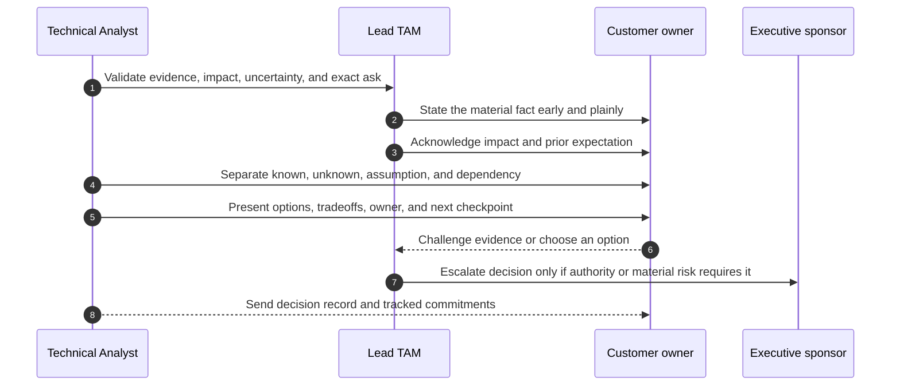

Bad news should be early, direct, proportionate, and useful. Do not bury it beneath background slides. Do not speculate to fill silence. Do not hide behind technical vocabulary.

### Empathy without conceding a false technical claim

Use this five-step response:

1. **Acknowledge experience:** "I understand the application became unusable after the change and that this disrupted the billing team."
2. **Reflect the concern:** "Given the timing, it is reasonable to ask whether the storage layer caused it."
3. **Protect the evidence boundary:** "The timestamps show correlation, but we do not yet have evidence proving storage causation."
4. **Offer a fair test:** "Let us align clocks and compare application, host, network, and storage evidence across the same interval."
5. **Commit to communication:** "We will update the shared timeline and return at 16:00 UTC with what the evidence supports."

Empathy concerns impact and perspective. Agreement concerns the technical conclusion. They can be separated respectfully.

---

## 3. Role boundaries, ownership, and RACI

No customer-facing role succeeds alone. The goal is not to protect territory; it is to send each decision and action to the role with the right authority, expertise, scope, and accountability.

### Account ecosystem

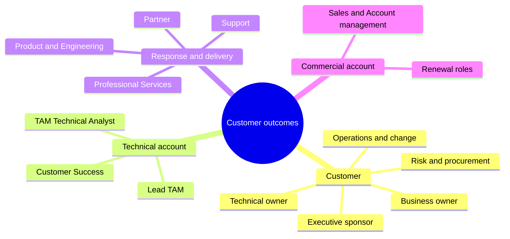

### Role distinctions

| Role | Primary purpose | Usually owns | Must not silently absorb |
|---|---|---|---|
| **Support** | Diagnose and progress incidents, defects, and technical requests | Case process, troubleshooting path, support escalation route | Long-term account plan, customer production change authority, commercial promise |
| **TAM Technical Analyst** | Build, improve, and explain evidence-based analysis, health, recommendations, reviews, and action tracking | Assigned analysis quality, provenance, deliverable, and action visibility | Lead-TAM account accountability, Support case authority, customer risk decision, unscoped implementation |
| **Lead TAM** | Own integrated technical account strategy, governance, prioritization, and senior technical relationship | Overall TAM plan, review narrative, account technical alignment, appropriate escalation coordination | Customer business decision, commercial contract, product fix, all hands-on delivery |
| **Customer Success** | Drive adoption and outcome realization for the capabilities within its service model | Success plan and adoption motion as organizationally defined | Product Support, deep implementation, customer authority |
| **Sales or Account management** | Own commercial relationship, opportunity, scope, contract, and account coordination | Commercial motion and renewal coordination | Technical validation, incident diagnosis, customer risk acceptance |
| **Professional Services** | Design, implement, migrate, or transform under agreed scope | Project deliverables, acceptance criteria, implementation plan within contract | Ongoing Support or unlimited work outside the statement of work |
| **Product and Engineering** | Build and maintain the product and investigate qualifying product issues | Product code, architecture decisions, defect analysis, release decisions | Customer environment administration, account action tracking, commercial commitment |
| **Partner** | Integrate, resell, operate, or advise according to contract | Contracted tasks, evidence, and local/customer coordination | Vendor or customer accountability beyond partner scope |
| **Customer** | Define outcomes, provide authorized context, operate its environment, approve changes, fund work, and accept business risk | Customer-controlled systems, priorities, decisions, change authority, risk acceptance | Vendor product Support or contracted vendor deliverables |

### Illustrative RACI

**RACI** means **Responsible** performs the work, **Accountable** owns the result or decision, **Consulted** gives input, and **Informed** receives relevant status. This table is an educational example, not a NetApp operating model or contract.

| Activity | Lead TAM | Technical Analyst | Support | Customer Success | Sales / Account | Services / Partner | Product / Engineering | Customer owner |
|---|---|---|---|---|---|---|---|---|
| Confirm desired account outcomes | A/R | C | I | C | C | I | I | A/R |
| Build technical health baseline | A | R | C | C | I | C | C | C |
| Progress break-fix case | I | C | A/R | I | I | C | C when engaged | R for evidence/change |
| Accept customer business risk | C | I | I | I | I | C | I | A/R |
| Approve production change | I | I | C | I | I | R if contracted | C | A/R |
| Prepare operational service review | A | R | C | C | C | C | I | C |
| Own commercial renewal | C | C for factual value | I | C | A/R | I | I | C/decision role |
| Implement scoped migration | C | C | C | I | I | A/R | C | A/R for approval |
| Investigate qualifying defect | I | C | A for route | I | I | C | R/A for product work | C |
| Track preventative recommendation | A | R | C | C | I | R if assigned | I | R for customer action |

### Boundary scenarios

| Scenario | Primary path | Technical Analyst behavior | Boundary statement |
|---|---|---|---|
| Production service becomes unavailable | Customer incident process plus Support | Supply topology, history, business context, evidence organization, and account communication input | "Support owns case progression; the customer owns production change approval; I will maintain account context and action visibility." |
| Customer asks for a migration design | Lead TAM qualifies need; Professional Services or partner scope may be required | Clarify objective, environment, constraints, prerequisites, and exact design ask | "I can help define the problem and evidence, but implementation design and delivery require agreed scope and qualified ownership." |
| Sales asks the analyst to call a risk "critical" before evidence review | Lead TAM and technical quality route | Preserve evidence-based severity, explain uncertainty, and document disagreement | "Commercial urgency cannot substitute for technical applicability and customer impact evidence." |
| Customer demands an Engineering fix date | Support and Product/Engineering route | State current accepted facts, dependency, and next checkpoint | "We can communicate the current product route and checkpoint; we cannot invent a release commitment." |
| Customer declines remediation | Customer decision owner with TAM governance | Explore constraints, offer options, record accepted/deferred risk and review date | "The customer owns the decision; our duty is to make exposure, options, and residual risk clear." |
| Partner controls the affected layer | Joint customer/vendor/partner coordination | Define exact evidence and handoff, preserve one timeline, avoid public blame | "The partner owns its contracted layer; each party supplies scoped evidence while the customer incident lead coordinates impact." |

### Escalation expands capability; it does not erase ownership

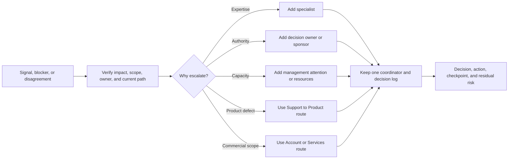

An escalation should say: what is happening, why the current route is insufficient, what impact or risk exists, what evidence is available, what exact help or decision is requested, who coordinates, and when the next checkpoint occurs.

---

## 4. The customer-success lifecycle

Customer success is not a single review. It is a loop that begins with intended outcomes and returns whenever the environment, business, stakeholders, or evidence changes.

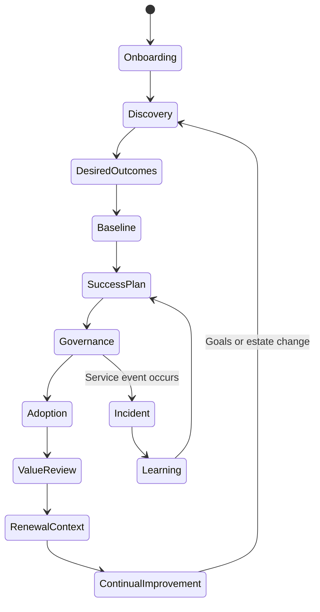

### Lifecycle phases

| Phase | Beginner question | Core work | Exit evidence |
|---|---|---|---|
| **Onboarding** | What service and relationship were agreed? | Confirm scope, contacts, evidence access, data handling, support routes, cadence, and boundaries | Shared working agreement and stakeholder map |
| **Discovery** | What matters, what exists, and who owns it? | Learn business services, environment, history, constraints, personas, decisions, and unknowns | Validated discovery notes and environment profile |
| **Desired outcomes** | What condition should become different, for whom, by when? | Convert broad goals into outcome statements and decision criteria | Customer-approved outcome definitions |
| **Baseline** | What is the verified starting condition? | Measure health, adoption, risk, support experience, lifecycle, actions, and evidence quality | Dated baseline with confidence and gaps |
| **Success plan** | What route connects baseline to outcome? | Define milestones, KPIs, recommendations, owners, dependencies, governance, risks, and validation | Shared plan with named commitments |
| **Health model** | Where is progress or exposure changing? | Refresh evidence, interpret conflicting signals, challenge scoring, and prioritize attention | Reasoned health narrative, not only a color |
| **Governance** | Where are decisions and actions made? | Run working sessions, operational reviews, sponsor checkpoints, decision logs, and escalations | Current decisions, actions, owners, and dates |
| **Risks and recommendations** | What may prevent the outcome and what should be done? | Connect evidence to impact, options, action, validation, and residual risk | Decision-ready recommendation register |
| **Adoption** | Is the action or capability being used correctly and sustainably? | Remove blockers, train, pilot, track execution, and validate behavior | Adoption evidence and operational ownership |
| **Incidents** | How does account context help restore and learn? | Preserve Support ownership, organize context, communicate, and convert learning into actions | Incident follow-up with prevention owners |
| **Value review** | What changed, and how confidently can contribution be stated? | Compare baseline and outcome, distinguish outputs from impact, expose remaining risk | Evidence-bound value narrative |
| **Renewal context** | Does continued service fit future needs and demonstrated value? | Provide factual outcomes, open exposure, priorities, and technical roadmap input | Honest technical value summary; commercial owner leads renewal |
| **Expansion signals** | Is there an unmet need where another capability or service may help? | Surface need, validate fit, and hand to the appropriate role transparently | Customer-consented exploration, not pressure |
| **Continual improvement** | How can the service and customer operating model improve? | Review misses, feedback, stale actions, manual work, and governance effectiveness | Improvement experiment with owner and measure |

### Ethical expansion boundary

An **expansion signal** is a legitimate unmet need, such as a protection gap, capacity constraint, missing expertise, or new workload. The ethical path is:

1. Verify the need and customer impact.
2. Separate required risk communication from an optional commercial solution.
3. Present more than one reasonable option where appropriate, including process or existing-capability options.
4. State uncertainty, dependencies, and who owns commercial discussion.
5. Obtain customer interest before expanding the conversation.
6. Never exaggerate risk, suppress a workaround, or redefine health to manufacture demand.

### Success-plan architecture

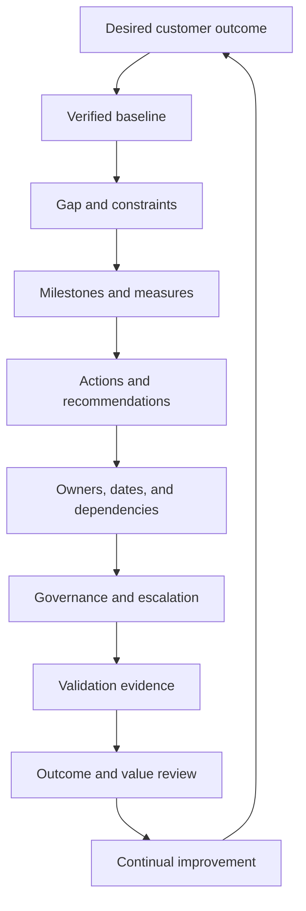

### Success-plan template

| Field | Question | Example, clearly synthetic |
|---|---|---|
| Outcome | What customer condition should change? | "Improve readiness for a planned platform lifecycle change by Q2." |
| Baseline | What is true now, with date and confidence? | "Current component inventory is 82 percent owner-validated; confidence medium." |
| Measure | Which leading and lagging indicators inform progress? | Leading: dependency validation completion. Lagging: change outcome and post-change incidents. |
| Milestone | What evidence marks meaningful progress? | "All in-scope owners validate exact component versions before design approval." |
| Action | What work must occur? | Complete inventory, supportability review, test plan, and change readiness review. |
| Owner | Who performs and who decides? | Customer platform owner performs; customer change authority decides. |
| Dependency | What must another party or condition provide? | Application freeze dates and specialist review. |
| Risk | What could block or harm the outcome? | Missing host data or shortened maintenance window. |
| Governance | Where is progress reviewed and decisions recorded? | Biweekly working session and monthly technical review. |
| Validation | What proves completion? | Approved evidence pack and measured post-change checks. |
| Residual risk | What remains after the plan? | Supported planning does not guarantee defect-free execution. |

---

## 5. Customer health: a model with ten dimensions

Customer health is a decision aid. It should answer **where attention is needed, why, how confident the evidence is, and what action follows**. A single green, amber, or red label without narrative can be actively misleading.

### Ten health dimensions

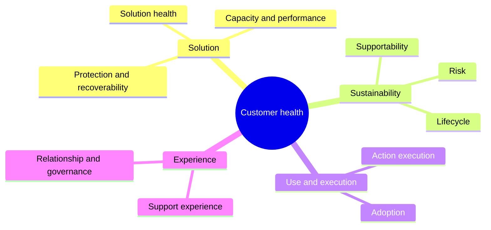

| Dimension | What it asks | Example evidence | Leading signal | Lagging signal | Caution |
|---|---|---|---|---|---|
| **Solution health** | Is the scoped solution operating as intended, and are material faults or degradations present? | Current health evidence, events, incidents, component state | Unresolved warnings or degraded redundancy | Service-impacting event | Product health does not equal business-service health |
| **Supportability** | Is the exact end-to-end configuration within current documented support parameters? | Current official validation and exact inventory | Increasing unknown or unvalidated combinations | Diagnosis or change blocked by unsupported state | Supported does not mean incident-proof |
| **Adoption** | Are intended capabilities and recommendations used correctly and consistently? | Configuration/use evidence, training, process adherence | Pilot completion and owner readiness | Sustained use and achieved behavior | More feature use is not always better |
| **Risk** | What uncertain conditions threaten customer objectives? | Risk register, exposure, impact, likelihood, time horizon, confidence | Unresolved prerequisite or growing exposure | Realized incident or missed objective | A color must not replace rationale |
| **Support experience** | Is the customer receiving clear, timely, effective support interactions? | Case themes, handoffs, communication feedback, satisfaction | Missing evidence and aging ownership | Satisfaction, reopen, or escalation outcome | Satisfaction alone does not prove technical quality |
| **Relationship and governance** | Are stakeholders aligned, decisions timely, and communication trusted? | Attendance, decisions, unresolved disagreements, feedback | Sponsor disengagement or repeated rescheduling | Escalation caused by governance failure | High meeting attendance can hide weak decisions |
| **Action execution** | Are agreed actions moving to validated closure? | Owner, date, status, blocker, closure evidence | Aging, missing owner, blocked dependency | Completed and validated remediation | Closing tickets is not closing risk |
| **Lifecycle** | Are technology and skills being maintained, upgraded, and retired before urgency? | Roadmap, current versions, support horizon, funding plan | Approaching decision or planning gate | Emergency change or unsupported operation | Dates and policies are version-sensitive |
| **Capacity and performance** | Can the environment meet demand with appropriate headroom and response? | Trends, workload context, thresholds, forecasts | Shrinking headroom or growing queue | User-visible delay or exhausted capacity | Forecasts need history and uncertainty |
| **Protection and recoverability** | Can required data and service be recovered to agreed objectives? | Copy status, independence, runbook, timed restore/failover test | Aging tests or failed copy checks | Measured recovery result after exercise/event | Copy existence does not prove recovery |

### Illustrative scoring, never a hidden truth machine

Use a five-point descriptive scale only after defining evidence criteria:

| Score | Meaning | Required narrative |
|---:|---|---|
| 1 | Material outcome is currently failing or exposure is urgent | Impact, immediate action, authority, checkpoint |
| 2 | Significant weakness or blocker exists | Evidence, time horizon, owner, escalation path |
| 3 | Mixed or uncertain condition needs planned attention | Conflicting signals, confidence, next validation |
| 4 | Generally healthy with bounded gaps | Exceptions, monitoring, improvement action |
| 5 | Strong evidence supports current objectives | Evidence scope, freshness, what is not proved |

An illustrative weighted summary can be written as:

$$
H = \frac{\sum_{i=1}^{n} w_i s_i}{\sum_{i=1}^{n} w_i}
$$

where $s_i$ is a dimension score and $w_i$ is a customer-approved importance weight. This number is **not** a probability, service level, or NetApp method. Show each dimension, evidence confidence, and material exception beside it. A critical recoverability gap must not disappear inside a favorable average.

### Health reasoning flow

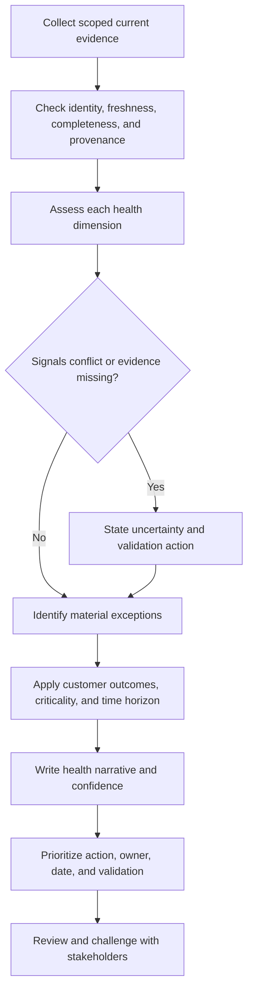

### Anti-gaming rules

- Never change weights, thresholds, or scope after seeing results merely to improve the color.
- Do not count unknown as healthy. Mark it unknown and assign discovery.
- Do not let a strong relationship score hide technical exposure.
- Do not let one severe incident automatically make every dimension red.
- Do not reward a large number of recommendations; reward relevant, adopted, validated action.
- Do not punish honest risk reporting. A team that finds a problem early may be healthier than one that reports no data.
- Record data cutoff, score owner, rationale, override, and prior-period definition.
- Permit expert override only with written evidence and decision rationale.
- Track trend and confidence, not only a current number.
- Keep commercial pressure outside the scoring decision.

---

## 6. Turning activity into value

The TAM team may produce reports, meetings, analyses, workshops, and recommendations. Those are useful only when they support a customer action, decision, capability, or changed condition.

### Output, outcome, and impact

| Level | Definition | Example | Evidence strength |
|---|---|---|---|
| **Activity** | Work performed | Held a discovery workshop | Weakest value evidence by itself |
| **Output** | Artifact or immediate deliverable produced | Published an owner-validated dependency map | Useful proof of work and readiness |
| **Outcome** | Customer condition or behavior changed | All critical assets now have named owners and current service mappings | Stronger customer-value evidence |
| **Impact** | Wider business effect associated with the outcome | Incident teams scope affected services faster | Requires careful measurement and attribution |

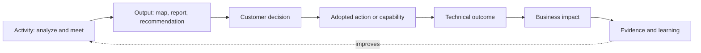

### Technical and business metrics

| Objective | Technical measure | Business or operational measure | Attribution caution |
|---|---|---|---|
| Improve inventory quality | Percent of in-scope assets with validated ID, owner, version, and service map | Fewer ownership disputes during review or incident | Other process changes may contribute |
| Improve recommendation adoption | Percent accepted, aging, blocked, and validated | Decisions made before change or budget gates | High adoption is not good if advice quality is weak |
| Improve supportability | Percent of scoped combinations currently validated | Fewer urgent compatibility decisions | Supported state does not guarantee reliability |
| Improve recoverability | Timed test success, achieved recovery point/time, runbook gaps | Reduced uncertainty in continuity planning | A test proves only its scenario and date |
| Improve support experience | Evidence completeness, handoff count, update timeliness | Customer effort or satisfaction trend | Case mix and severity can distort comparison |
| Improve lifecycle readiness | Percent with current owner, target, dependency plan, and funding decision | Fewer emergency lifecycle decisions | Future urgency cannot be eliminated entirely |
| Improve capacity readiness | Forecast confidence, headroom threshold, decision lead time | Planned rather than emergency procurement/change | Demand and workload mix can change |

### Recommendation adoption evidence ladder

| Level | Evidence | What may be claimed |
|---:|---|---|
| 0 | Recommendation presented | Advice was communicated |
| 1 | Customer decision and owner recorded | Recommendation was considered and assigned or declined |
| 2 | Work started with prerequisites | Adoption is in progress |
| 3 | Change or process implemented | Action was executed |
| 4 | Validation criteria passed | Remediation or capability was verified within scope |
| 5 | Sustained outcome observed over an agreed period | Evidence supports durable outcome movement |

Do not call level 0 "value realized." Do not call level 3 "risk eliminated." Residual risk and monitoring remain.

### Avoided-risk claims and counterfactual caution

An **avoided event** is a counterfactual: something that did not happen. Usually, there is no direct observation of the alternate future in which the action was not taken.

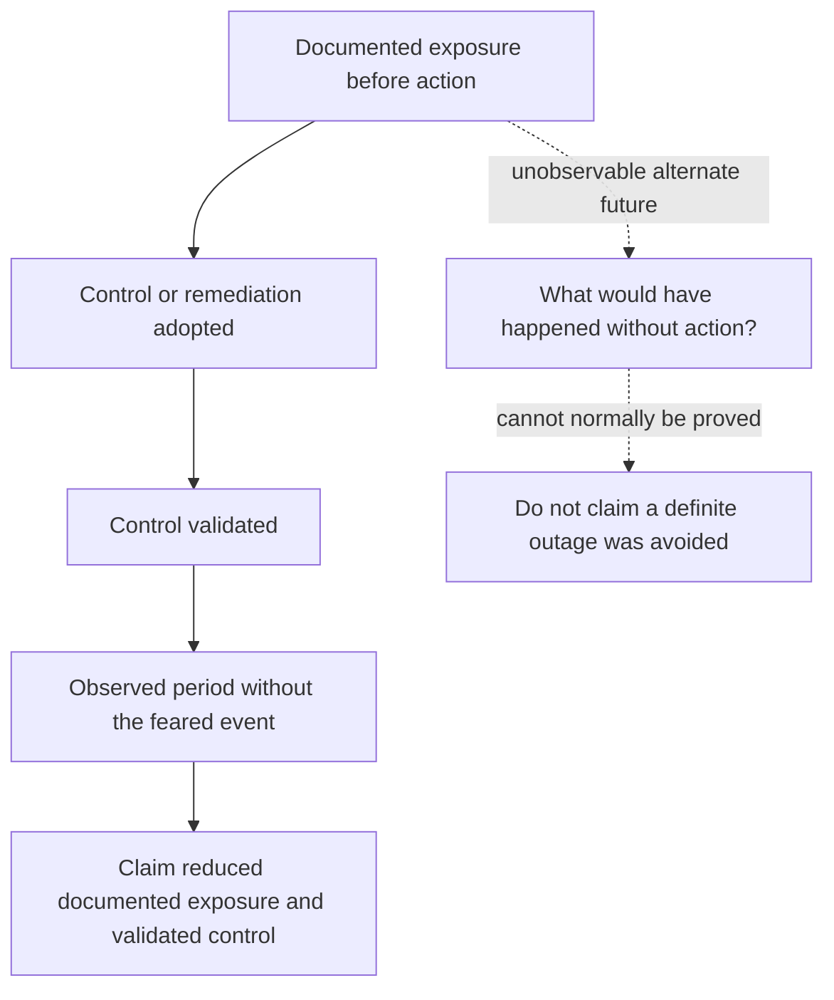

Safer wording:

> "The customer closed the documented single-owner inventory gap and validated the new handoff process. This reduced known coordination exposure for the scoped systems. No claim is made that a specific outage was prevented."

### A value narrative in six sentences

1. **Outcome:** What the customer wanted.
2. **Baseline:** What the verified starting condition was.
3. **Contribution:** What the TAM service, customer, Support, partner, or specialists each did.
4. **Adoption:** Which recommendation or capability the customer implemented.
5. **Evidence:** What technical and business measures moved.
6. **Remaining work:** What uncertainty, residual risk, and next priority remain.

This structure supports an honest renewal conversation. The commercial owner can use it in broader account context; the technical author should preserve evidence boundaries.

---

## 7. Governance design and operating cadence

Governance is the architecture of decisions. A useful meeting exists because a defined group needs to decide, coordinate, validate, or escalate something that asynchronous work alone cannot handle.

### Stakeholder map

| Persona | Typical interest | Decision or contribution | Engagement risk |
|---|---|---|---|
| Executive sponsor | Business continuity, value, major risk, funding | Resolve cross-team priority and accept major direction | Receives too much detail or only hears crises |
| Business/service owner | User and operational outcome | Define criticality and approve business tradeoffs | Technical work becomes detached from service impact |
| Technical platform owner | Stability, supportability, capacity, change | Validate environment and execute technical action | Recommendations ignore workload or maintenance constraints |
| Application owner | Availability, performance, release calendar | Validate impact and test application outcomes | Storage-focused plan misses application dependencies |
| Security/risk | Exposure, controls, policy, evidence | Set risk criteria and exception governance | Technical severity is confused with organizational risk |
| Operations/change | Runbooks, windows, approvals, supportability | Coordinate implementation and operating handoff | Actions stall after review |
| Finance/procurement | Cost, timing, contract, budget cycle | Fund or contract the selected path | Risk arrives after budget gate |
| Champion | Internal navigation and momentum | Connect people and surface constraints | Over-relied on without formal authority |
| Detractor | Evidence, cost, prior failure, workload impact | Challenge plan and reveal hidden objections | Labeled as difficult and excluded |
| Lead TAM | Integrated technical relationship and priorities | Own TAM governance and account narrative | Analyst operates without account context |
| Technical Analyst | Evidence, health, recommendations, actions | Build and improve decision support | Becomes a report factory rather than outcome partner |

### Meeting architecture

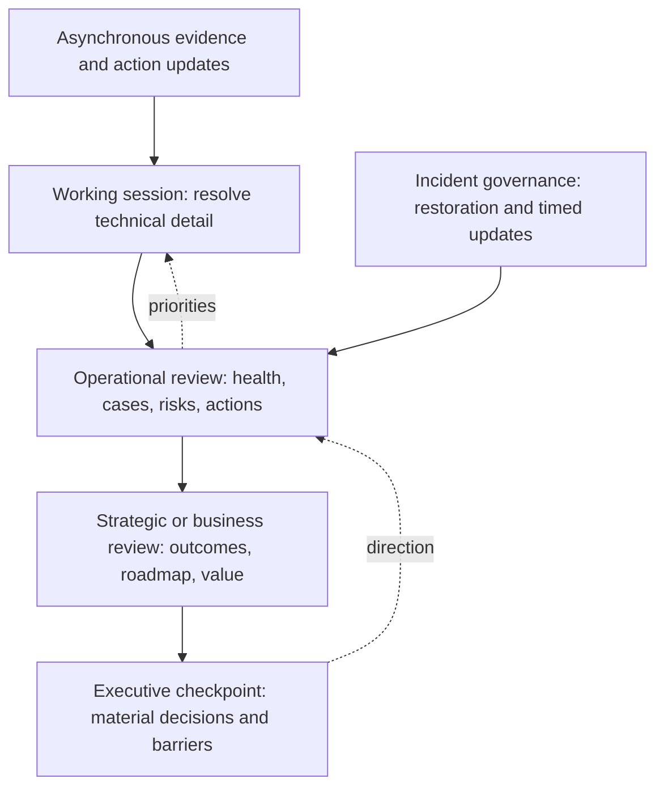

| Forum | Purpose | Typical attendees | Typical cadence | Avoid |
|---|---|---|---|---|
| Action sync | Move owners, blockers, and dependencies | Working owners | Weekly or as needed | Reading every completed task |
| Technical working session | Resolve one scoped technical question | Relevant engineers and SMEs | As needed | Inviting executives to debugging detail |
| Operational service review | Review health, support, risks, recommendations, decisions, and upcoming changes | Lead TAM, analyst, technical owners, Support input | Monthly or quarterly by agreement | Slide recital without decisions |
| QBR or strategic review | Connect outcomes, value, roadmap, lifecycle, and future priorities | Sponsors, account leadership, business and technical owners | Often quarterly; actual agreement varies | Presenting unsupported savings or commercial pressure as health |
| Executive checkpoint | Resolve material risk, funding, or cross-team barrier | Executive sponsor and accountable leaders | Exception-based or planned | Escalating routine action aging |
| Incident bridge | Restore service with one command structure and communication rhythm | Incident roles and technical workstreams | Event-based | Mixing root-cause debate into immediate restoration |

### Meeting lifecycle

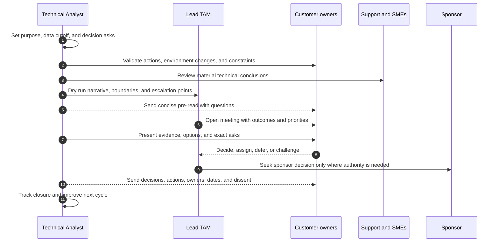

### Standard operational-review agenda

1. Purpose, period, data cutoff, and changes since last review.
2. Outcomes and prior decisions.
3. Material health exceptions and confidence.
4. Support experience and incident learning.
5. Top risks and recommendations.
6. Adoption and action status.
7. Lifecycle, capacity, performance, and protection horizon as applicable.
8. Upcoming changes, constraints, and dependencies.
9. Decisions required today.
10. Owners, dates, accepted risks, and next checkpoint.

### Pre-read quality

A pre-read should arrive early enough to prepare, be short enough to read, identify what changed, show source dates, distinguish decision from information, and list questions requiring customer validation. Confidential or customer data must use approved handling. Do not send a raw dashboard export and call it a pre-read.

### Decision and action tracking

| Field | Why it exists |
|---|---|
| Decision ID and date | Makes the record findable and chronological |
| Question decided | Prevents vague agreement |
| Decision owner and right | Proves authority |
| Options considered | Preserves tradeoff context |
| Evidence and assumptions | Shows the basis and limitations |
| Decision and rationale | Explains why |
| Action, responsible owner, and target | Converts decision into work |
| Dependency and blocker | Exposes what may prevent delivery |
| Validation | Defines closure evidence |
| Residual risk and review date | Prevents false finality |
| Dissent or unresolved concern | Preserves honest disagreement |

### Time-zone and global collaboration

- Write dates as unambiguous formats and include the time-zone abbreviation or UTC.
- Rotate recurring inconvenience rather than assigning every early or late meeting to one region.
- Agree urgent routes, response expectations, and handoff boundaries.
- Use asynchronous pre-reads and decision records so overlap time is spent on discussion.
- A handoff should include impact, current state, evidence, work completed, next discriminating step, owner, dependency, and checkpoint.
- Avoid idioms, sarcasm, rapid interruption, and culture-specific shorthand in high-stakes communication.
- Confirm understanding through concise restatement, not by asking only "Does everyone agree?"
- Escalate unsustainable coverage; fatigue degrades judgment and reliability.

### Meeting hygiene

- Every meeting needs purpose, owner, agenda, right attendees, and desired decisions.
- Cancel when asynchronous work is sufficient.
- Start with the decision or outcome, not a history lecture.
- Park unrelated items with an owner and destination.
- Invite challenge, especially from affected owners and detractors.
- End by reading back decisions, owners, dates, and accepted risks.
- Publish concise minutes promptly; do not distribute an unedited transcript as governance.
- Review whether the cadence still creates value.

---

## 8. Influence and negotiation without authority

Influence begins by understanding why a reasonable person might resist. A position is what someone says they want; an interest is the need or concern beneath it.

| Position | Possible interest | Useful question |
|---|---|---|
| "No upgrade this quarter" | Protect revenue peak, avoid change fatigue, insufficient test capacity | "Which constraint makes this quarter unsafe, and when does it change?" |
| "The vendor must own this" | Fear of blame, unclear boundary, limited staff | "Which outcome and task need an owner, and what does the contract and change authority permit?" |
| "The risk is low" | Different impact model, evidence dispute, budget pressure | "Which likelihood, impact, time horizon, or evidence assumption do you assess differently?" |
| "We cannot afford it" | Budget gate, competing project, unclear value | "Would a phased control reduce exposure within the current constraint?" |

### Influence loop

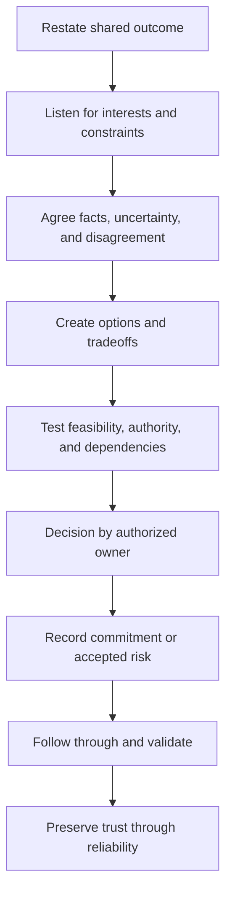

### BATNA in plain English

**BATNA** means **best alternative to a negotiated agreement**: the most credible course available if the parties do not agree. **Analogy:** If two routes are being negotiated for a delivery, BATNA is the best usable route if the preferred route is rejected. **Why it matters:** It prevents false choices and coercion.

In a TAM context, BATNA is often modest:

- If immediate remediation is rejected, document risk, add monitoring, reduce scope, or schedule a dated reconsideration.
- If a full outage window is unavailable, consider a validated phased plan where technically appropriate.
- If ownership is disputed, escalate the decision right rather than assign work to an unwilling team.
- If evidence is insufficient, pause the conclusion and run a discriminating validation.

BATNA is not a threat. It is the safest honest alternative available within authority and evidence.

### Option framing by cost, disruption, and residual risk

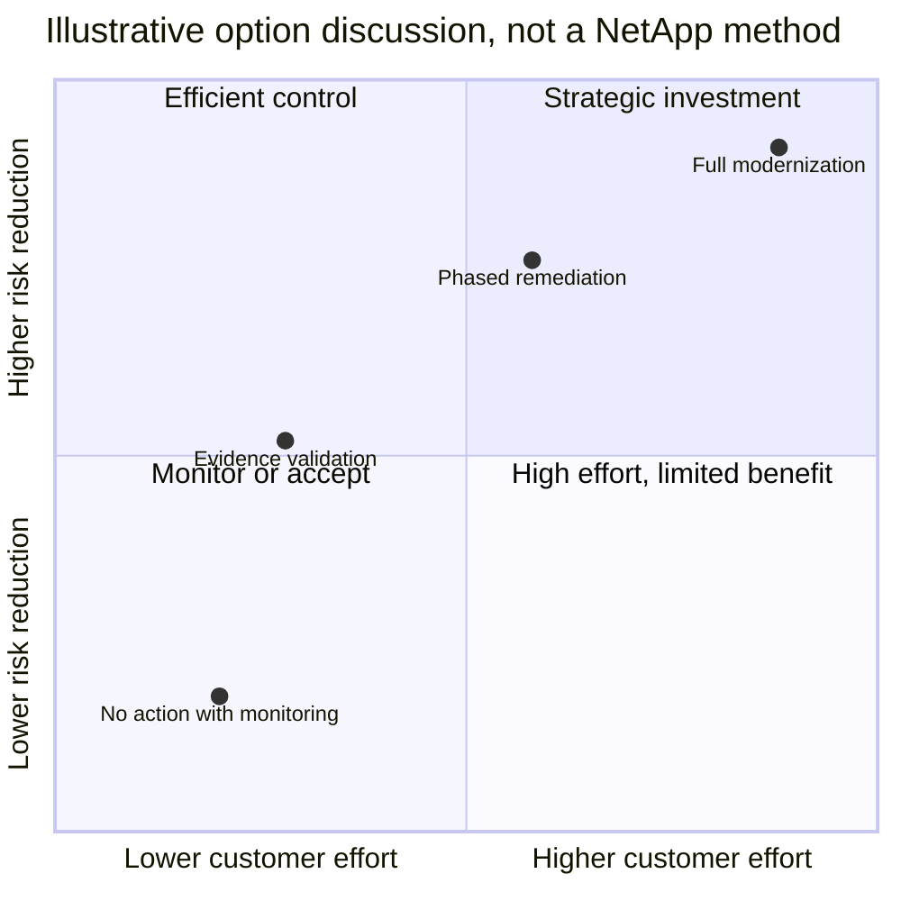

The coordinates are synthetic. A real decision also needs urgency, dependencies, technical feasibility, lifecycle, opportunity cost, and customer authority.

### Common objections

| Objection | Weak response | Trusted-advisor response |
|---|---|---|
| **Cost:** "There is no budget." | "You must do it anyway." | Clarify budget cycle and business impact; separate immediate control from longer investment; offer phased options; record residual risk. |
| **Downtime:** "We cannot take an outage." | "The change should be seamless." | Treat downtime as a design constraint; validate exact prerequisites and alternatives; involve change/application owners; never guarantee continuity. |
| **Ownership:** "This is the vendor's job." | "It is in your environment, so it is yours." | Break the work into diagnosis, product guidance, implementation, approval, and validation; map each to scope and decision rights. |
| **Risk:** "Nothing has failed yet." | Use fear or claim an outage is imminent. | Explain the documented exposure, time horizon, evidence confidence, options, and cost of delay without predicting an event. |
| **Evidence:** "Your data is wrong." | Defend the dashboard. | Ask which identity, time, definition, or source differs; reconcile and correct openly. |
| **Competing priority:** "Another project matters more." | Escalate immediately. | Compare impact, deadlines, dependencies, and reversible controls; let the authorized owner prioritize. |

### Accepted risk and disagreement

A sound risk-acceptance record includes condition, affected objective, evidence, likelihood/impact rationale, options considered, selected decision, authorized owner, duration, monitoring, trigger for reconsideration, and residual risk. It should never read as a vendor forcing the customer to "sign away" responsibility.

When experts disagree:

1. State the exact disputed proposition.
2. Identify which evidence would change either view.
3. Separate policy, preference, risk tolerance, and technical mechanism.
4. Run the cheapest safe discriminating check.
5. Record both views and the decision authority.
6. Escalate for missing expertise or authority, not to win status.

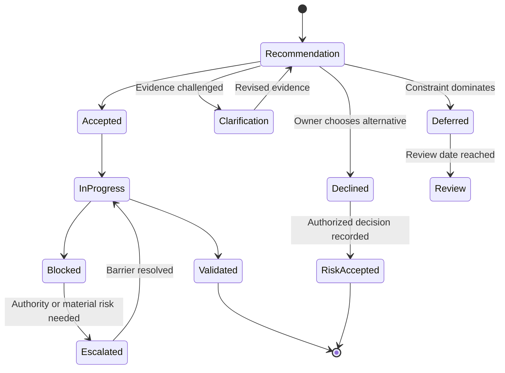

---

## 9. Expectation and scope management

Expectation management is not lowering standards. It is creating an accurate shared picture of service boundaries, responsibilities, conditions, response, dependencies, and possible outcomes.

### The expectation triangle

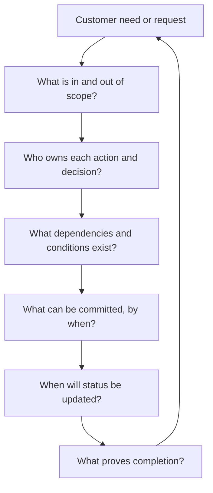

### Response versus resolution

- **Response** means the request was acknowledged and an appropriate next step began.
- **Progress update** means current evidence, actions, dependencies, and checkpoint were communicated.
- **Mitigation** reduces immediate impact without necessarily removing root cause.
- **Resolution** means the defined issue or request reached an agreed end state.
- **Remediation** removes or reduces a known condition or risk.
- **Validation** proves the action met scoped criteria.

Fast response does not guarantee fast resolution. Resolution timing can depend on customer evidence, access, reproduction, change windows, third parties, parts, specialist availability, or product engineering. Do not convert a response commitment into a resolution promise.

### Scope statement template

> **Objective:** [desired result]. **Included:** [systems, work, time period, deliverables]. **Excluded:** [explicit boundaries]. **Owners:** [responsible and accountable roles]. **Dependencies:** [customer, vendor, partner, access, data, change]. **Assumptions:** [temporary propositions]. **Commitments:** [what and when]. **Validation:** [completion evidence]. **Change control:** [how scope changes are approved].

### Overpromising patterns

| Pattern | Why it fails | Better practice |
|---|---|---|
| Agreeing to an undefined "full assessment" | Scope expands silently and quality falls | Define estate, dimensions, sources, depth, date, and exclusions |
| Promising a customer outcome controlled by several parties | One role cannot control dependencies | Commit to owned actions and checkpoints; state dependency owners |
| Treating "high priority" as unlimited availability | Fatigue and collisions reduce reliability | Agree severity, coverage, handoff, and escalation path |
| Guaranteeing no disruption or no future incident | Complex systems and changes contain uncertainty | State intended behavior, prerequisites, tests, and residual risk |
| Saying "Support will handle it" without a handoff | Customer must repeat context and ownership becomes unclear | Give Support a complete evidence package and retain account coordination |
| Taking implementation work outside agreed service | Creates risk, entitlement confusion, and weak accountability | Qualify need and route to the correct scoped delivery role |

### No-guarantee language that remains useful

Avoid empty disclaimers. Pair uncertainty with action:

> "Current evidence supports option A as the preferred path, subject to exact environment validation and customer change approval. The prerequisites and rollback limits are listed below. This does not guarantee a fault-free change; it creates a more defensible decision and validation plan."

---

## 10. Customer communication under pressure

Pressure compresses attention. Communication must become shorter, more structured, and more explicit, not more frequent without purpose.

### Executive and technical layers

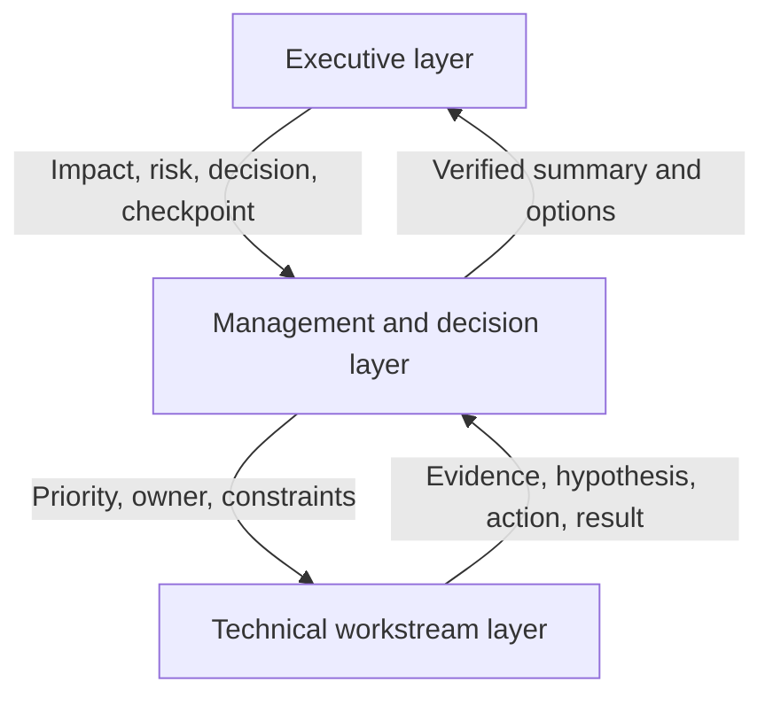

| Audience | Needs | Avoid |
|---|---|---|
| Executive | Business impact, current state, material risk, decision needed, owner, checkpoint | Raw logs, speculative root cause, long chronology |
| Service or incident manager | Scope, workstreams, blockers, dependencies, action owners, communication rhythm | Competing side channels and ambiguous ownership |
| Technical owner | Exact symptom, topology, timeline, evidence, hypotheses, tests, changes, results | Simplified claims that hide technical uncertainty |
| End-user or business operations | What is affected, workaround if approved, expected next communication | Internal blame, unsupported repair timing |

### Status update structure

1. **Timestamp and scope:** Which services, users, locations, and period?
2. **Impact:** What cannot be done or is degraded?
3. **Known:** Which facts are evidence-backed?
4. **Unknown:** Which material questions remain?
5. **Actions:** What is happening now and why?
6. **Owners and dependencies:** Who controls each workstream?
7. **Risk:** What may worsen or block progress?
8. **Next checkpoint:** When will the next useful update occur?

### Silence versus noise

Silence creates abandonment and uncertainty. Noise creates cognitive load and hides change. Set a communication cadence based on impact and stakeholder need, then send an update even when there is no technical change:

> "No material change since 14:00 UTC. The host and network evidence review continues; storage-side health evidence remains stable for the scoped interval. The next discriminating result is expected from the host team. Next update at 15:00 UTC or earlier if impact changes."

### Difficult-message checklist

- Put the material fact in the first two sentences.
- Acknowledge impact without assigning unsupported blame.
- Correct prior expectations explicitly.
- Distinguish mitigation, resolution, root cause, and prevention.
- Do not name a cause until the evidence supports it.
- State what the customer must decide or provide.
- Use one accountable communication owner.
- Preserve confidentiality and approved information handling.
- Record promises, dependencies, and next checkpoint.
- After the event, convert learning into owned preventative work.

### Cultural and time-zone awareness

Directness, hierarchy, interruption, disagreement, and silence can have different meanings across cultures and individuals. Adapt by using plain language, sending written context, inviting views in more than one channel, allowing preparation time, and confirming the decision in writing. Do not stereotype a person based on region. Ask for communication preferences and observe behavior.

---

## 11. Complete synthetic success-plan case: Meridian Mutual Services

> **Synthetic evidence boundary:** Meridian Mutual Services, all people, systems, scores, dates, incidents, recommendations, objections, metrics, and outcomes below are fictional. The case is a paper exercise. It does not describe a real NetApp customer, internal NetApp process, service entitlement, product method, product defect, tool result, or your production experience. Product-specific conclusions would require authorized current evidence and qualified review.

### 11.1 Customer context and personas

Meridian is a fictional financial-services cooperative. Its member-document and claims platform depends on a mixed virtualized application environment and a storage estate. A lifecycle project is planned before the next annual business peak.

| Persona | Role | Priority | Constraint | Relationship signal |
|---|---|---|---|---|
| Lena Ortiz | Chief Information Officer and executive sponsor | Reduce business disruption and surprise | Funding gate in 10 weeks | Supportive but wants concise evidence |
| Marcus Lee | Infrastructure director and accountable technical owner | Complete lifecycle plan without peak-period risk | Several competing programs | Champion when actions are practical |
| Priya Raman | Storage platform lead | Improve supportability, capacity readiness, and recovery confidence | Small team and limited windows | Strong technical partner |
| Daniel Brooks | Claims application owner | Protect application availability | Rejects any daytime interruption | Detractor toward infrastructure-led changes after a prior failed release |
| Mei Chen | Risk and resilience lead | Prove recovery and accepted-risk governance | Needs auditable evidence | Neutral, evidence-driven |
| Sofia Alvarez | Operations manager | Improve incident handoffs | On-call fatigue and too many meetings | Frustrated with duplicate requests |
| Noah Patel | Lead TAM, fictional | Own integrated technical account plan | Must align several roles | Trusted but newly assigned |
| Asha Singh | TAM Technical Analyst, fictional | Build baseline, recommendations, reviews, and trackers | No production change authority | Must earn credibility |
| Victor Hale | Account executive, fictional | Maintain commercial relationship and renewal context | Quarter-end timing | Must not influence technical health scoring |
| Support and specialist roles | Product diagnosis and focused expertise | Complete evidence and safe technical path | Scope and availability vary | Engaged through defined routes |

### 11.2 Desired outcomes and architecture context

The customer approves three outcomes for the fictional six-month plan:

1. Make the lifecycle decision before the funding gate with complete dependencies and explicit risk.
2. Improve confidence that the claims platform can be recovered to its customer-defined objectives.
3. Reduce customer effort during major support escalations by improving topology and handoff evidence.

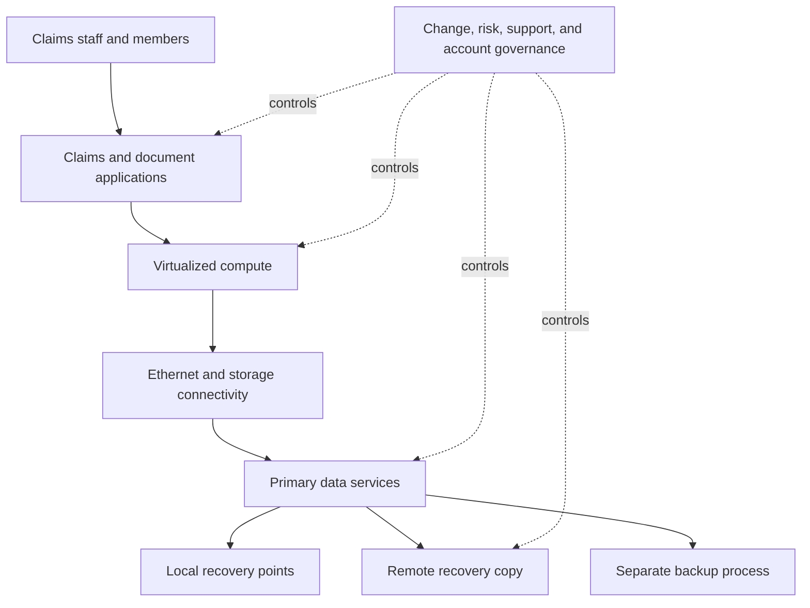

The diagram only identifies dependencies to validate. It does not claim a particular NetApp architecture or recovery behavior.

### 11.3 Health baseline

The fictional team uses the ten-dimension educational model. Scores are descriptive, not NetApp methods.

| Dimension | Baseline | Confidence | Evidence and reason | Initial action |
|---|---:|---|---|---|
| Solution health | 4 | Medium | No current material fault in supplied summary, but one path-state source is stale | Refresh scoped health and path evidence |
| Supportability | 2 | Low | Surrounding host, driver, firmware, and switch details incomplete for planned lifecycle change | Build exact component inventory and current official validation plan |
| Adoption | 3 | Medium | Several prior recommendations accepted; closure evidence inconsistent | Define adoption evidence ladder |
| Risk | 2 | Medium | Funding and freeze dates create time pressure around incomplete prerequisites | Prioritize lifecycle decision pack |
| Support experience | 2 | High | Three major cases show repeated requests and inconsistent topology versions | Pilot one escalation evidence pack |
| Relationship/governance | 3 | Medium | Sponsor engaged; application owner distrusts infrastructure change language | Add application-owner working session and clear decision logs |
| Action execution | 2 | High | Seven of twelve actions are overdue; three have no current owner | Reconfirm or close every action |
| Lifecycle | 2 | Medium | Decision horizon is near; exact technical path not yet validated | Create options and dependency roadmap |
| Capacity/performance | 3 | Low | Six months of data and one workload change; forecast uncertain | Extend baseline and validate definitions |
| Protection/recoverability | 2 | High | Copies are reported current, but last full application recovery exercise missed the fictional target | Run paper rehearsal, then approved scoped test |

### 11.4 Success plan and conflicting priorities

| Outcome | Baseline | Milestone | KPI and type | Owner | Dependency | Target |
|---|---|---|---|---|---|---|
| Lifecycle decision readiness | Component inventory incomplete | Exact scoped inventory and options reviewed before funding gate | Percent prerequisites validated, leading | Marcus with Priya; lead TAM coordinates | App freeze, network/host data, specialist review | 2026-10-16 |
| Recovery confidence | Full test is 15 months old and missed target | Approved rehearsal and measured scoped recovery test | Test gaps closed, leading; achieved RPO/RTO, lagging | Mei | App owner participation and change approval | 2026-11-20 |
| Better escalation experience | Repeated evidence requests in 3 synthetic cases | Pilot common topology/timeline/evidence pack on next 4 cases | Evidence completeness, leading; customer effort feedback, lagging | Sofia | Support feedback and data-handling approval | 2026-12-04 |

The priorities conflict:

- Daniel wants zero business-hours disruption and no test near the application release.
- Mei will not support a recovery-confidence claim without a measured exercise.
- Marcus needs a decision before funding closes.
- Priya lacks people for a full redesign.
- Sofia wants fewer meetings, not another governance layer.
- Victor sees possible services need, but cannot turn the health score into a sales argument.

### 11.5 Recommendations, objections, and negotiated paths

| ID | Recommendation | Main objection | Negotiated path | Decision owner | Validation | Residual risk |
|---|---|---|---|---|---|---|
| R-01 | Complete exact end-to-end inventory and current supportability validation before lifecycle option approval | "This delays the funding paper." | Time-box data collection; publish known/unknown list in week one; make exact validation a decision gate, not a hidden later task | Marcus | Dated inventory, source list, reviewed gaps, decision record | Validated supportability does not guarantee change success |
| R-02 | Run a paper recovery rehearsal followed by a scoped approved exercise | "Any test could disrupt claims." | Separate no-change paper rehearsal from production-impacting steps; involve Daniel in test boundaries; use customer change authority | Mei and Daniel for their decision rights | Timed transaction-level result and gap log | Test covers only named scenario and date |
| R-03 | Replace three duplicate account meetings with one action sync and asynchronous tracker | "Governance means more meetings." | Remove two meetings, publish one tracker, keep OSR focused on decisions | Marcus | Calendar reduction and current action register | Asynchronous updates may still become stale |
| R-04 | Pilot a minimum escalation evidence pack on four cases | "A template slows urgent response." | Use severity-aware required fields; measure preparation effort and handoff completeness; stop or revise if no value | Sofia | Four-case review and customer effort feedback | Case complexity may dominate results |
| R-05 | Extend capacity history before selecting an investment option | "We need a number now." | Give a bounded planning range with assumptions; set a date for updated forecast; avoid false precision | Priya | Twelve-month comparable series and workload events | Demand or retention changes can alter the forecast |

### 11.6 Governance design

| Forum | Attendees | Purpose | Frequency | Required output |
|---|---|---|---|---|
| Action sync | Priya, Sofia, Asha, relevant owners | Move blockers and evidence | Weekly, 25 minutes | Updated actions and escalations |
| Lifecycle working session | Priya, host/network/app owners, specialists as needed | Complete dependencies and options | Biweekly until decision | Evidence pack and option log |
| Operational service review | Noah, Asha, Marcus, technical owners, Support input | Health, cases, risks, actions, upcoming work | Monthly during plan | Decisions, owners, dates, residual risk |
| Sponsor checkpoint | Lena, Marcus, Noah, Mei, Victor for commercial context | Funding or cross-team barrier | At defined gates | Executive decision record |
| Recovery rehearsal | Mei, Daniel, technical owners | Walk sequence, access, dependencies, and evidence | One planned workshop | Gap list and approved test scope |

```mermaid
timeline
    title Meridian synthetic six-month success cycle
    August 2026 : Onboarding and stakeholder interviews
                : Baseline and action cleanup
    September 2026 : Inventory and lifecycle dependencies
                   : Recovery paper rehearsal
    October 2026 : Funding-gate lifecycle decision
                 : Escalation-pack pilot begins
    November 2026 : Approved scoped recovery exercise
                  : Capacity baseline extended
    December 2026 : Value review and pilot retrospective
                  : Renewal-context technical summary
    January 2027 : Continual-improvement plan
                 : Next outcome cycle
```

### 11.7 Incident and trust challenge

In October, before the lifecycle decision, the claims application experiences a fictional 47-minute degradation after a customer-controlled host maintenance activity. The technical cause is initially unknown. During an earlier planning meeting, Asha had said the maintenance "should be seamless." Daniel understood that as a guarantee and challenges the TAM team's credibility.

```mermaid
sequenceDiagram
    autonumber
    participant C as Customer incident lead
    participant S as Support
    participant TA as Technical Analyst
    participant LT as Lead TAM
    participant APP as Application owner
    participant SP as Executive sponsor

    C->>S: Open case with impact and initial evidence
    C->>TA: Raise prior expectation and trust concern
    TA->>LT: Acknowledge wording error and share exact record
    LT->>APP: Apologize for unsupported certainty; separate intent from guarantee
    TA->>S: Provide topology, timeline, versions, and change context
    S->>C: Lead technical investigation and restoration path
    TA->>C: Publish known, unknown, actions, and checkpoint
    C->>C: Approve customer-controlled mitigation
    S-->>C: Service restored; root cause remains under review
    LT->>SP: Report impact, restoration, trust repair, and follow-up owners
    TA-->>APP: Correct decision log and track prevention actions
```

The eventual synthetic evidence supports a scoped host-side configuration mismatch after maintenance. This is an invented exercise result, not a product claim. The team does not call storage the cause merely because the application uses storage.

### 11.8 Trust repair plan

```mermaid
stateDiagram-v2
    [*] --> WordingMiss
    WordingMiss --> Acknowledge: Name unsupported phrase
    Acknowledge --> Correct: Correct minutes and expectation
    Correct --> Control: Add promise and dependency review
    Control --> Prove: Use new review on next three changes
    Prove --> Rebuild: Customer sees consistent behavior
    Rebuild --> [*]
    Acknowledge --> Lost: Defend or minimize impact
    Control --> Lost: Repeat overpromise
```

| Repair action | Owner | Target | Evidence |
|---|---|---|---|
| Acknowledge "should be seamless" was too certain | Asha and Noah | Same day | Written correction and direct conversation |
| Correct meeting and decision records | Asha | Same day | Versioned minutes with no hidden edit |
| Add conditions and dependency block to change recommendations | Asha | Within 5 business days | Reviewed template and lead-TAM quality check |
| Require technical-owner validation of impact language | Priya and Daniel | Next three material changes | Recorded sign-off or disagreement |
| Review communication behavior, not ask for a trust score | Noah | Monthly | Feedback and evidence of kept commitments |

### 11.9 Remediation tracking

| Action | Status | Blocker | Decision/escalation | Closure evidence |
|---|---|---|---|---|
| Complete lifecycle inventory | Closed | Two host records initially missing | Host owner supplied records after Marcus escalation | Owner-validated scoped inventory dated 2026-10-09 |
| Select lifecycle option | Closed | Application freeze concern | Phased option chosen; exact implementation remains separately governed | Decision record dated 2026-10-15 |
| Recovery paper rehearsal | Closed | Identity owner absent from first invite | Rescheduled with correct stakeholders | Gap list and approved test scope |
| Scoped recovery exercise | Closed with gaps | One manual credential step exceeded plan | Mei opened remediation and retest action | Timed results; no claim of full DR assurance |
| Escalation evidence pilot | Closed | One case lacked synchronized timestamps | Template revised to require timezone | Four-case retrospective |
| Capacity baseline | In progress | One month not comparable after workload migration | Analysis records exclusion and confidence | Pending twelve-month comparable series |
| Trust repair controls | Monitoring | Requires repeated behavior | Lead TAM reviews next three change recommendations | Two of three completed at value-review date |

### 11.10 Value review and outcomes

The synthetic December review states:

| Starting condition | Contribution and adoption | Verified outcome | Honest limitation |
|---|---|---|---|
| 12 actions, 7 overdue, 3 without current owners | Customer and TAM team reconciled actions and replaced meetings with one tracker | All open actions have owners; overdue count reduced to 2 | Action health can worsen again without cadence |
| Incomplete lifecycle dependencies before funding gate | Owners supplied data; analyst organized evidence; lead TAM facilitated options | Customer made a documented phased decision before gate | No implementation or outage-free outcome is claimed |
| Recovery confidence based on stale failed exercise | Customer approved rehearsal and scoped test | Current measured gaps are known and assigned | The test did not prove every disaster scenario or full target achievement |
| Repeated support evidence requests | Operations and Support piloted a shared pack | Completeness improved in the four-case sample; customer reports less repetition in three cases | Sample is too small to claim faster resolution causally |
| Trust damaged by overconfident wording | Analyst acknowledged error and adopted reviewed dependency language | Two subsequent recommendations used explicit conditions and were accepted as accurate | Trust is not declared "restored" from a score |

**Renewal context:** The technical summary can say that the service helped create decision readiness, clearer risk ownership, current recovery evidence, and lower customer effort in a small pilot. Victor owns commercial renewal. The team does not alter technical findings, invent savings, or imply that continued service is the only safe choice.

**Expansion signal:** The recovery exercise reveals a need for scoped implementation help. The lead TAM documents the need and asks whether the customer wants to explore options. Professional Services, a qualified partner, or customer-led work may be considered according to fit and scope. The risk is explained independently of any sale.

### 11.11 Lessons from the case

1. Desired outcomes come before health scores.
2. A detractor can reveal a legitimate disruption constraint.
3. Governance can reduce meetings when designed around decisions.
4. A promise must distinguish owned commitment from dependent outcome.
5. Incident Support and TAM coordination are complementary roles.
6. Trust repair needs acknowledged error, corrected records, changed control, and repeated proof.
7. Value claims should stop where attribution and sample quality stop.
8. Renewal and expansion context must not corrupt technical judgment.

---

## 12. Your prior support-to-TAM bridge

You already bring several customer-facing behaviors that a TAM service needs. The honest transition is to transfer those behaviors while building storage, NetApp, and formal account-success depth.

### Factual strength map

| Your factual evidence | TAM/customer-success strength | Honest boundary |
|---|---|---|
| More than several years in enterprise support and escalation engineering | Persistent ownership, impact framing, evidence discipline, and customer communication | Not NetApp production administration or formal NetApp TAM tenure |
| Business-critical incidents and critical-situation work | Calm prioritization, communication cadence, cross-team coordination, and restoration focus | Incident work is reactive; TAM adds prevention, governance, and value over a longer horizon |
| Technical advisory work | Translating technical evidence into customer options and action | NetApp storage advice requires current product and supportability depth |
| Product and Engineering collaboration | Focused escalation packages, exact asks, defect/fix follow-through | Does not prove NetApp Engineering routes or bug-scrub experience |
| Strong customer-satisfaction records in both the enterprise and SMB segments | Measured customer experience and communication effectiveness | Satisfaction is not proof of technical account value or storage competence |
| repeated peer and customer recognition | Repeated acknowledgement of contribution | Use as corroboration after a specific behavior and result, not as the story itself |
| Business reviews, analytics, Excel, Power BI, and a postgraduate business-analytics qualification | Health reporting, trends, decision support, and value narrative | Must learn NetApp/customer-estate data, metrics, and source limitations |
| Mentoring, onboarding, interviews, and technical-advisor programme | Buddying, coaching, teach-back, and cross-functional contribution | NetApp standard-task coaching requires observed competence and calibration |
| SharePoint, OneDrive, M365, Azure, networking, VM, and storage fundamentals | Systems thinking across identity, client, service, network, data, and ownership | Production SAN, NAS, ONTAP, VMware storage, protection, lifecycle, and tools remain gaps |

### Transfer model

```mermaid
flowchart LR
    PROD[prior production evidence] --> BEHAVIOR[Customer, incident, analysis, and collaboration behaviors]
    BEHAVIOR --> SYN[Synthetic TAM success-plan practice]
    SYN --> STUDY[Storage and NetApp official learning]
    STUDY --> LAB[Authorized lab and evidence portfolio]
    LAB --> SHADOW[Shadow and reverse-shadow with lead TAM or SME]
    SHADOW --> FUTURE[Future direct account competence]
```

### Strengths and gaps, stated together

> "My strongest evidence is enterprise support and escalation ownership: I have handled business-critical and critical situations, provided technical advisory guidance, worked with Product and Engineering, delivered business reviews, a strong customer-satisfaction record, and received repeated peer and customer recognition. Those experiences transfer to trust, impact-first communication, evidence quality, cross-functional influence, and follow-through. My gap is equally clear: I have not yet operated as a NetApp TAM or administered a production NetApp storage estate, and I have not claimed access to NetApp's gated customer tools. I am closing that gap through storage fundamentals, synthetic account exercises, official learning, authorized labs, and review by experienced practitioners."

### Transfer exercise: one critical-situation into one success plan

Choose a real enterprise incident you are authorized to discuss and sanitize all customer information.

1. State the business impact, technical scope, and your exact production role.
2. Build the incident timeline: known, unknown, hypothesis, action, owner, checkpoint.
3. Identify the customer emotion or expectation and how it was handled.
4. Name the Product/Engineering collaboration and exact evidence package.
5. Separate restoration, root-cause work, and preventative follow-up.
6. Convert the learning into a fictional TAM success plan with outcome, baseline, health dimension, recommendation, owner, adoption evidence, governance, and value measure.
7. Name the storage/TAM facts still unknown and who would review them.
8. Deliver the story twice: 90 seconds for an executive and 5 minutes for a technical interviewer.

### Candidate honesty note

| Evidence level | Safe language | Unsafe language |
|---|---|---|
| Production | "In enterprise support, I owned..." | "As a NetApp TAM, I..." |
| Transferable | "The behavior that transfers is...; the domain difference is..." | "It is basically the same technology." |
| Synthetic/paper lab | "Using a fictional account, I built and challenged..." | "For my customer, I implemented..." |
| Conceptual | "I understand the purpose and would validate it by..." | "I know the process" based only on reading |
| Access-gated | "I have not used that customer tool directly; I would obtain authorized access and current guidance." | Inventing a result, screenshot, entitlement, or workflow |
| Future aspiration | "My specialization plan is..." | Presenting a learning goal as current expertise |

---

## 13. Coaching, buddying, SME contribution, and specialization

The JD expects contribution beyond one account deliverable. The safe progression is **learn the standard, demonstrate it, receive feedback, coach within competence, and create reusable quality.**

### Buddy and coaching model

```mermaid
flowchart LR
    EXPLAIN[Explain purpose and standard] --> DEMO[Demonstrate with evidence]
    DEMO --> SHADOW[Learner shadows]
    SHADOW --> REVERSE[Learner reverse-shadows]
    REVERSE --> FEED[Give specific rubric-based feedback]
    FEED --> INDEP[Independent work with quality gate]
    INDEP --> TEACH[Learner teaches back]
    TEACH --> IMPROVE[Improve documentation and standard]
```

| Coaching behavior | Good practice | Boundary |
|---|---|---|
| Explain a task | Connect it to customer outcome and failure modes | Do not teach a memorized click path without reasoning |
| Demonstrate | Use sanitized or synthetic evidence and narrate decisions | Protect customer data and access |
| Reverse-shadow | Let learner perform while coach observes | Customer-impacting work needs proper authorization and review |
| Give feedback | Cite a quality criterion and customer effect | Avoid personality judgments |
| Calibrate | Compare examples with peers/lead TAM | One person's preference is not a standard |
| Escalate to SME | Admit when depth exceeds competence | Coaching is not permission to improvise product claims |

### Cross-functional and SME contribution

A subject-matter expert (SME) has recognized depth in a bounded area. Useful contribution may include:

- A reviewed decision tree for one recurring analysis.
- A quality rubric for recommendation evidence.
- A sanitized case pattern and teach-back.
- A reusable data-validation check.
- A concise knowledge article or workshop.
- Office hours with documented questions and follow-up.
- A retrospective that changes a process and measures the result.

Cross-functional contribution requires a shared outcome, explicit role, exact ask, evidence, decision record, and respect for ownership. It is not joining every meeting or speaking beyond competence.

### Specialization plan

```mermaid
timeline
    title Illustrative specialization path, not a certification claim
    Days 0-30 : Choose one bounded storage domain
              : Learn vocabulary, architecture, and official sources
    Days 31-60 : Complete synthetic cases and safe labs
               : Build evidence and question log
    Days 61-90 : Shadow reviews and obtain SME feedback
               : Correct misunderstandings
    Months 4-6 : Own a bounded analysis under review
               : Create a reusable teach-back
    Months 7-12 : Demonstrate repeated quality and customer relevance
                : Reassess deeper certification or specialization path
```

For you, a sensible starting specialization candidate is **customer-facing supportability and risk analysis for Microsoft-connected hybrid environments**, because it uses existing Microsoft, identity, networking, analytics, and escalation strengths while forcing deliberate learning of storage protocols, ONTAP architecture, lifecycle, compatibility, and protection. The final choice should follow team need, customer exposure, manager guidance, authorized access, and demonstrated interest.

---

## 14. JD mapping across all customer-facing areas

| Customer-facing JD area | Part 3 operating behavior | transferable evidence and honest gap |
|---|---|---|
| Understand customer environment and improve support experience | Discovery, stakeholder map, health baseline, support-experience signals, success plan | Strong cross-layer enterprise support method; storage environment depth is still developing |
| Strategic planning, best practices, and upgrade advice | Desired outcomes, lifecycle horizon, options, dependencies, decision rights, no guarantees | Advisory and review strengths; NetApp-specific recommendation content needs later Parts and current sources |
| Generate, analyze, and report customer data | Evidence quality, health dimensions, leading/lagging KPIs, anti-gaming, value narrative | Analytics, Excel, Power BI, MBA; no claimed NetApp customer data access |
| Maintain accurate install-base information | Baseline, action ownership, relationship to service and decisions | Data discipline transfers; NetApp install-base methods remain unproven |
| Conduct operational service reviews | Meeting architecture, pre-read, agenda, layered communication, decisions, follow-up | Business-review experience transfers; formal NetApp OSR delivery under lead TAM is a gap |
| Mitigate risk and improve solution stability | Evidence-to-risk-to-option-to-action model, health exceptions, risk acceptance | critical situation and technical advisory experience; storage-specific risk mechanisms require study |
| Track preventative remediation and influence adoption | Adoption ladder, objections, accepted risk, action register, governance | Escalation and follow-through strength; long-cycle TAM action evidence must be built |
| Improve technical analysis and recommendation representation | TRACE, confidence, customer health, executive/technical layers, decision quality | Strong analytics and documentation foundation |
| Manage special projects | Success-plan objective, scope, milestones, dependencies, governance, closure | Program and advisory transfer; do not claim NetApp project delivery |
| Written and verbal communication, Office tools | Pre-reads, service reviews, status structure, metrics, concise value narrative | Demonstrated reviews, Excel/Power BI, enterprise communication; produce a PowerPoint portfolio artifact later |
| High-pressure situations and competing priorities | Incident boundaries, cadence, silence/noise balance, role clarity, time-zone handoff | Strong critical situation and business-critical evidence |
| Customer time-zone alignment | Rotated burden, UTC records, asynchronous preparation, explicit handoffs | Enterprise/partner context transfers; actual availability boundaries must be stated honestly |
| Storage or virtualization knowledge | Use customer outcome and role discipline while technical Parts build architecture depth | Azure, VM, networking, storage fundamentals only; no production ONTAP/SAN/NAS claim |
| Learn new technology customer-facing | State conceptual limits, validate with official sources, shadow, reverse-shadow, teach back | Demonstrated learning and advisory breadth; NetApp specifics still need evidence |
| Understand technical risks and supportability | Keep supportability distinct from health and guarantee; record exact current evidence | Strong risk reasoning; NetApp tools and parameters are later learning areas |
| Influence, negotiate, and deliver reviews under lead-TAM guidance | Interests, options, BATNA, objections, escalation, decision logs, lead-TAM quality gate | Advisory/customer communication strength; formal TAM governance is unproven |
| Buddy new hires and coach standard tasks | Demonstrate, shadow, reverse-shadow, rubric feedback, teach-back | Direct mentoring/onboarding/interview evidence; NetApp coaching requires competence first |
| Contribute to cross-functional and SME teams | Shared outcome, exact ask, ownership, reusable artifact | Product/Engineering collaboration and technical advisor experience transfer strongly |
| Build an area of specialization | Bounded roadmap with study, lab, shadowing, reviewed delivery, reusable contribution | Microsoft specialization is demonstrated; storage specialization is a future plan |
| Experience, degree, and support/customer-success background | Factual narrative connects 5+ years, customer outcomes, analytics, leadership, and gaps | Support experience is proven; do not relabel it as unearned formal Customer Success or TAM tenure |

---

## 15. Common mistakes and anti-patterns

| Mistake | Why it fails | Better behavior |
|---|---|---|
| Believing technical correctness automatically creates adoption | Ignores cost, authority, downtime, incentives, and trust | Discover interests and create feasible options |
| Treating empathy as agreement | Can validate a false root-cause claim | Acknowledge impact, then protect evidence boundary |
| Treating a champion as the decision owner | Informal support may lack authority | Confirm decision right and accountable owner |
| Calling a detractor "difficult" | Loses useful constraint and history | Ask what evidence or experience drives resistance |
| Using red health to create urgency | Encourages gaming and fear | Show evidence, time horizon, confidence, and options |
| Averaging away a critical exception | A severe recovery gap can disappear in a score | Display material exceptions separately |
| Counting meetings and slides as value | Measures vendor activity | Trace decision, adoption, outcome, and limitation |
| Claiming an outage was avoided | Counterfactual is usually unobservable | Claim reduced documented exposure and validated control |
| Hiding uncertainty to sound senior | Creates surprise and unsafe decisions | State known, unknown, assumption, and validation plan |
| Overpromising resolution | Dependencies are outside one role's control | Commit to owned actions and checkpoints |
| Confusing response with resolution | Customer hears a date that was never supportable | Define acknowledgement, progress, mitigation, resolution, and validation |
| Acting as Support during a case | Blurs technical ownership and can fragment the investigation | Add account context while Support owns case progression |
| Acting as Sales while presenting risk | Damages independence of advice | Separate technical need from optional commercial path |
| Accepting customer risk for them | Vendor lacks decision right | Record authorized customer acceptance and review |
| Escalating to punish disagreement | Damages trust and does not add needed capability | Escalate for expertise, authority, capacity, or material risk |
| Running a QBR as a slide recital | No decision or action follows | Build around outcomes, exceptions, choices, and owners |
| Sending updates whenever someone asks | Creates inconsistent noise and side channels | Agree cadence and one communication owner |
| Letting actions remain "in progress" indefinitely | Status hides age and blockage | Track last movement, blocker, owner, target, and escalation |
| Coaching beyond competence | Spreads confident errors | Use an SME and state the learning boundary |
| Presenting enterprise support as NetApp TAM experience | Follow-up exposes overclaim | Transfer the behavior and state the domain gap |

---

## 16. Scenario and role-play drills

### Drill 1: empathy without false agreement

**Prompt:** The customer says, "Storage caused the outage; it began immediately after the storage meeting."

**Practice response requirements:** Acknowledge impact, restate concern, distinguish timing from causation, name the evidence needed, offer a checkpoint, and avoid defensive language.

### Drill 2: cost objection

**Prompt:** A lifecycle recommendation is rejected because the budget closed.

**Practice:** Discover the funding horizon, separate immediate control from longer modernization, offer options, record accepted risk, and identify sponsor escalation criteria.

### Drill 3: downtime objection

**Prompt:** The application owner permits no outage, while the technical owner says maintenance is urgent.

**Practice:** Map interests, exact risk, decision rights, options, prerequisites, maintenance evidence, and BATNA. Do not invent a nondisruptive guarantee.

### Drill 4: ownership dispute

**Prompt:** Customer, partner, and Support each say another party owns the next step.

**Practice:** Break the next step into evidence collection, product diagnosis, production change, implementation, communication, and validation; assign each by scope and authority.

### Drill 5: missed commitment

**Prompt:** Your analysis will be two days late because a specialist review did not occur.

**Practice:** Communicate before the deadline, own the planning miss, state completed work, dependency, revised checkpoint, customer impact, and prevention control.

### Drill 6: executive challenge

**Prompt:** "Why do I pay for TAM service when Support already resolves incidents?"

**Practice:** Explain persistent context, prevention, lifecycle planning, governance, adoption, action tracking, and value evidence in 60 seconds without criticizing Support.

### Drill 7: health-score pressure

**Prompt:** A commercial stakeholder asks you to raise health from amber to green before renewal.

**Practice:** Preserve scoring criteria, show evidence and uncertainty, separate technical assessment from renewal, and escalate through the lead TAM if pressure persists.

### Drill 8: bad news during critical situation

**Prompt:** The latest evidence disproves the leading hypothesis and resolution timing is unknown.

**Practice:** Send an executive update and a technical update. State impact, what changed, what is still known, next discriminating action, owners, and checkpoint.

### Drill 9: detractor conversation

**Prompt:** An application owner says, "Infrastructure recommendations always create outages."

**Practice:** Ask for the prior experience, acknowledge it, identify control gaps, invite the owner into validation, and preserve the option to disagree.

### Drill 10: ethical expansion signal

**Prompt:** A recovery test reveals implementation work beyond current scope.

**Practice:** Explain the risk independently, give immediate no-sale controls where reasonable, ask whether the customer wants to explore services, and hand commercial scope to the proper owner.

---

## 17. Paper lab: build a complete trusted-advisor account pack

This lab requires no production or NetApp tool access. Use only synthetic data and label every artifact accordingly.

### Scenario

A fictional manufacturer has three business-critical applications, a mixed virtualized environment, incomplete owner mappings, aging lifecycle decisions, recurring support handoff complaints, and an untested recovery runbook. The customer wants "better stability" but has not defined success.

### Tasks

1. **Stakeholder map:** Create sponsor, champion, detractor, business owner, technical owners, Support, partner, lead TAM, analyst, Sales/Account, Services, and Product/Engineering personas.
2. **Discovery:** Write 20 questions covering outcomes, environment, incidents, support experience, adoption, lifecycle, capacity, protection, constraints, and decision rights.
3. **Outcome definition:** Convert "better stability" into three measurable outcome statements with baselines and caveats.
4. **Health model:** Score all ten dimensions, add confidence and material exceptions, then challenge how the score could be gamed.
5. **Success plan:** Add milestones, leading and lagging KPIs, actions, owners, dependencies, dates, governance, validation, and residual risk.
6. **Role model:** Build a RACI for incident progression, lifecycle decision, production change, risk acceptance, service review, and renewal value narrative.
7. **Governance:** Design asynchronous work, action sync, OSR, QBR, sponsor checkpoint, and escalation path. Remove at least one unnecessary meeting.
8. **Recommendation:** Write three decision-ready recommendations and one ethical expansion signal.
9. **Objections:** Role-play cost, downtime, evidence, ownership, and competing-priority objections.
10. **Incident:** Inject a material incident and write executive and technical status updates with no unsupported cause.
11. **Trust challenge:** Add one missed or overconfident commitment, then build a repair plan.
12. **Value review:** Trace activities to outputs, decisions, adoption, outcomes, impact hypotheses, and limitations.
13. **Candidate bridge:** Explain which artifact uses your proven skills and which requires storage/TAM review.
14. **Presentation:** Deliver a 10-minute OSR segment and a 90-second executive value summary.

### Required artifacts

| Artifact | Pass condition |
|---|---|
| Stakeholder and influence map | Interests, authority, champion, detractor, and escalation route are visible |
| RACI | One accountable decision owner is clear where appropriate; customer change and risk rights remain with customer |
| Health baseline | Ten dimensions, evidence, confidence, exception, and action are present |
| Success plan | Outcome, baseline, measures, milestones, owners, dependencies, validation, and residual risk connect |
| Governance map | Every forum has a purpose and output; async work is used deliberately |
| Recommendation register | Evidence, context, risk, options, owner, date, validation, and residual risk are decision-ready |
| Incident updates | Executive and technical versions align without unsupported causation |
| Trust repair plan | Miss, effect, correction, changed control, and repeated proof are explicit |
| Value narrative | Outputs are not mislabeled as outcomes; counterfactual limits are visible |
| Honesty labels | Production, transferable, synthetic, conceptual, and access-gated claims remain distinct |

### Scoring rubric

| Area | 0 | 1 | 2 |
|---|---|---|---|
| Customer outcomes | Vendor activities only | Outcomes stated | Outcomes, baseline, owner, measure, and constraints align |
| Trust | Tone only | Some transparency | TRACE behaviors visible under pressure and after a miss |
| Roles | Ownership blurred | Roles listed | Decision rights, RACI, scope, and handoffs are operational |
| Health | One color | Dimensions scored | Evidence, confidence, anti-gaming, exceptions, and actions shown |
| Governance | Meeting list | Cadence exists | Forums produce decisions and reduce coordination load |
| Influence | Persuasion script | Objections answered | Interests, options, BATNA, accepted risk, and trust preserved |
| Value | Activities counted | Outcome stated | Adoption and measures support a bounded value narrative |
| Incident | Technical detail only | Status structure used | Layered communication, ownership, uncertainty, and learning align |
| Candidate fit | Gaps hidden | Gaps acknowledged | Strong transfer plus concrete storage/TAM ramp evidence |

**Interpretation:** 16-18 is a strong synthetic account pack, 11-15 has useful structure with gaps, and 0-10 should be rebuilt around the weakest areas. This rubric is educational, not a NetApp hiring or service standard.

---

## 18. Self-test

Answer without notes, then verify against this Part.

1. Define TAM, customer success, Support, account management, relationship, trust, credibility, reliability, empathy, advocacy, and ethical trusted advisor.
2. Define value realization, adoption, customer health, success plan, outcome, KPI, leading indicator, lagging indicator, renewal, and loyalty.
3. Define governance, cadence, stakeholder, sponsor, executive sponsor, champion, detractor, decision right, escalation, and risk acceptance.
4. Define influence, negotiation, objection, commitment, expectation, scope, technical debt, lifecycle, and all four work modes.
5. Distinguish a QBR from an operational service review while acknowledging naming varies.
6. Explain why technical expertise alone does not create trusted advice.
7. Draw TRACE and state all caveats.
8. Give three ways trust is earned, lost, and rebuilt.
9. Deliver bad news using known, unknown, assumption, dependency, option, and checkpoint.
10. Show empathy toward a customer who makes an unsupported root-cause claim without agreeing with it.
11. Distinguish Support, Technical Analyst, lead TAM, Customer Success, Sales/Account, Services, Product/Engineering, partner, and customer ownership.
12. Explain the RACI for a live incident, production change, defect, service review, and risk acceptance.
13. Walk through every phase of the customer-success lifecycle.
14. Build a success plan from a vague goal such as "improve stability."
15. Name and explain all ten customer-health dimensions.
16. Explain the scoring formula, its limits, material exceptions, and five anti-gaming rules.
17. Turn one activity into output, decision, adoption, outcome, and impact hypothesis.
18. Explain why avoided-outage claims require counterfactual caution.
19. Design a stakeholder map and meeting architecture for a global account.
20. Write an OSR agenda, pre-read, decision record, and action tracker.
21. Explain positions, interests, options, BATNA, objection handling, and accepted risk.
22. Distinguish response, mitigation, resolution, remediation, and validation.
23. Write a scope statement with dependencies and no guarantee.
24. Produce executive and technical updates for the same incident.
25. Recreate Meridian's personas, conflicts, health baseline, success plan, incident, trust repair, and value review.
26. Explain your strengths using critical situation, advisory, Product/Engineering, CSAT, recognition, reviews, and mentoring evidence.
27. State your storage, NetApp-tool, and formal TAM gaps without weakening the transferable narrative.
28. Describe the buddy model, SME boundary, and specialization plan.
29. Complete all ten role-play drills aloud.
30. Complete the paper lab and identify which claims are synthetic.

---

## 19. Official Source Anchors

**Date checked: 2026-08-24.** The supplied NetApp TAM Technical Analyst job description, reflected in the master coverage matrix and the JD mapping above, is the authority for role responsibilities and candidate-fit claims. The public official NetApp pages below provide only broad company and services context. They do not establish a specific contract, entitlement, internal workflow, account-team RACI, health score, cadence, KPI, or tool access.

| Broad context | Official public NetApp page | Bounded use in this Part |
|---|---|---|
| Company context | [NetApp company](https://www.netapp.com/company/) | Anchors NetApp's public intelligent-data-infrastructure and customer-outcome context. Marketing statements are not operating guarantees. |
| Services portfolio | [NetApp Services](https://www.netapp.com/services/) | Publicly describes a services portfolio spanning assessment, deployment/operation, and proactive or predictive support aimed at business results. This Part does not infer a specific TAM method from that page. |
| Support and customer-success context | [NetApp Support Services](https://www.netapp.com/services/support/) | Publicly presents proactive/predictive support, a SupportEdge Customer Success Portfolio, and a Support Account Manager entry point. Exact service scope requires the applicable service description and customer agreement. |
| Personalized support context | [NetApp Support Account Manager](https://www.netapp.com/services/support-account-manager/) | Anchors only the broad public idea of proactive, personal support and customer advocacy. It is not used to invent duties, cadence, deliverables, or entitlements for the target role. |
| Public customer stories | [NetApp customer stories](https://www.netapp.com/customers/) | Shows that NetApp publicly discusses customer outcomes. Individual stories are context-specific and must not be generalized into guaranteed results. |

### Source-use rules

- Use the supplied JD for the target role, not a generic industry definition alone.
- Check the applicable customer agreement and current service description before promising scope, deliverables, cadence, response, or access.
- Use current official product and supportability sources for technical recommendations; those methods belong to later Parts.
- Separate public marketing language from contractual obligation and observed customer evidence.
- Never invent a NetApp health score, internal framework, tool workflow, entitlement, defect result, or customer outcome.
- Date evidence and state access limitations.
- Preserve customer confidentiality and authorized data handling.

---

## Likely Interview Questions

### Q1. What is the difference between Technical Account Management, Customer Success, and Support?

> **Model answer:** "Support normally begins with a reported incident or request and owns the case progression within support scope. Customer Success focuses on adoption and intended customer outcomes for the capabilities in its service model. Technical Account Management carries technical account context across incidents, risks, lifecycle decisions, governance, and value over time. As a Technical Analyst, I would own the quality and traceability of assigned analysis, health reporting, recommendations, review content, and action visibility under the lead TAM, while preserving Support, commercial, Services, Engineering, partner, and customer decision boundaries."

**Follow-up depth:** Draw the role ecosystem and RACI for a live incident, an upgrade plan, a Professional Services project, a defect escalation, a renewal value summary, and customer risk acceptance.

### Q2. How do you build trust as a technical advisor, especially when you are uncertain?

> **Model answer:** "I use transparency, reliability, technical accuracy, empathy, and ethics as a checklist. I state what is known, unknown, assumed, and dependent; commit only to actions or checkpoints I can own; and bring in qualified specialists when depth exceeds mine. I acknowledge customer impact without agreeing to an unproven cause. If I make a mistake, I name it, correct the record, change the control that allowed it, and rebuild trust through repeated reliable behavior rather than asking the customer to move on."

**Follow-up depth:** Explain the TRACE caveats, deliver bad news, correct an overpromise, and respond to a customer who insists that storage caused an incident before evidence supports it.

### Q3. How would you create and use a customer success plan?

> **Model answer:** "I begin with customer-approved desired outcomes and a verified baseline. I define leading and lagging measures, milestones, recommendations, owners, decision rights, dependencies, risks, governance, validation, and residual risk. I then use the plan as a living decision and action system: refresh health, handle incidents without losing long-term context, remove adoption blockers, review value, and adjust when the environment or goals change. A success plan is not a vendor task list; the customer and account team share ownership according to authority."

**Follow-up depth:** Convert a vague goal such as better stability into outcomes and KPIs, distinguish output from outcome, and explain ethical renewal and expansion boundaries.

### Q4. How do you assess customer health without letting a score become misleading?

> **Model answer:** "I assess solution health, supportability, adoption, risk, support experience, relationship and governance, action execution, lifecycle, capacity and performance, and protection and recoverability. Each dimension has scoped evidence, freshness, confidence, rationale, and an action. A weighted score can summarize, but it is not a probability or truth. I display severe exceptions separately, mark unknowns as unknown, prevent threshold changes that improve the color after the fact, and keep commercial pressure outside technical scoring. The narrative and decision matter more than the number."

**Follow-up depth:** Explain the ten dimensions, leading and lagging indicators, weighting caveats, anti-gaming controls, and how a green average could hide a red recovery gap.

### Q5. How do you prove TAM value without overstating causation?

> **Model answer:** "I trace activity to output, customer decision, adoption, technical outcome, and business effect. I establish a baseline and show evidence such as validated asset coverage, action aging, current supportability decisions, measured recovery tests, or improved escalation completeness. I attribute each contributor accurately and state sample, time, and confidence limits. For avoided risk, I say that an action reduced a documented exposure and that the control was validated; I do not claim a specific outage definitely would have occurred. Meetings and reports are activity, not value by themselves."

**Follow-up depth:** Build a six-sentence value narrative, distinguish technical and business KPIs, explain the adoption evidence ladder, and handle a renewal stakeholder asking for an inflated savings claim.

### Q6. How do you influence a customer who rejects an important recommendation?

> **Model answer:** "I first identify whether the objection concerns evidence, cost, downtime, ownership, authority, timing, or competing risk. I restate the shared outcome, separate positions from interests, and present feasible options with dependencies and residual risk. I explain the best alternative if agreement is not reached, such as monitoring, phased control, more evidence, or a dated reconsideration. The authorized customer owner decides. I record the rationale, accepted or deferred risk, triggers, and review date, and escalate only when missing authority, expertise, capacity, or material impact requires it."

**Follow-up depth:** Negotiate a maintenance freeze, define BATNA in plain English, handle a detractor, and preserve trust when the customer chooses a different option.

### Q7. How do you communicate during a high-pressure customer incident while maintaining role boundaries?

> **Model answer:** "I use one timestamped structure: impact and scope, known facts, unknowns, current actions, owners, dependencies, risk, and next checkpoint. Support or the designated technical lead owns diagnosis and case progression; the customer owns production change approval; the TAM team adds account context, stakeholder alignment, executive translation, and follow-through. I create separate executive and technical layers that remain factually consistent, avoid root-cause speculation, and send a no-change update at the agreed cadence rather than going silent or producing noise. After restoration, I connect learning to owned prevention actions."

**Follow-up depth:** Distinguish response, mitigation, resolution, root cause, remediation, and validation; then draft both layers for a disproven leading hypothesis.

### Q8. Why are you credible for this role when your experience is enterprise support rather than NetApp TAM work?

> **Model answer:** "My direct evidence is several years in enterprise support and escalation engineering, including business-critical and critical-situation ownership, technical advisory, Product and Engineering collaboration, business reviews, mentoring, a strong customer-satisfaction record, and repeated peer and customer recognition. Those experiences demonstrate customer empathy, evidence discipline, communication under pressure, cross-functional influence, and reliable follow-through. I would not present them as production NetApp administration or formal NetApp TAM tenure. My storage, ONTAP, supportability-tool, and long-cycle account-governance gaps are explicit, and my plan is official study, synthetic cases, authorized labs, shadowing, reverse-shadowing, and reviewed bounded ownership."

**Follow-up depth:** Deliver one factual critical-situation example, one business-review/value example, one mentoring example, the transfer exercise, and a 30/60/90-day storage and TAM ramp plan.

---

## 30-Second Memory Hooks

- **TAM:** Technical continuity across incidents, risks, plans, and value.
- **Customer Success:** Help the customer achieve intended outcomes through effective adoption.
- **Support:** Progress the reported incident or request within support scope.
- **Trusted advisor:** Truth plus care plus competence plus boundaries.
- **TRACE:** Transparency, Reliability, Accuracy, Customer empathy, Ethics.
- **Empathy:** Validate impact and perspective, not an unsupported technical conclusion.
- **Trust:** Earn slowly through accuracy and reliability; repair through acknowledgement, correction, control, and proof.
- **Success plan:** Outcome -> baseline -> measure -> action -> owner -> validation.
- **Health:** Ten dimensions plus evidence, confidence, exception, and action.
- **Anti-gaming:** Unknown is not green, and a critical exception cannot hide in an average.
- **Value:** Activity -> output -> decision -> adoption -> outcome -> bounded impact.
- **Avoided risk:** Claim reduced exposure, not a definitely prevented outage.
- **Governance:** The architecture of decisions and accountability.
- **Cadence:** Enough rhythm to maintain action, not enough meetings to create noise.
- **Champion:** Momentum; **sponsor:** authority; **detractor:** resistance worth understanding.
- **RACI:** Responsible does, Accountable owns, Consulted advises, Informed knows.
- **Influence:** Improve the decision without owning the authority.
- **BATNA:** Best credible path if agreement is not reached.
- **Risk acceptance:** Customer authority, explicit rationale, monitoring, and review date.
- **Commitment:** Named owner, exact action, date, and conditions.
- **Response is not resolution:** Promise the next owned checkpoint, not an uncontrolled outcome.
- **Bad news:** Early fact, acknowledged impact, options, owner, checkpoint.
- **Renewal boundary:** Technical value informs; commercial owner leads; evidence stays honest.
- **Your bridge:** Proven enterprise escalation and customer discipline; storage/TAM depth must be earned.

---

## Completion Checklist

- [ ] Define every role, relationship, value, governance, influence, lifecycle, and work-mode term in Section 1 without notes.
- [ ] Explain why technical expertise alone is insufficient for customer success.
- [ ] Draw TRACE, state its caveats, and give examples of earning, losing, and rebuilding trust.
- [ ] Communicate uncertainty using known, unknown, assumption, dependency, and validation language.
- [ ] Deliver bad news and show empathy without conceding an unsupported cause.
- [ ] Distinguish Support, Technical Analyst, lead TAM, Customer Success, Sales/Account, Services, Product/Engineering, partner, and customer ownership.
- [ ] Build a RACI and explain decision rights for cases, changes, risks, reviews, projects, defects, and renewals.
- [ ] Walk through onboarding, discovery, outcomes, baseline, success plan, health, governance, adoption, incidents, value, renewal context, expansion signals, and continual improvement.
- [ ] Build a complete success plan from a vague customer goal.
- [ ] Explain all ten customer-health dimensions, scoring caveats, material exceptions, confidence, and anti-gaming rules.
- [ ] Convert activity into output, decision, adoption, outcome, and bounded impact.
- [ ] Explain leading/lagging indicators and counterfactual caution for avoided-risk claims.
- [ ] Design a stakeholder map, global meeting architecture, OSR agenda, pre-read, decision log, action tracker, and escalation path.
- [ ] Explain interests, options, BATNA, objections, disagreement, accepted risk, and trust-preserving escalation.
- [ ] Distinguish response, update, mitigation, resolution, remediation, and validation.
- [ ] Write a scope statement and expectation message that states dependencies and avoids guarantees.
- [ ] Produce aligned executive and technical updates for a high-pressure scenario.
- [ ] Recreate the full synthetic Meridian case, including personas, conflict, health, recommendations, incident, trust challenge, remediation, value, and limitations.
- [ ] Deliver your factual support-to-TAM narrative with CSAT and recognition evidence while naming storage and formal TAM gaps.
- [ ] Complete the critical situation-to-success-plan transfer exercise and use the candidate honesty labels correctly.
- [ ] Explain the coaching/buddy model, SME boundary, cross-functional contribution, and specialization roadmap.
- [ ] Complete all ten role-play drills, the paper lab, and the 30-question self-test.
- [ ] Answer Q1-Q8 aloud with the follow-up depth.
- [ ] Recheck the supplied JD, actual customer agreement, and current official sources before making a real role, scope, or technical claim.

---

*Next suggested section:* [Part 4 - How Computers Store Data: Bits, Blocks, Files, Objects, and Metadata](Part-04-data-storage-bits-blocks-files-objects.md)