# Part 4 - How Computers Store Data: Bits, Blocks, Files, Objects, and Metadata

> **Section goal:** Build a beginner-first mental model of how data moves from physical media to application-visible files, block devices, database pages, and cloud objects. By the end, Arti should be able to calculate addresses and units, identify which layer owns which information, recognize workload fingerprints, ask useful customer questions, and make bounded storage recommendations without claiming unearned product or production experience.

Covers index item **4** and maps directly to job-description responsibilities for storage depth, customer-environment analysis, technical-risk identification, customer-specific recommendations, support-experience improvement, troubleshooting, strategic planning, and clear technical communication.

This Part is deliberately architecture-first and product-light. Exact device behavior, file-system implementation, database design, protocol semantics, NetApp platform behavior, limits, supportability, and performance depend on the actual products, releases, configurations, and workloads. Those facts must be checked in current official documentation and authorized customer evidence.

> **Evidence boundary:** Every customer, system name, measurement, calculation input, and recommendation scenario in this Part is synthetic. The exercises require no production system, NetApp tool, customer data, or privileged access. They demonstrate reasoning, not Arti's production storage administration experience.

---

## 1. The smallest building blocks: bit, byte, binary, and hexadecimal

A computer stores distinctions. At the lowest useful teaching level, each distinction is represented as one of two states.

### Plain-English deep-dive: bits, bytes, and number systems

| Term | Plain meaning | Analogy | Why it matters and memory hook |
|---|---|---|---|
| **Bit** | A **binary digit** with one of two values, normally written as `0` or `1`. | One light switch can be off or on. | Every stored value is ultimately represented by bit patterns. **Hook:** Bit = one two-state choice. |
| **Byte** | A group of eight bits treated as one addressable unit by common computer systems. | Eight switches mounted on one panel. | Capacities, offsets, and transfer sizes are normally counted in bytes. **Hook:** Byte = eight bits. |
| **Binary** | A base-2 number system that uses only `0` and `1`; each position represents a power of two. | A row of switches where each switch is worth twice the switch to its right. | It explains powers-of-two sizes and address boundaries. **Hook:** Binary places double. |
| **Hexadecimal** | A base-16 number system using digits `0-9` and letters `A-F`; one hexadecimal digit represents exactly four bits. | Four switches can form 16 patterns, so one short label replaces four binary digits. | Engineers use hexadecimal to write addresses, masks, identifiers, and byte values compactly. **Hook:** One hex digit = four bits. |

Eight bits have $2^8=256$ possible patterns. An unsigned byte can therefore represent values from $0$ through $255$:

$$
11111111_2 = 2^7+2^6+2^5+2^4+2^3+2^2+2^1+2^0 = 255
$$

The subscript `2` means binary. Hexadecimal is often marked with `0x`. For example:

$$
0x2A = 2\times16^1+10\times16^0 = 42
$$

The same value can be written three ways:

| Representation | Value | Reading |
|---|---:|---|
| Binary | `00101010` | Bit pattern |
| Hexadecimal | `0x2A` | Two compact hexadecimal digits |
| Decimal | `42` | Familiar base-10 number |

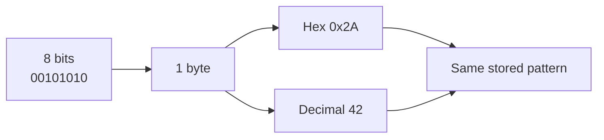

### Worked example 1: count bits and bytes

A payload of 4,096 bytes contains:

$$
4{,}096\ \text{bytes}\times8\ \frac{\text{bits}}{\text{byte}}=32{,}768\ \text{bits}
$$

This does **not** mean the device performs 32,768 separate operations. A transfer normally groups many bytes into one input/output request, which is defined later.

### Common misconception

`b` and `B` are not interchangeable in careful notation. Lowercase `b` commonly means bits; uppercase `B` means bytes. A network rate of 8 gigabits per second is not 8 gigabytes per second. Ignoring overhead, $8\ \text{bits}=1\ \text{byte}$, so 8 gigabits per second is approximately 1 gigabyte per second.

---

## 2. Capacity units: SI versus IEC

A unit is a shared rule for measuring an amount. Storage discussions use two similar-looking families that produce different numbers.

### Plain-English deep-dive: decimal and binary capacity labels

| Term | Plain meaning | Exact byte count | Analogy | Memory hook |
|---|---|---:|---|---|
| **SI unit** | A decimal unit based on powers of 1,000 under the International System of Units. | `1 kB = 1,000 B`; `1 MB = 1,000,000 B`; `1 GB = 1,000,000,000 B`; `1 TB = 1,000,000,000,000 B` | Packing boxes in groups of 1,000. | **SI = tens and thousands.** |
| **IEC unit** | A binary unit based on powers of 1,024, named with binary prefixes standardized by the International Electrotechnical Commission. | `1 KiB = 1,024 B`; `1 MiB = 1,048,576 B`; `1 GiB = 1,073,741,824 B`; `1 TiB = 1,099,511,627,776 B` | Packing boxes by repeatedly doubling until a group reaches 1,024. | **IEC has the extra i.** |

In this Part, `KB`, `MB`, `GB`, and `TB` mean decimal SI units; `KiB`, `MiB`, `GiB`, and `TiB` mean binary IEC units. Real tools sometimes label binary values as `KB`, `MB`, or `GB`, so always verify the tool's definition instead of trusting the letters alone.

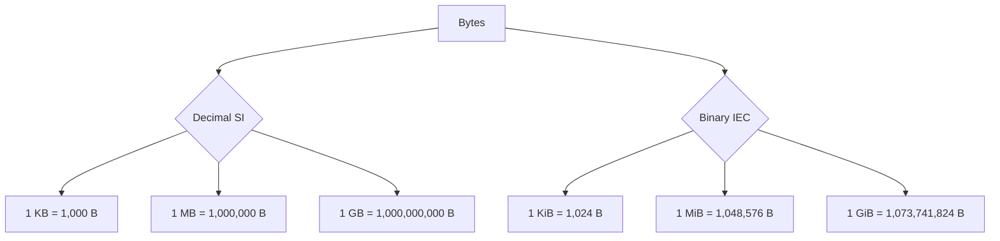

### Worked example 2: why a 1 TB value can appear as about 0.91 TiB

$$
1\ \text{TB}=1{,}000{,}000{,}000{,}000\ \text{bytes}
$$

$$
\frac{1{,}000{,}000{,}000{,}000}{1{,}099{,}511{,}627{,}776}
\approx0.9095\ \text{TiB}
$$

No bytes disappeared in that conversion. The measuring unit changed.

Conversely:

$$
1\ \text{TiB}=1.0995\ \text{TB}\ \text{approximately}
$$

### Worked example 3: do not mix capacity and rate

Suppose a synthetic transfer contains 500 GB and the measured payload rate is 2 Gbit/s. Ignoring protocol overhead and rate variation:

$$
2\ \text{Gbit/s}\div8=0.25\ \text{GB/s}
$$

$$
500\ \text{GB}\div0.25\ \text{GB/s}=2{,}000\ \text{s}\approx33.3\ \text{minutes}
$$

This is an ideal payload calculation, not a delivery promise. Protocol overhead, retries, latency, queueing, source and destination limits, encryption, and application behavior can increase elapsed time.

### Unit-conversion traps

| Trap | Why it fails | Better practice |
|---|---|---|
| Comparing TB from one report with TiB from another | The unit sizes differ | Convert both to bytes, then use one declared unit |
| Treating bits per second as bytes per second | Eightfold error before overhead | Write `bit/s` or `B/s` explicitly |
| Assuming a tool's `GB` label is decimal | Some tools use the label loosely | Check documentation or calculate from raw bytes |
| Rounding every stage | Errors accumulate | Keep raw bytes and round only the presented result |
| Comparing logical and physically consumed bytes | Allocation and efficiency layers differ | Name scope: logical, allocated, used, transferred, or physical |
| Treating advertised capacity as immediately usable | Formatting, protection, metadata, reserves, and policy consume space | Reconcile each capacity layer explicitly |

---

## 3. From physical media to application-visible data

**Physical media** is the material or electronic technology that retains data, such as magnetic surfaces or flash cells. Media behavior is the subject of Part 5. This Part focuses on the abstractions placed above it.

### Plain-English deep-dive: sectors, blocks, pages, extents, and addresses

| Term | Plain meaning | Analogy | Why it matters and memory hook |
|---|---|---|---|
| **Sector** | A fixed-size unit through which a block device exposes addressable storage. | One numbered tile on a warehouse floor. | Requests ultimately map to device-addressable units. **Hook:** Sector = device-facing tile. |
| **Logical sector** | The sector size and address unit presented to software. | The size of each tile shown on the warehouse map. | Software calculates addresses and request boundaries using this exposed size. **Hook:** Logical = what software sees. |
| **Physical sector** | The underlying media write unit reported by a device at this interface; it can be larger than the logical sector. | Several small map tiles painted on one large physical slab. | A request aligned to logical sectors may still cross a physical boundary. **Hook:** Physical = what the device changes together. |
| **Block** | A fixed-size range of bytes handled as a unit in a particular layer. The size and owner depend on context. | A crate whose size is chosen by the warehouse process using it. | A device block, file-system block, and application block need not be equal. **Hook:** Always ask, whose block and what size? |
| **Page** | A fixed-size unit used by memory managers, databases, or some storage systems to read, write, cache, or organize data. | One standard worksheet used by a department. | The word is context-dependent; an 8 KiB database page can sit over 4 KiB file-system units. **Hook:** Page = layer-specific work sheet. |
| **Extent** | A record describing a contiguous run of allocated blocks. | A reservation saying shelves 200 through 239 belong together. | Extents reduce mapping records and can preserve sequential layout. **Hook:** Extent = one continuous run. |
| **Address** | A number or name used to locate data in an address space. | A street address identifies where to look. | Every layer has its own address form: byte offset, block number, path, key, or identifier. **Hook:** Address only makes sense in its map. |
| **Logical block address (LBA)** | A number identifying a logical block on a block device. | Tile number 256 on the presented warehouse map. | An LBA is not a byte count until the logical block size is known. **Hook:** LBA = numbered logical tile. |

The same word can refer to different units. Record the owner and size, for example: `device logical sector = 512 B`, `file-system allocation unit = 4 KiB`, `database page = 8 KiB`.

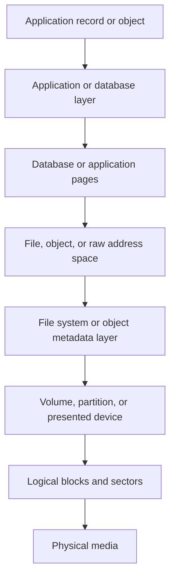

### Who owns metadata at each layer?

**Metadata** means data that describes, locates, protects, interprets, or manages other data. **Analogy:** A parcel's contents are data; its address label, owner, weight, tracking history, and handling instructions are metadata. **Why it matters:** A payload can still be unusable if the metadata needed to find or interpret it is missing or inconsistent. **Hook:** Metadata tells what, where, whose, and how.

| Layer | Example payload | Example metadata owner | Metadata examples | What an adjacent layer may not know |
|---|---|---|---|---|
| Application | Customer order | Application | Record schema, status, relationships, business timestamps | Storage does not know whether an order is valid business data |
| Database | Rows and indexes | Database engine | Tables, indexes, transaction state, page maps, logs | File system normally does not understand row consistency |
| File system | File contents | File system | Names, directories, ownership, permissions, times, block maps | Device does not know which sectors belong to `report.docx` |
| Object service | Object bytes | Object service | Key, bucket membership, attributes, policy, checks | Underlying media does not understand the application key |
| Volume or virtualization layer | Presented address space | Volume manager, hypervisor, or storage system | Mappings, allocation state, policy, snapshots, ownership | Host may not know exact physical placement |
| Block device | Logical blocks | Device or storage controller | LBA mapping, error state, device identity | It normally does not know file names or database rows |
| Physical media | Encoded bits | Device firmware and media structures | Error-correction and physical placement information | Higher layers may see only a logical address and status |

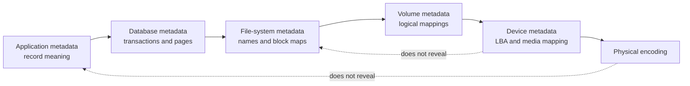

### Responsibility rule

The lower layer stores patterns and reports behavior within its interface. The upper layer decides what those patterns mean. A successful block write does not by itself prove a valid database transaction; a valid file-system structure does not prove the application record is correct.

---

## 4. Addressing and offset math

An **offset** is a distance from the beginning of an address space. **Analogy:** An offset of 20 seats means count 20 positions from row start. **Why it matters:** Software converts byte locations into the numbered units exposed by lower layers.

For logical block size $S$ and zero-based LBA $L$:

$$
\text{byte offset}=L\times S
$$

For byte offset $O$:

$$
L=\left\lfloor\frac{O}{S}\right\rfloor
$$

$$
\text{offset within logical block}=O\bmod S
$$

The floor symbols mean discard the fractional part; `mod` means the remainder.

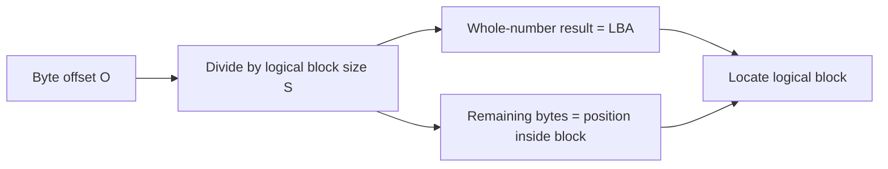

### Worked example 4: aligned offset

Given $S=4{,}096$ bytes and $O=1{,}048{,}576$ bytes:

$$
L=\frac{1{,}048{,}576}{4{,}096}=256
$$

$$
O\bmod S=0
$$

The byte begins at LBA 256 and exactly on a 4 KiB boundary.

### Worked example 5: offset inside a block

Given $S=4{,}096$ bytes and $O=1{,}050{,}000$ bytes:

$$
L=\left\lfloor\frac{1{,}050{,}000}{4{,}096}\right\rfloor=256
$$

$$
1{,}050{,}000\bmod4{,}096=1{,}424
$$

The byte is 1,424 bytes into LBA 256.

### Worked example 6: why an LBA needs a block size

LBA 1,000,000 represents different byte offsets under different logical block sizes:

$$
1{,}000{,}000\times512=512{,}000{,}000\ \text{bytes}
$$

$$
1{,}000{,}000\times4{,}096=4{,}096{,}000{,}000\ \text{bytes}
$$

Therefore, `LBA 1,000,000` without device identity and logical block size is incomplete evidence.

### Byte-range calculation

A request starting at offset $O$ with length $N$ covers bytes $O$ through $O+N-1$. The first and last logical blocks are:

$$
L_{first}=\left\lfloor\frac{O}{S}\right\rfloor
$$

$$
L_{last}=\left\lfloor\frac{O+N-1}{S}\right\rfloor
$$

The number of touched logical blocks is:

$$
L_{last}-L_{first}+1
$$

### Worked example 7: one small request touches two blocks

A 1,024-byte request begins at byte offset 3,584 on a 4,096-byte block layout:

$$
L_{first}=\left\lfloor\frac{3{,}584}{4{,}096}\right\rfloor=0
$$

$$
L_{last}=\left\lfloor\frac{3{,}584+1{,}024-1}{4{,}096}\right\rfloor=1
$$

One 1 KiB request crosses the boundary and touches two 4 KiB blocks. Request size alone therefore does not determine how many lower-layer units are involved.

---

## 5. Allocation, alignment, slack, free space, and fragmentation

**Allocation** is the act of reserving storage units for data or metadata. **Analogy:** A hotel assigns rooms to guests even if every bed or shelf is not used. **Why it matters:** Logical content length and consumed capacity can differ.

**Free space** is capacity that the relevant layer currently considers available for allocation. **Analogy:** A room can be free in the hotel's booking system even though a building owner tracks the whole floor differently. **Why it matters:** Free at one layer does not prove free at another.

**Alignment** means starting and sizing data on boundaries that match a relevant lower-layer unit. **Analogy:** Boxes fit efficiently when their edges line up with shelf divisions. **Why it matters:** Misalignment can make one upper-layer operation touch extra lower-layer units.

**Slack** is allocated capacity inside the last allocation unit that is not occupied by the file's logical content. **Analogy:** A small item reserves a full locker and leaves unused space inside. **Why it matters:** Many small allocations can consume more capacity than their payload totals suggest.

**Fragmentation** means one logical item is represented by separated extents rather than a convenient continuous run. **Analogy:** One book collection is scattered across shelves in several rooms. **Why it matters:** It can increase mapping work or reduce sequential efficiency, although impact depends on media, caching, and implementation.

### Plain-English deep-dive: allocation is layered accounting

| View | What it may call used | What it may call free | Important limitation |
|---|---|---|---|
| Application | Meaningful records or object payloads | Unused application capacity | May not see deleted-but-retained data or lower-layer overhead |
| File system | Allocated data and metadata units | Units available in that file system | Does not necessarily know physical consumption |
| Guest VM | Blocks in the guest's virtual disk | Guest file-system free space | Hypervisor may still hold backing allocations |
| Hypervisor | Backing storage assigned to virtual disks | Datastore capacity | Guest deletion may need a reclaim path before lower layers learn it |
| Storage system | Logical or physical allocations under its policies | Capacity available within its accounting scope | Efficiency, snapshots, reserves, and protection can change interpretation |
| Physical media | Encoded physical capacity | Device-managed availability | Firmware can abstract internal placement from every upper layer |

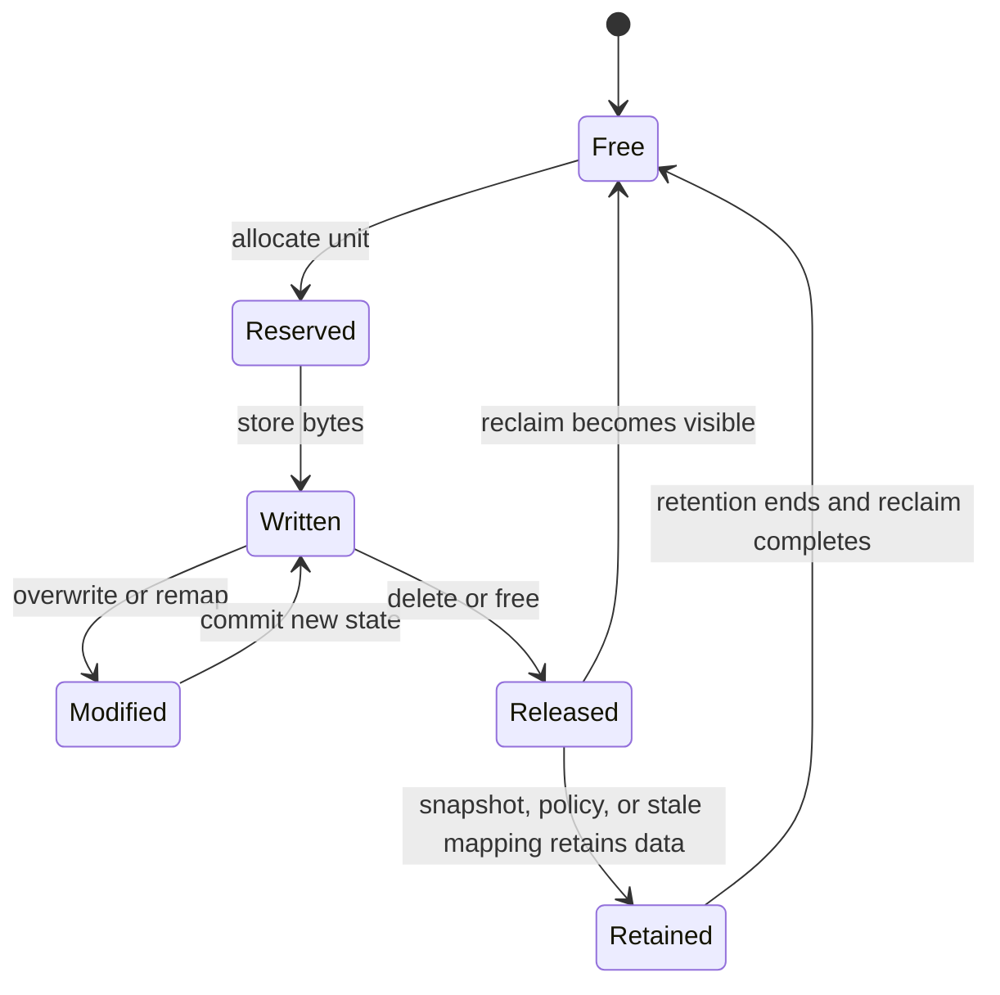

The state diagram is conceptual. Real implementations differ, and deletion may remove a name before lower layers can reuse physical space.

### Worked example 8: slack for small files

Assume, only for this calculation, a file system allocates at least one 4 KiB unit per non-empty file and does not pack small contents into metadata. A 1 KiB file has:

$$
4\ \text{KiB allocated}-1\ \text{KiB content}=3\ \text{KiB slack}
$$

For 1,000,000 such files:

$$
1{,}000{,}000\times1{,}024=1{,}024{,}000{,}000\ \text{payload bytes}\approx0.954\ \text{GiB}
$$

$$
1{,}000{,}000\times4{,}096=4{,}096{,}000{,}000\ \text{allocated bytes}\approx3.815\ \text{GiB}
$$

That result excludes directory and other metadata. It is **not universal**: inline data, tail packing, compression, and other designs can change consumption. The calculation teaches which implementation facts to ask for.

### 4 KiB native and 512-byte emulation orientation

**4 KiB native**, often shortened to **4Kn**, means the device exposes 4,096-byte logical sectors and uses 4,096-byte physical sectors at this interface. **512-byte emulation**, often shortened to **512e**, means the device exposes 512-byte logical sectors while reporting 4,096-byte physical sectors.

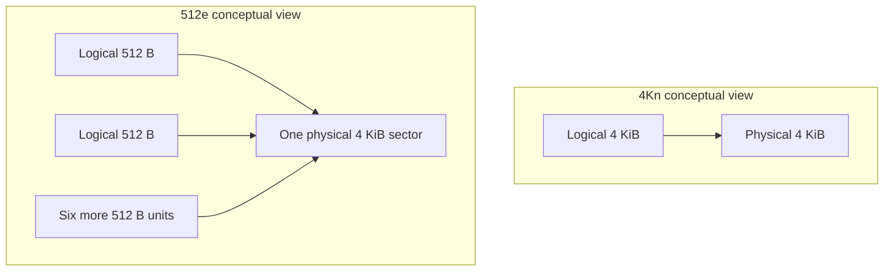

On a 512e device, a partial or misaligned change can require the device or another layer to preserve unaffected bytes in the physical sector, conceptually a read-modify-write cycle. Whether that becomes visible as a material performance issue depends on the complete stack and workload. Do not diagnose misalignment from a sector label alone.

For alignment unit $A$, a simple boundary check is:

$$
O\bmod A=0
$$

For both start and length to align:

$$
O\bmod A=0\quad\text{and}\quad N\bmod A=0
$$

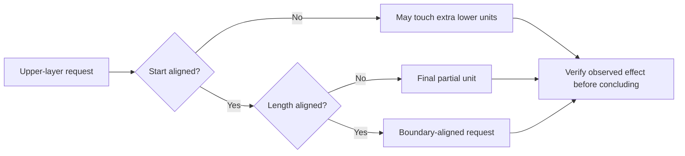

### Sparse files and thin provisioning

A **sparse file** is a file whose logical address space contains unwritten regions, called holes, that do not require ordinary data blocks until written. **Analogy:** A 1,000-page binder's index reserves page numbers, but only 20 pages contain paper. **Why it matters:** Apparent file length can greatly exceed allocated file-system space.

**Thin provisioning** is a capacity-allocation approach in which a presented logical container can be larger than the physical capacity currently committed to it, with physical capacity assigned as data is written according to platform policy. **Analogy:** A hotel accepts bookings across future dates without dedicating one physical room forever to each possible reservation. **Why it matters:** It improves utilization but creates an exhaustion risk if promised logical capacity grows faster than available physical capacity.

These are related ideas at different layers. A sparse file is a file-system concept; thin provisioning can exist in a virtual disk, volume, LUN backing store, or storage system.

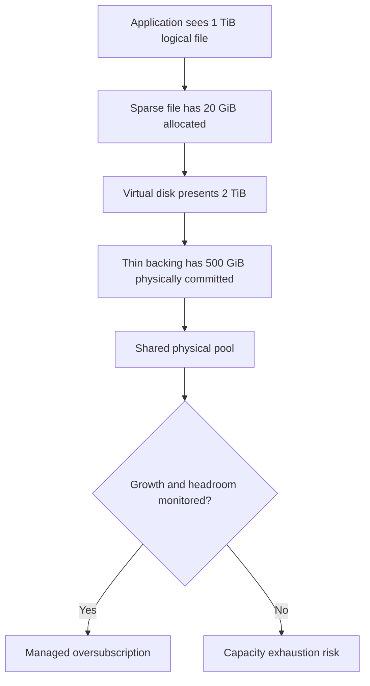

Do not add percentages from these layers as if they were one efficiency measure. Reconcile logical length, allocated blocks, backing allocation, retained data, and physical consumption separately.

---

## 6. Containers and organization: partition, volume, file system, and raw device

A **partition** is a defined range of a block device recorded as a separate logical region. **Analogy:** Survey lines divide one plot of land into lots. **Why it matters:** It establishes boundaries and starting offsets for higher-layer use.

A **volume** is a logical storage container or address space managed under a particular layer's rules. **Analogy:** A managed room inside a building. **Why it matters:** The word can mean a host volume, storage-system volume, or cloud-service volume; always name the owner and context.

A **file system** is software and on-storage structures that organize byte content into files and directories, track allocation, and manage associated metadata. **Analogy:** It turns numbered shelves into a library with named books, catalog records, and rules. **Why it matters:** It owns file names and maps them to lower-layer storage.

A **raw device** is a block address space used directly by software without an ordinary mounted file system in between. **Analogy:** A specialist operates directly on numbered warehouse shelves instead of using the public library catalog. **Why it matters:** The application or volume manager takes more responsibility for layout and consistency.

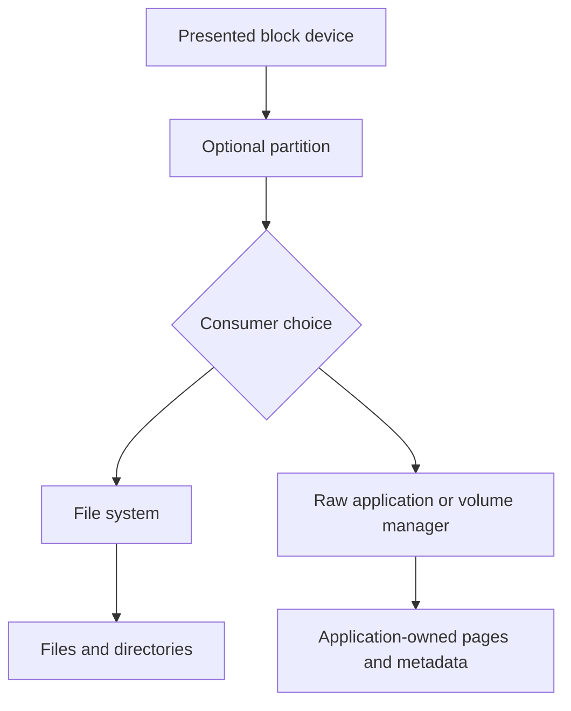

### A layered example

One physical device can contribute to a storage pool. A storage system can expose a logical device. A host can partition it. A volume manager can combine it. A file system can format the resulting address space. A database can create files whose contents contain database pages. Each layer introduces its own identity, size, metadata, failure behavior, and telemetry.

### Free space is not transitive

If a guest file system says 40 percent free, that does not prove its virtual disk backing has released physical capacity. If a storage pool says 30 percent free, that does not prove a particular application has enough quota, file-system space, metadata space, snapshot headroom, or growth runway. Ask: **free where, measured how, as of when, and available under which policy?**

---

## 7. Files, directories, paths, and file records

A **file** is a named sequence of bytes managed by a file system, together with associated metadata. **Analogy:** A document has content plus catalog information. **Why it matters:** Users and applications usually refer to the name, while the file system maps that name to storage.

A **directory** is a file-system structure that maps names to files or other directories. **Analogy:** A folder or library catalog groups and locates documents. **Why it matters:** Listing or creating a file can be metadata-heavy even when little payload moves.

A **path** is a sequence of names used to locate an item through a namespace, such as `/finance/2026/budget.csv`. **Analogy:** Country, city, street, and house number form a route through named containers. **Why it matters:** Path resolution can involve many lookups and permission checks.

An **inode/file record concept** is a file-system-owned record that stores identity and metadata plus references to content locations. Unix-like systems commonly use the word **inode**; other systems use different record structures, such as file records. **Analogy:** A library catalog card identifies a book and points to its shelf locations; the title in a directory is an entry that points to the record. **Why it matters:** A file name, metadata record, and content blocks are related but distinct structures.

A **namespace** is the organized set of names and rules by which resources are located. **Analogy:** A city map provides one naming system for districts, streets, and addresses. **Why it matters:** Two clients can see different paths or permissions even when data ultimately resides on the same storage.

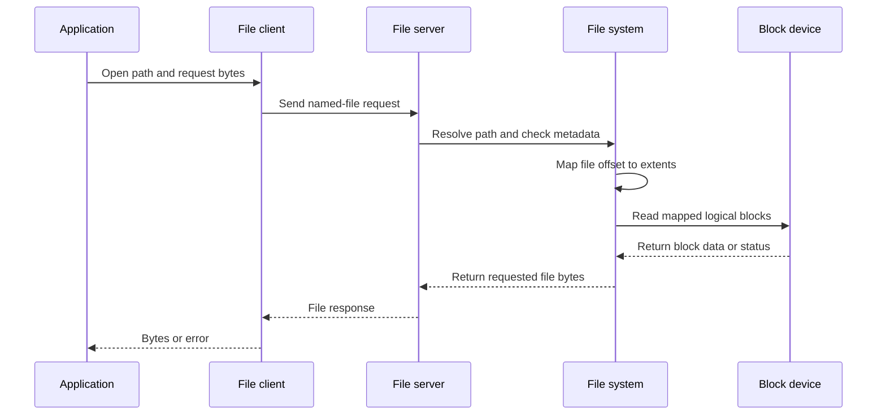

### What the file layer owns

The file service and file system can own or enforce naming, directory relationships, file permissions, locking, file offsets, allocation, and file metadata. The lower block device normally sees reads and writes to numbered addresses, not `budget.csv`.

### The small-file problem

The **small-file problem** is the disproportionate work and capacity overhead caused by very many small files. Each file can require path lookup, permission checks, directory updates, a file record, allocation tracking, timestamps, open/close operations, and backup or scan enumeration. Payload bytes may be modest while metadata operations dominate.

| One large file | Many small files with same payload total |
|---|---|
| Few opens and closes | Potentially millions of opens and closes |
| Few directory entries | Many directory and file records |
| Large efficient transfers possible | Small transfers and metadata operations common |
| Easy sequential prefetch opportunity | Locality may be weak or unpredictable |
| Fewer objects to scan | Backup, antivirus, indexing, and listing can enumerate many names |

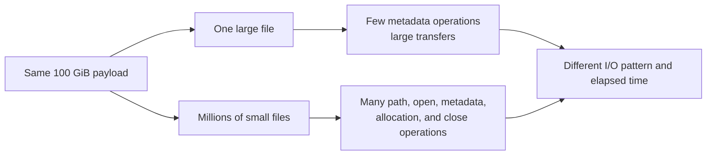

The phrase describes a workload pattern, not proof of a specific bottleneck. Measure directory operations, request sizes, cache behavior, concurrency, media behavior, and protection workflows before recommending change.

---

## 8. Objects, keys, buckets, and object metadata

An **object** is a stored payload managed as a unit together with an identifier and metadata, normally accessed through an application programming interface rather than ordinary disk offsets. **Analogy:** A parcel is retrieved by tracking identity and carries a label describing it. **Why it matters:** The consumer addresses the object, not a host-visible sector.

A **key** is the identifier used by an application to name or retrieve an object within an object namespace. **Analogy:** A tracking number or catalog code. **Why it matters:** Key design affects organization, distribution, listing, and application behavior.

A **bucket** is a named administrative container for objects, policies, or namespace scope in many object systems. **Analogy:** A governed warehouse zone containing parcels under shared rules. **Why it matters:** Access, lifecycle, location, and policy are often applied at bucket scope, but exact semantics are implementation-specific.

**Object metadata** is descriptive information associated with an object, such as content type, owner-defined attributes, timestamps, checks, or policy information. **Analogy:** Handling and ownership labels attached to the parcel. **Why it matters:** Applications can find, validate, govern, or interpret objects without parsing all payload bytes.

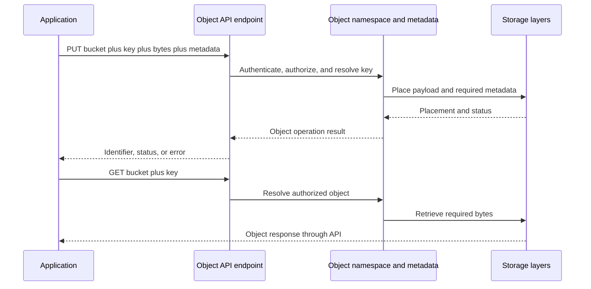

An object key can look like a path, for example `reports/2026/q3.csv`, but that visual form does not prove that traditional directories exist underneath. The object service defines key and listing semantics.

### Object orientation for cloud applications

Cloud applications often use object APIs for documents, images, logs, backups, analytical data, or application artifacts. Design questions include object sizes, operation rates, key distribution, listing patterns, overwrite behavior, access policy, retention, checks, network path, consistency requirements, durability design, and data-movement cost. Exact API and service guarantees must be verified for the selected service.

---

## 9. Block storage, LUNs, shares, exports, clients, and targets

A **logical unit number (LUN)** is, at orientation level, an identifier for a logical unit presented by a block-storage target; people often use `LUN` informally for the presented block device itself. **Analogy:** An authorized tenant is shown a numbered private shelf range. **Why it matters:** The host normally owns the partitions, file system, or application structures placed on that presented space.

A **share** is a named file-service access point, commonly associated with Server Message Block environments. An **export** is a file-service access policy or presentation concept commonly associated with Network File System environments. **Analogy:** Both are governed doors through which clients reach named files. **Why it matters:** A share or export presents file semantics, not a raw host-owned block device.

A **client** is a component that requests a service, and a **server** is a component that provides and responds to that service. **Analogy:** A diner asks; the kitchen serves. **Why it matters:** File access is commonly described with client/server ownership.

An **initiator** is the endpoint that starts block-storage requests, and a **target** is the endpoint that receives those requests and presents authorized logical units. **Analogy:** A warehouse worker requests numbered shelf operations from the warehouse system. **Why it matters:** Block access is commonly described with initiator/target ownership.

### Block request flow

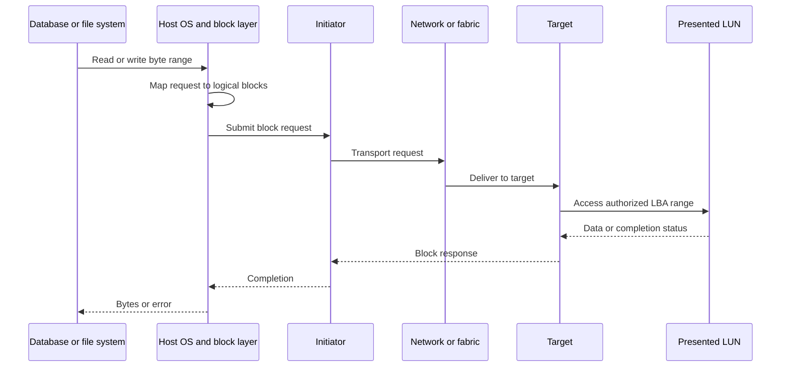

### File request flow

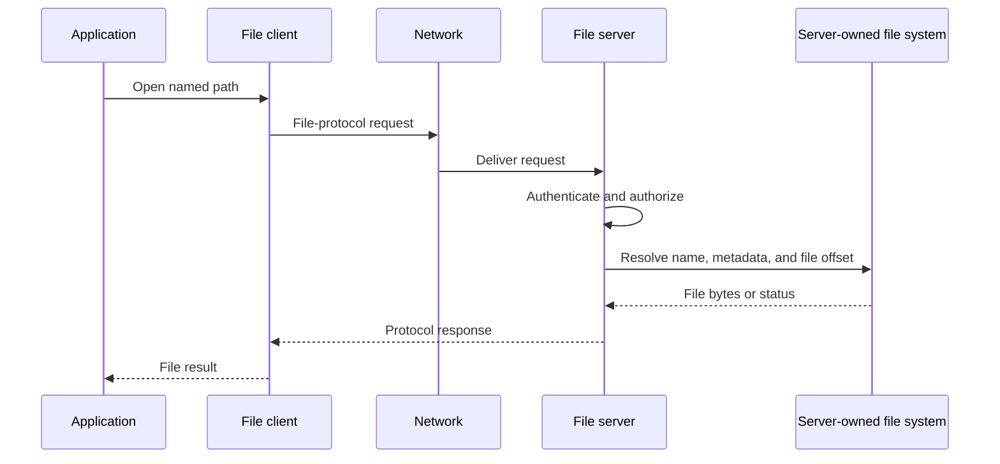

### File versus block versus object responsibility boundaries

| Question | File service | Block service | Object service |
|---|---|---|---|
| What caller names | Path and file | Logical block range on a presented device | Bucket and key or object identifier |
| Requesting role | Client | Initiator | API client |
| Serving role | File server | Target | Object endpoint/service |
| Who normally owns user-visible names | File server/file system | Host file system or application | Object service and application |
| Who normally owns file locking | File layer | Host/application above block | Not ordinary file locking; API semantics vary |
| Typical host view | Shared directory tree | Disk-like address space | Remote API resource |
| Lower service understands application record meaning? | Usually no | Usually no | Usually no |
| Central design question | Namespace, identity, metadata operations, sharing | Host support, paths, alignment, queueing, ownership | API semantics, key pattern, object operations, policy |

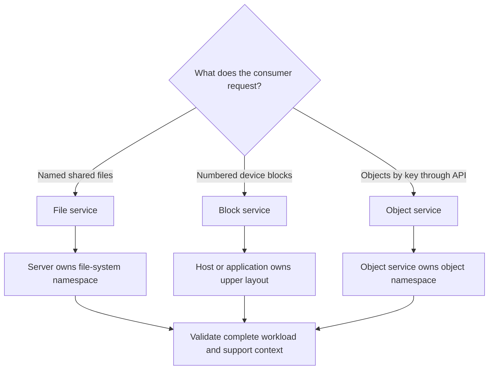

This is not a ranking. File, block, and object are access models. Any can be a good fit when application requirements, supportability, operations, protection, performance, governance, and cost align.

---

## 10. Reads, writes, I/O size, access pattern, and working set

**Input/output (I/O)** is data movement or an operation between a consumer and another component.

A **read** requests existing data. **Analogy:** Retrieve a book from a shelf. **Why it matters:** Reads can be served from an upper-layer cache or require lower-layer access.

A **write** requests that data be created or changed. **Analogy:** Replace or add pages in a record. **Why it matters:** Acknowledgement, buffering, ordering, protection, and durable placement can involve several stages.

**I/O size** is the amount of payload requested in one I/O operation. **Analogy:** One delivery can carry one envelope or a full pallet. **Why it matters:** The same total bytes can become many small operations or fewer large operations.

**Sequential access** requests neighboring addresses in order. **Analogy:** Read a book from page 1 onward. **Why it matters:** Layers may combine, prefetch, and stream efficiently.

**Random access** requests addresses with little predictable adjacency. **Analogy:** Repeatedly jump between unrelated dictionary pages. **Why it matters:** It reduces some locality opportunities and can increase operation rate for the same transferred bytes.

A **working set** is the subset of data actively accessed during a relevant time window. **Analogy:** A cook owns a large pantry but keeps today's ingredients on the counter. **Why it matters:** Active data, not total capacity alone, shapes cache and performance needs.

**Hot data** is accessed frequently or recently; **cold data** is accessed infrequently. **Analogy:** Popular books stay near the desk; archive boxes remain in storage. **Why it matters:** Placement and policy decisions should use measured access and business constraints, not labels alone.

**Locality** is the tendency for accesses to cluster near one another in address or time. **Analogy:** A shopper collects several items from one aisle before moving on. **Why it matters:** Locality can improve cache usefulness, prefetching, and transfer efficiency.

### Plain-English deep-dive: same bytes, different work

For total payload $D$ and average I/O size $I$, a simplified operation count is:

$$
\text{I/O operations}=\frac{D}{I}
$$

For 1 GiB transferred as 4 KiB operations:

$$
\frac{1\ \text{GiB}}{4\ \text{KiB}}=\frac{2^{30}}{2^{12}}=2^{18}=262{,}144\ \text{operations}
$$

For the same 1 GiB transferred as 1 MiB operations:

$$
\frac{1\ \text{GiB}}{1\ \text{MiB}}=\frac{2^{30}}{2^{20}}=2^{10}=1{,}024\ \text{operations}
$$

The byte total is identical, but the request count differs by a factor of 256. This does not predict performance by itself; concurrency, latency, queueing, cache, protocol, media, CPU, metadata, and implementation still matter.

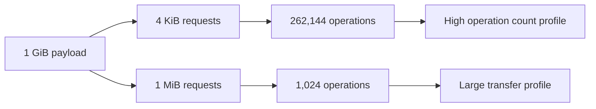

### Application-to-storage translation

One application action can expand into several lower-layer operations. Saving a document may create a temporary file, write content, update metadata, flush selected state, rename the file, update a directory, and trigger synchronization or indexing. One database transaction may update data pages, index pages, and a transaction log. One object upload may involve authentication, metadata, checks, multipart handling, and protection work.

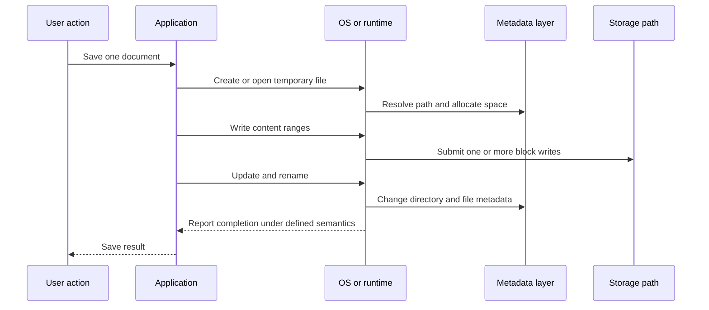

The diagram shows possible stages, not a universal save algorithm. Capture actual traces and documentation for the application and file system before asserting an exact sequence.

### Workload fingerprint

A **workload fingerprint** is a measured description of how a workload behaves over time. **Analogy:** A person's name identifies them, while pulse, pace, route, and schedule describe what their day actually looks like. **Why it matters:** `database`, `file server`, or `backup` is not enough information for a recommendation.

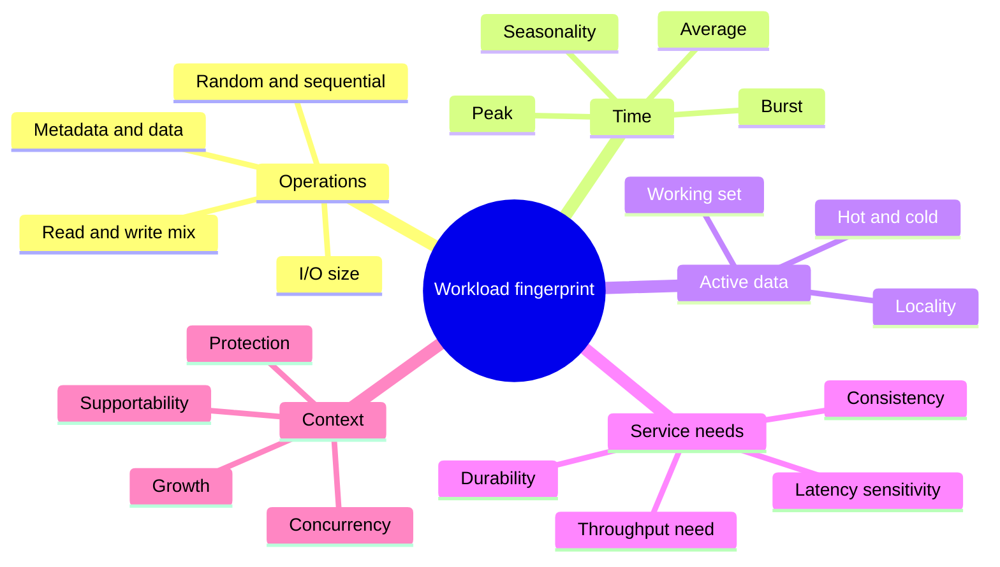

If a Markdown renderer does not support `mindmap`, redraw the same branches as a flowchart; the required reasoning categories remain unchanged.

---

## 11. Four important workload shapes

### 11.1 Many small files

Typical signals include high create/open/close/stat/list rates, deep or wide directories, modest payload per operation, namespace scans, permission checks, and long backup or indexing enumeration. Capacity calculations must include allocation and metadata, not payload alone.

**Risk:** A recommendation based only on throughput can miss metadata latency, namespace scale, operational scan time, or file-count limits.

**Recommendation implication:** Collect file-count distribution, size percentiles, directory shape, operation mix, concurrency, working set, growth, backup behavior, permissions, and application support requirements. Test with representative namespace and metadata operations.

### 11.2 One large sequential stream

A **large sequential stream** moves neighboring ranges in order, often with relatively large I/O sizes. Examples can include media ingest, imaging, bulk export, or backup data movement.

**Risk:** A design can meet operation-rate needs but fail required sustained throughput, network bandwidth, destination capacity, or retention growth.

**Recommendation implication:** Measure sustained and peak bytes per second, stream count, I/O size, read/write direction, duration, compression state, protocol overhead, source/destination limits, and growth. Validate end to end, not only at storage.


### Worked example 9: daily stream capacity

A synthetic camera-ingest process writes 180 MiB/s for 12 hours each day:

$$
180\ \frac{\text{MiB}}{\text{s}}\times43{,}200\ \text{s}=7{,}776{,}000\ \text{MiB}
$$

$$
\frac{7{,}776{,}000}{1{,}048{,}576}\approx7.416\ \text{TiB/day}
$$

For 30 days before protection copies, metadata, headroom, or reduction:

$$
7.416\times30\approx222.5\ \text{TiB}
$$

This makes retention policy and growth as important as instantaneous throughput.

### 11.3 Database page workload

A database commonly organizes records into fixed-size **database pages** and uses a transaction log or equivalent mechanism to preserve ordering and recovery information. Exact designs differ by database.

```mermaid
sequenceDiagram
    participant APP as Business application
    participant DB as Database engine
    participant CACHE as Database cache
    participant LOG as Transaction log path
    participant DATA as Data-file path
    APP->>DB: Commit business transaction
    DB->>CACHE: Change records in database pages
    DB->>LOG: Write required recovery record
    LOG-->>DB: Completion under configured semantics
    DB-->>APP: Commit result
    DB->>DATA: Later write changed data pages
```

This generic diagram illustrates why transaction-log and data-page paths can have different patterns. It does not define any database's exact commit rules.

Suppose an 8 KiB database page maps to 4 KiB file-system units. A full-page write contains:

$$
\frac{8\ \text{KiB}}{4\ \text{KiB}}=2\ \text{file-system units}
$$

That is only a payload mapping. File-system metadata, copy-on-write behavior, checks, snapshots, caching, protection, and device geometry may cause additional work. Do not multiply by two and call it physical writes without evidence.

**Risk:** Average throughput can look low while small random operations and commit-sensitive writes experience unacceptable latency.

**Recommendation implication:** Gather database page and log behavior, read/write mix, average and percentile latency, concurrency, cache hit context, flush semantics, support matrix, recovery objectives, and representative peaks. Coordinate with the database owner.

### 11.4 Virtual machine disk layering

A **virtual machine (VM)** is a software-defined computer. Its virtual disk is a logical file or mapping presented by a **hypervisor**, the software layer that runs VMs on physical hosts. A guest operating system can place partitions, volumes, a file system, and application files inside that virtual disk.

```mermaid
flowchart TB
    APP[Application in VM] --> GFS[Guest file system]
    GFS --> GVD[Guest virtual disk blocks]
    GVD --> HYP[Hypervisor mapping]
    HYP --> DATASTORE[Datastore or presented storage]
    DATASTORE --> STORAGE[Storage-system logical blocks]
    STORAGE --> MEDIA[Physical media]
    SNAP[Snapshots or clones at one or more layers] -.may retain mappings.-> GVD
    SNAP -.may retain mappings.-> DATASTORE
```

The guest, hypervisor, and storage system can each report different allocation and latency views. A guest delete does not automatically prove immediate physical reclaim. A VM-level snapshot and a storage-level snapshot are different control points and can have different consistency scope.

**Risk:** Treating VM guest telemetry as physical truth can hide backing contention, stale mappings, snapshot retention, path issues, or shared failure domains.

**Recommendation implication:** Map VM -> host -> virtual disk -> datastore/presented device -> paths -> storage container -> protection. Correlate timestamps and stable identities across layers.

### Container and cloud-object orientation

A **container** packages an application process and dependencies while sharing the host operating-system kernel. Containers are often replaceable, but persistent application data still needs a storage service. In an orchestrated environment, a storage interface can dynamically connect persistent storage to a container workload. Exact Kubernetes and NetApp integration is deferred to Part 88.

```mermaid
flowchart LR
    USER[User request] --> CONTAINER[Containerized application]
    CONTAINER --> CHOICE{Persistence model}
    CHOICE --> FILE[Shared file service]
    CHOICE --> BLOCK[Presented block volume]
    CHOICE --> OBJECT[Cloud or object API]
    FILE --> POLICY[Identity, protection, capacity, and performance]
    BLOCK --> POLICY
    OBJECT --> POLICY
    ORCH[Orchestrator control plane] -.coordinates attachment or endpoint use.-> CHOICE
```

Container restart does not repair missing or inconsistent persistent data. Object-service availability does not prove that a container can authenticate, resolve the endpoint, reach the network path, or use the expected API semantics.

---

## 12. Durability, consistency, checksums, compression, and deduplication

**Durability** is the degree to which data that has been accepted under defined conditions continues to survive specified failures or time. **Analogy:** A signed record remains preserved after a cabinet or building problem according to the protection design. **Why it matters:** A successful response must be interpreted against the exact persistence and failure guarantees.

**Consistency** describes whether related data and metadata obey the rules required to present a valid state. **Analogy:** A ledger can survive physically but still be invalid if one side of a transfer changed and the other did not. **Why it matters:** Surviving bytes are not enough if relationships or write ordering are wrong.

Durability and consistency are different:

| Situation | Durable? | Consistent? | Explanation |
|---|---|---|---|
| Both sides of a valid transaction survive | Yes under the named failure scope | Yes under application rules | Desired outcome |
| Corrupted state is replicated and preserved | Possibly | No | Durable storage can preserve bad data |
| Latest valid update is lost but older state is coherent | No for the latest accepted update | Possibly | State may be valid but stale |
| Data bytes survive but mapping metadata is unusable | Bytes may survive physically | No usable structure | Recovery depends on metadata and copies |

A **checksum** is a computed value derived from data and later recomputed to detect whether the data changed unexpectedly. **Analogy:** A tamper-evident tally travels with a shipment; a different tally signals that something changed. **Why it matters:** Checksums can detect classes of corruption, but the exact algorithm, coverage, storage location, correction path, and failure handling determine protection. A matching checksum does not prove business correctness or protect against every malicious alteration.

```mermaid
flowchart LR
    ORIGINAL[Original bytes] --> CALC1[Compute checksum]
    CALC1 --> STORE[Store data and protected check information]
    STORE --> READ[Read bytes later]
    READ --> CALC2[Recompute checksum]
    CALC2 --> COMPARE{Values match?}
    COMPARE -->|Yes| INTEGRITY[No covered change detected]
    COMPARE -->|No| ALERT[Detected mismatch]
    INTEGRITY --> LIMIT[Business meaning still needs upper-layer validation]
```

**Compression** represents the same information using fewer bits when patterns permit. **Analogy:** Replace repeated phrases with shorter agreed codes. **Why it matters:** It can reduce physical use and data movement, but savings and processing effects depend on content and implementation.

**Deduplication** avoids storing multiple equivalent chunks or items more than necessary by referencing a shared representation. **Analogy:** A library keeps one master copy and several catalog references instead of identical duplicate binders. **Why it matters:** Savings depend on duplicate patterns, granularity, scope, metadata, and policy.

Compression and deduplication are defined here only for orientation. Their inline/background behavior, savings reporting, interactions, workload effects, guarantees, and NetApp implementation are intentionally deferred to **Part 34 - Storage Efficiency**. Do not use an assumed reduction ratio in a customer capacity recommendation.

### Failure and corruption examples

| Example | Layer where symptom appears | Competing explanations | Evidence needed before conclusion |
|---|---|---|---|
| Application says record is invalid | Application/database | Bad input, software defect, transaction-order issue, stale read, corrupted lower data | Application logs, transaction state, page/check evidence, timestamps, lower errors |
| File exists but cannot be opened | File/client | Permission, lock, path, identity, file metadata, content corruption, client issue | Exact error, identity, path resolution, server logs, file metadata, alternate client test |
| File-system check reports structural damage | File system | Unsafe shutdown, device error, software defect, memory corruption, prior incomplete repair | Check output, event timeline, write/cache semantics, device health, change history |
| Device reports an uncorrectable read | Device/storage | Media failure, path/device issue, stale fault, bad sector mapping | Device identity, LBA, error counters, logs, retries, redundancy/recovery status |
| Object checksum differs after transfer | Application/object/network path | Source changed, wrong object/key/version, transfer corruption, client bug, stored corruption | Source and destination checks, object identity/version, request logs, retries, service checks |
| Capacity suddenly rises after delete | Any allocation layer | Snapshot retention, delayed reclaim, thin mapping, metadata growth, recycle/retention policy | Layered logical/allocated/physical reports, retention state, reclaim telemetry, timestamps |

```mermaid
flowchart TB
    SYM[Corruption or missing-data symptom] --> SCOPE[Scope exact object, file, block range, and time]
    SCOPE --> UPPER[Validate application and database meaning]
    SCOPE --> MID[Validate file/object metadata and namespace]
    SCOPE --> LOWER[Validate volume, path, device, and checksum evidence]
    UPPER --> CORR[Correlate identities and timestamps]
    MID --> CORR
    LOWER --> CORR
    CORR --> HYP[Rank competing hypotheses]
    HYP --> TEST[Choose least-risk discriminating test]
    TEST --> CONCLUDE[State cause only to supported depth]
```

---

## 13. What telemetry at one layer can and cannot prove

**Telemetry** is measured or reported operational data about a system, such as counters, logs, traces, events, capacities, and status. **Analogy:** Vehicle instruments report speed, temperature, and warnings, but do not by themselves explain the driver's destination or every road condition. **Why it matters:** Scope determines what a metric can support.

### Plain-English deep-dive: evidence has a field of view

| Telemetry | Can support | Cannot prove by itself |
|---|---|---|
| Application transaction latency | User-visible timing for measured transactions | Which lower layer caused delay |
| Database page or log latency | Database-observed behavior for that path and window | Physical media cause or all application latency |
| File-client operation timing | Client-observed file request behavior | Server internal cause, device cause, or another client's experience |
| Host block latency | Host-observed completion for block requests | Which target stage consumed time without deeper evidence |
| Network throughput | Bytes observed on measured link/interface | Application demand, storage limit, or end-to-end success |
| Storage volume operations | Work observed in that storage scope | Exact file, VM, user, or business transaction unless mapped |
| Device error at an LBA | A device/path event for a numbered range | File name or business record without upper mappings |
| File-system free space | Allocatable space in that file-system view | Physical pool headroom or reclaim completion |
| Object API success | Operation result under that API's semantics | Independent backup, application validity, or all readers' visibility |
| Checksum match | No change detected within that checksum's coverage | Correct business data, complete application consistency, or authenticity |

```mermaid
sequenceDiagram
    participant APP as Application telemetry
    participant HOST as Host telemetry
    participant NET as Network telemetry
    participant STOR as Storage telemetry
    APP->>APP: Transaction spike at 10:02
    HOST->>HOST: Block latency spike at 10:02
    NET->>NET: Queue or loss signal near 10:02
    STOR->>STOR: Volume workload rise at 10:02
    Note over APP,STOR: Time correlation narrows the investigation
    Note over APP,STOR: Correlation alone does not assign causation
```

### Correlation checklist

1. Align clocks and time zones.
2. Match the same customer, application, host, path, volume, LUN, file, object, or device identity.
3. Compare the same interval and sampling resolution.
4. Check whether averages hide bursts or percentiles.
5. Confirm counter definitions, units, reset behavior, and aggregation scope.
6. Identify changes in demand, cache, path, policy, protection, and background work.
7. Form competing hypotheses and choose evidence that can distinguish them.

### Example: what a healthy storage graph does not prove

A green storage dashboard can show no threshold breach in its measured scope. It cannot alone prove that DNS worked, the client authenticated, the file path resolved, the initiator had usable paths, the application issued requests, the database was internally healthy, or the user's transaction met its objective. It is useful evidence, not an end-to-end verdict.

---

## 14. From application behavior to a storage recommendation

A recommendation should begin with an observed or validated workload and a customer outcome, not a preferred product label.

```mermaid
flowchart LR
    OUTCOME[Business outcome and service target] --> PATH[Application-to-data path]
    PATH --> FINGER[Measured workload fingerprint]
    FINGER --> CONSTRAINT[Support, protection, security, cost, and operations constraints]
    CONSTRAINT --> OPTIONS[Feasible access and design options]
    OPTIONS --> TEST[Representative validation]
    TEST --> REC[Recommendation with owner and evidence]
    REC --> VERIFY[Success criteria and residual risk]
```

### Customer discovery questions

#### Business and application

1. Which business service and user transaction depend on this data?
2. What is the consequence of delay, unavailability, stale data, corruption, or loss?
3. Which application and database versions are in scope, and what storage models do their vendors support?
4. Who owns application consistency, change approval, and recovery validation?

#### Data shape and namespace

5. Is access by shared file path, presented block device, object API, or a mixture?
6. How many files, objects, volumes, LUNs, directories, buckets, and keys exist now?
7. What are size distributions, not just averages?
8. How deep or wide is the namespace, and which listing or scan operations matter?
9. Are sparse files, snapshots, clones, retention, or thin layers present?

#### Workload behavior

10. What are read/write mix, I/O-size distribution, random/sequential mix, concurrency, and metadata-operation rate?
11. What are average, peak, burst duration, seasonality, and growth?
12. What is the working set, and how is hot/cold classification measured?
13. Which operations are latency-sensitive, and which need sustained throughput?
14. What changed before the symptom or planned growth?

#### Layout and alignment

15. What logical and physical sector sizes are reported?
16. What are partition offsets, file-system allocation sizes, database page sizes, and application record sizes?
17. Is any misalignment actually observed, and what evidence shows an effect?
18. Which layer owns allocation and reclaim, and how long does visibility take?

#### Protection and correctness

19. What consistency scope is required: file, database, VM, application group, or object set?
20. What does write acknowledgement mean at each layer?
21. Which checksums or integrity mechanisms cover which path segments?
22. What are the approved recovery point and recovery time objectives, and when were they tested?
23. Can deletion, corruption, or malicious change propagate into protection copies?

#### Operations and evidence

24. Which telemetry is available at application, host, network, protocol, storage, and media layers?
25. Are timestamps, units, identities, and sampling intervals comparable?
26. Which team can observe, change, and authorize each layer?
27. What current supportability, lifecycle, security, and interoperability evidence is required?
28. What maintenance windows, cost limits, data-residency rules, and skills constrain options?

### Storage recommendation implications

| Finding | Technical risk | Recommendation direction | Validation |
|---|---|---|---|
| Millions of small files; metadata dominates | Payload throughput sizing misses namespace work | Evaluate file-service namespace behavior, metadata performance, operational scans, and scale limits | Representative tree, permissions, file counts, create/list/open/close test |
| Sustained large sequential writes | Path or capacity may fail required ingest rate | Size complete source-network-storage-protection path for sustained throughput and retention | Long-duration end-to-end test plus daily capacity reconciliation |
| Small random database pages with commit-sensitive writes | Averages can hide tail latency and ordering needs | Follow database support guidance; validate latency distribution, cache, log/data behavior, alignment, and recovery | Application transaction plus database and lower-layer telemetry |
| Thin layers with weak monitoring | Logical promise can exceed available physical headroom | Map every allocation layer; define thresholds, owners, growth forecast, and emergency action | Simulated threshold and reclaim workflow |
| VM guests report free space but pool grows | Delete/reclaim and snapshots may not cross layers | Reconcile guest, hypervisor, and storage mappings and retention | Dated before/after allocation evidence at every layer |
| Object workload has small hot objects and broad listing | Request and namespace behavior can dominate bytes | Measure API operation mix, key/list pattern, concurrency, network, and policy | Representative API workload and correctness checks |
| Unexplained corruption report | Wrong-layer repair can destroy evidence | Preserve scope and evidence; correlate application, metadata, block, device, and protection state | Least-risk read-only validation and qualified escalation |

### JD relevance

| JD outcome | How Part 4 supports it |
|---|---|
| Storage and virtualization depth | Provides the vocabulary and layered ownership model beneath later ONTAP, protocol, media, VM, and container Parts |
| Understand customer environments | Turns application actions into file, block, object, metadata, allocation, and physical dependencies |
| Analyze technical risk | Exposes alignment, capacity, metadata, consistency, corruption, and shared-layer risks without guessing |
| Make customer-specific recommendations | Requires workload evidence, support context, tradeoffs, owner, validation, and residual risk |
| Improve support experience | Shows which team owns each mapping and what evidence can distinguish layers during triage |
| Strategic planning | Connects access model, workload shape, growth, protection, and operations to design choices |
| Communicate clearly | Supplies analogies, diagrams, calculations, and bounded claims for technical and executive audiences |

---

## 15. Fully synthetic customer workload comparison

> **Synthetic evidence boundary:** Alder Manufacturing Group, all workloads, people, quantities, dates, measurements, risks, and recommendations below are fictional. This is a paper case, not a NetApp sizing exercise, benchmark, product recommendation, support result, or record of Arti's production work. Real decisions require current authorized measurements, application guidance, supportability validation, qualified design review, and testing.

### 15.1 Customer context

Alder operates four fictional services on shared infrastructure:

- **Design Library:** Collaborative engineering files used by 2,400 staff.
- **OrderCore:** A transactional database serving order entry.
- **VisionLine:** Factory-camera ingest used for quality review.
- **ArchiveHub:** A cloud-oriented object repository for retained reports and images.

### 15.2 Measured synthetic fingerprints

| Attribute | Design Library | OrderCore | VisionLine | ArchiveHub |
|---|---|---|---|---|
| Access model | Shared files | Block device under database files | Large file stream | Object API |
| Logical data | 18 TiB | 12 TiB | 160 TiB current | 480 TB decimal current |
| Population | 42 million files | Database pages and logs | 90,000 large files | 130 million objects |
| Size pattern | Median 18 KiB; 95th percentile 4 MiB | 8 KiB pages; log batches vary | Median 2 GiB files | Median 2.2 MiB; many 32 KiB thumbnails |
| Access | 65% reads; metadata-heavy | 72% reads; random pages; write-sensitive log | 95% sequential writes during shifts | 80% reads by operation; listing peaks monthly |
| Peak | 24,000 file operations/s, 70% metadata | 38,000 block operations/s; 6 ms app SLO at peak | 180 MiB/s for 12 hours | 11,000 API operations/s; 9 Gbit/s burst |
| Working set | 1.8 TiB weekly; 350 GiB daily | 900 GiB during business peak | Current day's ingest | 22 TB monthly active |
| Growth | 1.2 million files/month | 140 GiB/month | About 7.416 TiB/day raw during active days | 18 TB decimal/month |
| Main concern | Search and backup scans slow | Quarter-end tail latency | 30-day retention capacity | Monthly listing and retrieval burst |

### 15.3 Why total size does not choose the design

```mermaid
flowchart TB
    SHARED[Shared customer environment]
    SHARED --> FILES[Design Library<br/>metadata and small files]
    SHARED --> DB[OrderCore<br/>small random pages and log]
    SHARED --> STREAM[VisionLine<br/>large sequential stream]
    SHARED --> OBJ[ArchiveHub<br/>object API and key operations]
    FILES --> FRISK[Namespace and scan risk]
    DB --> DRISK[Tail latency and consistency risk]
    STREAM --> SRISK[Sustained throughput and retention risk]
    OBJ --> ORISK[API operation and policy risk]
```

All four store bytes, but they produce different request types, operation counts, metadata work, correctness requirements, and growth patterns.

### 15.4 Worked calculations

#### Design Library: minimum allocation thought experiment

If 10 million of the files were exactly 1 KiB and each consumed one 4 KiB allocation unit under a simplified file system:

$$
10{,}000{,}000\times1\ \text{KiB}\approx9.537\ \text{GiB payload}
$$

$$
10{,}000{,}000\times4\ \text{KiB}\approx38.147\ \text{GiB allocation}
$$

This excludes metadata and cannot be applied until actual allocation behavior is known. It demonstrates why file-size distribution matters.

#### OrderCore: payload bandwidth from operations

If all 38,000 peak operations/s were exactly 8 KiB, a deliberately simplified payload rate would be:

$$
38{,}000\ \frac{\text{operations}}{\text{s}}\times8\ \frac{\text{KiB}}{\text{operation}}
=304{,}000\ \text{KiB/s}\approx296.875\ \text{MiB/s}
$$

That number does not include protocol overhead, metadata, log differences, cache, retries, write amplification, or background work. It also does not express latency.

#### VisionLine: 30 active days of raw ingest

From the earlier calculation:

$$
7.416\ \text{TiB/day}\times30\approx222.5\ \text{TiB}
$$

The current 160 TiB data set cannot hold 30 more active days without expiration, reduction, tiering, expansion, or a changed workload. Exact options require policy and platform analysis.

#### ArchiveHub: idealized burst conversion

$$
9\ \text{Gbit/s}\div8=1.125\ \text{GB/s}
$$

This is a decimal payload-rate orientation before overhead. The operation rate and mix still matter: 11,000 tiny requests behave differently from fewer large requests at the same bytes per second.

### 15.5 Risks, recommendations, and validation

| Priority | Evidence-backed synthetic finding | Risk statement | Bounded recommendation | Owner | Validation | Residual risk |
|---:|---|---|---|---|---|---|
| 1 | VisionLine produces about 222.5 TiB per 30 active ingest days before overhead | Current 160 TiB logical data and stated retention are arithmetically inconsistent unless deletion or reduction occurs | Reconcile active days, retention, logical/allocated/physical data, protection, and growth; create capacity options before the next expansion | Video service owner with storage/capacity team | 30-day daily byte ledger and approved retention test | New cameras or policy changes can invalidate forecast |
| 2 | OrderCore has an application 6 ms peak objective and small random page workload | Aggregate throughput can look healthy while commit-sensitive tail latency misses the application objective | Correlate application transactions, database log/data waits, host requests, path and storage telemetry; test supported options with database owner | Database owner; infrastructure teams supply evidence | Representative peak test with percentile latency and transaction outcome | Test may not reproduce quarter-end concurrency |
| 3 | Design Library has 42 million files and metadata-heavy peaks | Capacity-only sizing can miss namespace, listing, search, backup, and permission-operation delay | Benchmark representative file tree and metadata mix; assess namespace scale, backup enumeration, operational limits, and file-growth rate | Collaboration service owner | Create/list/open/close/search/backup sample at target scale | User behavior and indexing changes can shift the pattern |
| 4 | ArchiveHub bursts by API operation and monthly listing | Byte throughput alone can miss key/listing distribution, policy, endpoint, and request-rate constraints | Measure key distribution, list pattern, small-object mix, concurrency, error/retry behavior, network path, and exact service semantics | Archive application owner | Representative API test plus object identity and checksum checks | Cloud/service limits and cost can change |
| 5 | All workloads share some lower infrastructure | One workload's burst can affect another through shared queues, CPU, network, or capacity | Map shared failure and contention domains; baseline simultaneous peaks; evaluate isolation or policy options only after evidence | Infrastructure director | Controlled mixed-workload test and before/after telemetry | Future workload combinations remain uncertain |

### 15.6 Customer-facing summary

> "The four services store comparable orders of magnitude of data, but capacity is not the controlling fact. Design Library is dominated by namespace and metadata work, OrderCore by small random page and commit behavior, VisionLine by sustained sequential throughput and retention growth, and ArchiveHub by object operation patterns. We recommend validating each workload with its native request pattern and then testing shared contention. The immediate arithmetic risk is VisionLine retention; the immediate performance-risk investigation is OrderCore's end-to-end tail latency. These are synthetic conclusions and not a product selection."

---

## 16. Arti's Microsoft 365 transfer bridge

Arti's SharePoint and OneDrive background provides a useful analogy for layered data handling, but it does not prove production ownership of their internal storage implementation or of NetApp storage.

### OneDrive and SharePoint transfer analogy

Imagine a user saves `Quarterly Plan.docx` into a synchronized OneDrive or SharePoint location:

1. The user thinks in terms of a named document and folder path.
2. The client and service handle identity, permissions, synchronization state, versioning, metadata, and transfer behavior.
3. Networks carry requests and bytes.
4. Service-side application and storage layers persist data under implementation details that the customer-facing support engineer may not directly observe.
5. A green local disk, successful network test, or existing file name cannot alone prove that the latest service version is synchronized and usable.

```mermaid
flowchart LR
    USER[User sees document and folder] --> CLIENT[Sync client state]
    CLIENT --> ID[Identity and permissions]
    CLIENT --> NET[Network transfer]
    NET --> SERVICE[Microsoft 365 service behavior]
    SERVICE --> DATA[Service-side data and metadata]
    DATA --> RESULT[Version visible to authorized clients]
    RESULT -.requires evidence across layers.-> USER
```

### Transferable method

| Familiar Microsoft support method | Storage-facing transfer | Boundary to state honestly |
|---|---|---|
| Separate file name from sync state and service version | Separate file path, metadata, allocated blocks, and physical storage | No claim about Microsoft internal media or NetApp implementation |
| Check identity, permission, client, network, and service evidence | Check client/initiator, path, protocol, namespace/LUN, storage, and application evidence | Protocol and ONTAP depth remains learned, labbed, or SME-reviewed |
| Correlate timestamps across logs and service events | Correlate application, host, network, storage, and device telemetry | Correlation is not causation |
| Explain customer impact while escalating exact evidence | Translate workload evidence into risk, owner, and validation | Recommendation requires current customer and supportability facts |

### Candidate honesty note

Use language such as:

> "My SharePoint and OneDrive work gives me production experience separating user-visible files from client state, identity, permissions, network behavior, service evidence, and ownership boundaries. I use that as an analogy for layered troubleshooting. I would not claim that it gave me visibility into Microsoft's underlying storage internals or production NetApp administration. My block, file, object, alignment, and workload reasoning here comes from structured study and synthetic exercises until I can add authorized lab and reviewed customer evidence."

Do not say that OneDrive is simply a NAS share, that a SharePoint library exposes ordinary block storage, or that customer-facing Microsoft telemetry reveals physical placement. The analogy transfers systems thinking, not architecture equivalence.

---

## 17. Common misconceptions and troubleshooting method

### Common misconceptions corrected

| Misconception | Why it is unsafe | Better statement |
|---|---|---|
| "A block is always 4 KiB." | Block size depends on layer and context | Name the device sector, file-system unit, database page, or transfer size |
| "1 TB equals 1 TiB." | Decimal and binary units differ | Convert through bytes and declare the unit |
| "The LBA tells me the physical location." | Firmware and storage virtualization can remap logical addresses | LBA names a logical range in a defined address space |
| "A file is stored in one continuous place." | Files can use multiple extents and mappings | Ask for actual allocation and fragmentation evidence |
| "Deleting a file frees physical space immediately." | Snapshots, reclaim, thin layers, and retention can preserve allocation | Reconcile release and reclaim at each layer over time |
| "Object keys are directories." | Slash-like keys may be strings under object namespace semantics | Verify exact object-service listing and naming behavior |
| "Block is faster than file, and file is faster than object." | Access model alone does not determine performance | Compare complete workloads, paths, implementation, and objectives |
| "Sequential means one operation." | A stream is divided into many requests | Measure I/O size, concurrency, and duration |
| "Random I/O is always bad." | Many applications require random access; systems can be designed for it | Characterize and validate the required pattern |
| "A checksum proves the data is correct." | It detects covered changes, not business validity or every threat | State algorithm, coverage, expected value, and upper-layer validation |
| "Durable means consistent." | Bad or partial logical state can survive perfectly | Validate persistence and application consistency separately |
| "Free space is one number." | Every allocation layer has its own accounting | Ask free where, how measured, and under what policy |
| "Average file size describes the workload." | Distribution and metadata operations can dominate | Collect percentiles, counts, directory shape, and operation mix |
| "A storage latency spike proves storage root cause." | Demand or another path stage can create correlated symptoms | Align identities/times and test competing hypotheses |
| "Compression and dedupe guarantee a capacity ratio." | Savings depend on content, scope, policy, and implementation | Use measured eligible-data results and defer detail to Part 34 |

### Troubleshooting flow

```mermaid
flowchart TB
    START[Customer reports slow, missing, full, or corrupt data] --> IMPACT[Define service impact, exact operation, scope, and time]
    IMPACT --> MODEL[Identify file, block, object, database, VM, or mixed path]
    MODEL --> IDENT[Capture stable identities, units, addresses, paths, keys, and versions]
    IDENT --> LAYERS[Collect application, host, network, protocol, storage, and protection evidence]
    LAYERS --> HYP{Competing hypotheses}
    HYP --> APP[Application or database]
    HYP --> META[Namespace or metadata]
    HYP --> PATH[Network or path]
    HYP --> CAP[Allocation or capacity]
    HYP --> DEV[Device or media]
    APP --> TEST[Choose cheap, low-risk discriminating check]
    META --> TEST
    PATH --> TEST
    CAP --> TEST
    DEV --> TEST
    TEST --> MIT[Mitigate with authorized owner]
    MIT --> ROOT[Separate restoration from root-cause claim]
    ROOT --> PREVENT[Recommendation, validation, and residual risk]
```

### Symptom-to-first-question table

| Symptom | First scoping question | Early evidence | Avoid |
|---|---|---|---|
| "Storage is slow" | Which exact operation, client, data set, and time? | Application timing, operation type/size, path IDs, correlated counters | Starting with one average array chart |
| "Disk is full" | Which layer reports full and what changed? | Logical, allocated, retained, thin, metadata, quota, and physical views | Deleting more data before understanding retention |
| "File disappeared" | Is the path/name absent, inaccessible, stale, or content missing? | Identity, exact path, permissions, namespace, versions, client/server logs | Assuming physical deletion |
| "Database is corrupt" | What exact database validation or error says so? | Database-native evidence, timeline, page/log scope, host/device events | Running destructive file-system repair first |
| "Object is wrong" | Which bucket, key, version, metadata, and expected checksum? | Request ID, identity, source/destination checks, API status | Treating a path-like key as a local file path |
| "VM free space never returns" | At which guest, hypervisor, or storage layer? | Layered allocation, snapshots, reclaim support and timing | Equating guest delete with physical reclaim |

---

## 18. Whiteboard drills

### Drill 1: draw the abstraction stack in 90 seconds

Without notes, draw physical media -> physical/logical sectors -> blocks/pages -> partition/volume -> file system/database -> file/object -> application. Beside every arrow, name the mapping owner.

**Pass condition:** You explain that an upper-layer name cannot normally be inferred from a lower-layer address without mapping metadata.

### Drill 2: three addresses for one data item

Draw one application record and label:

1. Its business identifier.
2. Its file path or object key.
3. Its file offset or database page.
4. Its lower LBA range.

**Pass condition:** You say every address belongs to a different namespace and needs a mapping plus point-in-time context.

### Drill 3: 512e alignment

Draw eight 512-byte logical sectors over one 4 KiB physical sector. Then draw a 4 KiB request beginning 512 bytes after the physical boundary.

**Pass condition:** You show that the request spans two physical sectors and say that observed performance evidence is still required.

### Drill 4: same 1 GiB, two workloads

Calculate 1 GiB as 4 KiB requests and as 1 MiB requests. Add random versus sequential arrows.

**Pass condition:** State 262,144 versus 1,024 operations and refuse to infer elapsed time without latency, concurrency, and path data.

### Drill 5: ownership boundary

Draw file, block, and object request flows. Mark who owns names, allocation, permission, mappings, and application correctness.

**Pass condition:** The block target does not own host file names; the file server does not own database transaction meaning; the object service does not prove application correctness.

### Drill 6: capacity ladder

Write a fictional chain: `1 TiB sparse file -> 200 GiB guest allocation -> 150 GiB hypervisor backing -> storage-reported physical consumption`. Add one snapshot.

**Pass condition:** You do not add reduction percentages across layers and ask how deletion/reclaim propagates.

### Drill 7: telemetry limits

Choose one storage metric and list three things it supports and five things it cannot prove.

**Pass condition:** Include scope, unit, interval, identity, clock, and competing hypotheses.

### Drill 8: executive translation

Explain the small-file problem in 30 seconds without using `inode`, `extent`, or `IOPS` until after the plain-language statement.

**Pass condition:** Connect technical behavior to search, backup, recovery, support effort, or customer outcomes.

---

## 19. Paper lab: map bytes to customer risk

This lab uses paper, a spreadsheet, or a Markdown file. It requires no production or vendor-tool access.

```mermaid
flowchart LR
    DEFINE[Define synthetic services] --> MAP[Map data abstractions and owners]
    MAP --> CALC[Calculate units, offsets, operations, and growth]
    CALC --> FINGER[Build workload fingerprints]
    FINGER --> RISK[Write evidence-based risks]
    RISK --> REC[Compare recommendation options]
    REC --> TEST[Design validation]
    TEST --> PRESENT[Five-minute customer explanation]
```

### Scenario

Use the fictional Alder Manufacturing workload table in Section 15. Assume no facts beyond those supplied. Record every new value as an assumption.

### Task 1: build a glossary card

For every required term in this Part, write four fields: plain meaning, analogy, why it matters, and memory hook. Group the cards by bit/units, layout, access model, workload, and correctness.

### Task 2: create the layer and ownership map

For each Alder service, draw:

1. Application action.
2. Application or database structure.
3. File, block, or object interface.
4. Host, network, and serving roles.
5. Volume or virtual layer.
6. Logical device and media orientation.
7. Metadata owner at each stage.
8. Unknown mappings and support boundaries.

### Task 3: complete the calculations

1. Convert 480 TB to TiB.
2. Calculate operations to transfer 10 GiB with 4 KiB and 256 KiB I/O sizes.
3. Calculate first/last LBA for a 12 KiB request starting at byte offset 6 KiB on 4 KiB logical blocks.
4. Recalculate VisionLine for 22 active days.
5. Estimate minimum allocation for 500,000 2 KiB files under a stated 4 KiB minimum-unit assumption.

Expected checks:

$$
480\ \text{TB}\times\frac{10^{12}}{2^{40}}\approx436.56\ \text{TiB}
$$

$$
\frac{10\ \text{GiB}}{4\ \text{KiB}}=2{,}621{,}440\ \text{operations}
$$

$$
\frac{10\ \text{GiB}}{256\ \text{KiB}}=40{,}960\ \text{operations}
$$

For offset 6 KiB, length 12 KiB, and block size 4 KiB:

$$
L_{first}=\left\lfloor\frac{6}{4}\right\rfloor=1
$$

$$
L_{last}=\left\lfloor\frac{6+12-\frac{1}{1024}}{4}\right\rfloor=4
$$

The request touches LBAs 1, 2, 3, and 4: four logical blocks. The tiny subtraction expresses the inclusive last byte when units are KiB; doing the calculation in bytes is safer.

$$
7.416\ \text{TiB/day}\times22\approx163.15\ \text{TiB}
$$

$$
500{,}000\times4\ \text{KiB}\approx1.907\ \text{GiB allocated minimum}
$$

### Task 4: create workload fingerprint cards

For each service, record request model, size distribution, read/write mix, random/sequential mix, metadata rate, concurrency, working set, hot/cold behavior, peak, growth, latency/throughput objective, consistency, durability, and protection need. Mark missing values `unknown`, not zero.

### Task 5: write three competing hypotheses

For each symptom below, write one application hypothesis, one middle-layer hypothesis, and one lower-layer hypothesis:

- Design Library search slows at 09:00.
- OrderCore commit latency rises at quarter end.
- VisionLine reports a capacity warning after deletions.
- ArchiveHub returns an unexpected object version.

For each hypothesis, name one low-risk check that could disconfirm it.

### Task 6: build a recommendation register

Each row must contain:

- Dated evidence and source.
- Customer context and affected service.
- Finding.
- Technical and business risk.
- Options and tradeoffs.
- Recommended action.
- Owner and target date.
- Validation criterion.
- Residual risk and confidence.

### Task 7: present two versions

Prepare a five-minute technical walkthrough and a 60-second executive summary. Both must use the same facts. The executive version should focus on customer effect, decision, timing, and residual risk; the technical version should show mappings, units, and evidence limitations.

### Lab scoring rubric

| Area | 0 | 1 | 2 |
|---|---|---|---|
| Vocabulary | Terms reused without definition | Most definitions correct | Every term has meaning, analogy, and consequence |
| Layer map | Boxes only | Main path shown | Mappings, owners, metadata, identities, and unknowns shown |
| Math | Unsupported numbers | Correct result with missing units | Formula, units, assumptions, result, and limitation complete |
| Fingerprint | Application labels only | Partial operation profile | Distribution, time, active data, objectives, and constraints complete |
| Evidence | One-layer conclusion | Multiple metrics | Scope, identity, time, units, confidence, and contradiction handled |
| Recommendation | Generic best practice | Action linked to finding | Evidence -> risk -> options -> owner -> validation -> residual risk |
| Honesty | Scenario sounds like production | Synthetic label stated once | Every artifact and spoken answer preserves the evidence boundary |

**Pass target:** 12 of 14 points, with no zero in Math, Evidence, Recommendation, or Honesty.

---

## 20. Self-test

Answer these without notes, then verify against the Part.

1. What is a bit, and how many bits are in a byte?
2. Why does one hexadecimal digit represent four bits?
3. Convert `0x2A` to decimal.
4. Distinguish KB from KiB and TB from TiB.
5. Explain why a decimal 1 TB appears as about 0.9095 TiB.
6. Why must a report distinguish bits per second from bytes per second?
7. Define sector, logical sector, and physical sector.
8. Explain 4Kn and 512e without claiming a performance problem.
9. Define block and explain why its size is context-dependent.
10. Distinguish a page from a block and an extent from both.
11. What does an LBA identify, and what extra fact is required to convert it to a byte offset?
12. Calculate the byte offset of LBA 512 on 4 KiB logical blocks.
13. Calculate the LBA and intra-block offset for byte offset 10,000 on 4 KiB blocks.
14. Define allocation, alignment, slack, and fragmentation.
15. Why can one 1 KiB request touch two 4 KiB blocks?
16. Explain how one million small files can consume more than payload size.
17. Distinguish a sparse file from thin provisioning.
18. Why is free space not one universal number?
19. Distinguish partition, volume, file system, and raw device.
20. Define file, directory, path, namespace, and inode/file record concept.
21. Why can losing metadata make intact payload bytes unusable?
22. Define object, key, bucket, and object metadata.
23. Explain why a slash in an object key does not prove a traditional directory.
24. Explain LUN orientation and host ownership above a block device.
25. Distinguish share/export orientation from LUN orientation.
26. Define client/server and initiator/target.
27. Draw file, block, and object request flows with responsibility boundaries.
28. Define read, write, I/O size, random, and sequential access.
29. Define working set, hot/cold data, and locality.
30. Calculate operation counts for 1 GiB at 4 KiB and 1 MiB I/O sizes.
31. Why can equal data size produce different operation counts and elapsed time?
32. Explain the small-file problem and the large sequential-stream pattern.
33. Explain a database page workload without claiming exact database commit behavior.
34. Draw VM disk layering and identify three separate allocation views.
35. Explain persistent data choices for a containerized application.
36. Distinguish durability from consistency with a corruption example.
37. What can and cannot a checksum prove?
38. Define compression and deduplication, then explain why detailed behavior is deferred.
39. Give three failure examples where the visible symptom is above the likely cause.
40. Give three examples where a lower-layer symptom does not identify the affected application.
41. What can application latency prove? What can storage latency prove?
42. Why are aligned timestamps insufficient for causation?
43. Ask ten discovery questions before recommending file, block, or object storage.
44. Turn a small-file finding into evidence, risk, recommendation, validation, and residual risk.
45. Explain the four Alder workloads and why capacity alone cannot select a design.
46. Reproduce all five paper-lab calculations with units and assumptions.
47. Explain the OneDrive/SharePoint analogy and its honesty boundary.
48. Correct five common misconceptions from Section 17.
49. Walk through the troubleshooting flow for `storage is slow`.
50. Deliver a 60-second customer explanation of why one-layer telemetry cannot prove root cause.

---

## 21. Official Source Anchors

**Date checked: 2026-08-24.** The standards and vendor-neutral sources below anchor broad terminology and measurement conventions. The official NetApp sources anchor only broad file, block, object, volume, and storage-management orientation. No source below establishes a specific customer design, measured workload, product limit, supportability combination, performance result, data-reduction ratio, or release-dependent behavior. Recheck the exact current source, product release, platform, protocol, application support guidance, and authorized customer evidence before making a real recommendation.

| Broad topic | Stable official or vendor-neutral source | Bounded use in this Part |
|---|---|---|
| SI units and prefixes | [BIPM SI Brochure](https://www.bipm.org/en/publications/si-brochure) | Anchors International System of Units definitions and decimal prefixes. It does not define a tool's display convention. |
| Binary prefixes | [NIST Reference on Constants, Units, and Uncertainty - Prefixes for binary multiples](https://physics.nist.gov/cuu/Units/binary.html) | Anchors Ki, Mi, Gi, and related binary-prefix meanings. Always record bytes when reconciling tools. |
| Current US SI reference | [NIST Special Publication 330](https://www.nist.gov/pml/special-publication-330) | Provides the current US edition of the SI reference. It is not a storage sizing guide. |
| Storage terminology | [SNIA Dictionary](https://www.snia.org/education/online-dictionary) | Vendor-neutral orientation for storage terms. A dictionary definition does not establish implementation behavior. |
| Object storage standard context | [SNIA Cloud Data Management Interface](https://www.snia.org/cdmi) | Anchors a standards-based data and metadata interface context for cloud storage. It does not define every cloud object's API semantics. |
| File, directory, and path terminology | [The Open Group Base Specifications](https://pubs.opengroup.org/onlinepubs/9799919799/basedefs/V1_chap03.html) | Anchors standardized operating-system terminology. Implementations and non-POSIX systems can differ. |
| Logical blocks and namespaces | [NVM Express specifications](https://nvmexpress.org/specifications/) | Official standards-organization entry point for NVMe specifications. Detailed NVMe behavior is deferred to Part 5 and protocol Parts. |
| SCSI orientation | [INCITS Technical Committee T10](https://www.t10.org/) | Official standards committee entry point for SCSI architecture and command standards. Detailed protocol behavior is deferred. |
| ONTAP concepts | [NetApp ONTAP concepts](https://docs.netapp.com/us-en/ontap/concepts/) | Broad official ONTAP architecture vocabulary. Exact behavior must be checked for the applicable release. |
| ONTAP logical storage | [NetApp volume administration](https://docs.netapp.com/us-en/ontap/volumes/) | Anchors volumes as an official ONTAP management area. This Part makes no version-specific volume claim. |
| ONTAP NAS orientation | [NetApp NAS management](https://docs.netapp.com/us-en/ontap/nas-management/) | Anchors broad namespace and file-service management context. Protocol, identity, policy, and scale details are deferred. |
| ONTAP SAN orientation | [NetApp SAN management](https://docs.netapp.com/us-en/ontap/san-management/) | Anchors broad LUN, initiator, target, and block-management context. Host support and exact configuration require current validation. |
| ONTAP object orientation | [NetApp S3 object storage management](https://docs.netapp.com/us-en/ontap/s3-config/) | Anchors broad object, bucket, and S3 management context. It is not used for unsupported API, scale, performance, or consistency claims. |

### Source-use discipline

- Begin with the applicable standard, application guidance, and official product documentation.
- Record exact page, edition or release, scope, date checked, and any required entitlement or access limitation.
- Separate a term's broad definition from a product's implementation.
- Separate intended documented behavior from observed runtime evidence.
- Treat supportability, performance, durability, consistency, recoverability, and security as different claims.
- Preserve raw bytes, units, identities, time zones, intervals, and calculation assumptions.
- Never invent customer data, tool output, internal NetApp behavior, benchmark results, or production experience.

---

## Likely Interview Questions

### Q1. Walk me from a bit to an application-visible file or object.

> **Model answer:** "A bit is one binary choice, and eight bits form a byte. Devices expose numbered logical sectors or blocks; higher layers combine those units into partitions, volumes, file-system allocation units, or database pages. A file system maps directories, names, file records, offsets, and extents to lower blocks. An object service maps a bucket and key plus metadata to stored payload. The application adds business meaning. Each layer owns different metadata, so a lower-layer LBA does not identify a file or customer record without the intervening mappings."

**Follow-up depth:** Draw the complete abstraction stack, name the metadata owner at every layer, and explain what breaks when mapping metadata is inconsistent even if payload bytes remain.

### Q2. What is the difference between file, block, and object storage?

> **Model answer:** "File access lets a client request named files and directories through a share or export; the server-side file system owns the namespace and file metadata. Block access lets an initiator read or write numbered ranges on a target-presented logical device such as a LUN; the host or application normally owns the partitions and file system above it. Object access lets an application use an API to address an object by bucket and key with metadata. None is automatically best or fastest. I would select among supported options using application semantics, workload fingerprint, protection, operations, security, supportability, and measured objectives."

**Follow-up depth:** Draw all three request flows and identify who owns naming, permissions, locking, allocation, pathing, consistency, and recovery.

### Q3. Explain SI versus IEC units and one common storage calculation trap.

> **Model answer:** "SI storage prefixes are decimal: 1 TB is $10^{12}$ bytes. IEC binary prefixes use powers of 1,024: 1 TiB is $2^{40}$ bytes. Therefore 1 TB is about 0.9095 TiB; the bytes did not disappear. I preserve raw bytes, declare units, and check each tool's definition. I also separate bits per second from bytes per second and logical capacity from allocated or physical consumption."

**Follow-up depth:** Convert 480 TB to TiB, convert 9 Gbit/s to ideal GB/s, and explain why neither conversion alone predicts completion time or usable capacity.

### Q4. What are alignment and 512-byte emulation, and how would you investigate a suspected issue?

> **Model answer:** "Alignment means an upper request starts and is sized on boundaries compatible with a relevant lower unit. A 512e device exposes 512-byte logical sectors over 4 KiB physical sectors, while 4Kn exposes 4 KiB logical and physical sectors. A misaligned request can cross extra physical units and may require preserving unaffected bytes. I would first record every layer's actual unit and offset, then correlate representative I/O sizes, boundaries, latency, and device evidence. Geometry creates a hypothesis; observed effect and a controlled comparison support a conclusion."

**Follow-up depth:** Draw eight 512-byte logical sectors over one 4 KiB physical sector, calculate a crossing request, and distinguish alignment evidence from a root-cause claim.

### Q5. Why can the same amount of data create very different storage workloads?

> **Model answer:** "Total bytes do not describe operation count or semantics. One GiB transferred in 4 KiB requests is 262,144 operations; in 1 MiB requests it is 1,024. Millions of small files also add path lookup, permissions, metadata, open/close, and scan work, while one large sequential stream can use larger adjacent transfers. Randomness, concurrency, working set, locality, read/write mix, cache, protection, and consistency requirements further change the path. I size and test the workload fingerprint, not the application label or capacity alone."

**Follow-up depth:** Compare the Alder small-file, database, sequential-ingest, and object workloads, including which metric would mislead for each.

### Q6. What is the difference between durability, consistency, and a checksum?

> **Model answer:** "Durability asks whether accepted data survives the specified failures and time. Consistency asks whether related data and metadata obey the application's validity rules. A checksum detects covered changes by comparing a recomputed value with an expected value. Durable storage can preserve inconsistent or corrupted data, and a matching checksum does not prove business correctness. I would define acknowledgement semantics, consistency scope, checksum coverage, protection copies, and tested recovery before making a resilience claim."

**Follow-up depth:** Give examples of durable corruption, coherent but stale data, missing metadata with surviving payload, and a checksum limitation.

### Q7. How do you use telemetry from several layers without confusing correlation with causation?

> **Model answer:** "I align stable identities, clocks, time zones, intervals, units, counter definitions, and aggregation scope across application, database, host, network, storage, and protection telemetry. Each metric has a field of view: application latency proves an application observation; storage latency proves work in a storage scope. Matching spikes narrow the investigation but can share a demand trigger. I form competing hypotheses and choose low-risk evidence or tests that can disconfirm them before naming cause."

**Follow-up depth:** Explain what a healthy storage dashboard cannot prove and design three competing hypotheses for a quarter-end database latency spike.

### Q8. How does your Microsoft 365 background help you reason about storage without overstating experience?

> **Model answer:** "In SharePoint and OneDrive support, I learned to separate a user's named document from client state, identity, permissions, network transfer, service behavior, metadata, versions, and ownership boundaries. That systems-thinking and evidence discipline transfers to file, block, and object troubleshooting and to customer communication. I would not claim visibility into Microsoft's underlying storage internals or production NetApp administration. My storage-layer knowledge here is structured study and synthetic practice until I add authorized lab work, current product validation, and reviewed customer evidence."

**Follow-up depth:** Walk through the document-sync analogy, state where it stops being equivalent, and label production evidence, conceptual knowledge, lab evidence, and required SME validation.

---

## 30-Second Memory Hooks

- **Bit:** One two-state choice; **byte:** eight bits.
- **Binary:** Each place doubles; **hexadecimal:** one digit replaces four bits.
- **SI versus IEC:** TB is decimal; TiB is binary; preserve bytes before converting.
- **Sector:** Device-facing tile; logical is exposed, physical is underlying at that interface.
- **Block:** Always ask whose block and what size.
- **Page:** A layer-specific worksheet; database, memory, and storage pages can differ.
- **Extent:** One continuous run of allocated blocks.
- **LBA:** Numbered logical tile; it needs device identity and block size.
- **Metadata:** What, where, whose, and how.
- **Allocation:** Reserved units; logical length is not consumed capacity.
- **Alignment:** Box edges meet shelf edges; geometry is a hypothesis, not a diagnosis.
- **Slack:** Unused room inside an allocated unit.
- **Sparse file:** Large logical binder with only some pages present.
- **Thin provisioning:** Logical promise now, physical allocation as used; monitor headroom.
- **Fragmentation:** One item mapped to separated runs.
- **File:** Named bytes plus metadata; **directory:** name map; **path:** route through names.
- **Inode/file record:** Catalog record that points to content locations.
- **Object:** Payload plus key and metadata through an API.
- **Namespace:** The naming map in which an address has meaning.
- **Volume:** Managed logical container; always name the owning layer.
- **LUN:** Target-presented block space; host owns the upper layout.
- **Share/export:** Governed doorway to server-owned files.
- **Client asks, server serves; initiator starts, target presents.**
- **I/O size:** Same bytes can mean many small operations or few large ones.
- **Working set:** Today's ingredients, not the whole pantry.
- **Hot/cold:** Measured frequency and recency, not permanent labels.
- **Locality:** Nearby in address or time.
- **Small files:** Payload can be small while namespace work is huge.
- **Sequential stream:** Size throughput, duration, path, and retention together.
- **Database pages:** Application rules sit above file and block mappings.
- **VM layering:** Guest free is not automatically physical free.
- **Durability versus consistency:** Surviving bytes can still form invalid state.
- **Checksum:** Detects covered change; does not prove business correctness.
- **Compression and deduplication:** Fewer representations, but measured behavior belongs in Part 34.
- **Telemetry:** Every metric has a field of view.
- **Recommendation:** Outcome -> fingerprint -> constraints -> options -> test -> owner -> proof.
- **Arti's bridge:** Transfer M365 systems thinking, not unearned storage credentials.

---

## Completion Checklist

- [ ] Define bit, byte, binary, and hexadecimal with analogies and convert a value among all three number forms.
- [ ] Distinguish SI KB/MB/GB/TB from IEC KiB/MiB/GiB/TiB and complete all unit conversions with raw bytes.
- [ ] Define sector, logical/physical sector, block, page, extent, address, LBA, and offset before drawing the stack.
- [ ] Draw physical media -> sectors -> blocks/pages -> volume/file system/database -> file/object/application.
- [ ] Name the metadata owner and limitation at every abstraction layer.
- [ ] Complete all LBA, byte-range, boundary, operation-count, allocation, throughput, and growth calculations.
- [ ] Explain 4Kn, 512e, and alignment conceptually without claiming an observed performance defect.
- [ ] Define allocation, free space, slack, sparse file, thin provisioning, fragmentation, and reclaim as layered accounting.
- [ ] Distinguish partition, volume, file system, raw device, file, directory, path, file record, namespace, object, key, and bucket.
- [ ] Draw and explain file, block, and object request flows and responsibility boundaries.
- [ ] Distinguish LUN orientation from share/export orientation and client/server from initiator/target.
- [ ] Define read/write, random/sequential, I/O size, working set, hot/cold data, and locality.
- [ ] Explain why the same data size can yield different request counts, metadata work, and completion behavior.
- [ ] Characterize the small-file, large sequential-stream, database-page, VM-disk, container, and cloud-object workloads.
- [ ] Distinguish durability, consistency, and checksum coverage; explain three corruption scenarios.
- [ ] Define compression and deduplication at orientation level and defer implementation detail to Part 34.
- [ ] State what application, host, network, storage, device, file-system, and object telemetry can and cannot prove.
- [ ] Ask the complete customer discovery question set before recommending an access model or design.
- [ ] Turn each synthetic Alder finding into evidence, risk, recommendation, owner, validation, and residual risk.
- [ ] Deliver the OneDrive/SharePoint transfer analogy and honesty note without implying architecture equivalence.
- [ ] Correct every misconception in Section 17 and walk the troubleshooting flow from symptom to bounded conclusion.
- [ ] Complete all eight whiteboard drills and the paper lab with synthetic labels intact.
- [ ] Answer all 50 self-test prompts and Q1-Q8 aloud, including each follow-up.
- [ ] Recheck exact standards, application support guidance, current product documentation, and authorized customer evidence before real use.

---

*Next suggested section:* [Part 5 - Storage Media: HDD, SSD, NVMe, Flash, Endurance, and Failure](Part-05-storage-media-hdd-ssd-nvme-flash.md)