# Part 5 - Storage Media: HDD, SSD, NVMe, Flash, Endurance, and Failure

> **Section goal:** Understand how magnetic disks and NAND flash physically store data, why their latency, throughput, queueing, endurance, and failure behavior differ, and how to turn media evidence into a bounded customer recommendation. By the end, you should be able to explain HDD and SSD internals from zero, calculate endurance and workload demand, challenge misleading health claims, and identify what must be verified before recommending a media class.

Covers index item **5** and maps directly to job-description responsibilities for storage depth, customer-environment analysis, technical-risk identification, strategic planning, customer-specific recommendations, supportability awareness, incident evidence, and clear technical communication.

This Part is media-architecture education, not product sizing or a claim about a specific NetApp platform. Drive support, firmware, endurance ratings, sector formats, power-loss behavior, qualification rules, RAID use, replacement policy, and telemetry interpretation are model-, release-, workload-, and configuration-sensitive. Verify the exact supported configuration in current official documentation and authorized customer evidence.

> **Evidence boundary:** Every customer name, device, workload, number, result, and recommendation scenario below is synthetic. You have Microsoft and Microsoft 365 production support experience, but no production NetApp media-selection, drive-replacement, or ONTAP administration experience is asserted.

---

## 1. Media vocabulary and the complete stack

**Storage media** is the physical technology that retains encoded data. A hard disk drive stores magnetic patterns on rotating platters; a solid-state drive stores electrical states in semiconductor cells. Applications do not normally address those physical locations directly. Controllers, firmware, protocols, and logical block mappings create a stable interface above changing physical details.

### Plain-English deep-dive: device, interface, protocol, and form factor

| Term | Plain meaning | Analogy | Why it matters and memory hook |
|---|---|---|---|
| **Hard disk drive (HDD)** | A device that stores bits as magnetic patterns on rotating platters and moves a head to read or change them. | A record player that must move to the right track and wait for the right point to rotate under the needle. | Mechanical movement strongly affects random-access latency. **Hook:** HDD moves to the data. |
| **Solid-state drive (SSD)** | A storage device with no moving media, commonly built from NAND flash plus a controller, volatile memory, firmware, and protection components. | An electronic warehouse whose manager translates shelf numbers into changing physical bins. | SSD is a complete managed device, not merely raw flash chips. **Hook:** SSD maps logical blocks onto flash. |
| **NAND flash** | Non-volatile semiconductor memory normally read and programmed in pages but erased in larger blocks. | A notebook where pages can be written, but erasing requires clearing a whole bound section. | Erase granularity creates garbage collection and write amplification. **Hook:** Read pages, erase blocks. |
| **Non-volatile** | Retains stored state without continuous power, within the technology's specified conditions. | Ink remains after the lights go out. | It does not mean immortal, instantly durable, or immune to corruption. **Hook:** Power-off retention is not forever. |
| **Controller** | The processor and logic inside or above a drive that schedules requests, corrects errors, maps addresses, and manages media. | A warehouse manager who hides changing shelf placement from customers. | Controller behavior can dominate latency, recovery, and failure reporting. **Hook:** The controller makes raw media usable. |
| **Firmware** | Software embedded in a device that implements its control behavior. | The operating instructions used by the warehouse manager. | Bugs, fixes, support qualification, and update risk can be firmware-specific. **Hook:** Firmware is device behavior in code. |
| **Interface** | The electrical and logical boundary through which components connect. | The shape and wiring of a loading dock. | An interface is not automatically the command protocol or physical shape. **Hook:** Interface = connection boundary. |
| **Protocol** | The commands, messages, and rules endpoints use to communicate. | The language and forms accepted at the loading dock. | SATA, SAS, and NVMe are not interchangeable labels for speed alone. **Hook:** Protocol = conversation rules. |
| **Transport** | The mechanism that carries protocol messages between endpoints. | The road or conveyor carrying the forms and parcels. | One command family can be carried over different transports in some architectures. **Hook:** Transport carries the conversation. |
| **Form factor** | The physical size, shape, connector arrangement, and mounting format of a device. | The shape of the parcel and the bay it fits into. | `2.5-inch`, `3.5-inch`, `M.2`, and add-in card do not alone identify protocol or performance. **Hook:** Form factor = physical package. |
| **Logical block address (LBA)** | A number identifying a logical block presented by a device. | A public shelf number that the warehouse may remap internally. | The same LBA can move to a different physical flash page without the host knowing. **Hook:** LBA is logical, not physical. |
| **Queue** | An ordered set of requests waiting to be processed. | Customers waiting at service counters. | Queue structure and depth affect concurrency, throughput, and waiting time. **Hook:** Queue = work waiting for service. |

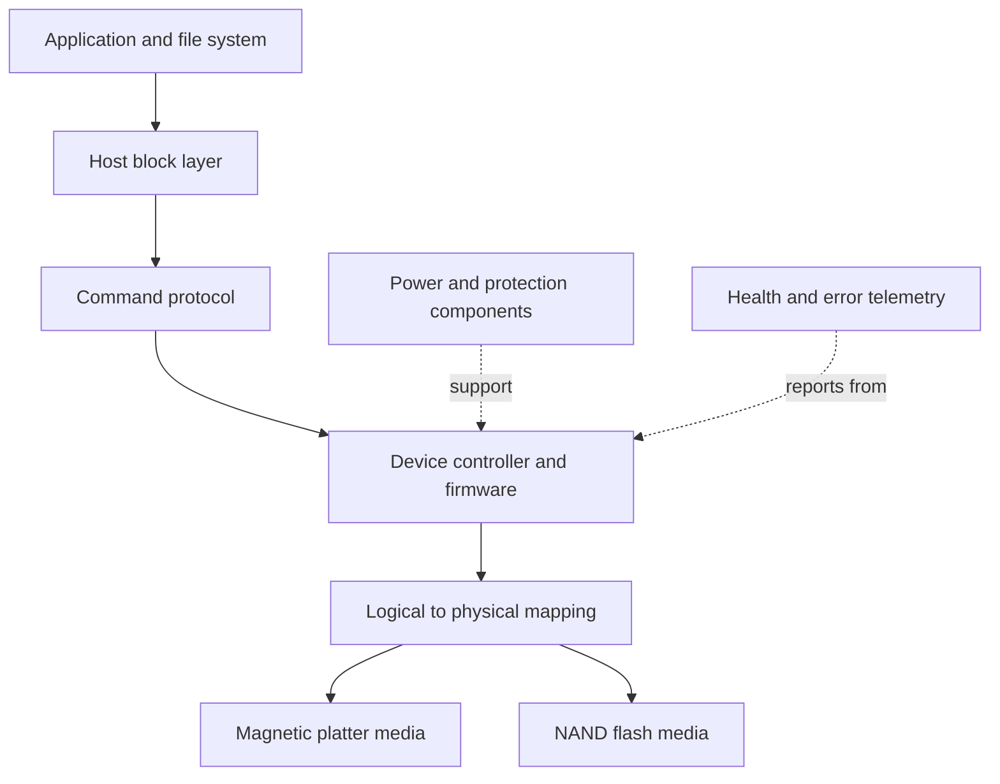

### Four labels that must stay separate

| Label | Question answered | Example | It does not prove |
|---|---|---|---|
| Media | What physical technology retains bits? | Magnetic platter, NAND flash | Connector, protocol, workload fit |
| Protocol | Which command rules are used? | SATA command set, SAS/SCSI context, NVMe | Physical package or measured latency |
| Interface or bus | How are endpoints electrically/logically connected? | PCI Express for common NVMe devices | That every PCIe device is NVMe |
| Form factor | What physical package fits? | M.2, 2.5-inch, add-in card | Whether the device uses SATA or NVMe |

---

## 2. HDD physics: platters, tracks, sectors, heads, and actuators

An HDD contains one or more rigid **platters** coated with magnetic material. Platters rotate around a **spindle**. Each usable surface has a tiny read/write **head** mounted on an **actuator arm**. The actuator moves heads radially while platter rotation brings the requested sector under the selected head.

### Plain-English deep-dive: HDD geometry and time

| Term | Plain meaning | Analogy | Why it matters and memory hook |
|---|---|---|---|
| **Platter** | A rotating disk whose surfaces hold magnetic patterns. | A record. | Capacity is organized across rotating surfaces. **Hook:** Platter = magnetic record. |
| **Track** | A roughly circular path on a platter surface. | One groove around a record. | Neighboring requests on a track can avoid a long seek. **Hook:** Track circles the platter. |
| **Sector** | An addressable subdivision exposed through the device's logical block interface; internal physical organization is abstracted. | One numbered slice of a circular track. | Software uses logical sectors, not a literal map of visible wedges. **Hook:** Sector = logical address unit. |
| **Read/write head** | The component that senses or changes magnetic state near a platter surface. | The record player's needle, with important engineering differences. | Head and surface damage can affect access or cause failure. **Hook:** Head touches data magnetically, not physically in normal operation. |
| **Actuator** | The mechanism that moves the heads across platter radius. | Moving the needle to another track. | Movement creates seek time. **Hook:** Actuator seeks. |
| **Seek time** | Time to move and settle the head at the required track. | Moving to the correct chapter. | Random requests frequently pay this mechanical cost. **Hook:** Seek chooses the track. |
| **Rotational latency** | Time waiting for the requested sector to rotate under the head. | Waiting for the correct song position to pass the needle. | Even after seeking, the data may not yet be under the head. **Hook:** Rotation chooses the moment. |
| **Transfer time** | Time to move the requested bytes after positioning. | Reading the selected passage. | Large sequential requests spend more time transferring and less proportionally on positioning. **Hook:** Transfer moves the bytes. |

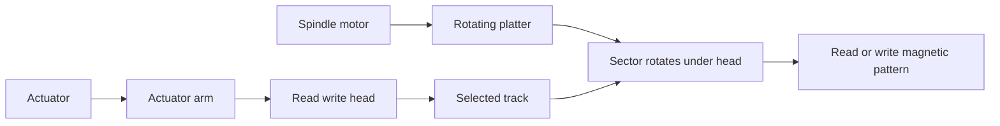

A useful orientation formula is:

$$
T_{HDD}=T_{queue}+T_{seek}+T_{rotation}+T_{transfer}+T_{controller}
$$

This is a reasoning model, not a promise that a device reports each term separately.

For a drive spinning at $R$ revolutions per minute, one full revolution takes:

$$
T_{revolution}=\frac{60}{R}\ \text{seconds}
$$

The ideal average rotational wait for uniformly distributed positions is approximately half a revolution:

$$
T_{average\ rotation}\approx\frac{30}{R}\ \text{seconds}
$$

**Worked example:** At 7,200 revolutions per minute:

$$
T_{revolution}=\frac{60}{7200}=0.00833\ \text{s}=8.33\ \text{ms}
$$

$$
T_{average\ rotation}\approx4.17\ \text{ms}
$$

That estimate excludes seek, transfer, controller work, and queueing. Actual devices optimize ordering, cache requests, remap sectors, and expose measured behavior that can differ.

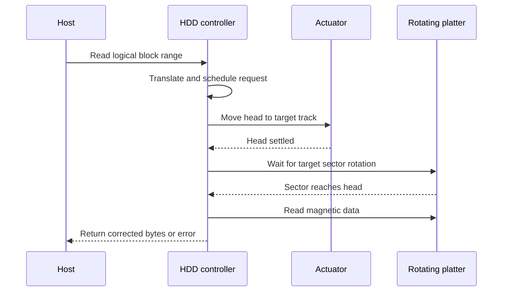

### Random versus sequential HDD behavior

Sequential access often keeps the head near adjacent addresses, allowing long transfers after limited repositioning. Random access repeatedly moves between unrelated locations and pays more seek and rotational cost. Multiple queued requests can let firmware reorder work to reduce movement, improving throughput while increasing or redistributing individual-request waiting time.

| Workload | HDD implication | Evidence to collect |
|---|---|---|
| Large sequential stream | Can use sustained media transfer efficiently | Transfer size, stream count, outer/inner-zone behavior if documented, duration |
| Small random reads | Positioning often dominates | IOPS, latency percentiles, queue depth, locality, cache hit context |
| Mixed random writes | Seek, cache, write ordering, RAID, and background work interact | Read/write mix, request size, cache policy, degraded state |
| Archival or cold capacity | Cost and density may matter more than low latency | Retrieval objective, reliability model, rebuild exposure, energy and operations |

---

## 3. NAND flash physics: cells, pages, blocks, and operations

NAND flash stores information by controlling and sensing electrical charge states in semiconductor cells. Cells are grouped into **pages**, and pages are grouped into **erase blocks**. A page can be read and programmed under device rules, but existing programmed cells normally cannot simply be overwritten in place; the containing erase block must eventually be erased before its pages can be programmed again.

### Plain-English deep-dive: cell density and granularity

| Term | Plain meaning | Analogy | Why it matters and memory hook |
|---|---|---|---|
| **Cell** | A physical flash element whose distinguishable electrical states encode one or more bits. | A dimmer with several reliably distinguishable settings. | More states can increase density but reduce electrical margin and change endurance/performance characteristics. **Hook:** Cell = charge state. |
| **SLC** | Single-level cell, conventionally one bit per cell. | A switch with two states. | Broadly offers large state separation; exact product behavior still depends on implementation. **Hook:** SLC = one bit, two states. |
| **MLC** | Multi-level cell; in common industry usage often two bits per cell, though the literal phrase can be broader. | Four dimmer bands. | More states increase density and control complexity. **Hook:** MLC = commonly two bits. |
| **TLC** | Triple-level cell, three bits per cell. | Eight distinguishable bands. | Common density/endurance tradeoffs must be judged using the exact drive rating. **Hook:** TLC = three bits. |
| **QLC** | Quad-level cell, four bits per cell. | Sixteen distinguishable bands. | Density rises while state margins and workload suitability require careful qualification. **Hook:** QLC = four bits. |
| **Page** | A flash read/program unit used by the device internally. | One writable page in a notebook. | Small logical writes can share a larger internal page. **Hook:** Program pages. |
| **Erase block** | A group of pages erased together. | A bound section that must be cleared as a unit. | Valid pages may need relocation before reclaiming invalid pages. **Hook:** Erase blocks. |
| **Program/erase cycle** | One cycle of programming data and later erasing the containing block. | Write and clear one notebook section. | Repeated cycles wear cells; controllers spread and manage wear. **Hook:** P/E cycles consume endurance. |
| **Error correction code (ECC)** | Redundant information and algorithms used to detect and correct covered bit errors. | Extra check symbols let a damaged message be reconstructed within limits. | Corrected errors can be normal, while growing correction demand may indicate shrinking margin. **Hook:** ECC repairs within a budget. |

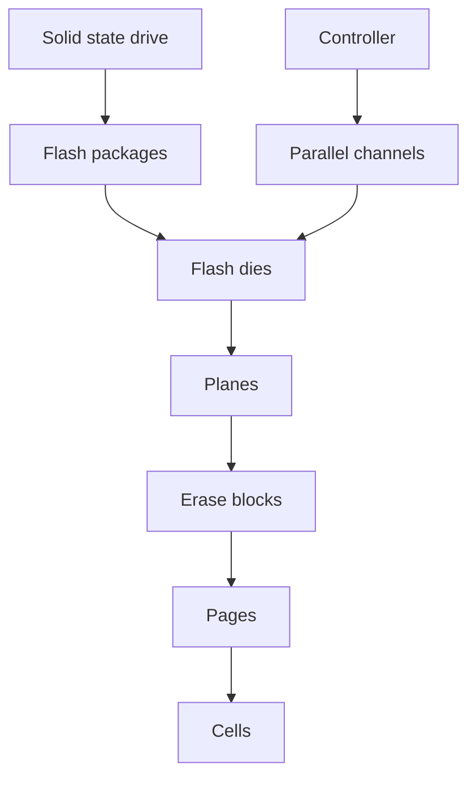

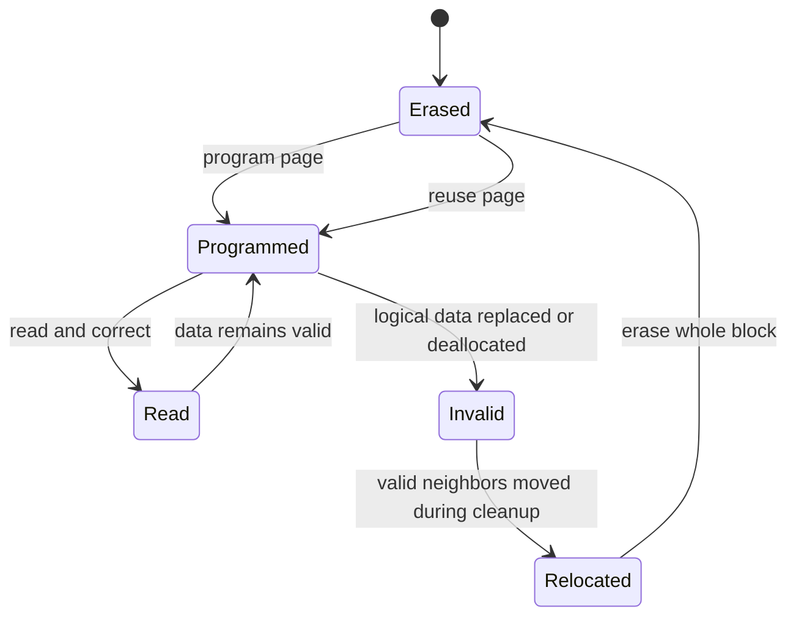

The state diagram is conceptual. Exact partial-program rules, page sizes, block sizes, cell modes, retention behavior, and algorithms vary by NAND generation and device.

### Read, program, and erase are asymmetric

| Operation | Conceptual scope | Relative concern |
|---|---|---|
| Read | Page or smaller exposed range mapped into page reads | Sensing and ECC correction |
| Program | Page-oriented internal update into an erased location | Cannot freely overwrite an already programmed physical page |
| Erase | Whole erase block | Slower, consumes a program/erase cycle, affects many pages |

This asymmetry is the root of the flash translation layer, out-of-place updates, garbage collection, overprovisioning, and write amplification.

---

## 4. The flash translation layer and out-of-place writes

The **flash translation layer (FTL)** is controller firmware that maps host-visible LBAs to current physical flash locations. When the host overwrites an LBA, the SSD can program the new data into a fresh physical page, update the mapping, and mark the old page invalid. The host continues to use the same LBA.

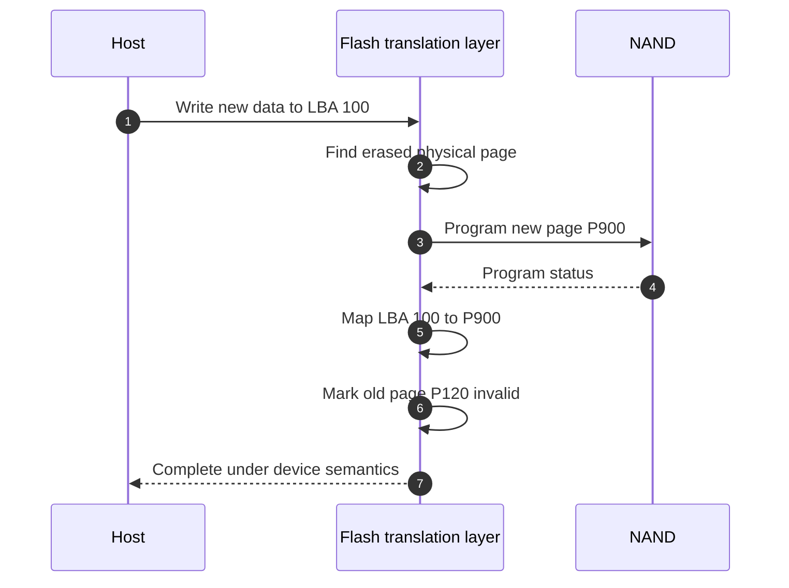

### Mapping creates both power and responsibility

The FTL can:

- Remap logical writes away from worn or failed locations.
- Schedule work across channels and dies for parallelism.
- Spread wear across available flash.
- Cache and combine updates.
- Correct errors and retire unusable blocks.
- Perform background cleanup.

It also creates volatile and persistent metadata whose correctness matters. A drive's power-loss design must protect acknowledged user data and critical mapping state according to its documented guarantees. Do not infer this from the word `enterprise`; verify the model specification and supported platform behavior.

---

## 5. Garbage collection, overprovisioning, and write amplification

**Garbage collection** is the SSD's process of reclaiming erase blocks that contain invalid pages. If a candidate block still has valid pages, the controller copies those pages elsewhere, updates mappings, erases the block, and returns it to the free pool.

**Overprovisioning** is physical flash capacity reserved from ordinary host addressing so the controller has spare working space for remapping, garbage collection, wear management, and failure handling. Vendor-reserved and user-configurable forms vary by product.

**Write amplification** is extra internal media writing compared with host-requested writing.

$$
WAF=\frac{\text{bytes written internally to flash}}{\text{bytes written by the host}}
$$

`WAF` means **write amplification factor**. A value of 1 would mean one internal byte for each host byte; real workloads can be higher. The value depends on workload locality, free space, deallocation, controller policy, data reduction, block state, and measurement scope.

### Plain-English deep-dive: why cleanup writes old data

Imagine a hotel that can erase reservation boards only one full floor at a time. Some rooms on a floor are obsolete reservations and others remain active. Before clearing the floor, staff must move active guests elsewhere. The customer requested one new booking, but the hotel performed extra internal moves. That extra work is write amplification.

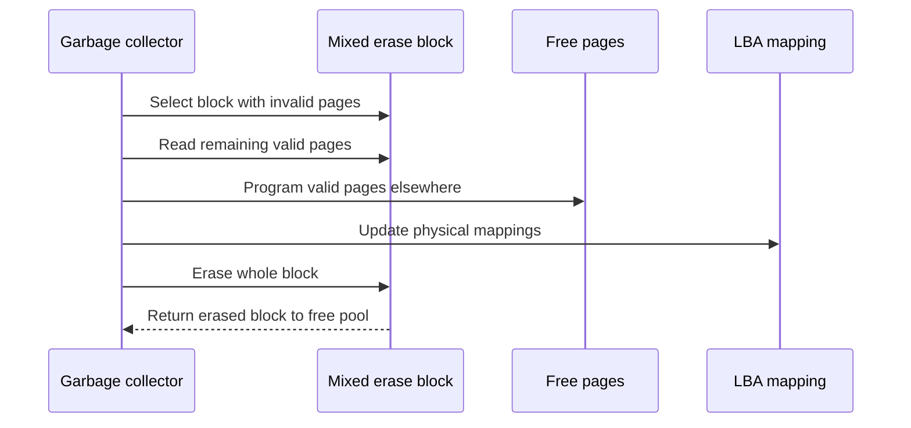

### Worked write-amplification example

A synthetic SSD receives 4 TiB of host writes in one day. Its internal telemetry, if documented as comparable, reports 6 TiB of NAND writes:

$$
WAF=\frac{6\ \text{TiB}}{4\ \text{TiB}}=1.5
$$

The extra 2 TiB may include relocation and other controller-managed writing. This single-day ratio does not establish lifetime behavior. Counter definitions, resets, units, compression, and firmware implementation must be verified.

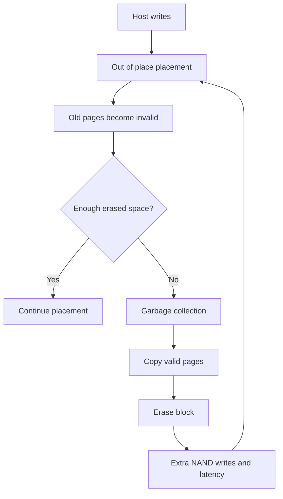

### Free-space pressure matters

When free erased space is plentiful, the controller has more placement choices. Under sustained writes or low free space, foreground I/O and cleanup can compete, potentially increasing tail latency. This is a hypothesis to validate with the exact drive and workload, not a universal threshold claim.

---

## 6. TRIM and UNMAP: telling a device what is no longer needed

Deleting a file often changes file-system metadata first. A lower block device may still see the old LBAs as containing potentially valid data. A deallocation command can tell a supporting device that selected logical blocks no longer need their prior content.

- **TRIM** is commonly associated with the ATA/SATA ecosystem.
- **UNMAP** is a SCSI command concept used in SCSI-oriented block stacks.
- NVMe has its own dataset-management/deallocation mechanisms.

The broad purpose is similar, but command semantics, granularity, support, propagation, security meaning, timing, and performance effects are not identical. Deallocation does not itself prove immediate physical erasure, zeroed reads, secure sanitization, or instant capacity reclaim.

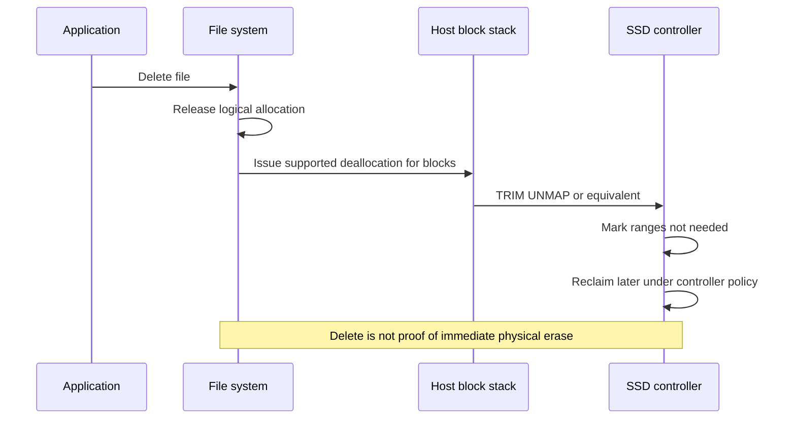

### Deallocation questions

1. Does every layer support and enable the command?
2. Do virtualization, encryption, thin provisioning, snapshots, or storage services intercept or defer it?
3. What does the application expect after deallocation?
4. Is the goal performance, capacity reclaim, privacy, or secure disposal? These require different evidence.
5. Which current product and support documents define behavior?

---

## 7. SATA, SAS, PCIe, and NVMe without category errors

### SATA

**Serial ATA (SATA)** is a storage interface and command ecosystem descended from ATA, commonly used by HDDs and SSDs. A SATA SSD still uses NAND internally, but its host-facing protocol and queue model differ from NVMe.

### SAS

**Serial Attached SCSI (SAS)** is a serial storage connectivity and protocol ecosystem using SCSI command concepts. It commonly supports enterprise topologies and device features that differ from SATA. Exact dual-port, expander, path, and compatibility behavior is product-specific.

### PCIe

**Peripheral Component Interconnect Express (PCIe)** is a high-speed serial interconnect used by many device classes. It is a bus/interconnect, not a storage media type or storage protocol by itself.

### NVMe

**Non-Volatile Memory Express (NVMe)** is a command and queueing architecture designed for non-volatile memory over PCIe and, in NVMe-oF forms, over supported fabrics. NVMe is not a synonym for flash: it describes how commands and queues operate, while the device still has media and a controller.

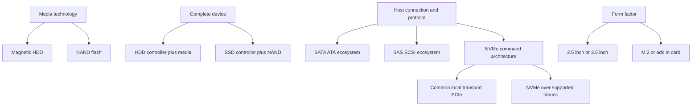

### Category correction table

| Statement | Verdict | Better wording |
|---|---|---|
| `NVMe is faster flash` | Incomplete | NVMe is a command/queue architecture; measured result also depends on media, controller, PCIe path, software, workload, and system. |
| `M.2 means NVMe` | False as a general rule | M.2 is a form factor; a device can use different interfaces depending on keying and platform support. |
| `PCIe is a disk protocol` | Category error | PCIe is an interconnect used by NVMe and many non-storage devices. |
| `SSD means SATA` | False | SSD describes solid-state storage; host-facing protocols can include SATA, SAS, NVMe, and others. |
| `SAS is just faster SATA` | Misleading | They are distinct protocol/connectivity ecosystems with different capabilities and qualification rules. |

---

## 8. Queueing and NVMe parallelism

A **submission queue** holds commands a host submits. A **completion queue** holds completion entries the controller posts. NVMe supports multiple queue pairs and many outstanding commands, enabling software and hardware parallelism when the complete system and workload can use it.

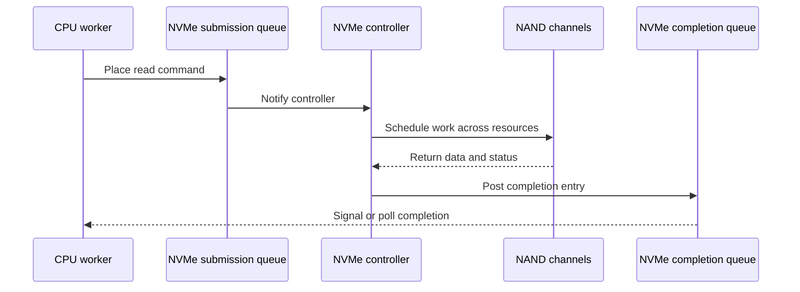

More queues do not automatically reduce latency. Excess offered load can increase waiting. Queue count, queue depth, interrupt or polling policy, CPU placement, driver, firmware, media parallelism, and application concurrency all matter.

### Queue terminology

| Term | Plain meaning | Risk of misuse |
|---|---|---|
| Queue depth | Number of outstanding requests in a defined queue or scope | Different tools aggregate at host, path, device, or controller scope |
| Concurrency | Work progressing or outstanding at the same time | More concurrency can improve throughput until saturation, then worsen latency |
| Parallelism | Work actually executed simultaneously by separate resources | Queued work is not necessarily executing in parallel |
| Saturation | Demand reaches a resource's useful service capacity | Averages can hide brief saturated intervals |

Part 9 develops queueing math and Little's Law. Here the media lesson is simple: a low-latency device can still deliver poor response time when requests wait upstream or its internal resources are saturated.

---

## 9. Latency, IOPS, throughput, and workload fit

- **Latency** is elapsed time for an operation, measured from a stated start to completion point.
- **Input/output operations per second (IOPS)** counts completed I/O operations per second in a defined scope.
- **Throughput** is data transferred per unit time, commonly bytes per second.
- **I/O size** is payload bytes in one request.

An orientation relationship is:

$$
\text{Throughput}\approx\text{IOPS}\times\text{average I/O size}
$$

It is only reliable when units, operation mix, averaging, overhead, and scope align.

**Worked example:** 50,000 operations/s at exactly 8 KiB each represents:

$$
50{,}000\times8\ \text{KiB/s}=400{,}000\ \text{KiB/s}\approx390.625\ \text{MiB/s}
$$

The calculation says nothing about latency, write durability, randomness, cache hits, or whether the device can sustain the workload.

### Workload-media fit is multidimensional

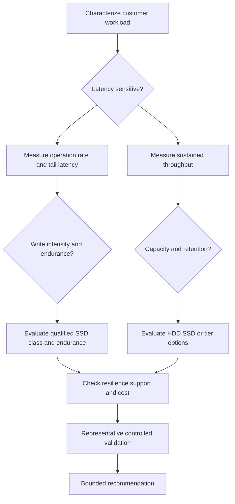

| Workload trait | Media question | Do not assume |
|---|---|---|
| Small random latency-sensitive I/O | Can the complete SSD path meet percentile targets at expected concurrency? | Any SSD or NVMe label guarantees the result |
| Long sequential streams | Can media, controller, network, and destination sustain the required bytes/s? | Random IOPS rating predicts streaming |
| High daily writes | Does rated endurance cover host writes with margin and expected life? | Capacity alone indicates endurance |
| Large cold data set | Are retrieval, rebuild, energy, density, and protection objectives compatible with HDD or a tier? | Cold means unimportant |
| Bursty mixed tenants | How do queues, cache, fairness, and background work behave together? | Average utilization represents peak experience |

---

## 10. Endurance: TBW, DWPD, wear, and retention

**Endurance** is the amount and pattern of writing a device is designed to sustain within stated conditions and warranty/specification terms. It is not the same as expected failure-free life.

- **Terabytes written (TBW)** is a cumulative host-write allowance or rating expressed in decimal terabytes under specified conditions.
- **Drive writes per day (DWPD)** expresses how many times the drive's stated capacity can be written per day over a stated period.
- **Wear leveling** distributes program/erase use so a small region does not wear out far earlier than the rest.
- **Retention** is the ability to preserve data over time under specified temperature, wear, and power conditions.

An orientation conversion is:

$$
TBW\approx DWPD\times\text{drive capacity in TB}\times365\times\text{years}
$$

Use the manufacturer's exact rating conventions; capacity units, workload, warranty period, and write definition may differ.

### Worked endurance example

A synthetic 3.84 TB drive rated at 1 DWPD for five years has an orientation allowance of:

$$
1\times3.84\times365\times5=7{,}008\ \text{TBW}
$$

If the host writes 2.0 TB/day on average:

$$
\text{observed DWPD}=\frac{2.0}{3.84}\approx0.521
$$

If the workload writes 2.0 TB/day only on business days but 9 TB/day during month end, averages alone may hide short high-write periods, thermal effects, queueing, and burst performance. Endurance and performance both need time distributions.

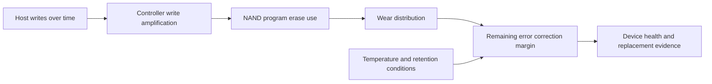

### Endurance recommendation check

1. Confirm exact drive model, capacity, firmware, age, and supported platform.
2. Obtain host-write history with units, counter semantics, reset behavior, and peaks.
3. Confirm rating, warranty period, workload assumptions, and whether a platform uses device-reported wear indicators.
4. Add expected growth, rebuild, migration, data-reduction, and background-write effects only where evidence supports them.
5. Maintain margin for uncertainty; do not run exactly to a theoretical rating.
6. Follow vendor support/replacement guidance rather than inventing a wear threshold.

---

## 11. Failure: UREs, latent errors, wear, electronics, and shared fate

A device can fail suddenly, degrade gradually, return an error for one address, corrupt data silently until detection, or become unreachable because another path component failed.

### Plain-English deep-dive: failure language

| Term | Plain meaning | Analogy | Why it matters and memory hook |
|---|---|---|---|
| **Unrecoverable read error (URE)** | A read for which the device cannot return corrected data within its error-recovery capability and reports failure. | A damaged line cannot be reconstructed even with the check symbols. | Protection above the device must supply another valid copy or report data loss. **Hook:** URE = device cannot correct this read. |
| **Latent sector error** | An unreadable or corrupted region that exists unnoticed until read or scrubbed. | A damaged archive page discovered only years later. | Rebuilds read large areas and can expose latent defects. **Hook:** Latent means hidden until touched. |
| **Silent data corruption** | Data changes without being reported at the layer where it occurs. | A parcel arrives altered but no alarm was raised. | End-to-end checks and redundant correction paths matter. **Hook:** Silent failure needs independent detection. |
| **Bad block retirement** | The controller stops using a failing physical region and remaps around it. | Close one unsafe shelf and move contents. | Remapping is normal management until reserve or error limits become concerning under vendor rules. **Hook:** Retire bad locations before reuse. |
| **Wear-out** | Loss of sufficient flash operating margin after accumulated use and conditions. | Repeated erasing makes pencil marks harder to distinguish. | Wear is managed and reported imperfectly; it is not the only SSD failure mode. **Hook:** Wear is gradual margin loss. |
| **Correlated failure** | Multiple components fail from a shared cause or similar exposure rather than independently. | Devices from one overheated cabinet fail together. | Simple independent-probability math can understate risk. **Hook:** Shared cause breaks independence. |

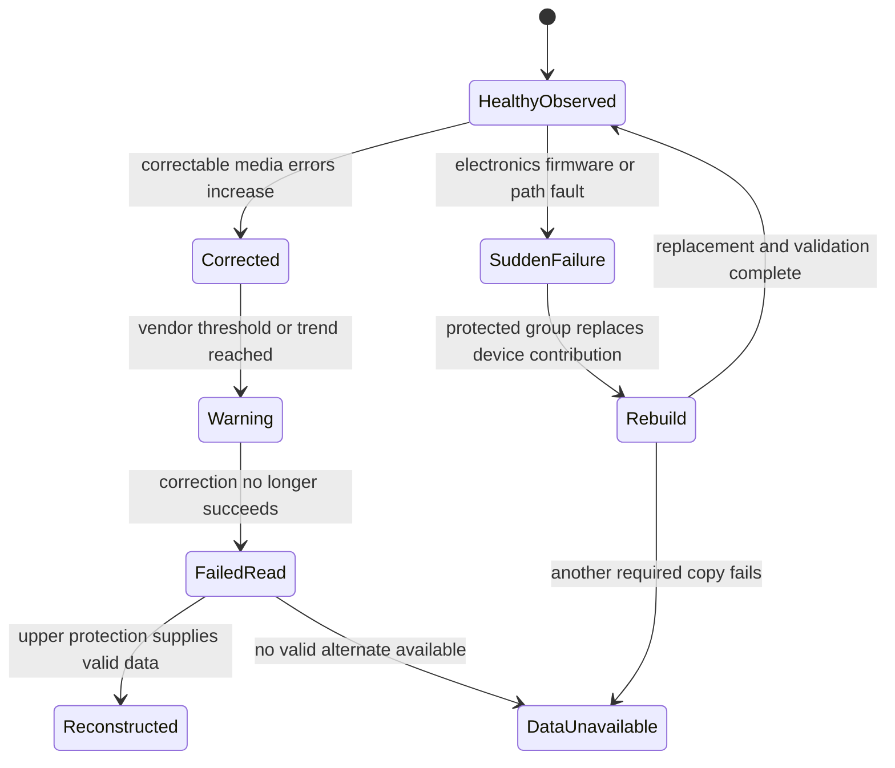

### URE probability orientation

If a specification states an unrecoverable-error rate as a probability per bits read, a simplified independent-trial orientation for reading $N$ bits at bit-error probability $p$ is:

$$
P(\text{at least one error})=1-(1-p)^N
$$

For very small $p$, $1-e^{-pN}$ is a useful approximation. This math must not be used to predict a customer's actual rebuild outcome without exact specifications, protection behavior, retries, scrubbing, workload, error correlation, and vendor guidance. Datasheet wording is often a bound or rate statement, not a promise that errors arrive independently and uniformly.

### HDD failure modes

- Head or surface damage.
- Spindle motor or actuator failure.
- Electronics, memory, firmware, connector, or power faults.
- Media defects and uncorrectable sectors.
- Shock, vibration, heat, contamination, or manufacturing problems.
- Slow response or repeated retries before hard failure.

### SSD failure modes

- NAND wear, retention loss, disturb effects, or uncorrectable pages.
- Controller, firmware, volatile-memory, capacitor, interface, or power faults.
- Mapping metadata damage.
- Thermal throttling or shutdown behavior.
- Sudden device loss unrelated to wear percentage.
- Exhausted reserve blocks or increasing correction demand under device-specific thresholds.

**Key correction:** HDDs do not always fail gradually, and SSDs do not always fail predictably through a wear gauge. Device class suggests mechanisms; it does not guarantee warning quality.

---

## 12. Power-loss protection and acknowledgement semantics

**Power-loss protection (PLP)** is a design intended to protect selected in-flight data and/or device metadata when external power disappears. Some devices use capacitors or other stored energy to complete critical persistence work. Consumer and enterprise designs differ, and even devices marketed with PLP can define coverage differently.

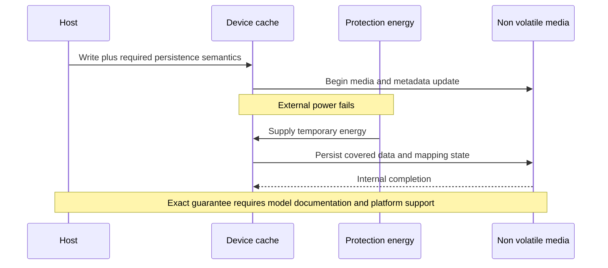

Questions before relying on PLP:

1. Which data is protected: user data, mapping metadata, both, or a bounded subset?
2. When does the device acknowledge a flush or force-unit-access request?
3. Does the platform permit or disable volatile write cache?
4. How is capacitor health monitored and tested?
5. What happens under repeated power interruption, controller reset, or partial failure?
6. Does the complete path preserve the application's intended ordering?

Part 7 develops flush, barrier, force-unit-access, journaling, and crash-consistency concepts.

---

## 13. SMART and health telemetry: useful but not an oracle

**Self-Monitoring, Analysis and Reporting Technology (SMART)** is a device-health reporting framework associated especially with ATA devices. SAS/SCSI and NVMe ecosystems expose health and error information through their own standardized and vendor-specific logs. Attribute names, raw values, normalization, thresholds, units, support meaning, and prediction quality vary.

### What health telemetry can and cannot do

| Evidence | Can support | Cannot prove by itself |
|---|---|---|
| Wear or percentage-used indicator | A device-reported wear estimate under its definition | Exact remaining days or freedom from sudden failure |
| Reallocated or retired block count | Media management activity and trend | Immediate need for replacement without vendor criteria |
| Corrected-error counters | That correction occurred in the reported scope | That user data was lost or which application was affected |
| Temperature history | Thermal exposure during measured intervals | Root cause of a failure without mechanism and correlation |
| Unsafe shutdown count | Device observed power-loss-like events under its definition | That acknowledged data was lost |
| Critical warning | Device has asserted a standardized warning condition | Complete customer impact, protection state, or correct remediation |
| No warning | No reported warning under current telemetry | Device will not fail or all data is correct |

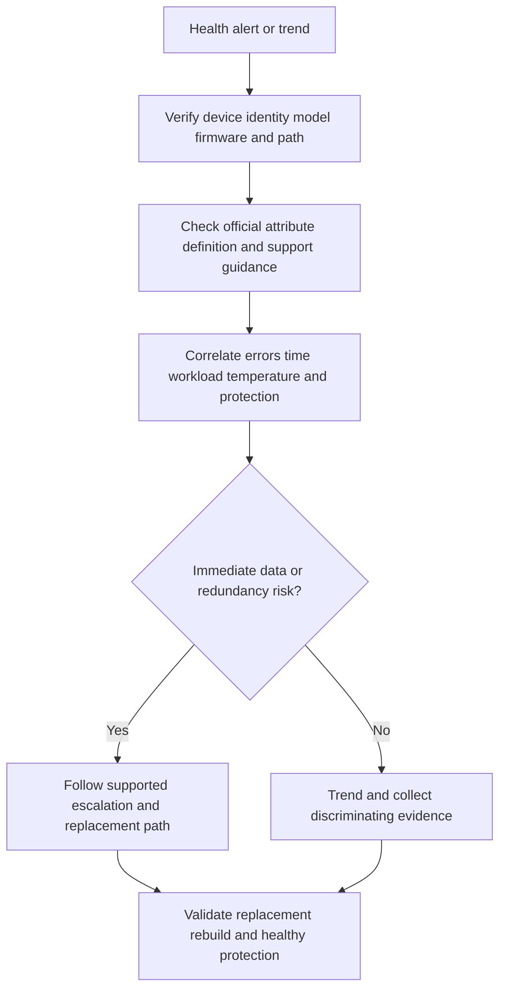

Never clear logs, force destructive tests, update firmware, remove a device, or change cache policy merely to investigate a metric without authorization and current product procedure.

---

## 14. TAM discovery, recommendation logic, and JD mapping

### Customer discovery questions

#### Business and workload

1. Which service and transaction use the storage, and what latency, throughput, availability, durability, RPO, and RTO matter?
2. What are I/O-size distribution, read/write mix, randomness, concurrency, burst duration, seasonality, and growth?
3. Which data is hot, warm, cold, regulated, replaceable, or time-critical?
4. Which maintenance, procurement, and recovery lead times constrain action?

#### Device and platform

5. What exact system, shelf, device model, capacity, serial identity, firmware, sector format, protocol, form factor, age, and support state are present?
6. Is the device qualified for this exact platform and software release?
7. How are paths, ports, power, cooling, spares, RAID/protection, and failure domains arranged?
8. What official replacement, firmware, sanitization, and disposal procedures apply?

#### Performance and endurance

9. Which layer reports IOPS, throughput, latency, queue depth, cache hit, host writes, media writes, wear, temperature, and errors?
10. Are units, counters, reset times, time zones, averages, and percentiles understood?
11. What are peak and cumulative writes, forecast growth, and rated endurance under the exact specification?
12. Does low free space, garbage collection, rebuild, scrub, backup, or migration align with tail-latency events?

#### Failure and evidence

13. Is the symptom one LBA, one drive, one path, one shelf, a protected group, or an application?
14. Which errors were corrected, retried, reconstructed, or exposed to the host?
15. Are failures correlated by batch, age, firmware, temperature, shelf, power, or workload?
16. What is the current protection state, spare readiness, rebuild progress, and restore evidence?

### Recommendation framework

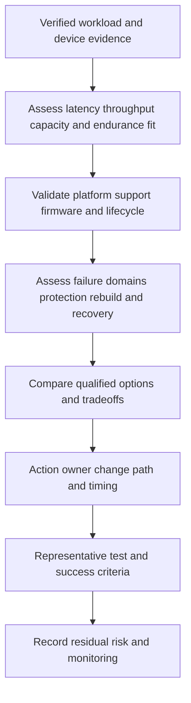

| Finding | Customer risk | Bounded recommendation | Validation |
|---|---|---|---|
| Write demand approaches documented endurance with growth uncertainty | Premature wear exposure or urgent replacement planning | Verify counters/rating; forecast bounded demand; review qualified higher-endurance or workload-placement options | Monthly host-write distribution, current official rating, approved capacity/performance test |
| Random tail latency rises during sustained writes | Cleanup, saturation, another layer, or background activity may affect service | Correlate queues, host/device latency, free space, media work, CPU/network, and workload; run controlled test | Reproduce or disconfirm with aligned percentile telemetry |
| Repeated corrected errors on one device | Shrinking margin or normal managed correction under unknown threshold | Check exact vendor definitions and support guidance; preserve evidence; escalate if criteria apply | Support-reviewed disposition and post-action health |
| HDD rebuild window conflicts with business risk | Long degraded exposure and performance impact | Assess protection, spare, drive size, rebuild behavior, correlated risk, and recovery plan in Part 6 | Approved failure simulation or paper exercise plus current platform evidence |
| NVMe requested because it is `fast` | Cost or change may not address real bottleneck | Characterize workload and end-to-end bottleneck before comparing supported options | Application outcome and complete-path before/after test |

### Explicit JD mapping

| JD responsibility | Part 5 contribution | experience transfer and gap |
|---|---|---|
| Understand customer environment | Maps workload through protocol, controller, media, power, protection, and failure domain | M365 dependency mapping transfers; physical storage internals are learned here |
| Provide storage guidance and strategic planning | Connects media fit, endurance, lifecycle, and workload growth | Analytics and advisory method transfer; no production NetApp media design claim |
| Mitigate risk and improve stability | Interprets errors, wear, PLP, latent defects, and correlated failure cautiously | critical-situation evidence discipline transfers; platform procedure requires NetApp expertise |
| Analyze and report customer data | Requires scoped counters, percentiles, units, trends, and confidence | Excel/Power BI/statistics are strengths; tool semantics need authorized practice |
| Improve support experience | Produces device identity, timeline, error, protection, and exact-ask evidence | Escalation packaging is proven in enterprise support |
| Make customer-specific recommendations | Uses workload, supportability, tradeoff, owner, validation, and residual risk | Recommendation method is transferable; exact product choice needs review |

### Honest production-gap note

Safe interview wording:

> "I understand HDD and NAND mechanisms, endurance calculations, queueing orientation, and the evidence needed to assess media fit. My production experience is enterprise support, not selecting or replacing drives in a NetApp estate. I would use current platform documentation, qualified device lists, authorized telemetry, and lead-TAM or storage-SME review before making a customer recommendation. A paper lab or synthetic calculation demonstrates my method, not production ownership."

---

## 15. Fully synthetic worked scenario: Northwind Imaging

> **Synthetic case:** Northwind Imaging is fictional. The device specifications and measurements are exercise inputs, not NetApp data, vendor benchmarks, or procurement advice.

Northwind runs three services:

- Transaction database: 4 KiB and 8 KiB random I/O, latency-sensitive commits.
- Image ingest: 220 MiB/s sequential writes for 10 hours/day.
- Seven-year archive: large cold objects, infrequent retrieval, large capacity.

The synthetic environment has an SSD pool for database and ingest landing, plus an HDD capacity tier for archive. One SSD specification is modeled as 3.84 TB and 1 DWPD for five years. Current host writes to the SSD pool average 2.2 TB/day per device and peak at 6.5 TB/day during two month-end days. The environment reports tail-latency spikes during ingest and a simultaneous backup scan.

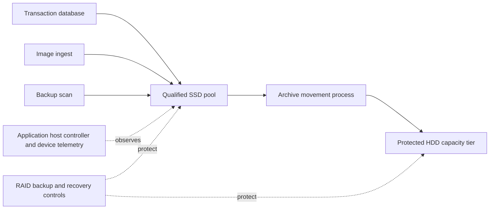

### Calculation 1: ingest volume

$$
220\ \text{MiB/s}\times36{,}000\ \text{s}=7{,}920{,}000\ \text{MiB/day}
$$

$$
\frac{7{,}920{,}000}{1{,}048{,}576}\approx7.553\ \text{TiB/day}
$$

This is payload before file-system, protection, snapshot, data-reduction, and retention effects.

### Calculation 2: average observed DWPD

$$
\frac{2.2\ \text{TB/day}}{3.84\ \text{TB}}\approx0.573\ DWPD
$$

The orientation rating is:

$$
1\times3.84\times365\times5=7{,}008\ \text{TBW}
$$

At a constant 2.2 TB/day for five years:

$$
2.2\times365\times5=4{,}015\ \text{TB host writes}
$$

The arithmetic appears below the orientation rating, but a recommendation still requires exact rating terms, device age, cumulative writes, write distribution, platform behavior, growth, and vendor guidance. NAND internal writes cannot be inferred from host writes without comparable telemetry.

### Competing latency hypotheses

| Hypothesis | Supporting clue | Cheap disconfirming check |
|---|---|---|
| SSD internal cleanup under sustained writes | Spike aligns with long ingest and low free working space | Compare device latency and free-space/GC evidence when ingest runs without backup |
| Host or storage queue saturation | Database, ingest, and backup overlap | Compare queue and latency percentiles by layer and temporarily schedule one synthetic controlled run separately |
| Network path bottleneck | Payload demand rises during backup | Check link throughput, loss, retries, and host wait attribution |
| Database cache miss or checkpoint work | Commit tail rises independently of device average | Correlate database-native waits and transaction timing |
| HDD archive movement contention through a shared controller | Movement starts near spike | Compare controller/resource scope and disable only in an approved test environment |

### Bounded recommendations

| Priority | Recommendation | Owner | Validation | Residual risk |
|---:|---|---|---|---|
| 1 | Separate and align application, host, network, controller, and device percentiles during the overlap before changing media | Performance owner with app/storage teams | Two representative peak windows and one controlled comparison | Production month end may differ from test |
| 2 | Validate cumulative host writes, exact drive rating, current wear logs, and 18-month growth forecast | Storage owner | Reviewed calculation with source definitions and model documentation | Workload or firmware behavior can change |
| 3 | Reconcile ingest retention and archive movement capacity from daily bytes through usable/protected capacity | Capacity and application owners | Thirty-day byte ledger and retention test | Compression and content mix remain variable |
| 4 | Review qualified media/protocol options only after bottleneck and endurance evidence are complete | Architecture owner and authorized vendor/SME | Supported option comparison and application test | A supported design can still experience workload-specific limits |
| 5 | Add HDD rebuild, latent-error, and restore questions to Part 6 and Part 8 analysis | Resilience owner | Paper failure exercise and current protection evidence | Exercises cover named scenarios only |

### Customer-facing summary

> "The endurance arithmetic does not currently prove that the synthetic SSD rating is exceeded, and the timing does not prove garbage collection is the cause of database latency. Three workloads overlap across a shared path. The next action is to align application, host, path, controller, and device percentiles, then repeat a bounded comparison. In parallel, we should validate cumulative writes and the exact model rating, and reconcile the ingest-to-archive capacity flow. Only then can we compare qualified media or scheduling options with credible tradeoffs."

---

## 16. Failure modes and troubleshooting workflow

| Failure mode or mistake | Why it fails | Better behavior |
|---|---|---|
| Choosing by `HDD`, `SSD`, or `NVMe` label | Labels omit workload, controller, queue, protection, support, and cost | Characterize the complete path and test supported options |
| Treating SMART as a failure predictor | A healthy-looking drive can fail suddenly; attributes vary | Use exact definitions, trends, events, protection, and vendor guidance |
| Calling every corrected error data loss | Correction may have succeeded | Distinguish corrected, recovered by redundancy, and uncorrectable outcomes |
| Treating URE rates as deterministic schedules | Specification and event assumptions are misunderstood | Use as bounded risk input under qualified protection analysis |
| Assuming TRIM securely erases data | Deallocation and sanitization are different claims | Follow official sanitize/disposal procedure |
| Using average writes for burst performance | Endurance average hides short saturation and tail latency | Track time distribution and concurrent work |
| Assuming PLP from an enterprise label | Coverage and health are model-specific | Verify exact specification and platform cache policy |
| Updating firmware first | Can change evidence and introduce risk | Preserve evidence, validate applicability, use supported change process |
| Replacing a drive before checking identity/protection | Wrong removal can reduce or destroy redundancy | Verify serial, slot, ownership, current protection, and official procedure |
| Blaming media from host latency | Delay can be in queue, path, controller, cache, or application | Correlate layer-specific service and wait evidence |

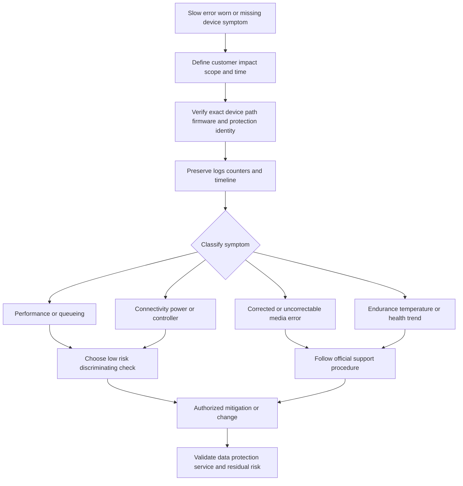

### Escalation evidence pack

- Customer impact, service, scope, start time, and current state.
- System, shelf, slot, serial, model, firmware, capacity, protocol, and paths.
- Protection state, spare state, degraded/rebuild status, and recent changes.
- Exact errors with timestamps and time zones.
- Host, controller, device, environmental, and application evidence.
- Workload profile and whether behavior is new or baseline.
- Actions already taken, safety limits, and exact specialist ask.
- Secure evidence location and customer authorization.

---

## 17. Paper and whiteboard lab

This lab needs only paper, a spreadsheet, or Markdown. It must remain labeled synthetic.

### Lab objective

Compare three fictional devices and workloads without turning specifications into a product recommendation.

### Synthetic inputs

| Device | Presented capacity | Protocol context | Endurance input | Workload |
|---|---:|---|---|---|
| H1 | 18 TB decimal HDD | SAS orientation | Not expressed as DWPD | 250 MiB/s archive stream plus rebuild risk |
| S1 | 3.84 TB SSD | SAS orientation | 1 DWPD for 5 years | 1.7 TB host writes/day, small random mixed I/O |
| N1 | 7.68 TB SSD | NVMe over PCIe orientation | 3 DWPD for 5 years | 9 TB writes/day, latency-sensitive analytics ingest |

### Tasks

1. Draw media, controller, protocol/interface, form factor, host, protection, and application as separate layers.
2. Draw an HDD read and label queue, seek, rotational wait, transfer, and controller time.
3. Draw a NAND update and label page, erase block, FTL mapping, invalid page, garbage collection, and overprovisioning.
4. Explain TRIM/UNMAP without claiming immediate erase.
5. Calculate average rotational latency for 7,200 and 10,000 rpm.
6. Calculate five-year TBW orientation for S1 and N1.
7. Calculate observed DWPD for each SSD workload.
8. Create one high-write burst that averages safely over a month but saturates a queue for an hour.
9. Build competing hypotheses for a tail-latency spike.
10. Add one URE, one latent error, one power-loss event, and one sudden controller failure to a fault tree.
11. Write discovery questions and an evidence request.
12. Produce one recommendation per workload with source, owner, validation, and residual risk.

Expected orientation checks:

$$
T_{avg\ rotation,7200}\approx4.17\ \text{ms}
$$

$$
T_{avg\ rotation,10000}=\frac{30}{10000}\ \text{s}=3.0\ \text{ms}
$$

$$
TBW_{S1}=1\times3.84\times365\times5=7{,}008\ \text{TB}
$$

$$
TBW_{N1}=3\times7.68\times365\times5=42{,}048\ \text{TB}
$$

$$
DWPD_{S1}=\frac{1.7}{3.84}\approx0.443
$$

$$
DWPD_{N1}=\frac{9}{7.68}\approx1.172
$$

These numbers are not sufficient for a selection. The exact rating definition, cumulative age, support, performance, failure protection, cost, and application behavior remain required.

### Whiteboard pass criteria

- [ ] Media, protocol, interface, and form factor are separate boxes.
- [ ] HDD latency includes seek and rotation; SSD latency includes mapping and possible cleanup.
- [ ] NAND reads/programs pages and erases blocks.
- [ ] Host writes and NAND writes are not treated as identical.
- [ ] DWPD/TBW math contains capacity, period, units, and caveats.
- [ ] Health telemetry is evidence, not a guarantee.
- [ ] Recommendation follows evidence -> context -> risk -> action -> owner -> validation -> residual risk.
- [ ] Every result is called synthetic or conceptual.

---

## 18. Self-test

1. Define media, HDD, SSD, NAND, controller, firmware, protocol, interface, transport, and form factor.
2. Draw an HDD and explain platter, track, sector, head, actuator, seek, rotation, and transfer.
3. Calculate average rotational latency from revolutions per minute and state the exclusions.
4. Explain why random HDD requests usually differ from sequential requests.
5. Draw the NAND hierarchy from SSD to cell.
6. Distinguish SLC, MLC, TLC, and QLC without turning the labels into universal performance claims.
7. Explain read, program, and erase granularity.
8. Define FTL and explain an out-of-place update.
9. Define garbage collection, overprovisioning, and write amplification.
10. Calculate WAF from comparable host and NAND writes.
11. Explain TRIM, UNMAP, and why deallocation is not secure erase.
12. Distinguish SATA, SAS, PCIe, NVMe, and M.2 by category.
13. Draw NVMe submission and completion queues.
14. Explain queue depth, concurrency, parallelism, saturation, and tail latency.
15. Relate IOPS, I/O size, and throughput with unit caveats.
16. Define TBW and DWPD and complete a five-year calculation.
17. Explain wear leveling, retention, and why wear is not the only SSD failure mode.
18. Define URE, latent sector error, silent corruption, and correlated failure.
19. Explain why a large rebuild can reveal latent errors without predicting a customer's outcome from a datasheet rate.
20. Compare HDD and SSD failure modes.
21. Explain PLP and list six questions before relying on it.
22. Explain what SMART and NVMe health telemetry can and cannot prove.
23. Ask the complete customer discovery set before recommending media.
24. Recreate Northwind's calculations, hypotheses, recommendations, and honesty boundary.
25. Complete the paper lab and present a five-minute media-fit review.

---

## 19. Official Source Anchors

**Date checked: 2026-08-24.** These official and vendor-neutral sources anchor broad standards and NetApp documentation areas. Specifications, standards editions, product qualifications, drive behavior, health attributes, endurance ratings, firmware, limits, and support procedures change. Some complete standards, compatibility details, Hardware Universe content, and customer procedures can be access-gated. Never invent a current device behavior, platform result, replacement threshold, or internal NetApp process.

| Topic | Official or vendor-neutral source | Bounded use and currency note |
|---|---|---|
| Storage terminology | [SNIA Dictionary](https://www.snia.org/education/online-dictionary) | Broad vendor-neutral terminology. A definition does not establish implementation or support behavior. |
| NVMe architecture and specifications | [NVM Express specifications](https://nvmexpress.org/specifications/) | Official standards source for current NVMe specifications. Full behavior depends on specification version, transport, device, driver, and platform. |
| SCSI standards | [INCITS T10 Technical Committee](https://www.t10.org/) | Official committee source for SCSI command and storage-interface standards. Some standards documents may require purchase or access. |
| SATA standards organization | [SATA-IO](https://sata-io.org/) | Official industry organization for SATA specifications and ecosystem information. Exact device support is platform-specific. |
| PCI Express standards organization | [PCI-SIG](https://pcisig.com/) | Official PCIe standards organization. Detailed specifications or member content may be access-controlled. |
| NAND and semiconductor standards | [JEDEC](https://www.jedec.org/standards-documents) | Official standards catalog. Some documents require registration or purchase; NAND generation and endurance behavior are device-specific. |
| ONTAP disks and local tiers | [NetApp disks and local tiers documentation](https://docs.netapp.com/us-en/ontap/disks-aggregates/) | Official public ONTAP documentation area. Select the exact ONTAP release and platform; supported media and operations are version-sensitive. |
| ONTAP drive and RAID type orientation | [Display drive and RAID type](https://docs.netapp.com/us-en/ontap/disks-aggregates/determine-drive-raid-type-task.html) | Broad official orientation only. Output, terminology, and applicability require the exact environment and release. |
| NetApp hardware systems documentation | [NetApp ONTAP hardware systems](https://docs.netapp.com/us-en/ontap-systems/) | Official platform documentation entry point. Use exact platform installation, service, and hardware procedures. |
| Platform specifications and supported components | [NetApp Hardware Universe](https://hwu.netapp.com/) | Official and potentially access-gated. Verify exact system, shelf, drive, firmware, capacity, and configuration on the date of a real decision. |
| NetApp support resources | [NetApp Support Site](https://mysupport.netapp.com/) | Official support portal; device alerts, firmware guidance, cases, and procedures can require authentication and entitlement. |

### Source-use discipline

- Record exact device model, serial, firmware, capacity, sector format, protocol, platform, software release, source page/tool, and date.
- Treat a standards definition, a drive datasheet, a platform qualification, and observed telemetry as different evidence.
- Use current official platform procedures before firmware update, removal, replacement, sanitize, or disposal.
- Preserve raw counters and their units/reset semantics before calculating rates.
- Distinguish host writes, internal media writes, logical capacity, physical flash, and endurance rating.
- State access limitations and seek authorized support or SME review instead of inventing a threshold or behavior.

---

## Likely Interview Questions

### Q1. Explain HDD latency from a host request to returned data.

> **Model answer:** "An HDD request can wait in a queue, then the actuator moves and settles the head on the required track, the platter rotates until the requested sector reaches the head, and the data transfers through the controller. I model response as queue plus seek plus rotational plus transfer plus controller time. Random requests usually pay more positioning cost than adjacent sequential work. I would still use measured percentiles and the exact workload because firmware scheduling, cache, RAID, and concurrency change observed behavior."

**Follow-up depth:** Calculate the ideal average rotational wait for 7,200 rpm, explain why it is not total latency, and describe how request reordering trades individual latency against throughput.

### Q2. Why can NAND flash not simply overwrite data in place?

> **Model answer:** "NAND is read and programmed at page-oriented granularity but erased in larger blocks. A programmed physical page cannot normally be freely overwritten, so the controller writes the new version to an erased page, updates the FTL mapping, and invalidates the old page. Garbage collection later copies remaining valid pages and erases the whole block. That creates background work and possible write amplification."

**Follow-up depth:** Draw the cell-page-block hierarchy, distinguish program from erase, and explain how free space, overprovisioning, locality, and deallocation can affect cleanup.

### Q3. What is write amplification, and why does a TAM care?

> **Model answer:** "Write amplification factor is comparable internal flash bytes written divided by host bytes written. It can exceed one because out-of-place updates and garbage collection relocate valid pages. A TAM cares because internal writing can affect endurance and latency, especially under sustained writes or constrained free space. I would verify counter definitions and time windows, characterize the workload, and avoid inferring a lifetime result from one sample."

**Follow-up depth:** Calculate a WAF of 1.5 from 6 TiB internal and 4 TiB host writes, then explain why data reduction and telemetry scope can invalidate a naive ratio.

### Q4. Distinguish SATA, SAS, PCIe, NVMe, and form factor.

> **Model answer:** "SATA and SAS are storage connectivity and command ecosystems; SAS uses SCSI command context while SATA descends from ATA. PCIe is a general high-speed interconnect. NVMe is a non-volatile-memory command and queue architecture commonly transported locally over PCIe and also defined for fabrics. Form factors such as M.2, 2.5-inch, and add-in card describe physical packaging. Therefore M.2 does not automatically mean NVMe, PCIe is not media, and SSD does not mean SATA."

**Follow-up depth:** Draw media, complete device, protocol, interconnect, and package as separate layers and explain where driver and platform qualification enter.

### Q5. How would you assess whether an SSD has enough endurance?

> **Model answer:** "I would verify the exact model, capacity, firmware, age, current platform support, endurance specification, warranty period, and workload assumptions. I would preserve host-write counters and reset semantics, calculate average and peak DWPD, compare cumulative and forecast writes with the documented rating, and include growth and uncertainty. I would not equate staying below a rating with guaranteed reliability or use an invented replacement threshold; I would follow current vendor guidance and validate performance separately."

**Follow-up depth:** Compute TBW for a 3.84 TB, 1-DWPD, five-year rating and explain host versus NAND writes, bursts, retention, and sudden non-wear failures.

### Q6. What are UREs and latent media errors, and why do rebuilds matter?

> **Model answer:** "A URE is a read the device cannot correct and reports as failed. A latent error already exists but is discovered only when that area is read or scrubbed. A rebuild reads substantial surviving data, so it can expose latent defects while the protection group is already degraded. I would assess exact protection behavior, device errors, scrubbing, spares, correlated failure domains, workload impact, and recovery copies rather than predicting outcome from a datasheet rate alone."

**Follow-up depth:** Explain the simplified probability formula, its independence caveat, and why Part 6 must combine URE risk with RAID geometry, reconstruction, and failure-domain placement.

### Q7. Can SMART or a wear indicator tell you when a drive will fail?

> **Model answer:** "No. Health telemetry can report device-observed conditions such as wear estimates, corrected errors, retired blocks, temperature, or critical warnings, but definitions and thresholds vary. A drive can fail suddenly without a useful warning, and a counter increase may be managed normally under vendor criteria. I verify identity and definitions, correlate trends with errors, workload, environment, and protection, then follow current support guidance."

**Follow-up depth:** Give examples of what a clean health log cannot prove, and describe the evidence package required before a safe replacement decision.

### Q8. How does your Microsoft 365 background transfer to media analysis without overstating experience?

> **Model answer:** "Microsoft 365 support trained me to separate user impact from internal mechanism, align identities and timestamps across layers, preserve evidence, test competing hypotheses, and communicate uncertainty during critical escalations. Those methods transfer directly to storage-media analysis and customer recommendations. I have not selected or replaced drives in a production NetApp estate, so I would describe this knowledge as structured study and synthetic practice, then use current NetApp documentation, authorized telemetry, and storage-SME review for a real account."

**Follow-up depth:** Use one sanitized M365 case to demonstrate evidence discipline, then name the exact device, protection, platform, and support facts that would still require authorized validation.

---

## 30-Second Memory Hooks

- **HDD:** Move the head, wait for rotation, then transfer.
- **Seek:** Find the track; **rotation:** wait for the sector.
- **SSD:** Controller plus firmware plus NAND, not raw flash alone.
- **NAND:** Read and program pages; erase blocks.
- **FTL:** Stable logical address, changing physical page.
- **Garbage collection:** Move valid pages before erasing a mixed block.
- **Write amplification:** Internal flash writes divided by host writes.
- **Overprovisioning:** Private working space for the controller.
- **TRIM/UNMAP:** No longer needed is not immediately erased.
- **SATA/SAS/NVMe:** Protocol ecosystems; **PCIe:** interconnect; **M.2:** package.
- **NVMe queues:** Parallel doors help only when the whole system can serve the work.
- **Latency:** Service plus waiting; a fast device can sit behind a long queue.
- **IOPS and throughput:** Operations times size, with scope and unit caveats.
- **DWPD:** Daily host writes divided by stated drive capacity.
- **TBW:** Cumulative write rating under stated conditions.
- **URE:** The device could not correct that read.
- **Latent error:** Damage waiting to be discovered.
- **Correlated failure:** Shared cause defeats independent-risk assumptions.
- **PLP:** Verify exactly what survives power loss and when acknowledgement occurs.
- **SMART:** Instrument panel, not a crystal ball.
- **Media fit:** Workload + support + endurance + protection + evidence + tradeoff.
- **Your bridge:** Transfer escalation rigor, not unearned NetApp operations experience.

---

## Completion Checklist

- [ ] Define every media, protocol, interface, form-factor, queue, endurance, and failure term before using it.
- [ ] Draw HDD geometry and calculate rotational latency with exclusions.
- [ ] Explain random versus sequential HDD behavior and request reordering.
- [ ] Draw NAND hierarchy and distinguish cell, page, block, read, program, and erase.
- [ ] Explain SLC, MLC, TLC, and QLC without universal claims.
- [ ] Draw an FTL out-of-place update and garbage-collection cycle.
- [ ] Calculate and qualify write amplification.
- [ ] Explain overprovisioning and free-space pressure.
- [ ] Explain TRIM/UNMAP and distinguish deallocation from sanitization.
- [ ] Separate SATA, SAS, PCIe, NVMe, and form factor correctly.
- [ ] Draw NVMe submission/completion queue flow and explain saturation.
- [ ] Relate IOPS, throughput, I/O size, latency, queue depth, and workload fit.
- [ ] Calculate DWPD and TBW with units, period, assumptions, and margin.
- [ ] Explain wear leveling, retention, URE, latent errors, silent corruption, and correlated failure.
- [ ] Compare HDD and SSD failure modes without promising warning.
- [ ] Explain power-loss protection and write-acknowledgement questions.
- [ ] Interpret SMART and protocol health logs as scoped evidence, not certainty.
- [ ] Ask all discovery questions and produce a customer recommendation with owner, validation, and residual risk.
- [ ] Recreate the Northwind scenario and challenge every unsupported conclusion.
- [ ] Complete the paper lab, whiteboard criteria, self-test, and Q1-Q8 aloud.
- [ ] State the experience transfer and production gap honestly.
- [ ] Recheck current official platform, drive, firmware, support, and service procedures before real use.

---

*Next suggested section:* [Part 6 - RAID, Erasure Protection, Spare Capacity, and Rebuild Risk](Part-06-raid-erasure-protection-rebuild-risk.md)