# Part 6 - RAID, Erasure Protection, Spare Capacity, and Rebuild Risk

> **Section goal:** Learn how storage systems combine devices into protected groups, calculate usable capacity and failure tolerance, and reason honestly about degraded operation, spare capacity, reconstruction, latent errors, and shared failure domains. By the end, Arti should be able to draw common RAID layouts, explain NetApp RAID-DP and RAID-TEC at a verified conceptual level, challenge unsafe `RAID means safe` claims, and turn customer evidence into a bounded protection recommendation.

Covers index item **6** and maps directly to job-description responsibilities for storage depth, customer-environment analysis, risk mitigation, stability planning, customer-specific recommendations, capacity analysis, incident evidence, supportability awareness, and technical communication.

This Part uses simplified equal-device layouts to teach principles. Actual usable capacity, parity layout, RAID-group sizing, spare handling, partitioning, checksums, reconstruction, performance, failure tolerance, drive support, and operational procedures depend on the platform, release, device type, configuration, and current state. NetApp-specific implementation detail is deferred to Parts 20, 21, and 23 and must be verified in official documentation and authorized customer evidence.

> **Evidence boundary:** All customer names, arrays, drives, failure events, rates, calculations, and recommendations are synthetic. Arti does not claim production NetApp RAID administration, failed-drive replacement, aggregate repair, or ONTAP command experience.

---

## 1. Protection vocabulary from zero

**Redundant Array of Independent Disks (RAID)** is a family of techniques that combines multiple storage devices so data is spread, duplicated, or mathematically protected across them. RAID can improve availability, performance, or capacity utilization under specified failures. It does not make data invulnerable.

### Plain-English deep-dive: the core protection terms

| Term | Plain meaning | Analogy | Why it matters and memory hook |
|---|---|---|---|
| **Member device** | A disk, SSD, partition, or other unit contributing to a protected group. | One worker in a team. | Protection math depends on exactly which units participate. **Hook:** Member = one protection participant. |
| **Stripe** | A set of data or parity units distributed across members at the same logical stripe position. | One row of boxes spread across several shelves. | A write can touch several members; layout affects capacity, performance, and failure recovery. **Hook:** Stripe = one cross-device row. |
| **Striping** | Spreading data units across multiple members. | Deal consecutive cards among several players. | It can increase parallelism and aggregate capacity but supplies no redundancy by itself. **Hook:** Striping spreads. |
| **Mirror** | A separately stored duplicate of data in another member or failure domain. | A second copy of the same ledger. | Reads may have choices and one copy can replace another, subject to shared-fate and integrity limits. **Hook:** Mirror duplicates. |
| **Parity** | Redundant mathematical information computed from data so missing data can be reconstructed within the code's tolerance. | Knowing three numbers' checksum lets you solve for one missing number. | It protects capacity more efficiently than full mirroring in some layouts, but reconstruction requires surviving data and parity. **Hook:** Parity solves for missing pieces. |
| **RAID group** | A bounded set of members over which a RAID protection calculation and failure tolerance apply. | One rescue team whose members cover one another. | Failure tolerance is normally evaluated per group, not for an entire fleet label. **Hook:** Group defines the protection boundary. |
| **Fault tolerance** | The number and pattern of member failures a layout can survive while preserving required data access. | How many team members can be absent without losing the job. | Count and placement both matter, especially with mirrors. **Hook:** Tolerance = failures survived under stated pattern. |
| **Degraded mode** | Operation after a protected member or path is unavailable, with reduced redundancy and often changed performance. | A team continues while one member is absent. | Service may remain online while exposure and reconstruction work increase. **Hook:** Degraded is working with less protection. |
| **Rebuild or reconstruction** | Recreating missing protected content onto a replacement or spare using surviving data and redundancy. | Rebuild a lost ledger from duplicate pages or checksums. | It consumes reads, writes, CPU, links, and time while the group has reduced margin. **Hook:** Rebuild restores protection. |
| **Spare** | Compatible capacity reserved or made available to replace failed contribution. | A trained substitute waiting to join. | A spare shortens time before reconstruction can begin, but does not itself contain an independent backup. **Hook:** Spare restores a member, not history. |
| **Hot spare** | A spare already connected and available for automatic or prompt use under platform policy. | A substitute already on the bench. | Faster start competes with cost, power, capacity, and correct compatibility. **Hook:** Hot spare is ready capacity. |
| **Erasure code** | A mathematical method that transforms data into data and redundant fragments so original data can be recovered after a defined number of fragment losses. | Split a message into pieces plus enough clues to reconstruct missing pieces. | RAID parity can be viewed as a local erasure-protection form; distributed codes can span different domains. **Hook:** Data fragments plus recovery fragments. |

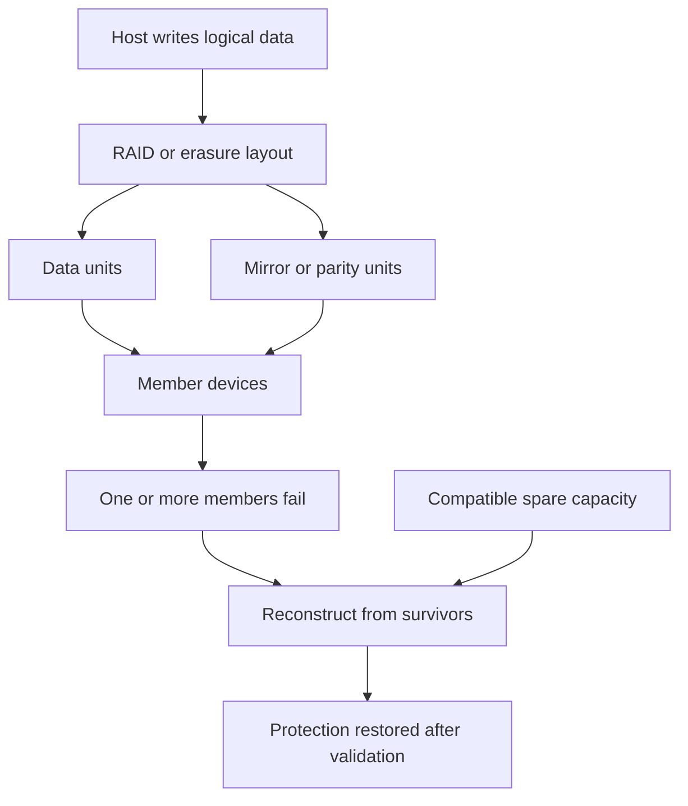

### Protection is a layered claim

| Claim | Question required |
|---|---|
| `The RAID is healthy` | Which group, which members, which parity state, which timestamp, and which checks? |
| `Two disks may fail` | In the same group, which RAID type, and are there pattern restrictions? |
| `A spare exists` | Is it compatible, healthy, available to this group, and large enough under platform rules? |
| `The rebuild completed` | Was data verified, redundancy restored, alerts cleared, and application service validated? |
| `The data is protected` | Protected from device loss, deletion, corruption, ransomware, site loss, and operator error by which separate controls? |

---

## 2. The three primitives: striping, mirroring, and parity

### Striping

Striping distributes neighboring chunks across members. With four equal devices, successive chunks can be placed on D1, D2, D3, and D4 before continuing.

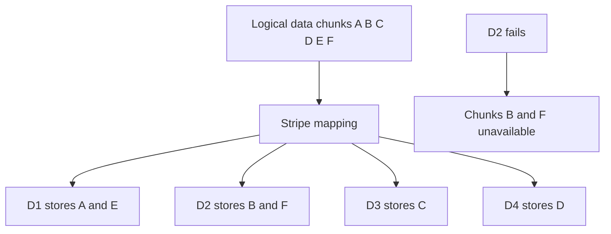

Striping alone can increase capacity and parallel service, but any member failure removes part of the logical address space. This is the essence of RAID 0.

### Mirroring

Mirroring writes another copy of the same content to a paired or otherwise mirrored location.

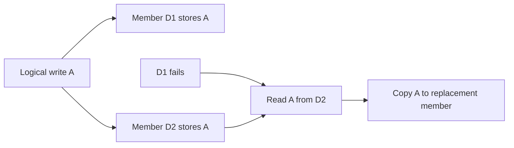

A mirror protects against loss of one copy only while another correct, reachable copy survives. A software error, administrator deletion, malware, or application corruption can be written to both copies.

### Parity

For a beginner XOR illustration, suppose three equal-width bit values are $A$, $B$, and parity $P=A\oplus B$. If $B$ is lost:

$$
B=A\oplus P
$$

The symbol $\oplus$ means exclusive OR (XOR), a bit operation where equal bits yield 0 and different bits yield 1. Real RAID parity layouts, stripe sizes, checksums, and algorithms are more complex, but the recovery principle is that redundancy plus survivors can solve for missing data.

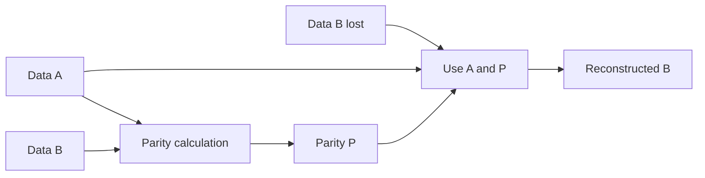

### Plain-English deep-dive: parity is not another full copy

Parity resembles a set of clues, not a duplicate book. If one page is missing, the surviving pages plus the clue can reconstruct it. If more pages disappear than the code tolerates, the clue is insufficient. Reconstructing also requires reading and computing across survivors, which is why degraded reads and rebuilds can cost performance.

---

## 3. RAID 0, 1, 5, 6, and 10

The formulas below assume $N$ equal-size members of capacity $C$, no platform overhead, no spare reservation, and fully usable members. They are educational upper bounds, not customer capacity promises.

### RAID 0: striping without redundancy

$$
U_{RAID0}=N\times C
$$

Fault tolerance: zero member failures. A member loss loses part of the array's data.

### RAID 1: mirroring

For a simple two-member mirror:

$$
U_{RAID1}=C
$$

For $N$ members arranged as equal two-way mirror pairs:

$$
U_{paired\ mirrors}=\frac{N}{2}\times C
$$

Each pair can survive one member failure. Two failures in different pairs can be survivable; two in the same pair are not. Therefore `RAID 10 can survive two disks` is incomplete without placement.

### RAID 5: single distributed parity

$$
U_{RAID5}=(N-1)\times C
$$

It can ordinarily tolerate one member failure in the RAID group. A second required-member failure before protection is restored exceeds single-parity tolerance.

### RAID 6: dual distributed parity

$$
U_{RAID6}=(N-2)\times C
$$

It can ordinarily tolerate two member failures in the RAID group. Exact implementation and behavior remain product-specific.

### RAID 10: stripe across mirrored pairs

For an even number of equal members in two-way pairs:

$$
U_{RAID10}=\frac{N}{2}\times C
$$

RAID 10 can survive failures as long as no required mirror pair loses all copies. Its fault tolerance is pattern-dependent.

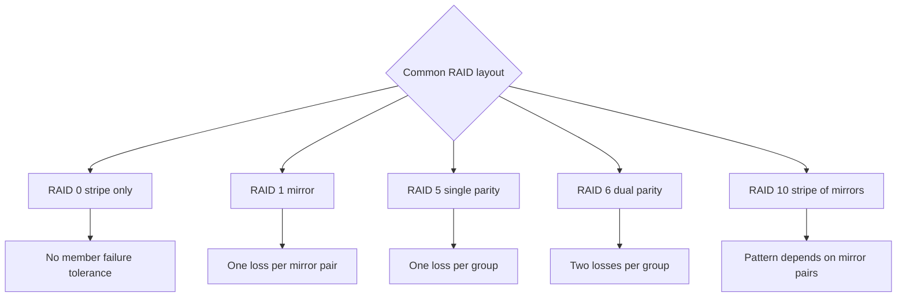

### Comparison table

| Level | Usable fraction for equal members | Basic fault tolerance | Write-work orientation | Key caution |
|---|---:|---|---|---|
| RAID 0 | $N/N$ | None | No redundancy update | One member loss is data loss |
| RAID 1 | About $1/2$ for two-way mirrors | One member per pair | Write both copies | Both copies can share failure or corruption |
| RAID 5 | $(N-1)/N$ | One member per group | Data plus single-parity maintenance | Second failure during degraded state can exceed tolerance |
| RAID 6 | $(N-2)/N$ | Two members per group | Data plus dual-parity maintenance | More protection is not backup or site resilience |
| RAID 10 | About $1/2$ | Pattern-dependent by pair | Write both members of pair | Two failures in one pair can be fatal |

### Small-write parity orientation

A small update in a parity layout may require old-data and old-parity reads plus new-data and new-parity writes, or a reconstruct-write path using other data. This is often called a **write penalty**, but a fixed multiplication must not be applied blindly to modern systems with caches, full-stripe writes, coalescing, nonvolatile logs, checksums, and platform-specific algorithms.

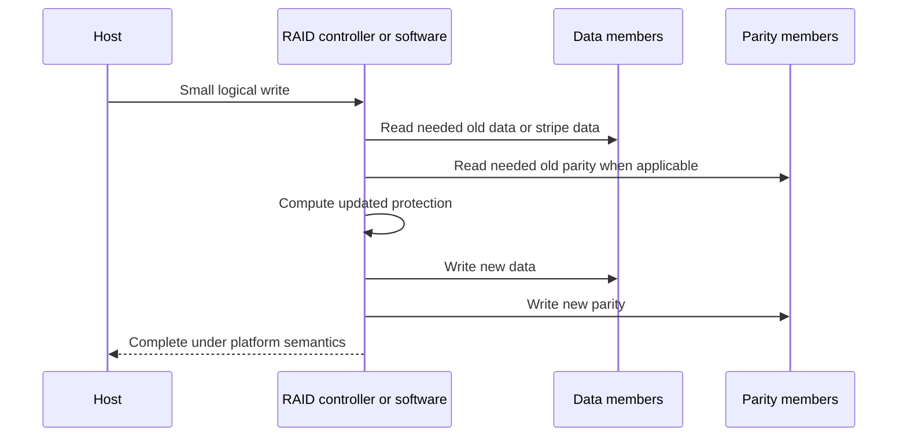

---

## 4. NetApp RAID-DP and RAID-TEC at conceptual depth

NetApp ONTAP documentation describes:

- **RAID-DP** as dual-parity RAID protection that can protect a RAID group against two simultaneous drive failures.
- **RAID-TEC** as triple-parity RAID protection intended to protect a RAID group against three simultaneous drive failures.

These are conceptual statements bounded by current official documentation. They do not authorize a particular RAID type, group size, drive combination, conversion, or repair action. Exact defaults, supported drive types, group sizing, partition behavior, capacity, performance, and operational procedures are platform- and release-sensitive.

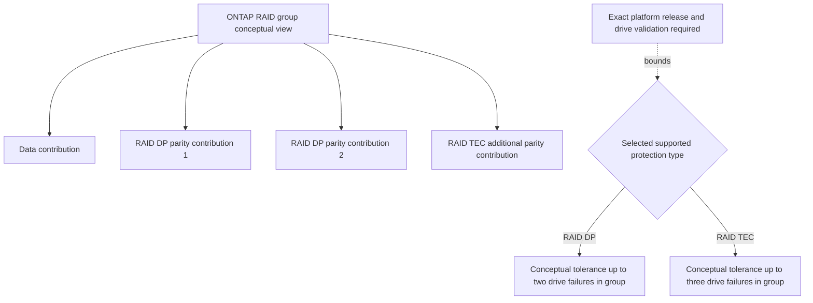

### What a TAM Technical Analyst should say

> "RAID-DP and RAID-TEC are NetApp parity-protection options documented for dual- and triple-drive failure protection within a RAID group. I would verify the exact platform, ONTAP release, drive type, RAID-group configuration, current health, and official recommendations before drawing a capacity or change conclusion. Later ONTAP Parts cover the actual storage layout."

### What not to say

- `RAID-DP is simply RAID 6 in every implementation detail.`
- `RAID-TEC is always required for large drives.`
- `A triple-parity group can survive any three failures anywhere in the customer environment.`
- `Changing RAID type is a routine, risk-free operation.`
- `NetApp defaults and maximum group sizes are stable across all releases and platforms.`

---

## 5. Erasure-coding orientation

An erasure code can be described with $k$ data fragments and $m$ redundant fragments. The total fragment count is $n=k+m$. Under the code's stated assumptions, the original data can be recovered after up to $m$ fragment losses.

$$
\text{usable fraction}=\frac{k}{k+m}
$$

$$
\text{protection overhead}=\frac{m}{k}
$$

For a synthetic $6+2$ layout with equal fragments:

$$
\text{usable fraction}=\frac{6}{8}=75\%
$$

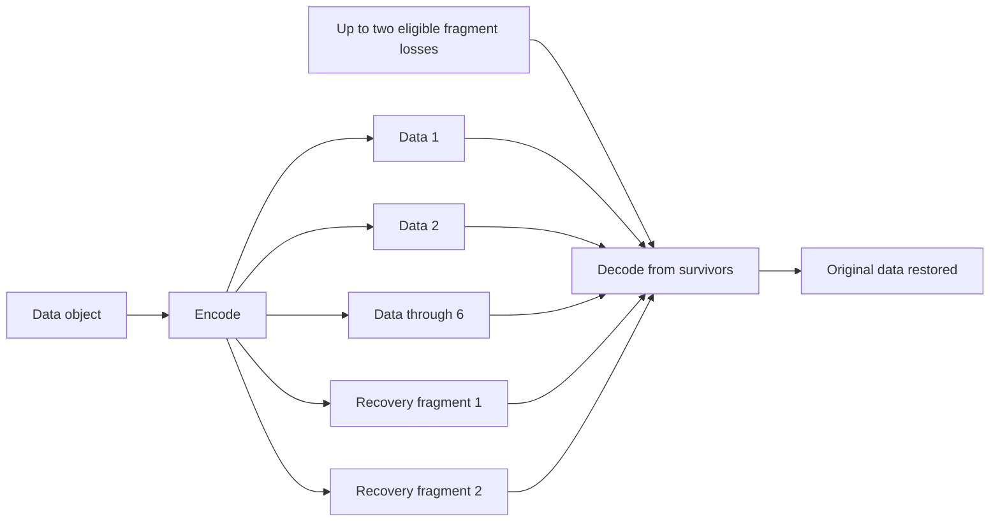

### RAID parity versus broader erasure coding

| Dimension | Local RAID parity orientation | Distributed erasure-code orientation |
|---|---|---|
| Common unit | Blocks or stripes across local members | Fragments or shards across nodes/devices/locations |
| Failure domain | Often a RAID group in one system | Can span nodes, racks, zones, or sites by design |
| Main goal | Continue and reconstruct after member loss | Capacity-efficient survival across selected distributed failures |
| Latency/network cost | Local controller or storage path | Encoding, network, and remote placement can matter |
| Critical question | Which members and parity are in this group? | Where are fragments placed, and which domains can fail together? |

The term `erasure coding` does not automatically mean geographic resilience, and `distributed` does not prove independent placement. Verify the code, fragment-placement policy, consistency model, repair behavior, and tested failure domains.

---

## 6. Usable-capacity math and overhead layers

### Plain-English deep-dive: raw is not usable

**Raw capacity** is the sum of member capacities before protection and other overhead. **Usable RAID capacity** is the logical capacity remaining after RAID redundancy under a stated simplified layout. **Available application capacity** is lower again after system partitions, metadata, reserves, file-system or volume policy, snapshots, and required headroom.

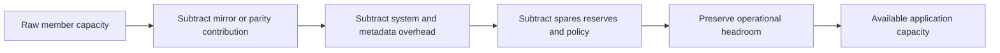

### Equal-device examples

Assume eight 12 TB decimal members and no other overhead:

| Layout | Simplified usable capacity | Efficiency |
|---|---:|---:|
| RAID 0 | $8\times12=96$ TB | 100% |
| Four RAID 1 pairs | $4\times12=48$ TB | 50% |
| RAID 5 | $(8-1)\times12=84$ TB | 87.5% |
| RAID 6 | $(8-2)\times12=72$ TB | 75% |
| RAID 10 | $(8/2)\times12=48$ TB | 50% |

If one additional 12 TB device is held as a dedicated spare outside the eight-member group, total purchased capacity is 108 TB while RAID 6 usable remains 72 TB before other overhead:

$$
\text{purchased-to-RAID-usable efficiency}=\frac{72}{108}=66.7\%
$$

### Unequal member sizes

Many simple RAID layouts are constrained by the smallest participating member. In a four-member RAID 5 orientation with 12, 12, 12, and 8 TB devices, a naive upper bound is:

$$
(4-1)\times8=24\ \text{TB}
$$

The extra 4 TB on each larger device may be unusable in that layout unless the platform supports another documented partitioning or use. Never use a generic formula where a storage system virtualizes or partitions members differently.

### Capacity mistakes

| Mistake | Consequence | Better behavior |
|---|---|---|
| Sum labels and call the result usable | Ignores parity, spares, metadata, reserves, and headroom | Show each capacity layer |
| Use largest member in formula | Overstates a smallest-member-constrained layout | Verify exact eligible contribution |
| Mix TB and TiB | Creates apparent unexplained loss | Convert through bytes and label units |
| Ignore failed or rebuilding members | Treats theoretical capacity as healthy capacity | Record current protection and allocation state |
| Count a hot spare as backup capacity | Confuses reconstruction resource with retained copy | Keep operational spare and backup inventory separate |

---

## 7. RAID groups, spares, and placement

A large storage pool may contain multiple RAID groups. Protection is normally reconstructed within the relevant group or according to platform-specific spare-sharing rules. A fleet can report many healthy drives while one group has concentrated risk.

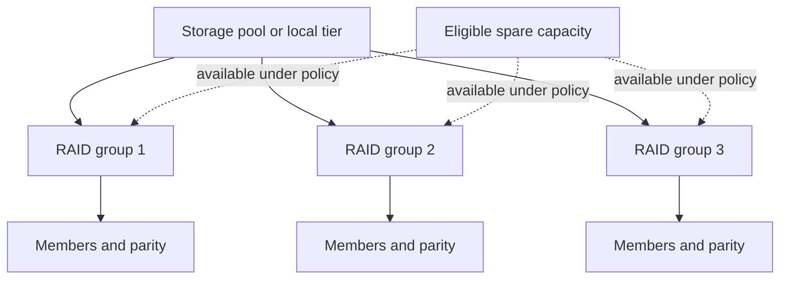

### Spare-capacity questions

- Is spare capacity dedicated, shared, partitioned, distributed, or provided another way by the platform?
- Is it compatible by type, capacity, interface, encryption, partitioning, firmware, and platform support?
- How many simultaneous failures and maintenance events can it cover?
- How quickly is failure declared and reconstruction started?
- Does an assigned spare create a new spare deficit elsewhere?
- How is spare health monitored and replenished?
- Is replacement inventory onsite, in logistics, or dependent on support entitlement?

### Hot-spare tradeoffs

| Benefit | Cost or limitation |
|---|---|
| Can begin reconstruction without waiting for a technician or shipment | Purchased capacity is not serving ordinary application data |
| Reduces time spent waiting in degraded mode | Does not shorten media reconstruction itself |
| Can reduce wrong-device handling during urgency | Compatibility and assignment still need validation |
| Provides an automated recovery resource | Can mask poor replacement logistics if spare replenishment is ignored |
| May support proactive replacement workflows | Does not protect against deletion, corruption, site loss, or too many failures |

### Failure-domain placement

Redundancy must cross the failure being considered. Members or copies can share:

- Shelf or enclosure.
- Controller or adapter.
- Cable, expander, switch, or port.
- Power supply, power distribution unit, or circuit.
- Cooling zone or rack.
- Room, building, campus, or region.
- Firmware version, manufacturing batch, age, and workload stress.
- Administrative credentials or automation error.

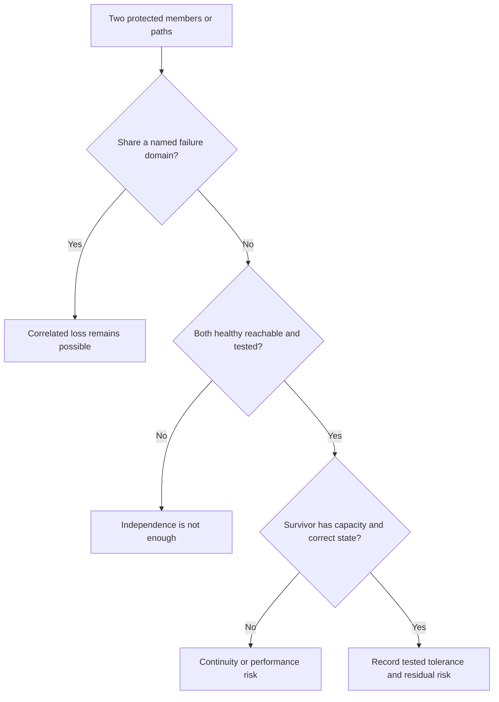

---

## 8. Failure, degraded mode, and reconstruction lifecycle

When a member is declared failed, a protected group can continue by reading surviving data or computing missing data. A spare or replacement receives reconstructed content. The group returns to full protection only after reconstruction and platform validation complete.

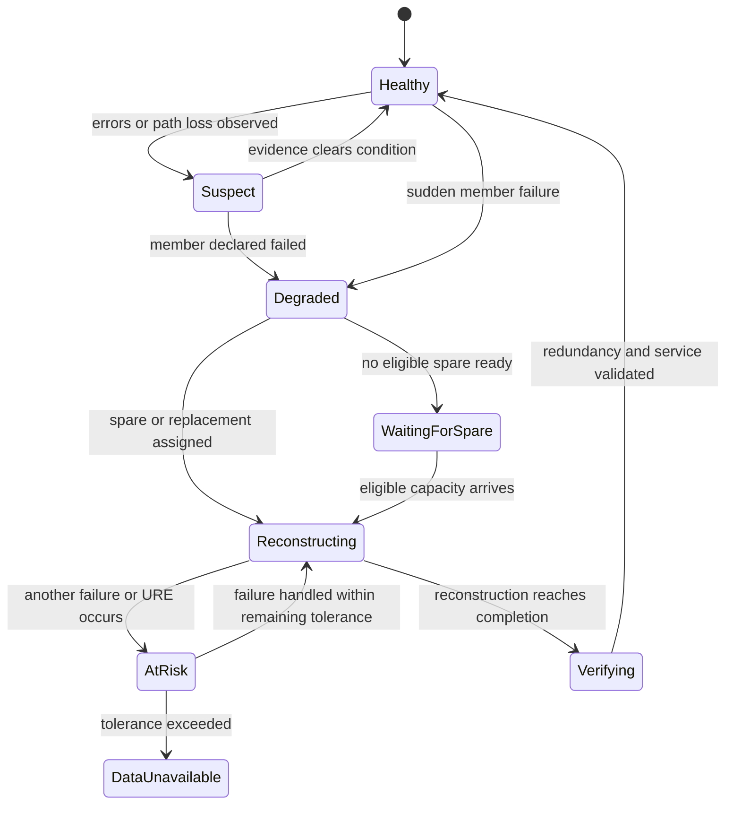

### Reconstruction sequence

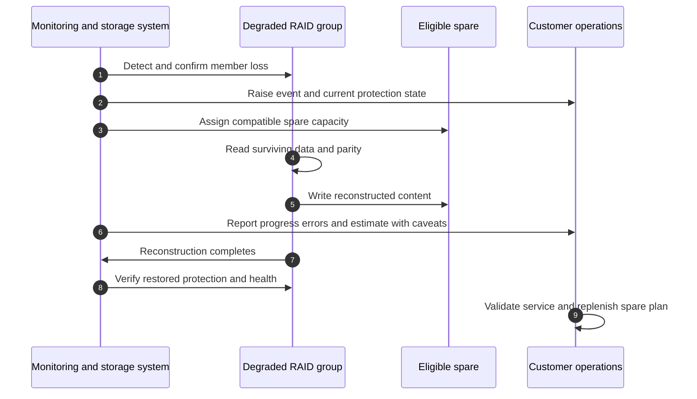

### What changes in degraded mode

| Area | Possible effect | Evidence needed |
|---|---|---|
| Redundancy | Fewer additional failures can be tolerated | Exact group and current failed/missing members |
| Read path | Missing data may be reconstructed from survivors | Member reads, parity work, cache, latency percentiles |
| Write path | Protection updates continue with altered layout/state | Platform counters, CPU, queue, and write latency |
| Background load | Reconstruction competes for devices and controllers | Rebuild rate, workload demand, throttle/policy, bottleneck |
| Operations | Replacement, escalation, communications, and risk decisions become urgent | Support procedure, owner, ETA dependencies, business calendar |
| Recovery | Backup or replica may become more important if tolerance is nearly exhausted | Copy freshness, independence, tested restore |

Do not promise that a degraded group remains fully performant, and do not assume every customer workload is affected. Measure the exact service and platform.

---

## 9. Rebuild time and reconstruction performance

A lower-bound media-copy estimate is:

$$
T_{ideal}=\frac{D}{R}
$$

where $D$ is bytes to reconstruct and $R$ is sustained effective reconstruction bytes per second. Actual elapsed time can be longer because reads come from several survivors; production I/O competes; errors cause retries; parity is computed; throttling, CPU, network, controller, destination writes, and workload policy intervene.

### Worked rebuild example

Suppose 12 TB decimal must be reconstructed at a sustained effective 180 MB/s decimal:

$$
T=\frac{12{,}000{,}000\ \text{MB}}{180\ \text{MB/s}}=66{,}666.7\ \text{s}
$$

$$
T\approx18.52\ \text{hours}
$$

At 80 MB/s effective rate:

$$
T=150{,}000\ \text{s}\approx41.67\ \text{hours}
$$

Neither figure is a customer estimate until exact reconstructed bytes, platform method, priority, observed rate, workload, errors, and bottlenecks are known.

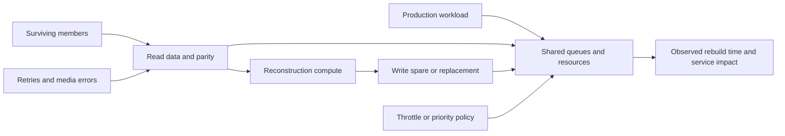

### Reconstruction questions

1. How many bytes need reconstruction: full device, allocated regions, used stripes, or another platform-defined scope?
2. Which survivors must be read, and are any showing errors?
3. Where is the bottleneck: source devices, controller CPU, cache, link, destination, or policy?
4. What production I/O must continue, and what SLO is protected?
5. Is rebuild rate stable or estimated from a brief sample?
6. Are scrubs, backups, migrations, tiering, or other rebuilds competing?
7. Can priority be changed safely under official guidance, and what tradeoff follows?
8. What validates full protection after completion?

---

## 10. UREs, correlated failure, and large-drive risk

Part 5 defined an **unrecoverable read error (URE)** as a read the device cannot correct. Rebuilds read large portions of surviving members, so they can expose a latent unreadable region when redundancy is already reduced.

### Simplified read-risk orientation

If $p$ is a stated bit-level URE probability and $N$ bits are read, an independent-trial orientation is:

$$
P(\text{at least one URE})=1-(1-p)^N
$$

This is not a rebuild-outcome calculator. Device specifications may state limits or rates differently; errors are not guaranteed independent; controllers retry and correct; RAID layouts and checksums differ; scrubbing may have found defects; only some bytes may be read; and a URE does not always mean application data loss if further redundancy exists.

### Why larger devices can increase exposure windows

Larger devices can require more data to read and reconstruct, all else equal. More bytes and longer degraded duration create more opportunity to encounter another fault. However, newer devices, SSDs, faster interfaces, allocation-aware rebuilds, stronger protection, spares, scrubbing, and platform design can change the result. `Large drives are unsafe` is not a defensible universal claim.

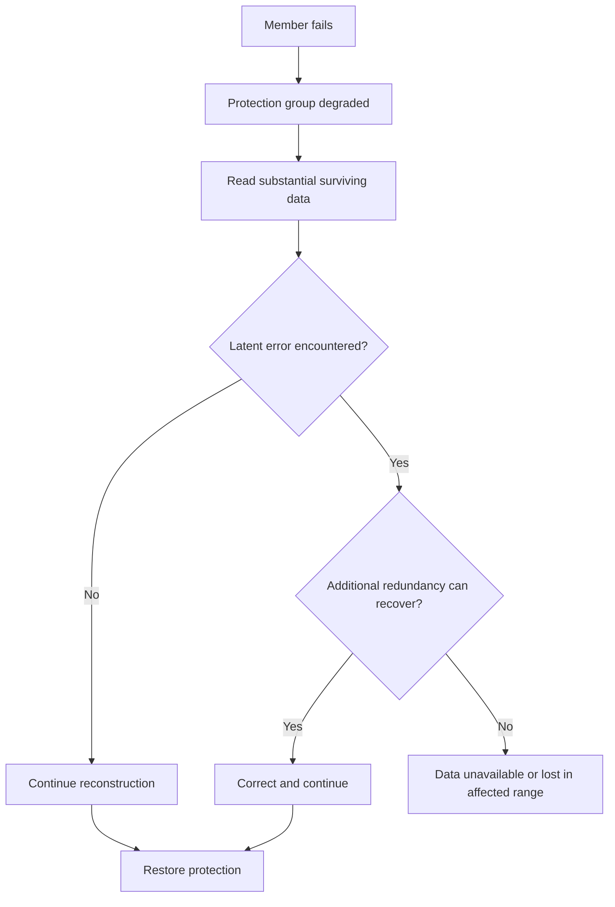

### Correlated failures break simple probability stories

Independent failure assumptions can be weakened by:

- Same age and write history.
- Same firmware defect or manufacturing batch.
- Shared enclosure, power, cooling, vibration, or cabling.
- Environmental event or operator action.
- Rebuild stress applied to equally aged survivors.
- Common workload or software corruption.

TAM analysis should identify shared causes rather than multiply generic annual failure rates and call the result exact.

---

## 11. RAID is not backup

RAID protects availability against specified member failures. A **backup** is a separately managed recoverable copy with retention and restore purpose. RAID members usually share the same active namespace and administrative operations.

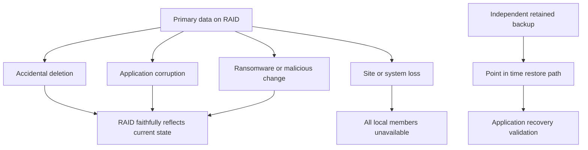

| Threat | RAID alone | Snapshot | Replication | Independent backup/archive |
|---|---|---|---|---|
| One member failure within tolerance | Primary purpose | Usually relies on underlying storage | Replica may remain available | Copy may restore but is slower operationally |
| Accidental deletion | Current state normally loses the file | Earlier point may help if retained | Deletion may replicate | Retained copy can help if policy covers it |
| Logical corruption | Can preserve corrupt data perfectly | Earlier clean point may help | Corruption may replicate | Clean retained recovery point may help |
| Ransomware/admin compromise | Same system/credentials may be exposed | Protection depends on immutability and access | Replica may share trust | Independent/immutable controls improve separation |
| Site loss | Local RAID members share site | Local snapshot shares site | Remote replica can help | Off-domain backup can help |
| Long-term retention | Not its purpose | Policy-specific | Usually continuity-focused | Backup/archive is designed for retention use cases |

RAID, snapshot, replication, backup, archive, high availability, and disaster recovery are complementary controls. Part 8 develops these distinctions.

---

## 12. TAM discovery, recommendations, and JD mapping

### Customer discovery questions

#### Business and data

1. Which services, data sets, and transactions depend on each protected group?
2. What interruption, performance degradation, data loss, RPO, RTO, and maintenance constraints apply?
3. Which data can be recreated, and which has regulatory or business retention requirements?

#### Layout and identity

4. What exact platform, release, RAID type, group boundaries, member identities, capacities, media, firmware, and partitioning are present?
5. Which members hold data, parity, root/system contribution, or spare capacity?
6. Are device sizes equal, and how does the platform use mixed sizes?
7. Which shelves, controllers, adapters, paths, power, racks, and sites contain group members?

#### Health and failure

8. Is every group healthy, degraded, reconstructing, verifying, or awaiting a spare?
9. Which corrected, uncorrectable, timeout, path, temperature, or environmental events exist?
10. When was the last scrub or integrity check, and what did it prove under current documentation?
11. Are failures correlated by model, batch, age, firmware, location, or workload?

#### Spare and replacement

12. How is spare capacity provided and assigned?
13. Is the spare compatible, large enough, healthy, and available now?
14. What replacement entitlement, onsite stock, logistics, owner, and time zone apply?
15. After one failure, what protects against the next and how quickly is the spare pool replenished?

#### Reconstruction and recovery

16. How many bytes are expected to reconstruct, at what observed rate, with which bottleneck and workload impact?
17. Which production SLOs constrain rebuild priority?
18. Which independent backup or replica is current, and when was restore tested?
19. What official support case or escalation path is active?

### Recommendation decision flow

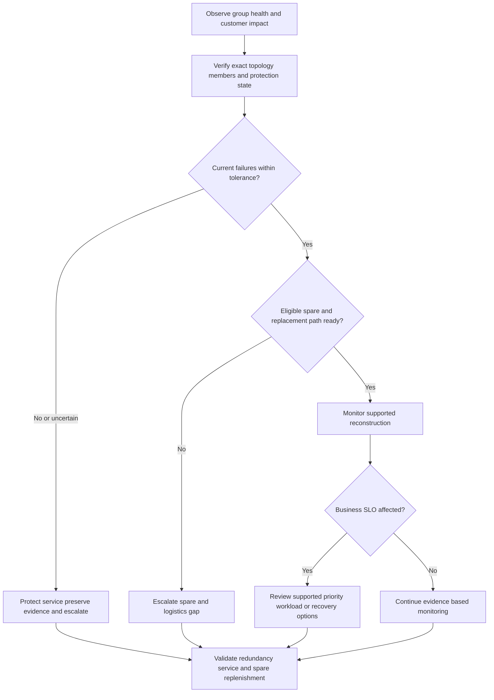

### Recommendation patterns

| Evidence-backed condition | Customer risk | Bounded recommendation | Validation and residual risk |
|---|---|---|---|
| Group degraded and no eligible spare | Longer reduced-protection window | Follow official support path; confirm replacement logistics and independent recovery copy; avoid unsafe removal | Spare/replacement assigned and reconstruction starts; second failure risk remains |
| Rebuild estimate conflicts with peak workload | Service latency or prolonged exposure | Correlate effective rebuild rate and SLO; review supported scheduling/priority options with owners | Service and rebuild monitored through representative peak; estimate can change |
| Mixed-size members waste capacity | Procurement and capacity shortfall | Verify platform behavior and supported expansion options before purchase | Current official design review; migration/change risk remains |
| Members share enclosure/power | One event can exceed assumed independent tolerance | Map physical placement and compare supported diversity options | Validated topology and failure exercise; other common causes remain |
| Customer says RAID replaces backup | Deletion, corruption, ransomware, or site loss may be unrecoverable | Document threat-specific controls, restore evidence, and gaps; build Part 8 recovery plan | Successful scoped restore; no test covers every threat |

### Explicit JD mapping

| JD responsibility | Part 6 contribution | Arti transfer and honest gap |
|---|---|---|
| Storage and virtualization depth | Explains group layout, parity, mirrors, spares, and reconstruction | Systems thinking transfers; no production NetApp RAID ownership claimed |
| Understand customer environment | Connects group members to shelves, power, paths, workloads, and recovery | M365 dependency mapping helps discover shared fate |
| Mitigate risk and improve stability | Identifies degraded-state, URE, spare, rebuild, and correlated-failure exposure | CRITSIT prioritization transfers; storage procedure requires SME/support |
| Analyze customer data | Uses capacity, state, errors, rebuild rates, and confidence | Analytics strength transfers; counters/tools need authorized practice |
| Provide strategic advice | Compares protection, capacity efficiency, failure domains, and replacement logistics | Advisory method transfers; current platform design must be verified |
| Improve support experience | Builds exact device/group/timeline/protection evidence and exact ask | Escalation-package quality is a proven Microsoft strength |

### Honest production-gap note

> "I can explain RAID layouts, capacity formulas, failure-pattern tolerance, spare tradeoffs, reconstruction risk, and why RAID is not backup. I have not administered production NetApp RAID groups or replaced a failed NetApp drive. In a customer account I would verify exact ONTAP and hardware documentation, current group state, device identity, support entitlement, and the approved procedure, and I would work under the lead TAM, Support, and storage owner rather than improvising a change."

---

## 13. Fully synthetic worked scenario: Cedar Bank Analytics

> **Synthetic case:** Cedar Bank Analytics and every device, workload, event, and result below are fictional. The scenario is not a NetApp platform recommendation or a record of customer work.

The bank has a reporting service with two synthetic protection groups:

- **Group A:** eight 12 TB equal members in a generic RAID 6 teaching layout plus one dedicated 12 TB hot spare.
- **Group B:** eight 12 TB members arranged as four RAID 10 mirror pairs.

The reporting workload peaks at 09:00 with 400 MiB/s reads and 9,000 small writes/s. At 02:00, one Group A member fails. Reconstruction starts at 03:00 onto the spare. The initial dashboard projects 20 hours based on a short quiet-period sample. At 09:00, effective reconstruction falls from 180 MB/s to 75 MB/s and application 99th-percentile latency rises.

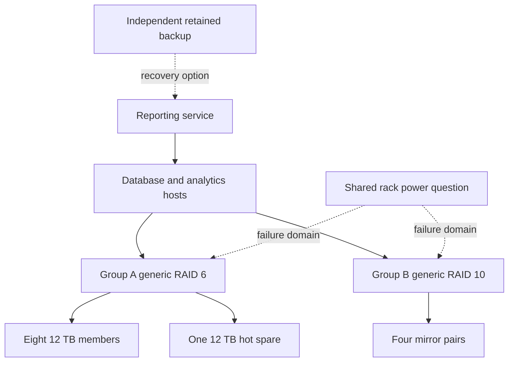

### Capacity calculations

Group A simplified usable capacity:

$$
(8-2)\times12=72\ \text{TB}
$$

Including dedicated spare in purchased capacity:

$$
9\times12=108\ \text{TB purchased}
$$

$$
\frac{72}{108}=66.7\%\ \text{RAID-usable before other overhead}
$$

Group B simplified usable capacity:

$$
\frac{8}{2}\times12=48\ \text{TB}
$$

### Rebuild estimates

At 180 MB/s:

$$
\frac{12{,}000{,}000}{180}=66{,}666.7\ \text{s}\approx18.52\ \text{h}
$$

At 75 MB/s:

$$
\frac{12{,}000{,}000}{75}=160{,}000\ \text{s}\approx44.44\ \text{h}
$$

If the first three hours averaged 180 MB/s, the reconstructed amount is:

$$
180\times10{,}800=1{,}944{,}000\ \text{MB}=1.944\ \text{TB}
$$

Remaining simplified bytes are 10.056 TB. At 75 MB/s:

$$
\frac{10{,}056{,}000}{75}=134{,}080\ \text{s}\approx37.24\ \text{h}
$$

Projected total becomes about 40.24 hours from rebuild start under the two-rate simplification. This still excludes platform-specific scope and future rate changes.

### Risk analysis

| Evidence | Finding | Risk | Confidence |
|---|---|---|---|
| Group A has one failed member and active rebuild | Group is degraded but within generic dual-parity teaching tolerance | Another two required-member failures could exceed tolerance; exact platform behavior must be verified | High for synthetic state, not a product claim |
| Rate falls during business peak | Initial 20-hour estimate is not stable | Longer exposure and application latency | High for arithmetic; cause remains medium |
| 99th-percentile latency rises with workload and rebuild | Contention is correlated | Storage, host, controller, or application demand could be causal | Medium until layers are separated |
| Both groups may share rack power | RAID layouts may share a physical failure domain | One power event could affect several groups | Low until physical map is validated |
| Backup restore test is nine months old | Independent recovery exists but current recoverability is uncertain | Data may be retained yet miss current RTO | Medium |

### Competing hypotheses for latency

1. Rebuild reads and writes saturate a shared controller resource.
2. Production demand alone reaches a queue limit at 09:00.
3. A host or network path becomes the bottleneck.
4. Retries from another aging member slow reconstruction and foreground I/O.
5. Database cache behavior changes during the reporting cycle.

### Customer recommendations

| Priority | Action | Owner | Validation | Residual risk |
|---:|---|---|---|---|
| 1 | Keep the official support/replacement process active; preserve exact group, device, error, and rebuild evidence | Storage owner and Support | Group returns to verified full protection | Other members and shared domains can still fail |
| 2 | Recalculate rebuild ETA from remaining bytes and a range of effective rates; stop presenting one-point certainty | Technical Analyst with storage owner | Hourly range and assumptions recorded | Rate can change again |
| 3 | Align application, host, path, controller, member, and rebuild percentiles across peak | Performance workstream | One evidence timeline supports or rejects contention hypotheses | Observational data may not prove cause |
| 4 | Validate rack, power, shelf, path, firmware, age, and batch failure domains | Infrastructure owners | Approved physical and logical map | Unknown common causes remain |
| 5 | Review current backup restore evidence and schedule a scoped test under Part 8 governance | Recovery owner | Timed application recovery point and result | Test scope is bounded |
| 6 | Replenish spare capacity after reconstruction and verify eligibility for remaining groups | Storage owner | Current spare report and logistics plan | Simultaneous failures can exceed inventory |

### Executive summary

> "The reporting service remains available in this synthetic scenario, but Group A is operating with reduced protection and the original rebuild estimate is no longer credible under production load. The immediate priorities are supported reconstruction monitoring, accurate ETA ranges, application-impact control, and verification of the independent recovery path. We should not call the latency root cause or the shared-power risk proven until the cross-layer timeline and physical map are complete."

---

## 14. Failure modes, misconceptions, and troubleshooting

| Mistake | Why it is unsafe | Better behavior |
|---|---|---|
| `RAID 6 survives any two failures` | Scope is per group and platform; other dependencies can fail | Name exact group, members, failure pattern, and shared domains |
| `RAID 10 survives two drives` | Two in one mirror pair can lose data | Draw pair placement before stating tolerance |
| `The spare means we are protected` | It only enables reconstruction and may be incompatible | Verify health, eligibility, size, assignment, and remaining tolerance |
| `Rebuild takes drive size divided by interface speed` | Effective rate is constrained by survivors, workload, policy, and errors | Measure remaining bytes and observed rate range |
| `A URE means the whole array is lost` | Additional redundancy or a limited range may recover | Follow exact platform evidence and protection path |
| `No URE means rebuild is safe` | Other device, path, power, firmware, and operator failures remain | Assess all competing risks and recovery copies |
| `RAID is backup` | Active deletion/corruption and site loss can affect RAID | Maintain independent retained and tested recovery copies |
| `More parity is always better` | Capacity, write work, support, cost, and workload fit change | Compare customer objectives and supported designs |
| Pulling the suspected disk immediately | Wrong identity or platform state can worsen failure | Verify slot/serial/group and follow official support procedure |
| Clearing alerts after rebuild | Can hide underlying errors or spare deficit | Validate full protection, service, logs, and replenishment |

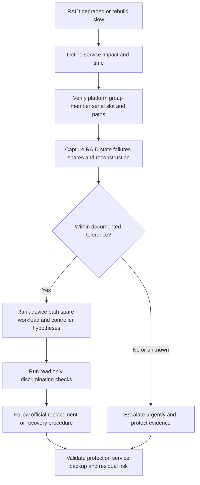

### Minimum escalation package

- Business service, impact, affected data, start time, and change history.
- Platform, software release, group identity, RAID type, group size, and layout.
- Member serials, slots, capacities, media, firmware, paths, and current states.
- Error messages, corrected/uncorrected events, timestamps, and environmentals.
- Spare inventory, eligibility, assignment, and replacement logistics.
- Reconstruction start, bytes/rate/progress history, ETA assumptions, and workload impact.
- Backup/replica freshness and last restore evidence.
- Actions already taken, safety boundaries, exact ask, and next checkpoint.

---

## 15. Paper and whiteboard lab

No production access is needed. Label every input and output synthetic.

### Lab scenario

You have twelve 10 TB equal devices and may model these layouts:

- One 10-member RAID 6 group plus two hot spares.
- Two five-member RAID 5 groups plus two hot spares.
- Five RAID 1 pairs plus two hot spares.
- One synthetic $8+2$ erasure-code set plus two spare devices outside the code set.

### Tasks

1. Draw each layout with data, parity, mirror pairs, group boundaries, and spares.
2. Calculate raw purchased, RAID usable, redundancy overhead, and purchased-to-usable efficiency.
3. Mark which one-, two-, and three-member failure patterns are tolerated.
4. For mirrors, test two losses in the same pair and in different pairs.
5. Add one latent URE during rebuild and show which layouts still have recovery choices.
6. Add shared shelf power and redraw the true failure domains.
7. Estimate 10 TB reconstruction at 250, 125, and 60 MB/s.
8. Create a rate range instead of a single ETA.
9. Add a 09:00 workload peak and explain performance evidence needed.
10. Create a spare-eligibility table with size, media, firmware, location, and state.
11. Add accidental deletion and prove why no RAID layout supplies a retained earlier copy.
12. Write a customer recommendation with evidence, action, owner, validation, and residual risk.

### Expected arithmetic checks

Ten-member RAID 6:

$$
(10-2)\times10=80\ \text{TB usable}
$$

Including two spares, purchased capacity is 120 TB:

$$
\frac{80}{120}=66.7\%
$$

Each five-member RAID 5 group:

$$
(5-1)\times10=40\ \text{TB}
$$

Two groups total 80 TB, but a two-drive failure is tolerated only if no group loses more than one member.

Five mirror pairs:

$$
5\times10=50\ \text{TB usable}
$$

The $8+2$ erasure set:

$$
\frac{8}{10}=80\%\ \text{code efficiency}
$$

Purchased-to-code-usable with two outside spares:

$$
\frac{80}{120}=66.7\%
$$

Reconstruct 10 TB decimal:

$$
\frac{10{,}000{,}000}{250}=40{,}000\ \text{s}\approx11.11\ \text{h}
$$

$$
\frac{10{,}000{,}000}{125}=80{,}000\ \text{s}\approx22.22\ \text{h}
$$

$$
\frac{10{,}000{,}000}{60}=166{,}666.7\ \text{s}\approx46.30\ \text{h}
$$

### Whiteboard pass criteria

- [ ] Group boundaries and spare capacity are visually separate.
- [ ] Fault tolerance includes failure pattern, not only count.
- [ ] Every capacity result states equal-size and no-other-overhead assumptions.
- [ ] Rebuild estimate states bytes, effective rate, workload, and uncertainty.
- [ ] URE and correlated-failure risks remain bounded rather than predicted exactly.
- [ ] Physical failure domains are drawn above logical RAID.
- [ ] Backup is a separate retained recovery path.
- [ ] No synthetic result is described as NetApp production experience.

---

## 16. Self-test

1. Define RAID, member, stripe, striping, mirror, parity, RAID group, spare, degraded mode, and reconstruction.
2. Explain XOR parity with a two-data-unit example.
3. State why parity is not a full duplicate.
4. Draw RAID 0, 1, 5, 6, and 10.
5. Calculate usable capacity for each level with equal members.
6. State each level's fault tolerance and pattern caveat.
7. Explain why two RAID 10 failures can be safe or fatal.
8. Explain small-write parity work without asserting a universal fixed penalty.
9. Describe RAID-DP and RAID-TEC only to current official conceptual depth.
10. List five NetApp-specific facts that require current platform validation.
11. Define a $k+m$ erasure code and calculate usable fraction.
12. Distinguish local RAID parity from distributed erasure-code placement.
13. Explain raw, RAID-usable, available, and purchased-to-usable capacity.
14. Calculate mixed-size-member constraints in a simple layout.
15. Explain RAID-group boundaries and spare eligibility.
16. Compare hot-spare benefits and costs.
17. Draw the degraded-to-reconstructed lifecycle.
18. List possible performance changes during degraded mode.
19. Calculate a rebuild time and explain why it is a lower-bound orientation.
20. Define URE, latent error, and correlated failure in a rebuild context.
21. Explain why larger capacity can increase exposure without saying large drives are universally unsafe.
22. List ten shared failure domains.
23. Explain why RAID is not backup, replication, archive, or DR.
24. Ask the complete TAM discovery set for a degraded group.
25. Recreate Cedar Bank's math, hypotheses, actions, and executive summary.
26. Complete the paper lab and answer Q1-Q8 aloud.

---

## 17. Official Source Anchors

**Date checked: 2026-08-24.** The sources below anchor broad standards and official NetApp terminology. Exact RAID defaults, supported RAID types, group sizes, spare rules, drive types, partition behavior, capacity, reconstruction, commands, alerts, and procedures are version- and platform-sensitive. Hardware Universe and support content may require authorized access. Never invent a current configuration, internal process, or customer result.

| Topic | Official or vendor-neutral source | Bounded use and access note |
|---|---|---|
| Storage and RAID terminology | [SNIA Dictionary](https://www.snia.org/education/online-dictionary) | Vendor-neutral orientation. Definitions do not establish a product's implementation or support status. |
| ONTAP RAID protection levels | [RAID protection levels for disks](https://docs.netapp.com/us-en/ontap/disks-aggregates/raid-protection-levels-disks-concept.html) | Official public conceptual source for RAID-DP and RAID-TEC. Select the exact ONTAP release and follow linked platform guidance. |
| ONTAP RAID groups | [RAID groups and local tiers](https://docs.netapp.com/us-en/ontap/disks-aggregates/raid-groups-concept.html) | Official broad RAID-group orientation. Exact sizing and behavior must be verified for the platform and drive type. |
| ONTAP hot spares | [How hot spare disks work](https://docs.netapp.com/us-en/ontap/disks-aggregates/hot-spare-disks-work-concept.html) | Official conceptual source. Spare assignment, partitioning, minimums, and operational action are release/platform-sensitive. |
| ONTAP disks and local tiers | [Disks and local tiers management](https://docs.netapp.com/us-en/ontap/disks-aggregates/) | Official documentation area for supported management. Do not infer procedures from this Part. |
| NetApp hardware systems | [ONTAP hardware systems documentation](https://docs.netapp.com/us-en/ontap-systems/) | Use exact system, shelf, drive, cabling, service, and replacement documentation. |
| Platform limits and supported components | [NetApp Hardware Universe](https://hwu.netapp.com/) | Official and potentially access-gated. Verify exact platform, drive, shelf, capacity, and rule on the decision date. |
| NetApp support and replacement path | [NetApp Support Site](https://mysupport.netapp.com/) | Official support portal; procedures, cases, alerts, firmware, and entitlements can be gated. |
| Erasure-code terminology | [SNIA Dictionary](https://www.snia.org/education/online-dictionary) | Broad orientation only; exact code, placement, repair, durability, and performance belong to the selected implementation. |

### Source-use discipline

- Record system, ONTAP release, RAID group, RAID type, member IDs, capacities, media, firmware, shelf/path placement, and date.
- Treat a healthy summary, exact member state, physical topology, and recovery test as separate evidence.
- Use current official procedures before assigning, removing, replacing, zeroing, or changing any member or RAID configuration.
- Confirm spare eligibility and group boundaries rather than relying on total fleet counts.
- Present rebuild time as a range with measured rate and assumptions.
- State gated access or missing evidence; do not invent NetApp commands, defaults, thresholds, or outcomes.

---

## Likely Interview Questions

### Q1. Explain striping, mirroring, and parity in plain English.

> **Model answer:** "Striping spreads neighboring data across devices, like dealing cards among players; it can add capacity and parallelism but no protection by itself. Mirroring stores another full copy, like a second ledger. Parity stores mathematical recovery information, like clues that can solve for missing pieces within a defined tolerance. A RAID layout combines these primitives, and I always state the group boundary, member count, failure pattern, and remaining protection."

**Follow-up depth:** Draw one stripe, a two-way mirror, and an XOR parity example, then explain why parity reconstruction creates read, compute, and write work.

### Q2. Compare RAID 0, 1, 5, 6, and 10.

> **Model answer:** "RAID 0 stripes with no redundancy. RAID 1 mirrors and normally survives one member loss per mirror pair. RAID 5 uses one parity contribution and normally survives one member failure per group. RAID 6 uses dual parity and normally survives two per group. RAID 10 stripes across mirror pairs; it uses about half the equal-member raw capacity and can survive multiple losses only when no pair loses all copies. These are simplified orientations; platform behavior and overhead require current validation."

**Follow-up depth:** Calculate capacity for eight 12 TB members and test two RAID 10 failures in the same pair versus different pairs.

### Q3. What are RAID-DP and RAID-TEC?

> **Model answer:** "NetApp ONTAP documentation describes RAID-DP as dual-parity protection for up to two simultaneous drive failures in a RAID group and RAID-TEC as triple-parity protection for up to three. I keep that answer conceptual. I would verify the exact platform, ONTAP release, drive type, RAID-group layout, defaults, support rules, and current health before making a capacity or change recommendation. I would not claim they are identical to generic RAID levels in every implementation detail."

**Follow-up depth:** Name the official documentation sources, access limitations, and later Parts that cover ONTAP layout and operations.

### Q4. How do you calculate RAID usable capacity?

> **Model answer:** "For equal members in a simplified model, RAID 0 is $N C$, RAID 5 is $(N-1)C$, RAID 6 is $(N-2)C$, and two-way mirrors or RAID 10 are about $(N/2)C$. I then separately account for spares, system partitions, metadata, reserves, snapshots, and operational headroom. Mixed sizes can constrain contribution to the smallest member unless the exact platform documents another layout. I preserve bytes and distinguish TB from TiB."

**Follow-up depth:** Calculate eight 12 TB RAID 6 members plus one spare and explain why 72 TB is not final application-available capacity.

### Q5. What happens when a RAID group becomes degraded?

> **Model answer:** "The group has lost a required member or contribution but remains accessible within its documented tolerance. Reads may reconstruct missing data from survivors, writes continue under altered protection, and a spare or replacement receives reconstructed content. Redundancy is reduced and performance can change while rebuild competes for devices, controller, cache, links, and queues. I verify exact state, spare eligibility, errors, customer impact, backup readiness, and official support procedure, then validate full protection after completion."

**Follow-up depth:** Draw the state lifecycle and explain why `rebuild 100 percent` still needs verification, service validation, and spare replenishment.

### Q6. Why are UREs and correlated failures important during rebuild?

> **Model answer:** "A rebuild reads substantial surviving data while protection is already reduced, so a latent unreadable region may be discovered at the worst time. Additional redundancy may recover it; otherwise an affected range can become unavailable. Correlated failures matter because same-age devices, shared firmware, enclosure, power, heat, or rebuild stress weaken independent-failure assumptions. I use exact device and platform evidence, not a generic URE rate as a deterministic prediction."

**Follow-up depth:** Explain the probability orientation and all reasons it is not a customer rebuild calculator.

### Q7. Why is RAID not backup?

> **Model answer:** "RAID is designed mainly to keep current data available through specified member failures. It normally reflects current deletions, corruption, malware changes, and administrative mistakes, and local members can share a system or site failure. A backup is a separately managed retained copy with a restore purpose. I evaluate RAID, snapshots, replication, backup, archive, immutability, and DR as distinct controls and ask for tested application recovery, not copy existence alone."

**Follow-up depth:** Compare all controls against device loss, deletion, corruption, ransomware, site loss, and long-term retention.

### Q8. How would you handle a degraded NetApp system given your Microsoft background?

> **Model answer:** "I would use my proven CRITSIT method: define business impact, preserve one timeline, verify identities and scope, organize evidence, maintain customer communication, and engage the correct technical owner. I would not improvise a NetApp disk action. My RAID knowledge is conceptual and synthetic until authorized practice; I would verify current ONTAP and hardware documentation, exact group/member/spare state, and the Support procedure under the storage owner and lead TAM, then track reconstruction, service validation, residual risk, and follow-up."

**Follow-up depth:** Give a sanitized Microsoft escalation example, then list the exact NetApp facts and permissions that analogy cannot supply.

---

## 30-Second Memory Hooks

- **Striping:** Spread data; no protection by itself.
- **Mirror:** Another full copy, subject to shared fate.
- **Parity:** Recovery clues, not a duplicate book.
- **RAID group:** The boundary where failure tolerance is counted.
- **RAID 0:** All capacity, zero member tolerance.
- **RAID 1:** One loss per healthy two-way pair.
- **RAID 5:** One parity, one member loss per group.
- **RAID 6:** Two parity contributions, two member losses per group.
- **RAID 10:** Stripe of mirrors; failure placement matters.
- **RAID-DP:** NetApp dual-parity concept; verify exact platform.
- **RAID-TEC:** NetApp triple-parity concept; verify exact platform.
- **Erasure code:** $k$ data plus $m$ recovery fragments.
- **Raw versus usable:** Parity, spares, metadata, reserves, and headroom all reduce the ladder.
- **Hot spare:** Ready reconstruction capacity, not backup.
- **Degraded:** Online may mean less protected and slower.
- **Rebuild:** Read survivors, compute missing data, write replacement, verify.
- **ETA:** Remaining bytes divided by effective rate, reported as a range.
- **URE:** A read the device cannot correct.
- **Correlated failure:** Shared causes defeat simple independent math.
- **Large drive:** More bytes can mean longer exposure, but exact design decides risk.
- **Failure domain:** Put alternatives across what can fail together.
- **RAID is not backup:** Current availability is not retained history.
- **Arti's bridge:** Bring incident discipline; do not improvise NetApp operations.

---

## Completion Checklist

- [ ] Define every RAID, member, group, spare, parity, degraded, reconstruction, and erasure-code term with an analogy.
- [ ] Draw striping, mirroring, and XOR parity from first principles.
- [ ] Draw RAID 0, 1, 5, 6, and 10 and state capacity assumptions.
- [ ] Explain failure count and pattern for every layout.
- [ ] Calculate equal-member and mixed-size usable capacity.
- [ ] Explain small-write parity work without a universal fixed penalty.
- [ ] Explain RAID-DP and RAID-TEC only to verified official conceptual depth.
- [ ] Calculate $k+m$ erasure-code efficiency and identify placement questions.
- [ ] Separate raw, RAID-usable, purchased, available, and application capacity.
- [ ] Map multiple RAID groups and spare eligibility.
- [ ] Explain hot-spare benefits, costs, assignment, and replenishment.
- [ ] Draw healthy, suspect, degraded, reconstructing, verifying, and failed states.
- [ ] Calculate rebuild time from bytes and effective rate and present a range.
- [ ] Explain reconstruction performance contention and SLO tradeoffs.
- [ ] Explain URE, latent error, large-drive exposure, and correlated-failure caveats.
- [ ] Map logical protection across physical failure domains.
- [ ] Prove why RAID is not backup, replication, archive, or DR.
- [ ] Ask the complete discovery set and write a bounded recommendation.
- [ ] Recreate the Cedar Bank scenario, calculations, hypotheses, and executive summary.
- [ ] Complete the paper lab, self-test, and Q1-Q8 aloud.
- [ ] State Arti's Microsoft transfer and production NetApp gap precisely.
- [ ] Recheck exact official ONTAP, platform, drive, spare, and support procedures before real use.

---

*Next suggested section:* [Part 7 - File Systems, Volume Managers, Caches, Journals, and Consistency](Part-07-filesystems-volume-managers-caches-consistency.md)