# Part 7 - File Systems, Volume Managers, Caches, Journals, and Consistency

> **Section goal:** Understand how a computer turns block addresses into named files, how volume managers and file systems allocate and protect metadata, and what caches, journals, write ordering, copy-on-write, checksums, snapshots, and crash recovery can and cannot guarantee. By the end, Arti should be able to trace an application write through every ownership layer, distinguish consistency from durability, and ask the questions needed before diagnosing corruption or recommending a storage change.

Covers index item **7** and maps directly to job-description responsibilities for storage and virtualization depth, customer-environment discovery, risk analysis, supportability, troubleshooting, data protection reasoning, customer-specific recommendations, escalation quality, and clear technical communication.

This Part teaches vendor-neutral architecture. File-system, database, operating-system, hypervisor, device, and storage behavior depends on exact versions and configuration. WAFL is introduced only as a deferred bridge to Part 20; no ONTAP write-path, consistency-point, snapshot, recovery, or performance behavior is inferred here.

> **Evidence boundary:** All systems, file systems, devices, timings, incidents, and outcomes below are synthetic. Arti's SharePoint, OneDrive, and Microsoft 365 support experience supplies transferable evidence and escalation discipline, not production ownership of host file systems, databases, WAFL, or NetApp storage.

---

## 1. The storage stack and its owners

A block device presents numbered address ranges. A **file system** adds names, directories, allocation, metadata, and recovery structures so applications can use files instead of raw block numbers. Optional layers can sit between the device and file system, and applications such as databases can add another consistency system above the file.

### Plain-English deep-dive: foundational layout terms

| Term | Plain meaning | Analogy | Why it matters and memory hook |
|---|---|---|---|
| **Partition** | A defined range of a block device recorded as a logical region. | Survey lines divide one field into plots. | It establishes boundaries and starting offsets for higher layers. **Hook:** Partition = carved address range. |
| **Volume manager** | Software that combines, splits, maps, resizes, mirrors, stripes, or snapshots block address spaces before a file system or application uses them. | A property manager combines several plots into rentable units. | It adds mappings and another owner of capacity, redundancy, and recovery. **Hook:** Volume manager reshapes blocks. |
| **Logical volume** | A block address space created by a volume manager. | A room assembled from sections of several buildings. | The file system can see one device while physical extents come from many members. **Hook:** Logical volume = mapped block device. |
| **File system** | Software plus persistent structures that organize data into files/directories, track allocation, and recover a valid namespace. | A library turns numbered shelves into named books, catalog records, and borrowing rules. | It owns file names and file-to-block mappings. **Hook:** File system = library over blocks. |
| **Allocation unit** | The file system's basic unit for reserving space. | A locker is reserved even when the item uses only part of it. | File size, allocated space, and physical consumption can differ. **Hook:** Allocation reserves units. |
| **Metadata** | Information that describes identity, ownership, names, locations, times, permissions, allocation, and consistency of data. | A catalog card tells where a book is and who may borrow it. | Intact payload can be unusable when metadata is corrupt. **Hook:** Metadata says what, where, and whose. |
| **Extent** | A record representing a contiguous run of allocated blocks. | Shelves 200 through 239 reserved as one range. | It reduces mapping records and can preserve locality. **Hook:** Extent = one continuous run. |
| **Mount** | Attaching a file-system namespace at a path so it can be accessed. | Connect a new library wing at a hallway door. | A healthy device can exist while the file system is not mounted or is mounted read-only. **Hook:** Mount connects namespace to access. |
| **Raw device** | A block address space used directly without an ordinary mounted file system at that layer. | A specialist manages numbered shelves without the public catalog. | The application assumes more layout and recovery responsibility. **Hook:** Raw means application-owned structure. |

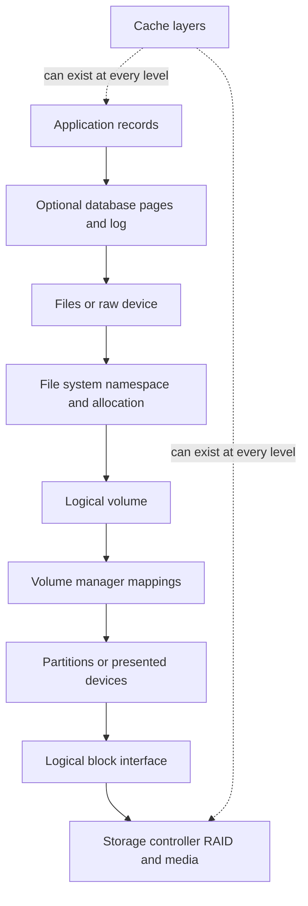

### Ownership table

| Layer | Owns | Usually does not understand |
|---|---|---|
| Application | Business records and transactions | Physical placement and RAID members |
| Database | Pages, indexes, logs, transaction state | User file names outside its files or physical media |
| File system | Namespace, permissions, allocation, file metadata | Database row meaning |
| Volume manager | Logical-to-physical extent mappings | File names or transaction commit |
| Hypervisor | Virtual-disk backing and datastore mappings | Guest file-system intent unless integrated |
| Storage system | Presented blocks, storage policies, protection, physical allocation | Application transaction correctness |
| Device/media | Logical block completion and media management | File, database, or business identity |

---

## 2. Partitions and volume managers

A partition table records where partitions begin and end on a device. A volume manager can then pool physical devices or partitions into a **storage pool** and allocate logical volumes from that pool. Implementations differ: some allocate fixed extents, some support thin allocation, snapshots, mirrors, stripes, or online resize, and some place metadata redundantly.

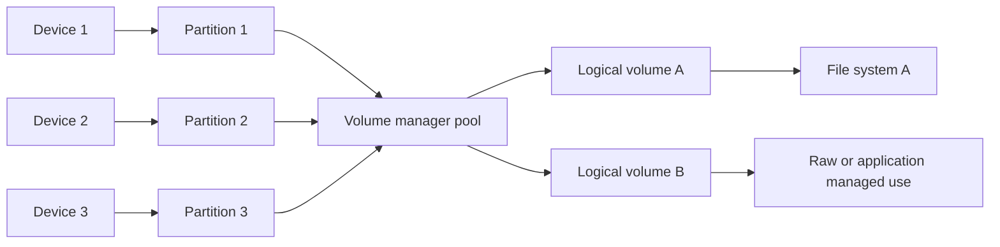

### Why a volume manager exists

- Combine several devices into a larger logical address space.
- Isolate logical volumes for different workloads.
- Resize or relocate allocations under supported procedures.
- Add host-side striping, mirroring, caching, snapshots, or thin provisioning.
- Provide stable logical identity while physical allocation changes.

### Split ownership risk

A host volume manager can mirror two LUNs that the storage team unknowingly placed in one lower failure domain. A storage snapshot can capture a virtual disk while the guest file system and database still own in-memory or ordered state. More layers can add capability, but each layer creates an ownership and observability boundary.

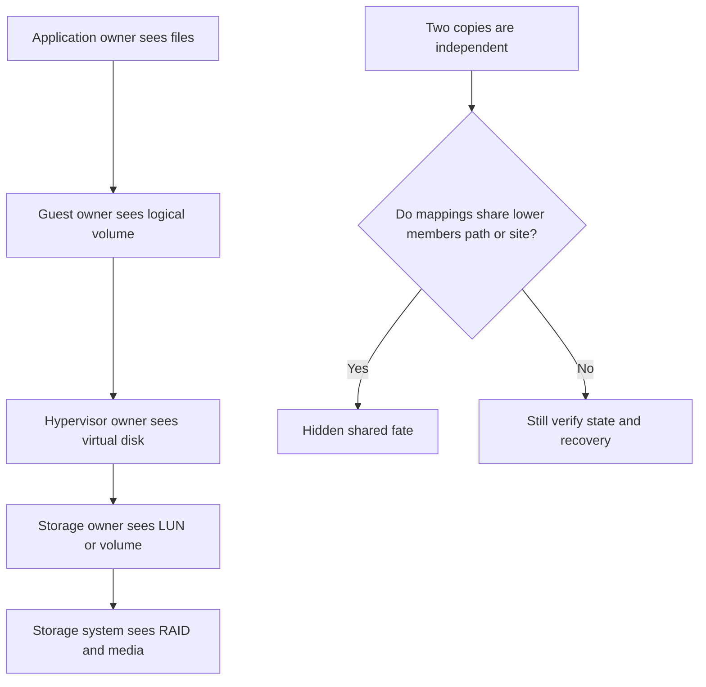

### Change-order warning

Expanding the storage LUN, volume-manager logical volume, file-system size, and application quota are separate actions. They must occur in a supported order with backups, health checks, rollback limits, and validation. Shrinking can have stricter or unsupported paths. Never infer safe resize operations from the generic stack.

---

## 3. File-system structures: metadata, file records, extents, and free-space maps

An application uses a path and file offset. The file system resolves directory entries to a file record, checks permissions and state, maps the requested file range through extents, and submits block I/O.

### Plain-English deep-dive: inode and MFT concepts

| Concept | Plain meaning | Analogy | Important boundary |
|---|---|---|---|
| **Inode** | In many Unix-like file systems, a persistent record that identifies a file and stores metadata plus references to data locations. | A catalog card identifies the book and shelf ranges. | The directory name points to an inode; the inode is not the file name itself. |
| **Master File Table (MFT) concept** | In NTFS, a central set of records represents files and directories through attributes and references. | A structured registry where each library item has a record. | Exact NTFS structures and recovery behavior are Microsoft-version-specific. |
| **Directory entry** | A mapping from a name in one directory to a file-system object. | The index entry `Budget` points to a catalog record. | Renaming a path can change directory metadata without moving file payload. |
| **Extent map** | Records that map a logical file range to a run of file-system blocks. | Pages 1-100 are on shelves 400-499. | Extents can be sparse, shared, relocated, or fragmented depending on design. |
| **Free-space map** | Metadata tracking which allocation units are available. | A booking chart marks free lockers. | Corruption can allocate one block twice or lose track of available space. |
| **Superblock or volume header concept** | High-level file-system identity and geometry needed to interpret other structures. | The library's master plan and catalog format. | Names and duplication vary by file system; exact repair is implementation-specific. |

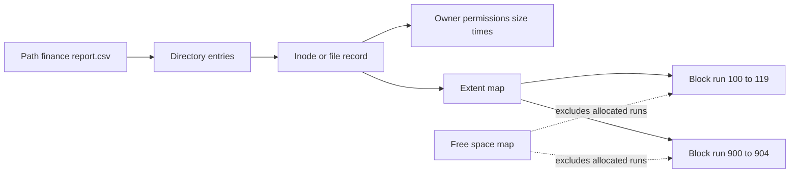

### Allocation example

Suppose a 22 KiB file uses 4 KiB allocation units and the implementation does not pack tail data elsewhere:

$$
\text{units}=\left\lceil\frac{22}{4}\right\rceil=6
$$

$$
\text{allocated}=6\times4=24\ \text{KiB}
$$

$$
\text{slack}=24-22=2\ \text{KiB}
$$

Metadata allocation is additional. Compression, sparse regions, inline data, shared blocks, and copy-on-write can change the result.

### Free-space integrity examples

| Metadata defect | Possible symptom |
|---|---|
| One block marked free and allocated | Later file can overwrite live data |
| One free block marked allocated | Capacity appears lost |
| Directory points to missing record | Path fails even if payload remains |
| Extent points to wrong block | File returns another region's bytes or an error |
| Link/reference count wrong | Object can be freed too early or retained too long |

---

## 4. Reading and writing a file

### Read path

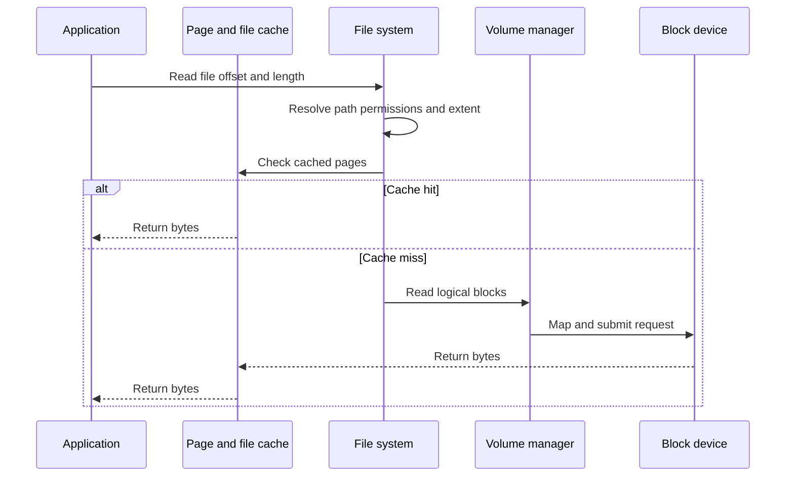

### Write path

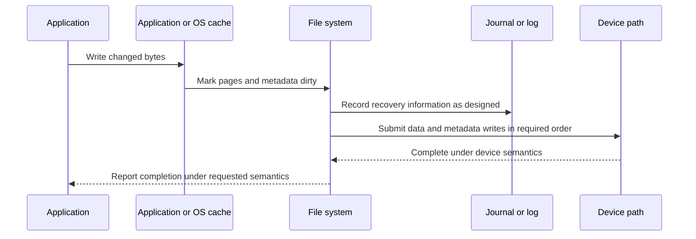

The sequence is generic. Whether an application call returns after copying to memory, after file-system ordering, after a flush, or after non-volatile persistence depends on the API, flags, file system, mount options, operating system, device cache, virtualization, and storage path.

---

## 5. Cache layers and acknowledgement

A **cache** stores data in a faster or nearer location to reduce repeated access or combine work. A cache can exist in the application, database, operating-system page cache, file system, hypervisor, host adapter, storage controller, or device.

### Plain-English deep-dive: dirty data and write policies

| Term | Plain meaning | Analogy | Why it matters and memory hook |
|---|---|---|---|
| **Clean cache entry** | Cached data matches the authoritative lower copy at the relevant point. | A photocopy matches the filed original. | It can be discarded and reread. **Hook:** Clean can be dropped. |
| **Dirty cache entry** | Cached data has changed and has not yet reached its required lower persistence point. | Notes exist on a desk but not yet in the official ledger. | Power or crash can lose it unless protected. **Hook:** Dirty still needs writing. |
| **Write-through cache** | A write is propagated to the next required layer before completion is reported under that cache's semantics. | Update the desk copy and official ledger before saying done. | Simpler persistence reasoning can cost latency; lower layers can still cache. **Hook:** Write-through passes it down now. |
| **Write-back cache** | A cache can acknowledge or accept a write and defer lower writing, subject to protection and semantics. | Accept forms at the desk and file them in batches later. | It can improve performance but needs protected state and correct flush behavior. **Hook:** Write-back owes work downstream. |
| **Write-around** | Some writes bypass a cache to avoid displacing useful cached data. | Large deliveries go directly to storage rather than filling the front desk. | It changes hit behavior and path timing. **Hook:** Write-around skips the cache. |
| **Cache hit** | Requested data is served from the cache. | The needed book is already on the desk. | Lower-layer I/O may not occur. **Hook:** Hit avoids the trip. |
| **Cache miss** | Data is absent and must be fetched from a lower layer. | Walk to the archive for the book. | Miss latency includes lower-path work. **Hook:** Miss travels down. |

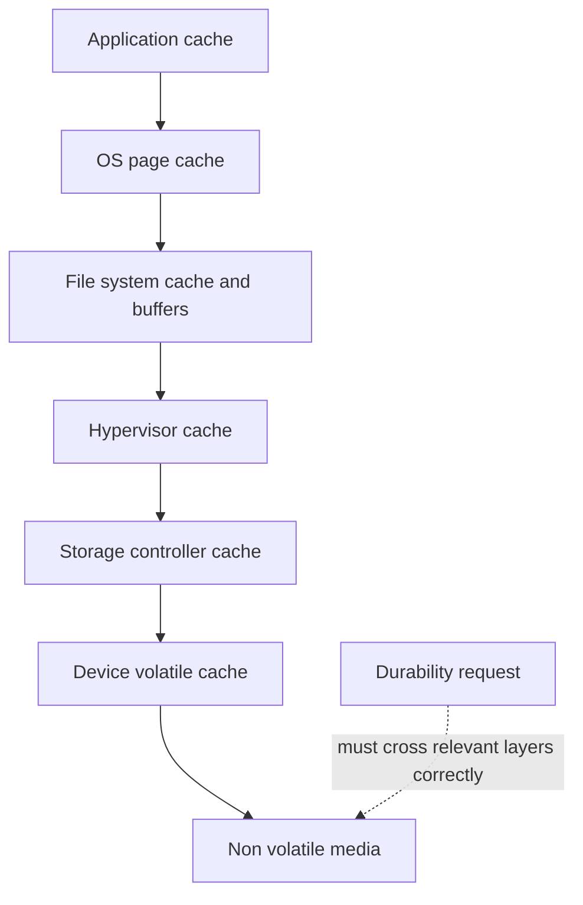

### Acknowledgement chain

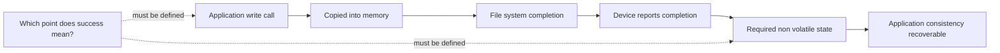

Fast acknowledgement is not automatically unsafe, and slow acknowledgement is not automatically durable. Safety depends on protected volatile memory, device guarantees, ordering, redundancy, failure scope, and the application's requested semantics.

---

## 6. Flush, barriers, and force unit access

A **flush** requests that earlier relevant writes be made persistent according to the interface's documented semantics. A **write barrier** is a mechanism or ordering boundary intended to prevent specified writes from being reordered across a required point. **Force Unit Access (FUA)** is a command attribute in SCSI and NVMe-related contexts that requests a write reach non-volatile media according to the applicable standard and device behavior without relying only on volatile cache.

These terms are not interchangeable, and exact behavior depends on the complete stack. A layer that falsely reports completion or ignores ordering can break upper-layer recovery assumptions.

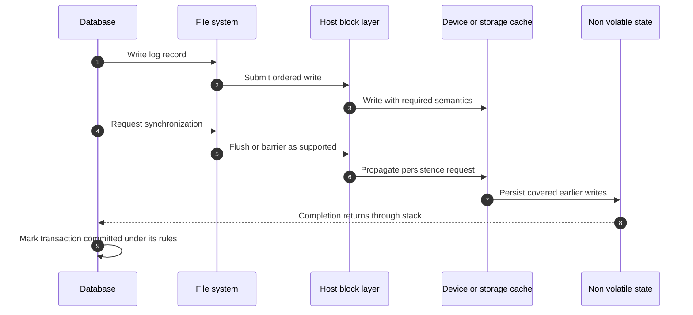

### Ordering example

Suppose a file system must ensure a new data block is valid before metadata points to it:

1. Write the new data block.
2. Ensure the required persistence/order boundary.
3. Write metadata that makes the block reachable.

If step 3 reaches durable storage before step 1 and power fails, metadata can point to stale or unrelated content. Journaling, copy-on-write, checksums, and ordering mechanisms address such windows in different ways.

### Questions that prevent false durability claims

- What exact application API and flags request persistence?
- Does the file system honor and propagate them?
- Do the volume manager, hypervisor, multipath stack, and storage service preserve ordering?
- Is volatile cache protected, disabled, or acknowledged correctly?
- What failure is covered: process crash, OS crash, controller reset, host power loss, storage power loss, or site loss?
- Was behavior validated under a supported power-failure or crash test?

---

## 7. Journals and write-ahead logs

A **journal** records enough file-system change information to recover a structurally consistent state after interruption. A **write-ahead log (WAL)** records intended changes before affected primary structures are considered committed under the layer's rules. File systems and databases can both use log-before-data ideas, but their log contents and consistency goals differ.

### Plain-English deep-dive: two ledgers at two layers

A file-system journal is like the library's maintenance ledger: `allocate this shelf, update this catalog record, add this directory entry`. A database WAL is like the bank's transaction ledger: `debit account A and credit account B`. The library journal can make the file containing the database structurally sound without proving that the bank transaction is logically complete. Each layer must recover its own rules.

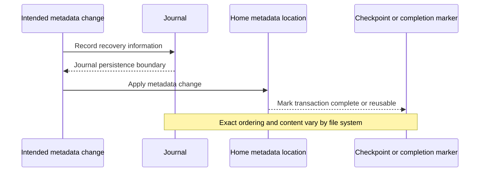

### Journal modes are implementation-specific

Some file systems journal metadata only; some can journal data as well; some order data writes relative to metadata; some use different logging structures entirely. Mount options can alter behavior. Do not infer the exact mode from the word `journaled`.

### WAL orientation

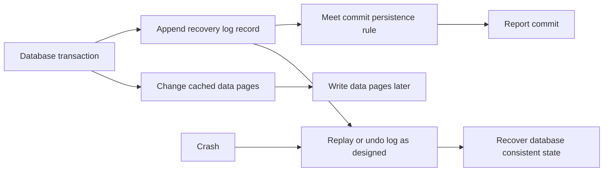

The diagram is conceptual. Database engines differ in redo, undo, checkpoints, group commit, full-page writes, log structure, replication, and recovery. Use the database's official documentation and support guidance.

---

## 8. Copy-on-write and checksums

**Copy-on-write (COW)** means changed data or metadata is written to a new location before references are switched from old state to new state. **Redirect-on-write** is a related term often used in storage contexts. Implementations differ, and the terms are not universal synonyms.

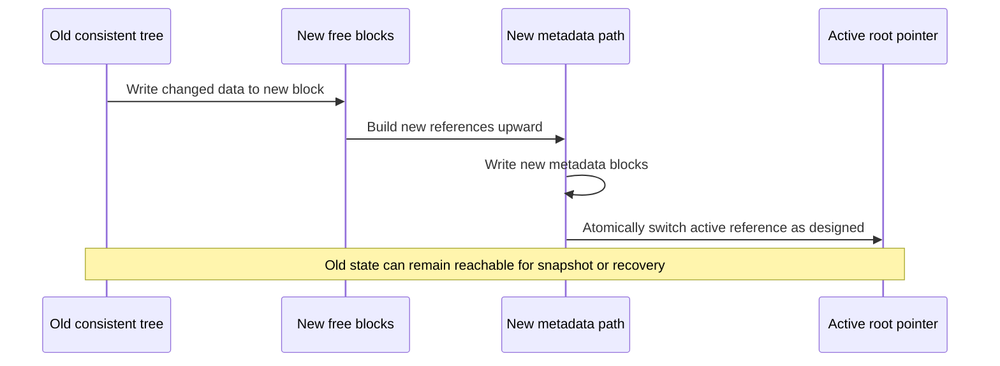

### COW benefits and costs

| Potential benefit | Potential cost or caveat |
|---|---|
| Old consistent state can remain intact during update | More allocation and metadata updates |
| Snapshots can share unchanged blocks | Later overwrites create additional physical use |
| Avoids in-place overwrite windows for covered structures | Fragmentation or locality can change |
| Checksums can cover immutable blocks and metadata trees | Checksum coverage and correction source must be verified |
| Atomic reference switch can simplify recovery | The root-switch mechanism still needs durable ordering |

A **checksum** is a computed value used later to detect covered unexpected changes. Detection does not guarantee correction. Correction needs a trusted alternate copy, parity, mirror, application source, or other recovery method.

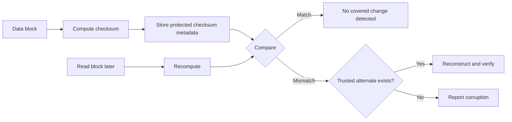

Checksums do not prove business correctness, freshness, authenticity unless designed for it, or protection from a privileged actor able to alter data and checksum consistently.

---

## 9. Consistency, durability, atomicity, and integrity

These words answer different questions.

| Term | Plain meaning | Example question |
|---|---|---|
| **Consistency** | Related structures obey the rules required for a valid state. | Does every directory entry point to a valid file record? |
| **Durability** | Accepted data survives the specified failure and time under defined semantics. | Does a committed transaction survive host power loss? |
| **Atomicity** | A multi-part operation appears all-or-nothing at the defined layer. | After crash, is a rename either old or new rather than half-applied? |
| **Integrity** | Data remains accurate and unaltered relative to its expected value and provenance. | Does the block match its checksum and intended version? |
| **Crash consistency** | Persistent state can recover to a valid point after abrupt interruption. | Can the file system mount and the database recover after power loss? |
| **Application consistency** | The application's related records and in-memory state satisfy its own recovery rules. | Do database log and data pages form a recoverable transaction state? |

### Four states that look similar but are not

| State | Durable? | Structurally consistent? | Application-consistent? |
|---|---|---|---|
| Latest valid transaction persisted | Yes for stated failure | Yes | Yes |
| Older clean point survives; latest update lost | No for latest update | Possibly | Possibly |
| Corrupt bytes replicated everywhere | Yes in physical survival sense | Maybe | No |
| File system recovers; database needs WAL replay | File-system state may be durable | File system yes | Database not until recovery completes |

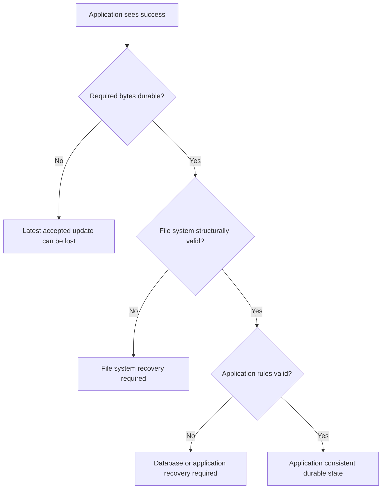

---

## 10. Crash recovery

A crash can stop a process, operating system, host, controller, or entire power domain. Recovery scope depends on which components lost volatile state and whether lower layers honored previous completion and ordering semantics.

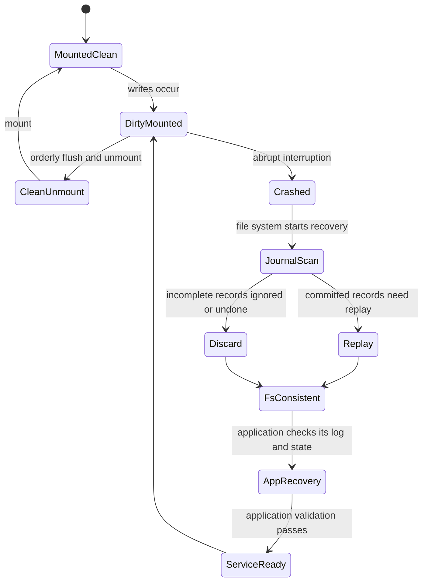

### Recovery stages

1. Establish which layer failed and which lower state survived.
2. Preserve logs and timestamps before repair changes evidence.
3. Follow supported file-system recovery or journal replay.
4. Let the database or application perform its own recovery.
5. Validate files, transactions, permissions, and service behavior.
6. Determine whether recovery restored an older point and quantify data loss.
7. Investigate root cause separately from restoration.

### Repair warning

File-system check and repair tools can modify metadata and discard irrecoverable references. Database repair can sacrifice data to regain structural consistency. Never run destructive repair as a first diagnostic reflex. Capture images/backups where appropriate, use vendor guidance, confirm business impact and recovery copies, and involve the owning specialists.

---

## 11. Snapshots and consistency scope

A **snapshot** is a point-in-time representation created by preserving or referencing the blocks needed to represent an earlier state. Implementation can use copy-on-write, redirect-on-write, changed-block maps, full copies, or other methods.

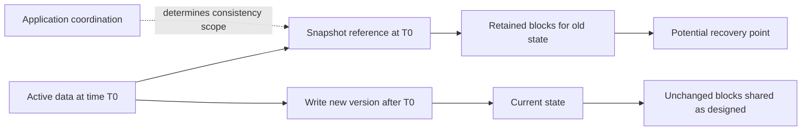

### Snapshot consistency levels

| Snapshot state | What it means | Recovery implication |
|---|---|---|
| Crash-consistent | Resembles an abrupt power loss at a point in time | File system and application logs may need recovery |
| File-system-consistent | File-system structures are in a valid coordinated state | Application transactions can still need recovery |
| Application-consistent | Application has coordinated or quiesced state under its supported method | Better application recovery point, still requires testing |
| Multi-volume or multi-system-consistent | Related data sets share a coordinated point | Requires explicit orchestration and exact scope |

A snapshot on the same system can share hardware, software, administrative, credential, and site failure domains. It is not automatically an independent backup. Snapshot deletion, retention, capacity effects, and restore behavior are platform-specific.

---

## 12. Database interaction and double-caching

Databases often manage their own buffer cache and WAL while storing files on a file system or using a supported raw/block path. The database controls transaction meaning; the file system controls file layout and structural recovery; lower storage controls block persistence within its interface.

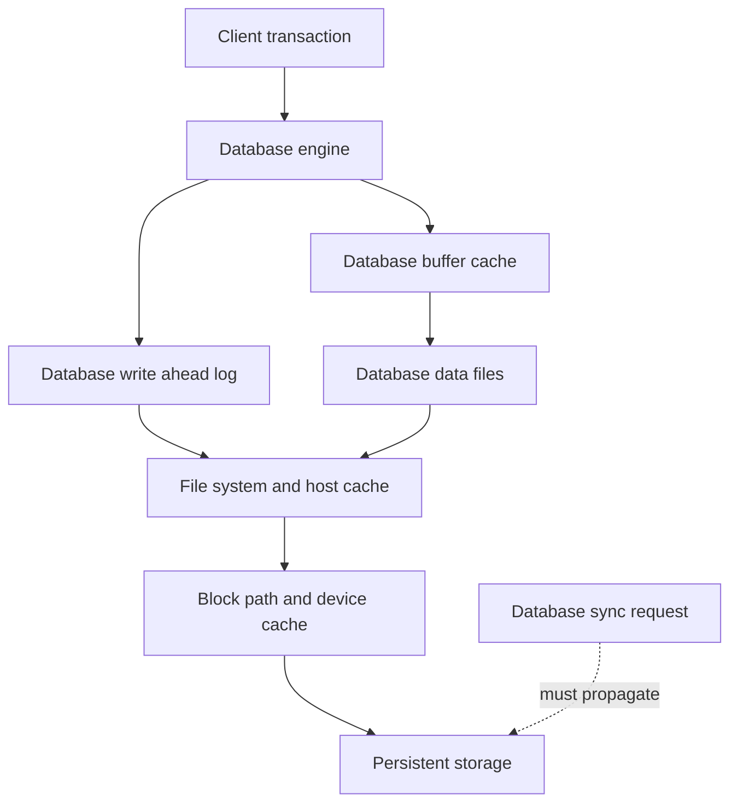

### Double-caching questions

- Does the database use direct I/O, buffered I/O, or another supported mode?
- Which data exists in both database and OS caches?
- Which layer decides eviction, read-ahead, and writeback?
- Is memory pressure causing duplicate caching or unpredictable latency?
- Do synchronization calls propagate correctly through virtual and storage layers?
- Which snapshots coordinate the database log and data files?

### Split-brain ownership examples

| Situation | Ownership conflict |
|---|---|
| Storage team restores a LUN without database owner | File blocks return to an earlier point while external logs or related volumes do not |
| Hypervisor snapshot captures VM memory but storage snapshot captures disk separately | Two recovery points may not represent one transaction state |
| Host volume manager mirrors LUNs from one lower pool | Apparent independence shares storage members |
| Database reports durable commit but device cache lies about flush | Upper recovery contract is broken by lower semantics |
| File-system repair runs before database evidence capture | Repair changes files needed for database root-cause analysis |

---

## 13. WAFL as a deferred bridge

**WAFL** is the file-system technology associated with ONTAP. Official NetApp documentation discusses WAFL, consistency points, NVRAM or NVMEM-related write intent, checksums, Snapshot copies, aggregates or local tiers, and volumes as part of ONTAP architecture.

This Part intentionally stops there. Do not infer from generic copy-on-write or journaling diagrams that WAFL behaves exactly like a host COW file system, a database WAL, or a generic journal. Part 20 will use current ONTAP documentation to explain:

- WAFL logical and physical layout.
- Consistency-point concepts.
- Protected write intent and acknowledgement boundaries.
- Checksum and recovery architecture.
- ONTAP Snapshot behavior.
- Interactions with local tiers and volumes.

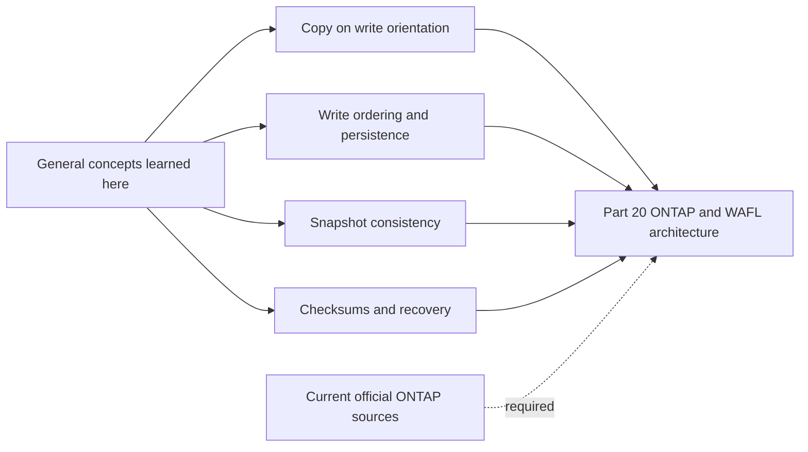

Safe interview wording:

> "I understand the general problems WAFL must address: block allocation, durable write ordering, metadata consistency, checksums, snapshots, and recovery. I would not map generic file-system behavior directly onto ONTAP. I will explain WAFL's actual consistency-point and write-path behavior from current official documentation in Part 20 and validate exact release behavior before customer use."

---

## 14. TAM discovery, recommendations, and JD mapping

### Customer discovery questions

#### Application and consistency

1. Which application, database, and business transaction use the data?
2. What does the application call `committed`, `saved`, or `closed`?
3. Which files, logs, raw devices, volumes, VMs, and external systems form one consistency group?
4. What crash-consistency and application-consistency requirements exist?

#### Host layout

5. Which OS, file system, version, mount options, partition table, volume manager, and logical volumes are present?
6. What allocation unit, extent behavior, free-space state, quotas, and metadata usage apply?
7. Is the file system clean, read-only, replaying, checking, or reporting corruption?
8. Which resize, snapshot, clone, compression, encryption, and thin layers exist?

#### Cache and persistence

9. Which application, OS, hypervisor, controller, and device caches are active?
10. Which are volatile, protected, write-through, write-back, or bypassed?
11. How do flush, barrier, and FUA semantics propagate across every layer?
12. Which power-loss, crash, reset, or failover scenarios were tested?

#### Protection and recovery

13. Which journal or WAL owns which consistency rules?
14. Are snapshots crash-, file-system-, application-, or multi-volume-consistent?
15. Which independent backup can restore the required application state?
16. When was recovery tested, and what RPO/RTO did it demonstrate?

#### Evidence and ownership

17. Who owns application, database, file system, volume manager, hypervisor, storage, and backup decisions?
18. Which timestamps, logs, error addresses, checksums, and repair actions exist?
19. What changed before the symptom: patch, mount option, cache policy, expansion, snapshot, power event, or storage migration?
20. Which current vendor support matrices and procedures apply?

### Recommendation flow

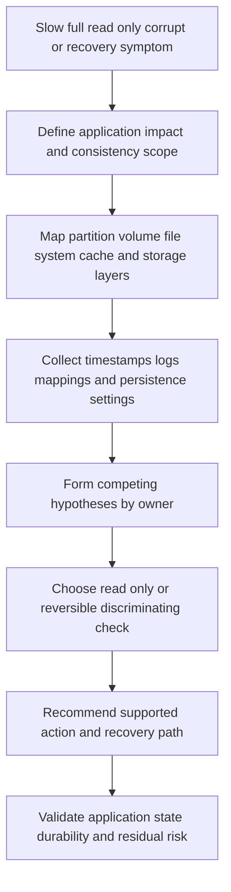

### Recommendation patterns

| Evidence-backed condition | Risk | Bounded recommendation | Validation |
|---|---|---|---|
| File system near full with high metadata use | Writes or allocation can fail before payload capacity appears exhausted | Reconcile data, metadata, snapshots, quotas, thin backing, and growth; use supported capacity action | Layered free-space report and successful representative allocation |
| Write cache enabled with unknown PLP/flush behavior | Acknowledged writes may not survive named power failure | Verify device/platform documentation and supported cache policy; test in non-production or qualified process | Documented semantics and controlled recovery result |
| Snapshot taken without database coordination | Recovery may require replay or fail to meet application RPO | Classify snapshot consistency; use supported application integration; test restore | Timed application transaction validation |
| Corruption report after crash | Destructive repair can remove evidence or data | Preserve logs/copies; involve file-system/database/storage owners; follow supported recovery order | Restored service plus scoped integrity checks and residual loss statement |
| Host mirror maps to one storage failure domain | Apparent redundancy may fail together | Reconcile mappings and compare supported diversity options | Validated physical map and failure test |

### Explicit JD mapping

| JD responsibility | Part 7 contribution | Arti transfer and honest gap |
|---|---|---|
| Storage and virtualization depth | Maps partitions, logical volumes, file systems, caches, database, and storage | Windows/M365 familiarity helps; deep host/WAFL administration remains unclaimed |
| Understand customer environment | Exposes split ownership and complete consistency group | SharePoint/OneDrive dependency mapping transfers strongly |
| Mitigate risk and improve stability | Clarifies durability, flush, journal, snapshot, and repair risks | CRITSIT evidence preservation transfers; product procedure needs SMEs |
| Analyze customer data | Correlates capacity, cache, latency, logs, timestamps, and metadata | Analytics skills transfer; counters need exact definitions |
| Make customer-specific recommendations | Requires application semantics, supportability, owner, test, and residual risk | Advisory method transfers; no generic file-system setting is prescribed |
| Improve support experience | Produces a cross-layer ownership map and minimum escalation package | Microsoft escalation and Product/Engineering collaboration are proven strengths |

### Honest production-gap note

> "I can explain how file systems and volume managers map data, why caches and write ordering affect durability, and how journals, WAL, COW, checksums, and snapshots address different recovery problems. I have not administered WAFL or a production NetApp data path. For a customer issue I would preserve evidence, map exact versions and ownership, use current OS, database, hypervisor, and NetApp guidance, and involve the relevant specialists before repair or cache-policy changes."

---

## 15. Fully synthetic worked scenario: Fabrikam Orders

> **Synthetic case:** Fabrikam Orders, all systems, versions, times, data, and outcomes below are fictional. The scenario does not represent a NetApp implementation or Arti's production storage work.

Fabrikam runs an order database in a virtual machine. The guest has:

- One virtual disk presented to a host volume manager.
- A journaling file system containing database data and WAL files.
- Database buffer cache plus OS page cache.
- Hypervisor virtual-disk backing on a storage LUN.
- Storage snapshots every four hours without documented database coordination.

At 21:05, facility power fails. The host loses power, while the storage platform remains powered. After restart, the file system replays its journal and mounts. The database then reports recovery required and finds the last acknowledged order absent. A storage dashboard shows no disk errors.

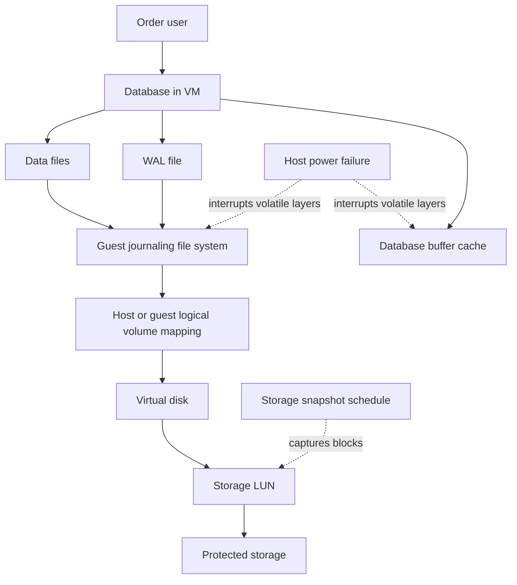

### Unsafe conclusion

`The storage array lost the order because the application uses a storage LUN.`

The absence of storage media errors does not prove correct host-cache or flush behavior. The missing order does not prove the storage system violated an acknowledgement. The investigation must establish what the database acknowledged, which persistence call followed, whether every layer propagated it, and what state survived.

### Timeline

| Time | Synthetic event | Evidence limitation |
|---|---|---|
| 21:04:58 | Application reports order accepted | UI success may precede database durable commit |
| 21:04:59 | Database log says commit returned | Exact synchronization and log semantics need version-specific evidence |
| 21:05:00 | Host power lost | Device and hypervisor cache state unknown |
| 21:07:30 | Host restarts | No full memory image exists |
| 21:08:10 | File-system journal replay completes | Proves structural recovery path, not database transaction validity |
| 21:09:00 | Database WAL recovery begins | Exact last valid log record still under analysis |
| 21:12:00 | Service returns; one order absent | Business impact known; fault layer not proven |

### Competing hypotheses

| Hypothesis | Supporting clue | Disconfirming evidence sought |
|---|---|---|
| UI acknowledged before durable database commit | UI and log timestamps are close | Application-to-database transaction ID and commit response sequence |
| Database requested persistence but guest/file system did not honor it | Commit returned before power loss | Database and OS trace showing supported sync completion |
| Hypervisor or virtual-disk cache did not propagate flush | Virtual layer exists | Exact virtual-disk cache policy and platform event/trace |
| Storage/device cache falsely acknowledged persistence | Lower volatile cache is possible | Official configuration, PLP state, flush/FUA logs, storage events |
| Clock skew makes the apparent order wrong | Several systems timestamp independently | NTP status and monotonic/application correlation IDs |
| Database recovery selected an earlier valid point by design | WAL recovery ran | Database-native recovery log and transaction outcome |

### Snapshot recovery assessment

The latest snapshot is from 20:00. It can represent a crash-consistent block point, but application consistency is undocumented. Restoring it in place could discard an hour of accepted work and overwrite current evidence. The safe exercise plan is to clone or restore into an isolated recovery environment under supported procedures, run file-system and database recovery, validate order transactions, and compare RPO before any production decision.

### Bounded recommendations

| Priority | Recommendation | Owner | Validation | Residual risk |
|---:|---|---|---|---|
| 1 | Preserve database, OS, hypervisor, storage, and power-event evidence with aligned time and transaction IDs | Incident lead and layer owners | Shared timeline with known/unknown labels | Some volatile evidence is already unavailable |
| 2 | Validate database commit API and supported guest-to-storage flush path before assigning cause | Database, virtualization, and storage SMEs | Controlled non-production power/crash test or vendor evidence | Test may not reproduce exact outage |
| 3 | Classify snapshots and implement supported application coordination where required | Database and protection owners | Isolated restore reaches valid transaction point | Snapshot remains one recovery layer, not independent backup |
| 4 | Review independent backup and point-in-time recovery evidence before repair | Recovery owner | Timed restore proves scoped RPO/RTO | Recovery copies can share credentials or corruption |
| 5 | Correct customer communication: file-system recovery does not equal database recovery | TAM team | Review minutes and runbook use separate stages | Future applications need their own consistency map |

### Customer-facing summary

> "The file system recovered structurally, but the database had a separate recovery step and one order is absent. That proves an application-level data gap, not yet which layer caused it. We are aligning the transaction, database, guest, hypervisor, storage, and power evidence and validating the documented flush path. We will test the snapshot only in an isolated recovery path because restoring it in place could lose newer work and destroy evidence."

---

## 16. Failure modes and troubleshooting workflow

| Mistake | Why it fails | Better behavior |
|---|---|---|
| `The file system mounted, so the database is consistent` | Each layer has separate recovery rules | Validate database-native recovery and transactions |
| `The write call succeeded, so media is durable` | Success point depends on API and caches | Trace requested persistence through all layers |
| `Journaled means no data loss` | Journal scope and ordering vary | Verify mode, failure scope, and application recovery |
| `COW means corruption cannot happen` | Memory, firmware, metadata, checksums, and software can still fail | Check coverage, alternate copies, and recovery evidence |
| `Checksum match means correct record` | It proves only covered bytes match expected checksum | Validate freshness, transaction meaning, and provenance |
| `Snapshot is application-consistent` | Coordination may be absent | Classify and test exact consistency scope |
| `Storage should repair the file` | Storage may not know file or database meaning | Use owner/mapping evidence and supported upper-layer tools |
| Running repair immediately | Repair changes evidence and can discard structures | Preserve copies/logs and plan recovery with specialists |
| Expanding only the LUN | Upper layers may not gain space | Follow supported bottom-up expansion and validate each layer |
| Host mirror equals independent storage | Both legs can share lower physical fate | Reconcile all mappings and test failure domain |

```mermaid
flowchart TD
    REPORT[File missing corrupt read only full or unmountable] --> IMPACT[Define application impact exact path and time]
    IMPACT --> MAP[Map database file system volume hypervisor and storage]
    MAP --> PRESERVE[Preserve logs images mappings and recovery copies]
    PRESERVE --> CLASS{Classify failure layer}
    CLASS --> NS[Namespace or metadata]
    CLASS --> CAP[Capacity or allocation]
    CLASS --> ORDER[Durability or ordering]
    CLASS --> BLOCK[Block path or media]
    NS --> TEST[Choose supported low risk check]
    CAP --> TEST
    ORDER --> TEST
    BLOCK --> TEST
    TEST --> RECOVER[Recover in correct layer order]
    RECOVER --> VERIFY[Validate application data RPO RTO and residual risk]
```

### Minimum escalation package

- Business impact, affected transaction/file/database, scope, and exact error.
- OS, kernel, file system, mount options, partition, volume-manager, hypervisor, and database versions.
- Logical-to-physical mappings and stable identities.
- Cache, PLP, flush/barrier/FUA settings and current official references.
- Journal, database WAL, OS, hypervisor, storage, and power events with time zones.
- File-system state, free data/metadata, quotas, thin backing, snapshots, and recovery copies.
- Changes, actions attempted, repair tools not yet run, and secure evidence location.
- Exact specialist question and business recovery decision required.

---

## 17. Paper and whiteboard lab

No production access is required. Label every artifact synthetic.

### Lab scenario

A fictional VM has a 2 TiB virtual disk backed by a thin storage LUN. The guest uses a partition, a logical volume, and a journaling file system. A database stores an 800 GiB data file and a 120 GiB WAL. The guest reports 300 GiB free; the hypervisor reports 90 GiB free; the storage pool reports 2 TiB free. A storage snapshot is taken every hour without application coordination.

### Tasks

1. Draw the complete application-to-media stack and name each owner.
2. Draw the logical-to-physical mapping and mark unknowns.
3. Explain why the three free-space values are not contradictory by themselves.
4. Draw an inode/file-record, directory entry, extents, and free-space map.
5. Calculate allocation for 1,000 files of 22 KiB with 4 KiB units under the stated simple assumption.
6. Draw application, database, OS, hypervisor, controller, and device caches.
7. Mark dirty versus clean data after an application write.
8. Draw a flush/barrier sequence and inject host power loss at four points.
9. Draw file-system journal recovery and database WAL recovery as separate flows.
10. Compare in-place update with COW and list tradeoffs.
11. Add a checksum mismatch with and without an alternate copy.
12. Classify the hourly snapshot as crash-consistent until stronger evidence exists.
13. Design an isolated restore test and define transaction-level validation.
14. Write a customer recommendation with evidence, owner, test, and residual risk.

### Calculation check

For one 22 KiB file with 4 KiB allocation units:

$$
\left\lceil\frac{22}{4}\right\rceil=6\ \text{units}=24\ \text{KiB}
$$

For 1,000 files:

$$
1{,}000\times24\ \text{KiB}=24{,}000\ \text{KiB}\approx23.44\ \text{MiB}
$$

Payload is:

$$
1{,}000\times22\ \text{KiB}=22{,}000\ \text{KiB}\approx21.48\ \text{MiB}
$$

Slack is about 1.95 MiB before directory, file-record, journal, and other metadata. Actual implementations can pack, compress, share, or allocate differently.

### Whiteboard pass criteria

- [ ] Every layer has a named owner and stable identity.
- [ ] Partition, logical volume, file system, database, and storage volume are distinct.
- [ ] Inode/MFT concepts, extents, and free-space map are explained without equating implementations.
- [ ] Dirty data is tracked through all caches.
- [ ] Flush, barrier, and FUA are not treated as synonyms.
- [ ] File-system journal and database WAL recover different rules.
- [ ] COW, checksums, and snapshots have explicit limitations.
- [ ] Repair follows evidence preservation and owner review.
- [ ] WAFL remains deferred to Part 20.
- [ ] All results remain synthetic.

---

## 18. Self-test

1. Define partition, volume manager, logical volume, file system, allocation unit, extent, mount, and raw device.
2. Draw the full application-to-media stack and name each owner.
3. Explain why a volume manager can create hidden shared fate.
4. Distinguish a LUN expansion, logical-volume expansion, file-system expansion, and application quota.
5. Define metadata, inode, MFT concept, directory entry, extent map, free-space map, and superblock/header concept.
6. Calculate file allocation and slack under stated assumptions.
7. Trace a cache-hit and cache-miss read.
8. Trace a generic file write and identify every acknowledgement ambiguity.
9. Define clean, dirty, write-through, write-back, write-around, hit, and miss.
10. Explain why multiple cache layers complicate durability.
11. Distinguish flush, barrier, and FUA.
12. Draw a correct ordering example and a reordered crash failure.
13. Define journal and WAL and state their different consistency owners.
14. Explain why `journaled` does not guarantee no data loss.
15. Draw copy-on-write and list benefits and costs.
16. Explain checksum detection versus correction and business correctness.
17. Distinguish consistency, durability, atomicity, integrity, crash consistency, and application consistency.
18. Walk through file-system and database crash recovery in order.
19. Explain why repair can destroy evidence or data.
20. Classify crash-, file-system-, application-, and multi-volume-consistent snapshots.
21. Explain why snapshot is not automatically backup.
22. Explain double caching and database ownership.
23. State the exact boundary of the WAFL bridge.
24. Ask all discovery questions before diagnosing corruption.
25. Recreate Fabrikam's timeline, hypotheses, recommendations, and customer summary.
26. Complete the paper lab and answer Q1-Q8 aloud.

---

## 19. Official Source Anchors

**Date checked: 2026-08-24.** These official and vendor-neutral sources anchor broad terminology and public implementation documentation. Exact file-system structures, mount options, journaling modes, flush semantics, database WAL, recovery, snapshots, and WAFL behavior are version-sensitive. Some standards require purchase or access. Never invent a current implementation guarantee, NetApp behavior, support procedure, or customer result.

| Topic | Official or vendor-neutral source | Bounded use and access note |
|---|---|---|
| Storage and file-system terminology | [SNIA Dictionary](https://www.snia.org/education/online-dictionary) | Vendor-neutral orientation. Terms do not establish a product implementation. |
| POSIX file and path terminology | [The Open Group Base Specifications](https://pubs.opengroup.org/onlinepubs/9799919799/basedefs/V1_chap03.html) | Official standards terminology. Full standards behavior depends on the applicable edition and implementation. |
| Linux ext4 structures and journal documentation | [Linux kernel ext4 documentation](https://docs.kernel.org/filesystems/ext4/) | Official Linux kernel documentation. Check the deployed kernel, file-system features, mount options, and distribution support. |
| Microsoft NTFS orientation | [NTFS overview](https://learn.microsoft.com/en-us/windows-server/storage/file-server/ntfs-overview) | Official Microsoft overview. Exact MFT, recovery, caching, and version behavior require the applicable Windows documentation. |
| Windows file buffering and caching | [File buffering](https://learn.microsoft.com/en-us/windows/win32/fileio/file-buffering) | Official Windows API orientation. Application flags, file-system, device, and driver behavior must be validated end to end. |
| PostgreSQL WAL concepts | [PostgreSQL write-ahead logging](https://www.postgresql.org/docs/current/wal-intro.html) | Official database documentation used as one WAL example, not a universal database implementation. Select the exact major version. |
| SQLite WAL example | [SQLite write-ahead logging](https://www.sqlite.org/wal.html) | Official SQLite documentation showing another implementation. It must not be generalized to other engines. |
| SCSI command standards | [INCITS T10 Technical Committee](https://www.t10.org/) | Official standards source for SCSI concepts including cache and FUA-related command semantics. Some standards can be access-controlled. |
| NVMe specifications | [NVM Express specifications](https://nvmexpress.org/specifications/) | Official source for NVMe command and persistence semantics. Verify specification version and complete platform. |
| ONTAP concepts and WAFL orientation | [ONTAP concepts](https://docs.netapp.com/us-en/ontap/concepts/) | Official public entry point. WAFL implementation is deferred to Part 20 and exact release documentation. |
| ONTAP Snapshot management | [ONTAP data protection and disaster recovery](https://docs.netapp.com/us-en/ontap/data-protection-disaster-recovery/) | Official broad area. No exact ONTAP Snapshot or consistency behavior is asserted in this Part. |

### Source-use discipline

- Record OS/kernel, file system and features, mount options, database version, volume manager, hypervisor, device, storage platform/release, and date.
- Treat API success, host completion, device completion, and durable application commit as separate evidence.
- Verify flush, barrier, FUA, volatile-cache, and PLP behavior across the complete supported path.
- Preserve logs and recoverable copies before destructive repair.
- Use application-native consistency and recovery documentation for databases and multi-volume workloads.
- State access and evidence limits; do not project generic COW or journaling behavior onto WAFL.

---

## Likely Interview Questions

### Q1. Walk me from a partition to an application record.

> **Model answer:** "A partition defines a block range. A volume manager can combine or remap partitions and devices into a logical volume. A file system formats that logical block space and owns allocation, directories, file records, extents, and free-space metadata. A database may then store pages and a recovery log inside files or a supported raw device and adds transaction meaning. Each layer owns different mappings and recovery rules, so I trace stable identities and ownership before diagnosing a symptom."

**Follow-up depth:** Draw the complete stack including hypervisor and storage, then explain how a host mirror can share one lower failure domain.

### Q2. What are inodes, MFT records, extents, and free-space maps?

> **Model answer:** "An inode is a Unix-like file record containing identity, metadata, and references to data; NTFS uses MFT records with its own attribute model. A directory maps names to records. An extent maps a continuous logical file range to blocks. A free-space map tracks allocatable units. They are conceptually similar catalog structures but not interchangeable implementations. Corruption in any mapping can make intact bytes unreachable, cross-link data, or misreport capacity."

**Follow-up depth:** Draw name-to-record-to-extent mapping and explain how rename can change metadata without moving payload.

### Q3. What is the difference between write-through and write-back caching?

> **Model answer:** "Write-through propagates a write to the next required layer before reporting completion under that cache's semantics. Write-back accepts or acknowledges work and defers lower writes, which can combine operations and reduce latency but leaves dirty state that must be protected. Either policy sits among other caches. I care about the complete acknowledgement chain, power-loss protection, flush propagation, and application semantics rather than the label alone."

**Follow-up depth:** Draw application, OS, hypervisor, controller, and device caches and mark where dirty data exists during host power loss.

### Q4. Explain flush, barriers, FUA, and write ordering.

> **Model answer:** "A flush asks that relevant earlier writes reach the required persistence point under documented semantics. A barrier or ordering mechanism prevents specified writes from crossing a required boundary. FUA is a command attribute that requests non-volatile completion for a write under the applicable standard. They are not synonyms. Every layer must propagate and honor the contract; otherwise metadata can become durable before the data it references or an application can acknowledge a transaction that is not recoverable."

**Follow-up depth:** Draw a log-write, flush, commit sequence and inject failures before and after each persistence boundary.

### Q5. How do journaling, WAL, and copy-on-write differ?

> **Model answer:** "A file-system journal records recovery information for file-system changes. A database WAL records transaction changes before primary data pages under the database's rules. Copy-on-write writes changed blocks and metadata to new locations before switching references, preserving old state during the transition. They can coexist and solve different consistency windows. A journaled file system can recover structurally while the database still needs WAL recovery."

**Follow-up depth:** Explain metadata-only versus broader journal possibilities, COW root switching, and why exact modes are implementation-specific.

### Q6. Distinguish consistency, durability, integrity, and application consistency.

> **Model answer:** "Consistency means related structures obey their validity rules. Durability means accepted state survives a named failure. Integrity means data remains correct relative to an expected value and provenance. Application consistency means the application's records, logs, and dependent volumes form a recoverable logical state. Durable storage can preserve corrupt data, and a structurally consistent file system can contain a database that still requires recovery. I define the layer and failure before using any of these words."

**Follow-up depth:** Give examples of durable corruption, coherent but stale data, checksum mismatch, and a crash-consistent snapshot requiring database replay.

### Q7. How would you investigate corruption after a power loss?

> **Model answer:** "I would first define business impact and exact errors, preserve file-system, database, OS, hypervisor, storage, and power evidence, and map the complete cache and persistence path. I would separate structural recovery from application recovery and form competing hypotheses around application acknowledgement, flush propagation, volatile cache, device behavior, and clock alignment. I would avoid destructive repair until recovery copies and specialist guidance are ready, then validate transaction state, RPO, RTO, and residual data loss."

**Follow-up depth:** Recreate the Fabrikam timeline and explain why an error-free storage dashboard neither proves nor disproves a persistence-path defect.

### Q8. What can you say about WAFL given your current experience?

> **Model answer:** "I know WAFL is the file-system technology associated with ONTAP and that ONTAP documentation covers consistency points, protected write intent, checksums, local tiers, volumes, and Snapshot copies. I deliberately do not project a generic journal or COW implementation onto it. My current knowledge is conceptual, not production experience. I will explain the actual architecture from current official release documentation in Part 20 and would seek NetApp SME review before customer use."

**Follow-up depth:** State which general problems transfer, which implementation facts remain deferred, and how Microsoft 365 evidence discipline helps without becoming a WAFL claim.

---

## 30-Second Memory Hooks

- **Partition:** Carved block range.
- **Volume manager:** Reshapes and maps block space.
- **File system:** Library of names, metadata, and allocation over blocks.
- **Inode/MFT record:** Catalog record, not the file name itself.
- **Extent:** One continuous run of blocks.
- **Free-space map:** Booking chart for allocation units.
- **Metadata:** Intact payload is useless if the map is gone.
- **Dirty cache:** Acknowledged or accepted work still owed downstream.
- **Write-through:** Pass down before this layer says done.
- **Write-back:** Defer lower work; protect the debt.
- **Flush:** Persist relevant earlier work under exact semantics.
- **Barrier:** Preserve required order across a boundary.
- **FUA:** Request non-volatile completion for this command under the standard.
- **Journal:** File-system recovery ledger.
- **WAL:** Application or database recovery ledger written first.
- **COW:** Write new blocks, then switch references.
- **Checksum:** Detect covered change; correction needs another trusted source.
- **Consistency:** Rules hold; **durability:** state survives named failure.
- **Crash consistency:** Recoverable after interruption, not automatically application-ready.
- **Snapshot:** Point-in-time representation with a declared consistency scope.
- **Split ownership:** Every layer sees a valid fragment of the truth.
- **Repair:** Preserve evidence and copies before changing structures.
- **WAFL:** General problems are familiar; implementation waits for Part 20.
- **Arti's bridge:** M365 systems thinking transfers, host/WAFL production claims do not.

---

## Completion Checklist

- [ ] Define partition, volume manager, logical volume, file system, allocation, metadata, extent, mount, and raw device.
- [ ] Draw the complete application-to-media stack and name each owner.
- [ ] Explain split ownership, resize ordering, and hidden lower failure domains.
- [ ] Define and draw inode, MFT concept, directory entry, extent map, free-space map, and header concept.
- [ ] Calculate allocation units and slack with explicit assumptions.
- [ ] Trace file reads for cache hit and miss.
- [ ] Trace a generic write and identify acknowledgement ambiguity.
- [ ] Distinguish clean/dirty, write-through, write-back, and write-around caches.
- [ ] Map every cache layer and identify protection of dirty state.
- [ ] Distinguish flush, barrier, FUA, and application synchronization.
- [ ] Explain ordered writes and the stale-pointer failure window.
- [ ] Distinguish file-system journal from database WAL.
- [ ] Draw COW update and state its costs and limitations.
- [ ] Explain checksum detection, correction, integrity, and business-correctness limits.
- [ ] Distinguish consistency, durability, atomicity, integrity, crash consistency, and application consistency.
- [ ] Walk through file-system recovery followed by application recovery.
- [ ] Classify snapshot consistency and explain why snapshot is not automatically backup.
- [ ] Explain database double caching and consistency ownership.
- [ ] Keep WAFL implementation deferred to Part 20 and current sources.
- [ ] Ask all discovery questions and write a bounded recommendation.
- [ ] Recreate Fabrikam's timeline, hypotheses, recovery decision, and customer summary.
- [ ] Complete the paper lab, self-test, and Q1-Q8 aloud.
- [ ] State Arti's production gap and Microsoft transfer honestly.
- [ ] Recheck exact OS, file-system, database, hypervisor, device, and ONTAP documentation before real use.

---

*Next suggested section:* [Part 8 - Availability, Durability, Resilience, Backup, and Disaster Recovery](Part-08-availability-durability-resilience-backup-dr.md)