# Part 8 - Availability, Durability, Resilience, Backup, and Disaster Recovery

> **Section goal:** Learn to distinguish service availability, data durability, component reliability, operational resilience, backup, replication, archive, disaster recovery, cyber recovery, and business continuity. By the end, Arti should be able to calculate service-level targets, map failure domains and quorum risks, translate RPO/RTO into a tested recovery design, and challenge a customer's `we are protected` claim without overstating evidence.

Covers index item **8** and maps directly to job-description responsibilities for customer-environment understanding, storage depth, technical-risk mitigation, solution stability, strategic planning, data analysis, preventative recommendations, service reviews, high-pressure communication, and supportability awareness.

This Part teaches vendor-neutral foundations. Product-specific high-availability, quorum, witness, replication, snapshot, MetroCluster, backup, ransomware, and recovery behavior is deferred to later Parts and must be verified for the exact platform, release, topology, license, service, and customer runbook.

> **Evidence boundary:** All organizations, service targets, systems, failures, test results, calculations, and recommendations below are synthetic. Arti has production Microsoft escalation and service-impact experience, not production NetApp HA, backup, replication, DR, or cyber-recovery administration experience.

---

## 1. Six outcomes that must not be called the same thing

### Plain-English deep-dive: availability, reliability, durability, and resilience

| Term | Plain meaning | Analogy | Why it matters and memory hook |
|---|---|---|---|
| **Availability** | The proportion or condition in which a service is usable when required, under a defined measurement. | A shop is open and able to serve customers during promised hours. | Data can survive while the service is unavailable. **Hook:** Availability = usable now. |
| **Reliability** | The probability or tendency that a component or service performs its required function without failure for a stated interval and conditions. | A train completes journeys without breaking down. | A system can be highly available through fast recovery even if individual components fail. **Hook:** Reliability = keeps working without failure. |
| **Durability** | The likelihood or guarantee that accepted data remains preserved through specified failures and time under defined semantics. | The records survive even when the office closes. | Durable data can be inaccessible or logically corrupt. **Hook:** Durability = accepted data survives. |
| **Resilience** | The ability to prepare for, absorb, continue through, recover from, and adapt after disruption. | A city reroutes traffic, restores bridges, and improves plans after a flood. | It includes people, process, technology, learning, and graceful degradation. **Hook:** Resilience = absorb, recover, adapt. |
| **Recoverability** | Demonstrated ability to restore data and service to an acceptable state. | A spare key matters only if it opens the right door during an emergency. | Copy existence is weaker than a tested restore. **Hook:** Recoverability = prove the return path. |
| **Business continuity** | Organization-wide capability to continue priority products and services during disruption. | A hospital uses alternate locations, staff procedures, communications, suppliers, and IT recovery. | IT disaster recovery is one part of continuity. **Hook:** Continuity keeps the business operating. |

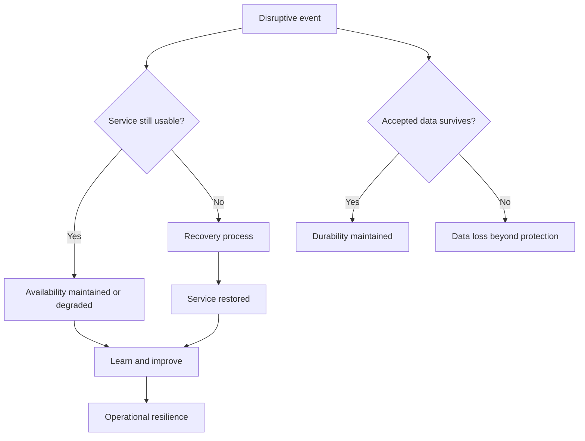

### Examples

| Situation | Availability | Durability | Reliability | Resilience conclusion |
|---|---|---|---|---|
| Service offline, all data intact | Low during event | Potentially high | A dependency failed | Recovery process determines resilience |
| Service online, latest acknowledged writes lost | Appears high | Failed for latest data | Components may look healthy | Not resilient for data correctness |
| Component fails, HA transition succeeds | Service may remain available or briefly degrade | Depends on state protection | Component reliability failed | Redundancy and operations absorbed event |
| Ransomware encrypts primary and replicas | Possibly unavailable | Corrupt bytes may be durably preserved | Hardware can be reliable | Cyber-recovery isolation and clean restore decide resilience |

---

## 2. SLA, SLO, and SLI

- A **service-level indicator (SLI)** is a measured quantity that represents service behavior, such as successful request ratio or latency under a declared definition.
- A **service-level objective (SLO)** is a target for an SLI over a stated window.
- A **service-level agreement (SLA)** is a formal commitment between parties that defines service expectations and governance or consequences.

### Plain-English deep-dive: measure, target, promise

**Analogy:** A courier's actual on-time delivery percentage is the SLI. Its internal target of 99.9 percent is the SLO. The customer contract and remedy are the SLA. A target does not measure itself, and a contract does not prove the architecture can meet it.

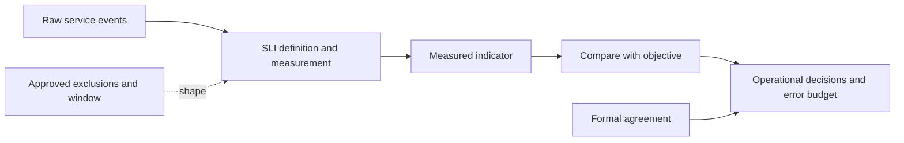

### Availability calculation

For a defined service and observation window:

$$
A=\frac{\text{total time}-\text{unavailable time}}{\text{total time}}
$$

Allowed unavailable time for target $A_t$ is:

$$
T_{down}=T_{window}(1-A_t)
$$

### Nines table

The table uses a 365-day year and a 30-day month. It does not include leap years or contractual exclusions.

| Target | Annual unavailable time | 30-day unavailable time |
|---:|---:|---:|
| 99% | 87.6 hours | 7.2 hours |
| 99.9% | 8.76 hours | 43.2 minutes |
| 99.99% | 52.56 minutes | 4.32 minutes |
| 99.999% | 5.256 minutes | 25.92 seconds |

**Worked example:** A service is unavailable for 37 minutes in a 30-day month:

$$
T=30\times24\times60=43{,}200\ \text{minutes}
$$

$$
A=\frac{43{,}200-37}{43{,}200}\approx99.9144\%
$$

This calculation is valid only if scope, outage start/end, partial degradation, planned maintenance, duplicate events, and measurement source are defined.

### SLI definition questions

1. Which service and user journey are measured?
2. From which locations and identities?
3. Does partial failure count, and how?
4. Is the denominator time, requests, transactions, users, or another population?
5. Which planned maintenance or customer-caused events are excluded by agreement?
6. Which timezone and rolling/calendar window apply?
7. Does a successful infrastructure health check represent user success?

---

## 3. RPO and RTO

**Recovery point objective (RPO)** is the maximum acceptable amount of data loss measured backward in time after disruption. **Recovery time objective (RTO)** is the target time to restore an acceptable level of service after disruption.

### Plain-English deep-dive: the bookmark and stopwatch

RPO is a bookmark: how far back must recovery go? RTO is a stopwatch: how long may restoration take? A 15-minute RPO does not mean backups run every 15 minutes unless the complete copy and consistency process can deliver it. A two-hour RTO does not mean storage alone has two hours; declaration, people, identity, network, application startup, validation, and communication all consume the window.

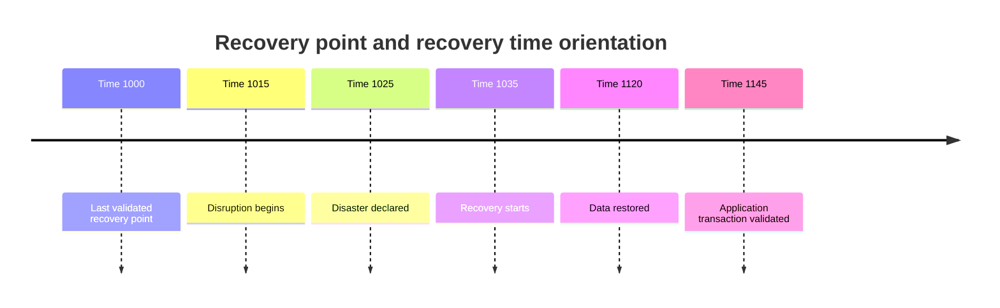

In this synthetic timeline:

- Actual data gap from 10:00 to 10:15 is 15 minutes.
- User-visible recovery from 10:15 to 11:45 is 90 minutes.
- Operational recovery work after declaration lasts 80 minutes, but hiding the declaration delay would understate business interruption.

### Objective, capability, and actual result

| Term | Meaning | Example |
|---|---|---|
| RPO | Approved target data-loss window | 15 minutes |
| Achieved recovery point | Point actually restored in test/event | 10 minutes before disruption |
| RTO | Approved target restoration time | 2 hours |
| Achieved recovery time | Measured transaction-ready duration | 1 hour 42 minutes |
| Recovery time estimate | Predicted duration before execution | 1 hour 15 minutes, with uncertainty |

Objectives are business decisions. Architecture and tests demonstrate capability. An event or exercise records actual results. Do not relabel one as another.

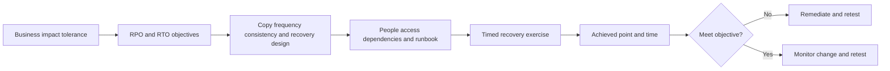

---

## 4. MTBF, MTTF, MTTR, and their caveats

- **Mean time between failures (MTBF)** is an average interval between repairable-system failures under a defined population and observation model.
- **Mean time to failure (MTTF)** is an average time to failure often used for non-repairable items or a defined first-failure context.
- **Mean time to repair or restore (MTTR)** is an average duration to repair a component or restore service, but organizations use the same acronym differently. Define it.

Under a simplified steady-state model with independent, exponentially distributed failure and repair behavior:

$$
A\approx\frac{MTBF}{MTBF+MTTR}
$$

**Synthetic example:** $MTBF=1{,}000$ hours and $MTTR=2$ hours:

$$
A\approx\frac{1000}{1002}=99.8004\%
$$

### Why this formula can mislead

- Customer incidents are not always independent or exponentially distributed.
- Planned maintenance and partial degradation may be measured differently.
- `Repair component` can be much shorter than `restore business transaction`.
- Averages hide high-percentile long incidents.
- Shared dependencies and change-induced failures create correlation.
- MTBF is not the expected death date of one device.
- Availability does not measure data correctness or durability.

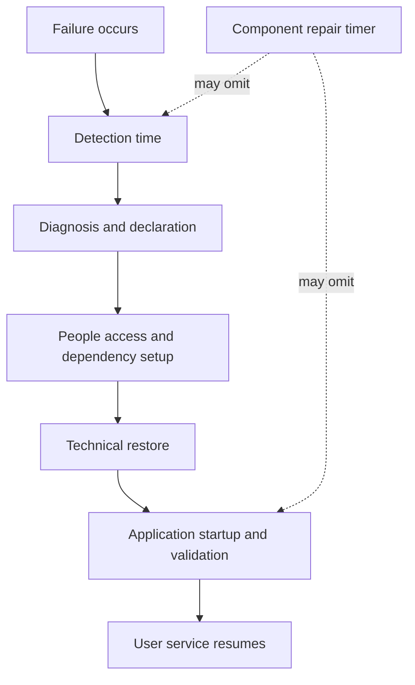

Report distributions: median, 95th percentile, longest incidents, and category breakdown can be more actionable than one mean.

---

## 5. Redundancy and high availability

**Redundancy** is an additional component, path, copy, or capability intended to preserve a function after a failure. **High availability (HA)** is the design and operating practice of keeping a service usable through specified failures with limited interruption.

HA needs more than duplicate boxes:

1. Detect failure correctly.
2. Decide who may serve.
3. Preserve or recover required state.
4. Move traffic or ownership.
5. Provide enough surviving capacity.
6. Avoid two active owners corrupting shared state.
7. Validate application service.
8. Repair and return safely to normal protection.

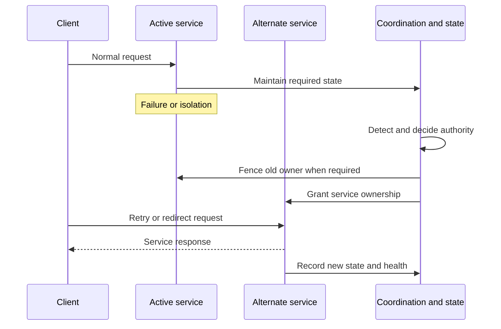

### Active-active and active-passive orientation

| Design | Plain meaning | Main question |
|---|---|---|
| Active-active | More than one member serves work during normal operation | Can survivors carry full required load and preserve state after one fails? |
| Active-passive | A standby takes over when active service fails | How are state, authority, transition, and standby readiness validated? |
| Load-balanced stateless tier | Requests can move among replaceable workers | Which stateful database, identity, or queue remains a shared dependency? |
| Multipath storage access | Host has more than one path | Are paths physically independent and correctly configured end to end? |

No design label proves zero interruption, zero data loss, or application awareness.

---

## 6. Quorum, witness, split brain, and fencing

**Quorum** is the minimum voting authority required for a distributed group to make protected decisions or continue a function. A **witness** is an additional participant or service that contributes information or a vote to help determine which side should operate; it may not store application data. **Split brain** is a dangerous condition where isolated sides both believe they may own the same service or data. **Fencing** prevents an old, isolated, or failed participant from accessing a shared resource before another takes ownership.

### Plain-English deep-dive: one steering wheel

Imagine two drivers separated by a failed radio, both reaching for one remotely controlled vehicle. A vote establishes which side has authority. A witness can break a tie. Fencing removes the losing driver's keys before the winner drives. Without authority and fencing, `redundancy` can become two writers corrupting the same state.

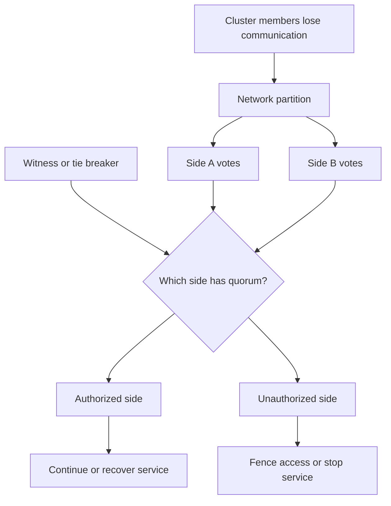

### Quorum questions

- What entities vote, and how many votes exist?
- What failure partitions the voters?
- Where is the witness, and what dependencies does it share?
- Can the witness be reachable from both sides or neither?
- What happens when quorum is lost: stop, read-only, degraded, or manual decision?
- How is fencing implemented and verified?
- Who is authorized to force a decision, and what stale-state risk follows?

Product-specific quorum, mediator, witness, epsilon, fencing, takeover, and failover behavior must come from exact current documentation. Never generalize this majority diagram into an ONTAP or MetroCluster procedure.

---

## 7. Failure domains from component to region

A **failure domain** is a boundary within which multiple components can fail together. Protection is meaningful only when alternatives cross the domain being considered.

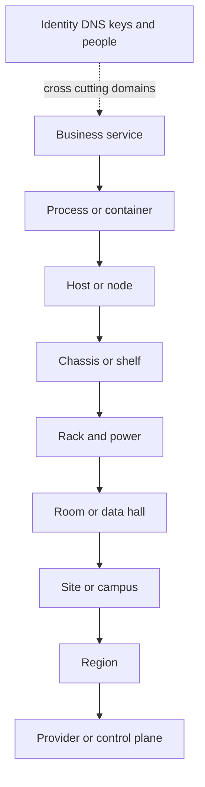

### Local, site, and region protection

| Scope | Example failure | Protection question |
|---|---|---|
| Component | Disk, NIC, process, power supply | Is there an alternate, and can it take load? |
| Node/chassis | Controller, host, backplane | Are state and paths independent of the failed chassis? |
| Rack/data hall | Power distribution, top-of-rack switch, cooling | Are both sides in different physical infrastructure? |
| Site | Fire, flood, campus network, facility power | Is data and application recovery available elsewhere? |
| Region | Regional provider or network event | Do recovery control, identity, DNS, and copies cross the region? |
| Administrative/cyber | Compromised credential or automation | Can the same identity alter primary and recovery copies? |
| People/process | Missing access, stale runbook, unavailable approver | Can trained alternates execute recovery under pressure? |

### Shared-fate checklist

- Power, cooling, rack, shelf, switch, cable, and building.
- DNS, identity provider, certificate authority, key manager, and time service.
- Management/control plane, monitoring, automation, and credentials.
- Software release, firmware, image, configuration, and deployment pipeline.
- Network carrier, cloud account, region, support entitlement, and vendor.
- Backup catalog, encryption keys, recovery documentation, and staff.

Two sites can still share identity, keys, management, or one operator mistake.

---

## 8. Snapshot, replication, backup, archive, DR, and cyber recovery

### Definitions

- A **snapshot** is a point-in-time representation, often efficient and local to a storage system or service.
- **Replication** copies data or changes to another location or system to maintain another state.
- A **backup** is a separately managed recoverable copy created under retention and restore policy.
- An **archive** is retained data preserved for long-term reference, compliance, or low-frequency access; it is not necessarily optimized for rapid operational recovery.
- **Disaster recovery (DR)** is the coordinated capability to restore data, applications, dependencies, and service after a major disruption.
- **Cyber recovery** is a recovery capability designed for malicious compromise, emphasizing isolation, immutability or protected retention, clean identity, evidence, malware handling, and trustworthy restoration.

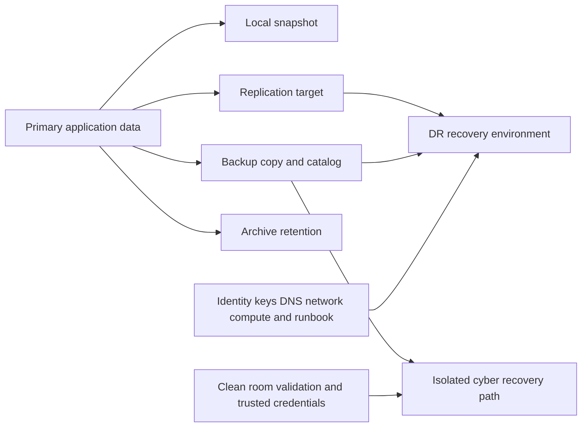

### Comparison

| Control | Primary purpose | Strength | Common gap |
|---|---|---|---|
| Snapshot | Fast point-in-time local recovery | Efficient and quick restore options | Shares system/admin/site fate; retention and consistency vary |
| Replication | Maintain another copy/state with lower lag | Supports continuity and site recovery | Can copy deletion, corruption, or ransomware |
| Backup | Retained recoverable copy | Version history and independent recovery design | Restore speed, catalog, keys, and testing can fail |
| Archive | Long-term retention/reference | Cost and governance for old data | May not meet operational RTO or application startup needs |
| DR | Restore an application/service after major disruption | Integrates data, compute, network, identity, people, and sequence | Runbook or dependencies can be stale |
| Cyber recovery | Restore trustworthy service after compromise | Isolation, protected copies, clean validation | Recovery environment or credentials may share compromise |

### Copy age and replication lag

**Replication lag** is how far a destination trails the source under a defined metric. Low lag does not prove application consistency, clean data, available recovery compute, or tested RTO.

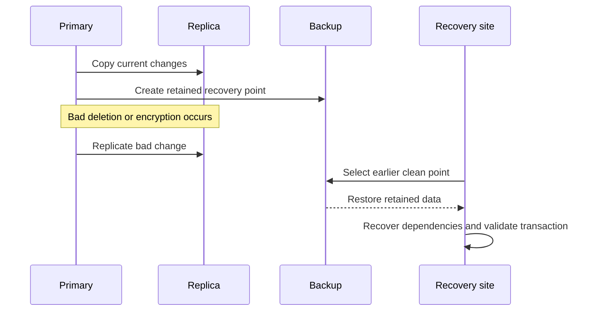

---

## 9. The 3-2-1 orientation and cyber-resilient extensions

The **3-2-1 rule** is a planning heuristic:

- Keep at least three copies of important data, including the primary.
- Use at least two different storage media or systems/technologies as appropriate.
- Keep at least one copy offsite or in another meaningful failure domain.

It is not a certification or guarantee. `Different media` is not enough if one credential can delete all copies. `Offsite` is not enough if replication instantly copies corruption. Modern practices often add one offline/immutable or otherwise protected copy and require zero unverified backup errors after testing; labels such as `3-2-1-1-0` are useful mnemonics, not proof.

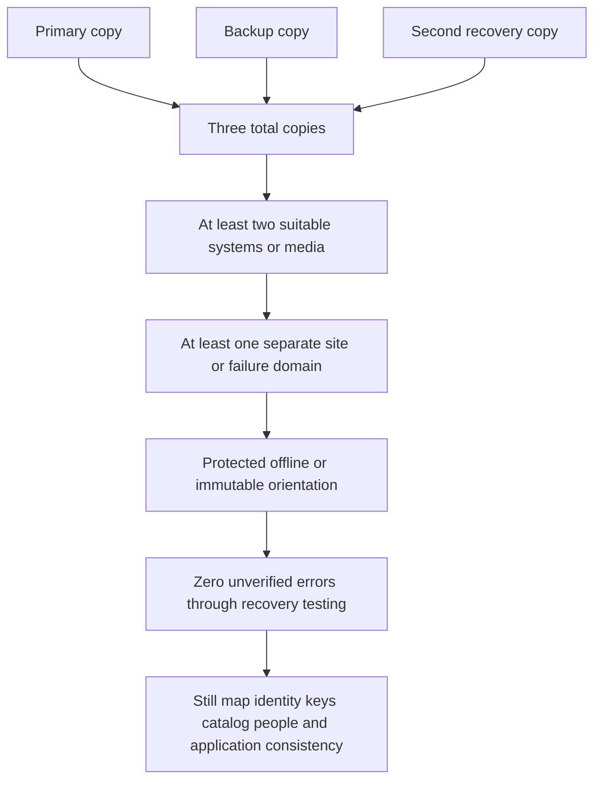

### Cyber-recovery controls

- Least-privilege backup administration.
- Separate identities, credentials, and approval paths.
- Immutable, locked, offline, or logically isolated retention under verified product semantics.
- Multi-person control for destructive operations where appropriate.
- Protected backup catalog, configuration, encryption keys, and runbooks.
- Malware scanning and forensic preservation.
- Clean-room or isolated validation before reconnecting service.
- Known-good infrastructure-as-code, binaries, certificates, and secrets.
- Recovery prioritization by business service and clean dependency order.
- Regular adversarial exercises.

Immutability protects against specified changes for a stated retention period and authority model. It does not prove the copy is clean, application-consistent, decryptable, or restorable.

---

## 10. Recoverability tests and runbooks

A **runbook** is a reviewed step-by-step operational procedure that includes decisions, prerequisites, owners, evidence, rollback/stop conditions, and validation. A screenshot of a successful backup job is not a recovery test.

### Recovery lifecycle

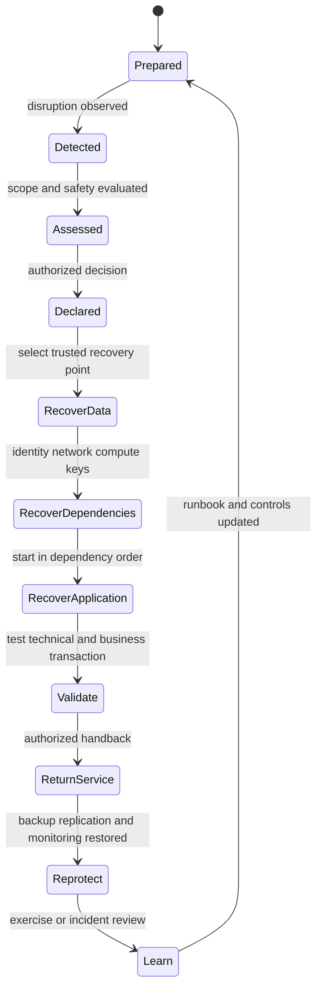

### Runbook minimum fields

| Field | Question |
|---|---|
| Trigger and authority | Who may declare which recovery mode? |
| Scope and priorities | Which services and data recover first, and why? |
| Prerequisites | Which people, access, keys, tools, sites, networks, and copies are required? |
| Recovery point selection | How is a clean, consistent, authorized point chosen? |
| Dependency order | What starts before storage, database, middleware, application, DNS, and users? |
| Detailed actions | Exact current procedures with owner and expected observation |
| Stop/escalation conditions | When must execution pause or involve a specialist? |
| Validation | Which technical checks and user transactions prove acceptable service? |
| Communication | Who receives impact, progress, decisions, and next checkpoint? |
| Reprotection | How are backups, replication, monitoring, and normal redundancy restored? |
| Evidence and learning | Which timestamps, logs, results, gaps, and actions are retained? |

### Test levels

| Level | Example | What it proves | What it does not prove |
|---|---|---|---|
| Document review | Owners read current runbook | Obvious gaps and stale names can be found | Systems or access work |
| Tabletop | Teams walk through a scenario | Decision, role, and dependency understanding | Actual restore or timing |
| Component restore | Restore one file, database, or VM | Scoped copy and procedure work | Full application or site RTO |
| Application recovery | Restore dependencies and user transaction | End-to-end recoverability for scoped scenario | Every disaster or peak workload |
| Site/region exercise | Recover broad service elsewhere | Cross-domain orchestration and capacity | Cyber cleanliness unless included |
| Cyber exercise | Assume identity/control compromise | Isolation, clean validation, governance | Every adversary path |

---

## 11. Business continuity beyond technology

IT recovery can restore systems while the business remains unable to operate. A continuity plan also addresses:

- People, succession, health, and safe working locations.
- Manual workarounds and backlog reconciliation.
- Facilities, power, connectivity, devices, and physical access.
- Suppliers, logistics, partners, and contractual obligations.
- Regulatory, legal, privacy, and communications duties.
- Customer, employee, executive, and public communications.
- Financial authority and emergency procurement.
- Return-to-normal and accumulated-work processing.

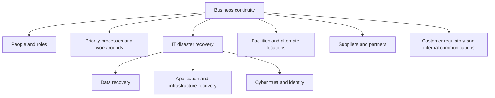

The business impact analysis should determine recovery priorities. Storage criticality should be inherited from the services and data it supports, not from array size or executive familiarity.

---

## 12. TAM discovery, recommendations, and JD mapping

### Customer discovery questions

#### Outcomes and measurement

1. Which business services and user transactions are critical?
2. What SLA, SLO, SLI, RPO, RTO, retention, and regulatory requirements apply?
3. Who approved each objective, when, and with which assumptions/exclusions?
4. Which measurement source and window prove current performance?

#### Architecture and failure domains

5. Which components, nodes, paths, sites, regions, providers, identity systems, keys, and control planes are required?
6. What are quorum, witness, fencing, failover, and manual-override rules for the exact product?
7. Which alternatives share power, network, rack, site, software, credential, or operator fate?
8. Can surviving resources carry peak workload?

#### Copies and consistency

9. Which snapshots, replicas, backups, archives, and cyber-recovery copies exist?
10. Where are they stored, who can alter them, and what retention applies?
11. Are they crash-, file-system-, application-, or multi-system-consistent?
12. What replication lag and backup age were measured at the relevant event?

#### Recovery capability

13. Who declares disaster or cyber recovery?
14. Which runbook version, owners, access, keys, catalogs, dependencies, and communication routes exist?
15. When was each service recovered to a user transaction, and what RPO/RTO was achieved?
16. Which gaps, failed steps, manual work, and remediation remain?
17. How is the environment reprotected after recovery?

#### Operations and evidence

18. Which incidents, near misses, failovers, false alarms, and changes occurred?
19. What current official supportability and lifecycle evidence applies?
20. Which recovery assumptions remain untested or access-gated?

### Recommendation flow

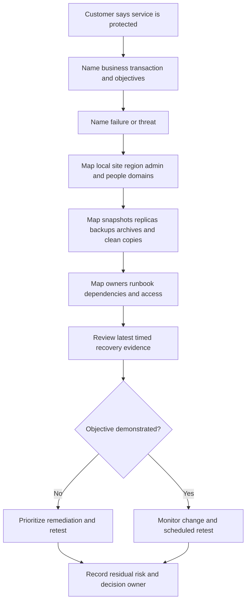

### Recommendation patterns

| Evidence-backed condition | Risk | Bounded recommendation | Validation |
|---|---|---|---|
| 99.99% target measured only by storage uptime | User service availability can miss target unnoticed | Define end-to-end SLI and exclusions; reconcile service events | Approved SLI and monthly event audit |
| Replica lag is low but restore never tested | Copy may be inaccessible or application-inconsistent | Run a scoped isolated application recovery exercise | Transaction succeeds; achieved RPO/RTO recorded |
| Backup admin shares production identity | One credential compromise can affect all copies | Design least-privilege separated recovery identity under security governance | Access test, destructive-action control review, recovery exercise |
| Two sites share DNS, keys, and control plane | Site diversity does not cover shared services | Add shared-dependency controls and tested alternate path | Dependency-failure tabletop plus technical test |
| RTO omits declaration and user validation | Recovery capability is overstated | Measure from business-impact start to acceptable transaction | Timestamped full lifecycle |

### Explicit JD mapping

| JD responsibility | Part 8 contribution | Arti transfer and honest gap |
|---|---|---|
| Understand customer environment | Maps service objectives through technology, sites, identity, people, and recovery | M365 dependency thinking transfers; NetApp DR architecture is unclaimed |
| Mitigate risk and improve stability | Separates threats and validates recovery controls | CRITSIT impact/restoration discipline transfers strongly |
| Strategic planning and best practices | Converts RPO/RTO, failure domains, tests, and lifecycle into a roadmap | Advisory and business-review experience transfers |
| Analyze and report data | Calculates nines, achieved RPO/RTO, MTTR distributions, lag, and test gaps | Analytics skills transfer; definitions must be governed |
| Conduct service reviews | Frames recovery evidence, decisions, owners, and residual risk | Existing business-review communication is relevant |
| Improve support experience | Supplies impact, topology, dependencies, recovery state, and exact ownership | Escalation packaging is proven; product procedures need SMEs |

### Honest production-gap note

> "I can distinguish availability, durability, reliability, resilience, and recoverability; calculate service targets; map quorum and failure domains; and design a recovery-evidence review. My production evidence is Microsoft enterprise incident and customer communication work, not operating NetApp HA, SnapMirror, MetroCluster, or backup services. For a real account I would use current official product documentation, authorized telemetry, customer-approved objectives, and storage/DR/security SMEs, and I would describe synthetic exercises as exercises."

---

## 13. Fully synthetic worked scenario: Contoso Clinical Access

> **Synthetic case:** Contoso Clinical Access and all architecture, objectives, measurements, incidents, and outcomes below are fictional. No healthcare regulatory conclusion, NetApp product result, or production experience is claimed.

The patient-access service has:

- A 99.95% monthly availability SLO.
- A 15-minute RPO and 2-hour RTO for a declared primary-site disaster.
- Two local application nodes and redundant storage paths.
- Asynchronous replication to a secondary site every five minutes in the exercise model.
- Nightly backup with 30-day retention in a separate account.
- Shared enterprise identity, DNS, and key management across both sites.
- A recovery runbook last fully tested 14 months ago.

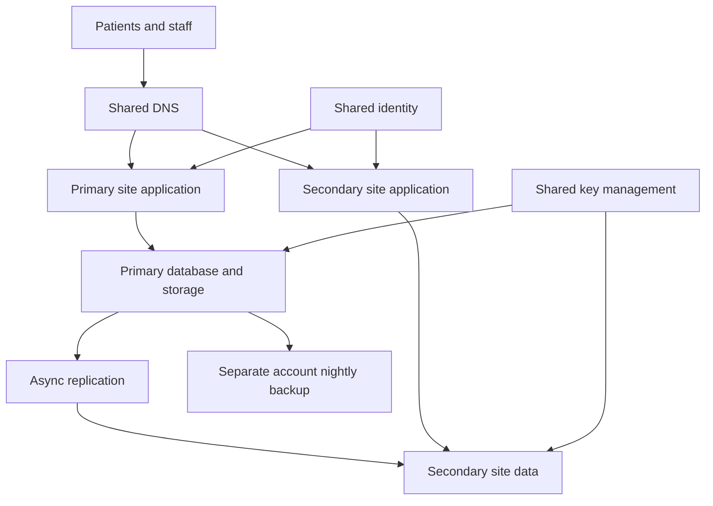

### Availability budget

A 30-day month has 43,200 minutes. At 99.95%:

$$
T_{down}=43{,}200\times(1-0.9995)=21.6\ \text{minutes}
$$

During one month the service had:

- 11 minutes complete outage.
- 18 minutes when 40% of transactions failed.

There is no single correct availability result until the SLI defines partial failure. If unavailable minutes are transaction-weighted and traffic is uniform for illustration:

$$
\text{equivalent downtime}=11+(18\times0.40)=18.2\ \text{minutes}
$$

$$
A\approx\frac{43{,}200-18.2}{43{,}200}=99.9579\%
$$

If the agreement counts any material partial outage as fully unavailable, downtime is 29 minutes and the target is missed. Governance must choose the definition before the result.

### DR exercise timeline

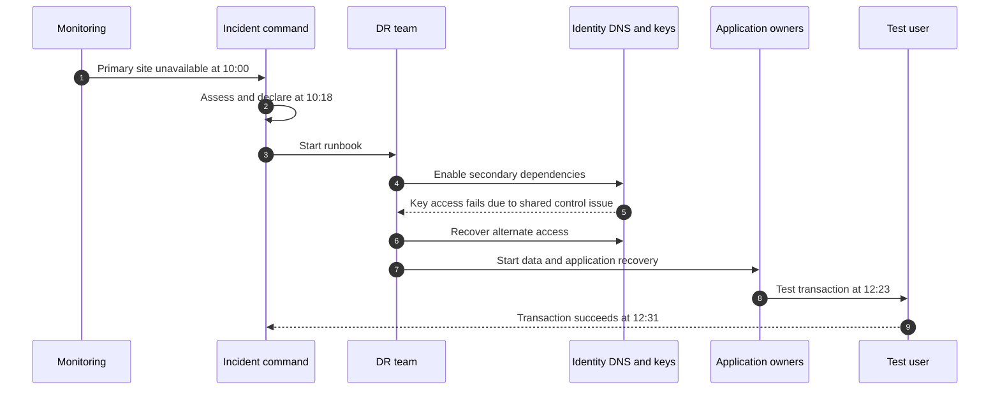

The last consistent replicated point is 09:52. Achieved values:

$$
\text{actual data gap}=10{:}00-09{:}52=8\ \text{minutes}
$$

$$
\text{actual recovery time}=12{:}31-10{:}00=2\ \text{h}\ 31\ \text{min}
$$

The exercise meets the 15-minute RPO but misses the 2-hour RTO by 31 minutes. The main delay is not data transfer; it is shared key/control access and declaration delay.

### Findings and recommendations

| Finding | Risk | Recommendation | Owner and validation | Residual risk |
|---|---|---|---|---|
| Partial-failure SLI undefined | Availability reporting can change by interpretation | Approve transaction-based SLI, scope, exclusions, and data quality | Service owner; recalculate 12 months | Measurement still depends on probes and traffic representation |
| DR exercise meets RPO but misses RTO | Service restoration exceeds business tolerance | Remediate key access and declaration workflow; retest full transaction | DR and security owners; achieve under 2 hours | Different disaster scenarios can still exceed target |
| Both sites share identity, DNS, and keys | Site failover can be blocked by shared services | Design supported alternate/isolated recovery dependencies and governance | Enterprise architecture/security; dependency-failure test | Some enterprise dependencies remain shared by choice |
| Nightly backup has no recent app restore | Cyber or replica corruption recovery is uncertain | Run isolated clean-point recovery from backup | Backup/app owners; transaction and malware checks | Nightly interval may not meet 15-minute RPO |
| Runbook is 14 months old | Owners, access, commands, and topology can be stale | Version, review, tabletop, component test, then full exercise | Continuity owner; signed evidence and gap closure | Environment changes immediately begin aging it |

### Customer-facing summary

> "The site-recovery test recovered data within the 15-minute RPO but restored the user transaction 31 minutes beyond the 2-hour RTO. The controlling gaps were shared key access and declaration delay, not replication lag. The availability target also needs a governed partial-failure definition. Our priority is to correct those dependencies, test the independent backup path, and repeat the end-to-end transaction exercise rather than describing copy status as proven recoverability."

---

## 14. Failure modes, misconceptions, and troubleshooting

| Mistake | Why it fails | Better behavior |
|---|---|---|
| `Five nines means five minutes per year` | 5.256 minutes under a 365-day assumption; contracts vary | Calculate exact window and exclusions |
| `Storage uptime equals application availability` | Identity, network, compute, app, and data correctness matter | Measure representative user transactions |
| `MTBF is device lifespan` | It is a population/model average | Use lifecycle, distribution, condition, and vendor guidance |
| `RPO is backup frequency` | Completion, lag, consistency, and recovery point matter | Validate achieved point in restore test |
| `RTO starts when IT begins recovery` | Business impact and declaration delay are omitted | Measure from agreed event start to acceptable transaction |
| `HA means no interruption` | Detection, fencing, state, capacity, and retry take time | State exact designed failure and measured effect |
| `Witness is a third data copy` | Witness may only contribute authority | Verify product role and dependencies |
| `Two sites means no shared fate` | DNS, identity, keys, control, provider, and people can be shared | Draw cross-site dependencies |
| `Replication is backup` | It can copy deletion and corruption | Keep retained, protected recovery points |
| `Immutable means clean and recoverable` | Bad data can be immutably retained | Test clean selection, decryption, and application restore |
| `Backup job succeeded` | Job status is not restored service | Execute timed transaction-level recovery |
| `DR is an IT-only project` | Business process, people, communications, and suppliers matter | Integrate business continuity |

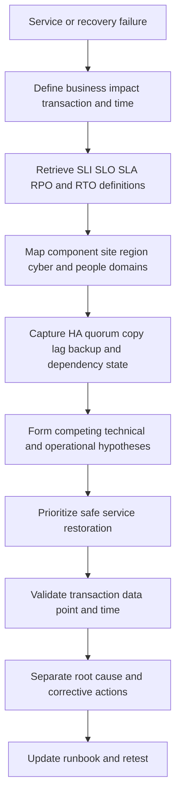

### Minimum escalation package

- Business service, user transaction, impact, sites, start time, and severity.
- Current SLA/SLO/SLI, RPO/RTO, measurement definition, and decision owner.
- Application, compute, network, identity, storage, quorum/witness, copy, and site topology.
- Exact active/failed/degraded state and recent changes.
- Snapshot/replica/backup ages, consistency, retention, immutability, catalogs, and keys.
- Runbook version, declaration time, action timeline, owner, and blockers.
- Achieved recovery point/time or current estimate with assumptions.
- Communications, support cases, exact specialist ask, and next checkpoint.

---

## 15. Paper and whiteboard lab

No production access is required. Label every input and result synthetic.

### Lab scenario

A fictional retailer requires 99.9% monthly availability, a 30-minute RPO, and a four-hour RTO for order processing. It has local HA, asynchronous site replication, nightly backup, one shared identity provider, one DNS service, and a recovery runbook not tested for 11 months.

### Tasks

1. Define one user-transaction SLI and two misleading infrastructure-only alternatives.
2. Calculate annual and 30-day downtime for 99%, 99.9%, 99.99%, and 99.999%.
3. Add a 25-minute full outage and 60 minutes of 20% transaction failure; calculate two possible SLI interpretations.
4. Draw local HA with failure detection, quorum, witness, fencing, transition, and validation.
5. Draw component, rack, site, region, admin, identity, and people failure domains.
6. Map snapshot, replica, backup, archive, DR, and cyber-recovery controls.
7. Apply 3-2-1, then challenge shared credentials, catalog, keys, and corruption propagation.
8. Create a 20-minute replication lag and explain actual RPO after a failure.
9. Build a complete recovery timeline including declaration and user validation.
10. Create a four-hour RTO budget across detection, decision, data, dependencies, application, and validation.
11. Run a tabletop with failed DNS and compromised backup admin identity.
12. Write five runbook stop/escalation conditions.
13. Produce one recommendation with owner, test evidence, and residual risk.
14. Present a 90-second executive summary and a 10-minute technical review.

### RTO budget example

| Stage | Budget |
|---|---:|
| Detect and assess | 20 minutes |
| Declare and mobilize | 20 minutes |
| Select and restore data | 100 minutes |
| Restore identity/network/compute | 40 minutes |
| Start applications in order | 40 minutes |
| Validate transaction and hand back | 20 minutes |
| **Total** | **240 minutes = 4 hours** |

The budget is not capability until a timed test proves it. Parallel work can shorten the critical path, while dependencies and rework can lengthen it.

### Whiteboard pass criteria

- [ ] Availability, reliability, durability, resilience, recoverability, and continuity are distinct.
- [ ] SLI, SLO, and SLA form measure, target, and agreement.
- [ ] Nines math states window and exclusions.
- [ ] RPO and RTO are objectives compared with achieved results.
- [ ] MTBF/MTTR formula includes model caveats.
- [ ] HA includes detection, authority, state, transition, capacity, and validation.
- [ ] Quorum, witness, split brain, and fencing are distinct.
- [ ] Failure domains include identity, keys, people, and control plane.
- [ ] Snapshot, replication, backup, archive, DR, and cyber recovery have separate jobs.
- [ ] Recovery proof ends with a user transaction and reprotection.
- [ ] Business continuity extends beyond IT.
- [ ] No synthetic result is described as NetApp production work.

---

## 16. Self-test

1. Define availability, reliability, durability, resilience, recoverability, and business continuity.
2. Give an example of available but not durable and durable but unavailable.
3. Define SLI, SLO, and SLA as measure, target, and agreement.
4. Calculate downtime allowed for three and four nines over a 30-day month.
5. Explain five assumptions that can change an availability result.
6. Define RPO and RTO and distinguish objectives from achieved results.
7. Draw a recovery timeline and calculate actual RPO/RTO.
8. Define MTBF, MTTF, and MTTR and explain the simplified availability formula.
9. Explain why means and independence assumptions can mislead.
10. Define redundancy and HA and list eight required HA functions.
11. Compare active-active, active-passive, load balancing, and multipath orientation.
12. Define quorum, witness, split brain, and fencing.
13. Ask seven quorum questions without assuming product behavior.
14. Draw component-to-region failure domains and six cross-cutting shared dependencies.
15. Distinguish snapshot, replication, backup, archive, DR, and cyber recovery.
16. Explain why replication lag does not prove RPO or RTO.
17. Explain 3-2-1 and its cyber-resilient caveats.
18. List ten cyber-recovery controls.
19. Build a complete runbook and distinguish six test levels.
20. Explain why backup success is not recoverability.
21. Explain business continuity beyond technology.
22. Ask the complete TAM discovery set.
23. Recreate Contoso's nines math, DR timeline, findings, and customer summary.
24. Complete the paper lab and answer Q1-Q8 aloud.

---

## 17. Official Source Anchors

**Date checked: 2026-08-24.** These official and vendor-neutral sources anchor broad continuity, recovery, security, and NetApp documentation areas. Exact service commitments, product availability, quorum, replication, backup, immutability, ransomware, and recovery behavior are version-, contract-, topology-, and configuration-sensitive. Some standards and customer tools are access-gated. Never invent a product guarantee, internal NetApp process, customer entitlement, or tested outcome.

| Topic | Official or vendor-neutral source | Bounded use and access note |
|---|---|---|
| Contingency planning | [NIST SP 800-34 Rev. 1](https://csrc.nist.gov/pubs/sp/800/34/r1/final) | Official NIST guidance for information-system contingency planning. Organizations must tailor and supplement it; check revision status. |
| Storage security and resilience | [NIST SP 800-209](https://csrc.nist.gov/pubs/sp/800/209/final) | Official security guidance for storage infrastructure. It does not define a specific product design. |
| Cybersecurity recovery | [NIST Cybersecurity Framework 2.0](https://www.nist.gov/cyberframework) | Official framework includes Govern, Identify, Protect, Detect, Respond, and Recover outcomes. Use current profiles and organizational context. |
| Ransomware and backups | [CISA StopRansomware Guide](https://www.cisa.gov/stopransomware/ransomware-guide) | Official public guidance for ransomware prevention, response, backups, and recovery. Check current edition and sector requirements. |
| Business continuity management | [ISO 22301](https://www.iso.org/standard/75106.html) | Official ISO standard catalog entry. Full standard is generally purchase/access controlled; certification is not implied. |
| Storage terminology | [SNIA Dictionary](https://www.snia.org/education/online-dictionary) | Vendor-neutral definitions. Terms do not establish product implementation or a service guarantee. |
| ONTAP high availability documentation | [ONTAP high-availability pair management](https://docs.netapp.com/us-en/ontap/high-availability/) | Official public documentation area. Exact takeover/giveback, state, and impact are deferred to Parts 21 and 77. |
| ONTAP data protection and DR | [ONTAP data protection and disaster recovery](https://docs.netapp.com/us-en/ontap/data-protection-disaster-recovery/) | Official public entry point. Snapshot, SnapMirror, backup, and DR specifics are deferred to Parts 35-38. |
| MetroCluster documentation | [MetroCluster documentation](https://docs.netapp.com/us-en/ontap-metrocluster/) | Official public product area. Architecture, mediator/witness, switchover, and recovery are version-sensitive and deferred to Part 38. |
| ONTAP ransomware protection | [ONTAP ransomware protection documentation](https://docs.netapp.com/us-en/ontap/anti-ransomware/) | Official public area. Feature availability, licensing, mode, guarantees, and procedures are release-sensitive and deferred to Part 41. |
| NetApp security resources | [NetApp Trust Center](https://www.netapp.com/company/trust-center/) | Official public security and trust context. Marketing or program descriptions are not customer recovery guarantees. |

### Source-use discipline

- Record business service, approved objectives, SLI definition, measurement window, exclusions, owner, and date.
- Record exact product, release, topology, quorum/witness/fencing design, copy policy, lag, retention, access model, and support status.
- Distinguish design intent, current health, copy success, test result, and actual incident outcome.
- Measure RTO from the agreed business event to an acceptable user transaction unless governance defines otherwise.
- Treat immutable, offsite, replicated, and `successful` as claims requiring exact scope and recovery evidence.
- State access gaps and use authorized SMEs; do not invent NetApp commands, contracts, or internal processes.

---

## Likely Interview Questions

### Q1. Distinguish availability, reliability, durability, and resilience.

> **Model answer:** "Availability asks whether the service is usable when required. Reliability asks whether it keeps performing without failure over a stated interval. Durability asks whether accepted data survives named failures and time. Resilience is broader: prepare, absorb, continue, recover, and adapt across people, process, and technology. A service can be unavailable while data is durable, or highly available while accepting data incorrectly. I define the service, interval, failure, and evidence before using any label."

**Follow-up depth:** Give four combinations from the chapter table and explain where recoverability and business continuity fit.

### Q2. What are SLA, SLO, and SLI, and how do you calculate availability?

> **Model answer:** "An SLI is the measured service behavior, an SLO is the target for that indicator, and an SLA is the formal agreement and governance. Availability is usable time divided by total defined time, or one minus unavailable fraction. For 99.9% over 30 days, the simple budget is 43.2 minutes. I would still verify user journey, denominator, partial failure, maintenance exclusions, window, probes, and contract language before stating compliance."

**Follow-up depth:** Calculate 99.99% annual and monthly budgets and handle a period with 40% transaction failure rather than complete outage.

### Q3. Explain RPO and RTO without confusing objectives and results.

> **Model answer:** "RPO is the maximum acceptable data-loss window measured backward from disruption. RTO is the target duration to restore an acceptable service. They are business objectives. Copy schedules and architecture propose capability; a timed restore shows the achieved recovery point and recovery time. I include detection, declaration, identity, network, application startup, validation, and user readiness in the measured timeline according to the approved definition."

**Follow-up depth:** Recreate the Contoso exercise and explain how it met RPO but missed RTO even though replication was frequent.

### Q4. What roles do quorum, witness, and fencing play in HA?

> **Model answer:** "Quorum is the voting authority required for a distributed group to continue protected decisions. A witness can contribute a vote or outside observation to break ambiguity and may not hold application data. Fencing prevents an old or isolated owner from accessing shared resources before another takes control. Together they reduce split-brain risk. Exact voting, tie-breaking, and failover behavior is product-specific, so I verify current architecture and never force ownership from a generic diagram."

**Follow-up depth:** Draw a network partition, identify shared witness dependencies, and explain the risk of manual force without verified fencing and state.

### Q5. Why are two sites not automatically resilient?

> **Model answer:** "The sites can share DNS, identity, key management, control planes, carriers, cloud accounts, software versions, credentials, backup catalog, support processes, or the same operators. A site event may spare those services, but a cyber or administrative event can affect both. I map component, rack, site, region, administrative, and people failure domains, then test whether the surviving side has correct data, capacity, authority, access, and a current runbook."

**Follow-up depth:** Use the Contoso key-management delay and list ten shared-fate dependencies beyond storage.

### Q6. Compare snapshot, replication, backup, archive, DR, and cyber recovery.

> **Model answer:** "A snapshot is a point-in-time representation, often local. Replication maintains another state with some lag. Backup creates separately managed retained recovery points. Archive preserves data for long-term reference. DR coordinates data, compute, network, identity, people, and application recovery after major disruption. Cyber recovery adds isolation, protected retention, clean identity, malware handling, and trustworthy validation. None is interchangeable, and all require exact consistency and tested restore evidence."

**Follow-up depth:** Compare each control against deletion, corruption, ransomware, site loss, RPO, RTO, and long-term retention.

### Q7. How do you prove recoverability?

> **Model answer:** "I start with a customer-approved service, RPO, RTO, and threat. I select an authorized recovery point, execute the current runbook with real dependency owners and access, restore data and application components in order, validate a representative user transaction, record achieved data point and elapsed time, and then re-establish protection. I capture failed steps, manual work, evidence, residual risk, and retest actions. A successful backup job or low replica lag is only an input."

**Follow-up depth:** Distinguish document review, tabletop, component restore, application recovery, site exercise, and cyber exercise.

### Q8. How does your Microsoft support background prepare you for resilience work?

> **Model answer:** "My production experience includes business-critical and CRITSIT ownership in Microsoft support, where I defined impact, coordinated multiple technical owners, maintained evidence-based updates, prioritized restoration, and worked with Product and Engineering. Those behaviors transfer to recovery governance and customer communication. I would not claim production NetApp HA or DR operations. My NetApp-specific knowledge remains conceptual and synthetic until authorized labs, current product documentation, and SME-reviewed work provide direct evidence."

**Follow-up depth:** Give one sanitized incident story, separate restoration from prevention, and list the NetApp/product-specific facts the story cannot prove.

---

## 30-Second Memory Hooks

- **Availability:** Usable now.
- **Reliability:** Keeps working without failure over a stated interval.
- **Durability:** Accepted data survives a named failure.
- **Resilience:** Prepare, absorb, recover, and adapt.
- **Recoverability:** Prove the return path.
- **Business continuity:** Keep priority business operating, not only IT.
- **SLI/SLO/SLA:** Measure, target, agreement.
- **Three nines:** About 43.2 minutes in 30 days.
- **RPO:** Bookmark backward; how much data may be lost.
- **RTO:** Stopwatch forward; when is acceptable service back.
- **MTBF:** Population/model average, not one device's death date.
- **MTTR:** Define whether it ends at component repair or user service.
- **HA:** Detect, decide, fence, transition, carry load, validate.
- **Quorum:** Enough authority to decide.
- **Witness:** Tie-breaking evidence or vote, not necessarily data.
- **Fencing:** Take away the old owner's keys.
- **Failure domain:** What can fall together.
- **Snapshot:** Point in time; **replica:** maintained second state.
- **Backup:** Retained restore copy; **archive:** long-term reference.
- **DR:** Recover the service; **cyber recovery:** recover trusted service.
- **3-2-1:** Three copies, two suitable media/systems, one offsite domain, then test identity and restore.
- **Runbook:** Trigger, owner, action, stop condition, proof, and learning.
- **Recovery test:** Ends at a valid user transaction and reprotection.
- **Arti's bridge:** CRITSIT discipline transfers; NetApp HA/DR operation is unclaimed.

---

## Completion Checklist

- [ ] Define availability, reliability, durability, resilience, recoverability, and business continuity with examples.
- [ ] Distinguish SLI, SLO, and SLA and define a representative user SLI.
- [ ] Calculate annual and monthly downtime for common nines targets.
- [ ] Explain partial failure, exclusions, windows, probes, and denominator choices.
- [ ] Define RPO and RTO and separate objective, capability, estimate, and actual result.
- [ ] Build and calculate a complete recovery timeline.
- [ ] Define MTBF, MTTF, and MTTR and state all formula caveats.
- [ ] Explain redundancy and the eight functions needed for HA.
- [ ] Compare active-active, active-passive, load balancing, and multipath.
- [ ] Define quorum, witness, split brain, and fencing without assuming product behavior.
- [ ] Map component, rack, site, region, administrative, cyber, and people failure domains.
- [ ] Identify cross-site shared fate in identity, keys, control, network, and operations.
- [ ] Distinguish snapshot, replication, backup, archive, DR, and cyber recovery.
- [ ] Explain 3-2-1 and its immutability, identity, catalog, cleanliness, and test caveats.
- [ ] Build a recovery runbook with triggers, owners, stop conditions, validation, and reprotection.
- [ ] Distinguish document review, tabletop, component, application, site, and cyber tests.
- [ ] Explain how business continuity extends beyond technology.
- [ ] Ask all discovery questions and write a bounded recommendation.
- [ ] Recreate Contoso's SLI math, DR results, shared dependencies, and customer summary.
- [ ] Complete the paper lab, self-test, and Q1-Q8 aloud.
- [ ] State Arti's Microsoft transfer and NetApp production gap honestly.
- [ ] Recheck exact official product, contract, topology, supportability, and recovery procedures before real use.

---

*Next suggested section:* [Part 9 - Performance Fundamentals and Queueing Intuition](Part-09-performance-iops-throughput-latency-queues.md)