# Part 9 - Performance Fundamentals and Queueing Intuition

> **Section goal:** Learn to describe storage performance with correct units, separate service time from waiting, understand concurrency and saturation, and characterize the workload before blaming a component. By the end, you should be able to calculate IOPS, throughput, latency, queue occupancy, utilization, and Little's Law relationships; interpret percentiles and tails; challenge benchmark traps; and turn a customer symptom into a safe evidence plan.

Covers index item **9** and maps directly to job-description responsibilities for storage depth, customer-environment analysis, data generation and reporting, technical-risk mitigation, solution stability, customer-specific recommendations, service-review communication, troubleshooting, and supportability awareness.

This Part teaches vendor-neutral performance reasoning. It does not state NetApp platform limits, counter formulas, benchmark results, queue semantics, or tuning settings. Exact counter scope, workload generators, ONTAP behavior, CPU scheduling, protocol limits, and supported changes must be verified for the exact release, platform, host, network, application, and test method.

> **Evidence boundary:** Every workload, measurement, device, chart value, customer, test, and recommendation below is synthetic. Your prior escalation and analytics experience is production evidence; NetApp performance analysis and storage benchmarking remain study, paper-lab, and future authorized practice.

---

## 1. Performance vocabulary and units

Performance is not one number. A system handles operations, transfers bytes, makes each request wait and execute, and shares finite resources across concurrent workloads.

### Plain-English deep-dive: operation, bytes, and time

| Term | Plain meaning | Analogy | Why it matters and memory hook |
|---|---|---|---|
| **Input/output operation (I/O)** | One request to read, write, or manage data through a defined interface. | One order placed at a service counter. | Operation size and type determine the work behind an IOPS count. **Hook:** I/O = one request, not one byte. |
| **IOPS** | Input/output operations completed per second in a stated scope. | Orders completed each second. | 10,000 small requests and 10,000 large requests carry different bytes and cost. **Hook:** IOPS counts completions. |
| **Throughput** | Data transferred per unit time, commonly bytes per second. | Tonnes moved per hour. | It describes payload flow, not operation response or user success. **Hook:** Throughput counts bytes over time. |
| **Latency** | Elapsed time from a defined request start to a defined completion. | Time from joining a service process to receiving the result. | Scope can be application, host, network, storage, or device. **Hook:** Latency needs start and finish points. |
| **Response time** | Total elapsed time experienced by a request, commonly waiting plus service across the measured scope. | Queue wait plus time at the counter. | A fast resource can still have slow response because work waits. **Hook:** Response = wait plus service. |
| **Service time** | Time a resource actively spends processing a request in a stated model. | Time the cashier handles one order. | It differs from queue delay and can be hard to observe directly. **Hook:** Service = active processing. |
| **Wait time** | Time a request spends queued or blocked before service or another dependency. | Time standing in line. | Waiting often grows rapidly near saturation. **Hook:** Wait = not yet being served. |
| **I/O size** | Payload bytes requested in one operation. | Size of one parcel. | It links operation rate to byte rate. **Hook:** I/O size = bytes per request. |
| **Workload** | The pattern of operations offered to a system over time. | The mix, timing, and size of customers entering a shop. | Application names do not define read/write mix, size, locality, or bursts. **Hook:** Workload = what arrives, when, and how. |

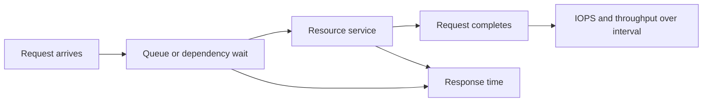

### Core relationships

For exactly comparable operations:

$$
\text{Throughput}=\text{IOPS}\times\text{average I/O size}
$$

$$
\text{Response time}=\text{wait time}+\text{service time}
$$

**Worked example:** 25,000 IOPS at exactly 16 KiB per operation:

$$
25{,}000\times16\ \text{KiB/s}=400{,}000\ \text{KiB/s}
$$

$$
\frac{400{,}000}{1024}=390.625\ \text{MiB/s}
$$

The arithmetic does not reveal randomness, direction, cache hits, latency, protocol overhead, data reduction, retries, or whether the operation count includes metadata.

### Unit discipline

| Metric | Preferred explicit unit | Common trap |
|---|---|---|
| IOPS | operations/s | Mixing requests, sub-operations, and completions |
| Throughput | B/s, MiB/s, GB/s, Gbit/s | Bits versus bytes and decimal versus binary |
| Latency | us, ms, s | Comparing different start/end points or averages |
| Queue depth | outstanding operations in a named scope | Summing host, path, and device queues as if identical |
| Utilization | percentage of named resource over interval | Treating 70% average as proof no short saturation occurred |

---

## 2. Workload fingerprint: the input before the answer

A **workload fingerprint** is a measured description of offered work and service requirements over time.

### Plain-English deep-dive: the dimensions behind an application label

| Dimension | Question | Why it changes the result |
|---|---|---|
| Read/write mix | What percentage and sequence are reads versus writes? | Writes can involve persistence, parity, replication, or media cleanup |
| I/O-size distribution | Median, percentiles, min/max, and separate read/write sizes? | Average size can hide many tiny and a few huge requests |
| Random/sequential | Are neighboring addresses accessed predictably? | Locality, prefetch, HDD positioning, and cache behavior differ |
| Concurrency | How many requests or workers are outstanding? | Parallelism can raise throughput until queues form |
| Locality | Does work reuse nearby or recent data? | Cache and prefetch effectiveness depend on it |
| Working set | How much data is actively reused in the interval? | A working set smaller than cache behaves differently from one larger than cache |
| Burstiness | How high and long are bursts? | Averages can hide queue buildup and recovery time |
| Seasonality | Which hours, days, months, or business events change demand? | Baselines need comparable periods |
| Metadata | How many opens, closes, stats, lists, locks, and permission checks? | Bytes can be low while operation cost is high |
| Durability/consistency | Which writes require ordered durable acknowledgement? | Cache and commit latency matter |
| Multi-tenancy | Which other workloads share resources? | Noisy-neighbor effects can change tail latency |

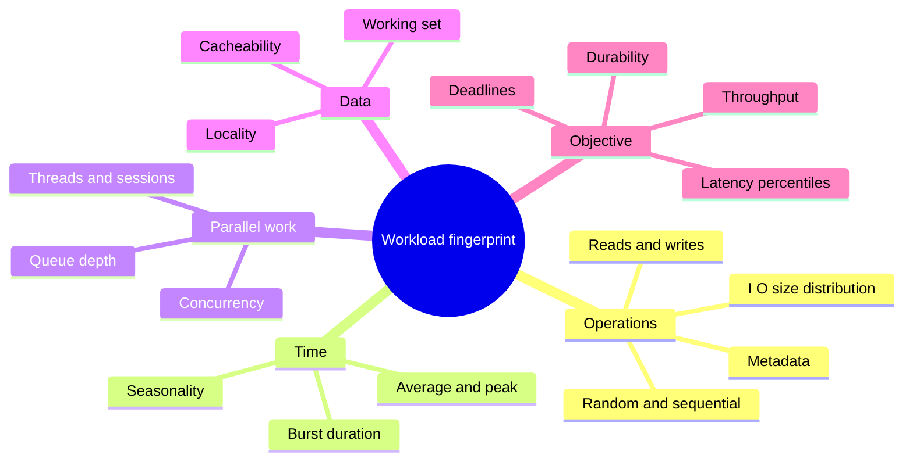

If the renderer does not support `mindmap`, redraw the branches as a flowchart; the analysis dimensions remain required.

### Read/write and random/sequential patterns

| Pattern | Typical emphasis | Misleading metric |
|---|---|---|
| Small random reads | Operation latency, cache, queueing | Sequential MB/s headline |
| Small durable writes | Tail commit latency and ordering | Read IOPS maximum |
| Large sequential reads | Sustained throughput and path width | Tiny-block random IOPS |
| Mixed random reads/writes | Contention, write work, fairness | One-direction test |
| Metadata-heavy file work | Namespace operations and CPU | Payload throughput only |
| Bursty analytics | Concurrency, cache, CPU, network, recovery after burst | Whole-day average |

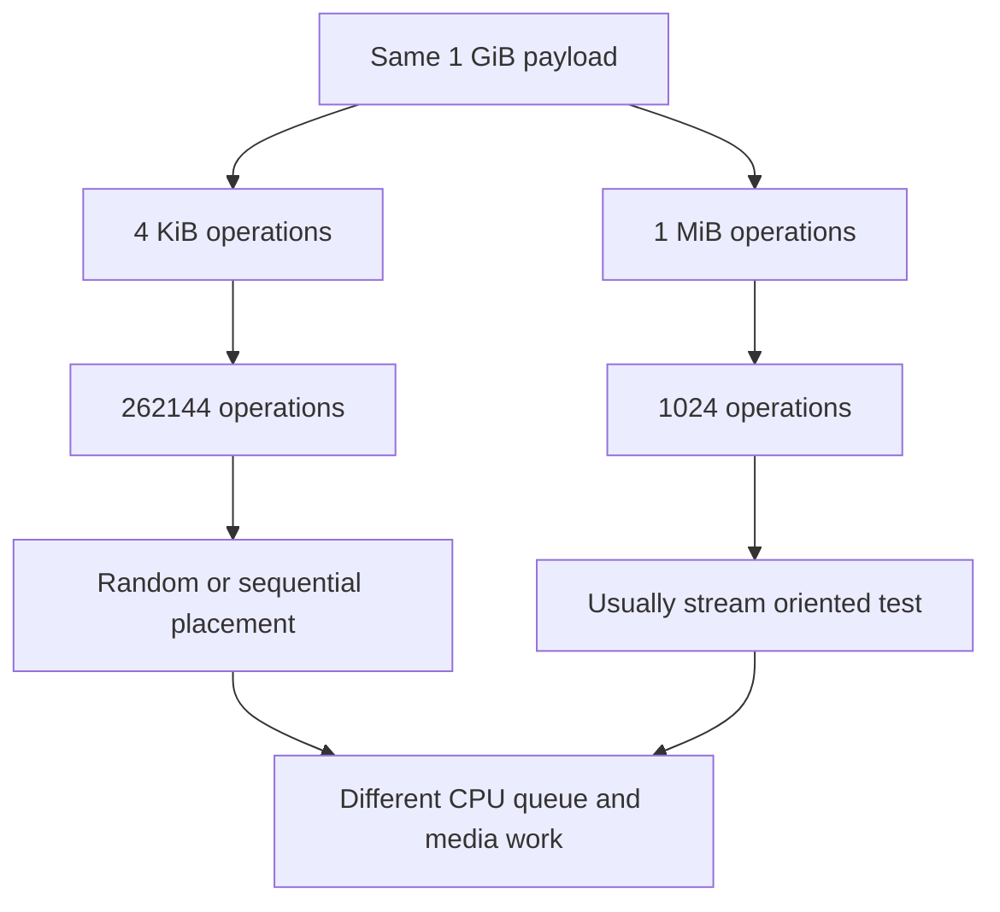

---

## 3. Average, percentile, and tail latency

An **average** sums observations and divides by count. A **percentile** is a value below which a stated percentage of observations falls. The **tail** is the slow end of the distribution, often represented by the 95th, 99th, 99.9th, or higher percentile.

### Plain-English deep-dive: why the average user may not exist

If 99 operations finish in 1 ms and one finishes in 1,001 ms:

$$
\text{mean}=\frac{99\times1+1001}{100}=11\ \text{ms}
$$

The mean is 11 ms, but no operation took 11 ms. Most took 1 ms and one took just over a second. The average hides the tail; the maximum alone overreacts to one point. A distribution with sample count and percentiles is more honest.

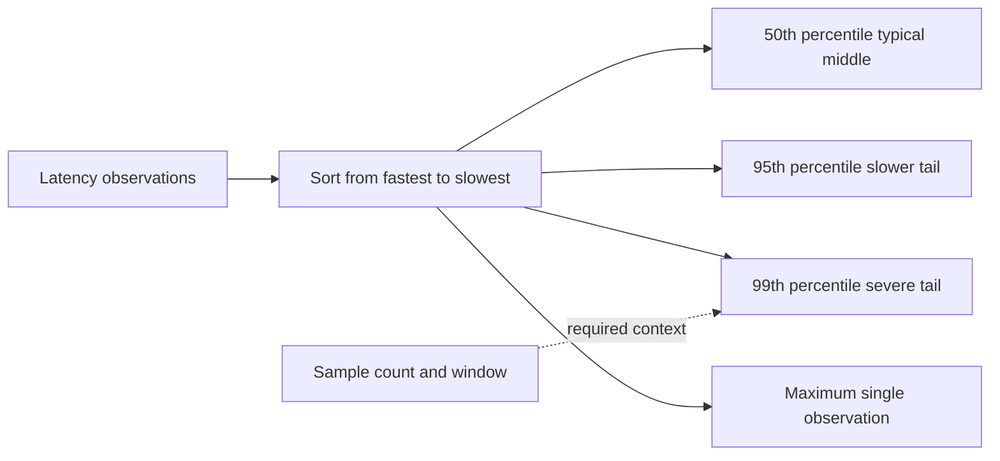

### Percentile interpretation

| Statement | Meaning | Does not mean |
|---|---|---|
| p50 = 2 ms | Half observations are at or below 2 ms | Half of users always see exactly 2 ms |
| p95 = 8 ms | 95% are at or below 8 ms; 5% are slower | Every slow request is storage-caused |
| p99 = 40 ms | 1% are slower than 40 ms in that sample/window | Next request has exactly 1% failure probability |
| max = 2 s | At least one observed value reached 2 s | The system usually takes 2 s |

### Aggregation trap

Percentiles generally cannot be averaged across hosts or intervals to reconstruct the combined percentile. Retain raw observations or merge compatible histograms/sketches designed for aggregation. Always record sample count, window, scope, and method.

---

## 4. Concurrency, queue depth, and parallelism

**Concurrency** is the number of requests active or outstanding at the same time. **Queue depth** is the number of outstanding requests in a stated queue or resource scope. **Parallelism** is work actually executing simultaneously on separate resources.

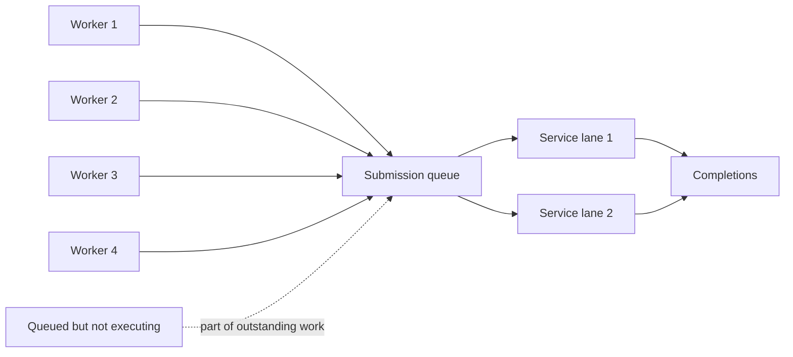

### Useful versus excessive concurrency

At very low concurrency, parallel resources can sit idle. More outstanding work can improve utilization and throughput. Once the bottleneck is busy, further concurrency mostly adds waiting and tail latency.

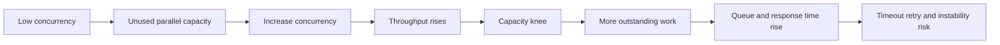

### Queue depth is scoped

A host can report 32 outstanding I/Os split across four paths, while each path, target port, storage controller, RAID group, or device reports a different queue. A database worker queue is another layer. Do not add all queue depths or compare them without mapping ownership and aggregation.

---

## 5. Utilization, bottlenecks, and saturation

**Utilization** is the fraction of a resource's available service time or capacity used during a defined interval. A **bottleneck** is the resource whose effective capacity constrains the end-to-end result. **Saturation** occurs when offered demand reaches or exceeds useful service capacity so work accumulates or is rejected.

### Plain-English deep-dive: the narrowest active gate

A journey crosses roads, toll booths, a bridge, and parking. The bridge is the bottleneck only when its effective capacity limits the current flow. Widening an empty bridge does not help a full parking entrance. After one bottleneck is improved, another can become limiting.

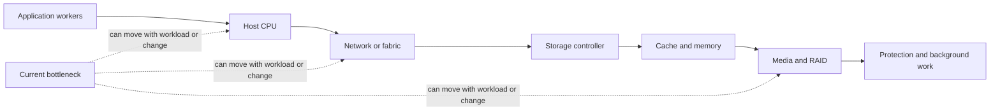

### Utilization in a simple single-server model

If arrival rate is $\lambda$ and service capacity is $\mu$:

$$
\rho=\frac{\lambda}{\mu}
$$

where $\rho$ is utilization. Stable operation in this simplistic model requires $\lambda<\mu$. Real systems have multiple servers, batching, priorities, caches, changing service time, and finite queues.

### M/M/1 intuition, not a production model

For one server with Poisson arrivals and exponentially distributed service times, the mean response time is:

$$
W=\frac{1}{\mu-\lambda}
$$

Let $\mu=10{,}000$ operations/s:

| Arrival rate | Utilization | Simplified mean response |
|---:|---:|---:|
| 5,000/s | 50% | $1/(10000-5000)=0.2$ ms |
| 9,000/s | 90% | $1/(10000-9000)=1$ ms |
| 9,900/s | 99% | $1/(10000-9900)=10$ ms |

The model demonstrates nonlinear queue growth near saturation. It does not predict a storage system because arrivals and service are rarely memoryless, capacity is not one server, and workloads change.

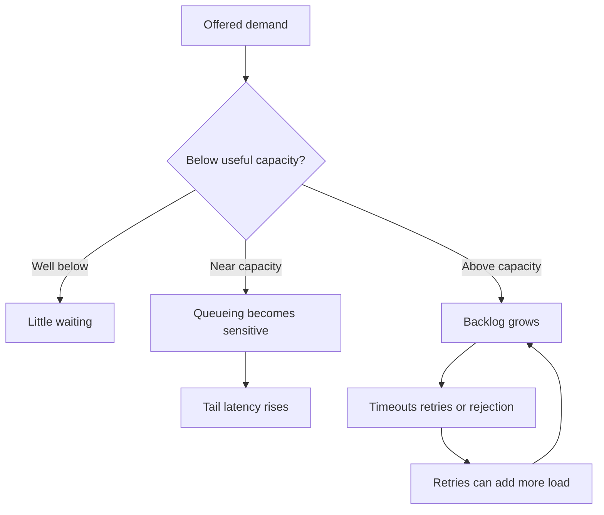

---

## 6. Little's Law

**Little's Law** states that for a stable system over a suitable observation period:

$$
L=\lambda W
$$

where:

- $L$ is average number of items in the system.
- $\lambda$ is average throughput/arrival completion rate.
- $W$ is average time an item spends in the system.

### Plain-English deep-dive: people in a cafe

If a cafe completes 2 customers per minute and each customer spends 5 minutes inside, an average of 10 customers are inside:

$$
L=2\times5=10
$$

The law is an accounting relationship, not a promise about the distribution or cause of delay.

### Storage example

A stable measured workload completes 8,000 operations/s at 4 ms average response:

$$
L=8{,}000\ \frac{ops}{s}\times0.004\ s=32\ operations
$$

Average outstanding work is 32 in the measured scope.

If measured throughput remains 8,000 operations/s and average response rises to 12 ms:

$$
L=8{,}000\times0.012=96
$$

This can indicate more queued/outstanding work, but Little's Law alone does not identify why.

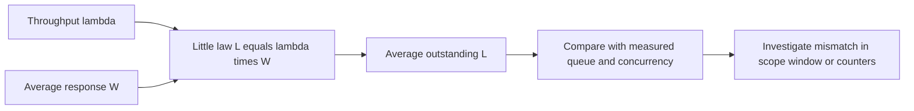

### Conditions and traps

- Use consistent scope and units.
- The system should be stable: arrivals and completions roughly balance over the window.
- Include the same population in $L$, $\lambda$, and $W$.
- Average values do not describe tail latency.
- A queue can drain or grow during a burst, violating steady-state interpretation.
- Cache hits and misses can be separate populations with different paths.

---

## 7. Cache effects and working-set transitions

A **cache hit** serves data from a nearer/faster layer. A **cache miss** requires lower work. **Hit ratio** is hits divided by eligible accesses under a defined scope. A higher hit ratio can improve performance, but the cost of misses, writes, eviction, prefetch, and metadata still matters.

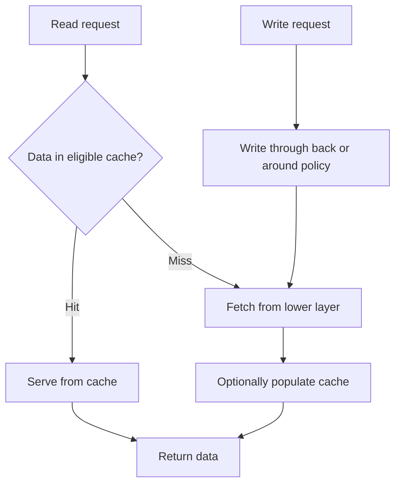

### Average latency from a two-path cache model

If hit ratio is $h$, hit latency is $T_h$, and miss latency is $T_m$:

$$
T_{avg}=hT_h+(1-h)T_m
$$

Synthetic example: 90% hits at 0.2 ms and 10% misses at 8 ms:

$$
T_{avg}=0.9(0.2)+0.1(8)=0.98\ \text{ms}
$$

At 99% hits:

$$
T_{avg}=0.99(0.2)+0.01(8)=0.278\ \text{ms}
$$

However, all misses are in the slow tail. Average improves strongly while p99 may still reflect miss latency. Hit ratio must be paired with distribution and workload.

### Working-set transition

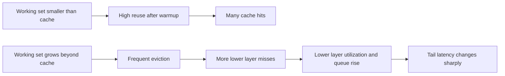

This transition can look like a sudden storage regression even when the hardware has not changed. Validate data growth, working set, cache policy, and workload locality.

---

## 8. CPU, network, controller, and media limits

### CPU

Storage work consumes CPU in applications, file systems, protocols, encryption, checksums, compression, deduplication, interrupt handling, drivers, virtualization, and controllers. Overall CPU average can hide one saturated core or thread.

### Network or fabric

An ideal 10 Gbit/s link corresponds to:

$$
\frac{10\ \text{Gbit/s}}{8}=1.25\ \text{GB/s}
$$

This is before encoding, protocol, packet headers, retransmissions, flow control, and application behavior. Bidirectional and aggregate-port claims need exact topology and hashing.

### Controller and memory

Controllers can be constrained by CPU, memory bandwidth, cache, ports, internal buses, protection work, metadata, or software locks. One high metric is not automatically the bottleneck; correlate offered work and service impact.

### Media

HDD positioning, SSD NAND channels, garbage collection, endurance policy, RAID reconstruction, and device queues can limit service. Media labels do not identify which stage dominates.

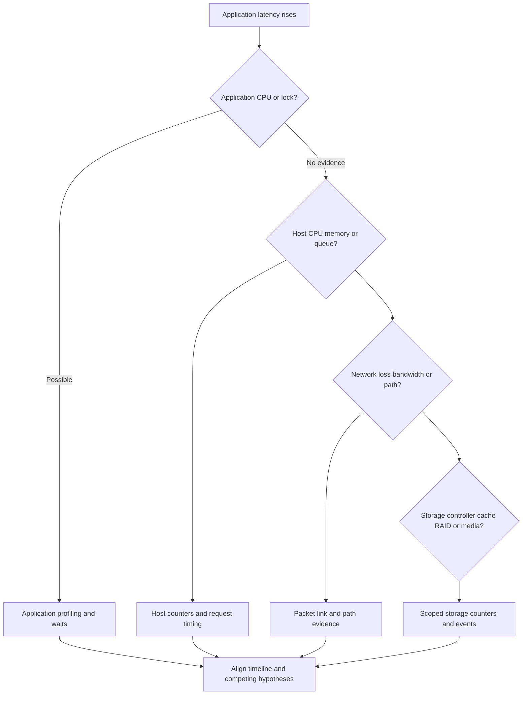

### Bottleneck signature table

| Candidate | Possible evidence | What prevents premature conclusion |
|---|---|---|
| Application lock | Threads waiting, low storage demand, transaction-specific stall | Confirm lock owner and timing |
| Host CPU | One core saturated, run queue high, I/O submission delayed | Check whether CPU rose because demand rose |
| Network | Link near capacity, loss/retransmit, pause/congestion, path imbalance | Match exact flow and direction |
| Controller | CPU/cache/port/queue saturation aligned with affected workload | Verify metric scope and competing background work |
| HDD/SSD media | Device latency, busy time, retries, GC/rebuild evidence | Separate service from upstream queue |
| Backup/rebuild | Scheduled background work aligns with tail | Controlled schedule comparison and shared-resource map |

---

## 9. Baselines, seasonality, and change correlation

A **baseline** is a versioned description of normal behavior for a comparable workload, time, topology, and service condition. It is not one historical average.

### Baseline dimensions

| Dimension | Record |
|---|---|
| Business | Service, users, transactions, critical periods, SLO |
| Workload | IOPS, throughput, sizes, read/write, randomness, concurrency, working set |
| Distribution | p50, p95, p99, max, counts, error/timeout rate |
| Resources | CPU, memory, network, controller, cache, media, queues, utilization |
| Time | Timezone, interval, sampling, peak duration, seasonality |
| Topology | Hosts, paths, volumes/LUNs/shares, controllers, RAID/local tiers, sites |
| Changes | Software, firmware, configuration, data growth, job schedules, releases |
| Data quality | Source, definition, gaps, resets, aggregation, confidence |

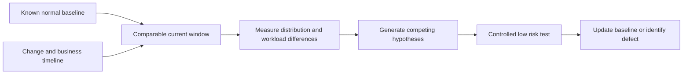

### Correlation is the start

If storage latency and application latency rise at 09:00, possible explanations include:

- Application demand increased first and caused both.
- A storage event increased service time and affected the app.
- A network issue affected both measured paths.
- Clocks or sample windows are misaligned.
- A backup/rebuild changed the shared resource.
- Different workloads are being aggregated.

Use a mechanism and a discriminating check before naming root cause.

---

## 10. Benchmark design and common traps

A **benchmark** is a controlled workload used to measure a system under defined conditions. A synthetic benchmark is valuable for comparison and boundary testing; it is not the application.

### Benchmark lifecycle

```mermaid
flowchart TD
    GOAL[Define business question and success criteria] --> SAFE[Confirm authorization safety and data impact]
    SAFE --> PROFILE[Model representative workload and topology]
    PROFILE --> PRE[Precondition and warm up as required]
    PRE --> RUN[Run long enough with steady measurement]
    RUN --> OBS[Capture client host network storage and errors]
    OBS --> REPEAT[Repeat and vary one factor]
    REPEAT --> ANALYZE[Report distribution uncertainty and limits]
    ANALYZE --> CLEAN[Stop load clean up and validate service]
```

### Benchmark traps

| Trap | Why result misleads | Better control |
|---|---|---|
| Working set fits cache | Measures memory, not lower storage | Size working set and report warm/cold phases |
| Test runs for 30 seconds | Misses steady state, GC, thermal, or queue effects | Warm up and run long enough for mechanism |
| All reads or all writes | Does not represent mixed workload | Use measured mix and sequence |
| One I/O size | Hides distribution | Model size histogram or separate classes |
| Compressible zeros | Data reduction/cache path differs | Use representative data pattern under policy |
| Queue depth chosen for headline | Maximizes IOPS while destroying latency | Sweep concurrency and plot throughput-latency curve |
| Client CPU is saturated | Benchmark generator is bottleneck | Monitor generator and distribute clients if needed |
| Network limit reached | Storage appears capped | Calculate and measure end-to-end link payload |
| Buffered I/O unintended | Measures OS cache | Choose supported buffered/direct mode deliberately |
| No preconditioning | Fresh SSD state is unrepresentative | Follow suitable test specification and device guidance |
| Production test without guardrails | Can cause outage or data loss | Use approved scope, limits, stop conditions, and non-production first |
| Compare unlike versions/topologies | Attribution is invalid | Change one factor or document differences |
| Report best run only | Selection bias | Report repetitions, variation, failures, and exclusions |

### Throughput-latency curve

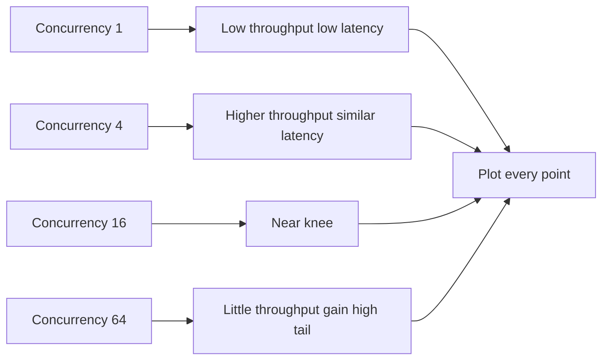

The `best` operating point depends on the customer's latency SLO, not maximum IOPS alone.

---

## 11. Coordinated omission orientation

**Coordinated omission** is a measurement error where the load generator waits for a slow response before sending work that should have arrived during the stall. The missing requests are omitted from the latency distribution, making the system look better.

### Plain-English deep-dive: the silent queue that was never created

A bus should arrive every minute. One trip takes ten minutes, but the tester waits for that bus before scheduling the next. It records one slow trip and no waiting passengers for the nine skipped arrivals. Real passengers would have queued. The measurement coordinated its arrivals with the system's delay and omitted their experience.

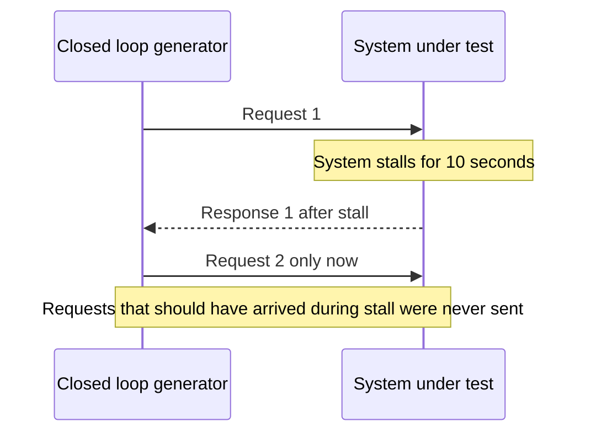

### Closed-loop versus scheduled arrivals

| Model | Behavior | Risk |
|---|---|---|
| Closed loop | Each worker sends next request after prior response | Represents some real user/session patterns but offered rate falls during stalls |
| Open loop or scheduled | Requests are scheduled independently of prior completion | Better represents fixed external arrival rate but can overload queues dangerously |
| Corrected histogram approach | Records omitted latency based on expected interval under defined assumptions | Correction depends on correct expected interval and tool behavior |

Coordinated omission is not automatically a flaw if the real workload is truly closed-loop. The key is whether the generator represents customer arrivals. Document arrival model and tool support.

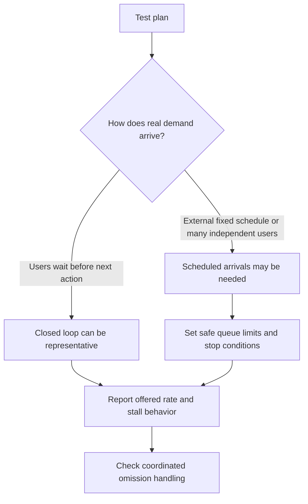

---

## 12. TAM discovery, recommendations, and JD mapping

### Customer discovery questions

#### Symptom and objective

1. Which user transaction, service, location, and time window are slow?
2. Is the complaint latency, throughput, timeout, missed batch deadline, jitter, or fairness?
3. Which SLI/SLO and percentile matter?
4. What is normal and what changed?

#### Workload

5. What are read/write mix, I/O-size distributions, randomness, concurrency, queue depth, working set, locality, metadata rate, and burst duration?
6. Which tenants, backups, rebuilds, scans, snapshots, replication, and migrations overlap?
7. How do demand and data size vary by business cycle?

#### Path and resources

8. Which application, database, host, VM/container, network/fabric, protocol, storage object, controller, RAID/local tier, and media serve the operation?
9. Which CPU cores, memory, links, ports, paths, queues, caches, and devices are shared?
10. Are paths balanced and supportable for exact host, driver, firmware, and release?

#### Measurement

11. What does each counter count, where is it measured, and is it average, instantaneous, cumulative, or percentile?
12. Are clocks, time zones, identities, intervals, units, reset events, and aggregation aligned?
13. Are client timeouts and failed requests included?
14. Does benchmark arrival model suffer coordinated omission relative to real demand?

#### Change and safety

15. Which release, configuration, workload, security, network, protection, or lifecycle change preceded the symptom?
16. What test environment, authorization, data safety, stop condition, rollback, and monitoring exist?
17. Which application/vendor support requirements constrain tuning?

### Evidence-to-recommendation flow

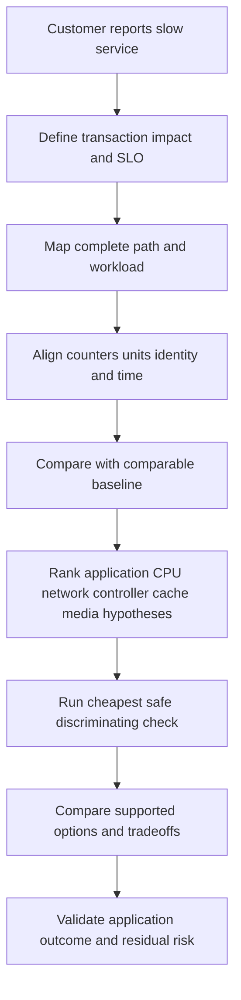

### Recommendation patterns

| Evidence-backed condition | Risk | Bounded recommendation | Validation |
|---|---|---|---|
| p99 rises while average is stable | Small but important request population suffers | Segment by workload, size, path, cache, and time; inspect queue/service components | p99 sample count and transaction outcome improve without regressions |
| Throughput plateaus and latency rises with concurrency | Bottleneck knee reached | Hold workload/profile constant; identify saturated resource; choose SLO-aligned concurrency or capacity option | Throughput-latency curve and resource evidence |
| Cache hit ratio falls after data growth | Lower tier receives more demand | Validate working-set transition; assess supported cache/capacity/workload options | Hit/miss and end-to-end latency before/after |
| Benchmark shows 1M IOPS at extreme queue depth | Headline may be irrelevant to application | Re-run representative sizes/mix/concurrency and report percentiles/errors | Application-like test with client generator health |
| Storage latency correlates with app latency | Cause remains unproven | Align transaction, database, host, network, storage, and background work; test alternatives | Mechanism plus discriminating result |

### Explicit JD mapping

| JD responsibility | Part 9 contribution | experience transfer and honest gap |
|---|---|---|
| Generate, analyze, and report customer data | Defines units, distributions, baselines, joins, and quality gates | Power BI, Excel, SQL, statistics, and support analytics transfer directly |
| Understand customer environment | Maps application-to-media performance path and shared resources | M365 systems thinking transfers; NetApp counters need study/access |
| Mitigate risk and improve stability | Detects saturation, tails, retries, background contention, and unsafe tests | critical-situation prioritization and evidence discipline transfer |
| Provide customer-specific advice | Ties workload/SLO to bottleneck and validates tradeoffs | Advisory strength transfers; tuning requires product/application SMEs |
| Conduct service reviews | Converts trends into user impact, decisions, and action | Business-review experience is a strong foundation |
| Improve support experience | Produces aligned timeline, topology, workload, counters, and exact hypotheses | Escalation packaging is proven in prior work |

### Honest production-gap note

> "I can characterize workloads, calculate throughput and queue relationships, interpret latency distributions, and design an evidence-based bottleneck investigation. My production analytics and escalation experience is focused on a different technology stack. I have not tuned ONTAP or run customer storage benchmarks, so I would validate current counter definitions, use authorized safe tests, involve application/network/storage SMEs, and describe any paper exercise or lab as such."

---

## 13. Fully synthetic worked scenario: Tailspin Retail

> **Synthetic case:** Tailspin Retail and every workload, counter, test, and outcome below are fictional. Nothing is a NetApp benchmark, sizing result, or production claim.

Tailspin's checkout database slows during a daily promotion at 12:00. The SLO is p99 transaction latency below 250 ms. Architecture:

- 12 application VMs on four hosts.
- Database uses 8 KiB pages and a separate log path.
- Storage I/O is mixed 70% reads and 30% writes.
- Backup scan starts at 11:55.
- A recent promotion doubled concurrent sessions and grew the active data set from 600 GiB to 1.4 TiB.
- Combined cache available to the relevant read path is modeled as 1 TiB.

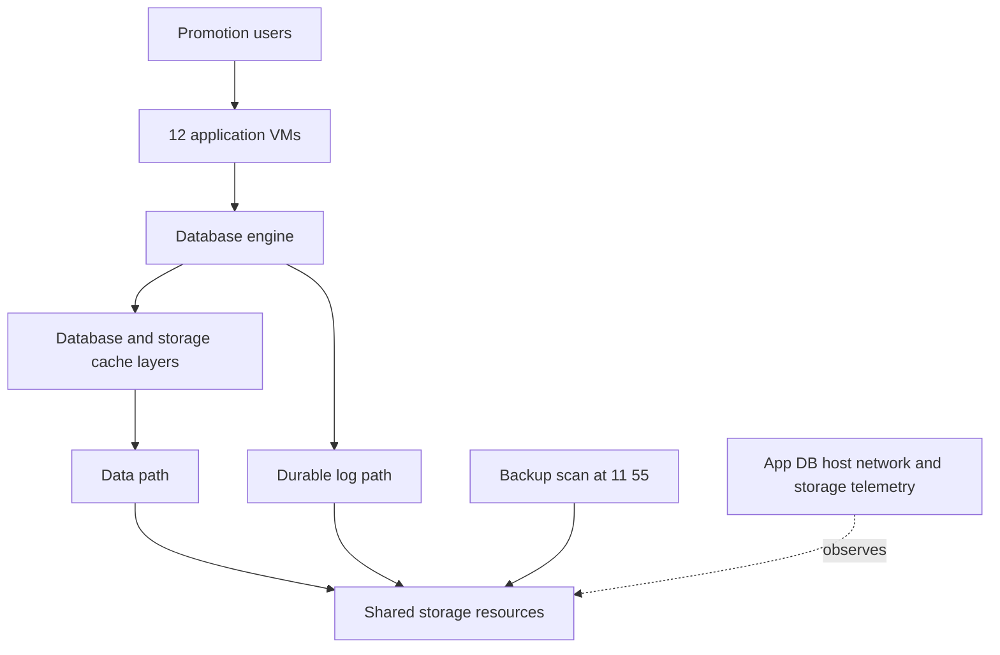

### Synthetic observations

| Metric | 11:30 baseline | 12:05 promotion | Scope |
|---|---:|---:|---|
| Transactions/s | 3,000 | 4,800 | Application |
| p50 transaction | 90 ms | 110 ms | Application |
| p99 transaction | 180 ms | 920 ms | Application |
| Storage IOPS | 18,000 | 42,000 | Mapped data/log objects |
| Average storage response | 1.8 ms | 4.5 ms | Host view |
| p99 storage response | 8 ms | 75 ms | Host view |
| Average outstanding I/O | 32 | 210 | Host scope |
| Cache hit ratio | 96% | 72% | Defined read-cache scope |
| Network payload | 2.1 Gbit/s | 5.8 Gbit/s | 10 Gbit/s link |
| Storage controller CPU average | 48% | 71% | Aggregate average |

### Little's Law checks

At 18,000 IOPS and 1.8 ms average response:

$$
L=18{,}000\times0.0018=32.4
$$

This aligns with reported average outstanding 32 after rounding.

At 42,000 IOPS and 4.5 ms:

$$
L=42{,}000\times0.0045=189
$$

Reported average outstanding is 210. The difference can arise from counter scope, sampling windows, queue populations, or rounding. It is a prompt to reconcile, not evidence of corruption.

### Throughput orientation

If all storage I/O were exactly 8 KiB, which is a deliberate simplification:

$$
42{,}000\times8\ \text{KiB/s}=336{,}000\ \text{KiB/s}\approx328.125\ \text{MiB/s}
$$

Actual logs, metadata, prefetch, and backup sizes differ, so measured throughput must replace this estimate.

### Cache transition hypothesis

The working set grew from 600 GiB, below the modeled 1 TiB cache, to 1.4 TiB, above it. Hit ratio fell from 96% to 72%, increasing lower-layer demand. The backup scan and doubled concurrency overlap. This is a plausible mechanism, not proof that cache size alone is root cause.

### Competing hypotheses

| Hypothesis | Evidence supporting | Disconfirming check |
|---|---|---|
| Working-set growth causes more misses | Data grew beyond cache; hit ratio fell | Segment hits/misses and repeat comparable load with backup separated |
| Backup scan causes contention | Starts five minutes before symptom | Run approved synthetic comparison without overlap |
| Database lock or plan issue drives demand | Transaction tail much larger than storage tail | Inspect database waits, plans, locks, and transaction traces |
| Host queueing causes storage response increase | Outstanding rises sharply | Separate host wait from target service and inspect per-path balance |
| Network is bottleneck | Payload rises | 5.8 Gbit/s is below ideal 10 Gbit/s, but inspect bursts, loss, retransmit, and direction |
| Controller sub-resource saturates | CPU average rises to 71% | Inspect per-core/service-center/port evidence; average can hide hotspots |

### Safe test plan

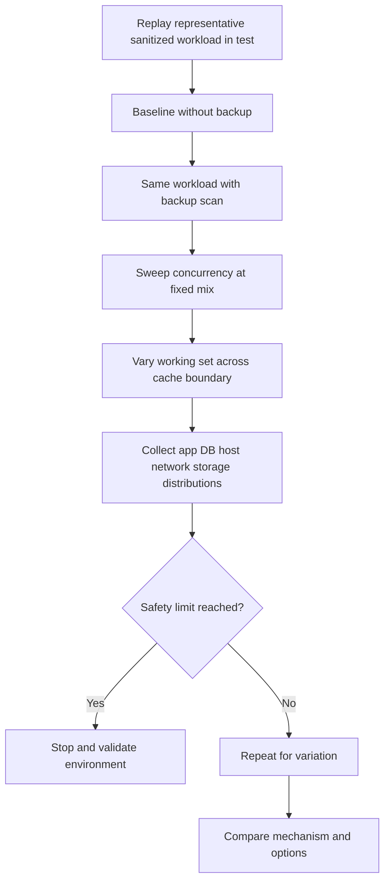

### Recommendations

| Priority | Action | Owner | Validation | Residual risk |
|---:|---|---|---|---|
| 1 | Separate database transaction waits from host/storage service and queue time | Database and performance owners | Same transaction IDs across layers | Instrumentation can add overhead or miss code paths |
| 2 | Reschedule or throttle backup only after a controlled comparison proves material contention and support allows it | Backup/storage owners | p99 under representative overlap test | Production demand can differ |
| 3 | Quantify working-set/cache transition and compare supported cache, data-placement, or workload options | Architecture owner | Hit/miss, p99, capacity, and cost tradeoff | Future growth can cross the boundary again |
| 4 | Sweep concurrency and choose an operating region that meets transaction SLO, not maximum IOPS | Application owner | Throughput-latency curve with error rate | Demand spikes may exceed controls |
| 5 | Add promotion-period baseline and alert on p99 plus outstanding work, not average alone | TAM analyst and service owner | Two event cycles with governed definitions | Baseline must be refreshed after changes |

### Customer-facing summary

> "The promotion window shows a real p99 failure, a lower cache-hit ratio, more lower-layer I/O, and much higher outstanding work. Backup overlap and the larger working set are plausible contributors, while the transaction tail is also much larger than the storage tail, so a database wait remains possible. We recommend one aligned transaction-to-storage timeline and controlled comparisons before changing media or cache. The decision metric is checkout p99 and error rate at required throughput, not maximum synthetic IOPS."

---

## 14. Failure modes, misconceptions, and troubleshooting

| Mistake | Why it fails | Better behavior |
|---|---|---|
| `High IOPS means fast` | Latency and size may be unacceptable | Report IOPS, bytes, distribution, and workload together |
| `Low average latency means users are fine` | Tail can violate transaction SLO | Use percentiles, counts, and affected population |
| `Queue depth should be maximized` | Beyond the knee, it adds wait | Sweep concurrency against SLO |
| `70% average utilization means no saturation` | Short hotspots and one sub-resource can saturate | Use finer intervals and per-resource evidence |
| `Storage is the bottleneck because it is busy` | Busy can reflect demand from another bottleneck | Show constrained throughput and queue/service mechanism |
| `Cache hit ratio is enough` | Miss cost and tails matter | Pair hit/miss latency and workload distribution |
| `Two spikes prove causation` | Shared demand or clock mismatch can correlate them | Align identities and run discriminating checks |
| `Benchmark maximum equals application capacity` | Workload, arrival, cache, client, and safety differ | Recreate representative profile and constraints |
| `One faster test after change proves improvement` | Variation and changed workload can explain result | Repeat, control variables, and compare confidence |
| Ignoring coordinated omission | Stalls suppress offered requests and understate tails | Match arrival model and document tool handling |

```mermaid
flowchart TD
    SLOW[Slow service report] --> TX[Capture exact transaction user and time]
    TX --> PROFILE[Characterize workload and SLO]
    PROFILE --> MAP[Map path queues caches and resources]
    MAP --> ALIGN[Align counters clocks units and scope]
    ALIGN --> BASE[Compare baseline and changes]
    BASE --> HYP[Rank competing bottlenecks]
    HYP --> CHECK[Cheap safe disconfirming check]
    CHECK --> MIT[Authorized mitigation]
    MIT --> PROVE[Before after application outcome and residual risk]
```

### Minimum escalation package

- Business transaction, impact, SLO, affected users/locations, and time range.
- Application, database, host, virtualization, network/fabric, protocol, storage, protection, and media topology.
- Workload fingerprint, baseline, growth, changes, and overlapping jobs.
- IOPS, throughput, size distribution, latency percentiles/counts, concurrency, queues, utilization, cache hits/misses, errors, and timeouts.
- Exact counter definitions, collection intervals, clocks, units, resets, and aggregation.
- Client/generator CPU, network, and test methodology.
- Competing hypotheses, actions tried, safety boundaries, and exact specialist ask.

---

## 15. Paper and whiteboard lab

No production access is required. Label every input and result synthetic.

### Lab scenario

A fictional analytics service performs 30,000 IOPS at 12 KiB average I/O size, 3 ms average response, p99 24 ms, and 90 average outstanding operations. During a monthly job, throughput becomes 48,000 IOPS, average response 9 ms, p99 180 ms, and average outstanding 460. A 25 Gbit/s link carries 7 Gbit/s payload. Cache hit ratio falls from 94% to 68%.

### Tasks

1. Define the application transaction and SLO before interpreting storage.
2. Calculate idealized throughput at both IOPS rates.
3. Use Little's Law to calculate expected average outstanding work.
4. Compare calculated and reported values and list scope explanations.
5. Draw wait plus service time at application, host, storage, and device layers.
6. Build p50/p95/p99/max distributions that share one average but have different tails.
7. Sweep concurrency across six points and draw a throughput-latency knee.
8. Use the M/M/1 formula only as an intuition and list every broken assumption.
9. Calculate ideal payload ceiling for 25 Gbit/s and explain why 7 Gbit/s does not clear the network.
10. Model cache-hit average latency with stated hit/miss costs and discuss p99.
11. Add a backup and CPU hotspot as competing hypotheses.
12. Design closed-loop and scheduled-arrival tests; identify coordinated omission risk.
13. Build a baseline table and change timeline.
14. Write one recommendation with owner, validation, rollback/stop condition, and residual risk.

### Calculation checks

Baseline throughput orientation:

$$
30{,}000\times12\ \text{KiB/s}=360{,}000\ \text{KiB/s}\approx351.56\ \text{MiB/s}
$$

Monthly-job orientation:

$$
48{,}000\times12\ \text{KiB/s}=576{,}000\ \text{KiB/s}=562.5\ \text{MiB/s}
$$

Little's Law baseline:

$$
L=30{,}000\times0.003=90
$$

Monthly job:

$$
L=48{,}000\times0.009=432
$$

Reported 460 suggests scope/window differences or non-steady behavior requiring reconciliation.

Ideal 25 Gbit/s byte rate:

$$
25\div8=3.125\ \text{GB/s}
$$

This is not an application payload guarantee.

### Whiteboard pass criteria

- [ ] IOPS, throughput, latency, response, service, and wait have exact scopes.
- [ ] Read/write, size, randomness, concurrency, working set, and bursts form the workload fingerprint.
- [ ] Average, percentile, tail, maximum, and sample count are distinct.
- [ ] Queue depth is mapped per layer.
- [ ] Utilization and bottleneck are not inferred from one average.
- [ ] Little's Law uses consistent scope, units, and stable-system caveats.
- [ ] Cache average and tail implications are both explained.
- [ ] CPU, network, controller, and media hypotheses have disconfirming checks.
- [ ] Benchmark controls and coordinated omission are explicit.
- [ ] The recommendation is tied to an application SLO, not maximum IOPS.
- [ ] All evidence remains synthetic.

---

## 16. Self-test

1. Define I/O, IOPS, throughput, latency, response time, service time, wait time, and I/O size.
2. Calculate throughput from IOPS and size with binary units.
3. Explain why equal IOPS can represent different workloads.
4. Build a complete workload fingerprint.
5. Distinguish random/sequential and read/write behavior without ranking them universally.
6. Define average, percentile, tail, maximum, and sample count.
7. Create a distribution where the mean describes no actual request.
8. Explain why percentiles cannot normally be averaged.
9. Define concurrency, queue depth, and parallelism.
10. Draw useful concurrency, the knee, saturation, and retry feedback.
11. Define utilization, bottleneck, and saturation.
12. Use the M/M/1 equation and state all assumptions.
13. State Little's Law and calculate any missing variable.
14. Explain five Little's Law scope/stability traps.
15. Define cache hit, miss, hit ratio, and working-set transition.
16. Calculate average latency from hit/miss paths and explain tail behavior.
17. List CPU, network, controller, RAID, cache, and media bottleneck evidence.
18. Convert Gbit/s to ideal GB/s and state overhead caveats.
19. Build a versioned baseline and change timeline.
20. Explain correlation versus causation with two aligned spikes.
21. Design a safe representative benchmark.
22. List at least ten benchmark traps.
23. Define coordinated omission and compare closed/open arrival models.
24. Ask the complete TAM discovery set.
25. Recreate Tailspin's calculations, hypotheses, test plan, and summary.
26. Complete the paper lab and answer Q1-Q8 aloud.

---

## 17. Official Source Anchors

**Date checked: 2026-08-24.** These official and vendor-neutral sources anchor performance terminology, test methods, and public NetApp documentation areas. Exact workload-generator behavior, benchmark specifications, counters, platform limits, and ONTAP performance behavior are version-sensitive. Benchmark results are valid only for the tested system and method. Never invent a NetApp counter, result, internal process, or customer performance claim.

| Topic | Official or vendor-neutral source | Bounded use and access note |
|---|---|---|
| Storage performance terminology | [SNIA Dictionary](https://www.snia.org/education/online-dictionary) | Vendor-neutral definitions. Terms do not establish counter scope or platform performance. |
| Solid-state performance test specifications | [SNIA Performance Test Specifications](https://www.snia.org/tech_activities/standards/curr_standards/pts) | Industry test-method source. Select current specification and exact device/workload applicability. |
| NIST statistics and percentiles | [NIST/SEMATECH e-Handbook of Statistical Methods](https://www.itl.nist.gov/div898/handbook/) | Official statistical reference. Apply suitable methods and preserve sample/context. |
| fio workload generator | [fio documentation](https://fio.readthedocs.io/en/latest/fio_doc.html) | Official project documentation. Options can destroy data or create unsafe load; use authorized non-production targets and exact version. |
| Microsoft DiskSpd | [Microsoft DiskSpd repository](https://github.com/microsoft/diskspd) | Official Microsoft open-source tool and documentation. Test method, safety, version, and workload representativeness must be recorded. |
| Transaction Processing Performance Council | [TPC benchmarks](https://www.tpc.org/) | Official benchmark organization. Published results follow specific audited rules and must not be generalized to untested systems. |
| Coordinated omission implementation guidance | [HdrHistogram coordinated omission documentation](https://github.com/HdrHistogram/HdrHistogram) | Open-source project documentation explaining correction concepts. It is not a universal standard; validate workload arrival model and tool. |
| ONTAP performance administration | [ONTAP performance management](https://docs.netapp.com/us-en/ontap-performance-admin/) | Official public documentation area. Exact counters, workflows, thresholds, and behavior are release-sensitive and deferred to Parts 43-46. |
| ONTAP performance monitoring | [ONTAP performance monitoring](https://docs.netapp.com/us-en/ontap/performance-admin/monitor-workflow-task.html) | Official workflow orientation only. Customer tools, data retention, and access can differ. |
| NetApp technical documentation | [NetApp Documentation](https://docs.netapp.com/) | Select exact product and release before using a performance claim or procedure. |

### Source-use discipline

- Record workload generator/tool version, command/configuration, target, duration, preconditioning, data pattern, cache mode, arrival model, and safety limits.
- Record application, host, network, storage object, platform/release, topology, and data-protection state.
- Preserve units, counter definitions, timestamps, sample counts, intervals, percentiles, resets, and exclusions.
- Report full throughput-latency/error curve and repeated variation, not only the best point.
- Compare application outcome with resource metrics and form competing hypotheses.
- State access limits and seek authorized SME review; do not invent ONTAP counters or tuning.

---

## Likely Interview Questions

### Q1. Explain IOPS, throughput, and latency and how they relate.

> **Model answer:** "IOPS counts completed operations per second, throughput counts bytes per second, and latency measures elapsed time per request between declared points. For comparable operations, throughput is approximately IOPS times average I/O size. Response time includes queue wait plus service time. None is `performance` alone: I also need read/write mix, sizes, randomness, concurrency, cache, errors, and the application objective."

**Follow-up depth:** Calculate 25,000 IOPS at 16 KiB and explain every reason the arithmetic may differ from measured payload.

### Q2. Why do averages hide performance problems?

> **Model answer:** "An average combines all observations and can describe no real request. A small slow population may dominate user pain while the mean remains acceptable. I report sample count and a distribution such as p50, p95, p99, maximum, errors, and time segmentation. I also avoid averaging percentiles across hosts or intervals because that does not reconstruct the combined distribution."

**Follow-up depth:** Use the 99-at-1-ms and one-at-1,001-ms example and explain which percentile would reveal the outlier.

### Q3. How do concurrency, queue depth, and saturation interact?

> **Model answer:** "Concurrency is outstanding work; queue depth is outstanding work in a named queue; parallelism is work actually executing. Adding concurrency can use idle resources and raise throughput. Near the bottleneck's capacity knee, further work mostly waits, so tail latency grows; above capacity, backlog, timeouts, and retries can create feedback. I sweep concurrency and plot throughput, latency percentiles, and errors instead of maximizing queue depth."

**Follow-up depth:** Draw queues at application, host, path, controller, and device layers and explain why their depths cannot be added blindly.

### Q4. What is Little's Law and how would you use it?

> **Model answer:** "For a stable system and consistent population, average outstanding work $L$ equals throughput $\lambda$ times average time in system $W$. At 8,000 IOPS and 4 ms, $L$ is 32. I use it as a consistency check between throughput, response, and outstanding work. A mismatch sends me to scope, units, sample windows, counter definitions, cache populations, or non-steady bursts; it does not name the bottleneck."

**Follow-up depth:** Recalculate at 12 ms and explain why the law says nothing directly about p99 or root cause.

### Q5. How do you identify a bottleneck?

> **Model answer:** "I start with the application transaction and SLO, map the complete path, and characterize offered work. I align application, database, host, CPU, network, queue, cache, controller, RAID, media, and background-work evidence. A bottleneck is the resource constraining end-to-end throughput or response for that workload, not merely a busy component. I rank mechanisms and run the cheapest safe check that can disconfirm each before recommending change."

**Follow-up depth:** Use Tailspin to distinguish database lock, cache transition, backup contention, network, host queue, and controller hotspot hypotheses.

### Q6. How do cache hits and working-set size affect latency?

> **Model answer:** "A hit uses the faster cache path; a miss uses a slower lower path. Average latency can be modeled as hit ratio times hit cost plus miss ratio times miss cost, but misses often dominate the tail. When the working set grows beyond cache, eviction and misses can rise sharply, increasing lower-layer utilization and queueing. I validate hit definitions, eligible operations, working-set change, and p99 rather than recommending more cache from one ratio."

**Follow-up depth:** Calculate the 90% and 99% hit examples and explain why the p99 can remain near miss latency.

### Q7. What makes a storage benchmark credible?

> **Model answer:** "It starts with a business question and representative workload: sizes, mix, locality, concurrency, arrival model, working set, durability, and duration. I control safety, preconditioning, warmup, cache, data pattern, client CPU, network, background work, and one-variable comparisons. I capture end-to-end percentiles, errors, resource evidence, repetitions, and variation, then report limitations. Maximum synthetic IOPS is not application capacity, and coordinated omission must be assessed against real arrivals."

**Follow-up depth:** Design a throughput-latency sweep with stop conditions and compare closed-loop versus scheduled arrivals.

### Q8. How does your analytics and enterprise support background transfer to performance work?

> **Model answer:** "My MBA analytics, Excel, Power BI, SQL, statistics, and enterprise escalation work give me strong foundations in data quality, time alignment, segmentation, baselines, hypothesis testing, and customer impact communication. I have applied those methods in production enterprise support, not NetApp performance tuning. I would use current counter definitions, authorized safe tests, and application/network/storage SME review, and I would label synthetic or lab findings honestly."

**Follow-up depth:** Give a sanitized M365 latency or synchronization case and state which storage counters and product behaviors remain unproven by that analogy.

---

## 30-Second Memory Hooks

- **IOPS:** Completed requests per second.
- **Throughput:** Bytes moved per second.
- **Latency:** Time between named start and finish.
- **Response:** Wait plus service.
- **I/O size:** Bytes per request; it links IOPS to throughput.
- **Workload fingerprint:** Mix, size, randomness, concurrency, locality, bursts, and objective.
- **Average:** Smooths everyone; **percentile:** shows how much of the population is below a value.
- **Tail:** The slow end where user pain can hide.
- **Concurrency:** Work outstanding; **parallelism:** work actually executing.
- **Queue depth:** Always ask which queue.
- **Utilization:** Busy fraction in a named interval, not a bottleneck verdict.
- **Bottleneck:** Narrowest active gate for this workload.
- **Saturation:** New work waits faster than throughput improves.
- **Little's Law:** Outstanding = rate times response, under stable matching scope.
- **Cache hit:** Short path; **miss:** lower path and often the tail.
- **Working set:** Active data, not total capacity.
- **Network conversion:** Divide Gbit/s by eight before overhead.
- **Baseline:** Comparable normal distribution plus workload and topology.
- **Correlation:** Start a hypothesis, do not end root cause.
- **Benchmark:** Reproduce the question, control variables, protect the environment.
- **Coordinated omission:** A stalled tester forgets requests that should have arrived.
- **Operating point:** Meet the application SLO, not maximum IOPS.
- **Your bridge:** Analytics and escalation transfer; ONTAP tuning remains unclaimed.

---

## Completion Checklist

- [ ] Define I/O, IOPS, throughput, latency, response, service, wait, and I/O size with exact scope.
- [ ] Calculate IOPS-throughput-size relationships with units and caveats.
- [ ] Build a complete workload fingerprint including time and application objectives.
- [ ] Distinguish read/write, random/sequential, metadata, working set, locality, and bursts.
- [ ] Interpret average, p50, p95, p99, maximum, sample count, and aggregation limits.
- [ ] Draw concurrency, queue, service lanes, capacity knee, saturation, and retry feedback.
- [ ] Define utilization and identify a bottleneck through mechanism rather than busyness.
- [ ] Use M/M/1 only as a clearly bounded intuition.
- [ ] State Little's Law, calculate all variables, and explain scope/stability conditions.
- [ ] Calculate cache average latency and explain miss-driven tails.
- [ ] Explain working-set transitions and lower-layer demand.
- [ ] Compare CPU, network, controller, cache, RAID, and media bottlenecks.
- [ ] Convert network bit rate to ideal byte rate with overhead caveats.
- [ ] Build a comparable baseline and change timeline.
- [ ] Separate correlation from causation with disconfirming checks.
- [ ] Design a safe benchmark with preconditioning, warmup, duration, repetitions, and stop conditions.
- [ ] Explain coordinated omission and choose an arrival model deliberately.
- [ ] Ask all discovery questions and write a customer-specific recommendation.
- [ ] Recreate Tailspin's calculations, hypotheses, test plan, and summary.
- [ ] Complete the paper lab, self-test, and Q1-Q8 aloud.
- [ ] State your production strengths and NetApp performance gap honestly.
- [ ] Recheck current official tool, counter, platform, workload, and support documentation before real use.

---

*Next suggested section:* [Part 10 - Capacity Planning, Growth, Efficiency, and Headroom](Part-10-capacity-growth-efficiency-headroom.md)