# Part 10 - Capacity Planning, Growth, Efficiency, and Headroom

> **Section goal:** Learn to reconcile every layer of storage capacity, distinguish measured savings from promises, forecast growth with uncertainty, and choose action thresholds that preserve time to decide and change safely. By the end, Arti should be able to convert units, build a raw-to-available capacity ladder, analyze thin provisioning and efficiency, model linear/exponential/seasonal demand, calculate time to an operational threshold, and present customer options with explicit tradeoffs.

Covers index item **10** and maps directly to job-description responsibilities for customer-data generation and analysis, storage depth, strategic planning, risk mitigation, solution stability, tailored recommendations, operational service reviews, preventative-action tracking, and clear executive communication.

This Part teaches vendor-neutral foundations. Exact ONTAP capacity counters, reserves, snapshots, thin provisioning, deduplication, compression, compaction, FabricPool or tiering, efficiency reporting, limits, thresholds, and remediation procedures are release-, platform-, workload-, and configuration-sensitive. Product-specific implementation is deferred to Parts 23, 34, and 45.

> **Evidence boundary:** All organizations, systems, capacities, ratios, forecasts, costs, and recommendations below are synthetic. Arti's Excel, Power BI, SQL, Python, statistics, and Microsoft support analytics are production strengths; no production NetApp capacity planning, ONTAP efficiency tuning, or storage procurement experience is claimed.

---

## 1. Units: decimal, binary, and raw bytes

Capacity analysis begins with units. A disagreement between terabytes and tebibytes can look like missing capacity even when the byte count is identical.

### Plain-English deep-dive: TB and TiB

| Unit | Exact bytes | Plain meaning | Memory hook |
|---|---:|---|---|
| **TB** | $10^{12}$ bytes | Decimal terabyte under SI prefixes | TB uses powers of 1,000 |
| **TiB** | $2^{40}=1{,}099{,}511{,}627{,}776$ bytes | Binary tebibyte under IEC prefixes | TiB has the extra `i` and uses 1,024 |
| **PB** | $10^{15}$ bytes | Decimal petabyte | PB is 1,000 TB |
| **PiB** | $2^{50}$ bytes | Binary pebibyte | PiB is 1,024 TiB |

For 1 TB:

$$
\frac{1{,}000{,}000{,}000{,}000}{1{,}099{,}511{,}627{,}776}\approx0.9095\ \text{TiB}
$$

For 1 TiB:

$$
\frac{1{,}099{,}511{,}627{,}776}{1{,}000{,}000{,}000{,}000}\approx1.0995\ \text{TB}
$$

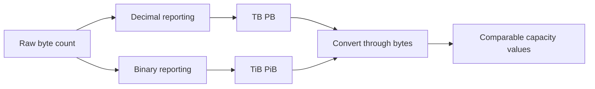

### Unit discipline

- Preserve raw bytes in the data model.
- Store a declared display unit separately.
- Do not trust a tool's `GB` or `TB` label without its definition.
- Never mix capacity units with transfer rates such as Gbit/s.
- Round for display only after calculations.
- Record whether capacity is decimal device label, binary OS display, or product-defined metric.

---

## 2. The capacity vocabulary ladder

Capacity words are scoped. `500 TiB free` is incomplete until the layer, policy, timestamp, and failure state are known.

### Plain-English deep-dive: raw, usable, logical, physical, and available

| Term | Plain meaning | Analogy | Key question |
|---|---|---|---|
| **Raw capacity** | Sum of physical device capacity before protection and system overhead. | Total floor area before walls and safety exits. | Which devices and units are included? |
| **Usable capacity** | Capacity remaining after a stated protection/layout layer and specified overhead. | Floor area after structural walls. | Usable at RAID, pool, volume, or file-system layer? |
| **Logical capacity** | Address space or data size presented to an upper layer, regardless of current physical consumption. | Shelf labels promise room for many boxes. | Is it provisioned, written, referenced, or apparent? |
| **Provisioned capacity** | Logical capacity assigned or promised to consumers. | Total room reservations accepted. | How much is thin and how much has guarantee/reservation? |
| **Consumed capacity** | Capacity currently counted as used under a metric's rules. | Rooms currently occupied plus policy-defined use. | Does it include snapshots, metadata, replicas, or shared blocks? |
| **Physical capacity used** | Actual lower-layer space occupied under a stated accounting scope. | Building floor physically occupied. | Before or after efficiency and tiering? |
| **Free capacity** | Capacity the layer currently reports as unallocated. | Rooms not assigned in one booking system. | Can policy, reserve, or another layer prevent use? |
| **Available capacity** | Capacity safe and permitted for the intended workload after reserves, thresholds, guarantees, and constraints. | Rooms that may actually be booked without violating safety rules. | Available to whom, for what, and until which threshold? |
| **Effective capacity** | A derived claim of logical capacity supported by physical capacity plus measured/assumed efficiency. | Floor area multiplied by an expected packing factor. | Is the ratio measured, forecast, guaranteed, or marketing? |
| **Headroom** | Capacity intentionally kept unused to absorb growth, bursts, failures, maintenance, and decision lead time. | Empty seats reserved for emergencies and late arrivals. | Which risk and lead time justify it? |

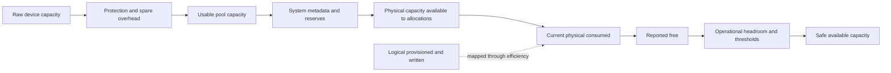

### Capacity is a table, not one gauge

| Layer | Example owner | Required fields |
|---|---|---|
| Device/RAID | Storage platform | Raw bytes, protection type, spares, failed/rebuilding state |
| Pool/local tier | Storage platform | Usable, consumed, free, reserves, metadata, thresholds |
| Volume/LUN | Storage or host | Logical size, guarantee, used, snapshots, autosize, thin state |
| File system | Host | Data free, metadata free, quotas, allocation unit |
| Database/application | App owner | Data, log, temp, retention, growth, free-space behavior |
| Backup/replica | Protection owner | Copy size, retention, change rate, catalog, target capacity |
| Tier/object target | Storage/cloud owner | Local footprint, remote usage, recall, cost, network constraints |

---

## 3. Why usable becomes unavailable: overhead and reserves

Capacity is consumed or withheld by several necessary structures and policies.

### Common overhead

- RAID parity or mirror copies.
- Spare capacity.
- System/root partitions and platform metadata.
- File-system, database, and object metadata.
- Journals, write-ahead logs, indexes, temporary data, and caches.
- Snapshots, clones, replication staging, and retained deleted data.
- Reserved capacity, guarantees, quotas, and emergency headroom.
- Bad-block replacement and media/controller-managed reserves.
- Rebuild, upgrade, migration, and maintenance workspace.

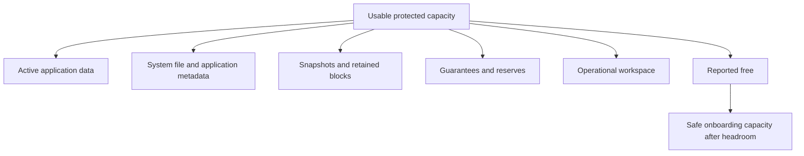

### Reserves are not automatically waste

A **reserve** is capacity intentionally withheld or guaranteed for a stated purpose. It can protect:

- A root/system function.
- A guaranteed write path.
- Snapshot or recovery operations.
- Failover or rebuild behavior.
- Metadata growth.
- Emergency remediation and migration.
- Procurement and change lead time.

Removing a reserve can improve a dashboard number while increasing operational risk. Keep, resize, or remove it only after verifying purpose, current product guidance, customer objective, and failure behavior.

### Snapshot growth

Snapshots can share unchanged blocks with active data. As live blocks change, older versions remain referenced until retention expires. Snapshot physical use therefore depends on change rate, overwrite locality, retention, deletion, data reduction, and implementation.

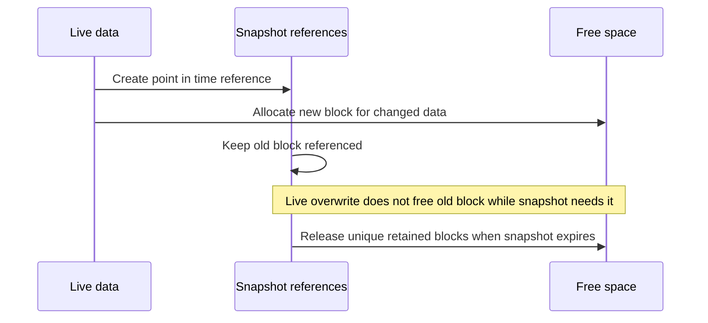

Do not forecast snapshot space from total data size alone. Measure changed blocks and retention behavior across representative cycles.

---

## 4. Thin provisioning and overcommit

**Thin provisioning** presents logical capacity without immediately reserving the same amount of physical capacity. Physical space is allocated as data is written under platform policy. **Overcommit** means total logical promises exceed currently available physical capacity.

### Plain-English deep-dive: hotel reservations and real rooms

A hotel can accept future reservations because not every guest arrives on the same day. That improves room use. If all guests arrive together, the promise exceeds physical rooms. Thin provisioning is not inherently unsafe; unmanaged correlated demand is.

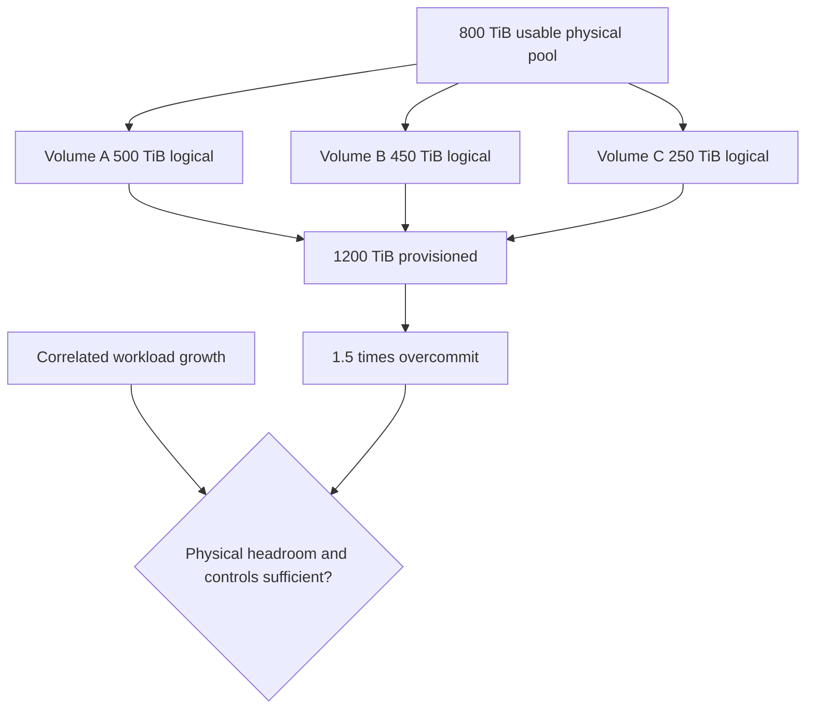

For 1,200 TiB provisioned over 800 TiB usable physical:

$$
\text{overcommit ratio}=\frac{1{,}200}{800}=1.5:1
$$

This does not mean 400 TiB is already missing. It means promises depend on consumption, efficiency, reclamation, growth, guarantees, and intervention before physical exhaustion.

### Thin-risk questions

1. Which layers are thin: application, guest, virtual disk, datastore, LUN, volume, pool, cloud service?
2. What logical capacity is provisioned and guaranteed at each layer?
3. What physical bytes are consumed, reclaimable, reserved, and available?
4. Do deletion and deallocation propagate through every layer?
5. Can snapshots, clones, replicas, or failed reclaim retain blocks?
6. Are workloads correlated during month-end, backup, migration, or incident recovery?
7. Which alert is authoritative, who acts, and how much lead time remains?
8. What happens technically when a layer exhausts: failed writes, read-only state, offline service, or another behavior?

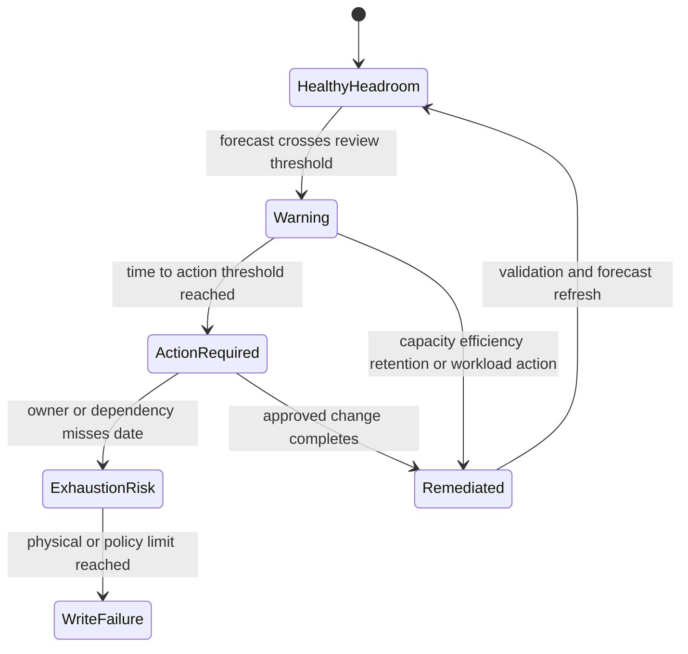

---

## 5. Deduplication, compression, and compaction

### Definitions

- **Deduplication** stores one shared representation for duplicate eligible chunks or blocks rather than separate physical copies.
- **Compression** encodes data using fewer bits when content patterns permit.
- **Compaction** in storage-efficiency contexts can combine small compressed units into more efficient physical containers; exact NetApp meaning and implementation are deferred to Part 34.
- **Clone** is a writable or read-only logical copy that may share unchanged blocks with a source under the platform's design.

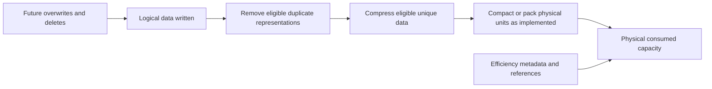

### Savings depend on content and scope

| Workload | Possible behavior | Validation question |
|---|---|---|
| Many identical VM images | Duplicate blocks can be common | Is dedupe scope and block identity eligible? |
| Already compressed/encrypted media | Compression/dedupe opportunity can be limited | Is reduction measured after encryption/compression? |
| Database with repeated empty patterns | Zeros or patterns may reduce well | Does the application support the storage feature and does real data match? |
| Rapidly changing unique data | Shared blocks expire and change rate is high | Does savings persist across retention cycle? |
| Small compressed files | Packing/metadata effects can matter | What does exact platform compaction report? |

Efficiency consumes controller CPU, memory, metadata, and background work depending on implementation. It can reduce media/network work in some paths and add processing in others. Product-specific inline/background operation and performance belong in Part 34.

---

## 6. Efficiency ratios and their caveats

A simple storage-efficiency ratio is:

$$
E=\frac{\text{eligible logical bytes represented}}{\text{physical bytes consumed}}
$$

Synthetic example: 900 TiB logical represented by 500 TiB physical:

$$
E=\frac{900}{500}=1.8:1
$$

Physical savings relative to storing the same eligible logical bytes without reduction are:

$$
\text{savings fraction}=1-\frac{1}{E}
$$

$$
1-\frac{1}{1.8}=44.44\%
$$

### Plain-English deep-dive: the denominator changes the story

A suitcase packing ratio looks excellent if coats are counted at their unfolded size and the suitcase excludes shoes stored elsewhere. Capacity ratios can similarly include logical zeros, clones, snapshots, thin unallocated space, or tiered bytes in one numerator while excluding metadata or remote cost from the denominator. The ratio is meaningful only when scope and method are fixed.

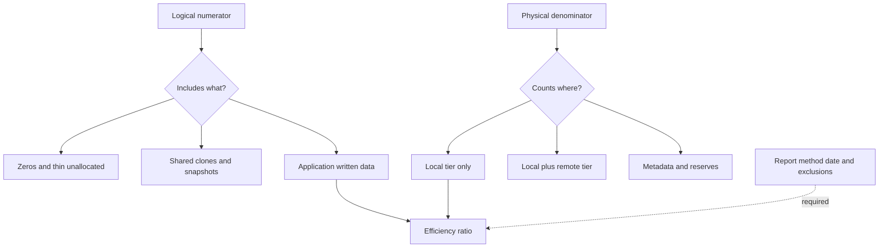

### Ratio traps

| Trap | Misleading conclusion | Better method |
|---|---|---|
| Add dedupe and compression percentages | Sequential effects do not add linearly | Use measured before/after physical bytes |
| Include thin provisioned but unwritten capacity | Promises look like saved data | Separate provisioned, written logical, and physical |
| Count shared clones as independent full data | Ratio rises with logical references | Report unique and shared scope |
| Ignore snapshots/metadata | Understates physical cost | Reconcile complete pool consumption |
| Use one fleet-wide ratio | Workload differences disappear | Segment by eligible workload and policy |
| Assume ratio persists | Data mix and change rate evolve | Trend actual physical consumption and confidence |
| Apply a marketing ratio to a forecast | Capacity date becomes fictional | Use conservative measured scenarios |

### Combined reduction math

If deduplication reduces 1,000 TiB to 700 TiB, then compression reduces the remaining 700 TiB to 490 TiB:

$$
\text{combined ratio}=\frac{1000}{490}\approx2.041:1
$$

Total savings are 51%, not 30% plus 30% equals 60%:

$$
1-(1-0.30)(1-0.30)=1-0.49=51\%
$$

This is arithmetic orientation, not a prediction that features act in that order or achieve those rates.

---

## 7. Tiering and total-capacity accounting

**Tiering** moves or places data among storage classes based on policy, access, cost, age, performance, or lifecycle. A local performance tier can retain hot data while colder blocks move to a capacity or object tier.

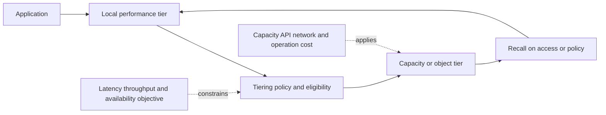

### Tiering questions

- Which data is eligible, and how is hot/cold state measured?
- Is data moved, copied, cached, or referenced remotely?
- Which local metadata and hot working set remain?
- What triggers recall, and what latency/network/cost follows?
- What happens if the object tier, network, DNS, identity, certificate, or key is unavailable?
- How do backups, snapshots, clones, disaster recovery, and compliance interact?
- Does the capacity dashboard count local, remote, logical, and billable bytes consistently?
- Is egress or operation cost included in the recommendation?

Tiering can free local capacity without reducing total data footprint. A local-free-space improvement can increase network dependence, recall latency, cloud cost, or recovery complexity.

---

## 8. Measure growth correctly

**Growth rate** is change in a defined capacity metric over time. Measure the same scope and units at comparable points.

For two observations:

$$
g=\frac{C_2-C_1}{t_2-t_1}
$$

where $g$ is linear growth per unit time.

### Net versus gross growth

- **Gross ingest** is all new bytes written.
- **Deletion/expiration** removes logical references under policy.
- **Change/overwrite** can grow snapshots even when live data stays constant.
- **Efficiency change** alters physical consumption without changing logical data.
- **Tiering** moves physical use between locations.
- **Net physical growth** is the final change in the measured physical scope.

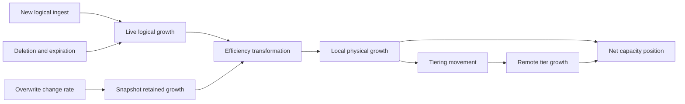

### Comparable sample rules

- Use consistent cutoff time and timezone.
- Exclude or label migrations, one-time loads, deletions, and metric changes.
- Record software/configuration changes that alter accounting.
- Use enough history to capture business cycles.
- Preserve raw values and data-quality gaps.
- Segment live, snapshot, metadata, replica, backup, and tiered growth.

---

## 9. Linear, exponential, and seasonal forecasts

A forecast is a reasoned estimate under assumptions, not a capacity promise.

### Linear growth

$$
C(t)=C_0+gt
$$

where $C_0$ is current consumed capacity and $g$ is constant growth per period.

For threshold $H$:

$$
t_{threshold}=\frac{H-C_0}{g}
$$

**Example:** Current use is 620 TiB, operational action threshold is 680 TiB, and growth is 12 TiB/month:

$$
t=\frac{680-620}{12}=5\ \text{months}
$$

Physical full at 800 TiB would be 15 months away, but waiting for physical full ignores the 680 TiB operational threshold and change lead time.

### Exponential growth

If capacity grows by fraction $r$ per period:

$$
C(t)=C_0(1+r)^t
$$

$$
t_{threshold}=\frac{\ln(H/C_0)}{\ln(1+r)}
$$

For 620 TiB growing 3% monthly toward 680 TiB:

$$
t=\frac{\ln(680/620)}{\ln(1.03)}\approx3.13\ \text{months}
$$

Exponential growth is appropriate only when percentage growth is plausible and sustained. Many infrastructure workloads grow in projects or steps rather than smooth compounding.

### Seasonal growth

A simple orientation is:

$$
C_t=Trend_t+Season_t+Noise_t
$$

where trend is long-term direction, season is repeating pattern, and noise is irregular variation.

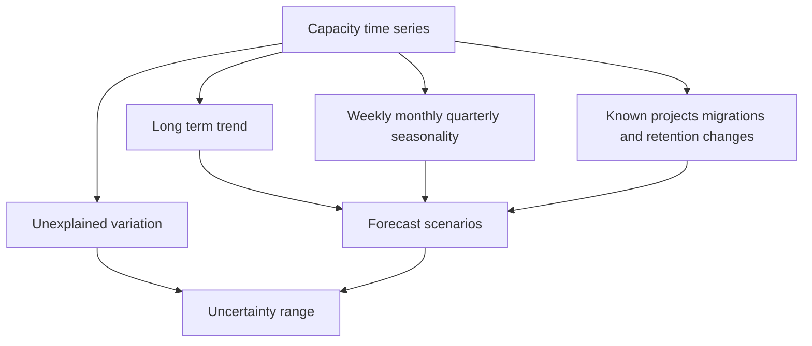

### Model selection

| Pattern | Candidate orientation | Warning |
|---|---|---|
| Stable bytes/month | Linear | Growth can change after onboarding or retention change |
| Stable percentage growth | Exponential | Compounding can overstate long horizons |
| Repeating month/quarter peaks | Seasonal model | Needs several comparable cycles |
| Project-driven jumps | Event/scenario plan | Trend model alone misses step changes |
| Sparse or changed definitions | Scenarios, not precise regression | Data cannot support narrow confidence |

---

## 10. Confidence intervals, prediction ranges, and scenario honesty

A **confidence interval** estimates uncertainty around a model parameter or mean under stated statistical assumptions. A **prediction interval** estimates a range for a future observation and is normally wider because it includes both parameter uncertainty and future variation.

### Plain-English deep-dive: confidence is not a narrow promise

A weather model can estimate the average seasonal temperature more tightly than tomorrow's exact temperature. Capacity models can estimate a trend while a workload launch, deletion, snapshot burst, or policy change moves the next observation far away. For planning, use a future prediction range or explicit low/base/high scenarios, not only a confidence interval around the mean trend.

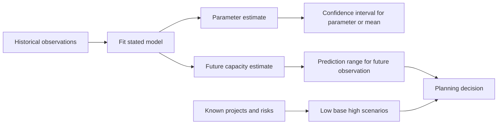

### Orientation caveats

- A frequentist 95% confidence interval does not mean there is a 95% probability that the fixed true parameter lies in this one calculated interval; the method has 95% coverage under repeated valid sampling.
- A narrow interval can be falsely precise when errors are autocorrelated, seasonal, nonstationary, or definitions changed.
- Forecast error grows with horizon.
- Prediction intervals do not include every business surprise unless modeled.
- Data quality, workload onboarding, retention, efficiency, and tiering scenarios often dominate statistical error.

### Scenario forecast example

Current use: 620 TiB. Threshold: 680 TiB.

| Scenario | Growth | Time to threshold |
|---|---:|---:|
| Low | 8 TiB/month | 7.5 months |
| Base | 12 TiB/month | 5 months |
| High | 20 TiB/month | 3 months |

If procurement, design, approval, and change require four months, the high scenario is already inside lead time and the base scenario leaves only one month contingency.

---

## 11. Headroom and thresholds

Headroom protects the time and workspace needed to operate safely. A threshold should be derived from workload risk, platform behavior, forecast uncertainty, and action lead time rather than copied as a universal percentage.

### Headroom components

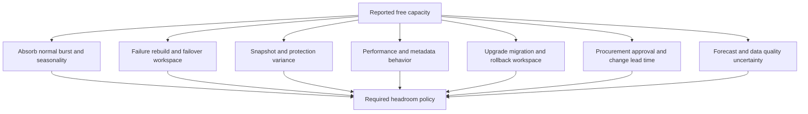

### Threshold architecture

| Threshold | Purpose | Example action |
|---|---|---|
| Observation | Detect data-quality or trend change | Validate source and workload event |
| Review | Begin options analysis before urgency | Confirm forecast, owners, budget, supportability |
| Action | Execute selected remediation | Add/move/reduce/reclaim under change control |
| Critical | Protect writes/service immediately | Freeze onboarding, escalate, use approved emergency action |
| Hard limit | Platform/policy boundary | Must never be used as normal planning target |

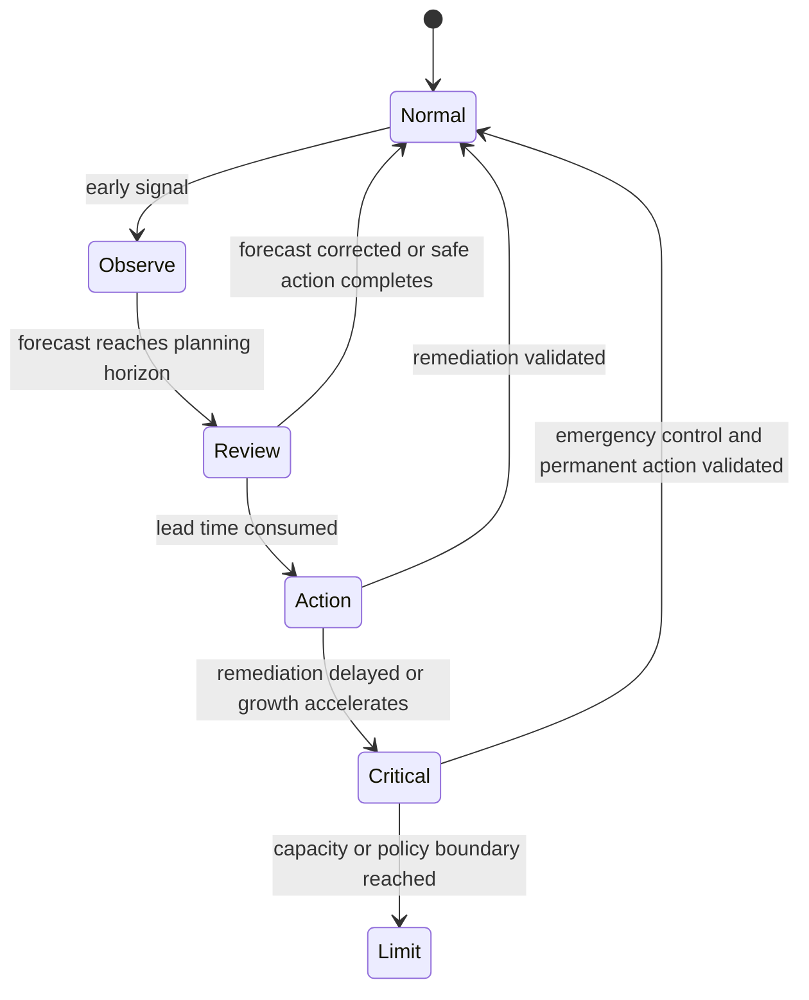

### Lead-time formula

If action requires $T_a$ months and contingency requires $T_c$ months, planning should begin no later than:

$$
t_{threshold}\leq T_a+T_c
$$

This is a decision rule, not a product threshold.

---

## 12. Workload onboarding and capacity admission

A new workload should not be admitted based only on its initial logical size. Include growth, snapshots, backup, replicas, metadata, efficiency uncertainty, migration workspace, and performance impact.

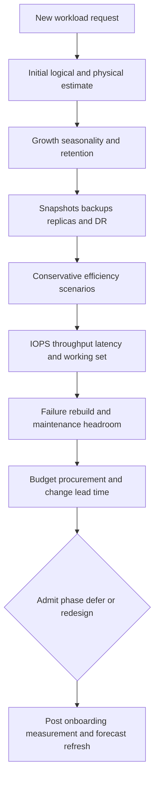

### Onboarding worksheet

| Input | Question |
|---|---|
| Initial data | Written logical bytes, not only provisioned capacity? |
| Growth | Daily/monthly rate, step loads, seasonality, confidence? |
| Retention/change | Deletion, overwrite, snapshot change rate, archive? |
| Protection | Number, frequency, retention, replica, backup, DR copies? |
| Efficiency | Measured comparable ratio and conservative downside? |
| Tiering | Local working set, remote footprint, recall and cost? |
| Performance | Peak IOPS/throughput/latency/concurrency and shared contention? |
| Failure operations | Rebuild, failover, upgrade, migration, and rollback workspace? |
| Supportability | Platform limits, version, protocol, application guidance? |
| Ownership | Who monitors, funds, changes, validates, and accepts risk? |

### Admission calculation

A synthetic workload starts with 80 TiB written logical, grows 4 TiB/month, retains snapshots equal to an observed 25% of live physical use, and conservatively achieves 1.4:1 data reduction on live data.

After 12 months:

$$
L=80+(4\times12)=128\ \text{TiB logical}
$$

Conservative live physical:

$$
P_{live}=\frac{128}{1.4}\approx91.43\ \text{TiB}
$$

Snapshot physical orientation:

$$
P_{snap}=0.25\times91.43\approx22.86\ \text{TiB}
$$

Total before metadata, reserves, backup, replication, and headroom:

$$
P_{total}\approx114.29\ \text{TiB}
$$

The estimate is not an allocation guarantee. Validate the ratio and change rate with comparable data.

---

## 13. Corrective options and tradeoffs

Capacity risk can be addressed by reducing demand, reclaiming unused allocation, changing retention, improving measured efficiency, moving/tiering data, adding capacity, redistributing workloads, or redesigning protection. Each option changes other risks.

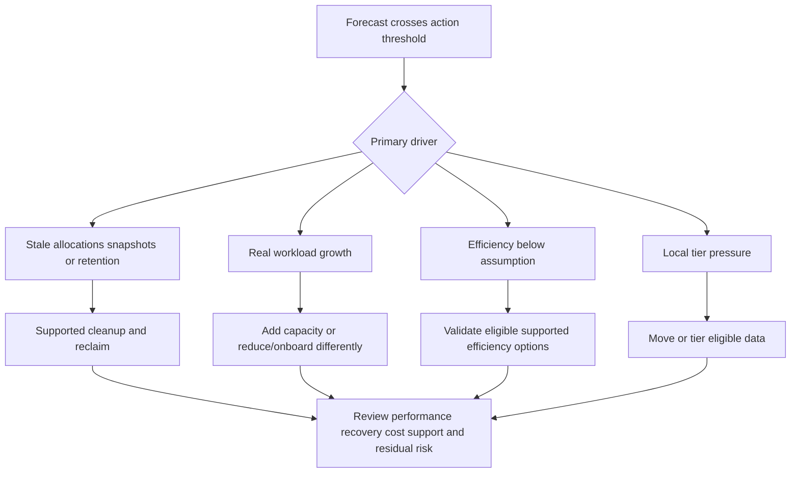

### Option comparison

| Option | Potential benefit | Tradeoff/risk | Proof required |
|---|---|---|---|
| Delete stale data | Immediate logical reduction | Governance, legal hold, application dependence | Owner-approved deletion and physical reclaim evidence |
| Shorten snapshot/backup retention | Lower retained footprint | Reduced recovery history/compliance | Policy approval and recovery analysis |
| Reclaim thin allocation | Return unused lower blocks | Propagation delays, unsupported path, snapshots | Before/after each layer and no service regression |
| Enable/change efficiency | Lower physical use | CPU, latency, eligibility, support, uncertain ratio | Representative measured test and product guidance |
| Tier cold data | Free local space | Recall latency, network, cloud cost, dependency | Working-set and recall test plus total-cost model |
| Add capacity | Preserves data/policy | Cost, procurement, install, rebalance, supportability | Current design/compatibility and post-change validation |
| Move workload | Balance capacity | Network, downtime, performance, protection, ownership | Migration test and application acceptance |
| Reduce onboarding | Protect existing services | Delays business value | Sponsor decision and alternative plan |

Never delete, shrink, move, disable protection, or alter retention merely to clear an alert without authorized data ownership and recovery analysis.

---

## 14. TAM discovery, recommendations, and JD mapping

### Customer discovery questions

#### Business and scope

1. Which service, data set, owners, criticality, and business dates depend on the capacity?
2. What growth projects, migrations, acquisitions, retention changes, audits, and freezes are planned?
3. What procurement, budget, design, compatibility, implementation, and approval lead times apply?

#### Accounting

4. What are raw, protected usable, provisioned, written logical, physical consumed, free, available, and effective values?
5. Which units, timestamps, scopes, exclusions, and source systems define each?
6. What parity, spares, metadata, reserves, guarantees, quotas, root, snapshots, clones, and operational workspace exist?
7. Which thin layers and overcommit ratios exist?

#### Efficiency and tiering

8. Which data is eligible for dedupe, compression, compaction, cloning, and tiering?
9. What actual logical and physical bytes produce the reported ratio?
10. Does the ratio include zeros, unwritten thin space, snapshots, clones, metadata, or remote tier?
11. How stable is efficiency across workload and retention cycles?
12. What remote capacity, operations, egress, recall, security, and availability cost exists?

#### Growth and forecast

13. Which metric is growing: live, snapshots, metadata, backup, replica, local, remote, or total?
14. What history, seasonality, one-time events, missing data, and definition changes exist?
15. Does linear, exponential, seasonal, event-based, or scenario planning fit?
16. What low/base/high time-to-threshold range follows?

#### Action and risk

17. Which observation, review, action, critical, and hard thresholds apply, and why?
18. What headroom is needed for bursts, failure, rebuild, failover, upgrade, migration, rollback, and uncertainty?
19. Who owns each corrective option, decision, funding, and validation?
20. What happens technically and to the business if the threshold or hard limit is crossed?

### Evidence-to-recommendation flow

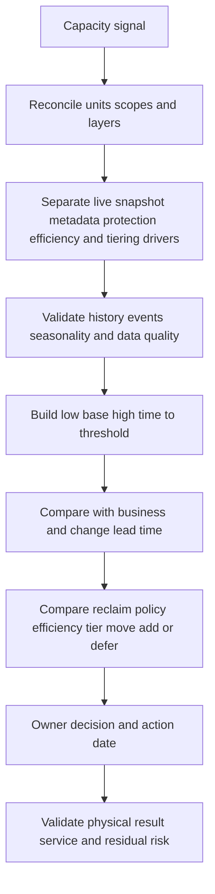

### Recommendation patterns

| Evidence-backed condition | Risk | Bounded recommendation | Validation |
|---|---|---|---|
| Dashboard mixes TB and TiB | Capacity gap and date are misstated | Reconcile raw bytes and declared units before forecast | Independent conversion and source definitions |
| 1.8:1 ratio includes unwritten thin capacity | Effective capacity is overstated | Recalculate using written eligible logical and full physical scope | Reproducible ratio table and peer review |
| Base threshold is five months; high is three; action takes four | Urgency can arrive before change completes | Start design/funding now; define interim onboarding/retention controls | Approved plan, owner, dates, weekly forecast refresh |
| Snapshot growth drives physical use | Deleting live data may not reclaim capacity | Analyze change rate/retention; alter policy only with recovery owner approval | Before/after retained blocks and restore capability |
| Tiering frees local but remote cost/recall unknown | Capacity action can harm performance or cost | Test working set, recall, network dependency, and total cost | SLO and cost result across representative period |

### Explicit JD mapping

| JD responsibility | Part 10 contribution | Arti transfer and honest gap |
|---|---|---|
| Generate/analyze/report customer data | Defines capacity schema, unit QA, trends, models, scenarios, and visualization inputs | Excel, Power BI, SQL, Python, statistics, and MBA are strong evidence |
| Strategic planning and storage advice | Connects forecast to lead time, onboarding, lifecycle, and options | Business analytics transfers; NetApp implementation requires study/SME |
| Mitigate risk and improve stability | Protects headroom for failures, upgrades, and uncertainty | CRITSIT risk thinking transfers; exact thresholds are product/customer-specific |
| Understand customer environment | Maps application growth through every allocation and protection layer | M365 data/service mapping transfers |
| Track preventative remediation | Creates threshold, owner, target, blocker, and validation logic | Backlog/action tracking is a proven strength |
| Conduct service reviews | Turns capacity into decision horizon, options, tradeoffs, and asks | Business-review and executive communication transfer |

### Honest production-gap note

> "I can reconcile capacity units and layers, calculate thin overcommit and efficiency ratios, build linear/exponential/scenario forecasts, and connect time-to-threshold with action lead time. My production evidence is Microsoft support analytics and business reporting, not ONTAP capacity or efficiency administration. In a NetApp account I would verify exact counter definitions and current product guidance, use authorized telemetry, and have storage SMEs review platform-specific recommendations."

---

## 15. Fully synthetic worked scenario: Woodgrove Media

> **Synthetic case:** Woodgrove Media and every capacity, efficiency, cost, forecast, threshold, and recommendation below are fictional. No NetApp sizing, product behavior, or customer experience is asserted.

Woodgrove stores production video projects. The synthetic environment reports:

- Raw device capacity: 1.2 PB decimal.
- Protected usable pool: 900 TiB after a provided platform calculation.
- Current physical consumed: 620 TiB.
- Reported logical represented: 1,116 TiB.
- Reported efficiency ratio: 1.8:1.
- Local-tiered cold data: 140 TiB physical on a remote object target, excluded from local 620 TiB.
- Snapshot use within local consumed: 95 TiB.
- Metadata/system use within local consumed: 25 TiB.
- Operational action threshold: 80% of 900 TiB = 720 TiB.
- Critical threshold: 88% = 792 TiB.
- Capacity action lead time: four months.

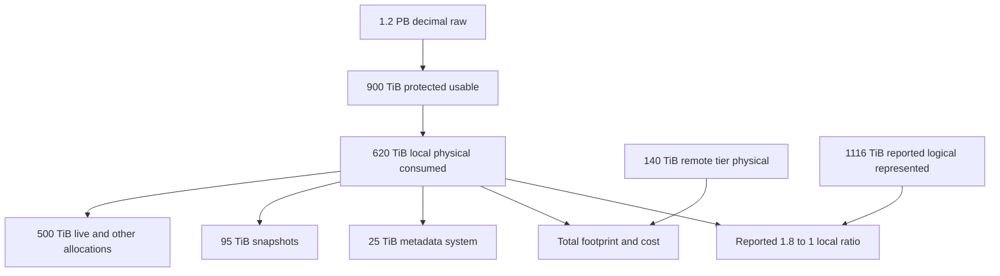

### Ratio validation

The arithmetic matches:

$$
\frac{1{,}116}{620}=1.8
$$

But the ratio's meaning remains uncertain:

- Does logical represented include snapshots or clones?
- Does 620 TiB include all metadata and reserves?
- Is the 140 TiB remote tier excluded from the denominator but included in logical represented?
- Is provisioned unwritten capacity included?
- Are logical and physical values sampled at the same time?

If total physical footprint includes remote 140 TiB:

$$
E_{total}=\frac{1{,}116}{620+140}=\frac{1{,}116}{760}\approx1.468:1
$$

This does not make either ratio wrong; they answer different questions. Label them `local physical efficiency` and `total-footprint efficiency` if definitions support that interpretation.

### Growth history

| Month | Local consumed TiB | Event |
|---|---:|---|
| Jan | 540 | Normal |
| Feb | 552 | Normal |
| Mar | 565 | Normal |
| Apr | 579 | New production series |
| May | 592 | Normal |
| Jun | 606 | Normal |
| Jul | 620 | Current |

Simple six-interval growth:

$$
g=\frac{620-540}{6}=13.33\ \text{TiB/month}
$$

Time to 720 TiB action threshold:

$$
t=\frac{720-620}{13.33}\approx7.50\ \text{months}
$$

Time to 792 TiB critical threshold:

$$
t=\frac{792-620}{13.33}\approx12.90\ \text{months}
$$

The action lead time is four months, so the base linear case has about 3.5 months contingency. A planned 60 TiB physical ingest in three months changes the model.

### Event-adjusted scenario

After three months of baseline growth:

$$
620+(3\times13.33)\approx660\ \text{TiB}
$$

Add the planned 60 TiB event:

$$
660+60=720\ \text{TiB}
$$

The action threshold is reached in three months, inside the four-month lead time. The project event, not smooth trend, controls the decision.

### Snapshot sensitivity

If snapshot use grows from 95 TiB to 130 TiB during editing bursts, it adds 35 TiB. If the project also adds 60 TiB, threshold is exceeded sooner. Changing retention may recover some capacity but can weaken recovery objectives and requires the protection owner.

### Options

| Option | Capacity effect | Tradeoff | Evidence required |
|---|---|---|---|
| Add supported local capacity | Increases usable pool | Procurement, install, rebalance, budget, supportability | Current design and compatibility review |
| Tier more cold data | Reduces local footprint | Recall latency, network, remote cost, recovery dependency | Working-set/recall and total-cost test |
| Shorten snapshot retention | May release old changed blocks | Less recovery history | Business/RPO approval and restore test |
| Archive completed projects | Moves data to long-term policy | Slower access and workflow change | Owner classification and retrieval test |
| Improve efficiency | May reduce physical use | Ratio uncertain; processing/support effects | Comparable eligible-data measurement |
| Delay 60 TiB onboarding | Preserves headroom | Business project delay | Sponsor decision and alternative capacity plan |

### Recommendations

| Priority | Action | Owner | Validation | Residual risk |
|---:|---|---|---|---|
| 1 | Replace the smooth forecast with event-adjusted low/base/high scenarios and start capacity decision now | Capacity owner and TAM analyst | Approved assumptions, project date, weekly refresh | Project size/date can change |
| 2 | Reconcile local and total-footprint efficiency definitions before using 1.8:1 in planning | Storage/data owner | Reproducible numerator/denominator table | Future data mix changes ratio |
| 3 | Measure snapshot change rate across two editing cycles; do not alter retention without recovery approval | Protection owner | Physical snapshot trend and restore-policy decision | Unusual project bursts remain possible |
| 4 | Compare add/tier/archive/onboarding options across capacity, performance, recovery, cost, lead time, and supportability | Architecture and business owners | Decision record and test criteria | Every option carries execution risk |
| 5 | Define 720 TiB as action, not emergency, and assign a critical-stage runbook for 792 TiB | Operations owner | Alert route, named owner, rehearsal | Monitoring or data-source failure can delay action |

### Customer-facing summary

> "The simple trend suggests 7.5 months to the action threshold, but the planned 60 TiB project reaches that threshold in about three months, inside the four-month action lead time. The reported 1.8:1 ratio is arithmetically correct for local physical use but falls to about 1.47:1 when the remote tier is included, so the ratio must be labeled before it drives planning. We recommend starting the option decision now, preserving snapshot policy until recovery impact is reviewed, and validating add, tier, archive, or onboarding choices against performance, recovery, cost, and supportability."

---

## 16. Failure modes, misconceptions, and troubleshooting

| Mistake | Why it fails | Better behavior |
|---|---|---|
| `Raw capacity equals usable` | Protection, spares, metadata, reserves, and headroom intervene | Build the complete ladder |
| `Free means safe to allocate` | Policy, thin promises, snapshots, failure work, and lead time matter | Calculate available capacity for purpose |
| `1.8:1 means 80% savings` | Ratio-to-savings math is wrong | Use $1-1/E$; 1.8:1 is 44.44% |
| Add dedupe and compression rates | Sequential reductions multiply | Use measured physical bytes or combined formula |
| `Thin provisioning creates capacity` | It creates logical promises | Monitor physical headroom and correlated growth |
| `Delete frees space immediately` | Snapshots, reclaim, tiers, and app retention can hold blocks | Reconcile every layer over time |
| Forecast from two points | Seasonality/events and data quality disappear | Use enough history and scenarios |
| Plan to physical full | Change may become impossible or unsafe earlier | Use operational thresholds and lead time |
| Treat confidence interval as future certainty | Prediction and business-event uncertainty are omitted | Use prediction ranges and low/base/high scenarios |
| `Tiering reduces data` | It changes location, dependency, performance, and cost | Track local and total footprint separately |
| Clear alert by deleting snapshots | Can destroy recovery history | Require data/protection owner and restore analysis |
| Apply universal 80% threshold | Platform and workload behavior differ | Derive thresholds from risk and current guidance |

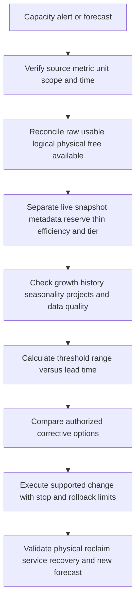

### Minimum escalation package

- Business service, impact, affected writes/onboarding, and hard dates.
- Platform, release, pool/local tier, volume/LUN, host file system, backup, replica, and tier topology.
- Raw bytes, protected usable, logical provisioned/written, physical consumed, snapshots, metadata, reserves, free, available, and remote footprint.
- Exact units, sources, timestamps, counter definitions, gaps, and reconciliations.
- Efficiency numerator/denominator, eligibility, policies, and historical ratio.
- Thin layers, guarantees, quotas, autosize, overcommit, and reclaim path.
- Growth history, events, seasonality, model, low/base/high threshold dates, and lead time.
- Options, owners, supportability, change/rollback limits, recovery impact, and exact decision ask.

---

## 17. Paper and whiteboard lab

No production access is required. Label every input and result synthetic.

### Lab scenario

A fictional pool has 1.5 PB decimal raw, 1.0 PiB protected usable, 690 TiB local physical consumed, 170 TiB remote-tier physical, 1,260 TiB logical represented, 150 TiB snapshots, 35 TiB metadata/system use, and 1.4 PiB thin logical provisioned. Local action threshold is 80% and critical threshold is 90%. A 100 TiB project arrives in five months; normal growth is 11 TiB/month; change lead time is six months.

### Tasks

1. Convert raw decimal PB to PiB/TiB and keep raw bytes.
2. Build raw-to-safe-available capacity ladder.
3. Calculate local free, action threshold, critical threshold, and current headroom.
4. Calculate thin overcommit using consistent units.
5. Calculate local-only and total-footprint efficiency ratios and savings fractions.
6. Explain whether snapshots and remote tier belong in each ratio.
7. Create a live/snapshot/metadata/remote growth bridge.
8. Forecast time to thresholds using linear growth.
9. Add the 100 TiB project as a step event and recalculate.
10. Create exponential and seasonal alternatives and state why they may be wrong.
11. Build low/base/high scenarios and distinguish confidence from prediction ranges.
12. Compare add, tier, reclaim, retention, efficiency, move, and defer options.
13. Create workload-onboarding admission criteria.
14. Write a service-review recommendation with owner, date, validation, and residual risk.

### Calculation orientation

One PiB equals 1,024 TiB. Local thresholds:

$$
H_{action}=1024\times0.80=819.2\ \text{TiB}
$$

$$
H_{critical}=1024\times0.90=921.6\ \text{TiB}
$$

Current local free:

$$
1024-690=334\ \text{TiB}
$$

Time to action under 11 TiB/month:

$$
\frac{819.2-690}{11}\approx11.75\ \text{months}
$$

At five months before project:

$$
690+(5\times11)=745\ \text{TiB}
$$

After 100 TiB project:

$$
745+100=845\ \text{TiB}
$$

The action threshold is crossed in five months, inside the six-month lead time.

Local efficiency:

$$
\frac{1260}{690}\approx1.826:1
$$

Total-footprint efficiency:

$$
\frac{1260}{690+170}=\frac{1260}{860}\approx1.465:1
$$

The numerator's inclusion rules still need verification.

### Whiteboard pass criteria

- [ ] TB/TiB and PB/PiB are converted through bytes.
- [ ] Raw, usable, logical, provisioned, consumed, free, available, and effective are separate.
- [ ] Parity, spares, metadata, reserves, snapshots, and headroom appear in the ladder.
- [ ] Thin provisioning and overcommit have a physical-exhaustion control.
- [ ] Dedupe, compression, compaction, and clones are conceptually distinct.
- [ ] Efficiency ratio declares numerator, denominator, scope, time, and exclusions.
- [ ] Tiering tracks local plus remote footprint, recall, dependency, and cost.
- [ ] Linear, exponential, seasonal, event, and scenario models have explicit assumptions.
- [ ] Confidence interval and prediction range are not treated as promises.
- [ ] Threshold date is compared with action lead time.
- [ ] Onboarding includes protection, performance, and failure workspace.
- [ ] Corrective options include recovery and business tradeoffs.
- [ ] All results remain synthetic.

---

## 18. Self-test

1. Convert TB to TiB and PB to PiB through bytes.
2. Define raw, usable, logical, provisioned, consumed, physical, free, available, effective, and headroom.
3. Draw the complete capacity ladder.
4. List ten overhead/reserve consumers.
5. Explain snapshot physical growth from change rate and retention.
6. Define thin provisioning and overcommit and calculate a ratio.
7. Map multiple thin layers and reclaim propagation.
8. Define deduplication, compression, compaction, and clone concepts.
9. Calculate an efficiency ratio and convert it to savings percentage.
10. Explain why dedupe and compression percentages do not add.
11. Recalculate a ratio with local and total-footprint denominators.
12. Define tiering and list performance, dependency, recovery, and cost questions.
13. Distinguish gross ingest, deletion, change rate, net logical, and net physical growth.
14. Calculate linear time to threshold.
15. Calculate exponential time to threshold and state when it is inappropriate.
16. Explain trend, seasonality, noise, and event-based steps.
17. Distinguish confidence interval from prediction interval and planning scenarios.
18. Build low/base/high forecasts against lead time.
19. Explain why headroom is workload and risk dependent.
20. Design observation, review, action, critical, and hard thresholds.
21. Build a complete workload-onboarding capacity model.
22. Compare at least eight corrective options and tradeoffs.
23. Ask the complete TAM discovery set.
24. Recreate Woodgrove's ratios, growth, event-adjusted forecast, and summary.
25. Complete the paper lab and answer Q1-Q8 aloud.

---

## 19. Official Source Anchors

**Date checked: 2026-08-24.** These official and vendor-neutral sources anchor units, statistical orientation, storage terminology, and public NetApp documentation areas. Exact capacity fields, savings calculations, reserves, thresholds, thin behavior, tiering, limits, and recommendations are version- and platform-sensitive. Digital Advisor, Hardware Universe, and customer-specific tools may require authorization. Never invent a NetApp ratio, counter, limit, forecast, entitlement, or internal process.

| Topic | Official or vendor-neutral source | Bounded use and access note |
|---|---|---|
| SI decimal units | [BIPM SI Brochure](https://www.bipm.org/en/publications/si-brochure) | Official SI definitions and decimal prefixes. It does not define a product dashboard's labels. |
| Binary prefixes | [NIST binary prefixes](https://physics.nist.gov/cuu/Units/binary.html) | Official US standards reference for Ki, Mi, Gi, Ti, and related prefixes. |
| Statistical forecasting orientation | [NIST/SEMATECH e-Handbook of Statistical Methods](https://www.itl.nist.gov/div898/handbook/) | Official statistical reference. Model choice and assumptions remain the analyst's responsibility. |
| Storage terminology | [SNIA Dictionary](https://www.snia.org/education/online-dictionary) | Vendor-neutral orientation for thin provisioning, capacity, deduplication, and related terms. |
| ONTAP volume administration | [ONTAP volume administration](https://docs.netapp.com/us-en/ontap/volumes/) | Official public area for capacity and volume management. Select exact release and feature documentation. |
| ONTAP storage-efficiency overview | [ONTAP storage efficiency overview](https://docs.netapp.com/us-en/ontap/volumes/storage-efficiency-overview.html) | Official public conceptual source. Exact inline/background behavior, eligibility, reporting, and performance are deferred to Part 34. |
| ONTAP thin provisioning | [ONTAP space and storage efficiency](https://docs.netapp.com/us-en/ontap/concepts/storage-efficiency-overview.html) | Broad official concepts only. Verify exact release terminology, defaults, and capacity fields. |
| FabricPool tiering | [ONTAP FabricPool management](https://docs.netapp.com/us-en/ontap/fabricpool/) | Official public area. Exact tiering policies, object targets, recalls, licensing, costs, and support are version-sensitive and deferred to Part 34. |
| Active IQ Digital Advisor | [Digital Advisor documentation](https://docs.netapp.com/us-en/active-iq/) | Official documentation. Customer data/access and current presentation require entitlement and authorization; capacity analytics are deferred to Parts 45 and 48. |
| Platform limits and supported capacity | [NetApp Hardware Universe](https://hwu.netapp.com/) | Official and potentially access-gated. Verify exact platform, drive, shelf, software, and date before design. |
| NetApp documentation entry point | [NetApp Documentation](https://docs.netapp.com/) | Select exact product/release; public pages do not replace customer configuration evidence. |

### Source-use discipline

- Preserve raw bytes and declare decimal/binary display units.
- Record source, scope, timestamp, counter definition, protection state, reserves, and exclusions for every capacity value.
- Reproduce efficiency numerator and denominator rather than copying one dashboard ratio.
- Track local, remote, backup, replica, snapshot, metadata, and total footprint separately.
- Use enough comparable history and explicit workload events; report low/base/high scenarios and uncertainty.
- Verify exact platform limits and supported remediation before recommending deletion, shrink, tiering, efficiency, movement, or expansion.
- State access gaps and seek authorized SME review instead of inventing ONTAP behavior.

---

## Likely Interview Questions

### Q1. Explain raw, usable, logical, physical, free, available, and effective capacity.

> **Model answer:** "Raw is the sum of device labels before protection. Usable is what remains after a stated protection/layout layer and specified overhead. Logical is address space or data represented to an upper layer. Physical consumed is lower capacity actually occupied under defined accounting. Free is unallocated in one layer; available is what is safe and permitted after reserves, thresholds, and constraints. Effective capacity is a derived logical-to-physical claim that must state its measured or assumed efficiency. I build a dated ladder rather than quote one gauge."

**Follow-up depth:** Add spares, metadata, snapshots, guarantees, headroom, and TB/TiB conversion to a whiteboard example.

### Q2. What is thin provisioning, and when does overcommit become risky?

> **Model answer:** "Thin provisioning presents logical capacity without reserving identical physical capacity immediately. Overcommit is logical provisioned divided by available physical. It becomes risky when correlated consumption, snapshots, failed reclaim, reduced efficiency, or delayed action can exhaust physical or policy limits before intervention. I map every thin layer, guarantees, deallocation path, growth distribution, thresholds, owner, and technical exhaustion behavior."

**Follow-up depth:** Calculate 1,200 TiB provisioned over 800 TiB physical and explain why 1.5:1 is neither automatically safe nor already full.

### Q3. How do deduplication, compression, and compaction affect capacity?

> **Model answer:** "Deduplication avoids duplicate eligible representations, compression encodes eligible data with fewer bits, and compaction can pack small compressed units more efficiently under a platform's implementation. Savings depend on content, scope, order, metadata, and change rate. I use measured logical and physical bytes, not added percentages or a marketing assumption, and I validate performance and supportability separately. NetApp-specific behavior belongs to current Part 34 sources."

**Follow-up depth:** Calculate two sequential 30% reductions and show why total savings are 51%, not 60%.

### Q4. How do you interpret an efficiency ratio such as 1.8:1?

> **Model answer:** "I first ask what is in the numerator and denominator: written logical data or provisioned space; zeros, clones, snapshots, and tiered data; local physical only or total footprint; metadata and reserves; and whether timestamps align. A 1.8:1 ratio corresponds to 44.44% savings under a simple comparable model, not 80%. I segment workloads and trend actual physical use because future content can reduce the ratio."

**Follow-up depth:** Recreate Woodgrove's local 1.8:1 and total-footprint 1.47:1 calculations and explain why both can be valid labels.

### Q5. How would you forecast time to full?

> **Model answer:** "I forecast time to an operational action threshold, not physical zero. I reconcile the capacity metric, use comparable history, mark migrations and business events, model linear, exponential, seasonal, or step growth as justified, and produce low/base/high scenarios. Linear time is threshold minus current use divided by growth. I compare the range with procurement and change lead time and refresh after every material event."

**Follow-up depth:** Calculate 620 to 680 TiB at 12 TiB/month, then explain how a 60 TiB project in three months overrides the smooth trend.

### Q6. What is the difference between a confidence interval and a prediction interval in capacity planning?

> **Model answer:** "A confidence interval describes uncertainty around a fitted parameter or mean under model assumptions. A prediction interval describes uncertainty for a future observation and is wider because future variation is included. Neither automatically captures a new project, policy change, or broken metric definition. For TAM planning I pair statistical ranges with explicit low/base/high business scenarios and state horizon, data quality, and assumptions."

**Follow-up depth:** Explain the frequentist coverage caveat, autocorrelation/seasonality risk, and why narrow model confidence can coexist with high business uncertainty.

### Q7. How do you choose headroom and capacity thresholds?

> **Model answer:** "Headroom covers normal bursts, snapshot and metadata variance, failures, rebuild/failover, upgrades, migration/rollback, performance behavior, forecast uncertainty, and decision lead time. I define observation, review, action, critical, and hard-limit stages with named owners. The action threshold must leave procurement, design, supportability, approval, and implementation time plus contingency. I do not apply a universal percentage without current platform and workload evidence."

**Follow-up depth:** Build a four-month action lead-time example and explain why removing reserves can improve a dashboard while increasing risk.

### Q8. How does your analytics background help, and what is your NetApp capacity gap?

> **Model answer:** "My MBA Business Analytics, Excel, Power BI, SQL, Python, statistics, backlog analysis, and business reviews are strong foundations for unit QA, data joins, trend segmentation, scenarios, visualization, and decision communication. I have used those skills in Microsoft support, not production ONTAP capacity planning or efficiency tuning. I would verify current counter definitions and product guidance, use authorized customer data, and have storage SMEs review platform-specific actions while labeling synthetic work honestly."

**Follow-up depth:** Describe a capacity workbook schema and name the ONTAP, hardware, protection, and workload facts that remain access- or version-sensitive.

---

## 30-Second Memory Hooks

- **TB versus TiB:** Decimal versus binary; convert through bytes.
- **Raw:** Device labels before protection.
- **Usable:** After a named protection/overhead layer.
- **Logical:** What is represented or promised upward.
- **Physical:** What lower storage actually consumes.
- **Free:** Unallocated here; **available:** safe and permitted for this purpose.
- **Effective:** Logical supported by physical plus a declared efficiency assumption.
- **Headroom:** Time and workspace for bursts, failure, change, and uncertainty.
- **Reserve:** Capacity withheld for a reason, not automatically waste.
- **Snapshot growth:** Changed old blocks stay while retained.
- **Thin provisioning:** Promise now, allocate as written.
- **Overcommit:** Logical promises divided by physical backing.
- **Dedupe:** Share duplicates; **compression:** encode fewer bits; **compaction:** pack efficiently as implemented.
- **Efficiency ratio:** Declare numerator, denominator, scope, and time.
- **1.8:1:** About 44.44% simple savings, not 80%.
- **Tiering:** Changes location and dependency, not total data existence.
- **Growth:** Compare the same metric at comparable times.
- **Linear forecast:** Threshold gap divided by bytes per period.
- **Exponential forecast:** Percentage compounds only when evidence supports it.
- **Seasonality:** Trend plus repeating cycle plus noise.
- **Confidence interval:** Uncertainty in fitted mean/parameter; **prediction range:** future observation uncertainty.
- **Threshold:** A decision date, not merely an alert color.
- **Onboarding:** Include growth, protection, efficiency downside, performance, and failure workspace.
- **Capacity action:** Compare reclaim, policy, efficiency, tier, add, move, and defer tradeoffs.
- **Arti's bridge:** Analytics transfers; ONTAP capacity operations remain unclaimed.

---

## Completion Checklist

- [ ] Convert decimal and binary capacity units through raw bytes.
- [ ] Define raw, usable, logical, provisioned, consumed, physical, free, available, effective, and headroom.
- [ ] Draw the complete capacity ladder with scope and date.
- [ ] Account for RAID, spares, metadata, reserves, snapshots, protection, and operational workspace.
- [ ] Explain snapshot capacity from change rate and retention.
- [ ] Define thin provisioning, overcommit, guarantees, reclaim, and exhaustion behavior.
- [ ] Calculate overcommit with consistent units.
- [ ] Define deduplication, compression, compaction, and clone concepts without product overclaiming.
- [ ] Calculate efficiency ratio and savings fraction correctly.
- [ ] Explain ratio scope, thin/zero/clone/snapshot/remote-tier caveats.
- [ ] Explain tiering, recall, total footprint, dependencies, recovery, and cost.
- [ ] Separate gross ingest, deletion, overwrite, efficiency, tiering, and net physical growth.
- [ ] Calculate linear and exponential time to threshold and state assumptions.
- [ ] Recognize seasonal and event-driven growth.
- [ ] Distinguish confidence intervals, prediction ranges, and low/base/high scenarios.
- [ ] Derive headroom and staged thresholds from failure, change, and lead-time risk.
- [ ] Build a complete workload-onboarding capacity model.
- [ ] Compare corrective options across capacity, performance, recovery, cost, supportability, and business timing.
- [ ] Ask all discovery questions and write an owner/date/validation/residual-risk recommendation.
- [ ] Recreate Woodgrove's unit, ratio, growth, event, option, and summary calculations.
- [ ] Complete the paper lab, self-test, and Q1-Q8 aloud.
- [ ] State Arti's analytics strengths and production NetApp gap honestly.
- [ ] Recheck current official platform, release, counter, limit, efficiency, tiering, and support documentation before real use.

---

*Next suggested section:* [Part 11 - OSI and TCP/IP for Storage Professionals](Part-11-osi-tcpip-storage-professionals.md)