# Part 11 - OSI and TCP/IP for Storage Professionals

> **Section goal:** Build a packet-level mental model from an application storage request to Ethernet frames and back. By the end, Arti should be able to explain OSI and TCP/IP without memorized slogans, read the important fields in a trace, reason about TCP state and loss, isolate a failure by layer, and turn network evidence into a bounded customer recommendation.

Covers index item **11** and maps directly to job-description responsibilities for understanding customer environments, storage depth, technical analysis, stability and risk work, supportability review, operational service reviews, preventative recommendations, and escalation quality.

This Part is vendor-neutral. Exact operating-system defaults, offload behavior, TLS policy, storage-protocol support, port use, packet-capture methods, and NetApp behavior depend on the complete product, release, host, adapter, switch, and configuration. Validate those facts in current official documentation and, for a real NetApp solution, in the current Interoperability Matrix Tool (IMT) and relevant release documentation.

> **Evidence boundary:** All hosts, addresses, packet numbers, timings, incidents, calculations, and recommendations below are synthetic. Arti's Windows, Azure, Microsoft 365, DNS, TCP/IP, and enterprise escalation experience is production evidence. Production administration or packet-level diagnosis of NetApp NFS, SMB, iSCSI, or NVMe/TCP data paths is not claimed.

---

## 1. The complete path and the vocabulary to describe it

A storage request crosses several cooperating systems. The application asks for data; the host converts that request into a protocol operation; network services help locate and secure the destination; switches and routers forward traffic; and the storage target or server processes the request.

### Plain-English deep-dive: actors, paths, and planes

| Term | Plain meaning | Analogy | Why it matters |
|---|---|---|---|
| **Client** | Software or a system that requests a service. | A customer placing an order. | In NFS and SMB, the host acts as a file-service client. |
| **Host** | The computer running the application, file-system client, or storage initiator. | The office where the customer prepares the order. | Host configuration, caches, routes, drivers, and timeouts can shape the symptom. |
| **Initiator** | A host-side endpoint that starts block-storage commands. | A loading dock that sends numbered requisitions. | iSCSI and other block protocols distinguish initiator identity from target identity. |
| **Server or target** | The endpoint that serves files or receives block-storage commands. | The warehouse fulfilling the order. | File protocols normally say server; block protocols normally say target. |
| **Switch** | A Layer 2 device that forwards Ethernet frames using Media Access Control (MAC) addresses. | A mailroom sorting envelopes by office-box label. | Link state can be healthy while a higher-layer path is broken. |
| **Router** | A Layer 3 device that forwards Internet Protocol (IP) packets between networks. | A regional sorting center choosing the next road. | Routing and asymmetry matter whenever endpoints are not on one subnet. |
| **Fabric** | The connected switching system that carries storage traffic. | A road network rather than one intersection. | Redundant ports on one common fabric can still share a failure domain. |
| **Network service** | A supporting service such as Domain Name System (DNS), time, identity, or certificate validation. | Address book, clock, identity desk, and permit office. | The data path can be reachable while authentication fails because a dependency is unhealthy. |
| **Data plane** | The path carrying user reads and writes. | Delivery trucks carrying goods. | Data-plane loss or delay directly affects I/O. |
| **Control plane** | Protocol exchanges that create state, choose paths, negotiate capabilities, or authenticate. | Dispatchers agreeing routes and permissions. | A failed handshake can prevent an otherwise healthy data plane from starting. |
| **Management plane** | Interfaces used to configure, monitor, and administer systems. | The operations office managing schedules and reports. | Management reachability does not prove client I/O reachability, and the reverse is also true. |
| **Failure domain** | A set of components that can fail from one cause. | Two lights on one circuit share a breaker. | Two logical paths are not independent if they share a switch, power source, route, or target port. |

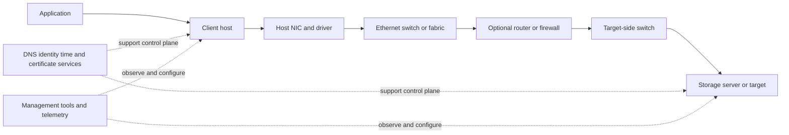

### Three paths to draw separately

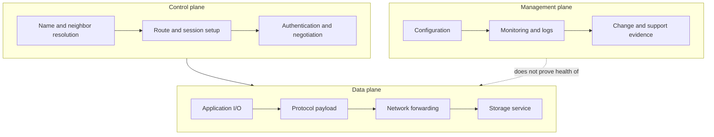

> **Arti bridge:** Microsoft 365 escalations already demand dependency thinking: a user-visible failure may involve client state, DNS, identity, proxy, TLS, service endpoint, or policy. The transferable skill is isolating the failed dependency with synchronized evidence. The new gap is applying that method to sustained storage traffic and storage-specific protocol state.

---

## 2. OSI and TCP/IP are maps, not competing networks

The **Open Systems Interconnection (OSI) reference model** is a seven-layer teaching and architecture model. The **TCP/IP model** groups the protocols used by Internet Protocol networks into fewer layers. Real implementations can cross boundaries through offloads, tunnels, encryption, virtualization, and combined devices, so the models guide questions rather than dictate one physical box per layer.

### Plain-English deep-dive: seven jobs in one delivery

| OSI layer | Main job | Typical examples here | Storage question |
|---:|---|---|---|
| 7 Application | Service meaning and commands | NFS, SMB, iSCSI command stream, NVMe/TCP, DNS | Did the storage operation or negotiation succeed? |
| 6 Presentation | Representation, encoding, encryption | TLS, serialization, compression concepts | Can both ends interpret and protect the message? |
| 5 Session | Dialog and session coordination | Authentication/session state, reconnect behavior | Does a usable session exist, and can it recover? |
| 4 Transport | End-to-end delivery between ports | Transmission Control Protocol (TCP), User Datagram Protocol (UDP) | Is the flow established, acknowledged, retransmitting, or blocked? |
| 3 Network | Addressing and routing between networks | IPv4, IPv6, Internet Control Message Protocol (ICMP) | Is the destination address reachable by the correct route? |
| 2 Data link | Local delivery on a link | Ethernet, MAC, Virtual LAN (VLAN), Address Resolution Protocol (ARP) orientation | Can the next-hop frame be delivered on this broadcast domain? |
| 1 Physical | Signals and media | Copper, fiber, optics, transceivers, link negotiation | Is the link healthy without physical errors? |

| TCP/IP grouping | Rough OSI correspondence | Important caution |
|---|---|---|
| Application | OSI 5-7 | A storage protocol can contain its own sessions, identities, and security. |
| Transport | OSI 4 | TCP reliability is byte-stream reliability, not application-transaction success. |
| Internet | OSI 3 | IP delivers packets best effort; it does not promise arrival. |
| Link | OSI 1-2 | Ethernet delivery is local to a link; routers replace link headers hop by hop. |

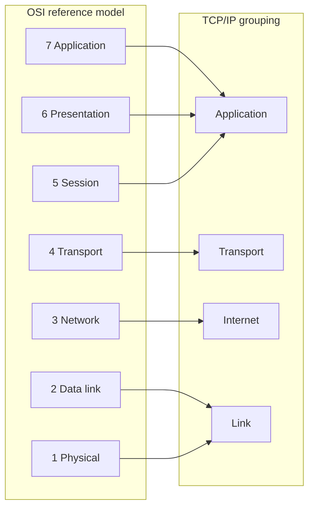

### The layer rule

Ask what each layer can prove. A successful ping can show some IP and ICMP reachability, but it does not prove that TCP port 445 is allowed, SMB authentication succeeds, a share exists, or permissions permit a file open. A successful TCP handshake proves that transport state was created; it does not prove the requested storage operation completed.

---

## 3. Encapsulation: one request, nested headers

**Encapsulation** means placing a higher-layer message inside a lower-layer unit with the information that layer needs. The receiving side removes those wrappers in reverse. Terms are often used loosely, but precise troubleshooting benefits from naming the unit.

| Unit | Layer | Contains | Identity examples |
|---|---|---|---|
| Application message or Protocol Data Unit (PDU) | Application | Storage command, response, status, data | File handle/path, SMB message ID, SCSI command, NVMe command identifier |
| TCP segment | Transport | TCP header plus byte-stream data | Source/destination ports, sequence and acknowledgment numbers |
| UDP datagram | Transport | UDP header plus one datagram payload | Source/destination ports and length |
| IP packet | Network | IP header plus transport payload | Source/destination IP, hop limit or Time To Live (TTL), protocol |
| Ethernet frame | Data link | Ethernet header, payload, and Frame Check Sequence (FCS) | Source/destination MAC, optional VLAN tag, EtherType |
| Bits or symbols | Physical | Encoded signal | Electrical or optical state |

### Packet and frame field orientation

| Header | Fields to orient on | Diagnostic use |
|---|---|---|
| Ethernet | Destination/source MAC, optional 802.1Q tag, EtherType, FCS as exposed | Confirm local next hop, VLAN, protocol family, and integrity counters. Many captures do not include FCS. |
| IPv4 | Version, header length, total length, identification, flags/fragment offset, TTL, protocol, source/destination | Detect fragmentation, path loops/TTL, address direction, and transport protocol. |
| IPv6 | Version, payload length, next header, hop limit, source/destination, extension headers | Confirm IPv6 path and extension-header handling; routers do not fragment IPv6 packets. |
| TCP | Ports, sequence, acknowledgment, data offset, flags, window, options, checksum | Reconstruct connection state, delivered byte ranges, flow control, options, and retransmission evidence. |
| UDP | Ports, length, checksum | Confirm one datagram's endpoints and size; reliability belongs to the application if needed. |

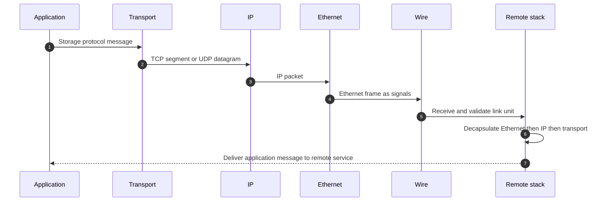

### Header changes across a routed path

- Application and transport identities are normally end-to-end, unless a proxy, load balancer, translator, or security device terminates or rewrites the flow.
- Source and destination IP addresses are normally end-to-end, but Network Address Translation (NAT) can rewrite them.
- Ethernet source and destination MAC addresses identify the current link's sender and next hop. A router removes the incoming link header and builds a new one for the next link.
- TTL in IPv4 or Hop Limit in IPv6 decreases at each router.
- Checksums and offloads can make host captures appear unusual; validate capture location and adapter offload behavior before calling a checksum bad.

---

## 4. MAC, IP, ports, and sockets answer different identity questions

### Plain-English deep-dive: building, street, department, conversation

- A **MAC address** identifies an interface on a local Layer 2 link. **Analogy:** a mail slot inside the current building. **Why it matters:** switches forward frames toward a local destination or next-hop router.
- An **IP address** identifies an interface or endpoint for Layer 3 delivery. **Analogy:** a street address usable across neighborhoods. **Why it matters:** routers use prefixes to select a path.
- A **port** is a transport-layer number used to select a service or client endpoint. **Analogy:** the department number inside the building. **Why it matters:** one IP can host many services.
- A **socket** is an operating-system communication endpoint. A TCP flow is commonly identified by source IP, source port, destination IP, destination port, and transport protocol. **Analogy:** one recorded phone call between two extensions. **Why it matters:** several flows can exist between the same hosts without being the same connection.
- A **well-known or registered port** is an assigned conventional service number, but actual deployment and firewall policy must be verified. A port number alone does not prove which application produced the traffic.

| Example | Typical transport orientation | Do not infer |
|---|---|---|
| NFSv4.x | TCP port 2049 is standard; exact version and auxiliary behavior vary | That a successful 2049 handshake proves export access or identity mapping |
| SMB | TCP port 445 is standard for direct-hosted SMB | That every port-445 flow is authorized or that Kerberos worked |
| iSCSI | TCP port 3260 is registered for iSCSI | That discovery, login, mapping, and SCSI command access all succeeded |
| NVMe/TCP | TCP port 4420 is registered for NVMe over Fabrics TCP transport | That the subsystem, namespace, and host NQN are authorized |

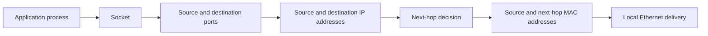

---

## 5. ARP and IPv6 Neighbor Discovery resolve the next local delivery

**Address Resolution Protocol (ARP)** maps an IPv4 next-hop address to a MAC address on the local link. If the destination is remote, the host resolves the default gateway's MAC, not the remote server's MAC.

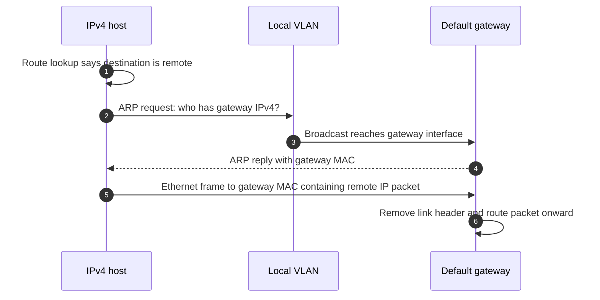

IPv6 does not use ARP. **Neighbor Discovery (ND)** uses Internet Control Message Protocol for IPv6 (ICMPv6) messages for neighbor resolution, router discovery, reachability, and other functions. Neighbor Solicitation and Neighbor Advertisement messages perform a role analogous to ARP request and reply, but ND is a broader protocol.

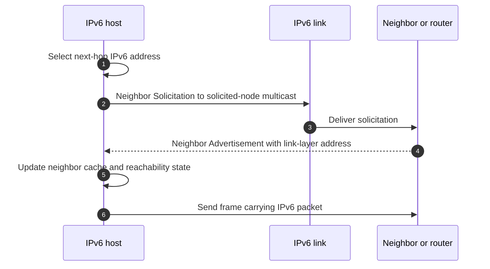

### Common neighbor failures

- Wrong VLAN or subnet assumption.
- Duplicate IP address.
- Stale or incorrect neighbor cache after a move or failover.
- Security controls that block or inspect required ARP/ND behavior.
- Gateway interface down or unavailable.
- IPv6 Router Advertisement or Neighbor Discovery filtering.
- Virtual-switch, bonding, or failover behavior that leaves stale forwarding state.

Do not clear caches reflexively in production. First capture current state, identify why it is wrong, and understand whether failover or duplicate addressing will recreate the condition.

---

## 6. IP and ICMP: best-effort forwarding plus network feedback

Internet Protocol provides addressing and packet forwarding. It is **best effort**: IP itself does not promise delivery, order, duplication prevention, or application success.

**ICMP** carries network error and diagnostic messages. Examples include Destination Unreachable, Time Exceeded, and Packet Too Big for IPv6. ICMP is not merely `ping`; blocking all ICMP can remove useful control information and break Path MTU Discovery.

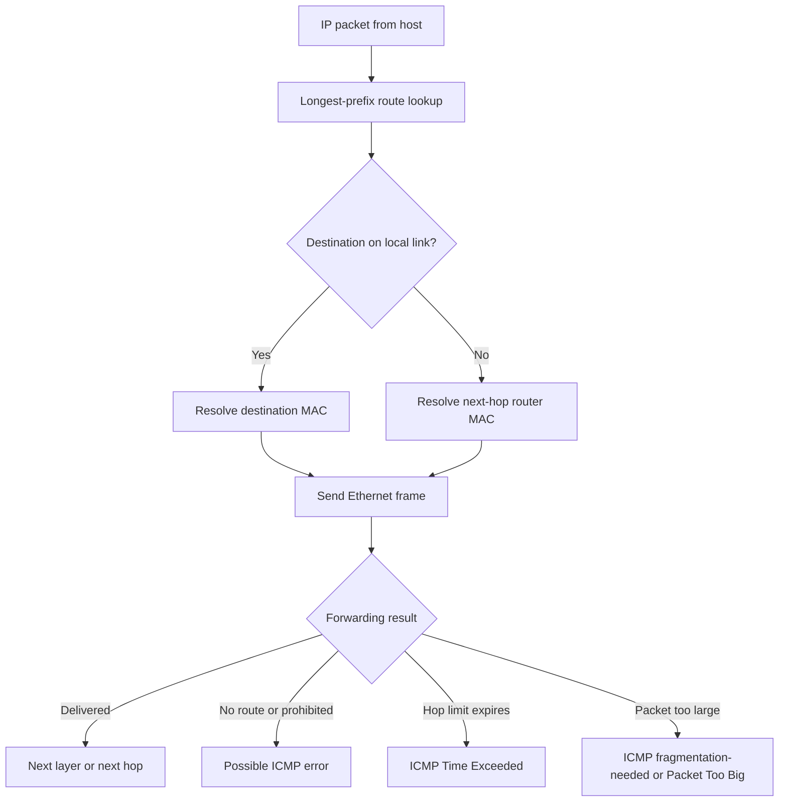

### Reachability evidence has scope

| Observation | It supports | It does not prove |
|---|---|---|
| DNS returns an address | Name lookup worked through the observed resolver path | Address is current, reachable, or correct for every client |
| ARP/ND succeeds | A next-hop link-layer identity was learned | The remote application is healthy |
| Ping reply | Some ICMP request/reply path works | TCP or storage protocol is allowed or healthy |
| Traceroute hop responds | A device generated a TTL/Hop-Limit-related response | The forward and return data path are identical |
| TCP SYN receives reset | Destination path responded and no listener/policy accepted that connection | All firewall and application behavior is understood |
| TCP handshake succeeds | Both endpoints created transport state | Authentication, storage access, or I/O completed |

---

## 7. TCP and UDP provide different transport services

**Transmission Control Protocol (TCP)** is a connection-oriented, reliable, ordered byte stream. **User Datagram Protocol (UDP)** sends discrete datagrams with minimal transport machinery and no built-in delivery, ordering, or retransmission guarantee.

| Property | TCP | UDP |
|---|---|---|
| Communication model | Connection state and byte stream | Independent datagrams |
| Delivery and order | Detects loss and retransmits; delivers bytes in order to application | Application decides whether to detect loss, reorder, or retry |
| Flow control | Receiver-advertised window | None in base UDP |
| Congestion control | Required TCP behavior controls network load | Application must use appropriate controls |
| Message boundaries | Not preserved; application frames its own messages | One datagram boundary is preserved |
| Overhead and startup | More state and handshake | Smaller base header and no TCP handshake |
| Storage orientation | NFS, SMB, iSCSI, and NVMe/TCP commonly use TCP in the scopes covered here | Some RPC-related or legacy NFS deployments can use UDP; exact support must be verified |

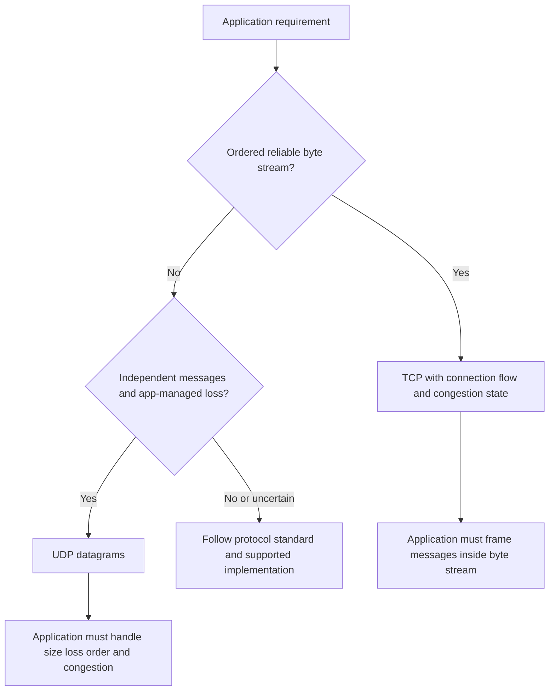

### TCP reliability has a boundary

An acknowledgment means the receiver's TCP stack has accepted a byte range according to TCP state. It does not necessarily mean:

- The application read those bytes.
- The storage server completed the operation.
- Data reached durable media.
- The request was authorized.
- A later connection failure cannot invalidate application work.

Storage-protocol acknowledgments and persistence semantics must be interpreted at the application layer.

---

## 8. TCP connection establishment, state, and teardown

### Plain-English deep-dive: sequence space and the sliding window

- A **sequence number** identifies the first byte represented by a TCP segment relative to a 32-bit sequence space. **Analogy:** page numbers in a continuous manuscript. **Why it matters:** the receiver can identify missing, duplicate, and out-of-order bytes.
- An **acknowledgment number** normally states the next byte expected. **Analogy:** "I have every page through 100; send 101 next." **Why it matters:** a cumulative acknowledgment can cover many prior bytes.
- The **receive window** advertises how much additional data the receiver is currently willing to accept. **Analogy:** empty shelf space in the receiving room. **Why it matters:** a zero or small window can limit throughput even without packet loss.
- The **congestion window** is sender-side state limiting unacknowledged data based on perceived network capacity. **Analogy:** the carrier limits trucks on the road after congestion. **Why it matters:** loss and delay can reduce sending rate.
- The **Maximum Segment Size (MSS)** is the largest TCP payload a peer says it can receive in one segment for the connection. **Analogy:** maximum contents per parcel, excluding outer shipping wrappers. **Why it matters:** MSS usually derives from an interface MTU minus IP and TCP headers, but tunnels/options complicate the effective path.
- **Window scaling** negotiates a multiplier so TCP can advertise receive windows larger than 65,535 bytes. **Why it matters:** high-bandwidth, high-latency paths need enough bytes in flight.

### Three-way handshake

```mermaid
sequenceDiagram
    autonumber
    participant C as Client 10.20.1.10:51000
    participant S as Server 10.30.2.20:2049
    C->>S: SYN seq=1000 MSS=1460 SACK permitted window scale
    S-->>C: SYN ACK seq=7000 ack=1001 options
    C->>S: ACK seq=1001 ack=7001
    Note over C,S: Connection established; application negotiation still remains
    C->>S: First application bytes
```

The SYN consumes one position in sequence space, which is why the acknowledgment is initial sequence plus one. Options such as MSS, Selective Acknowledgment (SACK) permission, timestamps, and window scale are generally negotiated on SYN segments. Capture the handshake when diagnosing option or MSS behavior; a midstream trace may not reveal the negotiation.

### Simplified TCP state orientation

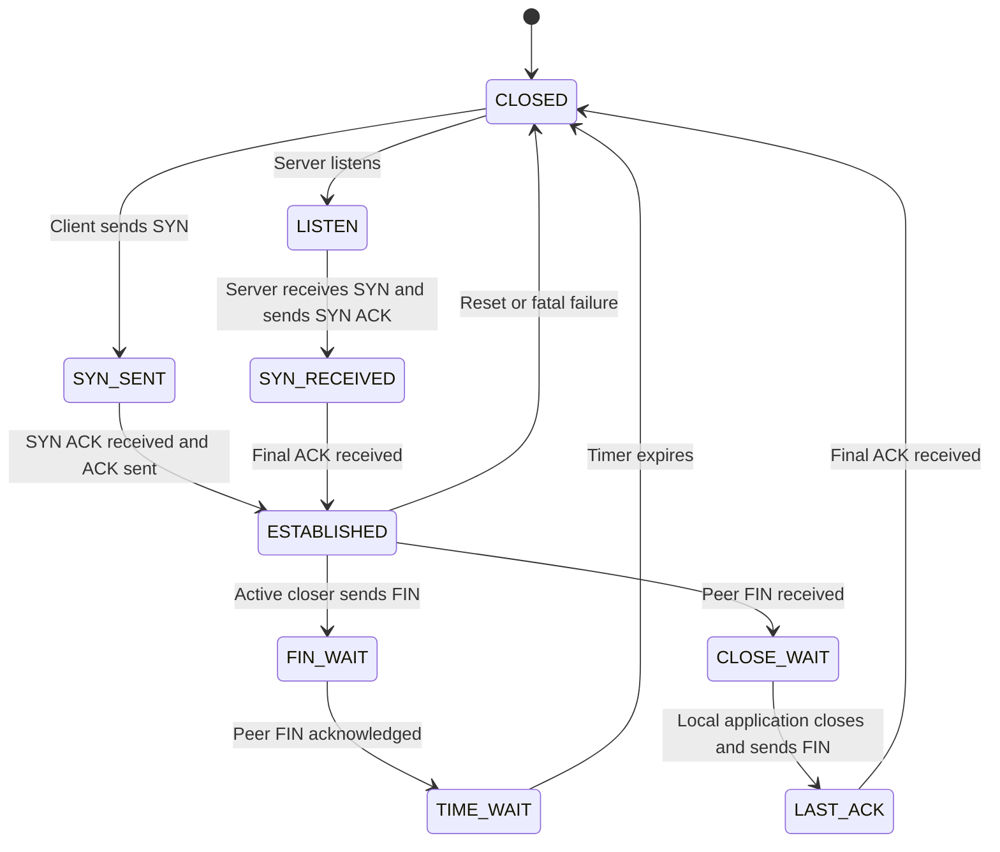

This diagram is intentionally simplified; TCP defines more states and simultaneous-close paths. `TIME_WAIT` protects against delayed segments from an old connection and supports reliable close. Large counts can be normal or can indicate churn; interpret them with connection rate, ownership, port range, and workload.

### Reset versus orderly close

- A **FIN** participates in an orderly half-close: one side has no more bytes to send.
- A **RST** resets state immediately. It may come from an application, host stack, firewall, proxy, load balancer, or another device capable of generating/injecting it.
- A reset packet's address alone does not prove the physical origin. Compare Time To Live/Hop Limit, sequence validity, simultaneous captures, device logs, and policy.

---

## 9. Retransmission, RTO, duplicate ACKs, and SACK

TCP infers loss; it does not receive a perfect notification for every dropped segment.

| Term | Plain meaning | Interpretation caution |
|---|---|---|
| **Retransmission** | Sending bytes again because loss is inferred or acknowledgment is absent. | A trace tool's label is an inference based on what that capture observed. |
| **Round-Trip Time (RTT)** | Time from sending data to receiving evidence of acknowledgment. | Application latency contains more than RTT. |
| **Retransmission Timeout (RTO)** | Timer used to retransmit when acknowledgment progress does not arrive in time. | It adapts to measured RTT variation and has specified bounds/behavior. |
| **Duplicate ACK** | Repeated cumulative acknowledgment that can indicate a gap while later bytes arrived. | Reordering can also produce duplicate acknowledgments. |
| **Fast retransmit** | Retransmission triggered by duplicate-ACK evidence before an RTO expires. | Exact congestion behavior follows negotiated/current implementation and standards. |
| **Selective Acknowledgment (SACK)** | Option allowing the receiver to report noncontiguous byte blocks already received. | It helps the sender repair multiple losses efficiently; permission is negotiated. |

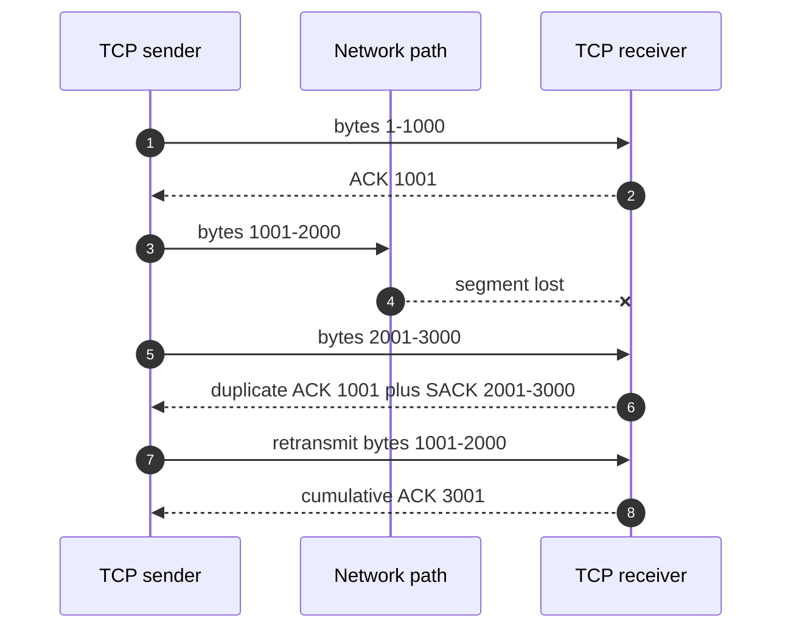

### RTO and duplicate-ACK interpretation

- An RTO often creates a larger pause than fast repair, especially if loss happens early or acknowledgments are absent.
- Repeated RTOs with exponential backoff can create application-visible seconds of delay.
- Duplicate ACKs identify a receive-sequence gap from one observation point; they do not by themselves name the device that dropped data.
- Packet reordering, capture loss, offload, and asymmetric capture can resemble network loss.
- Measure retransmitted bytes/segments, affected flows, direction, time window, burst relationship, RTT, and application response rather than reporting a naked retransmission percentage.

---

## 10. Flow control, bandwidth, latency, loss, and the bandwidth-delay product

**Bandwidth** is a path's theoretical or configured carrying rate. **Throughput** is useful data transferred per unit time. **Latency** is elapsed time for an operation or path event. **Loss** is traffic that does not arrive as expected. Storage performance depends on all four plus application concurrency, I/O size, protocol behavior, endpoint resources, and queues.

The **bandwidth-delay product (BDP)** estimates bytes needed in flight to fill a path:

$$
BDP=bandwidth\ in\ bytes/s\times RTT\ in\ seconds
$$

For a 10 Gbit/s path with a 20 ms RTT:

$$
10\ Gbit/s\div8=1.25\ GB/s
$$

$$
BDP=1.25\ GB/s\times0.020\ s=25\ MB
$$

A single flow needs roughly 25 MB of effective in-flight capacity to fill the ideal path, before protocol overhead and real constraints. This is orientation, not a tuning instruction.

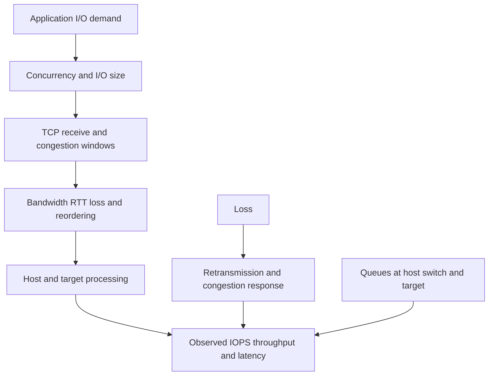

### Worked throughput orientation

A 1 GiB transfer completed in 1.2 seconds:

$$
throughput=\frac{1\ GiB}{1.2\ s}=0.833\ GiB/s
$$

In bits per second, using binary bytes:

$$
0.833\times2^{30}\times8\approx7.16\ Gbit/s
$$

Do not compare that directly with a 10 Gbit/s link without accounting for protocol overhead, direction, multiple consumers, capture interval, flow control, and endpoint limits.

### Symptom patterns, not automatic diagnoses

| Pattern | Candidate explanations | Discriminating evidence |
|---|---|---|
| High RTT, little loss | Physical distance, queued path, endpoint delay reflected in ACK timing | Baseline by hop/flow, simultaneous captures, queue/interface telemetry |
| Bursts of loss and retransmission | Congestion, bad link, microburst, receiver overload, policing | Switch drop/error counters, queue telemetry, direction and timestamp correlation |
| Receiver window reaches zero | Receiving application or host is not draining data quickly | Zero-window announcements, window updates, host CPU/thread/disk state |
| Large link utilization but low one-flow throughput | Window/BDP, one-flow processing, policy, loss | Negotiated scaling, in-flight bytes, multiple-flow comparison, CPU/offload evidence |
| Low link use and high storage operation latency | Application serialization or target/backend delay | Request/response timing, queue depth, server/storage counters |

---

## 11. MTU, MSS, fragmentation, and Path MTU Discovery

### Plain-English deep-dive: the smallest doorway controls the parcel

The **Maximum Transmission Unit (MTU)** is the largest network-layer packet a link can carry as one unit under that interface's definition. **Analogy:** the largest parcel that fits through one doorway. **Why it matters:** the end-to-end path can contain a smaller doorway than either endpoint expects.

The TCP **Maximum Segment Size (MSS)** is the largest TCP payload a peer advertises for one segment. With Ethernet MTU 1500, IPv4 without options (20 bytes), and TCP without options (20 bytes), the common orientation is:

$$
MSS=1500-20-20=1460\ bytes
$$

For IPv6 with its 40-byte base header and a 20-byte TCP header:

$$
MSS=1500-40-20=1440\ bytes
$$

TCP options and extension headers add overhead. Tunnels add outer headers and can reduce effective payload. Do not hard-code the examples as a universal value.

### IPv4 and IPv6 fragmentation

- In IPv4, a router may fragment a packet when allowed, or drop it and send an ICMP Destination Unreachable code indicating fragmentation is needed when Don't Fragment is set.
- In IPv6, routers do not fragment packets. The source handles packet sizing and may use a Fragment extension header when appropriate.
- Fragment loss can discard the usefulness of the entire original packet, and filtering fragments can create inconsistent failures.
- TCP normally uses MSS and Path MTU Discovery to avoid IP fragmentation.

**Path MTU Discovery (PMTUD)** finds the smallest supported IP packet size along a path. Classical PMTUD depends on relevant ICMP feedback. If large packets are dropped and ICMP feedback is blocked, a connection can handshake and then stall when larger data begins: an MTU black hole.

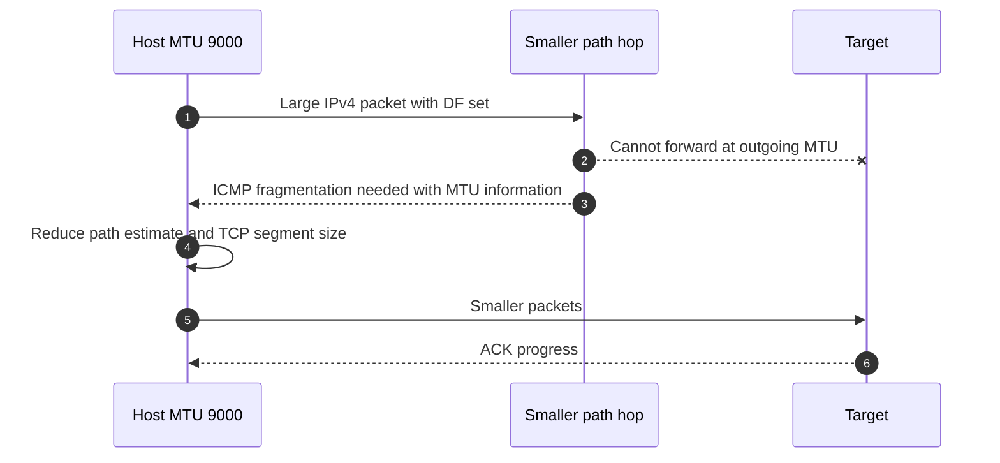

### MTU fault tree

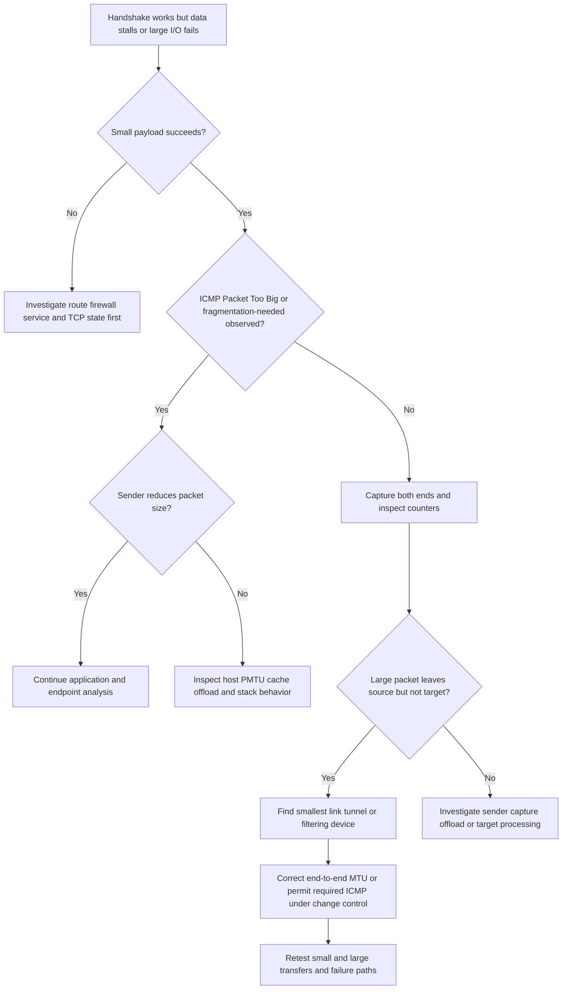

### Jumbo frames

A **jumbo frame** is an Ethernet frame carrying a larger payload than the common 1500-byte IP MTU design. The exact label and maximum vary. Jumbo MTU can reduce packets per byte and CPU/interrupt work in some environments, but every relevant endpoint, virtual switch, physical switch, routed/tunneled link, and failover path must support the intended size. It is not automatically faster and must not be enabled one device at a time in production.

---

## 12. DNS and TLS are part of the storage dependency chain

**Domain Name System (DNS)** maps names and other records to information such as addresses. It can involve client caches, recursive resolvers, authoritative servers, search suffixes, split views, and Time To Live (TTL). A stale or different answer can send clients to the wrong endpoint even when that endpoint is healthy.

**Transport Layer Security (TLS)** can provide peer authentication, integrity, and encryption above transport. TLS policy depends on protocol, implementation, certificate trust, name validation, cryptographic configuration, and version. TLS does not repair packet loss; it depends on the underlying transport.

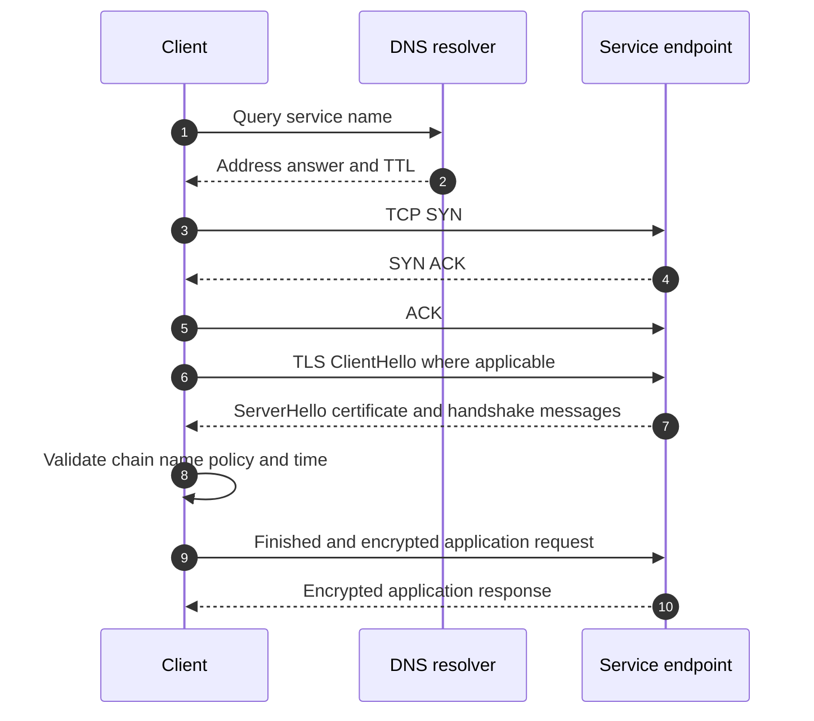

### TLS trace orientation

- Capture metadata may show protocol version offers, Server Name Indication, alerts, and certificate messages; TLS 1.3 encrypts more handshake content than earlier versions.
- Decryption requires authorized keying material and safe handling. Never request secrets casually or weaken production security just to simplify a trace.
- A TLS alert is application/security evidence; combine it with certificate, client, server, proxy, and time logs.
- A proxy or TLS inspection device can terminate one TLS connection and create another. Treat the two legs as distinct failure and evidence domains.

### DNS-first discipline

Record the queried name, resolver, answer set, TTL, client cache state, time, network location, address family, and whether the application used the expected answer. `The name resolves for me` is not enough when users, subnets, or resolvers differ.

---

## 13. Mapping storage protocols onto the network stack

The storage protocol owns request meaning. TCP owns an ordered byte stream. IP owns packet forwarding. Ethernet owns local-link delivery. A useful diagnosis preserves all four scopes.

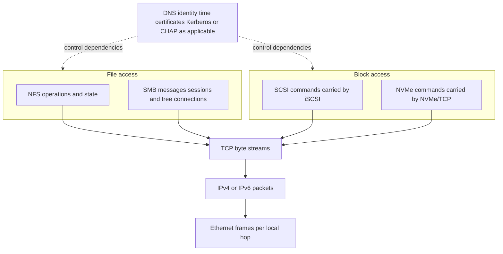

| Protocol | Client-side role | Server-side role | Important application state | Network orientation |
|---|---|---|---|---|
| NFS | NFS client on host | NFS server | Version, export access, file handle, identity, locks/leases depending on version | Commonly TCP 2049 for NFSv4.x; NFSv3/RPC dependencies vary |
| SMB | SMB client | SMB server | Dialect, session, tree connection, file handle, lease/oplock, identity | Direct-hosted SMB commonly TCP 445; AD/DNS/time dependencies can be separate flows |
| iSCSI | iSCSI initiator | iSCSI target/portal | Discovery, login, session, connection, LUN access, SCSI command state | TCP, commonly registered port 3260; MPIO uses multiple paths/sessions under host design |
| NVMe/TCP | NVMe host | NVMe subsystem/controller endpoint | Discovery, connection, queues, namespaces, NQN authorization | TCP, commonly registered port 4420; exact discovery and security support are implementation-specific |

### Request completion is layered

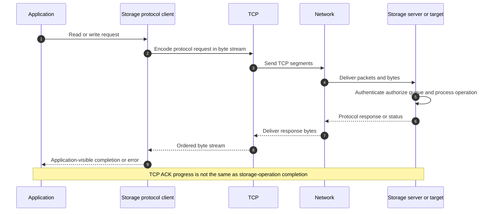

---

## 14. Packet capture, clocks, and evidence correlation

A **packet capture** records traffic visible at one observation point. It is not a complete truth source. The capture can miss packets, see offloaded/coalesced representations, omit link errors, observe only one direction, or sit on the wrong side of a proxy, firewall, bond, virtual switch, or NAT.

### Capture planning table

| Question | Capture design implication |
|---|---|
| Which exact flow? | Record endpoint IPs, ports, address family, interface, namespace/VM, and application time. |
| Which side may drop or delay? | Capture as close to both endpoints as authorized, plus switch/device counters. |
| Is path asymmetric? | One SPAN or mirror point may not see both directions. |
| Are offloads enabled? | Host captures can show oversized/coalesced data or apparent checksum issues. |
| Is traffic encrypted? | Use metadata and endpoint logs; decrypt only through approved secure procedure. |
| Is load high? | Use bounded filters, ring buffers, storage capacity planning, and privacy controls. |
| Is time comparable? | Synchronize clocks and record timezone, UTC offset, precision, drift, and capture start/end. |

### Correlation timeline

```mermaid
sequenceDiagram
    autonumber
    participant A as Application log UTC
    participant H as Host trace UTC plus 4 ms
    participant W as Switch counters 30 s samples
    participant S as Storage log UTC minus 7 ms
    A->>H: Request ID 8f2 starts at 10:00:00.100
    H->>W: TCP data begins at corrected 10:00:00.104
    W->>W: Egress drop counter rises in 10:00:00-10:00:30 bucket
    H->>H: Retransmission at corrected 10:00:00.310
    S->>S: Request arrives at corrected 10:00:00.318
    S-->>A: Operation completes at corrected 10:00:00.340
    Note over A,S: Preserve raw timestamps and document corrections; do not fabricate precision
```

### Evidence by layer and owner

| Layer/component | Useful evidence | Owner questions |
|---|---|---|
| Application/storage protocol | Request IDs, operation/status, session, auth, retry, latency | Did the request arrive, queue, fail, retry, or complete? |
| Host | Routes, neighbor cache, socket state, TCP counters, NIC counters, CPU, offloads | Was the host blocked, retransmitting, window-limited, or using the expected interface? |
| Switch/fabric | Interface state, speed, errors, discards, queue drops, VLAN/path topology | Was there physical loss, congestion, policy, or common fate? |
| Router/firewall/load balancer | Route, state table, policy decision, NAT/proxy logs, drops | Was the flow permitted and symmetrically handled? |
| Network services | DNS query/answer, time state, identity/certificate logs | Did the client reach and trust the intended identity? |
| Storage server/target | Listener/session, protocol counters, interface, CPU, queues, operation logs | Did the target receive and process the request, and what did it return? |

### Time-correlation rules

1. Preserve raw timestamps and source timezone.
2. Record clock source and observed offset; do not silently edit evidence.
3. Use one identifiable request, connection tuple, protocol ID, or marker event.
4. Account for sampling intervals: a 30-second counter bucket cannot prove a 1-ms event caused a specific loss.
5. Align changes, failovers, route events, DNS TTL expiry, authentication, retransmissions, protocol errors, and user impact.
6. Separate `observed at the same time` from `caused by` until a discriminating test or stronger mechanism supports causality.

---

## 15. Versions, interoperability, security, and supportability

Protocol names are not complete compatibility statements. Record the exact versions and surrounding components.

### Version and supportability inventory

| Domain | Record at minimum | Why |
|---|---|---|
| Host | OS/build, storage client/initiator, NIC, driver, firmware, offloads, multipathing | Changes transport, failover, and supported behavior. |
| Network | Switch/router/firewall models, software, port/VLAN/MTU/QoS, optics, topology | Defines forwarding, failure domains, and policy. |
| IP/TCP | Address family, route, MSS/options, MTU, TLS/proxy, ports | Explains path behavior and negotiated transport. |
| Storage protocol | NFS/SMB/iSCSI/NVMe version and negotiated capabilities | Application semantics and recovery differ. |
| Storage target | Platform, release, interfaces/LIFs, protocol configuration, security | Determines supported combinations and server behavior. |
| Validation | Official source/tool, exact combination, notes, date, reviewer, gaps | Makes the conclusion auditable and current. |

### Security principles

- Segment and permit only required paths under customer policy; do not assume a dedicated VLAN is sufficient security.
- Authenticate endpoints and users with the protocol's supported mechanisms.
- Use encryption and signing according to threat model, policy, performance evidence, and supported combinations.
- Protect packet captures because they can contain customer data, names, credentials, tokens, or infrastructure details.
- Keep management-plane access separate and least privileged where architecture supports it.
- Treat a firewall opening as a scoped policy decision, not a generic troubleshooting step.
- Validate certificate name, trust, validity period, revocation behavior, and time dependencies where TLS applies.

### IMT and current-source discipline

NetApp's IMT is an official source for supported combinations, but access and exact results can be gated and time-sensitive. A conceptual lesson cannot establish that a customer's host OS, adapter, driver, firmware, switch, protocol, multipathing, and ONTAP combination is supported. Save the exact query/result or approved evidence reference, review notes, record the date, and escalate an unlisted combination rather than inventing support.

---

## 16. TAM discovery, risk, recommendation, and JD mapping

### Customer discovery questions

#### Business and symptom

1. Which application, users, site, operation, and service objective are affected?
2. Is the symptom connect failure, authentication, intermittent disconnect, latency, throughput, retry, or data-path failover?
3. When did it start, what changed, and is the issue continuous, periodic, or workload-dependent?

#### Topology and planes

4. Draw client/host, virtual and physical switches, routers/firewalls/proxies, network services, and storage target/server.
5. Draw data, control, and management paths separately.
6. Which links, devices, power sources, routes, target ports, and services are shared failure domains?

#### Addressing and transport

7. Which names, DNS answers, source/destination IPs, subnets, routes, MAC/neighbor entries, ports, and address families are used?
8. What TCP states, handshake options, RTT, windows, retransmissions, resets, and zero-window events appear?
9. What MTU exists at every hop, what MSS was negotiated, and are tunnels or inspection devices present?

#### Protocol and supportability

10. Which storage protocol/version/capabilities and security mechanism were negotiated?
11. What host, driver, firmware, switch, target, and storage releases form the exact combination?
12. What current official support evidence and notes apply, and what remains unverified?

#### Evidence and operations

13. Are clocks synchronized, and can one request be correlated across client, network, and target?
14. Which counters are cumulative, sampled, reset, or potentially affected by offload?
15. What safe discriminating test, rollback/stop condition, owner, and maintenance boundary exist?

### Layered troubleshooting method

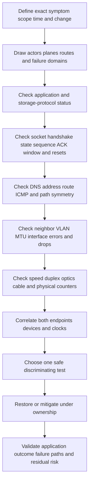

The order is not a rigid bottom-up ritual. Start at the symptom and use the cheapest evidence that can distinguish hypotheses. For example, an application protocol error from the target proves more path progress than repeating link checks.

### Recommendation structure

| Element | Networking example |
|---|---|
| Evidence | Both endpoint captures show one byte range leaving the client twice; target sees only the retransmission; switch egress discard counter rises in the same bounded interval. |
| Context | The flow carries a tier-one NFS workload during a backup burst. |
| Risk | Continued queue drops can increase I/O tail latency and trigger application timeouts; exact business probability remains to be measured. |
| Action | Network owner should validate queue policy and traffic mix on the implicated egress interface in an approved test window; storage/application owners should provide a representative workload and acceptance threshold. |
| Owner/date | Named network owner and change target. |
| Validation | Simultaneous captures, counters, workload latency, no new loss, and failover-path test. |
| Residual risk | A corrected queue does not exclude host, protocol, or target bottlenecks under other workloads. |

### Explicit JD Mapping

| JD responsibility | Part 11 contribution | Arti's strength and honest gap |
|---|---|---|
| Understand customer environment | Maps application, host, network services, switches/fabrics, paths, target, and planes | **Strength:** Windows/Azure/M365 dependency troubleshooting. **Gap:** production NetApp data-path mapping is unproven. |
| Analyze and report customer data | Turns packet fields, counters, logs, and timelines into bounded findings | **Strength:** escalation evidence and analytics. **Gap:** storage packet-trace portfolio must be built in labs. |
| Storage and infrastructure depth | Connects NFS/SMB/iSCSI/NVMe-TCP to TCP/IP and Ethernet | **Conceptual:** protocol stack understood; production protocol administration is not claimed. |
| Mitigate risk and improve stability | Finds common fate, MTU, loss, path, security, and service dependencies | **Transfer:** CRITSIT risk isolation; exact storage remediation requires current product and SME validation. |
| Understand supportability | Defines exact end-to-end component/version inventory and IMT evidence | **Gap:** no direct NetApp IMT result or customer tool access claimed. |
| Track preventative remediation | Gives owner/date/test/validation/residual-risk structure | **Strength:** Microsoft case/action follow-through. |
| Conduct service reviews | Converts packet detail into impact, confidence, options, and decisions | **Strength:** business reviews and audience calibration. |
| Improve escalation quality | Defines synchronized client/network/target evidence pack and exact ask | **Strength:** Product/Engineering escalation work transfers directly as a method. |

### Honest production-gap statement

> "I have production experience troubleshooting Windows, Azure, DNS, TCP/IP, proxies, and Microsoft 365 dependencies and coordinating high-severity evidence. I can explain and analyze the network stack and create a packet-correlation plan. I have not yet administered or diagnosed NetApp NFS, SMB, iSCSI, or NVMe/TCP data paths in production. For a customer case I would use authorized captures and telemetry, verify the exact supported combination and protocol behavior, and work with network, host, storage, and NetApp specialists rather than extrapolate from Microsoft experience."

---

## 17. Fully synthetic case: Alpine Research file latency

> **Synthetic case:** Alpine Research, all addresses, measurements, devices, packet details, and outcomes are invented. The case demonstrates reasoning and does not represent a NetApp customer, internal process, or product defect.

### Environment

- Linux analytics clients use a fictional NFSv4.1 file service.
- Client `10.44.10.21` reaches service `10.55.20.40` through an access switch, router/firewall pair, and target-side switches.
- Endpoint MTU is configured as 9000 bytes. One standby routed path contains a tunnel with an effective IP MTU of 1500 bytes.
- DNS returns the intended address with a 300-second TTL.
- The normal active path works. After a routing failover, directory operations work but large reads pause and retry.
- No real supportability result is asserted; exact host, network, and storage combinations remain placeholders for authorized validation.

```mermaid
flowchart LR
    C[Linux NFS client MTU 9000] --> A[Access switch]
    A --> R1[Primary routed path MTU 9000]
    A --> R2[Standby tunnel effective MTU 1500]
    R1 --> F[Firewall pair]
    R2 --> F
    F --> TSW[Target switches]
    TSW --> S[NFS service endpoint]
    DNS[DNS resolver] -.name answer.-> C
    CTRL[Routing control event] -.moves traffic.-> R2
```

### Timeline and evidence

| UTC time | Evidence | Interpretation |
|---|---|---|
| 09:59:58 | Routing event moves client subnet to standby tunnel | Strong change correlation, not yet proof of MTU cause |
| 10:00:01.100 | DNS answer remains `10.55.20.40` | Name resolution is not the changed variable |
| 10:00:01.120 | ARP for standby gateway succeeds | Local next-hop resolution works |
| 10:00:01.130 | TCP handshake to port 2049 succeeds; MSS option requires careful interpretation with path/tunnel | Transport starts; storage access is not yet proved |
| 10:00:01.145 | Small NFS request and response complete | NFS session/path supports small exchanges |
| 10:00:01.200 | Client-side capture sees a large offloaded representation; network-side capture sees packets that exceed standby egress capability | Host offload view alone is insufficient; path sizing is a candidate |
| 10:00:01.201 | Standby device drops packet; no usable ICMP feedback reaches source in the synthetic evidence | Classical PMTUD cannot adjust promptly |
| 10:00:02.205 | TCP retransmission follows timeout; application latency spikes | Explains pause mechanism, not yet who configured the fault |
| 10:00:08 | Network device policy review finds required ICMP feedback blocked on standby leg | Mechanism aligns with black-hole behavior |

### Competing hypotheses

| Hypothesis | Supporting evidence | Evidence against or missing | Test |
|---|---|---|---|
| Storage target is overloaded | Large reads are slow | Target CPU/queue normal; issue begins exactly at route failover; small requests succeed | Compare target request arrival and service time before/after route event |
| Packet loss from congestion | TCP retransmits | No queue drops; loss is size-dependent | Controlled sizes plus interface discard reasons |
| MTU/PMTUD black hole | Small works, large fails, smaller path, missing ICMP, failover correlation | Must correct host-offload interpretation and prove packet fate | Simultaneous endpoint/path captures and approved PMTU test |
| DNS sends wrong target | Name is a dependency | Answer unchanged and connection reaches intended server | Record query/answer and target-side tuple |
| NFS permission/identity issue | NFS can return access failures | Reads begin and timeout rather than return access status | Protocol response/status and server logs |

### Fault-isolation tree

```mermaid
flowchart TD
    USER[Large NFS reads pause after route failover] --> CONN{TCP handshake succeeds?}
    CONN -->|No| C1[Check route policy listener firewall]
    CONN -->|Yes| SMALL{Small NFS operations succeed?}
    SMALL -->|No| C2[Check NFS session export identity and target]
    SMALL -->|Yes| SIZE{Failure depends on packet or payload size?}
    SIZE -->|No| C3[Check target queue locks workload and loss]
    SIZE -->|Yes| PATH{Path changed or tunnel added?}
    PATH -->|No| C4[Verify endpoint MTU offload and NIC errors]
    PATH -->|Yes| ICMP{Required PMTU feedback returns?}
    ICMP -->|No| ROOT[MTU black-hole mechanism supported]
    ICMP -->|Yes| HOST[Check sender adjustment and PMTU cache]
    ROOT --> CHANGE[Correct approved path MTU or ICMP policy]
    CHANGE --> VERIFY[Retest large read primary and standby]
```

### Bounded recommendation

> **Evidence:** The symptom starts after the route transition, small NFS operations complete, larger packets disappear at the standby tunnel boundary, and required PMTU feedback does not return. **Context:** The route is a resilience path for a tier-one analytics service. **Risk:** The standby path is logically available but cannot carry representative data reliably, so failover creates latency and timeout exposure. **Recommendation:** The network owner should correct the end-to-end MTU/encapsulation design or permit the required ICMP feedback according to security policy, using current device guidance and change control. The storage and application owners should define representative small/large I/O and timeout acceptance tests. **Validation:** Capture both sides, confirm path-size adaptation or consistent MTU, complete NFS reads without retransmission bursts, and test both paths. **Residual risk:** Passing this test does not prove every workload, direction, protocol state, or future tunnel change is safe; configuration monitoring and periodic failover testing remain necessary.

### Customer-facing summary

> "The target remained reachable and small NFS operations completed after failover. The delay aligns with a smaller standby path that dropped larger packets while the feedback needed for path-size adjustment was blocked. This supports an MTU/PMTUD mechanism rather than a storage-capacity or permission conclusion. We recommend correcting the full standby-path design under network ownership and validating both paths with representative I/O, synchronized captures, and application acceptance criteria."

---

## 18. Common failures and layered troubleshooting implications

| Symptom | Candidate layers | First discriminating evidence | Unsafe shortcut |
|---|---|---|---|
| Name not found | DNS/client configuration | Exact query, resolver, response, suffix, cache, time | Editing hosts files before understanding DNS |
| No route | Host/routing/policy | Route table, chosen source/interface, gateway, device route | Adding a broad default route |
| ARP/ND unresolved | Link/VLAN/duplicate/gateway | Neighbor state, VLAN, switch forwarding, duplicate evidence | Repeated cache clearing |
| SYN timeout | Path/firewall/listener | Both-end capture, policy/device logs, server listener | Opening all ports |
| Immediate RST | Application/host/device | Sequence-valid reset, TTL, endpoint logs, simultaneous capture | Blaming the server from one trace |
| Handshake then stall | MTU, TLS, app, receiver | Packet size, ICMP, TLS alert, windows, endpoint logs | Assuming the open port proves service health |
| Periodic latency | Loss/queue/endpoint/workload | Per-flow RTT/retransmission, queue counters, app/target time | Averaging the whole day |
| Low throughput | BDP/window/loss/CPU/path/storage | In-flight bytes, windows, RTT, loss, CPU, request concurrency | Enabling jumbo MTU as a generic fix |
| Disconnect on failover | State/path/common fate/protocol recovery | Route and neighbor changes, TCP reset/timeout, protocol session recovery | Calling two IPs redundant |
| Authentication failure | DNS/time/identity/TLS/protocol | Protocol status, identity logs, clock, SPN/certificate where applicable | Treating it as packet loss |

### Minimum escalation pack

- Business impact, affected application/operation/users/sites, severity, and service objective.
- UTC timeline with raw timestamps, clock sources, offsets, symptom start, changes, and reproduction windows.
- Client/host, virtual switches, physical switches/fabrics, routers/firewalls/proxies, network services, and storage target/server topology.
- Data, control, and management paths plus redundancy and shared failure domains.
- Host OS, client/initiator, NIC, driver, firmware, offloads, routes, neighbors, sockets, and counters.
- Network device models/releases, interface state/speed, VLAN, MTU, errors, discards, queues, policy, and topology.
- Storage platform/release, endpoint identity, protocol/version, listener/session, interface and operation evidence.
- DNS query/answer/TTL, time state, TLS or authentication metadata where relevant.
- Filtered simultaneous packet captures with location, interface, filter, loss caveat, privacy handling, and handshake if possible.
- Flow tuple, TCP options, sequence/ACK evidence, RTT, windows, retransmissions, resets, MSS, fragmentation/PMTUD evidence.
- Exact supported-combination evidence, official source/date, IMT notes or access gap, and unverified assumptions.
- Actions tried, result, rollback, competing hypotheses, next discriminating test, owner, and exact escalation ask.

---

## 19. Paper lab and whiteboard drills

No production access is required. Use documentation-only reasoning or an isolated authorized lab. Label all results synthetic.

### Paper lab scenario

A Windows application host uses SMB over TCP 445 to a fictional file service across two routed paths. DNS gives two addresses. The primary path has 1500 MTU and 2 ms RTT; the disaster-recovery path has 1400 effective MTU through a VPN and 42 ms RTT. The host and target interfaces use 1500 MTU. After failover, TCP establishes but a 4 GiB copy averages 300 Mbit/s and experiences periodic one-second pauses. One trace shows retransmissions; one host capture shows apparent bad checksums; the switch reports no physical errors. No storage or network cause is yet proved.

### Tasks

1. Draw application, host, NIC, switches, routers/VPN, DNS, identity/time, and file-service target.
2. Draw data, control, and management planes separately.
3. Map OSI and TCP/IP layers to one SMB write.
4. Draw encapsulation and identify which headers change at each router/VPN boundary.
5. List MAC, IP, port, socket tuple, SMB message/session identity, and timestamps.
6. Draw ARP or ND for local next-hop resolution.
7. Draw the TCP three-way handshake and record MSS, SACK, window scale, and timestamps if present.
8. Calculate the BDP for 1 Gbit/s and 42 ms RTT.
9. Calculate ideal transfer time for 4 GiB at 300 Mbit/s, then state why that does not explain pauses.
10. Build hypotheses for PMTUD, congestion/loss, receiver window, VPN processing, host CPU/offload, SMB state, and target latency.
11. Explain how checksum offload can affect a source-host capture and how to disconfirm real corruption.
12. Build a PMTUD decision tree for the 1400-byte path.
13. Specify simultaneous capture points and a UTC correlation method.
14. Create an end-to-end version/supportability inventory and mark unknowns.
15. Write a seven-part recommendation without claiming a root cause before evidence supports it.
16. Build a complete escalation pack and a 60-second customer update.

### Calculation orientation

For 1 Gbit/s and 42 ms RTT:

$$
BDP=\frac{1{,}000{,}000{,}000}{8}\times0.042=5{,}250{,}000\ bytes\approx5.01\ MiB
$$

For 4 GiB at 300 Mbit/s, ignoring all overhead and pauses:

$$
t=\frac{4\times2^{30}\times8}{300{,}000{,}000}\approx114.53\ seconds
$$

The observed copy time should be longer if periodic pauses occur. Quantify pause count/duration and protocol overhead rather than forcing all delay into the average rate.

### Whiteboard drills

1. **Ninety-second stack:** Draw application through physical layers and name one failure at each.
2. **Identity ladder:** Explain MAC, IP, port, socket, protocol session, and file/LUN identity.
3. **ACK boundary:** Explain what a TCP ACK proves and what durable storage completion requires.
4. **Next hop:** Show why a remote destination uses the gateway MAC.
5. **Loss repair:** Draw one missing segment, duplicate ACKs, SACK, and retransmission.
6. **MTU black hole:** Explain why a handshake can succeed while large data stalls.
7. **Two paths:** Identify at least five common-fate risks in apparently redundant links.
8. **Executive translation:** Convert a retransmission trace into impact, confidence, action, and decision language.

### Lab completion criteria

- [ ] Every term is scoped to its layer.
- [ ] The maps include host, network services, switches/fabrics, target, and all three planes.
- [ ] At least two competing hypotheses survive the first evidence review.
- [ ] Packet-capture limitations and clock offsets are explicit.
- [ ] MTU and MSS include tunnel/header implications.
- [ ] TCP and storage-protocol completion are not confused.
- [ ] Supportability remains unverified until current exact evidence exists.
- [ ] The recommendation includes owner, validation, and residual risk.

---

## 20. Self-test

1. Explain OSI and TCP/IP models and why neither is a physical topology.
2. Define client, host, initiator, server, target, switch, router, fabric, and network service.
3. Distinguish data, control, and management planes.
4. Define frames, IP packets, TCP segments, UDP datagrams, and application PDUs.
5. Draw encapsulation and explain which headers change at a router.
6. Distinguish MAC address, IP address, port, socket, and protocol-session identity.
7. Explain ARP for a local and remote destination.
8. Explain IPv6 Neighbor Discovery and why it is broader than ARP.
9. State what ICMP does and why blocking all ICMP can be harmful.
10. Compare TCP and UDP and state who owns reliability.
11. Draw the TCP three-way handshake with sequence and acknowledgment numbers.
12. Explain receive window, congestion window, window scaling, MSS, and bytes in flight.
13. Describe the main TCP states and FIN versus RST.
14. Explain RTT, RTO, duplicate ACK, fast retransmit, and SACK.
15. Explain why a TCP ACK is not a durable-write acknowledgment.
16. Calculate BDP and relate it to a high-bandwidth, high-latency path.
17. Distinguish bandwidth, throughput, latency, IOPS, loss, and queueing.
18. Calculate MSS from MTU with stated header assumptions.
19. Compare IPv4 and IPv6 fragmentation behavior.
20. Explain classical PMTUD and an MTU black hole.
21. Explain jumbo-frame benefits, risks, and end-to-end validation.
22. Describe DNS and TLS dependencies for a storage path.
23. Map NFS, SMB, iSCSI, and NVMe/TCP onto the stack.
24. Design a simultaneous packet capture and time-correlation plan.
25. Explain host offload and capture-location limitations.
26. Build the exact version/interoperability inventory for a storage flow.
27. Ask the complete discovery set and identify shared failure domains.
28. Work the Alpine case without jumping from correlation to cause.
29. Build the minimum escalation pack.
30. State Arti's transferable production experience and storage-protocol gap honestly.

---

## 21. Official Source Anchors

**Date checked: 2026-08-24.** These sources anchor protocol concepts and public support context. Standards can be revised, updated, or obsoleted; IEEE standards text can have access restrictions; and product implementations select subsets and add version-specific constraints. Before customer use, verify the current standard status, exact host/network/storage releases, vendor documentation, and NetApp IMT result and notes. Do not infer a support matrix from a standards document.

| Topic | Official public source | Access, version, and use note |
|---|---|---|
| OSI reference model | [ITU-T X.200: Open Systems Interconnection basic reference model](https://www.itu.int/rec/T-REC-X.200) | Official public overview/download availability can vary by edition. It is a reference model, not a product support statement. |
| Internet host layering | [RFC 1122 - Requirements for Internet Hosts, Communication Layers](https://www.rfc-editor.org/rfc/rfc1122) | Foundational IETF host requirements; later RFCs update many protocol details. |
| Ethernet standards family | [IEEE 802.3 Ethernet Working Group](https://www.ieee802.org/3/) | Public standards overview. Full IEEE standards text and current amendments may have access or edition constraints. |
| ARP | [RFC 826 - An Ethernet Address Resolution Protocol](https://www.rfc-editor.org/rfc/rfc826) | Historical IPv4-over-Ethernet foundation; implementation and security behavior require current platform guidance. |
| IPv4 and ICMP | [RFC 791 - Internet Protocol](https://www.rfc-editor.org/rfc/rfc791), [RFC 792 - Internet Control Message Protocol](https://www.rfc-editor.org/rfc/rfc792) | Foundational documents with later updates. Use RFC Editor status and updates for current interpretation. |
| IPv6 | [RFC 8200 - Internet Protocol, Version 6](https://www.rfc-editor.org/rfc/rfc8200) | Current IPv6 base specification at check date; extension and operational behavior have additional RFCs. |
| IPv6 Neighbor Discovery | [RFC 4861 - Neighbor Discovery for IPv6](https://www.rfc-editor.org/rfc/rfc4861) | Check RFC Editor for updates and implementation guidance. |
| ICMPv6 | [RFC 4443 - ICMPv6](https://www.rfc-editor.org/rfc/rfc4443) | Required IPv6 control/error protocol; security policy must account for necessary messages. |
| TCP | [RFC 9293 - Transmission Control Protocol](https://www.rfc-editor.org/rfc/rfc9293) | Current TCP base specification at check date; congestion control, options, and recovery use additional RFCs. |
| TCP congestion control | [RFC 5681 - TCP Congestion Control](https://www.rfc-editor.org/rfc/rfc5681) | Foundational standardized algorithms; later algorithms and platform implementations can differ. |
| TCP RTO | [RFC 6298 - Computing TCP's Retransmission Timer](https://www.rfc-editor.org/rfc/rfc6298) | Standards orientation for RTO behavior. Do not infer one OS's exact live timers without evidence. |
| TCP SACK | [RFC 2018 - TCP Selective Acknowledgment Options](https://www.rfc-editor.org/rfc/rfc2018) | SACK option definition; negotiation and implementation evidence come from endpoints/trace. |
| TCP window scaling and timestamps | [RFC 7323 - TCP Extensions for High Performance](https://www.rfc-editor.org/rfc/rfc7323) | Check handshake options and current implementation rather than assuming enablement. |
| UDP | [RFC 768 - User Datagram Protocol](https://www.rfc-editor.org/rfc/rfc768), [RFC 8085 - UDP Usage Guidelines](https://www.rfc-editor.org/rfc/rfc8085) | Base protocol plus current application-design guidance at check date. |
| IPv4 Path MTU Discovery | [RFC 1191 - Path MTU Discovery](https://www.rfc-editor.org/rfc/rfc1191) | Classical IPv4 PMTUD; check updates and implementation-specific behavior. |
| IPv6 Path MTU Discovery | [RFC 8201 - Path MTU Discovery for IP version 6](https://www.rfc-editor.org/rfc/rfc8201) | Current IPv6 PMTUD base at check date; Packetization Layer PMTUD has additional guidance. |
| Packetization Layer PMTUD | [RFC 8899 - Packetization Layer Path MTU Discovery for Datagram Transports](https://www.rfc-editor.org/rfc/rfc8899) | Standards orientation; protocol implementation support must be verified. |
| DNS | [RFC 1034 - Domain Names Concepts and Facilities](https://www.rfc-editor.org/rfc/rfc1034), [RFC 1035 - Domain Names Implementation and Specification](https://www.rfc-editor.org/rfc/rfc1035) | Foundational DNS documents with many later updates; use current operational and product guidance. |
| TLS 1.3 | [RFC 8446 - The Transport Layer Security Protocol Version 1.3](https://www.rfc-editor.org/rfc/rfc8446) | Protocol standard; supported versions/ciphers/certificates are product and policy dependent. |
| NFSv4.0 and NFSv4.1 | [RFC 7530 - NFS Version 4](https://www.rfc-editor.org/rfc/rfc7530), [RFC 8881 - NFS Version 4 Minor Version 1](https://www.rfc-editor.org/rfc/rfc8881) | Protocol standards; exact server/client features and NetApp support require current validation. |
| SMB protocol documentation | [Microsoft Open Specifications - SMB protocols](https://learn.microsoft.com/en-us/openspecs/windows_protocols/ms-smb/) | Official Microsoft protocol documentation. Windows and storage-product support remain version-specific. |
| iSCSI | [RFC 7143 - Internet Small Computer System Interface](https://www.rfc-editor.org/rfc/rfc7143) | Consolidated iSCSI standard; host/target security, multipath, and support combinations need current vendor evidence. |
| NVMe over Fabrics and TCP | [NVM Express Specifications](https://nvmexpress.org/specifications/) | Official public specification area. Select current NVMe Base and transport specifications; implementation/support may lag or differ. |
| NetApp networking overview | [ONTAP network management documentation](https://docs.netapp.com/us-en/ontap/network-management/) | Official public documentation area. Select exact ONTAP release and feature pages. |
| NetApp protocol and host interoperability | [NetApp Interoperability Matrix Tool](https://imt.netapp.com/) | Official, potentially authentication-gated, and version-sensitive. Validate exact combination and notes; never invent a result. |

### Source-use discipline

- Check the RFC Editor status, errata, updates, and obsoletes relationships before relying on an older RFC.
- Treat OSI mappings as explanatory, not as proof that a function belongs to only one implementation component.
- Treat IANA/standard ports as conventions, not evidence of an active or authorized service.
- Record capture location, offloads, filters, loss, clock state, privacy controls, and encryption boundaries.
- Verify exact product versions, negotiated protocol, MTU on all paths, and current support documentation.
- Use NetApp IMT and release documentation for exact supportability; standards compliance alone does not establish support.

---

## Likely Interview Questions

### Q1. Explain OSI and TCP/IP for a storage data path.

> **Model answer:** "OSI separates communication into seven conceptual jobs; TCP/IP groups the deployed Internet stack into application, transport, Internet, and link layers. For storage, NFS, SMB, iSCSI, or NVMe/TCP owns request meaning; TCP owns an ordered reliable byte stream; IP owns best-effort routed packets; Ethernet owns local frames; and the physical layer carries signals. I use the layers to ask what each observation proves, not to assume one device owns exactly one layer."

**Follow-up depth:** Draw client, network services, switches/routers, target, and data/control/management planes; explain why a successful ping or TCP handshake does not prove storage access.

### Q2. Walk through encapsulation and the roles of MAC addresses, IP addresses, and ports.

> **Model answer:** "The storage message is framed inside TCP bytes, a TCP segment is carried in an IP packet, and the packet is carried in an Ethernet frame on each local link. MAC addresses select local sender and next hop, IP addresses identify routed endpoints, and ports select transport endpoints such as the service and client socket. At a router the Ethernet header changes, the IP hop count changes, and the end-to-end transport flow normally remains unless NAT or a proxy rewrites or terminates it."

**Follow-up depth:** Explain remote-destination ARP, a five-tuple, VLAN tag orientation, IPv6 Neighbor Discovery, and what NAT/proxies change.

### Q3. Explain TCP establishment, sequence numbers, ACKs, windows, and connection state.

> **Model answer:** "TCP starts with SYN, SYN-ACK, and ACK, negotiating options such as MSS, SACK permission, and window scale. Sequence numbers identify byte positions; the acknowledgment normally names the next byte expected. The receive window protects receiver capacity, while the congestion window protects the network. TCP then moves through established and close states using FIN for orderly close or RST for immediate reset. A TCP ACK confirms transport-byte acceptance, not application processing or durable storage."

**Follow-up depth:** Draw numeric sequence/ACK values, explain zero window, TIME_WAIT, retransmission, and how to investigate who generated a reset.

### Q4. How do TCP retransmissions, RTO, duplicate ACKs, and SACK affect storage performance?

> **Model answer:** "TCP infers missing bytes from absent progress, duplicate acknowledgments, and timers. Duplicate ACKs and SACK blocks can let the sender repair a gap before the retransmission timeout; an RTO can create a larger application-visible pause and backoff. Loss also reduces congestion state, so throughput can fall. I correlate both-end traces, RTT, windows, switch drops, endpoint load, and storage request timing because reordering, capture loss, and offload can imitate network loss."

**Follow-up depth:** Walk through one lost segment and state why a retransmission percentage alone cannot identify the faulty device.

### Q5. Explain MTU, MSS, fragmentation, and PMTUD, including a black hole.

> **Model answer:** "MTU is the largest IP packet a link can carry under its definition; MSS is the TCP payload size a peer advertises, commonly derived from interface MTU minus IP and TCP headers. IPv4 can fragment when allowed; IPv6 routers do not fragment. PMTUD learns the smallest path size using feedback such as fragmentation-needed or Packet Too Big. If larger packets are dropped and that feedback is blocked, the handshake and small operations can work while bulk data stalls. I validate every endpoint, switch, route, tunnel, and failover path rather than enabling jumbo MTU locally."

**Follow-up depth:** Calculate common 1500-MTU MSS examples, explain tunnel overhead, and design simultaneous captures for a suspected black hole.

### Q6. How would you capture and correlate evidence for intermittent storage latency?

> **Model answer:** "I first scope the exact application operation, flow tuple, time window, path, and change. I synchronize or measure clock offsets, then gather bounded endpoint captures, application/protocol logs, host socket/NIC data, switch and firewall counters, and target request/queue evidence. I record capture location, offloads, drops, encryption, and sampling limits. I correlate one request or protocol identifier end to end, preserve competing hypotheses, and choose one safe test that can distinguish path loss from endpoint or storage delay."

**Follow-up depth:** Explain checksum-offload artifacts, asymmetric routing, SPAN limitations, privacy handling, and why a 30-second counter bucket cannot prove one packet's cause.

### Q7. How do NFS, SMB, iSCSI, and NVMe/TCP map onto TCP/IP, and what must be validated?

> **Model answer:** "They place different application semantics over the network: NFS and SMB serve files and carry identity, session, handle, and locking state; iSCSI carries SCSI block commands between initiator and target; NVMe/TCP carries NVMe commands and queues between host and subsystem. In the covered common cases they use TCP, then IP and Ethernet. I validate the negotiated protocol/version, ports, identities, security, host/client or initiator, NIC/driver/firmware, switches, target/storage release, multipath design, MTU, and exact current support evidence rather than treating TCP reachability as protocol success."

**Follow-up depth:** Name the common registered ports with caveats and distinguish a transport connection from NFS export, SMB share, LUN, or namespace authorization.

### Q8. How does your background prepare you for storage-network troubleshooting, and where is the gap?

> **Model answer:** "My production Microsoft escalation work includes Windows and Azure networking, DNS, TCP/IP, proxies, Microsoft 365 dependencies, evidence correlation, high-severity ownership, and Product or Engineering escalation. That gives me a strong layered troubleshooting and communication method. My gap is direct production diagnosis of NetApp NFS, SMB, iSCSI, and NVMe/TCP data paths and NetApp support tools. I would close it through authorized labs and shadowing, current standards and vendor documentation, exact IMT validation, and review by host, network, storage, and NetApp specialists."

**Follow-up depth:** Give a factual Microsoft dependency case, label exactly what transfers, and describe the packet/evidence lab artifact that demonstrates the new skill without calling it production experience.

---

## 30-Second Memory Hooks

- **OSI:** Seven questions about communication jobs, not seven required boxes.
- **TCP/IP:** Application meaning over transport over routed IP over a local link.
- **Frame:** Local-link envelope; **packet:** routed envelope; **segment:** TCP byte-range carrier.
- **MAC:** Next local mailbox; **IP:** routed street address; **port:** service department.
- **ARP:** IPv4 next-hop address to MAC; **ND:** IPv6 neighbor and router discovery family.
- **ICMP:** Network feedback, not only ping.
- **TCP:** Ordered reliable bytes, not proof of application or durable completion.
- **UDP:** Datagram delivery with reliability left above it.
- **SYN, SYN-ACK, ACK:** Create TCP state and negotiate important options.
- **Sequence:** First byte number; **ACK:** next byte expected.
- **Receive window:** Receiver capacity; **congestion window:** network-capacity estimate.
- **RTO:** Timer-based repair; **SACK:** report received islands around a gap.
- **BDP:** Bandwidth times RTT equals bytes needed in flight.
- **MTU:** Largest packet for one link; **MSS:** TCP payload offer.
- **PMTUD black hole:** Small works, large disappears, feedback is missing.
- **DNS:** The address-book path can choose the wrong healthy endpoint.
- **TLS:** Protects application data; it still depends on transport, trust, name, and time.
- **Capture:** One camera angle, not the whole event.
- **Three planes:** Data moves I/O, control creates state, management configures and observes.
- **Storage map:** NFS/SMB file meaning; iSCSI/NVMe block meaning; TCP/IP carries them.
- **Supportability:** Exact versions and combinations plus a dated official result.
- **Arti's bridge:** Production network escalation method transfers; storage-protocol production depth remains to be earned.

---

## Completion Checklist

- [ ] Explain OSI and TCP/IP models without treating them as literal topology.
- [ ] Define client, host, initiator, server, target, switch, router, fabric, and network service.
- [ ] Draw data, control, and management planes plus shared failure domains.
- [ ] Define encapsulation, PDU, TCP segment, UDP datagram, IP packet, Ethernet frame, and bits.
- [ ] Orient on Ethernet, IPv4, IPv6, TCP, and UDP fields.
- [ ] Distinguish MAC, IP, port, socket, and application-session identity.
- [ ] Explain ARP, IPv6 ND, ICMP, next-hop resolution, and routing boundaries.
- [ ] Compare TCP and UDP and state reliability/congestion responsibilities.
- [ ] Draw the TCP handshake, state lifecycle, numeric sequence/ACK flow, and teardown.
- [ ] Explain receive/congestion windows, scaling, MSS, RTO, duplicate ACK, fast retransmit, and SACK.
- [ ] Calculate BDP and separate bandwidth, throughput, latency, loss, queues, and concurrency.
- [ ] Calculate MSS with stated assumptions and compare IPv4/IPv6 fragmentation.
- [ ] Diagnose a PMTUD black hole and validate jumbo MTU end to end, including failover paths.
- [ ] Explain DNS and TLS dependencies and evidence boundaries.
- [ ] Map NFS, SMB, iSCSI, and NVMe/TCP from application state to Ethernet.
- [ ] Design an authorized capture with filters, privacy, offload, clock, and loss caveats.
- [ ] Correlate application, host, switch/fabric, network service, and storage-target evidence.
- [ ] Build exact version/interoperability inventory and date current official/IMT evidence.
- [ ] Apply security, least-privilege, segmentation, and capture-handling principles.
- [ ] Ask the complete TAM discovery set and write a bounded recommendation.
- [ ] Recreate the Alpine case and preserve competing hypotheses until evidence discriminates.
- [ ] Complete the paper lab, whiteboard drills, self-test, and Q1-Q8 aloud.
- [ ] State Arti's production strengths and storage-protocol gap without inflation.
- [ ] Recheck RFC status, IEEE access/edition, product releases, and NetApp IMT before customer use.

---

*Next suggested section:* [Part 12 - Ethernet Design: VLANs, Bonds, LACP, MTU, QoS, and Redundancy](Part-12-ethernet-vlan-lacp-mtu-qos.md)