# Part 12 - Ethernet Design: VLANs, Bonds, LACP, MTU, QoS, and Redundancy

> **Section goal:** Learn how Ethernet actually forwards storage traffic, how VLANs and link aggregation create logical paths, and how to test whether an apparently redundant design survives real failures. By the end, Arti should be able to read frame and switch evidence, explain LACP and hashing, calculate realistic throughput, diagnose VLAN/MTU/physical errors, and produce a safe customer recommendation with explicit supportability and residual risk.

Covers index item **12** and maps directly to job-description responsibilities for customer-environment analysis, storage and infrastructure depth, stability and risk mitigation, supportability validation, proactive recommendations, operational service reviews, and high-quality escalations.

This Part is vendor-neutral. Exact bond/team/interface-group modes, switch stacking or multi-chassis behavior, hashing algorithms, Spanning Tree Protocol (STP) behavior, Maximum Transmission Unit (MTU), Quality of Service (QoS), flow control, offloads, counters, and failover behavior vary by operating system, adapter, switch platform, storage release, and configuration. Validate the complete combination in current vendor documentation and, for NetApp solutions, the current Interoperability Matrix Tool (IMT) and exact ONTAP release documentation.

> **Evidence boundary:** Every organization, topology, MAC address, VLAN, counter, workload, test, and recommendation below is synthetic. Arti's Windows/Azure networking, enterprise escalation, evidence correlation, and customer communication are production strengths. Production NetApp interface-group administration, storage-switch design, LACP tuning, or Ethernet fabric ownership is not claimed.

---

## 1. Ethernet's job in a storage path

Ethernet carries frames across one Layer 2 domain. It does not know that the payload is an NFS read, SMB write, iSCSI command, or NVMe/TCP completion. It forwards by local link-layer identity while higher layers provide IP addressing, transport state, authentication, and storage meaning.

### Plain-English deep-dive: components and ownership

| Term | Plain meaning | Analogy | Why it matters |
|---|---|---|---|
| **Network Interface Controller (NIC)** | Host or storage hardware/virtual interface that sends and receives frames. | A building's loading dock. | Link, driver, firmware, queues, offloads, and counters can affect the data path. |
| **Switch** | Device that forwards Ethernet frames among ports using learned MAC locations and policy. | A sorting floor that learns which office is behind each corridor. | A port can be up while frames are filtered, discarded, or forwarded to the wrong place. |
| **Bridge** | A Layer 2 forwarding function; an Ethernet switch is a multiport bridge. | A controlled set of connected corridors. | STP and VLAN standards describe bridged networks. |
| **Port** | A physical or logical switch/interface attachment point. | One door into the sorting floor. | Speed, duplex, VLAN, aggregation, MTU, counters, and state are port-specific. |
| **Fabric** | The connected network of switches and links carrying traffic. | The complete road network, not one road. | Path diversity and common fate must be assessed across the whole fabric. |
| **Broadcast domain** | Endpoints that can receive a Layer 2 broadcast within a VLAN. | Everyone on one building announcement circuit. | VLANs bound broadcasts and define local-neighbor scope. |
| **Failure domain** | Components vulnerable to one fault or administrative action. | Two lifts powered by one electrical panel. | Two links are not independent if they share a switch, line card, power source, software domain, or upstream path. |
| **Data plane** | Forwarding path for client storage traffic. | Delivery trucks. | Must survive the failures the design claims to tolerate. |
| **Control plane** | Protocols and state that build forwarding and aggregation, such as STP and Link Aggregation Control Protocol (LACP). | Dispatchers coordinating roads and convoys. | Control-plane health determines which links may forward. |
| **Management plane** | Configuration, telemetry, logs, authentication, and administration. | The operations office. | Management access does not prove the storage data path, and data traffic can continue during some management failures. |

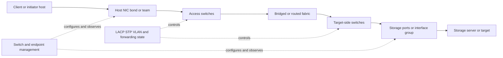

### The path-health warning

`Link up` means that one interface detected a working physical/link relationship under its current negotiation. It does not prove:

- The correct VLAN is allowed.
- LACP selected the member for forwarding.
- STP permits forwarding.
- The peer or upstream path reaches the target.
- MTU is consistent.
- A firewall/router permits the higher-layer flow.
- The storage protocol or application is healthy.

---

## 2. Ethernet frame anatomy and packet orientation

An Ethernet frame contains local source and destination identities, a type/length indication, a payload, and an integrity check. Physical preamble and interpacket spacing also consume wire time even though packet captures often do not display them as frame bytes.

### Plain-English deep-dive: the local envelope

| Field | Plain meaning | Diagnostic value |
|---|---|---|
| **Preamble and Start Frame Delimiter (SFD)** | Physical synchronization pattern and frame start marker. | Usually below normal packet-capture visibility; physical hardware handles it. |
| **Destination MAC** | Intended local receiver, multicast group, or broadcast. | Shows the next local delivery, not necessarily the final IP destination. |
| **Source MAC** | Sender on the current local link. | Helps map an endpoint or next-hop device to a switch port. |
| **802.1Q tag** | Optional VLAN and priority information inserted into the frame. | Confirms tagged VLAN ID and Priority Code Point (PCP) where visible. |
| **EtherType/length** | Identifies the carried protocol or frame interpretation. | Common values orient to IPv4, IPv6, ARP, and other protocols. |
| **Payload** | Higher-layer data plus any required padding. | Usually contains the IP packet in this study path. |
| **Frame Check Sequence (FCS)** | Cyclic Redundancy Check (CRC) value for frame corruption detection. | Bad frames are normally discarded in hardware; many captures omit FCS, so use interface counters. |

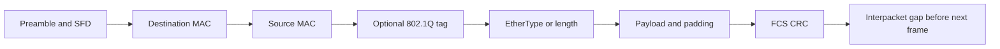

### Unicast, multicast, and broadcast

| Traffic type | Destination | Typical switch action | Storage relevance |
|---|---|---|---|
| **Unicast** | One interface MAC | Forward toward learned destination; flood if unknown | Most steady client-to-storage data traffic is unicast. |
| **Multicast** | A group MAC | Forward according to multicast/snooping state or flood within policy | IPv6 ND, discovery, clustering, and other services can use multicast. |
| **Broadcast** | All-ones destination MAC | Flood within the VLAN except ingress port | ARP requests and some discovery traffic; excessive broadcast can affect a domain. |
| **Unknown unicast** | Unicast destination not in forwarding table | Commonly flood within that VLAN under platform policy | Can follow MAC aging, moves, or incomplete learning; persistent flooding warrants investigation. |

### Throughput starts with wire overhead

A nominal link rate is raw line signaling capacity under its Ethernet definition. Useful application throughput is lower because of Ethernet framing, interpacket gap, IP/TCP headers, storage-protocol headers, acknowledgments, retransmissions, control traffic, and implementation limits.

For a simple orientation using a 1500-byte Ethernet payload and 38 bytes of Ethernet wire overhead (8-byte preamble/SFD, 14-byte base header, 4-byte FCS, 12-byte interpacket gap):

$$
efficiency\approx\frac{1500}{1500+38}=97.53\%
$$

This excludes VLAN tags and all higher-layer headers and does not describe every Ethernet variant. It is a teaching estimate, not a benchmark prediction.

---

## 3. MAC learning, forwarding, flooding, and the forwarding database

A switch learns the source MAC and ingress port of received frames. It stores that relationship in a **Forwarding Database (FDB)**, historically called a **Content Addressable Memory (CAM) table** because switches often use specialized lookup memory. `CAM table` is common operational language, but FDB is the standards-oriented forwarding concept.

### Learning and forwarding sequence

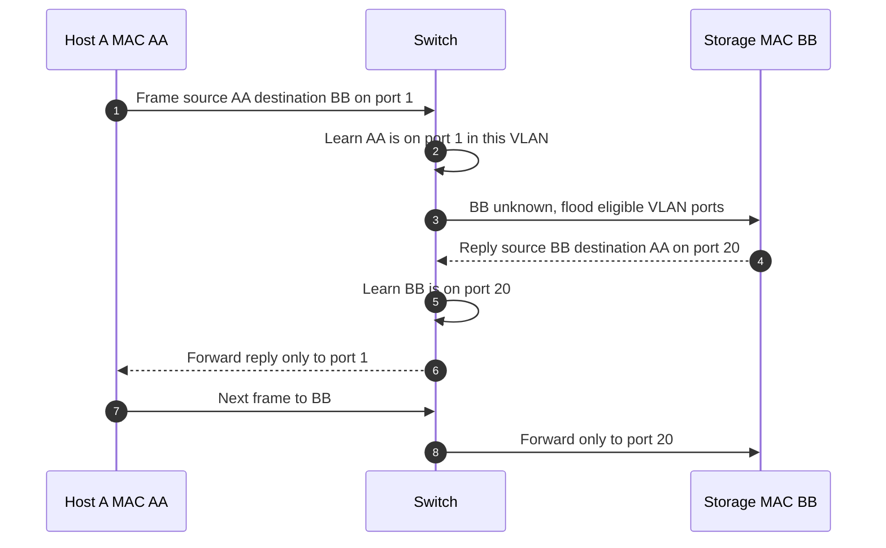

### FDB orientation

| Field | Question |
|---|---|
| VLAN/bridge domain | In which Layer 2 domain was the address learned? |
| MAC address | Which endpoint, virtual MAC, bond, or gateway identity is represented? |
| Port or logical interface | Where does the switch currently believe the source resides? |
| Type | Dynamic, static, secure, control-plane, or implementation-specific? |
| Age | Is the entry fresh, aged, or rapidly relearned? |

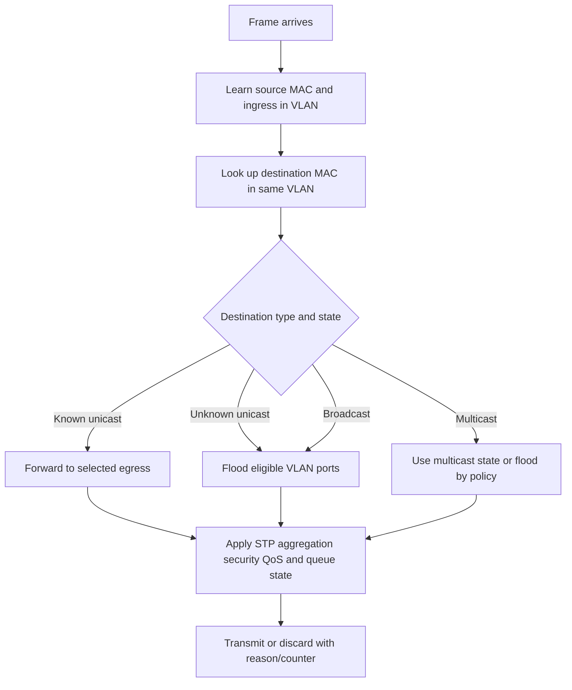

### MAC movement

A MAC appearing on different ports can be normal during failover, virtual-machine movement, multi-chassis operation, or topology change. Rapid repeated movement can also indicate a loop, miswiring, duplicate MAC, aggregation mismatch, or unsupported multi-homing. Correlate timing with LACP/STP/failover events and endpoint intent before clearing the table.

---

## 4. VLANs, access ports, trunks, and native-VLAN risk

A **Virtual Local Area Network (VLAN)** creates a logical Layer 2 broadcast domain identified by a VLAN ID. VLANs separate forwarding domains on shared physical infrastructure; routing is needed to move IP traffic between VLANs.

### Plain-English deep-dive: rooms, doors, and labeled corridors

- An **access port** normally associates endpoint traffic with one VLAN and sends/receives it untagged according to switch configuration. **Analogy:** one room's door leads directly to one corridor. **Why it matters:** endpoint and switch agree implicitly on the VLAN.
- A **trunk port** carries multiple VLANs, usually with 802.1Q tags. **Analogy:** one corridor carries parcels with room labels. **Why it matters:** both ends must agree on allowed VLANs and treatment of untagged traffic.
- A **native VLAN** is a platform/configuration concept for handling untagged traffic on a trunk. **Analogy:** unlabeled parcels are assigned to a default room. **Why it matters:** disagreement can silently place traffic in different broadcast domains.
- A **tagged interface/subinterface** attaches an endpoint or logical service to a VLAN by adding/expecting a tag. **Analogy:** the endpoint prints its own room label. **Why it matters:** tagging responsibility must match the switch port design.

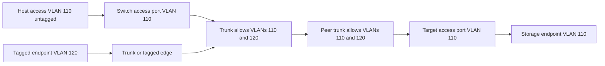

### Common VLAN failures

| Failure | Likely symptom | Evidence |
|---|---|---|
| VLAN missing from one trunk allow-list | One VLAN fails across link while others work | Running config, operational allowed/forwarding VLANs, counters/capture |
| Access VLAN mismatch | Endpoint lands in wrong broadcast domain | Port config, ARP/ND behavior, DHCP/address evidence, FDB |
| Native VLAN mismatch | Untagged traffic enters different VLANs at each end; control warnings may appear | Both-end trunk config, control-plane logs, tagged/untagged capture where possible |
| Endpoint tags into access port | Frames dropped or mapped unexpectedly | Endpoint VLAN config and switch port mode/counters |
| Duplicate VLAN/IP design | Intermittent neighbor or path confusion | FDB, ARP/ND, topology, duplicate-address evidence |
| VLAN exists but STP blocks path | Link is up but not forwarding for that VLAN/instance | STP role/state and topology |

### VLAN fault tree

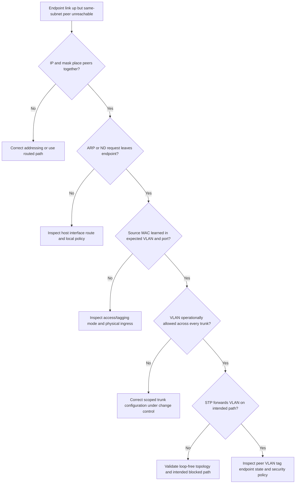

### VLANs are segmentation, not complete isolation

VLANs reduce Layer 2 scope. Security still depends on routing/firewall policy, endpoint controls, management access, spoofing protections, authentication, monitoring, and physical/administrative boundaries. Never describe a storage VLAN as secure only because it is dedicated.

---

## 5. STP prevents Layer 2 loops

Ethernet frames do not have an IP-style hop limit. A Layer 2 loop can circulate frames, multiply broadcasts, destabilize MAC learning, and consume links. **Spanning Tree Protocol (STP)** and its descendants create a loop-free active topology by selecting forwarding and non-forwarding paths.

### STP vocabulary

| Term | Plain meaning | Why it matters |
|---|---|---|
| **Bridge Protocol Data Unit (BPDU)** | Control frame switches exchange for spanning-tree decisions. | Filtered or misdirected BPDUs can undermine loop prevention. |
| **Root bridge** | Logical reference bridge selected for a spanning-tree instance. | Topology and path decisions are calculated relative to it. |
| **Root port** | A non-root bridge's best path toward the root. | Normally one per instance on a bridge. |
| **Designated port** | Port selected to forward toward a segment. | Helps form the active tree. |
| **Alternate/blocking/discarding path** | Redundant path held out of data forwarding until needed, under the protocol variant. | Link up does not mean data forwarding. |
| **Topology change** | Event that can alter forwarding and MAC-learning behavior. | Can coincide with flooding, path transition, or short disruption. |

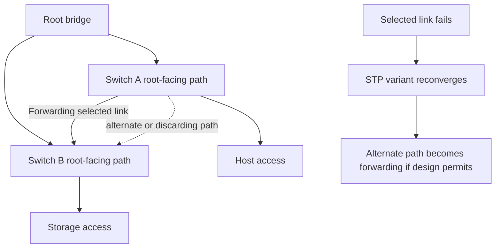

### STP cautions for storage

- Know which STP variant and instance maps to each VLAN.
- Edge/portfast-like behavior should be used only where the device relationship meets vendor design guidance; combining it with inappropriate BPDU filtering can create risk.
- A blocked link can be intentional redundancy, not a fault.
- Convergence time, MAC relearning, host timeout, storage protocol retry, and multipath behavior determine application impact.
- Multi-chassis aggregation can change loop and control-plane assumptions; it is not generic STP bypass.

---

## 6. Bonds, teams, and interface groups

A **bond** or **team** combines physical interfaces into one logical host interface under an operating-system or hypervisor design. An **interface group** is NetApp terminology for grouping physical network ports into one logical interface construct; exact modes and behavior are ONTAP-release specific.

### Common conceptual modes

| Mode | Plain behavior | Strength | Risk/caveat |
|---|---|---|---|
| Active/standby | One member forwards; another takes over after failure detection | Simple path selection and redundancy | Link detection can miss upstream path failure; failover still changes MAC/neighbor/flow state. |
| Static aggregation | Multiple links are configured as one bundle without LACP negotiation | Can use multiple members | Both ends must match exactly; cabling/config mismatch can create partial black holes or loops. |
| Dynamic LACP aggregation | Peers exchange LACP control information and select compatible members | Detects some member/key/peer mismatches and supports controlled aggregation | LACP proves bundle compatibility, not end-to-end path health or per-flow bandwidth. |

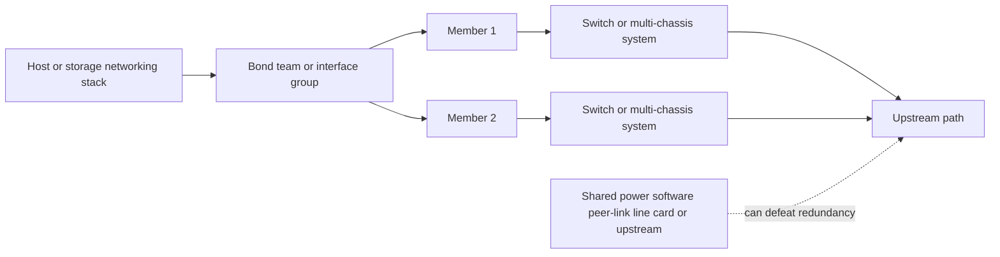

### Endpoint and switch agreement

Both sides must agree on aggregation type, membership, speed/duplex expectations, VLAN mode, MTU, and supported topology. A host must not send one static bundle to unrelated switches unless those switches present a supported common logical aggregation system or the host mode explicitly supports independent active/standby paths.

---

## 7. LACP negotiation and state

**Link Aggregation Control Protocol (LACP)** lets peer systems exchange actor/partner identity, key, port, and state information so compatible links can join a Link Aggregation Group (LAG). IEEE 802.1AX defines link aggregation; device displays and timers vary.

### Plain-English deep-dive: a convoy with membership cards

LACP is like two dispatch centers checking that trucks belong to the same convoy. Matching cards can place links into the same logical bundle. This prevents some mistakes, but it does not inspect every road beyond the immediate peer. A selected member can still lead to a broken upstream route.

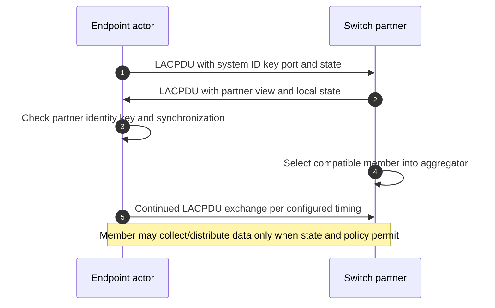

### LACP evidence fields

| Evidence | Question |
|---|---|
| Actor and partner system IDs | Is each side talking to the intended logical peer? |
| Actor and partner keys | Do all intended members belong to the same aggregation? |
| Selected/standby/individual state | Was the member admitted, waiting, or operating alone? |
| Synchronization, collecting, distributing | Is it aligned and permitted to receive/send data? |
| Fast/slow periodic mode | What detection/control cadence is configured and supported? |
| Churn, timeout, defaulted/expired state | Is control state unstable or missing? |
| Member speed/duplex/MTU/VLAN | Is the physical and forwarding configuration consistent? |

### What LACP does not prove

- That the switch pair is correctly configured as one multi-chassis logical system.
- That the peer link, upstream link, VLAN, route, firewall, or storage target is healthy.
- That one flow uses all member links.
- That traffic is evenly distributed.
- That both directions choose the same member.
- That failure detection is fast enough for the storage protocol or application timeout.

---

## 8. Hashing and per-flow bandwidth

An aggregation commonly chooses an egress member by hashing selected frame/packet fields. Inputs can include source/destination MAC, IP, transport ports, VLAN, or implementation-specific combinations. The result keeps a flow on one member to reduce reordering.

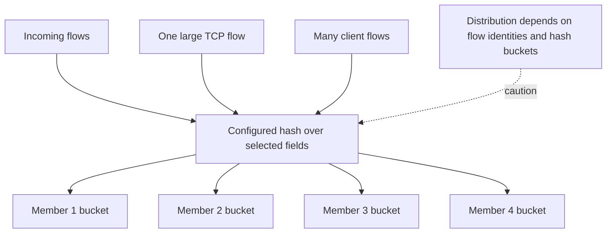

### Key consequence

A four-member 10 Gbit/s LAG can offer up to 40 Gbit/s aggregate raw capacity across suitable multiple flows, but one ordinary TCP flow will commonly remain limited to one selected 10 Gbit/s member before overhead and other limits. Some technologies can use multiple transport connections, but their exact behavior and support must be verified.

### Hashing example

Synthetic four-link LAG with eight flows:

| Member | Assigned flows | Offered demand |
|---|---:|---:|
| 1 | 1, 5, 8 | 16 Gbit/s |
| 2 | 2 | 2 Gbit/s |
| 3 | 3, 7 | 8 Gbit/s |
| 4 | 4, 6 | 5 Gbit/s |

Member 1 is oversubscribed even though total offered demand is 31 Gbit/s below the 40 Gbit/s aggregate label. Rehashing changes placement but can also disturb flow ordering; use vendor-supported behavior and controlled tests.

### Hash-distribution questions

- Which exact fields feed the hash at each endpoint/switch?
- Are most flows between one IP pair with similar ports?
- Is traffic bidirectional and independently hashed each way?
- Does the storage protocol create one or several TCP connections?
- Are receive-side queues, CPU affinity, virtual switches, or target interfaces limiting before the LAG?
- Do byte and packet counters show persistent member imbalance under a representative window?

---

## 9. Active/standby failover and link-versus-path health

Active/standby designs use one member and switch when a failure detector declares it unavailable. Detection can be based on carrier/link state, LACP state, address probes, upstream monitoring, or platform-specific mechanisms.

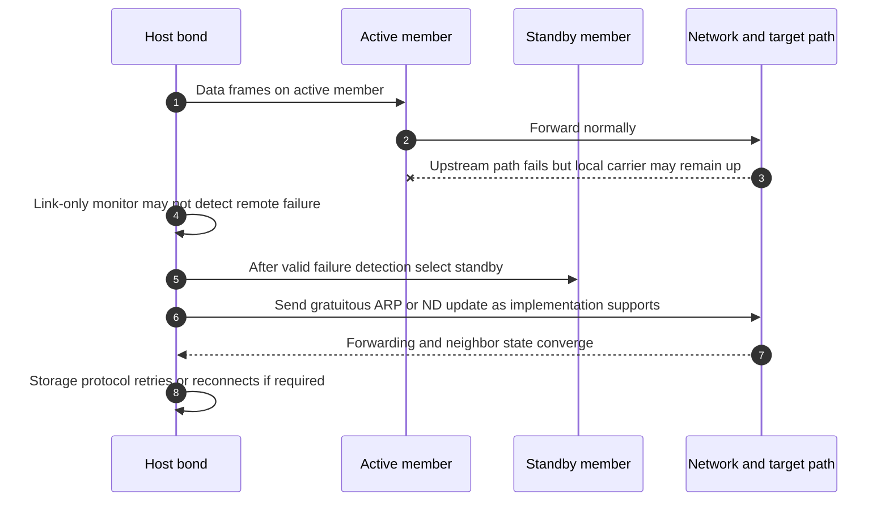

### Link health versus path health

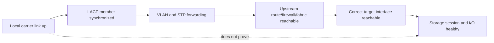

### Failover validation

Test only in an approved environment/window with owners and rollback:

1. Baseline active member, flows, counters, latency, and protocol state.
2. Confirm the exact injected failure and expected detector.
3. Measure detection, member selection, MAC/neighbor update, path recovery, session impact, and application impact.
4. Verify traffic moves to the intended physically independent path.
5. Restore the component deliberately and check failback policy; avoid uncontrolled oscillation.
6. Repeat for switch, member, upstream, target-port, and common-dependency failures that the design claims to tolerate.

---

## 10. MTU and jumbo frames across an Ethernet design

An endpoint MTU setting is not an end-to-end guarantee. Every physical NIC, bond/team/interface group, virtual switch, VLAN interface, switch port/LAG, router, firewall, overlay/tunnel, and target interface on every active and failover path must support the intended packet size.

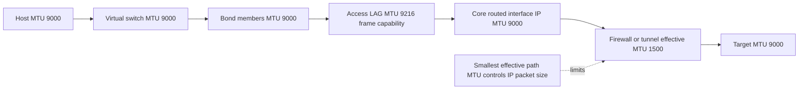

### Why switch numbers differ

Some products report Layer 3 IP MTU; others report maximum Ethernet frame, payload, or `jumbo` size. VLAN tags and encapsulations add bytes. Compare definitions, not just the number `9000`.

### MTU validation table

| Test | Supports | Caveat |
|---|---|---|
| Small ping/echo | Basic path | Does not test intended large packet. |
| Sized probe with no-fragment behavior | Path-size orientation | Syntax/behavior varies; security devices may treat probes differently. |
| TCP handshake MSS | Endpoint offer | Does not discover every smaller interior hop alone. |
| Representative storage I/O | Application-relevant path | Can hide retries; collect packet and application evidence. |
| Switch oversize/giant/drop counters | Link/device behavior | Counter definitions and reset times vary. |
| Failover-path test | Alternate path consistency | Must be planned; normal path success proves nothing about standby. |

Jumbo frames can reduce packets per transferred byte and processing overhead under some workloads. They can also enlarge loss impact, expose configuration mismatch, and provide little benefit when CPU, storage, flow count, or another bottleneck dominates. Measure before and after; do not recommend jumbo MTU as a universal storage best practice.

---

## 11. Ethernet flow control and Priority Flow Control

**IEEE 802.3x link-level flow control** can use pause frames to ask a peer to stop transmitting temporarily on a link. **Priority-based Flow Control (PFC)** can pause selected traffic priorities in Data Center Bridging (DCB) environments. Exact support and safe use depend on a coordinated design.

### Plain-English deep-dive: stopping traffic before the waiting room overflows

Pause is like closing a road entrance because one waiting room is full. It can prevent a local drop, but stopped traffic and queues move backward. Broad pause can delay unrelated traffic; PFC narrows the pause to a priority but can still propagate congestion and create deadlock or head-of-line effects if the complete design is wrong.

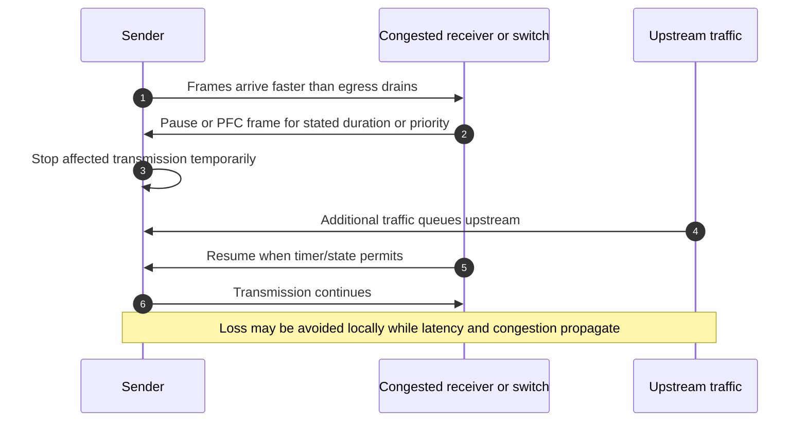

### Flow-control cautions

- Do not enable pause/PFC independently on one endpoint to `fix drops`.
- Confirm symmetric/compatible settings, QoS classification, buffer design, congestion notification, and vendor support.
- Monitor pause received/transmitted by priority, duration/frequency where available, queue depth, drops, and application latency.
- A rising pause count identifies congestion control activity, not automatically a faulty link.
- PFC is associated with lossless-class designs such as some Fibre Channel over Ethernet deployments, but `lossless` is an engineered behavior and operational objective, not an absolute guarantee.
- TCP storage traffic can tolerate packet loss through retransmission but can still suffer severe latency under loss or pause storms.

---

## 12. QoS, DSCP, CoS/PCP, queues, and caveats

**Quality of Service (QoS)** classifies traffic and applies treatment such as queue selection, scheduling, bandwidth allocation, shaping, policing, marking, or congestion management.

- **Differentiated Services Code Point (DSCP)** is a field in the IP header used for Layer 3 per-hop behavior classification.
- **Class of Service (CoS)** is an overloaded operational term; in Ethernet it often refers to the 3-bit 802.1Q **Priority Code Point (PCP)**.
- **Queue** is a waiting area for packets/frames competing for transmission or processing.
- **Shaping** delays traffic to fit a rate/profile; **policing** commonly drops or remarks traffic exceeding a profile.
- **Scheduling** decides which queue transmits next and under what weights/priorities.

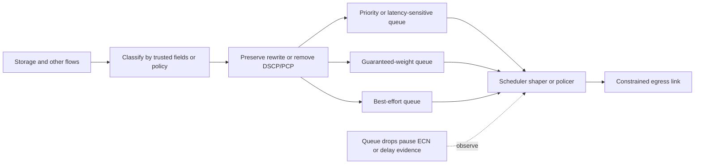

### QoS design questions

1. Which business/application objective requires differentiated treatment?
2. Where is traffic classified, and which source is trusted to mark it?
3. How are DSCP values mapped to PCP and hardware queues at each hop?
4. What bandwidth, burst, latency, loss, and starvation behavior applies?
5. Are storage control and data flows classified consistently?
6. What happens at tunnel, firewall, cloud, provider, or untrusted boundaries?
7. Which counters prove queue use, drops, remarking, shaping, policing, or starvation?
8. Can strict priority starve lower classes, and what guardrails exist?

QoS does not create bandwidth. It chooses how scarcity is shared. Marking every storage packet as highest priority can move harm to DNS, authentication, management, backup, or other critical services.

---

## 13. Redundancy, common fate, and blast radius

Count independent failure domains, not cables.

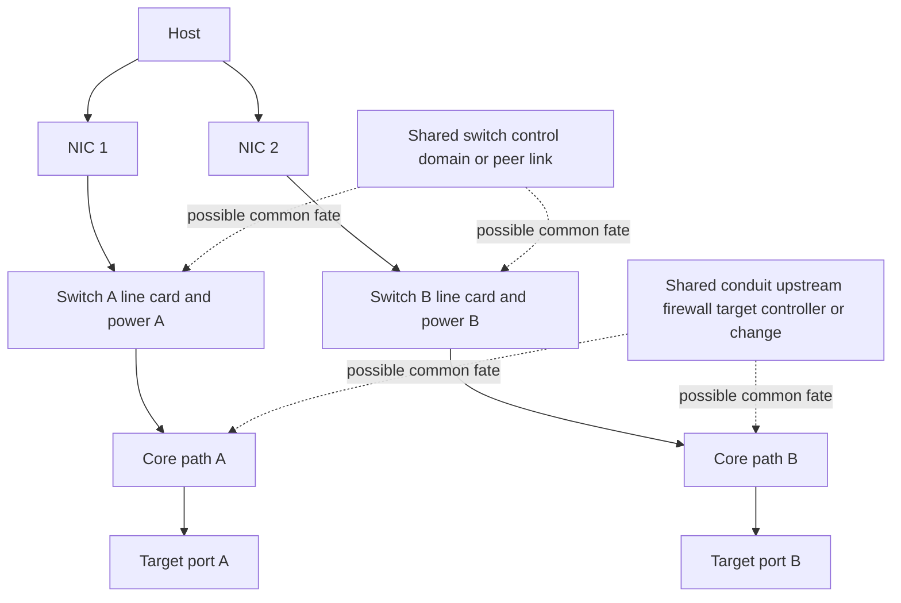

### Redundancy review table

| Domain | Questions |
|---|---|
| Host | Separate NICs/adapters, drivers, PCIe roots, virtual switches, and CPU/NUMA effects? |
| Cabling/optics | Separate cables, optics, patch panels, conduits, and labels? |
| Switch | Separate chassis, line cards, supervisors/control planes, software domains, and power? |
| Multi-chassis system | What depends on peer link, keepalive, consistency database, split-brain handling, and common upgrade? |
| Upstream | Separate routed paths, firewalls, load balancers, tunnels, providers, and QoS bottlenecks? |
| Target | Separate ports, adapters, nodes/controllers, VLANs, interfaces, and protocol sessions? |
| Operations | Can one template, automation, credential, change, or human error affect both paths? |
| Monitoring | Does detection cover path failure, not merely local carrier? |

### Availability claim format

Avoid `redundant network`. Say:

> "The design has two endpoint links terminating on separate switch chassis and target ports. Independence of switch control software, power, upstream firewall, target node, and change process remains to be verified. The approved failover test demonstrated recovery from one member-link loss within the measured application tolerance; it did not test chassis, peer-link, or site failure."

---

## 14. LLDP, physical evidence, and switch counters

**Link Layer Discovery Protocol (LLDP)** lets directly connected devices advertise identity and capabilities. It can help map chassis, port, system name, management address, VLAN, and other Type-Length-Value (TLV) information. It is discovery evidence, not authorization or proof that cabling labels are correct.

### LLDP mapping flow

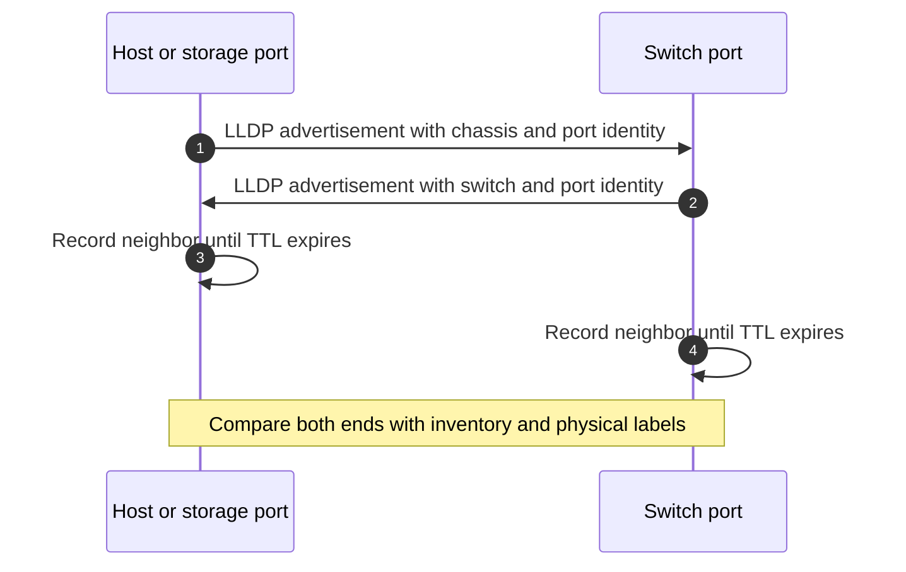

### Physical and link counters

| Evidence | Orientation | Caution |
|---|---|---|
| Link up/down transitions | Physical/link-state changes | Record counter reset/uptime and whether admin changes occurred. |
| Speed and duplex | Negotiated/configured mode | Duplex mismatch is more associated with legacy/misconfigured scenarios; verify rather than assume. |
| CRC/FCS errors | Frames failed integrity check | Often physical signal/cable/optic/NIC; localize by direction and port, but one counter does not name root cause. |
| Alignment/runt/giant/oversize | Frame size/format anomalies under device definitions | Definitions vary; jumbo-valid frames may be counted differently. |
| Input/output errors | Aggregate categories | Expand to component counters and vendor definitions. |
| Discards/drops | Frame discarded despite no bit error | Can be congestion, policy, VLAN, STP, buffer, MTU, or resource behavior. |
| Pause/PFC | Flow-control activity | Correlate with queue/drops/latency and traffic class. |
| LACP churn/member state | Aggregation control instability | Correlate both peers and cabling/config changes. |
| STP topology changes | Loop-free topology recalculation | Check instance/VLAN, trigger, frequency, and traffic impact. |
| Optical transmit/receive power | Physical signal telemetry where supported | Compare with optic/vendor thresholds, lane, temperature, and history; do not invent universal levels. |

### Counter discipline

1. Record device, interface, direction, counter definition, timestamp, uptime/reset time, and collection interval.
2. Calculate deltas and rates; cumulative totals without time context can describe an old incident.
3. Compare both ends of a link. A receive CRC error is observed by the receiver; the cause can be transmitter, media, optic, or receiver path.
4. Normalize bytes/bits/packets carefully and separate unicast/multicast/broadcast.
5. Correlate with traffic demand, queue state, application latency, and changes.
6. Preserve configuration and operational state; intended config can differ from selected/forwarding state.

---

## 15. Performance math and evidence-based capacity

### Link-rate conversion

For a 25 Gbit/s link:

$$
25\ Gbit/s\div8=3.125\ GB/s
$$

This is decimal raw bit/byte conversion. It does not mean an application transfers 3.125 GB/s.

### Aggregate versus single-flow example

Four 25 Gbit/s members:

$$
aggregate\ raw\ rate=4\times25=100\ Gbit/s
$$

One flow commonly hashes to one member:

$$
single\ flow\ upper\ link\ bound\approx25\ Gbit/s
$$

before all overhead and endpoint constraints.

### Packet-rate orientation

Using a simplified 84 bytes of wire time for a minimum 64-byte frame plus 8-byte preamble/SFD and 12-byte interpacket gap:

$$
pps_{10G}\approx\frac{10{,}000{,}000{,}000}{84\times8}\approx14.88\ million\ frames/s
$$

Small frames create far more packets, interrupts, descriptors, and queue operations per byte than large frames. Actual device accounting and Ethernet variants must be checked.

### Utilization and microbursts

A one-minute average of 20% does not exclude a 100-microsecond queue overflow. A **microburst** is a short traffic burst that exceeds egress service/buffer capacity but may disappear in coarse averages. Evidence can include high-resolution queue telemetry, drop deltas, packet capture timing, and correlated sender bursts.

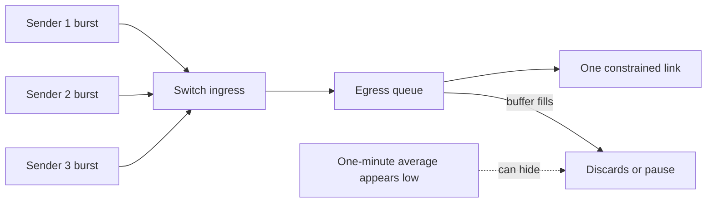

### Performance recommendation rule

Never recommend more links merely because aggregate utilization is high or low. Identify flow count, hash distribution, member saturation, queue drops, packet size, endpoint CPU/queues, storage protocol concurrency, target demand, failure-state capacity, and business objective.

---

## 16. TAM discovery, supportability, risk, and recommendation

### Discovery questions

#### Business and workload

1. Which storage protocols, applications, data sets, and service objectives use this fabric?
2. What are normal/peak throughput, packets per second, flow count, I/O size, burstiness, and latency tails?
3. What happens during backup, replication, failover, maintenance, or degraded-member operation?

#### Endpoint and fabric

4. Draw client/host NICs, bonds/teams, virtual switches, physical switches, trunks, LAGs, routers, target interface groups, and storage services.
5. Record speed, duplex, VLAN, tagging, MTU, LACP mode/key/member state, hash, STP instance/role, LLDP neighbor, QoS, pause/PFC, and counters.
6. Which links are active, standby, selected, blocked, or individual, and why?

#### Redundancy and failure domains

7. Are adapters, line cards, chassis, power, software/control planes, peer links, upstream devices, conduits, target ports/nodes, and operations independent?
8. Which failure detector notices local link, peer, upstream, and end-to-end path failure?
9. What failover and failback were tested with representative I/O, and what was application impact?

#### Evidence and supportability

10. Which host, NIC, driver, firmware, switch, optic, target, ONTAP, protocol, and multipath versions form the exact combination?
11. Which official source/IMT result and notes validate it, on what date, and what is inaccessible or unverified?
12. What counter definitions, reset times, sampling intervals, packet captures, and clock offsets apply?

#### Change and ownership

13. Who owns host, virtualization, switch, security, routing, storage, application, and change decisions?
14. What safe test can disconfirm the leading hypothesis, and what are stop/rollback criteria?
15. What residual risk remains after the proposed change?

### Evidence-to-recommendation flow

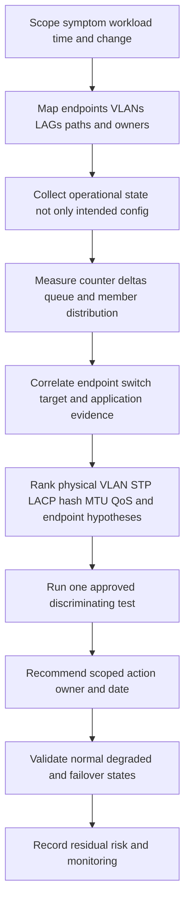

### Recommendation examples

| Evidence-backed finding | Risk | Bounded recommendation | Validation |
|---|---|---|---|
| One LAG member carries 95% of bytes because one large flow hashes there | Single-flow/member ceiling; aggregate label misleads planning | Validate application/protocol support for multiple flows or redesign demand; do not change hash blindly | Representative flow/member counters and end-to-end performance |
| Standby member is link-up but wrong VLAN is operationally allowed | Failover path cannot reach storage | Correct matched endpoint/switch VLAN configuration under change control | Failover test, ARP/ND, protocol I/O, both-end counters |
| CRC errors rise only on one receiver port | Physical integrity exposure | Inspect supported optic/cable/transmitter/receiver path and replace the verified faulty component | Error delta stops under representative load; peer counters and optical levels reviewed |
| PFC pauses increase with latency but no drops | Congestion is propagating | Review full DCB class/buffer design with network and storage SMEs; do not disable PFC unilaterally | Priority queue/pause/delay evidence and supported design test |
| Both links share one switch power/control domain | Redundancy claim exceeds tested independence | Document common fate and evaluate physically/control-plane independent design based on RTO and cost | Updated topology, approved design, failure-injection evidence |

### Explicit JD Mapping

| JD responsibility | Part 12 contribution | Arti's strength and honest gap |
|---|---|---|
| Understand customer environment | Produces endpoint-to-switch-to-target topology, VLAN/LAG state, and failure domains | **Strength:** Windows/Azure network dependency mapping. **Gap:** production storage-fabric ownership is unproven. |
| Analyze customer data | Uses FDB, LLDP, LACP, STP, counters, queues, captures, and timelines | **Strength:** evidence correlation and analytics transfer. |
| Storage/network depth | Explains Ethernet framing, VLANs, aggregation, MTU, QoS, and redundancy | **Conceptual/lab:** no production NetApp interface-group claim. |
| Mitigate risk and stability | Tests standby paths, common fate, congestion, physical errors, and MTU consistency | **Strength:** CRITSIT risk method. **Gap:** exact changes require network/storage SMEs and current support evidence. |
| Supportability | Inventories NIC/driver/firmware/switch/optic/storage combinations and IMT evidence | **Gap:** no current customer IMT result or gated tool access claimed. |
| Operational service reviews | Converts fabric evidence into impact, options, owners, and validation | **Strength:** business review and executive communication. |
| Preventative action tracking | Defines failover tests and remediation with dates and residual risk | **Strength:** escalation/action follow-through. |

### Honest production-gap statement

> "I can explain Ethernet forwarding, VLANs, LACP, hashing, MTU, QoS, counters, and failure domains, and I have production Windows/Azure network troubleshooting and escalation experience. I have not designed or administered a NetApp production Ethernet storage fabric or ONTAP interface group. In customer work I would collect read-only operational evidence, verify the exact supported topology and versions, and have network and storage owners review any change and failover test."

---

## 17. Fully synthetic case: BlueYonder Engineering path imbalance

> **Synthetic case:** BlueYonder Engineering, all devices, counters, VLANs, workloads, and outcomes are fictional. No NetApp product behavior or customer result is asserted.

### Environment

- Eight Linux compute hosts read large files over a fictional NFS service.
- Each host has a two-member 25 Gbit/s LACP bond to a multi-chassis switch pair.
- The storage endpoint has a four-member 25 Gbit/s interface group.
- VLAN 310 carries storage data; endpoint IP MTU is 9000.
- The customer reports that aggregate throughput plateaus near 25 Gbit/s for one job, while other members appear idle.
- During a maintenance test, one path loses I/O even though the host bond remains up.

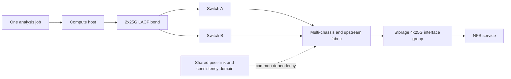

### Evidence

| Evidence | Observation | Bounded interpretation |
|---|---|---|
| Job trace | One TCP connection carries almost all data | One-flow hashing can select one member; not proof of storage saturation. |
| Host member counters | Member 1 near 24 Gbit/s, member 2 below 1 Gbit/s | Distribution matches one dominant flow plus control traffic. |
| Storage member counters | One receive member dominant for that flow; other clients use others | LAG supplies aggregate multi-flow capacity but not one-flow striping. |
| LACP state | All intended members synchronized, collecting, distributing | Immediate aggregation state appears healthy. |
| Maintenance event | Switch peer-link disruption isolates one VLAN forwarding path while local LACP remains selected | Local LACP does not prove upstream multi-chassis path health. |
| VLAN operational state | VLAN 310 suspended/blocked on one side during inconsistency event | Explains path failure mechanism in the synthetic case. |
| Physical counters | No CRC/FCS errors | Weakens a physical-integrity hypothesis for this event. |
| MTU probes | Intended size succeeds on stable paths | No current MTU evidence; do not call it causal. |

### Competing hypotheses

| Hypothesis | Evidence for | Evidence against/missing | Discriminating check |
|---|---|---|---|
| Storage controller limit | Throughput plateaus | Other hosts concurrently use other members; target service time remains low | Target CPU/queue/protocol counters versus member limit |
| One-flow LAG limit | One TCP flow and one 25G member dominate | Need exact hash and endpoint constraints | Add supported multiple independent test flows; compare member distribution |
| Bad cable/optic | One path failed | No physical errors; failure aligns with VLAN consistency event | Both-end physical counters/optics and controlled link test |
| MTU mismatch | Large storage workload | Intended-size probes succeed on stable path | Simultaneous path capture during both active paths |
| Multi-chassis control/common-fate issue | VLAN suspended during peer event while LACP local state remains up | Requires exact vendor design/log review | Control logs, topology, peer state, consistency checks, vendor SME |

### Failure tree

```mermaid
flowchart TD
    TOP[Throughput near one member and failover path outage] --> SPLIT{Same mechanism for both symptoms?}
    SPLIT -->|Not assumed| PERF[Analyze throughput]
    SPLIT -->|Not assumed| FAIL[Analyze failover]
    PERF --> FLOWS{One or many transport flows?}
    FLOWS -->|One| HASH[Check hash and one-member ceiling]
    FLOWS -->|Many| DIST[Check distribution queues endpoints and target]
    FAIL --> LOCAL{Local link and LACP stay healthy?}
    LOCAL -->|No| MEMBER[Member or peer negotiation failure]
    LOCAL -->|Yes| UP[Check VLAN STP multi-chassis and upstream path]
    UP --> COMMON[Identify peer-link/control common fate]
    HASH --> TEST[Supported multi-flow test]
    COMMON --> DESIGN[Vendor-supported topology/design review]
```

### Recommendations

1. **Performance:** Treat 25 Gbit/s as the current one-flow link ceiling before overhead. Application and storage owners should determine whether the workload and supported protocol implementation can use several independent connections or clients. Validate with controlled multi-flow tests and member/target counters.
2. **Resilience:** Network owner and switch vendor specialist should review the multi-chassis peer/consistency failure and VLAN 310 behavior against the exact platform/software design. Do not infer end-to-end health from LACP alone.
3. **Evidence:** Preserve running and operational configuration, LACP partner/state, VLAN consistency, STP, peer-link status, synchronized logs, FDB movement, and application protocol timeline.
4. **Risk:** Record that local member redundancy shares a multi-chassis control/peer dependency until a supported design and representative failure test prove the intended RTO.
5. **Validation:** Test one member, one chassis/control scenario, peer-link scenario as vendor-approved, upstream path, and target port while measuring application I/O and recovery.

### Customer-facing summary

> "The throughput and failover symptoms have different supported mechanisms in the current evidence. The throughput test uses one dominant TCP flow and therefore hashes to one 25 Gbit/s member; the aggregate LAG label does not make that flow 50 or 100 Gbit/s. The maintenance outage occurred while local LACP remained selected but VLAN forwarding changed during a multi-chassis peer event, exposing a shared control dependency. We recommend a supported multi-flow performance test and a separate vendor-reviewed resilience correction and failure test, with no claim that adding links alone resolves either issue."

---

## 18. Troubleshooting workflow and escalation pack

### Layered workflow

```mermaid
flowchart TD
    S[Scope application flow time and change] --> P[Physical link speed optics CRC and transitions]
    P --> E[Ethernet VLAN FDB STP and security state]
    E --> A[Aggregation LACP members keys and hash]
    A --> M[MTU path consistency and counters]
    M --> Q[QoS queues pause PFC drops and utilization]
    Q --> R[Redundancy path and common-fate test]
    R --> C[Correlate host switch target and protocol evidence]
    C --> T[One safe discriminating test]
    T --> V[Validate normal degraded failover and residual risk]
```

### Minimum escalation pack

- Business service, storage protocol, symptom, impact, objective, affected clients/targets, and UTC timeline.
- Logical and physical topology: host NICs/teams, virtual switches, cables/optics, switch ports/chassis/line cards, trunks/LAGs, upstream devices, target ports/interface groups, and failure domains.
- Data/control/management planes and owner/RACI map.
- Host/storage OS or release, NIC/adapter, driver, firmware, switch platform/software, optic/cable type, protocol, and exact IMT/current support evidence or gap.
- VLAN access/trunk/native/tagging configuration and operational allowed/forwarding state on every hop.
- STP variant, instance, root, role/state, topology changes, and relevant logs.
- LACP actor/partner IDs, keys, selected/synchronized/collecting/distributing state, timers, churn, and member status at both peers.
- Hash algorithm and per-member byte/packet/flow distribution under a representative interval.
- MTU definition/value at every endpoint, virtual/physical link, route, tunnel, and failover path; sized-probe and packet evidence.
- QoS classification/marking, DSCP-PCP-queue mapping, scheduler/shaper/policer, pause/PFC, queue drops, and burst evidence.
- Physical speed/duplex, CRC/FCS, discards, transitions, optical readings, FDB/LLDP, reset/uptime, and counter deltas.
- Packet captures with location/filter/offload/clock/privacy caveats and storage protocol/app timing.
- Failures injected or observed, detector, convergence, MAC/neighbor movement, application/session effect, recovery/failback, and residual common fate.
- Actions tried, results, rollback, competing hypotheses, next test, exact specialist ask, owner, and decision deadline.

---

## 19. Paper lab and whiteboard drills

No production access is required. Use paper, synthetic tables, public documentation, or an isolated authorized lab.

### Paper lab scenario

A fictional storage service uses VLAN 420 over two 10 Gbit/s links from each of four clients and four 25 Gbit/s target links. Client bonds use LACP. One client has one VLAN allowed only on switch A. Both client links show `up`; switch B's member is LACP synchronized but does not forward VLAN 420. MTU is 9000 at endpoints, 9216 maximum frame on switches, and 1500 on a hidden routed firewall path used only during failover. A backup burst causes egress drops and PFC pause on one priority. The customer calls the design `fully redundant and 100 Gbit/s`.

### Tasks

1. Draw physical and logical topology, all VLANs, LAGs, paths, target ports, and owners.
2. Draw data, control, and management planes.
3. Draw an Ethernet frame and identify VLAN/PCP, MAC, EtherType, payload, and FCS.
4. Simulate FDB learning for one client-target exchange.
5. Explain broadcast, multicast, unknown unicast, and normal unicast treatment.
6. Compare access, trunk, tagged endpoint, and native-VLAN handling.
7. Build the VLAN fault tree for switch B.
8. Draw STP roles and state for the intended topology.
9. Reconstruct LACP actor/partner/key/member evidence at both ends.
10. State the likely per-flow and aggregate raw link ceilings.
11. Create a synthetic hash table for 12 flows and calculate member imbalance.
12. Map link-health and path-health detectors.
13. Reconcile 9000 IP MTU with each platform's frame-size definition and failover path.
14. Explain pause/PFC propagation and distinguish it from physical loss.
15. Map DSCP to PCP/queues and identify starvation/drop risks.
16. List at least ten shared failure domains and score evidence confidence.
17. Calculate wire-rate orientation for small and large frames.
18. Build normal, member-loss, switch-loss, peer-link, upstream, target-port, and MTU failure tests.
19. Write a customer recommendation with evidence, context, risk, action, owner/date, validation, and residual risk.
20. Produce the escalation pack and a two-minute whiteboard briefing.

### Calculation checks

Four target members at 25 Gbit/s:

$$
4\times25=100\ Gbit/s\ aggregate\ raw\ label
$$

One normally hashed flow:

$$
upper\ member\ bound\approx25\ Gbit/s\ before\ overhead
$$

Two client members at 10 Gbit/s:

$$
20\ Gbit/s\ aggregate\ raw\ across\ suitable\ flows,\ not\ one-flow\ striping
$$

### Whiteboard drills

1. **Frame in 60 seconds:** Draw fields and explain capture/FCS limits.
2. **Switch decision:** Learn source, look up destination, apply VLAN/STP/LAG/QoS, forward or drop.
3. **VLAN mismatch:** Explain why link-up and LACP-up can coexist with no storage traffic.
4. **One flow:** Explain why four links do not multiply one TCP flow automatically.
5. **Link versus path:** Draw five stages beyond carrier.
6. **MTU:** Find the smallest doorway on normal and failover paths.
7. **Redundancy:** Replace cable count with failure-domain evidence.
8. **Executive answer:** Explain risk and next decision without drowning the customer in counters.

### Lab completion criteria

- [ ] Frame, FDB/CAM, traffic type, VLAN, STP, aggregation, and physical terms are correctly scoped.
- [ ] Intended configuration and operational forwarding state are separate.
- [ ] LACP negotiation and hashing are not confused with bandwidth multiplication.
- [ ] Active/standby detection includes upstream path failure.
- [ ] MTU uses consistent IP/frame definitions and includes failover/tunnel paths.
- [ ] Pause/PFC/QoS include congestion-propagation and starvation caveats.
- [ ] Counter deltas include reset time, direction, definitions, and sampling.
- [ ] Redundancy claims list untested common fate.
- [ ] Supportability remains pending current exact evidence.
- [ ] Recommendations are owned, testable, reversible where possible, and honest.

---

## 20. Self-test

1. Define Ethernet, NIC, switch, bridge, port, fabric, broadcast domain, and failure domain.
2. Draw data, control, and management planes for Ethernet storage.
3. Draw an Ethernet frame and orient on every important field.
4. Compare unicast, multicast, broadcast, and unknown unicast forwarding.
5. Explain source-MAC learning and FDB/CAM aging/movement.
6. Explain access, trunk, tagged endpoint, allowed VLAN, and native VLAN.
7. Diagnose a native/access/trunk mismatch with operational evidence.
8. Explain why VLAN segmentation is not a complete security control.
9. Explain STP, BPDU, root bridge, port roles, blocked path, and topology change.
10. Compare active/standby, static aggregation, and dynamic LACP.
11. Draw LACP actor/partner negotiation and interpret selected/synchronized/collecting/distributing.
12. Explain what LACP proves and does not prove.
13. Explain hashing and why one flow normally uses one member.
14. Calculate aggregate and per-flow link bounds.
15. Diagnose an imbalanced bundle from flow/member counters.
16. Distinguish local link health from end-to-end path health.
17. Design safe failover and failback tests.
18. Reconcile IP MTU, Ethernet maximum-frame values, VLAN tags, and tunnel overhead.
19. Explain benefits and risks of jumbo frames.
20. Explain 802.3x pause and PFC, including congestion propagation.
21. Define QoS, DSCP, PCP/CoS, queue, scheduling, shaping, and policing.
22. Explain why QoS cannot create bandwidth and strict priority can harm other services.
23. Identify common-fate risks across endpoint, switch, upstream, target, and operations.
24. Use LLDP and FDB to validate a topology without treating them as infallible.
25. Interpret CRC, discards, pause, LACP churn, STP change, and optical telemetry.
26. Calculate wire-rate orientation and explain microbursts.
27. Ask the complete TAM discovery set and build a seven-part recommendation.
28. Recreate BlueYonder's performance and resilience analysis as separate workstreams.
29. Build the minimum escalation pack.
30. State Arti's production strengths and Ethernet-storage production gap honestly.

---

## 21. Official Source Anchors

**Date checked: 2026-08-24.** IEEE working-group pages and public standards overviews anchor the concepts below; full standards text, amendments, and adopted editions can have access restrictions. Implementations can support only specific modes or add platform behavior. Verify current standard editions, product documentation, release notes, and exact NetApp IMT results. Do not invent a switch, NIC, ONTAP, DCB, or interoperability support matrix.

| Topic | Official public source | Access, version, and use note |
|---|---|---|
| Ethernet | [IEEE 802.3 Ethernet Working Group](https://www.ieee802.org/3/) | Official public working-group area. Full current standards/amendments can require IEEE access; physical modes and counters are implementation-specific. |
| Bridging, VLANs, and priority | [IEEE 802.1Q project and standards information](https://1.ieee802.org/bridges/802-1q/) | Official IEEE 802.1 public area. Exact current edition/amendments and full text may have access constraints. |
| Link aggregation and LACP | [IEEE 802.1AX Link Aggregation](https://1.ieee802.org/tsn/802-1ax-rev/) | Official project area. Device behavior, multi-chassis design, hash, and supported topology require vendor validation. |
| LLDP | [IEEE 802.1AB LLDP](https://1.ieee802.org/maintenance/802-1ab/) | Official project/maintenance area. Available TLVs and display behavior vary by product. |
| Data Center Bridging | [IEEE 802.1 Data Center Bridging Task Group](https://1.ieee802.org/dcb/) | Official overview for DCB-related work. Full design requires exact standards and product guidance. |
| Priority-based Flow Control | [IEEE 802.1Qbb project information](https://1.ieee802.org/dcb/802-1qbb/) | Official public project area. PFC deployment must be validated as an end-to-end supported design. |
| Enhanced Transmission Selection | [IEEE 802.1Qaz project information](https://1.ieee802.org/dcb/802-1qaz/) | Official public project area. QoS mapping and bandwidth behavior are platform-specific. |
| IP QoS/DSCP architecture | [RFC 2474 - Definition of the Differentiated Services Field](https://www.rfc-editor.org/rfc/rfc2474), [RFC 2475 - An Architecture for Differentiated Services](https://www.rfc-editor.org/rfc/rfc2475) | IETF foundations with later updates. End-to-end treatment depends on every administrative domain. |
| NetApp network management | [ONTAP network management documentation](https://docs.netapp.com/us-en/ontap/network-management/) | Official public documentation area. Select exact release for ports, broadcast domains, VLANs, MTU, LIFs, and related behavior. |
| NetApp interface groups | [Combine physical ports to create interface groups](https://docs.netapp.com/us-en/ontap/networking/combine_physical_ports_to_create_interface_groups.html) | Official public ONTAP documentation. Modes, prerequisites, limitations, and procedures are release-sensitive. |
| NetApp VLANs | [Configure VLANs over physical ports](https://docs.netapp.com/us-en/ontap/networking/configure_vlans_over_physical_ports.html) | Official public ONTAP documentation. Validate exact release and topology before use. |
| NetApp host/network interoperability | [NetApp Interoperability Matrix Tool](https://imt.netapp.com/) | Official, potentially authentication-gated, and time-sensitive. Validate exact host, NIC, driver, firmware, switch, protocol, and storage combination plus notes. |
| Storage terminology | [SNIA Dictionary](https://www.snia.org/education/online-dictionary) | Vendor-neutral term orientation. It does not establish product support or design correctness. |

### Source-use discipline

- Record exact IEEE edition/amendment or vendor document/release; a project page is not the complete normative text.
- Compare operational state at both LACP/STP peers, not only configuration intent.
- Check switch multi-chassis, peer-link, split-brain, consistency, and upgrade behavior in exact vendor guidance.
- Interpret MTU/frame-size values by definition and include VLAN/tunnel overhead and failover paths.
- Validate pause/PFC/QoS as a complete system and monitor congestion side effects.
- Save dated IMT evidence and notes for exact combinations; standards compliance alone is not NetApp supportability.

---

## Likely Interview Questions

### Q1. How does an Ethernet switch learn and forward storage traffic?

> **Model answer:** "A switch learns each source MAC and ingress port within a VLAN and records it in the forwarding database, often called the CAM table operationally. It looks up the destination in the same VLAN: known unicast goes to the selected egress, while broadcast and normally unknown unicast are flooded to eligible ports. STP, VLAN, aggregation, security, QoS, queue, and port state can still permit or discard the frame. Ethernet forwards local frames; it does not understand the NFS, SMB, iSCSI, or NVMe operation inside."

**Follow-up depth:** Draw frame fields, explain MAC aging/movement, unknown-unicast flooding, and why packet capture may not show bad FCS frames.

### Q2. Explain VLAN access ports, trunks, tags, and native-VLAN mismatch.

> **Model answer:** "A VLAN is a logical Layer 2 broadcast domain. An access port normally maps untagged endpoint traffic to one VLAN. A trunk carries several VLANs using 802.1Q tags, while a native-VLAN configuration defines how untagged trunk traffic is handled. Both ends must agree on mode, allowed VLANs, and untagged treatment. A mismatch can leave links and LACP up while ARP, storage traffic, or only one failover path fails."

**Follow-up depth:** Walk the fault tree using endpoint tags, FDB VLAN, operational trunk allow-list, STP state, and a failover-only VLAN omission.

### Q3. What problem does STP solve, and what should a storage analyst inspect?

> **Model answer:** "STP creates a loop-free active Layer 2 topology because Ethernet frames have no hop limit and loops can multiply traffic and destabilize MAC learning. I inspect the exact variant and instance, root bridge, port roles/states, blocked versus forwarding paths, BPDU/control events, topology changes, and convergence during failure. A blocked redundant link can be healthy and intentional; the real question is whether convergence and protocol recovery meet application tolerance."

**Follow-up depth:** Explain root/designated/alternate roles, MAC flooding after topology change, edge-port safety, and multi-chassis implications.

### Q4. How do LACP and hashing affect bandwidth and redundancy?

> **Model answer:** "LACP exchanges actor and partner identity, key, port, and state so compatible members can join a logical aggregation. Hashing then maps flows to members using configured fields, usually keeping one flow on one member to avoid reordering. Therefore four 25 Gbit/s links can supply up to 100 Gbit/s aggregate raw capacity across suitable flows, while one TCP flow commonly remains bounded by one 25 Gbit/s member. LACP validates immediate bundle state, not upstream path health or physical independence."

**Follow-up depth:** Interpret synchronized/collecting/distributing, explain member imbalance, and describe a supported multi-flow test.

### Q5. What is the difference between link health and path health?

> **Model answer:** "Link health says the local physical or aggregation relationship is operating. Path health adds VLAN and STP forwarding, upstream routes and security devices, target reachability, storage session state, and actual I/O. A cable can remain linked to a healthy switch while the upstream or target path is broken. I map the detector for each failure and validate failover with representative application traffic, not just carrier state."

**Follow-up depth:** Design tests for member, switch, peer-link, upstream firewall, target-port, and common configuration failures.

### Q6. How would you evaluate jumbo frames and MTU for storage traffic?

> **Model answer:** "I inventory the MTU definition and value on every host NIC, bond, virtual switch, physical switch port/LAG, routed interface, firewall, tunnel, failover path, and target interface. I distinguish IP MTU from maximum Ethernet frame size and include VLAN and tunnel headers. I use sized probes, captures, counters, and representative I/O on normal and standby paths. Jumbo frames may reduce packet-processing overhead, but they are not automatically faster and a partial deployment can create size-dependent failures."

**Follow-up depth:** Explain common 1500/9000 orientation, PMTUD, oversize counters, and why one successful ping is insufficient.

### Q7. How do flow control and QoS help or harm a storage network?

> **Model answer:** "Link pause or PFC can avoid local drops by stopping a peer or priority, but congestion and latency can propagate upstream and broad pause can block unrelated traffic. QoS classifies traffic into queues and applies scheduling, shaping, policing, or marking using fields such as DSCP and PCP. It cannot create capacity, and strict priority can starve other critical dependencies. I validate the full class, queue, buffer, and supported design and correlate pause, drops, queue depth, and application latency before changing it."

**Follow-up depth:** Distinguish 802.3x pause from PFC, DSCP from PCP, shaping from policing, and lossless objective from guarantee.

### Q8. How does your experience transfer to Ethernet storage analysis, and what remains unproven?

> **Model answer:** "My Microsoft escalation work gives me production experience with Windows and Azure networking, dependency mapping, evidence timelines, high-severity coordination, and customer communication. I can use that method to read Ethernet topology, forwarding, LACP, MTU, and counter evidence. I have not designed or operated NetApp interface groups or a production storage Ethernet fabric. I would verify current switch, NIC, host, protocol, and ONTAP support, collect read-only evidence, and work with network and storage owners on any change or failure test."

**Follow-up depth:** Give one factual network escalation example and separate the proven troubleshooting behavior from the unproven NetApp implementation.

---

## 30-Second Memory Hooks

- **Ethernet:** Local frames on a bridged domain; storage meaning lives above it.
- **FCS/CRC:** Hardware catches damaged frames; captures often never see them.
- **FDB/CAM:** Learn source location, look up destination.
- **Unknown unicast:** Flood first, learn from replies.
- **VLAN:** One logical broadcast room.
- **Access:** One untagged room; **trunk:** many tagged rooms.
- **Native mismatch:** The same unlabeled parcel enters different rooms.
- **STP:** Remove Layer 2 loops by keeping a loop-free forwarding tree.
- **Bond/team/interface group:** One logical interface over physical members.
- **LACP:** Membership negotiation, not end-to-end path proof.
- **Hash:** Many flows spread; one flow normally stays on one member.
- **Link up:** The nearest doorway works; the destination path may not.
- **MTU:** The smallest active or standby doorway controls packet size.
- **Pause/PFC:** Avoid a local drop by pushing waiting backward.
- **QoS:** Decide who waits under scarcity; it cannot make bandwidth.
- **DSCP:** IP marking; **PCP/CoS:** Ethernet priority marking.
- **Redundancy:** Count independent failure domains, not cables.
- **LLDP:** Neighbor's business card, not an authorization or uptime proof.
- **CRC versus discard:** Corruption versus policy/congestion/resource drop.
- **Microburst:** Short queue overflow hidden by long averages.
- **Arti's bridge:** Network escalation method is proven; storage-fabric production ownership is not.

---

## Completion Checklist

- [ ] Define Ethernet components, planes, broadcast domain, and failure domain.
- [ ] Draw Ethernet frame fields and explain capture/FCS limitations.
- [ ] Distinguish unicast, multicast, broadcast, and unknown unicast.
- [ ] Explain FDB/CAM learning, forwarding, flooding, aging, and MAC movement.
- [ ] Explain VLAN, access, trunk, tagged interface, allowed VLAN, and native VLAN.
- [ ] Diagnose VLAN mismatches using operational state rather than link state alone.
- [ ] Explain STP purpose, BPDU, root, roles/states, topology change, and convergence.
- [ ] Compare active/standby, static aggregation, LACP, and interface-group concepts.
- [ ] Reconstruct LACP actor/partner/key/member state from both peers.
- [ ] Explain hash inputs, member imbalance, aggregate capacity, and one-flow ceilings.
- [ ] Distinguish local link health from complete path and application health.
- [ ] Design member, switch, upstream, target-port, and common-fate failure tests.
- [ ] Validate MTU by definition across endpoints, switches, routes, tunnels, and failover paths.
- [ ] Explain jumbo benefits/caveats and avoid universal recommendations.
- [ ] Explain link pause, PFC, congestion propagation, and deadlock/head-of-line risk.
- [ ] Explain QoS, DSCP, PCP/CoS, queues, scheduling, shaping, policing, and starvation.
- [ ] Build a physical/control/operational common-fate inventory.
- [ ] Use LLDP, FDB, STP, LACP, physical, queue, and optical evidence with counter discipline.
- [ ] Calculate raw bit/byte rate, frame-efficiency orientation, packet rate, and LAG bounds.
- [ ] Diagnose microbursts without relying on coarse average utilization.
- [ ] Ask the complete TAM discovery set and write a seven-part recommendation.
- [ ] Recreate the BlueYonder case and keep performance and resilience causes separate.
- [ ] Complete the paper lab, whiteboard drills, self-test, and Q1-Q8 aloud.
- [ ] State Arti's production strengths and Ethernet-storage production gap honestly.
- [ ] Recheck IEEE edition/access, vendor releases, exact topology, and NetApp IMT before customer use.

---

*Next suggested section:* [Part 13 - IP Services: Subnets, Routing, DNS, DHCP, NTP, Firewalls, and Proxies](Part-13-ip-routing-dns-dhcp-ntp-firewalls.md)