# Part 13 - IP Services: Subnets, Routing, DNS, DHCP, NTP, Firewalls, and Proxies

> **Section goal:** Learn how an endpoint obtains an address, finds a route, resolves a name, trusts time and identity, crosses security devices, and reaches the intended storage service. By the end, Arti should be able to calculate IPv4 subnets, orient on IPv6, explain route and DNS decisions, trace DHCP and firewall state, identify proxy/VPN/load-balancer dependencies, and build a defensible layered escalation.

Covers index item **13** and maps directly to job-description responsibilities for understanding customer environments, technical and storage depth, data analysis, stability and risk mitigation, supportability, proactive recommendations, operational reviews, and high-pressure troubleshooting.

This Part is vendor-neutral. Exact route metrics, Equal-Cost Multipath (ECMP), address selection, DNS caching, DHCP options, time algorithms, firewall state, Network Address Translation (NAT), proxy inspection, Virtual Private Network (VPN), and load-balancer behavior vary by product, release, policy, and topology. Validate current implementation and NetApp Interoperability Matrix Tool (IMT) guidance for the exact end-to-end solution.

> **Evidence boundary:** Every organization, address, DNS record, route, packet, security rule, timing result, outage, and recommendation below is synthetic. Arti has production Windows, Azure, Active Directory, Microsoft 365, DNS/network dependency, and enterprise escalation experience. Production NetApp IP-storage design, customer firewall administration, or storage-network service ownership is not claimed.

---

## 1. The service path is larger than an IP address

A storage client may need local addressing, a route, name resolution, time, identity, policy permission, and an available service endpoint before one file or block request can succeed.

### Plain-English deep-dive: actors and planes

| Component | Plain meaning | Analogy | Why it matters |
|---|---|---|---|
| **Client/host** | Endpoint requesting storage service. | A traveler starting a journey. | Source address, route, DNS cache, clock, firewall, and application state originate here. |
| **Default gateway** | Router used when no more-specific direct route applies. | The exit from the local neighborhood. | Wrong or unavailable gateway prevents remote-subnet access. |
| **Router** | Device that selects a next hop using the destination IP and routing table. | A junction choosing the next road. | Route choice and return path shape reachability and latency. |
| **DNS resolver** | Service that obtains/caches name information for clients. | An information desk looking up an address. | A valid but stale/wrong answer can reach the wrong healthy endpoint. |
| **DHCP server/relay** | Service that leases configuration and can relay client broadcasts across networks. | Registration desk issuing an address and directions. | Incorrect options can break gateway, DNS, time, or route dependencies. |
| **Time service** | System that keeps clocks aligned within an operating tolerance. | A common railway clock. | Authentication, certificates, logs, replication, and incident correlation depend on time. |
| **Firewall** | Policy enforcement point that permits, rejects, or drops traffic and often tracks state. | A controlled checkpoint. | A route can exist while the connection is not authorized. |
| **Proxy** | Intermediary that terminates or forwards application traffic. | A mailroom sending packages on the user's behalf. | Client-to-proxy and proxy-to-service are separate connections and failure domains. |
| **Load balancer** | Service that selects or distributes among backend endpoints. | Reception sending visitors to available desks. | Front-end health does not prove every backend or health check is correct. |
| **VPN** | Protected logical connection across another network. | A guarded tunnel through public roads. | Encryption, encapsulation, routes, MTU, identity, and tunnel state add dependencies. |

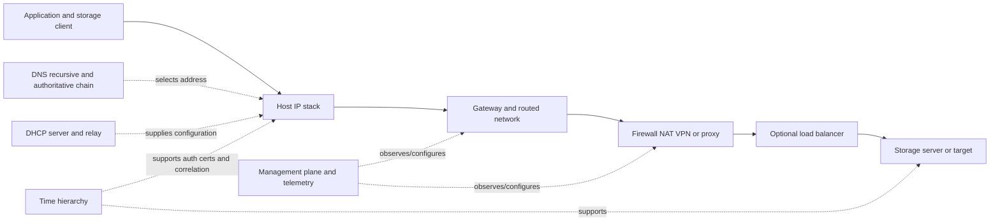

### Planes and failure domains

- **Data plane:** storage request/response packets.
- **Control plane:** routing protocols, neighbor discovery, DHCP, DNS, load-balancer health, VPN negotiation, authentication, and session setup.
- **Management plane:** configuration, monitoring, logs, automation, and administrative access.

A management interface reachable from an administrator does not prove the client data path. Two storage addresses behind one resolver, firewall pair, route domain, load balancer, certificate authority, or time source may share a failure domain.

---

## 2. IPv4 addresses, masks, prefixes, and subnet calculations

An IPv4 address is 32 bits. A **subnet mask** or **Classless Inter-Domain Routing (CIDR) prefix length** identifies the network-prefix bits; remaining bits identify addresses within that prefix.

### Plain-English deep-dive: street name and house number

`10.44.18.77/26` means the first 26 bits identify the subnet and the final 6 bits vary within it. **Analogy:** the prefix is the street; host bits are house numbers. **Why it matters:** the host decides whether to deliver directly on the local link or send to a router.

```mermaid
flowchart LR
    IP[IPv4 10.44.18.77] --> BITS[32 binary bits]
    PREFIX[/26 first 26 network bits] --> NET[Network 10.44.18.64]
    HOST[6 host bits] --> RANGE[Addresses .64 through .127]
    NET --> BROADCAST[Directed broadcast .127 under common subnet semantics]
    NET --> USABLE[Common host range .65 through .126]
```

### Core calculations

For prefix `/p`, address count is:

$$
addresses=2^{32-p}
$$

For `/26`:

$$
2^{32-26}=2^6=64\ addresses
$$

Traditional subnet orientation reserves the all-zero host pattern as the network address and all-one host pattern as directed broadcast, leaving:

$$
64-2=62\ common\ unicast\ host\ addresses
$$

Exceptions and special-purpose semantics exist, including `/31` point-to-point use and `/32` host routes. Do not apply `minus two` mechanically to every prefix.

### Mask conversion

`/26` has 26 one-bits:

```text
11111111.11111111.11111111.11000000
255.255.255.192
```

Block size in the changing octet:

$$
256-192=64
$$

Boundaries are 0, 64, 128, and 192. Address `10.44.18.77` lies in `10.44.18.64/26`.

### Subnet method

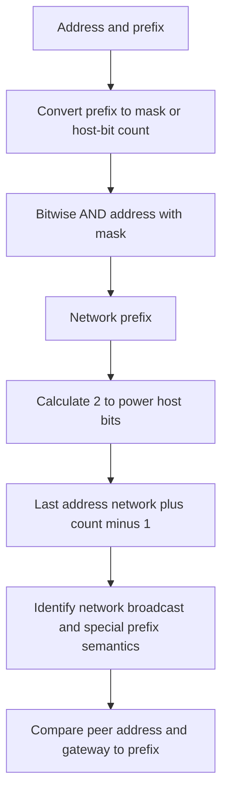

### Worked examples

| Input | Network | Last address | Common host range | Addresses |
|---|---|---|---|---:|
| `192.0.2.37/24` | `192.0.2.0` | `192.0.2.255` | `.1-.254` | 256 |
| `10.44.18.77/26` | `10.44.18.64` | `10.44.18.127` | `.65-.126` | 64 |
| `172.20.8.143/28` | `172.20.8.128` | `172.20.8.143` | `.129-.142` | 16 |
| `198.51.100.8/30` | `198.51.100.8` | `198.51.100.11` | `.9-.10` | 4 |
| `203.0.113.5/32` | `203.0.113.5` | Same | One host-route identity | 1 |

The example ranges use documentation prefixes and common semantics; they are not a customer design.

### Subnet failures

- Wrong mask makes a remote peer look local, causing unanswered ARP.
- Wrong mask makes a local peer look remote, sending traffic unnecessarily to a gateway.
- Gateway is outside the usable on-link prefix without an explicit mechanism.
- Overlapping routes or networks make path ownership ambiguous.
- Duplicate address creates intermittent neighbor changes.
- Static address uses the DHCP pool without reservation/exclusion coordination.

---

## 3. IPv6 orientation without treating it as large IPv4

IPv6 addresses are 128 bits and written in hexadecimal. Leading zeros can be omitted in each 16-bit group; one consecutive run of zero groups can be compressed with `::`.

| Term | Meaning | Storage-path relevance |
|---|---|---|
| **Global unicast** | Routable unicast address under current policy. | Can carry storage or service traffic where supported. |
| **Link-local** | Address in `fe80::/10`, used on the local link. | Neighbor Discovery and routing functions depend on link-local addresses. |
| **Multicast** | One-to-many group delivery; IPv6 has no broadcast. | Neighbor Discovery and service/control functions use multicast. |
| **Prefix length** | Number of network bits, commonly `/64` on many LANs. | Determines on-link behavior and addressing design. |
| **Router Advertisement (RA)** | ICMPv6 message conveying router/prefix/configuration information. | Blocking it can break address/default-router behavior. |
| **Neighbor Discovery (ND)** | ICMPv6 family for neighbors, routers, reachability, and more. | Required control traffic, not optional `ping noise`. |
| **Stateless Address Autoconfiguration (SLAAC)** | Host forms addresses from advertised information and local logic. | Can coexist with DHCPv6 depending on design. |
| **DHCPv6** | Stateful or information service for IPv6 configuration. | Its flow differs from IPv4 DHCP; default gateway normally comes from RA, not DHCPv6. |

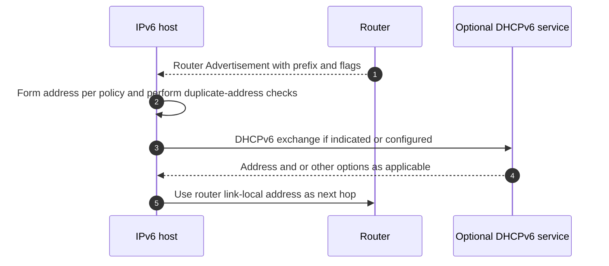

### Dual-stack caution

A name can return IPv4 `A` and IPv6 `AAAA` records. Address-selection and connection algorithms can make one client prefer a broken IPv6 path while another succeeds over IPv4. Record which address family and actual destination each application used; do not disable IPv6 as a first troubleshooting step.

---

## 4. Gateways, routing tables, metrics, and longest-prefix match

A routing table contains destination prefixes, next hops or on-link interfaces, route sources, metrics/preferences, and state. **Longest-prefix match** selects the route with the most matching destination bits before implementation-specific tie-breaking among equally specific candidates.

### Route-selection example

| Prefix | Next hop/interface | Prefix length | Matches `10.44.18.77`? |
|---|---|---:|---|
| `0.0.0.0/0` | Gateway A | 0 | Yes |
| `10.0.0.0/8` | Gateway B | 8 | Yes |
| `10.44.0.0/16` | Gateway C | 16 | Yes |
| `10.44.18.64/26` | Interface D | 26 | Yes, selected as most specific |
| `10.44.18.77/32` | Gateway E | 32 | Yes, would supersede `/26` if active/valid |

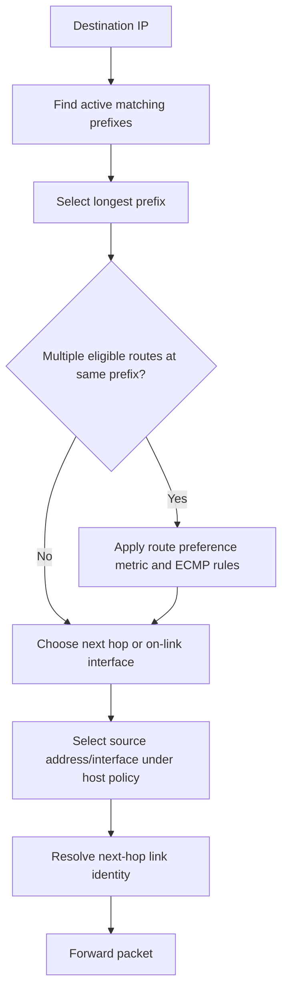

### Default gateway

The default route `0.0.0.0/0` or `::/0` matches destinations not covered by a more-specific route. A host does not necessarily use the default gateway for every remote address; policy routes, host routes, VPN routes, and more-specific networks can win.

### ECMP and hashing

**Equal-Cost Multipath (ECMP)** allows several next hops for the same prefix and preference. Devices commonly hash flows over header fields to keep packets ordered, but exact algorithms, resilience, and rehash behavior vary.

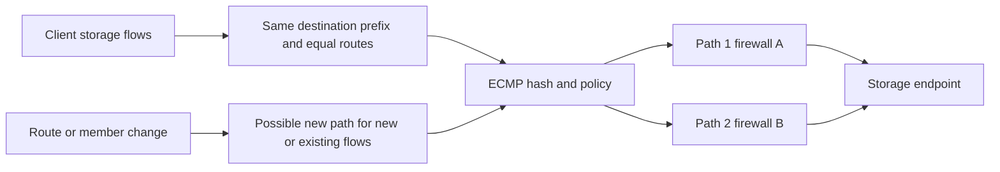

### Asymmetric routing

An **asymmetric path** means forward and return packets traverse different devices or links. IP permits this, but stateful firewalls, NAT, VPNs, packet capture, QoS, and troubleshooting may assume or require related state on both directions.

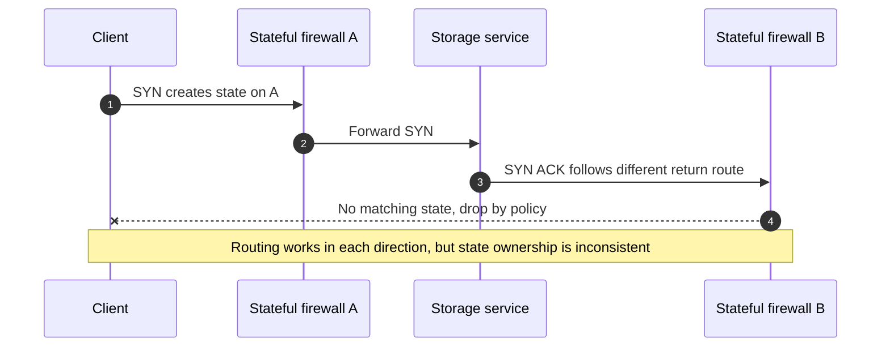

Asymmetry is not automatically wrong. Determine whether the devices and policies support it, whether state is synchronized, and whether captures observe both paths.

---

## 5. DNS recursive resolution, authority, caches, and TTL

The **Domain Name System (DNS)** is a distributed database. A client commonly sends a query to a recursive resolver. If the answer is not cached, the resolver follows referrals toward the authoritative server for the requested name.

### Plain-English deep-dive: librarian, directory publishers, and cached notes

- A **stub resolver** is client-side logic that asks configured DNS resolvers. **Analogy:** a person asking the library desk. **Why it matters:** local cache/search behavior can change the query.
- A **recursive resolver** obtains the answer on the client's behalf and caches it. **Analogy:** the librarian searches several catalogs for you. **Why it matters:** clients behind different resolvers can receive different cached answers.
- An **authoritative server** publishes records for a DNS zone. **Analogy:** the office that owns the official directory page. **Why it matters:** authority and recursion are different roles.
- **Time To Live (TTL)** is the cache lifetime supplied with record data. **Analogy:** an expiration date on a copied address note. **Why it matters:** planned changes and stale records can coexist until caches expire.
- **Negative caching** stores evidence that a name/type does not exist under DNS rules. **Analogy:** retaining a note that the directory had no listing. **Why it matters:** creating the record may not immediately fix every client's cached negative answer.

### Resolution sequence

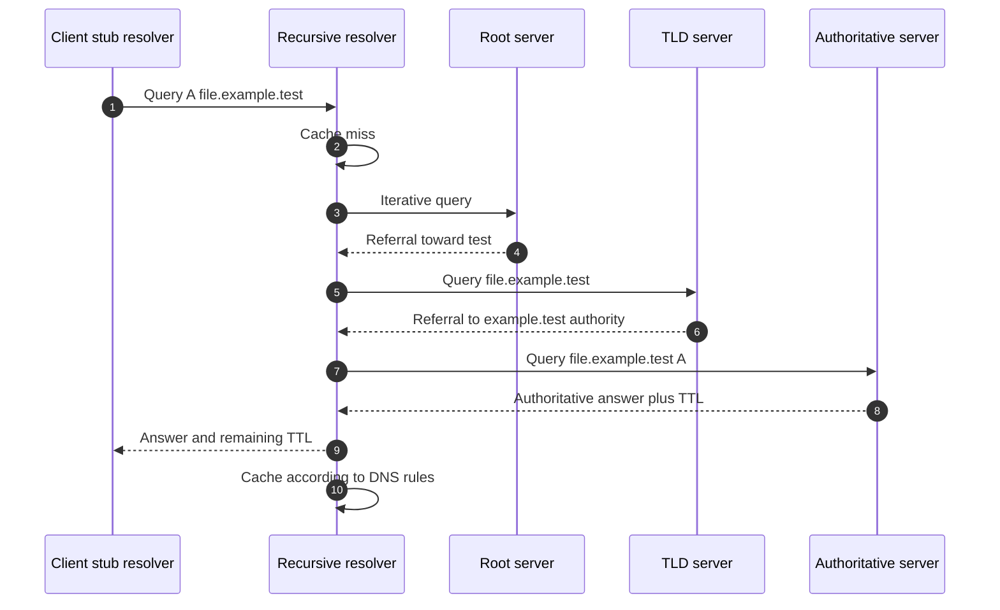

### Record orientation

| Record | Meaning | Storage/customer implication |
|---|---|---|
| `A` | Name to IPv4 address | Which IPv4 endpoint clients try. |
| `AAAA` | Name to IPv6 address | Dual-stack path selection and support. |
| `CNAME` | Alias pointing to another canonical name | Adds another lookup/TTL and naming dependency; apex/usage rules apply. |
| `PTR` | Reverse mapping from address to name | Useful for identity/logging and some applications; not proof of forward equivalence. |
| `SRV` | Service discovery with target, port, priority, and weight | Important for services such as Active Directory discovery. |
| `NS` | Authoritative name servers for a zone/delegation | Helps locate publishing authority. |
| `SOA` | Zone authority and timing metadata | Includes fields relevant to zone and negative caching semantics. |
| `TXT` | Text data used by many application policies | Interpret only in the specific protocol/policy context. |

### DNS message field orientation

| Field | Diagnostic use |
|---|---|
| Transaction ID | Correlate request/response on classic DNS transports, with caveats. |
| Flags | Query/response, recursion desired/available, authoritative answer, truncation, status. |
| Question | Exact name, type, and class requested. |
| Answer/authority/additional | Returned data, referrals, and supporting records. |
| Response code | `NOERROR`, `NXDOMAIN`, `SERVFAIL`, refusal, and others require different troubleshooting. |
| TTL | Remaining cache lifetime, not a connection lifetime. |

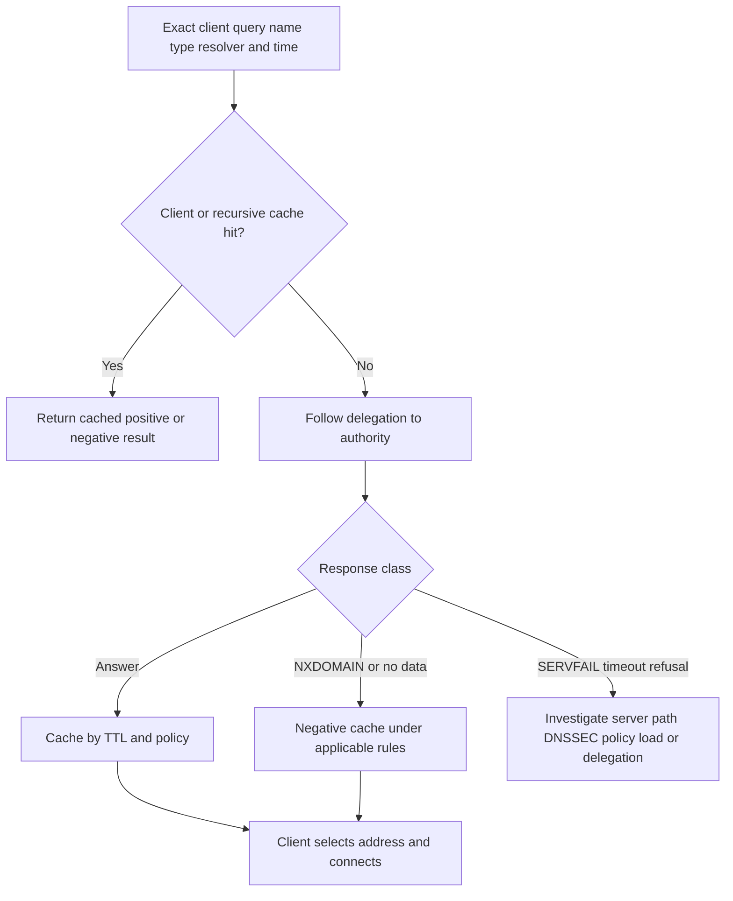

### DNS troubleshooting rules

Record the exact query name/type, client, configured resolver, response, TTL, recursion path, authoritative data, address family, search suffix, hosts/local policy, and the address the application actually used. `nslookup works` or `I can resolve it` is not enough.

---

## 6. DHCPv4 DORA, relays, reservations, and address control

**Dynamic Host Configuration Protocol (DHCP)** can lease IPv4 addresses and configuration. The common four-message exchange is remembered as DORA: Discover, Offer, Request, Acknowledge.

### DHCP roles

| Term | Meaning | Why it matters |
|---|---|---|
| **Scope/pool** | Address range and options available for one network. | Exhaustion or wrong options can affect new/renewing clients. |
| **Lease** | Time-limited assignment of an address/configuration. | Renewal, rebinding, and expiration change behavior over time. |
| **Reservation** | Policy that maps a client identity to a chosen address. | Useful for predictable addresses, but identity and duplicate control must be correct. |
| **Exclusion** | Pool range not dynamically offered. | Prevents conflict with statically managed addresses under a coordinated plan. |
| **Relay agent** | Forwards DHCP messages between client subnet and server and identifies ingress network. | A wrong relay/helper or relay information can select the wrong scope. |
| **Option** | Configuration value such as router, DNS server, domain, routes, or time-related information. | An address lease can succeed while supplied dependencies are wrong. |

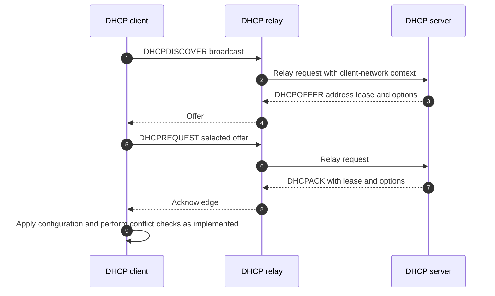

### DHCP packet/option orientation

- Message type: Discover, Offer, Request, ACK, NAK, Decline, Release, Inform.
- Transaction identifier: associates one exchange.
- Client hardware or client identifier: influences lease identity.
- `yiaddr`/offered address and relay `giaddr` concepts in DHCPv4.
- Server identifier, requested IP, subnet mask/prefix information, router, DNS, lease time, renewal/rebinding times, domain/search, and route options as applicable.
- Relay-agent information and policy where deployed.

### Reservation caveats

A reservation does not make an address universally safe. Confirm the client identifier used by that implementation, exclusions, duplicate-address detection, stale leases, failover/replication state, and whether a storage endpoint should use static/manual, reserved, or product-managed addressing under current vendor guidance.

---

## 7. NTP and time as a security and evidence dependency

**Network Time Protocol (NTP)** distributes time and estimates offset/delay across a hierarchy. A **stratum** is distance in the NTP synchronization hierarchy, not a direct quality score. A lower number is not automatically better if the source is unstable, unreachable, or incorrectly configured.

### Plain-English deep-dive: clocks are part of authentication and evidence

If two cameras disagree by five minutes, an incident sequence becomes unreliable. If an identity ticket or certificate is evaluated against a wrong clock, authentication can fail even when the password and network are correct. Time is both a control dependency and an evidence-quality dependency.

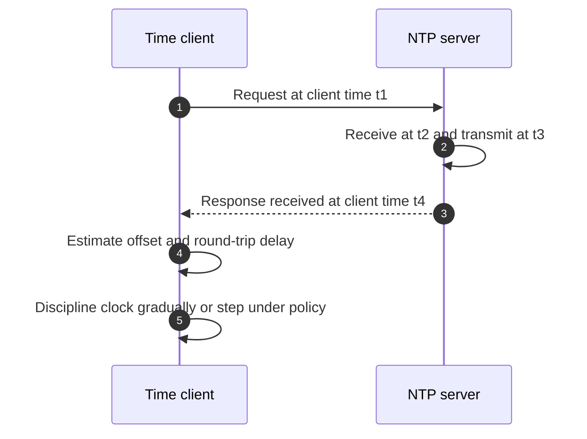

The simplified NTP equations are:

$$
offset=\frac{(t_2-t_1)+(t_3-t_4)}{2}
$$

$$
delay=(t_4-t_1)-(t_3-t_2)
$$

These assume path behavior and are orientation, not a complete NTP selection/discipline model.

### Time evidence

| Evidence | Question |
|---|---|
| Selected source/peer | Which server or hierarchy is currently trusted? |
| Offset and jitter | How far and how variably does local time differ? |
| Reach and last update | Is synchronization current? |
| Leap/status/source quality | Is the source synchronized and acceptable? |
| Clock step/slew events | Did time jump or adjust during the incident? |
| Timezone versus UTC | Are displays confusing timezone with clock error? |

Time failures can affect Kerberos, certificate validity, signed requests, logs, monitoring correlation, scheduled jobs, replication/conflict decisions, and cluster behavior depending on the product. Verify exact thresholds and behavior; do not invent a universal allowable skew.

---

## 8. Firewalls, connection state, ports, and NAT

A firewall enforces policy based on fields and context such as interfaces/zones, source/destination addresses, protocol, ports, application identity, user identity, time, and connection state.

### Stateful firewall sequence

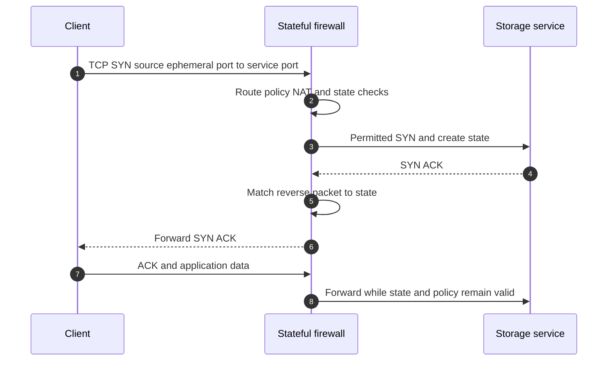

### Firewall action meanings

| Action | Typical client symptom | Caveat |
|---|---|---|
| Permit | Packet is forwarded under policy | Downstream service can still fail. |
| Silent drop | Timeout/retransmission | Loss could also occur elsewhere. |
| Reject/reset/unreachable | Faster explicit failure | Sender of response must be validated. |
| Rate limit/police | Loss or throughput cap under load | May look normal in light tests. |
| Inspect/proxy | New application/TLS behavior and two legs | Device becomes protocol, capacity, certificate, and logging dependency. |

### Ports and state

- Server services commonly listen on known/registered ports; clients usually use ephemeral source ports.
- Return traffic in a stateful policy is not simply `open every ephemeral port`; it matches connection state under device behavior.
- UDP state is pseudo-state based on observed tuples/timers, not a UDP handshake.
- Long-lived storage sessions can be affected by idle timeouts, state-table pressure, failover, or policy reload.
- Opening a port proves only policy intent; verify listener, route, NAT, and application negotiation.

### NAT

**Network Address Translation (NAT)** rewrites addresses and sometimes ports. It can conserve addresses or connect overlapping/segmented environments, but it changes identity, logging, state, return-path, and some application assumptions.

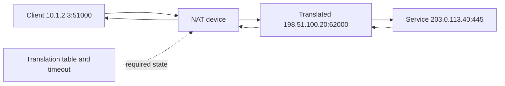

### NAT/firewall evidence

- Original and translated five-tuples.
- Rule ID, action, zone/interface, policy version, session owner/node, create/end reason, bytes/packets, and timeout.
- Routing decision before/after translation under the product pipeline.
- High-availability state synchronization and failover ownership.
- Drops, resource limits, inspections, reset generation, and asymmetric path.
- Logs from both directions and simultaneous endpoint captures.

Do not recommend NAT for storage or removing NAT generically. Decide from protocol support, identity/security requirements, topology, failover, performance, and current vendor support.

---

## 9. Proxies and TLS inspection

A **forward proxy** acts on behalf of clients. A **reverse proxy** acts in front of servers. A storage data protocol may not support a general HTTP proxy; cloud control planes, update checks, object endpoints, telemetry, or web APIs often can. Validate the exact flow.

### TLS inspection creates two security sessions

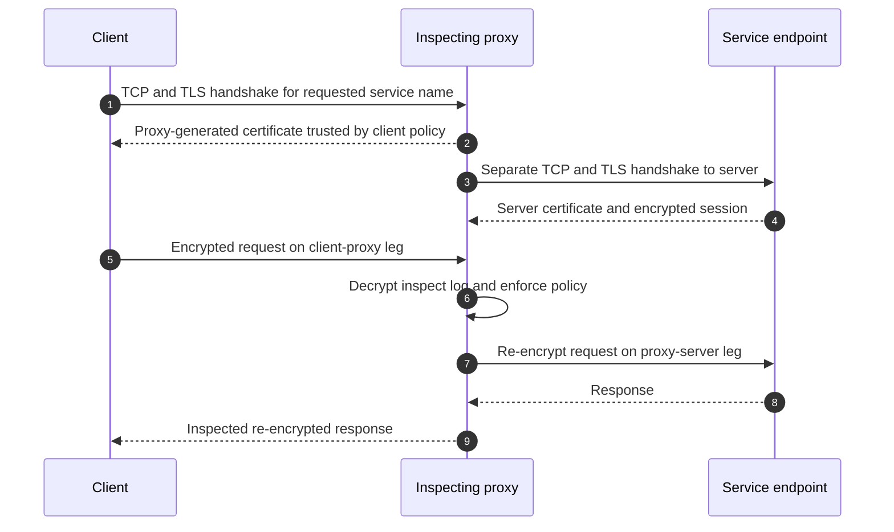

### Proxy/TLS risks and evidence

- Certificate trust, service name, validity time, revocation, protocol/cipher compatibility, and policy exemptions.
- Proxy authentication and user/computer/service identity.
- Separate DNS resolution location: client may resolve proxy, while proxy resolves destination.
- Payload/body limits, buffering, timeout, connection reuse, upload/download scanning, and capacity.
- Privacy and data-governance impact of decryption.
- Unsupported application protocols or certificate pinning.
- Logs and packet evidence from both connection legs.

Never disable TLS validation or inspection broadly to test. Use an approved, scoped, time-bounded test with security ownership and rollback.

---

## 10. VPN and load-balancer dependencies

A VPN commonly adds authentication, key negotiation, encryption, encapsulation, tunnel interfaces, and route policy. A load balancer adds front-end identity, health checking, selection, persistence, source translation, and backend connections.

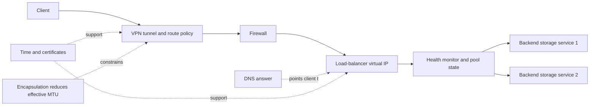

### VPN checks

- Tunnel establishment, peer identity, phase/key/security association state under the implementation.
- Interesting-traffic selectors or policies and route injection.
- Encapsulation overhead and Path MTU Discovery.
- Rekey, lifetime, dead-peer detection, failover, and state synchronization.
- Encryption throughput, CPU/accelerator capacity, packet loss, and fragmentation.
- Overlapping networks and NAT before/after encryption.

### Load-balancer checks

- Virtual IP, port, protocol, listener, and certificate where applicable.
- Health-check destination, method, source, interval, timeout, and success criteria.
- Backend pool membership, state, connection limits, persistence, draining, and locality.
- Source NAT/direct-server-return behavior and return-path symmetry.
- Whether the storage protocol is supported for proxying/load balancing.
- Application/session continuity when backend or appliance fails.

A green health check proves only that the configured probe succeeded. It may test a TCP port while authentication, namespace, LUN, share, or real I/O is broken.

---

## 11. Service dependencies and failure trees

### Dependency graph

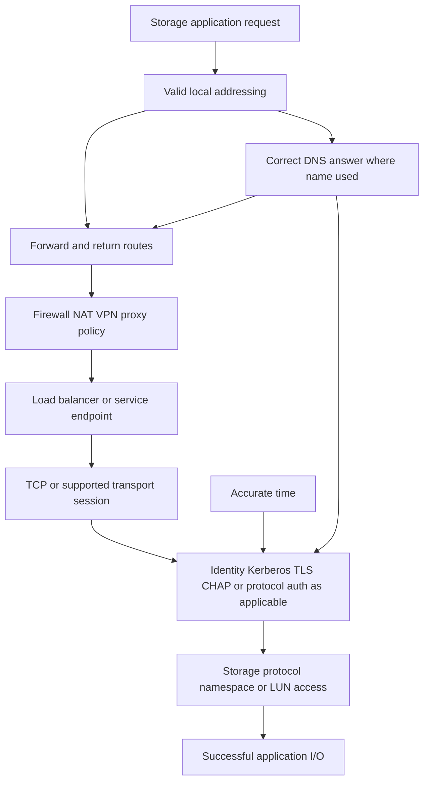

### Reachability fault tree

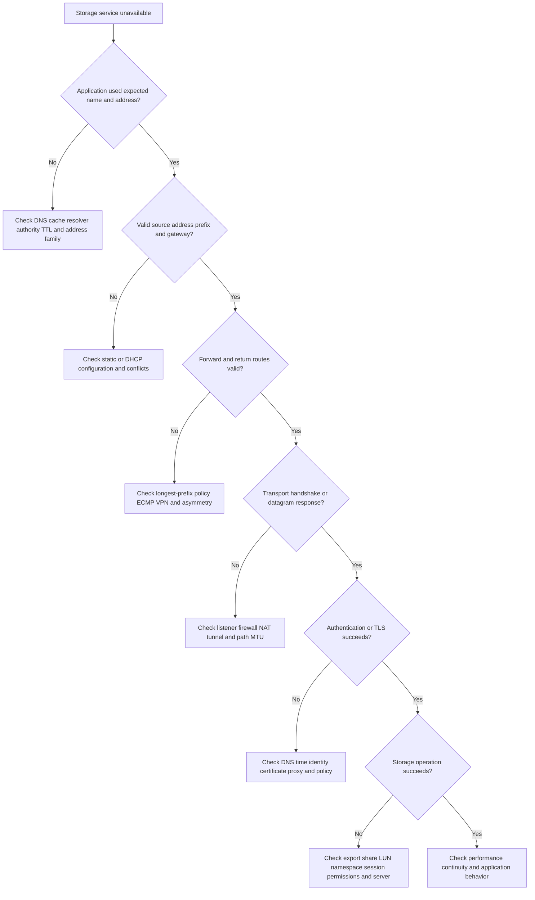

### Symptom-to-dependency table

| Symptom | High-value first evidence | Common false conclusion |
|---|---|---|
| Only new hosts fail | DHCP scope/options, DNS registration/cache, firewall identity/policy | Storage server is down |
| Name fails but IP works | Exact DNS query/response/cache/address family | Add a permanent hosts entry |
| One subnet fails | Route, relay, firewall zone/rule, source NAT, ACL | Bad storage port |
| SYN leaves, no reply | Both-end capture, route/firewall/NAT state, listener | Firewall is definitely dropping |
| TCP works, auth fails | Protocol status, clock, DNS/SPN/certificate/identity logs | Network is healthy, so storage is at fault |
| Intermittent by flow | ECMP hash, asymmetry, state owner, path-specific MTU/loss | Random packet loss |
| Works until idle | Firewall/NAT/proxy timeout and application keepalive/reconnect | Server crashes periodically |
| Works locally, not over VPN | Selectors/routes/NAT/MTU/rekey/policy | VPN is simply slow |
| Load-balancer VIP up, operation fails | Backend/health-check semantics and real protocol test | All backends are healthy |

---

## 12. Reachability tools and evidence limits

Tool names and syntax vary by Windows, Linux, network device, and security policy. Prefer read-only checks first.

| Tool/category | What it can show | Limitation |
|---|---|---|
| Interface/address display | Addresses, prefix, gateway, DNS, DHCP, state | Intended configuration may differ from actual application source selection. |
| Route lookup/table | Selected prefix, next hop, interface, metric | Does not prove remote return path or firewall state. |
| Neighbor/ARP table | Local next-hop mapping and state | Does not prove remote application health. |
| DNS query tool | Resolver response, type, TTL, authority details | Application may use a cache, different resolver, API, or address family. |
| Ping/ICMP echo | Some ICMP reachability/RTT | ICMP may be treated differently from storage traffic. |
| Traceroute/path trace | TTL/Hop-Limit response path clues | Silent hops, ECMP, and reverse path make it incomplete. |
| TCP connection test | Listener/path/firewall response for one tuple | Does not prove authentication or storage operation. |
| Socket/state display | Local listeners/connections/TCP state | Does not show all network-device state. |
| Packet capture | Visible packet fields/timing at one point | Offload, encryption, capture loss, and location limit truth. |
| Firewall/NAT session logs | Policy, translation, state, counters, end reason | Logging can be sampled/disabled and clocks differ. |
| NTP/time status | Source, offset, reach, sync events | Tool labels and algorithms vary; one sample may not show history. |
| Load-balancer/VPN status | Tunnel, pool, health, sessions, counters | Green state may test only a narrow control condition. |

### Evidence-correlation flow

```mermaid
sequenceDiagram
    autonumber
    participant A as Application log
    participant H as Host network evidence
    participant D as DNS DHCP or time service
    participant F as Firewall VPN proxy or load balancer
    participant S as Storage service
    A->>H: Record exact failure and UTC request ID
    H->>D: Correlate address name and time dependencies
    H->>F: Correlate original tuple route translation and policy
    F->>S: Correlate backend tuple and session
    S-->>A: Return protocol status or absence
    Note over A,S: Preserve raw clocks scopes and unknowns; correlation is not automatically cause
```

---

## 13. Security, performance, and supportability implications

### Security

- Apply least privilege to routes, firewall rules, proxy bypasses, DNS updates, DHCP administration, and time sources.
- Protect DNS/DHCP/NTP/control protocols from unauthorized changes and spoofing according to platform guidance.
- Treat management-plane access and packet/log evidence as sensitive.
- Use authenticated/encrypted protocols where supported and required; understand endpoint versus intermediary termination.
- Record rule owners, purpose, expiry/review, and evidence instead of leaving temporary broad access.
- Avoid exposing storage services directly to untrusted networks unless an explicitly supported architecture and threat model require it.

### Performance

- DNS delay affects connection startup; TTL and failover policy influence how quickly clients learn endpoint changes.
- Route distance, ECMP, VPN encryption, proxy buffering, inspection, NAT state, load-balancer selection, and firewall capacity can add latency or limit throughput.
- Long-lived storage sessions can hide DNS changes until reconnect.
- Coarse average device CPU or throughput can hide state-table, queue, per-core, per-flow, or inspection bottlenecks.
- Path asymmetry can make one direction slow or invisible to a single capture point.

### Supportability inventory

| Layer | Record |
|---|---|
| Host | OS/build, address family, route policy, DNS/DHCP/time client, firewall, storage client/initiator, NIC/driver/firmware |
| Network services | DNS/DHCP/NTP product/release, zones/scopes/options/sources, HA/replication, monitoring |
| Path/security | Routers, firewall/NAT, VPN, proxy, load balancer products/releases, policies, MTU, HA, state sync |
| Storage | Platform/release, interface/LIF, protocol/version, authentication, endpoint names/addresses |
| Evidence | Current official docs, exact IMT result/notes, date, reviewer, unknown/unlisted components |

Standards describe protocols; they do not establish that a particular proxy, NAT, VPN, load balancer, OS, switch, or storage combination is supported.

---

## 14. TAM discovery, recommendation, and JD Mapping

### Discovery questions

#### Business and scope

1. Which application, storage operation, users, sites, and service objectives are affected?
2. Is failure tied to new clients, one subnet, one name, one address family, one path, load, idle time, failover, or authentication?
3. What changed in DNS, DHCP, route, firewall, VPN, proxy, load balancer, identity, time, or storage?

#### Addressing and routing

4. What source/destination addresses, prefixes, gateways, route tables, policy rules, ECMP next hops, and return paths apply?
5. Are static, DHCP, reservation, relay, duplicate, overlapping, or address-family conditions relevant?
6. Which NAT translations and state owners exist?

#### Services and security

7. What exact DNS name/type/resolver/answer/TTL/authority does the application use?
8. What time source, offset, synchronization state, and clock event exist at client, identity, proxy, and storage?
9. What firewall rule, zone, action, state, timeout, proxy/TLS inspection, VPN selector, or load-balancer backend applies?

#### Evidence and support

10. Which host, service, network/security, and storage versions form the end-to-end combination?
11. What current official/IMT evidence and notes validate support, and what remains inaccessible or unlisted?
12. Are clocks aligned, and can one request be correlated across client, services, security devices, and storage?

#### Change and validation

13. What is the cheapest safe test that distinguishes DNS, route, policy, authentication, and storage hypotheses?
14. Who owns each layer and approves changes or risk?
15. What validates normal, failover, reconnect, IPv4/IPv6, and representative-load behavior?

### Evidence-to-recommendation model

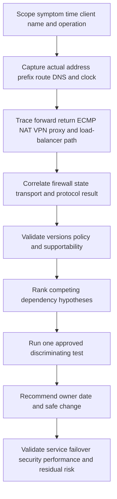

### Recommendation examples

| Finding | Risk | Bounded recommendation | Validation |
|---|---|---|---|
| One subnet receives an obsolete DNS server through DHCP | New/renewed clients can resolve stale storage address | Correct scope option under DHCP/network ownership; plan lease/renewal behavior and rollback | Client renew, exact DNS answer/TTL, protocol I/O, unaffected subnets |
| Return flow ECMPs through a firewall without state | Intermittent connection failure by hash | Correct supported routing/state-sync design; do not open broad stateless access | Both-direction path/state evidence and failure test |
| NTP offset coincides with Kerberos/certificate failures | Authentication and evidence correlation exposure | Restore approved time hierarchy and investigate source/reach; avoid manually forcing arbitrary time without policy | Stable source/offset, auth success, corrected timeline, monitor |
| Load balancer tests only TCP connect | Green status can include application-broken backend | Design a supported health check that reflects safe service readiness | Backend removal/recovery test and real application operation |
| Proxy inspection breaks one TLS client version | Unsupported or incompatible security path | Validate client/proxy/service versions and approved policy exception or upgrade | Both TLS legs, trust, security approval, regression test |

### Explicit JD Mapping

| JD responsibility | Part 13 contribution | Arti's strength and honest gap |
|---|---|---|
| Understand customer environment | Maps address, routes, services, security devices, storage endpoint, and owners | **Strength:** Windows/Azure/M365/AD dependency mapping. **Gap:** NetApp production IP-storage topology is unproven. |
| Generate/analyze/report data | Reconciles DNS, DHCP, NTP, routes, state tables, captures, and logs | **Strength:** escalation evidence and analytics. |
| Storage/infrastructure depth | Connects network services and security to NFS/SMB/iSCSI/NVMe-TCP reachability | **Conceptual/lab:** storage protocol operations remain a production gap. |
| Mitigate risk/stability | Finds route asymmetry, stale names, lease errors, time drift, state loss, and dependency common fate | **Strength:** CRITSIT method transfers; exact remediation requires owners/SMEs. |
| Supportability | Builds exact host/network/security/storage combination and dated IMT record | **Gap:** no current customer IMT result claimed. |
| Service reviews | Converts dependency evidence into business impact, options, owners, and decisions | **Strength:** business review and executive communication. |
| Improve escalations | Supplies original/translated tuples, both paths, service state, clocks, and exact ask | **Strength:** Product/Engineering escalation discipline. |

### Honest production-gap statement

> "My production background includes Windows and Azure networking, DNS, Active Directory dependencies, Microsoft 365 connectivity, proxies, time-sensitive authentication, and enterprise escalation. I can calculate subnets, reconstruct routes and service dependencies, and correlate endpoint and network evidence. I have not owned a NetApp production IP-storage network or customer firewall/VPN design. I would verify the exact supported protocol path, use authorized read-only evidence, and coordinate changes with network, security, identity, host, and storage owners."

---

## 15. Fully synthetic case: CedarWorks dual-stack file-service failure

> **Synthetic case:** CedarWorks, all names, addresses, records, devices, logs, and outcomes are fictional. No NetApp product behavior, support result, or customer incident is asserted.

### Environment

- Windows clients access a fictional SMB file service named `files.cedar.example`.
- DNS publishes IPv4 `A` and IPv6 `AAAA` records for a load-balanced service.
- One branch obtains addresses, gateway, and DNS resolver through DHCPv4; IPv6 uses Router Advertisements and recursive DNS.
- Traffic crosses an SD-WAN/VPN pair and stateful firewall cluster.
- Kerberos is preferred; certificate-protected management and monitoring use the same time hierarchy.
- After a branch-network change, half the clients report long connection delays, then some succeed.

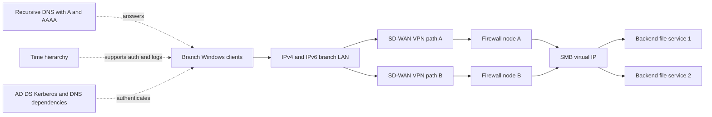

### Evidence timeline

| UTC | Evidence | Bounded interpretation |
|---|---|---|
| 08:55 | Branch change enables IPv6 RA but firewall IPv6 policy is absent on path B | Candidate family/path mismatch introduced. |
| 09:00 | DNS returns valid A and AAAA records, TTL 300 | Resolution succeeds; answer usability differs by path/family. |
| 09:00:00.100 | Client selects IPv6 address first | Actual application path is IPv6, not proven by an IPv4 test. |
| 09:00:00.120 | IPv6 SYN follows VPN path B and is dropped by explicit firewall default; log has no matching allow rule | Supports policy mechanism for initial delay. |
| 09:00:01.130 | Client connection algorithm attempts IPv4 | Fallback behavior is implementation-specific; trace provides this case evidence. |
| 09:00:01.150 | IPv4 SYN crosses path A; session succeeds | Explains delayed eventual success for some clients. |
| 09:05 | Other clients with cached ordering/path hashes behave differently | Accounts for partial scope without assuming random failure. |
| 09:10 | Time offset and Kerberos logs are healthy | Authentication-time hypothesis is currently weakened, not universally excluded. |

### Competing hypotheses

| Hypothesis | Evidence for | Evidence against/missing | Test |
|---|---|---|---|
| DNS is broken | User sees connection delay | DNS returns intended A/AAAA with valid response | Query exact resolver, compare authority, trace selected address |
| SMB backend is slow | Delay before share appears | Delay occurs before TCP connection; backend service time normal | Correlate TCP and SMB message timing at VIP/backend |
| IPv6 firewall/path gap | IPv6 enabled at change; IPv6 SYN dropped by rule | Must verify all paths/clients and intended policy | Scoped IPv6 policy/path test and both-node state logs |
| Kerberos/time problem | SMB often depends on AD/time | Auth does not begin on failed IPv6 attempt; clocks healthy | Protocol/auth logs after TCP establishment |
| ECMP/state asymmetry | Multiple VPN/firewall paths | Current failed tuple has explicit missing policy, not state mismatch | Compare forward/return path and state for affected hashes |

### Fault tree

```mermaid
flowchart TD
    TOP[Some clients delay then connect] --> DNSQ{DNS query succeeds with A and AAAA?}
    DNSQ -->|No| D[Resolver authority cache or DHCP DNS path]
    DNSQ -->|Yes| SELECT[Record actual selected family and address]
    SELECT --> V6{IPv6 selected?}
    V6 -->|Yes| P6[Trace route VPN firewall and VIP over IPv6]
    V6 -->|No| P4[Trace IPv4 path]
    P6 --> SYN{TCP handshake completes?}
    SYN -->|No| RULE[Check IPv6 route policy state and listener]
    SYN -->|Yes| AUTH[Check SMB negotiation authentication and permissions]
    RULE --> FALL[Measure fallback and user delay]
    FALL --> FIX[Implement approved dual-stack policy or correct publication/design]
    FIX --> TEST[Test IPv4 IPv6 both paths auth and SMB operation]
```

### Bounded recommendation

> **Evidence:** Clients receive both A and AAAA records; affected clients select IPv6, and the IPv6 SYN is explicitly dropped on one VPN/firewall path after IPv6 Router Advertisements were enabled. IPv4 fallback later succeeds. **Context:** The service is a business file share and the branch expects dual-stack operation. **Risk:** Published IPv6 reachability without complete path policy creates user delay, inconsistent results by client/path, and an untested resilience state. **Recommendation:** Network/security owners should either complete and validate the supported IPv6 route/firewall/load-balancer path or, if dual-stack service is not intended, correct address publication and RA/design through approved change rather than disabling IPv6 ad hoc on clients. **Validation:** Test A/AAAA resolution, both address families, both VPN/firewall paths, TCP, SMB negotiation/authentication, representative file I/O, and failover. **Residual risk:** Passing these tests does not validate future route changes, every client address-selection implementation, or backend application health; monitoring and configuration governance remain necessary.

### Customer-facing summary

> "DNS is returning the intended dual-stack records, but the service path is not consistently dual-stack. Affected clients first choose IPv6, which is dropped by the missing policy on one VPN/firewall path, then some recover through IPv4 fallback. The recommended action is to make publication and end-to-end path support consistent, validate both families and both failover paths with real SMB operations, and keep time/authentication evidence separate because it is not the current failure stage."

---

## 16. Common failures and troubleshooting implications

| Mistake | Why it fails | Better behavior |
|---|---|---|
| `Same first three octets means same subnet` | Prefix length, not visual pattern, defines network | Calculate bitwise prefix boundaries. |
| `Default gateway handles all remote traffic` | More-specific/policy/VPN routes can win | Record actual route lookup and source selection. |
| `ECMP means packets are round-robin` | Common designs hash flows; behavior varies | Inspect exact algorithm and per-flow path. |
| `Asymmetry is always wrong` | IP can be asymmetric; devices/policies decide support | Check state ownership, captures, NAT, and support. |
| `DNS works` after one lookup | Resolver, cache, type, TTL, family, and application use vary | Capture exact query and selected address. |
| `TTL is failover time` | Clients/connections/caches/policies differ | Measure resolution and reconnect behavior. |
| `DHCP ACK means correct network` | Options/scope/relay/conflict can be wrong | Validate applied address, routes, DNS, and ownership. |
| `Low stratum means best time` | Stability/reach/source quality matter | Inspect selected source, offset, reach, and history. |
| `Open port proves service health` | Auth and storage operations remain | Test protocol request and application outcome. |
| `No firewall log means no firewall drop` | Logging may be disabled/sampled or another node owns state | Capture both ends and identify actual state owner. |
| `Proxy is transparent` | It creates separate connections, identity, DNS, TLS, timeout, and capacity | Analyze each leg. |
| `Green load balancer means healthy service` | Probe can be too shallow | Match health semantics to safe readiness. |

### Minimum escalation pack

- Business impact, affected applications/operations/clients/sites, severity, objectives, and UTC timeline.
- Client OS/build, storage client/initiator, interface/address/prefix/gateway, DHCP/static source, DNS/time configuration, routes/policy, neighbor state, local firewall, and actual socket tuple.
- IPv4/IPv6 records, exact DNS query/type/resolver/response/TTL/flags/code, cache, authority/delegation, selected address, and search/local policy.
- DHCP message sequence, transaction/client/relay identity, scope/reservation/exclusion, lease/options/timers, conflict/NAK evidence, and HA state.
- Time source/hierarchy, selected peer, offset/jitter/reach, step/slew events, UTC/timezone handling, and auth/certificate correlation.
- Forward and return paths, longest-prefix route, metric/preference, ECMP hash/member, policy routes, asymmetry, and failover path.
- Firewall/NAT original and translated tuples, zones/interfaces, rule/action, state owner, create/end reason, timeouts, drops, HA sync, and resource counters.
- VPN selectors/routes/security association/rekey/MTU, proxy both legs/TLS/trust/policy, load-balancer VIP/health/pool/persistence/backend state.
- Packet captures at authorized points with filters, loss/offload/encryption/privacy and clock caveats.
- Storage platform/release, service endpoint/LIF, protocol/version, listener/session, identity, operation/status, and target logs/counters.
- Exact versions and dated official/IMT support evidence and notes; mark inaccessible/unlisted items.
- Changes, actions tried/results/rollback, competing hypotheses, next discriminating test, owner, exact specialist ask, and decision deadline.

---

## 17. Paper lab and whiteboard drills

No production access is required. Use documentation ranges and synthetic records.

### Paper lab scenario

A fictional Linux iSCSI initiator `10.60.14.94/27` reaches target name `iscsi.lab.example`. DNS returns `10.80.2.50` and `2001:db8:80:2::50`. The IPv4 gateway is `10.60.14.65`. DHCP supplied DNS `10.60.1.10`, lease 8 hours, and a stale classless route for `10.80.0.0/16` through `10.60.14.70`. A more-specific `/24` route exists through a VPN. One ECMP path crosses a stateful firewall without shared state. Time offset is 7 minutes on one identity service. The target portal is reachable over IPv4 on TCP 3260, but iSCSI login intermittently fails. Everything is synthetic.

### Tasks

1. Calculate the network, last address, common host range, and address count for `10.60.14.94/27`.
2. Verify whether gateways `.65` and `.70` are on-link.
3. Draw IPv4 and IPv6 control/data paths.
4. Build the route table and apply longest-prefix match to target IPv4.
5. Map ECMP forward and return paths and firewall state ownership.
6. Trace exact A/AAAA DNS resolution, TTL, cache, and selected family.
7. Draw DHCP DORA through a relay and inspect every relevant option.
8. Decide how the stale `/16` route interacts with the more-specific VPN `/24`.
9. Calculate NTP offset/delay from supplied synthetic timestamps and relate time to auth/logs.
10. Record firewall original/translated tuples, rule, state, timeout, and end reason.
11. Draw VPN selectors, routes, encapsulation MTU, rekey, and failover dependencies.
12. Determine whether a proxy or load balancer is actually in this iSCSI path; do not add one by assumption.
13. Separate TCP 3260 reachability, iSCSI login, target authorization, and LUN access.
14. Build at least five competing hypotheses and one discriminating test each.
15. Create the exact supportability inventory and mark every unknown.
16. Write a seven-part recommendation and escalation pack.

### Subnet calculation check

`/27` leaves 5 host bits:

$$
2^5=32\ addresses
$$

The final-octet boundaries are 0, 32, 64, 96, and so on. `94` lies in `64-95`:

- Network: `10.60.14.64/27`
- Common host range: `10.60.14.65-10.60.14.94`
- Last/broadcast address under common semantics: `10.60.14.95`

Both `.65` and `.70` are in the common host range; that does not prove either is a valid configured gateway.

### Whiteboard drills

1. **CIDR in 90 seconds:** Solve `/26`, `/27`, and `/28` boundaries.
2. **Longest prefix:** Select among default, `/8`, `/16`, `/24`, and `/32` routes.
3. **Dual stack:** Explain why IPv4 success does not prove IPv6 path health.
4. **DNS:** Draw stub, recursive, root, TLD, authoritative, and cache.
5. **DHCP:** Draw DORA and relay; name options that can break storage.
6. **Time:** Explain how clock error affects auth and incident correlation.
7. **Stateful path:** Draw forward firewall A and return firewall B failure.
8. **Proxy:** Draw two TLS legs and two DNS viewpoints.
9. **Service tree:** Move from name to route to policy to auth to storage operation.
10. **Executive translation:** Explain one dependency risk, owner, action, and residual risk in 60 seconds.

### Lab completion criteria

- [ ] Subnet arithmetic is correct and special prefixes are not forced into `minus two` logic.
- [ ] IPv6 RA/ND/DHCPv6 and dual-stack selection are conceptually distinct.
- [ ] Route selection uses longest prefix before equal-route behavior.
- [ ] Forward and return paths, state, NAT, and captures are mapped.
- [ ] DNS cache/authority/TTL and actual application address are recorded.
- [ ] DHCP lease success is separated from option correctness.
- [ ] Time is treated as auth, certificate, and evidence dependency.
- [ ] Proxy/VPN/load-balancer roles are included only when evidence shows them.
- [ ] TCP reachability is separated from storage login/access.
- [ ] Supportability and production claims remain bounded.

---

## 18. Self-test

1. Define IPv4 address, subnet mask, CIDR prefix, network address, and gateway.
2. Calculate network/range/count for `/24`, `/26`, `/27`, `/28`, and `/30` examples.
3. Explain `/31` and `/32` caveats without applying the common host formula blindly.
4. Explain wrong-mask and overlapping-prefix failures.
5. Define IPv6 global/link-local/multicast, RA, ND, SLAAC, and DHCPv6.
6. Explain why dual-stack clients can show partial failures.
7. Apply longest-prefix match and route tie/metric/ECMP logic.
8. Explain default route, source selection, policy route, and return path.
9. Explain ECMP hashing and asymmetric routing with stateful devices.
10. Draw recursive DNS resolution and define authority, cache, TTL, and negative caching.
11. Orient on A, AAAA, CNAME, PTR, SRV, NS, SOA, and TXT records.
12. Interpret DNS flags, sections, response codes, and selected application address.
13. Draw DHCP DORA through a relay.
14. Define scope, lease, reservation, exclusion, relay, and options.
15. Explain DHCPv4 versus DHCPv6/default-router orientation.
16. Calculate NTP offset/delay and explain stratum caveats.
17. Relate time to Kerberos, TLS certificates, logs, and storage operations.
18. Draw stateful TCP firewall behavior and explain drop versus reject.
19. Explain ports, ephemeral source ports, UDP pseudo-state, and idle timeouts.
20. Draw NAT and record original/translated tuples and state.
21. Compare forward/reverse proxies and draw TLS inspection's two legs.
22. Explain VPN routes/selectors/rekey/MTU and load-balancer health limitations.
23. Use reachability tools without overstating what each proves.
24. Draw the complete service-dependency graph and fault tree.
25. Build a security/performance/supportability inventory.
26. Ask the complete TAM discovery set and write a bounded recommendation.
27. Recreate the CedarWorks case and explain why DNS is not the root cause.
28. Build the minimum escalation pack.
29. Complete the paper lab and Q1-Q8 aloud.
30. State Arti's production strengths and NetApp IP-storage production gap honestly.

---

## 19. Official Source Anchors

**Date checked: 2026-08-24.** The sources below anchor public protocol and platform concepts. RFCs can be updated or obsoleted; product defaults and security behavior change; Microsoft and NetApp documentation is release-specific; and IMT/customer tools can require authorization. Verify exact versions, policies, topology, standard status, and IMT notes. Do not invent a support matrix, timeout, clock threshold, firewall behavior, or internal NetApp design.

| Topic | Official public source | Access, version, and use note |
|---|---|---|
| IPv4 and addressing | [RFC 791 - Internet Protocol](https://www.rfc-editor.org/rfc/rfc791), [RFC 4632 - Classless Inter-domain Routing](https://www.rfc-editor.org/rfc/rfc4632) | Foundational IETF sources with updates; operational behavior also depends on later RFCs and implementations. |
| Private/special IPv4 ranges | [RFC 1918 - Address Allocation for Private Internets](https://www.rfc-editor.org/rfc/rfc1918), [IANA IPv4 Special-Purpose Address Registry](https://www.iana.org/assignments/iana-ipv4-special-registry/) | Use current IANA registry for exact special-purpose status. |
| IPv6 addressing/base | [RFC 4291 - IPv6 Addressing Architecture](https://www.rfc-editor.org/rfc/rfc4291), [RFC 8200 - IPv6](https://www.rfc-editor.org/rfc/rfc8200) | Check updates/errata and current platform guidance. |
| IPv6 Neighbor Discovery and SLAAC | [RFC 4861 - Neighbor Discovery](https://www.rfc-editor.org/rfc/rfc4861), [RFC 4862 - IPv6 Stateless Address Autoconfiguration](https://www.rfc-editor.org/rfc/rfc4862) | Required control behavior; security devices must permit necessary ICMPv6 under policy. |
| Routing requirements | [RFC 1812 - Requirements for IPv4 Routers](https://www.rfc-editor.org/rfc/rfc1812) | Foundational routing requirements; ECMP/policy implementations require vendor documentation. |
| DNS concepts and messages | [RFC 1034 - Domain Names Concepts](https://www.rfc-editor.org/rfc/rfc1034), [RFC 1035 - Domain Names Implementation](https://www.rfc-editor.org/rfc/rfc1035) | Foundational DNS documents with many updates; check RFC Editor status. |
| DNS negative caching | [RFC 2308 - Negative Caching of DNS Queries](https://www.rfc-editor.org/rfc/rfc2308) | Use with current DNS implementation documentation. |
| DHCPv4 | [RFC 2131 - Dynamic Host Configuration Protocol](https://www.rfc-editor.org/rfc/rfc2131), [RFC 2132 - DHCP Options](https://www.rfc-editor.org/rfc/rfc2132) | Base protocol/options with later option RFCs and implementation behavior. |
| DHCPv6 | [RFC 8415 - DHCP for IPv6](https://www.rfc-editor.org/rfc/rfc8415) | Current consolidated DHCPv6 specification at check date; RA remains central to default-router discovery. |
| NTPv4 | [RFC 5905 - Network Time Protocol Version 4](https://www.rfc-editor.org/rfc/rfc5905) | Protocol specification; secure deployment and OS time discipline need current product guidance. |
| Firewall guidance | [NIST SP 800-41 Rev. 1 - Guidelines on Firewalls and Firewall Policy](https://csrc.nist.gov/pubs/sp/800/41/r1/final) | Official US guidance; publication age means current organizational/product guidance must also be used. |
| NAT orientation | [RFC 3022 - Traditional IP Network Address Translator](https://www.rfc-editor.org/rfc/rfc3022) | Informational foundation; modern NAT/firewall behavior is product-specific. |
| HTTP proxy semantics | [RFC 9110 - HTTP Semantics](https://www.rfc-editor.org/rfc/rfc9110) | Includes HTTP method/intermediary semantics; it does not make non-HTTP storage protocols proxy-compatible. |
| TLS 1.3 | [RFC 8446 - TLS 1.3](https://www.rfc-editor.org/rfc/rfc8446) | Proxy inspection/support and certificate policy are implementation-specific. |
| Microsoft DNS | [Windows Server DNS documentation](https://learn.microsoft.com/en-us/windows-server/networking/dns/dns-top) | Official Microsoft documentation; select current Windows Server release and role. |
| Microsoft DHCP | [Windows Server DHCP documentation](https://learn.microsoft.com/en-us/windows-server/networking/technologies/dhcp/dhcp-top) | Official Microsoft documentation; failover, policies, options, and behavior are release-specific. |
| Windows time | [Windows Time service technical reference](https://learn.microsoft.com/en-us/windows-server/networking/windows-time-service/windows-time-service-tech-ref) | Official Microsoft source; domain hierarchy and tolerances require current AD/Windows guidance. |
| NetApp network management | [ONTAP network management documentation](https://docs.netapp.com/us-en/ontap/network-management/) | Official public area. Select exact ONTAP release for routing, DNS, LIFs, failover, and related behavior. |
| NetApp name services | [ONTAP NAS data configuration and name services documentation](https://docs.netapp.com/us-en/ontap/nas-management/) | Broad official area; exact NFS/SMB dependencies are covered in later Parts and are release-specific. |
| NetApp interoperability | [NetApp Interoperability Matrix Tool](https://imt.netapp.com/) | Official, potentially gated, and time-sensitive. Record exact solution, result, notes, and date. |

### Source-use discipline

- Check RFC status, updates, errata, and current IANA registries.
- Preserve exact prefixes/routes and calculate rather than infer by visual address similarity.
- Capture actual DNS query/response/TTL/address family and application selection.
- Record DHCP lease, scope, relay, options, timers, and applied client configuration.
- Record time source, offset, reach, and clock events; do not invent a universal acceptable skew.
- Correlate original/translated tuples, state owner, forward/return route, proxy legs, VPN, and load-balancer backend.
- Validate exact host/network/security/storage versions and current NetApp IMT notes; protocol standards alone do not establish support.

---

## Likely Interview Questions

### Q1. How do you calculate an IPv4 subnet and decide whether a destination is local?

> **Model answer:** "I convert the prefix to network and host bits, bitwise-AND the address with the mask, and calculate the block size and range. For `10.44.18.77/26`, `/26` leaves six host bits, so the block size is 64; the network is `.64`, the last address is `.127`, and the common host range is `.65-.126`. The host compares the destination with its own on-link prefixes; otherwise a route, often through a gateway, is used. I treat `/31`, `/32`, and special ranges by their defined semantics rather than blindly subtracting two."

**Follow-up depth:** Solve `/27` and `/28`, explain wrong-mask ARP symptoms, and validate whether a gateway is on-link.

### Q2. How does route selection work, and why can ECMP or asymmetry break a stateful path?

> **Model answer:** "The device finds active matching routes and selects the longest prefix before applying preference, metric, policy, and ECMP rules among equally eligible routes. ECMP commonly hashes flows across next hops rather than sending packets round-robin. Forward and return paths can differ; IP allows that, but a firewall, NAT, or VPN may drop the return flow if the state is on another node or the design does not support asymmetry. I capture both directions and identify the actual route and state owner."

**Follow-up depth:** Work a default, `/8`, `/16`, `/24`, and `/32` route table and show a SYN on firewall A with SYN-ACK on firewall B.

### Q3. Explain DNS recursion, authority, TTL, and a safe storage-service change.

> **Model answer:** "The client stub asks a recursive resolver. On a cache miss the resolver follows referrals to the authoritative server, returns the record, and caches it according to TTL and DNS rules. I record the exact name/type, resolver, response code, answer, TTL, authority, address family, and what address the application actually uses. For a storage endpoint change I plan publication, existing long-lived sessions, positive and negative caches, rollback, and both IPv4/IPv6 paths; TTL is not automatically failover time."

**Follow-up depth:** Distinguish A, AAAA, CNAME, PTR, SRV, NXDOMAIN, NODATA, SERVFAIL, and negative caching.

### Q4. Walk through DHCP DORA and explain how a successful lease can still break storage.

> **Model answer:** "The client broadcasts Discover, servers offer, the client requests a selected offer, and the server acknowledges the lease and options, often through a relay. The lease can contain a valid address but a wrong mask, gateway, DNS server, domain, or classless route, or it can conflict with static addressing. I inspect transaction/client/relay identity, scope, reservation/exclusion, options, timers, HA state, and the configuration actually applied at the client."

**Follow-up depth:** Explain renew/rebind orientation, reservations, relay-selected scope, NAK/Decline, and DHCPv6 versus Router Advertisements.

### Q5. Why does time synchronization matter to storage and troubleshooting?

> **Model answer:** "Time affects Kerberos, certificate validity, signed operations, scheduled work, logs, monitoring, and incident correlation, with exact thresholds set by the product and policy. NTP estimates offset and delay across a source hierarchy and disciplines the clock; stratum alone is not quality. I record selected source, offset, jitter, reach, last update, and step/slew events across client, identity, network, and storage systems before correlating events."

**Follow-up depth:** Calculate simplified offset/delay and explain timezone display versus actual clock error.

### Q6. How do a stateful firewall and NAT affect a storage connection?

> **Model answer:** "The firewall evaluates the original tuple, interfaces/zones, route, policy, translation, and connection state. NAT can rewrite addresses and ports, so logs and captures on each side show different tuples. Return packets must match the expected state and translation; asymmetry, failover, idle timeout, state pressure, or policy reload can interrupt long-lived sessions. I collect original/translated tuples, rule/action, state owner, counters, end reason, both routes, and protocol evidence rather than saying only that a port is open."

**Follow-up depth:** Distinguish drop/reject, TCP state versus UDP pseudo-state, ephemeral ports, and HA state synchronization.

### Q7. What new failure domains do proxies, VPNs, and load balancers introduce?

> **Model answer:** "A proxy can create separate client-proxy and proxy-server connections, DNS viewpoints, TLS trust, authentication, timeouts, inspection, and capacity. A VPN adds identity, key state, routes/selectors, rekey, encapsulation MTU, encryption capacity, and failover. A load balancer adds a virtual endpoint, health checks, backend pools, persistence, translation, and session continuity. I confirm that the storage protocol supports the intermediary and test the real operation because a tunnel-up or green TCP health check is narrower than service readiness."

**Follow-up depth:** Draw TLS inspection's two legs, a VPN MTU black hole, and a health check that passes while authentication fails.

### Q8. How does your background transfer to IP-service troubleshooting, and what is the storage gap?

> **Model answer:** "My Microsoft production work includes Windows and Azure networking, DNS, Active Directory, Microsoft 365 connectivity, proxy and time-sensitive authentication dependencies, customer impact, and cross-team escalation. That gives me strong subnet, route, service-dependency, evidence, and communication habits. I have not owned a NetApp production IP-storage network or its firewall/VPN/load-balancer design. I would verify exact protocol support and IMT evidence, use authorized read-only data, and coordinate any change with network, security, identity, host, and storage owners."

**Follow-up depth:** Give one factual Microsoft DNS/auth/network case and label the new NetApp protocol knowledge as conceptual or lab evidence.

---

## 30-Second Memory Hooks

- **Prefix:** Street bits; **host:** house bits.
- **CIDR:** Calculate the boundary; do not judge by matching octets.
- **Gateway:** Exit for destinations not covered by a more-specific on-link route.
- **Longest prefix:** Most specific matching route wins before equal-route choices.
- **ECMP:** Equal route choices commonly hash flows.
- **Asymmetry:** IP may allow it; stateful devices may not.
- **IPv6:** No broadcast; RA, ND, multicast, and link-local matter.
- **DNS recursive:** Librarian searches; **authoritative:** publisher owns the zone.
- **TTL:** Cache lifetime, not storage failover time.
- **A/AAAA:** IPv4/IPv6 answers; test the family actually selected.
- **DHCP DORA:** Discover, Offer, Request, Acknowledge.
- **Reservation:** Predictable lease, not automatic duplicate safety.
- **NTP:** Shared clock for trust and timelines; stratum is hierarchy distance.
- **Firewall state:** Permit the conversation, not merely a destination port label.
- **NAT:** Rewrite identity and keep translation state.
- **Proxy:** Two connections and often two TLS/DNS viewpoints.
- **VPN:** Encrypted tunnel plus routes, selectors, state, and smaller effective MTU.
- **Load balancer:** Green probe is only as good as probe semantics.
- **Reachability:** Name -> address -> route -> policy -> transport -> auth -> storage operation.
- **Arti's bridge:** Windows/Azure/M365 dependency analysis transfers; NetApp IP-storage ownership remains unclaimed.

---

## Completion Checklist

- [ ] Draw the complete host-to-storage path with data, control, and management planes.
- [ ] Calculate IPv4 network, range, count, masks, and special-prefix caveats.
- [ ] Explain wrong-mask, overlap, duplicate, static/DHCP, and gateway failures.
- [ ] Define IPv6 global/link-local/multicast, RA, ND, SLAAC, DHCPv6, and dual stack.
- [ ] Apply longest-prefix route selection, source/interface choice, metric/policy, and ECMP.
- [ ] Map forward/return paths and explain supported versus harmful asymmetry.
- [ ] Draw recursive DNS resolution and explain authority, cache, TTL, and negative caching.
- [ ] Orient on DNS records, message fields, response codes, and actual application address selection.
- [ ] Draw DHCP DORA through a relay and validate lease/options/reservation/exclusion.
- [ ] Explain NTP offset/delay, hierarchy, source quality, step/slew, and time-dependent failures.
- [ ] Draw stateful firewall TCP handling and explain drop, reject, ports, and timeouts.
- [ ] Map NAT original/translated tuples, state, HA, and return path.
- [ ] Draw proxy/TLS inspection's two legs and assess privacy/support risks.
- [ ] Explain VPN and load-balancer route, MTU, state, health, and continuity dependencies.
- [ ] Use reachability tools while stating what each cannot prove.
- [ ] Draw the service dependency graph and fault tree from name to storage operation.
- [ ] Assess security, performance, redundancy, and supportability implications.
- [ ] Ask the complete TAM discovery set and write a seven-part recommendation.
- [ ] Recreate CedarWorks and keep DNS, network policy, auth, and storage stages separate.
- [ ] Build the minimum escalation pack with original/translated tuples and synchronized evidence.
- [ ] Complete the paper lab, whiteboard drills, self-test, and Q1-Q8 aloud.
- [ ] State Arti's production strengths and NetApp IP-storage production gap honestly.
- [ ] Recheck RFC status, product versions, policies, topology, and NetApp IMT notes before customer use.

---

*Next suggested section:* [Part 14 - NAS and SAN: File versus Block Architecture](Part-14-nas-san-file-block-architecture.md)