# Part 14 - NAS and SAN: File versus Block Architecture

> **Section goal:** Understand what a file client asks a NAS server to do, what a block initiator asks a SAN target to do, and which layer owns names, permissions, locks, file systems, paths, and recovery. By the end, you should be able to draw both architectures, challenge false comparisons, select by workload and operating model, and isolate failures without crossing ownership boundaries unsafely.

Covers index item **14** and maps directly to job-description responsibilities for storage depth, customer-environment discovery, supportability analysis, stability and risk mitigation, tailored recommendations, operational service reviews, and escalation quality.

This Part is vendor-neutral. Exact NFS, SMB, iSCSI, Fibre Channel (FC), NVMe over Fabrics (NVMe-oF), zoning, LUN masking, multipathing, snapshot, virtualization, and NetApp behavior depend on version, platform, host, network/fabric, and configuration. Validate exact combinations and notes in current official documentation and the NetApp Interoperability Matrix Tool (IMT).

> **Evidence boundary:** Every organization, workload, path, capacity, latency, incident, decision, and recommendation below is synthetic. Your Microsoft 365 data-service, Windows/Azure, Active Directory, networking, escalation, and customer communication experience is production evidence. Production NAS administration, SAN zoning, LUN provisioning, multipath configuration, or NetApp ONTAP ownership is not claimed.

---

## 1. NAS and SAN in one sentence each

**Network-Attached Storage (NAS)** presents a file service: clients ask a server to operate on named files and directories. A **Storage Area Network (SAN)** presents block-storage devices: initiators send block commands to targets, and a host or clustered application normally owns the file system and higher-level data structures.

### Plain-English deep-dive: library desk versus rented blank warehouse

- NAS is like a library desk. The client asks, "Open this named book, check my permission, lock it if required, and give me these pages." The service owns the shared catalog and file namespace.
- SAN is like renting an empty numbered warehouse unit. The target exposes storage blocks; the tenant host decides how to partition, format, name, and coordinate contents. The storage target normally does not understand the host's files.

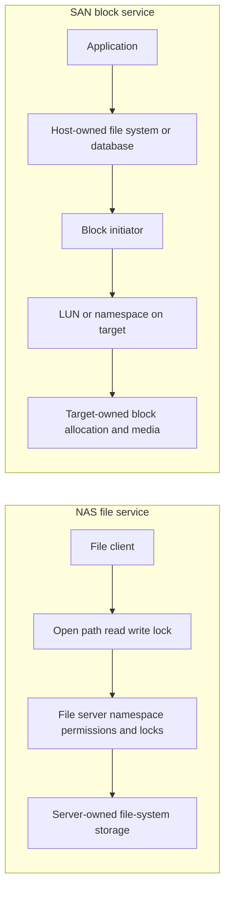

### Core comparison

| Dimension | NAS/file | SAN/block |
|---|---|---|
| Consumer asks for | Named file/directory operation | Read/write/command against block address range |
| Consumer role | File client | Block initiator |
| Provider role | File server | Block target |
| Presented object | Share/export and namespace path | Logical Unit Number (LUN) or NVMe namespace |
| File-system owner | Usually server/storage service | Usually host, hypervisor, database, or clustered file-system owner |
| File permissions/locks | Enforced/coordinated by file service and protocol with identity dependencies | Host/application layer; target normally sees block commands, not file users |
| Access control at storage edge | Share/export policy plus file security | Fabric zoning, target mapping/masking, initiator identity, protocol auth as applicable |
| Path resilience | File-client/session/path mechanisms | Multipath I/O (MPIO) and target/fabric path mechanisms |
| Common protocols | NFS, SMB | iSCSI, FC, FCoE, NVMe/FC, NVMe/TCP |

The table describes common ownership, not every product or clustered implementation.

---

## 2. Terms and ownership boundaries

### Plain-English deep-dive: containers are not interchangeable

| Term | Plain meaning | Analogy | Ownership implication |
|---|---|---|---|
| **Share** | SMB-published file-service entry point and policy. | A named public entrance to part of a building. | Share access and file-system access can both matter. |
| **Export** | NFS publication/policy allowing specified clients access to a file-system path or object. | A guest list and doorway rule. | Export policy is not the same as host file permissions. |
| **Namespace** | Organized set of names/paths visible to clients. | A library catalog and shelf map. | File server owns mapping from path to file object/data. |
| **Volume** | A logical storage container; meaning depends on the owning layer. | A room whose owner must be named. | Host volume and storage-system volume are not automatically the same object. |
| **LUN** | A logical block device addressed through SCSI-related protocols. | A numbered blank disk presented through a service counter. | Host owns partition/file-system use; target owns presentation and backing storage. |
| **NVMe namespace** | A quantity of nonvolatile storage addressable by an NVMe controller. | A numbered high-speed storage workspace. | Host uses logical blocks; subsystem controls presentation and access. |
| **Initiator** | Host endpoint that starts block commands. | Tenant requesting reads/writes to its unit. | Initiator identity is used in access/mapping and path design. |
| **Target** | Endpoint receiving block protocol commands. | Warehouse provider serving numbered units. | Target exposes devices/namespaces and status, not the host file tree. |
| **Mount** | Host attaches a file system or remote file namespace into its local path tree. | Connecting another room into the building map. | A mount can be local block file system or remote NFS/SMB-like path depending on context. |
| **Datastore** | Hypervisor-managed storage container for virtual-machine files/objects. | A managed parking structure for VM disks. | It can sit on NAS or on a SAN LUN formatted by the hypervisor. |

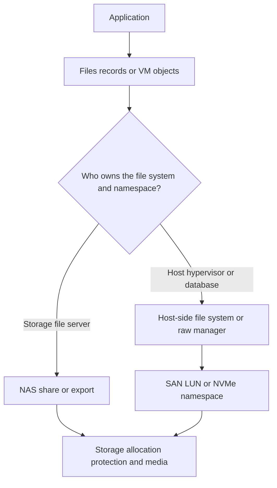

### Ownership rule

Before changing anything, state:

1. Who owns the application data model?
2. Who owns the file system or database structures?
3. Who owns access policy and identity?
4. Who owns the network/fabric and paths?
5. Who owns storage presentation and backing capacity?
6. Who can safely quiesce, unmount, rescan, resize, fail over, restore, or repair?

An action safe at one layer can corrupt or interrupt another. For example, presenting one ordinary host file system read/write to two uncoordinated hosts can corrupt it even when SAN connectivity is perfect.

---

## 3. NAS request semantics and data path

A NAS client sends file-oriented operations. The exact request depends on NFS/SMB version, but the conceptual path includes name resolution, session/authentication, namespace lookup, authorization, lock/lease state, server file-system processing, and storage allocation.

### NAS read sequence

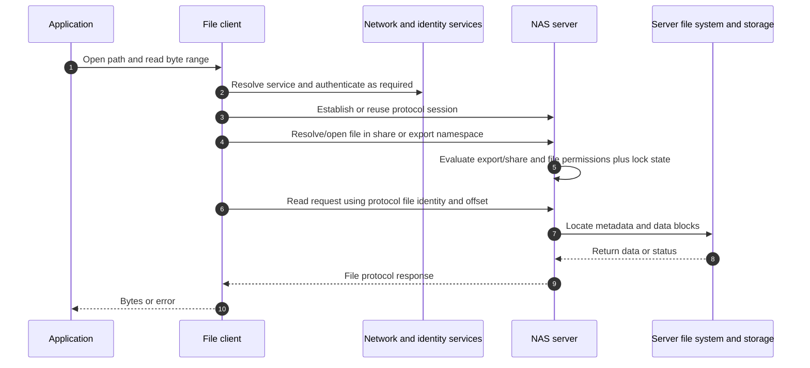

### File request field orientation

| Scope | Fields/identities to orient on |
|---|---|
| Network | Client/server IP, ports, TCP connection, DNS name, path, MTU |
| Session | Protocol/dialect/version, session/client identity, authentication, reconnect state |
| Namespace | Share/export, path, junction/referral, file handle/file ID |
| Operation | Open/create/read/write/close, byte offset, length, flags, status |
| Concurrency | Lock, lease, delegation, share mode, retry/reclaim state |
| Security | User/group, UID/GID, Kerberos/service identity, share/export and file ACL/mode |
| Server | File-system object, cache, queue, volume, backing pool, snapshot state |

### NAS namespace

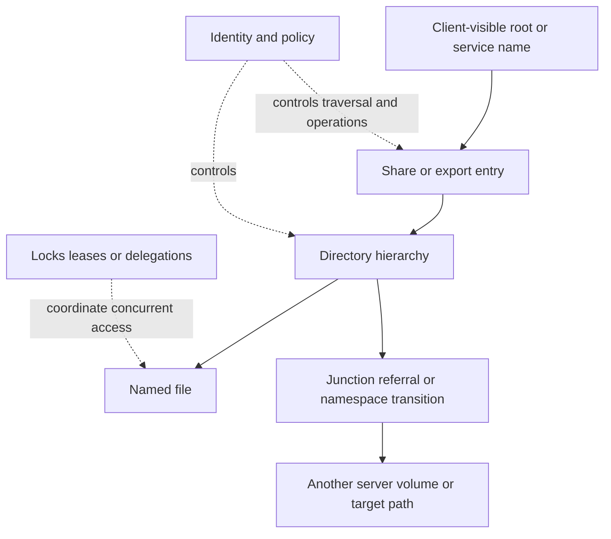

NAS can centralize shared namespace and file-level policy, but it introduces dependencies on DNS, identity/name services, protocol state, and server-side metadata operations.

---

## 4. SAN request semantics and data path

A SAN initiator sends block commands through one or more paths. For SCSI-oriented SAN, commands include reads, writes, inquiry, capacity, and status. For NVMe-oF, the command and queue model differs, but the ownership principle remains: the host sees block-addressable storage and normally owns higher-level file structures.

### SAN read sequence

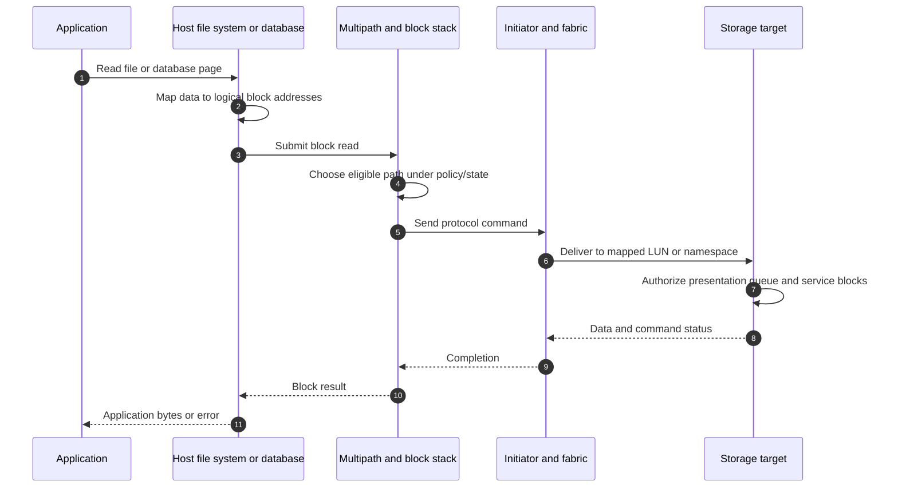

### Block request field orientation

| Scope | Fields/identities to orient on |
|---|---|
| Host | Device identity, file system/database owner, mount, queue, timeout, reservation |
| Initiator | IQN/WWPN/NQN or implementation identity, adapter/driver/firmware |
| Path | Portal/IP/session/connection for iSCSI, FC fabric/port identity, NVMe transport/controller |
| Presentation | Target identity, LUN ID or namespace ID, mapping/masking, subsystem/igroup concept |
| Command | Operation code, logical block address, transfer length, command/tag/queue ID |
| Status | Good/completion, sense/status/path error, timeout, retry, aborted/reset behavior |
| Storage | Backing object, allocation, protection, cache, controller/node, target port |

### Ownership stack

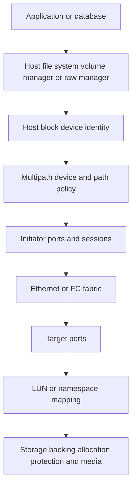

The target can snapshot or replicate backing blocks, but it does not automatically know whether the host file system or application was consistent at that instant.

---

## 5. File-system and namespace ownership

### Plain-English deep-dive: who owns the map decides who can repair it

In NAS, the server owns the file system and shared namespace. In SAN, the host normally owns the file system placed on the LUN. **Analogy:** If the library owns the catalog, patrons do not repair catalog pages. If a tenant owns the warehouse inventory ledger, the building owner must not rewrite it. **Why it matters:** repair, resize, snapshot, restore, and multi-host access must be coordinated with the actual owner.

| Operation | NAS common owner | SAN common owner | Coordination required |
|---|---|---|---|
| Create directory/file | Client requests; server file system executes | Host file system executes block writes | Application/file-service policy |
| Format file system | Storage/file-service administrator under product model | Host/hypervisor administrator | Never format a presented production LUN casually |
| File-system check/repair | Server/storage product procedure | Host file-system owner | Quiesce/mount state, backup, product support |
| Expand backing storage | Storage owner plus NAS volume procedure | Storage expands LUN, then host rescans and expands upper layers | Order and supportability matter |
| Snapshot backing data | Storage platform | Storage platform, but host/app consistency is separate | Application coordination and restore testing |
| Multi-host read/write | File service coordinates protocol sharing | Requires cluster-aware file system/application/reservations/design | Ordinary file systems are not safely shared by assumption |

### Split-ownership failure

If a storage team restores an old SAN LUN while the host still has the file system mounted, the host may hold stale cache and metadata state. If a host formats the wrong newly presented LUN, storage connectivity can be healthy while data is destroyed. Ownership and destructive-action controls are part of architecture, not paperwork.

---

## 6. Shares, exports, permissions, locks, and identity

NAS commonly has multiple access checks:

- Service/share/export admission.
- Client identity and authentication.
- File/directory permissions or Access Control Lists (ACLs).
- Name mapping between identity systems where required.
- Concurrent-open rules, locks, leases, or delegations.

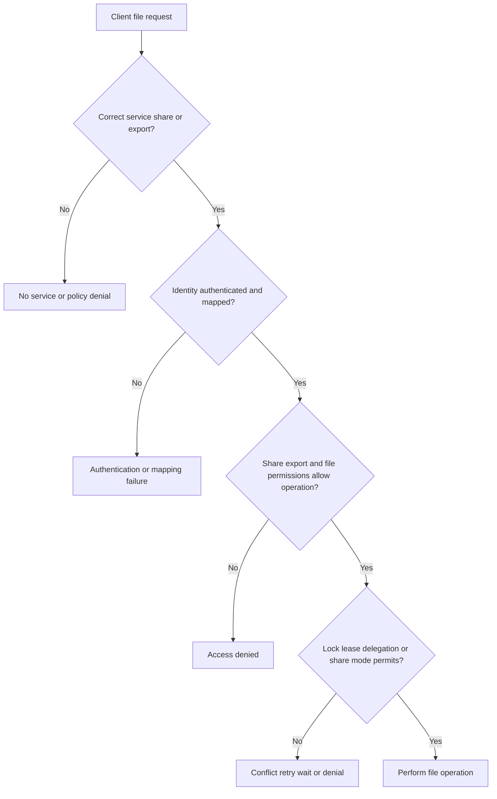

### Block access controls are different

- **Zoning** controls which FC endpoints can communicate through a fabric.
- **LUN masking/mapping** controls which initiator identities can see/access a logical unit at the target.
- iSCSI can add network segmentation, target/portal controls, and Challenge-Handshake Authentication Protocol (CHAP), but CHAP limitations are covered in Part 17.
- NVMe-oF subsystems map authorized host identities to namespaces under the implementation.
- Host file permissions are above the target's block access. A target allowing a LUN to an initiator does not grant a Windows user file permission.

Security needs both connectivity and least-privilege data access. `Dedicated SAN` or `storage VLAN` is not a complete security model.

---

## 7. Zoning, masking, mapping, and MPIO

### Plain-English deep-dive: road permit, building key, and route planner

- **Zoning** is the fabric road permit: which FC initiator and target ports can exchange frames.
- **Masking/mapping** is the building key: which initiator can access which LUN or namespace.
- **MPIO** is the route planner: the host combines eligible paths to one logical device, selects paths, detects failure, and retries/fails over under supported behavior.

All three must be correct. A host can log into a target but see no LUN because mapping is absent. It can see one LUN through several paths but create duplicate devices if multipath configuration is missing.

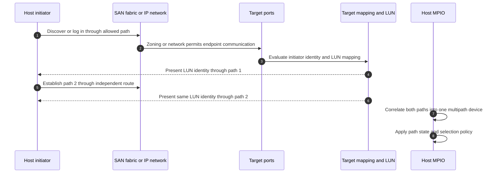

### MPIO concepts

| Term | Meaning | Risk if misunderstood |
|---|---|---|
| Path | One host-initiator-to-target route to a device | Multiple path entries are not duplicate capacity. |
| Path state | Usable/preferred/optimized/non-optimized/standby/unavailable concepts under protocol/implementation | Sending on the wrong state can hurt performance or availability. |
| Policy | Rule selecting among eligible paths | Round-robin label does not mean identical device behavior or support. |
| Failover | Move I/O after path failure | Timeout and retry must fit application tolerance. |
| Failback | Return to preferred path | Aggressive failback can oscillate during instability. |
| Device identity | Stable identifier correlating paths to one device | Wrong identity/mapping can merge different devices or expose duplicates. |

Exact Asymmetric Logical Unit Access (ALUA), Asymmetric Namespace Access (ANA), host utilities, path policies, and supported settings are deferred to Parts 17-18 and NetApp-specific Parts 30-31.

---

## 8. Data, control, and management planes

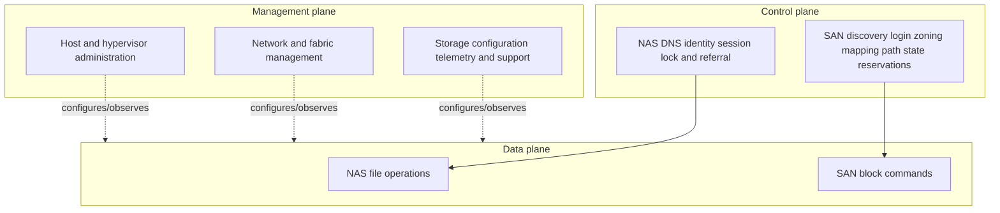

### Plane failures

- Existing NAS sessions may continue during a temporary management-interface outage; new DNS/auth/session operations can still fail.
- Existing SAN I/O can continue while a discovery service is unavailable, depending on established sessions and implementation.
- A management-plane change can affect all data paths simultaneously.
- Control-plane recovery can lag physical link recovery.
- A monitoring dashboard reachable out-of-band does not prove data-plane performance.

---

## 9. Redundancy and failure domains

### NAS failure domains

- Client NIC/team and virtual switch.
- DNS resolver and authoritative data.
- Identity, Kerberos, LDAP/AD, NIS, certificate, and time services as applicable.
- Ethernet switches, VLANs, routes, firewalls, load balancers, and LIF/interface paths.
- File-server node/controller, namespace/referral, backing volume/pool, and site.
- Client/session/lock recovery behavior.

### SAN failure domains

- Host bus adapter (HBA) or NIC, driver, firmware, PCIe/root/host.
- Independent FC fabrics or Ethernet VLAN/switch/routed paths.
- Zoning, target mapping, iSCSI portals, target ports/adapters, controllers/nodes.
- MPIO software, path policy, timeout, ALUA/ANA state.
- Shared LUN backing pool, storage HA pair/controller domain, power/site.
- Clustered application/file-system quorum and reservation design.

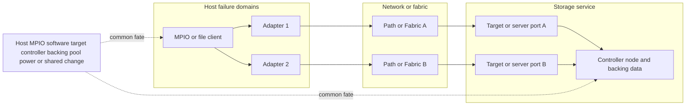

Two paths to one target controller improve path availability but do not protect against that controller or common data-service failure. Two controllers at one site do not provide site disaster recovery.

---

## 10. Performance and scaling

NAS and SAN performance cannot be ranked by protocol label alone.

| Dimension | NAS considerations | SAN considerations |
|---|---|---|
| Request unit | File/metadata operation and byte range | Block command and logical block range |
| Metadata | Server resolves namespace and file metadata | Host file system/database resolves metadata |
| Concurrency | Client sessions, files, locks/leases, server workers | Queue depth, commands, paths, host/file-system/application concurrency |
| Network | TCP/IP/Ethernet for NFS/SMB | Ethernet/IP for iSCSI/NVMe-TCP or FC/FCoE fabric |
| Caching | Client and server file caches/protocol semantics | Host page/file cache, database cache, target cache |
| Scaling | Clients, directories/files, namespace, server nodes/interfaces | Hosts, initiators, paths, target ports, LUNs/namespaces, queues |
| Bottleneck | Metadata, lock contention, identity, network, server/storage | Host queue, path/member, target port/controller, backing storage |

### Scaling map

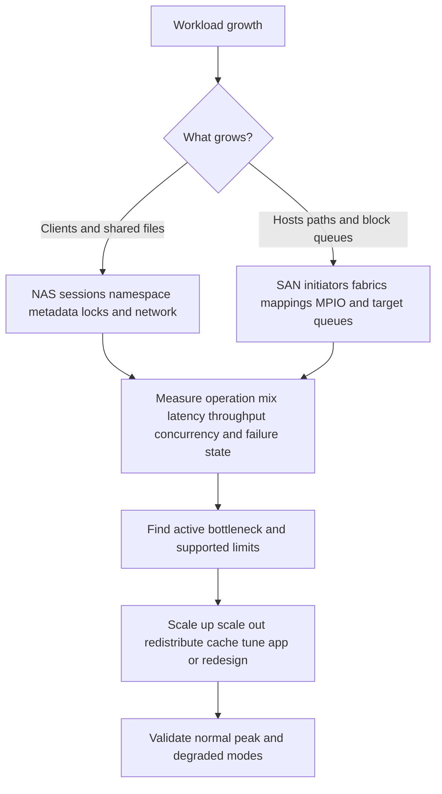

### False performance comparisons

- `Block is always faster than file.` The complete workload, implementation, network/fabric, cache, protocol, host/server CPU, metadata, queueing, and design determine results.
- `NAS is simpler, so it cannot scale.` Shared namespace can simplify consumers; scale depends on architecture and workload.
- `FC has no network problems.` FC has fabric, credit, congestion, zoning, optics, and path failure modes.
- `More paths multiply one workload's throughput.` Path policy, protocol connections, queueing, ownership, and bottlenecks decide.
- `Low storage latency proves application performance.` Identity, locks, file-system, network, compute, and serialization can dominate.

---

## 11. Snapshots, backup, restore, and application consistency

A storage snapshot captures storage-layer state according to the platform. **Crash-consistent** means the captured blocks resemble an abrupt power loss at that instant. **Application-consistent** means application and dependent file-system/database state were coordinated to a recoverable point under a defined process.

### Consistency sequence

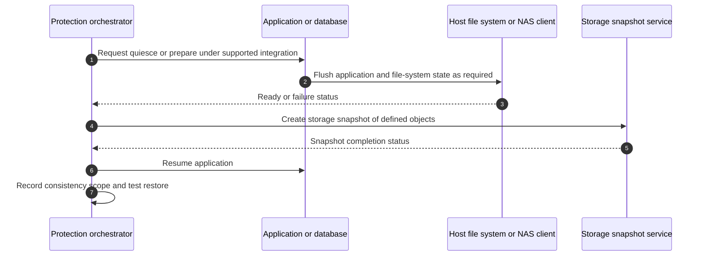

### NAS protection considerations

- Server snapshot may capture a file-system-consistent point but not every client application's in-memory transaction state.
- Open files, locks, database/log coordination, SMB/NFS integrations, and client caches matter.
- File-level restore and namespace permissions must be validated.

### SAN protection considerations

- Storage sees blocks, not automatically database transactions or host cache.
- Coordinate application, host file system, volume manager, cluster, and all LUNs in a consistency group where required.
- LUN restore while mounted can be dangerous.
- Host identifiers, reservations, signatures, and multipath must remain coherent after clone/restore.

Backup, snapshot, replication, and disaster recovery remain distinct, as Part 8 established. A snapshot is not a backup merely because it is fast to create.

---

## 12. Virtualization mappings

Virtualization can use either file or block storage and adds another ownership layer.

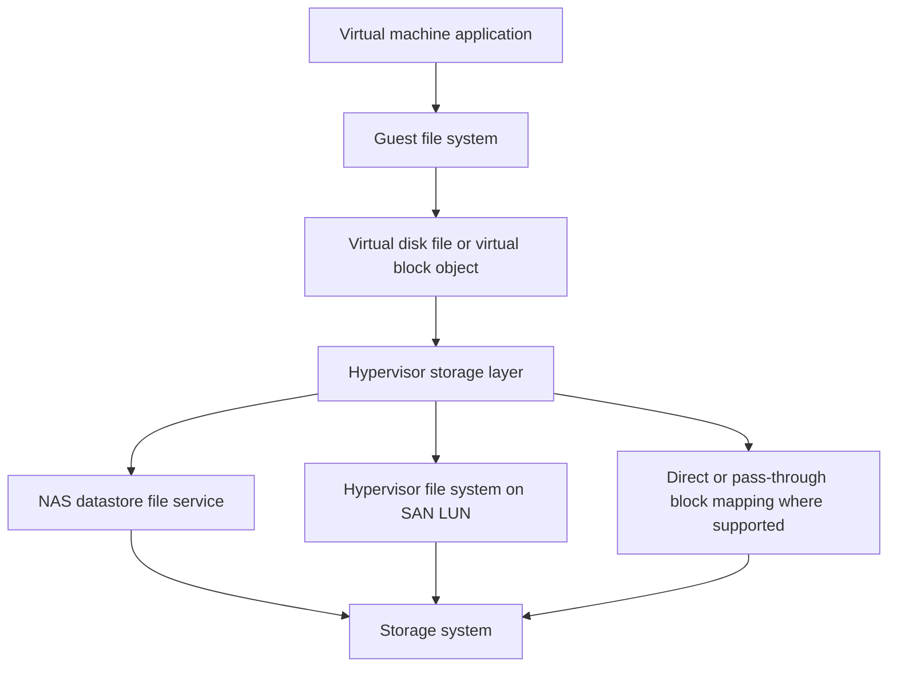

### Mapping questions

- Does the guest see a virtual disk, network file share, raw/direct device, or application-level storage client?
- Does the hypervisor own a datastore file system on a LUN, or consume a NAS datastore?
- Which layer snapshots the VM, virtual disk, datastore, LUN/volume, and application?
- Which multipath layer owns physical storage paths?
- What happens to locks, reservations, identity, and consistency during host migration/failover?
- Which host/hypervisor/adapter/driver/firmware/storage combination is supported?

Do not call a virtual disk `a LUN` unless the mapping truly presents one. Names at each layer must remain distinct in inventory and incidents.

---

## 13. Use-case decisions and false comparisons

### Decision criteria

| Requirement | File/NAS can fit when | Block/SAN can fit when |
|---|---|---|
| Shared files across many clients | Central namespace, file locks, permissions, and file protocol are desired | Requires a cluster-aware upper layer; ordinary block devices alone do not share files safely |
| Host-controlled file system | Not the usual reason to choose NAS | Host/hypervisor/database needs block-device ownership |
| User/home/project shares | File identity, ACLs, quotas, and namespace align | Block adds an unnecessary host file-service layer unless specifically required |
| Database | Database supports/certifies file protocol and workload fits | Database/host expects raw/block or local file system; multipath and consistency are designed |
| Virtualization | Hypervisor supports NAS datastore and operational model fits | Hypervisor file system on LUN or block integration fits |
| Boot | Network file boot can exist in specific designs | Boot-from-SAN is a supported use case under exact host/fabric design |
| Operational ownership | File team/storage service should own namespace | Host/app team should own file system and cluster coordination |
| Isolation/security | File-level identities/policies are central | Dedicated device presentation and host-level security fit, with zoning/masking |

### Decision tree

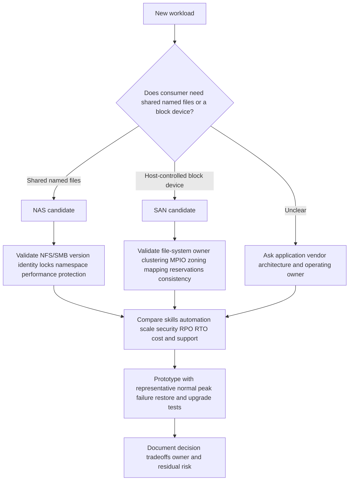

### False comparison corrections

| False comparison | Correct question |
|---|---|
| NAS versus SAN: which is better? | Which request model, ownership, sharing, performance, protection, security, skill, and support model fits this workload? |
| File versus block latency from one benchmark | Were workload, hardware, caching, queue depth, network, protocol, concurrency, and consistency equivalent? |
| SAN is dedicated, so secure | Are zoning, masking, initiator identity, host security, management, and data encryption correctly designed? |
| NAS permissions are enough | Do share/export, file ACL/mode, identity mapping, locks, network, and admin controls align? |
| Snapshot solves backup | Can the workload be recovered after corruption, deletion, platform/site loss, or compromise under required RPO/RTO? |

---

## 14. Troubleshooting by ownership layer

### NAS fault tree

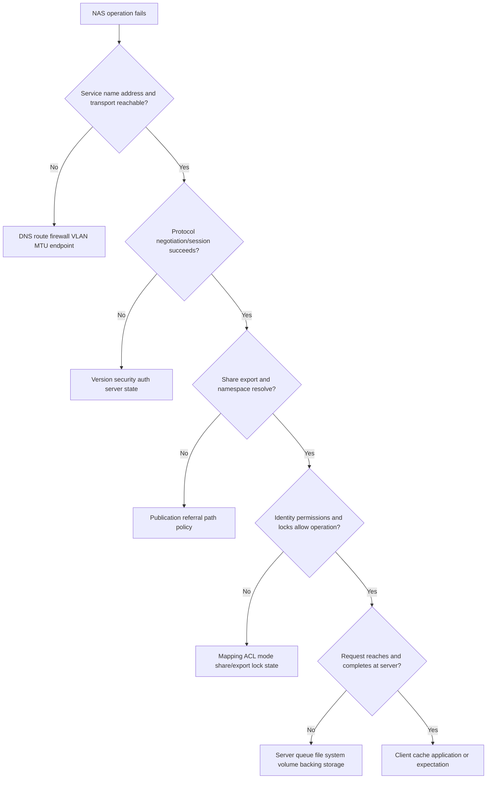

### SAN fault tree

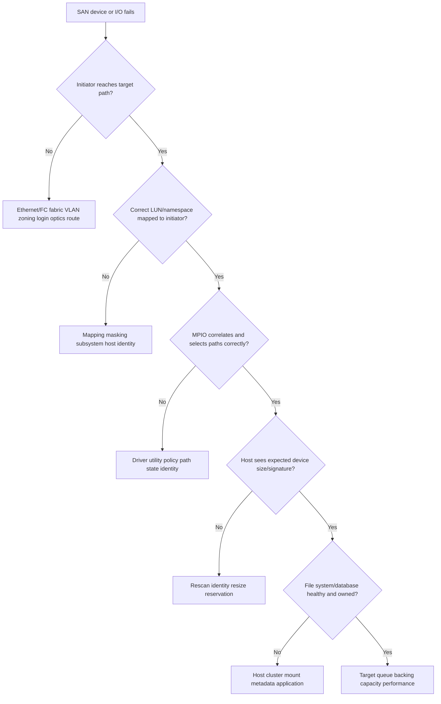

### Common failure examples

| Symptom | NAS candidate | SAN candidate |
|---|---|---|
| Access denied | Share/export/file permission, identity mapping, auth | LUN mapping/initiator auth at presentation; host file permission above block layer |
| Stale object | File handle/referral/cache/namespace | Device identity/rescan/path/signature, not a file handle |
| One path lost | NIC/team, LIF/server path, TCP/session recovery | HBA/NIC, fabric, target port, MPIO state/policy |
| Slow metadata | Directory/file lookup, identity, locks, server metadata | Host file-system metadata over block I/O, host cache/queue |
| Duplicate devices | Unusual for file mount identity; duplicate mount names/paths possible | Missing/wrong multipath correlation is a classic candidate |
| Corruption after multi-host access | File protocol/server locking issue or application semantics | Ordinary non-cluster file system presented read/write to multiple hosts |

---

## 15. Observability and escalation evidence

### Evidence map

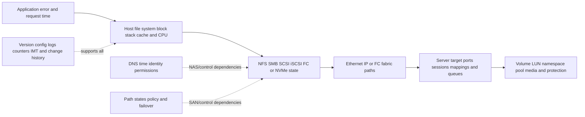

### NAS escalation pack

- Business operation, path/name, client population, impact, objective, and UTC timeline.
- Client OS/build, NFS/SMB version/dialect, mount/share options, network path, caches, and application.
- DNS, time, identity, Kerberos/LDAP/AD/name mapping, user/group, share/export, file permission, and lock/lease evidence as applicable.
- Server/service identity, interface, namespace/junction/referral, volume, file/object identity, operation/status, request timing, and server counters/logs.
- Network captures from both ends where authorized, TCP behavior, MTU, loss, retransmission, and switch evidence.
- Exact host/client/network/storage versions and current official/IMT evidence.

### SAN escalation pack

- Business application, host/device/file system/database, affected LUN/namespace, impact, and UTC timeline.
- Host OS/hypervisor, initiator/HBA/NIC, driver/firmware, multipath software/policy, host utilities, timeouts, queues, reservations, and device identity.
- Fabric/network topology, zoning/VLAN/routes, switch models/software, ports/optics/counters, and independent paths.
- Target identity/ports, mapping/masking/igroup/subsystem, LUN/namespace ID/serial/size, path state, backing object, controller/node, and events.
- Command/status/sense or NVMe completion evidence, path failures/retries/resets, target/host queue and latency.
- File-system/cluster/application owner, mount state, consistency, recent resize/restore/clone/change.
- Exact supported combination, IMT notes/date, and unverified components.

---

## 16. TAM discovery, recommendation, and JD Mapping

### Discovery questions

#### Business and application

1. Which service, data, users, criticality, RPO/RTO, performance objective, and change window apply?
2. Does the application require shared named files, host-controlled blocks, clustered access, raw devices, or a certified integration?
3. Who owns application, file system/database, identity, host, network/fabric, storage, protection, and risk decisions?

#### Architecture and state

4. Draw clients/initiators, protocols/versions, switches/fabrics, network services, servers/targets, paths, and backing storage.
5. Draw data, control, and management planes and every common failure domain.
6. For NAS, map name/share/export/path/file identity/permissions/locks. For SAN, map initiator/path/target/mapping/LUN or namespace/MPIO/file-system owner.

#### Performance and protection

7. What operation mix, I/O size, concurrency, queue depth, metadata behavior, locks, throughput, and latency percentiles exist?
8. What happens under peak, member/path failure, controller/node failure, restore, upgrade, and reconnect?
9. What snapshot/backup/replication scope and application-consistency process are tested?

#### Security and supportability

10. Which identity, segmentation, encryption, signing/authentication, zoning, mapping, and least-privilege controls apply?
11. Which exact host/hypervisor/client/initiator/adapter/driver/firmware/switch/protocol/storage versions form the solution?
12. What current official/IMT result and notes apply, and what is unlisted or inaccessible?

#### Decision and validation

13. Which alternatives were compared by ownership, skills, support, scale, performance, resilience, protection, security, and cost?
14. What representative lab/pilot proves normal, peak, degraded, failover, restore, and upgrade behavior?
15. What owner/date/validation/residual risk accompanies the recommendation?

### Recommendation model

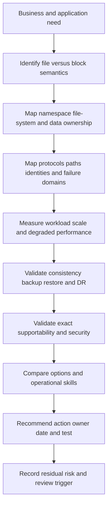

### Explicit JD Mapping

| JD responsibility | Part 14 contribution | Your strength and honest gap |
|---|---|---|
| Understand customer environment | Maps application through file/block ownership, networks/fabrics, and storage | **Strength:** M365 data-service dependency thinking. **Gap:** production NAS/SAN ownership unproven. |
| Storage depth | Explains file/block semantics, LUNs, exports/shares, zoning/masking, and MPIO | **Conceptual/lab:** no production zoning, LUN, or ONTAP administration claim. |
| Risk/stability | Finds split ownership, false sharing, common fate, path and consistency risk | **Strength:** critical-situation risk isolation transfers. |
| Strategic advice | Chooses architecture by workload and operating model rather than protocol slogan | **Transfer:** customer advisory; exact product design needs current evidence/SMEs. |
| Supportability | Builds complete host/fabric/protocol/storage combination and IMT record | **Gap:** no gated customer IMT result claimed. |
| Service review | Converts architecture into business impact, options, actions, and evidence | **Strength:** business reviews and communication. |
| Escalation | Separates application, host, protocol, fabric, target, and storage evidence | **Strength:** Product/Engineering escalation method. |

### Honest production-gap statement

> "I understand the architectural difference: NAS servers own shared file namespace and file operations, while SAN targets present blocks and the host usually owns the file system. My prior production experience gives me data-service, permissions, Windows, Azure, networking, and escalation context. I have not administered production NFS exports, FC zoning, LUN mapping, MPIO, or ONTAP. I would validate exact ownership and current supportability, collect read-only evidence, and work with host, network/fabric, storage, application, and protection specialists before recommending changes."

---

## 17. Fully synthetic case: Northstar Design collaboration platform

> **Synthetic case:** Northstar Design, all workloads, systems, performance data, costs, incidents, and recommendations are fictional. No NetApp customer or product result is asserted.

### Requirements

- 350 engineering users share 22 million project files.
- A database service stores project indexes and transactional workflow state.
- A six-host virtualization cluster runs application servers.
- Designers need shared paths and file locking across Windows and Linux workflows.
- Database vendor guidance in this exercise supports a host-managed file system on block storage.
- RPO is 15 minutes and RTO is 2 hours for the fictional service.
- Operations has strong Windows/AD/file-service skills but limited SAN depth.

### Candidate design

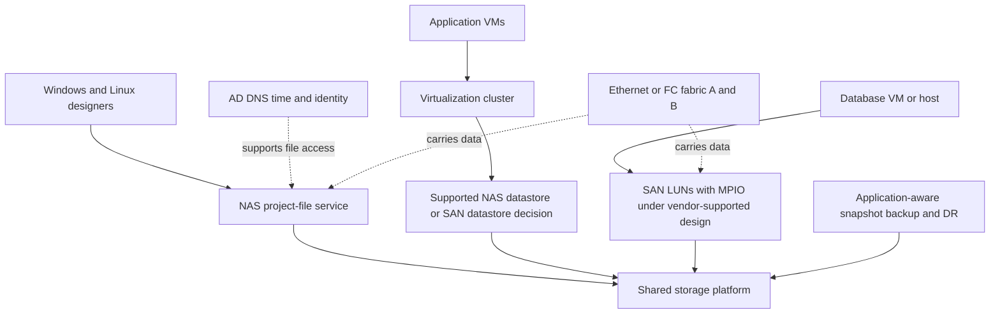

### Decision analysis

| Need | Evidence/constraint | Decision orientation |
|---|---|---|
| Shared project files | Many clients, common namespace, permissions, locks | NAS is a natural candidate; validate SMB/NFS multiprotocol identity and application semantics. |
| Database data | Exercise vendor guidance expects block/host ownership | SAN candidate with host file system, MPIO, consistency integration, and support validation. |
| VM datastore | Both file and block patterns can fit | Compare hypervisor support, skills, performance, protection, migration, and operations; do not choose by slogan. |
| Recovery | File and database have different consistency needs | Coordinate application/database and file-service protection; test integrated service restore. |
| Skills | Strong file/AD, limited SAN | Training/operational complexity is a real decision input, not a reason to ignore application support. |

### Synthetic incident

After a storage change, database latency rises and one host shows two device instances for the same LUN. At the same time, one group reports NAS access denied. The customer assumes one storage-array fault caused both.

### Competing analysis

| Workstream | Evidence | Likely ownership boundary | Discriminating test |
|---|---|---|---|
| Database duplicate devices | Same LUN serial appears on paths not merged by host MPIO after driver change | Host multipath/driver/supportability first | Verify device IDs, path state, driver/utility/config and current IMT |
| Database latency | I/O split across duplicate device views with retries | Host/path mechanism candidate; target evidence still required | Correlate host command latency, path events, target service time |
| NAS access denied | New AD group membership not reflected in effective token/cache; server returns access status | Identity/permission control plane | Compare identity token/group, share/file ACL, server audit/status |
| One array fault | Both services use same platform | Timing alone is correlation; target health does not show common fault | Separate request timelines and storage/controller evidence |

### Fault tree

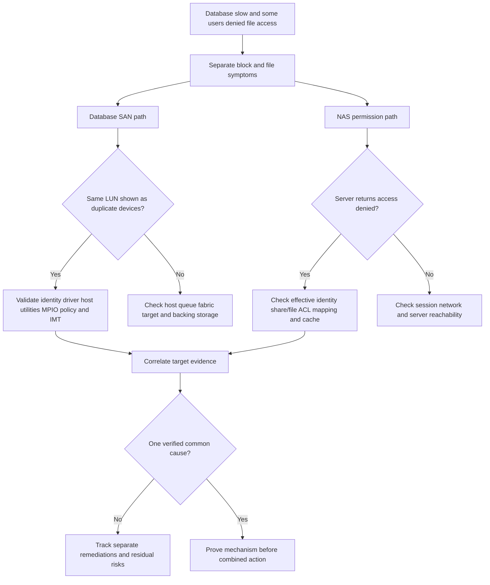

### Recommendations

1. Host/virtualization owner should restore a currently supported multipath configuration for the exact OS, adapter, driver, firmware, protocol, and storage release; preserve device identity and avoid mounting/formatting duplicate views.
2. Identity/file-service owner should validate the affected user's effective identity and both share and file permissions, then address cache/token behavior through supported procedures.
3. Storage owner should supply target path, LUN mapping, controller, latency, event, and health evidence to confirm or disconfirm a target contribution.
4. TAM analysis should keep the workstreams separate until a shared mechanism is proved, while presenting their combined business impact coherently.
5. After remediation, test database I/O/path failure, file access for positive/negative identities, snapshot/application consistency, and service restore.

### Customer-facing summary

> "The two symptoms share a service window but currently cross different ownership paths. The database host sees one LUN through duplicate unmerged device views after a driver change, making multipath support/configuration the leading block-path hypothesis. The file service is returning an authorization result tied to effective identity and permissions. We recommend separate host-MPIO and NAS-identity remediations, with storage-target evidence used to test any common-array hypothesis rather than assuming it."

---

## 18. Paper lab and whiteboard drills

No production access is required. Use synthetic inventories and official public documentation.

### Paper lab scenario

A fictional company needs: a 500-user shared department tree, a database requiring block devices, an eight-host hypervisor cluster, two sites, two Ethernet switches, two FC fabrics, four target ports, 15-minute RPO, 4-hour RTO, and application-consistent monthly recovery tests. Current inventory omits driver/firmware and exact protocol versions.

### Tasks

1. Draw NAS and SAN stacks from application to media.
2. Identify client/server and initiator/target roles.
3. List every share, export, namespace, volume, LUN, namespace, datastore, and file-system owner.
4. Draw one NAS read and one SAN read sequence.
5. Map file permissions, share/export policy, identity, locks, zoning, masking, mapping, and host permissions.
6. Design independent NAS and SAN paths and list common fate.
7. Draw zoning/mapping/MPIO discovery and correlate paths to one device.
8. State safe multi-host access requirements; reject ordinary uncoordinated sharing.
9. Build workload fingerprints for shared files, database, and VM datastore.
10. Compare NAS and SAN by operations, skills, scale, performance, security, and support.
11. Create snapshot/application-consistency sequences for file and database data.
12. Draw virtualization mappings and name ownership at each layer.
13. Build normal, peak, path-loss, target-port, controller/node, identity, restore, and site-failure tests.
14. Create exact version/IMT inventory and mark gaps.
15. Write one architecture decision record and one seven-part risk recommendation.
16. Produce separate NAS and SAN escalation packs.

### Whiteboard drills

1. **One sentence:** NAS serves files; SAN serves blocks.
2. **Ownership:** Draw who owns the file system in each model.
3. **NAS read:** Name, identity, permission, lock, file operation, backing blocks.
4. **SAN read:** App, host file system, MPIO, initiator, target, LUN, blocks.
5. **Three controls:** Zoning permits fabric communication, masking permits LUN access, MPIO manages paths.
6. **False sharing:** Explain why two hosts cannot mount an ordinary file system read/write by assumption.
7. **Protection:** Explain why a storage snapshot may be crash-consistent but not application-consistent.
8. **Decision:** Defend file versus block using workload and operating model, not speed mythology.

### Lab completion criteria

- [ ] File and block request semantics are distinct.
- [ ] Every object and file system has a named owner.
- [ ] NAS share/export permissions and file permissions are separate.
- [ ] SAN zoning, masking/mapping, host file permissions, and MPIO are separate.
- [ ] Paths and common failure domains are drawn end to end.
- [ ] Protocol state, security, performance, and protection are included.
- [ ] Virtualization adds explicit guest/hypervisor/storage layers.
- [ ] Snapshot, backup, and application consistency are not conflated.
- [ ] Decisions cite workload, skills, supportability, and tests.
- [ ] Production NetApp/SAN experience is not implied.

---

## 19. Self-test

1. Define NAS, SAN, file, block, client, server, initiator, and target.
2. Compare share, export, namespace, volume, LUN, and NVMe namespace.
3. State who normally owns the file system in NAS versus SAN.
4. Draw a NAS read from path to backing blocks.
5. Draw a SAN read from file/database page to target blocks.
6. Orient on file-protocol and block-command fields/identities.
7. Explain namespace, referrals/junctions, and server-side metadata.
8. Explain share/export policy, ACL/mode, identity mapping, and locks.
9. Define zoning, masking/mapping, initiator identity, and MPIO.
10. Explain path state, policy, failover, failback, and device identity.
11. Explain why multiple SAN paths are not duplicate capacity/devices.
12. Explain safe versus unsafe multi-host block access.
13. Draw data, control, and management planes for both models.
14. Identify NAS and SAN failure domains and common fate.
15. Compare performance dimensions without saying one protocol is always faster.
16. Explain scaling for clients/files versus hosts/paths/queues.
17. Distinguish crash-consistent and application-consistent snapshots.
18. Explain backup/restore implications and mounted-LUN restore risk.
19. Draw virtualization on NAS datastore, SAN datastore, and direct block.
20. Use the decision tree for file versus block architecture.
21. Correct at least five false NAS/SAN comparisons.
22. Troubleshoot access denied in NAS and no LUN in SAN by layer.
23. Build separate NAS and SAN escalation packs.
24. Ask the complete TAM discovery set and write a bounded recommendation.
25. Recreate Northstar's two-workstream analysis.
26. Complete the paper lab and all whiteboard drills.
27. Explain security for both without relying on dedicated networks alone.
28. Build the exact supportability inventory and IMT evidence plan.
29. Answer Q1-Q8 aloud.
30. State your strengths and production NAS/SAN gap honestly.

---

## 20. Official Source Anchors

**Date checked: 2026-08-24.** These public standards and official sources anchor architecture and terminology. Standards can be updated; vendor support selects exact versions/features; and NetApp IMT or support content can require authentication. Validate current standard status, host/hypervisor/application guidance, adapter/driver/firmware, network/fabric, protocol, storage release, and IMT notes. Do not invent support matrices, product internals, or performance rankings.

| Topic | Official public source | Access, version, and use note |
|---|---|---|
| Storage terminology | [SNIA Dictionary](https://www.snia.org/education/online-dictionary) | Vendor-neutral definitions for NAS, SAN, LUN, initiator, target, and related concepts; not a support matrix. |
| NFSv4.0 | [RFC 7530 - Network File System Version 4 Protocol](https://www.rfc-editor.org/rfc/rfc7530) | Protocol standard; NFSv4.1 is separately specified and exact client/server support must be validated. |
| NFSv4.1 | [RFC 8881 - NFS Version 4 Minor Version 1](https://www.rfc-editor.org/rfc/rfc8881) | Protocol standard including v4.1 concepts; implementation features remain version-specific. |
| SMB protocol family | [Microsoft Open Specifications - SMB protocols](https://learn.microsoft.com/en-us/openspecs/windows_protocols/ms-smb/) | Official Microsoft protocol documentation; exact Windows/NetApp dialect and feature support requires current validation. |
| iSCSI | [RFC 7143 - Internet Small Computer System Interface](https://www.rfc-editor.org/rfc/rfc7143) | Consolidated iSCSI standard; security, multipath, and host-target support remain implementation-specific. |
| SCSI architecture | [INCITS Technical Committee T10](https://www.t10.org/) | Official standards committee area; full standards and current revisions can have access constraints. |
| Fibre Channel overview/standards ecosystem | [Fibre Channel Industry Association](https://fibrechannel.org/) | Industry association public education; normative FC standards are maintained through standards bodies and exact access/revisions vary. |
| NVMe specifications | [NVM Express Specifications](https://nvmexpress.org/specifications/) | Official public specification area. Select current base and transport specs; exact host/subsystem support requires validation. |
| Microsoft MPIO overview | [Multipath I/O overview](https://learn.microsoft.com/en-us/windows-server/storage/mpio/mpio-overview) | Official Windows Server documentation; policies, DSMs, and vendor support are version-specific. |
| VMware storage documentation | [VMware vSphere Storage documentation](https://techdocs.broadcom.com/us/en/vmware-cis/vsphere/vsphere.html) | Official current vendor documentation area; access/navigation and release content can change. Validate exact vSphere release and storage combination. |
| NetApp NAS management | [ONTAP NAS management documentation](https://docs.netapp.com/us-en/ontap/nas-management/) | Official public area. Select exact release for namespace, NFS, SMB, identity, and operational behavior. |
| NetApp SAN management | [ONTAP SAN storage management documentation](https://docs.netapp.com/us-en/ontap/san-management/) | Official public area. Select exact release for LUNs, igroups, protocols, host integration, and operations. |
| NetApp virtualization context | [NetApp virtualization solutions documentation](https://docs.netapp.com/us-en/netapp-solutions/virtualization/) | Official public solution area; validate current hypervisor/product scope and exact support in IMT. |
| NetApp interoperability | [NetApp Interoperability Matrix Tool](https://imt.netapp.com/) | Official, potentially gated, and time-sensitive. Save exact solution/result/notes/date; do not infer support from this lesson. |

### Source-use discipline

- Define which layer owns every volume, file system, namespace, device, path, and consistency point.
- Treat protocol standards as behavior references, not product support claims.
- Verify application/database/hypervisor certification and current host/fabric/storage combinations.
- Save dated IMT evidence and notes for protocol, host OS, adapter, driver, firmware, switch, multipathing, and storage release.
- Validate destructive operations, multi-host access, restore, and resize through owner-approved procedures.
- Report benchmark scope and avoid universal file-versus-block performance claims.

---

## Likely Interview Questions

### Q1. What is the architectural difference between NAS and SAN?

> **Model answer:** "NAS presents a file service: clients ask a server to open, read, write, lock, and secure named files in a server-owned namespace. SAN presents block devices: initiators send commands to targets for LUNs or namespaces, and the host, hypervisor, database, or cluster normally owns the file system and data structures. The distinction is request semantics and ownership, not simply Ethernet versus Fibre Channel."

**Follow-up depth:** Draw both stacks, name shares/exports versus LUNs/namespaces, and explain where permissions and locks live.

### Q2. Walk through one NAS read and one SAN read.

> **Model answer:** "For NAS, the application asks the file client to open a path; DNS/identity/session dependencies resolve, the server checks share/export and file access plus lock state, maps the file and byte offset to server storage, and returns a protocol response. For SAN, the application and host file system map a file or database page to logical blocks, MPIO selects an eligible path, the initiator sends a block command to a mapped LUN or namespace, and the target returns data and status."

**Follow-up depth:** Name the request/session/device fields needed to correlate each flow and explain what TCP or FC delivery does not prove.

### Q3. Who owns the file system, and why is that critical during changes or recovery?

> **Model answer:** "In common NAS architecture the file server/storage service owns the file system and shared namespace. In common SAN architecture the host or clustered application owns the file system on the LUN. That decides who can format, repair, mount, resize, quiesce, snapshot, restore, and coordinate multi-host access. A storage restore beneath a mounted SAN file system or presenting one ordinary file system read/write to uncoordinated hosts can cause corruption even with healthy paths."

**Follow-up depth:** Describe the safe order for LUN expansion and the coordination needed for application-consistent snapshots.

### Q4. How do NAS permissions differ from SAN zoning and LUN masking?

> **Model answer:** "NAS evaluates file-service admission such as a share or export, client/user identity, file ACLs or modes, name mapping, and lock/share semantics. In FC SAN, zoning controls which initiator and target ports can communicate; target mapping or masking controls which initiator can access which LUN. Host file permissions remain above the SAN target. Connectivity, presentation, and user authorization are separate controls and all should follow least privilege."

**Follow-up depth:** Diagnose `target visible but no LUN`, `LUN visible but file access denied`, and `NFS mount succeeds but file open is denied`.

### Q5. What is MPIO, and what failure modes does it address?

> **Model answer:** "MPIO correlates several initiator-to-target paths for the same block device, tracks path states, selects eligible paths, and handles failover/retry under supported host and storage behavior. It protects path components such as adapters, switches/fabrics, and target ports, but it does not protect an application from every controller, backing-data, site, file-system, or common-software failure. Exact driver, firmware, host utility, path policy, ALUA/ANA, and IMT guidance must be validated."

**Follow-up depth:** Explain duplicate-device symptoms, optimized/non-optimized orientation, failure detection, failback, and common fate.

### Q6. Is SAN faster than NAS?

> **Model answer:** "Not as a universal rule. SAN gives the host block ownership; NAS gives the server file semantics. Performance depends on operation mix, I/O size, metadata, locks, concurrency, queue depth, network or FC fabric, caching, CPU, target architecture, backing media, implementation, and failure state. I compare representative workloads with equal hardware and consistency requirements, then identify the active bottleneck and operational tradeoffs."

**Follow-up depth:** Contrast small-file metadata, database page I/O, one large stream, virtualization, and degraded-path tests.

### Q7. How do snapshots and application consistency differ for NAS and SAN?

> **Model answer:** "A storage snapshot captures storage-layer state. It can be crash-consistent without being application-consistent. For NAS, server file-system state may be consistent while a client application still has uncommitted or multi-file transactions. For SAN, the target sees blocks and normally cannot infer host cache, file-system, database, or multi-LUN transaction state. I use supported application coordination, define the consistency scope, and prove recovery through restore tests; snapshots are not automatically backups."

**Follow-up depth:** Draw quiesce, flush, snapshot, resume, and restore-validation steps for a database using several LUNs.

### Q8. How does your background transfer to NAS/SAN work, and what remains a gap?

> **Model answer:** "My prior production experience gives me strong foundations in shared data services, Windows and Azure, Active Directory and permissions, networking, user impact, high-severity escalation, and evidence-based customer communication. I can use that method to map file and block ownership and troubleshoot by layer. I have not administered production NFS exports, FC zoning, LUN masking, MPIO, or ONTAP. I would verify exact IMT support, use authorized read-only evidence and labs, and involve host, fabric, storage, application, identity, and protection owners for changes."

**Follow-up depth:** Give one factual SharePoint/OneDrive or Windows permissions case, then clearly label what does not prove storage administration experience.

---

## 30-Second Memory Hooks

- **NAS:** Ask the server for a named file.
- **SAN:** Ask the target for numbered blocks.
- **File-system owner:** NAS server versus SAN host, commonly.
- **Share/export:** Doorway and policy into a file namespace.
- **LUN/namespace:** Presented block address space, not a shared file tree.
- **Client/server:** File roles; **initiator/target:** block roles.
- **NAS permission chain:** Service -> identity -> file permission -> lock.
- **Zoning:** Fabric conversation permit.
- **Masking/mapping:** Initiator's key to a specific device.
- **MPIO:** Many paths, one logical device.
- **Two paths:** Path resilience, not two copies of data.
- **Multi-host block:** Requires cluster-aware coordination, not hope.
- **Control plane:** DNS/auth/locks or discovery/zoning/mapping/path state.
- **Snapshot:** Point-in-time blocks; application consistency needs coordination.
- **Virtualization:** Guest disk, hypervisor datastore, and storage object are different layers.
- **Performance:** Workload and implementation beat protocol slogans.
- **Decision:** Semantics + ownership + support + operations + test evidence.
- **Your bridge:** Shared-data and escalation method transfer; NAS/SAN production administration remains unclaimed.

---

## Completion Checklist

- [ ] Define NAS and SAN by request semantics and ownership.
- [ ] Distinguish client/server from initiator/target.
- [ ] Define share, export, namespace, volume, LUN, NVMe namespace, mount, and datastore.
- [ ] Draw NAS and SAN stacks from application to media.
- [ ] Walk a NAS read and SAN read with request/status field orientation.
- [ ] Name the file-system, identity, path, presentation, and protection owner at every layer.
- [ ] Explain NAS share/export, file permissions, identity mapping, and locks.
- [ ] Explain zoning, mapping/masking, host permissions, and why they are different.
- [ ] Explain MPIO paths, identity, state, policy, failover, failback, and common fate.
- [ ] Prevent unsafe ordinary multi-host block access and destructive ownership errors.
- [ ] Draw data, control, and management planes for both architectures.
- [ ] Build complete NAS and SAN failure-domain maps.
- [ ] Compare performance and scaling without universal protocol claims.
- [ ] Explain crash versus application consistency, backup, restore, and mounted-LUN risk.
- [ ] Draw NAS/SAN virtualization mappings and ownership.
- [ ] Use the workload decision tree and correct false comparisons.
- [ ] Apply separate NAS and SAN fault trees and evidence packs.
- [ ] Ask the complete TAM discovery set and write a seven-part recommendation.
- [ ] Recreate Northstar and keep coincident file/block symptoms separate until mechanism is proved.
- [ ] Build exact host/fabric/protocol/storage supportability evidence with date and IMT notes.
- [ ] Complete the paper lab, whiteboard drills, self-test, and Q1-Q8 aloud.
- [ ] State your production strengths and NAS/SAN production gap honestly.
- [ ] Recheck standards, application/vendor guidance, exact versions, and NetApp IMT before customer use.

---

*Next suggested section:* [Part 15 - NFS from Zero: Versions, Mounts, Identity, Locks, and Troubleshooting](Part-15-nfs-versions-identity-locks-troubleshooting.md)