# Part 15 - NFS from Zero: Versions, Mounts, Identity, Locks, and Troubleshooting

> **Section goal:** Understand how an NFS client discovers or reaches a server, obtains namespace access, represents identity, opens and locks files, and sends reads and writes. By the end, you should be able to compare NFSv3 and NFSv4.x, trace mounts and I/O, separate export from file permission, reason about leases and filehandles, and build a packet- and evidence-grounded escalation.

Covers index item **15** and maps directly to job-description responsibilities for storage depth, customer-environment discovery, supportability, risk and stability analysis, proactive recommendations, operational service reviews, and escalation quality.

This Part is vendor-neutral. Exact NFS versions/minor versions, transports, ports, export-policy evaluation, identity sources, Kerberos, locking, delegations, referrals, parallel NFS (pNFS), timeouts, caches, commands, and NetApp behavior are release- and configuration-specific. Validate current client/server documentation and the exact NetApp Interoperability Matrix Tool (IMT) solution and notes.

> **Evidence boundary:** Every organization, hostname, address, export, UID/GID, packet, timing, failure, and recommendation below is synthetic. Your prior data-service, Windows/Azure networking, Active Directory, permissions, identity, and escalation experience is production evidence. Production NFS administration, Linux identity integration, Kerberos for NFS, pNFS, or ONTAP export-policy ownership is not claimed.

---

## 1. NFS architecture and vocabulary

**Network File System (NFS)** is a family of remote file-access protocols. A client sends operations such as lookup, open, read, write, and close to an NFS server, which owns the served file system and namespace.

### Plain-English deep-dive: remote library with durable reference cards

The client asks a remote library to find and operate on files. The server checks whether the client may enter, maps the caller's identity, and returns opaque reference cards called filehandles. The client uses those cards for later operations. If the underlying object is removed or the reference is no longer valid, the card can become stale.

| Term | Plain meaning | Why it matters |
|---|---|---|
| **NFS client** | Host-side software sending NFS requests. | Owns mount options, caches, retries, and client protocol state. |
| **NFS server** | Service exporting file-system objects and processing requests. | Owns namespace, file system, export policy, and server-side state. |
| **Remote Procedure Call (RPC)** | Message framework that lets a client invoke a procedure on a remote program. | NFS operations are represented through RPC messages; program/version/procedure identity matters. |
| **Export** | A server-published file-system path/object plus access policy. | A server can be reachable while the requested export is absent or denied. |
| **Mount** | Client attachment of a remote NFS namespace into the local path tree. | Mount success does not grant every file operation. |
| **Filehandle** | Opaque server-issued identifier for a file-system object. | Clients should not infer its internal structure; stale handles identify an object-reference problem. |
| **UID/GID** | Numeric User Identifier and Group Identifier on Unix-like systems. | Numeric identity can be trusted/mapped incorrectly across client and server. |
| **Lease** | Time-bounded basis for NFSv4 state such as locks/opens. | Client/server recovery must reclaim valid state after disruption. |
| **Delegation** | Server grants a client limited authority to cache/manage some file state under rules and recall. | Improves some workloads but adds recall/recovery behavior. |

```mermaid
flowchart LR
    APP[Application] --> VFS[Client virtual file system]
    VFS --> NFS[NFS client version and mount state]
    NFS --> RPC[RPC and security flavor]
    RPC --> TCP[Transport commonly TCP in modern deployments]
    TCP --> NET[IP Ethernet and network services]
    NET --> SERVER[NFS server]
    SERVER --> EXPORT[Export policy and namespace]
    EXPORT --> ID[Identity permissions locks and leases]
    ID --> FS[Server file system volume and storage]
```

### Planes and owners

- **Data plane:** NFS LOOKUP/OPEN/READ/WRITE/COMMIT and related operations.
- **Control plane:** DNS, mount/discovery where applicable, RPC program mapping, version negotiation, identity, Kerberos, NFSv4 client/session/lease/lock/delegation/referral state.
- **Management plane:** export configuration, namespace/junctions, identity sources, server/client settings, monitoring, packet capture, supportability, and change.

---

## 2. RPC, XDR, and NFS messages

NFS uses RPC. **External Data Representation (XDR)** defines portable encoding for structured data. An RPC message identifies a transaction, message type, RPC version, program, program version, procedure, credentials/verifier, and encoded arguments or results.

### RPC field orientation

| Field | Plain meaning | Diagnostic use |
|---|---|---|
| Transaction ID (XID) | Client-chosen identifier correlating call and reply | Match request/reply and identify retransmission/duplicate behavior, with implementation/capture caveats. |
| Message type | Call or reply | Establish direction. |
| RPC version | RPC protocol version | Distinct from NFS program version. |
| Program | Service program number | Distinguish NFS, mount, lock-related, or other RPC programs. |
| Program version | Version of that RPC program | Distinguish NFSv3 from other versions where represented. |
| Procedure | Operation within program | Identify GETATTR, LOOKUP, READ, WRITE, and others. |
| Credentials/verifier | Authentication material or flavor metadata | Orient on AUTH_SYS/RPCSEC_GSS, not a substitute for full security logs. |
| Accept/reject/status | RPC and application-level outcome | Separate transport, RPC dispatch, and NFS operation errors. |

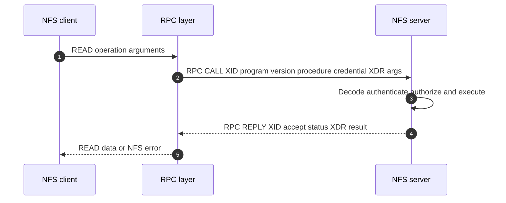

TCP sequence/acknowledgment state is transport evidence. RPC XID is request/reply evidence. NFS stateid/filehandle/operation status is file-protocol evidence. Preserve all three scopes.

---

## 3. NFSv3, NFSv4.0, and NFSv4.1 orientation

### Version comparison

| Dimension | NFSv3 | NFSv4.0 | NFSv4.1 |
|---|---|---|---|
| Broad state model | Often described as stateless for core file operations; locking uses additional state/services | Stateful opens/locks with leases and recovery integrated into protocol family | Adds sessions and stronger sequencing/recovery structure; includes pNFS architecture |
| Namespace | Export/mount model; client mounts server-exported objects | Pseudo-file-system style unified server namespace and referrals concepts | Continues v4 namespace and referrals |
| Port/service orientation | NFS commonly 2049 plus mount/rpcbind and auxiliary services depending on implementation/configuration | NFS operations commonly on TCP 2049; integrated protocol reduces separate auxiliary-service exposure | Commonly TCP 2049; session and pNFS roles add state/paths |
| Operation style | Individual procedures | COMPOUND groups ordered operations | COMPOUND plus sessions/sequence |
| Locking | Network Lock Manager (NLM) and status monitor are common auxiliary concepts | Integrated byte-range locking/open state | Integrated with session/recovery improvements |
| Security | AUTH_SYS and RPCSEC_GSS/Kerberos support depend on implementation | Mandated security framework capabilities in standard; deployment still configured | Continues v4 security framework |
| pNFS | No | No | Architecture permits metadata server to provide layouts for data-server access |

### Plain-English deep-dive: stateless does not mean no state anywhere

NFSv3 core requests contain enough information to process many operations without an NFSv4-style open state, so it is commonly called stateless. But clients cache data, TCP has state, locks use auxiliary state, servers have file systems, and applications have open descriptors. **Why it matters:** `v3 is stateless` does not mean failover/recovery is effortless or that locks cannot be lost.

NFSv4 is explicitly stateful for opens, locks, delegations, client identity, and leases. NFSv4.1 adds sessions and sequencing to improve exactly-once-like request handling under defined slot/sequence rules; do not simplify that into a universal guarantee for application transactions or durable storage.

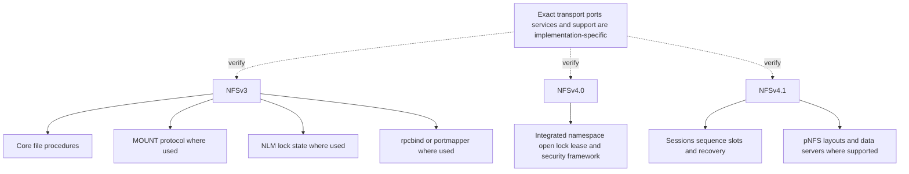

### Version negotiation

Clients can be configured to request a version/minor version or try alternatives. Record the version actually negotiated, not only the mount configuration. Silent fallback can change security, locking, ports, failover, and supportability.

---

## 4. NFSv3 discovery and mount flow

In common NFSv3 deployments, the client can contact an RPC binding service to learn service ports, contact the mount service to obtain a filehandle for an allowed export, then send NFS operations to the NFS service. Exact fixed/dynamic ports, firewall requirements, TCP/UDP support, and server behavior must be verified.

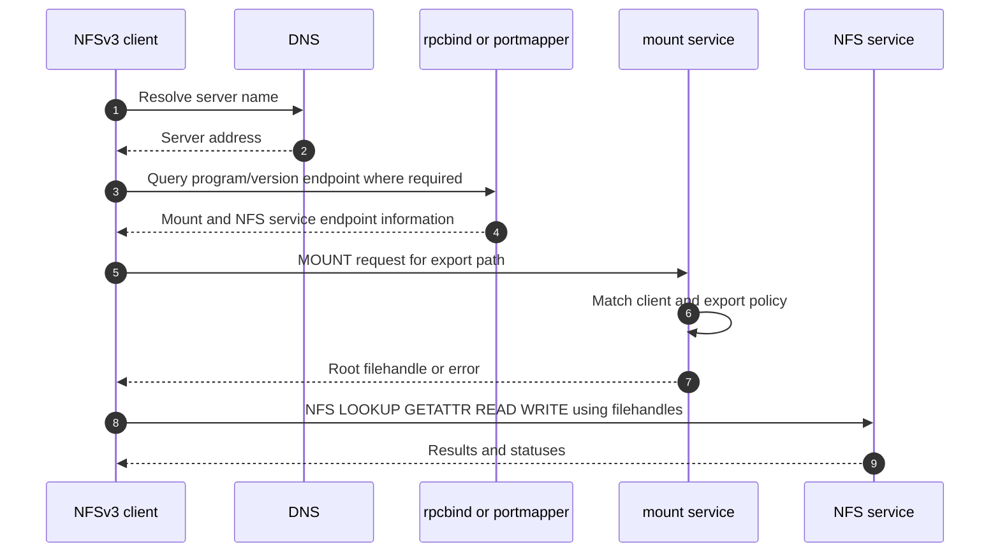

### Firewall implications

- NFSv3 can require more than port 2049 when mount, rpcbind, lock, and status services are involved.
- Configurations may fix auxiliary ports for firewall policy; exact support and procedure are vendor-specific.
- Existing mounts can behave differently from new mounts if discovery/mount services fail.
- A successful RPC program listing is not proof that export policy or file access will succeed.
- Do not open broad port ranges without identifying exact services, versions, transports, owners, and supported design.

---

## 5. NFSv4.x namespace, COMPOUND, and mount orientation

NFSv4 presents a server namespace that clients traverse through protocol operations. A **COMPOUND** request groups several operations in order, reducing round trips and preserving current filehandle context within the compound.

### Simplified NFSv4.1 mount/traverse sequence

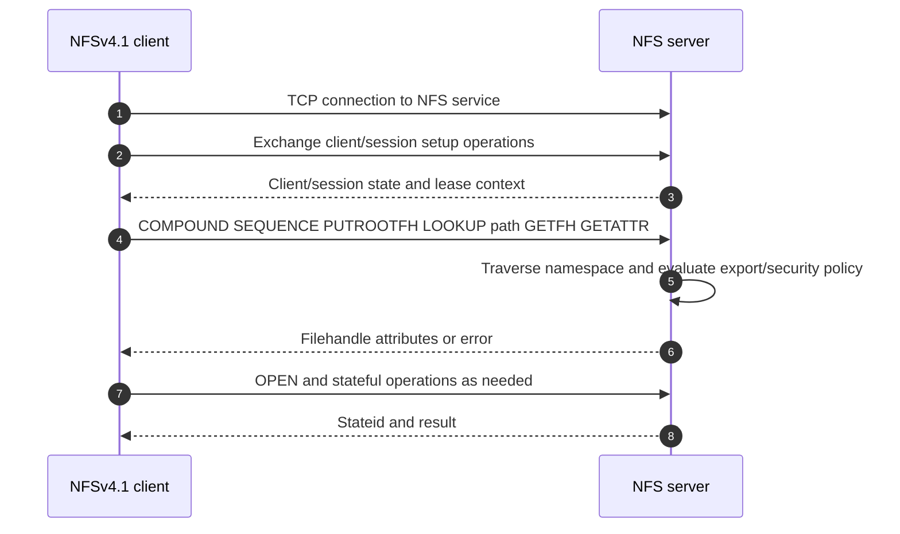

### COMPOUND field orientation

| Item | Diagnostic use |
|---|---|
| Tag/minor version | Identify request context and NFS minor version. |
| Ordered operation list | Find the exact operation that failed; later operations may not execute after error. |
| Current/saved filehandle | Understand namespace object context through PUTROOTFH/PUTFH/SAVEFH/RESTOREFH-like operations. |
| SEQUENCE/session slot | Correlate NFSv4.1 request ordering/replay handling. |
| Stateid | Identify open/lock/delegation state for operations requiring it. |
| Per-operation status/results | Separate namespace, security, state, and I/O errors. |

### Namespace and referrals

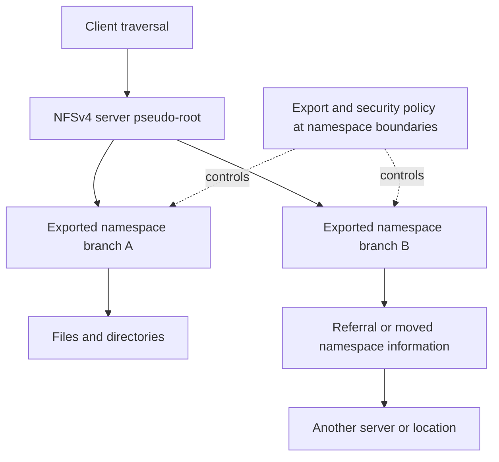

A referral provides location information under protocol semantics; it does not guarantee the client can resolve, route, authenticate, or access the referred server.

---

## 6. Exports, client matching, and policy evaluation

An export policy decides which clients may access a served path and under which security/read/write/superuser rules. Exact rule order and matching semantics are product-specific.

### Client-match inputs can include

- Hostname or domain-like patterns, which add DNS dependencies.
- IPv4/IPv6 address or prefix.
- Network group (**netgroup**) from a name service.
- Security flavor such as AUTH_SYS or Kerberos-based RPCSEC_GSS service.
- Read-only/read-write/superuser mapping controls.
- Protocol/version and implementation-specific rule fields.

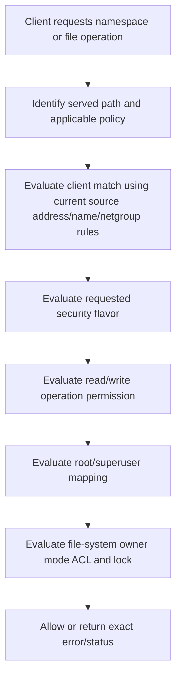

### Export is not file permission

Passing export policy means the request can proceed to file-system checks. A client can mount but receive `permission denied` on a directory because UID/GID, group membership, ACL/mode, name mapping, root squashing, or security flavor differs.

### Client-match risk

Hostname-based rules can behave differently if forward/reverse DNS, case, search domains, resolver views, cache, or failover source addresses differ. Address-based rules avoid some name ambiguity but require lifecycle control for subnet/client changes. Netgroups centralize membership but add directory, cache, schema, and availability dependencies.

---

## 7. UID, GID, AUTH_SYS, LDAP, NIS, and name mapping

### Plain-English deep-dive: a number is not proof of a person

With common **AUTH_SYS** usage, the client supplies numeric identity information in the RPC credential. The server uses those numbers under its trust and export policy. **Analogy:** a visitor writes an employee number on a form; the guard decides whether the issuing office and number are trusted. **Why it matters:** matching names with different numbers, or matching numbers for different people, can grant or deny the wrong access.

| Term | Meaning | Risk |
|---|---|---|
| **UID** | Numeric user identity | Same name can have different UID; reused UID can represent another user. |
| **Primary GID** | Main numeric group | Does not represent all supplementary groups. |
| **Supplementary groups** | Additional group memberships | Credential/group limits, stale caches, or lookup failure can change effective access. |
| **LDAP** | Lightweight Directory Access Protocol directory service | Schema, bind/TLS, search base, DNS, time, certificates, replicas, and cache matter. |
| **NIS** | Network Information Service, an older Unix name-service approach | Security/operational fit and current support must be assessed; do not recommend by habit. |
| **Name mapping** | Translation between identity namespaces or name forms | Ambiguous/missing mappings can produce nobody/default identity or wrong access. |

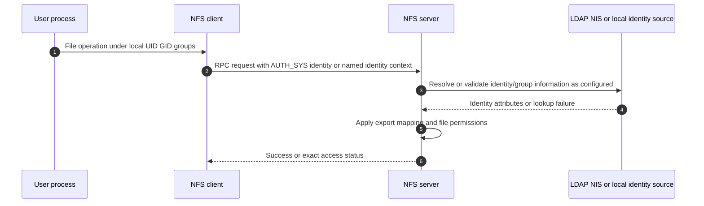

### Identity evidence

- Numeric UID/GID and complete effective groups at client.
- File/directory owner, group, mode, ACL, and server interpretation.
- Security flavor negotiated/used for the failed request.
- Directory query result, replica, cache, TTL, bind/trust/TLS, schema, and timestamps.
- Name-mapping rule/input/output and default/unmapped identity.
- Client source IP and export rule actually selected.

Do not fix access by using world-writable permissions or disabling identity controls. Preserve expected identity and test positive and negative cases.

---

## 8. Root squashing and superuser mapping

The root user traditionally has broad authority on a Unix-like host. Export configurations commonly map or **squash** remote root to an anonymous/unprivileged identity rather than trust client root automatically.

### Root request orientation

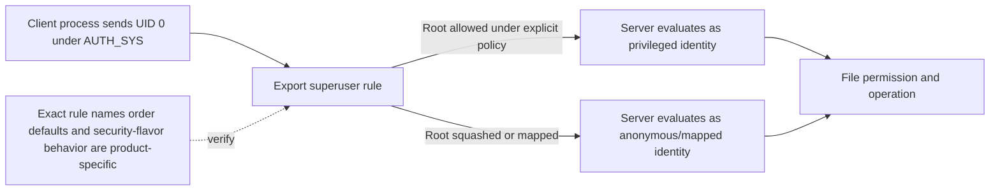

Root squash is a security boundary, not an NFS failure. If an application genuinely requires privileged behavior, validate its supported design, use the narrowest client/path/security scope, and document residual risk. Never disable root mapping broadly merely to make a mount writable.

---

## 9. Kerberos and RPCSEC_GSS security flavors

Kerberos uses trusted authorities and time-bounded tickets so clients and services can authenticate without sending reusable passwords on each operation. NFS commonly uses RPCSEC_GSS with Kerberos mechanisms.

| Common label | Conceptual protection |
|---|---|
| `krb5` | Authentication/integrity framework context without per-message privacy; exact service behavior follows RPCSEC_GSS. |
| `krb5i` | Authentication plus per-message integrity protection. |
| `krb5p` | Authentication, integrity, and privacy/encryption of protected RPC data. |

These labels are deployment shorthand. Verify exact client/server support, cryptographic policy, performance, and whether data/metadata are protected as expected.

### Kerberos-oriented NFS sequence

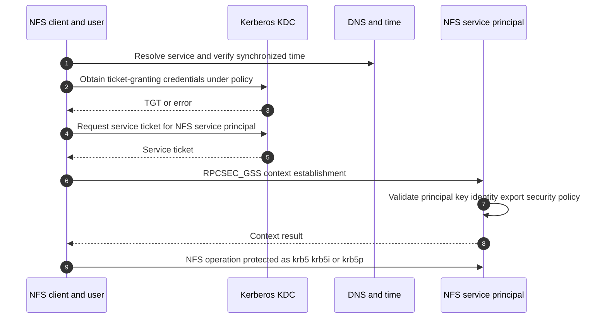

### Kerberos dependencies

- Forward/reverse/service-name DNS and canonicalization behavior.
- Correct service principal and key material/keytab handling.
- Realm/domain trust and Key Distribution Center (KDC) reachability.
- Time synchronization and ticket validity.
- Encryption type/cryptographic policy compatibility.
- User/service identity mapping and export security flavor.
- Client credential cache/session context and server logs.

NTLM is not an NFS authentication fallback. Do not import SMB/Windows assumptions into NFS.

---

## 10. Filehandles and stale-handle failures

A filehandle is opaque server data that identifies a file-system object. Clients obtain filehandles through mount/lookup/get-filehandle operations and use them in later requests.

### Filehandle lifecycle

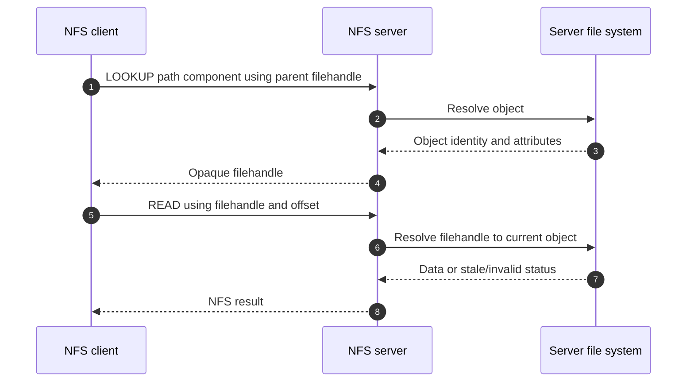

### Stale filehandle candidates

- Exported file system was unmounted, removed, recreated, restored, or replaced and old object identity no longer resolves.
- File/directory was deleted or moved across an implementation boundary while client retains old handle.
- Server failover/recovery or namespace change did not preserve handle validity as expected.
- Client cache/mount remains after server-side destructive change.
- Clone/restore/remount changed file-system identifiers.
- Unsupported configuration or defect affects handle persistence.

Do not delete client data, remount production broadly, or restart servers before preserving topology, filehandle-related status, export/volume events, namespace changes, and scope. Remount can clear a symptom while destroying evidence and disrupting open files.

---

## 11. NFSv4 opens, locks, leases, stateids, and delegations

NFSv4 tracks client and open/lock state. A **stateid** identifies protocol state used by operations. A **lease** gives the client a time-bounded basis for preserving state, renewed through appropriate traffic. After server restart/failover or client disconnection, recovery/reclaim rules determine what state can be restored.

### Plain-English deep-dive: a renewable reservation, not permanent ownership

An NFSv4 lease is like a renewable reservation covering a client's open and locking state. The client must keep the relationship alive; the server must provide protocol-defined recovery behavior after relevant restarts. A **stateid** is the reservation reference used for a particular open, lock, or delegation context. A **grace period** is a controlled recovery interval in which eligible clients can try to reclaim prior state. **Why it matters:** physical link recovery or a new TCP connection does not prove that application locks were reclaimed, and an old stateid cannot be assumed valid after server recovery.

### State lifecycle

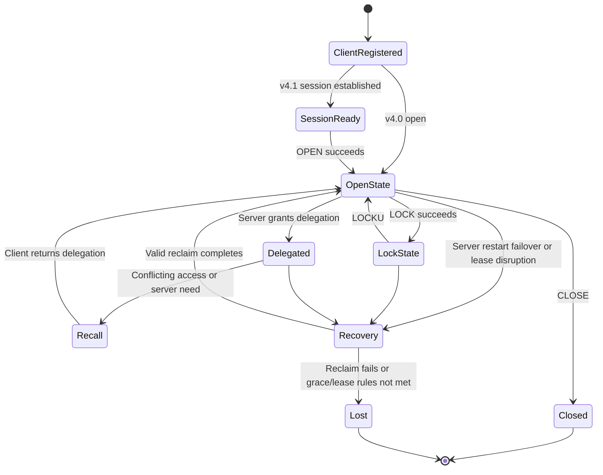

### Lock and lease failures

| Symptom | Candidate cause | Evidence |
|---|---|---|
| Operation waits/denied by lock | Another owner holds conflicting range; stale app process; reclaim state | Lock owner/range/stateid, client IDs, server status, application process |
| Locks lost after failover | Recovery/grace/reclaim failure, lease expiry, client identity change | Server/client recovery logs, protocol statuses, lease timing, clocks |
| Delegation recall delay | Client unreachable/slow or application/cache behavior | CB recall/control path, client logs, recall timing, conflicting request |
| Bad/old stateid | Client uses invalid state after recovery/migration | Stateid status, session/sequence, restart/failover timeline |
| Duplicate/replayed request concern | Network retry versus session sequence handling | XID, SEQUENCE slot/sequence ID, operation result, both-end trace |

Locks coordinate cooperating clients; they do not replace application transaction design. Exact mandatory/advisory behavior depends on client/file system/application semantics.

---

## 12. NFSv4.1 sessions, referrals, and pNFS

An NFSv4.1 **session** provides ordered request slots/sequence information between a client and server. A **referral** directs namespace traversal to another location. **Parallel NFS (pNFS)** lets a metadata server provide a layout so a client can access data servers more directly under protocol rules.

### pNFS conceptual flow

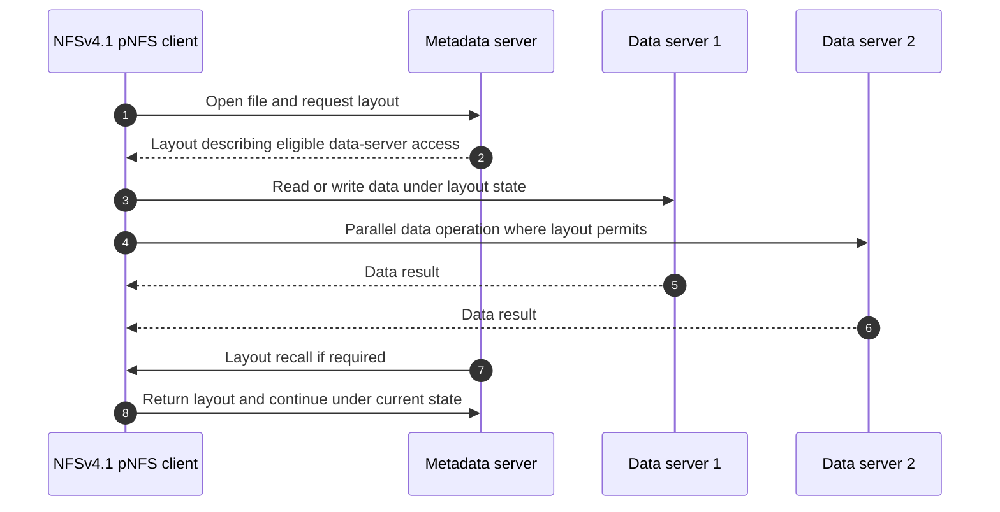

### pNFS and referral caveats

- Client, server, layout type, network paths, and version must all support the design.
- Metadata path success does not prove every data-server path.
- Firewall, DNS, routing, MTU, security flavor, and identity must work for returned locations.
- Layout recall/recovery and failure behavior matter to availability.
- Do not claim pNFS is active because NFSv4.1 is mounted; collect negotiated/layout evidence.

---

## 13. Reads, writes, stability, COMMIT, and caching

NFS read/write behavior includes client caches, server caches, write stability semantics, protocol responses, and storage persistence. Exact semantics depend on version and operation fields.

### Simplified write sequence

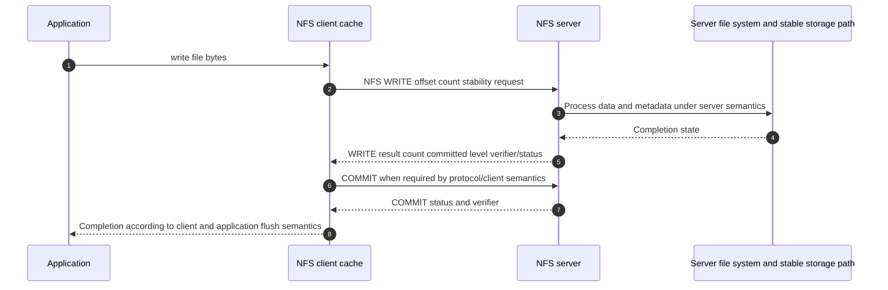

### Write field orientation

| Field/concept | Why it matters |
|---|---|
| Filehandle/stateid | Which object and open state receive the write. |
| Offset/count/data | Requested range and actual bytes. |
| Stable/how committed | Requested/returned stability semantics differ by version. |
| Write verifier | Helps clients detect server restart/state loss conditions under protocol rules. |
| COMMIT | Requests stability for previously unstable writes within scope. |
| Application flush/fsync | Application and client request durability; map to NFS and server semantics. |

A successful TCP ACK is not an NFS WRITE result. An NFS WRITE result is not automatically an application transaction commit. A snapshot after a protocol reply is not automatically application-consistent.

### Cache consistency

NFS clients cache attributes and data under configured/version-specific rules. Cache improves performance but can create delayed visibility or stale observations in some workloads. Validate application requirements before changing attribute/data cache options; disabling caches broadly can cause severe performance impact and still not fix application-level coordination.

---

## 14. Ports, network, security, and supportability

### Port orientation

| Flow | Common orientation | Required caution |
|---|---|---|
| NFS service | TCP 2049 is the standard NFS service port and central for NFSv4.x | Verify exact client/server transport/version support. |
| rpcbind/portmapper | Commonly RPC binding service on port 111 | Exact requirement/transport and security exposure vary. |
| mount/NLM/status services | Auxiliary RPC programs in common NFSv3 designs | Ports can be dynamic or configured; collect actual mappings and vendor guidance. |
| Kerberos | KDC and related DNS/time/service-principal flows | Exact ports and domain/realm architecture require identity documentation. |
| LDAP/name service | Directory, DNS, TLS/certificate, cache flows | Exact LDAP/LDAPS/start-TLS design and ports are environment-specific. |

Do not build a firewall from this orientation alone. Enumerate exact negotiated version, RPC programs/endpoints, security flavor, directory/Kerberos dependencies, callback/data-server paths, and failover behavior.

### Security

- Prefer the security flavor required by policy and supported workload; validate performance and operational dependencies.
- Scope export clients narrowly and review DNS/netgroup dependencies.
- Map root/superuser deliberately.
- Protect management and packet captures; AUTH_SYS payloads and file data may be visible without privacy protection.
- Use secure directory binds and certificate validation where supported/configured.
- Validate least-privilege file modes/ACLs and positive/negative access tests.

### Supportability inventory

| Domain | Record |
|---|---|
| Client | OS/kernel/build, NFS client version, mount options, security flavor, patches, network stack |
| Identity | UID/GID, groups, LDAP/NIS/local, Kerberos realm/KDC, keytab/principal, DNS/time, mapping/caches |
| Network | Client/server IPs, VLAN/routes/firewalls, MTU, DNS, TCP, loss/latency, callback/pNFS paths |
| Server | Platform/release, NFS versions, export policy, namespace/junction, file system/volume, locks/leases/delegations |
| Evidence | Current client/server docs, NetApp IMT result/notes/date, access gaps, known changes |

---

## 15. Troubleshooting stale handles, access, locks, and performance

### Unified fault tree

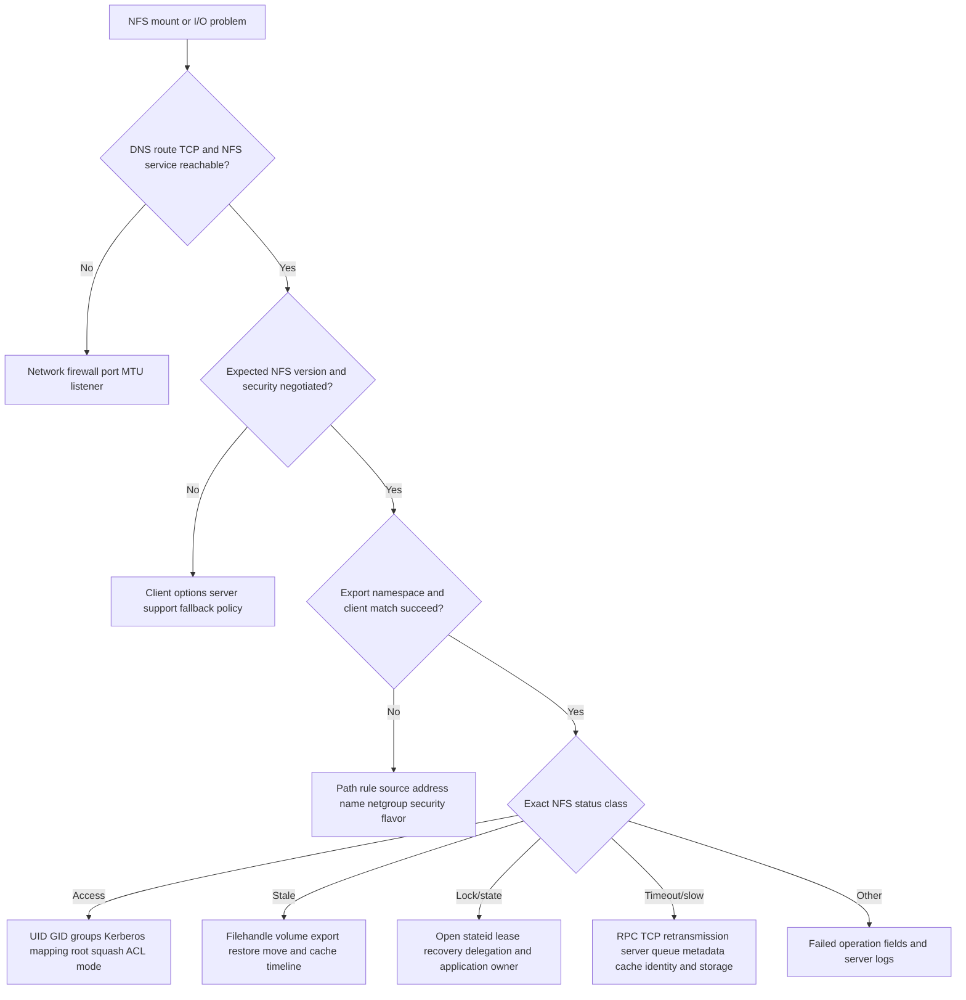

### Scenario table

| Symptom | Leading questions | Evidence pack focus |
|---|---|---|
| `stale file handle` | Which object/filehandle, export/volume change, restore/failover, delete/recreate, client scope? | Exact status/operation, server events, namespace/volume identity, client cache/mount timeline |
| `permission denied` | Mount or file operation? Source client match? Security flavor? UID/groups? root mapped? ACL/mode? | Export rule selected, identity at both sides, file attrs, RPC credential/protocol status |
| Mount hangs | DNS/routing/firewall? v3 auxiliary service? v4 TCP 2049? version fallback? | SYN/RPC sequence, program mapping, server listener, export request/status |
| File lock stuck | Which owner/range/stateid? App process alive? failover/reclaim? lease? | Protocol lock ops/status, client/server recovery logs, app process and timeline |
| Intermittent slow reads | Metadata or data? one client/path/file? TCP loss? identity lookup? server/backend queue? | Operation latency/XID, TCP trace, client cache, server RPC/volume/network counters |
| Write completed but data expectation wrong | App flush? client cache? WRITE stability/COMMIT? server restart? snapshot timing? | Application call, NFS WRITE/COMMIT/verifier, server logs, consistency scope |

### Performance decomposition

```mermaid
flowchart LR
    APP[Application elapsed time] --> WAIT[Application serialization and locks]
    WAIT --> CLIENT[Client cache VFS CPU and queues]
    CLIENT --> RPC[RPC encode retries and NFS operation]
    RPC --> NET[DNS TCP RTT loss MTU and throughput]
    NET --> SERVER[Server auth export locks CPU and protocol queue]
    SERVER --> META[File-system metadata and data path]
    META --> STORAGE[Cache media protection and contention]
```

Measure per-operation type, file/directory, client, server, time window, size, concurrency, cache state, and percentile. `NFS latency` is too broad.

---

## 16. Observability and escalation pack

### Evidence correlation

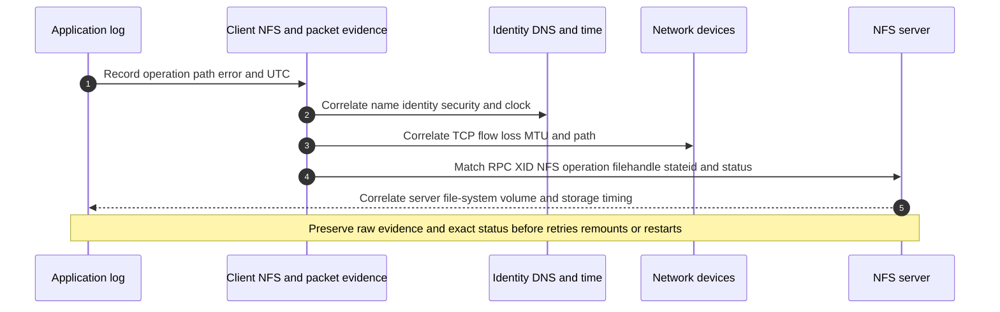

### Minimum escalation pack

- Business service, application operation, client/export/path/file scope, impact, objective, and UTC timeline.
- Client OS/kernel/build, NFS client implementation, mount command/config and effective options, negotiated version/minor, transport, security flavor, cache/retry/timeouts, and recent changes.
- Client IP/source/interface, DNS answer/TTL, route, MTU, firewall, TCP state, RTT/loss/retransmission, packet capture location/offload/privacy.
- RPC XID/program/version/procedure, call/reply, credentials flavor, NFS COMPOUND/operation, filehandle/stateid/session/slot/sequence, exact status, offset/count/stability/verifier.
- Server platform/release, NFS enabled versions, listener/RPC mappings, export path/policy/rule selected, namespace/junction/referral/pNFS layout, volume/file-system identity.
- UID/GID/effective groups, file owner/group/mode/ACL, name mapping, root mapping, LDAP/NIS query/cache, Kerberos principal/key/KDC/DNS/time/security flavor.
- Open/lock owner/range/stateid, lease/delegation/recall, restart/failover/grace/reclaim timeline.
- Server RPC/network/CPU/queue/file-system/volume/storage counters and request timing.
- Client/server/network/identity version matrix and dated current official/IMT evidence/notes; mark unknowns and access gaps.
- Changes, actions tried/results, whether remount/restart destroyed state, competing hypotheses, next discriminating test, owner, exact ask, and decision deadline.

---

## 17. TAM discovery, recommendation, and JD Mapping

### Discovery questions

#### Business and workload

1. Which application, files/directories, clients, criticality, RPO/RTO, and performance objective use NFS?
2. What operation mix, file sizes/counts, metadata rate, concurrency, locking, cache, read/write, and peak/degraded behavior exist?
3. Which failures matter: mount, access, stale handle, lock, timeout, throughput, failover, or consistency?

#### Architecture and protocol

4. Draw client, DNS/network, identity/Kerberos, switches/routes/firewalls, NFS server, export/namespace, volume/file system, and protection.
5. Which NFS version/minor, transport, port/RPC services, mount options, security flavor, sessions, callbacks, referrals, and pNFS layouts are actually active?
6. Draw data, control, and management planes and shared failure domains.

#### Identity, state, and security

7. How are UID/GID/groups sourced and cached; what name mapping and root policy apply?
8. What export rule/client match/security/read-write/superuser behavior and file permission/ACL apply?
9. What open/lock/lease/delegation/recovery state exists, and which application owns it?

#### Evidence and supportability

10. Which client OS/kernel, NFS client, network, identity, server/storage versions form the solution?
11. What current official/IMT result and notes validate it, and what is unlisted/inaccessible?
12. Can one operation be correlated from application through RPC/TCP to server file system and storage?

#### Recommendation and validation

13. What safe test distinguishes export, identity, filehandle, lock, network, and server hypotheses?
14. Who owns client, identity, network, server, application, protection, and change decisions?
15. What normal, negative-access, failover/recovery, performance, snapshot, and restore tests prove the outcome?

### Recommendation model

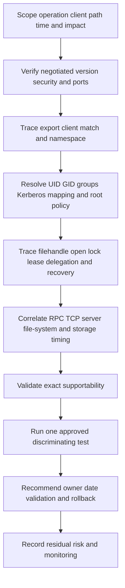

### Explicit JD Mapping

| JD responsibility | Part 15 contribution | Your strength and honest gap |
|---|---|---|
| Understand customer environment | Maps client/network/identity/NFS server/export/volume and owners | **Strength:** M365/AD/network dependency mapping. **Gap:** production NFS/ONTAP ownership unproven. |
| Storage depth | Explains v3/v4.x, RPC, exports, identity, locks, filehandles, pNFS, and I/O | **Conceptual/lab:** no production NFS administration claim. |
| Risk/stability | Finds version fallback, broad exports, identity drift, stale handles, lock recovery, and path common fate | **Strength:** critical-situation hypothesis and risk method transfers. |
| Supportability | Builds exact client/server/identity/network matrix and IMT evidence | **Gap:** no current customer IMT or gated tool result claimed. |
| Recommendations | Connects exact NFS evidence to safe owner-led action and validation | **Strength:** advisory and escalation follow-through. |
| Service review | Reports protocol health, access risk, performance trends, actions, and residual risk | **Strength:** business reviews and analytics. |
| Escalation | Supplies XID/operation/status/filehandle/state/identity/timeline evidence | **Strength:** Product/Engineering escalation discipline. |

### Honest production-gap statement

> "I can explain NFSv3 and NFSv4.x architecture, RPC, exports, numeric and Kerberos identity, filehandles, leases, locks, pNFS orientation, and a layered evidence plan. My production experience is Microsoft data services, Windows/Azure networking, AD identity, permissions, and enterprise escalation, not Linux/NFS or ONTAP administration. I would verify the exact client/server combination and IMT notes, use authorized captures and read-only evidence, and work with Linux, identity, network, application, and storage owners for changes."

---

## 18. Fully synthetic case: Fabrikam Research stale handles and access denial

> **Synthetic case:** Fabrikam Research, all clients, exports, IDs, packet fields, events, and outcomes are fictional. No NetApp product behavior, customer incident, or support result is asserted.

### Environment

- Twenty Linux clients use NFSv4.1 for `/research/projects`.
- AUTH_SYS is used for one legacy workload; a Kerberos-protected export is planned but not yet deployed.
- LDAP supplies UID/GID/group data.
- The namespace contains a junction-like transition from project root to a backing volume.
- A storage restore test replaces one synthetic volume from a snapshot while clients remain mounted.
- Afterward, half the clients report stale filehandles; a new analyst reports permission denied.

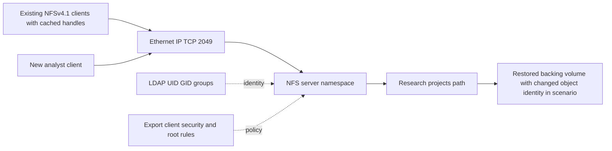

### Evidence

| Evidence | Observation | Bounded interpretation |
|---|---|---|
| Protocol trace | Existing clients receive `NFS4ERR_STALE` on old filehandle after restore | Strong stale-reference evidence; not a network timeout. |
| Server change log | Backing volume was replaced/restored while clients remained mounted | Mechanism can invalidate old handles under this synthetic design. |
| New path lookup | Fresh traversal obtains working handle for some unaffected/new objects | Separates cached old handles from general service outage. |
| New analyst request | Export/client match passes; server returns access denial on directory operation | Export admission works; file/identity layer remains. |
| LDAP | Analyst UID matches expectation but supplementary research group is absent on one replica/cache path | Candidate permission mechanism. |
| Network | TCP and RPC request/reply latency normal; no retransmission burst | Weakens network-performance hypothesis. |
| Locks | No shared lock owner across stale object; no lease-expiry event | Lock hypothesis currently weak. |

### Competing hypotheses

| Hypothesis | Evidence for | Evidence against/missing | Test |
|---|---|---|---|
| NFS server unreachable | Users see errors | Exact NFS replies arrive quickly | Server/listener and operation status already discriminate |
| Restore invalidated handles | Stale status begins after backing replacement | Need exact server/version behavior and support review | Compare old/new handles, volume identity/events, current docs/SME |
| Export policy denies analyst | Analyst gets access error | Selected export rule permits source/security | Record selected rule and operation stage |
| LDAP group inconsistency | Required group absent on one identity path | Need prove server used that replica/cache and file ACL needs group | Direct approved lookup, cache/replica trace, positive peer comparison |
| Lock conflict | File access problem | Status is stale/access, not lock; lock records absent | Protocol lock/state evidence |

### Fault tree

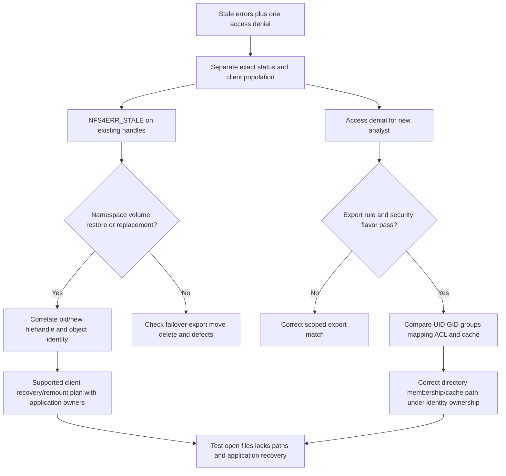

### Recommendations

1. Stop treating stale-handle and access-denial reports as one root cause; track two evidence streams.
2. Storage/NFS and application owners should review the restore procedure and current server/client behavior. Plan supported client recovery only after cataloging open applications, locks, mounts, and business impact; avoid mass force-unmount without rollback/communication.
3. Identity owner should correct and replicate the analyst's required group membership or cache path after verifying the authoritative directory and file ACL expectation.
4. Capture old/new filehandle statuses, NFSv4.1 session/state, namespace/volume identity, export rule, UID/groups, LDAP replica/cache, and synchronized timestamps.
5. Add a recovery test that quiesces clients/applications as required, restores defined scope, validates filehandles/locks, and proves positive/negative identity access.

### Customer-facing summary

> "The server is reachable and returns two distinct protocol outcomes. Existing clients use handles that became stale after the backing-volume restore, while the new analyst passes export policy but lacks a required supplementary group on the identity path used for authorization. We recommend a supported, owner-coordinated client recovery plan for the restored namespace and a separate LDAP group/cache correction, followed by filehandle, lock, and positive/negative access tests."

---

## 19. Paper lab and whiteboard drills

No production access is required. Use synthetic captures/tables and public standards.

### Paper lab scenario

A fictional Linux client mounts `nfs.lab.example:/eng` with NFSv4.1 and `krb5i`. A second legacy client uses NFSv3/AUTH_SYS. DNS has A/AAAA records. Firewall permits TCP 2049 but not the v3 mount/NLM endpoints. LDAP replicas disagree on one supplementary group. Server failover occurs during a lock-heavy build, and one path has intermittent TCP loss. Exact client/server releases and IMT status are unknown.

### Tasks

1. Draw application-to-storage architecture and all three planes.
2. Draw RPC call/reply and orient on XID/program/version/procedure/credential/status.
3. Compare NFSv3, v4.0, and v4.1 state, namespace, ports, locks, and sessions.
4. Draw the v3 rpcbind/mount/NFS/NLM path and firewall requirements.
5. Draw v4.1 session, pseudo-root traversal, COMPOUND, and OPEN.
6. Build export-rule/client-match/security/root/file-permission evaluation.
7. Reconcile UID/GID/groups across both LDAP replicas and client/server caches.
8. Draw Kerberos KDC/service-principal/RPCSEC_GSS flow and list DNS/time/key dependencies.
9. Trace filehandle acquisition and create a stale-handle fault tree.
10. Draw open/lock/lease/delegation state and failover reclaim.
11. Explain referral and pNFS metadata/data paths; mark them inactive unless evidence shows use.
12. Trace WRITE stability, verifier, COMMIT, and application flush.
13. Correlate NFS operation latency with TCP loss and server/storage time.
14. Build exact client/network/identity/server/version/IMT inventory.
15. Write access, lock, and performance recommendations with owner/date/validation/residual risk.
16. Produce a complete escalation pack and 90-second customer update.

### Whiteboard drills

1. **NFS stack:** App -> VFS -> NFS -> RPC -> TCP/IP -> server export -> file system.
2. **v3 versus v4.1:** Auxiliary services/stateless-core nuance versus integrated state/sessions.
3. **Mount versus access:** Export admission is not file permission.
4. **Identity:** UID 1005 is a number, not proof of the same person everywhere.
5. **Root squash:** Client root can become anonymous/mapped at server.
6. **Kerberos:** DNS + time + KDC + service principal + RPCSEC_GSS.
7. **Filehandle:** Opaque reference; stale means the server cannot use that old reference as expected.
8. **Lock recovery:** Open/stateid/lease/grace/reclaim, not just TCP reconnect.
9. **Write:** TCP ACK -> NFS WRITE result -> COMMIT/flush -> application transaction are different boundaries.
10. **Fault split:** Access, stale, lock, and slow have different evidence paths.

### Lab completion criteria

- [ ] RPC and NFS protocol identities are separate from TCP fields.
- [ ] Actual version/minor/security is recorded, including fallback.
- [ ] v3 auxiliary services and v4.x integrated state are correctly scoped.
- [ ] Export, root mapping, identity, file permission, and locks are separate gates.
- [ ] Kerberos labels and dependencies are conceptual, not overclaimed.
- [ ] Filehandle, stateid, session, lease, delegation, and pNFS roles are distinct.
- [ ] Write stability is not confused with TCP or application commit.
- [ ] Performance correlates client, RPC, network, server, file system, and storage.
- [ ] Exact supportability remains pending current evidence.
- [ ] Production NFS/ONTAP experience is not implied.

---

## 20. Self-test

1. Define NFS client/server, RPC, XDR, export, mount, filehandle, UID/GID, lease, and delegation.
2. Draw the complete NFS architecture and three planes.
3. Orient on RPC XID/program/version/procedure/credentials/status.
4. Compare NFSv3, v4.0, and v4.1 accurately.
5. Explain why `v3 stateless` is incomplete.
6. Draw NFSv3 rpcbind/mount/NFS and auxiliary-lock paths.
7. Draw NFSv4.1 connection/session/COMPOUND/namespace traversal.
8. Explain actual version negotiation/fallback risk.
9. Distinguish export client match, security flavor, root mapping, and file permission.
10. Define UID, GID, supplementary groups, LDAP, NIS, and name mapping.
11. Explain AUTH_SYS trust limits and root squashing.
12. Compare `krb5`, `krb5i`, and `krb5p` conceptually.
13. Draw Kerberos/RPCSEC_GSS dependencies and failure evidence.
14. Explain filehandle acquisition and stale-handle causes.
15. Explain open state, locks, leases, stateids, grace/reclaim, and delegations.
16. Explain NFSv4.1 sessions and sequencing orientation.
17. Explain referrals and pNFS metadata/data-server paths.
18. Draw READ and WRITE/COMMIT flows with field orientation.
19. Separate TCP ACK, NFS status, write stability, application flush, and transaction commit.
20. Explain cache consistency and why disabling cache is not a generic fix.
21. Build exact port/firewall dependencies for v3 and v4.x from real configuration evidence.
22. Apply stale-handle, access, lock, and performance fault trees.
23. Build a complete supportability inventory and dated IMT plan.
24. Ask the complete TAM discovery set and write a bounded recommendation.
25. Recreate Fabrikam's two independent mechanisms.
26. Build the minimum escalation pack.
27. Complete the paper lab and whiteboard drills.
28. Explain security/performance/redundancy implications.
29. Answer Q1-Q8 aloud.
30. State your strengths and production NFS gap honestly.

---

## 21. Official Source Anchors

**Date checked: 2026-08-24.** These official standards and public sources anchor NFS concepts. RFCs can be updated or obsoleted; implementation support and defaults vary; Kerberos/directory deployments have separate security guidance; and NetApp IMT/support content can require authorization. Verify exact client, kernel, NFS minor version, security flavor, identity stack, network, server/storage release, current RFC status, and IMT notes. Do not invent a port list, export-rule order, support matrix, timeout, or ONTAP behavior.

| Topic | Official public source | Access, version, and use note |
|---|---|---|
| RPC | [RFC 5531 - Remote Procedure Call Protocol Version 2](https://www.rfc-editor.org/rfc/rfc5531) | RPC base standard; NFS and auxiliary programs define their own operations. |
| XDR | [RFC 4506 - XDR Standard](https://www.rfc-editor.org/rfc/rfc4506) | Portable data representation used by RPC-based protocols. |
| NFSv3 | [RFC 1813 - NFS Version 3 Protocol Specification](https://www.rfc-editor.org/rfc/rfc1813) | NFSv3 standard; mount/locking/RPC binding are covered by related protocols/implementations. |
| RPC binding | [RFC 1833 - Binding Protocols for ONC RPC Version 2](https://www.rfc-editor.org/rfc/rfc1833) | Historical binding specification; check current platform behavior and security guidance. |
| NFSv4.0 | [RFC 7530 - NFS Version 4 Protocol](https://www.rfc-editor.org/rfc/rfc7530) | NFSv4.0 standard. Check RFC status/errata and exact implementation support. |
| NFSv4.1 and pNFS | [RFC 8881 - NFS Version 4 Minor Version 1](https://www.rfc-editor.org/rfc/rfc8881) | NFSv4.1 standard including sessions and pNFS architecture; actual layout support is implementation-specific. |
| RPCSEC_GSS | [RFC 7861 - RPCSEC_GSS Version 3](https://www.rfc-editor.org/rfc/rfc7861), [RFC 2203 - RPCSEC_GSS](https://www.rfc-editor.org/rfc/rfc2203) | Security framework standards. Deployment labels/support and current mechanisms need client/server verification. |
| Kerberos | [RFC 4120 - Kerberos Network Authentication Service V5](https://www.rfc-editor.org/rfc/rfc4120) | Protocol standard; realm, principal, key, crypto, DNS, and time deployment require platform guidance. |
| LDAP | [RFC 4511 - Lightweight Directory Access Protocol](https://www.rfc-editor.org/rfc/rfc4511) | Base protocol; schemas, Unix identity attributes, TLS, replication, and caching require exact directory guidance. |
| IANA service names and ports | [IANA Service Name and Transport Protocol Port Number Registry](https://www.iana.org/assignments/service-names-port-numbers/) | Check current registrations; deployment firewalls must use actual negotiated/configured services. |
| Linux NFS client administration | [Red Hat Enterprise Linux file-system and NFS documentation](https://docs.redhat.com/en/documentation/red_hat_enterprise_linux/) | Official vendor documentation area; select exact RHEL release. Other Linux clients can differ. |
| NetApp NFS configuration | [ONTAP NFS configuration documentation](https://docs.netapp.com/us-en/ontap/nfs-config/) | Official public area. Select exact ONTAP release and follow version-specific prerequisites/procedures. |
| NetApp NFS administration | [ONTAP NFS management documentation](https://docs.netapp.com/us-en/ontap/nfs-admin/) | Official public area for exports, security, name services, and operations; behavior is release-specific. |
| NetApp export policies | [Manage NFS access using export policies](https://docs.netapp.com/us-en/ontap/nfs-admin/manage-access-concept.html) | Official public conceptual area. Validate rule evaluation/defaults/fields for exact release. |
| NetApp interoperability | [NetApp Interoperability Matrix Tool](https://imt.netapp.com/) | Official, potentially gated, and time-sensitive. Save exact client/protocol/security/storage result, notes, and date. |

### Source-use discipline

- Check RFC Editor status, updates, errata, and the exact NFS minor version.
- Record actual negotiated version/security and active RPC programs/ports rather than copying a generic firewall list.
- Treat filehandles as opaque and preserve exact statuses before remount/restart changes evidence.
- Verify identity values and group membership at client, directory/cache, and server authorization point.
- Validate Kerberos principals, keys, DNS, time, and security-flavor policy with identity owners.
- Save dated IMT evidence for exact client OS/kernel, NFS version, security, network, and ONTAP release.

---

## Likely Interview Questions

### Q1. Explain NFS architecture and RPC from an application read to storage.

> **Model answer:** "The application calls the client file system, which sends an NFS operation through RPC. RPC identifies the transaction, program/version/procedure, credentials, and XDR-encoded arguments. TCP/IP carries the message to the NFS server. The server evaluates export and identity policy, file permission and state, resolves the filehandle in its file system, reads backing storage, and returns an RPC/NFS result. I correlate TCP flow, RPC XID, NFS operation/filehandle/stateid, and server request timing separately."

**Follow-up depth:** Draw the stack and explain why a TCP ACK, RPC reply, NFS success, and application transaction are different completion boundaries.

### Q2. Compare NFSv3, NFSv4.0, and NFSv4.1.

> **Model answer:** "NFSv3 core file operations are commonly called stateless, but locks use auxiliary state and clients/caches/TCP still have state. Common v3 deployments use rpcbind, mount, NFS, and lock/status services. NFSv4.0 integrates namespace, opens, locks, leases, and security framework on the main protocol. NFSv4.1 adds sessions and sequence slots and defines pNFS. I record the actually negotiated version/minor because fallback changes ports, state, security, and supportability."

**Follow-up depth:** Draw a v3 mount and a v4.1 COMPOUND/session sequence and explain exact port/firewall caveats.

### Q3. How do exports, UID/GID, root squash, and file permissions interact?

> **Model answer:** "The server first identifies the served path and export policy, matches the client, checks the requested security flavor and read/write/superuser rules, then evaluates the effective identity against file ownership, mode or ACL, and lock state. With AUTH_SYS the client supplies numeric UID/GID/group information under the server's trust policy. Root squash maps client UID 0 to an unprivileged identity unless a narrow policy allows otherwise. Mount success therefore does not prove file-write access."

**Follow-up depth:** Diagnose same username/different UID, missing supplementary group, netgroup/DNS mismatch, and root-mapped write denial.

### Q4. How does Kerberos protect NFS, and what commonly breaks it?

> **Model answer:** "NFS can use RPCSEC_GSS with Kerberos. Common labels are krb5 for authentication, krb5i for integrity, and krb5p for privacy plus integrity, subject to exact implementation. The client obtains a service ticket for the NFS principal and establishes a security context with the server. DNS/canonical names, synchronized time, KDC/realm trust, service principal and keytab, crypto policy, identity mapping, and export security flavor must align. I do not expect NTLM fallback in NFS."

**Follow-up depth:** Draw KDC ticket and service-context flow and separate ticket, principal/key, mapping, and export failures.

### Q5. What is a stale NFS filehandle, and how would you investigate it?

> **Model answer:** "A filehandle is an opaque server-issued reference to a file-system object. Stale means the server can no longer resolve that old reference as expected, often after object deletion/recreation, export or volume replacement, restore, namespace move, failover/recovery issue, or unsupported behavior. I preserve the exact operation/status, affected handles and clients, server volume/namespace identity and change timeline before remounting. I compare fresh traversal with old handles and coordinate recovery with application and storage owners."

**Follow-up depth:** Explain why mass force-unmount can disrupt open files and erase evidence, and list validation after a restore.

### Q6. Explain NFSv4 locks, leases, stateids, delegations, and recovery.

> **Model answer:** "NFSv4 creates open and lock state identified by stateids under a client lease. Delegations can let a client cache/manage some state until recall. Server restart, failover, client isolation, or lease expiry can require recovery during defined grace/reclaim behavior. I correlate client identity, session/sequence, stateid, lock owner/range, lease timing, delegation recall, application process, and server/client recovery logs rather than treating a TCP reconnect as lock recovery."

**Follow-up depth:** Walk a failover with open/lock reclaim and explain bad-stateid versus a real conflicting lock.

### Q7. How would you troubleshoot slow NFS reads or writes?

> **Model answer:** "I scope operation type, path/file, client population, I/O size, concurrency, cache state, and percentile. I correlate application wait and locks, client VFS/cache/CPU, RPC XIDs and retries, TCP RTT/loss/windows, identity lookup, server protocol/CPU/queue, file-system metadata/data, and backing storage. For writes I also inspect stability request/result, verifier, COMMIT, and application flush. I run one representative test that distinguishes network loss from server or application delay."

**Follow-up depth:** Separate metadata latency from bulk I/O, explain cache effects, and build the minimum packet/server evidence set.

### Q8. How does your background transfer to NFS work, and what remains a gap?

> **Model answer:** "My prior production experience gives me shared-data-service, permissions, Active Directory identity, Windows/Azure networking, incident ownership, evidence correlation, and customer communication skills. Those methods transfer to NFS dependency and authorization analysis. I have not administered Linux NFS, Kerberos for NFS, pNFS, or ONTAP exports in production. I would verify exact client/server/IMT support, use authorized captures and read-only evidence, and involve Linux, identity, network, application, and storage specialists for changes."

**Follow-up depth:** Give one factual permissions or identity escalation and state precisely which NFS-specific work remains conceptual or lab-based.

---

## 30-Second Memory Hooks

- **NFS:** Remote file operations, not a remote block device.
- **RPC:** Call envelope; **XDR:** portable encoding.
- **XID:** Match RPC call and reply.
- **v3:** Core stateless orientation plus auxiliary mount/lock services.
- **v4.0:** Integrated namespace, opens, locks, leases, and security framework.
- **v4.1:** Sessions, sequence slots, and pNFS architecture.
- **COMPOUND:** Ordered operations in one NFS request.
- **Export:** Client admission and rules; not file permission.
- **AUTH_SYS:** Client supplies numbers; trust policy decides meaning.
- **UID/GID:** Same name does not guarantee same number or person.
- **Root squash:** Client root becomes mapped/unprivileged by policy.
- **krb5/krb5i/krb5p:** Authenticate / integrity / privacy orientation.
- **Filehandle:** Opaque server reference; stale means old reference no longer works.
- **Stateid:** Token for NFSv4 open/lock/delegation state.
- **Lease:** Time-bounded state relationship requiring renewal/recovery.
- **Delegation:** Temporary client authority that the server can recall.
- **Referral:** New namespace location; dependencies must still work.
- **pNFS:** Metadata grants layouts; clients access data servers when supported.
- **WRITE/COMMIT:** Protocol stability path, not application transaction by itself.
- **Troubleshoot:** Exact status first: access, stale, lock/state, or timeout.
- **Your bridge:** Identity and escalation method transfer; production NFS remains unclaimed.

---

## Completion Checklist

- [ ] Define NFS client/server, RPC, XDR, export, mount, filehandle, UID/GID, lease, and delegation.
- [ ] Draw the NFS stack and data/control/management planes.
- [ ] Orient on RPC and NFS request/response fields and completion boundaries.
- [ ] Compare NFSv3, v4.0, and v4.1 without false stateless claims.
- [ ] Draw common v3 rpcbind/mount/NFS/lock service dependencies.
- [ ] Draw v4.1 session, COMPOUND, pseudo-root traversal, and OPEN state.
- [ ] Record actual negotiated version/minor/security and fallback.
- [ ] Separate export/client match/security/root mapping from file permission/locks.
- [ ] Trace UID/GID/groups, LDAP/NIS/local identity, caches, and name mapping.
- [ ] Explain AUTH_SYS trust limitations and root squashing.
- [ ] Explain krb5/krb5i/krb5p and Kerberos DNS/time/principal/key dependencies.
- [ ] Trace filehandle acquisition and investigate stale status before remount/restart.
- [ ] Explain open/lock/stateid/lease/delegation/grace/reclaim behavior.
- [ ] Explain NFSv4.1 sessions, referrals, pNFS layouts, metadata, and data paths.
- [ ] Trace READ and WRITE/COMMIT and distinguish application consistency.
- [ ] Explain client/server caching and performance tradeoffs.
- [ ] Build exact port/firewall rules from actual active services, not a generic list.
- [ ] Apply access, stale-handle, lock/state, and performance fault trees.
- [ ] Correlate application/client/RPC/TCP/identity/server/storage evidence.
- [ ] Ask the complete TAM discovery set and write a seven-part recommendation.
- [ ] Recreate Fabrikam and keep stale-handle and access causes separate.
- [ ] Build a complete escalation pack and dated exact IMT/supportability record.
- [ ] Complete the paper lab, whiteboard drills, self-test, and Q1-Q8 aloud.
- [ ] State your production strengths and NFS/ONTAP production gap honestly.
- [ ] Recheck RFC status, client/server releases, identity/security policy, and NetApp IMT notes before customer use.

---

*Next suggested section:* [Part 16 - SMB from Zero: Shares, Active Directory, Authentication, and Continuity](Part-16-smb-active-directory-authentication-continuity.md)