# Part 16 - SMB from Zero: Shares, Active Directory, Authentication, and Continuity

> **Section goal:** Understand how an SMB client negotiates a dialect, authenticates, connects to a share, opens a file, caches safely, and recovers through supported failures. By the end, you should be able to trace SMB and Active Directory dependencies, distinguish share and file permissions, interpret signing/encryption and multichannel, and build an evidence-led continuity or access escalation.

Covers index item **16** and maps directly to job-description responsibilities for storage depth, customer-environment analysis, supportability, stability and risk mitigation, tailored recommendations, operational reviews, and escalation quality.

This Part is vendor-neutral with Microsoft protocol grounding. Exact SMB dialects/capabilities, Kerberos/NTLM policy, signing, encryption, multichannel, durable/persistent handles, continuously available shares, Witness, transparent failover, Distributed File System (DFS), ports, timeouts, and NetApp behavior are version- and configuration-specific. Validate the exact Windows/client/application/network/storage combination in current official documentation and the NetApp Interoperability Matrix Tool (IMT).

> **Evidence boundary:** Every domain, user, service principal, share, packet, timing, failure, and recommendation below is synthetic. Your production SharePoint, OneDrive, Microsoft 365, Windows, Active Directory, permissions, networking, and escalation experience is directly relevant. Production NetApp SMB server administration, continuously available share design, ONTAP failover, or SMB Multichannel tuning is not claimed.

---

## 1. SMB architecture and vocabulary

**Server Message Block (SMB)** is a file and related resource-sharing protocol. Modern SMB uses a negotiated dialect and stateful objects such as connections, sessions, tree connections, and file handles.

### Plain-English deep-dive: building, identity badge, department, and file ticket

- The TCP connection reaches the building.
- SMB negotiate agrees which language/features both sides use.
- Session setup validates an identity badge.
- Tree connect enters a named department, the share.
- CREATE obtains a ticket for a file or directory.
- READ/WRITE use that ticket; CLOSE returns it.

| Term | Plain meaning | Why it matters |
|---|---|---|
| **SMB client** | Host/application requesting file service. | Owns redirector behavior, credentials, caches, channels, and reconnect. |
| **SMB server** | Service publishing shares and processing SMB messages. | Owns share policy, file namespace, server-side state, and backing storage. |
| **Dialect** | Negotiated SMB protocol version/capability set. | Features and security behavior depend on actual negotiation. |
| **Session** | Authenticated SMB security context for a user/service identity. | One transport can carry sessions; reconnect/auth state matters. |
| **Tree connection** | Session attachment to a share. | Share access is separate from file access. |
| **File ID/handle** | Server-issued reference to an opened file/directory/pipe. | READ/WRITE/CLOSE and continuity depend on handle state. |
| **Credit** | SMB flow-control unit allowing a client to have messages outstanding under protocol rules. | Credit starvation or misuse can limit concurrency; exact behavior is implementation-specific. |
| **Lease/oplock** | Server-granted client caching rights subject to break/recall. | Improves performance but adds coherency and recovery state. |

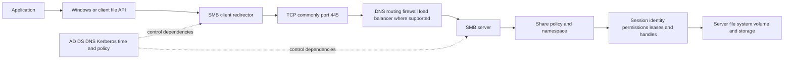

### Data, control, and management planes

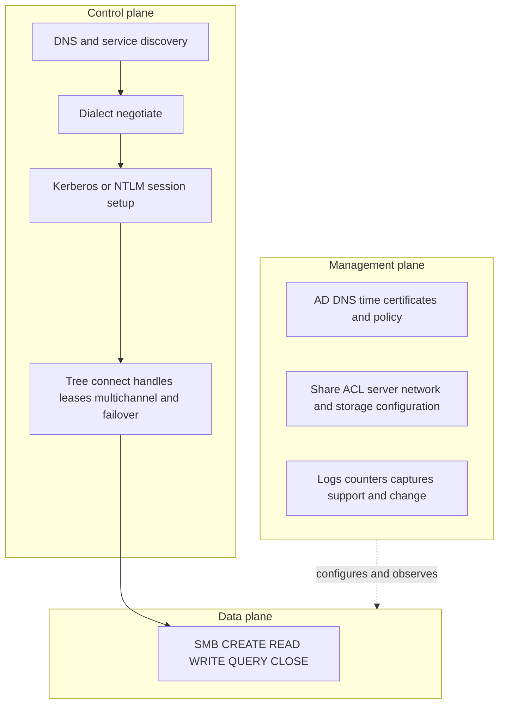

---

## 2. SMB dialect negotiation

After transport connection, the client sends dialects and capabilities it supports. The server selects one supported dialect and returns capabilities, security mode, limits, and negotiate contexts where applicable.

### Negotiate sequence

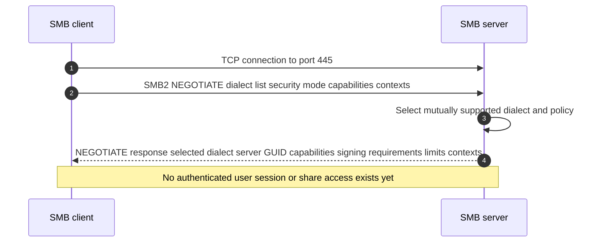

### Negotiate field orientation

| Field/capability | Diagnostic use |
|---|---|
| Dialect list and selected dialect | Detect unsupported version, policy mismatch, or unexpected downgrade. |
| Security mode | Orient on signing enabled/required negotiation. |
| Client/server GUID | Identify protocol endpoints and continuity context. |
| Capabilities | DFS, leasing, large MTU, multichannel, persistent handles, encryption, and others depending on dialect. |
| Max transact/read/write sizes | Protocol limits, not guaranteed achieved throughput. |
| Preauthentication integrity/context | Modern dialect security negotiation where applicable. |
| Encryption/compression/signing algorithms | Exact negotiated capabilities under current dialect/policy. |

### Dialect caution

Do not equate `SMB3` with one behavior. SMB 3.0, 3.0.2, and 3.1.1 differ, and implementations can negotiate subsets/capabilities. SMB1 is legacy and disabled/deprecated in many environments, but never infer its state without evidence. A requirement to enable an obsolete dialect must be treated as security/supportability risk and validated with application/vendor owners.

---

## 3. AD DS, DNS, identities, and service discovery

**Active Directory Domain Services (AD DS)** stores and coordinates identities, groups, computers, service information, and policies in a Windows domain. SMB domain authentication depends on more than a username/password.

### Plain-English deep-dive: people, machines, and services each have identities

| Identity | Meaning | SMB relevance |
|---|---|---|
| **User identity** | Person or service account security principal. | Session token/groups drive access checks. |
| **Computer identity** | Domain identity of a client/server computer. | Secure channel, policy, and service operation can depend on it. |
| **Service identity** | Principal under which the SMB service is recognized. | Kerberos service ticket targets an SMB service principal. |
| **Security Identifier (SID)** | Stable Windows security-principal identifier. | ACLs grant/deny SIDs, not display names alone. |
| **Group** | Collection of principals used for authorization. | Token group membership affects access; changes may require new authentication/token. |
| **Domain Controller (DC)** | AD DS server providing directory/authentication services. | DC selection, reachability, replication, DNS, and time can affect SMB setup. |
| **Service Principal Name (SPN)** | Name that identifies a service instance to Kerberos. | `cifs/service-name`-style identity must map correctly and uniquely under AD policy. |

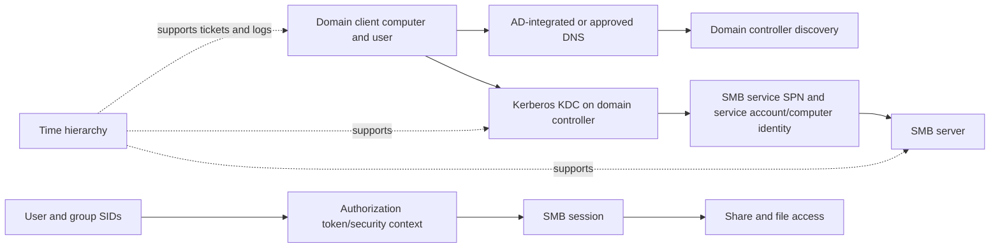

### DNS dependencies

- Client resolves the service name to the intended address.
- AD client locates domain controllers through DNS records and site-aware behavior.
- Kerberos requests a ticket for the service name used; aliases/load-balanced names require correct SPN/certificate/design.
- Forward/reverse names, suffixes, cached records, IPv4/IPv6, DFS referrals, and failover names can select different paths.
- Using an IP address can prevent normal hostname-based Kerberos service-ticket behavior and trigger other authentication outcomes under policy; do not use IP as a permanent workaround.

---

## 4. Kerberos SMB session setup

Kerberos uses tickets issued by a Key Distribution Center (KDC). The client first has a Ticket-Granting Ticket (TGT), then requests a service ticket for the SMB service SPN, and presents it during session setup through the negotiated authentication framework.

### Kerberos session sequence

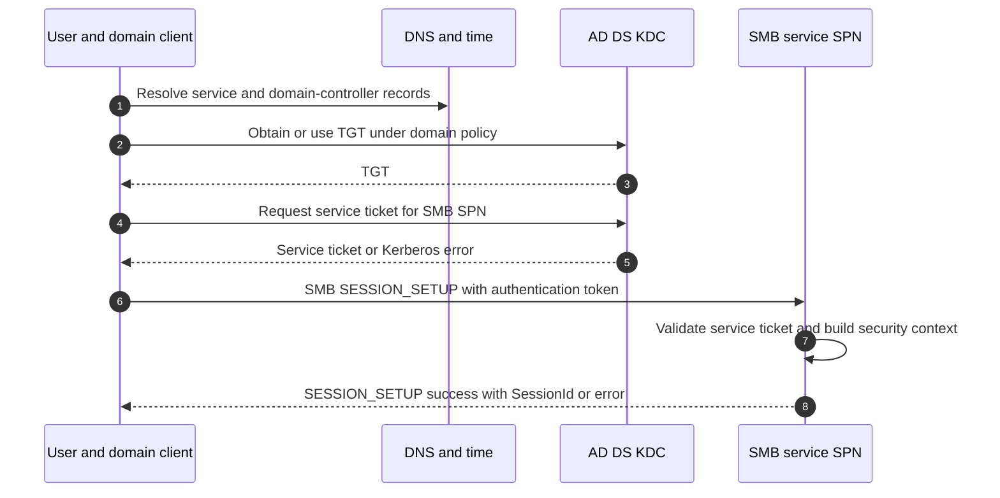

### Kerberos evidence

- Exact service name used and resolved address.
- Requested SPN, account owning it, uniqueness, and key version/encryption compatibility.
- Client/user/computer domain, selected DC/KDC, AD site, trust path, and replication.
- Client/server/DC clock source and offset; ticket start/end/renewal.
- Ticket cache/service ticket and Kerberos error code.
- SMB SESSION_SETUP security mechanism and status.
- Server authentication/security logs and effective user/group token.

Kerberos success proves authenticated identity, not share or file authorization.

---

## 5. NTLM orientation and fallback risk

**NT LAN Manager (NTLM)** is a challenge-response authentication family used in Windows environments under policy and compatibility conditions. It is not a transparent equivalent to Kerberos and is commonly restricted because of security risk and reduced service identity/delegation properties.

### Plain-English deep-dive: fallback can hide the real identity defect

If a train ticket for the intended named service cannot be issued, taking an older side route may get the passenger through but hides the broken service registration and changes security. NTLM fallback can make a path appear functional while SPN, DNS, trust, or Kerberos policy remains wrong. **Why it matters:** capture the actual mechanism and fix the intended authentication design rather than celebrating fallback.

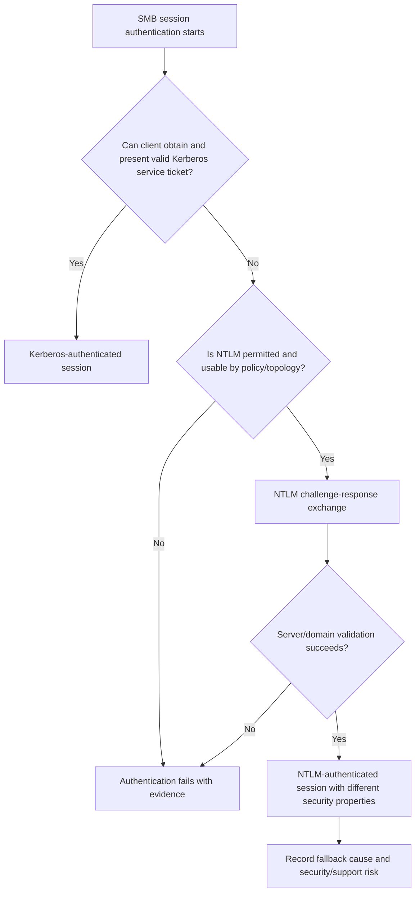

### Do not assume fallback

The selected security support provider, policy, credential type, service name, trust, channel binding, server capability, local account context, and protections affect behavior. `Kerberos failed, so NTLM will work` is not a safe statement.

---

## 6. Tree connect, CREATE, READ, WRITE, and CLOSE

After session setup, a client attaches to a share with TREE_CONNECT, opens a file/directory with CREATE, operates using a FileId, and closes the handle.

### End-to-end file flow

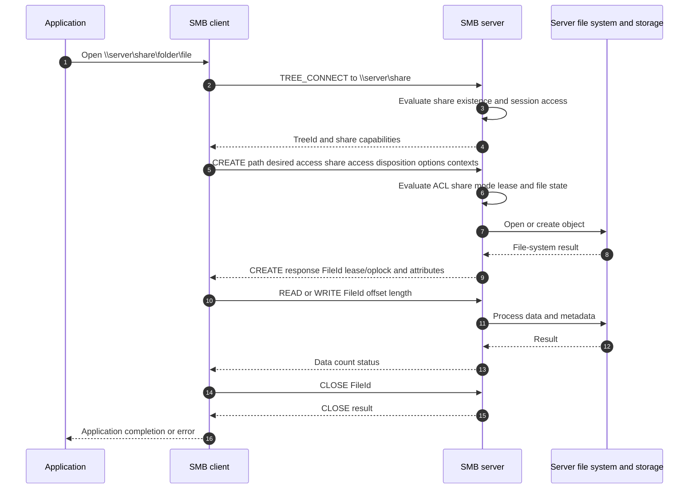

### SMB2/3 header and request orientation

| Field | Diagnostic use |
|---|---|
| Command | NEGOTIATE, SESSION_SETUP, TREE_CONNECT, CREATE, READ, WRITE, CLOSE, IOCTL, and others. |
| Status | Exact NTSTATUS response identifies protocol stage and error class. |
| MessageId | Correlates request/response and outstanding operations. |
| SessionId | Identifies authenticated SMB session. |
| TreeId | Identifies connected share context. |
| Credit charge/request/response | Orient on outstanding/concurrency flow control. |
| Flags | Response, signed, asynchronous, related operations, replay, DFS, and other context. |
| FileId | Identifies open file handle in relevant commands. |
| CREATE fields | Desired access, file attributes, share access, disposition, options, name, create contexts. |
| READ/WRITE fields | FileId, offset, length/count, channel-related fields where applicable. |

### CREATE is not only `create a new file`

SMB CREATE opens or creates a file, directory, pipe, or other object according to disposition/options. A failure can reflect path, share, ACL, share-mode conflict, lease/oplock, name, policy, or server file-system state.

---

## 7. Share permissions, file ACLs, and effective access

SMB access commonly includes share-level permission and file-system ACL evaluation. AD/user token and local/server policy add context.

### Permission flow

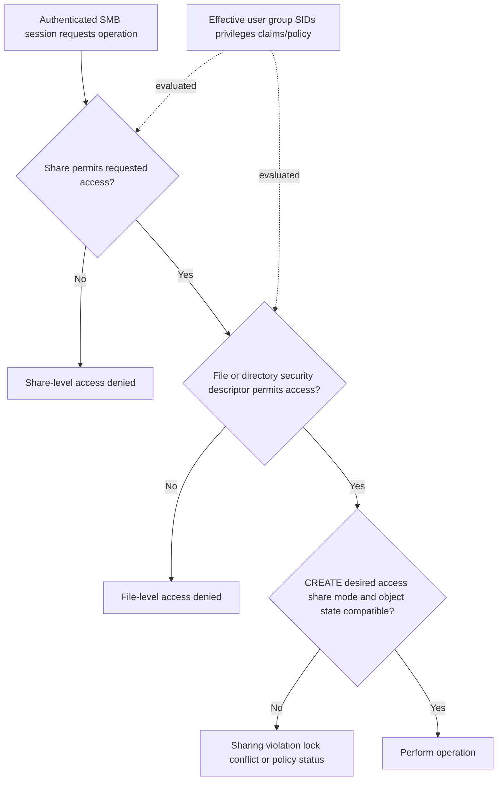

### ACL vocabulary

| Term | Meaning | Why it matters |
|---|---|---|
| **Security descriptor** | Owner, group, discretionary and system ACL information. | Encodes object security. |
| **Access Control List (ACL)** | Ordered list structure containing access/control entries. | Effective access depends on principal SIDs, entries, inheritance, and algorithm. |
| **Access Control Entry (ACE)** | One allow/deny/audit entry for a principal and rights. | Display name alone can hide stale/orphaned SID. |
| **Inheritance** | Child objects receive applicable parent security entries under flags. | Moving/creating objects can change effective ACL behavior. |
| **Effective access** | Result after token, share, ACL, privileges, and requested access are evaluated. | `User is in group` does not automatically prove token or right. |

### Troubleshooting access denied

- Identify the exact SMB command/status, user SID, SessionId, TreeId, path/FileId, and desired access.
- Confirm share permission separately from file/directory ACL.
- Record effective token/group memberships and when the session was authenticated; group changes may not alter an existing token/session.
- Check inherited/explicit ACEs, deny entries, owner/privilege, and name mapping if multiprotocol storage is involved.
- Distinguish access denied from sharing violation, file in use, path not found, or authentication failure.
- Test one expected-allow and one expected-deny identity; do not grant `Everyone Full Control` as a diagnostic shortcut.

---

## 8. Signing, encryption, and transport security

**SMB signing** provides message integrity/authenticity protection under negotiated keys so tampering can be detected. **SMB encryption** protects SMB payload confidentiality and integrity between SMB endpoints under supported dialect/configuration.

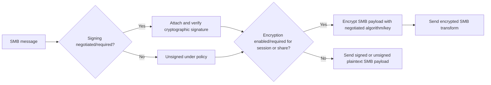

### Security caveats

- Requirements can come from client, server, domain/local policy, share, dialect, and capability.
- Signing and encryption consume processing resources; actual impact depends on hardware acceleration, algorithms, workload, implementation, and baseline.
- Network-level encryption such as IPsec/VPN and SMB encryption protect different endpoints/scopes.
- Packet captures of encrypted SMB reveal less application detail; rely on endpoint logs/counters and authorized decryption methods.
- A proxy/load balancer must explicitly support the SMB behavior; ordinary TLS inspection is not SMB encryption termination.
- SMB over QUIC exists in specific Microsoft scenarios but is outside this TCP-445 foundation and requires exact current product/support validation.

### Packet evidence

Record negotiate security mode/capabilities/algorithms, signed flags, signature validation errors, encryption transform use, policy events, CPU/throughput, and whether every channel/session follows expected protection.

---

## 9. Leases and oplocks

An **opportunistic lock (oplock)** or SMB **lease** grants client caching rights under protocol rules. The server can request a break when another access conflicts.

### Lease break sequence

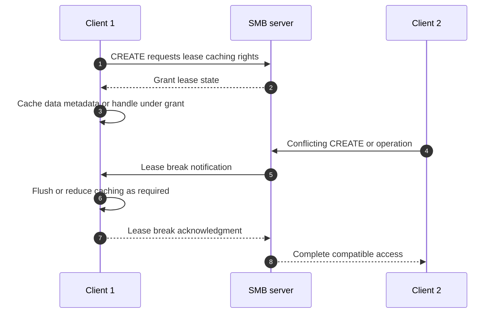

### Lease/oplock failures

- Client cannot receive/process break promptly because of network, thread, or endpoint issue.
- Application share modes conflict even when ACLs permit access.
- Server failover/recovery changes handle/lease state.
- Antivirus/indexing/backup opens create unexpected conflicts.
- Packet loss or firewall/session timeout delays break/ack.
- Client cache behavior is blamed when server/file-system latency is causal, or vice versa.

Do not disable oplocks/leases globally as a first fix. They are central performance/coherency mechanisms; validate the application and exact supported setting.

---

## 10. Durable and persistent handles, CA shares, and continuity

A **durable handle** can allow an SMB client to reconnect an open file after a temporary connection loss under protocol/server policy. A **persistent handle** is associated with continuously available storage scenarios and is designed to survive broader server failover under supported configurations.

A **Continuously Available (CA) share** advertises capabilities for applications and server implementations designed for transparent failover. It does not guarantee zero interruption or application success under every failure.

### Plain-English deep-dive: keeping the reservation during a doorway change

A normal file handle is like a desk reservation tied closely to the current conversation. A durable handle lets the desk hold the reservation while the caller reconnects after a short line drop. A persistent handle is designed for a supported service failover where the answering desk changes. The application, client, server, share, protocol dialect, backing storage, and timeouts must all support the promised continuity.

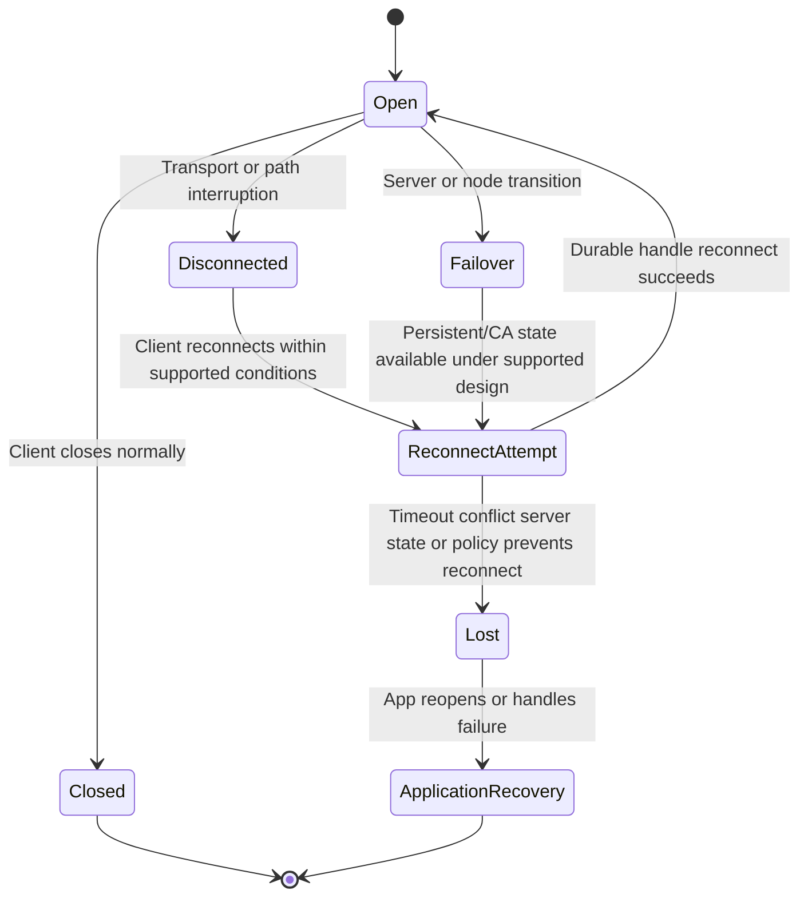

### Continuity questions

- Which dialect and CREATE contexts were negotiated?
- Did the server grant durable or persistent handle state?
- Is the share marked/implemented as continuously available under supported design?
- Does the application support transparent failover and retry behavior?
- What server/node/storage state is replicated or preserved?
- What network address/name and Witness/referral mechanism directs reconnect?
- Which operations may be replayed, and how does the protocol avoid unintended duplication under its rules?
- What interruption did the application observe, and did it preserve data consistency?

---

## 11. SMB Multichannel

**SMB Multichannel** can create multiple network connections/channels for one SMB session when client/server capabilities and network interfaces permit. It can improve throughput and path resilience, including Receive Side Scaling (RSS) and Remote Direct Memory Access (RDMA) scenarios under exact support.

### Channel establishment orientation

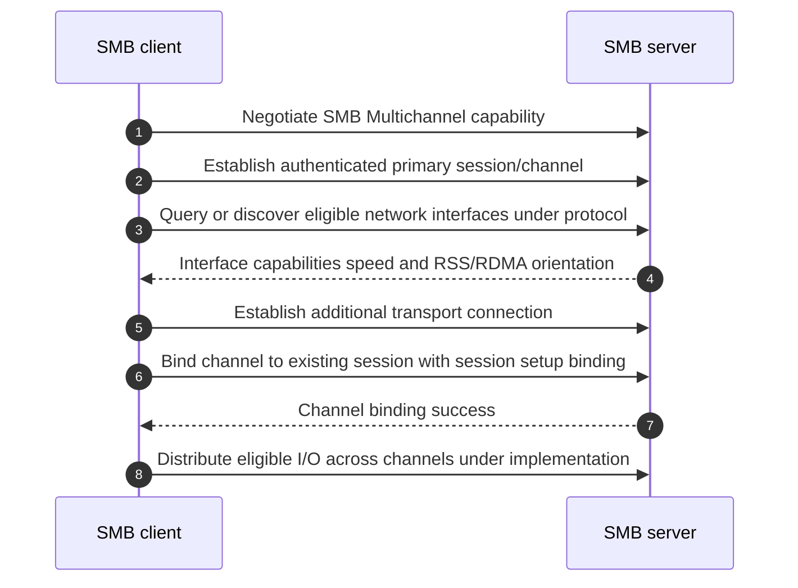

### Multichannel caveats

- Multiple channels do not prove physical independence; NICs can share a switch, virtual switch, adapter, CPU, subnet, route, or storage controller.
- One channel can be preferred/used differently based on speed, RSS/RDMA, policy, and implementation.
- Firewalls, routes, VLANs, MTU, signing/encryption, and name resolution must be correct for every channel.
- Link aggregation and SMB Multichannel solve different layers and can interact; validate exact design instead of stacking features by intuition.
- RDMA and SMB Direct require exact adapters, drivers, firmware, DCB/network design where applicable, OS/storage support, and IMT validation. No configuration recipe is asserted here.

### Multichannel evidence

Record server/client capability, network interfaces, channels/connections, local/remote addresses, RSS/RDMA state, speeds, bytes, failures, session binding, protection state, topology, and application behavior during channel loss.

---

## 12. Witness and transparent failover orientation

The SMB Witness protocol can notify registered clients about resource availability changes in supported clustered/continuous-availability designs so clients can move proactively rather than wait only for transport timeout.

### Witness-assisted failover

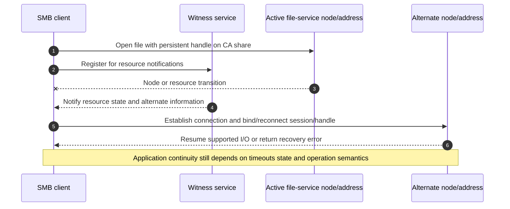

### Transparent failover is a measured outcome

Record detection time, transport interruption, Witness notification, DNS/name/address behavior, channel/session reconnect, durable/persistent handle result, lease/oplock recovery, in-flight operation status, application retry, user impact, and data consistency. `No manual remount` is not enough.

---

## 13. DFS namespace and referrals

**Distributed File System (DFS) Namespace** presents a logical path that can refer clients to one or more SMB targets. DFS Replication is a separate data-replication technology; a namespace referral is not proof of current data consistency between targets.

### DFS referral sequence

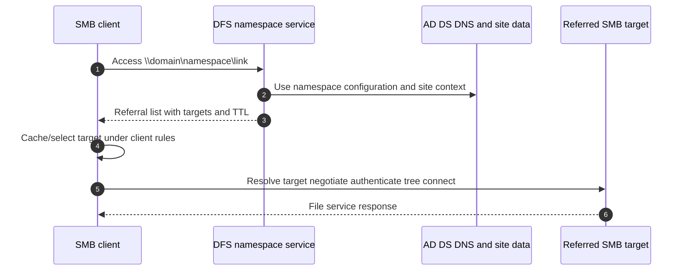

### DFS failure modes

- Namespace path or link missing/misconfigured.
- Referral contains unavailable/wrong target or site-costing input.
- Client caches referral until TTL even after target change.
- DNS/SPN/Kerberos for referred target is wrong.
- Targets contain different data because replication/application coordination is separate.
- Share/file permissions differ by target.
- Client reaches namespace but firewall blocks referred server.

Capture referral request/response, target list/order/TTL, client cache, selected target, DNS, SPN/authentication, target tree connect, and data/version evidence.

---

## 14. Packet and state correlation

### SMB state hierarchy

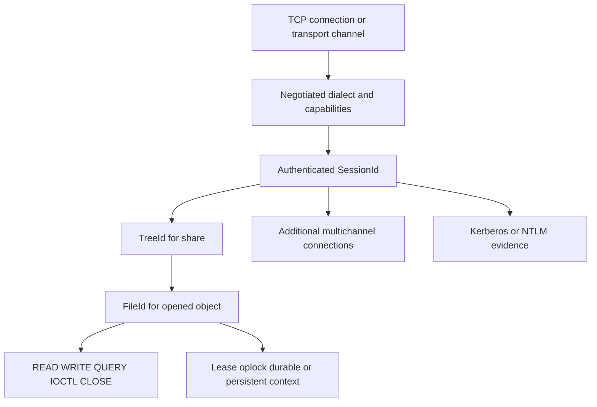

### Failure-stage table

| Last successful stage | Next failure | Candidate domain |
|---|---|---|
| DNS/service discovery | TCP SYN timeout/reset | Route/firewall/listener/address family/path |
| TCP established | NEGOTIATE error/no response | Dialect, signing/security policy, server implementation |
| NEGOTIATE success | SESSION_SETUP error | Kerberos/NTLM, SPN, DNS, time, trust, account, policy |
| SESSION_SETUP success | TREE_CONNECT error | Share name, share policy, DFS/referral, server state |
| TREE_CONNECT success | CREATE error | Path, ACL, desired/share access, lease/oplock, file system |
| CREATE success | READ/WRITE error/slow | FileId/state, credits, network, server queue, file system/storage |
| Open handle | Disconnect/reconnect failure | Channel, timeout, durable/persistent context, server failover, Witness |

### Time and capture discipline

- Capture negotiate and session setup where possible; midstream traces miss dialect/options/auth context.
- Encrypted SMB limits operation visibility; use endpoint ETW/logs/counters and authorized methods.
- Record MessageId, SessionId, TreeId, FileId, command/status, credits, channel tuple, SPN/user SID, and UTC.
- Account for NIC offloads, packet loss, asymmetric paths, multiple channels, failover addresses, and capture location.
- Do not publish packet captures containing file data, identities, tickets, hashes, or customer names outside approved handling.

---

## 15. Troubleshooting fault trees

### Connection and authentication tree

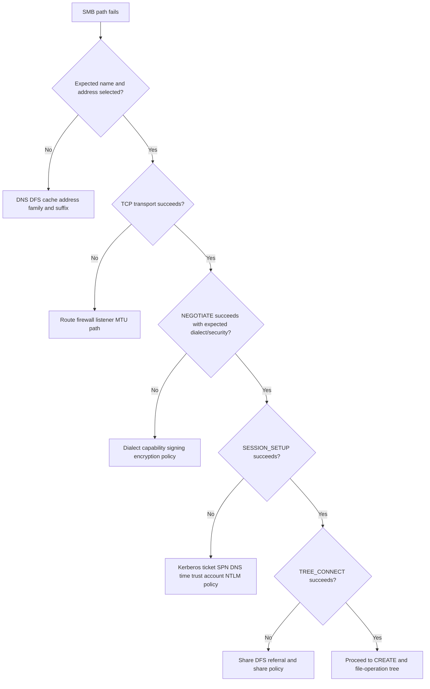

### File-operation and continuity tree

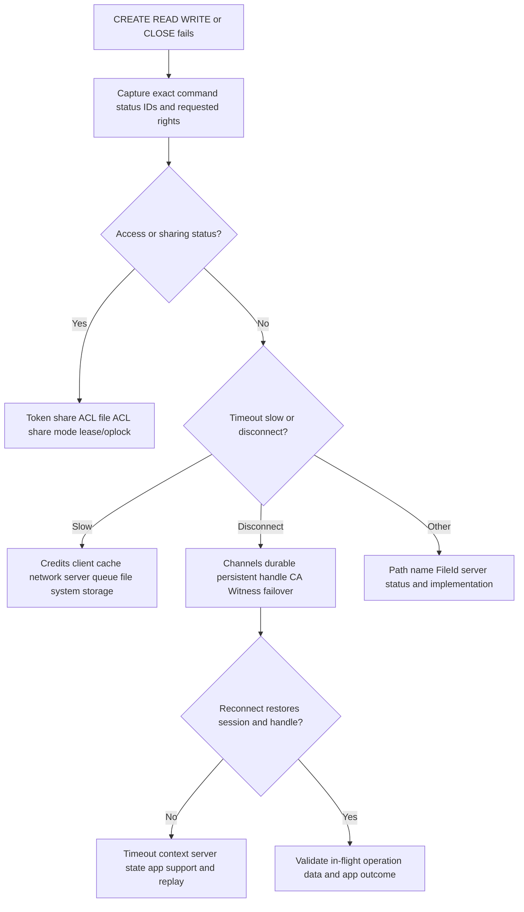

### Common symptoms

| Symptom | First evidence | Avoid |
|---|---|---|
| Prompts for credentials | Actual name/SPN/mechanism/status, ticket/token, server | Re-entering passwords repeatedly or mapping IP permanently |
| Access denied | SESSION_SETUP vs TREE_CONNECT vs CREATE status | Granting broad share/file access before locating gate |
| File in use | CREATE share access, lease/oplock break, process/handle owner | Blaming ACL or rebooting server immediately |
| Slow file copy | READ/WRITE size/concurrency/credits/channels, TCP, server/storage | One average Mbps number |
| Disconnect during failover | Handle type, CA, Witness, channel/session recovery, app behavior | Calling failover transparent because ping stayed up |
| One DFS site fails | Referral/TTL/selected target, DNS/SPN/share/ACL/path | Treating namespace success as target success |
| Kerberos expected but NTLM used | Service name/SPN/ticket error/policy | Accepting fallback without risk/action |

---

## 16. Performance, redundancy, security, and supportability

### Performance decomposition

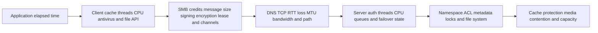

### Redundancy/failure domains

- Client NICs, RSS/RDMA queues, virtual switches, routes, DNS, and credentials.
- AD DS sites/DCs, DNS zones/resolvers, time sources, SPN ownership, and trust.
- Ethernet switches, VLANs, firewalls, load balancers, multichannel paths, and common MTU.
- SMB server interfaces, nodes/controllers, Witness service, share configuration, state replication, and backing data.
- DFS namespace servers, referral targets, replication/application consistency, and cached referrals.
- Common policy, certificate/key, automation, change, and administration.

### Supportability inventory

| Domain | Record |
|---|---|
| Client/application | OS/build, SMB client, application support, patches, signing/encryption/multichannel policy |
| AD/identity | Domain/forest level as relevant, DCs/sites, DNS, time, SPN/account, Kerberos/NTLM policy, groups/SIDs |
| Network | Addresses/families, TCP, VLAN/routes/firewall/MTU, NIC/driver/firmware, RSS/RDMA/DCB where used |
| Server/storage | Platform/release, SMB dialects/features, share/CA, namespace, interfaces, backing volume/file system |
| Continuity | Durable/persistent handles, Witness, failover topology, application behavior, DFS where used |
| Evidence | Current Microsoft/NetApp docs, exact IMT result/notes/date, access gaps and unknowns |

---

## 17. TAM discovery, recommendation, and JD Mapping

### Discovery questions

#### Business and workload

1. Which application, users, shares/paths, files, criticality, RPO/RTO, and performance objectives use SMB?
2. What operation/file-size/concurrency/metadata/locking/caching pattern exists?
3. Is the symptom discovery, authentication, authorization, lock, performance, channel, failover, or DFS target?

#### Architecture and state

4. Draw client, DNS/AD/time/KDC, network/security, SMB server, share/namespace, backing file system/storage, and protection.
5. Record actual dialect, capabilities, signing/encryption, SessionId, TreeId, FileId, lease/handle type, credits, and channels.
6. Draw data/control/management planes and all shared failure domains.

#### Identity and access

7. Which service name/SPN, authentication mechanism, DC/KDC, user/computer/service identity, token/groups/SIDs, and policy apply?
8. Which share permission, file ACL, requested access, share mode, lease/oplock, and target object apply?
9. Is DFS involved, and which referral target/TTL/cache/path was selected?

#### Continuity and support

10. Which durable/persistent handle, CA, Witness, multichannel, server/fabric failover, and application behaviors are supported and tested?
11. Which client/NIC/driver/network/AD/server/storage versions form the exact combination?
12. What current official/IMT result and notes validate it, and what is unlisted/inaccessible?

#### Recommendation and evidence

13. Can one operation be correlated from application through SMB IDs/auth/network to server/storage?
14. What safe test distinguishes auth, ACL, lock, channel, server, and storage hypotheses?
15. Who owns the action, date, rollback/stop, validation, and residual risk?

### Recommendation model

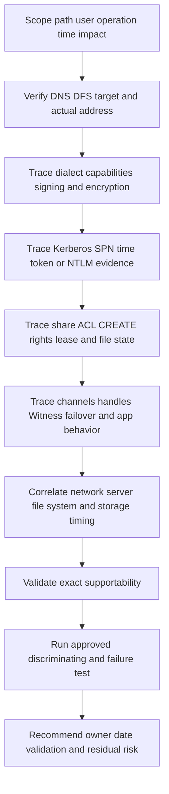

### Explicit JD Mapping

| JD responsibility | Part 16 contribution | Your strength and honest gap |
|---|---|---|
| Understand customer environment | Maps Windows/AD/DNS/network/SMB server/share/storage dependencies | **Strong transfer:** Windows, AD, M365, SharePoint/OneDrive support. **Gap:** production NetApp SMB ownership. |
| Storage depth | Explains SMB dialect/session/tree/file state, security, channels, and continuity | **Conceptual/lab:** no ONTAP SMB or CA-share administration claim. |
| Risk/stability | Finds SPN/fallback, ACL, lock, common-fate, state/timeout, and failover gaps | **Strength:** critical situation and identity/network evidence method. |
| Supportability | Builds exact client/network/AD/server/storage/feature matrix and IMT evidence | **Gap:** no customer IMT/gated result claimed. |
| Recommendation quality | Connects exact SMB stage/status to owner-led action and validation | **Strength:** Product/Engineering escalation and customer advisory. |
| Service review | Reports auth/security, continuity tests, performance trends, and actions | **Strength:** analytics/business reviews. |
| Coaching/SME | Provides repeatable packet/state and permission checklists | **Strength:** mentoring; NetApp-specific review still needed. |

### Honest production-gap statement

> "SMB and Active Directory are close to my production prior experience: I have worked with Windows identities, permissions, DNS, authentication dependencies, enterprise data services, and high-severity escalations. I can trace negotiate, session, tree, file, and security state conceptually and from evidence. I have not administered ONTAP SMB servers, CA shares, NetApp Witness integration, or production SMB Multichannel on NetApp. I would verify exact Microsoft/NetApp support and IMT notes and work with AD, network, Windows, application, and storage owners for changes and failover tests."

---

## 18. Fully synthetic case: Contoso Legal failover and access

> **Synthetic case:** Contoso Legal, all domains, accounts, shares, packets, failures, and outcomes are fictional. No NetApp product behavior, customer incident, or support result is asserted.

### Environment

- Windows clients use `\\files.contoso.example\cases`.
- The fictional SMB service is domain joined and uses a CA share.
- SMB 3.1.1, signing, encryption on the share, Multichannel, and Witness are intended.
- Two client NICs reach two storage interfaces through separate switches but share one firewall policy domain.
- A DFS namespace refers users to the service name.
- During a planned node failover, a case-management app pauses for 35 seconds and one user receives access denied after reconnect.

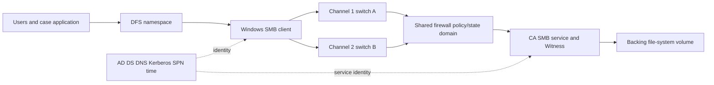

### Timeline

| UTC | Evidence | Bounded interpretation |
|---|---|---|
| 14:00:00 | Application has persistent handle to case database file under CA share | Intended continuity context exists for that open. |
| 14:00:01 | Planned node transition starts | Known trigger. |
| 14:00:02 | Witness notifies client of resource move | Control path works. |
| 14:00:03 | Channel 1 reconnects to alternate interface; channel 2 SYNs are dropped by stale firewall destination policy | Multichannel/path design is partially inconsistent. |
| 14:00:05 | Persistent handle reconnect succeeds on channel 1 | Handle continuity works for that open. |
| 14:00:05-35 | Application waits on its own reconnect/transaction timeout before resuming | `Transparent` protocol recovery still has application-visible delay. |
| 14:00:36 | User opens new file; Kerberos session uses expected SPN | Authentication works. |
| 14:00:36 | CREATE returns access denied; user's existing token lacks recently added legal-group SID | Authorization/token issue is separate from failover. |

### Competing hypotheses

| Hypothesis | Evidence for | Evidence against/missing | Test |
|---|---|---|---|
| Storage failover lost all handles | App paused | Persistent handle reconnect succeeds | Correlate handle reconnect and operation status |
| Witness failed | Failover event occurred | Notification arrives promptly | Witness registration/notification trace already weakens it |
| Network path inconsistency | One channel drops at firewall | Channel 1 works; exact stale rule present | Test both channels/interfaces before/after failover |
| SMB protocol caused 35-second pause | Pause follows reconnect | Protocol state recovered at 5 seconds; app waits until 35 | App logs/threads/timeouts versus SMB timestamps |
| Share ACL wrong | User denied | Other users succeed; session/tree connect succeed | CREATE desired access, token SID, share/file ACL |
| New AD group not in token | Membership changed after login/session creation | Need prove ACL requires group and token refresh behavior | Effective token, ACL, new authenticated session test |

### Fault tree

```mermaid
flowchart TD
    TOP[Failover pause plus one access denied] --> SPLIT[Separate continuity and authorization]
    SPLIT --> CONT[Continuity timeline]
    SPLIT --> ACC[Access timeline]
    CONT --> W{Witness notification received?}
    W -->|No| WIT[Witness registration path and service]
    W -->|Yes| H{Persistent handle reconnect succeeds?}
    H -->|No| STATE[Handle CA server state timeout support]
    H -->|Yes| APP[Compare protocol recovery with application wait]
    APP --> CH[Validate every multichannel and firewall path]
    ACC --> AUTH{Session authentication succeeds?}
    AUTH -->|No| K[Kerberos SPN DNS time trust policy]
    AUTH -->|Yes| ACL[Token groups share ACL file ACL desired access]
    CH --> VALID[Test failover and degraded operation]
    ACL --> VALID
```

### Recommendations

1. Network/security owner should correct and validate firewall policy for every SMB Multichannel address/path used before, during, and after failover; record common policy-domain risk.
2. Application owner should review the 30-second gap between successful handle reconnect and application resume and validate supported retry/transaction behavior.
3. AD/file-service owner should verify the user's effective token and required share/file ACE. Reauthenticate through approved procedure after membership correction; do not broaden ACLs.
4. Storage/SMB owner should preserve negotiate, SessionId/TreeId/FileId, persistent-handle, Witness, channel, server event, and backing-volume evidence.
5. Repeat a representative failover with both channels, encrypted/signed session, open-file I/O, positive/negative access, and application transaction validation.

### Customer-facing summary

> "The SMB service preserved the persistent handle and Witness notified the client, but one Multichannel path was blocked by stale firewall policy and the application waited another 30 seconds after protocol reconnect. The user's access denial is separate: authentication and tree connect succeeded, but the existing token lacked the newly assigned group SID needed by the file ACL. We recommend independent path-policy, application-retry, and token/ACL actions, then a full failover and authorization validation."

---

## 19. Paper lab and whiteboard drills

No production access is required. Use synthetic protocol tables, event logs, and public Microsoft/NetApp documentation.

### Paper lab scenario

A fictional Windows client uses `\\domain.example\data\finance`, which returns a DFS referral to `\\smb-a.example\finance`. DNS returns IPv4/IPv6. SMB 3.1.1 is intended with signing required and encryption on the share. Kerberos fails because the alias SPN is duplicated; NTLM succeeds for some clients. Two Multichannel interfaces exist, but one uses MTU 1500 and one 9000. A CA failover test drops one channel; the application opens files with restrictive share access. One user has an inherited deny ACE.

### Tasks

1. Draw client, DFS, DNS, AD/KDC/time, network, SMB service, share, file system, and storage.
2. Draw data, control, and management planes.
3. Trace NEGOTIATE fields/capabilities and actual selected dialect.
4. Draw Kerberos TGT/service-ticket/SESSION_SETUP and identify duplicate-SPN evidence.
5. Map actual NTLM fallback and its security/supportability risk.
6. Trace TREE_CONNECT, CREATE, READ/WRITE, and CLOSE with SMB IDs/status.
7. Build effective-access flow for share permission, token SIDs, inherited deny ACE, and desired access.
8. Map signing/encryption negotiation and capture visibility.
9. Draw lease/oplock grant and break for two clients.
10. Draw durable/persistent handle state through transport loss and server failover.
11. Enumerate Multichannel interfaces/channels, paths, MTU, RSS/RDMA, and common fate.
12. Draw Witness registration/notification/reconnect.
13. Trace DFS referral, TTL/cache, selected target, DNS, SPN, and share access.
14. Correlate application, SMB MessageId/SessionId/TreeId/FileId, network, AD, server, and storage time.
15. Build exact current supportability/IMT inventory and mark unknowns.
16. Write separate auth, access, performance, and continuity recommendations.

### Whiteboard drills

1. **SMB state:** TCP -> NEGOTIATE -> SESSION_SETUP -> TREE_CONNECT -> CREATE -> I/O -> CLOSE.
2. **Identity:** User/computer/service, SID, group, SPN, KDC, time.
3. **Kerberos:** Service name must find the right unique SPN/key.
4. **NTLM:** Fallback is evidence of a changed security path, not a success criterion.
5. **Access:** Share permission plus file ACL plus requested/share access.
6. **Lease:** Client caching rights that server can break.
7. **Continuity:** Durable reconnect versus persistent/CA failover.
8. **Multichannel:** Several connections for one session; prove path independence.
9. **DFS:** Namespace referral then a new SMB target connection.
10. **Fault split:** Auth, ACL, lock, network, server, storage, and application are separate stages.

### Lab completion criteria

- [ ] Actual dialect/capabilities are recorded, not inferred from product labels.
- [ ] Kerberos and NTLM mechanisms are identified from evidence.
- [ ] DNS, SPN, time, trust, token, share, and file ACL are separate dependencies.
- [ ] Every SMB command/status and state ID is scoped correctly.
- [ ] Signing and encryption protection/visibility are distinct.
- [ ] Oplock/lease, durable/persistent handle, CA, Witness, and DFS are distinct.
- [ ] Multichannel paths include MTU, security, common fate, and application tests.
- [ ] Protocol reconnect timing is separate from application recovery.
- [ ] Exact supportability remains pending current evidence.
- [ ] Production ONTAP SMB experience is not implied.

---

## 20. Self-test

1. Define SMB client/server, dialect, session, tree connection, FileId, credit, lease, and oplock.
2. Draw SMB architecture and three planes.
3. Draw NEGOTIATE and orient on dialects, security mode, capabilities, GUIDs, sizes, and algorithms.
4. Define AD DS, DC, KDC, SID, user/computer/service identity, group, and SPN.
5. Explain DNS and time dependencies for Kerberos SMB.
6. Draw Kerberos TGT/service-ticket/SESSION_SETUP.
7. Explain NTLM challenge-response orientation and fallback risk.
8. Draw TREE_CONNECT, CREATE, READ, WRITE, and CLOSE.
9. Orient on MessageId, SessionId, TreeId, FileId, status, credits, and CREATE fields.
10. Explain why CREATE can mean open and why share mode matters.
11. Separate share permissions, file ACLs, token SIDs, desired access, and sharing violations.
12. Define signing versus encryption and their negotiated/policy dependencies.
13. Draw lease/oplock grant, conflict, break, and acknowledgment.
14. Explain durable versus persistent handles and CA shares.
15. Draw handle reconnect after transport loss and server failover.
16. Explain SMB Multichannel capability, channel binding, RSS/RDMA orientation, and common fate.
17. Draw Witness registration, notification, and reconnect.
18. Explain transparent failover as a measured application outcome.
19. Draw DFS namespace referral and distinguish DFS Replication.
20. Build the SMB state hierarchy from connection to file operation.
21. Apply connection/auth and file/continuity fault trees.
22. Decompose SMB performance across client, protocol, network, server, file system, and storage.
23. Build exact security, redundancy, and supportability inventory.
24. Ask the complete TAM discovery set and write a bounded recommendation.
25. Recreate Contoso Legal's separate path/application/token mechanisms.
26. Build the minimum escalation pack.
27. Complete the paper lab and whiteboard drills.
28. Explain packet-capture limits for signed/encrypted/multichannel SMB.
29. Answer Q1-Q8 aloud.
30. State your strengths and NetApp SMB production gap honestly.

---

## 21. Official Source Anchors

**Date checked: 2026-08-24.** Microsoft Open Specifications and official public documentation anchor SMB/AD behavior. Protocol documents are updated; Windows/ONTAP implementations and policy defaults vary; some continuity features require exact clustered/application designs; and NetApp IMT/support content can require authorization. Verify the exact dialect, feature, OS/build, AD/DNS/time/security policy, NIC/driver/network, storage release, standard revision, and IMT notes. Do not invent a support matrix, fallback behavior, timeout, or internal ONTAP process.

| Topic | Official public source | Access, version, and use note |
|---|---|---|
| SMB 2/3 protocol | [MS-SMB2 - Server Message Block Protocol Versions 2 and 3](https://learn.microsoft.com/en-us/openspecs/windows_protocols/ms-smb2/) | Official Microsoft protocol specification; revision history matters and implementation support must be validated. |
| Legacy SMB context | [MS-SMB - Server Message Block Protocol](https://learn.microsoft.com/en-us/openspecs/windows_protocols/ms-smb/) | Official Microsoft protocol documentation for legacy context; do not enable legacy dialects without current security/support review. |
| SMB overview | [Microsoft SMB overview](https://learn.microsoft.com/en-us/windows-server/storage/file-server/smb-overview) | Official Windows Server documentation; select current supported releases/features. |
| SMB security | [SMB security enhancements](https://learn.microsoft.com/en-us/windows-server/storage/file-server/smb-security) | Official Microsoft guidance for signing, encryption, authentication, and related features; version/policy-specific. |
| SMB Multichannel | [Manage SMB Multichannel](https://learn.microsoft.com/en-us/windows-server/storage/file-server/manage-smb-multichannel) | Official Windows Server guidance. Exact NIC/RSS/RDMA design and third-party server support require validation. |
| Transparent failover | [MS-SMB2 protocol specification](https://learn.microsoft.com/en-us/openspecs/windows_protocols/ms-smb2/) | Durable/persistent handle and replay semantics are defined in protocol revisions; product/application support remains exact-version specific. |
| SMB Witness | [MS-SWN - Service Witness Protocol](https://learn.microsoft.com/en-us/openspecs/windows_protocols/ms-swn/) | Official Microsoft protocol specification; deployment support requires exact client/server validation. |
| DFS namespace referrals | [MS-DFSC - DFS Namespace Referral Protocol](https://learn.microsoft.com/en-us/openspecs/windows_protocols/ms-dfsc/) | Official Microsoft protocol specification; DFS Replication is separate. |
| Active Directory technical specification | [MS-ADTS - Active Directory Technical Specification](https://learn.microsoft.com/en-us/openspecs/windows_protocols/ms-adts/) | Official Microsoft protocol documentation; deployment/operations require Windows Server AD guidance. |
| Kerberos in Windows | [MS-KILE - Kerberos Protocol Extensions](https://learn.microsoft.com/en-us/openspecs/windows_protocols/ms-kile/) | Official Microsoft protocol specification. SPN, ticket, crypto, trust, and policy remain environment-specific. |
| NTLM | [MS-NLMP - NT LAN Manager Authentication Protocol](https://learn.microsoft.com/en-us/openspecs/windows_protocols/ms-nlmp/) | Official Microsoft specification; current security policy and deprecation/restriction guidance must be checked. |
| Windows authentication | [Windows Authentication technical overview](https://learn.microsoft.com/en-us/windows-server/security/windows-authentication/windows-authentication-overview) | Official Windows Server overview; select current release/security guidance. |
| NetApp SMB configuration | [ONTAP SMB configuration documentation](https://docs.netapp.com/us-en/ontap/smb-config/) | Official public area. Select exact ONTAP release for AD join, shares, permissions, and prerequisites. |
| NetApp SMB administration | [ONTAP SMB management documentation](https://docs.netapp.com/us-en/ontap/smb-admin/) | Official public area for SMB operations/features; exact support and behavior are release-specific. |
| NetApp SMB continuity | [ONTAP SMB nondisruptive operations documentation](https://docs.netapp.com/us-en/ontap/smb-hyper-v-sql/) | Official public solution area for specific continuously available workloads. Do not generalize beyond documented applications/configurations. |
| NetApp interoperability | [NetApp Interoperability Matrix Tool](https://imt.netapp.com/) | Official, potentially gated, and time-sensitive. Save exact Windows/app/NIC/protocol/storage result, notes, and date. |

### Source-use discipline

- Record Microsoft Open Specification revision/date and exact implemented dialect/capability.
- Confirm actual Kerberos/NTLM mechanism, service name/SPN, ticket error, token, and policy from evidence.
- Treat share permission, file ACL, desired/share access, and lease/oplock as separate gates.
- Verify every Multichannel/CA/Witness/DFS path, application, network, and storage feature in current documentation and IMT.
- Capture application and protocol recovery timing; do not market `transparent` as zero-impact.
- Protect traces/tickets/identity/file data and use authorized collection/decryption only.

---

## Likely Interview Questions

### Q1. Walk through an SMB file open from name resolution to READ.

> **Model answer:** "The client resolves the service or DFS target and establishes transport, commonly TCP 445. NEGOTIATE selects an SMB dialect and capabilities. SESSION_SETUP authenticates a user or service, preferably with intended Kerberos under policy. TREE_CONNECT attaches the session to a share. CREATE opens the path with desired access, share mode, disposition, options, and contexts; the server checks share permission, file ACL, lock/lease state, and file system. The returned FileId is used for READ/WRITE and then CLOSE."

**Follow-up depth:** Name MessageId, SessionId, TreeId, FileId, credits, status, and where DNS/SPN/time/AD evidence fits.

### Q2. How do Kerberos, SPNs, DNS, and time work together for SMB?

> **Model answer:** "The client uses the service name to resolve an address and request a Kerberos ticket for the SMB service SPN. The SPN must be unique and owned by the correct service account/computer with matching keys and crypto policy. Client, KDC, and server time must support ticket validity, and domain trust/DC reachability must work. The client presents the service ticket during SESSION_SETUP, after which the server builds a user/group security context. Authentication success still does not grant share/file access."

**Follow-up depth:** Diagnose alias/duplicate SPN, IP-address access, wrong key version, clock skew, trust, and site/DC selection.

### Q3. What is NTLM fallback, and why should a TAM care?

> **Model answer:** "NTLM is a challenge-response authentication family that may be used when Kerberos is unavailable or not selected and policy permits it. It has different security and service-identity properties and is increasingly restricted. Fallback can hide broken DNS, SPN, trust, or Kerberos configuration while making a test appear successful. I record the actual mechanism, error, and policy, restore the intended supported design, and avoid promising that NTLM will always be available."

**Follow-up depth:** Explain how to prove the mechanism from logs/trace and why repeated credential entry or IP mapping is not a root fix.

### Q4. How do share permissions and file ACLs produce effective access?

> **Model answer:** "The authenticated session has a token containing user and group SIDs. TREE_CONNECT evaluates share policy, and CREATE or later operations evaluate file/directory security descriptors plus requested access, inheritance, deny/allow entries, privileges, and share-mode/lease state. The effective result is constrained by all applicable gates. I identify the exact SMB command/status and compare one expected-allow and expected-deny identity rather than granting broad access."

**Follow-up depth:** Distinguish access denied, logon failure, bad network name, path not found, sharing violation, and stale group token.

### Q5. Compare SMB signing and encryption.

> **Model answer:** "Signing protects SMB message integrity/authenticity using negotiated session keys; encryption protects SMB payload confidentiality and integrity between SMB endpoints. Requirements can come from client/server policy, share, dialect, and capability. Both can affect CPU and throughput depending on hardware and implementation, and encryption limits packet visibility. I capture negotiation and policy evidence and measure representative performance rather than disabling protections to improve a benchmark."

**Follow-up depth:** Explain signed flags, encryption transforms, algorithm negotiation, VPN scope, and why ordinary TLS inspection does not terminate SMB encryption.

### Q6. Explain SMB Multichannel and its relationship to redundancy.

> **Model answer:** "SMB Multichannel can bind several network connections to one authenticated SMB session when both endpoints advertise support and eligible interfaces exist. It can improve throughput and tolerate some path failures, including RSS/RDMA designs under exact support. I verify every channel's addresses, VLAN/route/firewall/MTU, NIC/driver/firmware, signing/encryption, physical path, and common fate. Multiple channels do not automatically mean independent switches or that one application operation doubles speed."

**Follow-up depth:** Compare Multichannel with LACP, explain channel binding, RSS/RDMA caveats, and design a channel-loss test.

### Q7. What makes SMB failover continuous or transparent?

> **Model answer:** "Durable handles support reconnect after temporary transport loss; persistent handles and CA shares support broader failover scenarios under compatible client, application, server, share, and storage design. Witness can notify clients of resource changes, while Multichannel offers alternate connections. I measure detection, notification, channel/session/handle reconnect, in-flight operation/replay status, lease recovery, application pause/error, and data consistency. Transparent means supported recovery with bounded impact, not guaranteed zero interruption."

**Follow-up depth:** Walk through persistent-handle reconnect and explain why protocol recovery at five seconds can coexist with a 35-second application pause.

### Q8. How does your background transfer to SMB work, and what remains a gap?

> **Model answer:** "SMB and AD align strongly with my prior production background in Windows identities, permissions, DNS, authentication dependencies, SharePoint/OneDrive data services, networking, and enterprise escalations. I can trace the SMB state and correlate Windows evidence. I have not administered ONTAP SMB servers, CA shares, NetApp Witness integration, or production Multichannel on NetApp. I would verify exact Microsoft/NetApp documentation and IMT support and coordinate changes with AD, network, Windows, application, and storage owners."

**Follow-up depth:** Give one factual enterprise identity/permissions incident and label the NetApp continuity work as conceptual or lab evidence.

---

## 30-Second Memory Hooks

- **SMB state:** Negotiate -> session -> tree -> file handle -> I/O -> close.
- **Dialect:** Actual agreed protocol version and capabilities.
- **SessionId:** Authenticated security context.
- **TreeId:** Connection to one share.
- **FileId:** Ticket for one opened object.
- **Credit:** SMB outstanding-work budget.
- **AD DS:** Identity directory; **DC/KDC:** directory and ticket authority.
- **SID:** Security identity; display name can change.
- **SPN:** Kerberos service address book entry; unique and correctly owned.
- **Kerberos:** DNS + time + KDC + SPN/key + trust + policy.
- **NTLM fallback:** A different security path that can hide the Kerberos defect.
- **Share permission:** Door access; **file ACL:** object access.
- **CREATE:** Open/create with desired and shared-access rules.
- **Signing:** Integrity/authenticity; **encryption:** confidentiality plus integrity.
- **Lease/oplock:** Client caching rights the server can break.
- **Durable:** Reconnect after line loss; **persistent:** supported CA failover state.
- **Multichannel:** Several transport connections bound to one session.
- **Witness:** Proactive resource-change notification.
- **DFS referral:** Namespace points client to a target; target still needs DNS/auth/access.
- **Transparent failover:** Measure application pause and data outcome, not marketing wording.
- **Your bridge:** SMB/AD methods are strong; NetApp SMB production ownership remains unclaimed.

---

## Completion Checklist

- [ ] Define SMB client/server, dialect, session, tree, FileId, credit, lease, and oplock.
- [ ] Draw SMB architecture and data/control/management planes.
- [ ] Trace NEGOTIATE and record actual dialect, capabilities, security, GUIDs, sizes, and algorithms.
- [ ] Define AD DS, DC/KDC, SID, user/computer/service identity, group, token, and SPN.
- [ ] Draw Kerberos SMB session setup with DNS/time/trust/key dependencies.
- [ ] Explain NTLM orientation, actual mechanism evidence, and fallback risk.
- [ ] Trace TREE_CONNECT, CREATE, READ, WRITE, and CLOSE with all SMB IDs/status.
- [ ] Separate share permission, file ACL, desired access, share mode, and lease/oplock conflicts.
- [ ] Explain signing versus encryption, policy sources, performance, and capture limits.
- [ ] Draw lease/oplock grant, break, flush, and acknowledgment.
- [ ] Explain durable/persistent handles and CA share prerequisites.
- [ ] Draw handle/session recovery after connection and server failover.
- [ ] Explain SMB Multichannel/channel binding, RSS/RDMA orientation, and common fate.
- [ ] Draw Witness notification and measure transparent-failover outcome.
- [ ] Draw DFS referral, target selection/cache, and separate replication/data consistency.
- [ ] Build the SMB state hierarchy and both troubleshooting trees.
- [ ] Decompose performance and map redundancy/security failure domains.
- [ ] Correlate application, SMB, network, AD, server, and storage evidence.
- [ ] Ask the complete TAM discovery set and write a seven-part recommendation.
- [ ] Recreate Contoso Legal and separate network, application, and authorization mechanisms.
- [ ] Build exact current Microsoft/NetApp supportability and IMT evidence.
- [ ] Complete the paper lab, whiteboard drills, self-test, and Q1-Q8 aloud.
- [ ] State your production strengths and NetApp SMB production gap honestly.
- [ ] Recheck protocol revisions, policies, exact versions/features, and NetApp IMT notes before customer use.

---

*Next suggested section:* [Part 17 - iSCSI from Zero: Sessions, LUNs, CHAP, MPIO, and Boot Paths](Part-17-iscsi-luns-chap-mpio.md)