# Part 17 - iSCSI from Zero: Sessions, LUNs, CHAP, MPIO, and Boot Paths

> **Section goal:** Understand how a host discovers an iSCSI target, negotiates login and security, receives a mapped LUN, sends SCSI commands over TCP, and survives path failure. By the end, you should be able to separate network, iSCSI, SCSI, MPIO, host file-system, and application state and build a safe supportability or incident recommendation.

Covers index item **17** and maps directly to job-description responsibilities for storage and networking depth, customer-environment analysis, supportability, stability and risk mitigation, tailored recommendations, operational reviews, and escalation quality.

This Part is vendor-neutral. Exact discovery methods, iSCSI login keys, Challenge-Handshake Authentication Protocol (CHAP), session/connection limits, LUN mapping, initiator groups, Multipath I/O (MPIO), Asymmetric Logical Unit Access (ALUA), timeouts, queue depth, persistent reservations, boot-from-SAN, network design, and NetApp behavior vary by host, target, protocol implementation, release, and supported configuration. Validate current official documentation and the exact NetApp Interoperability Matrix Tool (IMT) solution and notes.

> **Evidence boundary:** Every organization, IQN, portal, LUN, packet, queue, failure, and recommendation below is synthetic. Your production Windows/Azure networking, virtual machines, storage fundamentals, enterprise escalation, and customer communication are strengths. Production iSCSI target/initiator administration, LUN mapping, igroup management, MPIO/ALUA tuning, boot-from-SAN, or ONTAP SAN ownership is not claimed.

---

## 1. iSCSI architecture and vocabulary

**Internet Small Computer Systems Interface (iSCSI)** carries SCSI commands and data in iSCSI Protocol Data Units (PDUs) over TCP/IP. The host is an initiator; the storage endpoint is a target.

### Plain-English deep-dive: numbered warehouse bins over a reliable courier route

The host sends numbered storage commands to a warehouse service over a TCP courier route. The portal is the warehouse entrance, the iSCSI Qualified Name (IQN) is the registered business identity, and the LUN is the numbered storage unit the host may use. TCP delivers ordered bytes; iSCSI frames SCSI commands; SCSI defines block operations and status; the host file system gives those blocks filenames.

| Term | Plain meaning | Why it matters |
|---|---|---|
| **Initiator** | Host endpoint starting iSCSI/SCSI commands. | Identity, OS, driver, NIC, sessions, MPIO, and file system originate here. |
| **Target** | Storage endpoint receiving iSCSI commands. | Publishes target identity, portals, LUN access, and protocol status. |
| **Portal** | Target IP address plus TCP port endpoint, commonly port 3260. | Reachability to one portal is not reachability to every independent path. |
| **IQN** | iSCSI Qualified Name: globally structured initiator or target name. | Mapping/security use exact identity; similar hostnames are not equivalent. |
| **Session** | Logical relationship between one initiator name and target name. | Contains negotiated parameters and one or more TCP connections. |
| **Connection** | One TCP connection within an iSCSI session. | Loss, ordering, and path behavior occur per connection. |
| **LUN** | Logical Unit Number identifying a SCSI logical unit within a target context. | Host receives a block device, not a shared file tree. |
| **igroup** | NetApp term for an initiator group used in LUN mapping. | Exact ONTAP object/rules are deferred; conceptually groups initiator identities for presentation. |
| **PDU** | iSCSI protocol message unit carried inside TCP. | Packet analysis must separate TCP segments from iSCSI PDU boundaries. |

```mermaid
flowchart LR
    APP[Application or database] --> HFS[Host file system volume manager or raw manager]
    HFS --> SCSI[Host SCSI block layer]
    SCSI --> MPIO[MPIO device and path selection]
    MPIO --> ISCSI[iSCSI initiator sessions/connections]
    ISCSI --> TCP[TCP/IP Ethernet VLAN routes and MTU]
    TCP --> PORTAL[Target portals]
    PORTAL --> MAP[Target IQN mapping or igroup]
    MAP --> LUN[LUN and backing storage]
```

### Data, control, and management planes

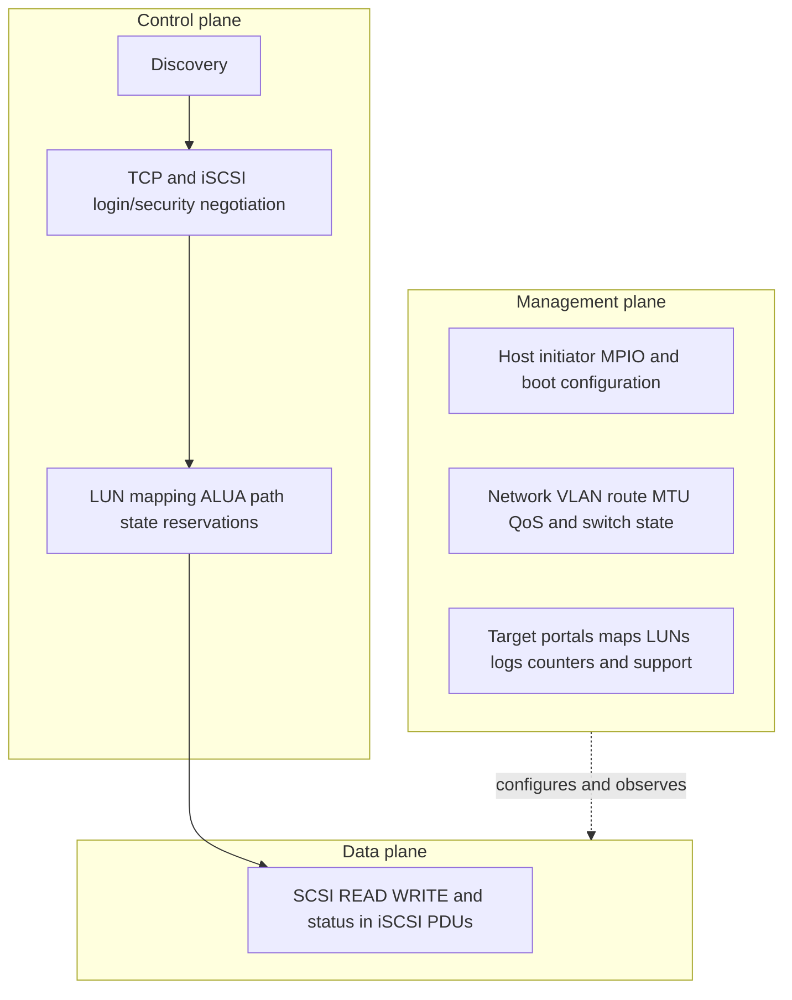

---

## 2. SCSI command orientation over TCP

SCSI is a command architecture for logical units. iSCSI maps SCSI tasks and data transfer onto iSCSI PDUs carried in a reliable TCP byte stream.

### Layer boundaries

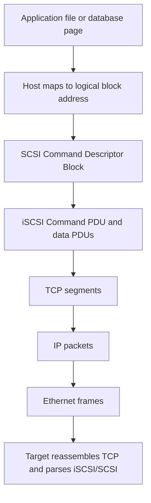

### SCSI/iSCSI field orientation

| Scope | Fields/concepts | Diagnostic use |
|---|---|---|
| SCSI command | Operation code, Logical Block Address (LBA), transfer length, direction, task attribute | Identify exact block operation and range. |
| iSCSI Basic Header Segment | Opcode, flags, LUN field, Initiator Task Tag, data segment length | Frame command/data/status and correlate task. |
| Sequence | Command sequence number, expected status sequence number, data sequence information | Orient on ordering/recovery under negotiated mode. |
| SCSI response | Status and optional sense data | Separate good completion, check condition, reservation conflict, and other outcomes. |
| TCP | Five-tuple, sequence/ACK, windows, retransmission, reset | Transport delivery and connection evidence. |
| Host device | Stable device identifier, path, queue, file system, mount/database | Establish which upper-layer device/data is affected. |

### Command sequence

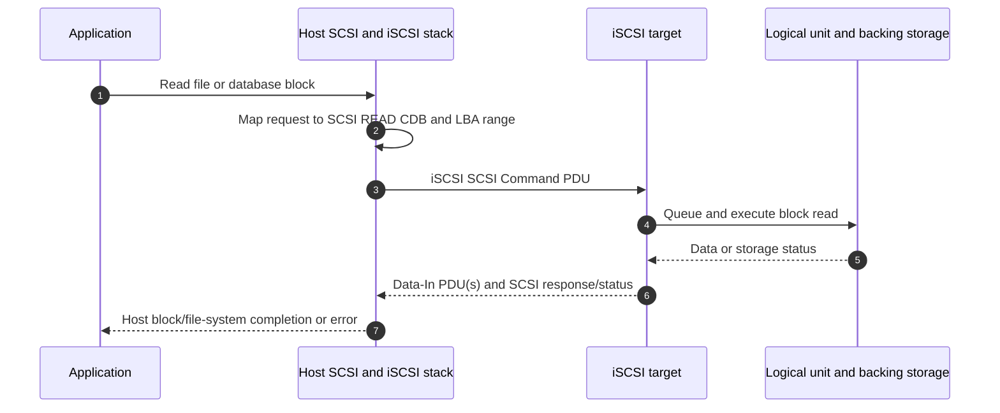

A TCP ACK is not a SCSI completion. An iSCSI PDU arriving at the target is not proof that the LUN accepted the command. A SCSI good status is not automatically an application transaction commit.

---

## 3. Naming: IQNs, aliases, portals, and identities

An IQN uses a reverse-domain date-based naming structure, such as the synthetic `iqn.2026-08.example:host-a`. Exact syntax and uniqueness rules are defined by iSCSI naming standards.

### Identity map

| Identity | Example use | Do not confuse with |
|---|---|---|
| Initiator IQN | LUN mapping, access, session identity | Hostname, IP address, CHAP username |
| Target IQN | Select target service | Portal IP address |
| Portal | IP/port transport endpoint | Target's persistent protocol identity |
| Alias | Human-friendly display metadata | Authoritative unique name |
| LUN number/identifier | Logical-unit addressing/presentation context | Stable device serial/identifier used by MPIO |
| CHAP name | Authentication identity | Authorization mapping by initiator IQN unless implementation explicitly links them |

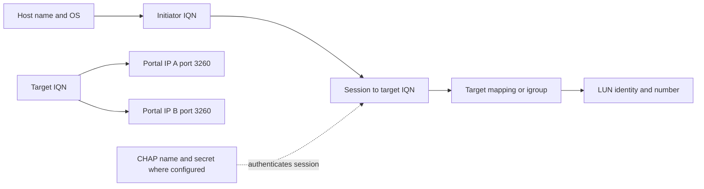

Changing an initiator IQN can make LUN mappings disappear even when the host uses the same IP. Duplicate IQNs can expose one host's LUNs to another or cause session conflicts. Govern identity as carefully as addresses.

---

## 4. Discovery methods and SendTargets orientation

Discovery tells an initiator which target names and portals exist. It is not LUN authorization.

### Discovery approaches

| Approach | Concept | Caveat |
|---|---|---|
| Static/manual | Administrator configures target IQN and portal(s) | Simple but can drift; every path must be represented correctly. |
| SendTargets | Initiator logs into a discovery session and requests target/portal information | Returned portal list can introduce routing/MTU/firewall dependencies. |
| iSNS | Internet Storage Name Service-based discovery under supported deployment | Adds service availability/security/configuration dependency; verify current support. |
| Boot firmware configuration | Firmware/adapter obtains target and boot-LUN parameters | Pre-OS network and credential handling differ from OS initiator. |

### SendTargets sequence

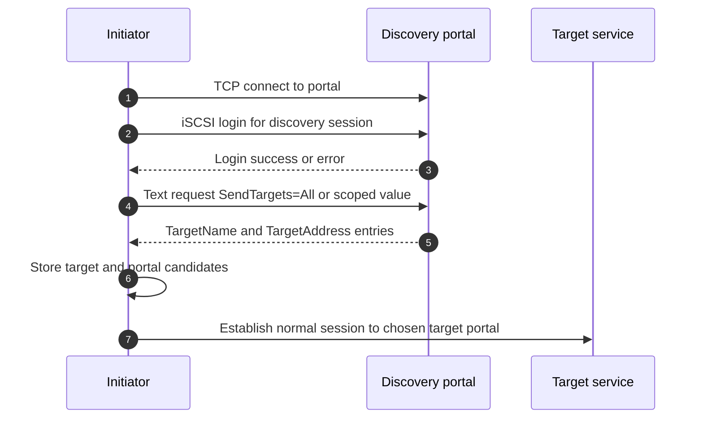

### Discovery failures

- Portal address/port unreachable, wrong VLAN/route/firewall/MTU.
- Wrong target IP advertised for the client's network or address family.
- CHAP policy differs between discovery and normal sessions.
- Target service disabled or listening on another interface.
- Stale static discovery entries create attempts to old portals.
- Discovery succeeds but LUN map is absent for the initiator IQN.

---

## 5. iSCSI login phases and parameter negotiation

An initiator establishes TCP, enters the iSCSI login process, negotiates security and operational parameters, then reaches full-feature phase for normal SCSI commands.

### Login sequence

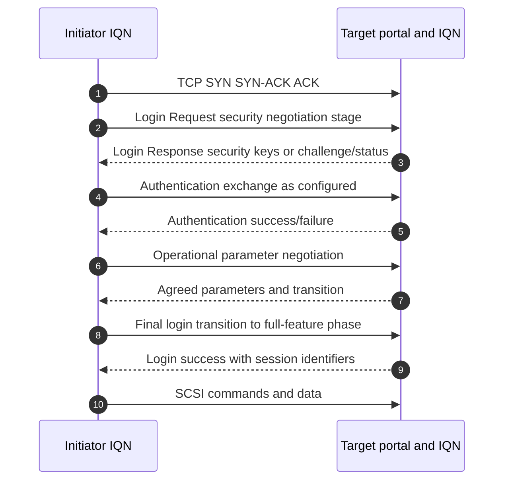

### Login field/key orientation

| Item | Why it matters |
|---|---|
| InitiatorName/TargetName | Exact session identities and mapping context. |
| Session type | Discovery versus normal. |
| ISID/TSIH/CID concepts | Session/connection identity and reinstatement context. |
| Current/next stage and transition flags | Identify where login failed. |
| Status class/detail | Authentication, initiator, target, or redirection failure class. |
| AuthMethod/CHAP keys | Selected authentication mechanism and exchange stage. |
| Header/data digest | Integrity options if supported/negotiated; not encryption. |
| Data/segment/burst/order/error-recovery keys | Affect protocol operation; exact supported values must be validated. |

Do not tune negotiation keys from memory. Unsupported combinations can fail login or create subtle recovery/performance behavior.

---

## 6. CHAP: authentication, not encryption

**Challenge-Handshake Authentication Protocol (CHAP)** proves knowledge of a shared secret through a challenge-response exchange. In iSCSI, one-way CHAP commonly authenticates the initiator to the target; mutual CHAP can authenticate both directions under implementation support.

### Plain-English deep-dive: prove you know the secret without sending the secret

The target gives a fresh random challenge. The initiator combines challenge, identifier, and shared secret through the configured CHAP algorithm to produce a response. The target computes its own result and compares. **Why it matters:** the secret is not sent directly, but weak secrets, old algorithms, poor storage, reuse, or captured challenge-response still create risk. CHAP does not encrypt SCSI data.

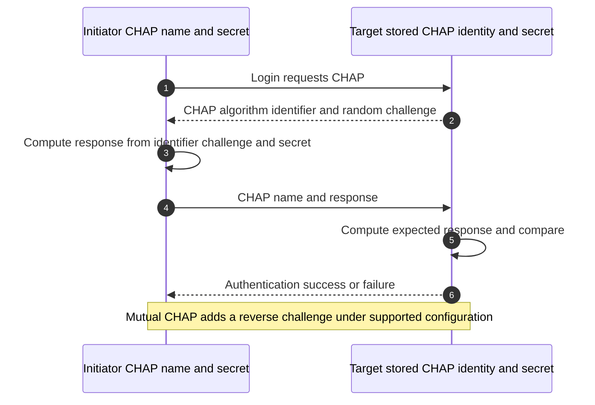

### CHAP limits and controls

- CHAP authenticates knowledge of a secret; it does not provide payload confidentiality.
- Exact algorithms, secret length/complexity, mutual mode, storage, rotation, and management are product/policy-specific.
- One shared secret across many hosts increases blast radius and weakens attribution.
- Secrets can exist in firmware, OS configuration, automation, target configuration, and recovery documentation; protect every copy.
- IPsec or another network protection can add encryption under an explicitly supported design; do not assume it is available or free of performance/MTU impact.
- Initiator IQN mapping remains an authorization control; CHAP success alone should not grant every LUN.

---

## 7. Sessions, connections, commands, and recovery

One iSCSI session connects one initiator name to one target name and can contain one or more TCP connections under negotiated/support constraints. Multiple Connections per Session (MC/S) is an iSCSI feature distinct from host MPIO; support and use are not universal.

### Plain-English deep-dive: one business relationship, one or more phone lines

The session is the relationship between two registered organizations. Connections are phone lines carrying conversations for that relationship. MPIO is a higher-level route manager that can coordinate separate sessions/paths to the same LUN. Adding phone lines to one relationship is not the same as building independent routes with separate failure domains.

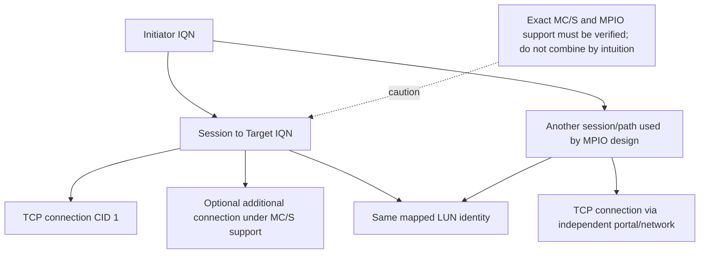

### Recovery concepts

- TCP retransmits lost bytes within a connection.
- iSCSI defines protocol recovery behavior and error-recovery levels, but implementation support commonly varies and must be verified.
- MPIO can fail block I/O to another path/session when the host stack and target state permit.
- Application/file-system timeout can expire before path recovery completes.
- A reset/reinstatement can affect outstanding tasks; command retry and idempotence are not application-transaction guarantees.

---

## 8. LUNs, mappings, igroups, and host ownership

A target presents a LUN to authorized initiators. NetApp commonly uses **igroups** to group initiator identities for LUN mapping; exact ONTAP configuration is deferred to Part 30.

### Presentation flow

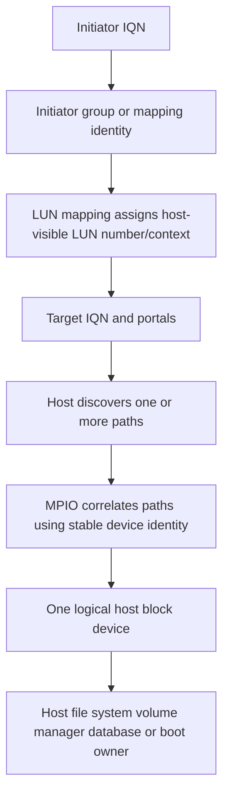

### LUN mapping evidence

- Exact initiator IQN(s), target IQN, portal(s), and session(s).
- igroup or access object membership and OS/type metadata where applicable.
- LUN path/name, mapping, host-visible LUN number, stable serial/device identifier, size, and state.
- MPIO path count, target-port association, and device correlation.
- Host partition/volume/file-system/database/cluster owner and mount state.
- Recent clone, restore, map/unmap, resize, rescan, initiator-name, or host change.

### Safety boundaries

- Never format a newly visible device until stable identity and ownership are independently verified.
- Do not present an ordinary file system read/write to multiple hosts unless a supported cluster-aware owner coordinates it.
- Unmapping an active LUN or changing its identity/path can cause I/O failure and corruption.
- Expanding a LUN requires an ordered target expansion, host rescan, partition/volume/file-system/application process under current guidance.
- Storage snapshot/restore must coordinate host cache, file system, database, reservations, and application consistency.

---

## 9. MPIO, ALUA, path states, and policies

**Multipath I/O (MPIO)** presents one logical device over multiple host-to-target paths. **Asymmetric Logical Unit Access (ALUA)** lets a SCSI target communicate path/target-port-group access characteristics so the host can distinguish more optimal and less optimal paths under the architecture.

### Path architecture

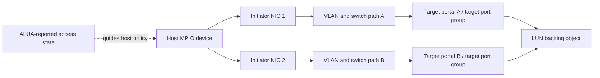

### ALUA/path-state orientation

Names vary by host/target, but concepts can include:

- Active/optimized: available through a more direct/preferred target path.
- Active/non-optimized: available but may traverse an internal path or have different cost.
- Standby: not serving normal I/O until state transition.
- Unavailable/offline/transitioning: not usable or changing state.

Do not map labels mechanically across products. Use exact SCSI target-port-group evidence, host DSM/device handler, host utilities, and IMT guidance.

### Path policies

| Policy concept | Orientation | Caveat |
|---|---|---|
| Failover-only | Use one preferred/active path until failure | Simple but may underuse available paths. |
| Round robin | Rotate I/O among eligible paths | Eligibility, I/O count, ALUA awareness, and vendor support matter. |
| Least queue depth/least blocks | Select based on host-observed load | Exact algorithm and target behavior vary. |
| Fixed/preferred | Use configured preferred path where available | Can create imbalance or wrong-controller traffic if preference is stale. |

### Path failure sequence

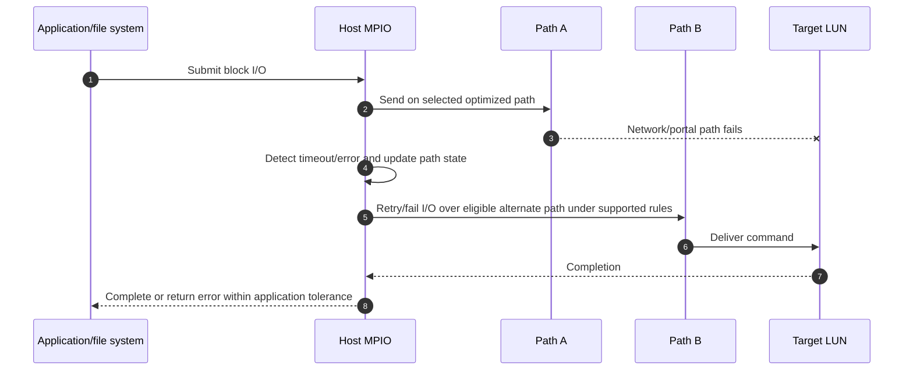

### Failure detection tradeoff

Timeouts that are too long delay failover; too short can cause false path failures during transient congestion or target pause. Never copy timeout values from another environment without exact host/application/storage guidance.

---

## 10. VLANs, routing, MTU, and network design

iSCSI uses TCP/IP, so every Ethernet/IP dependency from Parts 11-13 applies.

### Network path checklist

- Dedicated or shared VLAN design and security policy; a dedicated VLAN is not authentication/encryption.
- Initiator and target IP/prefix/gateway/route, source selection, and return path.
- Switch access/trunk/LACP/STP state and failure domains.
- End-to-end MTU, including virtual switches, bonds, routes, firewalls, tunnels, and failover paths.
- TCP port 3260 orientation, firewall state/timeouts, and discovery versus normal sessions.
- DNS/iSNS dependence where names/discovery use it.
- QoS, congestion, drops, pause/PFC, oversubscription, and packet loss.
- Multiple subnets/VLANs to encourage independent MPIO paths according to supported host/target design.

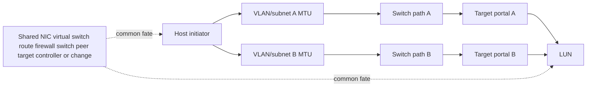

### MTU black-hole symptom

Discovery/login can use small messages and succeed while large data PDUs stall if a path has a smaller effective MTU and Path MTU Discovery feedback is blocked. Test every active/standby MPIO path with representative I/O and synchronized captures; do not infer from one ping.

---

## 11. Queues, timeouts, performance, and congestion

### Queue stack

```mermaid
flowchart LR
    APP[Application concurrency] --> FS[File system/database queue]
    FS --> BLK[Host block/SCSI queue]
    BLK --> MPIO[MPIO path queues]
    MPIO --> ISCSI[iSCSI tasks and TCP send/receive]
    ISCSI --> NET[Switch queues bandwidth loss and RTT]
    NET --> PORTAL[Target port/session queue]
    PORTAL --> CTRL[Controller CPU cache and internal queue]
    CTRL --> MEDIA[Backing storage]
```

### Performance fields

| Layer | Evidence |
|---|---|
| Application | Operation latency, concurrency, timeout, transaction/log state |
| Host file system/database | Queue, cache, flush, lock, filesystem/device latency |
| Block/SCSI | Outstanding commands, queue depth, command type/size, retries, sense/status |
| MPIO | Path selection, per-path I/O/latency/error, state transitions |
| iSCSI/TCP | Sessions/connections, PDU size, retransmission, RTT, window, reset, digest errors |
| Network | Per-link/member utilization, queue drops, pause, MTU, errors, asymmetry |
| Target | Per-portal/session/LUN operations, queue, latency, CPU, cache, controller/path state |
| Backing storage | Media/cache/protection contention, capacity/headroom, degraded state |

### Throughput orientation

For 256 KiB I/O at 4,000 IOPS:

$$
throughput=4000\times256\ KiB/s=1{,}024{,}000\ KiB/s=1000\ MiB/s
$$

That is application/block payload orientation before iSCSI/TCP/IP/Ethernet overhead and retries. A 10 Gbit/s link has a raw decimal byte rate of 1.25 GB/s, so this workload approaches the link's practical envelope before other traffic and overhead.

### Timeout chain

Application, file system, block layer, SCSI, iSCSI, TCP, MPIO, network device, and target each have timers/retry policies. Changing one can cause upper layers to give up earlier, lower layers to retry invisibly, or failover to exceed service objectives. Record actual values and supported relationships before change.

---

## 12. SCSI persistent reservations orientation

**Persistent Reservations (PRs)** allow cooperating hosts/applications to register keys and control access to a shared SCSI logical unit under defined reservation types and actions. Clusters can use them to prevent uncoordinated writes and fence nodes.

### Plain-English deep-dive: shared meeting room with registered keys and a reservation rule

Several cluster nodes can register keys for the same room. A reservation type defines who may enter/write. If one node is unhealthy, a supported cluster operation can remove or preempt its access. **Why it matters:** PR conflict may be a safety mechanism, not a storage failure; clearing reservations manually can permit split-brain writes and corruption.

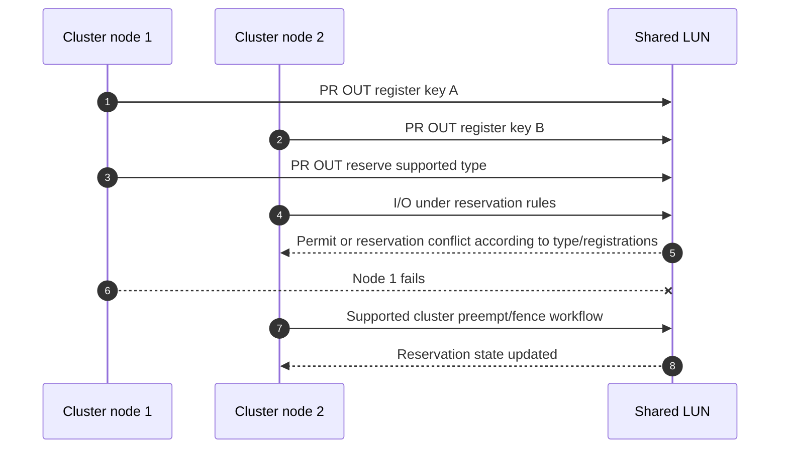

Never clear a reservation because `the LUN is busy` without cluster/application ownership, membership/quorum evidence, and a supported runbook.

---

## 13. Boot from SAN

**Boot from SAN** places an operating-system boot device on remote block storage. The system firmware/adapter must establish network and iSCSI access before the operating system's normal initiator and MPIO stack is fully available.

### Boot sequence

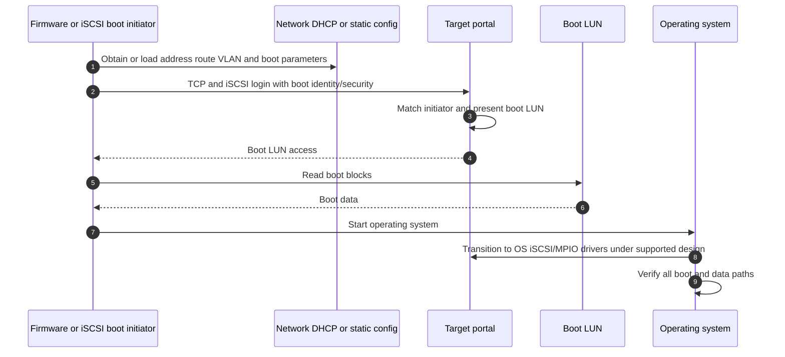

### Boot-path dependencies

- Firmware/adapter version, NIC/HBA option ROM/UEFI support, and exact IMT combination.
- Pre-OS VLAN, IP, gateway/route, DHCP/root-path or static boot parameters as implemented.
- Initiator IQN, CHAP secret storage, target IQN/portal, boot LUN map.
- Independent boot paths and how firmware selects/fails over before OS MPIO.
- Driver takeover/transition, device identity, boot order, SAN policy, and maintenance behavior.
- Recovery if DNS/DHCP/network/target/mapping is unavailable.

A host that boots successfully once has not proved firmware-path failover, target-controller transition, or post-upgrade bootability.

---

## 14. Security and supportability

### Security controls

- Limit target portals to approved storage networks and initiators; route/firewall policy must be explicit.
- Use unique, managed IQNs and target mappings/igroups.
- Use CHAP according to current policy/support, with protected secrets and rotation plans; remember it is not encryption.
- Consider IPsec only where the exact host/target/network design supports it and performance/MTU/failover are validated.
- Separate management credentials and networks from data-plane access where architecture supports it.
- Protect packet captures because unencrypted iSCSI can expose data and CHAP exchanges.
- Use least-privilege LUN mapping; discovery visibility need not equal data access.

### Supportability inventory

| Domain | Record |
|---|---|
| Host | OS/build/kernel, initiator, MPIO/DSM/device handler, host utilities, NIC, driver, firmware, boot firmware |
| Network | Switches/software, VLANs/subnets/routes/firewalls, LACP, MTU, QoS/PFC, optics, redundancy |
| iSCSI | Initiator/target IQNs, portals, discovery, CHAP, sessions/connections, negotiated keys/digests |
| SCSI/MPIO | LUN ID/serial, mappings/igroups, ALUA states, path policy, timeouts, queues, reservations |
| Storage | Platform/release, target interfaces/nodes/controllers, backing volume/pool/protection, LUN state |
| Application | File system/database/cluster/boot owner, supported storage model, consistency/recovery |
| Evidence | Exact current official docs, IMT result/notes/date, access gaps, unlisted items |

Standards compliance and successful login do not establish supported end-to-end operation.

---

## 15. Troubleshooting fault trees

### Discovery/login/LUN tree

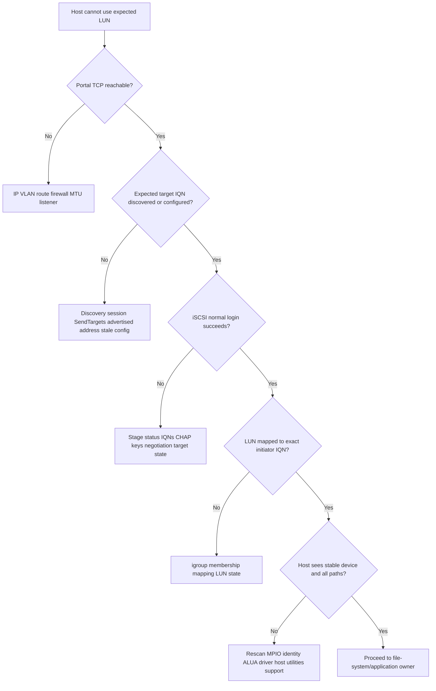

### Path/performance tree

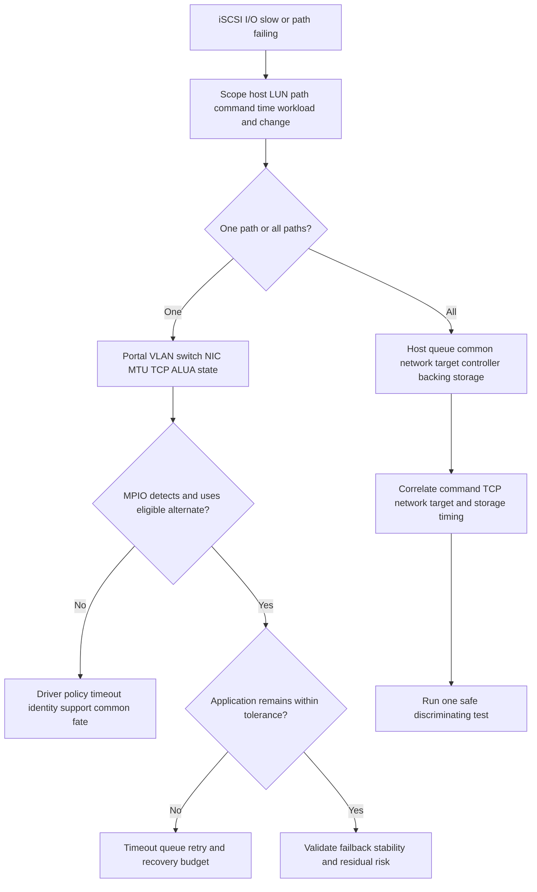

### Symptom table

| Symptom | High-value evidence | Unsafe shortcut |
|---|---|---|
| Portal timeout | Route/firewall/listener/both-end capture | Opening all storage subnets |
| CHAP failure | Login stage/status, CHAP name/secret version/policy | Logging or emailing secret |
| Target visible, no LUN | Exact initiator IQN, mapping/igroup, LUN state | Rescanning indefinitely |
| Duplicate devices | Stable ID, paths, MPIO/DSM/driver/support | Formatting one copy |
| Path flaps | Both-end link/TCP/session/ALUA/MPIO timeline | Reducing timeout blindly |
| Reservation conflict | Cluster owner/keys/reservation type/membership | Clearing reservation manually |
| High latency | Command/queue/path/TCP/target/backing timing | Increasing queue depth globally |
| Boot failure | Firmware network/login/map/LUN and transition stage | Reinstalling OS before proving device path |

---

## 16. Observability and escalation pack

### Evidence correlation

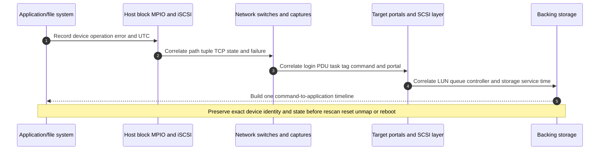

### Minimum escalation pack

- Business application, host/cluster/boot role, LUN/device/file-system scope, impact, objective, and UTC timeline.
- Host OS/build/kernel, initiator IQN, iSCSI implementation, MPIO/DSM/device handler, host utilities, NIC/driver/firmware, boot firmware, recent changes.
- Application/file-system/database/cluster owner, mount state, device IDs, partitions/volumes, reservations, consistency, and timeouts.
- Network topology per path: initiator IP/interface, VLAN/subnet/route/firewall, switch/LAG, MTU, target portal, failure domains, counters, packet capture, RTT/loss/retransmission.
- Discovery method/result, target IQN/portal list, stale entries, session type, actual target addresses.
- Login request/response stage/status, InitiatorName/TargetName, ISID/TSIH/CID orientation, CHAP method/name without secret disclosure, negotiated keys/digests.
- Session/connection state, iSCSI PDU opcode/task/sequence, SCSI CDB/LBA/length, response/status/sense, resets/retries/timeouts.
- LUN path/name/serial/size/state, mapping/igroup and exact initiator membership, host-visible LUN number, ALUA target-port groups/states.
- MPIO paths/policy/per-path I/O/latency/errors/state transitions/failover/failback and common fate.
- Target platform/release, portals/nodes/controllers, per-session/portal/LUN queue/latency/events, backing volume/pool/media/protection state.
- Exact current host/network/storage/application combination and IMT result/notes/date; mark unknown/unlisted/access-gated items.
- Actions tried, outcome/rollback, destructive-action safeguards, competing hypotheses, next test, owner, exact ask, and deadline.

---

## 17. TAM discovery, recommendation, and JD Mapping

### Discovery questions

#### Business and ownership

1. Which application, host/cluster, LUN, criticality, RPO/RTO, performance objective, and boot dependency use iSCSI?
2. Who owns application, file system/database, host, MPIO, network, target, LUN, protection, and risk decisions?
3. Is the symptom discovery, login, map, device, path, reservation, performance, boot, or consistency?

#### Architecture and protocol

4. Draw initiator NICs/IQNs, VLANs/routes/switches/firewalls, portals/target IQN, sessions/connections, maps/igroups, LUN, controllers, and backing storage.
5. Draw data, control, and management planes and every shared failure domain.
6. Record discovery, CHAP, login keys, digests, session/connection, command/status, MPIO/ALUA, queues/timeouts, and reservations.

#### Security, performance, and resilience

7. Are IQNs unique/governed, mappings least privilege, CHAP secrets protected, and encryption requirements met through supported design?
8. What I/O size/mix/concurrency/queue/latency/throughput exists at normal, peak, and degraded-path states?
9. Which member/path/portal/controller/boot/failover failures were tested, and what did the application observe?

#### Supportability and action

10. Which OS/initiator/MPIO/NIC/driver/firmware/switch/protocol/storage/application versions form the solution?
11. What current official/IMT result and notes apply, and what is unlisted/inaccessible?
12. Can one block command be correlated from application/host through TCP/iSCSI to target/backing storage?
13. What safe test distinguishes network, login, mapping, MPIO, target, and host-owner hypotheses?
14. What change/rollback/stop criteria and data-safety checks apply?
15. What owner/date/validation/residual risk accompanies the recommendation?

### Recommendation model

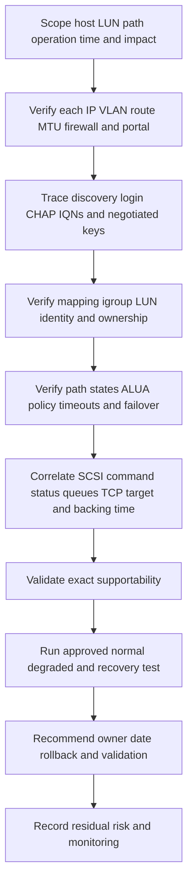

### Explicit JD Mapping

| JD responsibility | Part 17 contribution | Your strength and honest gap |
|---|---|---|
| Understand customer environment | Maps host/MPIO/network/target/LUN/backing/application ownership | **Strength:** Azure/Windows/network/VM dependency mapping. **Gap:** production iSCSI/ONTAP SAN ownership. |
| Storage depth | Explains SCSI over TCP, discovery/login, CHAP, LUNs, ALUA, MPIO, reservations, boot | **Conceptual/lab:** no production LUN/igroup/MPIO administration claim. |
| Risk/stability | Finds identity/map, path common fate, timeout, reservation, boot, and file-system ownership risks | **Strength:** critical-situation method transfers. |
| Supportability | Builds exact host/NIC/network/target/storage/app matrix and IMT evidence | **Gap:** no customer IMT/gated result claimed. |
| Recommendation quality | Requires data-safe, owner-led, tested remediation with residual risk | **Strength:** escalation and advisory follow-through. |
| Service review | Reports path tests, support gaps, queue trends, actions, and resilience | **Strength:** analytics/business review. |
| Escalation | Supplies command/PDU/TCP/path/target correlation and exact ask | **Strength:** Product/Engineering evidence discipline. |

### Honest production-gap statement

> "I can explain iSCSI as SCSI commands over TCP, map initiators, portals, sessions, CHAP, LUN presentation, MPIO/ALUA, queues, reservations, and boot dependencies. My production strength is Windows/Azure networking, virtual machines, storage fundamentals, high-severity escalation, and customer communication, not production iSCSI or ONTAP SAN administration. I would verify the exact host/adapter/network/storage/application combination and IMT notes and work with host, network, application, and storage owners before any mapping, timeout, reservation, or boot change."

---

## 18. Fully synthetic case: Alpine Manufacturing path failure

> **Synthetic case:** Alpine Manufacturing, all hosts, IQNs, portals, LUNs, packets, failures, and outcomes are fictional. No NetApp product behavior, customer incident, or support result is asserted.

### Environment

- A Windows database host uses two NICs and two storage VLANs.
- Initiator IQN `iqn.2026-08.example:db01` logs into target `iqn.2026-08.storage:db`.
- Two portals expose one mapped LUN through separate switches.
- Windows MPIO is intended with an ALUA-aware supported device-specific module.
- One path MTU is 9000 end to end; the second has a hidden 1500-MTU firewall interface.
- A boot LUN uses the same target but separate firmware configuration.
- During switch maintenance, database I/O pauses and the host logs path timeouts.

```mermaid
flowchart LR
    DB[Database and host file system] --> M[Windows MPIO]
    M --> N1[NIC 1 VLAN A MTU 9000]
    M --> N2[NIC 2 VLAN B host MTU 9000]
    N1 --> S1[Switch A]
    N2 --> S2[Switch B]
    S1 --> P1[Target portal A]
    S2 --> FW[Hidden firewall interface MTU 1500]
    FW --> P2[Target portal B]
    P1 --> LUN[Mapped database LUN]
    P2 --> LUN
    BOOT[Firmware boot initiator] --> P1
```

### Timeline and evidence

| UTC | Evidence | Bounded interpretation |
|---|---|---|
| 22:00:00 | Switch A maintenance removes path A | Expected injected failure. |
| 22:00:00.100 | MPIO marks path A transitioning/failed after host detection | Host recognizes active-path loss. |
| 22:00:00.150 | Path B TCP/iSCSI session remains logged in | Login state alone does not prove data-size path. |
| 22:00:00.170 | Small SCSI commands complete on path B | Mapping/ALUA/path are partly functional. |
| 22:00:00.200 | Large Data-Out packets exceed hidden effective MTU and disappear; required PMTU feedback blocked | Supports size-dependent path failure. |
| 22:00:01+ | TCP retransmission/RTO and SCSI timeout create database pause | Explains visible delay chain. |
| 22:00:12 | Path A restored; I/O resumes | Restoration does not validate path B resilience. |
| 22:05 | Boot firmware inventory shows only portal A configured | Separate boot common-fate risk. |

### Competing hypotheses

| Hypothesis | Evidence for | Evidence against/missing | Test |
|---|---|---|---|
| LUN mapping missing on portal B | Failover I/O fails | Same LUN visible; small commands complete | Confirm map/session/device ID and target command evidence |
| ALUA path B unavailable | Failover problem | Host reports path eligible and target serves small commands | Exact target-port-group state and host policy |
| MTU/PMTUD black hole | Large fails, small works, smaller hop, missing feedback | Must account for offload/capture location | Sized path test and simultaneous captures/counters |
| Target controller overloaded | Database pauses | Target service time normal for arrived commands; large packets do not arrive | Target queue/CPU versus packet timeline |
| MPIO timeout wrong | Timeouts observed | Timeout is downstream symptom of broken alternate path | Correct path then measure detection/recovery before tuning |

### Fault tree

```mermaid
flowchart TD
    TOP[I/O pauses when path A removed] --> ALT{Path B logged in and mapped?}
    ALT -->|No| LOGIN[Discovery login CHAP mapping ALUA MPIO]
    ALT -->|Yes| SMALL{Small commands complete?}
    SMALL -->|No| STATE[Path policy target state queue and transport]
    SMALL -->|Yes| LARGE{Large data fails?}
    LARGE -->|No| APP[Application queue timeout or target workload]
    LARGE -->|Yes| MTU[Trace path MTU tunnel firewall and ICMP feedback]
    MTU --> FIX[Correct supported end-to-end design under change control]
    FIX --> TEST[Test both paths representative I/O and failback]
    TEST --> BOOT[Separately test firmware boot-path redundancy]
```

### Recommendations

1. Network/security owner should correct path B's supported MTU/PMTUD design and validate every virtual/physical hop; do not lower or raise isolated interfaces without end-to-end review.
2. Host/storage owners should preserve MPIO, ALUA, session, device-ID, SCSI command, and target evidence and confirm exact IMT-supported configuration before timeout changes.
3. Application owner should define acceptable I/O pause and database transaction/recovery checks during path loss.
4. Boot owner should add/test a supported independent firmware boot path or record the single-path risk; OS MPIO does not protect pre-OS boot automatically.
5. Repeat path A and B failures with representative large writes/reads, packet/counter correlation, target status, failback stability, and data-consistency validation.

### Customer-facing summary

> "The alternate session and LUN mapping are present, and small commands complete, but larger iSCSI data is lost at a smaller hidden interface while PMTU feedback is blocked. TCP and SCSI timeouts then create the database pause. This is an alternate-path MTU design issue in the synthetic evidence, not proof that MPIO or the LUN is absent. We recommend correcting the full path, validating both directions and both failures with representative I/O, and testing boot-path independence separately."

---

## 19. Paper lab and whiteboard drills

No production access is required. Use synthetic packet fields, host outputs, and public standards.

### Paper lab scenario

A fictional Linux cluster uses iSCSI target `iqn.2026-08.example:cluster` through four portals, two VLANs, and two switches. Initiators use unique IQNs and mutual CHAP. One LUN is mapped to a cluster igroup. MPIO shows eight paths, half non-optimized. Queue depth is 128 per path. One switch drops bursts. A cluster node reports reservation conflict after a membership failure. A separate host boots from one portal. Exact drivers, firmware, target release, and IMT status are unknown.

### Tasks

1. Draw application/file-system/SCSI/iSCSI/TCP/network/target/LUN stack.
2. Draw data, control, and management planes.
3. Map initiator IQN, target IQN, portals, CHAP names, LUN ID, stable device ID, and cluster owner.
4. Draw SendTargets discovery and normal login phases.
5. Trace one-way and mutual CHAP conceptually without exposing secrets.
6. Record login stage/status and negotiated parameters/digests.
7. Compare one session/multiple connections with MPIO's multiple paths/sessions.
8. Build map/igroup/LUN presentation and safe device-identification checks.
9. Draw MPIO/ALUA path states and a supported path-selection policy.
10. Test member, switch, VLAN, portal, controller, and common-path failures on paper.
11. Reconcile MTU and route/firewall state on every path.
12. Calculate payload throughput and map every queue/timeout layer.
13. Reconstruct persistent-reservation keys/state and define the cluster-owned recovery process.
14. Draw firmware boot through OS driver/MPIO transition.
15. Build exact supportability/IMT inventory and mark unknowns.
16. Write separate congestion, reservation, and boot-risk recommendations.

### Calculation check

At 8 KiB per I/O and 80,000 IOPS:

$$
throughput=80{,}000\times8\ KiB/s=640{,}000\ KiB/s=625\ MiB/s
$$

If all traffic hashes or selects one 10 Gbit/s path, raw link capacity is not yet the first arithmetic bottleneck, but protocol overhead, other traffic, packet rate, host/target CPU, queue behavior, and burst drops remain.

### Whiteboard drills

1. **Stack:** File/database -> SCSI CDB -> iSCSI PDU -> TCP/IP -> target LUN.
2. **Names:** Initiator IQN, target IQN, portal, CHAP name, LUN ID.
3. **Discovery versus access:** Target list is not LUN mapping.
4. **Login:** TCP -> security -> CHAP -> operational negotiation -> full feature.
5. **CHAP:** Authentication without encryption.
6. **Session versus path:** Connections inside session versus MPIO sessions/paths.
7. **Mapping:** IQN -> igroup/map -> LUN -> stable host device.
8. **ALUA:** Path eligibility/cost from target architecture.
9. **Reservation:** Cluster safety state; never clear without owner/quorum proof.
10. **Boot:** Firmware path exists before OS MPIO.

### Lab completion criteria

- [ ] SCSI, iSCSI, TCP, and Ethernet identities/status are separate.
- [ ] Discovery, login, mapping, device ownership, and file-system access are separate gates.
- [ ] CHAP limitations and secret handling are explicit.
- [ ] MC/S and MPIO are not confused.
- [ ] ALUA path states/policy use exact supported evidence.
- [ ] MTU/VLAN/route/firewall and failure domains cover every path.
- [ ] Queue/timeout changes are not recommended without complete chain/support.
- [ ] Reservations remain cluster/application-owned safety controls.
- [ ] Boot firmware and OS MPIO paths are tested separately.
- [ ] Production iSCSI/ONTAP experience is not implied.

---

## 20. Self-test

1. Define iSCSI, SCSI, initiator, target, portal, IQN, session, connection, LUN, igroup, and PDU.
2. Draw the complete iSCSI stack and three planes.
3. Orient on SCSI CDB/LBA/length/status and iSCSI header/task/sequence fields.
4. Explain why TCP ACK, iSCSI arrival, SCSI completion, and app commit differ.
5. Distinguish initiator IQN, target IQN, portal, alias, CHAP name, and LUN ID.
6. Compare static, SendTargets, iSNS, and boot discovery orientation.
7. Draw discovery and normal login flows.
8. Explain login stages, status, identity, and negotiation fields.
9. Draw CHAP challenge-response and mutual CHAP orientation.
10. Explain CHAP authentication limits and secret controls.
11. Distinguish session, connection, MC/S, and MPIO.
12. Trace IQN/igroup/map/LUN/device/file-system ownership.
13. Explain data-safety rules for format, multi-host, unmap, resize, and restore.
14. Define MPIO, DSM/device handler, ALUA, target-port group, and path policy.
15. Explain optimized/non-optimized/standby/unavailable orientation.
16. Draw path failure and application-timeout interaction.
17. Map VLAN, route, firewall, MTU, QoS, and common-fate risks across every path.
18. Decompose queues and timeouts from application to media.
19. Calculate IOPS-to-throughput examples with units.
20. Explain persistent reservations and cluster ownership.
21. Draw boot-from-SAN firmware through OS/MPIO transition.
22. Apply discovery/login/LUN and path/performance fault trees.
23. Correlate host, SCSI, iSCSI, TCP, network, target, and backing evidence.
24. Build exact supportability/IMT inventory.
25. Ask the complete TAM discovery set and write a bounded recommendation.
26. Recreate Alpine's alternate-path MTU diagnosis.
27. Build the minimum escalation pack.
28. Complete the paper lab and whiteboard drills.
29. Answer Q1-Q8 aloud.
30. State your strengths and production iSCSI gap honestly.

---

## 21. Official Source Anchors

**Date checked: 2026-08-24.** These official standards and public sources anchor iSCSI/SCSI concepts. RFCs can be updated; SCSI standards and revisions can have access constraints; host/target implementations select features; boot, MPIO, ALUA, CHAP, and timeouts are exact-version sensitive; and NetApp IMT/support content can require authorization. Verify current standards, OS/initiator/adapter/driver/firmware, network, storage release, application/cluster guidance, and IMT notes. Do not invent support matrices, queue/timeout values, path policies, or ONTAP behavior.

| Topic | Official public source | Access, version, and use note |
|---|---|---|
| iSCSI protocol | [RFC 7143 - Internet Small Computer System Interface](https://www.rfc-editor.org/rfc/rfc7143) | Consolidated iSCSI specification. Check RFC status/errata and implementation feature support. |
| iSCSI naming and discovery | [RFC 3721 - iSCSI Naming and Discovery](https://www.rfc-editor.org/rfc/rfc3721) | Naming/discovery guidance; check current status and product implementation. |
| iSCSI boot | [RFC 4173 - Bootstrapping Clients using iSCSI](https://www.rfc-editor.org/rfc/rfc4173) | Standards orientation for bootstrapping; firmware/product support requires current exact validation. |
| CHAP | [RFC 1994 - PPP Challenge Handshake Authentication Protocol](https://www.rfc-editor.org/rfc/rfc1994) | CHAP base protocol. iSCSI use is specified by iSCSI standards; current algorithm/security policy must be checked. |
| iSNS | [RFC 4171 - Internet Storage Name Service](https://www.rfc-editor.org/rfc/rfc4171) | Discovery/service standard; current implementation support is not assumed. |
| SCSI standards | [INCITS T10 Technical Committee](https://www.t10.org/) | Official SCSI standards committee area. Full standards/revisions can have access constraints. |
| Windows iSCSI | [Microsoft iSCSI Target Server overview](https://learn.microsoft.com/en-us/windows-server/storage/iscsi/iscsi-target-server) | Official Windows Server source; initiator/target behavior and supported scenarios depend on release. |
| Windows MPIO | [Multipath I/O overview](https://learn.microsoft.com/en-us/windows-server/storage/mpio/mpio-overview) | Official Windows documentation; DSM, policy, device support, and tuning are vendor/version-specific. |
| Linux device mapper multipath | [Red Hat device mapper multipath documentation](https://docs.redhat.com/en/documentation/red_hat_enterprise_linux/) | Official vendor documentation area; select exact RHEL release and storage guidance. |
| NetApp SAN management | [ONTAP SAN storage management documentation](https://docs.netapp.com/us-en/ontap/san-management/) | Official public area. Select exact release for LUNs, igroups, mappings, hosts, and operations. |
| NetApp iSCSI configuration | [ONTAP iSCSI configuration documentation](https://docs.netapp.com/us-en/ontap/san-config/iscsi-config-concept.html) | Official public area; exact page paths/content can evolve. Validate current release prerequisites and procedures. |
| NetApp host utilities | [NetApp Host Utilities documentation](https://docs.netapp.com/us-en/ontap-sanhost/) | Official public host-integration area. Select exact OS/release/protocol and follow IMT. |
| NetApp interoperability | [NetApp Interoperability Matrix Tool](https://imt.netapp.com/) | Official, potentially gated, and time-sensitive. Save exact host/OS/adapter/driver/firmware/protocol/MPIO/storage result, notes, and date. |

### Source-use discipline

- Check RFC status/errata and exact iSCSI feature implementation.
- Protect IQNs and CHAP secrets; traces can expose sensitive data even when the secret is not directly sent.
- Record exact stable LUN/device identity before rescan, map, unmap, format, restore, or resize.
- Use host/storage vendor MPIO/ALUA/path-policy/timeout guidance for the exact version and IMT solution.
- Treat reservations and boot configuration as application/cluster/firmware safety domains.
- Save dated IMT evidence and notes for every host, adapter, driver, firmware, switch/network, protocol, multipath, and storage component.

---

## Likely Interview Questions

### Q1. Explain iSCSI from an application read to the storage target.

> **Model answer:** "The application or database asks the host file system or raw manager for data. The host maps that request to logical blocks and builds a SCSI command. MPIO selects an eligible path; the iSCSI initiator wraps the SCSI task in iSCSI PDUs over a TCP connection to a target portal. The target maps the initiator/session to a LUN, executes the command against backing storage, and returns data and SCSI status. TCP delivery, iSCSI task status, SCSI completion, and application transaction completion are separate boundaries."

**Follow-up depth:** Draw CDB, iSCSI PDU, TCP/IP, target/LUN, and name the command/task/status fields used in a trace.

### Q2. What are IQNs, portals, sessions, connections, and LUNs?

> **Model answer:** "An IQN is the persistent structured name of an initiator or target. A portal is a target IP address and TCP port, commonly 3260. A session is the logical relationship between one initiator IQN and target IQN; it contains one or more TCP connections under supported behavior. A LUN is a SCSI logical unit mapped to authorized initiators. Portal reachability or target discovery does not prove login, mapping, host MPIO, or file-system access."

**Follow-up depth:** Explain aliases, CHAP names, stable device identifiers, duplicate IQNs, and why one target can have several portals.

### Q3. Walk through iSCSI discovery and login.

> **Model answer:** "Discovery can be static, SendTargets, iSNS, or boot-firmware based under supported designs. In SendTargets the initiator opens a discovery session, requests target information, and receives target/portal candidates. A normal session then establishes TCP, negotiates security such as CHAP, negotiates operational parameters, and transitions to full-feature phase. I inspect exact login stage, status class/detail, InitiatorName/TargetName, session identifiers, CHAP method, and negotiated keys rather than treating a TCP handshake as login success."

**Follow-up depth:** Explain discovery versus normal sessions, redirection/advertised target addresses, stale discovery, and firewall/MTU dependencies.

### Q4. What does CHAP protect, and what are its limits?

> **Model answer:** "CHAP proves knowledge of a shared secret with a challenge-response exchange; one-way CHAP authenticates the initiator to the target and mutual CHAP can authenticate both ways if supported. The secret is not sent directly, but CHAP does not encrypt SCSI data. Security depends on algorithm, strong unique secrets, protected storage/rotation, and target policy. Initiator IQN mapping remains a separate authorization control, and encryption such as IPsec requires exact support and performance/MTU validation."

**Follow-up depth:** Draw the challenge-response, explain why shared secrets increase blast radius, and state how to collect logs without exposing secrets.

### Q5. How do LUN mapping, igroups, and host file-system ownership interact?

> **Model answer:** "The target maps a LUN to an exact initiator identity or a group such as a NetApp igroup. The host discovers one or more paths to the same stable LUN identity, and MPIO merges them into one block device. The host, hypervisor, database, or cluster owns the file system and data structures on that device. I verify IQN, group membership, mapping, serial/device ID, size, paths, and upper-layer owner before any format, unmap, resize, restore, or multi-host access."

**Follow-up depth:** Diagnose target visible/no LUN, duplicate device views, and unsafe multi-host presentation.

### Q6. Explain MPIO and ALUA during a path failure.

> **Model answer:** "MPIO correlates multiple paths to one device and uses host/vendor policy to select eligible paths. ALUA lets the target report target-port-group access characteristics such as optimized, non-optimized, standby, or unavailable concepts. When a path fails, the host detects an error/timeout, updates path state, and retries or redirects I/O under supported rules. Recovery must complete before application/file-system timeouts. I verify every path's independence, ALUA state, DSM/device handler, host utilities, driver/firmware, policy, and IMT support."

**Follow-up depth:** Compare failover-only and round-robin orientation, explain path flapping/failback, and design a member/switch/portal test.

### Q7. How would you troubleshoot iSCSI latency or intermittent path loss?

> **Model answer:** "I scope host, LUN, command, path, workload, time, and change. I correlate application/file-system wait, block queue, MPIO per-path state and latency, SCSI command/status/retries, iSCSI session/PDU, TCP RTT/loss/windows, VLAN/route/MTU/switch queues, target portal/LUN/controller queues, and backing storage. I compare one path versus all paths and use one safe failure or size test. I do not change queue depth or timeouts until the complete supported chain and active bottleneck are known."

**Follow-up depth:** Diagnose an MTU black hole that permits login/small commands, microburst drops, and a target-backed queue bottleneck.

### Q8. How does your background transfer to iSCSI work, and what remains a gap?

> **Model answer:** "My production prior experience includes Windows and Azure networking, virtual machines, storage fundamentals, high-severity troubleshooting, evidence correlation, and customer communication. Those methods transfer to iSCSI path and dependency analysis. I have not administered production LUN mappings, igroups, MPIO/ALUA, boot-from-SAN, or ONTAP SAN. I would verify exact host/adapter/network/storage/application support and IMT notes, use authorized read-only evidence and labs, and involve host, network, application, cluster, and storage owners for changes."

**Follow-up depth:** Give one factual Windows/Azure connectivity case and label the iSCSI/NetApp implementation as conceptual or lab evidence.

---

## 30-Second Memory Hooks

- **iSCSI:** SCSI commands inside iSCSI PDUs over TCP/IP.
- **Initiator:** Host starts commands; **target:** storage receives them.
- **IQN:** Persistent protocol name; **portal:** IP/port doorway.
- **Session:** Initiator-target relationship; **connection:** one TCP line.
- **LUN:** Numbered block device, not a share.
- **Discovery:** Find targets; not permission to use a LUN.
- **Login:** TCP -> security -> operational negotiation -> full feature.
- **CHAP:** Prove shared-secret knowledge; no payload encryption.
- **Mapping/igroup:** Exact initiator identity gets exact LUN access.
- **Stable device ID:** Merge paths before touching the file system.
- **MPIO:** Many paths, one logical device.
- **ALUA:** Target tells host path access characteristics.
- **MC/S:** Multiple connections in one session; not the same as MPIO.
- **Path up:** Login may work while large data fails on MTU.
- **Queue depth:** Outstanding work at a specific layer, not free performance.
- **Timeout:** Recovery budget across many layers; tune only with exact guidance.
- **Persistent reservation:** Cluster safety key and rule, not a nuisance lock.
- **Boot from SAN:** Firmware must reach the LUN before OS MPIO exists.
- **File-system owner:** Host/application, not the target.
- **Your bridge:** Windows/Azure network method transfers; production iSCSI/ONTAP SAN remains unclaimed.

---

## Completion Checklist

- [ ] Define iSCSI/SCSI, initiator, target, portal, IQN, session, connection, LUN, igroup, and PDU.
- [ ] Draw the complete application-to-LUN stack and three planes.
- [ ] Orient on SCSI command/status and iSCSI header/task/sequence fields.
- [ ] Separate TCP delivery, iSCSI task, SCSI completion, and application consistency.
- [ ] Govern and distinguish IQNs, aliases, portals, CHAP names, and device IDs.
- [ ] Draw static/SendTargets/iSNS/boot discovery orientation and normal login.
- [ ] Interpret login stage/status, identities, session fields, keys, and digests.
- [ ] Draw one-way/mutual CHAP and explain authentication/encryption limits.
- [ ] Distinguish session connections/MC/S from MPIO paths/sessions.
- [ ] Trace IQN/igroup/map/LUN/device/file-system ownership and safety.
- [ ] Explain MPIO/ALUA path states, policies, failover, failback, and common fate.
- [ ] Validate VLAN/route/firewall/MTU/QoS and every active/failover path.
- [ ] Decompose queues/timeouts/performance from application to media.
- [ ] Calculate IOPS/size/throughput with units and overhead caveats.
- [ ] Explain persistent reservations and preserve cluster ownership.
- [ ] Draw boot-from-SAN firmware/network/login/map/LUN/OS transition.
- [ ] Apply discovery/login/LUN and path/performance fault trees.
- [ ] Correlate application/host/SCSI/iSCSI/TCP/network/target/backing evidence.
- [ ] Ask the complete TAM discovery set and write a data-safe recommendation.
- [ ] Recreate Alpine's alternate-path MTU mechanism and boot common fate.
- [ ] Build exact current supportability/IMT evidence and complete escalation pack.
- [ ] Complete the paper lab, whiteboard drills, self-test, and Q1-Q8 aloud.
- [ ] State your production strengths and iSCSI/ONTAP SAN gap honestly.
- [ ] Recheck RFC/SCSI revisions, exact versions/features, application guidance, and NetApp IMT notes before customer use.

---

*Next suggested section:* [Part 18 - Fibre Channel, FCoE, and NVMe Storage Fabrics](Part-18-fibre-channel-fcoe-nvme-fabrics.md)