# Part 18 - Fibre Channel, FCoE, and NVMe Storage Fabrics

> **Section goal:** Understand how Fibre Channel endpoints join a fabric, discover one another, establish protocol relationships, exchange credit-controlled frames, and present resilient storage paths. By the end, Arti should be able to explain FC, FCoE, NVMe/FC, and NVMe/TCP; read naming, zoning, optics, congestion, and multipath evidence; and produce a supportable customer risk or troubleshooting recommendation.

Covers index item **18** and maps directly to job-description responsibilities for storage/fabric depth, customer-environment analysis, supportability, stability and risk mitigation, tailored recommendations, operational reviews, and escalation quality.

This Part is vendor-neutral. Exact Fibre Channel (FC) standards revisions, switch/fabric services, zoning, Virtual Storage Area Network (VSAN), N-Port ID Virtualization (NPIV), credits, speeds, optics, Fibre Channel over Ethernet (FCoE), Data Center Bridging (DCB), NVMe over Fabrics (NVMe-oF), multipathing, and NetApp behavior vary by product, release, topology, and supported solution. Validate exact current vendor documentation and the NetApp Interoperability Matrix Tool (IMT).

> **Evidence boundary:** Every organization, World Wide Name (WWN), FC ID, zone, switch, optic, counter, path, incident, and recommendation below is synthetic. Arti's production Windows/Azure networking, virtual machines, storage fundamentals, escalation, analytics, and customer communication are strengths. Production FC switch administration, zoning, FCoE/DCB operation, NVMe-oF deployment, or ONTAP SAN ownership is not claimed.

---

## 1. Fibre Channel architecture and terminology

Fibre Channel is a high-speed network architecture commonly used to carry block-storage protocols between host initiators and storage targets through switched fabrics.

### Plain-English deep-dive: airport identity, gate, and temporary route number

The host adapter and storage port have durable passport-like World Wide Names. When a port joins a fabric, the fabric assigns a temporary route number called an FC ID. The switch port is the gate, zoning is the approved contact list, and protocol login agrees what upper-layer service the endpoints will exchange.

| Term | Plain meaning | Why it matters |
|---|---|---|
| **Fabric** | One or more connected FC switches providing forwarding and services. | Redundancy requires independent fabrics, not merely two switch ports. |
| **Initiator port** | Host-side FC port that starts storage commands. | HBA, driver, firmware, WWPN, path, and queue evidence originate here. |
| **Target port** | Storage-side FC port that receives block-protocol traffic. | Zoning, target-port group, node/controller, and LUN/namespace paths matter. |
| **HBA** | Host Bus Adapter providing FC connectivity. | Hardware, driver, firmware, slot, optic, and queue state are supportability inputs. |
| **WWNN** | World Wide Node Name identifying a node/device-level entity. | Node identity is not the same as one physical/virtual port. |
| **WWPN** | World Wide Port Name identifying an FC port entity. | Zoning and host/storage mapping commonly use exact WWPNs. |
| **FC ID** | Fabric-assigned 24-bit address for a logged-in port. | Useful for forwarding/traces but can change after login/fabric events. |
| **FCP** | SCSI Fibre Channel Protocol mapping SCSI commands over FC. | Common FC block transport; distinct from NVMe/FC. |
| **Name Server** | Fabric service where ports register/query attributes. | Discovery evidence helps explain missing target paths. |

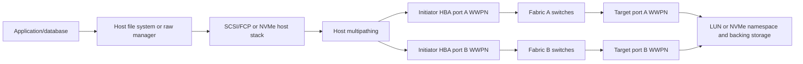

### Planes

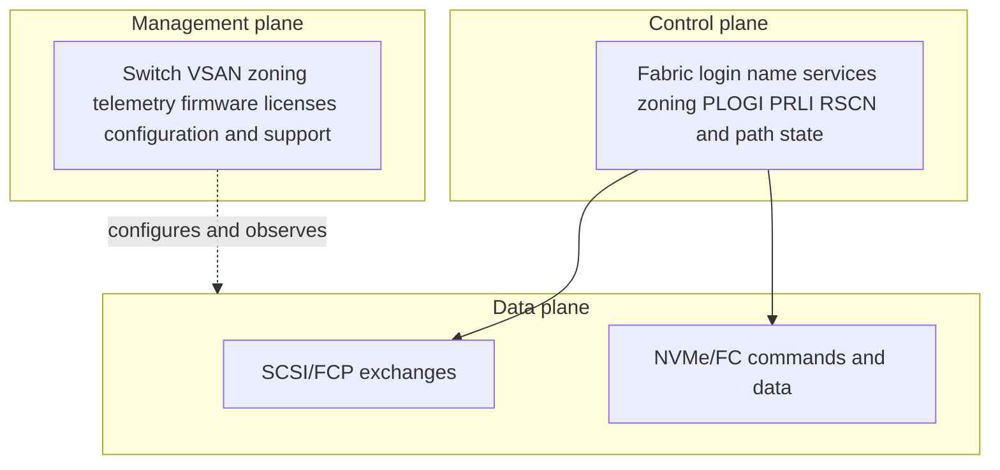

---

## 2. FC layers and FC-4 protocol mappings

Fibre Channel is often described through FC-0 to FC-4 layers. These are architecture layers, not one-to-one physical devices.

| Layer | Main responsibility | Orientation |
|---:|---|---|
| FC-0 | Physical media, connectors, optics, signaling rates | Cable, transceiver, wavelength, link budget, speed |
| FC-1 | Transmission encoding/decoding and link-level signal handling | Encoding, ordered sets, error detection orientation |
| FC-2 | Framing, sequences, exchanges, flow control, addressing | FC frames, FC IDs, classes, buffer credits, login signaling |
| FC-3 | Common services shared across ports/nodes where implemented | Architecture services; not usually the first troubleshooting label |
| FC-4 | Mapping upper-layer protocols onto FC | FCP for SCSI, FC-NVMe for NVMe |

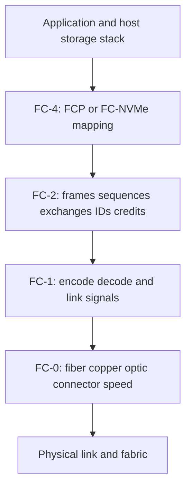

### Frame, sequence, and exchange orientation

- An **FC frame** is the transmitted link unit with header, payload, and Cyclic Redundancy Check (CRC).
- A **sequence** is a set of related frames transmitted in order from one sequence initiator.
- An **exchange** is a higher-level conversation containing one or more sequences between endpoints.
- Source ID and Destination ID are fabric addresses in the FC header.
- OxID/RxID identify exchange context from originator/responder perspectives.
- Routing Control and Type fields help identify frame use/protocol.

Do not call every FC frame a SCSI command. Login, name-service, RSCN, FCP, and NVMe frames have different roles.

---

## 3. Port types: N_Port, F_Port, and E_Port

### Plain-English deep-dive: endpoint doors and switch-to-switch corridors

| Port type | Plain meaning | Analogy | Why it matters |
|---|---|---|---|
| **N_Port** | End-node FC port that connects to a fabric, such as host or storage port. | A company's door into the airport. | Performs fabric login and receives an FC ID. |
| **F_Port** | Switch fabric port attached to an N_Port. | Airport gate serving one company door. | Switch-side state must identify the expected endpoint and speed. |
| **E_Port** | Switch expansion port connecting FC switches through an Inter-Switch Link (ISL). | Corridor between airport terminals. | Carries fabric traffic and can be a shared congestion/failure domain. |

Other types and virtualized roles exist, including NPIV-related virtual N_Ports, FCoE VN_Ports/VF_Ports, and vendor-specific modes. Confirm actual operational type; do not infer from cable placement.

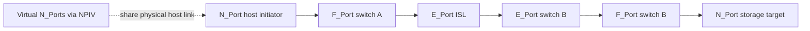

### Port-state evidence

- Operational port type and state.
- Attached WWPN/WWNN and assigned FC ID.
- Negotiated speed and supported speed set.
- VSAN/fabric membership, domain, switch/port identity.
- Login database and name-server registration.
- Counters, optic power, errors, credit/latency indicators, resets, and uptime.

---

## 4. FLOGI, name-server registration, PLOGI, and PRLI

**Fabric Login (FLOGI)** lets an N_Port join a switched fabric, negotiate relevant parameters, and receive an FC ID. Endpoints then use fabric services such as the Name Server and establish endpoint relationships.

- **PLOGI (Port Login)** establishes FC port-to-port service parameters between N_Ports.
- **PRLI (Process Login)** establishes an FC-4 process relationship such as FCP or NVMe/FC roles/capabilities.
- **RSCN (Registered State Change Notification)** notifies registered ports of relevant fabric changes; it is a signal to rediscover/revalidate, not proof of failure by itself.

### Conceptual login and discovery sequence

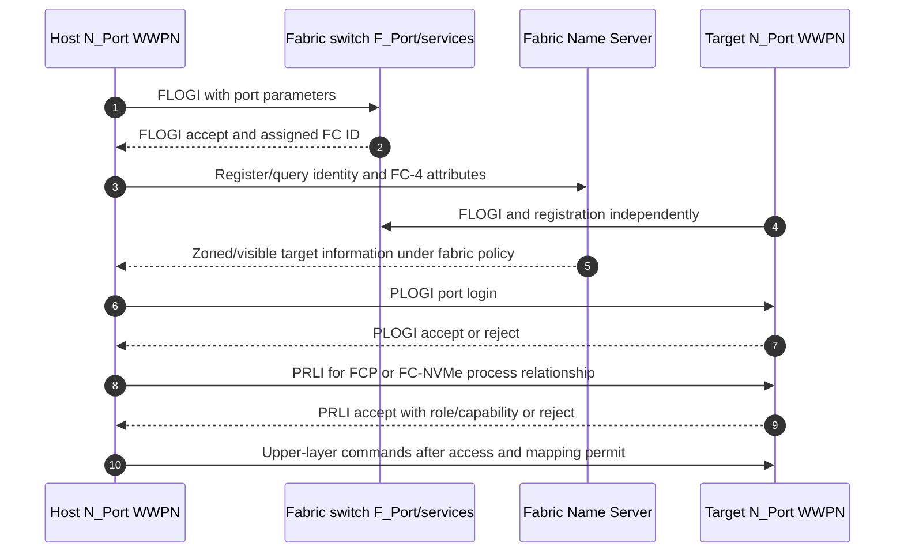

### Login failure stages

| Last successful stage | Candidate domain |
|---|---|
| No physical link | FC-0 optic/cable/speed/port/admin state |
| Link but no FLOGI | Port type, VSAN/fabric, switch state, login parameter/support |
| FLOGI but no Name Server visibility | Zoning, registration, FC-4 type, fabric service, stale state |
| Name visibility but PLOGI reject | Endpoint policy/state, unsupported parameter, wrong port role |
| PLOGI success but PRLI reject | FCP versus FC-NVMe mismatch, target role/capability, support/config |
| PRLI success but no LUN/namespace | Target mapping/igroup/subsystem authorization and host stack |

---

## 5. WWPN/WWNN, FC IDs, and NPIV

World Wide Names are persistent identities under their assignment/management. FC IDs are fabric addresses assigned at login and commonly represented as domain-area-port-like fields; exact addressing/topology interpretation depends on the fabric.

### Identity relationship

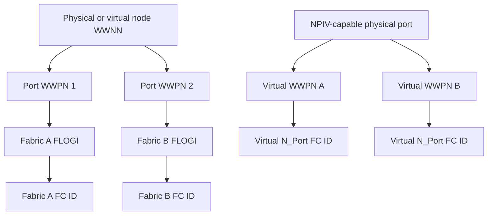

### NPIV

**N-Port ID Virtualization (NPIV)** allows multiple virtual N_Port identities, each with a WWPN and FC ID, to share one physical N_Port link under supported switch/HBA/hypervisor/storage design. It is used in virtualization and partitioning scenarios.

NPIV does not create physical path independence. Several virtual ports share the physical HBA, cable, switch port, and often upstream failure domains. Zoning/mapping must include the correct virtual WWPNs, and login limits/support must be validated.

### Identity hazards

- Typographical WWPN in zone or target mapping.
- Stale zone after HBA replacement changes WWPN.
- NPIV virtual WWPN not logged in after VM/hypervisor movement.
- Duplicate/cloned WWPN configuration.
- Troubleshooting by FC ID after it changed, without mapping back to WWPN.
- Host path to target visible in one fabric only because one WWPN is omitted.

---

## 6. Zoning principles and types

Zoning restricts which FC ports can communicate through a fabric. It reduces discovery/interaction scope; target LUN/namespace mapping remains a separate access control.

### Zoning identities

- WWPN-based member zoning uses port identities.
- Domain/port or switch-port-based membership uses fabric location.
- Alias objects can provide readable labels for WWPNs.
- Vendor features such as peer/smart zoning can optimize or constrain permitted communication under exact implementation.

### Zoning relationship

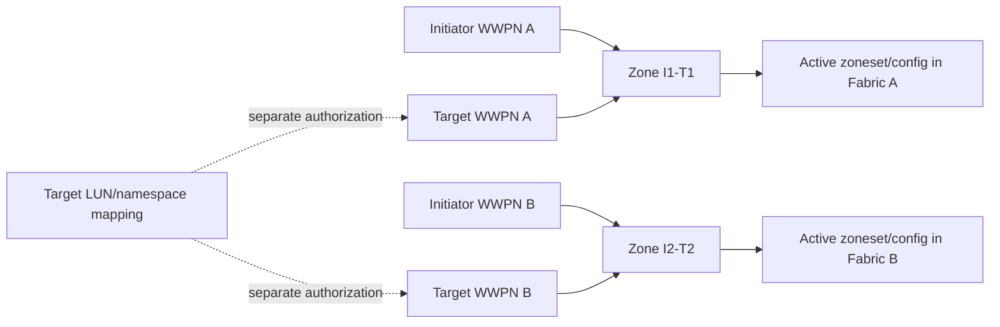

### Plain-English deep-dive: phone directory versus room key

Zoning is the approved phone directory: it permits selected initiator and target ports to contact each other through the fabric. LUN masking or NVMe subsystem mapping is the room key: it controls which storage object the host may access. Both are necessary. Seeing a target does not mean seeing a LUN; seeing a LUN does not mean the host file system is safe to mount.

### Design principles

- Limit initiator-target communication to the required pairs under vendor guidance.
- Single-initiator zoning is a common operational isolation principle, but exact zone membership and smart-zoning guidance must match vendors and scale requirements.
- Keep Fabric A and Fabric B zoning/configuration administratively separate enough to avoid one mistake affecting both, while maintaining consistent intended access.
- Name aliases clearly and retain WWPN/source-of-truth evidence.
- Stage, review, activate, validate, and preserve rollback/config history.
- Remove stale members only after proving devices are retired and no recovery path depends on them.

Terms such as `hard` and `soft` zoning are used inconsistently across vendors and eras. Ask how the exact switch enforces access instead of relying on the label.

---

## 7. VSAN orientation and fabric separation

A **Virtual SAN (VSAN)** is a vendor feature that creates logically separate FC fabrics/services on shared switch hardware. It can isolate address space, fabric services, zoning, and failure/change scope under the implementation.

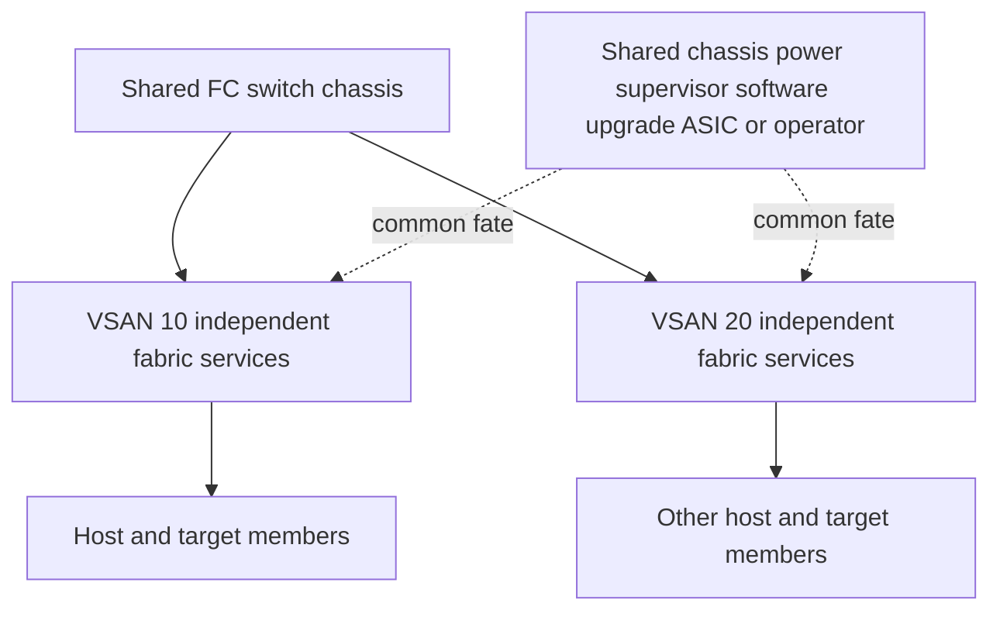

Logical isolation is not physical independence. If Fabric A and Fabric B are VSANs on one chassis/control plane, the design may not tolerate chassis, power, supervisor, software, or change failure. Document exact business requirement and tested failure domains.

---

## 8. FC frames, buffer credits, and congestion

FC uses link-level credit-based flow control. **Buffer-to-buffer credit (BB_Credit)** controls how many frames a transmitter can send across a link without receiving returned credit indications. The exact signaling/counters depend on FC generation and implementation.

### Plain-English deep-dive: reusable trays between adjacent kitchens

Two adjacent kitchens share a fixed number of trays. The sender can send a tray only when it owns a credit; the receiver returns credit after freeing buffer space. If credits are delayed because the receiver or downstream path drains slowly, the sender waits even though the link has no bit errors. Credits apply hop by hop, so congestion can propagate.

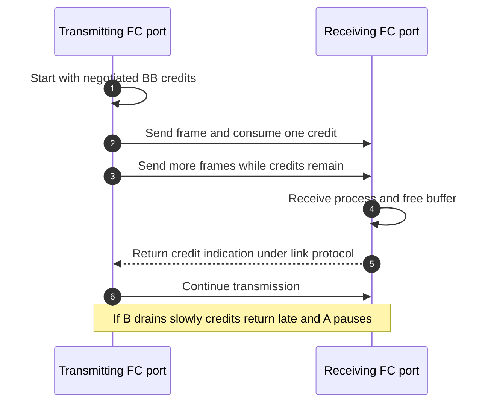

### Congestion concepts

| Concept | Plain meaning | Evidence orientation |
|---|---|---|
| Credit starvation | Sender waits because no transmit credit is available | Zero-credit time, transmit wait, credit counters under vendor definitions |
| Slow-drain device | Endpoint/path consumes frames slowly and propagates backpressure | Per-port credit delay, queueing, frames, host/target behavior, topology |
| Oversubscription | Aggregate offered traffic exceeds a constrained link/port/ISL capacity | Utilization, queue/credit wait, flow mapping, time window |
| Head-of-line effect | One blocked flow delays others sharing resources | Flow/virtual channel/port evidence under platform architecture |
| Congestion spreading | Backpressure or queueing affects upstream/unrelated flows | Timeline across adjacent ports/ISLs and affected exchanges |
| Frame drop | Frame discarded after error/resource/policy condition | CRC, timeout, discard reason, retransmission/recovery evidence |

### Distance-credit orientation

Long-distance links require enough in-flight buffer credits to fill the propagation path. Required credits depend on line rate, frame size, distance/latency, implementation, and service. Use vendor calculators/guidance for exact design; do not use one memorized value.

---

## 9. Speeds, optics, physical errors, and counters

FC speed labels and encoding generations differ. Both ports and optics/cabling must support the intended rate and distance. Auto-negotiation/port initialization behavior is product-specific.

### Physical evidence table

| Evidence | Orientation | Caution |
|---|---|---|
| Link up/down/reset | Physical/link initialization events | Record timestamp, count delta, admin/change events, and both ends. |
| Negotiated speed | Actual link rate | Configured capability does not prove negotiated rate or throughput. |
| Tx/Rx optical power | Signal level reported by transceiver | Compare exact supported optic/vendor thresholds, temperature, lane, calibration, and history. |
| Loss of signal/sync | Physical or encoding synchronization issue | Can trigger link recovery; correlate both ends. |
| Invalid transmission words/encoding errors | Invalid link symbols/words | Often physical/signal/compatibility candidate; definitions vary. |
| CRC errors | Frame integrity failure | Receiver observes error; transmitter/optic/cable/receiver can be causal. |
| Link failures/primitive sequence errors | Link protocol recovery events | Expand exact vendor counter definitions. |
| Discards/timeouts | Congestion, policy, sequence/exchange, buffer, or endpoint behavior | Not all discards are physical corruption. |
| BB-credit zero/wait | Flow-control backpressure | High counts require time/rate/workload context. |

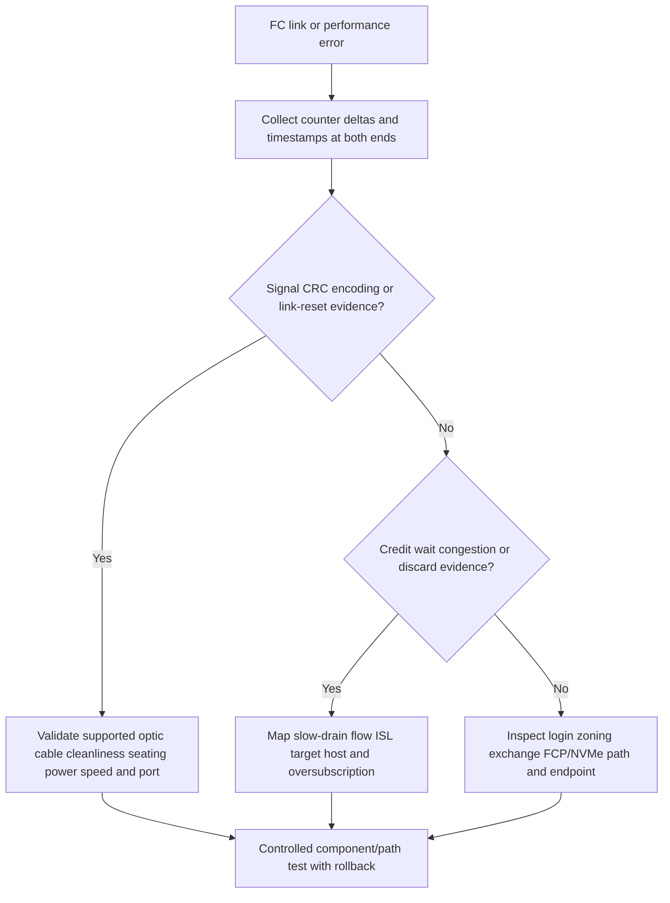

Never clean, reseat, replace, or force speed on a production path without ownership, impact review, redundant-path validation, and rollback. Preserve optical/counter evidence before disturbance.

---

## 10. Dual fabrics, multipathing, and common fate

A common resilient FC design uses Fabric A and Fabric B with separate host initiator ports, switches, target ports, and MPIO paths.

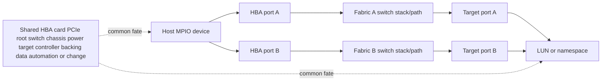

### Multipath evidence

- Host sees one stable LUN/namespace identity through expected paths.
- Each path maps initiator WWPN, fabric, switch ports/ISLs, target WWPN, target-port group, controller/node, and storage object.
- ALUA/ANA or relevant target state identifies path characteristics.
- MPIO policy is supported for exact OS/driver/firmware/protocol/storage combination.
- Failure detection/recovery fits application timeout and clustered reservation behavior.
- Fabric A and B are tested separately for HBA, cable/optic, switch, ISL, target port, controller, and change failures.

### Failure-test sequence

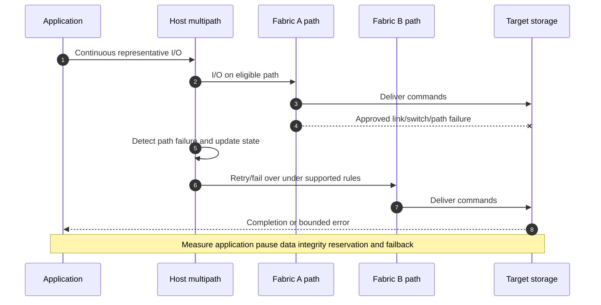

---

## 11. FCoE, CEE, DCB, and PFC

**Fibre Channel over Ethernet (FCoE)** encapsulates FC frames over Ethernet so FC traffic can traverse a supported lossless-Ethernet design without IP routing. FCoE preserves FC protocol semantics while replacing native FC lower transport on that segment.

### FCoE roles and services

- **Converged Network Adapter (CNA):** endpoint adapter supporting FCoE/Ethernet functions under exact design.
- **VN_Port:** virtual N_Port behavior at the FCoE endpoint.
- **VF_Port:** virtual F_Port behavior at an FCoE Forwarder.
- **FCoE Forwarder (FCF):** bridges FCoE endpoint behavior into FC fabric services.
- **FCoE Initialization Protocol (FIP):** discovery/initialization/control protocol for FCoE relationships.
- **Converged Enhanced Ethernet (CEE):** industry term associated with enhanced Ethernet capabilities; DCB is the standards-oriented feature family.

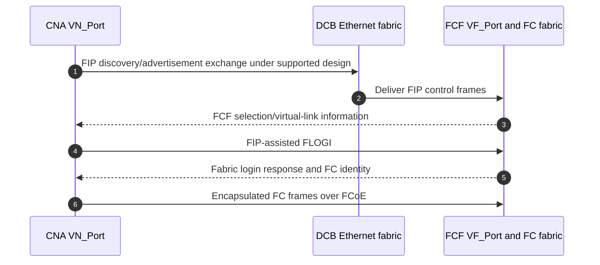

### DCB components orientation

| Feature | Purpose | Risk/caveat |
|---|---|---|
| Priority-based Flow Control (PFC) | Pause selected Ethernet priorities | Pause storms, deadlock, congestion spreading, wrong classification |
| Enhanced Transmission Selection (ETS) | Allocate bandwidth among traffic classes | Policy mismatch or starvation under load |
| DCB Exchange (DCBX) | Exchange DCB capabilities/configuration | Willingness/version/vendor behavior must align |
| Priority/PCP mapping | Put FCoE in intended lossless class | Marking/trust mismatch can place traffic in wrong queue |

### Lossless caveat

`Lossless Ethernet` is an engineered operating objective for selected traffic under stated conditions, not a guarantee that no frame can ever be lost. PFC can trade drops for latency/backpressure and can magnify configuration defects. Validate end-to-end CNA-switch-FCF-DCB configuration, buffers, QoS, congestion behavior, failure recovery, and exact vendor support.

---

## 12. NVMe architecture from zero

**Non-Volatile Memory Express (NVMe)** defines a host-controller command architecture designed around submission and completion queues. **NVMe over Fabrics (NVMe-oF)** extends the model across supported transports such as FC and TCP.

### NVMe vocabulary

| Term | Meaning | Why it matters |
|---|---|---|
| **Host** | Consumer initiating NVMe commands | Owns OS driver, multipath, NQN, queues, and application/file system. |
| **Subsystem** | NVMe storage entity containing controllers and namespaces | Authorization and namespace visibility occur in subsystem context. |
| **Controller** | Interface through which host communicates with subsystem | Admin/I/O queues and transport association/connection relate here. |
| **Namespace** | Logical block-addressable storage visible through controller | NVMe analogue to presented block storage, not a file share. |
| **NQN** | NVMe Qualified Name for host/subsystem identity | Must be unique/governed and mapped correctly. |
| **Submission Queue (SQ)** | Host places commands into queue | Parallelism and queue ownership are core to NVMe. |
| **Completion Queue (CQ)** | Controller posts command completions | Completion processing/affinity can affect performance. |
| **Admin queue** | Controller management commands | Separate from I/O queues conceptually. |

### Queue model

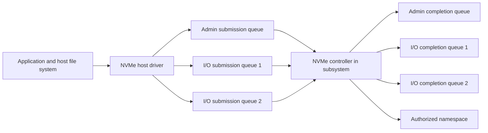

NVMe queue count/depth does not guarantee performance. CPU affinity, interrupts/polling, transport, controller, namespace, storage media, workload, and supported implementation determine outcome.

---

## 13. NVMe/FC connection flow and evidence

NVMe/FC maps NVMe-oF onto Fibre Channel using the FC-NVMe FC-4 type. The host and subsystem still need FC fabric login, zoning/visibility, endpoint login/association behavior, and namespace authorization.

### Conceptual NVMe/FC flow

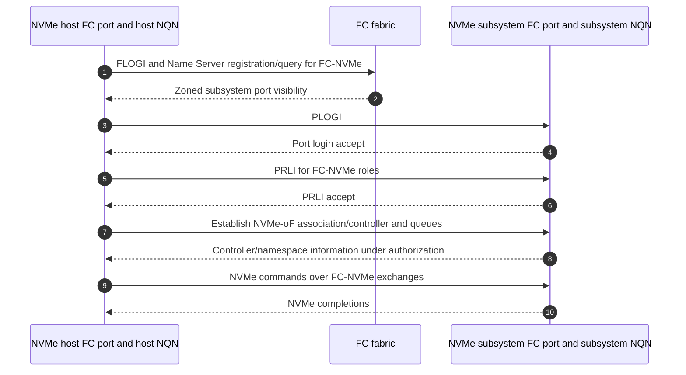

### NVMe/FC evidence

- Host HBA/driver/firmware and FC-NVMe support.
- Initiator/subsystem FC WWPNs, FC IDs, zoning, login database, FC-4 type, PRLI state.
- Host NQN, subsystem NQN, controller identity, namespace ID/UUID/NGUID/EUI-style identity as implemented.
- Association/connection/queue state and NVMe status/completion.
- ANA/multipath state under exact host/subsystem support.
- Fabric credits/errors/congestion and target/controller/namespace performance.

FCP and NVMe/FC can share physical FC infrastructure under supported design, but they use different FC-4 mappings and host/storage stacks. Visibility for one does not prove the other.

---

## 14. NVMe/TCP versus NVMe/FC

**NVMe/TCP** maps NVMe-oF over TCP/IP. It uses Ethernet/IP routing and TCP rather than FC fabric credit/logins. Common registered service orientation uses TCP port 4420, but exact discovery/configuration/security must be verified.

### Comparison

| Dimension | NVMe/FC | NVMe/TCP |
|---|---|---|
| Lower fabric | Fibre Channel switches, FC links, credits | Ethernet/IP network, TCP connections |
| Endpoint transport identity | WWPN/FC ID plus NQN/subsystem/controller | IP/port plus NQN/subsystem/controller |
| Discovery/connectivity | FC fabric services, zoning, FC-NVMe login/association | IP routes/firewalls, NVMe discovery/connect flow under implementation |
| Flow/recovery | FC frames/exchanges/credits and FC multipath | TCP sequence/ACK/retransmission/windows plus NVMe-oF state |
| Common physical evidence | Optics, link, CRC, encoding, credits, ISL congestion | Ethernet errors, VLAN/LAG, MTU, IP route, TCP loss/window/retransmission |
| Security orientation | Fabric isolation/zoning plus subsystem authorization; additional protections are design-specific | IP segmentation/firewall plus supported authentication/encryption mechanisms; exact NVMe/TCP security support varies |
| Operations | FC-specialist fabric skills | Ethernet/IP/TCP skills plus NVMe-oF |

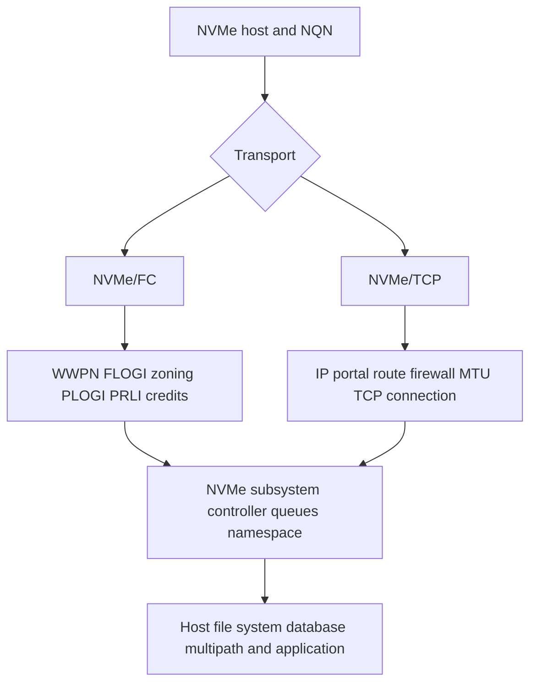

### False comparison warning

Do not say NVMe/FC is always faster or NVMe/TCP is always simpler. Compare workload, latency/throughput goals, existing skills/infrastructure, CPU/offload, scale, routing, failure domains, security, observability, ecosystem support, cost, and tested degraded behavior.

---

## 15. Supportability, security, performance, and risk

### Supportability inventory

| Domain | Record |
|---|---|
| Host | OS/hypervisor, multipath, HBA/CNA/NIC, driver, firmware, host utilities, NQN where relevant |
| FC fabric | Switch model/software, licenses/features, VSAN/fabric/domain, zoning, ISLs, speed, optics, credits |
| FCoE/DCB | CNA, FCF, VN/VF ports, FIP, PFC/ETS/DCBX, VLAN/priority/buffer design |
| Protocol | FCP, NVMe/FC, NVMe/TCP version/capabilities, login/association/queues, security |
| Storage | Platform/release, target WWPNs/ports/nodes, subsystems/NQNs, LUNs/namespaces, mappings, ANA/ALUA |
| Application | File system/database/cluster, reservations, queue/timeouts, consistency, RPO/RTO |
| Evidence | Exact current IMT result/notes/date, vendor docs, unknown/unlisted components |

### Security

- Use least-privilege zoning plus target LUN/namespace mapping; one does not replace the other.
- Protect switch/storage management planes, configuration backups, credentials, APIs, logs, and packet/frame traces.
- Govern WWPN/NQN identities and lifecycle; remove stale access deliberately.
- FC isolation is not automatic encryption. Data confidentiality requirements need an explicitly supported design.
- FCoE shares Ethernet infrastructure and requires correct class/priority/management isolation.
- NVMe/TCP needs IP segmentation/firewall and exact supported authentication/encryption controls; do not assume TCP encrypts.

### Performance and congestion

- Measure I/O size/mix/concurrency, queue count/depth, latency percentiles, throughput, host CPU/HBA queues, path selection, target/controller/namespace, and backing media.
- Separate physical errors from credit congestion and endpoint slow drain.
- Map ISL/port oversubscription and flows; one low average does not exclude bursts.
- Test normal and degraded fabric capacity; losing one path can concentrate traffic and expose congestion.
- For FCoE, correlate PFC/queue behavior with FC credits and application latency.
- For NVMe/TCP, correlate TCP RTT/loss/windows/retransmission and Ethernet queues.

---

## 16. Troubleshooting decision and fault trees

### FC path fault tree

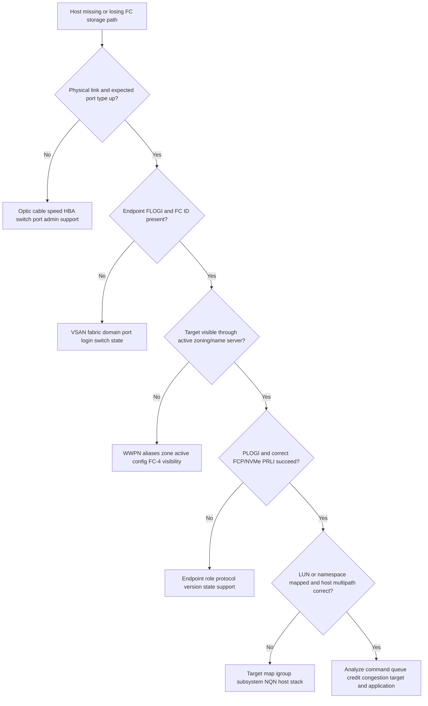

### Congestion/error tree

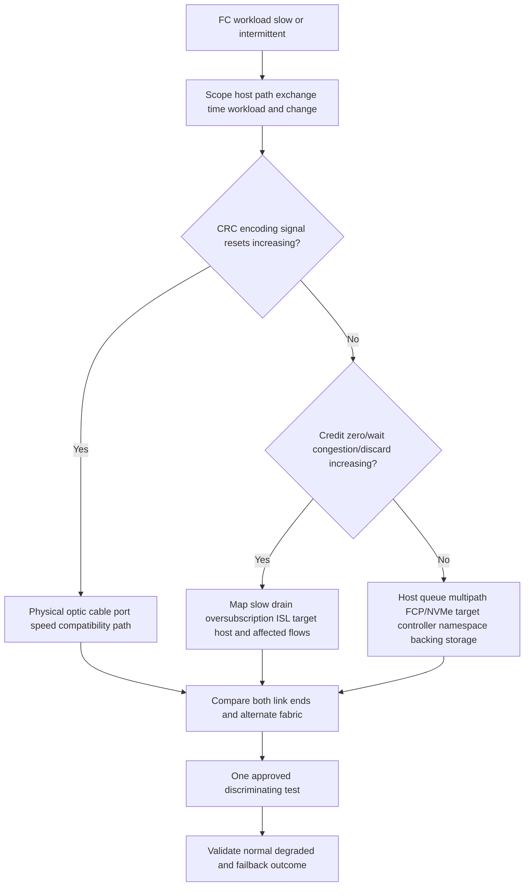

### Symptom table

| Symptom | First evidence | Unsafe shortcut |
|---|---|---|
| Link down | Both-end state, optic power, speed, cable/optic support | Replacing parts without preserving evidence/path validation |
| Host logged in, no target | Name server, active zone, target login, FC-4 type | Adding all targets to one broad zone |
| Target visible, no LUN | PRLI, target map/igroup, host identity | Rescanning repeatedly or changing zoning |
| One fabric missing | WWPN, zone/config, path map, HBA/target port | Treating surviving path as full resilience proof |
| CRC/encoding errors | Deltas, direction, optics, both ends, load | Blaming switch from one counter |
| Credit starvation | BB-credit wait, slow-drain path, ISL/target/host queues | Increasing credits without topology/distance/vendor analysis |
| RSCN storm/path churn | Event sources, login/zoning/device flaps, host recovery | Suppressing notifications before fixing instability |
| NVMe/FC PRLI fails | FC-4 type, host/subsystem support/config | Assuming FCP zoning proves NVMe/FC |
| FCoE pause storm | PFC/DCB class/buffer and FCF/CNA evidence | Disabling PFC on one device |

---

## 17. Observability and escalation pack

### Evidence correlation

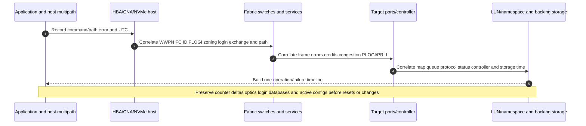

### Minimum escalation pack

- Business application, host/cluster, LUN/namespace, protocol, impact, objective, and UTC timeline.
- Physical/logical topology for Fabric A/B: HBA/CNA/NIC ports/slots, cables/optics, switch ports/line cards/chassis/VSANs/ISLs, target ports/nodes/controllers, and common fate.
- Host OS/hypervisor, multipath/DSM/device handler, HBA/CNA/NIC model, driver, firmware, host utilities, WWPN/WWNN, NQN, queues/timeouts, reservations, and recent changes.
- Switch model/software/license, fabric/domain/VSAN, operational port types/states, FC IDs, login/name-server databases, RSCNs, active zones/configs/aliases.
- FLOGI/PLOGI/PRLI stage/status, FC-4 type, source/destination IDs, OxID/RxID/exchange, FCP SCSI or NVMe command/status evidence.
- LUN/namespace stable identity, mapping/igroup/subsystem/host NQN, controller/association/queue, ALUA/ANA/multipath path states.
- Speed/duplex-equivalent FC link state, supported optics/cables, Tx/Rx power, CRC, encoding/invalid words, loss of signal/sync, resets, discards, BB-credit wait/zero, congestion/slow-drain evidence with reset times and deltas.
- FCoE VN/VF/FCF/FIP, DCBX/PFC/ETS/priority/VLAN/buffer/pause evidence where used.
- NVMe/TCP IP/port/VLAN/route/firewall/MTU/TCP RTT/loss/windows/retransmission and discovery/connection/queue evidence where used.
- Target/controller/port/LUN/namespace queue, latency, CPU/cache, backing pool/media/protection/capacity/degraded evidence.
- Exact current host/fabric/protocol/storage/application combination and IMT result/notes/date; identify unknown/unlisted/access-gated components.
- Actions tried, outcomes/rollback, data-safety safeguards, competing hypotheses, next test, owner, exact ask, and deadline.

---

## 18. TAM discovery, recommendation, and JD Mapping

### Discovery questions

#### Business and ownership

1. Which application, host/cluster, LUN/namespace, criticality, RPO/RTO, performance objective, and change window use the fabric?
2. Who owns host/HBA, Fabric A/B, zoning, target/map, multipath, application/file system, protection, and risk decisions?
3. Is the symptom physical, login, zoning, mapping, path, congestion, protocol, application, or supportability?

#### Fabric and protocol

4. Draw WWPN/WWNN, FC IDs, port types, switches/VSANs/ISLs, zones, target ports, LUNs/namespaces, and common failure domains.
5. Record FLOGI/name-server/PLOGI/PRLI, FC-4 type, FCP/NVMe command, credits, errors, optics, RSCN, and path state.
6. For FCoE, map CNA/VN/VF/FCF/FIP/DCB/PFC/ETS. For NVMe, map host/subsystem NQN, controller, queues, namespaces, and transport.

#### Performance, resilience, and security

7. What I/O mix/size/concurrency/queues/latency/throughput exists at normal, peak, and degraded states?
8. Which host port, optic, switch, ISL, fabric, target port, controller, and common-change failures were tested?
9. How do zoning plus LUN/namespace mapping, management access, identity, and encryption requirements create least privilege?

#### Supportability and action

10. Which OS/hypervisor/HBA/CNA/NIC/driver/firmware/switch/optic/protocol/multipath/storage/app versions form the solution?
11. What current official/IMT result and notes apply, and what is unlisted/inaccessible?
12. Can one command be correlated from app/host through fabric frames/credits to target/backing storage?
13. What safe test distinguishes physical, zoning, credit, target, and host hypotheses?
14. What change/rollback/stop and data-safety criteria apply?
15. What owner/date/validation/residual risk accompanies the recommendation?

### Recommendation model

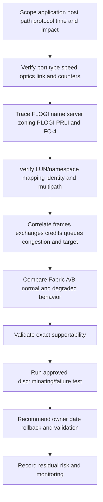

### Explicit JD Mapping

| JD responsibility | Part 18 contribution | Arti's strength and honest gap |
|---|---|---|
| Understand customer environment | Maps hosts, fabrics, zones, targets, protocols, paths, and data ownership | **Strength:** network/VM dependency mapping. **Gap:** production FC/NVMe fabric ownership. |
| Storage depth | Explains FC layers/logins/credits/zoning, FCoE, NVMe/FC, NVMe/TCP | **Conceptual/lab:** no production switch/zoning/ONTAP SAN claim. |
| Risk/stability | Finds physical, congestion, slow-drain, common-fate, DCB, and multipath risks | **Strength:** CRITSIT hypothesis/evidence method. |
| Supportability | Builds exact HBA/driver/firmware/switch/optic/protocol/storage matrix and IMT evidence | **Gap:** no customer IMT/gated result claimed. |
| Recommendation quality | Requires owner-led, reversible, normal/degraded validation and residual risk | **Strength:** advisory/escalation follow-through. |
| Service review | Reports fabric health, error/credit trends, path tests, support gaps, and actions | **Strength:** analytics/business reviews. |
| Escalation | Supplies login/zoning/frame/credit/optic/path/target evidence and exact ask | **Strength:** Product/Engineering evidence discipline. |

### Honest production-gap statement

> "I can explain FC identities and layers, FLOGI/PLOGI/PRLI, zoning, NPIV, credits, optics, dual fabrics, FCoE/DCB, and NVMe/FC versus NVMe/TCP, and I can build a layered evidence plan. My production experience is Microsoft networking, Azure, virtual machines, storage fundamentals, escalation, and analytics, not FC switch or NetApp SAN administration. I would verify exact switch/HBA/driver/firmware/protocol/storage support and IMT notes and work with fabric, host, application, and storage specialists before any zoning, speed, credit, DCB, mapping, or failover change."

---

## 19. Fully synthetic case: Woodgrove Finance slow-drain and missing NVMe path

> **Synthetic case:** Woodgrove Finance, all WWNs, FC IDs, zones, switches, counters, paths, and outcomes are fictional. No NetApp product behavior, customer incident, or support result is asserted.

### Environment

- Four database hosts use dual Fabric A/B.
- Existing database LUNs use FCP; a new analytics namespace uses NVMe/FC.
- Each host has two dual-port HBAs, but the active design uses one port per fabric.
- Fabric A and B are separate chassis/power domains; both target paths reach one storage HA domain.
- A virtualized host uses NPIV guest WWPNs.
- During analytics onboarding, Fabric A shows credit wait and database tail latency. One VM sees FCP LUNs but not the NVMe namespace on Fabric B.

```mermaid
flowchart LR
    H1[Database host FCP] --> FA[Fabric A]
    H1 --> FB[Fabric B]
    VM[VM NPIV WWPN FCP and NVMe host stack] --> FA
    VM --> FB
    FA --> TF1[Target FCP ports]
    FB --> TF2[Target FCP ports]
    FA --> TN1[Target NVMe/FC ports]
    FB --> TN2[Target NVMe/FC ports]
    TF1 --> LUN[Database LUNs]
    TF2 --> LUN
    TN1 --> NS[Analytics NVMe namespace]
    TN2 --> NS
    SLOW[One host HBA port drains slowly] -.backpressure.-> FA
```

### Evidence

| Evidence | Observation | Bounded interpretation |
|---|---|---|
| Fabric A port counters | One host-facing port accumulates credit-zero/wait during latency spikes | Slow-drain/backpressure candidate, not yet root cause. |
| Adjacent ISL ports | Credit wait spreads upstream; no CRC/encoding increase | Congestion mechanism stronger than physical corruption. |
| Host evidence | A host HBA/driver queue stalls during CPU/interrupt issue | Endpoint can explain delayed credit return; exact vendor analysis needed. |
| Fabric B | No corresponding congestion | Provides comparison and resilience capacity evidence. |
| VM FCP | FLOGI/PLOGI/FCP PRLI and LUN paths succeed on B | Physical/link/zoning for FCP works. |
| VM NVMe/FC | FLOGI and PLOGI succeed; FC-NVMe PRLI/Name Server visibility absent because virtual WWPN is missing from NVMe zone on B | Explains protocol-specific missing path; FCP success does not prove NVMe/FC. |
| Target mapping | Host NQN/subsystem mapping exists for both target ports | Weakens namespace authorization hypothesis after fabric stage. |

### Competing hypotheses

| Hypothesis | Evidence for | Evidence against/missing | Test |
|---|---|---|---|
| Bad Fabric A optic | Latency on A | No CRC/encoding/optical anomaly; credit wait dominates | Both-end optics/counters and controlled alternate-port test |
| Fabric oversubscription only | ISL credit wait | Trigger begins at one host slow-drain port; total average below link capacity | High-resolution flow/credit topology and host queue correlation |
| Storage target overloaded | Database latency | Fabric B/target service normal; frames delayed before target | Target queue/time versus fabric wait |
| NVMe namespace map missing | VM lacks path | Mapping exists; FC-NVMe visibility/PRLI absent | Correct zone then verify FC-NVMe login before namespace |
| FCP zone should cover NVMe/FC | Same physical WWPNs/ports can carry both | Name-server/FC-4 visibility differs; exact zone omitted virtual WWPN | Active zone/FC-4 registration comparison A versus B |

### Fault tree

```mermaid
flowchart TD
    TOP[Fabric A latency and one missing NVMe path] --> SPLIT[Separate congestion and protocol visibility]
    SPLIT --> LAT[Fabric A latency]
    SPLIT --> MISS[Fabric B NVMe path missing]
    LAT --> ERR{Physical errors rise?}
    ERR -->|Yes| PHY[Optic cable port speed]
    ERR -->|No| CREDIT{Credit wait maps to one slow-drain edge?}
    CREDIT -->|Yes| HOST[Correlate HBA driver CPU queue and upstream spreading]
    CREDIT -->|No| OTHER[ISL target oversubscription and workload]
    MISS --> FLOGI{Virtual WWPN logged in?}
    FLOGI -->|No| NPIV[NPIV host/hypervisor/switch]
    FLOGI -->|Yes| FC4{FC-NVMe visible and PRLI succeeds?}
    FC4 -->|No| ZONE[FC-4 registration zoning target role support]
    FC4 -->|Yes| MAP[Host NQN subsystem controller namespace ANA]
    HOST --> VALID[Vendor-supported host fix and dual-fabric load test]
    ZONE --> VALID
```

### Recommendations

1. Host/fabric owners should preserve Fabric A credit and HBA queue evidence and engage the HBA/OS vendor using the exact driver/firmware/CPU/interrupt state; do not mask a slow-drain endpoint by increasing credits blindly.
2. Fabric owner should add the exact NPIV virtual WWPN to the reviewed NVMe/FC zone on Fabric B only after confirming design/source-of-truth, then validate Name Server FC-4 visibility, PLOGI, FC-NVMe PRLI, controller, namespace, and multipath state.
3. Storage owner should provide target-port/controller/LUN/namespace timing to disconfirm target saturation and verify subsystem mapping.
4. Capacity/resilience review should model workload on one surviving fabric and verify congestion does not exceed application tail-latency tolerance.
5. Record separate root causes unless evidence proves one mechanism; the missing NVMe path did not cause Fabric A slow drain in the current evidence.

### Customer-facing summary

> "The two symptoms are distinct. Fabric A latency tracks delayed buffer-credit return from one host-facing port and propagates toward the ISL without physical-error growth, making host/HBA slow drain the leading mechanism. The VM's missing Fabric B NVMe path occurs later in the control path: its NPIV WWPN logs in and FCP works, but the WWPN is absent from the NVMe/FC zone, so FC-NVMe visibility and PRLI do not establish. We recommend separate host/fabric congestion and zoning corrections, followed by dual-fabric degraded-load and NVMe multipath validation."

---

## 20. Paper lab and whiteboard drills

No production access is required. Use synthetic switch outputs, frame fields, and public specifications.

### Paper lab scenario

A fictional virtualization cluster has two FC fabrics, NPIV guests, FCP LUNs, and a new NVMe/FC namespace. One site also has an FCoE access layer using CNA, FCF, PFC, ETS, and DCBX. A remote test uses NVMe/TCP over two routed Ethernet paths. Fabric A shows CRC errors on one optic; Fabric B shows credit wait without errors. FCoE PFC pause spreads during backup. One NVMe host NQN is missing from subsystem mapping. Exact versions and IMT support are unknown.

### Tasks

1. Draw application/host/multipath/HBA/fabric/target/LUN-or-namespace stack and all planes.
2. Map FC-0 through FC-4 and distinguish FCP from FC-NVMe.
3. Draw N_Port/F_Port/E_Port topology and every ISL/failure domain.
4. Trace FLOGI, Name Server, PLOGI, and PRLI for FCP and NVMe/FC.
5. Map WWNN, physical/virtual WWPN, FC ID, NQN, LUN, and namespace identities.
6. Build zones for Fabric A/B and separate target mapping/subsystem authorization.
7. Assess VSAN logical separation versus physical/common-control fate.
8. Draw frame/sequence/exchange IDs and credit return.
9. Analyze CRC path separately from slow-drain/credit path.
10. Validate speed/optic/cable/power/counter evidence at both ends.
11. Design MPIO/ANA/ALUA path and fabric-failure tests.
12. Draw FCoE VN/VF/FCF/FIP and DCB/PFC/ETS/DCBX class path.
13. Explain PFC pause propagation and why lossless is not absolute.
14. Draw NVMe subsystem/controller/admin/I/O queues/namespace/NQN.
15. Compare NVMe/FC and NVMe/TCP evidence and supportability.
16. Build exact host/fabric/protocol/storage/application IMT inventory and three recommendations.

### Whiteboard drills

1. **FC identity:** WWNN node, WWPN port, FC ID temporary fabric address.
2. **Port types:** N_Port endpoint, F_Port switch edge, E_Port ISL.
3. **Login:** Link -> FLOGI -> Name Server/zoning -> PLOGI -> PRLI -> map -> I/O.
4. **Two keys:** Zone permits conversation; target map grants storage.
5. **NPIV:** Many virtual WWPNs share one physical path.
6. **Credits:** Adjacent-link trays; slow drain propagates waiting.
7. **Physical versus congestion:** CRC/encoding versus credit-zero/queue evidence.
8. **FCoE:** FC frames over DCB Ethernet through an FCF; no IP routing for FCoE payload.
9. **NVMe:** Submission queues -> controller -> completion queues -> namespace.
10. **Transport choice:** FC login/credits versus IP/TCP route/retransmission.

### Lab completion criteria

- [ ] FC layers, port types, names, IDs, frames, sequences, and exchanges are distinct.
- [ ] FLOGI/name-service/zoning/PLOGI/PRLI/mapping stages are ordered correctly.
- [ ] NPIV virtual identity is not confused with physical redundancy.
- [ ] Zoning and target mapping remain separate security controls.
- [ ] VSAN logical isolation includes shared-hardware caveats.
- [ ] Physical errors and credit congestion use different evidence.
- [ ] Dual fabrics include end-to-end and common-change tests.
- [ ] FCoE/DCB/PFC lossless assumptions are bounded.
- [ ] NVMe subsystem/controller/queue/namespace/NQN and transport evidence are complete.
- [ ] Production FC/FCoE/NVMe/ONTAP experience is not implied.

---

## 21. Self-test

1. Define FC fabric, initiator/target, HBA, WWNN, WWPN, FC ID, FCP, and Name Server.
2. Draw the dual-fabric architecture and three planes.
3. Explain FC-0 through FC-4 and map FCP/NVMe.
4. Define FC frame, sequence, exchange, source/destination ID, and exchange IDs.
5. Compare N_Port, F_Port, E_Port, ISL, and virtual port orientation.
6. Draw FLOGI, Name Server, PLOGI, PRLI, and upper-layer access.
7. Explain RSCN without calling it a root cause.
8. Map WWPN/WWNN to FC IDs and explain why FC IDs can change.
9. Explain NPIV use and physical common fate.
10. Compare WWPN-based and port-based zoning orientation.
11. Explain zoning versus LUN/namespace mapping and safe zone principles.
12. Explain VSAN logical isolation and shared-hardware risk.
13. Draw BB-credit consumption/return and explain credit starvation.
14. Define slow drain, oversubscription, head-of-line effect, and congestion spreading.
15. Interpret speed, optical, CRC, encoding, reset, discard, and credit counters.
16. Design Fabric A/B path, failure, and degraded-load tests.
17. Define FCoE, CNA, VN_Port, VF_Port, FCF, and FIP.
18. Explain PFC, ETS, DCBX, priority mapping, and lossless caveats.
19. Define NVMe host, subsystem, controller, namespace, NQN, SQ, CQ, and admin queue.
20. Draw NVMe/FC login/association/queue flow.
21. Compare NVMe/FC and NVMe/TCP architecture, evidence, security, and operations.
22. Apply FC path and congestion/error fault trees.
23. Correlate host/fabric/target/storage evidence for one command.
24. Build exact supportability/IMT inventory.
25. Ask the complete TAM discovery set and write a bounded recommendation.
26. Recreate Woodgrove's separate slow-drain and missing-NVMe-path mechanisms.
27. Build the minimum escalation pack.
28. Complete the paper lab and whiteboard drills.
29. Answer Q1-Q8 aloud.
30. State Arti's strengths and production FC/FCoE/NVMe gap honestly.

---

## 22. Official Source Anchors

**Date checked: 2026-08-24.** These standards bodies, official specifications, and public vendor sources anchor the concepts. INCITS/T11/IEEE standards text and revisions can have access restrictions; FCIA material is educational rather than a support matrix; product implementations select features; and NetApp IMT/support content can require authorization. Verify exact standards revisions, host/HBA/CNA/NIC/driver/firmware, switch/optic/software, protocol, multipathing, storage release, application, and IMT notes. Do not invent limits, credit settings, zoning enforcement, lossless guarantees, or ONTAP behavior.

| Topic | Official public source | Access, version, and use note |
|---|---|---|
| Fibre Channel standards | [INCITS T11 Technical Committee](https://standards.incits.org/apps/group_public/workgroup.php?wg_abbrev=t11) | Official standards committee area. Full standards/revisions and downloads can require access. |
| FC public education | [Fibre Channel Industry Association](https://fibrechannel.org/) | Industry association educational source for FC architecture and generations; verify normative details with current T11 standards and vendors. |
| FC zoning and security orientation | [FCIA Fibre Channel resources](https://fibrechannel.org/learn-fibre-channel/) | Public education. Exact enforcement, smart zoning, and best practices are switch/vendor specific. |
| NPIV | [INCITS T11 standards program](https://standards.incits.org/apps/group_public/workgroup.php?wg_abbrev=t11) | NPIV is standardized in FC architecture; exact switch/HBA/hypervisor limits and support require current vendor/IMT validation. |
| FCoE standards ecosystem | [INCITS T11 FCoE work](https://standards.incits.org/apps/group_public/workgroup.php?wg_abbrev=t11) | Normative standards may require access. Use exact current FCoE/FIP revisions and vendor guidance. |
| Data Center Bridging | [IEEE 802.1 Data Center Bridging Task Group](https://1.ieee802.org/dcb/) | Official public project area; full standards editions/amendments can have access constraints. |
| Priority-based Flow Control | [IEEE 802.1Qbb project information](https://1.ieee802.org/dcb/802-1qbb/) | Official public project area; end-to-end support and safe design are vendor-specific. |
| Enhanced Transmission Selection | [IEEE 802.1Qaz project information](https://1.ieee802.org/dcb/802-1qaz/) | Official public project area; exact QoS mapping/behavior is implementation-specific. |
| NVMe and NVMe-oF | [NVM Express Specifications](https://nvmexpress.org/specifications/) | Official specification area. Select current Base, Fabrics, FC transport, and TCP transport specifications. |
| NVMe terminology/education | [NVM Express technology resources](https://nvmexpress.org/developers/nvme-specification/) | Official organization resources; product support remains exact-version dependent. |
| Storage terminology | [SNIA Dictionary](https://www.snia.org/education/online-dictionary) | Vendor-neutral orientation for fabric, zoning, NVMe-oF, and related terms; not a support matrix. |
| NetApp FC SAN configuration | [ONTAP FC configuration documentation](https://docs.netapp.com/us-en/ontap/san-config/fc-config-concept.html) | Official public area. Select exact ONTAP release and follow host/fabric prerequisites. |
| NetApp NVMe configuration | [ONTAP NVMe configuration documentation](https://docs.netapp.com/us-en/ontap/san-admin/nvme-config-concept.html) | Official public area. Exact transports, releases, host support, and procedures are version-sensitive. |
| NetApp SAN host utilities | [NetApp Host Utilities documentation](https://docs.netapp.com/us-en/ontap-sanhost/) | Official host integration area. Select exact OS/protocol/release and follow IMT. |
| NetApp interoperability | [NetApp Interoperability Matrix Tool](https://imt.netapp.com/) | Official, potentially gated, and time-sensitive. Save exact HBA/driver/firmware/switch/protocol/multipath/storage result, notes, and date. |

### Source-use discipline

- Record exact standards/specification and revision; public overview pages do not replace normative text.
- Preserve WWPN/WWNN/FC ID/NQN mappings, active zone config, login databases, optics, and counter deltas before changes.
- Use exact switch/HBA/optic vendor definitions for errors, credits, distance, and congestion features.
- Validate FCoE/DCB as one end-to-end CNA-switch-FCF class/buffer design; never infer lossless operation from PFC enabled alone.
- Validate FCP and NVMe/FC separately even on the same physical fabric.
- Save dated IMT evidence and notes for exact host, adapter, driver, firmware, switch, protocol, multipath, and storage combinations.

---

## Likely Interview Questions

### Q1. Explain the Fibre Channel path from a host HBA to a storage LUN.

> **Model answer:** "The host storage stack sends SCSI commands through FCP to an initiator HBA N_Port. The port performs fabric login through an F_Port, receives an FC ID, registers/queries fabric services, and discovers zoned target WWPNs. It performs PLOGI and FCP PRLI with the target. The target separately maps the initiator WWPN or group to a LUN. MPIO combines paths from independent fabrics into one host device. FC delivery, target mapping, SCSI completion, and application consistency remain separate."

**Follow-up depth:** Draw FC-0 through FC-4, N/F/E ports, FC IDs, zoning, mapping, and one FCP exchange.

### Q2. What are WWNN, WWPN, FC ID, FLOGI, PLOGI, and PRLI?

> **Model answer:** "WWNN identifies a node and WWPN identifies a port entity. The fabric assigns a 24-bit FC ID when an N_Port completes FLOGI. The port registers/queries fabric services such as the Name Server. PLOGI establishes port-to-port service parameters between endpoints. PRLI establishes the FC-4 process relationship, such as FCP or FC-NVMe roles. WWNs are persistent identities; FC IDs can change after fabric login events."

**Follow-up depth:** Walk failure stages from link through FLOGI/name visibility/PLOGI/PRLI/mapping and explain RSCN.

### Q3. How do zoning, target mapping, VSANs, and NPIV differ?

> **Model answer:** "Zoning permits selected FC ports to communicate through a fabric. Target mapping or masking authorizes an initiator to a particular LUN or namespace. A VSAN creates a logically separate fabric on supported shared switch hardware but can retain chassis/control common fate. NPIV lets multiple virtual N_Port WWPNs and FC IDs share one physical link; each virtual identity needs correct zoning/mapping, and NPIV does not create physical redundancy."

**Follow-up depth:** Explain WWPN versus port zoning, single-initiator principle, active zonesets, NPIV VM movement, and shared-chassis risk.

### Q4. How do FC buffer credits and slow-drain devices affect performance?

> **Model answer:** "Buffer-to-buffer credits limit frames in flight on each adjacent FC link. A sender consumes a credit per frame and waits when none are available until the receiver returns credit after freeing buffer. A slow-drain endpoint or congested downstream path delays returns, causing credit-zero wait and propagating backpressure through ISLs or other ports. I map credit counters and flows over time and separate congestion from CRC/encoding/optic errors before changing buffers."

**Follow-up depth:** Explain oversubscription, distance credits, head-of-line effects, and a host HBA queue/CPU cause.

### Q5. How would you investigate an FC link with CRC errors or intermittent resets?

> **Model answer:** "I preserve both-end counter deltas, timestamps, negotiated speed, optic/cable/port models, Tx/Rx optical power, temperature, loss-of-signal/sync, encoding/invalid-word, CRC, reset, and traffic context. CRC is observed at the receiver but the transmitter, optic, cable, connector, or receiver can be causal. I validate redundancy and support before a controlled clean/reseat/swap or port test, then prove the error delta stops under representative load."

**Follow-up depth:** Explain why credit wait without CRC is a different path and why one old cumulative counter is weak evidence.

### Q6. What is FCoE, and why is PFC not a complete lossless guarantee?

> **Model answer:** "FCoE encapsulates FC frames over a supported Ethernet segment using CNA/VN_Port, FCF/VF_Port, and FIP control, while preserving FC semantics rather than routing the FCoE payload over IP. DCB features such as PFC, ETS, and DCBX create a selected traffic class and congestion behavior. PFC can stop a priority to avoid local drops, but pause can spread congestion or deadlock if classification, buffers, and topology are wrong. Lossless is an engineered condition, not an absolute guarantee."

**Follow-up depth:** Draw FIP/FLOGI, map PCP/class/queue/PFC/ETS, and list pause-storm evidence.

### Q7. Compare NVMe/FC and NVMe/TCP.

> **Model answer:** "Both carry the NVMe-oF model of hosts, NQNs, subsystems, controllers, queues, and namespaces. NVMe/FC uses FC fabric login, zoning, PLOGI, FC-NVMe PRLI, FC frames/exchanges, and credit flow control. NVMe/TCP uses IP addresses/ports, routes/firewalls/MTU, TCP sequence/ACK/windows/retransmission, and NVMe/TCP connections. Choice depends on workload, infrastructure, skills, CPU/offload, resilience, security, observability, cost, and exact support; neither is universally faster or simpler."

**Follow-up depth:** Draw both paths and name evidence for a missing namespace, path failure, and congestion on each.

### Q8. How does your background transfer to FC/NVMe work, and what remains a gap?

> **Model answer:** "My Microsoft production experience gives me Windows/Azure networking, virtual-machine, storage-fundamental, high-severity evidence, analytics, and customer-communication skills. Those methods transfer to fabric topology, failure-domain, counter, and escalation analysis. I have not administered production FC switches, zoning, FCoE/DCB, NVMe-oF, or ONTAP SAN. I would verify exact HBA/driver/firmware/switch/optic/protocol/storage support and IMT notes and work with fabric, host, application, and storage specialists for any change."

**Follow-up depth:** Give one factual network/VM escalation and label FC zoning/NVMe practice as conceptual or lab evidence.

---

## 30-Second Memory Hooks

- **FC fabric:** Switched block-storage network with its own logins, IDs, frames, and credits.
- **WWNN:** Node passport; **WWPN:** port passport; **FC ID:** temporary route number.
- **FC layers:** Physical -> encoding -> frames/credits -> common services -> FCP/NVMe mapping.
- **N_Port:** Endpoint; **F_Port:** switch edge; **E_Port:** switch-to-switch ISL.
- **FLOGI:** Join fabric and get FC ID.
- **Name Server:** Register and find zoned FC identities.
- **PLOGI:** Port relationship; **PRLI:** FC-4 protocol relationship.
- **Zone:** Who may talk; **mapping:** which storage they may use.
- **NPIV:** Many virtual WWPNs on one physical link.
- **VSAN:** Logical fabric separation with possible shared-hardware fate.
- **BB credit:** Reusable frame tray between adjacent ports.
- **Slow drain:** Receiver delays credit return and spreads waiting.
- **CRC/encoding:** Physical integrity path; **credit wait:** congestion path.
- **Dual fabric:** Independent end-to-end paths plus tested application recovery.
- **FCoE:** FC frames over DCB Ethernet through an FCF.
- **PFC:** Pause one priority; can spread congestion.
- **NVMe:** Submission queues, controller, completion queues, namespace.
- **NQN:** NVMe host/subsystem identity.
- **NVMe/FC:** FC login/credits; **NVMe/TCP:** IP/TCP routes/retransmission.
- **Supportability:** Exact HBA-driver-firmware-switch-protocol-storage combination, dated.
- **Arti's bridge:** Network/evidence method transfers; production FC/FCoE/NVMe remains unclaimed.

---

## Completion Checklist

- [ ] Define fabric, initiator/target, HBA, WWNN, WWPN, FC ID, FCP, and Name Server.
- [ ] Draw dual-fabric architecture and data/control/management planes.
- [ ] Explain FC-0 through FC-4 and distinguish FCP from FC-NVMe.
- [ ] Orient on frames, sequences, exchanges, IDs, and protocol types.
- [ ] Distinguish N_Port, F_Port, E_Port, ISL, and virtual-port roles.
- [ ] Draw FLOGI, registration/query, zoning visibility, PLOGI, PRLI, and mapping.
- [ ] Explain RSCN as a state-change signal rather than automatic root cause.
- [ ] Map WWNN/WWPN/FC ID and NPIV virtual identities safely.
- [ ] Separate zoning from target LUN/namespace mapping and apply least privilege.
- [ ] Explain VSAN isolation plus chassis/control/change common fate.
- [ ] Draw BB-credit flow and diagnose slow drain, oversubscription, and congestion spreading.
- [ ] Interpret speed/optic/CRC/encoding/reset/discard/credit counters with deltas and both ends.
- [ ] Design and validate Fabric A/B MPIO, failure, degraded-load, and failback tests.
- [ ] Explain FCoE CNA/VN/VF/FCF/FIP and DCB/PFC/ETS/DCBX.
- [ ] State why lossless is an engineered objective, not a guarantee.
- [ ] Define NVMe host/subsystem/controller/namespace/NQN/SQ/CQ/admin queue.
- [ ] Draw NVMe/FC login/association/queue/namespace flow.
- [ ] Compare NVMe/FC and NVMe/TCP by transport, evidence, security, and operations.
- [ ] Apply FC path and congestion/error fault trees.
- [ ] Correlate application/host/fabric/target/storage evidence for one command.
- [ ] Ask the complete TAM discovery set and write a seven-part recommendation.
- [ ] Recreate Woodgrove and keep slow-drain and missing-NVMe-path causes separate.
- [ ] Build exact current supportability/IMT evidence and complete escalation pack.
- [ ] Complete the paper lab, whiteboard drills, self-test, and Q1-Q8 aloud.
- [ ] State Arti's production strengths and FC/FCoE/NVMe/ONTAP gap honestly.
- [ ] Recheck standards access/revisions, vendor versions, exact topology, and NetApp IMT notes before customer use.

---

*Next suggested section:* [Part 19 - NetApp Portfolio and Solution Map](Part-19-netapp-portfolio-solution-map.md)