# Part 19 - NetApp Portfolio and Solution Map

> **Section goal:** Build a current, beginner-first map of the NetApp portfolio and learn how to choose a solution category from customer requirements rather than from a product name. By the end, you should be able to distinguish ONTAP-based systems, dedicated object and block families, BlueXP management and data-service context, Cloud Volumes ONTAP, and first-party cloud services involving NetApp technology, then present a version-aware recommendation with evidence, ownership, validation, and residual risk.

Covers index item **19** and maps directly to job-description responsibilities for understanding customer environments, strategic storage advice, risk mitigation, supportability, lifecycle planning, customer-specific recommendations, operational reviews, cross-functional work, and clear technical communication.

This Part deliberately avoids hard model specifications, limits, prices, license promises, regional availability, and feature matrices. Product names, platform generations, media choices, protocols, cloud regions, service tiers, licensing, management integrations, lifecycle state, and support status change. For real work, verify the exact current product page and release documentation, the **Interoperability Matrix Tool (IMT)**, **Hardware Universe (HWU)**, applicable cloud-provider documentation, service descriptions, contracts, and authorized customer evidence.

> **No-production-NetApp boundary:** You do not claim production NetApp experience. Every customer, workload, score, design, and recommendation below is synthetic. Your factual strengths are enterprise support, Azure, virtual machines, Windows networking, Microsoft 365 data services, escalation ownership, analytics, and customer communication. You do **not** claim production experience selecting, administering, upgrading, or supporting ONTAP, AFF, ASA, FAS, StorageGRID, E-Series, BlueXP, Cloud Volumes ONTAP, or first-party cloud file services involving NetApp technology.

---

## 1. Start with the customer's data job

A portfolio is a set of solution families intended for different data jobs. The safest first question is not `Which array should we buy?`; it is `What must the customer's application do with data, under which operating and business conditions?`

### Plain-English deep-dive: product, platform, service, and solution

| Term | Plain meaning | Analogy | Why it matters |
|---|---|---|---|
| **Product** | A purchasable or deployable offering with documented capabilities and support terms. | One vehicle model. | A product name alone does not describe the complete customer design. |
| **Platform** | A technology foundation on which data services or products operate. | A vehicle chassis and control system used in several models. | ONTAP can underpin several deployment categories with different responsibility boundaries. |
| **Service** | A capability operated partly or primarily by a provider and consumed under a service agreement. | Taking a managed train rather than owning the train. | Operations, upgrades, observability, and responsibility differ from customer-managed systems. |
| **Solution** | The complete combination of application, compute, network, protocol, storage, protection, management, people, and process that meets an outcome. | The whole transport plan, including vehicle, roads, drivers, maintenance, and destination. | A storage product is one component of a customer outcome. |
| **Portfolio taxonomy** | A structured way to group offerings by role and behavior. | A library catalog organized by subject rather than book-cover color. | It prevents misleading comparisons across file, block, object, on-premises, cloud, and managed-service categories. |
| **Control plane** | The management and policy functions that configure or coordinate service behavior. | The dispatch office. | A common management experience does not make every product's data plane identical. |
| **Data plane** | The path that carries customer reads, writes, and object operations. | Delivery vehicles carrying the actual goods. | Availability and performance must be validated on the workload path, not only in a dashboard. |

```mermaid
flowchart LR
    OUT[Business outcome] --> APP[Application and data job]
    APP --> ACCESS[File block or object access]
    ACCESS --> SLO[Performance availability protection and security]
    SLO --> PLACE[On premises cloud edge or hybrid placement]
    PLACE --> OPS[Ownership skills management and lifecycle]
    OPS --> FAMILY[Candidate NetApp solution family]
    FAMILY --> VERIFY[Current product support cost and fit validation]
    VERIFY --> DECIDE[Customer decision and tested design]
```

### The portfolio in one map

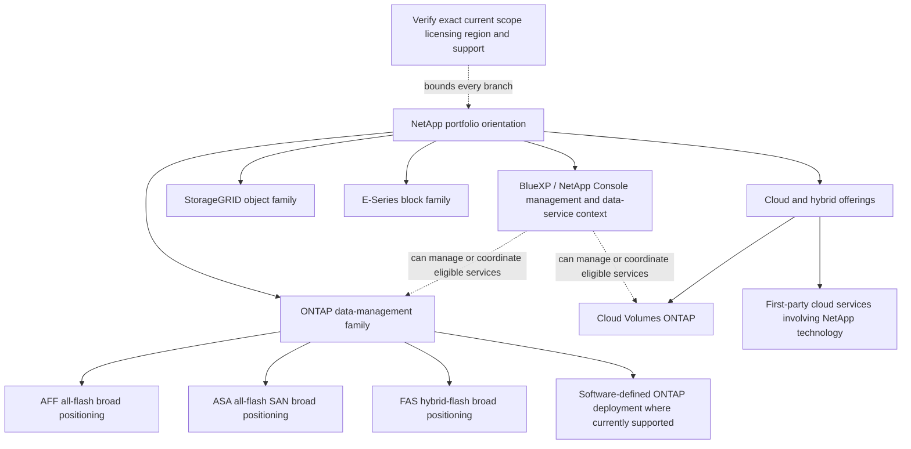

The branches are categories, not a feature-equivalence claim. An ONTAP-based physical system, a customer-operated cloud software instance, and a cloud-provider-operated file service can share technology concepts while exposing different features, interfaces, service levels, upgrade control, and support boundaries.

---

## 2. ONTAP as a data-management foundation

**ONTAP** is NetApp's data-management software foundation for eligible file, block, and object-oriented services across documented deployments. It provides the operating and data-management layer for system families such as AFF, ASA, and FAS and for selected software/cloud forms. The exact protocol and feature set differs by offering and release.

### Plain-English deep-dive: ONTAP is more than a disk controller

ONTAP is like the operating authority for a managed data city. It coordinates storage pools, logical containers, client access, availability, protection, security, efficiency, monitoring, and administration. The buildings and locations can differ, but the authority's exact powers are determined by the specific deployment and current rules.

| ONTAP concern | Beginner meaning | Customer question |
|---|---|---|
| Storage virtualization | Maps physical capacity into managed logical data containers. | Which local tiers, volumes, LUNs, namespaces, and policies support the workload? |
| Protocol services | Presents supported file, block, or object access. | Which exact NFS, SMB, iSCSI, FC, NVMe, or S3 behavior is required and supported? |
| Availability | Coordinates supported node, path, and service continuity. | Which failure is covered, what interruption is measured, and what remains shared? |
| Protection | Creates and manages point-in-time or replicated data relationships. | What RPO/RTO and threat are required, and has recovery been tested? |
| Efficiency | Reduces or tiers eligible physical storage under policy. | What measured ratio, workload effect, cost, and support condition apply? |
| Security/governance | Controls identity, roles, encryption, audit, and data policy. | Which regulation, threat, key, identity, and evidence requirements apply? |
| Management/automation | Exposes graphical, command-line, and application interfaces. | Who operates it, through which role, change process, and evidence trail? |

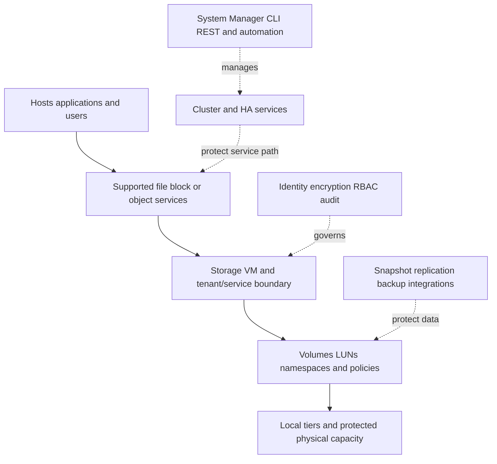

### ONTAP deployment categories

| Category | Broad orientation | Customer-managed responsibility | Verify-current questions |
|---|---|---|---|
| ONTAP on AFF/FAS/ASA systems | Integrated NetApp hardware and ONTAP software deployed in a customer or provider facility | Physical environment, supported configuration, networking, workload, policy, changes, and operations under contract | Exact model/generation, ONTAP release, media, adapters, protocols, licenses, limits, lifecycle, IMT/HWU |
| Software-defined ONTAP | ONTAP software on a qualified non-appliance deployment where currently offered and supported, such as ONTAP Select context | Qualified compute/storage/network platform plus ONTAP operations | Current product status, platform qualification, capacity/license model, HA form, performance and support boundaries |
| Cloud Volumes ONTAP | Customer-controlled ONTAP software deployment using cloud infrastructure resources, commonly coordinated through BlueXP | Cloud account, identity, networking, sizing, availability design, upgrades/operations according to service model | Cloud/region/instance/disk support, license/subscription, feature parity, HA design, limits, costs, provider dependencies |
| First-party cloud file service involving NetApp technology | Cloud-provider service exposing file capabilities under the provider's service model | Customer data, identity, networking, service configuration, consumption, and application integration | Provider-operated scope, protocol/features, tiers, regions, quotas, SLA, backup/replication, observability, support route |

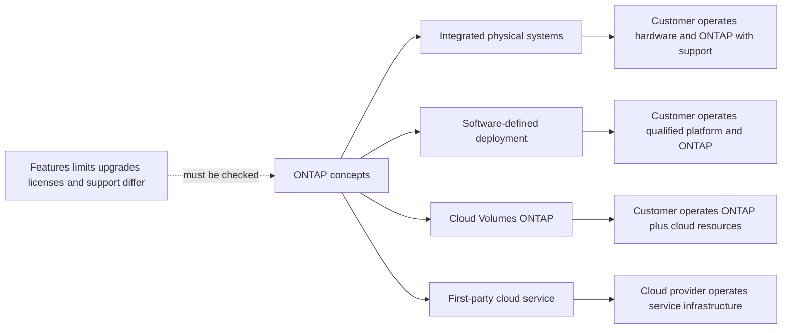

---

## 3. AFF, ASA, and FAS broad positioning

These names describe ONTAP-based system families, not permanent feature promises. Current product generations can add subfamilies and positioning changes. Avoid memorizing model numbers or assuming that all systems expose identical protocols.

### AFF

**AFF** is NetApp's broad all-flash ONTAP system category. It is commonly considered where low latency, high performance, storage efficiency, unified data services, and modern workload integration matter. Current AFF subfamilies can emphasize different performance/capacity goals; verify the exact model and release.

### ASA

**ASA** is NetApp's broad all-flash SAN-focused category. It is positioned for block-storage use with a SAN-oriented operating and management experience. Current ASA and ASA r2-era product behavior, supported protocols, management model, data services, and migration/compatibility details are version-sensitive and must not be generalized from older ONTAP arrays.

### FAS

**FAS** is NetApp's broad hybrid-flash ONTAP system category, commonly considered where capacity, workload mix, file/block data services, and economics call for supported combinations of media and ONTAP capabilities. `Hybrid` does not mean slow, and it does not identify the customer's actual media, cache, or workload behavior.

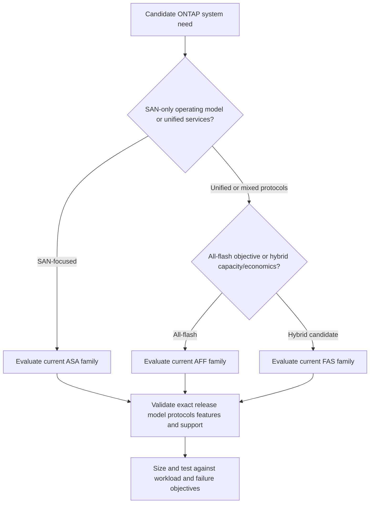

### Comparison without hard specifications

| Dimension | AFF orientation | ASA orientation | FAS orientation |
|---|---|---|---|
| Primary category | All-flash ONTAP | All-flash SAN-focused ONTAP category | Hybrid-flash ONTAP category |
| First question | Does unified all-flash data management fit the workload? | Is the requirement specifically a supported block/SAN operating model? | Does hybrid capacity/performance fit the workload and economics? |
| Protocol assumption | Never assume; verify exact system/release | Never assume beyond current SAN documentation | Never assume; verify exact system/release |
| Performance claim | Must come from workload sizing and validated design | Must come from workload sizing and validated design | Must come from workload/media sizing and validated design |
| Capacity claim | Use current HWU, design tools, and configuration | Use current HWU, design tools, and configuration | Use current HWU, design tools, and configuration |
| Risk | Choosing by `all-flash` label alone | Assuming unified-array behavior or legacy ASA behavior applies | Assuming hybrid media automatically meets cost or performance goal |

> **TAM rule:** Position the category, then verify the product. Never recommend a model from remembered limits, a marketing headline, or one benchmark.

---

## 4. StorageGRID: object storage, not an ONTAP array

**StorageGRID** is NetApp's object-storage family, designed around object data and S3-oriented access rather than a host-mounted ONTAP volume or LUN. It has its own architecture, lifecycle, protection, placement, networking, and management behavior.

### Plain-English deep-dive: object warehouse versus file cabinet

A file system is a cabinet organized by directories and filenames. Object storage is a warehouse where applications retrieve parcels by object key and metadata through an API. StorageGRID manages the object warehouse; ONTAP manages a different set of file/block/object data-service abstractions. Both store data, but the application contract and operating model differ.

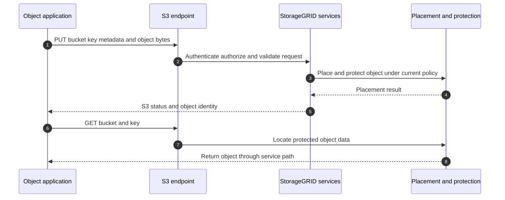

### StorageGRID fit questions

- Does the application use an S3-compatible object API, or does it require a mounted file system or block device?
- What object sizes, request mix, concurrency, key/listing pattern, metadata, retention, immutability, and lifecycle rules exist?
- What site, node, placement, erasure-coding/replication, failure, and recovery requirements apply?
- Which network, DNS, load-balancing, certificate, identity, and key dependencies exist?
- Which current StorageGRID release, appliance/software form, API compatibility, capacity, performance, and lifecycle rules apply?

Do not present StorageGRID as `cheap NAS`, `an ONTAP tier`, or `just S3`. FabricPool can use supported object targets in a separate ONTAP tiering design, but that relationship does not merge the products or responsibility boundaries.

---

## 5. E-Series: dedicated block-storage family

**E-Series** is NetApp's dedicated block-storage family using the SANtricity operating/management context rather than ONTAP. It is commonly considered for workloads where supported block access, predictable performance/throughput, capacity, and application-specific architecture fit its design.

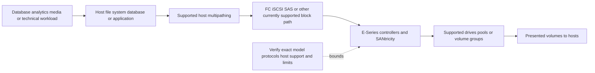

### ONTAP systems versus E-Series

| Decision area | ONTAP-based systems | E-Series |
|---|---|---|
| Data-management foundation | ONTAP | SANtricity |
| Broad access model | Offering-dependent file/block/object capabilities | Block-storage orientation |
| Protection/efficiency/management | ONTAP-specific services and tools | E-Series/SANtricity-specific services and tools |
| Workload fit | Unified data management, SAN-focused ASA, or hybrid/cloud ONTAP needs | Dedicated block workload and operating-model fit |
| Skill/support route | ONTAP architecture and tools | E-Series architecture and SANtricity tools |
| Critical warning | Do not import ASA/AFF/FAS behavior into E-Series | Do not call it an ONTAP array |

The selection must include host support, protocol/fabric, multipathing, application certification, protection, failure behavior, management skills, lifecycle, and current product availability. A high-throughput requirement alone does not select E-Series.

---

## 6. BlueXP and current NetApp Console management context

**BlueXP** is the name used in earlier and still-relevant NetApp materials for the broad management and data-service experience. **At the 2026-08-24 source check, the current public family documentation identifies that centralized experience as NetApp Console.** Depending on the current service and deployment, it can support discovery, deployment, governance, protection, mobility, classification, operations, or other data services. Use the current official name in customer deliverables while recognizing BlueXP in historical diagrams, APIs, links, and conversations. Names, packaging, connectors/agents, credentials, network requirements, entitlements, and supported resources change.

### Plain-English deep-dive: BlueXP/NetApp Console is an operations balcony, not the warehouse floor

BlueXP/NetApp Console is like a control balcony that can discover and coordinate eligible warehouses in several locations. The balcony can show status and initiate workflows, but customer data still travels through each product's data plane. If the balcony is unavailable, exact effects on existing data service versus new management actions depend on the service and must be verified.

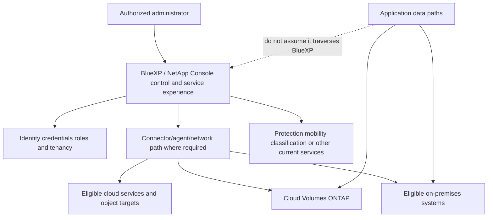

### BlueXP/NetApp Console validation questions

1. Which exact BlueXP/NetApp Console service is being discussed, and what is its current name and documentation?
2. Is a connector, agent, SaaS control plane, cloud credential, or outbound network path required?
3. Which resources, accounts, regions, tenants, and identity roles are in scope?
4. Which metadata or customer data is processed, where, and under which privacy terms?
5. What happens to existing I/O, scheduled operations, monitoring, and changes if a dependency is unavailable?
6. Which license, subscription, marketplace, support, and billing owner applies?

BlueXP/NetApp Console does not make AFF, StorageGRID, E-Series, Cloud Volumes ONTAP, and first-party cloud services one interchangeable platform. It can provide a common experience only where current documentation says it does.

---

## 7. Cloud Volumes ONTAP

**Cloud Volumes ONTAP (CVO)** is ONTAP software deployed using supported public-cloud compute, storage, networking, and identity resources. It brings selected ONTAP data-management capabilities into a customer cloud account under a shared responsibility model and is commonly deployed/managed through BlueXP.

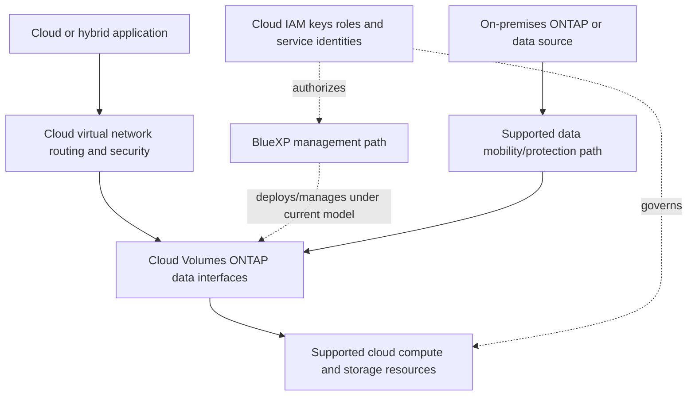

### CVO is not `an AFF in a cloud VM`

The cloud provider controls physical infrastructure and exposes virtual resources. The customer and NetApp software control other layers. Performance, availability, failure domains, disk/service behavior, network throughput, upgrade paths, licensing, capacity, and cost differ from physical systems. Verify:

- Cloud provider, region/zone, instance and storage-resource combinations.
- Single-node or HA architecture and exact failure behavior.
- Virtual network, routes, DNS, security groups/firewalls, private connectivity, and MTU.
- Identity and marketplace/subscription/licensing model.
- ONTAP release, upgrade control, features, protocols, capacity and performance limits.
- Snapshot, replication, backup, object-tier, encryption, key, monitoring, and recovery dependencies.
- Cloud resource, operation, egress, support, and disaster-recovery costs.

---

## 8. First-party cloud offerings involving NetApp technology

A **first-party cloud service** is sold and operated as a native service by the cloud provider. Current prominent examples involving NetApp technology include **Amazon FSx for NetApp ONTAP**, **Azure NetApp Files**, and **Google Cloud NetApp Volumes**. Names, tiers, regions, protocol options, features, quotas, APIs, protection, service levels, preview/general-availability state, and support models are version-sensitive.

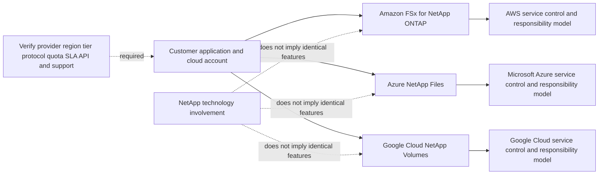

### CVO versus first-party service

| Dimension | Cloud Volumes ONTAP | First-party cloud file service |
|---|---|---|
| Product/service owner | NetApp ONTAP software deployed in customer cloud context | Cloud provider's native service |
| Customer control | More direct ONTAP/system-level configuration within documented model | Service-level resources and APIs exposed by provider |
| Infrastructure operation | Shared across customer, NetApp software/support, and cloud provider | Provider operates underlying service infrastructure; customer configures consumption/integration |
| Upgrade/maintenance | Customer/NetApp workflow under CVO documentation | Provider service model and maintenance policy |
| Feature set | CVO-specific ONTAP subset and cloud constraints | Provider-specific protocol, tier, protection, API, and regional feature set |
| Support route | NetApp/cloud responsibilities under subscription/support | Cloud-provider support route, with provider/NetApp collaboration behind boundary as applicable |
| Selection reason | Need supported ONTAP software control/features in cloud | Need native managed cloud file service and reduced infrastructure operation |

### Shared-responsibility sequence

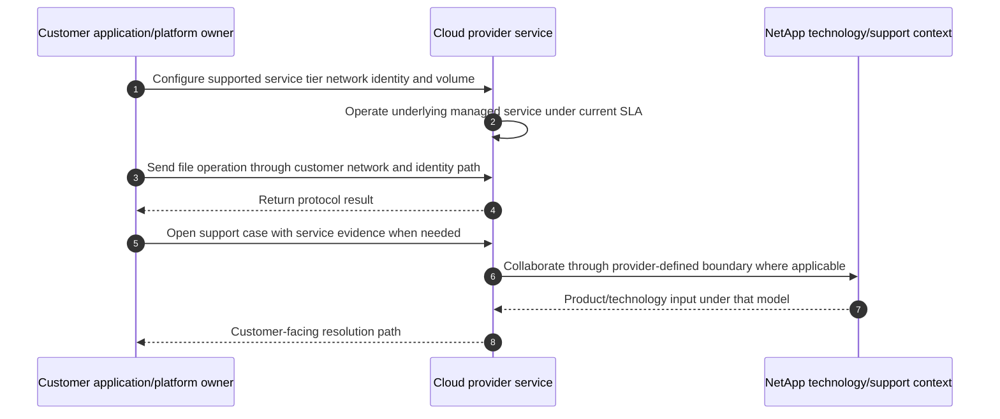

Do not promise the customer direct ONTAP CLI access, identical SnapMirror behavior, identical snapshots, or identical limits across these services. Consult the provider's current official documentation and service terms.

---

## 9. Other portfolio and consumption context

Portfolio conversations can include additional categories, integrations, and consumption models. Examples can include NetApp Keystone consumption services, converged-infrastructure solutions such as FlexPod, Astra Trident for Kubernetes storage integration, and partner/application ecosystems. These are not substitutes for the primary data-service taxonomy.

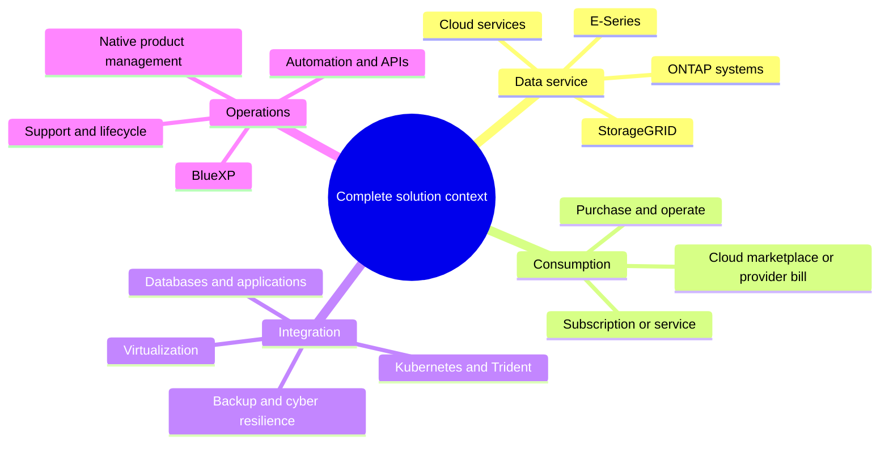

Treat every additional name as version-sensitive. Verify whether it is a product, service, integration, validated architecture, management experience, or commercial model. Do not turn a commercial consumption option into a technical feature claim.

---

## 10. The eight-dimensional selection framework

### Dimension 1: workload

Characterize application transaction, read/write mix, I/O or object size, metadata rate, concurrency, working set, locality, burst, growth, retention, and consistency. `Database`, `AI`, or `archive` is not a complete workload description.

### Dimension 2: access protocol and semantics

- Named shared files: NFS or SMB candidate.
- Host-controlled blocks: iSCSI, FC, NVMe/FC, NVMe/TCP, or another supported block path.
- API-addressed objects: S3/object candidate.
- Mixed access: validate actual multiprotocol requirements and identity semantics.

### Dimension 3: deployment and failure domains

On premises, colocation, edge, cloud infrastructure, cloud-provider managed service, or hybrid. Map rack/site/zone/region/provider/control-plane and administrative failure domains.

### Dimension 4: performance and capacity

Use latency percentiles, IOPS, throughput, metadata/object operations, concurrency, growth, protection overhead, efficiency uncertainty, headroom, and degraded-state requirements.

### Dimension 5: availability and protection

Define exact failure, Service-Level Indicator (SLI), Service-Level Objective (SLO), Recovery Point Objective (RPO), Recovery Time Objective (RTO), snapshot, replication, backup, archive, immutability, and tested recovery.

### Dimension 6: security and governance

Identity, least privilege, encryption, key ownership, audit, data residency, retention, immutability, network segmentation, management access, and shared responsibility.

### Dimension 7: management and operating model

Customer skills, 24x7 ownership, automation, change windows, upgrades, lifecycle, observability, support routes, cloud/provider teams, and desired service abstraction.

### Dimension 8: economics and decision horizon

Acquisition/subscription, cloud resources, operations, licenses, egress, protection copies, people, facilities, growth uncertainty, migration, and exit/repatriation considerations.

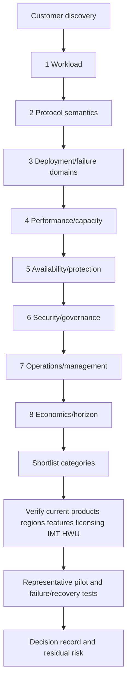

### Protocol/deployment matrix

| Need | Candidate category | Required verification |
|---|---|---|
| Unified on-premises file/block services | Current AFF/FAS ONTAP system | Exact model/release/protocol/license, sizing, HWU, IMT, HA, protection |
| SAN-focused all-flash service | Current ASA family | Exact ASA generation/management model, host/fabric/MPIO support, protocol, migration |
| Hybrid-flash unified/capacity workload | Current FAS family | Workload/media fit, cache/efficiency, protocols, capacity/performance, lifecycle |
| Large-scale S3 object data | StorageGRID | Object API compatibility, placement/protection, node/site design, lifecycle, load balancing |
| Dedicated block workload | E-Series | SANtricity model, host/fabric/multipath, application support, protection/performance |
| Customer-operated ONTAP in public cloud | Cloud Volumes ONTAP | Cloud resources, region, network/IAM, HA, license, limits, costs, feature support |
| Native managed cloud file service | Provider's first-party service | Provider region/tier/protocol/quota/SLA/API, network/IAM, support boundary |
| Cross-estate management/data services | BlueXP-eligible service | Current service name/scope, connector, identity, data handling, entitlement, dependencies |

---

## 11. Competitor-neutral customer discovery

A trusted advisor asks questions that remain useful even if the answer is not a NetApp product.

### Discovery sequence

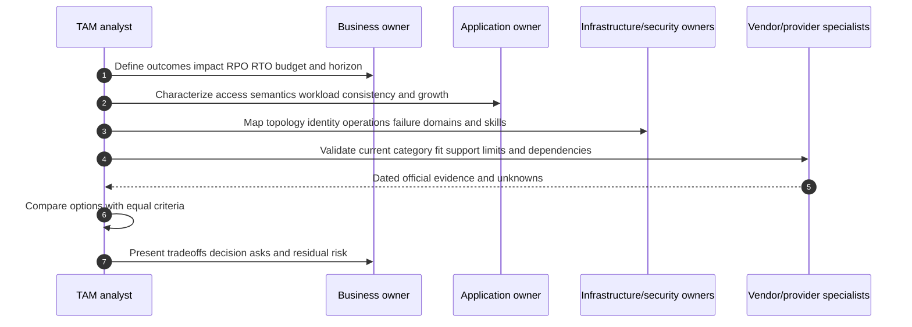

### Question bank for discovery

| Area | Competitor-neutral questions |
|---|---|
| Outcome | Which user transaction or business process must improve, and how is success measured? |
| Access | Does the application require shared files, host-owned blocks, object APIs, or a certified combination? |
| Workload | What are operation sizes/mix, metadata, concurrency, latency percentiles, throughput, active set, bursts, and growth? |
| Data | How much is written logical/physical, how fast does it change, and what retention/classification/residency applies? |
| Availability | Which component/site/provider/admin/cyber failures must be tolerated, and what interruption is acceptable? |
| Recovery | What RPO/RTO applies, which copies exist, and when did a user transaction last recover successfully? |
| Security | Which identities, keys, network controls, audit, immutability, privacy, and separation-of-duty rules apply? |
| Operations | Who operates hardware/software/cloud service, upgrades it, monitors it, and handles 03:00 failures? |
| Integration | Which OS, hypervisor, database, Kubernetes, backup, switch, adapter, driver, firmware, and application versions exist? |
| Cloud | Which region/zone, network, IAM, provider service, egress, quota, and shared responsibility constraints apply? |
| Economics | What is the complete cost horizon, including people, support, facilities, licenses, network, copies, migration, and exit? |
| Decision | Which criteria are mandatory, weighted, uncertain, or subject to customer risk acceptance? |

### Customer evidence request

- Business-service and application map with criticality, SLI/SLO, RPO/RTO, owners, and change dates.
- Inventory of current storage systems/services, releases, identifiers, sites/regions, protocols, capacity, and lifecycle.
- Workload measurements with units, percentiles, intervals, seasonality, growth, and data-quality notes.
- Network/fabric, identity, security, management, protection, backup, and disaster-recovery topology.
- Current support cases, incidents, recurring patterns, planned projects, budget/procurement lead time, and skills.
- Authorized IMT/HWU and current official product/service results with date, scope, notes, and access gaps.

---

## 12. Evidence, scoring, and recommendation quality

A category shortlist is a hypothesis. It becomes a recommendation only after current validation and representative testing.

```mermaid
flowchart LR
    RAW[Customer requirements and measurements] --> QUALITY[Validate identity scope units freshness completeness]
    QUALITY --> MUST[Mandatory criteria and disqualifiers]
    MUST --> SCORE[Weighted option comparison]
    SCORE --> OFFICIAL[Current docs IMT HWU provider and lifecycle checks]
    OFFICIAL --> TEST[Workload failure protection security and operations test]
    TEST --> REC[Evidence-based recommendation]
    REC --> OWNER[Owner date decision and implementation plan]
    OWNER --> PROOF[Outcome validation and residual risk]
```

### Illustrative scorecard

This scorecard is educational, not a NetApp method. Weights and scores must be customer-approved, and a mandatory failure cannot be averaged away.

| Criterion | Weight | Evidence required | Disqualifier example |
|---|---:|---|---|
| Application/protocol support | 20 | Current app/vendor and storage support evidence | Required protocol or certified architecture absent |
| Performance/workload fit | 15 | Representative distribution and validated sizing/test | Tail-latency or throughput objective not met |
| Availability/recovery | 15 | Failure-domain design and timed restore/failover | Required RPO/RTO not demonstrable |
| Security/compliance | 15 | Identity, encryption, keys, audit, residency, retention | Mandatory control unavailable |
| Operations/skills | 10 | RACI, monitoring, upgrades, support, automation | No sustainable owner/support path |
| Lifecycle/supportability | 10 | Current release, IMT, HWU, provider and lifecycle record | Unsupported combination or horizon |
| Capacity/growth | 8 | Low/base/high forecast and protection overhead | Action lead time exceeds threshold horizon |
| Economics | 7 | Complete comparable cost model | Budget or commercial term not viable |

### Recommendation template

> **Evidence:** [dated workload, topology, support, and customer evidence]. **Context:** [business outcome, protocol, ownership, horizon, and constraints]. **Finding:** [why a category fits or fails]. **Risk:** [impact, likelihood/time horizon, confidence]. **Options:** [at least two feasible choices and tradeoffs]. **Recommendation:** [specific category and next validation, not an unsupported model]. **Owner/date:** [decision and action owners]. **Validation:** [official checks, pilot, failure/recovery test, and outcome]. **Residual risk:** [what supportability and testing cannot eliminate].

---

## 13. Support boundaries and responsibility models

### Plain-English deep-dive: one customer outcome, several accountable layers

Buying one service does not move every responsibility to one provider. It is like renting an apartment: the provider may own the building structure, while the tenant still owns access, contents, behavior, and application safety. The exact lease defines the boundary.

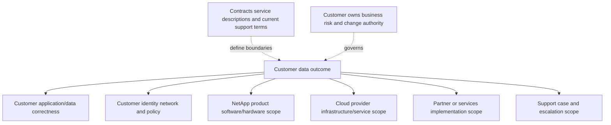

| Situation | Primary owner/path | TAM analyst contribution | Boundary |
|---|---|---|---|
| Physical ONTAP hardware fault | Customer operations plus NetApp Support under entitlement | Organize identity, topology, impact, telemetry, action visibility | Do not direct unsupported FRU changes or claim replacement authority |
| CVO cloud-resource issue | Customer cloud/ONTAP owners, NetApp support, cloud provider by layer | Separate ONTAP, cloud compute/storage/network/IAM evidence | Do not blame one provider before isolating boundary |
| First-party service disruption | Customer cloud owner and cloud-provider support | Preserve application/network/service evidence and account context | Customer-facing support route follows provider service model |
| StorageGRID object error | Application/object, network, identity, and StorageGRID owners | Correlate S3 request, endpoint, policy, grid/service evidence | Do not apply ONTAP commands or assumptions |
| E-Series block path issue | Host/fabric/target/E-Series owners | Build block/fabric/SANtricity evidence chain | Do not treat it as ONTAP/ASA behavior |
| Product selection/design | Customer decision authority, account/architecture/services roles | Build neutral requirements, gaps, evidence, options, and risks | Technical analyst should not invent sizing, pricing, or contractual promises |

---

## 14. Common selection failures and troubleshooting implications

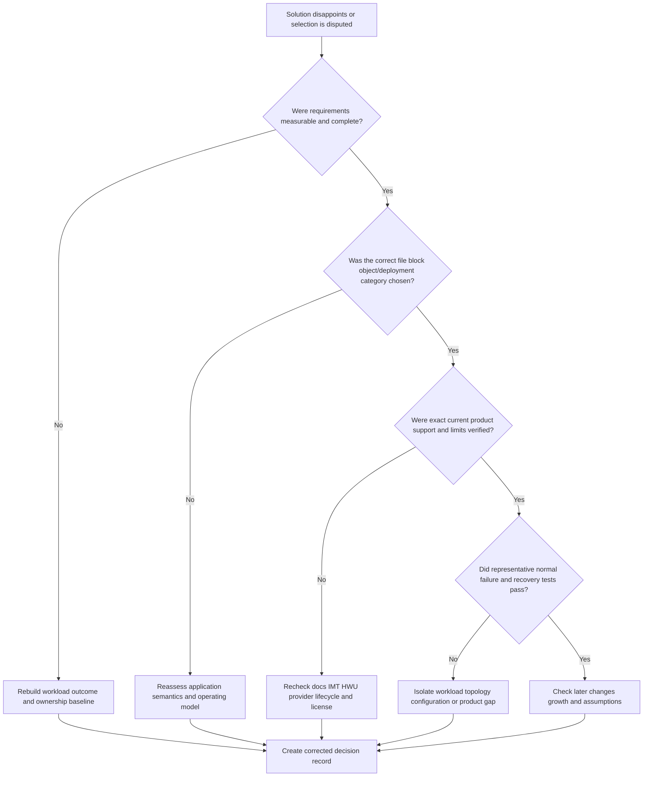

| Failure or misconception | Why it fails | Better behavior |
|---|---|---|
| `All NetApp storage is ONTAP` | StorageGRID and E-Series have different foundations and semantics | Name the family, OS/data plane, and management model |
| `All-flash means choose AFF` | ASA can be the SAN-focused candidate; workload and operating model decide | Start with protocol, ownership, services, and support |
| `ASA is AFF with features turned off` | Current ASA families can have distinct management/data models | Use exact current ASA documentation and migration guidance |
| `FAS is the cheap/slow option` | Media and workload behavior are not captured by a slogan | Measure workload, capacity, latency, protection, and economics |
| `StorageGRID is a backup box` | It is an object platform whose use depends on application/protection architecture | Define S3 workload, placement, retention, and recovery |
| `E-Series is an ONTAP SAN` | It uses SANtricity and different operations/features | Route evidence and expertise to the correct family |
| `BlueXP is in every data path` | It is primarily management/data-service context; exact dependencies vary | Separate control/management and data planes |
| `Cloud Volumes ONTAP equals on-premises AFF` | Cloud resources and shared responsibilities differ | Validate CVO-specific architecture, limits, HA, cost, and support |
| `First-party service gives full ONTAP access` | Provider exposes a service-specific interface and feature set | Follow provider documentation and support boundary |
| `Latest model is best` | Application support, lifecycle horizon, risk, skills, and cost decide | Compare current supported candidates using agreed criteria |
| `Supported means guaranteed` | Supportability does not eliminate defects, misconfiguration, or workload limits | Add health checks, tests, rollback, monitoring, and residual risk |
| `One benchmark selects the platform` | Benchmark may not represent workload, failure, protection, or growth | Test representative normal, peak, degraded, and recovery behavior |

### Common failure symptoms after a category mismatch

| Symptom | Category-level question | Evidence needed |
|---|---|---|
| Application cannot use object service | Did it require POSIX/file or block semantics? | Application storage API/certification and request trace |
| Cloud bill exceeds expectation | Were operations, egress, copies, tiering recalls, and growth included? | Provider billing dimensions and workload events |
| Managed service lacks expected ONTAP feature | Was feature parity assumed? | Current provider feature/tier/region documentation |
| SAN host cannot see storage | Was exact host/fabric/MPIO combination supported and mapped? | IMT, host/fabric/target evidence |
| Performance misses under protection/failure | Was degraded mode and background work tested? | Workload percentiles, topology, failure state, protection activity |
| Operations team cannot execute change | Did selection ignore skills, access, automation, and responsibility? | RACI, runbook, service scope, training, test evidence |

---

## JD Mapping

| Job responsibility or requirement | How Part 19 prepares the candidate | Evidence and honesty boundary |
|---|---|---|
| Understand the customer's environment | Starts with workload semantics, protocols, deployment locations, protection needs, operating model, and business constraints before selecting a product category | You can transfer dependency mapping from enterprise support; current NetApp estate discovery remains a learned method rather than claimed production work |
| Apply NetApp knowledge to improve support experience | Provides a portfolio map that routes questions and evidence toward the relevant platform, service, owner, and specialist | Category-level understanding must be followed by current product documentation and authorized customer evidence |
| Provide strategic planning and best practices | Teaches requirement-led selection, options, tradeoffs, lifecycle questions, and a phased recommendation structure | It does not substitute for sizing, architecture review, IMT, Hardware Universe, licensing, or account-specific validation |
| Understand supportability and risk parameters | Separates workload fit from exact configuration support and requires current documentation, IMT, Hardware Universe, entitlement, and specialist review where applicable | No platform, release, limit, or compatibility fact is inferred from portfolio marketing language |
| Generate and represent customer recommendations | Converts discovery evidence into a decision matrix, recommendation, owner, validation test, and residual risk | All scorecards and decisions in this Part are synthetic learning artifacts |
| Conduct customer-facing service reviews | Provides concise portfolio language for explaining why different workloads may require different solution categories | The lead TAM and account team remain responsible for the integrated customer narrative and commercial context |
| Participate in cross-functional work and SME teams | Identifies when to involve application, network, cloud, security, platform, Support, Product, Engineering, partner, and commercial specialists | The Technical Analyst coordinates evidence and questions without claiming authority owned by another role |
| Learn new technologies and develop specialization | Establishes the map needed to choose deeper study in ONTAP, object, block, cloud, protection, performance, or automation | Conceptual mastery is labeled separately from labs and production experience |

## 15. Fully synthetic scenario: Meridian Bioanalytics

> **Synthetic case:** Meridian Bioanalytics, every workload, site, score, price concern, and decision below are fictional. The exercise does not represent NetApp sizing, a customer design, an internal sales process, or your production experience.

### Requirements

Meridian has four data jobs:

1. A transactional laboratory database requiring supported block storage and low tail latency.
2. A shared research tree used over NFS and SMB by Linux and Windows teams.
3. A rapidly growing sequencing archive accessed through S3 APIs.
4. An Azure-native analytics service needing a managed high-performance file service with limited infrastructure staffing.

The organization also wants hybrid data mobility, ransomware resilience, quarterly service reviews, and a five-year planning horizon. Exact capacity and performance figures are intentionally omitted because the exercise is category selection, not sizing.

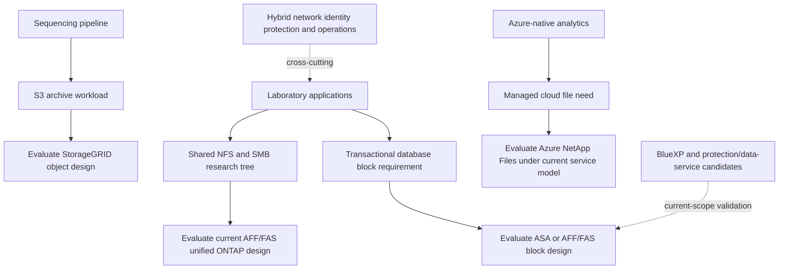

### Why one product should not be forced across all jobs

| Data job | Leading category hypothesis | Key disconfirming evidence |
|---|---|---|
| Database | Current ASA or another supported ONTAP/E-Series block design | Application certification, host/fabric support, tail latency, resilience, operating model |
| Shared research | Current unified ONTAP AFF/FAS design | Multiprotocol identity conflict, namespace scale, workload test, protocol support |
| S3 archive | StorageGRID | Application S3 compatibility, object pattern, placement/recovery, lifecycle, economics |
| Azure analytics | Azure NetApp Files | Required region/tier/protocol/quota absent, network/IAM issue, cost, provider support boundary |

### Decision workflow

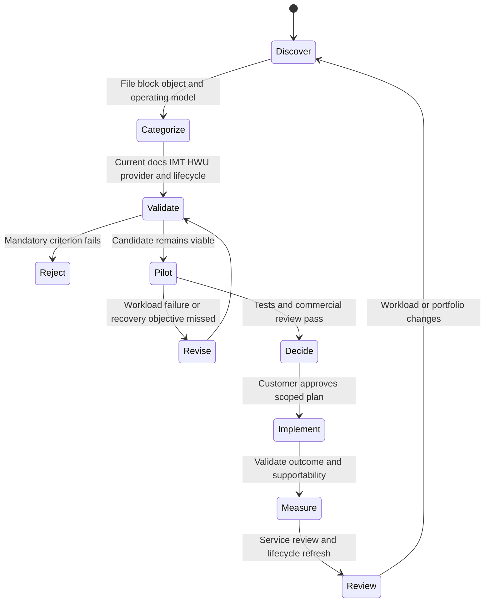

### Candidate risks and recommendations

| Priority | Evidence-bound finding | Risk | Recommendation | Owner/validation | Residual risk |
|---:|---|---|---|---|---|
| 1 | Database host/application requirements are incomplete | Wrong block family or host design can fail support/performance | Complete application, host, fabric, MPIO, workload, RPO/RTO, IMT and sizing validation before product choice | Database/architecture owners; approved exact solution and representative failure test | A supported design can still meet an unknown workload poorly |
| 2 | Research users need both Windows and Linux access | Identity and permission semantics can conflict even on a unified platform | Design/test multiprotocol identity, namespace, permissions, locks, positive/negative access, backup/restore | Identity/file-service owners; user and application tests | Future identity or client changes can regress access |
| 3 | Archive is described only by total bytes | Request/object/retention/placement design is unknown | Characterize S3 object distribution, operation rate, key/listing, lifecycle, sites, protection, retrieval and cost | Application/object owners; workload and recovery pilot | Data growth and access pattern can change |
| 4 | Azure team wants `zero operations` | Customer still owns network, IAM, data, service configuration, cost, and application | Document Azure NetApp Files shared responsibility, region/tier/protocol/quota and support route | Cloud owner; provider documentation and operational rehearsal | Provider service incidents and customer configuration risk remain |
| 5 | Team expects one BlueXP dashboard to prove all health | Products/services have distinct data planes and evidence | Define which current BlueXP services cover which resources and retain native/provider evidence | Operations owner; access/dependency test and evidence map | Management data can be stale or unavailable |

### Executive summary

> "Meridian has four different data contracts: transactional blocks, shared files, S3 objects, and a managed Azure file service. We should not force one product label across them. The next decision is category validation: exact application and protocol support, current product/service availability, host/fabric and cloud dependencies, tested performance and recovery, operating ownership, and full cost. The likely shortlist uses ONTAP-based systems for eligible block/file needs, StorageGRID for the object workload, and Azure NetApp Files for the managed Azure need, but no model or final design is supportable until the dated checks and pilots pass."

### What the case proves

It proves a method: separate data jobs, compare categories neutrally, verify current sources, test, and preserve responsibility boundaries. It does not prove that any named product meets Meridian's unspecified capacity, performance, security, budget, or regional requirements.

---

## 16. Your support, Azure, networking, and analytics bridge

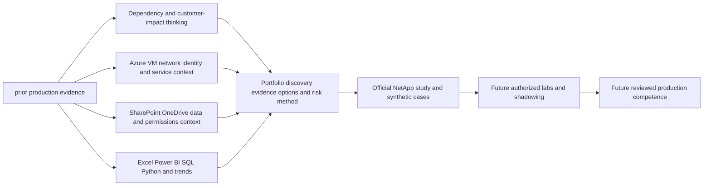

| Factual background | Natural advantage | Explicit gap |
|---|---|---|
| enterprise support and critical-situation ownership | Scope impact, organize evidence, coordinate owners, communicate uncertainty | No NetApp platform incident ownership |
| Azure, virtual machines, and networking | Understand cloud responsibility, routes, identity, regions, and service dependencies | No CVO or first-party NetApp cloud service deployment experience |
| SharePoint and OneDrive | Understand user-facing data service, permissions, sync, recovery expectations | Not equivalent to ONTAP NAS, StorageGRID, or block storage administration |
| Analytics, Excel, Power BI, SQL, Python, MBA | Build scorecards, forecasts, evidence quality, option tradeoffs, executive story | No NetApp sizing or proprietary-tool result may be claimed |
| Product/Engineering collaboration | Build exact, reproducible escalation asks | No internal NetApp process, bug system, or engineering access claim |

### Honest interview language

> "I can map the NetApp portfolio and explain how I would select a category from workload semantics, deployment, protection, security, operations, supportability, and economics. My production evidence is enterprise support, Azure/networking, data-service troubleshooting, analytics, and customer communication. I have not selected or operated NetApp products in production. I would therefore validate exact current product generations, features, limits, licenses, regions, IMT/HWU results, and provider responsibilities with authorized sources and experienced NetApp specialists before making a customer commitment."

---

## 17. Whiteboard drills

1. **Portfolio in two minutes:** Draw ONTAP families, StorageGRID, E-Series, BlueXP, CVO, and first-party cloud services without implying parity.
2. **AFF/ASA/FAS:** Explain broad position, then state five facts that require current product validation.
3. **Object versus unified:** Explain why StorageGRID is not an ONTAP volume and why FabricPool does not merge product identities.
4. **Dedicated block:** Explain why E-Series/SANtricity and ASA/ONTAP are separate candidates.
5. **Cloud boundary:** Draw CVO and a first-party cloud service with different operating responsibilities.
6. **BlueXP:** Separate management/control dependencies from application data paths.
7. **Selection:** Use all eight dimensions for one application without naming a product until the end.
8. **Honesty:** Deliver your strengths and production gap in 45 seconds.

---

## 18. Paper lab: create a portfolio recommendation pack

No product access is required. Use synthetic data and current public documentation only.

### Scenario

A fictional manufacturer has a VMware estate, Windows engineering shares, Linux analytics, an Oracle-like database requiring certified block access, 3 PB of S3-oriented media archive, an AWS disaster-recovery initiative, an Azure analytics project, limited storage staff, and a three-year refresh horizon. Capacity values are synthetic and do not constitute sizing inputs.

### Tasks

1. Split the environment into business services and independent data jobs.
2. Build workload fingerprints for file, block, object, virtualization, protection, and cloud flows.
3. Draw current and desired topology, failure domains, identity, network, management, and protection.
4. Shortlist at least two categories for each data job, including a non-NetApp/status-quo option where reasonable.
5. Create mandatory/disqualifying criteria before scoring.
6. Build an eight-dimension weighted comparison and explain every weight.
7. Record every product, release, region, protocol, license, limit, and support unknown.
8. Define IMT, HWU, cloud-provider, application-vendor, and current documentation checks.
9. Design representative normal, peak, path/node/site failure, restore, upgrade, and security tests.
10. Create a shared-responsibility and support-route matrix.
11. Build low/base/high cost and growth scenarios without invented pricing.
12. Write evidence, finding, risk, options, recommendation, owner/date, validation, and residual risk.
13. Produce a two-minute executive summary and ten-minute technical defense.
14. Label every statement as production background, synthetic exercise, conceptual understanding, or access-gated validation.

### Lab flow

```mermaid
flowchart LR
    JOBS[Separate data jobs] --> FP[Build workload fingerprints]
    FP --> CATS[Shortlist categories]
    CATS --> GATES[Apply mandatory gates]
    GATES --> SCORE[Score qualified options]
    SCORE --> SOURCES[Verify current public/gated sources]
    SOURCES --> TESTS[Design representative tests]
    TESTS --> REC[Write recommendation and responsibility map]
    REC --> PRESENT[Executive and technical presentation]
```

### Lab pass criteria

- [ ] File, block, and object semantics are never mixed.
- [ ] ONTAP, StorageGRID, and SANtricity foundations are distinguished.
- [ ] AFF, ASA, and FAS are positioned broadly without model specifications.
- [ ] CVO and first-party cloud services have different responsibility maps.
- [ ] BlueXP management context is separated from product data paths.
- [ ] Mandatory support/security/application criteria cannot be averaged away.
- [ ] Current IMT/HWU/provider/application evidence is listed with date and access status.
- [ ] Tests include failure, recovery, security, lifecycle, and operating skills.
- [ ] Recommendation remains competitor-neutral and evidence based.
- [ ] No synthetic result becomes a production-experience claim.

---

## 19. Self-test

1. Define product, platform, service, solution, portfolio taxonomy, control plane, and data plane.
2. Draw the portfolio map and identify which families are and are not ONTAP based.
3. Explain ONTAP's role without listing unsupported feature promises.
4. Compare physical ONTAP systems, software-defined ONTAP, CVO, and first-party cloud services.
5. Position AFF, ASA, and FAS and state why exact protocols/features require current verification.
6. Explain StorageGRID's object role and why it is not NAS or an ONTAP array.
7. Explain E-Series/SANtricity and why it is not ASA or ONTAP.
8. Explain BlueXP control/data-service context and its dependency questions.
9. Explain CVO's cloud infrastructure, IAM, network, HA, licensing, and cost dependencies.
10. Name current first-party cloud offerings involving NetApp technology and state the parity warning.
11. Apply all eight selection dimensions to a new workload.
12. Build competitor-neutral discovery questions and an evidence request.
13. Explain why current product pages, release docs, IMT, HWU, provider docs, and application guidance answer different questions.
14. Build a mandatory-gate and weighted-score model without hiding a disqualifier.
15. Write a complete recommendation with options and residual risk.
16. Map support boundaries for physical ONTAP, CVO, first-party service, StorageGRID, and E-Series.
17. Correct every misconception in Section 14.
18. Recreate Meridian's four data jobs, risks, and category hypotheses.
19. Complete all eight whiteboard drills and the paper lab.
20. Deliver your honest background-to-portfolio bridge without claiming production NetApp work.

---

## 20. Official Source Anchors

**Date checked: 2026-08-24.** These are current public official entry points for portfolio orientation. Pages, names, product generations, protocols, limits, licensing, regions, service tiers, availability, lifecycle, and support terms can change after the check date. For a real recommendation, re-open the exact current page and release documentation; validate the exact solution in IMT and HWU where applicable; use the cloud provider's current documentation; and record authentication/entitlement limits. Do not invent details from an inaccessible tool.

| Topic | Official public source | Bounded use and currency note |
|---|---|---|
| NetApp data-storage portfolio | [NetApp data storage](https://www.netapp.com/data-storage/) | Portfolio entry point only; select current family/model pages and lifecycle/support sources. |
| ONTAP concepts | [ONTAP concepts](https://docs.netapp.com/us-en/ontap/concepts/) | Broad architecture vocabulary. Select exact ONTAP release and offering. |
| AFF systems | [NetApp AFF](https://www.netapp.com/aff/) | Broad all-flash positioning; current subfamilies, models, protocols, features, and specifications require exact pages/HWU. |
| ASA systems | [NetApp ASA](https://www.netapp.com/asa/) | Broad all-flash SAN positioning; ASA generation and management/feature behavior are version-sensitive. |
| FAS systems | [NetApp FAS](https://www.netapp.com/fas/) | Broad hybrid-flash positioning; verify exact model, media, protocols, and lifecycle. |
| ONTAP hardware documentation | [ONTAP hardware systems](https://docs.netapp.com/us-en/ontap-systems/) | Installation/service entry point; use exact platform documentation. |
| StorageGRID | [NetApp StorageGRID](https://www.netapp.com/storagegrid/) | Broad object-storage positioning; exact architecture, APIs, appliances, limits, and lifecycle require current docs. |
| StorageGRID documentation | [StorageGRID documentation](https://docs.netapp.com/us-en/storagegrid/) | Select exact release for object, grid, protection, and operations behavior. |
| E-Series | [NetApp E-Series](https://www.netapp.com/e-series/) | Broad block-family positioning; exact SANtricity model, protocols, hosts, and specifications require current sources. |
| E-Series/SANtricity docs | [E-Series systems documentation](https://docs.netapp.com/us-en/e-series/) | Select exact system and SANtricity release. |
| BlueXP / NetApp Console | [NetApp Console documentation](https://docs.netapp.com/us-en/console-family/) | At the check date, the former BlueXP family entry resolves to the current NetApp Console documentation. Preserve historical-name awareness, but verify current service names, agents/connectors, entitlements, and scope. |
| Cloud Volumes ONTAP | [Cloud Volumes ONTAP documentation](https://docs.netapp.com/us-en/cloud-manager-cloud-volumes-ontap/) | Verify cloud provider, release, region, license, deployment mode, features, limits, and upgrade path. |
| Amazon FSx for NetApp ONTAP | [NetApp and Amazon FSx for NetApp ONTAP](https://www.netapp.com/aws/fsx-ontap/) | Broad joint-service context; AWS documentation/service terms govern current regions, tiers, quotas, APIs, SLA, and customer support path. |
| Azure NetApp Files | [Azure NetApp Files](https://www.netapp.com/azure/azure-netapp-files/) | Broad service context; Microsoft documentation/service terms govern current capabilities and support. |
| Google Cloud NetApp Volumes | [Google Cloud NetApp Volumes](https://www.netapp.com/google-cloud/google-cloud-netapp-volumes/) | Broad service context; Google Cloud documentation/service terms govern current capabilities and support. |
| NetApp Interoperability Matrix Tool | [NetApp IMT](https://imt.netapp.com/) | Official and potentially gated. Save exact solution, versions, result, notes, and date; an unlisted combination requires escalation. |
| Hardware Universe | [NetApp Hardware Universe](https://hwu.netapp.com/) | Official and potentially gated. Verify exact platform, components, ports, drives, shelves, limits, and rules on the decision date. |
| NetApp Support | [NetApp Support Site](https://mysupport.netapp.com/) | Official support/lifecycle/knowledge entry point; content, assets, cases, and entitlements can be gated. |

### Source-use discipline

- Record the exact product/service name, generation, release, region, tier, protocol, license/subscription, date, and source.
- Use IMT for supported end-to-end combinations and read every applicable note.
- Use HWU for exact hardware specifications, components, limits, and configuration rules.
- Use cloud-provider documentation for first-party service responsibility, SLA, quotas, APIs, maintenance, and support route.
- Treat a product page as positioning, not a design, sizing result, or contractual guarantee.
- Recheck lifecycle and support status immediately before recommendations or service reviews.
- If access is unavailable, label the item `not verified` and name the authorized owner/check; never fabricate a result.

---

## Likely Interview Questions

### Q1. How would you explain the NetApp portfolio to a customer in two minutes?

> **Model answer:** "I would start with the data job. ONTAP is NetApp's data-management foundation across current physical systems and selected software/cloud deployments. AFF is the broad all-flash unified category, ASA the all-flash SAN-focused category, and FAS the hybrid-flash category, with exact behavior verified by generation and release. StorageGRID is the dedicated object family, and E-Series is dedicated block storage using SANtricity rather than ONTAP. BlueXP provides management and data-service context for eligible resources. Cloud Volumes ONTAP is customer-operated ONTAP software on cloud infrastructure, while Amazon FSx for NetApp ONTAP, Azure NetApp Files, and Google Cloud NetApp Volumes are provider-operated first-party services with distinct feature and responsibility models."

**Follow-up depth:** Draw the portfolio map and name which products are ONTAP based, which are not, and which facts require IMT, HWU, provider, or release verification.

### Q2. What is the difference between AFF, ASA, and FAS?

> **Model answer:** "AFF is the broad all-flash ONTAP system category for unified data-management workloads. ASA is the all-flash SAN-focused ONTAP category with a block-oriented operating model whose exact generation behavior must be checked. FAS is the hybrid-flash ONTAP category for workloads where supported media, capacity, performance, and economics fit. I would not choose from those labels alone; I would validate protocol, application support, workload, HA/protection, operations, model/release, IMT, HWU, and lifecycle."

**Follow-up depth:** Explain why `all-flash` does not select AFF automatically and why current ASA behavior cannot be inferred from an older array.

### Q3. When would you consider StorageGRID or E-Series instead of an ONTAP system?

> **Model answer:** "I would consider StorageGRID when the application natively needs S3/object semantics and the object workload, placement, retention, security, scale, and recovery design fit. I would consider E-Series when a dedicated block/SANtricity operating model fits a supported host/application workload. Neither is a lesser ONTAP mode: StorageGRID owns an object architecture and E-Series uses SANtricity. The final choice still requires current product, host, network/fabric, protection, lifecycle, and test evidence."

**Follow-up depth:** Compare a 100-million-object archive, a database LUN workload, and a shared NFS tree without using capacity alone.

### Q4. What is BlueXP, and is it in the application data path?

> **Model answer:** "BlueXP is NetApp's management and data-service experience for eligible on-premises and cloud resources. Depending on the current service, it can discover, deploy, protect, move, classify, or govern data and systems. I would not assume application I/O traverses BlueXP. I separate control/management dependencies from each product's data path and verify the exact service, connector or agent, identity, network, data handling, entitlement, and outage behavior."

**Follow-up depth:** Draw BlueXP, connector, cloud identity, ONTAP/CVO resources, and application data paths, then explain what evidence an unavailable control plane can and cannot prove.

### Q5. How does Cloud Volumes ONTAP differ from a first-party cloud file service?

> **Model answer:** "Cloud Volumes ONTAP is ONTAP software deployed using supported resources in a customer's cloud environment, giving the customer more ONTAP-level control and more responsibility for cloud networking, identity, sizing, lifecycle, and operations. A first-party service such as Amazon FSx for NetApp ONTAP, Azure NetApp Files, or Google Cloud NetApp Volumes is sold and operated by the cloud provider through a service-specific interface. Features, upgrades, regions, quotas, service levels, and support routes differ, so shared technology does not imply parity."

**Follow-up depth:** Compare responsibility for upgrades, observability, availability design, IAM, networking, support, and cost.

### Q6. How would you select a NetApp solution without being product-biased?

> **Model answer:** "I would define the business outcome and mandatory criteria, characterize workload and file/block/object semantics, map deployment and failure domains, quantify performance/capacity and recovery, capture security and governance, assess operating skills and management, and compare full economics and lifecycle. I would shortlist categories, apply disqualifying gates, verify current product/provider/application documentation, IMT and HWU, then run representative normal, failure, recovery, and upgrade tests. The recommendation records alternatives and residual risk, not only the preferred product."

**Follow-up depth:** Build an eight-dimension scorecard and explain why a mandatory application or security failure cannot be averaged away.

### Q7. What evidence would you require before recommending a specific model or service?

> **Model answer:** "I would require a dated application-to-data map, workload distributions and growth, protocol/security requirements, failure and recovery objectives, physical/cloud topology, operating ownership, and complete host/network/fabric/protection inventory. I would verify the exact product generation, release, model/component limits in HWU, end-to-end support in IMT, cloud region/tier/quota/SLA and support route, licensing/subscription, lifecycle, and application certification. I would then require a representative pilot or validated sizing/design review."

**Follow-up depth:** Explain what product pages, release docs, IMT, HWU, provider docs, customer telemetry, and tests each prove and cannot prove.

### Q8. How does your prior background help with NetApp portfolio work, and what is your gap?

> **Model answer:** "My production strengths are enterprise support and critical-situation ownership, Azure and VM/network dependencies, SharePoint and OneDrive data-service and permission reasoning, analytics, and customer communication. Those skills help me discover requirements, separate control and data planes, compare shared responsibilities, validate evidence, and present tradeoffs. I have not selected or operated NetApp products in production, so I would call my portfolio knowledge conceptual and synthetic until I add authorized labs and reviewed work. Exact models, limits, licenses, regions, IMT/HWU results, and customer recommendations require current sources and NetApp specialists."

**Follow-up depth:** Give one factual Azure/M365 example, identify the transferable method, and list the NetApp-specific evidence it cannot supply.

---

## 30-Second Memory Hooks

- **Start with the data job:** Outcome -> workload -> semantics -> placement -> operations -> product.
- **ONTAP:** Data-management foundation, not a promise that every deployment has every feature.
- **AFF:** Broad all-flash ONTAP category.
- **ASA:** Broad all-flash SAN-focused ONTAP category; generation matters.
- **FAS:** Broad hybrid-flash ONTAP category; workload evidence beats labels.
- **StorageGRID:** S3/object family, not an ONTAP volume.
- **E-Series:** Dedicated block with SANtricity, not ONTAP.
- **BlueXP:** Management/data-service balcony; separate it from application data paths.
- **CVO:** Customer-operated ONTAP software using cloud resources.
- **First-party cloud service:** Provider-operated service with provider-specific features and support.
- **Shared technology is not parity:** Region, tier, API, protocol, limit, and responsibility differ.
- **IMT:** Exact end-to-end supported combination and notes.
- **HWU:** Exact hardware components, limits, and rules.
- **Supportable is not guaranteed:** Add health, test, rollback, monitoring, and residual risk.
- **Competitor-neutral discovery:** Ask questions that remain valid regardless of vendor.
- **Your bridge:** enterprise support, Azure, networking, and analytics transfer; NetApp production experience does not.

---

## Completion Checklist

- [ ] Define product, platform, service, solution, taxonomy, control plane, and data plane.
- [ ] Draw the complete portfolio and distinguish ONTAP, StorageGRID, E-Series, BlueXP, CVO, and first-party cloud services.
- [ ] Explain ONTAP's data-management role and deployment categories without feature parity claims.
- [ ] Position AFF, ASA, and FAS broadly and list every current verification required.
- [ ] Explain StorageGRID object semantics and E-Series/SANtricity block semantics.
- [ ] Separate BlueXP management/data services from product data planes.
- [ ] Map CVO cloud/IAM/network/license/HA/cost responsibilities.
- [ ] Compare CVO with Amazon FSx for NetApp ONTAP, Azure NetApp Files, and Google Cloud NetApp Volumes at a responsibility level.
- [ ] Apply workload, protocol, deployment, performance/capacity, protection, security, operations, and economics dimensions.
- [ ] Run competitor-neutral discovery and request customer evidence.
- [ ] Use mandatory gates and weighted scoring without hiding disqualifiers.
- [ ] Write an evidence-based recommendation with alternatives, owner/date, validation, and residual risk.
- [ ] Explain support boundaries across physical, cloud-software, managed-service, object, and block categories.
- [ ] Correct all common selection misconceptions and apply the troubleshooting tree.
- [ ] Recreate the Meridian scenario and explain why one product is not forced across every data job.
- [ ] Complete all whiteboard drills, the paper lab, self-test, and Q1-Q8 aloud.
- [ ] State your factual strengths and ONTAP/NetApp production gap precisely.
- [ ] Recheck current product/service pages, exact release documentation, IMT, HWU, lifecycle, licensing, cloud-provider sources, and application support before customer use.

---

*Next suggested section:* [Part 20 - ONTAP and WAFL Architecture from First Principles](Part-20-ontap-wafl-architecture.md)