# Part 20 - ONTAP and WAFL Architecture from First Principles

> **Section goal:** Understand how ONTAP turns file, block, and supported object requests into protected, consistent storage state through WAFL mappings, cache, nonvolatile write intent, consistency points, checksums, RAID, local tiers, volumes, snapshots, and clones. By the end, you should be able to trace reads, writes, failure recovery, and performance symptoms without inventing internal implementation details or claiming production ONTAP experience.

Covers index item **20** and maps directly to job-description responsibilities for storage depth, customer-environment analysis, stability and risk mitigation, supportability, performance/capacity reasoning, proactive recommendations, operational reviews, and escalation quality.

This Part explains architecture at a safe conceptual depth. Exact block sizes, in-memory structures, consistency-point triggers, nonvolatile-memory implementation, platform topology, checksums, RAID behavior, cache policy, counters, commands, limits, efficiencies, and recovery procedures vary by ONTAP release, hardware family, configuration, and workload. Verify the exact current release documentation, **Interoperability Matrix Tool (IMT)**, **Hardware Universe (HWU)**, release notes, and authorized system evidence before customer use.

> **No-production-NetApp boundary:** You do not claim production NetApp or ONTAP experience. All customers, workloads, counters, timelines, and recommendations below are synthetic. Your production strengths are enterprise support, Azure, virtual machines, Windows networking, Microsoft 365 data services, analytics, and escalation ownership. You do **not** claim production ONTAP, WAFL, NVRAM/NVMEM, RAID, Snapshot, FlexVol, or recovery administration experience.

---

## 1. ONTAP's job in the storage stack

**ONTAP** is NetApp's data-management operating environment for supported deployments. Historical material can use **Data ONTAP**; current customer work should use the current product and release name. ONTAP coordinates protocol services, storage virtualization, availability, protection, security, efficiency, monitoring, and administration.

### Plain-English deep-dive: operating system plus data manager

An ordinary operating system coordinates processors, memory, devices, users, and applications. ONTAP performs that kind of coordination for a storage platform while also managing persistent data abstractions and services. **Analogy:** It is both the city government and the land registry: it runs services now and preserves an authoritative map of where data belongs. **Why it matters:** A disk can be healthy while a protocol, namespace, volume, node, or cluster service is unhealthy; ONTAP joins those layers.

| Layer | ONTAP-oriented role | Customer question |
|---|---|---|
| Client/application | Issues NFS, SMB, SCSI, NVMe, or supported object operations | Which exact operation, identity, SLO, and consistency requirement exist? |
| Protocol service | Terminates and processes supported data protocol | Which version, session, mapping, policy, and interface handled it? |
| Storage virtual machine | Provides a logical data-service/tenant boundary | Which SVM owns protocol, namespace, LIF, volume, or LUN? |
| WAFL | Maps logical data and metadata to protected blocks | Which volume/object and consistency state are involved? |
| Local tier/aggregate | Supplies protected physical capacity | Which node owns it, which RAID groups/media participate, and what is its health? |
| Cluster/HA | Coordinates nodes, ownership, management, and supported failover | Which plane and failure domain changed? |

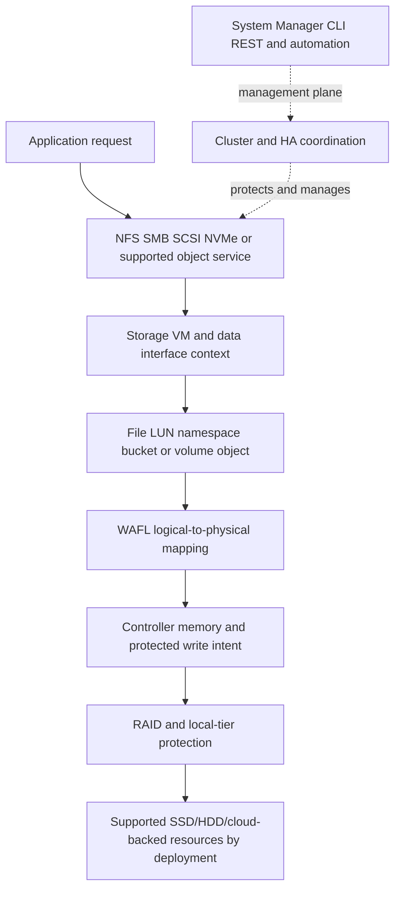

### Three planes

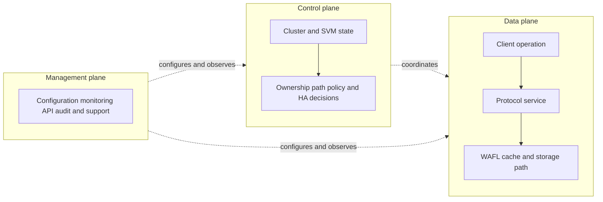

Management reachability is not proof that client I/O works. Client I/O continuing is not proof that management, replication, monitoring, or failover readiness is healthy.

---

## 2. WAFL: Write Anywhere File Layout

**WAFL** means **Write Anywhere File Layout**, the storage-layout technology associated with ONTAP. It represents data and metadata through logical mappings that can be updated by writing changed blocks to available locations and then publishing a new consistent mapping state.

### Plain-English deep-dive: edit a new map, then publish it

Imagine a city planner who never erases the only official map while editing. New or changed roads are drawn on fresh sheets; references are updated from the changed street upward; only after the complete map is coherent does the planner publish the new official index. Old sheets can remain referenced by a snapshot. **Why it matters:** this supports consistent updates, efficient point-in-time references, and flexible block placement, but it still requires correct ordering, protected write intent, capacity, checksums, RAID, and recovery.

### Safe conceptual vocabulary

| Term | Plain meaning | Analogy | Boundary |
|---|---|---|---|
| **Logical block** | Addressable unit in WAFL's logical view | Numbered paragraph in the official map | Exact size/type is implementation- and object-specific. |
| **Physical block** | Stored block location in protected capacity | Sheet location in the archive | Physical placement can change while logical identity remains. |
| **Inode** | Metadata object that represents a file-like object and points directly or indirectly to its data | Catalog card for a book | Exact ONTAP inode fields and layout are internal/version-sensitive. |
| **Indirect block** | Metadata block that points to other blocks | A table of contents pointing to chapter indexes | Tree depth and format depend on object size and implementation. |
| **Buffer tree** | Conceptual tree of cached/metadata references from an object root toward data blocks | Root map -> district map -> street map -> parcel | Use for reasoning, not memory-address or on-disk forensics without official tooling. |
| **Dirty buffer** | Cached data/metadata changed since the last durable consistent state | Edited map sheet not yet published | Dirty does not mean corrupt; it means persistence work remains. |
| **Root/reference switch** | Publication of a new coherent mapping root under WAFL's consistency process | Make the new index official | Atomicity and implementation details require current documentation. |

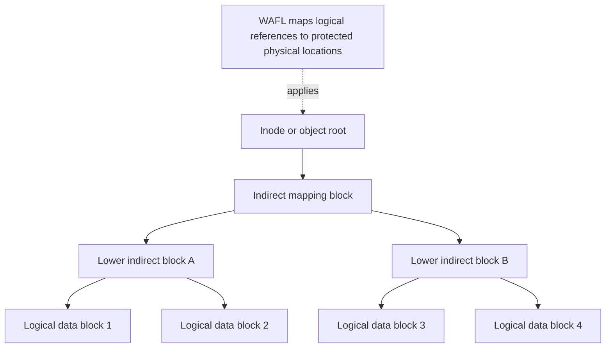

### Logical-to-physical mapping

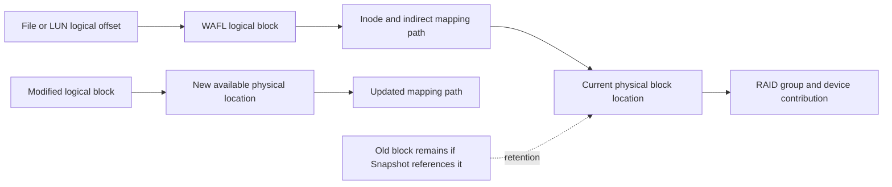

`Write anywhere` does not mean random, uncontrolled placement or that every write can land on any device. ONTAP chooses supported locations according to WAFL, RAID, local-tier, allocation, workload, and efficiency logic.

---

## 3. Local tiers, aggregates, FlexVol volumes, and objects

A **local tier** is the current ONTAP term commonly used for the storage pool historically called an **aggregate**. Existing commands, fields, documentation, and practitioners still use `aggregate`, so both terms must be recognized. A local tier contains protected physical capacity owned by a node and supplies blocks to higher logical containers.

A **FlexVol volume** is a flexible logical volume whose data and metadata are managed by WAFL and allocated from a local tier. Exact guarantees, size, autosize, efficiency, tiering, and limits are deferred to Parts 23 and 34.

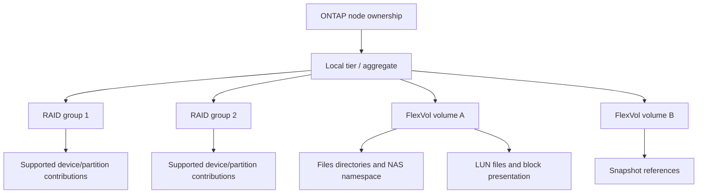

### Ownership and isolation cautions

| Claim | Required evidence |
|---|---|
| `The volume is full` | Volume logical/physical use, snapshots, metadata, guarantee, autosize, local-tier headroom, timestamp |
| `The aggregate is healthy` | Exact local tier, RAID groups, devices/partitions, node ownership, events, checks, capacity, degraded state |
| `One volume affects another` | Shared local tier/controller/CPU/cache/network/background-work mechanism and aligned counters |
| `Moving the volume fixes performance` | Supported move path, active bottleneck, target headroom, protection, application and before/after evidence |

Multiple volumes can share a local tier and node resources. That is not automatically a fault; it is a resource and failure-domain relationship to measure.

---

## 4. Read path from client to data

A read first passes protocol, identity, namespace/mapping, and WAFL logic. ONTAP checks whether the requested data is available in memory; on a cache miss it reads from protected storage, validates it under relevant integrity mechanisms, and returns it through the protocol.

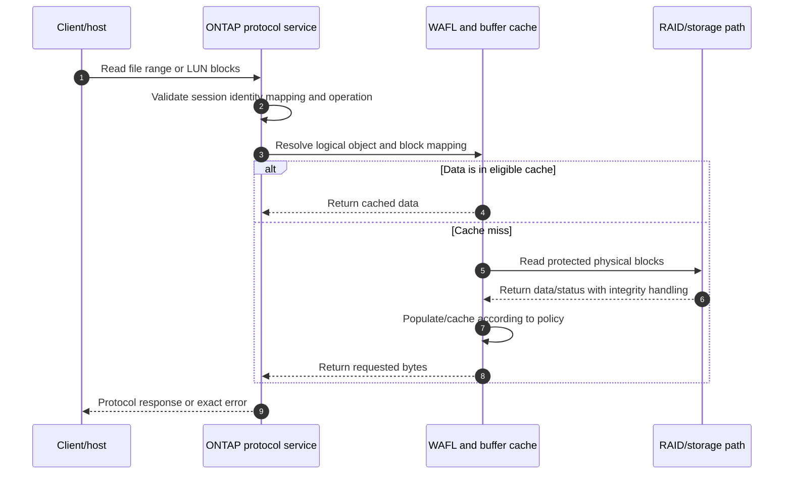

### Cache orientation

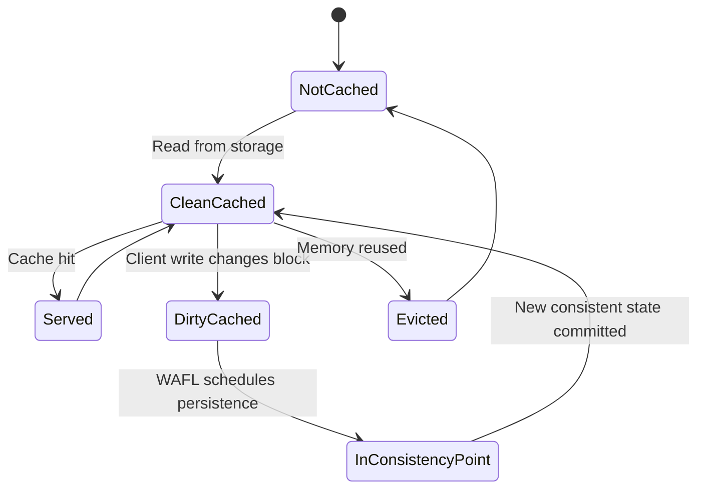

### What a cache hit can and cannot prove

A cache hit can support a short storage-service path for that request. It cannot prove that the client network is healthy, that every request hits cache, that media is healthy, that dirty data is durable, or that an application transaction is valid. Cache ratios need operation type, eligible population, working set, sample window, and latency distributions.

---

## 5. Write path and protected write intent

The exact acknowledgement contract depends on protocol and configuration. At architecture level, ONTAP receives a write, records enough write intent in protected nonvolatile controller memory, mirrors that intent to the HA partner where the supported HA design requires it, acknowledges according to the protocol's requested semantics, and later writes a coherent WAFL state during a consistency point.

### Plain-English deep-dive: receipt first, ledger publication later

At a bank counter, the clerk gives a receipt only after the transaction is written into a fire-resistant local log and a protected copy exists at the paired office under the bank's design. The bank later batches many receipts into the permanent ledger. The receipt log is not the final ledger, but it protects accepted work until publication. **Why it matters:** low write latency and durable consistency can coexist when the intent log, mirror, cache, consistency point, and recovery path all work as documented.

### NVRAM and NVMEM terminology

- **NVRAM** means nonvolatile random-access memory, a traditional ONTAP term for protected write-intent storage.
- **NVMEM** means nonvolatile memory and can appear in platform/current terminology.
- The exact hardware implementation, capacity, battery/capacitor behavior, partitioning, mirror transport, status, and platform name vary.
- The log protects uncommitted write intent; it is not an independent customer backup or complete replica of the active data set.

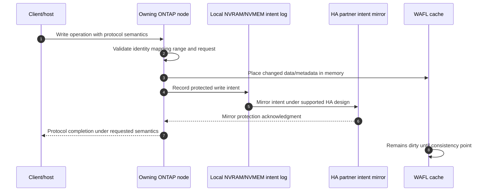

Do not turn the sequence into a universal packet-by-packet promise. Some operations, platforms, degraded states, or protocol durability requests can follow different boundaries. Verify the exact release and system state.

### HA intent protection

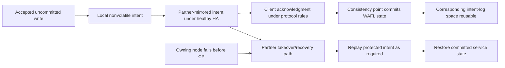

If the mirror or HA relationship is degraded, write behavior, protection, and support actions are platform/release specific. A TAM analyst should report the state and risk and use official support guidance, not guess whether writes are `safe enough`.

---

## 6. Consistency points

A **consistency point (CP)** is the WAFL process that writes a coherent set of changed data and metadata from memory to protected storage so the on-disk file-system state is consistent. It is not the same as a database checkpoint, an NFS COMMIT, an SMB persistent handle, or a customer backup.

### Conceptual CP sequence

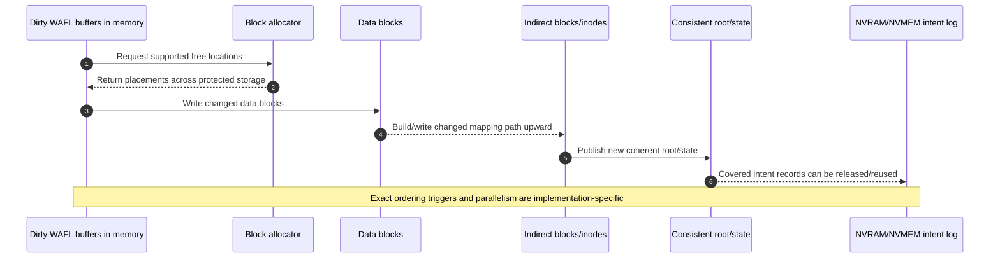

### CP state model

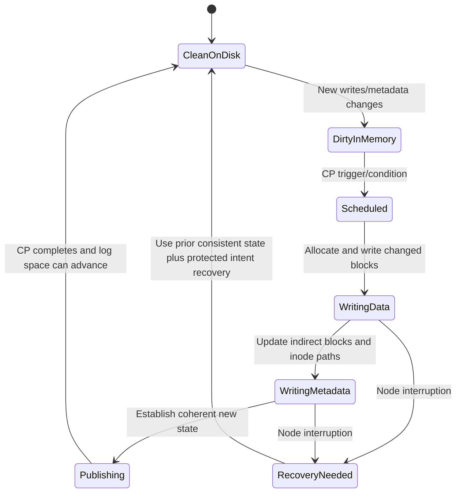

### Why CP behavior matters

- It converts dirty cached state into a consistent on-disk state.
- It frees protected intent-log capacity after covered work is safely represented.
- It batches and organizes writes, so physical work can differ from client request shape.
- Long or frequent CP activity can correlate with workload, capacity, media, metadata, snapshots, efficiency, or contention.
- A CP metric alone does not prove root cause; it must be correlated with client latency and resource/service evidence.

Exact trigger frequency, phases, thresholds, counter names, and tuning are release-sensitive. Never recommend forcing or tuning consistency points from a generic description.

---

## 7. Crash and takeover recovery

WAFL recovery begins from a previously consistent on-disk state and applies protected write intent that had been acknowledged but not yet included in the completed consistency state, under the platform's supported HA/recovery design.

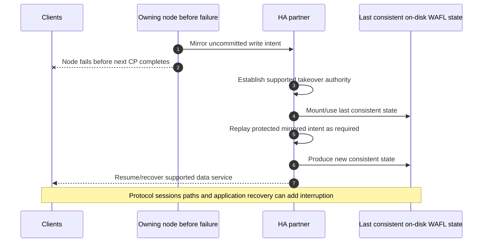

### Recovery does not prove application continuity

| Layer | Recovery question |
|---|---|
| WAFL | Is a consistent storage state restored with acknowledged intent handled? |
| HA/node | Did takeover establish correct authority and storage ownership? |
| Network/LIF | Can clients reach the serving node/interface path? |
| Protocol | Do NFS/SMB/SAN sessions, locks, handles, paths, and retries recover? |
| Application | Did the transaction resume or recover within its timeout and consistency rules? |
| Business | Did the measured service meet SLI/SLO, RPO, and RTO? |

A healthy WAFL recovery can coexist with an application timeout. Conversely, an application retry can hide a brief storage transition. Measure every layer.

---

## 8. Write-anywhere behavior, snapshots, and clones

When a logical block changes, WAFL can place the new version in an available block and update the mapping path. An older physical block can remain referenced by a Snapshot copy.

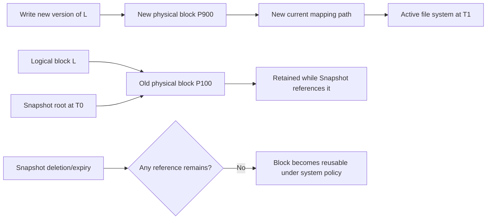

### Snapshot orientation

An ONTAP **Snapshot copy** is a point-in-time reference to volume state using WAFL block sharing. It is normally space-efficient initially because unchanged blocks are shared. Physical use grows as active data changes and older blocks remain referenced. Exact naming, retention, reserve, lock, immutability, restore, replication, and application-consistency behavior is deferred to Parts 35 and 39.

### FlexClone orientation

A **FlexClone** is a space-efficient writable or read-only clone concept that can initially share unchanged blocks with a parent Snapshot/volume under supported behavior. Changed clone/parent blocks allocate separately. Dependencies, split operations, licenses, performance, protection, and lifecycle are version-sensitive.

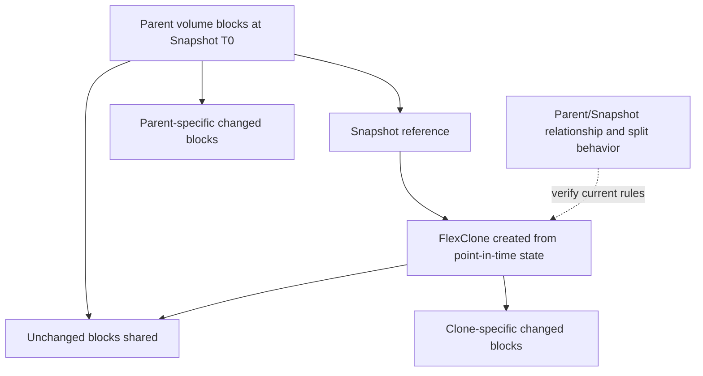

### Snapshot is not backup

A Snapshot can share the same cluster, local tier, credentials, site, and administration as active data. It can be a powerful recovery point, but independent backup, remote protection, retention, immutability, and tested recovery address different threats.

---

## 9. Checksums and RAID integration

ONTAP uses checksums and RAID protection as coordinated integrity/availability mechanisms. A checksum detects covered unexpected changes; RAID supplies redundant information or copies that can reconstruct data within its current tolerance. Exact checksum scope, placement, algorithms, correction behavior, and RAID layout vary by release/platform.

### Plain-English deep-dive: alarm plus spare source

A checksum is an alarm that says a package differs from its recorded fingerprint. RAID is the alternate set of packages or recovery clues that may reconstruct the damaged one. The alarm alone cannot repair; the alternate alone is less useful if corruption is not detected. **Why it matters:** integrity and redundancy are complementary, not interchangeable.

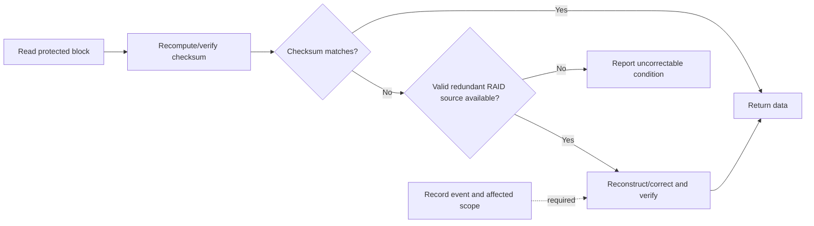

### Layered integrity boundaries

| Layer | Can validate | Cannot prove alone |
|---|---|---|
| WAFL/ONTAP checksum | Covered block integrity under exact implementation | Correct application record, authorization, or freshness |
| RAID | Recovery from specified member failures/errors | Protection from deletion, ransomware, site loss, or excessive failures |
| Protocol checksum/integrity | Covered transport/message corruption | On-disk correctness or application transaction validity |
| Application checksum/database validation | Application-level object/page correctness | Independent recoverability or underlying hardware health |

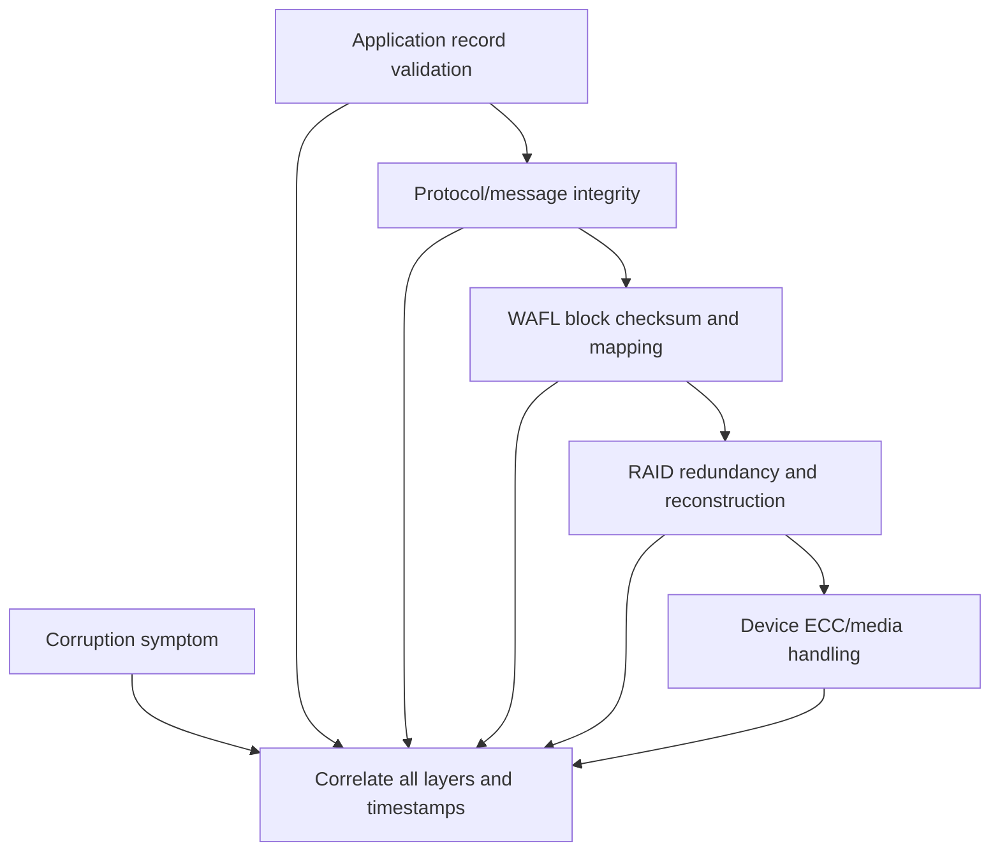

Do not say `checksums guarantee no corruption`. State scope, observed mismatch, alternate-copy result, affected object, customer impact, and residual risk.

---

## 10. Storage efficiency in the WAFL architecture

WAFL's logical mapping and block-sharing model supports ONTAP efficiency capabilities. Broad concepts include thin provisioning, deduplication, compression, compaction, clones, snapshots, and tiering through FabricPool where supported. Exact eligibility, ordering, inline/background behavior, guarantees, savings fields, CPU/latency effects, licensing, and feature interactions belong in Part 34.

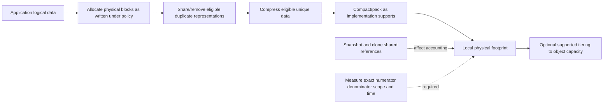

### Efficiency cautions

- A reported ratio must define logical numerator, physical denominator, snapshots, clones, metadata, zeros, thin unwritten space, and remote tiers.
- Savings vary with data content and change rate.
- Encrypted/compressed application data can reduce efficiency opportunity.
- Efficiency work can interact with CPU, memory, consistency points, capacity, and background operations.
- Higher savings do not prove better application performance or recoverability.

---

## 11. What telemetry can prove

### Evidence map

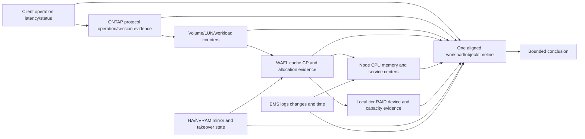

| Evidence | Can support | Cannot prove alone |
|---|---|---|
| Client operation latency | User/host-observed response for scoped operations | Which ONTAP subsystem caused delay |
| Protocol operation latency/status | Server processing observation for named service/object | Media root cause or application transaction outcome |
| Cache hit ratio | Share of eligible requests served from cache | Every read is fast or more cache is the answer |
| CP duration/frequency | WAFL consistency activity over interval | That CP is root cause rather than response to workload/capacity/media |
| NVRAM/NVMEM mirror status | Current intent-protection state under reported scope | Independent backup or zero data-loss guarantee |
| Volume/local-tier latency | Work observed at that object/resource | Exact client/file/LUN cause without mapping |
| Disk/SSD busy/error | Device/resource activity or error | Application impact without RAID/mapping/context |
| CPU average | Node CPU consumption over sample | No saturated core/service or software contention |
| Snapshot use | Retained blocks under reporting rules | Application consistency or recoverability |

### Evidence quality checklist

1. Exact cluster, node, SVM, volume/LUN, local tier, client, protocol, and workload identity.
2. ONTAP/platform release and relevant configuration.
3. Raw timestamps, timezone, clock source, interval, and counter reset/rollover.
4. Counter definition, units, average/percentile/cumulative scope, and sample count.
5. Baseline and workload/change/protection/rebuild/upgrade context.
6. Competing application, host, network, protocol, controller, WAFL, RAID, and media hypotheses.

---

## 12. Troubleshooting reads, writes, CP pressure, and recovery

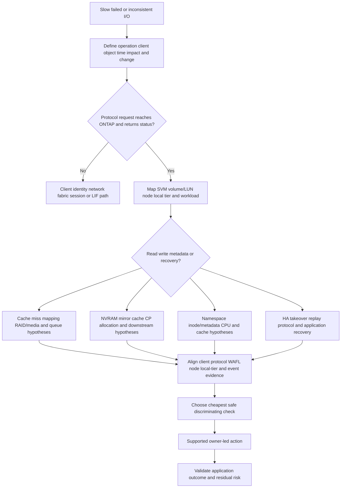

### Common failures and misconceptions

| Claim or symptom | Why it is unsafe | Better analysis |
|---|---|---|
| `WAFL writes randomly` | Write-anywhere is controlled allocation and mapping | Explain new-block placement plus tree/root update and RAID |
| `NVRAM contains all data` | It protects uncommitted write intent, not the full data set | Separate intent log, cache, consistent disk state, snapshot, and backup |
| `Client ACK means CP completed` | Acknowledgment can rely on protected intent before later CP | Trace protocol semantics, intent protection, CP, and application commit |
| `CP is always a background task` | CP is central to making WAFL state consistent and can interact with foreground workload | Measure CP/resource/client correlation and trigger context |
| `Snapshot is a full copy` | It shares unchanged blocks initially | Track changed-block retention and dependencies |
| `Snapshot consumes no space` | Changed old blocks remain referenced | Measure retention/change rate and local-tier headroom |
| `Checksum mismatch means data loss` | RAID or another source may correct it | Capture affected block/object, correction status, and application validation |
| `No disk errors means storage is healthy` | CPU, cache, protocol, capacity, metadata, paths, and software can fail | Use full evidence map |
| `High CPU means ONTAP bottleneck` | Demand can drive CPU and another resource can constrain output | Show throughput/queue/service mechanism and per-workload scope |
| `Efficiency ratio creates capacity` | It reduces physical representation under conditions | Forecast conservative physical use and headroom |
| `Takeover means zero interruption` | Protocol, network, path, replay, and application recovery take time | Measure the end-to-end transaction |
| `Aggregate and volume are the same` | Local tier supplies blocks; FlexVol is a logical container | Map object -> volume -> local tier -> RAID -> media |

### Safe recommendation patterns

| Evidence-backed finding | Risk | Bounded recommendation | Validation |
|---|---|---|---|
| CP duration correlates with writes and local-tier latency | Tail latency may rise; cause still uncertain | Segment workload, capacity, device, RAID, CPU/cache, efficiency and CP evidence; engage ONTAP SME | Mechanism reproduced/disconfirmed and app percentile measured |
| NVRAM mirror path degraded | Accepted-write protection/failover posture may differ | Preserve state/events; follow current Support procedure; avoid independent failover tests | Healthy mirrored state and approved HA test |
| Snapshot retention drives local-tier pressure | Writes/CP/operations can face reduced headroom | Review change rate and recovery policy; alter only with protection owner | Physical use falls and restore objective remains met |
| Read latency rises after working-set growth | Cache misses and lower-tier demand may increase | Measure hit/miss populations and active set; compare supported capacity/performance options | Client p99 and lower-path load improve without new risk |
| Checksum correction events recur | Integrity margin or component/path issue may exist | Preserve exact events/object/device/topology; follow Support diagnosis | Corrective action, scrub/health result, no recurrence over agreed period |

---

## 13. TAM discovery and evidence request

### Discovery questions

#### Business and application

1. Which application transaction, data object, users, criticality, SLO, RPO/RTO, and change window are in scope?
2. Is the operation file, block, supported object, metadata, snapshot, clone, replication, or recovery?
3. What does the application call saved/committed, and which consistency group exists?

#### ONTAP and topology

4. Which cluster, nodes/HA pair, SVM, LIFs, protocol, volumes/LUNs, local tiers, RAID groups, media, and protection relationships are involved?
5. Which node owns the local tier and which node currently serves each data interface/operation?
6. What ONTAP release, platform, licenses, current health, and recent upgrade/change apply?

#### Workload and capacity

7. What are operation mix, sizes, metadata rate, concurrency, latency percentiles, throughput, working set, cache behavior, burst, and growth?
8. What are volume/local-tier physical use, snapshots, clones, metadata, efficiency, guarantees/reserves, and headroom?
9. Which background operations, protection jobs, moves, tiering, scrubs, rebuilds, or upgrades overlap?

#### Integrity and recovery

10. What is NVRAM/NVMEM mirror and HA state, and which takeover/giveback events occurred?
11. Which CP, checksum, RAID, device, and EMS events align with impact?
12. Which snapshot/backup/replica recovered the application, and what did the test prove?

#### Supportability and action

13. Which exact IMT/HWU/release documentation and Support evidence applies?
14. What current command/API fields and counters are documented for this release?
15. Who owns application, host/network, ONTAP, protection, change, and business-risk decisions?

### Evidence request

- Dated application-to-protocol-to-SVM/LIF-to-volume/LUN-to-local-tier/RAID topology.
- Exact cluster/node/platform/ONTAP version and current health/supportability record.
- Read-only protocol, workload, cache, CP, node, local-tier, RAID/device, NVRAM/HA, capacity, snapshot, and event evidence.
- Client/host/network/fabric evidence and application transaction IDs/timestamps.
- Change, protection, move, upgrade, failover, incident, and recovery timeline.
- Current official source/command definition, IMT/HWU evidence, access limitations, and Support case context.

### JD Mapping

| JD responsibility | Part 20 contribution | Your factual bridge and gap |
|---|---|---|
| Understand customer environments | Maps client operation through ONTAP/WAFL/RAID and owners | Microsoft dependency mapping transfers; ONTAP topology is unproven in production |
| Storage depth | Explains mappings, cache, write intent, CP, checksum, snapshots, local tiers, volumes | Structured conceptual knowledge; no WAFL administration claim |
| Analyze/report data | Defines counters, scope, timelines, baselines, and evidence limits | Excel/Power BI/SQL/statistics and support analytics transfer |
| Mitigate risk/stability | Identifies degraded intent protection, CP/capacity, integrity, and recovery risks | critical-situation prioritization transfers; exact action needs ONTAP Support/SMEs |
| Strategic recommendations | Connects workload, protection, efficiency, capacity, and lifecycle | Advisory method transfers; model/release behavior requires current validation |
| Improve support experience | Produces an exact object/topology/timeline/escalation pack | Product/Engineering evidence discipline transfers |
| Operational reviews | Turns telemetry into finding, owner, validation, residual risk | Business-review communication is a strength |

---

## 14. Fully synthetic scenario: Northwind Clinical Database

> **Synthetic case:** Northwind Clinical Database, all systems, counters, dates, and results below are fictional. The case is not a NetApp benchmark, internal support procedure, or record of your production ONTAP work.

### Environment

- A database host uses supported block access to a LUN in a FlexVol volume.
- The volume resides on a local tier owned by node A in an HA pair.
- Snapshot retention protects short-term recovery points; independent backup exists.
- A month-end batch doubles write concurrency.
- The customer reports database p99 commit latency, longer CP duration, and local-tier capacity growth.

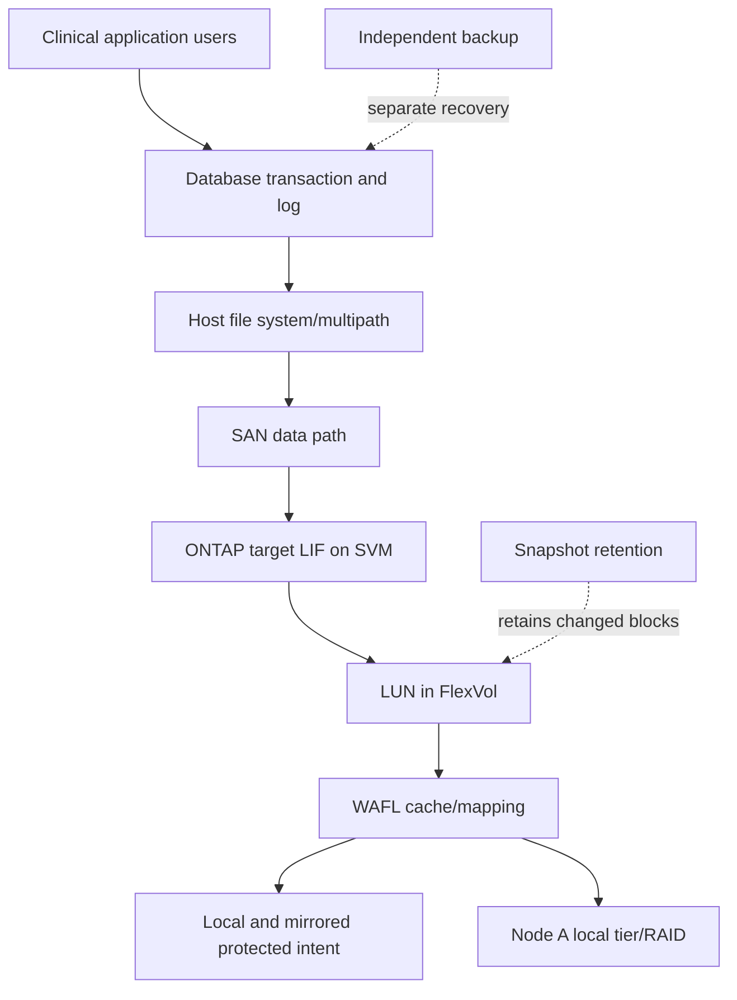

### Synthetic timeline

```mermaid
sequenceDiagram
    autonumber
    participant DB as Database telemetry
    participant H as Host/SAN
    participant O as ONTAP protocol/WAFL
    participant L as Local tier
    participant E as Events/change log
    DB->>DB: Batch concurrency doubles at 23:00
    H->>O: Write IOPS and outstanding work rise
    O->>O: Dirty buffers and CP work rise
    L->>O: Local-tier latency and capacity pressure increase
    E->>O: Snapshot schedule overlaps at 23:05
    O-->>DB: Host write p99 rises
    Note over DB,E: Correlation supports workload/capacity hypotheses, not one root cause yet
```

### Evidence

| Evidence | Observation | Bounded interpretation |
|---|---|---|
| Database | Commit p99 rises; p50 changes little | Tail-sensitive population is affected; storage cause not yet proved |
| Host | Write response and outstanding I/O rise | Delay exists below database, but host/path/target split remains |
| ONTAP protocol/LUN | Mapped LUN write workload and latency rise | Correct object is correlated |
| WAFL/CP | CP duration/frequency changes during batch | CP is participating; trigger/resource cause remains open |
| Local tier | Capacity is near customer action threshold; device latency rises | Headroom/media contention candidate |
| Snapshots | Retained physical blocks grew after a changed retention policy | Capacity driver candidate, not direct proof of latency |
| NVRAM/HA | Healthy reported mirror state; no takeover event | Weakens HA-degradation hypothesis for interval |
| Network/fabric | No loss/path transition in synchronized evidence | Weakens, but does not universally exclude, path issue |

### Competing hypotheses

1. Increased database concurrency creates queues throughout the path.
2. Local-tier capacity/fragmentation or media resource pressure lengthens CP/storage service.
3. Snapshot-retained changed blocks reduce headroom and increase allocation work.
4. Database checkpoint/log behavior changes independently and drives storage demand.
5. A hidden host/path queue issue contributes despite no fabric loss.

### Fault tree

```mermaid
flowchart TD
    TOP[Database p99 and CP/local-tier metrics rise] --> APP{Database demand changed first?}
    APP -->|Yes| DEM[Quantify transaction/log/checkpoint and concurrency]
    APP -->|Unknown| ALIGN[Align transaction host LUN WAFL and local-tier time]
    DEM --> STORAGE{Lower service time or only queue demand rises?}
    ALIGN --> STORAGE
    STORAGE -->|Local-tier service rises| CAP[Check capacity RAID/device efficiency snapshot and CP evidence]
    STORAGE -->|Host wait only| PATH[Check host MPIO queue CPU and fabric]
    STORAGE -->|Both| MIX[Model demand plus service interaction]
    CAP --> TEST[Controlled batch/snapshot/capacity comparison]
    PATH --> TEST
    MIX --> TEST
    TEST --> REC[Supported remediation and application validation]
```

### Recommendations

| Priority | Action | Owner | Validation | Residual risk |
|---:|---|---|---|---|
| 1 | Correlate one transaction/log write through database, host, SAN, LUN, WAFL, CP, and local-tier distributions | Database/performance/storage owners | Shared timeline and mechanism, not only matching averages | Instrumentation/sample windows can miss brief events |
| 2 | Reconcile local-tier and snapshot physical growth against approved headroom/action lead time | Capacity/protection owners | Reproducible capacity ladder and low/base/high forecast | Workload/retention can change |
| 3 | Run an authorized representative batch with snapshot overlap varied one factor at a time | Application/protection/storage owners | p99, CP, local-tier, and recovery policy results | Test may not reproduce month end |
| 4 | Do not alter CP, cache, RAID, Snapshot, or timeout behavior without current Support/release guidance | Change owner and NetApp specialist | Approved change, rollback limits, before/after outcome | A supported change can expose another bottleneck |
| 5 | Test independent backup recovery and preserve short-term snapshots according to business RPO until policy decision | Recovery owner | Database transaction restored within measured RPO/RTO | Test covers a bounded scenario |

### Customer-facing summary

> "The database write tail, host outstanding work, ONTAP LUN workload, consistency-point activity, and local-tier latency all rise in the same batch window. That establishes an end-to-end correlated path but not whether CP behavior is cause, effect, or both. Snapshot retention is a verified capacity driver and the local tier is near the customer's action threshold. We recommend one transaction-aligned analysis and a controlled overlap test before changing ONTAP behavior, while starting the capacity/protection decision now because lead time is already material."

---

## 15. Your prior/Azure/analytics bridge

```mermaid
flowchart LR
    M365[Microsoft 365 production support] --> MAP[Layered dependency and identity mapping]
    CRIT[Critical-situation ownership] --> TIME[Impact timeline evidence and safe restoration]
    AZ[Azure VM and networking foundation] --> PATH[Host network and shared-responsibility reasoning]
    BI[Analytics Excel Power BI SQL Python] --> METRIC[Counter QA distributions trends and correlation]
    MAP --> ONTAP[ONTAP/WAFL synthetic analysis method]
    TIME --> ONTAP
    PATH --> ONTAP
    METRIC --> ONTAP
    ONTAP --> LAB[Future authorized lab and SME-reviewed evidence]
```

### Transfer and gap table

| Demonstrated background | Transferable behavior | Unproven NetApp-specific area |
|---|---|---|
| SharePoint/OneDrive data-service support | Separate user operation, identity, network, service, metadata, and persistence expectations | WAFL mapping, CP, Snapshot, local-tier operations |
| Azure/VM/networking | Map host, path, cloud, control-plane, and failure dependencies | ONTAP cluster/data-path administration |
| Critical situation/Product collaboration | Preserve evidence, rank hypotheses, exact escalation ask, customer updates | NetApp internal tooling/process or WAFL debugging |
| Analytics/business reviews | Validate units, time windows, percentiles, trends, and decision story | Exact ONTAP counter semantics without current docs/access |

### Honest answer

> "I understand the ONTAP/WAFL architecture conceptually: logical mappings and buffer trees, protected NVRAM/NVMEM write intent, consistency points, checksums with RAID, local tiers, FlexVol volumes, snapshots, clones, reads, writes, and recovery. My production experience is enterprise support and analytics, not ONTAP operation. For a customer conclusion I would use the exact release's documented counters and behavior, authorized read-only evidence, IMT/HWU, and NetApp storage specialists, and I would label this paper case as synthetic."

---

## 16. Whiteboard drills

1. **Stack:** Client -> protocol -> SVM -> volume/LUN -> WAFL -> local tier -> RAID -> media.
2. **Buffer tree:** Inode/root -> indirect mappings -> logical data blocks -> current physical blocks.
3. **Read:** Cache hit versus miss and checksum/RAID path.
4. **Write:** Cache -> local intent -> HA mirror -> acknowledgment -> CP.
5. **CP:** Data blocks -> metadata path -> coherent state -> release intent-log space.
6. **Crash:** Last consistent state plus mirrored protected intent -> recovery.
7. **Snapshot:** Old block retained while current mapping points to new block.
8. **Evidence:** Explain what client, protocol, WAFL, node, local-tier, and device metrics each cannot prove.

---

## 17. Paper lab: reconstruct an ONTAP data path

No ONTAP access is required. Use synthetic evidence and official public documentation.

### Scenario

A fictional cluster has two nodes in an HA pair, two SVMs, four data interfaces, three local tiers, twelve FlexVol volumes, two SAN LUNs, NFS/SMB shares, hourly snapshots, asynchronous replication, and an independent backup. One workload reports slow writes during a capacity event and another reports stale reads after an application-cache change.

### Tasks

1. Draw cluster, node/HA, SVM, LIF, protocol, volume/LUN, local-tier/RAID, and media ownership.
2. Build conceptual inode/indirect/data mappings for one file and one LUN range.
3. Trace read cache hit/miss and identify checksums/RAID evidence boundaries.
4. Trace write intent, HA mirror, acknowledgment, dirty buffers, and CP.
5. Inject node failure before CP and explain recovery without promising application continuity.
6. Create/modify Snapshot references and model changed-block physical use.
7. Create a clone and map shared versus changed blocks.
8. Build logical, physical, snapshot, metadata, efficiency, and headroom accounting.
9. Create client/protocol/WAFL/node/local-tier/device/EMS time-series evidence.
10. Write at least four competing write-latency hypotheses and disconfirming checks.
11. Separate stale client cache, ONTAP read cache, Snapshot state, and application data validity.
12. Build Support boundaries and a minimum escalation pack.
13. Write a seven-part recommendation and a 90-second customer update.
14. Label every claim production, synthetic, conceptual, version-sensitive, or access-gated.

### Lab flow

```mermaid
flowchart LR
    MAP[Map objects and owners] --> RW[Trace reads and writes]
    RW --> FAIL[Inject node/intent/CP failure conceptually]
    FAIL --> SNAP[Map Snapshot/clone references]
    SNAP --> EVID[Build correlated evidence]
    EVID --> HYP[Rank competing hypotheses]
    HYP --> REC[Write recommendation and escalation]
    REC --> TEACH[Whiteboard and customer explanation]
```

### Lab pass criteria

- [ ] Logical and physical blocks are distinct.
- [ ] Inode/buffer-tree explanation stays conceptual and version-safe.
- [ ] NVRAM/NVMEM intent is not called a backup or full data copy.
- [ ] Client acknowledgment, CP completion, and application commit are distinct.
- [ ] Write-anywhere behavior includes controlled allocation and root/mapping update.
- [ ] Snapshot/clone sharing and changed-block growth are represented.
- [ ] Checksums detect; RAID can correct only within available protection.
- [ ] Telemetry conclusions stay within each metric's field of view.
- [ ] Recovery includes protocol/application validation beyond WAFL.
- [ ] No synthetic work is presented as production ONTAP experience.

---

## 18. Self-test

1. Define ONTAP, Data ONTAP historical terminology, WAFL, local tier/aggregate, and FlexVol.
2. Draw the ONTAP stack and three planes.
3. Define logical/physical block, inode, indirect block, buffer tree, dirty buffer, and coherent root state.
4. Explain write-anywhere without saying random placement.
5. Draw logical-to-physical mapping for a file or LUN.
6. Trace a cache-hit and cache-miss read.
7. Explain what cache-hit ratio can and cannot prove.
8. Trace a write through protocol, cache, NVRAM/NVMEM, HA mirror, acknowledgment, and CP.
9. Explain why protected write intent is not backup.
10. Define a consistency point and distinguish it from database checkpoint/protocol commit.
11. Draw CP data/metadata/root publication and recovery states.
12. Explain recovery from last consistent state plus protected intent.
13. Explain why WAFL recovery does not prove application continuity.
14. Draw Snapshot changed-block retention and FlexClone sharing.
15. Explain Snapshot capacity and why Snapshot is not automatically backup.
16. Explain checksum detection and RAID correction boundaries.
17. Orient on efficiency capabilities without inventing ratios or execution order.
18. State what client, protocol, cache, CP, node, local-tier, device, and HA telemetry can prove.
19. Apply the read/write/recovery troubleshooting tree.
20. Recreate Northwind's evidence, hypotheses, recommendations, and limitations.
21. Complete all whiteboard drills and paper-lab tasks.
22. Deliver your transfer/gap statement without claiming ONTAP production work.

---

## 19. Official Source Anchors

**Date checked: 2026-08-24.** These public official sources anchor broad ONTAP/WAFL concepts. Exact implementation, commands, API fields, defaults, counters, limits, platform behavior, licensing, and support change by release and hardware. Re-open the exact current release page, use IMT/HWU where applicable, and follow authorized NetApp Support procedures. Some low-level technical reports, support content, and customer telemetry are access-gated; do not invent inaccessible details.

| Topic | Official public source | Bounded use and currency note |
|---|---|---|
| ONTAP concepts | [ONTAP concepts](https://docs.netapp.com/us-en/ontap/concepts/) | Broad current architecture vocabulary; select exact release and deployment. |
| Storage virtualization/WAFL orientation | [ONTAP storage virtualization overview](https://docs.netapp.com/us-en/ontap/concepts/storage-virtualization-concept.html) | Broad conceptual relationship among physical storage, local tiers, and volumes; internal structures remain version-sensitive. |
| Disks, RAID, and local tiers | [ONTAP disks and local tiers](https://docs.netapp.com/us-en/ontap/disks-aggregates/) | Current management/documentation entry point; exact RAID/media/platform behavior requires release/HWU validation. |
| FlexVol and volume management | [ONTAP volume administration](https://docs.netapp.com/us-en/ontap/volumes/) | Volume, capacity, autosize, guarantees, efficiency, and operations are release-sensitive. |
| Snapshot and recovery concepts | [ONTAP data protection and disaster recovery](https://docs.netapp.com/us-en/ontap/data-protection-disaster-recovery/) | Broad Snapshot/protection entry point; exact consistency, retention, restore, replication, and application integration are deferred. |
| High availability | [ONTAP high-availability pair management](https://docs.netapp.com/us-en/ontap/high-availability/) | Official HA operations/concepts; exact NVRAM/NVMEM, takeover/giveback, recovery, and impact require platform/release procedures. |
| Storage efficiency | [ONTAP storage efficiency overview](https://docs.netapp.com/us-en/ontap/volumes/storage-efficiency-overview.html) | Broad current efficiency context; exact eligibility, fields, sequence, and performance are deferred to Part 34. |
| Performance management | [ONTAP performance management](https://docs.netapp.com/us-en/ontap-performance-admin/) | Official monitoring context; counter definitions/workflows are release-sensitive and detailed in Parts 43-46. |
| ONTAP hardware systems | [ONTAP hardware documentation](https://docs.netapp.com/us-en/ontap-systems/) | Select exact platform for NVRAM/NVMEM, controllers, drives, shelves, service, and hardware behavior. |
| Interoperability | [NetApp IMT](https://imt.netapp.com/) | Official and potentially gated; save exact solution, result, notes, and date. |
| Hardware limits/configuration | [NetApp Hardware Universe](https://hwu.netapp.com/) | Official and potentially gated; verify exact platform, components, limits, and rules. |
| Support and knowledge | [NetApp Support Site](https://mysupport.netapp.com/) | Official, entitlement-dependent source for cases, knowledge, advisories, downloads, and support procedures. |

### Source-use discipline

- Record exact cluster/platform/ONTAP release, object, protocol, local tier, and date.
- Use documented command/API field definitions for that release; do not copy internal commands from unrelated versions.
- Treat conceptual WAFL diagrams as reasoning aids, not forensic proof of internal layout.
- Validate NVRAM/NVMEM mirror, CP, checksum, RAID, Snapshot, and recovery behavior from current platform/release sources.
- Use IMT for supported ecosystem combinations and HWU for exact hardware facts.
- Preserve authorized telemetry and Support evidence; state when access is unavailable.

---

## Likely Interview Questions

### Q1. What are ONTAP and WAFL?

> **Model answer:** "ONTAP is NetApp's storage data-management operating environment. It provides supported protocol services, storage virtualization, HA, protection, security, efficiency, and administration. WAFL, Write Anywhere File Layout, is the layout technology that maps logical data/metadata through inode and indirect structures to protected physical blocks. Changed blocks can be written to available locations and a coherent new mapping state is published through a consistency point. I keep exact structures and behavior release/platform specific."

**Follow-up depth:** Draw the complete client-to-media stack and explain why ONTAP is more than a file system or RAID controller.

### Q2. How does WAFL map a file or LUN to physical storage?

> **Model answer:** "At conceptual level, an inode or object root references direct or indirect mapping blocks, which lead to logical data blocks and current protected physical locations. A modified logical block can be written to a new location, and changed mapping blocks are updated upward. A local tier supplies RAID-protected capacity to FlexVol volumes. I would not claim exact tree depth, fields, or block placement without current official tooling and release documentation."

**Follow-up depth:** Draw a buffer tree, update one block, retain the old block through a Snapshot, and map the physical block into a RAID group.

### Q3. Walk through an ONTAP write and explain NVRAM/NVMEM.

> **Model answer:** "ONTAP validates the protocol request, places changed data/metadata in memory, records protected write intent in local nonvolatile memory, and mirrors that intent to the HA partner where the healthy supported design requires it. It can then acknowledge according to protocol semantics before the dirty WAFL state is later committed in a consistency point. NVRAM or NVMEM protects uncommitted acknowledged intent; it is not a full copy or backup. Exact boundaries depend on platform, release, protocol, and state."

**Follow-up depth:** Explain behavior questions during a degraded mirror, node failure before CP, partner replay, and application-visible recovery.

### Q4. What is a WAFL consistency point?

> **Model answer:** "A consistency point writes a coherent set of dirty WAFL data and metadata from memory to protected storage. Conceptually, WAFL allocates locations, writes changed data, updates indirect blocks and inode paths, publishes a new consistent root/state, and releases covered intent-log space. It differs from a database checkpoint or protocol COMMIT. CP duration can correlate with workload or resource pressure, but a CP metric alone does not prove root cause."

**Follow-up depth:** Draw the sequence, explain crash during data/metadata phases, and list capacity, RAID/media, cache/CPU, efficiency, and workload evidence needed.

### Q5. How do WAFL snapshots and clones work conceptually?

> **Model answer:** "A Snapshot preserves a point-in-time mapping root, so unchanged blocks can be shared with the active file system. When active data changes, the new version uses new blocks while the Snapshot retains old referenced blocks; physical use therefore depends on change rate and retention. A FlexClone can begin by sharing blocks from a Snapshot/parent and allocate changed blocks separately. Exact dependencies, licensing, split, restore, and consistency behavior require current release validation."

**Follow-up depth:** Explain why Snapshot is not a full copy, why it consumes space over time, why it is not automatically backup, and how application consistency is established.

### Q6. How do checksums and RAID work together in ONTAP?

> **Model answer:** "Checksums detect covered unexpected block changes; RAID supplies redundant data or parity that may reconstruct a valid block within current protection tolerance. ONTAP can verify, reconstruct, and report according to its exact implementation. A checksum match does not prove business correctness, and RAID does not protect from deletion, ransomware, site loss, or too many failures. I would preserve the exact object, event, device, correction result, and application validation."

**Follow-up depth:** Distinguish device ECC, RAID, WAFL checksum, protocol integrity, and application validation.

### Q7. How would you investigate slow writes when CP metrics are high?

> **Model answer:** "I would first scope the client operation, SLO, object, time, and change. I would map protocol/LIF, SVM, volume or LUN, node, local tier, RAID/media, and HA state, then align application, host/network, ONTAP operation, cache, NVRAM, CP, CPU, capacity, snapshot/efficiency, device, and EMS evidence. High CP activity can be cause, effect, or correlation. I would rank mechanisms and run the cheapest safe comparison before recommending any ONTAP change."

**Follow-up depth:** Recreate Northwind's batch, snapshot, capacity, host-queue, and database-checkpoint hypotheses and define one disconfirming check each.

### Q8. How does your prior background transfer, and what remains a gap?

> **Model answer:** "My production experience gives me application-impact scoping, Microsoft 365 data-service and identity troubleshooting, Azure/VM/network dependency mapping, analytics, critical-situation coordination, and Product/Engineering evidence discipline. Those methods transfer to tracing an ONTAP data path and testing hypotheses. I have not administered ONTAP or WAFL in production. I would use exact current release documentation, authorized read-only telemetry, IMT/HWU, Support, and experienced storage specialists and describe my exercises as synthetic."

**Follow-up depth:** Give one factual Microsoft example and identify which WAFL, counter, command, failover, and recovery facts it cannot prove.

---

## 30-Second Memory Hooks

- **ONTAP:** Storage operating and data-management environment.
- **WAFL:** Write changed blocks to available locations, update the map, publish consistency.
- **Inode/buffer tree:** Catalog root and layers of pointers to logical data.
- **Logical versus physical:** Stable data identity can map to changing storage location.
- **Local tier/aggregate:** RAID-protected capacity pool below FlexVol volumes.
- **FlexVol:** Flexible logical volume drawing blocks from a local tier.
- **Read:** Resolve mapping; cache hit returns early, miss reaches protected storage.
- **Dirty buffer:** Changed memory state still awaiting CP.
- **NVRAM/NVMEM:** Protected receipt log for uncommitted writes, not backup.
- **HA mirror:** Partner holds protected intent under healthy supported design.
- **Consistency point:** Data -> metadata tree -> coherent state -> release log space.
- **Crash recovery:** Last consistent state plus protected acknowledged intent.
- **Snapshot:** Frozen mapping root sharing unchanged blocks.
- **FlexClone:** Writable branch sharing unchanged blocks initially.
- **Checksum plus RAID:** Detect covered damage, reconstruct when redundancy permits.
- **Telemetry:** Each metric has a field of view; correlation needs a mechanism.
- **Your bridge:** Evidence discipline transfers; ONTAP production operation remains unclaimed.

---

## Completion Checklist

- [ ] Define ONTAP, historical Data ONTAP terminology, WAFL, local tier/aggregate, FlexVol, and all mapping terms.
- [ ] Draw client/protocol/SVM/object/WAFL/local-tier/RAID/media and all three planes.
- [ ] Explain inode/indirect/buffer-tree concepts without unsupported internals.
- [ ] Distinguish logical from physical block identity and explain controlled write-anywhere allocation.
- [ ] Trace cache-hit and cache-miss reads with integrity boundaries.
- [ ] Trace writes through cache, NVRAM/NVMEM intent, HA mirror, acknowledgment, and CP.
- [ ] Explain why nonvolatile write intent is not a full replica or backup.
- [ ] Draw CP allocation/data/metadata/root publication and log release.
- [ ] Distinguish protocol completion, CP, and application commit.
- [ ] Explain node-failure/takeover recovery and application/protocol caveats.
- [ ] Draw Snapshot and FlexClone block sharing, changed-block growth, and dependencies.
- [ ] Explain checksums/RAID detection and correction boundaries.
- [ ] Orient on efficiency features without invented savings or sequence.
- [ ] State what every telemetry layer can and cannot prove.
- [ ] Apply the read/write/recovery fault tree and safe recommendation patterns.
- [ ] Run the complete discovery/evidence request and JD mapping.
- [ ] Recreate Northwind's architecture, evidence, hypotheses, risks, and customer summary.
- [ ] Complete all whiteboard drills, paper lab, self-test, and Q1-Q8 aloud.
- [ ] State your strengths and ONTAP/WAFL production gap precisely.
- [ ] Recheck exact release/platform docs, IMT, HWU, commands/API fields, support state, and authorized telemetry before customer use.

---

*Next suggested section:* [Part 21 - Clustered ONTAP: Nodes, HA Pairs, Clusters, Quorum, and Failover](Part-21-clustered-ontap-nodes-ha-quorum.md)