# Part 21 - Clustered ONTAP: Nodes, HA Pairs, Clusters, Quorum, and Failover

> **Section goal:** Understand how ONTAP nodes form HA pairs and scale-out clusters, how cluster membership and replicated configuration differ from storage failover, and how takeover, giveback, aggregate ownership, LIF mobility, quorum, epsilon, fencing, and client recovery interact. By the end, you should be able to reason through planned maintenance and failures without promising zero interruption or improvising a force action.

Covers index item **21** and maps directly to job-description responsibilities for storage depth, customer-environment analysis, risk mitigation, solution stability, lifecycle/change advice, proactive recommendations, service reviews, major-incident reasoning, and escalation quality.

This Part is an architecture and judgment guide. Exact node limits, supported cluster sizes, switchless/switched topology, quorum rules, epsilon placement, takeover triggers, giveback checks, aggregate relocation, LIF failover, nondisruptive-operation behavior, timeouts, commands, encryption, and platform capabilities vary by ONTAP release, model, protocol, configuration, and workload. Verify current official release documentation, **Interoperability Matrix Tool (IMT)**, **Hardware Universe (HWU)**, release notes, and authorized system evidence.

> **Evidence and experience boundary:** Every topology, failure, timestamp, result, and recommendation below is synthetic. Your production strengths are enterprise escalation, Azure/virtual-machine/network dependency reasoning, critical-situation communication, analytics, and customer support. You do **not** claim production ONTAP cluster, HA pair, takeover/giveback, quorum, aggregate-relocation, or nondisruptive-operation experience.

---

## 1. Node, controller, HA pair, and cluster

### Plain-English deep-dive: office, paired office, and organization

- A **node** is one ONTAP system member with processing, memory, ports, and owned storage resources. **Analogy:** one staffed office. **Why it matters:** CPU, interfaces, local tiers, and faults have node scope.
- A **controller** is the hardware/control function that runs ONTAP for a node. In everyday discussion, `controller` and `node` can be used loosely, but hardware identity and cluster identity should be recorded separately. **Analogy:** the office's operating team and equipment. **Why it matters:** a chassis can contain one or more controllers depending on platform.
- A **high-availability pair (HA pair)** is two compatible nodes designed so either can take over its partner's storage and data processing under documented conditions. **Analogy:** two trained offices with protected access to each other's records. **Why it matters:** it protects selected node/controller failures and maintenance, not an entire site.
- A **cluster** is one or more HA pairs joined into a scale-out ONTAP system with shared management and cluster services. **Analogy:** several paired offices operating as one organization. **Why it matters:** cluster scale, data mobility, and management extend beyond one HA pair, while storage takeover remains a partner relationship.

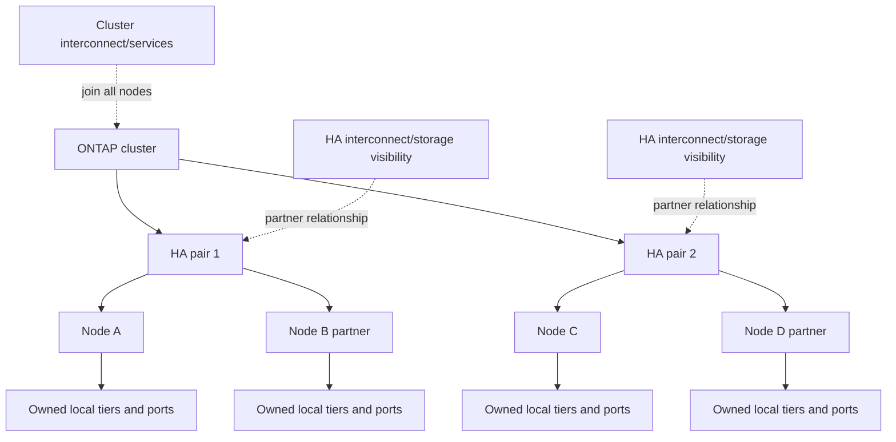

### Scope comparison

| Object | Primary scope | What it can protect or coordinate | What it does not prove |
|---|---|---|---|
| Node | One ONTAP member | Owns local tiers, runs protocol/management work, hosts LIFs | Site or partner health |
| HA pair | Two partner nodes | Storage failover, protected intent, planned maintenance under supported conditions | Cluster quorum, site DR, application continuity |
| Cluster | All member nodes | Membership, replicated configuration, scale-out management and data mobility | Every workload can run on every node or survive site loss |
| SVM | Logical data-service boundary | Protocols, namespace, LIFs, volumes and delegation | Physical resource independence |
| Volume/local tier | Logical data / protected capacity | Placement, policy, ownership and mobility under exact rules | Client reachability or application recovery |

### Cluster identity

A cluster has persistent identity, name, management interfaces, member-node identities, and configuration state. Friendly names are not enough for fleet analysis; record stable identifiers, platform serials/system IDs where authorized, ONTAP release, node membership, HA partner, and site/account mapping.

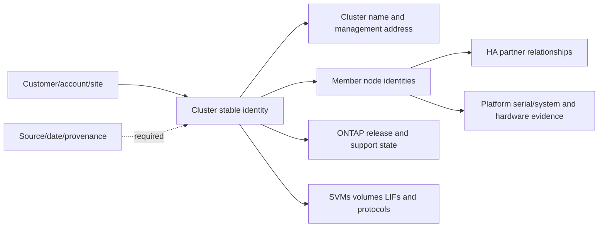

---

## 2. The four planes: management, cluster, HA, and data

The word `network` is incomplete in ONTAP architecture. Different traffic and failure purposes use different logical or physical paths.

### Plain-English deep-dive: public roads, staff corridors, partner hotline, and operations office

| Plane | Plain meaning | Analogy | Main risk question |
|---|---|---|---|
| **Data plane** | Client-facing NFS, SMB, iSCSI, FC/NVMe, or supported object traffic | Public roads carrying customer deliveries | Can clients reach the serving LIF/target and recover after movement? |
| **Cluster plane/interconnect** | Private node-to-node traffic supporting cluster operation and data/service coordination | Staff-only corridors linking all offices | Are all nodes mutually connected with required redundancy and health? |
| **HA plane/interconnect** | Partner communication supporting HA state and protected write intent under platform design | Dedicated hotline and shared emergency-record access between paired offices | Can partners determine health, protect intent, and take over safely? |
| **Management plane** | Cluster/node administration, monitoring, automation, logs, APIs, support | Operations office | Can authorized operators observe and change the system without proving data-path health? |

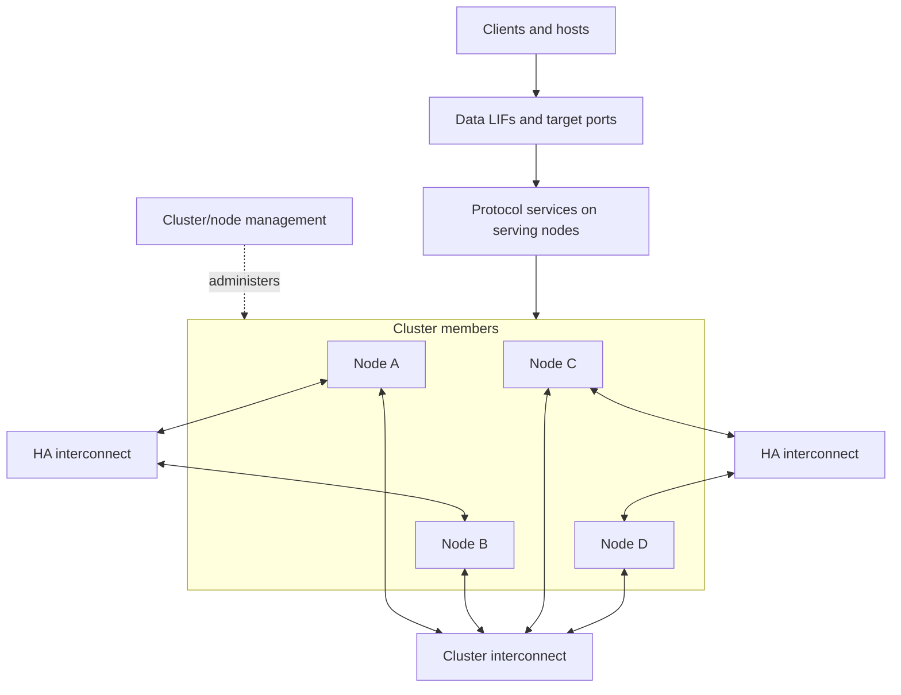

### Failure interpretation

| Observation | Candidate scope | Do not infer |
|---|---|---|
| Cluster management LIF unreachable | Management network/LIF/node/cluster service | Client I/O is down |
| One data LIF unreachable | Port/VLAN/failover policy/SVM/LIF/node path | Cluster quorum is lost |
| Cluster network packet loss | Interconnect port/switch/path/node; potentially cluster operation | Storage takeover has occurred automatically |
| HA interconnect degraded | Partner communication/intent/failover posture | Client data is already lost |
| One protocol session fails | Client/path/LIF/protocol/application state | Node or cluster has failed |

Keep planes distinct in diagrams, evidence, and change plans. A common switch, power domain, chassis, or automation system can still create shared fate across logically separate planes.

---

## 3. Cluster interconnect and scale-out behavior

The **cluster interconnect** is the private redundant network through which cluster nodes coordinate and carry cluster-internal traffic. Exact topology can be switched or switchless for supported cluster sizes/platforms. Never generalize a two-node design to a larger cluster.

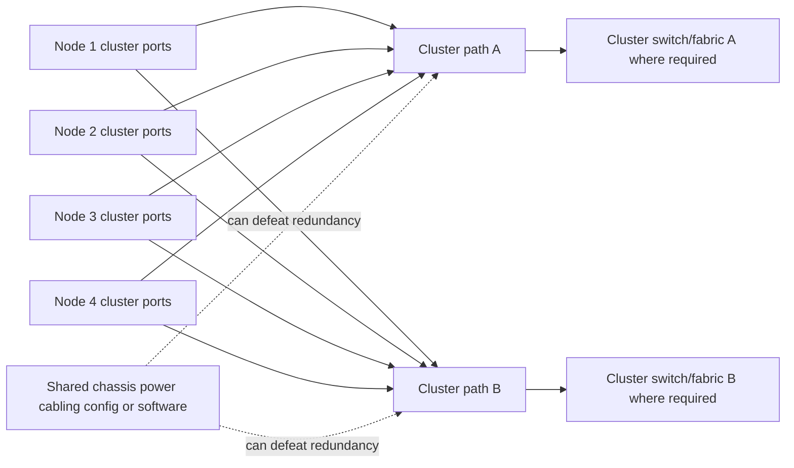

### Scale-out mental model

Scale-out adds nodes and allows supported data/service mobility rather than making one controller infinitely larger. It can add CPU, ports, capacity, and failure domains, but workload placement, protocol limits, HA pairing, local-tier ownership, licensing, and supportability still matter.

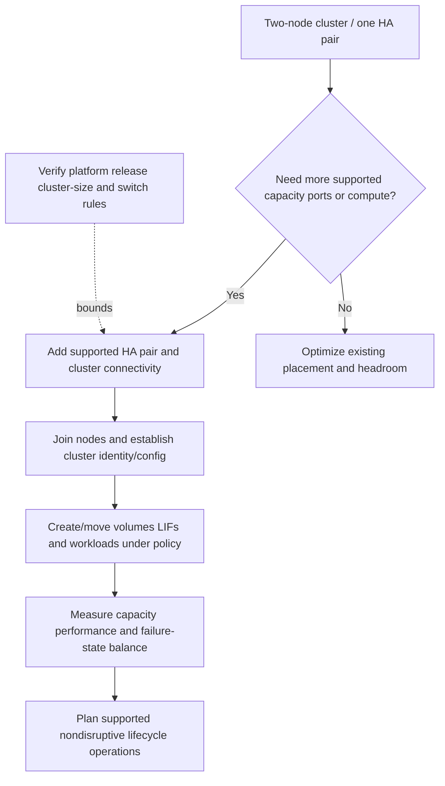

### Scale-out cautions

- A volume has current physical placement/ownership; the namespace can abstract it from clients.
- A LIF has a home port and current port; movement does not move the volume automatically.
- A node can host data interfaces for data physically owned elsewhere, with cluster-internal traffic implications.
- Adding nodes does not automatically rebalance all workloads or remove existing hotspots.
- Losing one HA pair can affect workloads placed there even if other pairs remain healthy.
- Exact NAS and SAN scale behavior differs; verify protocol-specific mobility and host path design.

---

## 4. Replicated configuration database orientation

ONTAP maintains cluster configuration and state in a replicated database, commonly discussed as the **RDB (replicated database)**. The safe architectural point is that important cluster configuration is replicated among nodes so membership and management decisions do not depend on one copy.

### Plain-English deep-dive: shared constitution, not customer data replica

The RDB is like each council member holding an agreed copy of the organization's constitution and current decisions. A majority must agree before the organization changes official state. It is not a second copy of every customer file or LUN. **Why it matters:** cluster configuration availability, data availability, and data protection are different claims.

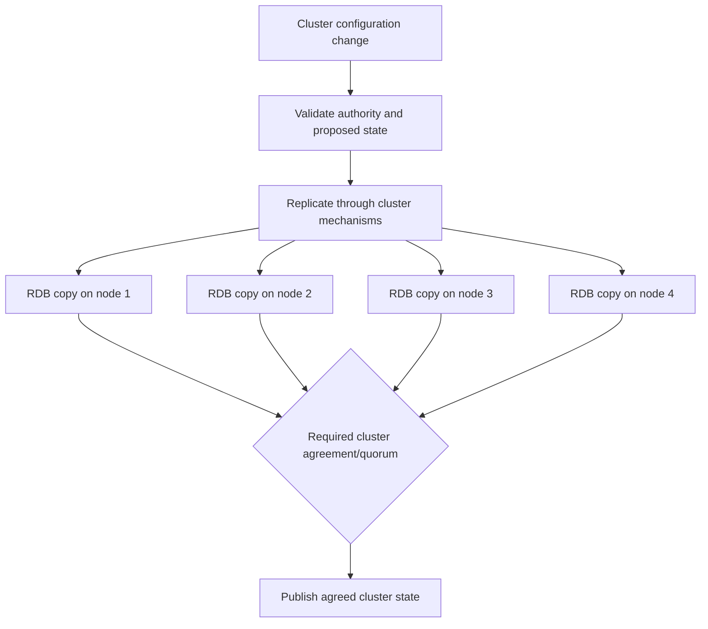

### RDB evidence boundaries

| Evidence | Can support | Cannot prove alone |
|---|---|---|
| Cluster membership/quorum state | Which nodes participate in cluster decisions | Client protocol path or application availability |
| Replicated configuration health | Cluster configuration consistency/availability | Snapshot, backup, or customer-data replication |
| RDB operation/error | Cluster control-plane issue candidate | Root cause without network/node/event correlation |
| Healthy RDB | Control-plane agreement is healthy in reported scope | All data LIFs, volumes, local tiers, and protocols are healthy |

Low-level RDB internals, ring names, records, debugging commands, and repair actions are Support/engineering territory and release-sensitive. A TAM analyst should preserve evidence and escalate rather than attempt undocumented database repair.

---

## 5. Quorum and epsilon

**Quorum** is the voting authority needed for the cluster to make safe decisions. At a conceptual level, a majority of the cluster's voting weight prevents isolated minorities from independently changing official cluster state.

**Epsilon** is additional voting weight assigned to one node under ONTAP's quorum design. Its purpose is to help break an otherwise even split; it is not a witness appliance, an HA partner, a data copy, or a license. Exact assignment, movement, two-node behavior, and operational procedures are version-sensitive.

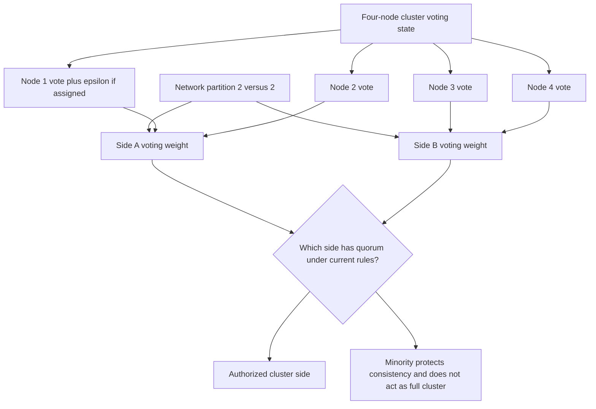

### Quorum is not storage failover

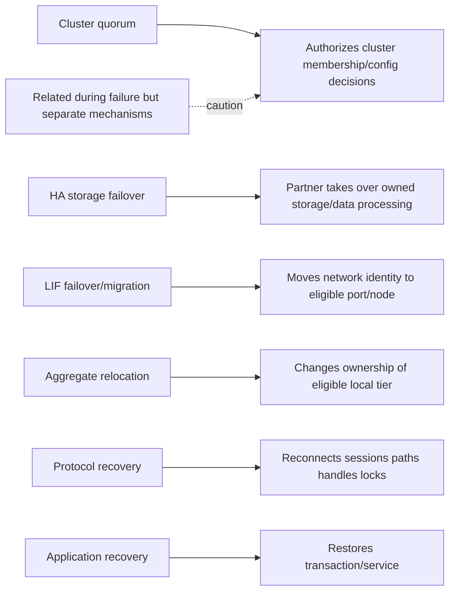

### Quorum questions

1. Which nodes are current cluster members and healthy?
2. Which node currently holds epsilon under the exact release?
3. What cluster-network failure partitions them, and what evidence proves it?
4. Does the surviving side have quorum, HA health, data access, and client paths?
5. Which operations stop or remain available when quorum is lost?
6. Is an operator considering a force action, and has NetApp Support validated stale-state/fencing risk?

Never move epsilon, disable cluster HA, force membership, or bypass quorum protection from a generic runbook. Those actions can affect cluster authority and data service and require exact official procedures.

---

## 6. Split brain, authority, and fencing

**Split brain** means isolated components both act as authoritative owners of shared state. **Fencing** is the set of controls that prevents a stale or losing side from continuing unsafe access before another side assumes authority.

### Plain-English deep-dive: one steering wheel

Two drivers lose radio contact while both can still reach one vehicle's steering controls. Quorum decides which driver may act; fencing removes the other's keys before control transfers. **Why it matters:** availability without single-writer authority can corrupt data. It is safer for an uncertain side to stop selected actions than for both to write.

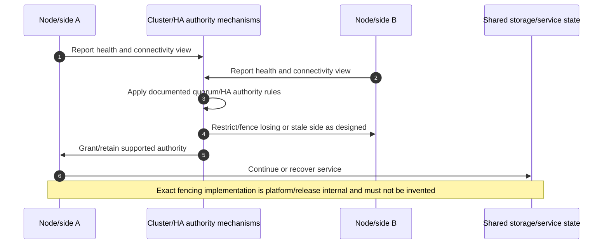

### Contrarian safety test

Before forcing recovery, ask: `What if the apparently failed node is still serving or can still write?` If that possibility is not disproved through supported fencing/authority evidence, a force action can create the very split-brain condition the cluster protects against.

---

## 7. Storage failover, takeover, and giveback

**Storage failover** is the HA capability by which one node can take over its partner's storage and data processing under supported conditions. **Takeover** is the transition to partner control. **Giveback** returns storage to the home node after it is healthy and checks pass.

### Normal and takeover state

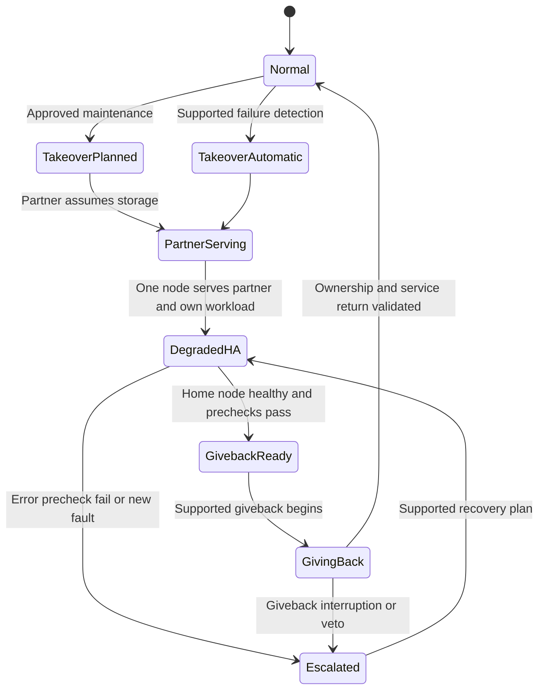

### Takeover sequence

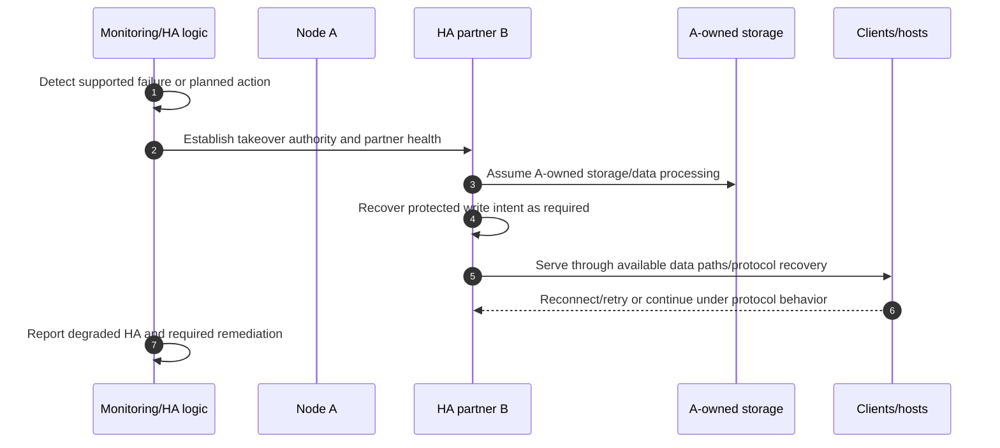

### Giveback sequence

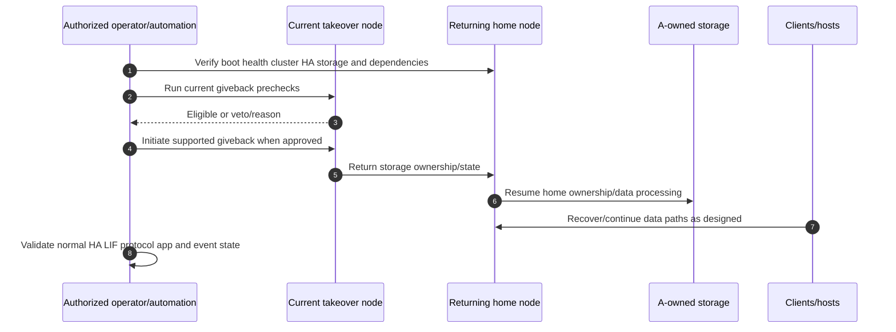

### Planned versus unplanned

| Dimension | Planned takeover | Unplanned takeover |
|---|---|---|
| Trigger | Approved maintenance/test | Node/software/power/interconnect or supported detected failure |
| Preparation | Health, load, compatibility, app, paths, change, rollback checks | Immediate impact/restoration plus evidence preservation |
| Client expectation | Bounded measured transition under tested design | Can be longer/less predictable depending on failure |
| Main risk | Hidden precheck failure, insufficient partner capacity, stale runbook | Multiple faults, lost shared storage/power, failed fencing, protocol timeout |
| Follow-up | Giveback and normal-state validation | Root cause, replacement/fix, giveback, prevention and residual risk |

`Partner serving` is a degraded state even if applications appear healthy. Remaining capacity, cooling, power, ports, CPU, storage paths, and another-failure tolerance must be monitored.

---

## 8. Aggregate ownership and relocation

A local tier/aggregate has a home/owning node. During takeover, the partner temporarily serves the taken-over node's storage. **Aggregate relocation (ARL)** is a separate supported operation that can change ownership of eligible aggregates between nodes in an HA pair, commonly used in lifecycle/nondisruptive workflows. Exact eligibility and sequence vary.

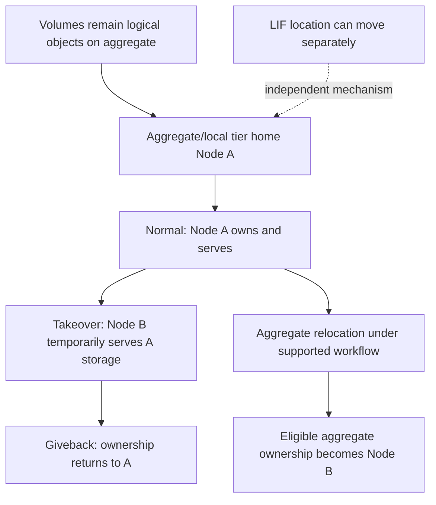

### Ownership distinctions

| Action | What moves/changes | What does not automatically move |
|---|---|---|
| Takeover | Temporary servicing of partner storage/data processing | Permanent home ownership, every LIF, application sessions |
| Giveback | Storage returns to home node | Application validation or all paths by itself |
| Aggregate relocation | Ownership of eligible local tier under supported process | Volume contents to another aggregate; every data LIF |
| Volume move | Volume data/placement to another eligible local tier/node | Client name/address, all LIFs, application state |
| LIF migrate/failover | Network identity's current hosting port/node under policy | Volume/local-tier physical placement |

Never use `move storage` without naming which object and mechanism.

---

## 9. LIF mobility is not storage failover

A **logical interface (LIF)** is a network identity/address used for data, management, cluster, or intercluster roles under current ONTAP concepts. A LIF has a home port/node and a current port/node. Migration is planned movement; failover is policy-driven movement after eligible port/node conditions. SAN LIF behavior differs from NAS LIF behavior and must be validated by protocol/release.

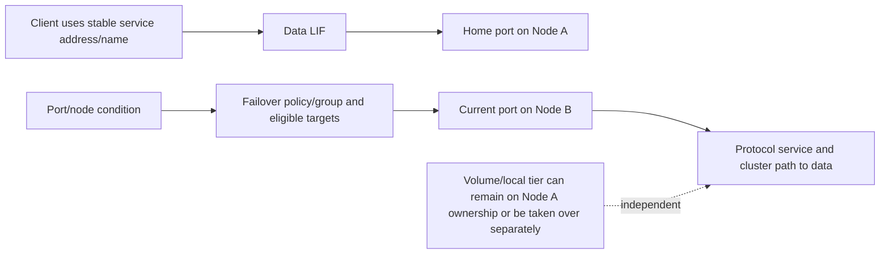

### NAS versus SAN distinction

| Area | NAS data LIF orientation | SAN target-LIF/port orientation |
|---|---|---|
| Client behavior | IP/name/session reconnect, locks/handles, mount/share behavior | Host multipathing, target-port state, ALUA/ANA, protocol timeouts |
| Mobility | Supported migration/failover can preserve IP identity under rules | Do not assume NAS-style transparent migration; exact SAN LIF behavior is protocol/release specific |
| Validation | DNS/ARP/ND, VLAN/route, session, file operation, locks | Every host path, target identity, MPIO, command, reservation, application |
| Common mistake | `LIF moved, so volume moved` | `One target port failed, so storage failed` |

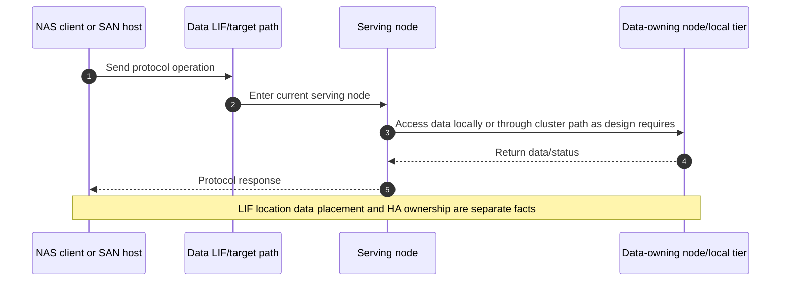

---

## 10. Nondisruptive operations and lifecycle work

**Nondisruptive operations (NDO)** are supported workflows intended to maintain data service during selected maintenance, upgrade, replacement, and mobility actions when prerequisites are met. `Nondisruptive` is a design objective and measured outcome, not a universal guarantee.

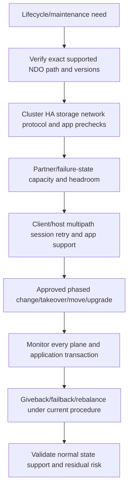

### NDO prerequisites

- Exact platform, cluster size/topology, ONTAP source/target release, firmware, shelves, adapters, switches, hosts, protocols, and applications are supported.
- HA pairs, cluster interconnect, storage, local tiers, LIFs, and quorum are healthy.
- The surviving node/path has capacity for combined workload and background work.
- NAS clients or SAN hosts support required reconnect/multipath behavior and timeouts.
- Protection, backup, rollback/stop conditions, monitoring, ownership, and communication are ready.
- The customer has tested the named operation with representative normal and peak workload.

### NDO false claims

| Claim | Better wording |
|---|---|
| `ONTAP upgrades never disrupt I/O` | The supported upgrade path is designed for NDO when every prerequisite/client/application condition is met; validate exact impact. |
| `Takeover proves NDO` | Takeover is one mechanism; client path/session/application recovery and giveback also need proof. |
| `If prechecks pass, change cannot fail` | Prechecks reduce known risk; unexpected defects, external dependencies, and hardware faults remain. |
| `No user ticket means no impact` | Measure transaction errors, latency tails, reconnects, and hidden retries. |

---

## 11. Failure-domain scenarios

### Scenario matrix

| Failure | Intended protection orientation | Evidence to validate | Residual/common-fate risk |
|---|---|---|---|
| One data port | LIF failover/migration or host alternate path | Port/LIF/MPIO state and application I/O | Same switch/VLAN/route/node |
| One cluster link | Redundant cluster path | Connectivity checks, packet loss, cluster health | Shared switch/config/power or second path |
| One HA link | Redundant HA design/platform behavior | HA interconnect/mirror state and Support guidance | Partner authority/mirror degradation |
| One node | Partner takeover | HA health, storage visibility, intent recovery, LIF/protocol/app | Partner capacity, shared chassis/shelves/site |
| One local tier/device group | RAID/aggregate protection within tolerance | RAID/device/aggregate state and data service | Additional failures and performance |
| Two-node partition | Quorum/epsilon/cluster HA rules | Exact release quorum, cluster/HA connectivity and fencing | Incorrect force action and stale state |
| One cluster switch | Alternate cluster fabric/path | All-node connectivity and traffic under failure | Common switch pair software/configuration |
| Entire HA pair/site | Other cluster pairs may survive, but data placed on failed pair/site may not | Workload placement, remote protection/DR | Cluster elsewhere is not site DR for that data |

### Failure-state reasoning tree

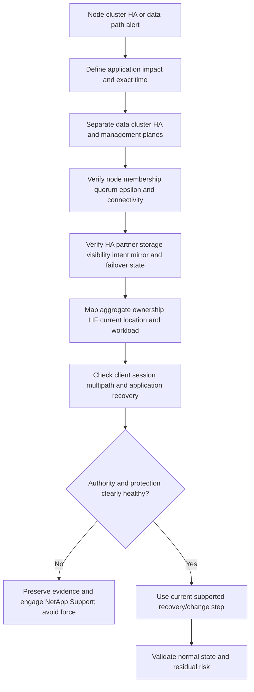

### Support boundaries

- Customer owns business impact, production change approval, application testing, network/host readiness, and risk decisions.
- NetApp Support owns qualifying product diagnosis and supported technical procedures under entitlement.
- The TAM/Technical Analyst supplies account context, verified topology, evidence, risk narrative, communications, and action tracking.
- Hardware replacement, forced takeover/giveback, quorum intervention, aggregate relocation, and low-level RDB repair require qualified authority and current procedure.

---

## 12. Evidence, common failures, and escalation

### Evidence map

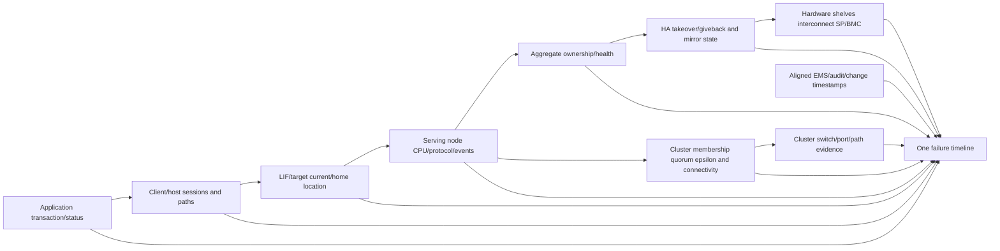

### Common failure modes

| Failure/misconception | Why it fails | Better behavior |
|---|---|---|
| `Cluster means all nodes serve all data identically` | Placement, ownership, protocol, and HA pairing remain | Map SVM/LIF/volume/local-tier/node/HA relationship |
| `HA pair is disaster recovery` | Both nodes can share chassis, shelves, power, network, and site | Map named failure domains and remote recovery |
| `Quorum loss means data is corrupt` | Quorum protects authority; data/application state needs separate evidence | Report control-plane state and exact data service |
| `Takeover failed, force it` | Old node may retain access/authority; force can create split brain | Prove fencing and use Support procedure |
| `LIF failover moved the data` | Network identity and physical storage are separate | Track LIF, volume, local tier, and ownership independently |
| `Partner is serving, so risk is closed` | System remains degraded and partner bears combined load | Restore normal HA, validate, and record residual exposure |
| `Giveback is a cleanup step` | It is another ownership/service transition with prechecks | Treat as controlled change with app validation |
| `Aggregate relocation equals volume move` | Ownership changes versus data relocation differ | Name exact object and operation |
| `Other cluster nodes protect a failed HA pair's data` | Data protection depends on placement/replication, not membership alone | Map volume/local tier and remote copies |
| `NDO means no client-visible effect` | Protocol retry and application timeout can expose transition | Measure errors, p99, pause, and transaction consistency |

### Minimum escalation pack

- Business service, impact, affected applications/protocols/sites, SLI/SLO, RPO/RTO, severity, and UTC timeline.
- Cluster stable identity/name, ONTAP release, node/platform/system identities, cluster size/topology, HA pairs, current support/lifecycle.
- Data/cluster/HA/management topology: ports, switches, VLANs/IPspaces/routes, interconnects, LIFs, target ports, shared power/chassis/site.
- Node health, membership, quorum, epsilon location, cluster connectivity/path loss, RDB/control events, management reachability.
- HA health, partner state, NVRAM/NVMEM mirror, storage visibility, takeover/giveback state/reason/veto, hardware-assisted evidence.
- Aggregate/local-tier home/current owner, RAID/device/shelf health, volume placement/moves, capacity and workload.
- LIF home/current port/node, failover group/policy/broadcast domain, migration/failover events; host MPIO paths for SAN.
- Client protocol sessions, locks/handles, multipath, retries/timeouts, application transaction and recovery evidence.
- EMS/audit/system-health/job/change history, SP/BMC and environmental evidence, raw clocks and offsets.
- Exact current docs/IMT/HWU, commands/API fields, Support case, access gaps, actions tried, results/rollback, next safe test, exact ask, and decision deadline.

---

## 13. TAM discovery and recommendation

### Discovery questions

1. Which business service, application transaction, protocol, SLO, RPO/RTO, and maintenance/freeze constraints apply?
2. What exact cluster/platform/release, member nodes, HA pairs, sites, cluster topology, and switch/interconnect design exist?
3. Which SVMs, LIFs, volumes/LUNs, local tiers, nodes, and HA pairs serve each workload?
4. Which cluster, HA, data, and management paths share chassis, switch, power, rack, site, software, automation, or operator fate?
5. What current quorum/epsilon/membership and RDB/cluster-connectivity state exists?
6. What NVRAM/NVMEM mirror, storage failover, takeover/giveback, aggregate ownership/relocation, and LIF state exists?
7. Can the partner carry combined CPU, ports, capacity, protocol, protection, and background workload during takeover?
8. Which NAS session/handle/lock or SAN MPIO/ALUA/timeout behaviors are supported and tested?
9. Which planned/unplanned failure and giveback tests occurred, and what application pause/error was measured?
10. Which exact IMT/HWU/release/lifecycle and Support evidence applies?
11. Who owns change, force authority, client testing, communication, and residual-risk acceptance?
12. What safe read-only check or approved test can disconfirm the leading hypothesis?

### Recommendation model

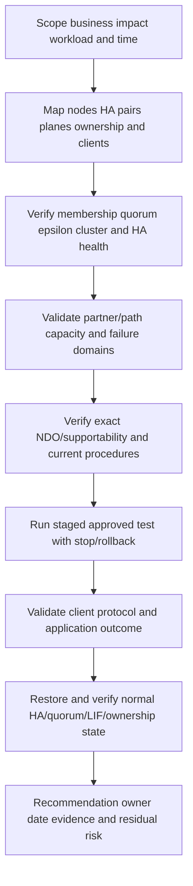

### Recommendation patterns

| Evidence-backed finding | Risk | Bounded recommendation | Validation |
|---|---|---|---|
| Partner projected CPU/port load exceeds tested failure-state envelope | Takeover can preserve ownership but miss application SLO | Rebalance workloads/capacity or change lifecycle plan using supported options | Representative combined-load takeover test and app percentiles |
| Cluster interconnect paths share one switch power domain | One failure can partition nodes and threaten quorum/control | Evaluate supported physical diversity and monitoring | All-node connectivity under one-path/switch loss |
| SAN host has one usable target path during node maintenance | Storage HA does not ensure host path resilience | Correct exact IMT-supported MPIO/fabric design before change | Each path and node transition with representative I/O |
| Giveback repeatedly vetoed | Normal HA protection cannot be restored | Preserve veto reason/events and use Support-guided repair; do not force | Clean prechecks, giveback, normal ownership, app validation |
| LIF failover group omits alternate physical domain | Data address cannot survive expected port/switch loss | Correct broadcast-domain/failover design under Part 22 guidance | Port/switch failure and client reconnect test |

### JD Mapping

| JD responsibility | Part 21 contribution | Your factual bridge and gap |
|---|---|---|
| Understand customer environment | Maps nodes, HA pairs, cluster planes, ownership, clients, and failure domains | Azure/VM/network mapping transfers; ONTAP cluster operations unproven |
| Storage depth | Explains RDB, quorum/epsilon, takeover/giveback, relocation, LIF distinction | Conceptual/synthetic knowledge only |
| Risk and stability | Identifies partner capacity, split-brain, quorum, common-fate, NDO risks | critical-situation risk/communication transfers |
| Strategic/lifecycle advice | Builds supported maintenance/upgrade/NDO prerequisites and tests | Change-advisory method transfers; exact NetApp procedures require SMEs |
| Analyze/report | Correlates cluster, HA, LIF, ownership, client, application and event evidence | Analytics and escalation evidence are strengths |
| Service review | Converts HA state/tests/actions into customer outcome and residual risk | Business-review communication transfers |
| Escalation | Provides exact topology, state, force-safety question, and Support ask | Product/Engineering collaboration transfers; no internal NetApp claim |

---

## 14. Fully synthetic scenario: Fabrikam Payments maintenance and partition

> **Synthetic case:** Fabrikam Payments, all nodes, events, timings, and results below are fictional. It is not an ONTAP procedure, NetApp customer incident, or documented production experience.

### Environment

- Four-node cluster: nodes A/B and C/D are HA pairs.
- Payment database LUNs are on A-owned local tiers; hosts have SAN paths through A and B target interfaces.
- Reporting NAS volumes reside on C-owned local tiers with data LIFs that can fail over within their broadcast-domain policy.
- Cluster traffic uses two switches that unexpectedly share one power feed.
- A planned node A maintenance occurs during a reduced but nonzero payment load.

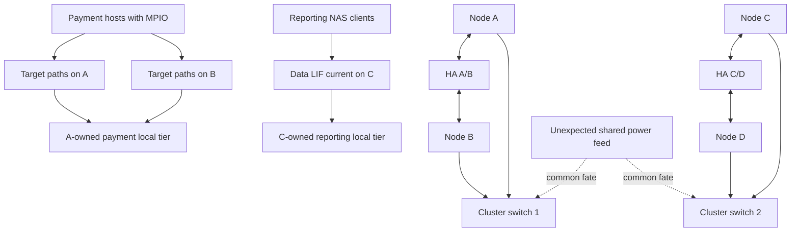

### Planned transition and separate failure

```mermaid
sequenceDiagram
    autonumber
    participant O as Change team
    participant A as Node A
    participant B as Partner B
    participant H as Payment hosts
    participant CS as Cluster network
    O->>A: Begin approved planned takeover workflow
    A->>B: Transfer supported storage service
    B->>H: Serve A-owned LUNs through surviving paths
    H-->>B: MPIO recovers within measured tolerance
    Note over CS: Later, shared power removes both cluster switches
    CS--xA: Nodes lose cluster connectivity
    CS--xB: Membership/quorum state changes
    O->>O: Stop further force/giveback actions and engage Support
```

### Evidence

| Evidence | Observation | Bounded interpretation |
|---|---|---|
| Planned takeover | B assumes A storage and payment hosts continue with 4-second p99 pause | Supported HA/host path works for this test; not zero impact |
| Partner load | B CPU and target-port load reach 88% during batch overlap | Failure-state capacity risk for peak period |
| Cluster network | Both switch paths fail from one power feed | Logical redundancy had one physical failure domain |
| Quorum/membership | Nodes report lost cluster connectivity and protected control behavior | Do not infer data corruption or force cluster state |
| HA | A/B partner links and storage remain available in synthetic case | HA plane differs from cluster-plane outage |
| NAS reporting | Existing sessions show mixed behavior depending on current node/path | Workload-specific client evidence needed |
| Operator plan | Runbook suggests forced giveback after ten minutes | Unsafe because authority/connectivity state is unresolved |

### Competing hypotheses and decisions

| Question | Evidence needed | Safe decision |
|---|---|---|
| Did takeover cause the later partition? | Change and power/cluster-switch timeline | Treat as separate until mechanism proves link |
| Can B sustain peak payment load? | Partner failure-state CPU/port/LUN/app percentiles | Replan peak maintenance or rebalance before next change |
| Is forced giveback safe? | Quorum, fencing, node/storage health, exact Support procedure | No force while authority is unresolved |
| Are reporting clients down because quorum is lost? | Client/LIF/node/protocol operation and cluster state | Scope each workload; do not infer from control-plane label |
| Is two-switch design redundant? | Power/chassis/software/config and failure test | Document shared power as a critical common-fate gap |

### Incident decision tree

```mermaid
flowchart TD
    EVENT[Cluster-switch power failure during partner-serving state] --> IMPACT[Scope payment/reporting impact]
    IMPACT --> AUTH{Quorum membership and authority clearly established?}
    AUTH -->|No| FREEZE[Freeze force/giveback/membership changes]
    FREEZE --> PRES[Preserve cluster HA switch SP/BMC and client evidence]
    PRES --> SUPPORT[Engage NetApp Support and network/power owners]
    AUTH -->|Yes| HA{HA/storage state healthy under current guidance?}
    HA -->|No| SUPPORT
    HA -->|Yes| RESTORE[Restore cluster connectivity through approved path]
    RESTORE --> VALID[Validate quorum HA ownership LIFs paths apps]
    VALID --> PLAN[Correct shared power and failure-state capacity]
```

### Recommendations

1. Correct cluster-network physical diversity so the two supported paths do not share the same power failure domain; validate exact switch/platform design and all-node connectivity.
2. Move planned node maintenance outside peak or rebalance supported workload so partner failure-state capacity meets payment p99 with contingency.
3. Replace the forced-giveback timer with explicit stop criteria: unresolved quorum, fencing, storage health, or Support direction means no force.
4. Test SAN paths, NAS LIF failover, application transactions, cluster-switch failure, takeover, and giveback as separate scenarios.
5. Record normal-state proof: all nodes in membership, quorum healthy, epsilon documented, HA normal, local tiers home, LIFs appropriate, client paths healthy, and no unresolved events.

### Customer-facing summary

> "The planned storage takeover worked within a measured four-second application tail, but it drove the partner close to the tested capacity envelope. The later cluster partition was a separate physical-design failure: both cluster switches shared one power source. HA communication remained available in the exercise, which illustrates why cluster, HA, data, and management planes must be diagnosed separately. Because quorum and authority were unresolved, a forced giveback would have added split-brain risk. The priorities are safe connectivity restoration under Support guidance, physical diversity, failure-state capacity, and separate end-to-end tests."

---

## 15. Your support/Azure/network/analytics bridge

```mermaid
flowchart LR
    CRIT[Enterprise critical-situation production work] --> IMP[Impact severity timeline and communications]
    AZ[Azure VM and network foundation] --> PLANES[Control data management and failure domains]
    M365[M365 service dependencies] --> STATE[Session identity service and recovery separation]
    BI[Analytics and business reviews] --> TREND[Capacity health test and action evidence]
    IMP --> ONTAP[Clustered ONTAP synthetic reasoning]
    PLANES --> ONTAP
    STATE --> ONTAP
    TREND --> ONTAP
    ONTAP --> LAB[Authorized lab shadowing and SME review]
```

| Factual strength | Transfer | Explicit gap |
|---|---|---|
| Business-critical incident ownership | Restoration priority, one timeline, stop unsafe actions, stakeholder cadence | No ONTAP takeover/giveback execution |
| Azure/VM/networking | Separate control/data/management planes and shared fate | No cluster/HA interconnect administration |
| M365 sessions/identity/dependencies | Avoid equating infrastructure recovery with application recovery | No ONTAP NAS/SAN continuity production evidence |
| Excel/Power BI/analytics | Trend HA tests, failure-state capacity, action aging and outcomes | No internal NetApp telemetry/tool access claim |

### Honest answer

> "I understand clustered ONTAP architecture conceptually: nodes form HA pairs, HA pairs form clusters, cluster configuration is replicated, quorum and epsilon protect control authority, and storage failover, aggregate ownership, LIF mobility, protocol recovery, and application continuity are separate mechanisms. My production strength is enterprise incident, network, and analytics work. I have not run ONTAP takeover/giveback or quorum actions, so I would use current official procedures, authorized evidence, NetApp Support, and experienced storage owners and would never improvise a force operation."

---

## 16. Whiteboard drills

1. **Hierarchy:** Node -> HA pair -> cluster; add SVM, volume, local tier, and LIF.
2. **Planes:** Draw data, cluster, HA, and management paths with one failure each.
3. **RDB:** Explain replicated configuration without calling it customer-data replication.
4. **Quorum:** Draw a four-node 2-2 partition and epsilon's conceptual tie-breaking role.
5. **Authority:** Explain split brain and the contrarian `what if the old node still writes?` test.
6. **Takeover/giveback:** Draw storage ownership and client/application recovery separately.
7. **Mobility:** Compare takeover, aggregate relocation, volume move, and LIF migration.
8. **NDO:** Name prerequisites and explain why `no ticket` is not proof of no impact.

---

## 17. Paper lab: failure-domain and HA decision pack

No production access is required. Use synthetic evidence and public official documentation.

### Scenario

A six-node cluster has three HA pairs across two rooms, switched cluster interconnects, separate HA links, NAS and SAN SVMs, local tiers owned by every node, and a planned controller refresh. The diagrams omit power, switch control, LIF failover groups, partner load, epsilon, and host MPIO details.

### Tasks

1. Build stable cluster/node/HA/platform/site identity inventory.
2. Draw data, cluster, HA, and management planes physically and logically.
3. Map SVM/LIF/home/current port, volume/LUN, local-tier home/current owner, HA pair, and client.
4. Create a quorum/epsilon table and three network-partition scenarios without force commands.
5. Build RDB/control-plane evidence and state what it cannot prove.
6. Model planned takeover, unplanned node failure, giveback, aggregate relocation, volume move, and LIF migration separately.
7. Calculate partner failure-state CPU/port/capacity headroom using synthetic ranges.
8. Design NAS session/lock and SAN MPIO/application acceptance tests.
9. Inject cluster-switch, HA-link, data-switch, shelf/power, node, and site failures one at a time.
10. Identify at least twelve common failure domains, including automation and operator change.
11. Build stop/escalation criteria for quorum ambiguity, vetoed giveback, degraded intent mirror, and multiple faults.
12. Create normal-state closure evidence and a residual-risk register.
13. Write one maintenance recommendation and one incident escalation pack.
14. Deliver a two-minute executive and ten-minute technical explanation.

### Lab flow

```mermaid
flowchart LR
    INV[Inventory identities and ownership] --> MAP[Draw four planes and failure domains]
    MAP --> STATE[Model quorum HA LIF and client state]
    STATE --> LOAD[Assess partner/degraded capacity]
    LOAD --> TEST[Design staged failure and recovery tests]
    TEST --> STOP[Define stop/Support boundaries]
    STOP --> REC[Write recommendation and closure evidence]
```

### Lab pass criteria

- [ ] Node, controller, HA pair, cluster, SVM, LIF, volume, and local tier remain distinct.
- [ ] Cluster and HA interconnects have separate purposes/evidence.
- [ ] RDB replication is not called customer-data protection.
- [ ] Quorum and epsilon remain conceptual/current-doc bounded.
- [ ] Split-brain reasoning includes authority and fencing, not invented internals.
- [ ] Takeover, giveback, relocation, volume move, and LIF mobility are separate.
- [ ] Partner combined-load and application recovery are tested.
- [ ] NDO claims are measured and protocol/application specific.
- [ ] Force actions remain inside current Support/authorized boundaries.
- [ ] No synthetic result is presented as production ONTAP experience.

---

## 18. Self-test

1. Define node, controller, HA pair, cluster, SVM, local tier, volume, and LIF.
2. Draw the hierarchy and state each object's ownership/failure scope.
3. Distinguish data, cluster, HA, and management planes.
4. Explain switched versus switchless only as current supported topology choices.
5. Explain scale-out and why adding nodes does not automatically rebalance every workload.
6. Define RDB and state what it does not replicate.
7. Define quorum and epsilon at safe conceptual depth.
8. Explain why quorum is not storage failover.
9. Explain split brain, fencing, and the contrarian safety question.
10. Define storage failover, takeover, giveback, degraded HA, and precheck/veto.
11. Draw planned and unplanned takeover sequences.
12. Explain partner failure-state capacity and remaining-fault exposure.
13. Compare takeover, aggregate relocation, volume move, and LIF migration/failover.
14. Explain LIF home/current location and NAS/SAN distinctions.
15. Define NDO and list every prerequisite and caveat.
16. Work node, cluster-link, HA-link, data-port, switch, local-tier, HA-pair, and site failures.
17. Build the complete evidence map and escalation pack.
18. Ask the TAM discovery questions and write a bounded recommendation.
19. Recreate Fabrikam's planned takeover, separate power partition, force-safety decision, and recommendations.
20. Complete all whiteboard drills, paper lab, and Q1-Q8 aloud.
21. State your strengths and ONTAP cluster/HA production gap precisely.

---

## 19. Official Source Anchors

**Date checked: 2026-08-24.** These public official sources anchor broad clustered ONTAP concepts. Exact cluster size, topology, encryption, quorum, epsilon, RDB, takeover/giveback, relocation, LIF, NDO, command, API, and platform behavior are release-sensitive. Re-open the exact ONTAP release and platform documentation, use IMT/HWU, and follow NetApp Support procedures. Do not infer force or recovery steps from this conceptual chapter.

| Topic | Official public source | Bounded use and currency note |
|---|---|---|
| Cluster concepts | [ONTAP cluster storage concepts](https://docs.netapp.com/us-en/ontap/concepts/cluster-storage-concept.html) | Broad node/cluster/storage orientation; exact limits/topology require current release/HWU. |
| HA pair concepts | [ONTAP high-availability pairs](https://docs.netapp.com/us-en/ontap/concepts/high-availability-pairs-concept.html) | Broad partner/takeover orientation; use operational HA docs for exact release. |
| HA pair management | [ONTAP HA pair management](https://docs.netapp.com/us-en/ontap/high-availability/) | Current takeover/giveback, monitoring, testing, and platform procedures; commands/conditions change by release. |
| Cluster administration | [ONTAP cluster administration](https://docs.netapp.com/us-en/ontap/cluster-admin/) | Membership, quorum/epsilon, management, and operational documentation entry point. |
| Cluster interconnect | [ONTAP cluster networking](https://docs.netapp.com/us-en/ontap/network-management/) | Official network-management entry point; select exact cluster-network and platform topology pages. |
| Storage virtualization | [ONTAP storage virtualization](https://docs.netapp.com/us-en/ontap/concepts/storage-virtualization-concept.html) | SVM, LIF, volume mobility and abstraction concepts; detailed behavior is release/protocol specific. |
| LIF failover and migration | [ONTAP network management](https://docs.netapp.com/us-en/ontap/network-management/) | Current LIF roles, home/current ports, broadcast domains, failover groups/policies and procedures. |
| Aggregate relocation | [ONTAP aggregate relocation](https://docs.netapp.com/us-en/ontap/high-availability/ha_manual_giveback.html) | Entry to HA/giveback operational context; exact ARL workflow often belongs to upgrade/platform procedures and must be selected by task/release. |
| Nondisruptive upgrades | [Upgrade ONTAP](https://docs.netapp.com/us-en/ontap/upgrade/) | Current upgrade planning and NDO prerequisites; exact path and restrictions require source/target release checks. |
| Hardware systems | [ONTAP hardware systems](https://docs.netapp.com/us-en/ontap-systems/) | Exact controller/chassis/interconnect/shelf/service procedures by platform. |
| IMT | [NetApp Interoperability Matrix Tool](https://imt.netapp.com/) | Official, potentially gated, exact end-to-end support result/notes/date. |
| HWU | [NetApp Hardware Universe](https://hwu.netapp.com/) | Official, potentially gated, exact platform limits/components/configuration. |
| Support | [NetApp Support Site](https://mysupport.netapp.com/) | Entitlement-dependent cases, knowledge, advisories, diagnostics, and procedures. |

### Source-use discipline

- Record exact cluster identity, platform, ONTAP release, node/HA topology, site, and date.
- Verify cluster-size/switch topology, HA interconnect, encryption, quorum/epsilon, and NDO from current release/platform sources.
- Treat takeover/giveback, aggregate relocation, volume move, and LIF mobility as distinct documented workflows.
- Capture prechecks, veto/reason, stop conditions, authority, client impact, and normal-state validation.
- Never force quorum, membership, takeover, giveback, or fencing behavior without current Support-approved procedure.
- Save exact IMT result/notes and HWU facts; state access gaps rather than inventing them.

---

## Likely Interview Questions

### Q1. What is the difference between a node, HA pair, and ONTAP cluster?

> **Model answer:** "A node is one ONTAP member with processing, ports, and owned storage. Two compatible partner nodes form an HA pair so one can take over the other's storage and data processing under supported conditions. One or more HA pairs form a cluster with shared management, membership, replicated configuration, and scale-out services. Cluster membership does not make every node an HA partner or every data set available after an entire HA pair/site loss."

**Follow-up depth:** Draw a four-node cluster and map one SVM, LIF, volume, local tier, and client path to the correct node and pair.

### Q2. Distinguish the cluster, HA, data, and management planes.

> **Model answer:** "The data plane carries client protocol traffic. The cluster plane is the private redundant node-to-node network supporting cluster operation and internal coordination. The HA plane supports partner health, protected write intent, and storage failover under platform design. The management plane configures and observes the system. A failure in one can affect others, but link-up or reachability in one plane does not prove health in another, so I collect separate topology and evidence."

**Follow-up depth:** Give one failure and counterexample for each plane and identify shared switch/power/configuration risks.

### Q3. What are the RDB, quorum, and epsilon?

> **Model answer:** "ONTAP replicates important cluster configuration/state in a replicated database across nodes; it is not a copy of all customer data. Quorum is the voting authority required for safe cluster decisions. Epsilon is additional voting weight assigned to one node to help resolve an even split under ONTAP's design. Exact placement and behavior are release-sensitive. I would never move epsilon or force membership from memory; I would verify current state and use official Support procedures."

**Follow-up depth:** Draw a 2-2 partition, explain control authority versus data service, and state what evidence is needed before any intervention.

### Q4. Explain takeover and giveback.

> **Model answer:** "During takeover, one HA node assumes its partner's storage and data processing after a planned action or supported failure detection. It recovers protected intent as needed and clients recover through protocol/network paths. The system remains degraded because one partner carries combined work and another failure margin is reduced. Giveback returns storage to the healthy home node after prechecks pass. Both transitions require client/application validation; a veto or ambiguity should be investigated, not forced."

**Follow-up depth:** Compare planned/unplanned takeover, partner capacity, NVRAM mirror, LIF/MPIO recovery, giveback veto, and normal-state proof.

### Q5. How do aggregate relocation, volume move, and LIF migration differ from takeover?

> **Model answer:** "Takeover temporarily makes a partner serve the home node's storage. Aggregate relocation changes eligible local-tier ownership under a supported HA/lifecycle workflow. A volume move relocates a logical volume's data to another eligible local tier. LIF migration or failover changes where a network identity is hosted. They can be coordinated in NDO workflows but move different objects; none automatically moves all the others."

**Follow-up depth:** Draw home/current ownership and location for each object before and after an example operation.

### Q6. What makes an ONTAP operation nondisruptive?

> **Model answer:** "Nondisruptive means a currently supported design and workflow maintains acceptable data service through a named operation when cluster/HA/storage/network health, partner capacity, host/client protocol recovery, compatibility, protection, and change prerequisites all pass. I measure application errors, p99, pause, reconnect, and data consistency through takeover, upgrade steps, giveback, and failback. A precheck or marketing label does not guarantee zero client-visible effect."

**Follow-up depth:** Build a go/no-go checklist for an upgrade during peak workload and state rollback/stop limitations.

### Q7. How would you handle a cluster partition or failed giveback?

> **Model answer:** "I would define business impact, freeze unsafe force actions, preserve node/cluster/HA/network/client evidence, and establish membership, quorum, epsilon, fencing, storage health, and current ownership with NetApp Support. I would separate cluster-control state from client data-service state. For failed giveback I would capture the exact veto/reason and repair the documented blocker rather than bypass it. Recovery ends only after normal membership, HA, ownership, LIF/path, protocol, and application state are validated."

**Follow-up depth:** Use the contrarian question `what if the old node can still write?` and explain why a fixed timer is not sufficient force authority.

### Q8. How does your background transfer, and what remains a gap?

> **Model answer:** "My prior critical-situation work gives me impact-first incident coordination, one evidence timeline, safe restoration, cross-team ownership, and executive communication. Azure/VM/network experience helps me separate control, data, and management planes and map failure domains; analytics helps with capacity and test evidence. I have not operated ONTAP clusters or takeover/giveback in production. I would use current documentation, authorized read-only evidence, NetApp Support and storage SMEs, and never improvise quorum or force actions."

**Follow-up depth:** Give one factual enterprise incident and state which ONTAP authority, interconnect, ownership, and client-recovery facts it cannot supply.

---

## 30-Second Memory Hooks

- **Node:** One ONTAP office with compute, ports, and owned storage.
- **HA pair:** Two partner offices that can serve each other's storage.
- **Cluster:** One organization of HA pairs; scale-out does not erase placement.
- **Four planes:** Data, cluster, HA, management.
- **Cluster interconnect:** Private all-node coordination network.
- **HA interconnect:** Partner health/write-intent/failover relationship.
- **RDB:** Replicated cluster constitution, not customer-data copy.
- **Quorum:** Enough voting authority to make safe cluster decisions.
- **Epsilon:** Extra voting weight, not a witness or data copy.
- **Split brain:** Two writers believe they own one steering wheel.
- **Fencing:** Remove the stale side's keys before ownership transfers.
- **Takeover:** Partner temporarily serves home storage.
- **Giveback:** Storage returns only after health and prechecks.
- **Degraded HA:** Service may continue, but risk and load are higher.
- **Aggregate relocation:** Ownership move; **volume move:** data placement; **LIF move:** network location.
- **NDO:** Supported prerequisites plus measured application continuity.
- **Your bridge:** Incident and network rigor transfer; ONTAP force authority does not.

---

## Completion Checklist

- [ ] Define node, controller, HA pair, cluster, cluster identity, SVM, LIF, local tier, and volume.
- [ ] Draw the hierarchy and all four planes with physical/common-fate evidence.
- [ ] Explain cluster interconnect, supported topology verification, and scale-out caveats.
- [ ] Explain RDB orientation without calling it customer-data replication.
- [ ] Define quorum and epsilon at current-document-safe depth.
- [ ] Distinguish quorum, storage failover, LIF mobility, protocol recovery, and application recovery.
- [ ] Explain split brain/fencing without unsupported internals or force advice.
- [ ] Draw planned/unplanned takeover and giveback with degraded-state capacity.
- [ ] Explain prechecks, vetoes, stop/escalation criteria, and normal-state proof.
- [ ] Distinguish aggregate relocation, volume move, and LIF migration/failover.
- [ ] Explain NAS versus SAN LIF/client recovery differences.
- [ ] Define NDO and validate every support, health, capacity, client, protection, and change prerequisite.
- [ ] Analyze node, link, switch, HA pair, local-tier, protocol, and site failure domains.
- [ ] Apply the evidence map, common-failure table, and minimum escalation pack.
- [ ] Ask all TAM discovery questions and write an owner/date/validation/residual-risk recommendation.
- [ ] Recreate Fabrikam's takeover, partner load, shared-power partition, quorum/force decision, and closure evidence.
- [ ] Complete all whiteboard drills, paper lab, self-test, and Q1-Q8 aloud.
- [ ] State your strengths and ONTAP cluster/HA production gap precisely.
- [ ] Recheck exact ONTAP/platform docs, IMT, HWU, topology, commands/API fields, support state, and Support procedure before customer use.

---

*Next suggested section:* [Part 22 - SVMs, LIFs, Namespaces, Junctions, and Multi-Tenancy](Part-22-svms-lifs-namespaces-junctions.md)