# Part 22 - SVMs, LIFs, Namespaces, Junctions, and Multi-Tenancy

> **Section goal:** Understand how an ONTAP storage virtual machine turns cluster resources into a tenant- or service-scoped file, block, or supported object service through protocols, logical interfaces, routing, namespaces, junctions, volumes, identity, and delegated administration. By the end, you should be able to trace a request, distinguish NAS and SAN mobility, diagnose common path failures, and evaluate isolation without confusing logical tenancy with physical independence.

Covers index item **22** and maps directly to job-description responsibilities for customer-environment discovery, storage/network depth, multi-tenant risk, supportability, stability, tailored recommendations, service reviews, security, and escalation quality.

Exact SVM types, LIF service policies/roles, protocol combinations, IPspaces, broadcast-domain behavior, failover policies, routing, namespace/junction rules, root-volume requirements, RBAC commands/APIs, delegation, limits, and NAS/SAN mobility change by ONTAP release, platform, and configuration. Verify current official release documentation, **Interoperability Matrix Tool (IMT)**, **Hardware Universe (HWU)**, application/host guidance, and authorized system evidence.

> **No-production-NetApp boundary:** You do not claim production NetApp or ONTAP experience. Every tenant, address, path, policy, failure, and recommendation below is synthetic. Your factual strengths are enterprise support, SharePoint/OneDrive permissions and data-service reasoning, Azure/VM/networking, Active Directory, analytics, and escalation ownership. You do **not** claim production ONTAP SVM, LIF, namespace, junction, routing, RBAC, or multi-tenancy administration experience.

---

## 1. Storage virtual machines from zero

A **storage virtual machine (SVM)** is a logical ONTAP entity that provides data services to clients and hosts. Earlier ONTAP terminology and the command-line interface use **vserver**. An SVM can own protocol servers, logical interfaces, volumes, namespace, routing, security, and delegated administration while using physical resources from cluster nodes.

### Plain-English deep-dive: a tenant suite inside a shared building

The cluster is a managed building. An SVM is a tenant suite with its own entrances, room map, staff permissions, and services. The suite can use rooms and doors hosted by different parts of the building without exposing that physical layout to users. **Why it matters:** logical separation simplifies multi-tenancy and mobility, but tenants can still share elevators, power, structure, administrators, and failure domains.

| SVM element | Plain meaning | Customer significance |
|---|---|---|
| SVM identity | Logical service/administrative boundary | Inventory, ownership, audit, and protocol scope |
| Protocol service | NFS, SMB, iSCSI, FC/NVMe, or supported object service enabled/configured for that SVM | Determines client request semantics and dependencies |
| LIFs | Network identities used to reach services | Path, routing, failover, security, and availability |
| Volumes/LUNs/buckets | Logical data objects assigned to the SVM | Capacity, namespace, protection, and ownership |
| Namespace | SVM-visible path tree for NAS | Client path remains logical while volumes can move |
| Security/admin | Authentication, roles, certificates, policies, audit | Tenant delegation and least privilege |

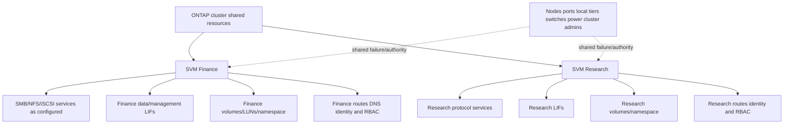

### SVM types and scope caution

ONTAP creates data-serving SVMs and special administrative/system SVM contexts. Current documentation distinguishes cluster/admin, node, system, and data-serving purposes. Do not expose a special system/administrative SVM as though it were a tenant data SVM, and do not assume every LIF can serve every protocol.

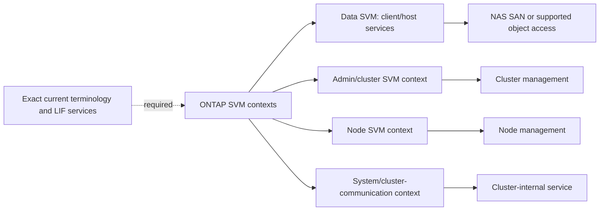

---

## 2. Multi-tenancy: what is isolated and what is shared

**Multi-tenancy** means several organizational or service domains use one infrastructure while maintaining defined logical separation. ONTAP SVMs can separate namespaces, protocol configurations, network contexts, identity, administration, and data objects, subject to exact release/features.

### Isolation matrix

| Dimension | Can be SVM-scoped conceptually | Common shared dependency or caveat |
|---|---|---|
| Namespace and shares/exports | Yes for NAS SVM | Cluster administrators and shared storage/resources remain |
| Protocol server identity | Yes | External AD/LDAP/DNS/time may be shared |
| Data LIFs/routes | Yes | Physical ports, switches, firewalls, IPspaces or upstream paths can be shared |
| Volumes/LUNs | Assigned to SVM | Local tier, node CPU/cache, shelves, power and site can be shared |
| SVM administrator/RBAC | Delegated scope possible | Cluster admin retains broader authority; role design can be overbroad |
| Encryption/keys | Product/configuration dependent | Key manager, certificates, cluster hardware and recovery authority may be shared |
| Performance | Policies/QoS can help | Shared CPU, ports, cache, local tiers and background work create contention |
| Failure | Logical faults can be scoped | Node/cluster/network/power/change failures can cross tenants |

### Plain-English deep-dive: isolation is a contract, not a checkbox

Apartment walls separate residents' rooms, but everyone can share elevators, plumbing, power, fire controls, and a building manager with master keys. SVM isolation must therefore be stated dimension by dimension: data visibility, protocol identity, network reachability, administrator authority, performance, protection, and physical failure. **Why it matters:** saying `separate SVMs` is not enough for a compliance or blast-radius claim.

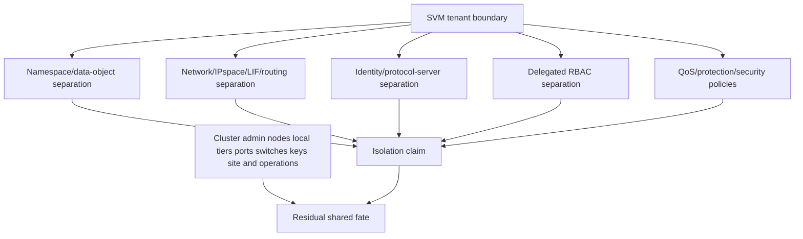

### Tenant-isolation evidence

- Exact SVM, IPspace, broadcast domain, VLAN/subnet, routes, LIF service policies, firewall and upstream controls.
- Protocol server identity, AD/LDAP/Kerberos/DNS/time dependencies, shares/exports/LUN maps, namespace and file/object permissions.
- Cluster and SVM roles, login methods, command/API access, certificates, audit and break-glass authority.
- Volume/local-tier/node placement, QoS, capacity, protection copies, keys, snapshots, backups and shared administrators.
- Positive and negative tests: permitted tenant access works; cross-tenant access fails at every expected gate.

---

## 3. LIFs: stable network identity over movable hosting

A **logical interface (LIF)** is a logical network interface associated with an SVM and service policy. Depending on role/protocol, it can have an IP address, World Wide Port Name (WWPN), or other target identity. It is hosted on a physical or logical port.

### Plain-English deep-dive: telephone number and current handset

A LIF is like a business telephone number. The **home port** is the usual desk; the **current port** is the desk answering now. Moving the number does not move the company's filing room. **Why it matters:** client identity/location, volume placement, local-tier ownership, and serving node are related but separate.

| LIF concept | Meaning | Evidence question |
|---|---|---|
| Home node/port | Preferred configured location | Is it healthy and appropriate for normal service? |
| Current node/port | Where the LIF is hosted now | Why did it move, and is traffic path optimal/supported? |
| Service policy | Current set of services the LIF supports | Does it permit data, management, intercluster, or other role? |
| Failover policy/group | Eligible targets and selection rules for supported LIF failover | Does it cross the intended port/switch failure domain? |
| Operational/admin state | Whether configured and currently usable | Is failure administrative, link, reachability, or policy? |

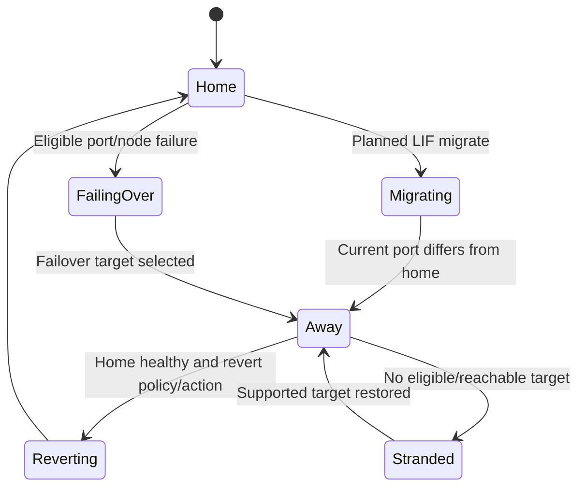

### Current LIF role orientation

| Role/service context | Purpose | Key warning |
|---|---|---|
| Cluster management | Administer cluster as a whole | Not a client data LIF |
| Node management | Administer one node | Node reachability does not prove cluster/data health |
| Cluster/internal | Private node-to-node communication | Never treat as tenant/client interface |
| Data | NFS/SMB/iSCSI or other supported data service | Protocol-specific failover/recovery behavior |
| Intercluster | Cluster peering/replication traffic | Protection path, routing and bandwidth differ from client data |

Current ONTAP uses service policies that can replace older role/firewall-policy descriptions in many contexts. Always inspect the actual release and effective service policy rather than relying on legacy terminology.

---

## 4. Ports, VLANs, interface groups, IPspaces, and broadcast domains

A LIF is hosted on a physical port, VLAN, or supported interface group. **IPspace** provides separate IP addressing/routing domains. A **broadcast domain** groups ports that have Layer 2 reachability for a subnet/VLAN context and supports LIF placement/failover decisions.

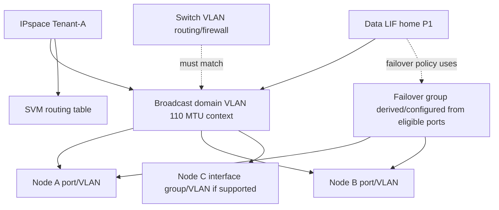

### Component distinctions

| Component | Question answered | It does not prove |
|---|---|---|
| Physical port | Where is cable/link attachment? | Correct VLAN, route, or end-to-end reachability |
| VLAN interface | Which tagged Layer 2 domain? | Tenant security or routing by itself |
| Interface group | Which physical members form a logical Ethernet interface? | One-flow aggregate bandwidth or upstream independence |
| IPspace | Which separate IP/routing domain? | Physical isolation or protocol authorization |
| Broadcast domain | Which ports share Layer 2/MTU reachability context? | Actual switch allow-list/firewall or every target is reachable |
| Failover group | Which ports are candidate LIF failover targets? | Client/application recovery after movement |

### Reachability matters more than link-up

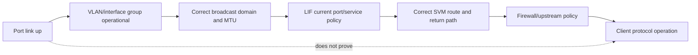

ONTAP network reachability monitoring and broadcast-domain behavior have changed across releases. Use current documentation before moving ports between broadcast domains, changing MTU, or overriding reachability warnings.

---

## 5. Failover groups and policies

A **failover group** is a set of network ports that can host a LIF under its failover policy. A **failover policy** determines which classes of targets are eligible. Exact policy names/defaults and SAN/NAS rules are release-sensitive.

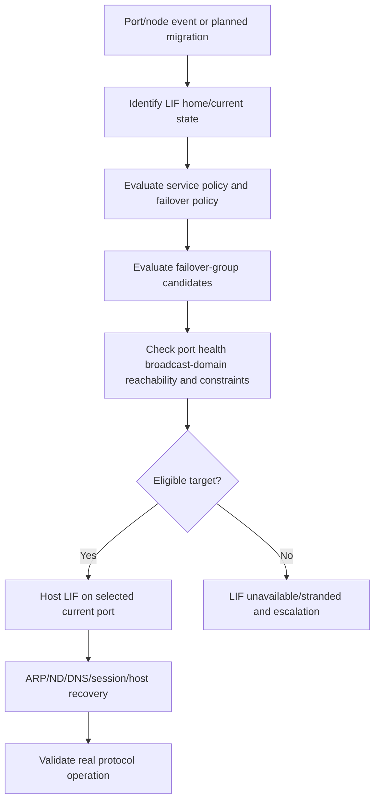

### Failover design questions

1. Does the group include ports on both HA nodes where supported?
2. Do targets terminate on independent switch, line-card, power, and upstream domains?
3. Are VLAN, MTU, IPspace, broadcast domain, and upstream routing/security identical where required?
4. Does the current service policy permit the intended service at the target?
5. Can the surviving node/port carry failure-state load?
6. Does the client/protocol recover within application timeout?
7. What happens during revert/failback and unstable flapping?

Do not add arbitrary ports to a failover group merely to make a LIF `up`; a wrong subnet/VLAN/MTU or insecure path can be worse than an explicit failure.

---

## 6. SVM routing, DNS, and service names

SVMs can have routing and name-service contexts for their supported data/management needs. A LIF address alone does not establish two-way reachability. The selected source, destination, route, gateway, firewall, and return path must align.

### IP request path

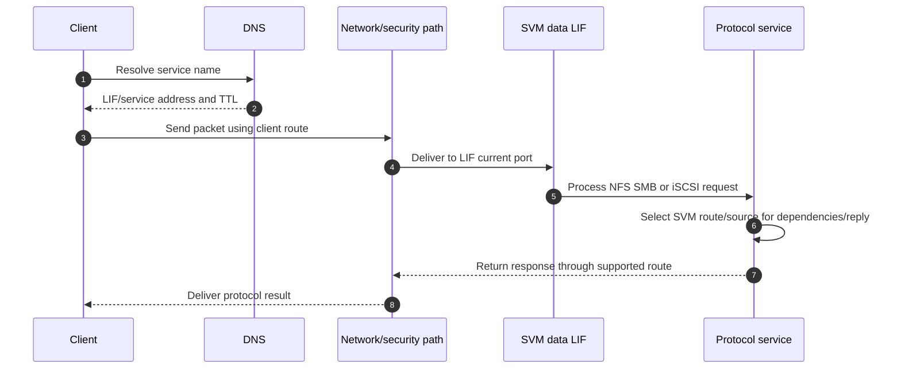

### Routing table reasoning

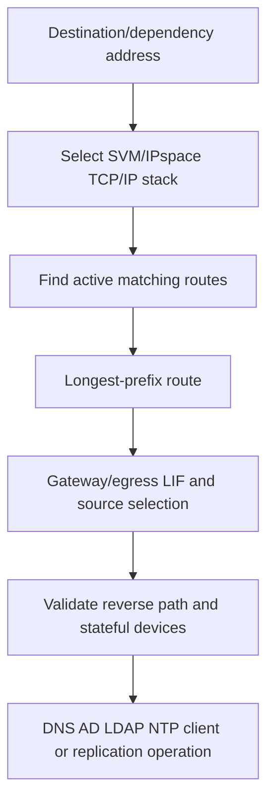

### Name dependencies

| Service | DNS/name requirement examples | Time/identity coupling |
|---|---|---|
| SMB | Data service name, AD domain-controller discovery, service principal | Kerberos, computer account, SPN, group/token |
| NFS | Server name, client-name export rules, LDAP/Kerberos services | UID/GID mapping, KDC, directory cache |
| iSCSI | Often IP portals; DNS can still be used in management/discovery designs | IQN/CHAP mapping is distinct from DNS identity |
| Intercluster | Peer endpoints/names depending on workflow | Certificates/auth and routing under exact feature |

`Ping from cluster management` can use a different SVM/IPspace/route/source than the failing data SVM. Run tests in the correct context with authorized read-only commands.

---

## 7. NAS namespace, SVM root volume, and junctions

An ONTAP NAS SVM presents a unified namespace. The SVM has a **root volume** that provides the top of its namespace; other volumes are attached at **junction paths**. A junction is a namespace attachment, not a copy or network redirect by itself.

### Plain-English deep-dive: hallways and mounted rooms

The SVM root volume is the building's entrance hall. A junction is a doorway at a path such as `/finance` that connects another volume into the visible hallway map. Moving the room's physical foundation can leave the doorway path unchanged. **Why it matters:** clients use stable paths while storage placement can change, but missing junctions or traversal permissions make healthy volumes invisible.

```mermaid
flowchart TB
    ROOT[/ SVM root volume] --> FIN[/finance junction]
    ROOT --> ENG[/engineering junction]
    ROOT --> HOME[/home junction]
    FIN --> VF[FlexVol finance_data]
    ENG --> VE[FlexVol engineering_data]
    HOME --> VH[FlexVol home_dirs]
    VF --> SUB1[/finance/reports]
    VE --> SUB2[/engineering/projects]
    CLIENT[Client path traversal] --> ROOT
    POLICY[Export/share/ACL traversal policy] -.controls.-> ROOT
    POLICY -.controls.-> FIN
```

### Root-volume orientation

- The SVM root volume is structurally important to NAS namespace traversal.
- It should not be treated as an ordinary bulk-data destination without current design guidance.
- Protection, security, capacity, and operational treatment should reflect its namespace role.
- Exact default name, size, efficiency, export policy, snapshot, and recovery requirements are release/workflow specific.

### Junction path rules

| Question | Why it matters |
|---|---|
| Is the volume mounted in the SVM namespace? | An online volume without a junction may not be reachable by expected NAS path. |
| Is the junction path correct and unique? | Clients can traverse the wrong object or receive not-found errors. |
| Can the client traverse parent directories/root export policy? | Child data permissions do not bypass parent path access. |
| Did a volume move preserve namespace attachment? | Physical movement should be abstracted, but verify state. |
| Is a share/export path built on the intended junction? | Share name and namespace path are separate mappings. |

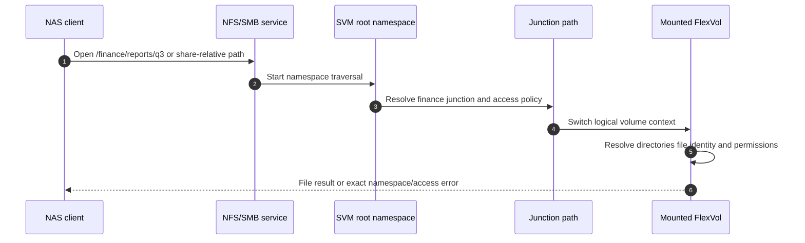

---

## 8. NAS and SAN behavior must be separated

### NAS path

NAS clients access a namespace through NFS or SMB data LIFs. The LIF can move under supported policy while retaining its IP identity. Clients may need ARP/Neighbor Discovery updates, TCP reconnect, NFS state reclaim, SMB handle recovery, DNS/referral behavior, and application retries.

### SAN path

SAN hosts access LUNs/namespaces through multiple target paths. Resilience normally relies on supported host multipathing, target-port state, ALUA/ANA, zoning/mapping, and application timeouts. Do not apply a generic NAS LIF failover design to FC, NVMe/FC, iSCSI, or NVMe/TCP.

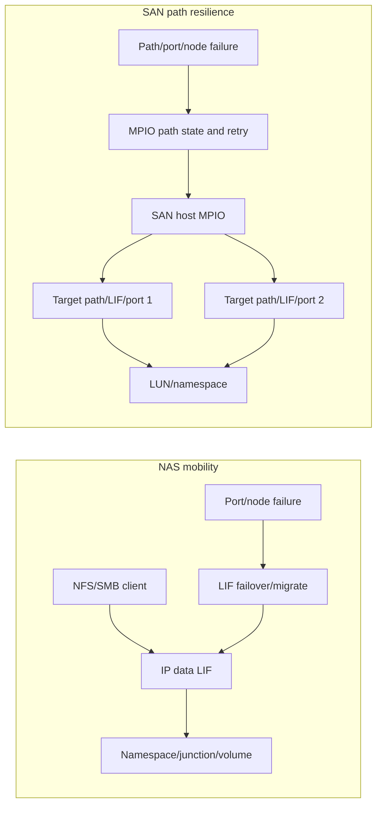

### Comparison

| Dimension | NAS | SAN |
|---|---|---|
| User-visible object | File/path/share/export | LUN/NVMe namespace and host file system |
| Primary network identity | IP/name to NAS data LIF | IP portal or WWPN target port plus stable device identity |
| Mobility mechanism | LIF failover/migration plus protocol recovery | Host MPIO/ALUA/ANA and supported target/path behavior |
| Namespace | SVM root/junction tree | Host-owned file-system/device mapping |
| Critical test | File operation, lock/handle/session after movement | Block I/O, every path, reservation, file system/app after failure |

---

## 9. Policies, RBAC, and delegated administration

**Role-Based Access Control (RBAC)** grants administrative capabilities according to role and scope. A cluster administrator has broad authority; an SVM administrator can be delegated a constrained management scope under current ONTAP behavior.

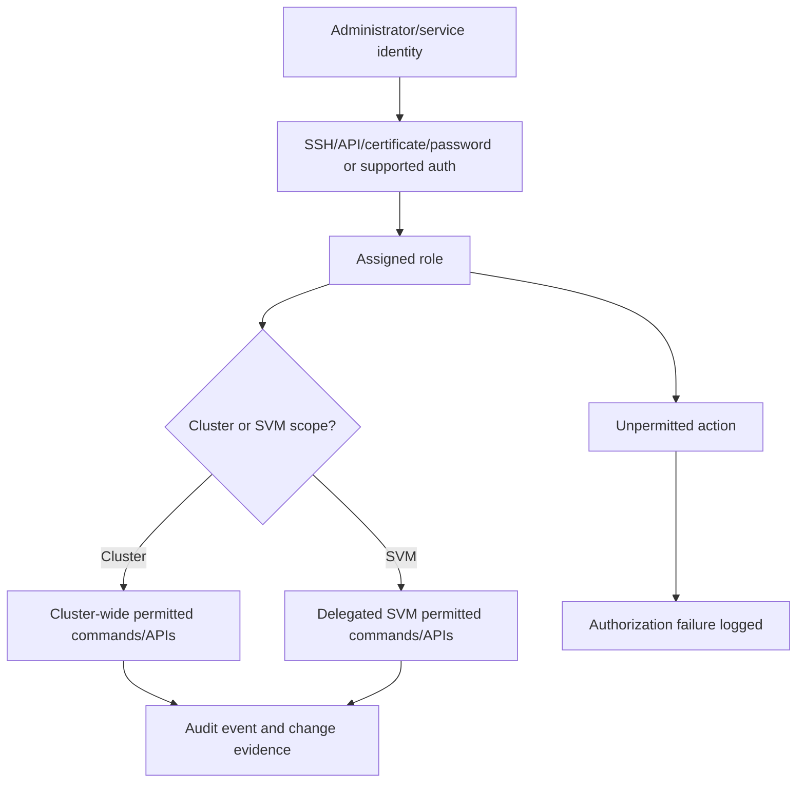

### RBAC design questions

1. Which human/service identity needs which exact outcome?
2. Is cluster-level authority truly required, or can SVM scope suffice?
3. Which commands, REST endpoints, fields, query scope, and privilege level are permitted?
4. Can the role view or alter another tenant's network, volume, snapshot, export, LUN, certificate, or audit evidence?
5. How are credentials, keys, MFA where supported, rotation, break-glass, and offboarding governed?
6. Are denied and successful actions audited and reviewed?

### Delegation limit

Logical delegation does not transfer customer business-risk authority or physical cluster ownership. The cluster administrator and Support still own broader platform actions; the customer owns change approval and risk acceptance.

---

## 10. End-to-end request paths

### NAS request across nodes

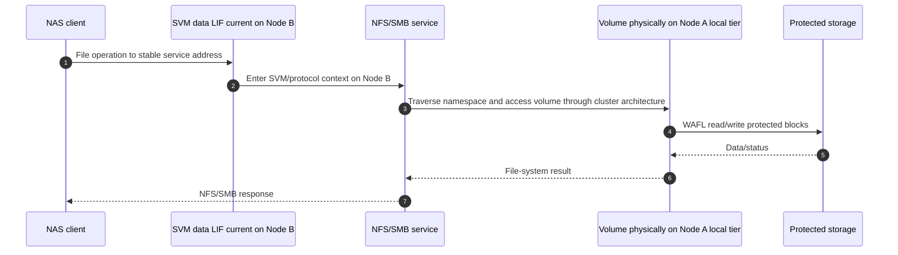

This path can be valid; it also consumes cluster/node resources. Do not call indirect node/data placement a problem without workload and counter evidence.

### SAN request

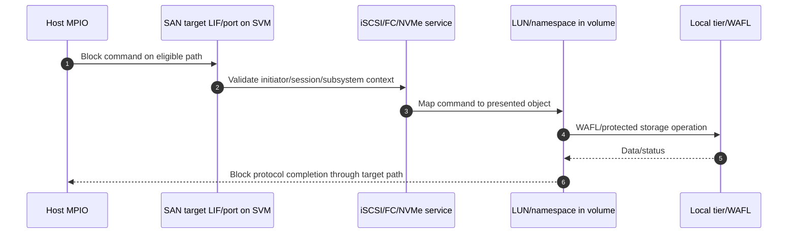

### Intercluster/protection path

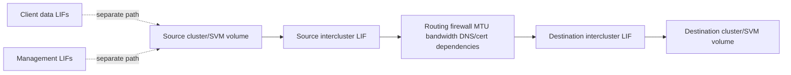

Intercluster LIFs serve peering/replication functions under exact configuration; they are not generic client-data or management interfaces.

---

## 11. Troubleshooting failures by boundary

### Unified fault tree

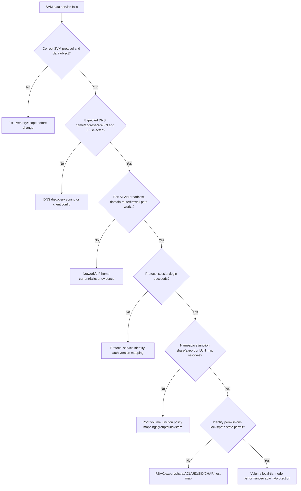

### Common failures and recommendations

| Symptom/failure | Candidate mechanism | Evidence | Safe recommendation direction |
|---|---|---|---|
| LIF is up but clients fail | Wrong VLAN/broadcast domain/route/firewall/service policy | Current port, route/source, switch, capture, protocol status | Correct matched end-to-end path; do not just migrate again |
| LIF cannot fail over | Empty/wrong failover group, reachability/MTU mismatch, no eligible port | Policy/group, broadcast domain, port reachability, node health | Build supported independent targets and test |
| NAS path not found | Missing/wrong junction, root traversal/export/share mapping | Namespace, junction, volume state, policy, exact operation | Restore correct attachment/policy under NAS owner |
| Access denied | SVM protocol identity, export/share/file ACL, name mapping/token | Exact status, selected rule, effective identity | Fix narrow authorization gate; no broad permissions |
| SAN host sees no LUN | Wrong SVM target service, LIF/path, zoning, initiator mapping | Target path/session, igroup/subsystem/map, stable IDs | Correct current IMT-supported map/path |
| Cross-tenant access | Overbroad role, route, share/export/LUN map, admin authority | Positive/negative tests, RBAC/audit, network and data policy | Remove least-privilege violation and assess exposure |
| One tenant slows another | Shared node/port/local tier/cache/background work | Per-SVM/workload/resource counters and time | Apply supported placement/QoS/capacity options after proof |
| Replication fails while client I/O works | Intercluster LIF/route/firewall/cert/peer path | Peer/intercluster and network evidence | Repair protection path separately from data LIF |

### Common misconceptions

| Misconception | Correction |
|---|---|
| `SVM equals a virtual machine` | It is a storage-service virtualization boundary, not a general guest OS. |
| `SVM isolation means separate hardware` | Physical resources and administrators can be shared. |
| `One LIF serves every protocol` | Service policy, SVM, protocol, and port type constrain use. |
| `LIF home port is where it always runs` | Current location can differ after migration/failover. |
| `Broadcast domain is a switch broadcast table` | It is ONTAP's grouping of ports with common Layer 2/MTU reachability context. |
| `Failover group proves path resilience` | Upstream network, client recovery, capacity, and application tests remain. |
| `SVM root volume holds all tenant data` | It anchors the NAS namespace; mounted data volumes hold ordinary content. |
| `Junction moves data` | It attaches a volume into a logical path. |
| `IPspace alone secures a tenant` | Identity, routing/firewall, protocol policy, admin scope, and physical fate remain. |
| `SVM admin can fix cluster hardware` | Delegation is scoped; cluster/platform actions remain outside role. |

---

## 12. Evidence and escalation pack

### Evidence map

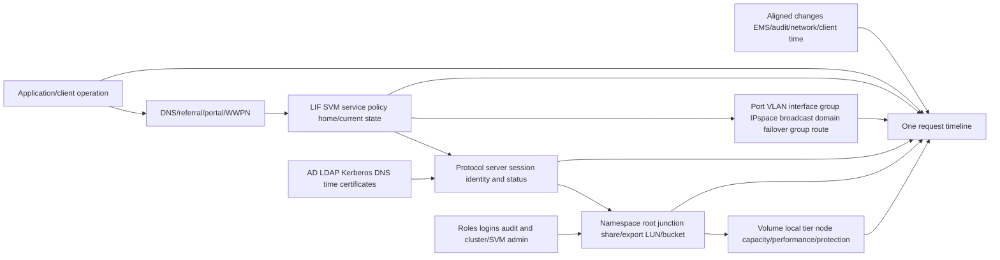

### Minimum escalation pack

- Business service, tenant/SVM, application, operation/path/LUN, impact, SLO/RPO/RTO, scope, and UTC timeline.
- Cluster/platform/ONTAP release; SVM identity/type/state; enabled protocols and licenses/support state.
- LIF name, role/service policy, address/WWPN, home/current node/port, admin/oper state, failover policy/group and movement history.
- Physical/VLAN/interface-group port, IPspace, broadcast domain, MTU, subnet, routes, gateways, DNS, firewall, upstream switch/path and reachability.
- Protocol server identity/config/session: NFS version/export, SMB server/share/SPN/token, iSCSI/FC/NVMe target/map, object endpoint/policy as applicable.
- SVM root volume, namespace/junction path, volume state/placement, share/export/ACL, LUN/igroup/subsystem and stable object IDs.
- Identity/name-service evidence, certificates/keys, time, RBAC role/scope, successful/denied audit, and cross-tenant negative tests.
- Node/local-tier/volume workload, capacity, protection, events and shared-resource evidence.
- Exact official docs/IMT/HWU, command/API fields/date, access gaps, actions tried/results/rollback, competing hypotheses, exact ask and owner/deadline.

---

## 13. TAM discovery, risk, recommendation, and JD Mapping

### Discovery questions

1. Which business tenant/service, application, protocol, path/LUN, criticality, SLO, RPO/RTO, and owner apply?
2. Which SVM identity/type, protocol servers, root/data volumes, namespace/junctions, LUNs/buckets, protection, and lifecycle exist?
3. Which LIF service policies, home/current locations, ports/VLANs/interface groups, IPspaces, broadcast domains, failover groups/policies, routes, DNS and firewalls apply?
4. Which AD/LDAP/Kerberos/DNS/time/certificate/CHAP/host identities and permissions govern access?
5. Which cluster/SVM administrators, roles, commands/APIs, service accounts, audit, break-glass and cross-tenant controls exist?
6. Which node/local tier/port/switch/power/site/resources are shared between tenants?
7. Which NAS LIF movement/session/lock/handle and SAN MPIO/path/ALUA/ANA behavior is supported and tested?
8. Which current ONTAP release, product documentation, IMT/HWU result/notes and lifecycle constraints apply?
9. What positive/negative isolation, failover, performance, recovery, and delegated-admin tests exist?
10. What exact evidence would disconfirm network, protocol, namespace, identity, tenancy and storage hypotheses?

### Recommendation model

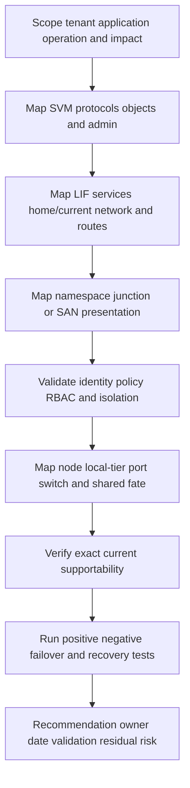

### Recommendation patterns

| Finding | Risk | Bounded recommendation | Validation |
|---|---|---|---|
| Two regulated tenants share IPspace/routes/admin role unexpectedly | Cross-tenant reach/authority exceeds intended boundary | Design documented SVM/IPspace/RBAC/network separation with security owner | Positive/negative network, admin, data and audit tests |
| NAS LIF failover targets share one switch | Port redundancy does not cover switch loss | Add supported physically independent eligible target and correct upstream path | Switch failure plus file/session/application test |
| SVM root volume lacks clear protection/owner | Namespace recovery can be delayed | Assign owner and current supported protection/recovery procedure | Restore namespace/junction traversal in isolated test |
| Data LIF current port differs from home for months | Hidden degraded state/capacity or failed revert can persist | Investigate original event and supported revert/target design; do not move blindly | Home/current path and workload healthy after approved action |
| SVM admin role is broader than job | Tenant or cluster configuration can be altered unnecessarily | Reduce to current API/command least privilege and rotate credentials | Allowed/denied tests and audit review |

### JD Mapping

| JD responsibility | Part 22 contribution | Your factual bridge and gap |
|---|---|---|
| Understand environment | Maps tenant/SVM/LIF/namespace/identity/storage and ownership | M365/AD/Azure dependency mapping transfers; ONTAP admin unproven |
| Storage/network depth | Explains LIF roles, broadcast domains, failover groups, routes, namespace/junctions, SAN split | Conceptual/synthetic knowledge only |
| Risk/stability | Finds failed paths, namespace gaps, cross-tenant exposure, shared fate and degraded LIF state | critical situation and network evidence method transfers |
| Security/supportability | Builds RBAC/isolation tests and exact IMT/HWU/release record | Identity/permissions experience strong; NetApp tools/access gap explicit |
| Recommendations | Connects evidence to tenant-safe action and validation | Customer advisory/follow-through transfers |
| Service review | Reports tenant health, path tests, access risks, capacity and actions | Analytics/business reviews transfer |
| Escalation | Supplies complete SVM/LIF/network/object/identity timeline | Product/Engineering evidence discipline transfers |

---

## 14. Fully synthetic scenario: Contoso Research and Finance tenants

> **Synthetic case:** Contoso, its tenants, addresses, paths, events, and outcomes are fictional. This is not a NetApp design, internal process, or documented production experience.

### Environment

- SVM `finance` serves SMB and iSCSI.
- SVM `research` serves NFS.
- Both use different IPspaces but share two physical switch chassis and one local tier.
- Finance NAS root has `/dept` junction; the data volume was moved to another node/local tier last week.
- A finance SMB data LIF failed over from node A to node B.
- Research administrators have an overbroad custom role inherited from a lab phase.

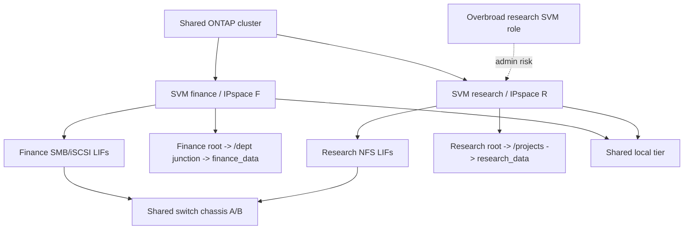

### Symptoms

1. Finance users in one subnet cannot open `\\finance\dept` after switch maintenance.
2. Finance iSCSI hosts remain healthy through MPIO.
3. Research NFS is healthy, but an audit shows the research service identity can view more SVM network fields than intended.
4. The customer concludes the finance volume move broke SMB and that separate SVMs prove compliance.

### Evidence

| Evidence | Observation | Bounded interpretation |
|---|---|---|
| Finance data LIF | Current on node B; home node A port unavailable | Expected failover state, but path must be validated |
| Broadcast/failover | Node B target is in correct ONTAP broadcast domain | ONTAP eligibility alone does not prove upstream switch VLAN |
| Switch | VLAN is absent from node B trunk after maintenance | Strong SMB path mechanism for affected subnet |
| Namespace | Root/junction and finance_data volume are online and traversal works locally/other subnet | Weakens volume-move/junction hypothesis |
| iSCSI | MPIO uses separate target paths; block I/O healthy | SAN resilience is separate from SMB LIF path |
| Research RBAC | Custom role permits broader network reads than job requires | Least-privilege gap; not evidence of cross-tenant data access yet |
| Shared resources | Both SVMs share local tier/switch chassis | Separate namespaces do not equal physical isolation |

### Fault split

```mermaid
flowchart TD
    TOP[SMB path failure plus RBAC audit concern] --> SPLIT[Separate service and governance workstreams]
    SPLIT --> SMB[Finance SMB]
    SPLIT --> RBAC[Research RBAC]
    SMB --> LIF{Correct LIF current port and service policy?}
    LIF -->|Yes| VLAN{VLAN route and firewall work on failover path?}
    VLAN -->|No| NET[Correct switch trunk/path under network ownership]
    VLAN -->|Yes| NS[Check DNS session share junction ACL storage]
    RBAC --> NEED[Define research admin job and required APIs/commands]
    NEED --> GAP[Compare custom role and audit use]
    GAP --> LEAST[Reduce role and validate allowed/denied operations]
    NET --> TEST[Test SMB failover and app operation]
    LEAST --> TEST2[Test tenant admin and cross-tenant denial]
```

### Recommendations

1. Network owner should restore the approved finance VLAN on the exact node B failover path and validate both switch paths; do not move the LIF back merely to hide the alternate-path defect.
2. Storage/SMB owners should preserve current/home LIF state and verify namespace, junction, share, identity and application operation after path repair.
3. SAN owners should retain separate MPIO evidence; healthy iSCSI neither proves nor disproves the SMB VLAN failure.
4. Security/cluster administrators should replace the research custom role with exact least privilege and test allowed/denied API/CLI scope plus audit.
5. Update the compliance statement: SVMs separate named logical controls, while local tier, switch, cluster administrator and site remain shared residual risks.

### Customer-facing summary

> "The finance volume and junction are healthy. The SMB outage appears only after the data LIF moves to node B, where the required VLAN is missing from the switch trunk; iSCSI remains healthy through a separate MPIO path. The research finding is also separate: its custom SVM role is broader than the job requires, although current evidence does not show cross-tenant data access. We recommend repairing and testing the failover path, tightening delegated RBAC, and rewriting the isolation claim to name both logical controls and shared physical/administrative dependencies."

---

## 15. Your prior/Azure/identity/analytics bridge

```mermaid
flowchart LR
    SPO[SharePoint/OneDrive production support] --> NS[Namespace permissions and user-operation reasoning]
    AD[Active Directory/Windows] --> ID[Identity group token DNS time and service-name dependencies]
    AZ[Azure VM/networking] --> NET[Virtual network routing failover and shared responsibility]
    CRIT[Critical situation/escalation] --> EVID[Scope timeline owners and safe action]
    BI[Analytics/business reviews] --> RISK[Trend risk action and audit reporting]
    NS --> SVM[SVM/LIF synthetic analysis]
    ID --> SVM
    NET --> SVM
    EVID --> SVM
    RISK --> SVM
    SVM --> LAB[Authorized ONTAP lab and SME review]
```

### Transfer and gap

| Factual strength | Transfer | Unproven NetApp area |
|---|---|---|
| SharePoint/OneDrive permissions and paths | Separate service entry, identity, object permission and user result | ONTAP root volume/junction/export/share configuration |
| AD/DNS/Windows networking | Trace names, routes, Kerberos, tokens and failover path | SVM name services, LIF service policy and routing administration |
| Azure/VM | Understand logical tenancy versus shared infrastructure | IPspace/broadcast-domain design in ONTAP |
| Analytics/escalations | Correlate evidence, audit scope, risk and actions | ONTAP commands/APIs and production multi-tenant operation |

### Honest answer

> "I understand SVMs as logical storage-service and administrative boundaries, LIFs as stable identities with home/current locations, and NAS namespaces as root volumes plus junction-mounted FlexVol volumes. I can reason about IPspaces, broadcast domains, failover groups, routes, RBAC, and shared-fate limits, and I keep SAN MPIO separate from NAS LIF movement. My production experience is cloud and identity support, not ONTAP SVM administration, so I would use current docs, authorized evidence, IMT/HWU and NetApp specialists for real changes."

---

## 16. Whiteboard drills

1. **Tenant:** Draw two SVMs and label what is isolated versus physically shared.
2. **LIF:** Explain home/current port, service policy, failover group and client recovery.
3. **Network:** Port -> VLAN/interface group -> IPspace -> broadcast domain -> LIF -> route -> firewall.
4. **Namespace:** Root volume -> junction -> FlexVol -> file; add traversal policy.
5. **NAS versus SAN:** LIF movement/session recovery versus MPIO/ALUA path recovery.
6. **RBAC:** Identity -> role -> cluster/SVM scope -> allowed/denied action -> audit.
7. **Request:** Trace one SMB/NFS request where LIF and data volume are on different nodes.
8. **Isolation:** Explain why `separate SVM` is not a physical or compliance conclusion by itself.

---

## 17. Paper lab: tenant and request-path evidence pack

No ONTAP access is required. Use synthetic inventories and public official documentation.

### Scenario

A four-node cluster hosts four SVMs: Windows file, Linux research, VMware iSCSI, and replication target. There are two IPspaces, six broadcast domains, sixteen data LIFs, four intercluster LIFs, three DNS views, AD and LDAP identity, twelve junctions, two custom SVM roles, and shared physical ports/local tiers. Existing diagrams omit current LIF locations, routes, role permissions, and client failure tests.

### Tasks

1. Build SVM/protocol/data-object/admin ownership inventory.
2. Map every LIF role/service policy, address/WWPN, home/current node/port and state.
3. Draw physical ports, VLANs/interface groups, IPspaces, broadcast domains, failover groups, routes, DNS and firewalls.
4. Draw every NAS root/junction/data volume and every SAN target/map/LUN path.
5. Identify identity, certificate, key, DNS, time and external directory dependencies.
6. Build cluster-admin/SVM-admin RBAC allowed/denied matrix and audit plan.
7. Test tenant isolation across data, management, network, identity, performance, protection and physical domains.
8. Inject one port, switch, route, DNS, root-volume, junction, identity, target-path and local-tier failure.
9. Model NAS LIF migration/failover separately from SAN MPIO path loss.
10. Correlate one client request through LIF/service/namespace or LUN to volume/local tier.
11. Create shared-fate and noisy-neighbor evidence hypotheses.
12. Define safe stop/rollback and Support boundaries.
13. Write two recommendations and one compliance-safe isolation statement.
14. Present an executive and technical version.

### Lab flow

```mermaid
flowchart LR
    INV[Inventory SVMs LIFs objects roles] --> NET[Map network/routing/failover]
    NET --> NS[Map NAS/SAN data objects]
    NS --> ISO[Test identity RBAC and tenant isolation]
    ISO --> FAIL[Inject path/namespace/admin failures]
    FAIL --> EVID[Correlate request and shared-resource evidence]
    EVID --> REC[Recommend and state residual shared fate]
```

### Lab pass criteria

- [ ] SVM is not described as a general VM or physical boundary.
- [ ] Current/home LIF and data placement are independent facts.
- [ ] Service policy, role, network path and protocol are explicit.
- [ ] IPspace, broadcast domain and failover group are distinct.
- [ ] Root volume, junction, data volume and client path are distinct.
- [ ] NAS and SAN resilience use separate mechanisms/tests.
- [ ] RBAC includes exact scope, authentication, audit and negative tests.
- [ ] Isolation statement names controls and residual shared dependencies.
- [ ] Current release/IMT/HWU evidence and access gaps are recorded.
- [ ] No synthetic result is presented as production ONTAP experience.

---

## 18. Self-test

1. Define SVM/storage VM, historical vserver term, and special/data SVM contexts.
2. Explain multi-tenancy dimension by dimension and list shared dependencies.
3. Define LIF, service policy, home/current port and operational/admin state.
4. Compare cluster management, node management, cluster, data and intercluster LIF contexts.
5. Define physical port, VLAN, interface group, IPspace, broadcast domain and failover group.
6. Draw LIF failover decision and client recovery.
7. Explain why link-up and broadcast-domain membership do not prove reachability.
8. Build an SVM route/DNS/return-path analysis.
9. Define SVM root volume, unified namespace and junction path.
10. Trace NAS namespace traversal across a junction.
11. Explain why an online volume can be inaccessible by path.
12. Compare NAS LIF mobility with SAN MPIO/ALUA/ANA resilience.
13. Define cluster versus SVM administration and RBAC delegation.
14. Build least-privilege and cross-tenant positive/negative tests.
15. Trace NAS, SAN and intercluster request paths.
16. Apply the unified fault tree and common-failure table.
17. Build the minimum escalation pack.
18. Ask the TAM discovery questions and write a bounded recommendation.
19. Recreate Contoso's VLAN failover and RBAC findings as separate workstreams.
20. Complete all whiteboard drills, paper lab and Q1-Q8 aloud.
21. State your strengths and ONTAP SVM/LIF production gap precisely.

---

## 19. Official Source Anchors

**Date checked: 2026-08-24.** These official public sources anchor broad SVM, LIF, namespace and administration concepts. Exact LIF roles/service policies, protocol support, failover groups/policies, IPspaces, broadcast domains, routing, junction behavior, root-volume handling, RBAC, commands, REST fields, limits and defaults are ONTAP-release sensitive. Re-open the exact release documentation, use IMT/HWU, and preserve authorized evidence.

| Topic | Official public source | Bounded use and currency note |
|---|---|---|
| Storage virtualization/SVMs | [ONTAP storage virtualization](https://docs.netapp.com/us-en/ontap/concepts/storage-virtualization-concept.html) | Broad SVM/LIF/volume abstraction and historical vserver terminology. |
| SVM use cases | [ONTAP SVM use cases](https://docs.netapp.com/us-en/ontap/concepts/svm-use-cases-concept.html) | Broad data-service and tenant use; exact protocol combinations need release validation. |
| Cluster and SVM administrators | [ONTAP cluster and SVM administration](https://docs.netapp.com/us-en/ontap/concepts/cluster-svm-administrators-concept.html) | Broad delegation concepts; exact RBAC commands/APIs require current auth docs. |
| Network management | [ONTAP network management](https://docs.netapp.com/us-en/ontap/network-management/) | Current ports, VLANs, interface groups, IPspaces, broadcast domains, failover groups/policies, LIFs, routes and DNS entry point. |
| NAS path failover | [Configure ONTAP NAS path failover](https://docs.netapp.com/us-en/ontap/networking/set_up_nas_path_failover_98_and_later_cli.html) | Release-specific workflow; verify exact current LIF policies and topology. |
| LIF roles/service policies | [ONTAP LIFs and service policies](https://docs.netapp.com/us-en/ontap/networking/lifs_and_service_policies96.html) | Current concepts can differ by release; inspect effective service policy. |
| Namespace and junctions | [ONTAP namespaces and junction points](https://docs.netapp.com/us-en/ontap/concepts/namespaces-junction-points-concept.html) | Broad SVM root/unified namespace/junction orientation. |
| NAS management | [ONTAP NAS management](https://docs.netapp.com/us-en/ontap/nas-management/) | NFS/SMB namespace, identity and policy operations by exact release. |
| SAN management | [ONTAP SAN management](https://docs.netapp.com/us-en/ontap/san-management/) | Target LIFs, LUNs, igroups/subsystems and host integration; validate IMT. |
| Authentication/RBAC | [ONTAP authentication and access control](https://docs.netapp.com/us-en/ontap/authentication-access-control/) | Current user, role, SSH/API/certificate and audit-related administration. |
| IMT | [NetApp Interoperability Matrix Tool](https://imt.netapp.com/) | Official, potentially gated exact host/protocol/storage support result and notes. |
| HWU | [NetApp Hardware Universe](https://hwu.netapp.com/) | Official, potentially gated exact port/platform limits and rules. |

### Source-use discipline

- Record exact cluster/SVM/LIF/object identity, ONTAP release, current/home location, role/service policy and date.
- Use current networking docs for broadcast domains, reachability, failover policies, routes and MTU; older role/default language can mislead.
- Treat IPspace as logical routing separation, not physical/compliance proof.
- Validate namespace root/junction/share/export and SAN mapping independently.
- Test RBAC allowed and denied operations and review audit evidence.
- Save exact IMT result/notes and HWU facts; state access gaps instead of inventing them.

---

## Likely Interview Questions

### Q1. What is an ONTAP SVM, and how does it support multi-tenancy?

> **Model answer:** "An SVM, historically called a vserver, is a logical ONTAP data-service and administrative boundary. It can own protocol services, LIFs, routes, volumes/LUNs, NAS namespace, identity/security and delegated administration. Separate SVMs can isolate those logical controls, but they can still share nodes, ports, switches, local tiers, keys, cluster admins and sites. I state isolation by dimension and validate positive and negative access rather than saying an SVM is separate hardware."

**Follow-up depth:** Draw two SVMs and identify data, network, identity, RBAC, performance, protection and physical shared-fate boundaries.

### Q2. What is a LIF, and what are home and current ports?

> **Model answer:** "A LIF is a logical network identity associated with an SVM and service policy, such as an IP data interface or supported SAN target identity. The home node/port is its preferred configured location; the current node/port is where it is hosted now. A migration is planned movement and failover is policy-driven movement. Moving a LIF does not move the volume or local tier, and client/session recovery remains protocol-specific."

**Follow-up depth:** Explain cluster/node-management/data/intercluster contexts, service policy, admin/oper state and a LIF away from home.

### Q3. How do broadcast domains, failover groups and failover policies relate?

> **Model answer:** "A broadcast domain groups ONTAP ports with a common Layer 2 and MTU reachability context in an IPspace. A failover group contains candidate ports on which a LIF may be hosted, and a failover policy constrains which candidates are eligible. ONTAP eligibility does not prove upstream VLAN, route, firewall, physical independence, capacity or client recovery. I validate current port reachability and then test the real protocol through a named failure."

**Follow-up depth:** Draw port/VLAN/interface group/IPspace/broadcast domain/failover group/LIF and diagnose a missing standby VLAN.

### Q4. How do SVM routing and DNS affect data services?

> **Model answer:** "An SVM operates in an IPspace/TCP-IP context with LIFs and routes. The correct source LIF, longest-prefix route, gateway, return path and stateful devices must reach clients and dependencies such as DNS, AD, LDAP or intercluster peers. DNS selects service and identity names, especially for SMB/Kerberos and name-based NFS policy. A cluster-management ping can use another SVM and route, so I test from the correct context and correlate the actual request."

**Follow-up depth:** Work one SMB AD path, one NFS LDAP path and one intercluster route with separate evidence.

### Q5. Explain the SVM root volume, namespace and junctions.

> **Model answer:** "For NAS, the SVM root volume anchors the top of a unified namespace. Other FlexVol volumes are attached at junction paths such as `/finance`, much like rooms connected to an entrance hallway. Clients traverse the root and junction to the data volume under export/share and file permissions. A junction does not copy or move data, and an online volume without the expected junction or parent traversal access can be inaccessible by path."

**Follow-up depth:** Draw root -> junction -> data volume -> share/export and explain volume move, root recovery and parent policy.

### Q6. Why are NAS and SAN LIF failover different?

> **Model answer:** "NAS clients use an IP/name and stateful file protocol, so supported LIF movement can retain the address while ARP/ND, TCP, NFS locks/leases or SMB handles recover. SAN hosts are designed around multiple target paths, stable device identity, MPIO and ALUA/ANA state; FC also uses WWPN target ports. I do not apply NAS failover assumptions to SAN. I validate every host path and application timeout for the exact protocol and release."

**Follow-up depth:** Compare an SMB LIF switch failure with an iSCSI/FC target-path failure and name the acceptance tests.

### Q7. How would you design and validate SVM administrative isolation?

> **Model answer:** "I start with job outcomes, then assign the smallest current ONTAP role at SVM rather than cluster scope where possible. I verify exact commands/REST endpoints, fields, authentication, certificate/key handling, credential rotation, break-glass and offboarding. I run allowed and denied tests across network, volumes, snapshots, protocols and other SVMs and review audit records. Delegation does not transfer cluster hardware authority or customer business-risk ownership."

**Follow-up depth:** Build a role for a file-service operator and show which cluster/network/protection actions remain denied.

### Q8. How does your prior background transfer, and what remains a gap?

> **Model answer:** "SharePoint/OneDrive and AD support taught me to separate service entry, namespace, identity, group/token, object permission, DNS/network and user outcome. Azure/VM work helps me distinguish logical tenancy from shared physical infrastructure, and critical situation/analytics work helps with evidence and risk. I have not administered ONTAP SVMs, LIFs, junctions or RBAC in production. I would use current documentation, authorized read-only evidence, IMT/HWU and NetApp specialists for real changes."

**Follow-up depth:** Give one factual Microsoft permissions or network case and state which ONTAP service-policy, route, junction and role facts remain unproven.

---

## 30-Second Memory Hooks

- **SVM:** Tenant/service suite inside the cluster, historically `vserver`.
- **Multi-tenancy:** Name each isolated control and each shared dependency.
- **LIF:** Stable network identity hosted on a current port.
- **Home/current:** Preferred desk versus desk answering now.
- **Service policy:** Which services that LIF may provide.
- **IPspace:** Separate IP/routing domain, not physical isolation.
- **Broadcast domain:** ONTAP's common Layer 2/MTU reachability group.
- **Failover group/policy:** Candidate ports plus rules, not application proof.
- **Route:** Correct SVM context, source, gateway and return path.
- **SVM root volume:** Entrance hall of the NAS namespace.
- **Junction:** Doorway attaching another volume at a path.
- **NAS:** LIF movement plus file-session recovery.
- **SAN:** Multiple target paths plus MPIO/ALUA/ANA.
- **RBAC:** Identity -> least role -> exact scope -> audit.
- **Isolation:** Apartment walls still share elevators, power and master keys.
- **Your bridge:** M365/AD/Azure reasoning transfers; ONTAP SVM operation remains unclaimed.

---

## Completion Checklist

- [ ] Define SVM/storage VM, historical vserver terminology and special/data SVM contexts.
- [ ] Explain multi-tenancy by namespace, network, identity, RBAC, performance, protection and physical failure domains.
- [ ] Define LIF, service policy, home/current node/port and admin/oper state.
- [ ] Distinguish cluster management, node management, cluster, data and intercluster LIF contexts.
- [ ] Map physical ports, VLANs, interface groups, IPspaces, broadcast domains, failover groups/policies and routes.
- [ ] Explain why ONTAP eligibility/link-up does not prove upstream reachability or app recovery.
- [ ] Trace LIF migration/failover/revert and test independent targets.
- [ ] Trace SVM routes, DNS, AD/LDAP/time and return paths in the correct context.
- [ ] Define root volume, unified namespace and junction and trace a client path.
- [ ] Distinguish share/export/ACL and SAN mapping from namespace attachment.
- [ ] Separate NAS LIF/session recovery from SAN MPIO/target-path recovery.
- [ ] Design cluster/SVM RBAC, credential and audit controls with allowed/denied tests.
- [ ] Trace NAS, SAN and intercluster request paths across nodes/resources.
- [ ] Apply the fault tree, common-failure table and tenant-isolation tests.
- [ ] Build the complete evidence/escalation pack.
- [ ] Ask all TAM discovery questions and write a bounded recommendation.
- [ ] Recreate Contoso's VLAN failover, volume/junction evidence, SAN separation and RBAC finding.
- [ ] Complete all whiteboard drills, paper lab, self-test and Q1-Q8 aloud.
- [ ] State your strengths and ONTAP SVM/LIF production gap precisely.
- [ ] Recheck exact ONTAP docs, IMT, HWU, service policies, commands/API fields, limits and support state before customer use.

---

*Next suggested section:* [Part 23 - ONTAP Storage Layout: Disks, Partitions, RAID Groups, Aggregates, and Volumes](Part-23-ontap-disks-raid-aggregates-volumes.md)