# Part 23 - ONTAP Storage Layout: Disks, Partitions, RAID Groups, Aggregates, and Volumes

> **Section goal:** Build a precise physical-to-logical map from supported drives or SSDs through ownership, partitioning, RAID groups, plexes, local tiers, FlexVol volumes, files/LUNs, snapshots, and space policies. By the end, Arti should be able to explain capacity and failure scope, distinguish every root/data object, challenge misleading `free space` claims, and make a version-safe recommendation without inventing platform specifications.

Covers index item **23** and maps directly to job-description responsibilities for storage depth, install-base accuracy, capacity/risk analysis, solution stability, lifecycle planning, customer-specific recommendations, supportability, service reviews, and escalation quality.

Exact drive/SSD support, ownership, root-data or root-data-data partitioning, RAID type/default/group size, plex/mirroring behavior, local-tier limits, root requirements, volume type, guarantees, reserves, Snapshot accounting, autosize/autodelete, inode/file limits, commands, and API fields vary by platform and ONTAP release. Verify current official documentation, **Interoperability Matrix Tool (IMT)**, **Hardware Universe (HWU)**, release notes, and authorized system evidence. This Part intentionally gives no hard platform numbers.

> **Evidence and experience boundary:** Every system, capacity, device, failure, forecast, and recommendation below is synthetic. Arti's factual strengths are Microsoft enterprise support, Azure/VM/networking, analytics, capacity/trend reasoning, and escalation ownership. She does **not** claim production ONTAP disk ownership, RAID, aggregate/local-tier, partitioning, volume, autosize, Snapshot-space, or hardware administration experience.

---

## 1. The complete physical-to-logical ladder

### Plain-English deep-dive: land, protected district, building, and rooms

- A drive/SSD or partition is a plot of land contributed to one node.
- A RAID group is a protected construction team across several plots.
- A plex is one complete copy/layout side containing RAID groups.
- A local tier/aggregate is a protected district supplying capacity.
- A FlexVol is a logical building that draws rooms from the district.
- Files and LUNs are tenant contents inside the building.

**Why it matters:** each layer has different ownership, failure tolerance, capacity accounting, mobility, and support rules. `The disk is full`, `the aggregate is full`, and `the volume is full` are different technical statements.

```mermaid
flowchart TB
    MEDIA[Supported HDD SSD or NVMe media] --> PART[Whole-drive or supported partitions]
    PART --> OWNER[Node ownership]
    OWNER --> RG[RAID groups]
    RG --> PLEX[Plex]
    PLEX --> LT[Local tier / aggregate]
    LT --> VOL[FlexVol / supported volume type]
    VOL --> QT[Optional qtrees/directories]
    VOL --> LUN[LUN files / block objects]
    VOL --> NAS[Files and NAS namespace]
    VOL --> SNAP[Snapshot block references]
    PROT[RAID parity/mirror/spare protections] -.applies below.-> LT
```

### Object and owner table

| Object | Primary owner/scope | What it supplies | What it does not prove |
|---|---|---|---|
| Drive/SSD | Assigned node/platform | Physical capacity and media service | Usable capacity or application performance |
| Partition | Assigned node under supported Advanced Drive Partitioning | Root/data contribution from shared physical device | Independent physical failure domain |
| RAID group | Local tier/plex | Device-failure protection within group | Backup, site resilience, or application consistency |
| Plex | Local tier | One complete RAID side/copy organization | Remote DR unless exact mirrored design says so |
| Local tier/aggregate | Node-owned protected pool | Blocks for volumes | Client namespace, file permission, or application availability |
| FlexVol | SVM logical volume | Files, LUNs, policies, snapshots | Dedicated devices or performance isolation by default |
| Snapshot | Point-in-time block references | Local recovery point | Independent backup or application consistency |

### Mapping one application object

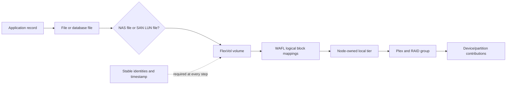

---

## 2. Drives, SSDs, NVMe media, and ownership

ONTAP uses only supported media in supported platform/shelf/configuration combinations. The generic word **disk** can appear in commands and documentation even when the physical device is solid-state. Always record media type, model, capacity, firmware, shelf/slot, ownership, partitioning, RAID role, health, and support state.

### Plain-English deep-dive: physical identity before logical labels

A shelf slot label is a parking bay; the drive serial is the vehicle identity; the ONTAP disk name is the fleet-system record; ownership says which node dispatches it; a partition says several logical duties share one physical vehicle. **Why it matters:** replacing, assigning, or zeroing the wrong identity can damage protection or data.

| Identity/evidence | Question |
|---|---|
| Serial/unique device identity | Which physical device is this? |
| Shelf/bay/slot | Where is it physically now? |
| ONTAP disk/partition name | How does this release represent it logically? |
| Container/owner/home node | Which node owns/uses it? |
| RAID role/group/plex/local tier | What protected data contribution does it provide? |
| Firmware/media/type/capacity | Is it supported and compatible with peers/spares? |
| Health/errors/paths | Is it usable, failing, missing, rebuilding, or path-degraded? |

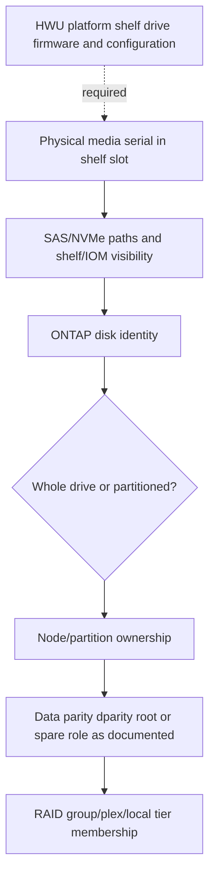

### Ownership

Disk or partition ownership associates physical capacity with a node. An HA partner can access its partner's storage under takeover design, but that does not make every disk jointly owned in normal operation. Exact automatic assignment, manual assignment, unowned media, pool ownership, and MetroCluster rules require current procedures.

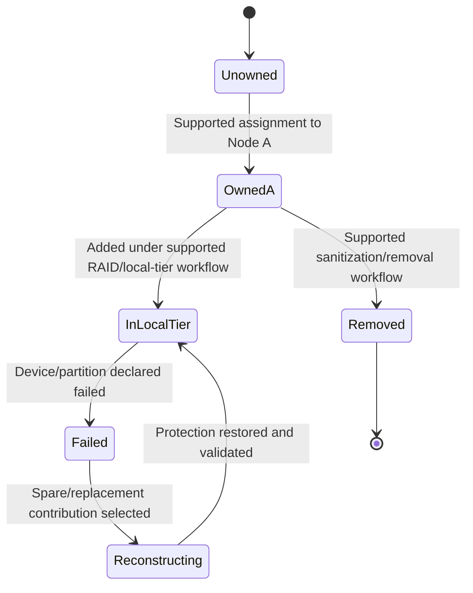

Never assign, remove, zero, sanitize, or rehome media from a generic checklist. Preserve identity and current protection, then follow exact platform/Support guidance.

---

## 3. Advanced Drive Partitioning orientation

**Advanced Drive Partitioning (ADP)** allows ONTAP to divide supported physical drives into partitions assigned to system/root and data purposes so physical capacity can be used efficiently. Current concepts include **root-data partitioning** and, on supported systems, **root-data-data partitioning**. Exact platform support, partition counts/layout, sizes, ownership, spare requirements, and operations are version-sensitive.

### Conceptual root-data partitioning

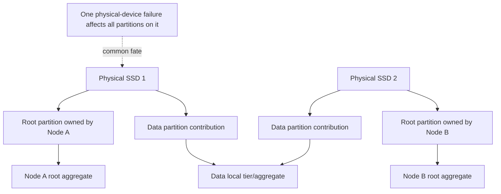

### Root-data-data orientation

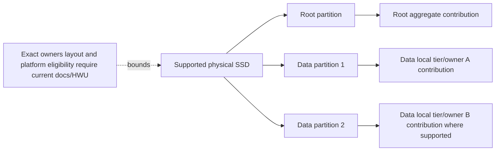

### Partitioning cautions

| Misconception | Correction |
|---|---|
| A partition is a separate drive | Partitions share one physical media/controller/path failure. |
| Root partitions contain SVM root volumes | Node root aggregate/volume and SVM root volume are different objects. |
| A spare data partition protects every partition type | Spare eligibility is partition/type/platform specific. |
| Partition layout can be manually recreated from memory | Use supported assignment/replacement procedures and exact evidence. |
| Physical drive count equals data-drive count | Partition contributions and RAID roles change accounting. |

ADP improves utilization but makes identity mapping more important: a single device event can affect several partition roles and owners.

---

## 4. RAID groups and RAID roles

A **RAID group** is a set of whole drives or partitions protected together under a supported RAID type. Part 6 introduced RAID-DP and RAID-TEC conceptually; this Part places them inside ONTAP local tiers.

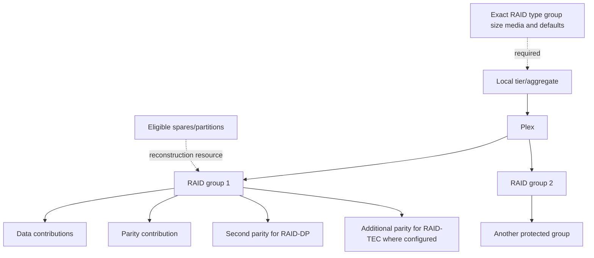

### RAID role vocabulary

| Role | Orientation | Caution |
|---|---|---|
| Data | Holds encoded customer/system data contribution | Not a named file or LUN by itself |
| Parity | Recovery information under RAID type | Not a full duplicate |
| Double parity | Additional independent parity under RAID-DP orientation | Exact layout/internal algorithm is product-specific |
| Triple parity | Additional parity under RAID-TEC orientation | Exact platform/media recommendation must be current |
| Spare | Eligible capacity for replacement/reconstruction | Not backup and can have partition/media constraints |
| Broken/failed/pending copy-like states | Operational states under exact release | Do not interpret or repair without current docs/Support |

### RAID-group failure scope

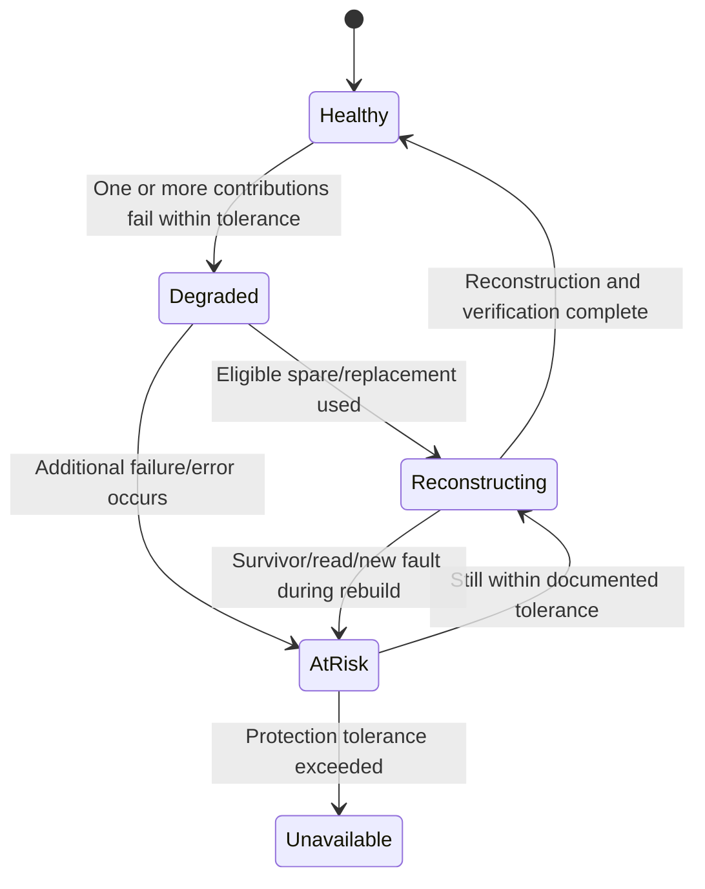

`Local tier online` does not mean every RAID group has full protection; inspect group/member state. `Rebuild complete` needs verification, spare replenishment, application validation, and residual-risk review.

---

## 5. Plexes and mirrored local tiers

A **plex** is one complete set of RAID groups representing the data in a local tier. An unmirrored local tier commonly has one plex. A mirrored local tier uses two plexes under ONTAP SyncMirror concepts, with placement and failure-domain rules defined by the exact configuration.

### Plain-English deep-dive: protected edition versus second protected edition

RAID is one protected edition of a book distributed across several shelves. A second plex is another protected edition in another set of shelves. **Why it matters:** RAID protects device failures within one plex; mirroring can protect the loss of a plex/storage pool under supported placement. Neither is an offsite backup or application recovery plan by itself.

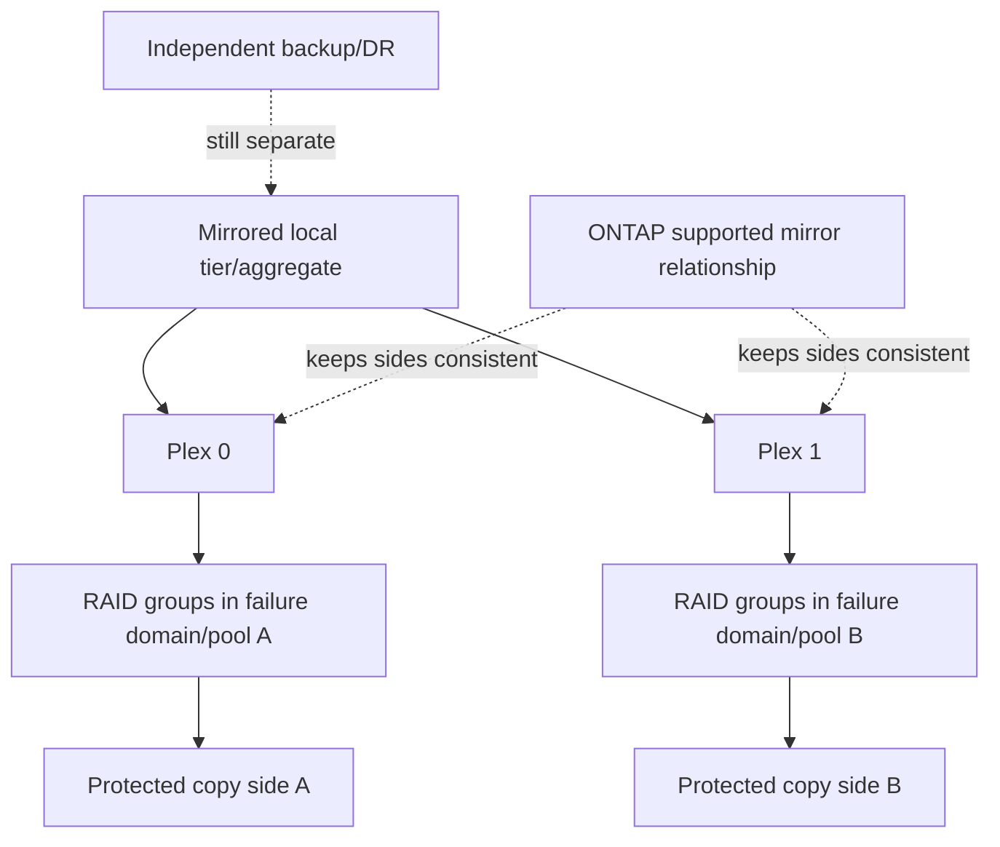

### Plex evidence

- Local-tier identity and mirror state.
- Plex identities/status, pools/sites/shelves and RAID groups.
- Device/partition membership and ownership.
- Resync/reconstruction progress, errors, workload impact and events.
- Exact SyncMirror/MetroCluster context and Support procedure.

Do not delete, offline, split, resync, or reconstruct a plex from generic RAID intuition.

---

## 6. Local tiers/aggregates: protected capacity pools

Current ONTAP documentation calls aggregates **local tiers** in System Manager and concepts; the CLI retains aggregate terminology. A local tier is node-owned and contains one or more RAID groups in one or two plexes. It supplies physical blocks to volumes.

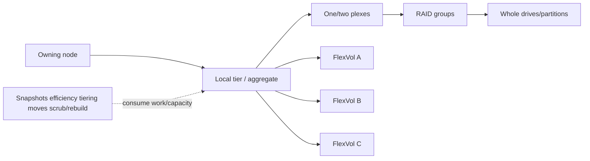

### Root versus data local tiers

| Type | Purpose | Risk/caution |
|---|---|---|
| Node root aggregate/local tier | Contains the node root volume/system data needed for node operation | Not a tenant/SVM root; protect capacity/health under exact platform guidance |
| Data aggregate/local tier | Supplies capacity for ordinary data volumes/LUNs | Can host many workloads and shared contention/failure scope |
| Mirrored aggregate/local tier | Two plexes under supported mirror design | Mirror placement and operations are configuration-specific |

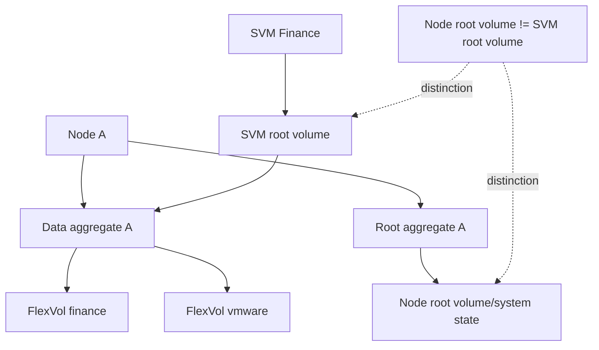

### Local-tier health dimensions

- RAID/plex/member protection and spares.
- Physical and logical capacity, metadata, reserves and Snapshot-retained blocks.
- Node CPU/cache/WAFL and local-tier latency/utilization.
- Device paths, shelf/environment, errors, firmware and lifecycle.
- Volume placement, QoS, efficiency, tiering and background work.
- Failure-state capacity and partner takeover behavior.

---

## 7. Volumes: FlexVol and other orientation

A **FlexVol volume** is a flexible logical data container within a local tier. It can hold NAS files/directories, LUN files, Snapshot references, metadata, qtrees and policy. It belongs to an SVM and is physically placed on a local tier.

### Volume orientation table

| Volume concept | Purpose | Detailed treatment |
|---|---|---|
| FlexVol read-write/data volume | Ordinary NAS/SAN data container | This Part and volume administration |
| SVM root volume | Entry point to one SVM NAS namespace | Part 22; current protection guidance required |
| Node root volume | Node/system operation inside root aggregate | Platform/system administration, not tenant namespace |
| Data-protection destination volume | Receives replicated data under relationship/type/state | Parts 36-38; writeability/activation is relationship-specific |
| FlexGroup | Scale-out NAS volume composed across constituents | Part 32 |
| FlexCache | Distributed cache volume with origin relationship | Part 32 |
| FlexClone | Space-efficient clone sharing blocks initially | Part 35 |

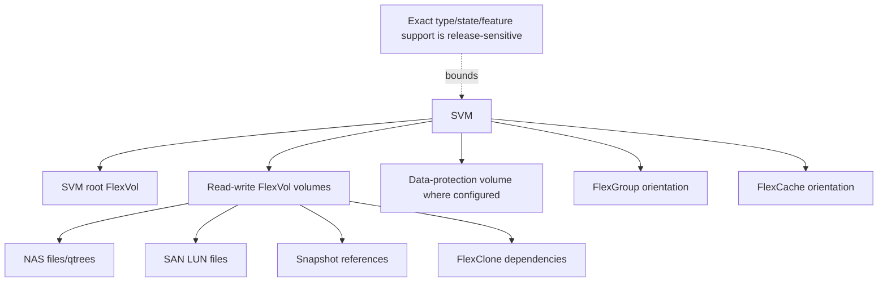

### Volume ownership and mobility

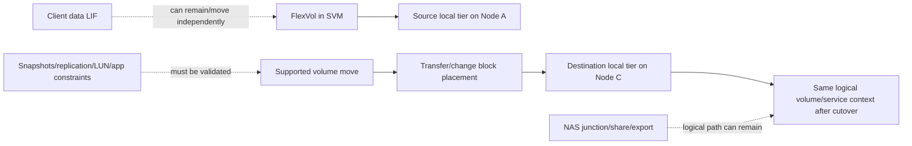

A volume move does not automatically solve a bottleneck; it changes placement and consumes resources. Validate destination capacity/performance, protection, protocol/application behavior, supportability, transfer/cutover and rollback limits.

---

## 8. Guarantees, reserves, thin provisioning, and available space

### Plain-English deep-dive: promised room versus shared building headroom

A volume size is the apartment's advertised floor plan. A **space guarantee** determines what capacity is reserved at a lower layer under supported policy. A **reserve** holds room for a specific purpose. Thin provisioning makes logical promises without dedicating equal physical capacity immediately. **Why it matters:** `volume free` can coexist with `aggregate low on space`, and removing a reserve can turn safety margin into a prettier dashboard.

### Space policy orientation

| Concept | Meaning | Version-sensitive question |
|---|---|---|
| Volume size | Logical capacity boundary/presentation | Is it hard size, autosize target, logical enforcement and what object uses it? |
| Space guarantee | Lower capacity reservation policy such as volume/none concepts where supported | Which guarantee types/defaults are current for this release/platform? |
| Fractional reserve | Reserve associated with overwrite needs for space-reserved objects under exact design | Is it relevant/current for this SAN/snapshot configuration? |
| Snapshot reserve | Volume space set aside/accounted for Snapshot use under policy | What happens when reserve/volume/local tier fills? |
| Overcommit | Sum of logical promises exceeds physical available | Which workloads can grow together and what is the intervention horizon? |
| Logical space reporting/enforcement | Host/logical accounting features under supported configuration | Does host see/obey the intended thin/reclaim behavior? |

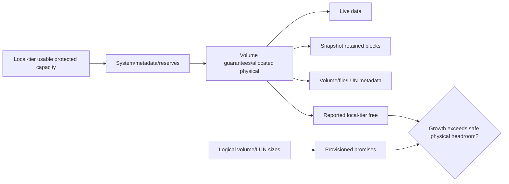

### Capacity views

| View | Question | Common trap |
|---|---|---|
| Local-tier physical | What protected capacity is consumed/available? | Ignoring snapshots, metadata, guarantees and tiering |
| Volume physical | Which blocks does this volume reference? | Treating logical free as lower physical free |
| Volume logical | What data size does the upper layer report? | Counting thin unwritten space as efficiency |
| LUN/file-system | What does host or NAS user see? | Assuming reclaim propagated through every layer |
| Snapshot | Which old blocks remain referenced? | Estimating from count instead of change rate |
| Effective/efficiency | What numerator/denominator/scope/time? | Using one ratio as guaranteed future capacity |

---

## 9. Autosize and autodelete orientation

**Autosize** can change volume size automatically under configured thresholds and limits. **Autodelete** can automatically delete eligible objects, commonly Snapshot copies under a defined policy, to recover space. Exact modes, triggers, priorities, eligible objects, defaults and interactions are release-sensitive.

### Autosize state

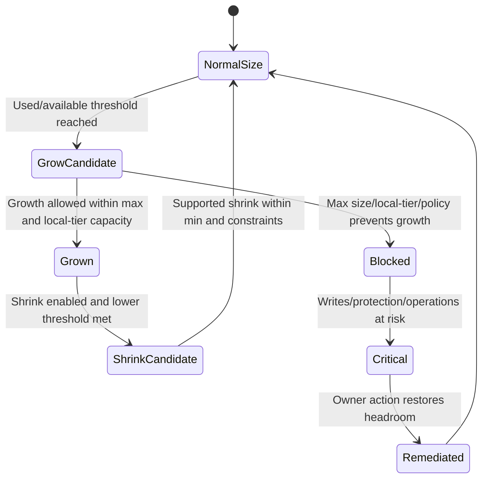

### Space-management decision sequence

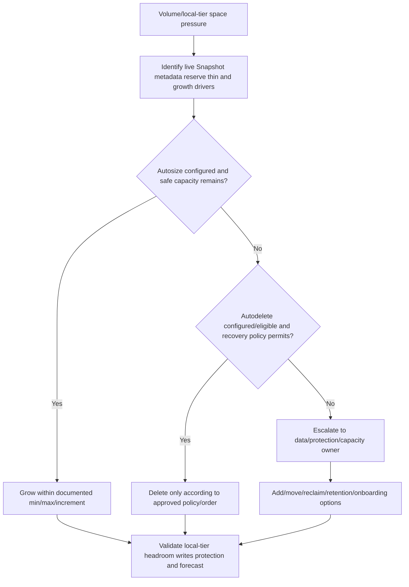

### Why automation can amplify risk

- Many volumes can autosize together and exhaust one local tier.
- Autodelete can remove recovery points needed for incident or ransomware recovery.
- Growing a volume can hide aggregate-level urgency without creating capacity.
- Shrink/reclaim behavior and host visibility can differ.
- Thresholds can oscillate or react too late for a burst.

Every automatic action needs owner, purpose, limits, alerting, audit, stop condition and recovery validation.

---

## 10. Snapshot space and overwrite behavior

ONTAP Snapshot copies reference point-in-time volume blocks. When active data overwrites a block, WAFL writes a new version while the Snapshot retains the old block. Snapshot use therefore depends on changed blocks and retention, not simply volume size or Snapshot count.

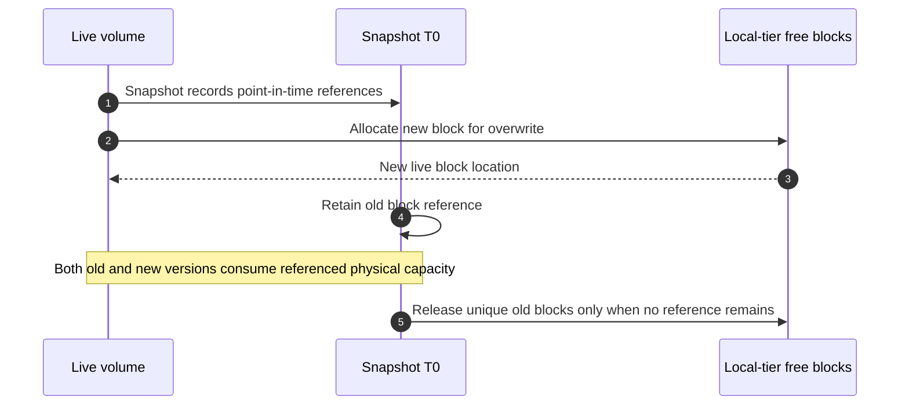

### Snapshot-space questions

1. Which volumes and policies create Snapshots, how often and for how long?
2. What changed-block rate and overwrite locality occur by business cycle?
3. Which clones/replication/locks/retention relationships depend on a Snapshot?
4. What volume/local-tier accounting includes/excludes Snapshot reserve and remote tier?
5. What happens at Snapshot reserve, volume, and local-tier thresholds?
6. Who may delete or alter retention, and what recovery/RPO decision is required?

Do not clear capacity alerts by deleting Snapshots until the data/protection owner confirms recovery impact and exact dependencies.

---

## 11. Inodes, files, LUNs, and limits

WAFL represents files through inode-like metadata structures. A LUN is commonly implemented as a file-like object inside a volume while presented as block storage to a host. File/inode count, maximum file/LUN/volume sizes, qtree counts and related limits depend on exact ONTAP release, platform, volume type, feature and configuration.

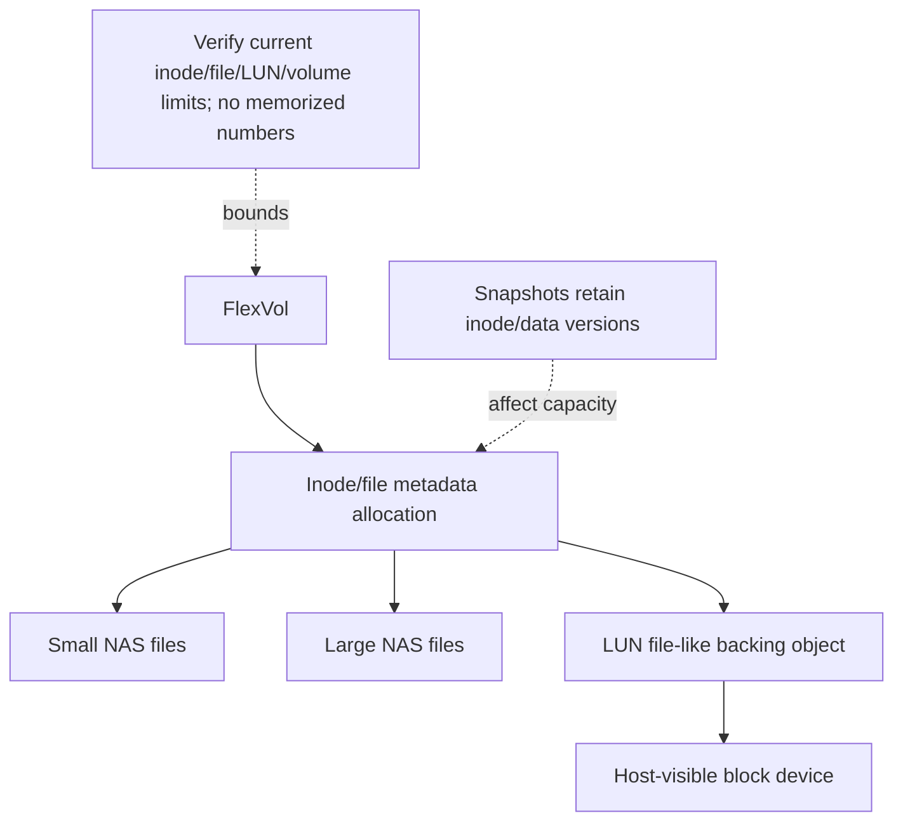

### File-count risk

Millions of small files can consume metadata/inodes and create namespace, backup, scan, and restore work even when byte capacity is modest. A large sparse/thin LUN can present substantial logical space while consuming less physical capacity now. Track both counts and bytes.

| Metric | Why it matters | Verification |
|---|---|---|
| File/inode used/available | Namespace can hit metadata limit before bytes fill | Exact volume/release field and current limit behavior |
| Maximum files setting/behavior | May be configurable/automatic under exact release | Current docs and effect of changes |
| LUN logical/physical use | Thin provisioning and host reclaim | Host, volume and local-tier accounting |
| Maximum file/LUN/volume size | Design/support boundary | Current release/platform/volume-type docs |
| Directory/file distribution | Metadata operation performance | Workload measurement, not just total count |

Never quote a numeric file/inode or capacity limit from memory. Record source, release, object type, feature, date and applicable notes.

---

## 12. Failure, capacity, and supportability reasoning

### Physical-to-logical blast radius

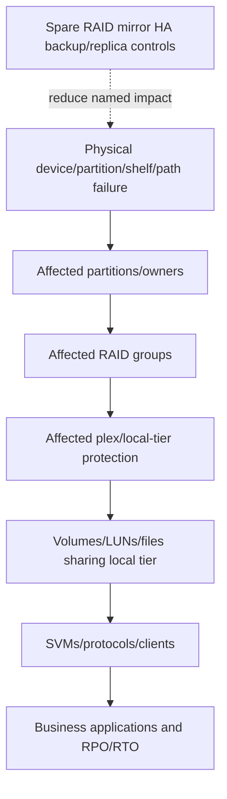

### Capacity fault tree

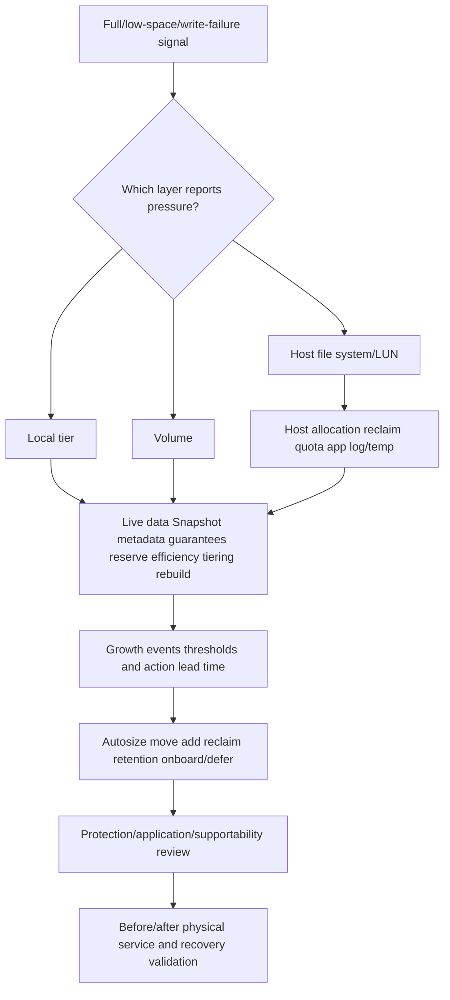

### Common failures and misconceptions

| Failure/misconception | Why it fails | Better behavior |
|---|---|---|
| `Disk count times capacity equals usable` | Partitions, parity, spares, metadata and reserves intervene | Build exact ladder from current config |
| `Partition is separate hardware` | Physical device failure affects every partition | Map partitions back to serial/shelf/path |
| `Aggregate online means fully protected` | RAID group/plex can be degraded/rebuilding | Inspect member/group/plex state |
| `Root aggregate is SVM root` | Node system root and SVM NAS namespace root are distinct | Name owner and purpose |
| `Volume size is physical consumed` | Thin, efficiency, snapshots and guarantee change accounting | Reconcile logical/physical views |
| `Volume free means writes are safe` | Local tier or metadata/inode limit can constrain | Check all layers and headroom |
| `Autosize creates capacity` | It reallocates logical volume boundary from local tier | Forecast local-tier impact and simultaneous growth |
| `Autodelete is harmless cleanup` | It can remove recovery points | Use protection-owner-approved policy |
| `More Snapshots always use more space linearly` | Change rate/reference sharing controls use | Measure changed blocks and retention cycles |
| `File limit is a universal number` | Release, volume type, size and config differ | Verify current exact documentation |

### Support boundaries

- Read-only inventory/capacity/health analysis can be prepared by the analyst under authorization.
- Drive assignment/removal/replacement, RAID/plex repair, partition operations, root-aggregate changes, force online/offline, and destructive Snapshot/autodelete actions require qualified storage ownership and current Support procedures.
- Customer data/protection owners approve retention, deletion, reclaim, move and risk.
- Hardware compatibility/limits come from current HWU; ecosystem support from IMT; observed state comes from authorized telemetry.

---

## 13. Evidence and escalation pack

### Evidence map

```mermaid
flowchart LR
    APP[Application/file/LUN symptom] --> VOL[Volume/Snapshot/qtree/LUN/file metrics]
    VOL --> LT[Local-tier physical capacity/workload]
    LT --> PLEX[Plex/RAID-group protection]
    PLEX --> PART[Partition/disk ownership and role]
    PART --> HW[Shelf/IOM/path/drive/firmware/environment]
    NODE[Node/HA owner and takeover state] --> LT
    PROT[Snapshots replication backup/DR] --> VOL
    TIME[EMS/audit/jobs/changes and aligned clocks] --> CORR[One physical-to-business timeline]
    APP --> CORR
    VOL --> CORR
    LT --> CORR
    PLEX --> CORR
    PART --> CORR
    HW --> CORR
```

### Minimum escalation pack

- Business service/application, affected SVM/volume/LUN/path, impact, SLO/RPO/RTO, scope and UTC timeline.
- Cluster/node/HA/platform/ONTAP identities, ownership and current support/lifecycle.
- Local-tier/aggregate identity, root/data/mirrored role, node owner/current failover state, physical/logical/available capacity and headroom.
- Plex identities/status; RAID groups/type/size/member roles/status; reconstruction/scrub/resync progress and errors.
- Every physical disk/SSD/partition identity, serial, shelf/slot, media/capacity/firmware, owner, partition type, RAID role, paths and health.
- Volume type/state/SVM/local tier/size/guarantee/reserve/autosize/autodelete; logical/physical/live/Snapshot/metadata/file/inode/LUN accounting.
- Snapshot policies/count/age/change rate/dependencies/locks/clones/replication and backup/restore evidence.
- Workload IOPS/throughput/latency, background operations, moves/tiering/efficiency, capacity history/events/forecast.
- Shelf/IOM/adapter/cabling/power/cooling/environmental and hardware events.
- Exact current official docs/IMT/HWU, commands/API fields/date, Support case, access gaps, actions tried/results/rollback, safe next test and exact ask.

---

## 14. TAM discovery, recommendation, and JD Mapping

### Discovery questions

1. Which business service, application/file/LUN, owner, criticality, SLO, RPO/RTO, retention and growth plans apply?
2. Which cluster/node/HA pair owns the local tier and which platform/release is in scope?
3. Which physical media, shelves/slots/paths/firmware, ownership, ADP partition type and spare eligibility exist?
4. Which RAID type/groups/member roles, plexes/mirroring and current degraded/rebuild/resync state exist?
5. Which root/data local tiers, node root volumes, SVM root volumes and data volumes exist?
6. Which volume types, sizes, guarantees, reserves, autosize/autodelete, Snapshots, clones, qtrees, files/inodes and LUNs exist?
7. What raw/protected/logical/physical/live/Snapshot/metadata/free/available/effective capacity and units are reported by each layer?
8. What workload, background work, change, retention, efficiency, tiering, failure and seasonality drive growth/performance?
9. Which current HWU/IMT/release/firmware/lifecycle/support rules apply?
10. What failure, capacity, restore and application tests prove the recommendation?

### Recommendation model

```mermaid
flowchart TD
    SCOPE[Scope object workload impact and date] --> MAP[Map volume to local tier plex RAID partition and physical media]
    MAP --> CAP[Reconcile every capacity/accounting layer]
    CAP --> HEALTH[Assess protection paths hardware and failure state]
    HEALTH --> GROW[Model growth events Snapshots and lead time]
    GROW --> SUP[Verify current HWU IMT release and support]
    SUP --> OPT[Compare move add reclaim policy efficiency or defer]
    OPT --> TEST[Approved change and application/recovery validation]
    TEST --> REC[Owner date evidence and residual risk]
```

### Recommendation patterns

| Finding | Risk | Bounded recommendation | Validation |
|---|---|---|---|
| Local tier action threshold is inside procurement lead time | Write/protection/change workspace can become urgent | Start supported capacity/placement decision now; define interim onboarding controls | Updated forecast, approved option, post-change headroom |
| One physical SSD carries partitions used by both nodes and shows errors | One device fault has cross-owner partition blast radius | Preserve exact serial/partition/RAID state and follow platform Support replacement | Protection restored for every affected partition/group |
| Autosize enabled across many volumes without aggregate cap review | Correlated growth can exhaust shared local tier | Model simultaneous max/growth and set owner/alerts/limits under current guidance | Threshold rehearsal and sustained headroom |
| SVM root volume protection is undocumented | Namespace recovery can be delayed | Apply current supported root-volume protection/recovery guidance | Isolated namespace recovery and junction validation |
| File/inode use grows faster than bytes | Namespace can hit limit before capacity forecast | Measure file-count distribution/growth and verify current volume limit/options | Representative create/backup/restore plus limit headroom |

### JD Mapping

| JD responsibility | Part 23 contribution | Arti's factual bridge and gap |
|---|---|---|
| Storage depth | Maps media/partition/RAID/plex/local tier/volume/file/LUN | Conceptual/synthetic; no production ONTAP storage layout admin |
| Analyze customer data | Reconciles units, logical/physical, snapshots, files and forecasts | Analytics/Excel/Power BI/SQL strengths transfer |
| Mitigate risk/stability | Finds degraded RAID, shared partition fate, low headroom, root and automation risk | CRITSIT/risk method transfers |
| Strategic/lifecycle advice | Connects capacity/action lead time, placement, hardware and support | Advisory method transfers; HWU/IMT expertise requires access/practice |
| Install-base accuracy | Requires serial/shelf/slot/owner/firmware/object relationship | Data-quality skills transfer |
| Service review | Presents capacity ladder, protection, actions and residual risk | Business-review communication transfers |
| Escalation | Produces exact physical-to-logical evidence and safe ask | Product/Engineering evidence discipline transfers |

---

## 15. Fully synthetic scenario: Woodgrove Media capacity and partition alert

> **Synthetic case:** Woodgrove Media, all capacities, devices, forecasts and outcomes below are fictional. This is not a NetApp sizing or hardware procedure and not Arti production experience.

### Environment

- Two-node HA pair with supported root-data-data partitioning.
- Node A and B each own data partitions on shared physical SSDs under the synthetic layout.
- One data local tier hosts six FlexVol volumes for editing and archive staging.
- Hourly Snapshots retain high-change video data.
- Autosize is enabled on four volumes; autodelete is enabled on one staging volume.
- A physical SSD reports repeated errors while the dashboard also warns that one volume is 90% used.

```mermaid
flowchart TB
    SSD[Physical SSD shelf 1 slot 8] --> RP[Root partition]
    SSD --> DPA[Data partition owned A]
    SSD --> DPB[Data partition owned B]
    RP --> RAGG[Node root aggregate contribution]
    DPA --> RGA[RAID group in data local tier A]
    DPB --> RGB[RAID group in data local tier B]
    RGA --> LT[Shared synthetic data local-tier context]
    LT --> VEDIT[Editing FlexVols autosize]
    LT --> VSTAGE[Staging FlexVol autodelete]
    VEDIT --> SNAP[Hourly changed-block Snapshots]
```

### Capacity evidence

| View | Synthetic value/orientation | Interpretation |
|---|---|---|
| Local-tier usable | 800 TiB | Protected usable input supplied by scenario, not calculated platform fact |
| Local-tier physical consumed | 660 TiB | 82.5% used before agreed action threshold of 85% |
| Live volume physical | 470 TiB | Only one component of use |
| Snapshot referenced | 150 TiB | High change/retention driver |
| Metadata/system/reserve | 40 TiB | Necessary overhead/context |
| Sum of logical volume sizes | 1,000 TiB | Thin logical promises exceed physical usable |
| Base net growth | 12 TiB/month | Excludes planned 70 TiB project in two months |

Base time to 680 TiB action threshold:

$$
\frac{680-660}{12}=1.67\text{ months}
$$

The planned 70 TiB project crosses the threshold earlier than the smooth trend; exact physical impact depends on reduction and Snapshot change rate, so low/base/high scenarios are required.

### Failure and capacity interaction

```mermaid
sequenceDiagram
    autonumber
    participant D as Physical SSD/partitions
    participant R as RAID groups
    participant L as Local tier
    participant V as Volumes/Snapshots
    participant A as Applications
    D->>R: Repeated errors trigger investigation/reconstruction risk
    R->>L: Protection/background work consumes resources
    V->>L: Snapshot and autosize growth consume headroom
    L->>A: Latency/write-risk signals increase under peak
    A-->>L: Planned ingest adds demand
    Note over D,A: Device and capacity risks interact but require separate evidence/actions
```

### Competing hypotheses

| Hypothesis | Evidence for | Disconfirming check |
|---|---|---|
| Volume alert alone causes risk | One volume 90% used | Reconcile local-tier/other-volume/metadata/Snapshot views |
| Snapshot retention drives local-tier pressure | 150 TiB referenced and high change | Measure changed blocks by policy cycle and dependencies |
| SSD error is isolated to one node | Partition ownership suggests A/B contributions | Map all partitions on same serial and affected RAID groups |
| Autosize will solve pressure | Volumes can grow | Model aggregate max simultaneous growth; no new physical capacity created |
| Autodelete is safe | Staging data considered temporary | Verify Snapshot dependencies and recovery policy before deletion |

### Recommendations

1. Treat the physical SSD as one blast-radius object: preserve serial/shelf/slot/path/firmware, every partition owner/RAID role and current protection, then follow Support replacement guidance.
2. Start capacity action now because the action threshold is roughly 1.7 months away before the planned project; create event-adjusted low/base/high scenarios.
3. Measure Snapshot change rate and obtain protection-owner approval before retention/autodelete changes.
4. Model all volume autosize maxima against local-tier headroom and add owner, alert, stop and onboarding controls.
5. Validate root aggregates/node root volumes and SVM root namespace separately after any physical-device procedure.

### Customer-facing summary

> "Two issues need coordinated but separate handling. The SSD is one physical failure domain carrying several root/data partitions, so replacement analysis must map every partition and RAID group before action. Capacity is also inside the planning horizon: the local tier is 20 TiB below its action threshold and a 70 TiB project arrives in two months. Autosize cannot create physical space, and autodelete can remove recovery points. We recommend Support-led device handling plus an immediate capacity/protection decision using event-adjusted scenarios."

---

## 16. Arti's support/Azure/analytics bridge

```mermaid
flowchart LR
    BI[Excel Power BI SQL Python statistics] --> CAP[Unit QA capacity ladder forecast and scenarios]
    AZ[Azure VM/storage foundation] --> LAYER[Logical versus physical allocation and shared infrastructure]
    CRIT[Microsoft CRITSIT/escalation] --> SAFE[Identity evidence impact and safe owner-led action]
    M365[Data/retention/permissions support] --> POL[Data owner retention and recovery boundary]
    CAP --> ONTAP[ONTAP layout synthetic reasoning]
    LAYER --> ONTAP
    SAFE --> ONTAP
    POL --> ONTAP
    ONTAP --> LAB[Authorized lab HWU/IMT and SME review]
```

| Factual strength | Transfer | Explicit gap |
|---|---|---|
| Analytics and business reviews | Reconcile bytes/units, trends, thresholds, uncertainty, actions | No ONTAP capacity counter/tool production use |
| Azure/VM/storage basics | Understand thin layers and logical/physical mappings | No ADP/RAID/local-tier administration |
| CRITSIT/evidence | Preserve device/object identity and avoid destructive guesswork | No NetApp drive replacement or plex repair |
| M365 data policies | Respect retention, recovery and data-owner authority | No ONTAP Snapshot/autodelete operations |

### Honest answer

> "I can map ONTAP storage from physical media and supported partitions through node ownership, RAID groups, plexes, local tiers and FlexVol volumes to files/LUNs. I can reconcile logical/physical/Snapshot space and model guarantees, reserves, autosize, autodelete and file-count risk conceptually. My production strength is analytics and Microsoft support, not ONTAP storage administration. I would verify exact platform/release/HWU/IMT facts and use authorized evidence and NetApp Support before any physical or destructive action."

---

## 17. Whiteboard drills

1. **Ladder:** Drive/partition -> owner -> RAID group -> plex -> local tier -> FlexVol -> file/LUN.
2. **ADP:** Draw root-data and root-data-data conceptually; circle shared physical failure.
3. **RAID:** Map data/parity/spare roles and group failure scope without group-size numbers.
4. **Plex:** Compare one-plex and mirrored two-plex local tiers; separate backup.
5. **Roots:** Distinguish node root aggregate/volume from SVM root volume.
6. **Space:** Reconcile local-tier, volume, LUN/file-system, Snapshot and efficiency views.
7. **Automation:** Explain autosize/autodelete benefits, triggers and danger.
8. **Limits:** Explain why inode/file/LUN/volume limits must be checked by release/object.

---

## 18. Paper lab: physical-to-logical capacity and failure pack

No ONTAP access is required. Use synthetic records and official public documentation.

### Scenario

A four-node cluster has two drive-partitioning schemes, six shelves, twelve RAID groups, four plexes, eight local tiers, forty FlexVol volumes, four SVM roots, twenty LUNs, three Snapshot policies, volume autosize and one autodelete policy. Inventory contains duplicate disk names, missing serials, mixed TB/TiB and no owner for retention changes.

### Tasks

1. Reconcile physical serial/shelf/slot/firmware/path with ONTAP disk/partition identity.
2. Map partition owner/type to RAID role/group, plex and local tier.
3. Distinguish root/data local tiers, node root volumes and SVM root volumes.
4. Map every volume type/SVM/local tier/junction/LUN and protection relationship.
5. Build raw/protected/logical/physical/live/Snapshot/metadata/free/available capacity ladder in bytes/TiB.
6. Create low/base/high growth with project steps and change lead time.
7. Model guarantees, reserve, autosize maxima and correlated growth.
8. Model autodelete eligible objects and recovery-policy consequences.
9. Add file/inode growth separately from byte growth; verify-current limits without numbers.
10. Inject disk, partition, RAID group, plex, shelf/path, local-tier and volume failures.
11. Map blast radius to SVM/protocol/application and backup/DR controls.
12. Build exact HWU/IMT/release/support evidence and access gaps.
13. Write one capacity and one hardware-risk recommendation with validation.
14. Deliver executive and technical summaries.

### Lab flow

```mermaid
flowchart LR
    HW[Reconcile physical identities] --> OWN[Map ownership/partition/RAID/plex]
    OWN --> VOL[Map local tiers/volumes/files/LUNs]
    VOL --> CAP[Reconcile capacity/Snapshot/automation]
    CAP --> FAIL[Model failures and blast radius]
    FAIL --> SUP[Verify HWU IMT release and support]
    SUP --> REC[Recommend owner action proof and residual risk]
```

### Lab pass criteria

- [ ] Every logical disk/partition maps to one physical serial/location.
- [ ] Partition common fate is explicit.
- [ ] RAID group, plex and local tier are distinct.
- [ ] Node root and SVM root objects are never confused.
- [ ] Volume type and logical/physical accounting are explicit.
- [ ] Autosize/autodelete do not create capacity and include protection owners.
- [ ] Snapshot space uses changed-block/retention evidence.
- [ ] File/inode limits are verify-current, never memorized numbers.
- [ ] Hardware/destructive actions stay inside Support/owner boundaries.
- [ ] No synthetic result is presented as production NetApp work.

---

## 19. Self-test

1. Draw the full physical-to-logical ladder and name each owner/failure scope.
2. Define disk/SSD identity, ownership, role and spare eligibility.
3. Define ADP, root-data and root-data-data at conceptual depth.
4. Explain why partitions do not create physical independence.
5. Define RAID group, roles, degraded/reconstruction states and tolerance boundaries.
6. Define plex and compare unmirrored/mirrored local-tier orientation.
7. Define local tier/aggregate and explain CLI/System Manager terminology.
8. Distinguish node root aggregate/volume, SVM root volume and data volume.
9. Define FlexVol and orient on data-protection/FlexGroup/FlexCache/FlexClone volumes.
10. Trace a volume move and state what does not move automatically.
11. Define volume size, guarantee, reserves, thin provisioning and overcommit.
12. Reconcile local-tier, volume, host, Snapshot and efficiency capacity views.
13. Draw autosize and autodelete decisions with failure cases.
14. Explain Snapshot changed-block space and deletion authority.
15. Explain inode/file/LUN limits and current-document verification.
16. Map physical failure blast radius to applications and protections.
17. Apply the capacity fault tree and support boundaries.
18. Build the minimum escalation pack and TAM recommendation.
19. Recreate Woodgrove's SSD partition and capacity findings separately.
20. Complete all whiteboard drills, paper lab and Q1-Q8 aloud.
21. State Arti's strengths and ONTAP storage-layout production gap precisely.

---

## 20. Official Source Anchors

**Date checked: 2026-08-24.** These public official sources anchor broad ONTAP storage-layout concepts. Exact drive/media support, ADP, ownership, RAID type/group size, plex/mirroring, local-tier/root, volume, guarantee, reserve, autosize/autodelete, Snapshot, inode/file/LUN limits, commands, APIs and defaults are version/platform sensitive. Use the exact release, HWU, IMT and Support procedure; never invent specifications.

| Topic | Official public source | Bounded use and currency note |
|---|---|---|
| Disks and local tiers | [ONTAP disks and local tiers](https://docs.netapp.com/us-en/ontap/disks-aggregates/) | Current management entry point and local-tier/aggregate terminology. |
| Disk ownership and management | [Manage ONTAP disks](https://docs.netapp.com/us-en/ontap/disks-aggregates/manage-disks-overview-concept.html) | Current disk-management navigation, including ownership-related operations; exact assignment/replacement varies by platform/configuration. |
| Root-data partitioning | [ONTAP root-data partitioning](https://docs.netapp.com/us-en/ontap/concepts/root-data-partitioning-concept.html) | Broad ADP concepts; exact supported schemes/platforms require HWU and current docs. |
| RAID groups/local tiers | [RAID groups and local tiers](https://docs.netapp.com/us-en/ontap/concepts/aggregates-raid-groups-concept.html) | Broad group/aggregate organization; exact types/defaults/sizes require current validation. |
| RAID protection | [ONTAP RAID protection levels](https://docs.netapp.com/us-en/ontap/disks-aggregates/raid-protection-levels-disks-concept.html) | Conceptual RAID-DP/RAID-TEC; exact recommendation is media/platform/release sensitive. |
| Mirrored local tiers/plexes | [Mirrored and unmirrored local tiers](https://docs.netapp.com/us-en/ontap/concepts/mirrored-unmirrored-aggregates-concept.html) | Broad plex/SyncMirror orientation; exact MetroCluster/mirroring procedures are separate. |
| Volume/object hierarchy | [Volumes, qtrees, files and LUNs](https://docs.netapp.com/us-en/ontap/concepts/volumes-qtrees-files-luns-concept.html) | Broad logical hierarchy; exact types/limits/features require current docs. |
| Volume administration | [ONTAP volume administration](https://docs.netapp.com/us-en/ontap/volumes/) | Current FlexVol, guarantees, autosize, autodelete, Snapshot, qtree, file/LUN and efficiency operations. |
| Capacity/space | [ONTAP volume space management](https://docs.netapp.com/us-en/ontap/volumes/index.html) | Entry point; select exact guarantee/reserve/logical-space/automatic-deletion pages. |
| Snapshot management | [ONTAP data protection and disaster recovery](https://docs.netapp.com/us-en/ontap/data-protection-disaster-recovery/) | Broad Snapshot/protection entry; exact retention/restore/application consistency deferred. |
| Hardware systems | [ONTAP hardware systems](https://docs.netapp.com/us-en/ontap-systems/) | Exact shelf/drive/replacement/cabling/service documentation by platform. |
| HWU | [NetApp Hardware Universe](https://hwu.netapp.com/) | Official, potentially gated exact drives, shelves, limits and configuration rules. |
| IMT | [NetApp Interoperability Matrix Tool](https://imt.netapp.com/) | Official, potentially gated host/protocol/storage solution support. |
| Support | [NetApp Support Site](https://mysupport.netapp.com/) | Entitlement-dependent procedures, firmware, lifecycle, cases and knowledge. |

### Source-use discipline

- Record exact platform/ONTAP release, serial/shelf/slot, disk/partition identity, owner, role, group, plex and local tier.
- Use HWU for exact media/shelf/platform limits/configuration and Support docs for replacement/repair.
- Reconcile capacity with raw bytes, declared units, object scope, timestamp and protection state.
- Verify guarantee/reserve/autosize/autodelete and file/inode/LUN limits for exact volume type/release.
- Obtain data/protection-owner approval before Snapshot/retention/autodelete changes.
- Save IMT/HWU results/date and state access gaps; never substitute remembered numbers.

---

## Likely Interview Questions

### Q1. Walk through ONTAP storage from a physical drive to a file or LUN.

> **Model answer:** "A supported physical drive or SSD, or one of its supported ADP partitions, is owned by a node and contributes a data/parity/root/spare role to a RAID group. One or more RAID groups form a plex; one or two plexes form a node-owned local tier, historically called an aggregate. FlexVol volumes allocate WAFL blocks from that local tier. A volume can hold NAS files/qtrees or LUN file-like backing objects, plus metadata and Snapshot references. I preserve identity and capacity at every layer."

**Follow-up depth:** Draw the ladder and map one physical serial/slot to every affected SVM/application object.

### Q2. What are root-data and root-data-data partitioning?

> **Model answer:** "They are Advanced Drive Partitioning schemes on supported platforms that divide one physical device into root and data contributions, with root-data-data providing additional data-partition orientation under eligible designs. This improves physical utilization but does not create independent hardware: one media failure can affect every partition and owner on it. Exact partition layout, size, ownership, spares and replacement procedure require current platform/HWU documentation."

**Follow-up depth:** Draw both schemes, explain cross-node partition blast radius and list the identities needed before replacement.

### Q3. Explain RAID groups, plexes and local tiers.

> **Model answer:** "A RAID group protects a bounded set of drive or partition contributions under a supported RAID type. A plex contains one or more RAID groups representing one complete side of a local tier. An unmirrored local tier normally has one plex; a mirrored local tier has two under SyncMirror concepts. The local tier is the node-owned protected capacity pool that serves volumes. RAID/plex mirroring is not backup, site DR or application consistency."

**Follow-up depth:** Draw degraded/reconstructing states, spare eligibility, a two-plex mirror and the evidence required before repair.

### Q4. Distinguish node root aggregate/volume, SVM root volume and data volume.

> **Model answer:** "Each node has system/root storage containing its node root volume for ONTAP operation. A data SVM has its own root FlexVol that anchors the NAS namespace. Ordinary data FlexVol volumes are mounted below junctions or hold LUNs. These objects can reside on local tiers but have different owners and recovery purposes. I never treat the SVM root as the node root or use either as an undifferentiated data volume."

**Follow-up depth:** Draw both roots in one cluster and explain their protection, capacity and recovery questions.

### Q5. How do space guarantees, reserves and thin provisioning affect capacity?

> **Model answer:** "Volume size is a logical boundary. A guarantee can reserve lower physical capacity under the release's supported policy; reserves can protect overwrite/Snapshot or other purposes; thin provisioning allocates physical blocks as data is written. Therefore volume free, host free and local-tier free can disagree. I reconcile written logical, physical referenced, Snapshots, metadata, guarantees, reserves, efficiency, remote tier and operational headroom before forecasting."

**Follow-up depth:** Build a capacity ladder and explain why removing a reserve or increasing volume size does not create physical capacity.

### Q6. What are autosize and autodelete, and what risks do they introduce?

> **Model answer:** "Autosize changes a volume's logical size automatically within configured thresholds/min/max and current capability. Autodelete removes eligible objects, often selected Snapshot copies, under a configured policy to recover space. Autosize can let several volumes consume one local tier concurrently; autodelete can remove required recovery points. I verify exact triggers/order, owners, alerts and capacity, obtain protection approval and validate writes, headroom and recoverability."

**Follow-up depth:** Work a scenario where local-tier space is low, max autosize is reached and a locked/dependent Snapshot cannot be deleted.

### Q7. How would you investigate `the aggregate is full` or a disk alert?

> **Model answer:** "I first identify the exact layer and stable identities. For capacity I reconcile local-tier physical use with volume live/Snapshot/metadata/guarantee/reserve/efficiency/tiering and growth events. For hardware I map serial/shelf/slot through partitions, ownership, RAID groups, plex and local tier to applications and current protection. I preserve events and use current HWU/Support procedures before any physical or destructive action, then validate restored protection, service and forecast."

**Follow-up depth:** Recreate Woodgrove's partitioned SSD and capacity alert as separate but interacting workstreams.

### Q8. How does your analytics background transfer, and what remains a gap?

> **Model answer:** "My Excel, Power BI, SQL, Python, statistics and support analytics experience is useful for raw-byte/unit reconciliation, physical/logical capacity, trend/event scenarios, threshold lead time and evidence quality. CRITSIT experience helps preserve identity and avoid unsafe action. I have not administered ONTAP disks, ADP, RAID, plexes, local tiers or volumes in production. I would use exact release docs, HWU/IMT, authorized telemetry and NetApp Support and label labs/synthetic work honestly."

**Follow-up depth:** Describe a workbook schema and name the platform, partition, RAID, volume and limit facts that must come from current official sources.

---

## 30-Second Memory Hooks

- **Ladder:** Media -> partition -> owner -> RAID group -> plex -> local tier -> FlexVol -> file/LUN.
- **Physical identity:** Serial and slot before logical disk name.
- **ADP:** Share one drive across root/data duties; failure remains physical.
- **RAID group:** Bounded device-protection team.
- **Plex:** One complete RAID-protected side of a local tier.
- **Local tier/aggregate:** Node-owned protected capacity pool.
- **Node root:** ONTAP system state; **SVM root:** NAS namespace entrance.
- **FlexVol:** Flexible logical data container drawing blocks from a local tier.
- **Guarantee:** Lower capacity reservation policy, release-specific.
- **Thin:** Logical promise now, physical blocks as written.
- **Autosize:** Moves the volume boundary, not the physical-capacity wall.
- **Autodelete:** Space recovery can spend recovery history.
- **Snapshot space:** Changed old blocks times retention, not count alone.
- **Files/inodes:** Metadata count can fill before bytes.
- **Limits:** Exact release/object/HWU, never memory.
- **Arti's bridge:** Capacity analytics transfers; ONTAP physical operations do not.

---

## Completion Checklist

- [ ] Draw and explain the complete physical-to-logical ladder.
- [ ] Reconcile physical serial/shelf/slot/path/firmware with ONTAP disk/partition identity.
- [ ] Explain node ownership, spare eligibility and safe physical-action boundaries.
- [ ] Explain ADP, root-data/root-data-data and shared-device failure without hard specs.
- [ ] Define RAID group/roles/type, degraded/reconstruction and group failure scope.
- [ ] Define plex and mirrored/unmirrored local-tier orientation.
- [ ] Define local tier/aggregate and root/data/mirrored purposes.
- [ ] Distinguish node root aggregate/volume, SVM root volume and ordinary data volumes.
- [ ] Define FlexVol and orient on DP/FlexGroup/FlexCache/FlexClone types.
- [ ] Trace volume placement/move and independent LIF/namespace behavior.
- [ ] Reconcile volume size, guarantee, reserves, thin/overcommit and every capacity view.
- [ ] Draw autosize/autodelete state, risks, owners and validation.
- [ ] Explain Snapshot changed-block space, dependencies and deletion authority.
- [ ] Explain file/inode/LUN count/size limits only as verify-current facts.
- [ ] Map physical failure/capacity blast radius to applications and recovery.
- [ ] Apply the fault trees, common failures and Support boundaries.
- [ ] Build the minimum escalation pack and TAM recommendation.
- [ ] Recreate Woodgrove's partitioned-device and capacity workstreams.
- [ ] Complete all whiteboard drills, paper lab, self-test and Q1-Q8 aloud.
- [ ] State Arti's strengths and ONTAP storage-layout production gap precisely.
- [ ] Recheck exact ONTAP docs, HWU, IMT, limits, commands/API fields, firmware and Support procedure before customer use.

---

*Next suggested section:* [Part 24 - ONTAP Administration Interfaces: System Manager, CLI, REST API, and Automation](Part-24-ontap-system-manager-cli-rest.md)