# Part 24 - ONTAP Administration Interfaces: System Manager, CLI, REST API, and Automation

> **Section goal:** Learn how ONTAP System Manager, the command-line interface (CLI), the REST API, and automation expose the same management plane through different interaction models. By the end, you should be able to choose an interface, discover fields safely, scope RBAC, capture reproducible evidence, handle asynchronous jobs and errors, and design idempotent read-only-first automation without exposing secrets or inventing version-specific commands.

Covers index item **24** and maps directly to job-description responsibilities for customer-data generation, analysis/reporting, install-base quality, supportability, proactive recommendations, change safety, service reviews, automation, special projects, and escalation quality.

Exact System Manager workflows, CLI commands/fields/privilege levels, REST endpoints/schemas/query syntax/status codes/jobs/pagination, authentication methods, certificates, tokens, PowerShell/Python module behavior, ONTAPI/ZAPI coverage, and deprecations change by ONTAP release and tool version. Verify current official documentation and the live cluster's documented API/command metadata. Use **IMT/HWU** for solution/hardware support, not to guess management syntax.

> **Evidence and experience boundary:** Every cluster, account, command output, API response, job, and change below is synthetic. Code examples are templates for an authorized lab and emphasize read-only calls. Your factual strengths are enterprise support, PowerShell/Python/SQL/analytics concepts, evidence handling, and change communication. You do **not** claim production ONTAP System Manager, CLI, REST, SDK, or automation ownership.

---

## 1. One management plane, several interfaces

### Plain-English deep-dive: reception desk, expert console, and service counter

- **System Manager** is a guided graphical reception desk: discover status and run supported workflows with context and guardrails.
- The **CLI** is an expert operations console: precise commands, fields, filters, and help for interactive investigation.
- The **REST API** is a structured service counter: software exchanges versioned HTTP requests and machine-readable resources.
- **Automation** is a repeatable courier that uses APIs/modules to perform controlled work at scale.

**Why it matters:** changing the interface does not bypass ONTAP authorization, object state, asynchronous work, supportability, or audit. A GUI success and an API success should describe the same managed reality, but display detail and workflow coverage can differ by release.

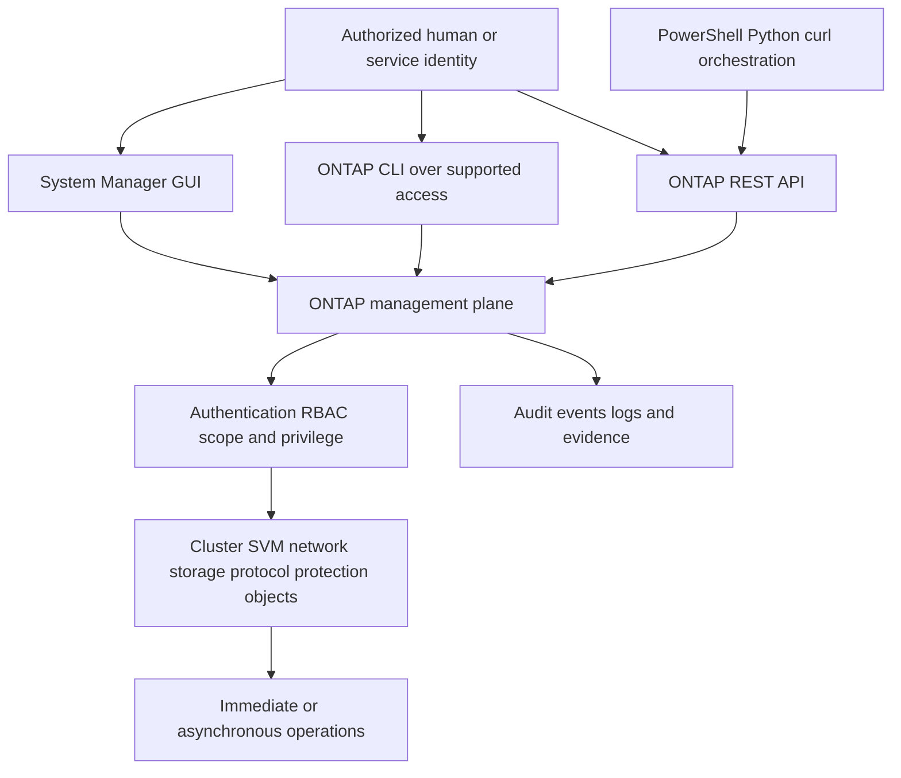

### Interface selection

| Need | Best starting interface | Why | Caveat |
|---|---|---|---|
| Guided health/configuration overview | System Manager | Visual relationships and supported workflow guidance | UI labels/workflows change; hidden detail may require CLI/API |
| One-off precise discovery | CLI | Rich fields, filters, help and compact output | Parsing display text is brittle for automation |
| Repeatable structured inventory | REST API | JSON schemas, filtering, pagination and identifiers | Endpoint/version/fields and RBAC must be verified |
| Fleet analytics pipeline | REST plus PowerShell/Python | Reproducible extraction and validation | Rate, credentials, concurrency, provenance and errors need engineering |
| Deep product diagnosis | Current documented CLI/API plus Support tools | Exact technical evidence | Privilege/internal commands may be Support-only and release-sensitive |

### Scope: cluster versus SVM

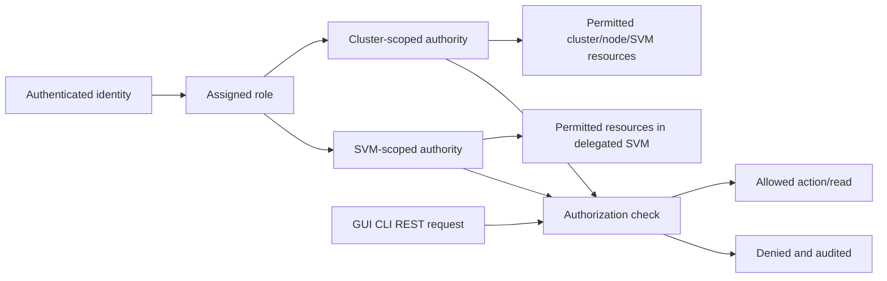

The cluster administrator can delegate selected SVM administration. That is not permission to manage cluster hardware, other tenants, or customer business risk.

---

## 2. Authentication, sessions, certificates, and RBAC

**Authentication** proves identity. **Authorization** decides what that identity may do. **RBAC (Role-Based Access Control)** maps roles to permitted commands or API resources/actions at cluster or SVM scope.

### Plain-English deep-dive: badge, room list, and visit record

Authentication is the badge check. RBAC is the list of rooms/actions allowed for that badge. A session/token is a time-bounded visit credential. Audit is the visit record. A TLS certificate lets the client validate the management service identity and protect transport. **Why it matters:** encryption without correct authorization is unsafe, and least privilege without trustworthy identity is weak.

| Concept | Plain meaning | Safe practice |
|---|---|---|
| Local/domain identity | Human/service account under supported auth | Named accounts; avoid shared admin identity |
| SSH session | Encrypted interactive CLI transport | Validate host identity; use approved keys/policy |
| HTTPS/TLS | Encrypted System Manager/REST transport | Validate certificate name, chain, time and policy; never disable verification casually |
| Password/API credential | Secret proving account access | Secret vault/environment/managed identity pattern; never source control or logs |
| Client certificate/token | Supported non-password auth/session mechanism where available | Verify exact release/endpoint/expiry/revocation |
| Role | Collection of allowed operations | Least privilege and exact cluster/SVM scope |
| Privilege level | CLI command-visibility/execution context | Use documented admin level; advanced/diagnostic/internal access only with need/guidance |
| Session timeout | Lifetime/inactivity boundary | Handle reauthentication; do not build brittle long-running assumptions |

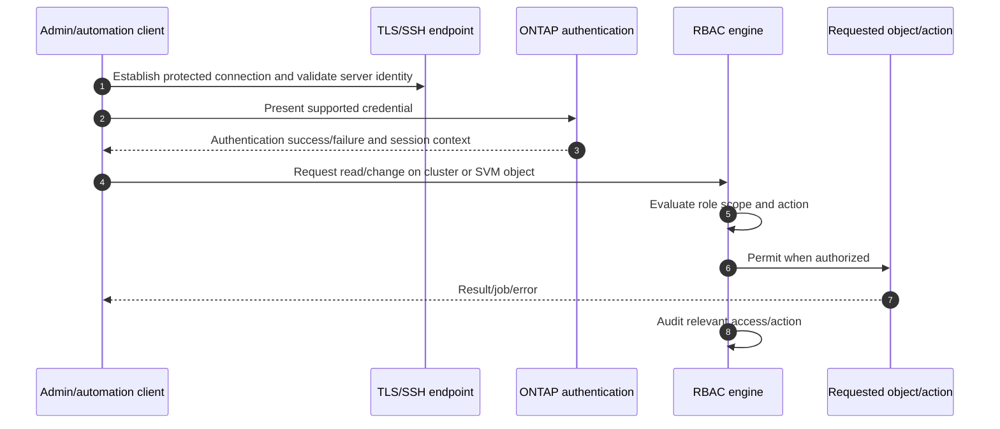

### RBAC design

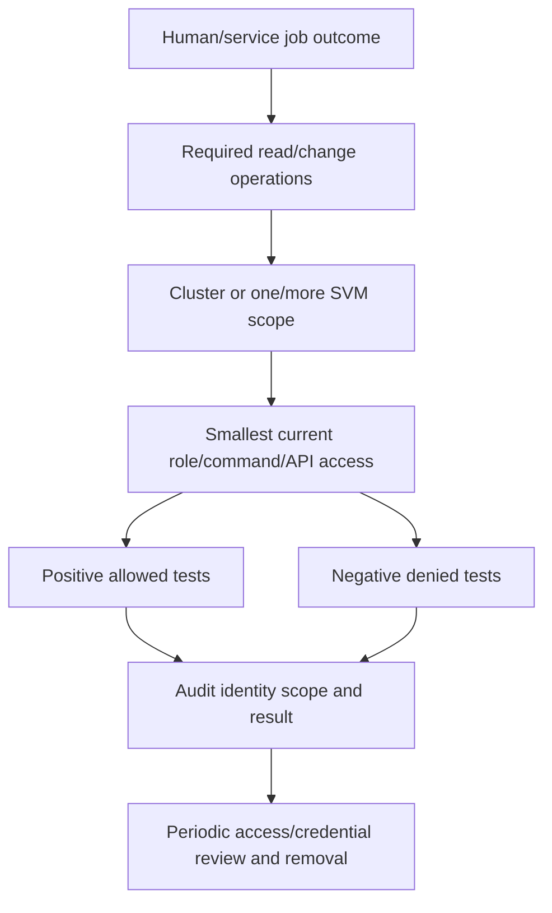

Do not solve `permission denied` by granting full admin. Capture exact identity, scope, command/API method, object, RBAC error, desired job and current role, then add only the documented permission if justified.

---

## 3. System Manager

**ONTAP System Manager** is the web-based graphical management interface. It supports current guided workflows and health/configuration views. Exact navigation, dashboards, terminology, feature coverage and defaults evolve with ONTAP.

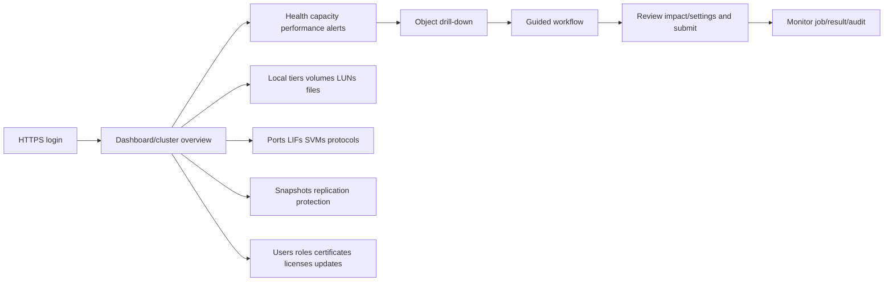

### Strengths

- Visual overview and relationships for a single cluster.
- Guided creation/modification with current workflow guardrails.
- Useful starting point for health, capacity, network and protection discovery.
- Can reduce syntax mistakes for supported common tasks.

### Limits

- A dashboard summarizes; it does not show every field or cause.
- Some detailed/advanced operations remain CLI/API-oriented.
- UI labels can translate `aggregate` to `local tier` while CLI uses older nouns.
- Screenshots are weak evidence without cluster identity, release, timestamp, scope and exported/raw detail.
- A green tile cannot prove end-to-end application health.

### System Manager evidence capture

| Capture | Include |
|---|---|
| Screenshot | Cluster/object identity, UTC/timezone, release, scope and visible filters |
| Export/download if available | Raw fields, schema/version, data cutoff and checksum/reference |
| Job result | Job/resource ID, submitter, start/end, state, error and affected object |
| Change record | Before/after values, approval, reason, rollback/stop, validation |
| Cross-check | CLI/API field used to verify material conclusion |

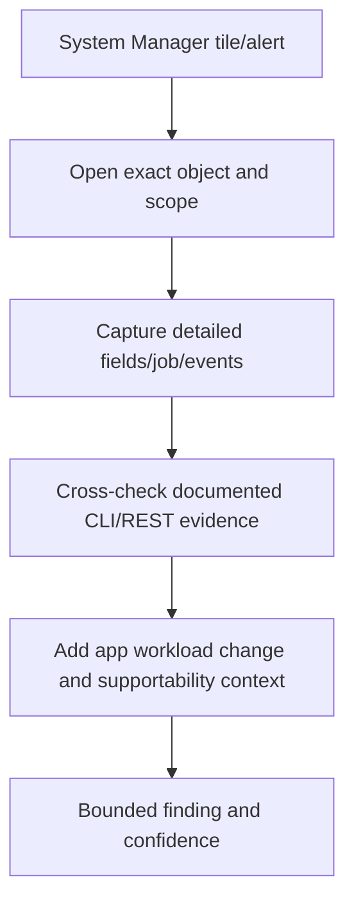

---

## 4. CLI command structure and discovery

The ONTAP CLI organizes commands into families and subcommands. Common action words include `show`, `create`, `modify`, `delete`, `start`, `stop`, and operation-specific verbs. Never assume a command exists or behaves identically across releases.

### Plain-English deep-dive: sentence grammar and dictionary

The CLI resembles a sentence: `noun family -> subobject -> action -> parameters`. Help and manual pages are the dictionary and grammar for the current release. **Why it matters:** guessing flags from another version can query the wrong scope or make an unsafe change.

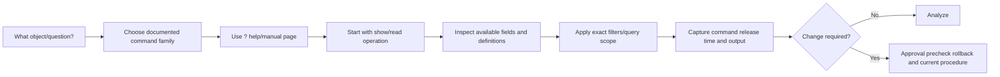

### Command discovery rules

1. Identify exact ONTAP release and privilege level.
2. Use inline `?`, command help and official manual pages.
3. Start with `show` and explicit object scope.
4. Inspect documented fields rather than assuming display columns.
5. Use filters and fields to reduce output without hiding relevant exceptions.
6. Record the full command (redacting secrets), cluster/SVM context, UTC and output.

### `show`, fields, queries and filters

Conceptual examples below intentionally avoid pretending that every field exists in every release:

```text
<object-family> show
<object-family> show -fields <documented-field-1>,<documented-field-2>
<object-family> show -<documented-key> <exact-value>
<object-family> show -instance
```

| Technique | Purpose | Risk |
|---|---|---|
| Default `show` | Fast overview | Important fields omitted |
| `-fields` | Stable chosen columns for human review | Field names/version change; missing context |
| Key filters | Restrict exact node/SVM/volume/LIF | Typo/wildcard can omit affected population |
| `-instance` | Detailed one-object view | Verbose and harder to compare fleet-wide |
| Query operators/wildcards | Find ranges/patterns where documented | Shell/CLI quoting and semantics vary |

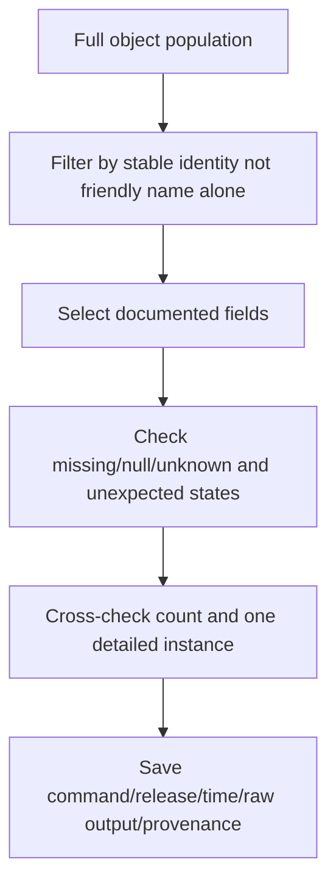

### Privilege levels and diagnostic boundaries

ONTAP CLI privilege contexts expose different command sets. `admin` is the normal documented administration context. Advanced/diagnostic/internal commands can be destructive, unstable, unsupported for customer use or intended for Support. Never enter or automate elevated diagnostic operations just to `see more`.

---

## 5. Jobs and asynchronous operations

Some ONTAP changes complete quickly; others return a **job** that progresses asynchronously. An accepted request is not a completed outcome.

### Plain-English deep-dive: parcel accepted versus delivered

An API/CLI can accept a parcel and issue a tracking number. That proves submission, not delivery. The job can queue, run, pause, fail, be cancelled, or complete with warnings. **Why it matters:** automation must monitor the terminal state and validate the managed object/application afterward.

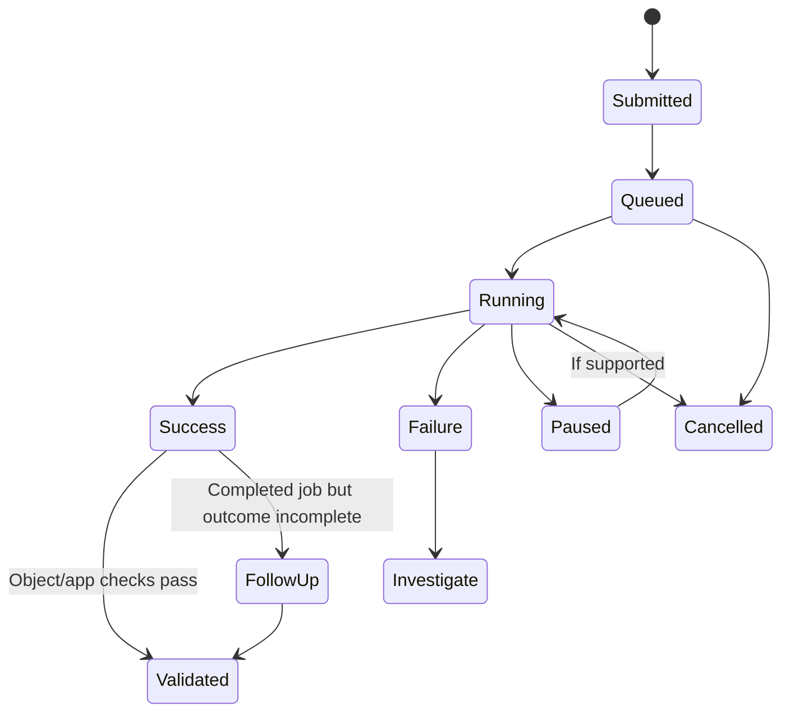

### Job handling sequence

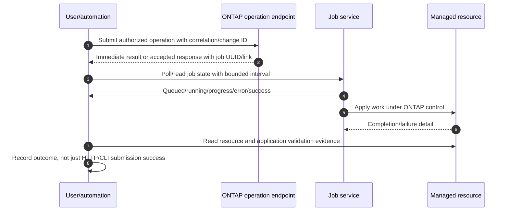

### Job checklist

- Job UUID/identifier and original request correlation.
- Cluster/SVM/object scope and initiating identity.
- Start/end, state, progress, error code/message/target.
- Timeout policy for the automation client, not an assumption that ONTAP stopped.
- Safe retry decision: query state before resubmitting.
- Resource and application postcondition.
- Audit/change record and residual risk.

---

## 6. REST fundamentals

**REST (Representational State Transfer)** is an architectural style commonly using HTTP resources and methods. ONTAP REST exposes machine-readable resources under documented endpoint paths and schemas.

### Resources and methods

| HTTP method | Common intent | Idempotency orientation | Safety question |
|---|---|---|---|
| `GET` | Read resource/collection | Safe/read-only and idempotent by HTTP semantics | Does query include complete population/pagination? |
| `POST` | Create or invoke action | Commonly not inherently idempotent | Could retry create a duplicate/action twice? |
| `PATCH` | Modify selected resource fields | Depends on operation/preconditions | Is desired state explicit and current object version known? |
| `DELETE` | Delete resource | Repeated desired absence can be idempotent conceptually, but effects are destructive | Is identity exact, dependency understood and approval present? |

Do not infer endpoint behavior from HTTP method alone. Read the current ONTAP endpoint documentation, request/response schema, job behavior and RBAC requirements.

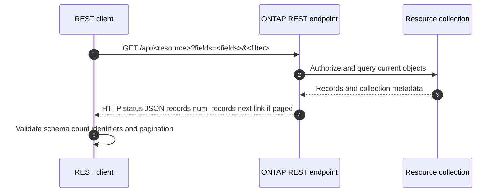

### Status classes

| HTTP class | Orientation | Action |
|---|---|---|
| 2xx | Request accepted/succeeded at HTTP/API stage | Inspect body/job and validate resource |
| 3xx | Redirect/cache-related semantics where applicable | Follow only documented secure behavior |
| 4xx | Client/auth/RBAC/resource/request conflict | Correct identity, scope, schema or current state; do not blind retry |
| 5xx | Server-side failure/unavailability | Preserve request/correlation; bounded retry only when documented/safe |

### Error record

Capture HTTP status, ONTAP error code/message/target, request method/path/query (without secrets), response headers/body, correlation/job/resource UUID, cluster/release, UTC, client/tool version and retry history. Error text is evidence, not always root cause.

---

## 7. REST filtering, fields, pagination, and versioning

A collection can contain more records than one response. **Pagination** retrieves the complete set through documented limits and `next` links/cursors/offset semantics. **Projection** selects fields. **Filtering** selects records.

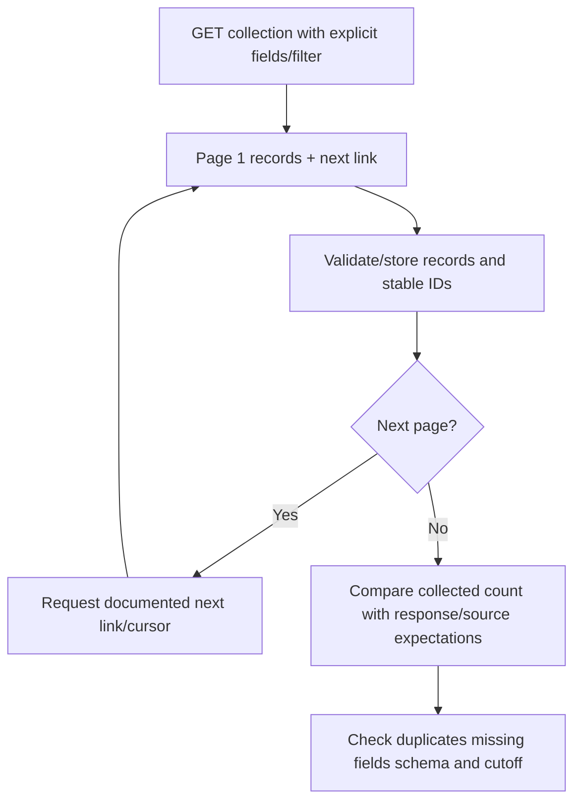

### Collection quality traps

- Reading only the first page and calling it the full install base.
- Filtering by mutable friendly name instead of UUID plus name.
- Requesting too few fields to determine state or ownership.
- Using `*`/broad queries against a large production cluster without rate planning.
- Assuming missing field means zero/false rather than unavailable/not requested/not supported.
- Joining records from different timestamps while topology is changing.

### API versioning orientation

ONTAP's API is tied to the ONTAP release and endpoint documentation. Resources/fields can be added, changed, deprecated or unavailable. A client should:

1. Discover/record cluster version and API documentation version.
2. Declare minimum/maximum tested releases and required fields.
3. Tolerate additional response fields.
4. Detect missing required fields/endpoints clearly.
5. Use schema/endpoint feature detection rather than string-comparing versions alone where possible.
6. Test against every supported release and preserve fixtures without customer data.

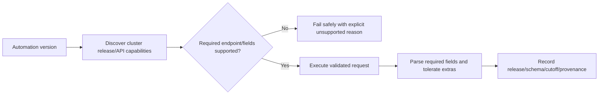

---

## 8. Idempotency and safe change design

An **idempotent** operation produces the same intended state when safely repeated. A declarative automation pattern reads current state, computes a difference, and changes only what is necessary.

### Plain-English deep-dive: set thermostat, do not add heat blindly

`Set target temperature to 21 C` is idempotent: repeating it keeps the same target. `Increase temperature by 2 C` changes the state every time. In storage automation, `ensure this LIF has this service policy` is safer than `append service` without checking. **Why it matters:** network retries, timeouts and job delays can repeat requests.

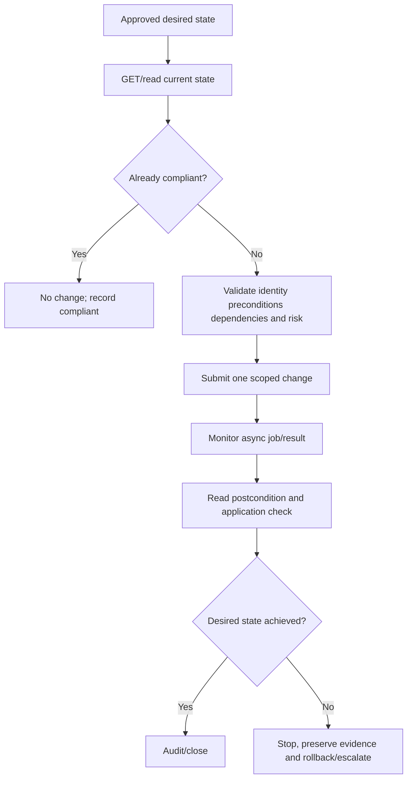

### Change safeguards

- Exact stable resource identifier plus human-readable confirmation.
- Current state and precondition checks immediately before write.
- Dry-run/plan mode that produces no changes.
- Approval/change ID and named owner.
- Small batch/canary and work-in-progress limit.
- Bounded retries only for known safe/transient conditions.
- Job monitoring and timeout reconciliation.
- Rollback/stop conditions and known irreversible actions.
- Postcondition, protocol/application and residual-risk validation.

REST does not magically make destructive actions safe. `DELETE` remains destructive even if easy to script.

---

## 9. Read-only curl, PowerShell, and Python patterns

These examples use placeholders and no real credentials. Validate the exact endpoint/fields and certificate chain for the target release. Do not use `-k`, `verify=False`, plaintext passwords, or copied tokens in production merely to make a demo work.

### curl: read cluster identity

```bash
curl --fail-with-body --silent --show-error \
  --cacert "$ONTAP_CA_FILE" \
  --user "$ONTAP_USER:$ONTAP_PASSWORD" \
  "https://cluster.example/api/cluster?fields=uuid,name,version"
```

For production automation, prefer an approved secret mechanism that avoids exposing credentials in process listings/history. The exact supported authentication method must be checked.

### PowerShell: read a paged collection

```powershell
$baseUri = "https://cluster.example"
$headers = @{
    Accept = "application/json"
}
$credential = Get-Credential
$nextUri = "$baseUri/api/storage/volumes?fields=uuid,name,svm,state&max_records=100"
$records = [System.Collections.Generic.List[object]]::new()

while ($nextUri) {
    $response = Invoke-RestMethod -Method Get -Uri $nextUri -Headers $headers `
        -Credential $credential
    foreach ($record in $response.records) {
        $records.Add($record)
    }
    $nextHref = $response._links.next.href
    $nextUri = if ($nextHref) { "$baseUri$nextHref" } else { $null }
}

$records | Select-Object uuid, name, state,
    @{Name = "svm_uuid"; Expression = { $_.svm.uuid }}
```

Endpoint and pagination fields above are illustrative; verify current API docs and authentication/certificate handling. Do not assume `max_records` or `_links.next` behaves identically across tools/releases without testing.

### Python: read with explicit timeout and pagination

```python
import os
import requests

base_url = "https://cluster.example"
session = requests.Session()
session.auth = (os.environ["ONTAP_USER"], os.environ["ONTAP_PASSWORD"])
session.verify = os.environ["ONTAP_CA_FILE"]
session.headers.update({"Accept": "application/json"})

next_url = f"{base_url}/api/storage/volumes"
params = {"fields": "uuid,name,svm,state", "max_records": 100}
records = []

while next_url:
    response = session.get(next_url, params=params, timeout=(5, 30))
    response.raise_for_status()
    payload = response.json()
    records.extend(payload.get("records", []))
    next_href = payload.get("_links", {}).get("next", {}).get("href")
    next_url = f"{base_url}{next_href}" if next_href else None
    params = None

print(f"collected={len(records)}")
```

### Evidence output schema

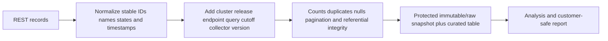

Store raw responses securely with access control, retention and privacy review. Redact credentials/tokens and minimize customer data in reports.

---

## 10. PowerShell modules and Python client libraries

NetApp-supported PowerShell toolkits and Python client libraries can wrap ONTAP APIs with typed commands/objects. Their names, versions, supported authentication and endpoint coverage change. A wrapper does not remove API versioning or RBAC.

| Approach | Strength | Risk |
|---|---|---|
| Raw REST/curl | Transparent HTTP/schema, easy troubleshooting | More plumbing and manual models |
| PowerShell toolkit/module | Familiar Windows automation and pipeline objects | Module/release compatibility and command coverage |
| Python client library | Reusable models, pagination/helpers and testing | Library abstraction can hide HTTP details/errors |
| Ansible/automation framework | Declarative fleet workflows | Module versions, idempotency, secrets and blast radius |

### Dependency control

- Pin and inventory tool/library versions.
- Record ONTAP releases tested.
- Read module release notes and migration guidance.
- Use a test cluster/synthetic mocks for change paths.
- Log wrapper command and underlying request/correlation where possible.
- Fail safely when an endpoint/field is unavailable.

---

## 11. ONTAPI/ZAPI historical orientation and migration

**ONTAPI**, often called **ZAPI**, is NetApp's historical XML-based ONTAP management API. Modern automation should use ONTAP REST for supported use cases according to current NetApp guidance. Migration is an endpoint-by-endpoint engineering exercise; do not invent a universal retirement date or assume one-to-one field parity.

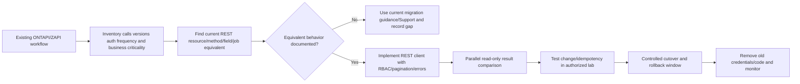

### Migration checklist

1. Inventory every ZAPI call, input/output, privilege, schedule, retry and consumer.
2. Find the current REST endpoint and semantic—not merely a similarly named field.
3. Compare object identifiers, nulls/defaults, units, timestamps, pagination and jobs.
4. Update authentication, certificates, RBAC and secret storage.
5. Compare read-only outputs against an agreed source of truth.
6. Test create/change/delete paths in an isolated authorized environment.
7. Cut over in small batches with observable rollback and remove obsolete access.

Do not parse old CLI text as a shortcut migration API.

---

## 12. Logging, errors, secrets, and change control

### Automation telemetry flow

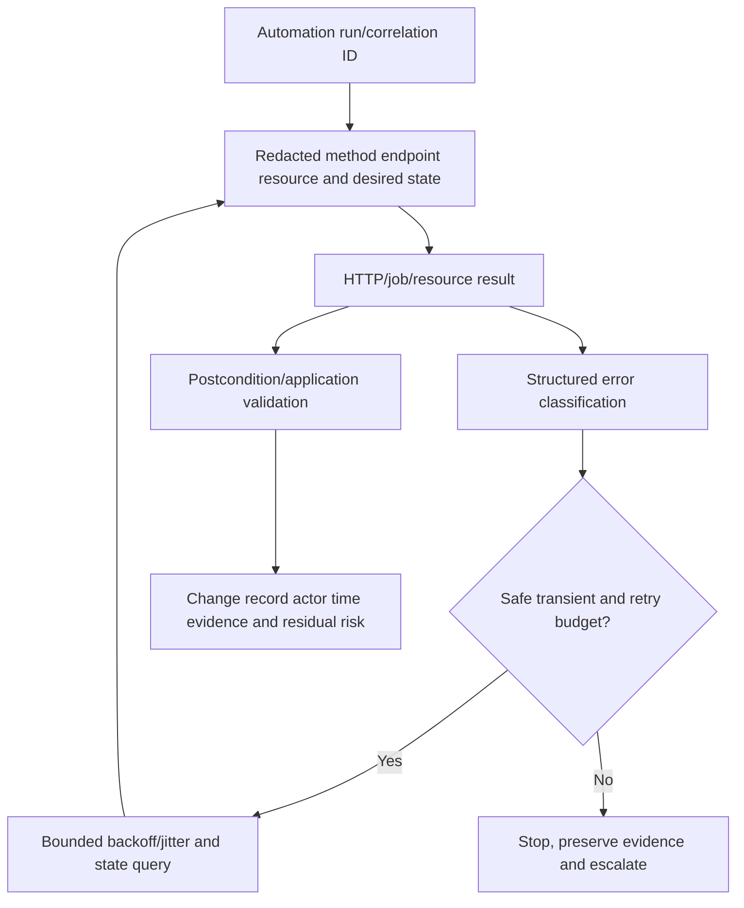

### Error classes

| Class | Example orientation | Response |
|---|---|---|
| Authentication | Bad/expired credential, certificate issue | Stop; fix identity/trust without exposing secret |
| Authorization | RBAC denies action | Stop; verify job/scope and least privilege |
| Validation | Bad field/value/schema | Correct request against current docs |
| Not found | Wrong UUID/path or concurrent deletion | Re-read population; never substitute a name blindly |
| Conflict/precondition | Current state/dependency prevents action | Reconcile state/owner; no blind retry |
| Rate/resource/transient | Busy, temporary service/network failure | Bounded retry if documented and idempotent/safe |
| Async job failure | Accepted then failed | Inspect job/resource/events; do not resubmit until state known |

### Secret rules

- Never log passwords, tokens, private keys, CHAP secrets or session cookies.
- Avoid credentials in command-line arguments, URLs, notebooks, screenshots and shell history.
- Use approved secret vaults, protected environment injection, short-lived credentials or client certificates where supported.
- Rotate, revoke and inventory service identities; remove orphaned automation accounts.
- Separate development/test/production credentials and scope.

### Change record minimum

- Business reason, customer impact and owner.
- Exact cluster/SVM/resource UUID and before state.
- Desired state and documented request/command.
- Approval, maintenance window, dependencies, supportability and backup/protection.
- Dry run/canary, stop/rollback, job monitoring and communication.
- Postcondition, application test, audit reference and residual risk.

---

## 13. Evidence capture and reproducibility

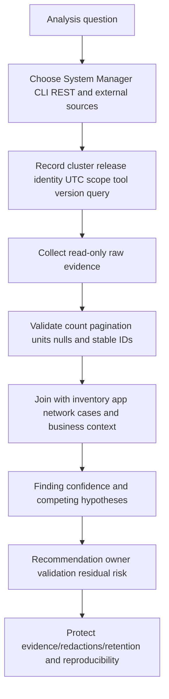

### Evidence quality table

| Weak evidence | Stronger evidence |
|---|---|
| Screenshot of `healthy` | Dated cluster/object IDs, raw fields, events, scope and app test |
| Copied CLI table | Full documented command, release, context, raw output and field definitions |
| First API page | Complete paginated collection with count/duplicate/null QA |
| `200 OK` | Response schema, job completion, resource postcondition and application validation |
| Script says success | Correlation ID, request/result/job, before/after and audit event |
| Name-only join | Stable UUID/system/serial key plus effective dates |

### Read-only-first run order

1. Identify and scope.
2. Read current state through supported interface.
3. Cross-check material facts.
4. Build desired state and diff.
5. Obtain approval and safe test conditions.
6. Change one bounded object.
7. Monitor job and validate resource/application.
8. Expand only after evidence passes.

---

## 14. Common failures and troubleshooting

### Interface troubleshooting tree

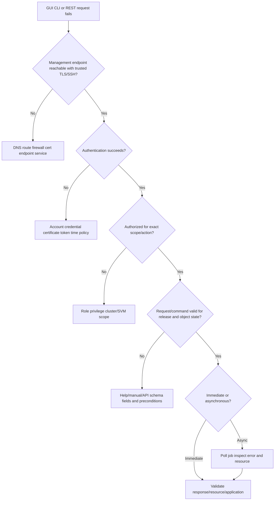

### Common mistakes

| Mistake | Why it fails | Better behavior |
|---|---|---|
| Automating CLI screen scraping | Columns/localization/releases change | Use structured REST/library where supported |
| `GET succeeded, inventory complete` | Pagination/filter/RBAC can omit records | Validate next links, counts and scope |
| Disabling TLS verification | Enables management impersonation | Install/validate correct CA/name/time |
| Hardcoding admin password | Leaks and creates broad blast radius | Vaulted, scoped, rotated service identity |
| Blind retry of POST/PATCH | Can duplicate or conflict with running job | Query job/resource and use idempotent desired state |
| Treating 202/accepted as completion | Operation can later fail | Monitor terminal job and postcondition |
| Granting full admin for script | Violates least privilege | Build/test exact REST/CLI role scope |
| Assuming GUI and API defaults match forever | Workflow/defaults evolve | Send explicit desired fields and record release |
| Ignoring null/missing fields | Unknown becomes zero/healthy | Schema-aware validation and explicit unknown |
| Bulk change first | One mistake multiplies across fleet | Dry run, canary, batch and stop threshold |
| Inventing ZAPI cutoff timeline | Migration/support policy changes | Use current official migration guidance |

### Support boundaries

- Read-only evidence collection still requires authorization and data handling.
- Production writes need customer change authority and object owners.
- Advanced/diagnostic CLI and internal endpoints remain NetApp Support/engineering territory.
- Script authors own secure coding, logging, testing and blast-radius controls; product Support owns documented product behavior, not custom-code correctness.

---

## 15. TAM discovery, recommendations, and JD Mapping

### Discovery questions

1. Which business outcome, cluster/SVM/object, analysis or change is required?
2. Which ONTAP release/platform, interface/tool/module version and official documentation apply?
3. Which identity/authentication/certificate/token, role, privilege and cluster/SVM scope apply?
4. Which System Manager workflow, CLI command/fields/filter or REST resource/method/schema/job represents the task?
5. Is the collection paginated, filtered, partial by RBAC, stale, or missing fields?
6. Is the operation immediate/asynchronous, idempotent, destructive, reversible and safe to retry?
7. How are credentials, logs, raw evidence, privacy, retention and audit managed?
8. What dry run, canary, batch, stop/rollback, postcondition and application tests apply?
9. Does an existing ZAPI/CLI workflow need semantic REST migration?
10. Who owns script, product, change, data, support and residual-risk decisions?

### Recommendation model

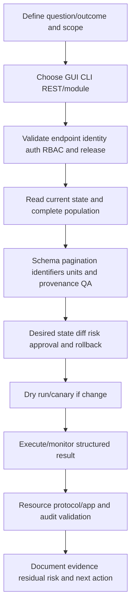

### Recommendation patterns

| Finding | Risk | Bounded recommendation | Validation |
|---|---|---|---|
| Fleet inventory script reads one page | Assets and risks are missing | Implement documented pagination/count/duplicate QA and stable IDs | API/UI/CLI sample reconciliation |
| Script uses cluster-admin for SVM report | Credential compromise has excessive blast radius | Create exact read-only SVM/cluster role and rotate secret | Positive/negative endpoint tests and audit |
| Change timed out but job continues | Blind retry can duplicate/conflict | Query job/resource before retry; use desired-state logic | Single terminal job and correct postcondition |
| ZAPI report differs from REST | Semantics/units/defaults or scope may differ | Map fields endpoint-by-endpoint and parallel compare | Agreed sample/full population parity with documented gaps |
| TLS verification disabled | Management identity can be spoofed | Deploy trusted certificate/CA and strict verification | Name/chain/time/revocation and connection test |

### JD Mapping

| JD responsibility | Part 24 contribution | Your factual bridge and gap |
|---|---|---|
| Generate/analyze/report data | Structured API/CLI evidence, pagination, QA and provenance | Analytics/PowerShell/Python concepts transfer; ONTAP production access unproven |
| Install-base accuracy | Stable IDs, complete collection, joins and audit | Backlog/data-quality skills transfer |
| Risk/stability | Read-only first, idempotency, canary, jobs, rollback and secrets | critical situation/change discipline transfers |
| Recommendation quality | Reproducible evidence and exact postconditions | Support advisory communication transfers |
| Service reviews | Repeatable refresh and evidence cutoff | Excel/Power BI/business reviews transfer |
| Special projects | Versioned automation, dependency/control design and migration | Project/analytics skills transfer |
| Supportability | Current release/manual/API docs; no syntax guessing | NetApp command/API/tool gap explicit |
| Escalation | Correlation IDs, jobs, errors, audit and exact request | Product/Engineering evidence discipline transfers |

---

## 16. Fully synthetic scenario: Northwind fleet inventory and failed change

> **Synthetic case:** Northwind, all clusters, API responses, credentials, jobs and outcomes below are fictional. It is not NetApp internal process or documented production automation.

### Situation

- Twelve clusters run three supported ONTAP release families.
- A Python script collects volumes for a quarterly service review.
- The script uses a broad admin account, disables TLS verification and reads one collection response.
- It reports 1,140 volumes; an analyst expects about 1,300.
- A separate automation attempts to update one volume policy, times out and retries immediately.

```mermaid
flowchart TB
    SCHED[Quarterly automation] --> CRED[Broad shared admin credential]
    CRED --> API[REST calls with TLS verify disabled]
    API --> PAGE[Only first page read]
    PAGE --> REPORT[Incomplete inventory/risk report]
    CHANGE[Policy PATCH] --> TIMEOUT[Client timeout]
    TIMEOUT --> RETRY[Blind second PATCH]
    CHANGE --> JOB[Original async job still running]
    RETRY --> CONFLICT[Duplicate/conflict risk]
```

### Evidence

| Evidence | Observation | Bounded conclusion |
|---|---|---|
| API response | `num_records`/next link indicates more pages | Report is incomplete |
| RBAC | Account can modify all cluster resources | Excess privilege, not cause of missing records |
| TLS | Verification disabled in code | Security control failure |
| Cluster releases | One field absent on older supported release | Schema/version handling needed; absence is not zero |
| Change | Original response included job link before client timeout | Operation state must be reconciled before retry |
| Audit/job | First job succeeds; second request conflicts | Blind retry created avoidable failure |
| GUI sample | Selected cluster count exceeds script count | Independent disconfirmation of completeness |

### Fault tree

```mermaid
flowchart TD
    TOP[Incomplete report and duplicate change] --> SPLIT[Separate collection and change safety]
    SPLIT --> READ[Inventory collection]
    SPLIT --> WRITE[Policy change]
    READ --> PAG{All pages followed?}
    PAG -->|No| FIXP[Implement next-link pagination and count QA]
    PAG -->|Yes| RB{RBAC/filter/schema missing records?}
    RB --> FIXR[Validate scope fields nulls and versions]
    WRITE --> JOBQ{Original job/resource state known?}
    JOBQ -->|No| STOP[Stop retry and query job/resource/audit]
    JOBQ -->|Yes| IDEM[Compare desired/current state before action]
    FIXP --> SEC[Replace broad credential and enforce TLS]
    FIXR --> SEC
    STOP --> IDEM
    IDEM --> TEST[Canary and postcondition test]
```

### Recommendations

1. Replace the shared cluster-admin credential with approved, rotated, least-privilege read and change identities; separate duties.
2. Deploy trusted management certificates/CA and remove TLS bypasses.
3. Implement documented pagination, stable IDs, schema capability detection, raw provenance, count/duplicate/null/referential QA and cross-check samples.
4. For changes, record request/job UUID, poll state, read current resource after timeout and apply idempotent desired-state logic before any retry.
5. Pin/test client versions against all supported ONTAP releases, run canaries, and publish data cutoff/limitations in the service review.

### Customer-facing summary

> "The inventory gap is an extraction defect: the script stops after the first page and treats an unavailable field on an older release as zero. The failed policy retry is separate: the initial request created an asynchronous job that completed after the client timed out, so the second request conflicted. We recommend complete paginated collection with schema QA, strict TLS and least privilege, plus job-aware idempotent changes and canary validation. No ONTAP product defect is established."

---

## 17. Your prior/automation/analytics bridge

```mermaid
flowchart LR
    PS[PowerShell/Windows support] --> AUTO[Structured automation and error handling]
    PY[Python/SQL/analytics] --> DATA[APIs schemas joins QA and reproducibility]
    CRIT[Critical situation/Product escalation] --> SAFE[Correlation evidence stop and exact ask]
    BI[Power BI/business reviews] --> REPORT[Cutoff provenance limitations and decisions]
    AUTO --> ONTAP[ONTAP interface synthetic practice]
    DATA --> ONTAP
    SAFE --> ONTAP
    REPORT --> ONTAP
    ONTAP --> LAB[Authorized cluster lab and SME review]
```

| Factual strength | Transfer | Explicit gap |
|---|---|---|
| enterprise support/PowerShell familiarity | Authentication, sessions, errors, least privilege, change logs | No ONTAP CLI/System Manager production work |
| Python/SQL/Excel/Power BI | REST collection, pagination, schema QA, joins and reports | No NetApp SDK/module production ownership |
| Product/Engineering escalation | Correlation ID, reproducible request, exact error and impact | No internal ONTAP diagnostic/API claim |
| Critical situation/change communication | Stop unsafe retry, owner/cadence/postcondition | No production ONTAP change authority |

### Honest answer

> "I understand when to use System Manager, CLI, REST and automation; how cluster/SVM RBAC, TLS, sessions, jobs, fields, filters, pagination, versioning and idempotency affect reliability; and how to build read-only inventory scripts safely. My direct production experience is enterprise support and analytics, not ONTAP administration. I would validate exact release endpoints/commands, use an authorized lab and least-privilege credentials, and involve storage owners for any write path."

---

## 18. Whiteboard drills and paper lab

### Whiteboard drills

1. **Interfaces:** One management plane through GUI, CLI and REST; add auth/RBAC/audit.
2. **CLI:** Object family -> help -> show -> fields -> filter -> evidence.
3. **REST:** Resource/method -> status -> job -> postcondition.
4. **Pagination:** First page -> next links -> count/duplicate/null QA.
5. **Idempotency:** Read -> diff -> precondition -> apply -> job -> verify.
6. **Security:** TLS server identity, scoped credential, no secret logs.
7. **Timeout:** Client timeout does not mean ONTAP operation stopped.
8. **ZAPI migration:** Inventory -> semantic REST mapping -> parallel compare -> canary -> cutover.

### Paper lab scenario

A fictional enterprise needs a read-only inventory across 20 clusters, a capacity report, SVM-scoped operator access, and an automated volume-tag/policy correction. Releases differ, certificates are partly expired, two old scripts use ZAPI, and no job/correlation records are retained.

### Tasks

1. Inventory clusters/releases/identities/certificates/interfaces/tools/scripts and owners.
2. Define System Manager, CLI and REST evidence for the same five objects.
3. Build least-privilege cluster-read and SVM-change roles with positive/negative tests.
4. Design certificate trust/rotation and secret-vault integration.
5. Discover documented CLI fields/help/manual pages for each release.
6. Design paginated REST collection with stable IDs, schemas, raw/provenance storage and QA.
7. Implement synthetic curl, PowerShell and Python read-only requests with explicit timeouts.
8. Inject 401, 403, 404, conflict, 5xx, network timeout and asynchronous job failure.
9. Define retry classes and idempotency/precondition rules.
10. Create dry-run/diff/canary/batch/stop/rollback/postcondition workflow.
11. Map ZAPI calls to current REST semantics and compare read-only fixtures.
12. Build audit/change/evidence retention and privacy controls.
13. Write one automation-risk and one data-quality recommendation.
14. Present executive and technical summaries.

```mermaid
flowchart LR
    INV[Inventory releases tools auth and scripts] --> ROLE[Design RBAC/cert/secrets]
    ROLE --> READ[Build complete read-only collection]
    READ --> QA[Schema/pagination/provenance QA]
    QA --> ERR[Test errors jobs and retries]
    ERR --> CHANGE[Dry-run/canary idempotent change]
    CHANGE --> MIG[ZAPI semantic migration]
    MIG --> EVID[Audit evidence recommendation]
```

### Lab pass criteria

- [ ] Interface choice matches human/machine/repeatability need.
- [ ] Cluster/SVM scope and positive/negative RBAC are explicit.
- [ ] TLS validation and secrets are never bypassed/exposed.
- [ ] CLI commands/fields are discovered from current docs/help.
- [ ] REST collection follows every page and validates counts/schema.
- [ ] HTTP acceptance/job success/resource/app outcome remain separate.
- [ ] Retries are bounded and idempotency-aware.
- [ ] Changes use dry run, canary, stop/rollback and postconditions.
- [ ] ZAPI migration is semantic and has no invented deadline.
- [ ] No synthetic exercise is presented as production ONTAP automation.

---

## 19. Self-test

1. Compare System Manager, CLI, REST and automation use cases/limits.
2. Draw authentication, TLS/SSH, RBAC, cluster/SVM scope and audit.
3. Define sessions, certificates, credentials/tokens and privilege levels conceptually.
4. Design a least-privilege role with positive/negative tests.
5. Explain System Manager evidence and why a green tile is insufficient.
6. Use CLI help/manual discovery and `show`/fields/filter/instance patterns safely.
7. Explain admin versus advanced/diagnostic boundaries.
8. Define asynchronous job states and postcondition validation.
9. Map GET/POST/PATCH/DELETE and idempotency caveats.
10. Interpret HTTP 2xx/4xx/5xx plus ONTAP structured errors.
11. Implement collection pagination and count/duplicate/null/schema QA.
12. Explain API version/capability handling across ONTAP releases.
13. Draw desired-state idempotent change and timeout reconciliation.
14. Explain safe curl/PowerShell/Python patterns and certificate/secret handling.
15. Compare raw REST, modules/libraries and automation frameworks.
16. Explain ONTAPI/ZAPI history and semantic migration without a made-up timeline.
17. Build logging, correlation, error classification and bounded retry.
18. Apply the interface fault tree and common-failure table.
19. Ask TAM discovery questions and write a recommendation.
20. Recreate Northwind's pagination and job-retry defects separately.
21. Complete all whiteboard drills, paper lab and Q1-Q8 aloud.
22. State your strengths and ONTAP administration/automation gap precisely.

---

## 20. Official Source Anchors

**Date checked: 2026-08-24.** These official public sources anchor ONTAP administration and automation. Exact UI, commands, privilege, endpoints, schemas, authentication, jobs, pagination, libraries, ZAPI migration coverage and deprecations change by ONTAP/tool release. Use the exact current docs/API explorer/manual page and authorized cluster evidence; never invent syntax, fields or timelines.

| Topic | Official public source | Bounded use and currency note |
|---|---|---|
| Administration overview | [ONTAP administration overview](https://docs.netapp.com/us-en/ontap/concept_administration_overview.html) | Current System Manager/CLI administration orientation. |
| ONTAP System Manager | [Manage ONTAP with System Manager](https://docs.netapp.com/us-en/ontap/task_admin_manage_storage_systems.html) | Current UI/workflow entry; navigation/features change by release. |
| CLI administration | [ONTAP system administration with CLI](https://docs.netapp.com/us-en/ontap/system-admin/) | Command families, privilege and administration context. |
| Manual pages | [ONTAP manual pages](https://docs.netapp.com/us-en/ontap/concepts/manual-pages.html) | Find exact release command syntax/fields; command reference remains authoritative for examples. |
| Authentication and RBAC | [ONTAP authentication and access control](https://docs.netapp.com/us-en/ontap/authentication-access-control/) | Users, roles, SSH/API/certificates and scope; exact methods vary by release. |
| ONTAP REST overview | [ONTAP REST API documentation](https://docs.netapp.com/us-en/ontap-automation/) | Current REST architecture, workflows, API reference and migration guidance entry point. |
| REST API reference | [ONTAP REST API reference](https://docs.netapp.com/us-en/ontap-restapi/) | Exact endpoints/methods/fields/jobs/errors for documented release. |
| Python client library | [NetApp ONTAP Python client library](https://github.com/NetApp/ontap-rest-python) | Official repository; pin version and verify supported ONTAP releases/auth behavior. |
| PowerShell toolkit | [NetApp ONTAP PowerShell Toolkit](https://docs.netapp.com/us-en/ontap-automation/pstk/learn-about-pstk.html) | Current official automation page; module/cmdlet/release and authentication coverage must be verified. |
| ZAPI to REST migration | [Migrate ONTAPI/ZAPI automation to REST](https://docs.netapp.com/us-en/ontap-automation/migrate/ontapi_disablement.html) | Current migration guidance; do not infer a universal deadline or one-to-one parity. |
| Audit | [ONTAP audit logging](https://docs.netapp.com/us-en/ontap/system-admin/index.html) | Administration/audit entry point; exact event/log fields belong to Part 25. |
| NetApp Support | [NetApp Support Site](https://mysupport.netapp.com/) | Entitlement-dependent procedures, cases, knowledge and diagnostics. |

### Source-use discipline

- Record cluster UUID/name, ONTAP release, interface/tool/library version, identity/role/scope, UTC and full redacted request/command.
- Use current manual/API reference for exact syntax/fields; examples in this Part are placeholders.
- Validate TLS server identity and use approved secret storage; never disable verification as a permanent fix.
- Follow every page/next link and validate counts/schema/IDs before reporting complete inventory.
- Monitor async jobs and validate resource/application postconditions before success.
- Use current migration guidance for each ZAPI workflow and record semantic gaps.

---

## Likely Interview Questions

### Q1. When would you use System Manager, CLI, REST or automation?

> **Model answer:** "I use System Manager for guided visual workflows and relationship discovery, CLI for precise interactive investigation and current command help, REST for structured repeatable resource access, and PowerShell/Python or frameworks for controlled fleet workflows. They share ONTAP's management plane, RBAC, object state, jobs and audit. I start read-only, record release/context and cross-check material facts rather than assuming one interface's summary is complete."

**Follow-up depth:** Choose an interface for one-cluster health, a deep LIF query, a 100-cluster inventory and a risky production change.

### Q2. How do authentication, RBAC and cluster/SVM scope work?

> **Model answer:** "Authentication proves a human or service identity through a supported mechanism over trusted SSH/HTTPS. RBAC authorizes exact operations at cluster or SVM scope. I define the job, derive required reads/changes, assign the smallest role, validate allowed and denied calls, protect/rotate credentials and review audit. A successful login is not authorization, and an SVM operator should not receive cluster-admin merely to fix one API denial."

**Follow-up depth:** Design separate fleet-read, SVM-operator and emergency roles, including certificate/secret and offboarding controls.

### Q3. How do you discover and use ONTAP CLI commands safely?

> **Model answer:** "I identify the exact ONTAP release and context, select the object family, use `?`, help and official manual pages, and start with a scoped `show`. I inspect documented fields, filters and detailed instance output, validate population counts and capture the full redacted command, cluster/SVM, privilege, timestamp and output. I do not automate screen scraping or enter diagnostic privilege without a documented Support need."

**Follow-up depth:** Explain fields versus default columns, filtering pitfalls, wildcard/query behavior and how you prove no objects were omitted.

### Q4. How do REST methods, statuses and asynchronous jobs affect automation?

> **Model answer:** "GET reads resources; POST commonly creates/invokes; PATCH changes selected fields; DELETE removes, but exact endpoint semantics control behavior. A 2xx or accepted response proves the API stage, not necessarily completed work. If a job is returned, I save its UUID, poll boundedly, inspect terminal error/success, then read the resource and test the application. I classify 4xx/5xx errors and never blindly retry an unknown write."

**Follow-up depth:** Handle client timeout after a 202/job response, conflict, 403, 404 and a job that succeeds but leaves the app unhealthy.

### Q5. How do you ensure a REST inventory is complete and reproducible?

> **Model answer:** "I request explicit fields and filters, follow every documented pagination link/cursor, retain stable UUIDs and raw responses, and compare collected count with response/source expectations. I validate duplicates, null/missing fields, schemas, units, timestamps and referential joins. I record cluster/release, endpoint/query, data cutoff, collector/library version and RBAC scope and cross-check samples through CLI/System Manager. Missing is unknown, not zero."

**Follow-up depth:** Explain why first-page, name-only joins and mixed-cutoff records corrupt install-base analysis.

### Q6. What makes automation idempotent and safe?

> **Model answer:** "I express an approved desired state, read current state, compute a diff, validate exact stable identity and preconditions, then apply one scoped change only when needed. I use dry run, canary, batch limits, job monitoring, bounded safe retries, stop/rollback and resource plus application postconditions. On timeout I reconcile job/resource state before retry. Idempotency reduces duplicate effects but does not make a destructive or unsupported action safe."

**Follow-up depth:** Compare `set size to X` with `increase by Y`, and design a safe fleet policy correction.

### Q7. How would you migrate ONTAPI/ZAPI automation to REST?

> **Model answer:** "I inventory every ZAPI call, semantics, fields, units, privilege, schedule, retry and consumer. I find the current REST resource/method/job equivalent and document gaps rather than matching names only. I update TLS/auth/RBAC, pagination and errors, compare read-only outputs in parallel, test writes/idempotency in a lab, then canary/cut over with rollback and retire old credentials/code. I use current guidance and do not invent a universal disablement timeline."

**Follow-up depth:** Explain default/null/identifier/job differences and how you handle a workflow with no documented REST equivalent.

### Q8. How does your background transfer, and what remains a gap?

> **Model answer:** "My prior support, PowerShell/Python/SQL/analytics and Product/Engineering work give me strong foundations in authentication, APIs, data QA, error handling, reproducibility, change safety and evidence communication. I have not administered ONTAP or deployed NetApp automation in production. I would validate exact release commands/endpoints, use an authorized lab and least-privilege identity, protect secrets and have storage owners approve and verify any write path."

**Follow-up depth:** Give one factual Microsoft automation/data-quality example and state which ONTAP endpoint, RBAC, job and product semantics remain unproven.

---

## 30-Second Memory Hooks

- **One plane, many doors:** System Manager, CLI and REST manage the same ONTAP reality.
- **System Manager:** Guided visual workflow; dashboard is a starting signal.
- **CLI:** Object grammar plus current help/manual pages.
- **REST:** Structured resources, methods, status, schemas and jobs.
- **Authentication:** Who are you? **RBAC:** What may you do, where?
- **TLS:** Verify the management service; never normalize `verify false`.
- **Read-only first:** Identify -> read -> cross-check -> plan -> approve -> change -> prove.
- **Pagination:** First page is not the population.
- **Missing field:** Unknown/not supported/not requested, not zero.
- **202/job:** Parcel accepted, not delivered.
- **Idempotent:** Set desired state, do not add blindly.
- **Timeout:** Query job/resource before retrying.
- **Secrets:** Vault, scope, rotate, redact; never logs/code/history.
- **ZAPI migration:** Map semantics, not names; no invented deadline.
- **Evidence:** Release + endpoint/query + stable IDs + cutoff + raw data + QA.
- **Your bridge:** Automation/data rigor transfers; ONTAP production authority does not.

---

## Completion Checklist

- [ ] Compare System Manager, CLI, REST, modules and automation frameworks.
- [ ] Draw management plane, authentication, RBAC, cluster/SVM scope, jobs and audit.
- [ ] Explain TLS/SSH, credentials/certificates/tokens/session and secret controls conceptually.
- [ ] Design/test least-privilege roles with positive and negative operations.
- [ ] Use System Manager as a guided view and capture reproducible detail.
- [ ] Discover CLI command families/fields/filters/help/manual pages by exact release.
- [ ] Preserve admin versus advanced/diagnostic Support boundaries.
- [ ] Monitor asynchronous jobs and validate resource/application postconditions.
- [ ] Explain GET/POST/PATCH/DELETE, HTTP status and endpoint-specific semantics.
- [ ] Collect complete REST populations with pagination/count/schema/ID/null QA.
- [ ] Design API capability/version handling across supported ONTAP releases.
- [ ] Implement desired-state idempotency, preconditions, timeout reconciliation and bounded retries.
- [ ] Use safe read-only curl/PowerShell/Python patterns with trusted TLS and protected secrets.
- [ ] Control module/library versions and record supported release tests.
- [ ] Migrate ZAPI semantically using current guidance and no invented timeline.
- [ ] Build structured logging/errors/correlation/change/audit/privacy evidence.
- [ ] Apply the troubleshooting tree, common mistakes and support boundaries.
- [ ] Ask TAM discovery questions and write a bounded recommendation.
- [ ] Recreate Northwind's incomplete pagination and duplicate change mechanisms.
- [ ] Complete all whiteboard drills, paper lab, self-test and Q1-Q8 aloud.
- [ ] State your strengths and ONTAP administration/automation production gap precisely.
- [ ] Recheck exact release UI/CLI/API/tool docs, fields, jobs, auth, deprecations and Support guidance before customer use.

---

*Next suggested section:* [Part 25 - ONTAP Eventing, Logs, EMS, Audit, Service Processor, and Evidence Sources](Part-25-ontap-ems-logs-audit-evidence.md)